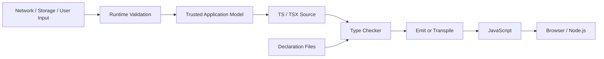
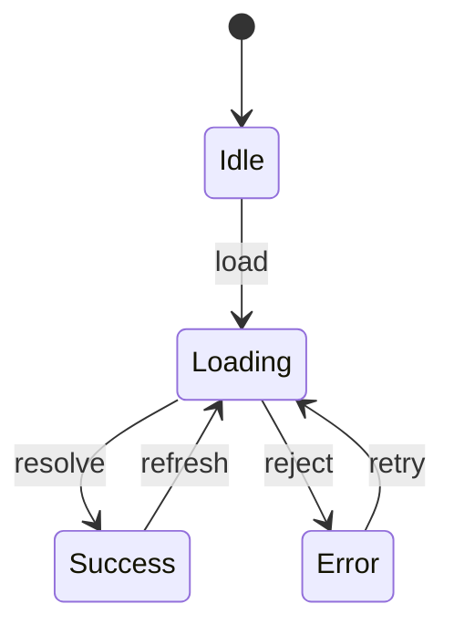
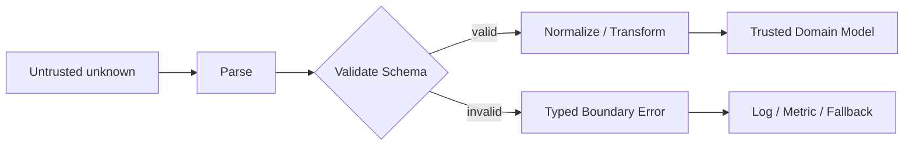

# TypeScript 类型系统：从结构类型、类型推断到 React 运行时边界

> TypeScript 能在编译期证明一部分程序性质，却不能证明来自网络、存储和用户输入的数据一定可信。生产级 React 工程的关键，不是写出最复杂的类型，而是让静态模型贴合业务状态，并在不可信边界完成运行时校验。

---

## 一、本文解决什么问题

React 项目中的类型问题往往不是“少写了一个接口”，而是边界和状态没有建模清楚：

- 一个对象字段更多，为什么仍能赋给字段更少的类型；
- 对象字面量会报多余属性，变量赋值却可能通过；
- 为什么 `as User` 不会把接口响应转换成 `User`；
- 联合类型为什么只能访问所有成员共有的属性；
- 如何用 Discriminated Union 消除 `loading && data && error` 之类的非法状态；
- 泛型何时能保留调用方信息，何时只是把 `any` 换了名字；
- 条件类型为什么会对联合类型分发，怎样关闭分发；
- `keyof`、Mapped Type 和 Template Literal Type 如何构造可维护的组件 API；
- 为什么函数参数方向和普通对象属性不同，React 回调又有哪些边界；
- `unknown`、`any`、`never` 分别表达什么；
- 类型守卫何时可信，断言函数写错为什么尤其危险；
- JSON、环境变量、URL 参数和浏览器存储如何进入可信类型域。

本文以 TypeScript 5.x、`strict: true` 和现代 React 函数组件为背景。TypeScript 会持续演进推断与标准库声明；涉及某个编译器版本、React 类型声明或第三方库时，应锁定版本并以 `tsc` 结果为准。

### 核心结论

1. TypeScript 是带有结构类型特征的静态类型检查器；类型主要描述可用成员和关系，而非运行时类身份。
2. 类型在发射 JavaScript 时通常被擦除，不能替代运行时校验、权限检查或业务约束。
3. 推断应优先于重复注解；边界、公共 API 和可能发生类型拓宽的位置才更需要显式类型。
4. Union 表示“可能是其中之一”，Intersection 表示“同时满足全部约束”；对象交叉不等于对象覆盖合并。
5. Discriminated Union 把状态与其有效数据绑定在一起，可从模型层消除大量非法 UI 状态。
6. 泛型的价值是保存输入与输出之间的类型关系；若类型参数只出现一次，往往不需要泛型。
7. Conditional、Mapped 和 Template Literal Type 适合从单一事实源派生类型，但递归和组合过深会损害错误信息与编译性能。
8. Narrowing 是控制流分析的结果；守卫只能证明当前分支，异步回调和可变对象可能使先前事实失效。
9. `unknown` 要求使用前证明，`any` 关闭检查，`never` 表示不可达或无成员的集合。
10. `as` 是对编译器的承诺，不是转换和验证；不可信数据应以 `unknown` 进入系统，经 Runtime Validation 后再使用。

---

## 二、TypeScript 在工程链路中的位置



编译器用源码和声明文件检查赋值、调用与控制流关系。运行时执行的是 JavaScript；接口、类型别名和大多数类型运算已经不存在。

这张图有两个关键边界：

- **静态边界**：`tsc` 只检查它能看到的声明是否自洽；声明本身可能错误。
- **运行时边界**：外部值必须先按真实结构校验，才能成为应用内部可信模型。

### 2.1 类型正确不等于程序正确

```typescript
function divide(total: number, count: number): number {
  return total / count;
}
```

类型无法自动表达 `count !== 0`、金额精度、访问权限或库存充足。类型系统可以减少状态空间，但测试、运行时检查和业务规则仍不可缺少。

### 2.2 推荐的严格配置

```json
{
  "compilerOptions": {
    "strict": true,
    "noUncheckedIndexedAccess": true,
    "exactOptionalPropertyTypes": true,
    "useUnknownInCatchVariables": true,
    "noImplicitOverride": true
  }
}
```

这些选项会暴露更多真实边界，但也可能要求迁移现有代码和第三方声明。应在 CI 中运行 `tsc --noEmit`；仅使用 Babel、SWC 或 esbuild 转译 TSX，通常不等于完成类型检查。

---

## 三、Structural Typing：结构决定兼容性

TypeScript 主要采用 Structural Typing（结构类型）：只要源值具备目标类型所要求的成员，并且成员类型兼容，通常就可以赋值。

```typescript
type UserSummary = {
  id: string;
  name: string;
};

const apiUser = {
  id: 'u-1',
  name: 'Ada',
  email: 'ada@example.com',
};

const summary: UserSummary = apiUser; // 合法：所需结构完整
```

这适合 JavaScript 的 Duck Typing 和组合式生态：函数只声明真正依赖的最小结构，调用方无需继承某个基类。

### 3.1 结构兼容不是运行时裁剪

`summary` 的静态类型看不到 `email`，运行时对象仍然有该属性。赋值不会创建新对象，也不会删除字段。

### 3.2 Excess Property Check 是额外检查

```typescript
type ButtonOptions = {
  label: string;
  disabled?: boolean;
};

renderButton({
  label: '提交',
  disabeld: true,
  //           ^ 对新鲜对象字面量进行多余属性检查
});

const options = { label: '提交', disabeld: true };
renderButton(options); // 结构上仍包含必需的 label，可能通过
```

Excess Property Check 用于尽早发现字面量拼写错误，不是“精确对象类型”。若业务必须拒绝额外字段，应在运行时 Schema 中配置相应策略。

### 3.3 需要名义区分时使用 Brand

相同底层结构不代表相同业务含义：

```typescript
declare const userIdBrand: unique symbol;
declare const orderIdBrand: unique symbol;

type UserId = string & { readonly [userIdBrand]: 'UserId' };
type OrderId = string & { readonly [orderIdBrand]: 'OrderId' };

function getUser(id: UserId) {
  // ...
}
```

Brand 只提供静态区分。创建 `UserId` 的工厂仍应验证格式；数据库和网络传输后也需要重新建立可信关系。

---

## 四、Type Inference：让编译器保留信息

Type Inference（类型推断）从初始化值、上下文、控制流和泛型调用中推导类型。高质量类型设计往往是“在边界注解，在内部推断”。

```typescript
const retryCount = 3; // 类型 3
let currentPage = 1;  // 通常拓宽为 number

const statuses = ['idle', 'loading'] as const;
// readonly ['idle', 'loading']
type Status = (typeof statuses)[number];
// 'idle' | 'loading'
```

`const` 变量不一定让整个对象变成字面量类型，因为对象属性仍可变：

```typescript
const config = { mode: 'dark' }; // mode 通常推断为 string

const fixedConfig = { mode: 'dark' } as const;
// readonly { readonly mode: 'dark' }
```

### 4.1 `satisfies`：检查约束但保留具体类型

```typescript
type RouteName = 'home' | 'settings';
type RouteConfig = { path: `/${string}`; requiresAuth: boolean };

const routes = {
  home: { path: '/', requiresAuth: false },
  settings: { path: '/settings', requiresAuth: true },
} satisfies Record<RouteName, RouteConfig>;

routes.settings.path; // 保留更具体的 '/settings'
```

类型注解 `: Record<...>` 可能把值观察为更宽的目标类型；`satisfies` 检查兼容性，同时尽量保留表达式自身推断结果。它仍不做运行时验证。

### 4.2 React 中利用上下文推断

```tsx
function SearchBox() {
  return (
    <input
      onChange={(event) => {
        console.log(event.currentTarget.value);
      }}
    />
  );
}
```

JSX 属性为回调提供 Contextual Typing，通常无需手写事件类型。抽离处理器、定义公共 Hook 返回值或跨模块暴露 API 时，再添加明确注解更有价值。

### 4.3 推断边界

导出函数可依赖推断，但公共库通常应显式声明返回类型，以防实现变化意外改变 API。递归函数、复杂高阶函数和空数组也可能需要注解：

```typescript
const users: UserSummary[] = []; // 避免空数组在不同上下文中产生非预期推断
```

---

## 五、Union 与 Intersection

### 5.1 Union：值属于多个候选之一

```typescript
type Identifier = string | number;

function normalizeId(id: Identifier): string {
  return typeof id === 'number' ? String(id) : id.trim();
}
```

在收窄前，只能使用所有联合成员都安全支持的操作。Union 不是“把所有属性合并到一个对象上”。

### 5.2 Intersection：同时满足多组约束

```typescript
type Timestamped = { createdAt: Date };
type Auditable = { createdBy: string };
type AuditRecord = Timestamped & Auditable;
```

若同名属性不兼容，交叉结果可能无法构造：

```typescript
type Impossible = { id: string } & { id: number };
// id 的类型为 string & number，即 never
```

因此 `A & B` 不等价于 JavaScript 的 `{ ...a, ...b }`。对象展开遇到同名键时后值覆盖前值，而类型交叉要求两者同时成立。

### 5.3 可选属性不等于显式 `undefined`

```typescript
type Preferences = {
  theme?: 'light' | 'dark';
};
```

`theme?` 首先表达属性可以不存在。在启用 `exactOptionalPropertyTypes` 后，`{ theme: undefined }` 不再自动等同于 `{}`；如果显式 `undefined` 合法，应写成 `theme?: 'light' | 'dark' | undefined`。

---

## 六、Discriminated Union：让 UI 状态不可错配

下面的模型允许 `loading: true`、`data` 和 `error` 同时存在，调用方必须猜测优先级：

```typescript
// 错误建模：可以表示许多非法组合。
type UserState = {
  loading: boolean;
  data?: UserSummary;
  error?: string;
};
```

用稳定的字面量字段作为 Discriminant（判别字段）：

```typescript
type UserState =
  | { status: 'idle' }
  | { status: 'loading' }
  | { status: 'success'; data: UserSummary }
  | { status: 'error'; message: string; retryable: boolean };

function UserPanel({ state }: { state: UserState }) {
  switch (state.status) {
    case 'idle':
      return <p>尚未加载</p>;
    case 'loading':
      return <p>加载中</p>;
    case 'success':
      return <p>{state.data.name}</p>;
    case 'error':
      return <button disabled={!state.retryable}>重试</button>;
    default:
      return assertNever(state);
  }
}

function assertNever(value: never): never {
  throw new Error(`Unexpected state: ${JSON.stringify(value)}`);
}
```



图中的每条边应由明确事件触发。若业务需要“旧数据可见且后台刷新”，应新增 `{ status: 'refreshing'; data: UserSummary }`，而不是复用 `loading` 并靠可选字段猜测。

### 6.1 穷尽检查的价值

以后新增 `cancelled` 状态而未修改 `switch` 时，`state` 不再能赋给 `never`，编译器会指出遗漏。运行时 `throw` 仍有必要，因为外部数据、旧缓存或类型断言可能破坏静态假设。

---

## 七、Generic：保存类型之间的关系

泛型不是“未知类型的占位符”这么简单，它表达调用前未知、调用后由实参确定的关系。

```typescript
function first<T>(items: readonly T[]): T | undefined {
  return items[0];
}

const firstName = first(['Ada', 'Lin']); // string | undefined
```

若写成 `unknown[] -> unknown`，输入与输出的关系丢失；若写成 `any`，检查被绕过。

### 7.1 Constraint：只要求真正需要的能力

```typescript
function indexById<T extends { id: PropertyKey }>(
  items: readonly T[],
): Map<T['id'], T> {
  return new Map(items.map((item) => [item.id, item]));
}
```

约束允许函数读取 `id`，同时保留每个具体对象的其他字段。

### 7.2 `keyof` 建立键和值的关系

```typescript
function getProperty<T, K extends keyof T>(object: T, key: K): T[K] {
  return object[key];
}

const user = { id: 'u-1', active: true };
const active = getProperty(user, 'active'); // boolean
```

### 7.3 React 泛型组件

```tsx
type SelectProps<T> = {
  items: readonly T[];
  getKey: (item: T) => React.Key;
  getLabel: (item: T) => string;
  value: T | null;
  onChange: (value: T) => void;
};

function Select<T>({
  items,
  getKey,
  getLabel,
  value,
  onChange,
}: SelectProps<T>) {
  return (
    <ul aria-label="选择项目">
      {items.map((item) => (
        <li key={getKey(item)}>
          <button
            type="button"
            aria-pressed={Object.is(item, value)}
            onClick={() => onChange(item)}
          >
            {getLabel(item)}
          </button>
        </li>
      ))}
    </ul>
  );
}
```

`T` 贯穿数据、渲染和回调，避免调用方再做断言。真实组件还要定义键的稳定性、受控状态、键盘交互和可访问性语义。

### 7.4 泛型常见误用

```typescript
// T 只用于返回值，调用方可以要求一个函数无法保证的类型。
function parseUnsafe<T>(text: string): T {
  return JSON.parse(text) as T;
}
```

这不是推断，而是把证明责任隐藏起来。正确入口应返回 `unknown`，再由 Schema 或守卫验证。

---

## 八、Conditional Type：在类型层做分支

```typescript
type ApiResult<T> = T extends Error
  ? { ok: false; error: T }
  : { ok: true; data: T };
```

Conditional Type 形式为 `T extends U ? X : Y`。这里的 `extends` 表示可赋值关系，不一定是类继承。

### 8.1 使用 `infer` 提取类型

```typescript
type AwaitedValue<T> = T extends PromiseLike<infer U>
  ? AwaitedValue<U>
  : T;

type UserValue = AwaitedValue<Promise<Promise<UserSummary>>>;
// UserSummary
```

工程代码应优先使用标准库已有的 `Awaited<T>`、`ReturnType<T>` 等工具类型，避免重复实现且遗漏边界。

### 8.2 联合类型的分发

当检查对象是裸类型参数时，条件类型会对联合成员分别计算：

```typescript
type ToArray<T> = T extends unknown ? T[] : never;
type Distributed = ToArray<string | number>;
// string[] | number[]
```

用元组包裹两侧可关闭分发：

```typescript
type ToArrayTogether<T> = [T] extends [unknown] ? T[] : never;
type Together = ToArrayTogether<string | number>;
// (string | number)[]
```

条件类型适合库和领域模型派生。若一条错误信息需要展开多层递归才能理解，应考虑拆分命名类型或直接声明公共 API。

---

## 九、Mapped Type：从已有键集合派生结构

```typescript
type FormErrors<T> = {
  [K in keyof T]?: string;
};

type ProfileForm = {
  name: string;
  email: string;
};

type ProfileErrors = FormErrors<ProfileForm>;
// { name?: string; email?: string }
```

Mapped Type 遍历 `PropertyKey` 的联合，能添加或移除 `readonly`、可选修饰符，也能通过 `as` 重映射键。

```typescript
type MutableRequired<T> = {
  -readonly [K in keyof T]-?: T[K];
};

type ChangeHandlers<T> = {
  [K in keyof T as `on${Capitalize<string & K>}Change`]:
    (value: T[K]) => void;
};
```

对于 `ProfileForm`，第二个类型产生 `onNameChange` 和 `onEmailChange`。这能让表单字段与回调名称来自同一个事实源。

### 9.1 工具类型不是深层转换

`Partial<T>`、`Readonly<T>` 默认只作用一层：

```typescript
type Settings = {
  profile: { nickname: string };
};

const settings: Readonly<Settings> = {
  profile: { nickname: 'Ada' },
};

settings.profile.nickname = 'Lin'; // 允许：嵌套对象没有变成 readonly
```

递归 `DeepReadonly` 要处理函数、数组、Map、Set、内建对象和递归深度，不能把几行示例直接当成通用生产实现。

---

## 十、Template Literal Type：约束字符串协议

Template Literal Type 可组合有限字符串集合：

```typescript
type Entity = 'user' | 'order';
type EventAction = 'created' | 'updated' | 'deleted';
type DomainEvent = `${Entity}.${EventAction}`;

function publish(event: DomainEvent): void {
  // ...
}

publish('user.updated');
// publish('users.update'); // 编译错误
```

与 Mapped Type 结合，可从字段生成事件：

```typescript
type Watched<T extends object> = {
  on<K extends string & keyof T>(
    event: `${K}Changed`,
    listener: (value: T[K]) => void,
  ): () => void;
};
```

### 10.1 适用边界

它适合路由名、事件名、CSS Token 和受控协议。不要试图用类型系统完整解析任意 URL、SQL 或复杂表达式；联合组合过大会增加编译器工作量，也让错误信息失去可读性。外部字符串仍需运行时解析。

---

## 十一、Type Narrowing 与类型守卫

Narrowing（类型收窄）是编译器根据控制流，把宽类型缩小到当前分支可成立的类型。

```typescript
function formatError(error: unknown): string {
  if (error instanceof Error) {
    return error.message;
  }

  if (typeof error === 'string') {
    return error;
  }

  return 'Unknown error';
}
```

常见收窄依据包括：

- `typeof`；
- `instanceof`；
- `in`；
- 相等性判断；
- 真值判断；
- 判别字段；
- 用户定义类型守卫；
- 断言函数和可达性分析。

### 11.1 不要用真值检查误删合法值

```typescript
function renderCount(count: number | null) {
  if (count) {
    return String(count);
  }
  return '暂无';
}
```

`0` 会走到“暂无”。应根据业务语义显式判断：

```typescript
if (count !== null) {
  return String(count);
}
```

### 11.2 用户定义类型守卫承担证明责任

```typescript
function isUserSummary(value: unknown): value is UserSummary {
  if (typeof value !== 'object' || value === null) return false;

  const record = value as Record<string, unknown>;
  return typeof record.id === 'string'
    && typeof record.name === 'string';
}
```

谓词 `value is UserSummary` 不会被编译器验证实现是否完整。漏检字段时，编译器仍会相信它，因此守卫应集中管理并配套正例、反例和模糊测试。

### 11.3 Assertion Function

```typescript
function assertUserSummary(value: unknown): asserts value is UserSummary {
  if (!isUserSummary(value)) {
    throw new TypeError('Invalid user payload');
  }
}
```

返回后，调用方把值视为 `UserSummary`；失败路径必须抛错或不返回。它适合系统入口和不变量检查，不适合把普通业务失败伪装成程序异常。

### 11.4 收窄可能被失效

可变对象可能在回调执行前变化。稳妥方式是收窄后复制局部不可变值，或让 API 使用不可变数据：

```typescript
function scheduleEmail(model: { email?: string }) {
  if (model.email === undefined) return;

  const email = model.email;
  queueMicrotask(() => sendEmail(email));
}
```

---

## 十二、Variance：函数和容器的方向关系

Variance（型变）描述：当 `Dog` 可赋给 `Animal` 时，`Container<Dog>` 与 `Container<Animal>` 是否也存在某种可赋值关系。

```typescript
type Producer<T> = () => T;
type Consumer<T> = (value: T) => void;
```

- Producer 只输出 `T`，直觉上是 Covariant（协变）；
- Consumer 只输入 `T`，在 `strictFunctionTypes` 下直觉上是 Contravariant（逆变）；
- 同时读写 `T` 的可变容器通常应谨慎视为 Invariant（不变）。

```typescript
class Animal { name = ''; }
class Dog extends Animal { bark() {} }

let produceAnimal: Producer<Animal>;
const produceDog: Producer<Dog> = () => new Dog();
produceAnimal = produceDog; // 安全：Dog 一定是 Animal

let consumeDog: Consumer<Dog>;
const consumeAnimal: Consumer<Animal> = (animal) => {
  console.log(animal.name);
};
consumeDog = consumeAnimal; // 安全：能处理任意 Animal，自然能处理 Dog
```

反方向不安全：只会处理 `Dog` 的函数不能承诺处理所有 `Animal`。

### 12.1 方法与回调属性的边界

TypeScript 为兼容既有 JavaScript/DOM 模式，对某些方法参数保留较宽松的行为；函数属性在 `strictFunctionTypes` 下通常更严格。设计 React Props 时优先写回调属性：

```typescript
type ItemProps = {
  onSelect: (item: Animal) => void;
};
```

不要仅靠“双变技巧”扩大回调兼容性。React 类型声明或第三方库可能为易用性采用特殊声明；具体行为应以当前依赖版本的 `.d.ts` 和类型测试为准。

### 12.2 数组可变性

接收只读输入能放宽安全复用：

```typescript
function namesOf(items: readonly Animal[]): string[] {
  return items.map((item) => item.name);
}
```

函数无需修改数组，就不应要求可变 `Animal[]`。`readonly` 只限制当前引用提供的写操作，不代表运行时深冻结。

---

## 十三、`unknown`、`any` 与 `never`

| 类型 | 含义 | 使用限制 | 典型场景 |
|---|---|---|---|
| `unknown` | 值存在但类型尚未证明 | 收窄前不能随意读写或调用 | 外部输入、捕获错误 |
| `any` | 退出大部分类型检查 | 可传播并污染后续推断 | 渐进迁移、错误声明的隔离层 |
| `never` | 不可能出现的值 | 可赋给任意类型，没有实际值 | 穷尽检查、必定抛错函数 |

### 13.1 `unknown` 是边界默认值

```typescript
function parseJson(text: string): unknown {
  return JSON.parse(text);
}
```

注意：标准库中 `JSON.parse` 的历史声明返回 `any`。在应用边界包一层返回 `unknown`，可阻止未经检查的数据进入业务层。

### 13.2 `any` 会双向逃逸

```typescript
declare const payload: any;
const user: UserSummary = payload;
user.name.toUpperCase(); // 编译通过，运行时仍可能失败
```

无法立刻移除 `any` 时，应把它限制在适配器内部，立即转成 `unknown` 并验证，同时用 ESLint 规则和迁移指标治理。

### 13.3 `never` 与 `void` 不同

`void` 表示调用方不使用返回值；函数仍可能正常返回。`never` 表示函数无法正常完成或分支不可到达：

```typescript
function fail(message: string): never {
  throw new Error(message);
}
```

---

## 十四、类型断言的边界

### 14.1 `as` 不做任何转换

```typescript
const user = responseBody as UserSummary;
```

这段代码不会重命名字段、解析日期、填充默认值或检查属性。它只要求编译器按 `UserSummary` 检查后续代码。

### 14.2 双重断言是高风险逃生口

```typescript
const order = value as unknown as Order;
```

双重断言能跨越本来不兼容的类型，通常说明声明错误、模型不匹配或边界缺少解析器。若确实用于兼容第三方缺陷，应封装在小型 Adapter 中，链接上游问题，并用运行时检查和测试保护。

### 14.3 非空断言也需要证据

```tsx
const inputRef = useRef<HTMLInputElement>(null);

function focusInput() {
  inputRef.current!.focus();
}
```

组件可能尚未挂载或已经卸载。更稳妥的写法是：

```tsx
function focusInput() {
  inputRef.current?.focus();
}
```

只有当控制流或框架契约确实保证非空，且该保证无法被编译器表达时，才使用 `!`。

### 14.4 DOM 查询的限制

```typescript
const dialog = document.querySelector<HTMLDialogElement>('#confirm');
```

泛型参数只影响静态返回类型，浏览器不会验证选中的元素确实是 `HTMLDialogElement`。跨团队页面或动态 DOM 应使用 `instanceof HTMLDialogElement` 检查。

---

## 十五、Runtime Validation：建立可信数据边界

所有穿过 I/O 边界的数据都应视为 `unknown`：

- HTTP 与 WebSocket 响应；
- `localStorage`、IndexedDB 和旧版本缓存；
- URL 参数、表单和剪贴板；
- 环境变量和远程配置；
- `postMessage`、Worker 与第三方 SDK；
- SSR 注水数据和 Server Action 输入。



解析只解决语法，校验确认结构，Normalize 处理日期、默认值和领域转换。任何失败都应停留在边界，不要让半可信对象扩散到组件树。

### 15.1 无依赖的最小解析器

```typescript
type ParseResult<T> =
  | { success: true; data: T }
  | { success: false; issues: readonly string[] };

function parseUserSummary(value: unknown): ParseResult<UserSummary> {
  if (typeof value !== 'object' || value === null) {
    return { success: false, issues: ['payload must be an object'] };
  }

  const record = value as Record<string, unknown>;
  const issues: string[] = [];

  if (typeof record.id !== 'string') issues.push('id must be a string');
  if (typeof record.name !== 'string') issues.push('name must be a string');

  if (issues.length > 0) {
    return { success: false, issues };
  }

  return {
    success: true,
    data: { id: record.id as string, name: record.name as string },
  };
}
```

最后两个局部断言由同一函数刚完成的检查支撑。大型模型更适合成熟 Schema 库，以获得嵌套路径、组合、转换和类型推导，但应评估 Bundle、性能、错误格式和版本策略。

### 15.2 React 请求边界

```typescript
async function fetchUser(
  userId: string,
  signal: AbortSignal,
): Promise<UserSummary> {
  const response = await fetch(`/api/users/${encodeURIComponent(userId)}`, {
    signal,
  });

  if (!response.ok) {
    throw new Error(`HTTP ${response.status}`);
  }

  const payload: unknown = await response.json();
  const result = parseUserSummary(payload);

  if (!result.success) {
    throw new TypeError(`Invalid user payload: ${result.issues.join(', ')}`);
  }

  return result.data;
}
```

请求层还应区分网络、HTTP、解析、Schema 和业务错误，并结合 Abort、超时和请求新鲜度治理异步竞态。不要记录令牌、完整个人信息或不受控的原始响应。

### 15.3 静态类型与 Schema 的单一事实源

常见策略有两种：

| 策略 | 收益 | 代价 |
|---|---|---|
| Schema 推导 TypeScript 类型 | 运行时与静态模型更易同步 | 领域模型受 Schema 库表达能力影响 |
| 独立领域类型 + 边界映射 | 领域层解耦，适合复杂转换 | 需测试保证 Schema、DTO 与模型同步 |

OpenAPI/GraphQL 代码生成只能说明客户端声明与契约文件一致，不能证明服务端实际响应一定符合契约。高风险边界仍应校验或通过契约测试验证。

---

## 十六、React 工程中的类型设计

### 16.1 Props 应表达有效组合

布尔参数容易产生冲突：

```typescript
// 错误：primary 和 danger 可以同时为 true。
type ButtonProps = {
  primary?: boolean;
  danger?: boolean;
};
```

用有限 Variant：

```typescript
type ButtonProps = {
  variant: 'primary' | 'danger' | 'ghost';
  disabled?: boolean;
  onPress: () => void;
  children: React.ReactNode;
};
```

对互斥交互模式，可直接使用联合：

```typescript
type ActionProps =
  | { kind: 'button'; onPress: () => void; href?: never }
  | { kind: 'link'; href: string; onPress?: never };
```

### 16.2 派生状态不要复制

如果一个状态能由其他状态计算，应在 Render 中推导，而不是建立两个可能不一致的类型正确变量。类型系统可以约束每个变量，却无法自动保证多个 State 始终同步。

### 16.3 Context 不应伪造默认值

```tsx
type AuthContextValue = {
  user: UserSummary;
  signOut: () => Promise<void>;
};

const AuthContext = createContext<AuthContextValue | null>(null);

function useAuth(): AuthContextValue {
  const value = useContext(AuthContext);
  if (value === null) {
    throw new Error('useAuth must be used within AuthProvider');
  }
  return value;
}
```

使用 `{ } as AuthContextValue` 会隐藏 Provider 缺失，并把错误推迟到更远的运行时位置。

### 16.4 `useState` 的空值模型

```tsx
const [selectedUser, setSelectedUser] = useState<UserSummary | null>(null);
```

`null` 必须具有明确语义，例如“尚未选择”。若还要表达加载、失败和刷新，应升级为判别联合，而不是继续叠加 `undefined` 和布尔值。

### 16.5 Reducer 用 Action 联合封闭状态转换

```typescript
type SearchAction =
  | { type: 'requested'; query: string }
  | { type: 'succeeded'; query: string; users: readonly UserSummary[] }
  | { type: 'failed'; query: string; message: string };

function searchReducer(state: SearchState, action: SearchAction): SearchState {
  switch (action.type) {
    case 'requested':
      return { status: 'loading', query: action.query };
    case 'succeeded':
      return { status: 'success', query: action.query, users: action.users };
    case 'failed':
      return { status: 'error', query: action.query, message: action.message };
    default:
      return assertNever(action);
  }
}
```

Reducer 类型能保证每个 Action 携带所需字段；异步层仍需保证旧 Query 的结果不派发或被 Reducer 拒绝。

---

## 十七、常见误区与错误案例

### 17.1 误区：类型通过，接口数据就安全

声明文件和 `as` 都不会检查运行时响应。外部输入必须作为 `unknown` 校验。

### 17.2 误区：类型越复杂，设计越高级

复杂类型会增加实例化成本、编辑器延迟和维护门槛。只在它能消除真实非法状态或重复声明时使用。

### 17.3 误区：Intersection 就是对象合并

Intersection 描述同时满足，Spread 描述运行时复制与覆盖。两者的同名属性语义不同。

### 17.4 误区：`as const` 会冻结对象

它影响静态推断，不调用 `Object.freeze`，也不递归保护运行时对象。

### 17.5 误区：类型守卫由编译器验证

编译器信任谓词签名。守卫实现遗漏字段仍可通过编译，所以边界解析器必须测试。

### 17.6 错误案例：用索引签名掩盖拼写错误

```typescript
type LooseProps = {
  title: string;
  [key: string]: unknown;
};
```

宽泛索引签名会允许任意键。若只需要 `data-*` 属性，应建模特定模板键，或复用 React 对应元素 Props，而不是放开整个字符串空间。

### 17.7 错误案例：用 `Partial` 表示 Patch 却未定义语义

`Partial<User>` 无法说明 `undefined` 是忽略、清空还是非法，也无法表达不可修改的 `id`。应按 API 契约定义专用 DTO：

```typescript
type UpdateProfileInput = {
  displayName?: string;
  avatarUrl?: string | null; // null 明确表示删除头像
};
```

---

## 十八、测试、性能与验证方法

### 18.1 静态类型测试

为公共类型 API 编写正例和反例，并在 CI 固定 TypeScript 版本：

```typescript
publish('user.created');

// @ts-expect-error 非法事件名必须被拒绝
publish('users.create');
```

`@ts-expect-error` 在错误消失时会反向报错，适合验证拒绝路径；不要把 `@ts-ignore` 当作长期修复。库项目可使用专门的类型测试工具，但仍应保留运行时测试。

### 18.2 Runtime Validator 测试

至少覆盖：

- 合法最小对象和完整对象；
- 缺失字段、错误类型、`null`、数组与嵌套错误；
- 额外字段策略；
- 极大输入、深层输入和恶意字符串；
- 旧版本缓存与 Schema 迁移；
- 错误信息是否泄露敏感数据。

### 18.3 编译性能先测量

类型只在开发和构建期工作，通常不会直接拖慢浏览器运行时；但复杂类型可能拖慢 `tsc` 和编辑器。

可使用：

```bash
pnpm exec tsc --noEmit --extendedDiagnostics
```

关注 Check time、Instantiations、Memory used，并在同一 TypeScript 版本、机器和冷/热缓存条件下比较。进一步定位可生成编译器 Trace；不要仅凭“用了条件类型”推断根因。

常见治理方式包括拆分巨型联合、给中间结果命名、限制递归深度、避免对大联合做笛卡尔式模板组合，以及隔离有问题的第三方声明。`skipLibCheck` 能缩短部分检查，但会放弃声明文件间的一部分验证，不应被描述为无代价优化。

### 18.4 React 验证仍以行为为准

Props 和状态类型不能证明组件真的可访问、Effect 已清理、请求没有竞态或 Render 性能达标。需要结合组件测试、集成测试、可访问性测试、React Profiler 与目标设备浏览器性能分析。

---

## 十九、工程方案选择

| 问题 | 优先方案 | 不适合的替代 |
|---|---|---|
| 有限 UI 状态 | Discriminated Union | 多个可冲突布尔值 |
| 外部 JSON | `unknown` + Runtime Schema | 直接 `as Model` |
| 配置既需校验又需保留字面量 | `satisfies` | 无目的的双重断言 |
| 函数只读取集合 | `readonly T[]` | 强制要求可变数组 |
| 字段派生回调 | Mapped + Template Literal Type | 手写重复且易漂移的键 |
| 公共泛型组件 | 用类型参数连接输入与输出 | 暴露 `any` 或无关系泛型 |
| 业务 ID 防混用 | 校验工厂 + Brand | 裸字符串到处传递 |
| 类型编译变慢 | Diagnostics/Trace 后简化 | 盲目关闭所有检查 |

选择标准不是“能不能用类型技巧实现”，而是它是否减少非法状态、是否给调用方提供清晰错误、是否可由团队长期维护。

---

## 二十、总结

真正值得记住的不是工具类型清单，而是一条从不可信值到可信模型的证明链：

1. TypeScript 以结构兼容为主，描述的是静态关系，不是运行时身份。
2. 推断能保留局部事实；公共边界和拓宽位置需要有意识地注解。
3. Union、Intersection 和 Discriminated Union 分别建模候选、共同约束与封闭状态。
4. Generic 保存类型间关系，Conditional、Mapped 和 Template Literal Type 从既有事实派生新类型。
5. 控制流收窄需要可靠证据；用户守卫和断言函数本身必须接受测试。
6. 型变决定回调与容器的安全赋值方向，`readonly` 能减少不必要的写能力。
7. `unknown` 代表待证明，`any` 代表退出检查，`never` 支撑不可达与穷尽性。
8. 类型断言不会改变运行时值，只应位于证据充分、范围很小的适配层。
9. 网络、存储和用户输入必须经过 Parse、Validate 与 Normalize，才能进入领域模型。
10. React 中最有效的类型设计，是让 Props、State、Action 与组件生命周期的有效组合直接可见。

类型系统的目标不是让所有代码看起来“很强”，而是让错误尽可能靠近产生位置，并把剩余运行时风险集中在可观察、可测试的边界。

---

## 问答复盘

### Q1：TypeScript 的结构类型是否意味着两个相同字段的业务 ID 可以安全混用？

**答：** 不意味着。结构兼容只说明形状可赋值，不说明业务语义相同。关键 ID 可通过校验工厂和 Brand 静态区分，但运行时边界仍要重新验证。

### Q2：为什么对象字面量多一个字段会报错，先赋给变量再传入却可能通过？

**答：** 新鲜对象字面量会触发 Excess Property Check，用于发现常见拼写错误；一般变量按结构兼容规则检查。这不代表目标类型是运行时精确对象。

### Q3：`satisfies`、类型注解和 `as` 有什么区别？

**答：** `satisfies` 检查约束并尽量保留表达式的具体推断；类型注解让变量按声明类型观察；`as` 是调用方承担责任的断言。三者都不做运行时校验。

### Q4：为什么 `A & B` 不能理解成 `{ ...a, ...b }`？

**答：** 交叉类型要求一个值同时满足 A 和 B，同名冲突可能得到 `never`；对象展开在运行时按顺序覆盖同名属性，两者语义不同。

### Q5：泛型函数的类型参数只出现在返回值中有什么风险？

**答：** 它通常没有从输入获得证据，调用方可请求实现无法保证的类型。JSON 解析应返回 `unknown`，验证后再得到具体模型。

### Q6：用户定义类型守卫是否比类型断言安全？

**答：** 只有实现正确并经过测试时更安全。编译器信任 `value is T`，不会证明检查逻辑完整；错误守卫同样会制造虚假确定性。

### Q7：React 异步请求已经声明返回 `Promise<User>`，还需要校验响应吗？

**答：** 需要。返回类型只描述函数对调用方的静态承诺，服务端、缓存或代理仍可能返回不符合契约的数据。应在请求边界把 JSON 当作 `unknown` 校验，并处理 Abort 和过期结果。

### Q8：为什么用 Discriminated Union 比多个布尔状态更可靠？

**答：** 每个状态只携带该状态合法的数据，非法组合无法构造；`switch` 配合 `never` 还能在新增状态时提醒所有遗漏分支。

### Q9：复杂类型会影响 React 页面的运行时性能吗？

**答：** 类型通常在发射时擦除，不直接增加浏览器运行成本，但可能降低 `tsc` 和编辑器性能。应通过 `--extendedDiagnostics` 或 Trace 测量，运行时性能仍用 React Profiler 和浏览器工具验证。

---

## 延伸知识

- **React 声明式 UI**：Props、State、Component Identity 与受控组件如何建模。
- **UI 状态机**：从判别联合继续演进到事件、转换、Effect 与并发状态。
- **Hooks 运行机制**：闭包快照、依赖关系与 TypeScript 无法自动证明的生命周期问题。
- **API 契约治理**：OpenAPI、GraphQL Code Generation、契约测试与 Schema 演进。
- **类型声明工程**：Declaration File、Module Augmentation、Package Exports 与版本兼容。
- **测试体系**：静态类型测试、Property-based Testing 与边界模糊测试。
