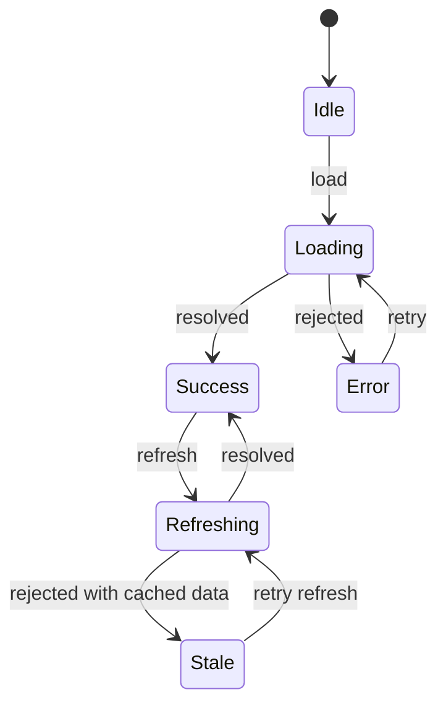
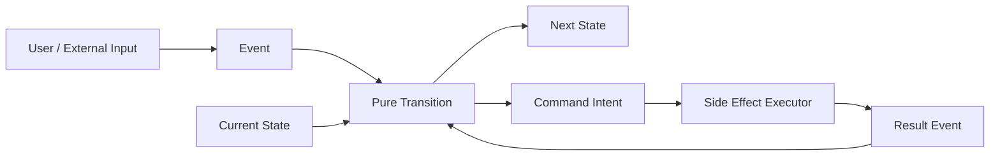
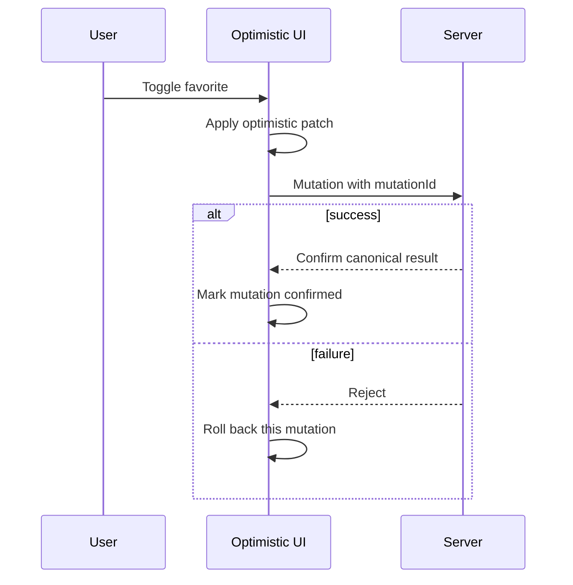

# React UI 状态机：从判别联合到乐观更新与回滚

> UI 状态机的价值不是把所有组件都改造成复杂 FSM，而是明确当前允许哪些状态、哪些事件能触发转换，以及副作用结果如何返回系统。模型正确后，Loading、Error、Refreshing 和 Optimistic UI 不再依赖互相冲突的 Boolean。

---

## 一、本文解决什么问题

- `loading`、`data`、`error` 为什么容易同时出现；
- Idle、Loading、Success、Error 应如何建模；
- 已有旧数据时刷新，是否应该退回全屏 Loading；
- Stale 与 Refreshing 有什么区别；
- Discriminated Union 如何消除非法状态；
- State、Event、Command 与 Side Effect 各自承担什么职责；
- Reducer 为什么必须保持纯净；
- 请求取消、竞态和过期结果如何进入状态机；
- Optimistic State 如何与服务器权威结果合并；
- 多个并发乐观操作失败时如何精确 Rollback；
- Error Boundary 与业务 Error State 有何区别；
- 状态机何时应使用库，何时普通 Reducer 足够。

本文以现代 React、TypeScript 与 `useReducer` 为主。状态机原则不依赖具体库；请求缓存、Router Action、Server Action 和乐观 API 随框架版本变化，应按项目依赖验证。网络写入仍需服务端授权、幂等、版本控制和一致性保障。

### 核心结论

1. UI State 应描述当前完整事实，而不是一组可以互相冲突的 Boolean。
2. Idle、Loading、Success、Error 是基础状态；有旧数据时通常还要区分 Stale 与 Refreshing。
3. Discriminated Union 把每种状态与其合法数据绑定，使非法组合难以构造。
4. 状态转换应是纯函数：`Next State = transition(Current State, Event)`。
5. Event 描述已经发生的事实，Command 描述希望外部系统执行的动作，两者不能混为一谈。
6. 网络、Timer、订阅和存储属于 Side Effect，不能在 Reducer 中执行。
7. 异步结果必须携带 Request ID、Generation 或业务版本，防止过期 Event 覆盖新状态。
8. Optimistic State 是客户端暂定投影，不是服务器已经成功的证明。
9. Rollback 应针对具体 Mutation，并与其他并发 Mutation、服务器确认和缓存失效协调。
10. 状态机复杂度应与业务风险匹配，简单局部 Toggle 不需要引入完整状态机框架。

---

## 二、多个 Boolean 为什么会制造非法状态

```typescript
type UserListState = {
  loading: boolean;
  data?: readonly User[];
  error?: string;
};
```

这个类型允许：

- `loading: true` 同时有 `error`；
- `loading: false` 却没有 `data` 和 `error`；
- `data` 与 `error` 同时存在，但不知道错误是首次加载还是后台刷新；
- 旧数据存在时刷新，被错误地清空成 Loading。

组件只能约定隐式优先级：

```tsx
if (loading) return <Spinner />;
if (error) return <ErrorMessage message={error} />;
if (data) return <UserList users={data} />;
return null;
```

当状态字段由不同 Effect 或回调分别修改，组合很容易漂移。

### 2.1 状态机先限定状态空间



图中每个节点代表一个完整状态，每条边代表允许的事件。没有画出的转换默认不应发生，或必须明确定义处理策略。

---

## 三、Idle、Loading、Success 与 Error

```typescript
type LoadState<T> =
  | { status: 'idle' }
  | { status: 'loading'; requestId: string }
  | { status: 'success'; data: T; receivedAt: number }
  | { status: 'error'; error: LoadError; retryable: boolean };

type LoadError =
  | { kind: 'network'; message: string }
  | { kind: 'http'; status: number; message: string }
  | { kind: 'validation'; message: string }
  | { kind: 'business'; code: string; message: string };
```

### 3.1 Idle

Idle 表示尚未启动，而不是“加载完成但无数据”。它适合等待用户输入、按需加载或尚未满足前置条件。

### 3.2 Loading

Loading 通常用于没有可展示旧数据的首次请求。是否显示 Skeleton、Spinner 或保持布局，应根据内容结构和可访问性设计。

### 3.3 Success

Success 可以携带空数组。Empty 是成功数据的一种业务结果，不应自动等同于 Error：

```tsx
if (state.status === 'success' && state.data.length === 0) {
  return <EmptyState />;
}
```

### 3.4 Error

Error State 应保存可展示、可恢复的信息，而不是随意把原始异常和服务器响应塞进 UI。日志层可记录安全的 Trace ID 与错误分类，避免暴露 Token、PII 和内部堆栈。

### 3.5 Error Boundary 的边界

Error Boundary 处理 Render/Lifecycle 中未捕获的程序异常，不替代请求失败、表单错误和业务拒绝。这些预期失败应进入显式 UI State。

---

## 四、Stale 与 Refreshing

已有数据后再次请求，不应总是退回全屏 Loading：

```typescript
type ResourceState<T> =
  | { status: 'idle' }
  | { status: 'loading'; requestId: string }
  | { status: 'success'; data: T; receivedAt: number }
  | { status: 'refreshing'; data: T; requestId: string; receivedAt: number }
  | { status: 'stale'; data: T; error: LoadError; receivedAt: number }
  | { status: 'error'; error: LoadError; retryable: boolean };
```

- **Refreshing**：展示旧数据，同时后台请求新数据；
- **Stale**：旧数据仍可用，但刷新失败或超过新鲜度策略；
- **Loading**：没有可用数据，必须等待首次结果；
- **Error**：没有可展示数据，首次或关键请求失败。

```tsx
function UsersPanel({ state }: { state: ResourceState<readonly User[]> }) {
  if (state.status === 'idle' || state.status === 'loading') {
    return <UsersSkeleton />;
  }

  if (state.status === 'error') {
    return <ErrorPanel error={state.error} />;
  }

  return (
    <section aria-busy={state.status === 'refreshing'}>
      {state.status === 'stale' && <InlineWarning error={state.error} />}
      <UserList users={state.data} />
    </section>
  );
}
```

### 4.1 Stale 是策略，不是绝对时间

数据多久算 Stale 取决于业务：股票报价、权限、产品描述和静态字典的容忍度不同。客户端时间也可能不准，强一致判断应由服务端版本或协议保障。

### 4.2 Stale-while-revalidate

先展示缓存，再后台刷新能改善感知性能，但必须让用户知道关键数据是否过期，并处理刷新错误。金融、库存和权限场景不能无提示使用陈旧数据执行写操作。

---

## 五、Discriminated Union：让非法状态不可构造

判别字段 `status` 让 TypeScript 自动 Narrow：

```tsx
function ResourceView<T>({
  state,
  renderData,
}: {
  state: ResourceState<T>;
  renderData: (data: T) => React.ReactNode;
}) {
  switch (state.status) {
    case 'idle':
      return <p>等待加载</p>;
    case 'loading':
      return <p>加载中</p>;
    case 'success':
    case 'refreshing':
      return <>{renderData(state.data)}</>;
    case 'stale':
      return <><InlineWarning error={state.error} />{renderData(state.data)}</>;
    case 'error':
      return <ErrorPanel error={state.error} />;
    default:
      return assertNever(state);
  }
}

function assertNever(value: never): never {
  throw new Error(`Unexpected state: ${JSON.stringify(value)}`);
}
```

新增状态后，遗漏分支会在编译期暴露。运行时 `throw` 仍有意义，因为缓存、外部输入或错误断言可能破坏静态假设。

### 5.1 不要过度合并状态

若 `success` 与 `refreshing` 在 UI、可交互性或请求生命周期上有不同语义，就应保留不同状态；如果完全没有行为差异，额外状态只会增加分支。模型应服务业务决策。

---

## 六、State、Event、Command 与 Side Effect



### 6.1 State

State 是当前可观察事实，例如“正在刷新 request-2，仍展示旧数据”。

### 6.2 Event

Event 描述已发生的事实，使用过去式或领域语义更清晰：

```typescript
type ResourceEvent<T> =
  | { type: 'loadRequested'; requestId: string }
  | { type: 'loadSucceeded'; requestId: string; data: T; receivedAt: number }
  | { type: 'loadFailed'; requestId: string; error: LoadError }
  | { type: 'reset' };
```

### 6.3 Command

Command 描述希望外部系统执行的动作，例如 `fetchUsers`、`saveDraft`、`startTimer`。Command 可能失败、取消或重复，不能当成已经发生的 Event。

### 6.4 Side Effect

网络、Timer、Storage、Analytics、订阅和 DOM 命令都属于 Side Effect。Reducer 不能执行这些操作，因为 Render 和 Reducer 可能重放。

---

## 七、纯状态转换

```typescript
function resourceReducer<T>(
  state: ResourceState<T>,
  event: ResourceEvent<T>,
): ResourceState<T> {
  switch (event.type) {
    case 'loadRequested':
      if (state.status === 'success' || state.status === 'stale') {
        return {
          status: 'refreshing',
          data: state.data,
          receivedAt: state.receivedAt,
          requestId: event.requestId,
        };
      }
      return { status: 'loading', requestId: event.requestId };

    case 'loadSucceeded':
      if (!matchesRequest(state, event.requestId)) return state;
      return { status: 'success', data: event.data, receivedAt: event.receivedAt };

    case 'loadFailed':
      if (!matchesRequest(state, event.requestId)) return state;
      if (state.status === 'refreshing') {
        return {
          status: 'stale',
          data: state.data,
          receivedAt: state.receivedAt,
          error: event.error,
        };
      }
      return { status: 'error', error: event.error, retryable: isRetryable(event.error) };

    case 'reset':
      return { status: 'idle' };
  }
}
```

`matchesRequest` 只允许当前请求的结果改变状态，旧请求 Event 被忽略。

### 7.1 非法 Event 的策略

状态机要明确收到非法 Event 时：

- 忽略并返回原 State；
- 在开发环境抛错；
- 记录可观测告警；
- 转换到明确 Recovery State。

不要默默构造一个“差不多”的状态。策略取决于 Event 是否来自不可信外部边界还是程序内部错误。

### 7.2 Reducer 不应读取时间和随机数

`Date.now()`、UUID 和请求 ID 应在事件边界生成并作为 Event Payload 传入，使 Reducer 可重复测试。

---

## 八、在 React 中执行 Command

简单流程可在 Event Handler 或专用异步函数中执行 Command，再 Dispatch 结果 Event：

```tsx
function useUsersResource() {
  const [state, dispatch] = useReducer(resourceReducer<readonly User[]>, {
    status: 'idle',
  });
  const activeController = useRef<AbortController | null>(null);

  const load = useCallback(async () => {
    activeController.current?.abort();
    const controller = new AbortController();
    activeController.current = controller;
    const requestId = crypto.randomUUID();

    dispatch({ type: 'loadRequested', requestId });

    try {
      const users = await fetchUsers(controller.signal);
      dispatch({ type: 'loadSucceeded', requestId, data: users, receivedAt: Date.now() });
    } catch (error) {
      if (controller.signal.aborted) return;
      dispatch({ type: 'loadFailed', requestId, error: classifyError(error) });
    }
  }, []);

  useEffect(() => () => activeController.current?.abort(), []);
  return { state, load };
}
```

### 8.1 取消与结果仲裁缺一不可

Abort 能节省支持取消的工作，但请求可能已完成或底层不支持。Request ID 校验阻止过期结果提交。写请求还需要服务端幂等和版本控制。

### 8.2 Effect 启动 Command 的边界

当 Command 是“组件存在时与外部系统同步”，例如订阅或由 Props 决定的读取，可用 Effect，并实现 Cleanup。由用户点击直接触发的购买、提交等动作应在 Handler 发起，不要绕到 Effect 猜测意图。

### 8.3 复杂状态机解释器

当存在并行状态、层级状态、延迟事件、Actor 或可视化需求时，可使用成熟 State Machine 库。库能提供 Interpreter 与工具，但仍需定义取消、幂等、错误和持久化边界。

---

## 九、Optimistic State

乐观更新在服务器确认前先展示预期结果：



### 9.1 状态模型

```typescript
type PendingMutation = {
  id: string;
  itemId: string;
  desiredFavorite: boolean;
  previousFavorite: boolean;
};

type FavoriteState = {
  itemsById: Record<string, Item>;
  pendingById: Record<string, PendingMutation>;
};
```

每个 Mutation 有独立 ID 和回滚信息，不能只保存一个全局 `saving: boolean`。

### 9.2 何时适合乐观

- 操作成功率高；
- 结果容易回滚；
- 用户期望即时反馈；
- 冲突和权限拒绝可清晰处理；
- 服务端支持幂等或版本条件。

转账、不可逆发布、权限变更等高风险操作通常需要更谨慎的 Pending/Confirmation UI，不能把乐观展示当成功证明。

---

## 十、Rollback：回滚具体 Mutation

错误做法是请求失败后恢复整个旧页面 Snapshot。若期间其他 Mutation 已成功，这会把它们一起回滚。

### 10.1 精确回滚

```typescript
type FavoriteEvent =
  | { type: 'toggleOptimistically'; mutation: PendingMutation }
  | { type: 'mutationConfirmed'; mutationId: string; canonical: Item }
  | { type: 'mutationRejected'; mutationId: string; message: string };
```

Reject 时只查找对应 `mutationId`，撤销其 Patch，并保留其他 Pending/Confirmed Mutation。

### 10.2 并发同实体操作

用户可能快速执行“收藏 → 取消收藏”。第一个请求晚于第二个返回时，简单恢复 `previousFavorite` 会得到错误结果。可采用：

- 同实体 Mutation 序列号，只接受最新结果；
- 串行化同实体写入；
- 服务端版本号/ETag 条件更新；
- 确认后使用服务器 Canonical State 重算 Pending Overlay；
- 失败后失效并重新获取权威数据。

### 10.3 Rollback 也可能失败

回滚 UI 不会撤销服务端已经提交但响应丢失的写操作。幂等键、状态查询、版本对账和补偿流程必须由协议保证。

### 10.4 用户反馈

失败后应说明操作未完成，并提供 Retry 或恢复路径。不要静默闪回，让用户不知道数据是否保存。

---

## 十一、状态机与不可变更新

Transition 应返回新 State，并通过 Structural Sharing 保留未变化分支：

```typescript
function confirmMutation(
  state: FavoriteState,
  mutationId: string,
  canonical: Item,
): FavoriteState {
  const { [mutationId]: _, ...remaining } = state.pendingById;
  return {
    ...state,
    itemsById: { ...state.itemsById, [canonical.id]: canonical },
    pendingById: remaining,
  };
}
```

复杂 Transition 可使用 Immer 减少样板，但 Reducer 仍必须纯净，且要按 Mutation ID 保证并发语义。不可变工具不会自动设计正确状态机。

---

## 十二、状态机与 Server State 库

请求缓存库通常已经提供 Query 状态、Stale Time、Retry、Invalidation 和 Optimistic API。不要再复制一套 `loading/data/error` 到本地 Reducer。

适合本地状态机的部分包括：

- 页面多步骤交互；
- 当前 Command 和业务阶段；
- 跨多个 Query/Mutation 的工作流；
- 服务器缓存之外的草稿与确认状态。

让请求库管理 Server Cache，让 UI State Machine 管理业务流程，并通过明确 Event 连接两者。

---

## 十三、非法状态与模型演进

### 13.1 Boolean Trap

```typescript
type DialogState = {
  open: boolean;
  submitting: boolean;
  submitted: boolean;
  failed: boolean;
};
```

应改成有限状态：

```typescript
type DialogState =
  | { status: 'closed' }
  | { status: 'editing'; draft: Draft }
  | { status: 'submitting'; draft: Draft; requestId: string }
  | { status: 'failed'; draft: Draft; error: SubmitError }
  | { status: 'succeeded'; entityId: string };
```

### 13.2 正交状态

并非所有 Boolean 都应合并进一个巨大 Union。主题模式和请求状态相互独立时，可以是两个正交状态源。把所有组合展开会导致笛卡尔积。

### 13.3 层级与并行状态

复杂页面可能同时包含连接状态、编辑状态和权限状态。普通 Reducer 可组合子 Reducer；若转换规则复杂、需要层级/并行状态和可视化，再评估状态机库。

### 13.4 模型版本与持久化

持久化状态机 State 时必须带 Schema Version，并在恢复时校验和迁移。不要直接恢复 `submitting` 等瞬时状态；页面重启后原 Command 是否仍在执行通常未知，应进入 Recovery/Reconciliation 状态。

---

## 十四、常见误区与错误案例

### 14.1 Loading 和 Refreshing 是同一状态

不一定。首次加载没有数据，刷新通常仍可展示旧数据，UI 与交互策略不同。

### 14.2 Reducer 中直接 Fetch

错误。Reducer 可能重放，Side Effect 必须在 Handler、Effect 或 Interpreter 边界执行。

### 14.3 Command 等于 Event

错误。`saveRequested` 表示意图，`saveSucceeded` 才表示已发生事实；请求还可能失败、超时或被取消。

### 14.4 Abort 就能解决竞态

错误。Abort 可能太晚或不被支持，还需 Request ID/Generation 阻止过期 Event 提交。

### 14.5 乐观更新成功率高就不用回滚

错误。任何失败都必须有明确恢复，写操作还要处理响应丢失、重复请求和版本冲突。

### 14.6 一个旧 Snapshot 可以回滚所有失败

错误。并发 Mutation 会相互覆盖，应针对 Mutation ID 使用 Patch、逆操作或重新基于 Canonical State 计算。

### 14.7 所有 Toggle 都引入状态机库

过度设计。单个局部 Boolean 可以直接使用 State；状态机用于存在多个合法阶段、复杂转换或副作用协议的场景。

---

## 十五、测试与验证

### 15.1 Transition Table Test

| Current | Event | Expected |
|---|---|---|
| Idle | loadRequested | Loading |
| Loading | loadSucceeded(current ID) | Success |
| Loading | loadSucceeded(old ID) | unchanged |
| Success | loadRequested | Refreshing |
| Refreshing | loadFailed | Stale |
| Error | loadRequested | Loading |

纯 Reducer 可对每条边做确定性单元测试，并验证输入 State 未被修改。

### 15.2 异步竞态测试

手动控制两个 Deferred Request：先启动 A，再启动 B，让 B 先成功、A 后成功，断言最终数据仍属于 B。还要测试 Abort 后无 Error Toast、Unmount 后释放资源。

### 15.3 乐观并发测试

- 同实体连续两次相反操作；
- 第一个失败、第二个成功；
- 第一个成功响应晚于第二个；
- 响应丢失但服务端已提交；
- 服务器返回修正后的 Canonical 数据；
- Rollback 后焦点和交互仍合理。

### 15.4 Model-based Test

复杂状态机可从 State Graph 生成 Event Sequence，验证所有可达状态满足不变量、非法 Event 不破坏数据、每个 Pending Command 最终有确认或取消路径。

---

## 十六、性能与可观测性

状态机不会自动提升性能。关注：

- State 是否包含过大数据导致每次 Transition 复制；
- Reducer 是否执行昂贵派生计算；
- Context 是否让整个页面订阅所有状态；
- Refreshing 是否避免不必要的全屏重建；
- Pending Mutation 是否有上限和清理；
- Event 日志是否包含敏感数据。

可记录脱敏的 State Name、Event Type、Request/Mutation ID、耗时和结果分类，用于发现卡死状态和异常转换。不要记录完整表单、Token 或服务器原始响应。

---

## 十七、工程检查清单

- 每个 State 是否代表完整合法事实；
- 是否存在互相冲突的 Boolean；
- Loading、Refreshing、Stale 是否按数据可用性区分；
- Event 是否描述已发生事实；
- Command 与 Side Effect 是否离开 Reducer；
- 异步结果是否携带 Request ID/Version；
- Abort、Unmount 与过期结果是否治理；
- Optimistic Mutation 是否有独立 ID；
- Rollback 是否只影响对应 Mutation；
- 服务端是否提供幂等、授权和冲突处理；
- Persisted State 是否版本化和校验；
- Transition、竞态和并发乐观流程是否测试。

---

## 十八、总结

1. UI 状态机把互相冲突的字段收敛为有限合法状态。
2. Idle、Loading、Success、Error 是基础模型，已有数据刷新时还要考虑 Refreshing 与 Stale。
3. Discriminated Union 将状态与有效数据绑定，并支持穷尽检查。
4. Transition 是纯函数，只根据 Current State 和 Event 产生 Next State。
5. Event 是已发生事实，Command 是外部动作意图，Side Effect 由边界执行。
6. Request ID、Generation 和 Abort 共同治理异步竞态。
7. Optimistic State 是暂定投影，不能替代服务器确认。
8. Rollback 必须针对具体 Mutation，并处理同实体并发和 Canonical State。
9. 状态机应与不可变更新、Server Cache、错误分类和可观测性协作。
10. 简单状态保持简单，复杂工作流才引入层级状态机或 Interpreter。

状态机真正解决的是“系统现在处于什么事实，以及接下来允许发生什么”。当这两个问题能被类型、图和测试共同回答时，异步 UI 才会在弱网、重试和并发操作中保持可预测。

---

## 问答复盘

### Q1：为什么多个 Boolean 容易产生非法状态？

**答：** 每个 Boolean 独立变化会形成大量组合，其中很多没有业务含义；判别联合只允许显式定义的状态。

### Q2：Loading 与 Refreshing 有什么区别？

**答：** Loading 通常没有可展示数据；Refreshing 保留旧数据并后台获取新版本，UI 和交互策略不同。

### Q3：Stale 是否等于 Error？

**答：** 不等于。Stale 表示旧数据仍可展示但新鲜度不足或刷新失败；Error 通常表示没有可用数据。

### Q4：Event、Command 和 State 如何区分？

**答：** State 是当前事实，Event 是已发生事实，Command 是希望外部系统执行的动作；Command 结果再以 Event 返回。

### Q5：为什么 Reducer 不能直接发送请求？

**答：** Reducer 必须可重复和可重放，网络请求不可撤销且可能重复，应在 Handler、Effect 或 Interpreter 执行。

### Q6：AbortController 是否足以防止旧请求覆盖新数据？

**答：** 不足。Abort 可能太晚或不支持，还要用 Request ID/Generation 忽略过期结果。

### Q7：乐观更新失败后为何不能恢复整个旧 Snapshot？

**答：** 期间可能有其他 Mutation 成功，整体恢复会错误撤销它们；应按 Mutation ID 精确回滚或重算 Overlay。

### Q8：业务 Error State 与 Error Boundary 有何区别？

**答：** 业务 Error 是可预期失败并有恢复 UI；Error Boundary 处理 Render/Lifecycle 中未捕获的程序异常。

### Q9：什么时候值得引入状态机库？

**答：** 存在层级、并行状态、复杂 Guard、延迟事件、Actor 或可视化需求时；简单局部状态用 Reducer/State 更轻量。

---

## 延伸知识

- **组件 API 设计**：Controlled State、Compound Components 与 Boolean Trap。
- **Hooks 运行机制**：Reducer Queue、闭包快照、Effect 与 Strict Mode。
- **Server State**：Stale Time、Invalidation、Mutation 与 Optimistic Cache。
- **并发 React**：Transition、Suspense、Pending UI 与一致性。
- **分布式一致性**：幂等键、版本号、ETag、补偿和最终一致性。
- **状态机测试**：Model-based Testing、Property-based Testing 与状态覆盖率。
