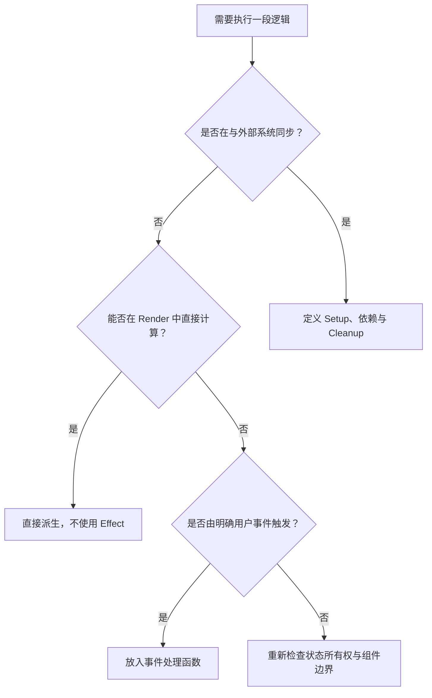
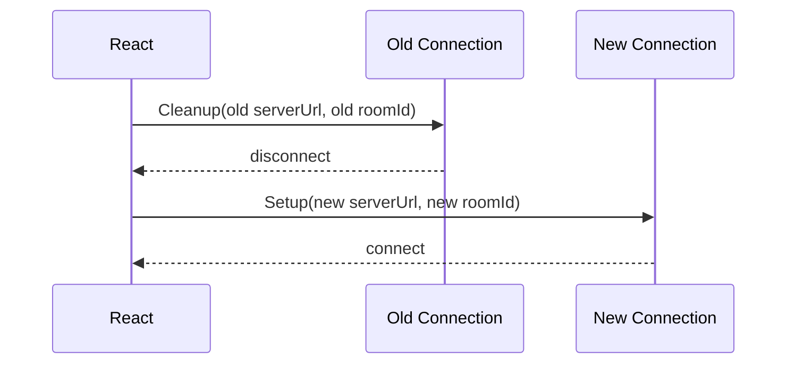

# React useEffect：同步外部系统、依赖管理与异步竞态治理

> `useEffect` 的核心职责不是“组件渲染后执行代码”，而是让 React 状态与组件之外的系统保持同步。一个正确的 Effect 必须能回答：同步对象是谁、何时重新同步、旧同步如何撤销，以及异步结果过期时如何处理。

---

## 一、本文解决什么问题

工程中最难维护的 Effect 往往不是语法错误，而是同步模型不清：

- 为派生数据写 Effect，制造一次多余 Render；
- 为绕过依赖检查使用空数组，回调长期读取旧值；
- Props 快速变化时，旧请求覆盖新请求；
- 组件卸载后 Timer、Listener、Observer 或连接仍然存在；
- Strict Mode 下 Setup 多执行一次，就用 Ref 强行阻止；
- 一个 Effect 同时请求、订阅、打点、写存储，依赖彼此牵连；
- 把用户点击触发的命令放进 Effect，失去明确因果关系；
- 认为 Cleanup 只在组件卸载时运行；
- 通过 `async` Effect 返回 Promise，误以为 React 会等待。

本文覆盖大纲中的 Synchronization、Dependency Array、Cleanup、Stale Closure、Race Condition、`AbortController`、订阅释放、Strict Mode 重执行、Effect 拆分与不需要 Effect 的场景。

本文以现代 React 客户端组件为背景。Effect 的 Setup/Cleanup 契约和依赖规则是公开模型；被动 Effect 在内部 Fiber 标记、队列和调度中的具体结构属于版本相关实现。Effect 通常在 Commit 后异步处理，但精确时序会受更新来源、React 版本和宿主环境影响；需要在浏览器绘制前测量或修改布局时，应使用下一篇讨论的 `useLayoutEffect`，而不是依赖 `useEffect` 的偶然时序。

### 核心结论

1. Effect 用于同步 React 与网络连接、DOM API、订阅、Timer、第三方组件等外部系统。
2. 依赖数组不是“触发条件配置”，而是 Setup 闭包使用的所有响应式值清单。
3. 依赖变化时，React 先用旧值执行 Cleanup，再用新值执行 Setup；卸载时还会执行最终 Cleanup。
4. Stale Closure 来自回调捕获旧 Render 快照，不能靠隐瞒依赖修复。
5. 取消请求可以节省资源，但仍需定义过期结果策略、错误模型和服务端一致性。
6. 每种外部资源都应有对称释放：订阅/退订、连接/断开、启动/停止、观察/取消观察。
7. Strict Mode 的开发期额外 Setup/Cleanup 用来检验 Effect 是否可重新同步，不应被“只运行一次”技巧掩盖。
8. 一个 Effect 应对应一个独立同步过程；生命周期相同不等于业务职责相同。
9. 纯计算、事件命令、State 初始化、受控数据流和缓存派生通常不需要 Effect。

---

## 二、先判断：是否存在外部系统

React 组件的 Render 应是纯计算：根据 Props 与 State 返回 JSX。Effect 则负责把已经提交的 React 状态同步到 React 管理边界之外。

典型外部系统包括：

- 浏览器事件、Timer、Observer、媒体查询和 History API；
- WebSocket、SSE、消息通道和网络请求；
- 非 React 地图、图表、编辑器、播放器等实例；
- `localStorage`、IndexedDB 等持久化系统；
- Analytics、日志或监控 SDK；
- 手工维护的 DOM 状态。

判断流程如下：



如果找不到外部系统，Effect 很可能是在补偿冗余 State、错误所有权或本可直接计算的数据流。

---

## 三、Synchronization：把 Effect 看作独立同步过程

以聊天室连接为例，组件需要让连接对象始终匹配当前 `serverUrl` 和 `roomId`：

```tsx
type ChatRoomProps = {
  serverUrl: string;
  roomId: string;
};

function ChatRoom({ serverUrl, roomId }: ChatRoomProps) {
  useEffect(() => {
    const connection = createConnection({ serverUrl, roomId });
    connection.connect();

    return () => {
      connection.disconnect();
    };
  }, [serverUrl, roomId]);

  return <h2>房间：{roomId}</h2>;
}
```

它的同步协议是：

- Setup：为当前服务器与房间创建并连接；
- Dependency：`serverUrl`、`roomId`；
- Cleanup：断开这一次 Setup 创建的连接。

当 `roomId` 从 `general` 变为 `support` 时，正确过程不是直接创建第二条连接：



旧 Cleanup 闭包捕获旧参数，因此能够准确释放旧资源；新 Setup 使用新参数建立同步。这也是 Render 快照在 Effect 生命周期中的价值。

---

## 四、Dependency Array：声明闭包使用的响应式值

依赖数组有三种常见形态：

```tsx
useEffect(setup);        // 每次提交后的适用时机重新同步
useEffect(setup, []);    // 组件该次挂载期间没有响应式依赖
useEffect(setup, [a, b]); // a 或 b 变化时重新同步
```

依赖通常包括 Effect 内读取的：

- Props；
- State；
- 组件函数体中声明的变量和函数；
- 由上述响应式值计算得到的对象。

React 使用 `Object.is` 比较每项依赖。对象、数组和函数按引用比较，因此每次 Render 新建的引用会触发重新同步。

### 4.1 依赖不是可以自由选择的优化项

```tsx
function SearchResults({ query }: { query: string }) {
  useEffect(() => {
    logSearch(query);
  }, []); // 错误：闭包读取 query，却隐藏依赖

  return null;
}
```

空数组不会让 `query` 自动保持最新，它只是让 Setup 使用首次 Render 的闭包。应声明依赖：

```tsx
useEffect(() => {
  logSearch(query);
}, [query]);
```

若这其实是用户点击“搜索”时的一次命令，应直接在事件处理中记录，而非依赖状态变化间接触发：

```tsx
function handleSubmit() {
  logSearch(query);
  onSearch(query);
}
```

### 4.2 移除不必要的对象依赖

```tsx
function ChatRoom({ roomId }: { roomId: string }) {
  const options = { serverUrl: CHAT_URL, roomId };

  useEffect(() => {
    const connection = createConnection(options);
    connection.connect();
    return () => connection.disconnect();
  }, [options]); // options 每次 Render 都是新对象
}
```

与其立刻用 `useMemo` 稳定对象，不如先把对象创建移入 Effect，让依赖回到原始值：

```tsx
useEffect(() => {
  const connection = createConnection({
    serverUrl: CHAT_URL,
    roomId,
  });

  connection.connect();
  return () => connection.disconnect();
}, [roomId]);
```

这种写法的语义更直接，也减少了对引用稳定性的额外维护。

### 4.3 函数依赖

组件内函数也是响应式值。优先策略是：

1. 若函数只供 Effect 使用，把它定义在 Effect 内；
2. 若函数由事件触发，把逻辑留在事件处理路径；
3. 若跨组件传递且确需稳定引用，再考虑 `useCallback`；
4. 不要为了消除 Lint 警告机械记忆化所有函数。

---

## 五、Cleanup：不只在卸载时执行

Effect 生命周期可以概括为：

```text
Mount:        Setup(A)
Dependency:   Cleanup(A) -> Setup(B)
Dependency:   Cleanup(B) -> Setup(C)
Unmount:      Cleanup(C)
```

Cleanup 应只撤销对应 Setup 创建或注册的内容：

```tsx
useEffect(() => {
  const timerId = window.setInterval(refreshClock, 1000);
  return () => window.clearInterval(timerId);
}, []);
```

资源对应关系如下：

| Setup | Cleanup |
|---|---|
| `addEventListener` | `removeEventListener`，使用相同目标、类型和 Listener |
| `setInterval` | `clearInterval` |
| `setTimeout` | `clearTimeout` |
| `observer.observe` | `observer.disconnect` 或 `unobserve` |
| `connection.connect` | `connection.disconnect` |
| Store `subscribe` | 调用返回的 `unsubscribe` |
| 创建第三方实例 | 调用其 `destroy`/`dispose` |
| 发起可取消请求 | `AbortController.abort` |

Cleanup 不应随意更新业务 State。卸载时的 State 更新没有可展示目标；依赖切换时在 Cleanup 中改 State，也容易产生过渡状态和额外 Render。若必须记录资源状态，应重新审视状态机和所有权。

---

## 六、Stale Closure：旧值不是随机出现的

下面的 Interval 永远捕获首次 Render 的 `count`：

```tsx
function Counter() {
  const [count, setCount] = useState(0);

  useEffect(() => {
    const timerId = window.setInterval(() => {
      setCount(count + 1);
    }, 1000);

    return () => window.clearInterval(timerId);
  }, []); // 缺少 count

  return <span>{count}</span>;
}
```

若需求是每秒基于最新队列状态递增，不需要读取 `count`，使用函数式更新即可：

```tsx
useEffect(() => {
  const timerId = window.setInterval(() => {
    setCount(current => current + 1);
  }, 1000);

  return () => window.clearInterval(timerId);
}, []);
```

如果 Effect 真正需要在 `count` 改变时重新建立同步，就把 `count` 加入依赖。修复 Stale Closure 的关键不是“让数组更短”，而是明确同步过程是否应随该值变化。

### 6.1 Ref 是否能绕过依赖

Ref 可供异步回调读取可变最新值，但它改变了时间语义，也绕开 React 的响应式重同步：

```tsx
const latestMessageRef = useRef(message);

useEffect(() => {
  latestMessageRef.current = message;
}, [message]);
```

只有在逻辑明确要求“资源保持不变，但回调读取最新值”时才考虑此模式。不要把所有 Props 都复制到 Ref 里以清空依赖，否则数据流会变得不可检查。

现代 React 版本可能提供更适合表达“读取最新值但不触发 Effect 重同步”的 API；是否可用应以项目 React 版本的官方文档为准，不能为兼容未知版本在文章中假设其存在。

---

## 七、Race Condition：请求返回顺序不等于发起顺序

用户快速从用户 A 切换到用户 B：

```text
请求 A 发出 -> 请求 B 发出 -> B 返回 -> A 返回
```

如果 A 最后返回并直接写 State，界面会显示与当前 `userId=B` 不一致的数据。

### 7.1 使用 AbortController 取消 Fetch

```tsx
type UserState =
  | { status: 'loading' }
  | { status: 'success'; user: User }
  | { status: 'error'; error: Error };

function UserProfile({ userId }: { userId: string }) {
  const [state, setState] = useState<UserState>({ status: 'loading' });

  useEffect(() => {
    const controller = new AbortController();
    setState({ status: 'loading' });

    async function loadUser() {
      try {
        const response = await fetch(
          `/api/users/${encodeURIComponent(userId)}`,
          { signal: controller.signal },
        );

        if (!response.ok) {
          throw new Error(`Request failed: ${response.status}`);
        }

        const user = (await response.json()) as User;
        setState({ status: 'success', user });
      } catch (error) {
        if (controller.signal.aborted) return;

        setState({
          status: 'error',
          error: error instanceof Error ? error : new Error('Unknown error'),
        });
      }
    }

    void loadUser();
    return () => controller.abort();
  }, [userId]);

  return <UserView state={state} />;
}
```

当 `userId` 改变时，Cleanup 先 Abort 旧请求，再为新 ID 发起请求。卸载时同样取消尚未完成的请求。

### 7.2 取消能力的边界

`AbortController` 只对支持 `AbortSignal` 的操作有效。它能停止客户端继续等待或处理，但不保证服务器已经撤销副作用。对于创建订单、支付等写操作，还需要：

- 服务端幂等键；
- 请求状态查询或补偿；
- 明确的超时与重试策略；
- 禁止把 Abort 当成事务回滚。

某些 Promise API 不支持物理取消，可使用请求序号或 `ignore` 标志阻止过期结果写入：

```tsx
useEffect(() => {
  let ignore = false;

  void loadUser(userId).then(
    user => {
      if (!ignore) setState({ status: 'success', user });
    },
    error => {
      if (!ignore) setState({ status: 'error', error: toError(error) });
    },
  );

  return () => {
    ignore = true;
  };
}, [userId]);
```

这种方式保证 UI 不接受过期结果，但底层任务仍会消耗资源。能取消时应优先取消，同时保留对过期结果的防御性判断。

### 7.3 为什么生产项目常使用数据获取层

手写 Effect 请求还要解决缓存、去重、失效、重试、预取、SSR、Hydration、焦点恢复刷新与乐观更新。路由框架 Loader 或成熟 Server State 库通常能提供更完整的生命周期模型。Effect 请求适合讲清机制和处理局部命令，不代表所有数据获取都应手写。

---

## 八、订阅释放：处理外部推送状态

### 8.1 浏览器事件订阅

```tsx
function useOnlineStatus() {
  const [online, setOnline] = useState(() => navigator.onLine);

  useEffect(() => {
    const handleOnline = () => setOnline(true);
    const handleOffline = () => setOnline(false);

    window.addEventListener('online', handleOnline);
    window.addEventListener('offline', handleOffline);

    return () => {
      window.removeEventListener('online', handleOnline);
      window.removeEventListener('offline', handleOffline);
    };
  }, []);

  return online;
}
```

Listener 的移除必须匹配注册时的函数引用和相关选项。匿名函数分别创建会导致无法正确移除：

```tsx
window.addEventListener('resize', () => updateSize());
return () => window.removeEventListener('resize', () => updateSize()); // 不同函数
```

### 8.2 外部 Store

并发渲染下，外部 Store 订阅还涉及 Snapshot 一致性和服务端快照。不要仅凭一个 Effect + `setState` 就假设解决所有撕裂问题。React 提供的 `useSyncExternalStore` 专门定义外部 Store 订阅契约，应优先用于通用 Store 接入。

### 8.3 WebSocket 与重连

连接型资源还需考虑：

- 鉴权令牌更新；
- 心跳与断线检测；
- 指数退避和随机抖动；
- 页面可见性与网络切换；
- 重复消息、顺序与幂等；
- 多组件是否共享同一连接；
- 最后一个消费者离开时是否关闭。

这些策略通常应封装在连接管理层，Effect 只负责订阅该资源的生命周期，而不是在每个组件复制重连协议。

---

## 九、Strict Mode 重执行：检验可重新同步

在开发环境的 Strict Mode 下，React 可能执行额外的 Setup/Cleanup 周期，以暴露缺少清理或不对称同步。具体行为受 React 版本和 Strict Mode 在树中的位置影响，不应简化成“任何 Effect 永远执行两次”。

一个正确 Effect 应通过以下序列：

```text
Setup -> Cleanup -> Setup
```

用户可观察结果应与只执行一次 Setup 等价。例如连接数最多为一，Listener 不重复，第三方实例不会泄漏。

### 9.1 错误修复：用 Ref 阻止第二次 Setup

```tsx
const connectedRef = useRef(false);

useEffect(() => {
  if (connectedRef.current) return;
  connectedRef.current = true;
  connection.connect();
}, []);
```

这没有实现 Cleanup。组件真正卸载再挂载时，资源仍可能泄漏；依赖变化时也无法正确重新同步。

正确方向是对称释放：

```tsx
useEffect(() => {
  const connection = createConnection();
  connection.connect();
  return () => connection.disconnect();
}, []);
```

如果第三方 SDK 确实只能初始化一次，应在模块级资源管理器中实现幂等初始化、共享实例和引用计数，再由组件 Effect 获取与释放租约，而不是让每个组件自行用 Ref 隐藏生命周期。

---

## 十、Effect 拆分：按同步过程，而不是按生命周期合并

下面的 Effect 同时连接聊天室和记录访问，二者依赖不同：

```tsx
useEffect(() => {
  const connection = createConnection(roomId);
  connection.connect();
  analytics.track('room_viewed', { roomId, userId });

  return () => connection.disconnect();
}, [roomId, userId]);
```

当 `userId` 改变时，Analytics 需要重新记录，但聊天室连接未必需要重建。应拆分：

```tsx
useEffect(() => {
  const connection = createConnection(roomId);
  connection.connect();
  return () => connection.disconnect();
}, [roomId]);

useEffect(() => {
  analytics.track('room_viewed', { roomId, userId });
}, [roomId, userId]);
```

拆分标准是“能否独立开始和停止同步”，而不是代码行数。反过来，同一资源的 Setup 与 Cleanup 必须留在同一个 Effect，避免生命周期分散。

### 10.1 不要形成 Effect 链

```tsx
useEffect(() => setFiltered(filterItems(items, query)), [items, query]);
useEffect(() => setCount(filtered.length), [filtered]);
useEffect(() => setEmpty(count === 0), [count]);
```

这些值都能在 Render 中派生：

```tsx
const filtered = filterItems(items, query);
const count = filtered.length;
const empty = count === 0;
```

Effect 链会产生多次 Render、中间不一致状态和难以追踪的因果关系。

---

## 十一、不需要 Effect 的场景

### 11.1 根据 Props 或 State 派生数据

```tsx
// 错误：产生一次旧 fullName 的 Render，再补一次更新
const [fullName, setFullName] = useState('');
useEffect(() => setFullName(`${firstName} ${lastName}`), [firstName, lastName]);

// 正确：Render 中直接计算
const fullName = `${firstName} ${lastName}`;
```

昂贵计算应先测量，确有必要时使用 Memoization，而不是 Effect + State。

### 11.2 响应用户事件

```tsx
// 错误：用状态绕一圈触发购买命令
useEffect(() => {
  if (submitted) void submitOrder();
}, [submitted]);

// 正确：事件本身就是明确因果
async function handleSubmit() {
  await submitOrder();
}
```

事件处理函数知道是谁、何时触发；Effect 只知道某个状态在 Commit 后变了。支付、删除、下载等命令不应因重新挂载或状态恢复而意外重放。

### 11.3 重置整个子树 State

实体切换代表新身份时使用稳定 `key`：

```tsx
<ProfileForm key={userId} userId={userId} />
```

无需 Effect 监听 `userId` 再逐项清空 State。

### 11.4 通知父组件 State 变化

若子组件在 Effect 中调用 `onChange`，会多经过一次 Render。通常应在同一个事件处理函数中同时更新本地状态并通知父级，或改为受控组件。

### 11.5 初始化 State

可由 Props 同步生成的初始值使用 `useState` Lazy Initializer 或 `useReducer` Init；不要用 Mount Effect 先渲染空值再初始化。涉及浏览器专属 API和 SSR 时，则需明确客户端同步与 Hydration 策略。

---

## 十二、`async` Effect 的正确写法

Effect Setup 必须返回 Cleanup 函数或不返回值。`async` 函数总是返回 Promise，因此不能直接作为 Setup：

```tsx
useEffect(async () => { // 错误
  const user = await loadUser();
  setUser(user);
}, []);
```

应在 Setup 内声明并调用异步函数，并在 Cleanup 中取消或使结果失效：

```tsx
useEffect(() => {
  const controller = new AbortController();

  async function synchronize() {
    try {
      const user = await loadUser(controller.signal);
      setUser(user);
    } catch (error) {
      if (!controller.signal.aborted) {
        reportError(error);
      }
    }
  }

  void synchronize();
  return () => controller.abort();
}, []);
```

不要忽略 Promise Rejection。错误应进入界面状态、Error Boundary 可处理的渲染路径或监控系统，具体取决于错误是否可恢复以及由谁拥有。

---

## 十三、浏览器、SSR 与平台边界

Effect 不在服务端渲染期间执行，因此：

- 服务端 HTML 不能依赖 Effect 才出现核心内容；
- 首屏数据若只能在 Effect 中请求，会推迟到 Hydration 后；
- `window`/`document` 可在 Effect 内使用，但 Render 阶段仍需避免直接访问；
- 客户端首次输出必须考虑与服务端 HTML 的一致性；
- React Server Components 中只有客户端组件可以使用 `useEffect`。

React Native 没有浏览器 DOM 和 Paint 阶段，但订阅、Timer、原生模块实例等仍遵循 Setup/Cleanup 思路。Web、Native 或 Desktop 的外部资源 API 不同，生命周期对称原则相同。

页面隐藏不等于组件卸载。后台标签页的 Timer 会被节流，移动端应用也可能暂停。需要感知可见性或应用生命周期时，应订阅相应平台 API，而不是只依赖 Effect Cleanup。

---

## 十四、常见误区

### 14.1 “Effect 就是生命周期方法替代品”

不准确。Effect 应按独立外部同步过程建模，而不是机械映射 `componentDidMount/Update/Unmount`。

### 14.2 “空依赖数组表示只执行一次”

不应这样依赖。它表示 Setup 没有响应式依赖；开发 Strict Mode 可能额外执行检查，真实卸载重挂也会再次 Setup。

### 14.3 “Cleanup 只在卸载时调用”

错误。依赖变化后，新 Setup 之前也会先调用旧 Cleanup。

### 14.4 “关闭依赖 Lint 可以修复无限循环”

错误。应移除不必要 Effect、缩小依赖、把对象创建移入 Effect，或稳定真正需要的接口。

### 14.5 “Abort 请求就能回滚服务端操作”

错误。Abort 主要取消客户端等待；写操作需要服务端幂等、状态查询或补偿协议。

### 14.6 “Strict Mode 重执行是 React Bug”

错误。它是开发期压力检查，常揭示缺失 Cleanup、不纯 Setup 或错误的一次性假设。

### 14.7 “把所有逻辑放进一个 Effect 更容易控制顺序”

错误。无关同步过程会互相扩大依赖和重启范围。真正有顺序依赖的业务流程应显式建模，而不是依赖 Effect 排列。

---

## 十五、测试与验证

### 15.1 测试同步契约

围绕外部可观察行为测试：

- Mount 后是否建立一个连接或订阅；
- 依赖变化时是否先释放旧资源再建立新资源；
- Unmount 后 Listener、Timer、Observer 和连接是否归零；
- 请求参数变化时旧响应是否无法覆盖新状态；
- Abort 是否不被显示为业务错误；
- 网络失败、空态和重试是否可达；
- Strict Mode 下是否没有重复资源。

不要断言 Effect 内部 Fiber 标记或精确调度步骤，也不要把开发期固定调用次数写死为业务契约。

### 15.2 使用可控异步替代任意等待

测试竞态时，创建两个可手工 Resolve 的请求：先发 A，再发 B，先完成 B，最后完成 A，然后断言界面仍显示 B。不要用随机网络延迟或固定 `setTimeout` 猜测顺序。

### 15.3 性能验证

Effect 性能问题常来自：

- 依赖引用不稳定导致资源反复重建；
- Effect 链产生多个 Render；
- 高频事件未限流，持续更新 State；
- 大量组件各自建立相同订阅；
- Cleanup/Setup 包含昂贵同步操作。

应在生产构建和目标设备上，用 React Profiler 观察 Commit 与渲染原因，用浏览器 Performance/Network 面板观察脚本、请求、Listener 和长任务。开发 Strict Mode 的额外执行不能直接作为生产性能数据。

---

## 十六、工程检查清单

- Effect 是否确实在同步 React 之外的系统；
- Setup 使用的所有响应式值是否完整列入依赖；
- 是否能把对象或函数创建移入 Effect 以缩小依赖；
- Cleanup 是否精确撤销本次 Setup 创建的资源；
- 依赖变化时旧资源是否先释放；
- 异步流程是否处理失败、取消、过期结果和重复请求；
- 写请求是否有服务端幂等与一致性策略；
- 订阅 API 是否更适合 `useSyncExternalStore`；
- 一个 Effect 是否只负责一个同步过程；
- 纯派生值、用户命令和 State 重置是否已移出 Effect；
- Strict Mode 下 Setup/Cleanup 是否仍保持用户可观察结果一致；
- SSR、Hydration 和客户端边界是否明确；
- 性能结论是否来自生产构建和目标设备测量。

---

## 十七、总结

1. `useEffect` 是外部系统同步工具，不是通用的“Render 后回调”。
2. 依赖数组描述 Setup 闭包读取的响应式值，不能为控制次数而隐瞒依赖。
3. React 在依赖变化时执行旧 Cleanup，再运行新 Setup；最终卸载还会清理一次。
4. Stale Closure 应通过澄清时间语义、声明依赖或函数式更新解决，而不是关闭 Lint。
5. 异步请求必须处理 Race Condition；可取消时使用 `AbortController`，不可取消时忽略过期结果。
6. Abort 不等于服务端事务回滚，写操作仍需要幂等和补偿机制。
7. Listener、Timer、Observer、连接与第三方实例都必须成对释放。
8. Strict Mode 检查 Effect 是否能安全重新同步，正确修复是对称 Cleanup。
9. Effect 应按独立同步过程拆分，避免无关依赖互相触发。
10. 派生数据、用户事件、初始化和多数状态重置不需要 Effect。

写好 Effect 的关键，不是背诵依赖数组规则，而是把每个 Effect 当成一份资源协议：它如何建立、由哪些值决定、怎样停止，以及旧工作何时失去资格。

---

## 问答复盘

### Q1：什么情况下才应该优先考虑 `useEffect`？

**答：** 当组件需要与 React 之外的系统同步，例如订阅、连接、Timer、浏览器 API 或第三方实例。纯计算和用户事件通常不需要 Effect。

### Q2：依赖数组是 Effect 的触发条件配置吗？

**答：** 不准确。它是 Setup 闭包使用的响应式值清单；React 比较这些值以判断是否需要重新同步。

### Q3：Cleanup 为什么会在组件仍然挂载时执行？

**答：** 依赖改变意味着旧同步已过期。React 先用旧闭包释放旧资源，再用新值执行 Setup。

### Q4：Interval 需要读取最新 State 时，应该把 State 加入依赖还是使用函数式更新？

**答：** 若只是基于前值递增，使用函数式更新可保持同一个 Interval；若资源本身必须随 State 改变，则应把 State 加入依赖并重新同步。

### Q5：`AbortController` 是否完全解决请求竞态？

**答：** 对支持 Signal 的客户端操作很有帮助，但仍要处理过期结果、错误和服务端副作用；Abort 不保证服务端回滚。

### Q6：为什么不能直接把 Effect 回调声明为 `async`？

**答：** Effect 只能返回 Cleanup 函数或无返回值，而 `async` 函数返回 Promise。应在 Setup 内启动异步函数，并同步返回 Cleanup。

### Q7：Strict Mode 下如何判断 Effect 修复正确？

**答：** 验证 `Setup -> Cleanup -> Setup` 后没有重复资源，用户可观察结果与一次 Setup 等价，而不是用 Ref 跳过第二次 Setup。

### Q8：两个逻辑都在 Mount 时执行，是否应放进同一个 Effect？

**答：** 不一定。若它们同步不同外部系统或依赖不同，应拆分；拆分依据是同步过程能否独立开始和停止。

### Q9：用户快速切换 A、B 两个查询时，应如何测试竞态？

**答：** 手工控制两个 Promise 的完成顺序，让 B 先完成、A 后完成，并断言过期的 A 不能覆盖当前 B，同时验证 Cleanup 已取消或标记 A 失效。

---

## 延伸知识

- **`useLayoutEffect` 与浏览器绘制**：DOM Mutation、布局测量、同步阻塞与 Flicker。
- **Memoization**：引用稳定、依赖管理与实际性能测量。
- **`useSyncExternalStore`**：Snapshot、一致性、订阅与服务端渲染。
- **Server State**：缓存、去重、失效、预取、重试与乐观更新。
- **状态机**：把请求、重试、取消和过期结果建模为合法状态迁移。
- **资源管理**：共享连接、引用计数、幂等初始化与生命周期所有权。
