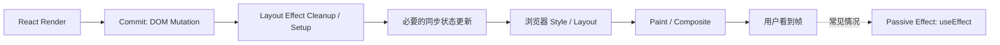
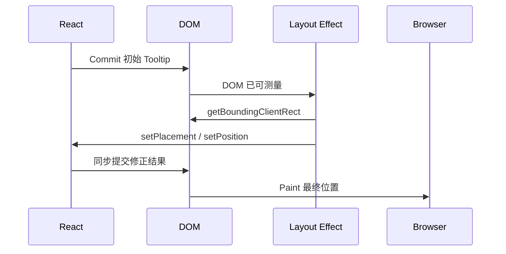

# React useLayoutEffect 与浏览器绘制：布局测量、Flicker 与同步阻塞

> `useLayoutEffect` 的价值不是“比 `useEffect` 更快”，而是允许组件在 DOM 已提交、浏览器尚未展示当前结果的窗口中完成布局测量和必要修正。代价是这段同步工作会阻塞绘制，使用范围必须足够小。

---

## 一、本文解决什么问题

弹层、Tooltip、虚拟列表和富文本编辑器经常需要读取真实 DOM 尺寸，再决定最终位置。如果测量发生得太晚，用户会先看到错误布局，再看到修正结果；如果所有 Effect 都改成 `useLayoutEffect`，主线程又会被同步工作阻塞。

本文回答以下问题：

- `useLayoutEffect` 位于 React Commit 与浏览器绘制之间的什么位置；
- “DOM Mutation 后执行”与“Browser Paint 前执行”分别意味着什么；
- 如何完成两遍渲染而不展示中间错误布局；
- 为什么 `getBoundingClientRect()` 可能触发同步 Layout；
- `useLayoutEffect` 为什么会阻塞绘制；
- SSR 中为何不能完成布局测量，警告或诊断如何处理；
- `useEffect` 导致 Flicker 时，何时应改用 `useLayoutEffect`；
- `requestAnimationFrame` 与两种 Effect 的职责有何不同；
- 如何测试布局逻辑并验证真实性能。

本文以浏览器中的现代 React 客户端渲染为主。React 保证 `useLayoutEffect` 的代码以及其中触发的状态更新会在浏览器重新绘制屏幕前得到处理，这是公开语义；Fiber Effect 标记、Commit 子阶段函数名称和被动 Effect 调度方式属于版本相关内部实现。浏览器何时生成帧还取决于主线程任务、刷新率、页面可见性与浏览器调度，不能把日志时间等同于用户已经看到一帧。

### 核心结论

1. `useLayoutEffect` 在 React 把 DOM 变更提交后运行，因此可以读取已更新节点和布局信息。
2. 它在浏览器展示当前提交结果前同步执行，适合必须避免中间错误画面的测量与修正。
3. Layout Effect 中的 JavaScript、强制布局和同步状态更新都会延迟 Paint，应保持短小。
4. `useEffect` 更适合不影响首个可见布局的同步任务；不要默认升级为 `useLayoutEffect`。
5. 布局读取和 DOM 写入交错可能造成 Layout Thrashing，应批量读、计算后再写。
6. SSR 没有 DOM 和布局，`useLayoutEffect` 无法在服务端执行；必须设计可 Hydrate 的初始 UI 或客户端边界。
7. Flicker 只有在“错误布局被用户看到”且测量确实必须依赖 DOM 时，才是使用 `useLayoutEffect` 的理由。
8. `requestAnimationFrame` 用于对齐未来帧的动画或 DOM 工作，不等价于 Commit 阶段的 Layout Effect。
9. JSDOM 不能提供真实布局，布局正确性与性能必须在真实浏览器和目标设备验证。

---

## 二、三个时间模型：React、浏览器与屏幕

理解本主题，需要同时区分三个过程：

- **React Render**：计算下一棵 UI 树，必须保持纯净；
- **React Commit**：把变化应用到 DOM，并运行对应 Commit 阶段逻辑；
- **浏览器渲染**：计算 Style、Layout、Paint、Composite，最终生成用户看到的帧。

简化关系如下：



这张图用于建立主路径，不应被理解为所有浏览器内部阶段都会按图逐项、立即执行，也不应推导出 `useEffect` 在任何更新来源下都绝对晚于 Paint。React 可能根据交互和调度时机处理被动 Effect；如果任务必须明确等待浏览器展示一帧，应使用适合的浏览器调度机制并在目标环境验证。

真正稳定的选择依据是：

- 必须在可见 Paint 前读取布局并修正：`useLayoutEffect`；
- 不影响本次可见布局的外部同步：优先 `useEffect`；
- 需要把动画或 DOM 工作安排到未来刷新周期：考虑 `requestAnimationFrame`。

---

## 三、DOM Mutation 后执行意味着什么

函数组件 Render 阶段不能读取“本次更新后的 DOM”，因为 DOM 变化尚未提交，而且 Render 可能被中断或放弃。

```tsx
function Panel({ expanded }: { expanded: boolean }) {
  const panelRef = useRef<HTMLDivElement>(null);

  // 错误：Render 阶段不应读取或修改 DOM。
  const height = panelRef.current?.getBoundingClientRect().height ?? 0;

  return <div ref={panelRef}>{expanded ? <Content /> : null}</div>;
}
```

Layout Effect 运行时，本次 Commit 的 DOM Mutation 已完成，Ref 也已关联到相应 DOM 节点，可以测量：

```tsx
function Panel({ expanded }: { expanded: boolean }) {
  const panelRef = useRef<HTMLDivElement>(null);
  const [height, setHeight] = useState(0);

  useLayoutEffect(() => {
    const panel = panelRef.current;
    if (!panel) return;

    setHeight(panel.getBoundingClientRect().height);
  }, [expanded]);

  return (
    <div>
      <div ref={panelRef}>{expanded ? <Content /> : null}</div>
      <output>当前高度：{height}px</output>
    </div>
  );
}
```

但这个示例仍需审视需求：如果高度只用于调试文本，用户先看到旧数字通常无害，应优先 `useEffect`；如果高度决定 Paint 前必须正确的弹层位置或裁剪区域，才需要 `useLayoutEffect`。

> “可以在 Layout Effect 读取 DOM”不等于“所有 DOM 读取都应该放进 Layout Effect”。是否阻止 Paint 取决于视觉正确性要求。

---

## 四、Browser Paint 前的两遍渲染

Tooltip 初始渲染前不知道自身高度，但它需要根据可用空间决定显示在目标上方还是下方。常见流程是：

1. 先用一个可确定的初始位置渲染 Tooltip；
2. DOM Commit 后读取 Tooltip 与目标元素尺寸；
3. 在 Layout Effect 中同步更新位置；
4. React 立即重新 Render 和 Commit；
5. 浏览器展示修正后的结果。



用户通常不会看到第一遍错误位置，因为修正发生在 Paint 前；代价是主线程必须完成两次 Render/Commit 和布局测量，首帧会更晚。

### 4.1 一个可清理的定位示例

```tsx
type Position = {
  left: number;
  top: number;
  visibility: 'hidden' | 'visible';
};

type TooltipProps = {
  anchor: HTMLElement | null;
  children: ReactNode;
};

function Tooltip({ anchor, children }: TooltipProps) {
  const tooltipRef = useRef<HTMLDivElement>(null);
  const [position, setPosition] = useState<Position>({
    left: 0,
    top: 0,
    visibility: 'hidden',
  });

  useLayoutEffect(() => {
    const tooltip = tooltipRef.current;
    if (!anchor || !tooltip) return;

    const anchorRect = anchor.getBoundingClientRect();
    const tooltipRect = tooltip.getBoundingClientRect();
    const gap = 8;

    const spaceAbove = anchorRect.top;
    const showAbove = spaceAbove >= tooltipRect.height + gap;

    setPosition({
      left: Math.max(8, anchorRect.left + anchorRect.width / 2 - tooltipRect.width / 2),
      top: showAbove
        ? anchorRect.top - tooltipRect.height - gap
        : anchorRect.bottom + gap,
      visibility: 'visible',
    });
  }, [anchor, children]);

  return createPortal(
    <div
      ref={tooltipRef}
      role="tooltip"
      style={{
        position: 'fixed',
        left: position.left,
        top: position.top,
        visibility: position.visibility,
      }}
    >
      {children}
    </div>,
    document.body,
  );
}
```

`visibility: hidden` 避免尚未测量的内容闪到页面左上角，同时仍允许浏览器计算布局尺寸。`display: none` 通常无法提供所需尺寸。

这仍不是完整生产实现。Tooltip 还要处理：

- Viewport 右侧和底部碰撞；
- 页面滚动、窗口缩放与 Zoom；
- 字体加载和内容动态变化；
- Anchor 卸载；
- Portal 坐标系；
- 键盘、焦点、Hover 与触屏行为；
- `aria-describedby` 等可访问性契约。

复杂浮层应优先使用成熟定位库，避免重复实现碰撞检测和平台边界。

---

## 五、Layout Measurement 与浏览器强制布局

常见几何读取包括：

- `getBoundingClientRect()`；
- `offsetWidth`、`offsetHeight`；
- `clientWidth`、`clientHeight`；
- `scrollWidth`、`scrollHeight`；
- `getComputedStyle()` 的部分属性。

浏览器通常延迟合并 Style 和 Layout 计算。如果 JavaScript 先修改影响布局的样式，再立即读取几何信息，浏览器可能必须同步完成待处理的 Style/Layout，才能返回准确值，这类成本常被称为 Forced Synchronous Layout。

### 5.1 错误：读写交错造成 Layout Thrashing

```tsx
for (const row of rows) {
  row.style.width = `${containerWidth}px`;
  const height = row.getBoundingClientRect().height;
  row.style.top = `${nextTop(height)}px`;
}
```

每一轮写入后立即读取，可能迫使浏览器重复布局。

### 5.2 改进：批量读取，再批量写入

```tsx
const measurements = rows.map(row => row.getBoundingClientRect());
const positions = calculatePositions(measurements, containerWidth);

rows.forEach((row, index) => {
  row.style.transform = `translateY(${positions[index]}px)`;
});
```

React 项目还应优先通过 State/Props 声明最终样式，避免命令式 DOM 与 React 输出互相竞争。只有动画、第三方集成或高度敏感的布局场景，才考虑直接 DOM 写入，并明确所有权。

### 5.3 `ResizeObserver` 处理持续尺寸变化

只在 Mount 测量一次无法覆盖容器缩放、字体变化或异步内容。可以订阅尺寸变化：

```tsx
function useElementSize<T extends Element>() {
  const ref = useRef<T>(null);
  const [size, setSize] = useState({ width: 0, height: 0 });

  useLayoutEffect(() => {
    const element = ref.current;
    if (!element) return;

    const updateSize = () => {
      const rect = element.getBoundingClientRect();
      setSize(current => {
        if (current.width === rect.width && current.height === rect.height) {
          return current;
        }
        return { width: rect.width, height: rect.height };
      });
    };

    updateSize();

    const observer = new ResizeObserver(updateSize);
    observer.observe(element);

    return () => observer.disconnect();
  }, []);

  return [ref, size] as const;
}
```

`ResizeObserver` 回调有自己的浏览器交付时机，回调中反复修改被观察元素尺寸可能形成 ResizeObserver Loop。应避免无收敛的“测量 -> 改尺寸 -> 再测量”，并在不支持该 API 的目标平台准备降级方案。

---

## 六、同步阻塞：为什么不能默认使用

`useLayoutEffect` 会阻塞浏览器重新绘制。Effect 中包含以下工作时，用户看到下一帧的时间会延后：

- 大量 DOM 查询与几何读取；
- 同步解析大型数据；
- 多次 State 更新引发额外 Render；
- 第三方组件同步初始化；
- 布局读写交错；
- 长循环、复杂排序或序列化；
- 同步存储访问。

```tsx
useLayoutEffect(() => {
  const result = expensiveDataTransform(data); // 不应占用 Paint 前窗口
  setResult(result);
}, [data]);
```

纯数据计算应在 Render 中直接完成，确有昂贵且可缓存的计算再根据测量结果考虑 Memoization；它不属于 DOM 布局同步。

### 6.1 Layout Effect 中更新 State 的连锁影响

在 Layout Effect 中调用 Setter，React 会在 Paint 前处理更新。React 官方文档还明确指出，这会使剩余 Effect（包括 `useEffect`）立即执行。不要用它构造精巧的跨 Effect 时序；应让各 Effect 的同步协议独立、可重复。

### 6.2 Strict Mode

开发环境的 Strict Mode 可能执行额外 Setup/Cleanup 周期来检查清理对称性。Layout Effect 必须释放 Observer、Listener、第三方实例和 Animation Frame。开发时观察到的耗时和次数不能直接当作生产性能数据。

---

## 七、`useEffect` 与 Flicker

Flicker 是用户先看到一个可见状态，随后在另一帧看到修正状态。下面代码可能先展示错误位置，再在普通 Effect 中修正：

```tsx
useEffect(() => {
  const rect = tooltipRef.current?.getBoundingClientRect();
  if (rect) setPosition(calculatePosition(rect));
}, [content]);
```

若位置错误明显且测量必须依赖已提交 DOM，可改为 `useLayoutEffect`。但先检查更低成本方案：

- CSS Flexbox/Grid/Anchor Positioning 是否可直接表达；
- 是否能从已有数据计算，不必测量 DOM；
- 初始 UI 是否可以隐藏或使用稳定占位；
- 是否能把布局责任交给成熟库；
- 该视觉跳变是否真的可见、可复现且影响体验。

### 7.1 不要用 Layout Effect 掩盖 Hydration Flicker

如果服务端 HTML 与客户端首次 Render 不一致，问题是 Hydration 数据与环境分支，而不只是 Effect 太晚。应保证一致初始输出，或明确把依赖浏览器环境的区域设计为客户端占位。`useLayoutEffect` 不能在服务端提前修正布局。

### 7.2 CSS 优先

容器查询、`position: sticky`、Grid、Flexbox、`aspect-ratio`、`min/max/clamp` 等通常比 JavaScript 测量更稳健。CSS 能在浏览器布局系统内部响应字体、Viewport 和内容变化，减少 React State 与二次 Commit。

---

## 八、SSR Warning 与服务端边界

服务端渲染没有真实 DOM、Viewport、字体度量和 Layout Tree，因此 `useLayoutEffect` 无法在服务端执行。部分 React 版本或开发工具链会给出“`useLayoutEffect` does nothing on the server”一类诊断；具体警告表现应以项目锁定版本为准，稳定事实是服务端不会运行该布局逻辑。

### 8.1 方案一：可以延后时改用 `useEffect`

如果初始布局不依赖测量即可正确展示，改用 `useEffect`，允许客户端在 Paint 后完成非关键同步。

### 8.2 方案二：服务端输出稳定占位

```tsx
function ClientMeasuredChart(props: ChartProps) {
  const [hydrated, setHydrated] = useState(false);

  useEffect(() => {
    setHydrated(true);
  }, []);

  if (!hydrated) {
    return <div className="chart-placeholder" aria-hidden="true" />;
  }

  return <MeasuredChart {...props} />;
}
```

代价是图表延迟出现和额外 Render。Placeholder 应具有稳定尺寸，避免 Cumulative Layout Shift（CLS，累积布局偏移），且核心内容不能无理由全部推迟到客户端。

### 8.3 方案三：框架客户端边界或禁用该子树 SSR

对强依赖 Canvas、编辑器或浏览器布局的第三方组件，可使用框架提供的 Client-only/Dynamic Import 能力。注意“客户端组件”不一定表示完全不生成服务端 HTML，具体语义取决于框架；应查阅当前框架版本文档。

### 8.4 Isomorphic Layout Effect 的边界

库中常见以下兼容写法：

```tsx
const useIsomorphicLayoutEffect =
  typeof window !== 'undefined' ? useLayoutEffect : useEffect;
```

它可以减少服务端诊断，但不会让服务器获得布局能力，也不能修复 Hydration 不一致。应用应先决定首屏内容在无布局信息时如何正确呈现，再选择 Hook。

---

## 九、`requestAnimationFrame` 的位置与职责

`requestAnimationFrame`（rAF）请求浏览器在未来一次重绘前调用回调，适合：

- 按显示刷新节奏推进动画；
- 合并一帧内的视觉 DOM 写入；
- 等待当前 JavaScript/Commit 工作结束后，在后续帧处理；
- 获取动画帧时间戳。

```tsx
function ProgressBar({ target }: { target: number }) {
  const barRef = useRef<HTMLDivElement>(null);

  useEffect(() => {
    const frameId = requestAnimationFrame(() => {
      if (barRef.current) {
        barRef.current.style.transform = `scaleX(${target})`;
      }
    });

    return () => cancelAnimationFrame(frameId);
  }, [target]);

  return <div ref={barRef} className="progress-bar" />;
}
```

rAF 回调必须在 Cleanup 中取消，防止依赖变化或卸载后操作过期节点。

### 9.1 rAF 不等于 `useLayoutEffect`

| 机制 | 与 React Commit 的关系 | 典型用途 | 是否阻塞当前提交的 Paint |
|---|---|---|---|
| `useLayoutEffect` | 当前 Commit 的 Layout 阶段 | 测量并在可见前修正 | 是 |
| `useEffect` | 被动 Effect 调度 | 非布局外部同步 | 通常不应依赖其阻止 Paint |
| `requestAnimationFrame` | 浏览器未来重绘前回调 | 动画、未来帧 DOM 工作 | 回调本身会占用对应帧预算 |

在 `useLayoutEffect` 中安排 rAF，会把回调推到浏览器后续的帧机会，而不是继续占用当前 Layout Effect 调用栈；但回调仍发生在某次 Paint 前，并不天然表示“Paint 之后”。所谓双 rAF、`setTimeout` 等技巧也不应被当作跨浏览器精确 Paint 完成通知。

### 9.2 动画应基于时间，而不是假设 60 Hz

屏幕可能是 60 Hz、90 Hz、120 Hz 或可变刷新率。rAF 动画应使用回调时间戳计算进度：

```tsx
useEffect(() => {
  let frameId = 0;
  const startedAt = performance.now();
  const duration = 300;

  function animate(now: number) {
    const progress = Math.min(1, (now - startedAt) / duration);
    draw(progress);

    if (progress < 1) {
      frameId = requestAnimationFrame(animate);
    }
  }

  frameId = requestAnimationFrame(animate);
  return () => cancelAnimationFrame(frameId);
}, []);
```

后台页面中的 rAF 通常会暂停或显著降频。动画恢复时必须根据时间戳计算，而不是假设每次回调固定前进 16.67 ms。

优先使用 CSS Transition、CSS Animation 或 Web Animations API 表达简单动画，让浏览器更容易优化；只有动画确实需要逐帧 JavaScript 协调时才使用 rAF。

---

## 十、真实工程方案选择

| 场景 | 优先方案 | 原因与代价 |
|---|---|---|
| 纯数据派生 | Render 中计算 | 不需要 DOM，也不增加 Effect |
| 响应式页面布局 | CSS Grid/Flex/Container Query | 浏览器原生处理，避免测量 State |
| Paint 前测量并修正浮层 | `useLayoutEffect` 或成熟定位库 | 避免错误位置可见，但阻塞 Paint |
| 非关键 DOM/SDK 同步 | `useEffect` | 不占用关键 Paint 前窗口 |
| 元素持续尺寸变化 | `ResizeObserver` + Cleanup | 覆盖异步尺寸变化，需防循环 |
| 逐帧动画 | CSS/WAAPI，必要时 rAF | 与刷新周期协调，需取消与降级 |
| 强依赖浏览器布局的 SSR 子树 | 稳定占位或 Client-only | 避免 Hydration 错误，牺牲首屏即时内容 |
| 需要同步访问外部 Store | `useSyncExternalStore` | 不应通过 Layout Effect 手工修补撕裂 |

选择 `useLayoutEffect` 的标准不是“代码执行得早”，而是“如果不在本次 Paint 前完成，用户会看到不可接受且无法用 CSS 解决的错误布局”。

---

## 十一、常见误区

### 11.1 “`useLayoutEffect` 比 `useEffect` 性能更好”

错误。它执行更早，但会阻塞 Paint，通常性能风险更高。

### 11.2 “Layout Effect 运行时页面已经显示给用户”

对于当前 Commit 的典型客户端流程，不是。DOM 已 Mutation，但浏览器尚未展示这次提交的 Paint，因此可在可见前修正。

### 11.3 “只要读取 DOM 就必须使用 `useLayoutEffect`”

错误。非关键统计、日志或不影响首帧视觉的读取可使用 `useEffect`；能用 CSS 或 Observer 时也应优先评估。

### 11.4 “`getBoundingClientRect()` 只是读取，没有性能成本”

错误。如果前面存在待处理布局写入，它可能迫使浏览器同步 Style/Layout。应减少读写交错并实际分析 Performance Trace。

### 11.5 “`useLayoutEffect` 能修复所有 SSR 问题”

错误。它不在服务端运行，无法提供服务端布局信息。必须设计一致初始 UI 或客户端边界。

### 11.6 “rAF 回调一定发生在当前 Paint 之后”

错误。rAF 的定义是未来一次重绘前调用；它适合帧前工作，不是可靠的 Paint 完成事件。

### 11.7 “开发环境执行两次说明产生了两个可见帧”

错误。Strict Mode 的额外 Setup/Cleanup 是开发检查，函数调用次数不等于用户看到的 Paint 次数。

---

## 十二、测试与验证

### 12.1 单元环境的限制

JSDOM 不实现真实浏览器布局，`getBoundingClientRect()` 通常返回零值或测试桩。因此单元测试适合验证：

- 给定测量结果时位置算法是否正确；
- Observer、Listener 和 rAF 是否正确清理；
- Ref 为空时是否安全退出；
- 依赖变化时是否重新订阅。

把纯定位算法从 Hook 中提取：

```typescript
function calculateTooltipPosition(
  anchor: DOMRect,
  tooltip: DOMRect,
  viewport: { width: number; height: number },
): { left: number; top: number } {
  // 纯函数，便于覆盖碰撞边界测试。
  return { left: 0, top: 0 };
}
```

真实尺寸、换行、字体和 Zoom 必须在浏览器测试。

### 12.2 浏览器行为测试

使用 Playwright 等真实浏览器环境验证：

- Tooltip 在目标上下方切换是否正确；
- Viewport 边缘是否发生碰撞修正；
- Scroll、Resize、Zoom 和内容变化后是否重新定位；
- 初始帧是否出现左上角闪烁；
- 卸载后 Observer、Listener 和 rAF 是否释放；
- 键盘焦点与辅助技术语义是否完整。

不要只比较最终截图。Flicker 是跨帧问题，可录制 Trace、视频或逐帧截图，确认错误中间状态是否实际被 Paint。

### 12.3 性能测量

必须使用生产构建、目标浏览器和目标设备：

1. 在 Performance 面板录制打开浮层或调整尺寸的交互；
2. 定位 Long Task、Recalculate Style、Layout 与 Paint；
3. 检查是否存在 Forced Reflow/Layout Thrashing；
4. 用 React Profiler 观察 Layout Effect 触发的额外 Commit；
5. 在相同输入下比较 CSS、`useEffect`、`useLayoutEffect` 或定位库方案；
6. 验证 60 Hz 与高刷新率设备上的帧预算，而不是固定假设 16.67 ms。

对 60 Hz 屏幕，一帧理论间隔约 16.67 ms，但浏览器、系统和其他脚本都会占用其中一部分；120 Hz 时约为 8.33 ms。这个间隔不是 Layout Effect 可独占的预算。

---

## 十三、工程检查清单

- 是否确实需要在当前可见 Paint 前测量和修正；
- 是否能用 CSS、已有数据或成熟库消除 DOM 测量；
- Render 阶段是否保持纯净，没有读取或修改 DOM；
- Layout Effect 是否只包含最小测量与同步更新；
- 是否批量读取、计算后写入，避免 Layout Thrashing；
- State 更新是否做相等性判断，防止测量循环；
- ResizeObserver、Listener、第三方实例和 rAF 是否全部清理；
- 动态字体、Resize、Scroll、Zoom 与 Portal 坐标系是否覆盖；
- SSR 是否输出可 Hydrate 的稳定 UI；
- Isomorphic Hook 是否只解决诊断，而没有掩盖布局缺失；
- rAF 动画是否使用时间戳并处理后台降频；
- JSDOM 测试是否没有冒充真实布局验证；
- 是否在生产构建和目标设备记录 Layout、Paint 与帧数据。

---

## 十四、总结

1. `useLayoutEffect` 运行在 DOM Mutation 后，因此能访问本次提交后的 DOM。
2. 它在浏览器展示当前结果前同步运行，可完成两遍渲染而不暴露错误中间布局。
3. Paint 前修正换来的代价是同步阻塞和额外 Render，必须控制工作量。
4. 几何读取可能触发 Forced Layout，DOM 读写应分批组织。
5. `useEffect` 仍是大多数外部同步的默认选择，只有可见布局要求才升级到 Layout Effect。
6. Flicker 应先用 CSS、稳定占位和正确 Hydration 解决，再考虑同步测量。
7. SSR 没有布局能力；服务端诊断不能靠别名 Hook 从根本上消除。
8. `requestAnimationFrame` 面向未来刷新周期，不是 Layout Effect 替代品，也不是 Paint 完成通知。
9. Observer、Listener 和 Animation Frame 都必须对称清理。
10. 布局正确性和性能必须在真实浏览器、生产构建和目标设备验证。

选择 `useLayoutEffect` 本质上是在做一笔明确交易：牺牲一部分 Paint 时机，换取用户永远看不到错误的中间布局。只有当这份视觉一致性确实必要时，这笔交易才值得。

---

## 问答复盘

### Q1：`useLayoutEffect` 执行时 DOM 和屏幕分别处于什么状态？

**答：** 本次 React DOM Mutation 已完成，节点可以测量；当前提交结果通常尚未被浏览器展示，因此仍可在 Paint 前同步修正。

### Q2：为什么不应该把所有 `useEffect` 都改成 `useLayoutEffect`？

**答：** Layout Effect 会阻塞浏览器绘制。只有必须在可见前完成的布局工作才需要它，普通订阅、请求和日志应优先使用 `useEffect`。

### Q3：Tooltip 为什么可能需要两遍渲染？

**答：** 第一遍创建可测量 DOM，Layout Effect 读取真实尺寸并更新位置，第二遍提交最终布局，随后浏览器才 Paint。

### Q4：读取 `getBoundingClientRect()` 为什么可能很昂贵？

**答：** 若之前有影响布局的待处理写入，浏览器必须同步计算 Style/Layout 才能返回准确几何值；读写交错会重复触发布局。

### Q5：SSR 中使用 Isomorphic Layout Effect 是否等于支持服务端测量？

**答：** 不等于。它最多选择服务端使用普通 Effect、减少诊断；服务器仍没有 DOM 和 Layout，初始 UI 仍需单独设计。

### Q6：rAF 与 `useLayoutEffect` 最容易混淆的边界是什么？

**答：** Layout Effect 属于当前 React Commit 的 Paint 前阶段；rAF 请求未来某次重绘前回调，适合动画和未来帧工作，但不是当前 Commit 的同步布局修正。

### Q7：如何避免尺寸 Observer 造成更新循环？

**答：** 只在尺寸真实变化时更新 State，避免回调无条件改变被观察元素尺寸，并确保布局规则能够收敛。

### Q8：JSDOM 中定位测试通过，能否证明浏览器没有 Flicker？

**答：** 不能。JSDOM 没有真实布局和 Paint；必须用真实浏览器的截图、视频或 Performance Trace 验证跨帧表现。

### Q9：如何判断一次 Layout Effect 优化是否有效？

**答：** 在生产构建和目标设备比较用户是否不再看到错误帧，同时检查 Layout、Paint、Long Task 和 Commit 成本没有不可接受地增加。

---

## 延伸知识

- **Memoization**：`memo`、`useMemo`、`useCallback`、引用稳定与缓存成本。
- **浏览器渲染流水线**：Style、Layout、Paint、Raster 与 Composite。
- **Web Vitals**：Largest Contentful Paint、Cumulative Layout Shift 与 Interaction to Next Paint。
- **浮层定位**：Containing Block、Stacking Context、Portal 与碰撞检测。
- **动画系统**：CSS Transition、Web Animations API、rAF 与 Composite-only 属性。
- **Observer API**：ResizeObserver、IntersectionObserver 与 MutationObserver 的生命周期边界。
