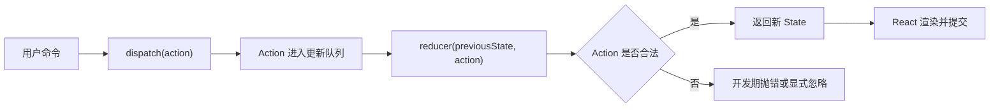

# React useState 与 useReducer：状态快照、更新队列与 Reducer 设计

> `useState` 与 `useReducer` 不是“小状态”和“大状态”的简单二选一。它们共享状态快照与排队更新模型，区别在于：状态转移逻辑由调用点分散表达，还是由 Reducer 集中建模。

---

## 一、本文解决什么问题

实际项目中，状态代码常见以下问题：

- 昂贵初始值在每次渲染时重复计算；
- 连续调用 Setter 却没有得到预期累加结果；
- Setter 后立即读取 State，误以为更新丢失；
- 原地修改对象后，界面没有更新；
- 多个 `useState` 更新遗漏某个字段，产生非法组合；
- Reducer 执行网络请求、修改参数，导致行为不可预测；
- Action 只描述“怎么改字段”，没有表达业务事件；
- Props 改变后盲目用 Effect 同步本地 State；
- 需要重置状态时，不清楚该 Dispatch、换 `key`，还是提升状态。

本文覆盖大纲中的 Lazy Initializer、Functional Update、Batching、State Snapshot、`Object.is`、Reducer Purity、Action 设计与状态重置。

本文以现代 React 函数组件为背景。状态快照、Updater/Reducer 必须纯净等属于公开编程模型；Update Queue、Lane、Eager State 等是版本相关内部实现，不应成为业务代码依赖。批处理的覆盖范围受 React 版本、Root 类型和同步边界影响，项目应以锁定版本的官方文档与实测结果为准。

### 核心结论

1. `useState(initialState)` 只在组件该次挂载的初始化阶段使用初始值；昂贵计算应传 Lazy Initializer 函数。
2. State 是一次 Render 的快照，Setter 排队下一次更新，不会改写当前函数中的变量。
3. 新状态依赖先前状态或同一批次中的前序更新时，应使用 Functional Update。
4. Batching 合并的是渲染机会，不是简单丢弃更新；React 会按队列语义处理 Update。
5. React 使用 `Object.is` 比较前后状态；原地修改并传回同一引用可能被跳过。
6. `useState` 适合局部且转移简单的状态；`useReducer` 适合事件多、转移相关且需要集中维护不变量的状态。
7. Reducer 与 Updater 必须是纯函数，不能修改输入或执行副作用。
8. Action 应描述“发生了什么”，并用判别联合约束 Payload，而不是暴露任意字段补丁。
9. 状态重置是身份与所有权问题：可以显式返回初始状态、通过 `key` 创建新身份，或把事实源提升到更合适的位置。

---

## 二、共同模型：状态属于一次渲染快照


组件函数执行一次，就得到一组固定的 Props、State 和事件处理函数。事件处理函数闭包捕获的是这一次 Render 的值：

```tsx
function Counter() {
  const [count, setCount] = useState(0);

  function handleClick() {
    setCount(count + 1);
    console.log(count); // 仍是当前 Render 的 count
  }

  return <button onClick={handleClick}>{count}</button>;
}
```

`setCount` 提交更新请求，React 在后续 Render 中提供新快照。它不是对局部变量 `count` 的赋值，也不保证 DOM 已在 Setter 返回前完成更新。

> 判断 State 是否“更新成功”，应观察后续渲染结果或与外部系统同步的明确时机，而不是在同一个闭包里立即打印旧变量。

---

## 三、`useState` 的初始化语义

### 3.1 直接初始值

```tsx
const [quantity, setQuantity] = useState(1);
```

首次挂载时，React 用 `1` 初始化状态。后续 Render 仍会执行 `useState(1)` 这段表达式，但 React 不会因为参数仍是 `1` 就覆盖当前状态。

### 3.2 Lazy Initializer

如果创建初始状态需要解析大量数据或访问同步存储，应传入函数：

```tsx
type Draft = {
  title: string;
  content: string;
};

function readDraft(): Draft {
  const raw = window.localStorage.getItem('article-draft');
  if (!raw) return { title: '', content: '' };

  try {
    const value: unknown = JSON.parse(raw);
    if (
      typeof value === 'object' &&
      value !== null &&
      'title' in value &&
      'content' in value &&
      typeof value.title === 'string' &&
      typeof value.content === 'string'
    ) {
      return { title: value.title, content: value.content };
    }
  } catch {
    // 损坏缓存回退为空草稿。
  }

  return { title: '', content: '' };
}

function Editor() {
  const [draft, setDraft] = useState<Draft>(readDraft);
  // ...
}
```

以下写法会在每次 Render 时先执行 `readDraft()`，即使 React 只采用首次结果：

```tsx
const [draft, setDraft] = useState<Draft>(readDraft()); // 不适合昂贵初始化
```

Initializer 应保持纯净。开发环境的 Strict Mode 可能额外调用它以发现不纯逻辑，所以不能在其中删除数据、发送请求、写日志计费或修改外部对象。

### 3.3 SSR 与浏览器 API 边界

如果组件参与服务端渲染，Initializer 可能在服务端执行，`window`、`localStorage` 不可用；而且服务端初始输出与客户端首次输出不一致会造成 Hydration 问题。

此时应根据产品语义选择：

- 从服务端可用数据生成一致初始状态；
- 把浏览器存储读取放到仅客户端边界；
- Hydration 后再同步外部存储，并设计明确加载态；
- 使用框架提供的客户端组件或持久化机制。

Lazy Initializer 只表示“延迟到初始化时计算”，不表示“只在浏览器运行”。

---

## 四、Functional Update：基于队列中的前序结果

### 4.1 直接值更新

```tsx
setCount(count + 1);
```

适合下一状态只依赖当前事件快照，且该调用点不需要组合同一批次中的前序更新。

### 4.2 函数式更新

```tsx
setCount(current => current + 1);
```

Updater 接收 React 在处理队列时提供的前一个状态。连续更新时，它能串联前序结果：

```tsx
function addThree() {
  setCount(current => current + 1);
  setCount(current => current + 1);
  setCount(current => current + 1);
}
```

若原值为 `0`，队列概念上依次得到 `1`、`2`、`3`。相反，下面三个表达式都捕获同一个 `count`：

```tsx
function addThree() {
  setCount(count + 1);
  setCount(count + 1);
  setCount(count + 1);
}
```

### 4.3 异步回调中的更新

```tsx
function LikeButton() {
  const [likes, setLikes] = useState(0);

  function handleLike() {
    window.setTimeout(() => {
      setLikes(current => current + 1);
    }, 500);
  }

  return <button onClick={handleLike}>赞 {likes}</button>;
}
```

函数式更新避免定时器依赖创建时的 `likes`。但它只解决“如何基于最新队列状态计算”，不会自动解决请求重复、组件卸载、服务端幂等或乐观更新回滚。

### 4.4 Updater 必须纯净

```tsx
setItems(current => {
  current.push(newItem); // 错误：修改旧状态
  analytics.track('item_added'); // 错误：副作用
  return current;
});
```

应返回新值，并把副作用放在用户命令或外部同步边界：

```tsx
function handleAdd(newItem: Item) {
  setItems(current => [...current, newItem]);
  analytics.track('item_added', { itemId: newItem.id });
}
```

开发 Strict Mode 可能额外调用 Updater 检查纯度。纯函数即使被重算也产生相同结果，不会重复污染外部系统。

---

## 五、Batching：合并渲染机会，不是立即赋值

批处理（Batching）允许 React 收集一组状态更新，在合适时机统一渲染，避免每个 Setter 都产生一次独立 Commit。

```tsx
function CheckoutButton() {
  const [submitting, setSubmitting] = useState(false);
  const [error, setError] = useState<string | null>(null);

  function prepareSubmit() {
    setSubmitting(true);
    setError(null);
  }

  return <button onClick={prepareSubmit}>{submitting ? '提交中' : '提交'}</button>;
}
```

关键点：

- React 会把 Update 排入各自队列；
- 同一批中的多个更新可在一次 Render 中计算；
- 同一状态的多个 Updater 仍按队列语义组合；
- 事件处理函数中的 State 变量仍属于原快照；
- 不应依赖某段代码“恰好产生几次 Render”。

现代 React 扩展了自动批处理范围，但旧版 Legacy Root、第三方集成、`flushSync` 等边界可能表现不同。`flushSync` 是少数宿主集成场景的同步逃生口，会降低调度自由度，不应作为读取最新 State 的常规方案。

### 5.1 多个 Setter 是否应该合并成 Reducer

一次事件调用多个 Setter 并不天然错误。选择依据是状态是否共同表达一个业务转移：

- 相互独立、更新简单：多个 `useState` 更直接；
- 必须原子地维护不变量、事件种类多：`useReducer` 更易审查；
- 能从 Props/State 派生：不应再存一份 State。

批处理可以减少 Commit，但不会替你保证业务不变量。

---

## 六、`Object.is` 与状态相等性

React 使用 `Object.is` 比较新旧 State。若相等，React 可以跳过不必要的更新工作。

```tsx
const [profile, setProfile] = useState({ name: 'Ada', city: 'London' });

function rename() {
  profile.name = 'Grace';
  setProfile(profile); // 同一对象引用，可能被视为未变化
}
```

正确做法是不可变更新：

```tsx
function rename() {
  setProfile(current => ({ ...current, name: 'Grace' }));
}
```

`Object.is` 有两个容易混淆的边界：

```typescript
Object.is(NaN, NaN); // true
Object.is(0, -0);    // false
```

业务状态通常不应依赖这些数值边界制造更新。更重要的是：对象和数组按引用比较，React 不会深比较字段。

### 6.1 相等状态是否保证组件函数完全不执行

不能把 Bailout 理解成“Setter 调用后组件函数绝对不会执行”。React 可能为了确认结果而开始部分工作，再跳过子树提交；内部调度细节不是应用契约。组件必须保持纯净，性能结论应通过 Profiler 测量。

---

## 七、何时选择 `useState`，何时选择 `useReducer`

| 维度 | `useState` | `useReducer` |
|---|---|---|
| 状态形态 | 单值或少量独立值 | 多字段共同表达一个模型 |
| 更新方式 | 调用点直接给值或 Updater | Dispatch 业务 Action |
| 转移逻辑 | 分散在事件处理函数 | 集中在 Reducer |
| 不变量 | 简单 | 需要统一维护 |
| 可测试性 | 通过组件行为测试 | Reducer 可额外做纯函数单测 |
| 样板成本 | 较低 | Action、Reducer 增加结构 |
| 适合场景 | Toggle、输入值、局部选择 | 表单流程、购物车编辑、复杂交互状态 |

对象 State 并不自动意味着必须用 Reducer；状态行数多也不是充分理由。真正判断标准是状态转移是否复杂、是否分散、是否需要集中约束合法变化。

---

## 八、`useReducer` 的执行模型

```tsx
const [state, dispatch] = useReducer(reducer, initialArg, init?);
```

调用 `dispatch(action)` 时，React 把 Action 作为更新排入队列。后续 Render 处理中，React 以先前状态和 Action 调用 Reducer，得到下一状态：

```text
nextState = reducer(previousState, action)
```



Reducer 负责确定性状态转移，不负责执行命令。请求、存储、Analytics、导航等副作用应由事件处理层或 Effect 等外部同步边界承担。

### 8.1 Lazy Initialization

`useReducer` 的第三个参数可把初始参数映射成初始 State：

```tsx
type CartState = {
  items: Record<string, number>;
  coupon: string | null;
};

function createCartState(initialItems: Array<{ id: string; quantity: number }>): CartState {
  return {
    items: Object.fromEntries(
      initialItems.map(item => [item.id, Math.max(1, item.quantity)]),
    ),
    coupon: null,
  };
}

const [state, dispatch] = useReducer(cartReducer, initialItems, createCartState);
```

第三个参数避免在每次 Render 时执行初始化转换，也让 Reset 可以复用同一初始化规则。Initializer 同样必须纯净，并处理输入校验和默认值。

---

## 九、Reducer Purity：可重放才可调度

纯 Reducer 满足：

- 相同 `state` 和 `action` 得到相同结果；
- 不修改传入的 State、Action 或其他外部对象；
- 不执行请求、定时器、存储、DOM、日志计费等副作用；
- 不依赖当前时间、随机数或隐式可变全局状态。

### 9.1 错误 Reducer

```tsx
function cartReducer(state: CartState, action: CartAction): CartState {
  if (action.type === 'itemAdded') {
    state.items[action.productId] = 1; // 修改旧状态
    void fetch('/api/cart');           // 副作用
    return state;
  }

  return state;
}
```

### 9.2 纯 Reducer

```tsx
function cartReducer(state: CartState, action: CartAction): CartState {
  switch (action.type) {
    case 'itemAdded': {
      const quantity = state.items[action.productId] ?? 0;
      return {
        ...state,
        items: {
          ...state.items,
          [action.productId]: quantity + 1,
        },
      };
    }

    case 'itemRemoved': {
      const { [action.productId]: removed, ...remainingItems } = state.items;
      return { ...state, items: remainingItems };
    }

    default:
      return assertNever(action);
  }
}
```

```typescript
function assertNever(value: never): never {
  throw new Error(`Unhandled action: ${JSON.stringify(value)}`);
}
```

开发 Strict Mode 可能额外调用 Reducer 与 Initializer 来暴露不纯逻辑。只要 Reducer 纯净，重复计算不会重复副作用或破坏输入。

---

## 十、Action 设计：描述事件而不是字段补丁

推荐使用 TypeScript 判别联合：

```typescript
type CartAction =
  | { type: 'itemAdded'; productId: string }
  | { type: 'itemRemoved'; productId: string }
  | { type: 'quantityChanged'; productId: string; quantity: number }
  | { type: 'couponApplied'; code: string }
  | { type: 'reset'; initialItems: Array<{ id: string; quantity: number }> };
```

Action 名称表达领域事件，Reducer 决定哪些字段一起变化。相比下面的通用补丁，它更容易搜索、审计和维护不变量：

```typescript
type WeakAction = {
  type: 'patch';
  payload: Partial<CartState>;
};
```

通用 Patch 把合法性责任推给每个调用点，调用方可以制造 `items`、折扣和提交状态互相矛盾的组合。

### 10.1 Payload 在进入 Reducer 前校验

Reducer 可以防守业务边界：

```tsx
case 'quantityChanged': {
  if (!Number.isInteger(action.quantity) || action.quantity < 1) {
    return state;
  }

  if (!(action.productId in state.items)) {
    return state;
  }

  return {
    ...state,
    items: { ...state.items, [action.productId]: action.quantity },
  };
}
```

但服务端数据、URL、存储等运行时输入仍需在系统边界做 Schema Validation。TypeScript 只检查编译期代码，不能证明外部 JSON 合法。

### 10.2 命令、Action 与副作用

```tsx
async function handleApplyCoupon(code: string) {
  setApplying(true);

  try {
    const coupon = await couponService.validate(code);
    dispatch({ type: 'couponApplied', code: coupon.code });
  } catch (error) {
    setCouponError(toErrorMessage(error));
  } finally {
    setApplying(false);
  }
}
```

这里网络调用是命令层职责；成功后 Dispatch 一个已验证事件。真实项目还要处理取消、重复提交、响应乱序与卸载。不要为了“所有逻辑都进 Reducer”而把 Promise 放进 Reducer。

---

## 十一、状态重置的四种语义

“重置”并非单一操作，必须先确定身份与所有权。

### 11.1 Setter 显式恢复初始值

适合简单局部值：

```tsx
const EMPTY_FORM = { name: '', email: '' };

function clearForm() {
  setForm(EMPTY_FORM);
}
```

若后续会修改对象，仍须保持不可变更新；共享常量不能被原地修改。

### 11.2 Reducer Reset Action

适合保留组件身份，只重置 Reducer 管理的状态：

```tsx
case 'reset':
  return createCartState(action.initialItems);
```

Reset Action 应携带重建状态真正需要的输入，或由 Reducer 返回稳定默认值。不要让 Reducer偷偷读取变化的 Props 或全局变量。

### 11.3 改变 `key` 重建组件身份

```tsx
<CheckoutForm key={orderId} orderId={orderId} />
```

当 `orderId` 改变，React 创建新的组件身份，整个子树的 Hook State 重置，Effect 会清理并重新建立，DOM 与焦点也可能重建。

适用于“另一个订单就是另一份完整表单”；不适用于只清除某个错误字段。不要使用随机 Key，它会让每次 Render 都卸载重建。

### 11.4 受控状态由父级重置

如果状态事实源属于父级，子组件不应复制一份再自行重置：

```tsx
function QuantityInput({ value, onChange }: QuantityInputProps) {
  return (
    <input
      type="number"
      min={1}
      value={value}
      onChange={event => onChange(Number(event.target.value))}
    />
  );
}
```

重置由父级更新 `value`。这能避免父子两份 State 互相同步。

---

## 十二、Props 变化时是否应该重置 State

以下代码只在首次挂载时使用 `user.name`：

```tsx
function UserForm({ user }: { user: User }) {
  const [name, setName] = useState(user.name);
  // user 改变不会自动重置 name
}
```

这不是 Hook 失效，而是初始值语义。应按产品需求选择：

- 切换用户应丢弃整个草稿：以 `user.id` 作为表单 `key`；
- 切换用户仍保留同一编辑会话：不要重置；
- 父级拥有草稿：改为受控值；
- 值可由 Props 直接计算：删除重复 State；
- 只需重置部分字段：Dispatch 明确 Action。

用 Effect 无条件执行 `setName(user.name)` 往往会产生额外 Render，并可能覆盖用户尚未提交的编辑。它只有在确实需要同步一个外部变化到独立本地状态时才合理，而且必须定义冲突策略。

---

## 十三、常见误区

### 13.1 “初始值 Props 改变，State 会自动更新”

错误。Initializer 只在该组件身份挂载时使用。后续同步需要明确所有权或重置策略。

### 13.2 “连续 Setter 会互相覆盖，所以 React 丢了更新”

不准确。直接值可能来自同一快照；依赖前序结果时应用 Functional Update。

### 13.3 “批处理等于所有更新只保留最后一个”

错误。React 按更新队列计算；多个函数式更新可以依次组合。批处理主要减少中间渲染与 Commit。

### 13.4 “对象字段改了，React 应该深比较出来”

错误。State 相等性使用 `Object.is`，对象按引用判断。必须返回新引用并保持结构共享。

### 13.5 “所有对象 State 都应该换成 `useReducer`”

错误。选择依据是转移复杂度与不变量，不是数据是否为对象。

### 13.6 “Reducer 里请求数据更集中”

错误。Reducer 必须纯净；副作用属于命令或外部同步层。

### 13.7 “随机 `key` 可以确保界面总是最新”

错误。随机 Key 会持续卸载重建，丢失状态、焦点和资源，并掩盖所有权问题。

---

## 十四、测试与验证

### 14.1 Reducer 纯函数测试

```typescript
it('increments an existing cart item without mutating previous state', () => {
  const previous: CartState = {
    items: { book: 1 },
    coupon: null,
  };

  const next = cartReducer(previous, {
    type: 'itemAdded',
    productId: 'book',
  });

  expect(next.items.book).toBe(2);
  expect(previous.items.book).toBe(1);
  expect(next).not.toBe(previous);
  expect(next.items).not.toBe(previous.items);
});
```

Reducer 测试应覆盖：

- 每种 Action 的合法转移；
- 非法 Payload 的处理；
- 原 State 未被修改；
- 未受影响分支是否保留引用；
- Reset 是否恢复完整不变量；
- 未处理 Action 是否在开发期暴露。

### 14.2 组件行为测试

不要只单测 Reducer。还应通过用户事件验证：

- 连续点击与批量操作结果；
- Loading 时重复提交是否被阻止；
- 切换实体时草稿应保留还是重置；
- 错误后能否修改并重试；
- 键盘和辅助技术操作是否与点击一致。

### 14.3 性能验证

`useReducer` 不天然比 `useState` 快或慢。两者的性能取决于更新频率、组件边界、Context 传播、计算量与 DOM 工作。

应在生产构建和目标设备上，用 React Profiler 观察 Commit 次数、渲染原因与耗时，再用浏览器 Performance 面板定位脚本、布局和绘制。不要为了减少理论 Render 次数而合并无关 State，也不要在没有测量时添加大量记忆化。

---

## 十五、方案选择清单

- 状态是否可以从 Props 或其他 State 直接派生；
- 状态事实源应属于当前组件、父级还是外部 Store；
- 下一值是否依赖队列中的前序值；
- 多个字段是否共同维护一个不变量；
- Action 是否表达业务事件，而非任意 Patch；
- Updater、Reducer 与 Initializer 是否纯净；
- 外部输入是否经过运行时校验；
- 异步命令是否处理错误、取消、重复和竞态；
- 重置是清空字段、恢复 Reducer、切换组件身份还是父级控制；
- 是否在 Strict Mode、行为测试和生产性能环境中验证。

---

## 十六、总结

1. `useState` 与 `useReducer` 都遵循 State Snapshot 和排队更新模型。
2. Lazy Initializer 避免重复执行昂贵初始化，但必须纯净并考虑 SSR 环境。
3. Functional Update 以队列中的前一个状态为输入，适合累加和异步回调。
4. Batching 合并渲染机会，不改变当前闭包中的 State 快照。
5. React 通过 `Object.is` 判断新旧 State，相同对象引用不会触发深比较。
6. `useState` 强调直接、局部更新；`useReducer` 强调集中、事件驱动的状态转移。
7. Reducer、Updater 和 Initializer 都不能执行副作用或修改输入。
8. Action 应表达“发生了什么”，并通过类型和运行时校验守住边界。
9. 状态重置应根据组件身份与所有权选择 Setter、Reset Action、`key` 或受控模式。
10. 选择 Hook 的目标是让状态模型更正确、更易测试，而不是追求 API 形式统一。

真正重要的不是把 `useState` 全部重构成 `useReducer`，而是让每次状态变化都能回答：它基于哪份快照、由什么事件触发、必须维护哪些不变量，以及失败或重置时谁拥有最终决定权。

---

## 问答复盘

### Q1：`useState(createInitialState())` 与 `useState(createInitialState)` 有什么区别？

**答：** 前者每次 Render 都会先执行函数，后者把函数作为 Lazy Initializer，只在该组件身份初始化时用于计算初始 State。

### Q2：Setter 返回后为什么立即打印的还是旧 State？

**答：** 事件处理函数属于当前 Render 快照；Setter 排队后续更新，不会改写该闭包中的局部变量。

### Q3：什么时候必须使用 Functional Update？

**答：** 下一状态依赖前一个排队状态时，特别是连续更新或异步回调，应使用 `current => next`，避免依赖旧闭包快照。

### Q4：批处理是否会丢弃同一状态的前几个更新？

**答：** 不会简单丢弃。React 按队列语义计算更新；直接值可能结果相同，多个函数式更新则会依次组合。

### Q5：修改对象后调用 `setState(sameObject)` 为什么可能不更新？

**答：** React 使用 `Object.is` 比较新旧 State，对象引用未变会被视为相同；同时原地修改也破坏快照和并发推理。

### Q6：拥有五个字段是否就应该使用 `useReducer`？

**答：** 不一定。关键看字段是否共同参与复杂状态转移和不变量；五个独立输入仍可使用多个 `useState`。

### Q7：Reducer 为什么不能执行网络请求？

**答：** Reducer 可能被重算或额外调用，必须保持确定和可重放。请求应在命令层执行，成功或失败后再 Dispatch 事实事件。

### Q8：Props 对应的实体改变时，如何重置表单最合理？

**答：** 若新实体代表全新表单身份，可用稳定实体 ID 作为 `key`；若只重置部分字段，应 Dispatch 明确 Action；父级拥有状态时由父级更新。

### Q9：如何验证从 `useState` 改成 `useReducer` 的收益？

**答：** 看状态转移是否更集中、不变量是否更易测试、调用点是否更清晰；性能必须用生产构建和 Profiler 实测，不能凭 Hook 类型判断。

---

## 延伸知识

- **`useEffect`**：外部系统同步、依赖数组、Cleanup、竞态与取消。
- **不可变更新**：结构共享、引用相等、数组与嵌套对象更新。
- **UI 状态机**：判别联合、合法迁移、并发事件与乐观更新。
- **Context 与外部 Store**：共享状态所有权、订阅粒度与一致性。
- **Transition**：紧急与非紧急更新、并发渲染与用户体验。
- **服务端状态**：缓存、请求去重、失效、重试与乐观回滚。
