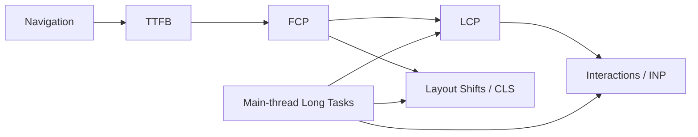
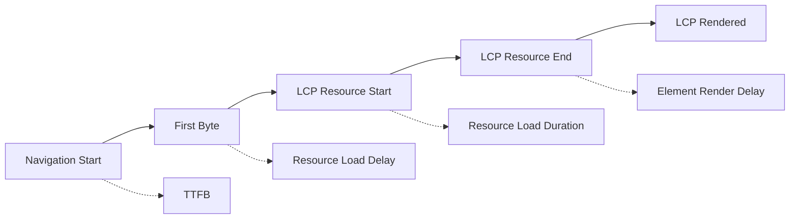
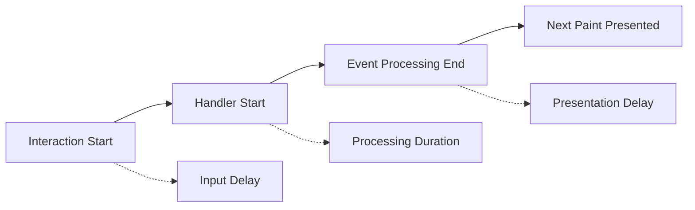
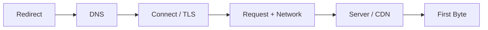
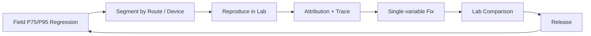
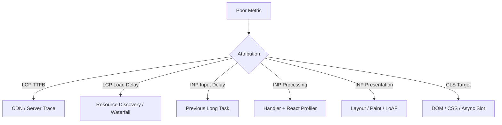
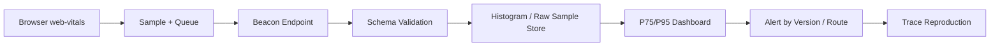

# React Web Vitals：LCP、INP、CLS 的采集、归因与治理

> Web Vitals 不是一组 Lighthouse 分数，而是从真实页面生命周期观察加载、响应和视觉稳定性的指标协议。只有把 Metric Value 与 Route、元素、交互、资源、主线程任务和用户分群连接起来，指标才具备修复价值。

---

## 一、为什么只看“页面加载时间”不够

用户说“页面慢”，可能指完全不同的问题：

- 地址打开后很久仍是空白；
- 很早出现 Header，但主内容迟迟不显示；
- 页面已经显示，点击按钮却没有及时反馈；
- 图片、广告或异步组件突然插入，导致内容跳动；
- 首次访问慢，但站内 Route 切换正常；
- 实验室测试正常，真实低端设备的长尾仍然很差。

单个 `load` Event 或“接口耗时”无法表达这些体验。Web Vitals 将问题拆成多个用户中心维度：



- TTFB（Time to First Byte）描述文档首字节到达；
- FCP（First Contentful Paint）描述第一个内容像素出现；
- LCP（Largest Contentful Paint）描述视口主要内容出现；
- INP（Interaction to Next Paint）描述页面生命周期内交互响应；
- CLS（Cumulative Layout Shift）描述非预期布局偏移。

其中 LCP、INP、CLS 是当前 Core Web Vitals。TTFB 和 FCP 是重要诊断指标，但不属于 Core Web Vitals 三项本身。

本文以当前 Web Vitals 公开定义、Performance API 和 `web-vitals` 包为依据。指标定义、浏览器支持和 Soft Navigation 能力仍会演进；项目应锁定依赖版本并查阅目标浏览器文档。文中阈值是官方评级边界，不是所有产品都应直接采用的 Performance Budget。

### 核心结论

1. Core Web Vitals 是 LCP、INP 和 CLS；TTFB、FCP 用于补充加载链路诊断。
2. 官方通常以真实用户第 75 百分位评估，并分别观察 Mobile 与 Desktop；平均值不能替代分位数。
3. LCP 应拆成 TTFB、Resource Load Delay、Resource Load Duration 和 Element Render Delay。
4. INP 应拆成 Input Delay、Processing Duration 和 Presentation Delay，不能只优化 Event Handler。
5. CLS 使用 Session Window 计算非预期位移，页面加载后发生的 Shift 仍可能计入。
6. FCP 只表示出现了第一个内容，不代表主内容可用；TTFB 快也不代表前端渲染快。
7. Field Data 描述真实分布，Lab Data 用于复现与归因；Lighthouse 的实验室结果不能替代真实 INP 分布。
8. 原生 `PerformanceObserver` 适合底层观测，但 Core Web Vitals 的生命周期和聚合规则优先使用经过验证的 `web-vitals` 库。
9. Attribution 应记录安全、低基数的 Target、阶段与 Route 信息，不能上传敏感 DOM Selector 或完整 URL。
10. Long Task 是主线程超过 50 ms 的任务信号，不等于根因，也不等于某次交互一定很慢。
11. React Render、Commit、Hydration 和 Suspense 可能影响指标，但 Web Vitals 不能自动指出具体组件，应与 Profiler 和 Trace 联合分析。
12. SPA Soft Navigation 的标准化支持仍有浏览器和语义差异，硬导航与软导航数据必须分开标记。

---

## 二、指标与评级边界

当前官方常用评级如下：

| 指标 | Good | Needs Improvement | Poor | 单位 |
|---|---:|---:|---:|---|
| LCP | `<= 2500` | `> 2500 且 <= 4000` | `> 4000` | ms |
| INP | `<= 200` | `> 200 且 <= 500` | `> 500` | ms |
| CLS | `<= 0.1` | `> 0.1 且 <= 0.25` | `> 0.25` | Score |
| TTFB | `<= 800` | `> 800 且 <= 1800` | `> 1800` | ms |
| FCP | `<= 1800` | `> 1800 且 <= 3000` | `> 3000` | ms |

边界值在官方实现中按 Good 一侧处理，例如 LCP `2500 ms` 仍属于 Good。

### 2.1 评级阈值不等于项目预算

官方阈值是跨站点的通用体验分类。项目预算还应考虑：

- 业务价值和用户预期；
- 主要设备、浏览器和地区；
- 页面类型和访问频率；
- Cold/Warm Cache；
- Hard/Soft Navigation；
- 页面生命周期长度；
- 当前基线和改进余量。

如果团队把预算恰好设在 Good 边界，真实波动很容易让 P75 越界。通常应预留 Margin，并同时设置内部更严格目标与公开评级目标。

### 2.2 为什么使用第 75 百分位

以 P75 观察，意味着至少约 75% 的有效访问应落在目标范围内。它比 Average 更能暴露一部分慢用户，又比极端 P99 更适合跨站点稳定评级。

工程监控仍可同时观察 P50、P75、P95 和 P99。Core Web Vitals 的评级统计口径与内部 SLO 不必完全相同，但必须在图表中明确 Metric、Percentile、Device Class 和 Navigation Type。

---

## 三、LCP：主要内容何时真正出现

Largest Contentful Paint 观察视口中最大的候选内容元素何时完成绘制。常见候选包括大图、视频 Poster、背景图和较大的文本块，具体资格与浏览器实现以当前规范为准。

LCP Candidate 可能随着页面加载不断变化：先是标题，随后主图成为更大候选。用户交互、页面隐藏等生命周期事件会使最终值确定，自己手写一个 Observer 很容易过早上报错误候选。

### 3.1 LCP 的四段模型



| 子阶段 | 含义 | 常见根因 |
|---|---|---|
| TTFB | Navigation 到首字节 | Redirect、CDN、网络、服务器处理 |
| Resource Load Delay | 首字节到 LCP 资源开始请求 | 资源发现晚、Client Fetch、懒加载、优先级低 |
| Resource Load Duration | LCP 资源请求到完成 | 图片过大、网络慢、源站慢 |
| Element Render Delay | 资源完成到元素绘制 | CSS/JS 阻塞、React 等待、字体、隐藏逻辑 |

这四段相加接近 LCP。文本 LCP 或没有独立资源的候选，资源加载相关阶段可能为 `0`，时间主要落在 TTFB 和 Render Delay。

### 3.2 React 应用常见 LCP 问题

#### 在 `useEffect` 中请求首屏主内容

```tsx
function ProductHero({ productId }: Props) {
  const [product, setProduct] = useState<Product | null>(null);

  useEffect(() => {
    fetchProduct(productId).then(setProduct);
  }, [productId]);

  return product ? <Hero product={product} /> : <HeroSkeleton />;
}
```

请求必须等待 JavaScript 下载、执行、React Render 和 Commit 后才开始，容易放大 Resource Load Delay。首屏关键数据更适合由 SSR、Route Loader、Server Component 或 HTML 可发现资源提前提供，具体方案取决于框架。

#### 对 LCP 图片使用无条件 Lazy Loading

首屏主图如果设置低优先级或 `loading="lazy"`，浏览器可能延迟请求。应让关键图片在 HTML 中可发现，使用正确尺寸与响应式 Source；是否需要 Preload 或高 Fetch Priority 必须通过 Waterfall 验证，不能给所有图片提权。

#### Suspense Fallback 与真实内容尺寸不同

Fallback 很早 Paint，但不会让真实主要内容更早完成。若主内容 Chunk、数据或字体很晚就绪，LCP 仍可能变差；Fallback 与真实内容尺寸差异还可能带来 CLS。

### 3.3 LCP 优化应按阶段处理

- TTFB 高：检查 Redirect、CDN Cache、服务器和区域网络；
- Load Delay 高：让资源进入初始 HTML，减少 Client Waterfall，调整正确优先级；
- Load Duration 高：优化图片格式、尺寸、压缩、CDN 和缓存；
- Render Delay 高：减少阻塞 CSS/JS、同步主线程工作和不必要隐藏；
- LCP Target 不稳定：按 Route 和 Target Attribution 分组，不要只看全站值。

降低图片字节不会修复高 TTFB；加 Preload 也不会修复主线程被长任务占满。先看 Attribution，再选择方案。

---

## 四、INP：页面生命周期中的交互响应

Interaction to Next Paint 观察 Click、Tap 和 Keyboard Interaction 从开始到下一次 Paint 的延迟。Hover 和 Scroll 本身不按同样方式进入 INP Interaction 集合。

INP 不是简单取页面绝对最大值。当前算法会估计接近最慢的代表性交互，例如随着 Interaction Count 增加，每约 50 次交互允许忽略一个极端值，以降低偶发异常的影响。工程上仍可把它理解为页面生命周期中的近最坏交互体验。

### 4.1 INP 的三段模型



| 子阶段 | 含义 | 常见根因 |
|---|---|---|
| Input Delay | 输入到浏览器开始处理 Handler | 前一个 Long Task、Hydration、第三方脚本、主线程拥塞 |
| Processing Duration | 事件回调处理时间 | 同步业务逻辑、React Update、序列化、复杂计算 |
| Presentation Delay | Handler 结束到下一帧呈现 | 后续脚本、Style/Layout、Paint、Raster、复杂 DOM |

只把 Event Handler 改短，不代表 Presentation Delay 会下降；只减少 React Render，也不能修复用户点击前已经存在的 Long Task。

### 4.2 React 中的 INP 根因

- 顶层 State 更新让大组件树参与紧急 Render；
- Context Value 高频变化，扩大订阅更新；
- Handler 内同步过滤、排序或 Schema Parse；
- 大量 DOM Mutation 触发昂贵 Layout/Paint；
- Hydration 或启动脚本占用主线程，输入长期排队；
- 第三方 Analytics、Editor 或 Chart 在同一 Task 工作；
- Controlled Input 的紧急更新与昂贵派生结果耦合。

`startTransition` 可以把非紧急 React Update 标记为 Transition，但不能取消 Handler 中已经发生的同步计算，也不能修复第三方 Long Task。Controlled Input 自身的 Value 更新仍应保持紧急，昂贵结果可独立延迟。

### 4.3 给用户及时反馈

复杂操作至少应尽快 Commit 一个可见反馈，例如按下状态、Pending Label 或局部进度，然后再处理非紧急结果。注意：把最终工作放入稍后的另一个巨大 Task，可能改善当前交互的下一 Paint，却让后续输入或业务完成时间变差。

因此应同时观察：

- INP 及三个子阶段；
- Long Task / Long Animation Frame；
- React Profiler Commit；
- 业务完成时间；
- 输入正确性和结果一致性。

---

## 五、CLS：非预期位移是否破坏阅读与操作

Cumulative Layout Shift 不是所有 Layout 的累计时间，而是非预期布局偏移分数。单次 Layout Shift Score 通常由 Impact Fraction 与 Distance Fraction 共同决定。

### 5.1 Session Window

当前 CLS 将相邻 Shift 聚合到 Session Window：

- 相邻 Shift 间隔小于约 `1 s`；
- 一个 Window 最长约 `5 s`；
- 页面 CLS 取分数最高的 Window；
- 带有 Recent User Input 的预期 Shift 通常被排除。

因此 CLS 名称虽然保留 “Cumulative”，却不是把一个长页面生命周期内所有 Shift 永远相加。页面加载后很久发生的非预期 Shift 仍可能形成新的高分 Window。

### 5.2 React 常见 CLS 来源

- ``、Video、Ad、Embed 没有稳定尺寸；
- 异步数据返回后在现有内容上方插入 Banner；
- Suspense Fallback 与真实内容高度差异大；
- Web Font 替换造成文字重新排版；
- Hydration 前后 DOM/CSS 不一致；
- 条件组件 Mount 后改变父级尺寸；
- Sticky Header、Cookie Prompt 或错误提示突然出现；
- Skeleton 没有使用与最终内容一致的 Grid/Aspect Ratio。

### 5.3 修复原则

```tsx
function ProductImage({ src, alt }: Props) {
  return (
    
  );
}
```

`width` 和 `height` 可帮助浏览器在资源到达前计算 Aspect Ratio 并预留空间。其他原则包括：

- 为异步 Slot 预留稳定 `min-height` 或 `aspect-ratio`；
- 在用户操作附近插入内容时避免推动已经阅读区域；
- 动画优先使用不会触发布局的 `transform` 与 `opacity`，并验证可访问性；
- 优化字体加载和 Fallback Font Metrics；
- 让 SSR、Hydration 和 Client Render 输出结构一致；
- 使用 Attribution 找到最大 Shift Target 和发生时间。

不要通过固定整个页面高度来“消灭 CLS”，这可能制造巨大空白、截断内容和响应式问题。目标是稳定合理布局，不是只压低分数。

---

## 六、TTFB：首字节之前发生了什么

TTFB 衡量 Navigation Request 从开始到收到首字节的时间，通常包含：

- Redirect；
- DNS Lookup；
- TCP/TLS Connection；
- 网络往返；
- CDN/Proxy Queue；
- 服务器处理；
- 首字节返回路径。



### 6.1 TTFB 是 LCP 的地基

初始 HTML 还未返回时，浏览器通常无法发现其中的 LCP 图片、CSS 和 Script。TTFB 增加会直接压缩后续所有阶段的预算。

但低 TTFB 不保证低 LCP：服务器很快返回一个空 Shell，客户端再下载大量 JavaScript 和请求数据，Element Render Delay 仍可能很高。

### 6.2 React 架构中的边界

- CSR：Document TTFB 可能很低，但真实内容等待 Client Fetch；
- SSR：服务器 Render 和数据请求可能增加 TTFB，却改善 FCP/LCP；
- Streaming SSR：首字节可较早返回，主要内容分块到达；
- Edge/Full-page Cache：可降低区域网络和服务器成本，但受个性化与失效策略限制；
- Server Components/Framework Loader：具体对 TTFB 与 LCP 的影响取决于 Waterfall、Cache 和 Streaming。

不要只优化一个指标。SSR 方案应同时测 TTFB、FCP、LCP、Hydration、INP 和服务器成本。

### 6.3 API TTFB 不等于 Document TTFB

Web Vitals 的 TTFB 通常针对页面 Navigation。React 页面中的 API 请求应通过 Resource Timing、Server-Timing 和业务 Trace 分别观测，不能把任意 Fetch 的 `responseStart` 混入页面 TTFB 图表。

---

## 七、FCP：第一个内容出现，但不一定有用

First Contentful Paint 表示浏览器首次绘制来自 DOM 的内容，例如文本、图片、SVG 或 Canvas。它比 First Paint 更接近用户看到内容的时刻，但仍可能只是 Logo、Header 或 Loading Text。

### 7.1 FCP 与 LCP 的差异

```text
FCP：页面不再是纯空白
LCP：视口主要内容候选已经绘制
```

FCP 很快、LCP 很慢，通常说明先显示了次要内容或 Skeleton，主要内容仍被数据、资源或 JavaScript Waterfall 阻塞。

### 7.2 React 中常见影响因素

- HTML 只有空 Root，需要等待整个 Client Bundle；
- Render-blocking CSS、字体或同步 Script；
- 客户端启动执行时间过长；
- Hydration 前隐藏 Server HTML；
- 错误的 Loading Strategy 长时间保持空白；
- Prerender/SSR 输出与客户端激活流程不协调。

SSR 常能改善首次内容出现，但如果 Hydration 长任务阻塞交互，INP 仍可能很差。FCP 只是加载体验的一部分。

---

## 八、Field Data 与 Lab Data：真实分布和可调试证据

### 8.1 Field Data

Field Data 来自真实用户环境，例如自建 RUM、Chrome User Experience Report（CrUX）或监控平台：

- 包含真实设备、网络、缓存和页面生命周期；
- 可观察 P75/P95 和长尾分群；
- 能发现 Lab 没覆盖的登录态、数据规模和地理问题；
- 归因上下文有限，受采样、隐私和浏览器支持影响。

Core Web Vitals 的公开评级通常在第 75 百分位分别观察 Mobile 和 Desktop。内部 RUM 还应按 Route、版本、设备档位、网络、地区和 Navigation Type 切分。

### 8.2 Lab Data

Lab Data 来自 Lighthouse、DevTools 或自动化浏览器：

- 环境与操作可控；
- 可保存 Network Waterfall、Main Thread 和截图；
- 适合发布前回归和根因定位；
- 无法自然覆盖真实用户分布和长生命周期交互。

Lighthouse 页面加载测试无法得到真实页面生命周期的 Field INP，通常使用 Total Blocking Time（TBT）等加载期代理指标。开发者可以在 DevTools 中执行具体交互并观察 Event Timing/INP，但一次 Lab Interaction 不等于线上 P75 INP。

CLS 也可能在加载完成后因 Banner、Lazy Content 和用户流程继续增长，短 Lab Trace 容易漏掉。

### 8.3 推荐闭环



Field 告诉团队修什么和影响谁，Lab 告诉团队从哪里开始修。最终收益必须回到同一 Field Segment 验证。

---

## 九、React SPA 与 Soft Navigation

传统 Core Web Vitals 以完整 Document Navigation 为生命周期。React Router 在同一文档内修改 URL 和页面内容时，默认不会像新文档一样自动产生一整套独立指标。

### 9.1 当前 Soft Navigation 支持边界

当前 `web-vitals` 文档提供 `reportSoftNavs: true` 选项，并依赖浏览器 Soft Navigation 能力。其支持目前局限于较新的 Chromium 版本，其他浏览器可能仍只报告完整页面生命周期。

```ts
import { onCLS, onINP, onLCP } from 'web-vitals';

onCLS(reportMetric, { reportSoftNavs: true });
onINP(reportMetric, { reportSoftNavs: true });
onLCP(reportMetric, { reportSoftNavs: true });
```

这项能力和 Option 名称应按项目锁定的 `web-vitals` 版本确认。部署前必须 Feature Test，并将 `navigationType`、Browser Version 和 Soft Navigation ID 纳入数据上下文。

### 9.2 Soft 与 Hard 指标语义不同

当前 Soft Navigation 定义中：

- TTFB 通常记为 `0`，不是 Route Loader 第一个请求的等待；
- FCP/LCP 只观察 Soft Navigation 后的新 Paint，保留且未重绘的 Layout 元素不会重新成为候选；
- INP 会从 Soft Navigation 边界重新统计后续交互；
- False Positive/Negative 仍可能发生；
- 不支持的浏览器不会得到同样数据。

因此不要把 Hard Navigation LCP 和 Soft Navigation LCP 无差别聚合。站内 Route 还应保留自定义 Journey Metric，例如 Link Click 到 Route Main Content Ready，以获得跨浏览器的一致业务口径。

---

## 十、使用 `web-vitals` 采集指标

原生 API 的最终候选、Page Visibility、Back/Forward Cache 和 Interaction 聚合存在许多细节。工程中优先使用官方维护的 `web-vitals` 库：

```ts
import {
  onCLS,
  onFCP,
  onINP,
  onLCP,
  onTTFB,
} from 'web-vitals/attribution';

type RumMetric = {
  name: string;
  value: number;
  delta: number;
  rating: string;
  id: string;
  navigationType: string;
  attribution?: unknown;
};

function registerWebVitals() {
  onCLS(queueMetric);
  onFCP(queueMetric);
  onINP(queueMetric);
  onLCP(queueMetric);
  onTTFB(queueMetric);
}
```

这些注册函数通常应在一个 Page Lifecycle 中各调用一次。重复调用会创建额外 `PerformanceObserver` 和 Listener，长期 SPA 可能增加内存与上报重复。

### 10.1 发送最小必要数据

继续在同一个页面级采集模块中实现队列、脱敏和刷新：

```ts
type RumPayload = {
  name: string;
  value: number;
  delta: number;
  rating: string;
  id: string;
  navigationType: string;
  routeId: string;
  appVersion: string;
  attribution?: Record<string, number | string>;
};

const rumQueue: RumPayload[] = [];
const APP_VERSION = document.documentElement.dataset.appVersion ?? 'unknown';

const numericAttributionFields = [
  'timeToFirstByte',
  'resourceLoadDelay',
  'resourceLoadDuration',
  'elementRenderDelay',
  'inputDelay',
  'processingDuration',
  'presentationDelay',
  'largestShiftTime',
  'largestShiftValue',
] as const;

function getCurrentRouteId(): string {
  // 实际项目应从路由配置读取低基数 ID。
  return document.body.dataset.routeId ?? 'unknown';
}

function sanitizeAttribution(
  metric: RumMetric,
): Record<string, number | string> | undefined {
  if (!metric.attribution || typeof metric.attribution !== 'object') {
    return undefined;
  }

  const source = metric.attribution as Record<string, unknown>;
  const result: Record<string, number | string> = {};

  for (const field of numericAttributionFields) {
    const value = source[field];
    if (typeof value === 'number' && Number.isFinite(value)) {
      result[field] = value;
    }
  }

  // Target 必须由 generateTarget 生成，且只允许稳定业务标识。
  const target = source.target;
  if (typeof target === 'string' && /^[a-z0-9-]{1,64}$/i.test(target)) {
    result.target = target;
  }

  return Object.keys(result).length > 0 ? result : undefined;
}

function queueMetric(metric: RumMetric): void {
  const payload = {
    name: metric.name,
    value: metric.value,
    delta: metric.delta,
    rating: metric.rating,
    id: metric.id,
    navigationType: metric.navigationType,
    routeId: getCurrentRouteId(),
    appVersion: APP_VERSION,
    attribution: sanitizeAttribution(metric),
  };

  rumQueue.push(payload);
}

function flushMetrics(): void {
  if (rumQueue.length === 0) return;

  const body = new Blob([JSON.stringify(rumQueue.splice(0))], {
    type: 'application/json',
  });

  if (!navigator.sendBeacon('/rum/web-vitals', body)) {
    void fetch('/rum/web-vitals', {
      method: 'POST',
      body,
      keepalive: true,
    }).catch(() => {
      // RUM 不应阻断业务流程；丢包率应由服务端覆盖率监控。
    });
  }
}

registerWebVitals();

document.addEventListener('visibilitychange', () => {
  if (document.visibilityState === 'hidden') flushMetrics();
});
window.addEventListener('pagehide', flushMetrics);
```

`RumMetric` 是项目内部只依赖公共字段的稳定边界；具体 Attribution 类型应以项目锁定的 `web-vitals` 版本为准。不应假设所有指标具有相同字段，更不应直接序列化整个 Attribution 对象。示例中的 App Version 和 Route ID 应在实际工程中由 Build System 与 Router 注入。

`visibilitychange` 与 `pagehide` 用于尽力在页面转入后台或离开时刷新队列。`pagehide` 可能因 BFCache 多次发生，因此这里不使用仅执行一次的 Listener。`sendBeacon` 和 `fetch keepalive` 都存在 Payload Size 与浏览器限制。生产系统还应控制单批大小、采样率和队列上限，并监控客户端覆盖率，而不是将 RUM 失败升级为业务错误。

上报接口必须：

- 校验 Metric Name、Value、Version 和 Schema；
- 限制 Payload Size、频率与高基数字段；
- 不信任客户端 Rating 和 Route；
- 对 Bot、内部流量和恶意请求做治理；
- 记录 Sample Rate，以便正确估计分布；
- 遵守用户隐私、Consent 和数据保留策略。

### 10.2 使用库提供的 Rating

`metric.rating` 会按当前库版本的 Threshold 生成 `good`、`needs-improvement` 或 `poor`。不要在多个客户端重复硬编码不同阈值；后端仍应保存原始 Value，以便升级定义或重新聚合。

---

## 十一、PerformanceObserver：理解底层观测协议

`PerformanceObserver` 可异步接收浏览器 Performance Entry。使用前应检查支持的 Entry Type：

```ts
function supportsEntryType(type: string): boolean {
  return PerformanceObserver.supportedEntryTypes?.includes(type) ?? false;
}

if (supportsEntryType('paint')) {
  const paintObserver = new PerformanceObserver((list) => {
    for (const entry of list.getEntries()) {
      console.debug(entry.name, entry.startTime);
    }
  });

  paintObserver.observe({ type: 'paint', buffered: true });
}
```

`buffered: true` 允许读取 Observer 注册前已进入 Buffer 的记录。并非所有 Entry Type、字段和 Buffer 行为都在所有浏览器一致支持。

### 11.1 为什么不建议手写完整 Core Web Vitals

手写实现容易漏掉：

- Prerender Activation；
- Page Visibility 与后台页面；
- Back/Forward Cache Restore；
- LCP Finalization；
- CLS Session Window；
- INP Interaction Group 与近 P98 选择；
- Entry Duration Rounding；
- Soft Navigation 与不同浏览器能力；
- 页面隐藏时的最终上报。

原生 Observer 适合学习、补充自定义诊断和验证浏览器 Entry，不适合随意复制几行示例后当作生产 Core Web Vitals 实现。

### 11.2 Observer 生命周期

Observer 是资源，需要在测试、Micro-frontend Unmount 或重复初始化场景中 `disconnect()`。但全页面 RUM Observer 通常应覆盖完整 Page Lifecycle，不能因 React Route Component Unmount 就停止，否则会漏掉后续 INP 和 CLS。

---

## 十二、Attribution：从“指标差”定位“哪里差”

只有 Metric Value 的 Dashboard 很难修复。Attribution Build 会为不同指标提供诊断字段。

### 12.1 常见 Attribution

| 指标 | 关键归因字段 |
|---|---|
| LCP | Target、URL、TTFB、Load Delay、Load Duration、Render Delay |
| INP | Interaction Target/Type、Input Delay、Processing、Presentation、Load State |
| CLS | Largest Shift Target、Time、Value、Load State |
| FCP | TTFB 到 FCP 等加载阶段，字段随版本确认 |
| TTFB | DNS、Connection、Request、Waiting 等阶段，字段随版本确认 |

当前 Attribution Build 还能在浏览器支持 Long Animation Frame 时提供 INP Longest Script、Script Duration、Style/Layout 与 Paint 相关归因。字段是版本相关 API，数据 Schema 必须带库版本。

### 12.2 自定义安全 Target

默认 CSS Selector 可能包含动态 ID、用户名或业务信息。使用 `generateTarget` 只返回人工声明的稳定标识：

```ts
import { onCLS, onINP, onLCP } from 'web-vitals/attribution';

function generatePerformanceTarget(node: Node): string | null {
  if (!(node instanceof HTMLElement)) return null;
  return node.dataset.performanceTarget ?? node.tagName.toLowerCase();
}

const options = { generateTarget: generatePerformanceTarget };

onCLS(queueMetric, options);
onINP(queueMetric, options);
onLCP(queueMetric, options);
```

业务组件可以标记：

```tsx
<main data-performance-target="order-detail-main">
  <OrderDetail />
</main>
```

Target 应低基数、无个人数据、跨版本相对稳定。不要把完整 DOM Path 直接作为 Dashboard Dimension，否则会产生 Cardinality Explosion。

### 12.3 从归因到修复



Attribution 提供调查入口，不自动证明因果。仍需在对应真实场景录制 Trace，并通过单变量实验复测。

---

## 十三、长任务：理解主线程阻塞信号

Long Task 通常指主线程持续超过 `50 ms` 的任务。长任务期间浏览器难以及时处理输入和绘制，因此可能增加 INP Input Delay、Processing Duration 或 LCP Render Delay。

```ts
if (supportsEntryType('longtask')) {
  const observer = new PerformanceObserver((list) => {
    for (const entry of list.getEntries()) {
      enqueueLongTask({
        startTime: entry.startTime,
        duration: entry.duration,
        blockingTime: Math.max(0, entry.duration - 50),
      });
    }
  });

  observer.observe({ type: 'longtask', buffered: true });
}
```

这里的 `duration - 50` 是该任务超过 Long Task Threshold 的部分，类似 TBT 的单任务 Blocking Contribution，但不能直接把任意页面生命周期中所有值当作 Field INP。

### 13.1 Long Task 不等于根因

同一个任务可能包含：

- 第三方 Script；
- React Render/Commit；
- JSON Parse；
- 同步 Storage；
- 数据过滤和排序；
- Style Recalculation 或 Forced Layout；
- GC。

需要在 Performance Trace 的 Call Tree/Bottom-up 中分解。Long Task 与慢 INP 必须按时间轴关联：没有覆盖用户 Interaction 的长任务不一定是该次 INP Candidate 的直接原因。

### 13.2 Long Animation Frame

Long Animation Frame（LoAF）API 可以提供比 Long Task 更接近帧和渲染阶段的 Script、Style/Layout 归因，当前 `web-vitals/attribution` 会在支持时用于 INP 诊断。其浏览器支持仍有限，应 Feature Detect，并保留无 LoAF 数据时的降级路径。

---

## 十四、React 阶段如何映射到 Web Vitals

| React/浏览器工作 | 可能影响 | 说明 |
|---|---|---|
| Client Bundle 下载与执行 | FCP、LCP、INP | 可能延迟首屏和占用主线程 |
| Hydration | INP、LCP | 长 Hydration 可阻塞输入；内容激活时序可影响 Render Delay |
| Render | INP、LCP | 昂贵同步 Render 增加处理或主线程等待 |
| Commit / DOM Mutation | INP、CLS | 大量 Mutation 可触发布局，结构变化可能位移 |
| `useLayoutEffect` | INP、LCP | Paint 前同步执行，会阻塞显示 |
| Suspense Fallback | LCP、CLS | 真实内容时序和尺寸决定最终体验 |
| `useEffect` Fetch | LCP | 首屏关键请求发现较晚 |
| Transition | INP | 可推迟非紧急 Render，但不消除同步工作 |
| Context Broadcast | INP | 高频大范围更新可能扩大紧急 Render |

这张表只表示可能关系，不是因果规则。React Profiler 的 `actualDuration` 与 INP/LCP 变化应通过同一时间轴关联后再下结论。

### 14.1 Hydration 的特殊风险

Server HTML 让 FCP/LCP 看起来较快，但大量 JavaScript 仍可能在 Hydration 阶段占用主线程：

```text
内容已显示 -> 用户点击 -> 主线程仍在 Hydration -> Input Delay 增大
```

因此 SSR 不能只看加载指标，还要测可交互性、Hydration Error、Long Task 和真实 INP。

---

## 十五、采集架构与数据治理



### 15.1 建议保留的上下文

- Metric Name、Value、Delta、Rating、ID；
- App Version、Build ID、Release Channel；
- Route ID、Hard/Soft Navigation、Navigation Type；
- Browser/OS 与粗粒度 Device Tier；
- 粗粒度 Network/Cache Context；
- Page Visibility、BFCache/Prerender Context；
- 经过脱敏的 Attribution；
- Sample Rate 和 Schema Version。

不要采集完整 URL Query、DOM Text、用户 ID、订单号或输入内容。Route ID 应来自路由配置，而不是直接使用包含动态参数的 Pathname。

### 15.2 Metric 回调可能多次发生

INP 和 CLS 需要覆盖完整 Page Lifecycle，页面隐藏、恢复或 Soft Navigation 时可能再次报告。后端应使用 Metric ID、Navigation ID 和 Delta/Value 语义去重或更新，不能把每次 Callback 都当成独立页面访问。

如果使用 `reportAllChanges: true` 做调试，回调会更频繁；生产是否启用应评估流量、内存和聚合协议。

### 15.3 Browser Support 与缺失数据

某个 Browser 没有上报某指标，不应自动记为 `0` 或 Good。它表示 Unsupported、Not Observed 或 No Interaction。尤其 INP 需要用户真正发生可测交互；无交互访问不能伪造成 `0 ms`。

Dashboard 必须同时显示 Coverage 和 Sample Count，避免只展示 Value。

---

## 十六、常见误区与错误案例

### 16.1 用 Lighthouse Score 代替真实 Web Vitals

Score 是多指标加权结果，实验室环境也不代表真实用户。应查看具体 Metric、Trace 和 Field Distribution。

### 16.2 FCP 很快就宣布首屏优化完成

FCP 可能只是 Loading Text。主内容仍应看 LCP 或业务自定义 Ready Metric，并检查 Hydration 和 INP。

### 16.3 把接口响应时间当作 LCP

接口完成后还可能有 Parse、React Render、Commit、Layout 和 Paint。LCP 必须来自浏览器 Paint Entry，接口只是链路阶段。

### 16.4 只优化 INP Candidate 的 Handler

INP 还包含 Input Delay 和 Presentation Delay。前序 Long Task、Layout 和 Paint 可能才是主要成本。

### 16.5 只在页面加载结束时观察 CLS

Lazy Content、Banner 和长页面交互会在之后产生 Shift。Field CLS 应覆盖完整生命周期。

### 16.6 手写 Observer 后立即上报最后一条 Entry

最后一条不一定是最终 LCP，单条 Shift 也不是 CLS Session Window。使用经过验证的库处理完整算法。

### 16.7 把无 INP 样本记为 0

没有可测 Interaction 与 `0 ms` 是不同语义。错误填充会让低交互页面的总体指标虚假改善。

### 16.8 把 Hard 与 Soft Navigation 混在一起

两者的起点、TTFB、候选元素和浏览器支持不同。必须用 Navigation Type 分组，并保留跨浏览器业务 Journey Metric。

### 16.9 上传完整 CSS Selector 做 Attribution

Selector 可能包含敏感值和高基数动态 ID。使用 `data-performance-target` 等稳定白名单标识。

### 16.10 看到 Long Task 就立即拆 React Component

Long Task 可能来自第三方 Script、Parse、GC 或 Layout。先在 Trace 中分解，再选择 React、浏览器或网络方向。

---

## 十七、测试与验证方法

### 17.1 采集代码测试

- 每个 Metric Observer 在一次 Page Lifecycle 中只注册一次；
- 不支持的 Entry Type 正确降级；
- Beacon 失败时 `fetch keepalive` 路径受控；
- Payload Schema、Size、Sampling 和 Consent 正确；
- Callback 多次触发时不会重复计算页面访问；
- BFCache Restore、Hidden 和 Soft Navigation 有明确语义；
- Dynamic Route Param 和 DOM Text 不会进入日志。

### 17.2 Lab 场景

- Cold/Warm Cache 分开；
- SSR、CSR、Hydration 和 Route Navigation 分开；
- LCP 图片发现、优先级、下载和 Render Delay；
- INP 的 Input/Processing/Presentation 三阶段；
- CLS 的加载期与 Post-load Shift；
- CPU/Network Throttling 与代表性真机；
- 第三方脚本启用和禁用的单变量对比。

### 17.3 Field 验证

- P75 与内部 P95/P99 同时观察；
- Mobile/Desktop、Browser、Route、Version 分组；
- Coverage、Sample Count 和 Sampling Rate；
- Hard/Soft/Back-forward Navigation 分组；
- 发布前后同 Segment 对比；
- Error Rate、Conversion、Memory 和 Server QPS Guardrail。

任何性能结论都应附带 Metric Definition、Collection Version、Environment、Sample Window 和 Attribution Coverage。

---

## 十八、总结

Web Vitals 提供的是用户体验坐标系，而不是自动优化器：

- LCP 关注主要内容，并通过 TTFB、Load Delay、Load Duration 和 Render Delay 定位链路；
- INP 关注页面生命周期中的近最坏交互，并拆成 Input、Processing 和 Presentation；
- CLS 关注非预期位移，通过 Session Window 和 Shift Target 找到布局不稳定来源；
- TTFB 解释首字节之前的网络与服务器成本；
- FCP 说明页面何时摆脱空白，但不代表主内容可用；
- Field Data 决定真实优先级，Lab Data、Profiler 和 Trace 提供修复证据；
- `web-vitals` 负责复杂生命周期算法，`PerformanceObserver` 用于理解底层和补充诊断；
- Attribution 把 Value 连接到元素、资源、交互和阶段；
- Long Task 是主线程阻塞信号，需要继续用 Trace 分解；
- React SPA 必须区分 Hard/Soft Navigation，并保留跨浏览器业务 Journey 指标。

真正有效的 Web Vitals 治理，不是把所有页面变成绿色，而是让每次 Poor 指标都能定位到特定用户群、Route、Target 和执行阶段，并通过可验证修改持续降低真实用户长尾。

---

## 问答复盘

### Q1：Core Web Vitals 当前包含哪些指标？

**答：** LCP、INP 和 CLS。TTFB 与 FCP 是重要的辅助加载指标，但不属于当前 Core Web Vitals 三项。

### Q2：LCP 图片下载很快，为什么 LCP 仍然很差？

**答：** LCP 还包含 TTFB、Resource Load Delay 和 Element Render Delay。资源可能发现过晚，或下载完成后被 JavaScript、CSS、React Render 和主线程工作延迟绘制。

### Q3：INP 是否只等于 `onClick` Handler 耗时？

**答：** 不是。INP 包含 Input Delay、Processing Duration 和 Presentation Delay；前序 Long Task、React/业务处理、Layout 与 Paint 都可能贡献时间。

### Q4：用户点击后展开区域产生位移，是否一定计入 CLS？

**答：** 不一定。与近期用户输入相关的预期 Shift 通常被排除，但超出 Recent Input Window、异步过晚发生或与操作无直接关系的位移仍可能计入。

### Q5：FCP 达到 Good 是否代表首屏已经可用？

**答：** 不代表。FCP 可能只是 Logo 或 Loading Text；还应观察 LCP、业务 Ready Metric、Hydration 和 INP。

### Q6：为什么 Lighthouse 不能替代 Field INP？

**答：** Lighthouse 的加载测试没有真实用户完整页面生命周期和交互分布，通常用 TBT 等代理观察加载期阻塞。Field INP 需要真实 Interaction 样本和 P75 分布。

### Q7：为什么生产环境优先使用 `web-vitals`，而不是自己写 `PerformanceObserver`？

**答：** Core 指标涉及 Finalization、Visibility、BFCache、Session Window、Interaction Group 和浏览器兼容等细节。库已经实现这些规则，手写简化版很容易错误统计。

### Q8：没有采集到 INP，能否上报 `0`？

**答：** 不能。没有可测交互、浏览器不支持和真实 `0 ms` 是不同状态。应记录 Coverage/Reason，而不是伪造 Good Sample。

### Q9：Long Task 超过 50 ms，是否证明 React Render 太慢？

**答：** 不能。Long Task 可能包含第三方脚本、JSON Parse、GC、Layout 或 React 工作。需要结合 Trace 和 Profiler 分解，并确认它与目标 Interaction 时间重叠。

### Q10：React SPA 的每次 Route 切换能否直接当成一次新页面 Web Vitals？

**答：** 不能普遍假设。Soft Navigation 支持仍受浏览器和库版本限制，且 TTFB、LCP Candidate 等语义与 Hard Navigation 不同；应分组上报，并保留自定义 Route Journey Metric。

---

## 延伸知识

- React 渲染性能：Unnecessary Render、State Colocation 与 Profiler Flamegraph；
- 列表与大数据：Virtualization、Windowing、Overscan 与 Dynamic Height；
- 资源与网络：Preload、Fetch Priority、Code Splitting 与 Cache；
- 浏览器渲染：Style、Layout、Paint、Composite 与 Long Animation Frame；
- SSR 与 Hydration：Streaming、Selective Hydration 与 Server Timing；
- RUM 工程：Sampling、Histogram、Attribution、Privacy 与 Alerting。
