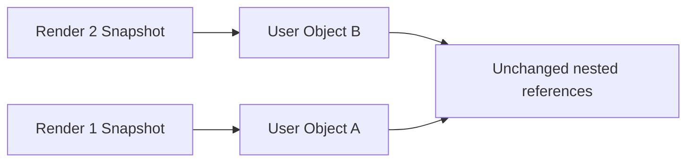
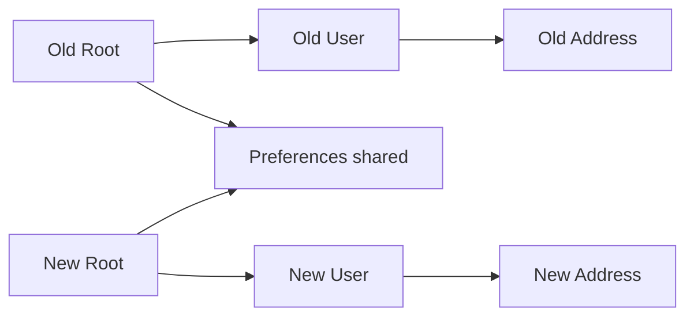

# React 不可变更新：从引用相等、结构共享到 Immer 边界

> 不可变更新不是禁止 JavaScript 对象修改，而是把已发布的 State Snapshot 视为只读：发生变化时创建新的变化路径，未变化分支继续共享引用。这样 React、Memoization、并发 Render、撤销和测试才能可靠判断“什么变了”。

---

## 一、本文解决什么问题

- 为什么修改对象后调用 Setter，界面可能没有更新；
- React 的 `Object.is` 与引用相等如何影响 Bailout；
- Shallow Copy 为什么只能复制一层；
- Structural Sharing 是否等于深拷贝；
- 数组的新增、删除、替换、排序和移动如何更新；
- 嵌套对象为什么容易漏拷贝某一层；
- Normalized State 何时比深层树结构更合适；
- Immer 的 Draft 为什么可以写“可变语法”；
- Immer 是否会自动解决状态建模和性能问题；
- `Map`、`Set`、`Date` 与 Class Instance 如何处理；
- 大对象和大数组复制的真实成本是什么；
- 如何验证更新没有修改历史 Snapshot。

本文以现代 React 函数组件和 TypeScript 为主。React 的公开原则是将 Props 与 State Snapshot 视为不可变输入；具体 Bailout、Compiler 优化与开发检查会随版本演进。Immer 的配置、Draft 支持和性能也应以项目锁定版本为准。

### 核心结论

1. React State 是某次 Render 的 Snapshot，已发布对象不应在之后原地修改。
2. React 常利用 `Object.is` 和引用关系跳过工作；同引用不能表达内部字段已经改变。
3. Shallow Copy 只创建新的第一层容器，嵌套对象仍共享引用。
4. Structural Sharing 只复制根到变化节点的路径，未变化分支复用旧引用。
5. 数组更新应使用非变异操作；`sort`、`reverse`、`splice` 等使用前必须复制或选择非变异替代。
6. 嵌套对象更新要复制每一层变化路径，漏掉任何一层都会修改旧 Snapshot。
7. Normalized State 用实体表和 ID 关系降低深层更新复杂度，但会增加 Selector 和一致性维护成本。
8. Immer 用 Proxy Draft 记录写操作并生成结构共享结果，可降低样板代码，却不能替代状态分类和性能测量。
9. 不可变更新不等于深拷贝，也不等于运行时冻结；`readonly` 只提供静态约束。
10. 宽对象、大数组和高频更新仍有复制、分配与 GC 成本，应优化状态形状和更新边界。

---

## 二、为什么 React State 要按不可变方式更新

错误示例：

```tsx
function ProfileEditor() {
  const [user, setUser] = useState({ name: 'Ada', city: 'Shanghai' });

  function rename() {
    user.name = 'Lin';
    setUser(user);
  }

  return <button onClick={rename}>{user.name}</button>;
}
```

`user` 引用没有变化，React 可能认为下一 State 与当前 State 相同而跳过部分工作。更深层的问题是：旧 Render 闭包、日志和并发候选树看到的同一个对象也被改写了。

正确做法：

```tsx
setUser((current) => ({ ...current, name: 'Lin' }));
```

### 2.1 Snapshot 需要稳定



每次更新产生可区分的新根引用，旧 Snapshot 仍能描述当时状态。它支持：

- Event Handler 的闭包快照；
- Concurrent Render 的暂停与重启；
- DevTools 时间线和日志；
- Undo/Redo；
- Memoization 与 Selector；
- 可重复测试。

### 2.2 “最后界面正确”仍不够

原地修改有时会因为父组件重新 Render 而偶然显示新值，但这不代表正确。更新是否可见取决于其他 Trigger，历史状态也已经被污染，错误会呈现为时序相关和难复现。

---

## 三、Reference Equality：引用相等表达什么

JavaScript 对象比较的是引用：

```typescript
const first = { count: 1 };
const second = first;
const third = { count: 1 };

Object.is(first, second); // true
Object.is(first, third);  // false
```

React State Setter 的公开说明通常以 `Object.is` 描述相等值跳过行为。组件是否仍因父级、Context 或开发检查执行，不能只靠该规则绝对推断。

### 3.1 引用变化不是内容一定变化

```tsx
setSettings((current) => ({ ...current }));
```

这会创建新引用，即使内容完全相同，可能带来无意义 Render 和下游 Memo 失效。不可变更新的目标不是“永远创建新对象”，而是“变化节点创建新引用，未变化节点保持旧引用”。

### 3.2 原始值

字符串、数字、布尔值等按值表现，不存在业务代码修改其内部字段的问题。对象、数组、Map、Set、Date 和 Class Instance 则需要关注可变方法和共享引用。

---

## 四、Shallow Copy：只复制第一层

```typescript
const original = {
  profile: { name: 'Ada' },
  preferences: { theme: 'dark' },
};

const copied = { ...original };

Object.is(original, copied); // false
Object.is(original.profile, copied.profile); // true
```

Spread 和 `Object.assign` 只复制可枚举自身属性值，嵌套对象仍共享引用。

### 4.1 常见错误

```tsx
setUser((current) => {
  const next = { ...current };
  next.address.city = 'Hangzhou'; // 同时修改 current.address
  return next;
});
```

必须复制变化路径：

```tsx
setUser((current) => ({
  ...current,
  address: {
    ...current.address,
    city: 'Hangzhou',
  },
}));
```

### 4.2 Shallow Copy 不保留全部对象语义

Spread 不等于复制 Property Descriptor、Prototype 或私有字段。把 Class Instance 展开成普通对象可能破坏方法和不变量。React State 更适合保存可序列化的领域数据，而不是复杂可变实例。

### 4.3 不要默认深拷贝

`structuredClone`、JSON 序列化或递归 Clone 会复制大量未变化数据，且对函数、Prototype、特殊类型、循环引用和可转移对象具有不同边界。不可变更新通常需要 Structural Sharing，而不是全量深拷贝。

---

## 五、Structural Sharing：只复制变化路径

假设修改 `state.user.address.city`：



新 Root、User、Address 是新对象，未变化的 Preferences 继续共享旧引用。

### 5.1 好处

- 旧 Snapshot 不被修改；
- 引用比较可快速定位变化分支；
- 减少深拷贝的分配；
- 支持 Memoized Selector 与 `memo`；
- 历史版本可共享大量未变化数据。

### 5.2 结构共享不是零成本

变化路径上的每一层都要创建新对象。宽对象 Spread 会遍历大量属性，大数组插入需要复制大量元素。结构共享降低成本，不会消除成本。

### 5.3 数据结构决定更新成本

若一个实体嵌套在 `projects -> columns -> cards -> comments` 深处，每次修改都要复制长路径。可以通过拆分状态、Normalized State 或将状态下沉到更局部所有者减少复制范围。

---

## 六、数组更新

### 6.1 新增

```tsx
setItems((items) => [...items, newItem]);
setItems((items) => [newItem, ...items]);
```

### 6.2 删除

```tsx
setItems((items) => items.filter((item) => item.id !== removedId));
```

### 6.3 替换单项

```tsx
setItems((items) =>
  items.map((item) =>
    item.id === updated.id ? { ...item, title: updated.title } : item,
  ),
);
```

未命中的 Item 保持原引用，这就是结构共享。

### 6.4 排序与反转

`sort` 和 `reverse` 会修改原数组：

```tsx
setItems((items) => [...items].sort(compareItems));
```

现代 JavaScript 提供 `toSorted`、`toReversed`、`toSpliced`、`with` 等非变异方法，但应确认目标浏览器、TypeScript Lib 和 Polyfill 策略。

### 6.5 移动

```typescript
function moveItem<T>(items: readonly T[], from: number, to: number): T[] {
  const next = [...items];
  const [moved] = next.splice(from, 1);
  if (moved === undefined) return [...items];
  next.splice(to, 0, moved);
  return next;
}
```

这里修改的是新数组，旧数组保持不变。列表渲染还必须使用稳定业务 Key，数组引用正确并不能修复索引 Key 的身份错误。

### 6.6 数组内对象仍需复制

```tsx
// 错误：新数组仍共享被修改对象。
setItems((items) => {
  const next = [...items];
  next[0].done = true;
  return next;
});
```

应同时复制目标对象。

---

## 七、嵌套对象更新

```typescript
type Workspace = {
  project: {
    metadata: { title: string; ownerId: string };
    settings: { archived: boolean };
  };
};
```

修改标题：

```tsx
setWorkspace((current) => ({
  ...current,
  project: {
    ...current.project,
    metadata: {
      ...current.project.metadata,
      title: nextTitle,
    },
  },
}));
```

### 7.1 封装领域更新

```typescript
function renameProject(state: Workspace, title: string): Workspace {
  if (state.project.metadata.title === title) return state;

  return {
    ...state,
    project: {
      ...state.project,
      metadata: { ...state.project.metadata, title },
    },
  };
}
```

相同值直接返回旧引用，变化时只复制必要路径。Reducer 或领域函数还能集中校验业务不变量。

### 7.2 深嵌套是建模信号

若业务频繁修改深层实体，不要只增加更多 Spread。评估：

- 状态是否可下沉；
- 实体是否应 Normalize；
- 页面是否混合了多个生命周期；
- 是否需要 Reducer 或 Immer；
- 是否误把 Server Cache 复制为巨型本地树。

---

## 八、Normalized State

Normalized State 将实体按 ID 存储，关系只保存 ID：

```typescript
type NormalizedTasks = {
  byId: Record<string, Task>;
  allIds: string[];
};
```

更新一个 Task：

```tsx
setTasks((current) => ({
  ...current,
  byId: {
    ...current.byId,
    [taskId]: {
      ...current.byId[taskId],
      completed: true,
    },
  },
}));
```

实际代码需处理 ID 不存在，不能靠断言忽略边界。

### 8.1 收益

- 同一实体只有一个客户端表示；
- 更新路径更短；
- 列表排序与实体内容分离；
- 多处引用同一实体更容易一致；
- Selector 可按 ID 订阅或派生。

### 8.2 成本

- 读取需要 Join/Selector；
- 删除实体要清理关系；
- 顺序、分页和不同查询结果要单独建模；
- 乐观更新与回滚更复杂；
- 过度 Normalize 会使简单局部树难读。

### 8.3 Server State 边界

请求缓存库通常已经按 Query Key 管理服务器快照。是否再做实体归一化取决于跨查询一致性需求；双层缓存会带来失效顺序和来源冲突，不能默认叠加。

---

## 九、Immer：用可变语法生成不可变结果

```typescript
import { produce } from 'immer';

const nextState = produce(state, (draft) => {
  draft.project.metadata.title = 'Next title';
});
```

Immer 通常通过 Proxy Draft 记录读取与写入，最终生成结构共享结果。未变化分支保留引用，变化路径创建新对象。

### 9.1 React 中使用

```tsx
setState((current) =>
  produce(current, (draft) => {
    const task = draft.tasksById[taskId];
    if (task !== undefined) task.completed = true;
  }),
);
```

也可使用封装 Immer 的 Reducer/Hook，具体 API 取决于项目依赖。

### 9.2 Immer 的优势

- 深层更新样板更少；
- 多字段原子变更更易阅读；
- 自动保留结构共享；
- 可选 Patch 能支持部分 Undo/同步场景。

### 9.3 使用边界

- Draft 只能在 Producer 生命周期内使用，不能泄露；
- 不要同时修改 Draft 又返回无关新 State；
- Class Instance、DOM、第三方实例等并非普通 Draft 数据；
- Map/Set、Auto Freeze 和 Patch 的支持与配置应按版本确认；
- Proxy 跟踪和 Finalize 有成本，高频大数据更新必须测量；
- Immer 不会自动 Normalize、校验权限或解决竞态。

### 9.4 何时不需要 Immer

一层或两层的简单更新，Spread 往往更直接。只有嵌套、多分支 Reducer 或团队确实因手写复制频繁出错时，Immer 才明显降低复杂度。

---

## 十、特殊可变对象

### 10.1 `Map` 与 `Set`

```tsx
setSelectedIds((current) => {
  const next = new Set(current);
  next.add(id);
  return next;
});
```

不要对 State 中原 Set 直接 `add/delete`。同时考虑序列化、DevTools 和 SSR Hydration 边界；很多场景用数组或 Record 更简单。

### 10.2 `Date`

`Date#setTime` 等方法会修改实例。需要更新时创建新 Date，或优先存储 ISO 字符串/时间戳并在边界解析。时区和 Locale 是独立问题。

### 10.3 Class 与第三方实例

编辑器、地图、Socket 等可变实例通常适合 Ref，并通过 Effect 管理生命周期，而不是放进 React State。State 保存驱动 UI 的可序列化配置和状态标识。

### 10.4 TypeScript `readonly`

`Readonly<T>` 默认只限制一层，且类型会在运行时擦除。它能防止一部分误写，但不等于 `Object.freeze` 或深层不可变。

---

## 十一、大对象复制成本

### 11.1 成本来源

- 宽对象 Spread 复制大量属性；
- 数组插入、过滤、排序通常需要 O(n) 元素工作；
- 新对象增加 Allocation 与 GC 压力；
- 新引用可能使下游 Selector/Memo 失效；
- 深拷贝还会复制所有未变化数据；
- 开发冻结和 Proxy 可能增加额外开销。

### 11.2 优化顺序

1. 先确认状态是否放错层级；
2. 缩小 State，删除可派生数据；
3. 将高频局部状态下沉；
4. Normalize 频繁独立更新的实体；
5. 拆分订阅和 Selector；
6. 大列表使用分页或虚拟化；
7. Profile 后选择手写更新、Immer 或持久化数据结构。

### 11.3 不要用原地修改换性能

原地修改可能减少一次分配，却破坏 Snapshot 和引用语义，导致错误 Bailout、缓存污染和并发问题。若复制确实是瓶颈，应改变状态形状或工具，而不是破坏契约。

### 11.4 测量方法

在生产构建、目标设备和真实数据量下测量：

- Update Function 耗时；
- React Render/Commit Duration；
- Allocation、Minor/Major GC；
- Selector 重算次数；
- INP 与 Long Task；
- Heap Retainer，确认历史 Snapshot 没被意外长期保留。

单次 Microbenchmark 不能代表完整 React 交互。

---

## 十二、并发、异步与不可变更新

### 12.1 使用函数式更新

```tsx
setCart((current) => addItem(current, product));
```

它基于 React Queue 提供的最新计算结果，而不是异步回调捕获的旧 Snapshot。

### 12.2 请求结果仍需新鲜度校验

不可变更新只能保证本地 Snapshot 不被修改，不能阻止旧请求覆盖新请求。仍需 Abort、Generation/Request ID 与业务仲裁。

### 12.3 乐观更新

Optimistic Update 要保存可回滚信息，并处理多个并发 Mutation、服务端最终结果和缓存失效。不要只保存整个巨型深拷贝；可根据领域使用逆操作、Patch 或版本化快照，并验证回滚顺序。

---

## 十三、常见误区与错误案例

### 13.1 Spread 就是深拷贝

错误。Spread 只复制一层，嵌套引用仍共享。

### 13.2 每次更新都 `structuredClone`

错误。它复制大量未变化数据，并有类型与性能边界。优先结构共享。

### 13.3 新引用一定代表业务变化

错误。无意义 `{ ...state }` 会制造变化信号和额外 Render。

### 13.4 Immer 没有性能成本

错误。Proxy、Draft 跟踪与 Finalize 有成本，应按真实更新模式测量。

### 13.5 `readonly` 保证运行时不可变

错误。TypeScript 类型会擦除，且浅 `Readonly` 不递归保护嵌套对象。

### 13.6 原地修改后再复制根对象即可

```tsx
// 错误：旧 State 的 nested 已经被修改。
state.nested.value = nextValue;
setState({ ...state });
```

必须在修改前复制完整变化路径。

### 13.7 把所有数据 Normalize

简单、局部、一次性树结构可能因 Normalize 增加大量 Selector 和关系维护。应由更新频率、共享关系和复杂度决定。

---

## 十四、测试与验证

### 14.1 验证旧 Snapshot 未改变

```typescript
const previous = createState();
const next = renameProject(previous, 'Next');

expect(next).not.toBe(previous);
expect(next.project).not.toBe(previous.project);
expect(next.project.metadata).not.toBe(previous.project.metadata);
expect(next.project.settings).toBe(previous.project.settings);
expect(previous.project.metadata.title).toBe('Previous');
```

这同时验证变化路径新引用、未变化分支共享和旧值不变。

### 14.2 冻结测试数据

测试环境可深冻结输入，尽早发现 Reducer 原地修改。冻结工具需正确处理循环、Map/Set 与特殊对象，不能把简单递归函数当通用生产方案。

### 14.3 Property-based Test

对数组 Move、Normalize 和 Patch 可生成随机输入，验证：

- 实体没有丢失或重复；
- 顺序符合预期；
- 未修改输入；
- 相同更新幂等时返回合理引用；
- Undo/Redo 能恢复原状态。

### 14.4 React 行为测试

验证更新后正确 Item 改变、稳定 Key 的其他行保留输入/焦点、Memoized Child 没因无关分支新引用而重复工作。

---

## 十五、工程方案选择

| 场景 | 推荐方案 | 注意事项 |
|---|---|---|
| 一层对象更新 | Spread | 相同值可返回旧对象 |
| 数组单项更新 | `map` + 目标对象复制 | 保留其他 Item 引用 |
| 深层多字段更新 | Reducer 或 Immer | 评估 Draft 与性能 |
| 多关系实体 | Normalized State | 维护 ID 关系和 Selector |
| 高频局部输入 | 状态下沉 | 避免复制页面大对象 |
| Server Cache | 请求库更新/失效 API | 避免双缓存 |
| Undo/Redo | 结构共享 Snapshot 或 Patch | 控制历史长度 |
| 可变第三方实例 | Ref + Effect | 完整 Cleanup |

---

## 十六、工程检查清单

- 是否修改了 Props、State 或历史 Snapshot；
- 是否只复制根对象却修改了嵌套引用；
- 数组是否调用了变异方法；
- 未变化分支是否保持旧引用；
- 是否存储了可以派生的重复数据；
- 深层更新是否提示需要 Normalize 或状态下沉；
- Immer Draft 是否泄露或混合返回新对象；
- Map/Set/Date/Class 是否有明确更新策略；
- Optimistic Update 是否支持并发和回滚；
- 大对象成本是否在生产环境测量；
- 测试是否验证旧值、变化路径和结构共享。

---

## 十七、总结

1. 已发布的 State Snapshot 必须视为只读。
2. 引用相等是 React 与缓存判断变化的重要信号，但不是完整业务相等。
3. Shallow Copy 只复制一层，嵌套变化必须复制完整路径。
4. Structural Sharing 复用未变化分支，避免全量深拷贝。
5. 数组更新需区分变异和非变异方法，并复制被修改 Item。
6. 深嵌套频繁更新通常是状态形状需要调整的信号。
7. Normalized State 降低实体更新路径，也带来关系与 Selector 成本。
8. Immer 减少样板代码，但不能替代建模、验证和性能分析。
9. 宽对象与大数组仍有复制和 GC 成本，应缩小状态与订阅范围。
10. 函数式更新、竞态治理和结构共享共同保证并发场景的正确性。

不可变更新的目标不是“到处复制”，而是让每次变化都具有清晰边界：旧 Snapshot 保持真实，新 Snapshot 精确表达变化，未变化数据继续共享。

---

## 问答复盘

### Q1：为什么原地修改后调用同一对象的 Setter 可能不更新？

**答：** 根引用未变，React 可能按 `Object.is` 跳过工作；同时旧 Render Snapshot 也被污染。

### Q2：`{ ...state }` 是否等于深拷贝？

**答：** 不等于。它只复制第一层，嵌套对象仍与旧 State 共享引用。

### Q3：Structural Sharing 如何更新深层字段？

**答：** 只创建从根到变化字段路径上的新对象，未变化兄弟分支继续使用旧引用。

### Q4：数组 `sort` 为什么要先复制？

**答：** `sort` 会原地修改数组。应复制后排序，或在兼容环境使用 `toSorted`。

### Q5：Normalized State 适合所有状态吗？

**答：** 不适合。它适合多处引用、频繁独立更新的实体；简单局部树会因 Join 和关系维护变复杂。

### Q6：Immer 是否真正执行了原地修改？

**答：** Recipe 修改的是 Draft Proxy，Immer 根据记录生成结构共享的新结果；原 State 不应被修改。

### Q7：为什么不可变更新仍可能性能差？

**答：** 宽对象和大数组复制仍是 O(n)，还会产生分配和 GC；应优化状态形状、范围和数据规模。

### Q8：`Readonly<T>` 能否阻止运行时修改？

**答：** 不能。它是静态浅约束，类型会擦除；运行时冻结和深层不可变需要其他机制。

### Q9：如何测试结构共享正确？

**答：** 断言旧 Snapshot 未变、变化路径引用不同、未变化分支引用相同，并补充随机操作和 React 行为测试。

---

## 延伸知识

- **UI 状态机**：不可变 Event、State Transition、Optimistic State 与 Rollback。
- **Hooks Queue**：函数式 Updater、Batching、Lane 与更新重放。
- **Memoization**：`memo`、Selector、Reference Stability 与 React Compiler。
- **Server State**：缓存更新、失效、乐观写入和版本冲突。
- **持久化数据结构**：Trie、HAMT、Persistent Vector 与复杂度权衡。
- **性能工程**：Allocation Profile、GC、Long Task、INP 与大列表虚拟化。
