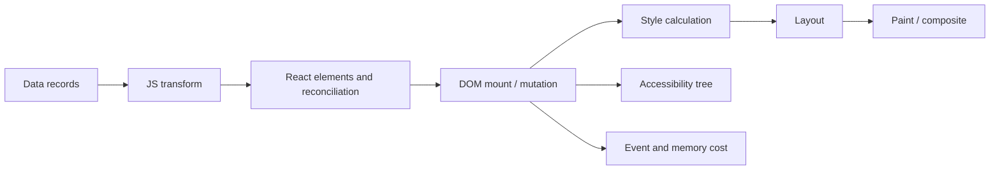
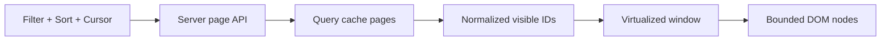
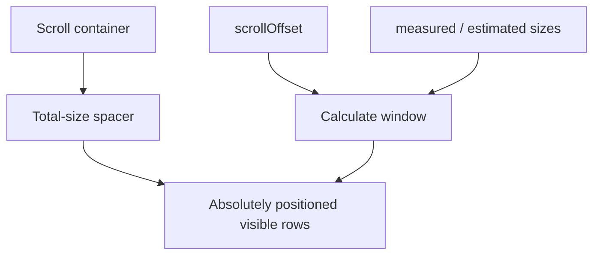

# React 列表与大数据：虚拟化、分页、动态高度与 Worker

> 大列表优化不是把每个 Row 的 Render 从 1 ms 降到 0.5 ms，而是避免同时创建、挂载和布局用户根本看不到的数千个节点，并让数据获取、滚动位置和 Item Identity 保持一致。

---

## 一、大列表的瓶颈不只是 React Render

一个审计日志页面需要展示 100000 条记录。最直观的实现是：

```tsx
function AuditLogList({ records }: { records: AuditRecord[] }) {
  return (
    <ul>
      {records.map(record => (
        <AuditLogRow key={record.id} record={record} />
      ))}
    </ul>
  );
}
```

即使 `AuditLogRow` 已经使用 `memo`，首次挂载仍要处理 100000 个 Item。完整成本至少包含：



因此必须区分四个层次：

| 层次 | 典型问题 | 主要手段 |
|---|---|---|
| 数据层 | 一次下载全量、查询或排序昂贵 | Server Pagination、Cursor、Index、Worker |
| React 层 | 过多 Element、Row 重复 Render | State Colocation、Selector、Memoization |
| DOM 层 | 同时挂载大量节点 | Virtualization、Windowing、Pagination |
| 浏览器层 | Style/Layout/Paint、滚动卡顿 | 窗口化、稳定尺寸、减少测量与像素工作 |

只优化其中一层，可能会把瓶颈移到另一层。例如：

- `memo` 可以减少更新 Render，但无法消除首次挂载的 100000 个 DOM Node；
- Worker 可以把 Filter 移出主线程，但返回 50000 条结果后仍不应全量挂载；
- Virtualization 控制 DOM 数量，但不会阻止客户端下载过大 Payload；
- Pagination 降低单页数量，但不自动处理缓存、竞态、滚动恢复与跨页选中。

本文以现代 React 和现代浏览器为背景。虚拟化库、`ResizeObserver`、Worker、CSS `content-visibility` 与调度 API 都存在版本及浏览器差异；具体 API 应以项目锁定版本的文档和目标浏览器测试为准。

### 核心结论

1. 大列表成本来自数据处理、React Render、DOM 数量、Layout/Paint 与内存，不能只看 Render Count。
2. Virtualization 是总体策略，Windowing 是只挂载当前视口附近窗口的常见实现。
3. 窗口化通过“总尺寸占位容器 + 绝对定位可见 Item”保留滚动条语义，并让 DOM 数量与视口而不是总数据量成比例。
4. Overscan 用更多隐藏 DOM 换取快速滚动稳定；太小会露白，太大会吞掉虚拟化收益。
5. Dynamic Height 需要 Estimate、Measurement Cache、`ResizeObserver` 和 Scroll Anchoring 协作，是大列表中最容易出现抖动的部分。
6. Stable Key 必须表达业务 Item Identity；Index Key 在插入、删除、排序和窗口复用中可能让 State 与 Focus 跟错数据。
7. Incremental Rendering 只是分批添加 DOM，最终 DOM 仍会增长；它不是 Virtualization 的同义词。
8. Pagination 同时是数据协议、URL 状态、缓存 Key 和一致性问题，不只是一个“下一页”按钮。
9. Cursor Pagination 更适合持续变化的有序数据，但 Cursor 必须包含确定性排序和 Tie-breaker 语义。
10. Worker 适合可并行的 CPU 密集纯计算，不能操作 DOM，也不会消除 Structured Clone、调度、内存和取消成本。
11. 列表优化必须测试键盘导航、焦点、屏幕阅读、浏览器查找、打印和滚动恢复，不能只验证鼠标滚动。
12. 最终收益应在生产构建、目标设备和代表性数据上，同时观察 DOM Count、Long Task、Layout/Paint、Memory、INP 和业务任务完成时间。

---

## 二、先根据问题选择策略

不是数据超过某个固定条数就必须虚拟化。Row 复杂度、屏幕尺寸、设备、交互频率和可访问性要求都会改变阈值。

| 问题 | 优先策略 | 主要代价 |
|---|---|---|
| 首次展示数千条导致挂载慢 | Virtualization / Pagination | 复杂滚动、语义与测量 |
| DOM 数量随无限滚动持续增长 | Windowing + Page Eviction | 恢复、缓存与跳转 |
| 服务端数据本身巨大 | Server Pagination / Search | 网络、缓存、一致性 |
| 本地 Filter/Sort 阻塞输入 | 算法、Index、Worker | 数据传输、取消、内存 |
| 少量内容需分批出现 | Incremental Rendering | DOM 最终仍累积 |
| 只想降低屏外 Layout/Paint | `content-visibility` 实验 | DOM 仍全量存在，支持需测试 |
| 内容需 SEO、打印、浏览器查找 | Pagination / SSR 分页 | 交互不如无限滚动连续 |

常见的组合是：



这个方案同时限制单次网络 Payload、客户端保留页数与 DOM 数量。只做其中一项，往往不能解决长时间使用后的内存与滚动问题。

---

## 三、Virtualization 与 Windowing 的工作原理

Virtualization 的目标是让逻辑数据集保持完整，但屏幕上只实例化必要的 UI。Windowing 则通常只挂载视口内 Item 和前后 Overscan Item。

对于固定高度列表，可以用以下简化模型理解：

```text
visibleStart = floor(scrollOffset / itemSize)
visibleCount = ceil(viewportSize / itemSize)
renderStart  = max(0, visibleStart - overscan)
renderEnd    = min(totalCount, visibleStart + visibleCount + overscan)
```

例如视口高 600 px，Row 高 48 px，可见数约为 13。前后各 Overscan 6 个 Row 时，即使逻辑数据有 100000 条，DOM 仍可能只有二十多个 Row。

### 3.1 为什么需要总尺寸占位容器



如果只把当前十几个 Item 放进 DOM，滚动条会认为整个列表就只有这么高。因此虚拟化实现会创建一个等于所有 Item 总尺寸的 Spacer，再将可见 Item 绝对定位到它们的逻辑位置。

固定高度可直接用 `index * itemSize` 计算位置。动态高度则需要累计每个 Item 的实测或估算尺寸，并在尺寸变化后更新后续位置。

### 3.2 为什么不建议从零手写完整虚拟化

简单 Demo 只需要 `scrollTop / itemHeight`，但生产系统还要处理：

- Container Resize、Zoom 与响应式宽度；
- Dynamic Height 和异步图片加载；
- 向上插入数据时的 Scroll Anchor；
- 键盘导航、Focus Item 越出窗口；
- Sticky Header/Column、RTL 和水平虚拟化；
- SSR/Hydration 的初始窗口；
- Item Resize Cache 失效；
- Scroll Restoration 与跳转到指定 Item；
- Browser 滚动行为和 Accessibility 树。

因此应优先使用经过验证的虚拟化库，并围绕项目的语义、测量和数据协议做集成，而不是自己维护一套隐含大量滚动边界的核心算法。

---

## 四、固定高度列表：使用成熟 Virtualizer

以 `@tanstack/react-virtual` 的常见 API 为例：

```tsx
import { useRef } from 'react';
import { useVirtualizer } from '@tanstack/react-virtual';

type Order = {
  id: string;
  number: string;
  customerName: string;
  total: number;
};

function VirtualOrderList({ orders }: { orders: Order[] }) {
  const scrollRef = useRef<HTMLDivElement>(null);

  const virtualizer = useVirtualizer({
    count: orders.length,
    getScrollElement: () => scrollRef.current,
    estimateSize: () => 52,
    overscan: 8,
    getItemKey: index => orders[index].id,
  });

  const virtualItems = virtualizer.getVirtualItems();

  return (
    <div
      ref={scrollRef}
      style={{ height: 600, overflow: 'auto' }}
      aria-label="订单列表"
      role="list"
    >
      <div
        style={{
          height: virtualizer.getTotalSize(),
          position: 'relative',
          width: '100%',
        }}
      >
        {virtualItems.map(virtualItem => {
          const order = orders[virtualItem.index];

          return (
            <div
              key={virtualItem.key}
              role="listitem"
              aria-posinset={virtualItem.index + 1}
              aria-setsize={orders.length}
              style={{
                height: virtualItem.size,
                left: 0,
                position: 'absolute',
                top: 0,
                transform: `translateY(${virtualItem.start}px)`,
                width: '100%',
              }}
            >
              <OrderRow order={order} />
            </div>
          );
        })}
      </div>
    </div>
  );
}
```

这个示例展示的是核心结构，具体 Option 名称、默认值和测量行为必须以锁定的库版本为准。

### 4.1 DOM 数量应保持有界

当总数据从 10000 增加到 100000 时，虚拟列表的 DOM Row 数量应主要由 Viewport 和 Overscan 决定，而不应与总数量线性增长。

可在 E2E 测试中检查：

```ts
const renderedRows = await page.locator('[role="listitem"]').count();
expect(renderedRows).toBeLessThan(50);
```

这个断言必须与测试的 Viewport、Row Size 和 Overscan 配置绑定，不能直接作为所有设备的通用阈值。

### 4.2 虚拟化不代替 Row 边界优化

窗口内仍可能有数十个复杂 Row。若鼠标 Hover、时间 Tick 或选中状态让整个窗口重新 Render，仍应检查 State Colocation、Selector、Stable Props 和 `memo`。

但顺序很重要：先用窗口化将 100000 个 DOM Node 降到几十个，再对实测昂贵的可见 Row 做精细优化。

### 4.3 不要在 Scroll Handler 中频繁读写 Layout

一边读 `getBoundingClientRect()`、`offsetHeight`，一边立即修改 Style，可能导致 Forced Synchronous Layout。成熟 Virtualizer 会将 Scroll、Resize、Measurement 和 Position Update 组织在统一协议中。业务 Row 不应再私自叠加一套无节制的尺寸读写。

---

## 五、Overscan：用少量额外工作换取滚动稳定

Overscan 是视口外预先挂载的 Item 范围。用户快速滚动时，新 Item 在真正进入视口前已经存在，可降低短暂空白或来不及挂载的风险。

### 5.1 Overscan 太小

- Trackpad 或触摸快速 Flick 时可能出现白屏带；
- 复杂 Row 挂载时间超过滚动留给它的预备时间；
- 键盘导航的下一项还未挂载，需额外 Scroll + Focus 协调。

### 5.2 Overscan 太大

- DOM 数量、React Render 与 Layout 成本重新上升；
- 图片、Observer 和子组件 Effect 在用户看到前过早启动；
- 高频滚动时每次窗口切换需处理更多 Item；
- 内存和 Accessibility Tree 节点增加。

### 5.3 Overscan 应通过场景调优

不同库的 Overscan 单位可能是 Item Count 或 Pixel Range。不要把某个库的 `overscan: 8` 直接复制到另一个实现。

调优时应覆盖：

- 鼠标滚轮、Trackpad 惯性滚动和触摸 Flick；
- 低端设备与 CPU Throttling；
- 最复杂 Row，而不是只测纯文本 Row；
- 向上和向下两个方向；
- 键盘 PageUp/PageDown、Home/End 与焦点移动；
- 加载更多页时的网络和 Render 并发。

如果库支持按滚动方向、速度或 Item Cost 动态调整 Range，仍应以可重复 Trace 验证，避免动态策略本身造成频繁抖动。

---

## 六、Dynamic Height：估算、测量与滚动锚定

聊天消息、审批记录、图文 Feed 和可展开 Row 往往没有固定高度。此时 Virtualizer 必须同时维护：

- 尚未挂载 Item 的 Estimated Size；
- 已挂载 Item 的 Measured Size；
- 每个 Item 的累计 Start Offset；
- 尺寸变化后的 Cache Invalidation；
- 为保持用户当前视觉位置而进行的 Scroll Adjustment。

### 6.1 使用库的测量协议

```tsx
function DynamicAuditLogList({ records }: { records: AuditRecord[] }) {
  const scrollRef = useRef<HTMLDivElement>(null);

  const virtualizer = useVirtualizer({
    count: records.length,
    getScrollElement: () => scrollRef.current,
    estimateSize: () => 88,
    overscan: 6,
    getItemKey: index => records[index].id,
  });

  return (
    <div ref={scrollRef} style={{ height: 640, overflow: 'auto' }}>
      <div
        style={{
          height: virtualizer.getTotalSize(),
          position: 'relative',
        }}
      >
        {virtualizer.getVirtualItems().map(item => (
          <article
            key={item.key}
            ref={virtualizer.measureElement}
            data-index={item.index}
            style={{
              left: 0,
              position: 'absolute',
              top: 0,
              transform: `translateY(${item.start}px)`,
              width: '100%',
            }}
          >
            <AuditLogRow record={records[item.index]} />
          </article>
        ))}
      </div>
    </div>
  );
}
```

`measureElement` 和 `data-index` 的具体契约属于库版本 API。重点是让 Virtualizer 统一接收实际尺寸，而不是每个 Row 自己读高度、写 State，形成大量额外 Render 与 Layout Read。

### 6.2 Estimate 差距会影响滚动体验

估算过小时，测量后总高度不断增长，滚动条 Thumb 会缩小，后续 Item 位置持续向下修正。估算过大时则相反。应使用生产数据的高度分布选择合理 Estimate，不要只用最短 Demo Row。

对需要 `scrollToIndex` 的场景，错误 Estimate 还会让首次跳转只到近似位置，库可能在真实测量后二次校正。业务不应假设一次 Scroll Call 后就已精确定位。

### 6.3 尺寸会在首次测量后继续变化

常见来源包括：

- 图片加载后才知道实际尺寸；
- Web Font 替换导致换行数变化；
- Container 宽度变化导致文本重新换行；
- Row 展开/折叠；
- 异步加载附件、错误或操作栏；
- 用户调整系统字号或页面 Zoom。

图片应提供 `width` / `height` 或 `aspect-ratio`，尽可能在加载前保留空间。Virtualizer 仍需要观察真实 Resize，因为业务内容不会只变一次。

### 6.4 向上插入需要保持视觉 Anchor

聊天历史和时间线常在顶部 Prepend 旧数据。如果只把数组前面增加 50 条，当前 Item 的 Offset 会整体增大，用户屏幕可能瞬间跳到另一个位置。

正确协议通常是：

1. 记录当前 Anchor Item ID 及它相对 Viewport 的 Offset；
2. Prepend 数据并完成必要测量；
3. 根据新旧 Anchor Offset 差调整 Scroll Position；
4. 在图片或展开内容后继续保持 Anchor。

这个边界应优先使用库提供的 Prepend/Anchor 能力，并在 iOS 惯性滚动、移动键盘和不同浏览器上验证。

---

## 七、Stable Key：业务 Identity 不能由窗口位置代替

虚拟化中同时存在两个概念：

- Logical Index：Item 在当前排序结果中的位置；
- Business Identity：这条数据在业务上是谁，例如 `order.id`。

Index 会因 Filter、Sort、Insert 和 Delete 变化，Identity 不应随之变化。

### 7.1 错误：把 Index 当作 Key

```tsx
{virtualItems.map(item => (
  <OrderRow
    key={item.index}
    order={orders[item.index]}
  />
))}
```

当列表顶部插入一条订单时，所有后续 Item 的 Index 都变了。若 Row 内有未提交 Input、Expanded State、Animation 或 Focus，这些状态可能被复用到错误的业务 Item。

正确做法是让 Virtualizer 与 React Key 都使用稳定 ID：

```tsx
const virtualizer = useVirtualizer({
  count: orders.length,
  getScrollElement: () => scrollRef.current,
  estimateSize: () => 52,
  getItemKey: index => orders[index].id,
});
```

### 7.2 Key 变化会重置 Row State

Key 是 Component Identity 的一部分。当 Item 移出虚拟窗口并被真正 Unmount 时，它的局部 State 通常会释放；再滚回时会新建状态。

因此以下数据不应只存在可被卸载的 Row 内：

- 未提交的重要表单草稿；
- 跨滚动需保留的选中状态；
- 业务展开/折叠状态；
- 异步任务进度与错误；
- 必须在路由返回后恢复的编辑会话。

这些状态应以 Item ID 为 Key 保存到更稳定的 Page/Form/Store 边界，并定义何时清理。不重要的 Hover 和短命视觉状态则可以跟随 Row 卸载。

### 7.3 不可变更新帮助 Row 精确更新

对单个 Order 更新时，应只创建新的该 Order 对象和必要容器，未变 Item 保留引用。这样 Memoized Row 可根据 `order` 引用和 Primitive Props 跳过无关更新。

如果每次收到服务端数据都无条件重建所有 Item Object，Stable Key 仍能保持 Component Identity，但 `memo` 的 Prop Equality 可能持续 Miss。应在数据层使用可验证的 Structural Sharing，不要在 Row 中手写深比较补救粗粒度数据替换。

---

## 八、Incremental Rendering：分批显示不等于控制总 DOM

Incremental Rendering 将一次大挂载拆成多个小批次，让首批内容更早出现，并在批次之间给浏览器处理输入和绘制的机会。

```tsx
import {
  Fragment,
  type Key,
  type ReactNode,
  useEffect,
  useState,
} from 'react';

function ProgressiveList<T>({
  items,
  batchSize = 50,
  getKey,
  renderItem,
}: {
  items: T[];
  batchSize?: number;
  getKey: (item: T, index: number) => Key;
  renderItem: (item: T, index: number) => ReactNode;
}) {
  const [visibleCount, setVisibleCount] = useState(() =>
    Math.min(batchSize, items.length),
  );

  useEffect(() => {
    let nextCount = Math.min(batchSize, items.length);
    setVisibleCount(nextCount);

    let frameId = 0;

    const appendBatch = () => {
      nextCount = Math.min(nextCount + batchSize, items.length);
      setVisibleCount(nextCount);

      if (nextCount < items.length) {
        frameId = requestAnimationFrame(appendBatch);
      }
    };

    if (items.length > batchSize) {
      frameId = requestAnimationFrame(appendBatch);
    }

    return () => cancelAnimationFrame(frameId);
  }, [batchSize, items]);

  return items.slice(0, visibleCount).map((item, index) => (
    <Fragment key={getKey(item, index)}>
      {renderItem(item, index)}
    </Fragment>
  ));
}
```

调度下一批的副作用放在 `appendBatch` 中，而不是 `setState` Updater 内；State Updater 必须保持纯净，因为 React 可以额外调用它来检查正确性。

这个示例只用于说明批次与 Cleanup。它有明确局限：

- 每帧批量不等于固定耗时，50 个复杂 Item 仍可能超过帧预算；
- `requestAnimationFrame` Callback 本身在绘制前执行，重工作仍会延迟该帧；
- 数组变化时会重置批次，需根据业务 Identity 定义是追加还是新查询；
- 最终仍会挂载所有 Item，DOM 和内存会持续增长；
- 辅助技术可能在不同时间看到不完整集合，需提供 Loading/Progress 语义。

### 8.1 与 Concurrent Rendering 的区别

React Concurrent Rendering 可在 Fiber 工作单元之间调度，Transition 可将部分更新标记为非紧急。但 React 不能在一个长时间同步 Filter/Sort 函数的任意指令中间抢占，也不会自动把已挂载 DOM 从页面删除。

因此：

- Transition 解决更新优先级；
- Incremental Rendering 解决一次挂载的批次；
- Virtualization 解决同时存在的 UI 数量；
- Worker 解决可并行 CPU 计算对主线程的占用。

### 8.2 `content-visibility` 是浏览器级补充手段

```css
.feed-item {
  content-visibility: auto;
  contain-intrinsic-size: auto 96px;
}
```

`content-visibility: auto` 可让支持的浏览器延后部分屏外 Rendering Work，`contain-intrinsic-size` 用估计尺寸减少滚动条跳动。但它不会从 DOM 中移除元素，JavaScript、DOM Memory 和部分语义成本仍存在。支持、查找、打印和可访问性行为应在目标浏览器实测，不要把它当成虚拟化的无代价替代品。

---

## 九、Pagination：数据边界、URL 状态与一致性

当服务端数据量巨大时，浏览器不应为了本地虚拟化而先下载全部数据。Pagination 首先是 API 与数据一致性协议。

### 9.1 Offset Pagination

```http
GET /api/orders?offset=100&limit=50&sort=createdAt.desc
```

优点：

- 可以直接跳到某一页；
- 页码、总数和传统 Pagination UI 易于表达；
- 对变化不频繁的后台报表较直观。

代价：

- 前面插入或删除数据后，后续 Offset 可能漂移，产生重复或遗漏；
- 大 Offset 在某些数据库查询中成本可能上升，需以实际执行计划验证；
- Total Count 可能是另一个昂贵查询，不应假设每次都能免费精确返回。

### 9.2 Cursor Pagination

```http
GET /api/orders?after=opaque-cursor&limit=50
```

服务端应使用稳定排序，例如：

```sql
ORDER BY created_at DESC, id DESC
```

Cursor 需要表达 `created_at + id` 的位置，使用唯一 ID 作为 Tie-breaker，避免多条数据共用同一时间戳时顺序不确定。Cursor 应视为不可信客户端输入：服务端需验证签名/编码、查询范围、租户和权限，不能将内部 SQL 无约束暴露给客户端。

Cursor 适合 Feed、日志和持续变化的时间线，但不擅长随意跳到第 237 页。选型应由产品导航语义与数据变化特征决定。

### 9.3 Filter、Sort 与 Page 共同构成 Query Identity

```text
orders?status=paid&sort=createdAt.desc&cursor=abc&limit=50
```

以下变化必须开始新 Pagination Sequence：

- Filter 变化；
- Sort 字段或方向变化；
- Tenant、Workspace 或权限范围变化；
- Page Size 会改变 Cursor 协议时；
- 服务端 Snapshot/Version 语义变化。

不能将新 Filter 的第一页追加到旧 Filter 的列表后面。Query Cache Key 必须包含影响结果的所有参数，并将每页的 `nextCursor` 与对应数据绑定。

### 9.4 请求竞态、取消与去重

```ts
type OrderPage = {
  items: Order[];
  nextCursor: string | null;
};

async function fetchOrderPage(
  cursor: string | null,
  filters: OrderFilters,
  signal: AbortSignal,
): Promise<OrderPage> {
  const params = new URLSearchParams({
    limit: '50',
    status: filters.status,
  });

  if (cursor) params.set('after', cursor);

  const response = await fetch(`/api/orders?${params}`, { signal });
  if (!response.ok) {
    throw new Error(`Loading orders failed: ${response.status}`);
  }

  return response.json() as Promise<OrderPage>;
}
```

`as Promise<OrderPage>` 只是 TypeScript 类型断言，不会验证服务端 JSON。生产边界还应用 Schema Validator 或显式 Parser 校验 `items`、`nextCursor` 与 Item ID，并限制异常 Payload Size。

完整工程还必须处理：

- 新查询开始后中止旧请求；
- 即使底层无法取消，也不允许旧响应覆盖新查询；
- 相同 Cursor 的并发请求去重；
- Retry 需区分 Offline、Timeout、429 和 5xx；
- 按 Item ID 去重，但不用去重隐藏服务端 Cursor Bug；
- Partial Page、权限变化和 Deleted Item；
- Loading More Error 应保留已有页，而不是清空整个列表。

实际项目宜使用成熟 Query Cache 管理 Pages、Page Params、Deduplication、Retry 与 Garbage Collection，不必在每个页面重写一套不一致协议。

### 9.5 URL 与 Scroll Restoration

对页码型 Pagination，`page`、`sort` 和可分享 Filter 应通常进入 URL，以支持刷新、前进后退和分享。Cursor 可能是短期不适合分享的服务端位置，是否进入 URL 需根据稳定性与隐私决定。

虚拟列表的恢复不应只保存 `scrollTop`。数据页集、Item Height Cache、Container Width 和排序任意一项变化都可使绝对 Pixel Offset 失效。更稳定的恢复信息是：

```text
query identity + anchor item id + offset within item + loaded page range
```

恢复时先确保 Anchor 所在数据已加载，再让 Virtualizer 定位并应用 Item 内 Offset。数据不存在或权限已变时，需有明确降级位置。

### 9.6 Infinite Scroll 必须有内存上限

无限滚动只解决“何时请求下一页”，不自动限制：

- Query Cache 保留的 Page Count；
- 解析后 Entity 和图片占用的内存；
- DOM Node Count，若没有 Windowing；
- 已载入 Item 的 Subscription 与 Effect；
- 恢复到早期页所需的 Cache。

长会话页面需要明确 Max Pages 或 Memory Budget。淘汰页后，用户向回滚动可能需要重新请求；因此缓存上限、恢复速度和流量是明确权衡，不存在无限免费缓存。

---

## 十、Worker 计算：把可并行 CPU 工作移出主线程

Web Worker 拥有独立的全局环境与 Event Loop，可在不阻塞主线程输入和 React Render 的情况下执行 CPU 计算。它适合：

- 已加载大数据的 Full-text Filter、Sort、Group；
- 建立搜索 Index 或统计聚合；
- CSV/JSON 解析与数据转换；
- 不需访问 DOM、Layout 或 React State 的纯计算。

它不适合：

- 直接创建 React Element 或操作 DOM；
- 微小计算，Worker Startup 和 Message 成本可能更高；
- 每次 Query 都重复传输巨大对象图；
- 需要主线程 Layout Measurement 的逻辑；
- 对全量服务端数据的权威搜索，但客户端实际只加载了几页。

### 10.1 先定义消息协议

```ts
export type SearchRecord = {
  id: string;
  normalizedText: string;
};

export type WorkerRequest =
  | { type: 'init'; records: SearchRecord[] }
  | { type: 'search'; requestId: string; query: string }
  | { type: 'cancel'; requestId: string };

export type WorkerResponse =
  | { type: 'ready' }
  | { type: 'success'; requestId: string; ids: string[] }
  | { type: 'failure'; requestId: string; message: string };
```

返回 ID 而不是复制完整 Entity，可以降低消息 Payload。主线程再根据 ID 从已有 Normalized Store 读取 Entity。

### 10.2 Worker 内分块，使 Cancel 消息有机会被处理

```ts
/// <reference lib="webworker" />

import type {
  SearchRecord,
  WorkerRequest,
  WorkerResponse,
} from './order-search.protocol';

let records: SearchRecord[] = [];
const cancelledRequests = new Set<string>();
const activeRequests = new Set<string>();

self.addEventListener('message', (event: MessageEvent<WorkerRequest>) => {
  const message = event.data;

  if (message.type === 'init') {
    for (const requestId of activeRequests) {
      cancelledRequests.add(requestId);
    }
    records = message.records;
    self.postMessage({ type: 'ready' } satisfies WorkerResponse);
    return;
  }

  if (message.type === 'cancel') {
    if (activeRequests.has(message.requestId)) {
      cancelledRequests.add(message.requestId);
    }
    return;
  }

  searchInChunks(message.requestId, message.query);
});

function searchInChunks(requestId: string, query: string): void {
  const normalizedQuery = query.trim().toLocaleLowerCase();
  const ids: string[] = [];
  let index = 0;
  activeRequests.add(requestId);

  const runChunk = () => {
    if (cancelledRequests.delete(requestId)) {
      activeRequests.delete(requestId);
      return;
    }

    try {
      const end = Math.min(index + 1000, records.length);

      for (; index < end; index += 1) {
        if (records[index].normalizedText.includes(normalizedQuery)) {
          ids.push(records[index].id);
        }
      }

      if (index < records.length) {
        setTimeout(runChunk, 0);
      } else {
        activeRequests.delete(requestId);
        self.postMessage({
          type: 'success',
          requestId,
          ids,
        } satisfies WorkerResponse);
      }
    } catch (error) {
      activeRequests.delete(requestId);
      cancelledRequests.delete(requestId);
      self.postMessage({
        type: 'failure',
        requestId,
        message: error instanceof Error ? error.message : 'Unknown worker error',
      } satisfies WorkerResponse);
    }
  };

  runChunk();
}

export {};
```

如果 Worker 在一个不让出 Event Loop 的巨大循环中计算，`cancel` 消息只能等循环结束后才被处理。分块是为了 Worker 内的可取消性，不是为了让 React 抢占 Worker 代码。对必须立即停止的独立任务，也可以 `worker.terminate()`，代价是丢失 Worker 内缓存和需要重新初始化。

### 10.3 React Hook 负责生命周期与旧响应防护

```tsx
import { useEffect, useRef, useState } from 'react';
import type {
  SearchRecord,
  WorkerRequest,
  WorkerResponse,
} from './order-search.protocol';

function useWorkerSearch(records: SearchRecord[], query: string) {
  const workerRef = useRef<Worker | null>(null);
  const [matchingIds, setMatchingIds] = useState<string[]>([]);
  const [error, setError] = useState<string | null>(null);

  useEffect(() => {
    const worker = new Worker(
      new URL('./order-search.worker.ts', import.meta.url),
      { type: 'module' },
    );

    workerRef.current = worker;
    return () => {
      workerRef.current = null;
      worker.terminate();
    };
  }, []);

  useEffect(() => {
    workerRef.current?.postMessage({
      type: 'init',
      records,
    } satisfies WorkerRequest);
  }, [records]);

  useEffect(() => {
    const worker = workerRef.current;
    if (!worker) return;

    const requestId = crypto.randomUUID();

    const handleMessage = (event: MessageEvent<WorkerResponse>) => {
      const message = event.data;
      if (!('requestId' in message) || message.requestId !== requestId) return;

      if (message.type === 'success') {
        setMatchingIds(message.ids);
        setError(null);
      } else if (message.type === 'failure') {
        setError(message.message);
      }
    };

    worker.addEventListener('message', handleMessage);
    worker.postMessage({
      type: 'search',
      requestId,
      query,
    } satisfies WorkerRequest);

    return () => {
      worker.removeEventListener('message', handleMessage);
      worker.postMessage({
        type: 'cancel',
        requestId,
      } satisfies WorkerRequest);
    };
  }, [query, records]);

  return { matchingIds, error };
}
```

这个 Hook 体现了三个必要边界：

- Component Unmount 时 `terminate()` 释放 Worker；
- Query 变化时取消上一个 Request ID；
- 只接受与当前 Request ID 匹配的响应。

但示例仍需按项目扩展：`init` 完成前的 Search 需要 Ready Queue；Records 频繁变化时需要 Version；Worker Crash 需要 `error` / `messageerror` 处理与降级；跨租户数据必须在切换时清理。生产实现可选择成熟 Worker RPC 封装，但仍必须定义上述协议。

### 10.4 Structured Clone 可能抵消 Worker 收益

`postMessage()` 对普通对象使用 Structured Clone。发送数十万个嵌套 Entity 会消耗 CPU 和内存，并在主线程与 Worker 各保留一份数据。

优化方向包括：

- 只发送搜索所需的 Compact Record；
- 只在数据版本变化时 Init，Query 变化只发字符串；
- 返回 ID、Index 或 Typed Array，不返回完整对象；
- 对可转移 Binary Buffer 使用 Transferable，但明确转移后原持有方不再可用；
- 测量 Main Thread Clone Time、Worker Compute Time 和 Response Clone Time；
- 超大数据优先在服务端查询，不先把整个数据库复制到浏览器。

---

## 十一、端到端方案：100000 条审计日志

一个可扩展的审计日志页面可以按以下链路设计：

```mermaid
flowchart LR
    U["URL filter / sort"] --> Q["Query identity"]
    Q --> A["Cursor API"]
    A --> C["Infinite query cache"]
    C --> P["Bounded pages"]
    P --> N["Normalized entities + ordered IDs"]
    N --> W["Optional worker transform"]
    W --> V["Virtualizer"]
    V --> D["Bounded DOM"]
    D --> R["Row interaction"]
    R --> M["Mutation + cache reconciliation"]
```



### 11.1 数据语义

- 服务端 Cursor 按 `createdAt DESC, id DESC` 排序；
- Filter 和 Sort 完整进入 Query Key；
- Query Cache 最多保留一定 Page Count，超过后淘汰距离视口较远的 Page；
- Entity 按 ID 规范化，顺序由独立 ID List 表达；
- Mutation 后按服务端返回数据修正 Entity，并评估 Item 是否仍符合当前 Filter。

### 11.2 本地 Worker 只能搜索已加载数据

如果 Worker 只收到当前 Cache 中的 500 条日志，它的搜索结果就只代表“已加载部分”。UI 必须明确这一语义，不能把结果标记为全局无匹配。

需要全量权威搜索时，应将 Query 发送到服务端，并创建新 Pagination Sequence。Worker 更适合客户端已经拥有数据时的二次排序、聚合和局部搜索。

### 11.3 加载时机

可在尾部 Sentinel 进入 Overscan 附近时预取下一页，但必须同时检查：

- `hasNextPage` 为真；
- 当前没有进行中的同 Cursor 请求；
- 用户没有切换 Filter/Sort；
- 网络和 Data Saver 策略允许预取；
- 页面可见且未卸载；
- 请求失败时显示可重试的 Inline Error，已有数据仍可使用。

### 11.4 选中与批量操作

跨页选中不能只存当前 DOM Checkbox，应以 ID Set 或明确的“当前 Query 全选 + Excluded IDs”协议表达。

对“选中当前查询的所有 100000 条”，客户端不应先下载全部 ID。应将 Query Snapshot/Token 交给服务端执行，并处理权限变化、部分失败、幂等性和审计。

---

## 十二、焦点、可访问性与浏览器语义

虚拟列表只在 DOM 中保留少量 Item，这一事实会改变许多默认浏览器行为。

### 12.1 Focus Item 不能在滚动中意外卸载

若键盘焦点在一个 Row 内，用户滚动导致该 Row 移出窗口并 Unmount，浏览器焦点可能回到 `body` 或丢失上下文。

方案可能包括：

- 将 Focused Item 纳入强制 Render Range；
- 使用 Roving `tabIndex` 并在 Arrow Navigation 前先 Scroll-to-Item；
- 将详细编辑放入稳定 Dialog/Drawer，而不在可卸载 Row 内编辑；
- 虚拟化库支持 Focus Retention 时使用其公开协议；
- 对屏幕阅读用户提供 Pagination 或非虚拟访问模式。

### 12.2 完整列表语义需额外描述

`aria-posinset` 和 `aria-setsize` 可以向辅助技术描述当前 Item 在逻辑集合中的位置与总数。对 Grid/Table 则需正确的 Row/Column 语义、Header 关联和 Keyboard Navigation。

不应为了绝对定位方便而随意用大量 `div` 伪装表格。如果业务需要复杂 Data Grid，应优先选择已处理表格语义、键盘和虚拟化的成熟 Grid 方案，而不是同时自研 Virtualizer 和 ARIA Grid。

### 12.3 Browser Find、Copy 与 Print

未挂载 Item 不存在于 DOM，因此浏览器页内查找、全选复制和打印不会自动覆盖完整逻辑数据集。

可选方案：

- 提供业务搜索，不依赖 Browser Find；
- 提供显式 Export/Copy Selected 功能；
- 打印时使用专用分页报表或服务端 PDF；
- 需 SEO 的列表使用可索引 Pagination/SSR 页；
- 在可访问性要求高的场景中保留非虚拟模式。

### 12.4 Sticky 元素与 Portal

Sticky Header 可能受虚拟容器的 Transform、Overflow 和 Stacking Context 影响。Menu、Tooltip 和 Popover 若挂在 Row 内，Row Unmount 时也会消失。应用层需要明确：

- Overlay 是否通过 Portal 挂到稳定容器；
- Anchor Row 卸载后 Overlay 关闭还是保留；
- 滚动时如何更新 Anchor Position；
- Focus Return 目标已不在 DOM 时降级到哪里；
- Sticky Header 是虚拟 Item 还是窗口外的稳定元素。

---

## 十三、SSR、Hydration 与响应式视口

服务器不知道真实 Viewport Height、Container Width、Font Metrics 和客户端 Scroll Position。如果服务器与客户端首次 Render 计算了不同 Virtual Window，可能造成 Hydration Mismatch 或大幅 Layout Shift。

常见策略有：

| 策略 | 收益 | 代价 |
|---|---|---|
| SSR 固定首批 Item，Hydration 后启动 Virtualizer | 首屏有内容，Markup 可确定 | 切换时需控制尺寸与 CLS |
| 仅客户端挂载 Virtualizer | 实现简单 | SEO/FCP/LCP 与空白状态可能变差 |
| 服务器注入可预测 Initial Rect/Offset | 可减少首次差异 | 依赖库 API，估算仍可能错 |
| 传统 Pagination + SSR | SEO 与语义清晰 | 不是连续滚动体验 |

响应式宽度变化会让 Dynamic Row 重新换行，尺寸 Cache 必须失效或重测。不要只在 Desktop 的固定 1440 px 宽度录制性能，还应测试 Mobile、侧边栏展开、浏览器 Zoom 与系统字体缩放。

---

## 十四、常见误区与错误案例

### 14.1 只要用 `memo` 就能渲染 100000 条

`memo` 主要减少 Props 未变时的重复 Render，不会免除首次创建 Element、挂载 DOM、Style、Layout 和内存成本。大数量首先考虑限制同时 UI 数量。

### 14.2 虚拟化后就不需要 Pagination

Virtualization 限制 DOM，不限制网络 Payload、解析内存、Query Cache Pages 与数据库查询。服务端大数据通常需要 Pagination + Virtualization。

### 14.3 Infinite Scroll 会自动清理旧数据

不会。若 Query Cache、Entity Store 和图片都无上限保留，即使 DOM 已窗口化，内存仍会持续增长。

### 14.4 Index Key 在虚拟列表中更快

Index 只是当前位置，不是业务 Identity。排序、插入和删除后，Index Key 可以让局部 State、Uncontrolled Input 与 Focus 跟错 Item。

### 14.5 Overscan 越大越流畅

Overscan 大到接近全量时，Virtualization 会失去意义。应使用目标设备的最快滚动和最复杂 Row 测量最小足够值。

### 14.6 Dynamic Height 只测一次就不会变

图片、字体、容器宽度、展开状态和异步内容都会改变高度。必须有 Resize 观测、Cache Invalidation 和 Scroll Adjustment 协议。

### 14.7 Incremental Rendering 可以永久解决 DOM 数量

它只是延迟挂载后续 Item，最终 DOM 仍会全部存在。长列表仍需 Windowing 或 Pagination。

### 14.8 Transition 会把 Filter 移到后台线程

Transition 不会创建 Worker。长时间同步 Filter 仍在主线程执行，React 不能在该函数的任意指令中间抢占。

### 14.9 Worker 一定让计算更快

Worker 的核心收益是避免阻塞主线程，总耗时可能因 Startup、Structured Clone 和 Message Scheduling 增加。应同时测量响应性和端到端耗时。

### 14.10 只保存 `scrollTop` 就能完整恢复

数据页、排序、容器宽度和 Dynamic Height Cache 变化后，同一 Pixel Offset 可能已对应不同 Item。应优先保存 Query Identity、Anchor Item ID 与 Item 内 Offset。

---

## 十五、测试与性能验证

### 15.1 功能与身份测试

- 头部插入、中间删除和排序后 Row State 仍对应正确 ID；
- 选中、展开和表单草稿在 Row Unmount/Remount 后符合业务契约；
- Filter 变化后旧 Page 不会追加到新 Query；
- 响应乱序时旧请求不覆盖新结果；
- Worker 取消后不会回写旧 Query；
- Page Eviction 后向回滚动能重新加载或清晰降级；
- 租户、账号或权限切换会清理旧数据与 Worker Index。

### 15.2 Dynamic Height 测试矩阵

- 短文本、长文本和超长不换行内容；
- 图片加载成功、慢加载和失败；
- Web Font 切换与系统字号放大；
- Container Resize、侧边栏展开和 Mobile 旋转；
- Row Expand/Collapse 和异步附件出现；
- 顶部 Prepend 后 Anchor 保持；
- `scrollToIndex` 到未测量 Item 的二次校正。

### 15.3 可访问性测试

- Tab 和 Arrow Key 能到达所有可操作 Item；
- Focused Row 移出窗口时不会意外丢失焦点；
- Screen Reader 能获知总数、位置、Loading More 和 Error；
- Grid Header、Cell 和 Sort State 关联正确；
- Zoom 200% 和大字号下无内容覆盖；
- 提供 Browser Find、Copy、Export 和 Print 的可用替代路径。

### 15.4 性能证据

在生产构建、目标设备和固定数据集上记录：

| 证据 | 要回答的问题 |
|---|---|
| DOM Node / Rendered Row Count | 窗口是否真正有界 |
| React Profiler `actualDuration` | 窗口更新中哪些 Row 花费 CPU |
| Performance Trace | Scroll/Input 中 Scripting、Layout、Paint 占比 |
| Long Task / LoAF | 是否有超长 Filter、Measure 或 Layout |
| Memory Snapshot / Timeline | 无限滚动后 Page、Image、Worker 是否泄漏 |
| Network Waterfall | 是否重复加载 Cursor，预取是否过度 |
| INP / Interaction Trace | 搜索、选中、加载更多是否真快 |
| Scroll Journey Metric | 到达目标 Item、返回位置的业务耗时 |

滚动 FPS 不应只看一个平均数。需记录目标屏幕刷新率、掉帧分布、长帧、最快滚动与典型滚动。不同 60/90/120 Hz 设备的单帧时间预算不同，不能用同一绝对帧耗时简单概括。

### 15.5 前后对照

至少比较：

1. 全量 DOM 基线；
2. 仅 `memo` Row；
3. 仅 Virtualization；
4. Virtualization + 稳定 Row Props；
5. Pagination + Virtualization；
6. 主线程 Filter 与 Worker Filter。

每次只改变一个主要变量，并同时观察首屏、滚动、搜索、内存和可访问性护栏。

---

## 十六、工程选型表

| 场景 | 建议方案 | 不适合方案 |
|---|---|---|
| 200 条简单静态设置项 | 先测量，可能无需虚拟化 | 为了“最佳实践”增加复杂 Virtualizer |
| 10000 条固定高度日志 | Fixed-size Windowing | 全量 DOM |
| 动态高度聊天 | Dynamic Virtualizer + Anchor | 自己用 `index * averageHeight` 强行定位 |
| 大型后台表格 | 成熟 Virtualized Data Grid | 同时自研 Windowing 和 ARIA Grid |
| SEO 商品列表 | SSR Pagination，可选客户端虚拟化 | 只渲染当前视口且无可索引分页 |
| 长时间 Infinite Feed | Cursor Pagination + Windowing + Page Limit | 无上限 Cache/DOM |
| 已加载数据的昂贵本地聚合 | Index/Worker + Virtualization | 用 Transition 假装已移到后台线程 |
| 需完整 Browser Find/Print | Pagination 或专用导出/打印视图 | 只保留可见 DOM |
| 少量内容分批 Reveal | Incremental Rendering | 用它替代长期 DOM 上限 |

---

## 十七、发布前检查清单

### 数据与分页

- Query Key 是否包含所有 Filter、Sort、Scope 和 Page Params；
- Cursor 是否基于确定排序和唯一 Tie-breaker；
- 新 Query 是否取消或忽略旧响应；
- Infinite Pages 是否有 Memory/Page Limit；
- Loading More Error 是否保留已有数据；
- 跨页选中与全选协议是否不依赖全量 DOM。

### Virtualization

- DOM Row Count 是否随 Viewport 有界；
- `getItemKey` 和 React Key 是否使用稳定业务 ID；
- Overscan 是否在最快滚动与最慢设备上测量；
- Dynamic Height 是否处理 Resize、Image、Font 和 Width 变化；
- Prepend 数据是否保持 Anchor；
- Scroll Restoration 是否基于 Query + Item ID，而不只是 Pixel；
- SSR 与客户端初始 Window 是否可确定。

### Worker

- Worker 任务是否真的 CPU 密集且不依赖 DOM；
- Main/Worker 消息是否有 Version 和 Request ID；
- 旧 Query 是否可取消并防止回写；
- 数据是否只 Init 必要 Compact Record；
- Structured Clone 与双份内存是否经过测量；
- Unmount、Logout 和 Tenant Switch 是否 Terminate/清理；
- Worker Error 是否有降级路径。

### 用户体验

- 鼠标、触摸、Trackpad 和键盘滚动是否流畅；
- Focus 是否会因 Row Unmount 丢失；
- Screen Reader 是否获得正确的位置、总数和 Loading/Error 语义；
- Browser Find、Copy、Export 和 Print 是否有可用路径；
- Zoom、大字号、Mobile 旋转后测量 Cache 是否正确；
- 路由返回是否恢复到正确 Item 而不是近似 Pixel。

---

## 十八、总结

React 大列表性能的核心是同时约束数据、计算、DOM 与生命周期：

1. 先通过 Trace 区分数据处理、React Render、DOM、Layout/Paint 与内存瓶颈。
2. Virtualization 保留逻辑数据，Windowing 只挂载 Viewport 附近的 UI。
3. 总尺寸 Spacer 维持滚动条，可见 Item 通过估算/测量 Offset 定位。
4. Overscan 是滚动稳定与 DOM/Render 成本之间的可测量权衡。
5. Dynamic Height 必须处理 Estimate、Resize、Cache Invalidation 和 Scroll Anchor。
6. Stable Key 使用业务 ID，需跨 Unmount 保留的 Row State 应移到稳定边界。
7. Incremental Rendering 降低单次挂载峰值，但不控制最终 DOM 上限。
8. Pagination 需定义 Offset/Cursor、Query Identity、竞态、缓存和 URL/Restoration 语义。
9. Infinite Scroll 需要 Windowing 与 Page/Memory Limit，否则长会话仍会膨胀。
10. Worker 用 Request ID、Cancel、Chunking 和 Compact Message 移走 CPU 工作，但必须计入 Structured Clone 成本。
11. Focus、ARIA、Browser Find、Print、Sticky Overlay 和 SSR 都是虚拟化方案的一部分，不是发布后补丁。
12. 最终必须在真实设备和数据上证明 DOM 有界、主线程长任务减少、内存可控且用户任务更快。

成熟的大列表不是“能滚动”就完成，而是在数据持续变化、窗口反复挂载、请求可能乱序和用户使用不同输入方式时，仍然保持位置、身份、焦点与数据一致。

---

## 问答复盘

### Q1：Virtualization 与 Windowing 是完全相同的概念吗？

**答：** 不完全相同。Virtualization 是只实例化必要 UI 的总体策略；Windowing 是只挂载当前 Viewport 与 Overscan Range 的常见实现。

### Q2：已经对所有 Row 使用 `memo`，为什么首次打开 50000 条列表仍然慢？

**答：** `memo` 主要跳过后续 Props 未变的 Render，首次仍需创建 React Element、挂载 DOM、计算 Style/Layout 并占用内存。应通过 Windowing 或 Pagination 减少同时 Item 数量。

### Q3：Overscan 应设置为多少？

**答：** 没有通用常数。它取决于库的单位、Row 成本、视口、设备和滚动速度。应在最复杂 Row 和目标低端设备上测量最小足够值。

### Q4：Dynamic Height 列表为什么会出现滚动跳动？

**答：** 未测量 Item 先使用 Estimate，真实高度与估算不同时，总高度和后续 Offset 需修正。图片、字体和宽度变化还会继续触发 Resize，需要 Measurement Cache 与 Scroll Anchor 协调。

### Q5：虚拟列表中能否安全使用 Index Key？

**答：** 只有列表永不插入、删除、过滤、排序，且 Item 无状态时才可能恰好无害，但仍应优先稳定业务 ID。Index 是位置，不是 Identity。

### Q6：Incremental Rendering 和 Virtualization 的核心区别是什么？

**答：** Incremental Rendering 分批增加 Item，最终 DOM 仍全量存在；Virtualization 会随滚动挂载与卸载窗口 Item，让 DOM 数量长期有界。

### Q7：Cursor Pagination 为什么通常需要 `createdAt + id` 而不是只用时间？

**答：** 多条数据可能共用同一时间戳。只用时间无法确定稳定次序，可产生重复或遗漏；唯一 ID 作为 Tie-breaker 可建立确定全序。

### Q8：为什么 Infinite Scroll 已经虚拟化，内存仍可能不断增长？

**答：** Virtualization 主要限制 DOM，但 Query Cache Pages、Entity、图片、Worker Index 和业务选中仍可能无上限保留。还需要 Page Limit、Cache GC 与 Memory Budget。

### Q9：将订单 Filter 放进 Worker 后，是否一定能缩短结果总耗时？

**答：** 不一定。Worker 可以减少主线程阻塞，但 Startup、Structured Clone、Message Scheduling 与双份内存可能增加总耗时。应同时测量主线程响应与端到端完成时间。

### Q10：路由返回虚拟列表时，为什么不应只恢复 `scrollTop`？

**答：** 数据页、排序、Container Width 和 Dynamic Height Cache 变化后，相同 Pixel 可能已对应不同 Item。应恢复 Query Identity、Anchor Item ID、Item 内 Offset 与所需页范围。

---

## 延伸知识

- 资源与网络：Code Splitting、Image Pipeline、HTTP Cache、CDN 与 Third-party Script；
- Query Cache：Infinite Query、Page Params、Prefetch、Stale Time 与 Garbage Collection；
- React 渲染性能：State Colocation、Stable Props、Selector 与 Profiler Flamegraph；
- 浏览器渲染：Style、Layout、Paint、Composite、Scroll Anchoring 与 LoAF；
- 并发 UI：Transition、Deferred Value 与可中断 Render；
- Worker 工程：Comlink/RPC、Worker Pool、Transferable、SharedArrayBuffer 与安全隔离；
- 可访问 Data Grid：ARIA Grid Pattern、Roving Tabindex、Screen Reader 和 Keyboard Navigation。
