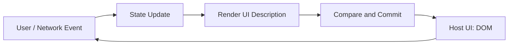
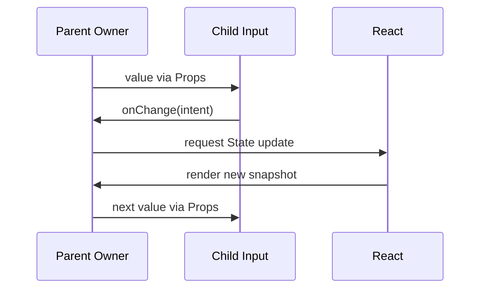
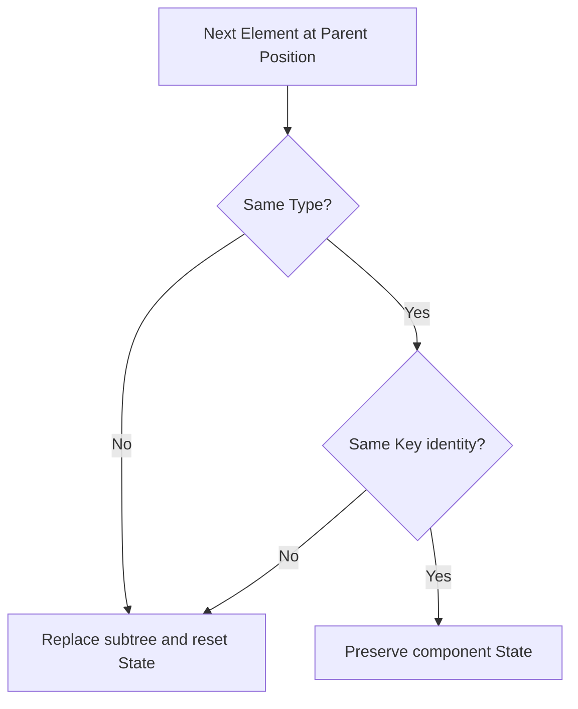

# React 声明式 UI：从 State 映射到组件身份与状态保留

> React 的核心不是“自动操作 DOM”，而是让开发者声明当前 Props 与 State 对应的 UI。React 负责比较前后描述并把结果提交到宿主环境；组件代码则必须保持纯净、明确状态所有权，并通过类型与 Key 表达身份。

---

## 一、本文解决什么问题

React 入门代码通常很短，但生产项目中的许多问题都来自核心模型理解偏差：

- “UI 是 State 的函数”是否意味着组件真的没有副作用；
- Component、组件实例、React Element 和 DOM Element 分别是什么；
- JSX 是模板、字符串还是 JavaScript 语法扩展；
- Props 为什么不可修改，State 为什么像一次 Render 的快照；
- 调用 Setter 后为什么当前变量没有立刻变化；
- 父组件更新是否等于所有子组件 DOM 都会更新；
- 数据只能向下流，子组件如何修改父组件状态；
- Composition 与继承、Context、Render Props 各解决什么问题；
- 受控与非受控组件如何选择，能否在生命周期中切换；
- 条件渲染、列表位置和 `key` 为什么会保留或重置 State；
- 为什么在组件内部定义组件，会导致输入框状态不断丢失；
- React 的声明式模型在哪些地方仍需要命令式逃生口。

本文以现代 React 函数组件和 TypeScript 为主。稳定公开契约与教学模型会明确区分；涉及 JSX Runtime、Server Components、React Compiler 或调度内部实现时，应以项目锁定的 React、`react-dom`、类型声明和构建工具版本为准。

### 核心结论

1. 声明式 UI 描述“给定当前输入，界面应是什么”，而不是逐条命令 DOM 如何变化。
2. `UI = f(state)` 是有用模型，但完整输入还包括 Props、Context 和组件自身 State；事件与 Effect 负责系统边界交互。
3. Component 是可复用的 UI 定义，React Element 是对某个类型、Props 和子节点的不可变描述；DOM Element 是浏览器中的宿主节点。
4. JSX 是语法扩展，会被转换为创建 React Element 描述的调用；它不是 HTML 字符串，也不会直接创建 DOM。
5. Props 是父级提供的只读输入，State 是组件拥有的持久化渲染数据；二者在某次 Render 中都表现为快照。
6. Setter 请求一次后续更新，不会修改当前闭包中的 State；下一值依赖上一值时应使用函数式更新。
7. 单向数据流指数据所有权和读取方向从父到子；子组件可通过回调发送事件，由所有者决定如何更新。
8. React 优先通过 Composition 构建 UI；Context 解决深层共享，不应取代清晰的状态所有权。
9. 受控组件由外部状态决定关键行为，非受控组件在内部或宿主节点保存状态；选择取决于谁需要协调和验证该状态。
10. State 关联到渲染树中的组件身份。类型、位置和 `key` 共同影响身份是否连续，`key` 不是普通业务 Props。

---

## 二、从命令式 DOM 到声明式 UI

假设一个提交按钮有“空闲、提交中、成功、失败”四种状态。命令式写法需要逐项维护 DOM：

```typescript
function setSubmitting(button: HTMLButtonElement, message: HTMLElement) {
  button.disabled = true;
  button.textContent = '提交中';
  message.textContent = '';
  message.removeAttribute('role');
}
```

随着分支增加，开发者必须确保每条路径都同步更新文本、禁用状态、ARIA 属性和错误区域，遗漏一步就可能产生不一致 UI。

React 更关注状态到描述的映射：

```tsx
type SubmitState =
  | { status: 'idle' }
  | { status: 'submitting' }
  | { status: 'success'; message: string }
  | { status: 'error'; message: string };

function SubmitPanel({ state }: { state: SubmitState }) {
  const submitting = state.status === 'submitting';

  return (
    <section>
      <button type="submit" disabled={submitting}>
        {submitting ? '提交中' : '提交'}
      </button>
      {state.status === 'success' && <p>{state.message}</p>}
      {state.status === 'error' && <p role="alert">{state.message}</p>}
    </section>
  );
}
```

开发者声明每种状态对应的 UI，React 决定如何把前后描述同步到 DOM。



图中 Render 负责计算描述，Commit 才可能改变宿主 UI。具体触发、比较、Effect 与浏览器 Paint 顺序属于后续“Render 与 Commit”模块；这里先保留职责边界。

### 2.1 声明式不是“没有流程”

请求、表单提交、动画和焦点仍有时序。区别在于：

- 持久、会影响显示的数据进入 State；
- 用户交互在 Event Handler 中处理；
- 与外部系统同步的工作放在 Effect 或框架的数据边界；
- DOM 差异同步由 React 管理。

声明式模型减少手工同步点，不会消除异步失败、取消、竞态和资源释放。

---

## 三、`UI = f(State)`：有用但不完整的模型

常见表达是：

```text
UI = f(State)
```

更完整地看，一个组件的渲染输出取决于：

```text
Element Description = render(Props, State, Context)
```

在相同输入与相同可观察环境下，Render 应返回相同描述，不应修改外部系统。

### 3.1 Render 必须保持纯净

错误示例：Render 修改模块变量和浏览器标题。

```tsx
let renderCount = 0;

function Profile({ name }: { name: string }) {
  renderCount += 1;
  document.title = name;
  return <h1>{name}</h1>;
}
```

问题包括：

- Render 可能被重复调用；
- 某次 Render 可能不被提交；
- SSR 环境可能没有 `document`；
- 多个请求可能共享模块状态；
- 统计结果依赖调度行为而非业务事实。

修复原则：

```tsx
function Profile({ name }: { name: string }) {
  useEffect(() => {
    document.title = name;
  }, [name]);

  return <h1>{name}</h1>;
}
```

若框架提供 Metadata API，应优先使用框架能力。Effect 的依赖、清理和服务端边界将在 Hooks 模块展开。

### 3.2 局部突变不等于副作用

组件可以创建并修改本次调用内部的新对象，只要它没有逃逸到外部：

```tsx
function TagList({ tags }: { tags: readonly string[] }) {
  const items: React.ReactNode[] = [];
  for (const tag of tags) {
    items.push(<li key={tag}>{tag}</li>);
  }
  return <ul>{items}</ul>;
}
```

这里的 `items` 每次 Render 都重新创建，不会影响外部。真正危险的是修改 Props、已有 State、模块单例、DOM 或其他共享对象。

### 3.3 时间和随机数也是隐式输入

在 Render 中直接读取 `Date.now()`、`Math.random()` 或可变全局值，会使相同显式输入产生不同结果，并可能造成 SSR Hydration 不一致。应在事件、初始化边界或可控状态中生成，并按业务需要注入 Clock/ID Generator 以便测试。

---

## 四、Component：UI 的可复用定义

React Component（组件）是接收输入并返回可渲染描述的定义。函数组件是普通 JavaScript 函数，但 React 对它的调用时机和 Hooks 使用施加了框架契约。

```tsx
type PriceProps = {
  amount: number;
  currency: string;
};

function Price({ amount, currency }: PriceProps) {
  const formatter = new Intl.NumberFormat('zh-CN', {
    style: 'currency',
    currency,
  });

  return <span>{formatter.format(amount)}</span>;
}
```

### 4.1 组件函数不是普通工具函数

不要直接调用组件：

```tsx
// 错误：绕开 React 对组件身份和 Hooks 的管理。
const content = Price({ amount: 20, currency: 'CNY' });
```

应通过 JSX 表达组件边界：

```tsx
const content = <Price amount={20} currency="CNY" />;
```

普通纯计算应提取为普通函数，组件则由 React 渲染。这样 React 才能把组件作为树中的独立节点处理状态、调试信息和更新。

### 4.2 组件边界如何选择

适合提取组件的信号包括：

- 有独立业务语义或可访问性契约；
- 有自己的状态或生命周期；
- 在多个位置复用；
- 需要独立测试、性能观察或错误隔离；
- 父组件因多个职责而难以理解。

仅为减少几行 JSX 而过度拆分，会增加 Props 传递和跳转成本。组件边界应围绕职责与所有权，而不是固定行数。

### 4.3 Component 不是 DOM 节点

组件可以返回一个宿主节点、Fragment、Portal、字符串、数字、`null`，或由框架支持的其他可渲染值。对组件使用 Ref 也不自动得到 DOM；DOM 暴露方式取决于组件 API 和当前 React 版本。

---

## 五、React Element：对 UI 的不可变描述

下面的 JSX：

```tsx
<UserCard user={user} compact />
```

会产生一个 React Element。它可以概念化为：

```typescript
{
  type: UserCard,
  key: null,
  props: {
    user,
    compact: true
  }
}
```

这只是帮助理解的概念形状，不应依赖 Element 对象的内部字段布局。React Element 是 React 创建和读取的描述值，不是 DOM Element，也不是组件实例。

### 5.1 三个概念必须分开

| 概念 | 含义 | 示例 |
|---|---|---|
| Component | 可复用的 UI 定义 | `UserCard` 函数 |
| React Element | 某次 UI 描述 | `<UserCard user={user} />` 的结果 |
| DOM Element | 浏览器宿主节点 | `HTMLDivElement` |

调用组件可以返回更多 Element，最终由 React 将宿主 Element 描述提交为 DOM 节点。


Element Tree 与 DOM Tree 不必一一对应：自定义组件没有必然对应的 DOM 节点，Fragment 不增加包裹节点，Portal 还能把子节点提交到另一宿主容器。

### 5.2 Element 是值，可以组合与传递

```tsx
type PanelProps = {
  heading: React.ReactNode;
  children: React.ReactNode;
};

function Panel({ heading, children }: PanelProps) {
  return (
    <section>
      <header>{heading}</header>
      <div>{children}</div>
    </section>
  );
}
```

`heading` 和 `children` 是可渲染描述。React 不要求所有组合都通过字符串模板或继承完成。

---

## 六、JSX 转换：语法不是模板字符串

JSX 允许在 JavaScript 中书写树状 UI：

```tsx
const element = <button disabled={pending}>{label}</button>;
```

现代 Automatic JSX Runtime 通常把它转换为类似调用：

```typescript
import { jsx as _jsx } from 'react/jsx-runtime';

const element = _jsx('button', {
  disabled: pending,
  children: label,
});
```

具体输出由 TypeScript/Babel/SWC 配置、开发或生产模式和 JSX Runtime 决定。经典 Runtime 常转换为 `React.createElement(...)`。不要把概念示例当作固定产物。

### 6.1 小写与大写类型

```tsx
<button />   // 字符串宿主类型，React DOM 创建 button
<Button />   // 标识符表达式，引用 Button 组件
```

自定义组件必须能在作用域中解析为值。动态类型可先赋给大写变量：

```tsx
const Heading = level === 1 ? 'h1' : 'h2';
return <Heading>{title}</Heading>;
```

### 6.2 表达式与转义

大括号中是 JavaScript 表达式：

```tsx
<p>{user.name}</p>
```

React DOM 默认会把字符串文本作为文本节点处理，从而避免它被当作 HTML 解释。但这不代表所有 URL、CSS、服务端模板或 `dangerouslySetInnerHTML` 都自动安全。注入 HTML 必须经过与上下文匹配的可信 Sanitization，并配置内容安全策略等纵深防御。

### 6.3 JSX Spread 的 API 风险

```tsx
function PrimaryButton(props: React.ComponentProps<'button'>) {
  return <button {...props} className="primary" />;
}
```

Spread 顺序决定同名 Props 的覆盖结果。无差别透传可能泄露无效 DOM 属性、覆盖事件或绕过组件约束。公共组件应明确哪些属性由调用方控制，合并 `className` 和 Handler 时定义清晰顺序。

---

## 七、Props：父级传入的只读快照

Props 是组件调用处提供的输入：

```tsx
type ProductCardProps = {
  product: Readonly<{
    id: string;
    name: string;
    price: number;
  }>;
  onAdd: (productId: string) => void;
};

function ProductCard({ product, onAdd }: ProductCardProps) {
  return (
    <article>
      <h2>{product.name}</h2>
      <button type="button" onClick={() => onAdd(product.id)}>
        加入购物车
      </button>
    </article>
  );
}
```

### 7.1 不要修改 Props

```tsx
type Item = { id: string; label: string };

function compareItems(left: Item, right: Item): number {
  return left.label.localeCompare(right.label, 'zh-CN');
}

// 错误：修改父级拥有的对象。
function SortableList({ items }: { items: Item[] }) {
  items.sort(compareItems);
  return <ul>{items.map((item) => <li key={item.id}>{item.label}</li>)}</ul>;
}
```

修复：

```tsx
function SortableList({ items }: { items: readonly Item[] }) {
  const sortedItems = [...items].sort(compareItems);
  return (
    <ul>
      {sortedItems.map((item) => <li key={item.id}>{item.label}</li>)}
    </ul>
  );
}
```

Props 只读是数据所有权契约，不只是 TypeScript `readonly` 修饰符。浅只读不会递归冻结对象，团队仍需遵守不可变更新约定。

### 7.2 `children` 也是 Props

嵌套 JSX 会作为 `children` 传入。不是每个组件都应默认接受 `children`；只有 API 确实提供内容插槽时才声明它，并明确接收 `ReactNode`、单个 Element、Render Function 或特定结构。

### 7.3 默认值应在解构处表达

```tsx
type AvatarProps = {
  size?: number;
  alt: string;
};

function Avatar({ size = 40, alt }: AvatarProps) {
  return ;
}
```

默认值只在值为 `undefined` 时生效，`null` 不会触发。公共 API 应明确缺失、`undefined`、`null` 和空字符串的业务语义。

### 7.4 不要把派生数据重复放进 Props

组件若已收到 `items`，通常不必再收到可能不一致的 `itemCount`。派生值应靠近使用处计算；只有计算确实昂贵且经过测量，才考虑缓存策略。

---

## 八、State：组件的持久化渲染数据

State 用于保存跨 Render 持续存在、且变化后需要反映到 UI 的数据。

```tsx
function QuantityPicker() {
  const [quantity, setQuantity] = useState(1);

  return (
    <button
      type="button"
      onClick={() => setQuantity((current) => current + 1)}
    >
      数量：{quantity}
    </button>
  );
}
```

### 8.1 State 是某次 Render 的快照

```tsx
function Counter() {
  const [count, setCount] = useState(0);

  function incrementThreeTimes() {
    setCount(count + 1);
    setCount(count + 1);
    setCount(count + 1);
  }

  return <button onClick={incrementThreeTimes}>{count}</button>;
}
```

三次调用读取的都是当前 Render 中同一个 `count` 快照，并都请求设置为同一个值。若需求是累计三次，应使用函数式更新：

```tsx
setCount((current) => current + 1);
setCount((current) => current + 1);
setCount((current) => current + 1);
```

Updater 会按 React 的更新规则处理。具体批处理和调度行为随 React 环境与版本而演进，不应通过插入 Timer 或 Microtask 猜测更新完成时机。

### 8.2 不要原地修改 State

错误示例：

```tsx
user.name = nextName;
setUser(user);
```

修复：

```tsx
setUser((current) => ({ ...current, name: nextName }));
```

不可变更新不仅服务变化检测，也保留历史快照，使并发渲染、撤销、日志和测试更可推理。深层对象应重新设计状态结构或使用经过评估的不可变更新工具，而不是无边界深拷贝。

### 8.3 哪些值不该放进 State

- 能从当前 Props/State 直接计算的派生值；
- 不影响 Render 的 Timer ID、DOM 节点和可变实例，它们更适合 Ref；
- 模块级缓存或服务端数据的完整副本，除非组件确实拥有它；
- 仅在 Event Handler 内使用的临时变量；
- 每次 Render 都被无条件同步回 Props 的镜像值。

### 8.4 Props 初始化 State 的边界

```tsx
function Editor({ initialTitle }: { initialTitle: string }) {
  const [title, setTitle] = useState(initialTitle);
  // ...
}
```

`initialTitle` 只用于初次初始化；后续 Props 变化不会自动覆盖本地 State。这适合“初始值”语义。若需求是始终跟随父级，应直接使用 Props；若要在实体切换时创建全新编辑会话，可通过稳定业务 `key` 明确重置身份。

---

## 九、单向数据流与状态所有权

React 的数据通常从拥有状态的父组件向子组件传递。子组件不能直接修改父组件 State，而是通过事件回调报告意图。

```tsx
function Cart() {
  const [quantity, setQuantity] = useState(1);

  return (
    <QuantityInput
      value={quantity}
      onChange={setQuantity}
    />
  );
}

type QuantityInputProps = {
  value: number;
  onChange: (value: number) => void;
};

function QuantityInput({ value, onChange }: QuantityInputProps) {
  return (
    <input
      type="number"
      min={1}
      value={value}
      onChange={(event) => {
        const nextValue = event.currentTarget.valueAsNumber;
        if (Number.isFinite(nextValue) && nextValue >= 1) {
          onChange(nextValue);
        }
      }}
    />
  );
}
```



“单向”描述数据读取和所有权方向，不表示事件也只能向下。回调、Context Dispatch、外部 Store 和服务事件都可传递意图，但最终应能定位谁拥有事实。

### 9.1 状态提升

两个兄弟组件需要保持一致时，把共同状态提升到最近公共所有者：

- 父级持有单一事实源；
- 子级通过 Props 读取；
- 子级通过回调请求修改。

提升过高会造成 Props 链过长和更新范围扩大。状态只应提升到需要协调它的最低共同边界；局部悬停、输入草稿和展开状态通常留在局部。

### 9.2 Context 不改变数据流方向

Context 让后代跨越中间层读取上层值，但数据仍由 Provider 向下提供。它适合主题、认证会话、区域设置和稳定服务入口；频繁变化的大对象可能扩大消费者更新，应拆分职责并实际测量。

### 9.3 外部 Store 也需要所有权

使用 Redux、Zustand 或其他 Store 不会自动解决建模问题。必须说明 State 的生命周期、订阅范围、服务端隔离、缓存一致性和谁可以写入。Server State、URL State、Form State 与局部 UI State 不应无差别塞进同一个全局容器。

---

## 十、Composition：通过组合构建 UI

React 倾向使用 Composition（组合）而非组件继承：父组件把数据、行为或可渲染内容交给更小组件共同完成界面。

### 10.1 `children` 组合

```tsx
type DialogProps = {
  title: string;
  children: React.ReactNode;
  actions: React.ReactNode;
};

function Dialog({ title, children, actions }: DialogProps) {
  return (
    <section role="dialog" aria-modal="true" aria-labelledby="dialog-title">
      <h2 id="dialog-title">{title}</h2>
      <div>{children}</div>
      <footer>{actions}</footer>
    </section>
  );
}
```

真实 Modal 还需管理焦点进入与恢复、Escape、背景交互、Portal 和屏幕阅读器行为，不能只靠 `role="dialog"` 完成可访问性。

### 10.2 Named Slots

React 没有必须使用的 Slot 关键字，可通过命名 Props 传递多个区域：

```tsx
<PageLayout
  navigation={<Navigation />}
  sidebar={<FilterPanel />}
>
  <ProductList />
</PageLayout>
```

这让布局组件负责结构，调用方负责内容。

### 10.3 Render Props

当父组件提供状态或行为，调用方决定渲染方式时，可传入函数：

```tsx
type DataBoundaryProps<T> = {
  data: T;
  children: (data: T) => React.ReactNode;
};

function DataBoundary<T>({ data, children }: DataBoundaryProps<T>) {
  return <>{children(data)}</>;
}
```

Hooks 能替代许多逻辑复用场景，但 Render Props 在 Headless Component、列表虚拟化和显式渲染控制中仍有价值。不要为了“灵活”同时暴露多套互相冲突的 API。

### 10.4 Composition 的代价

- Props 和回调链可能变长；
- 过度通用的容器难以表达领域语义；
- 创建大量临时 Element 或函数未必是性能问题，必须测量后再优化；
- 深层隐式 Context 会降低依赖可见性；
- Slot 结构过于自由时，可访问性约束更难保证。

---

## 十一、Controlled 与 Uncontrolled

Controlled/Uncontrolled 描述某个关键状态由谁拥有，不只适用于表单。

### 11.1 受控输入

```tsx
function SearchForm() {
  const [query, setQuery] = useState('');

  return (
    <input
      value={query}
      onChange={(event) => setQuery(event.currentTarget.value)}
    />
  );
}
```

React State 是当前值的事实源。优点是容易联动校验、格式化、禁用和跨组件协调；代价是每次输入都进入应用更新路径，复杂表单需要合理拆分和测量。

### 11.2 非受控输入

```tsx
function SearchForm() {
  function submit(event: React.FormEvent<HTMLFormElement>) {
    event.preventDefault();
    const formData = new FormData(event.currentTarget);
    const query = String(formData.get('query') ?? '');
    search(query);
  }

  return (
    <form onSubmit={submit}>
      <input name="query" defaultValue="" />
      <button type="submit">搜索</button>
    </form>
  );
}
```

DOM 保存当前输入值，React 在提交或 Ref 读取时获取它。`defaultValue` 只提供初始值，后续修改通常不会像 `value` 那样持续控制 DOM 当前值。

### 11.3 不要在生命周期中切换模式

```tsx
<input value={maybeValue} onChange={handleChange} />
```

若 `maybeValue` 从 `undefined` 变为字符串，组件可能从非受控切换为受控并产生警告。应从第一次 Render 就确定模式，例如受控文本输入用 `''` 作为空值。

### 11.4 组件级受控模式

```tsx
type AccordionProps = {
  expandedId: string | null;
  onExpandedIdChange: (id: string | null) => void;
};
```

受控 Accordion 便于 URL 同步和跨面板协调。非受控版本可提供 `defaultExpandedId` 并在内部持有 State。若同时支持两种模式，需要明确定义：

- 受控判定条件；
- `default*` 只在初始化生效；
- 回调在什么时机触发；
- 外部拒绝更新时 UI 如何表现；
- 是否允许运行中切换模式。

### 11.5 方案比较

| 维度 | Controlled | Uncontrolled |
|---|---|---|
| 状态所有者 | React 父级或外部 Store | 组件内部或 DOM |
| 跨组件协调 | 直接 | 需要读取或同步 |
| 实时校验/派生 | 容易 | 通常在事件边界读取 |
| 更新范围 | 需设计和测量 | 可保持局部 |
| 重置 | 更新 Props/State | 表单 Reset、Ref 或重建身份 |
| 适用场景 | 联动、规则复杂、需外部控制 | 简单表单、一次性提交、第三方 DOM 集成 |

不要以“受控一定专业”或“非受控一定性能好”做选择。关键是状态所有权与业务协调需求。

---

## 十二、Component Identity：State 属于树中的位置

State 不是保存在函数局部变量里，也不是简单绑定到 JSX 文本。React 根据渲染树中的组件身份，将已有 State 与下一次描述对应起来。

理解身份时抓住三个因素：

- 父级中的逻辑位置；
- Element Type；
- 同级列表或显式位置中的 `key`。

### 12.1 相同位置、相同类型通常保留 State

```tsx
function Page({ compact }: { compact: boolean }) {
  return (
    <section className={compact ? 'compact' : 'regular'}>
      <Counter />
    </section>
  );
}
```

`compact` 改变时，`Counter` 仍处于同一父级位置且类型相同，因此其身份通常延续，State 得以保留。

### 12.2 类型改变会重置该位置的子树

```tsx
function Result({ success }: { success: boolean }) {
  return success
    ? <SuccessPanel />
    : <ErrorPanel />;
}
```

同一逻辑位置从 `SuccessPanel` 变为 `ErrorPanel`，旧组件子树会被移除，新类型获得新 State。

### 12.3 `key` 参与同级身份

```tsx
function UserEditor({ user }: { user: UserSummary }) {
  return <ProfileForm key={user.id} initialUser={user} />;
}
```

用户 ID 改变时，`key` 改变，React 将其视为新的 `ProfileForm`，本地草稿 State 会重置。这是明确创建新编辑会话，而不是用 Effect 手工同步全部字段。



该图是面向公开行为的简化模型。列表匹配、移动和 Reconciliation 算法会在后续模块详细讨论。

### 12.4 `key` 不是传给组件的普通 Props

```tsx
<Row key={item.id} item={item} />
```

`Row` 不会通过 `props.key` 读取该值。若业务逻辑也需要 ID，必须显式传入 `itemId` 或 `item`。

### 12.5 不稳定 Key 会破坏身份

```tsx
// 错误：每次 Render 都创建新身份。
<Editor key={Math.random()} />
```

这会导致 State、焦点、选择区和正在进行的交互反复重置，也可能造成不必要的挂载与资源重建。列表应优先使用数据中的稳定唯一 ID；数组索引只适合顺序与成员不会影响身份的静态列表。

### 12.6 不要在组件内部定义组件类型

```tsx
function ProfilePage() {
  function NameInput() {
    const [name, setName] = useState('');
    return <input value={name} onChange={(e) => setName(e.currentTarget.value)} />;
  }

  return <NameInput />;
}
```

每次 `ProfilePage` Render 都会创建新的 `NameInput` 函数对象，Element Type 改变，State 可能被重置。应把组件定义移动到模块顶层，并通过 Props 传入依赖。

### 12.7 条件分支的视觉位置不等于身份位置

```tsx
return isAdmin
  ? <Counter label="管理员" />
  : <Counter label="访客" />;
```

两条分支在父级返回位置上都产生同类型、同 Key 的 `Counter`，切换时 State 通常会保留。若业务要求角色变化后重置，应使用不同稳定 Key；不要依赖代码缩进或 JSX 行号推断身份。

---

## 十三、声明式模型中的命令式逃生口

React 不禁止命令式操作，而是要求把它限制在适合的边界。常见场景包括：

- 聚焦、选择文本和滚动；
- 调用 `<video>` 的播放控制；
- 集成地图、图表、编辑器等第三方实例；
- 读取布局尺寸；
- 管理浏览器或平台没有声明式封装的能力。

```tsx
function SearchBox() {
  const inputRef = useRef<HTMLInputElement>(null);

  return (
    <>
      <input ref={inputRef} />
      <button type="button" onClick={() => inputRef.current?.focus()}>
        聚焦搜索框
      </button>
    </>
  );
}
```

原则是：让 React 管理 React 创建的 DOM 结构，不要在外部库中随意删除、移动或改写这些节点。第三方实例应有明确创建、更新、销毁和异常处理流程，并在组件卸载时释放订阅与资源。

---

## 十四、常见误区与错误案例

### 14.1 误区：声明式 UI 不需要理解生命周期

声明式降低 DOM 同步复杂度，但网络、订阅、焦点和第三方对象仍有生命周期。Render 必须纯净，外部同步必须处理 Cleanup、取消和竞态。

### 14.2 误区：父组件 Render，子组件 DOM 必然更新

父级重新计算可能产生子 Element；React 仍会比较描述，只有需要提交的宿主变化才修改 DOM。是否执行子组件、是否 Bailout、如何调度属于版本和优化边界，不能与 DOM Mutation 画等号。

### 14.3 误区：Props 改变后，本地 State 会自动重置

State 由组件身份关联。Props 改变通常只带来新的输入快照，不自动重置 State。应选择直接派生、显式事件同步或用业务 Key 创建新身份。

### 14.4 误区：`key` 只是用来消除控制台警告

`key` 决定同级元素身份匹配，影响 State、DOM、焦点和 Effect 生命周期。稳定性与唯一范围比“有没有填”更重要。

### 14.5 误区：Context 能替代所有 Props

Context 会隐藏依赖并扩大耦合。组件 API 中清晰、局部、必要的数据仍应通过 Props 传递；Context 用于真正的跨层共享。

### 14.6 错误案例：在 Render 中同步 State

```tsx
function Editor({ title }: { title: string }) {
  const [draft, setDraft] = useState(title);
  setDraft(title); // 错误：Render 中无条件更新
  return <input value={draft} />;
}
```

这会造成重复更新或循环。先判断状态所有权：始终跟随就直接使用 `title`；本地草稿就只在初始化使用；实体变化需重置则用明确 Key 或由上层管理。

### 14.7 错误案例：同时维护重复事实

```tsx
const [items, setItems] = useState<Item[]>([]);
const [itemCount, setItemCount] = useState(0);
```

若 `itemCount` 永远等于 `items.length`，第二份 State 会产生同步风险。应直接计算 `items.length`。

---

## 十五、工程实践与方案选择

### 15.1 从状态所有权开始设计

设计组件前依次回答：

1. 哪些值会随时间变化并影响 UI？
2. 哪个最小边界需要协调这些值？
3. 哪些值可以派生，不能成为第二事实源？
4. 状态要保留多久，切换哪个业务实体时应重置？
5. 外部事件、请求和订阅如何进入，失败和取消如何表达？
6. 组件 API 是否允许非法 Props 组合？

### 15.2 方案比较

| 问题 | 优先选择 | 代价或边界 |
|---|---|---|
| 局部交互状态 | 组件 State | 跨组件协调前需提升 |
| 兄弟组件同步 | 提升到最近公共父级 | Props/回调增加 |
| 深层稳定共享 | Context | 依赖变隐式，更新范围需测量 |
| 服务器数据 | Router/请求缓存层 | 需定义缓存、一致性和错误策略 |
| URL 可分享状态 | URL/Router State | 序列化、历史和隐私边界 |
| 简单一次性表单 | 非受控/FormData | 实时联动能力较弱 |
| 多字段实时联动 | 受控或表单状态库 | 更新和验证复杂度增加 |
| 切换实体重置局部状态 | 稳定业务 `key` | 会重建整个对应子树 |
| 复用布局与行为 | Composition | API 过度通用会难维护 |

### 15.3 组件 API 检查

- Props 是否最小且命名表达意图；
- 是否存在多个冲突 Boolean；
- `children` 和 Slot 是否保留语义与可访问性；
- 受控值与 `onChange` 是否成对；
- `default*` 是否明确只用于初始化；
- Key 是否来自稳定业务身份；
- 是否把 DOM、Ref 或第三方实例泄露得过多；
- 错误、空态、加载和禁用是否是模型的一部分。

---

## 十六、测试、性能与验证

### 16.1 以可观察行为测试

不要断言组件内部 State 数量或 Element 私有字段。优先验证：

- 给定 Props/State，用户能看到什么；
- 用户操作后回调和界面如何变化；
- Controlled 值由父级拒绝更新时是否保持一致；
- 实体 Key 改变时草稿是否按预期重置；
- 列表重排后输入状态是否仍属于正确实体；
- 错误、空态、禁用和键盘操作是否可访问。

### 16.2 身份回归测试

列表测试不应只检查文本是否存在，还应：

1. 在某一行输入草稿或展开详情；
2. 插入、删除或重新排序列表；
3. 断言状态仍与同一业务 ID 关联；
4. 切换为另一实体后，断言应重置的状态确实重置。

这能捕获索引 Key 和不稳定 Key 带来的真实错误。

### 16.3 性能必须区分阶段

声明式写法本身不是性能结论。应区分：

- Event Handler 与数据转换耗时；
- React Render 计算；
- Commit 和 DOM Mutation；
- 浏览器 Style、Layout、Paint 与 Composite；
- 网络、图片和第三方脚本。

在生产构建、目标浏览器和目标设备上使用 React Profiler 与 Performance 面板测量。不要仅凭“父组件重新渲染”就添加 `memo`、`useMemo` 或 `useCallback`；缓存也有比较、失效和维护成本。

### 16.4 Strict Mode 是开发检查

开发环境中的 Strict Mode 可能额外调用部分逻辑，以暴露不纯 Render 和缺少 Cleanup 的问题。这不等于生产环境固定执行两次，也不应通过检测调用次数绕过。正确修复是让 Render 幂等，让 Effect 建立对称的创建与清理过程。具体行为以当前 React 版本文档为准。

---

## 十七、总结

声明式 UI 的价值，是把容易漂移的 DOM 操作序列，转换为可由状态和身份推导的 UI 描述：

1. 组件 Render 根据 Props、State 与 Context 计算 React Element 描述。
2. Component、React Element 与 DOM Element 分属定义、描述和宿主实例三个层次。
3. JSX 被构建工具转换为 Element 创建调用，不是 HTML 模板字符串。
4. Props 属于调用方，State 属于组件身份；两者在每次 Render 中都是快照。
5. Setter 请求后续更新，当前闭包不会被改写；依赖旧值时使用函数式更新。
6. 单向数据流让事实所有者可定位，子组件通过事件报告意图。
7. Composition 通过 `children`、Slot 和 Render Props 复用结构与行为，通常优于继承。
8. Controlled 与 Uncontrolled 的本质是状态所有权选择，而不是高低级之分。
9. 类型、父级位置和 `key` 定义组件身份连续性，并决定 State 保留或重置。
10. 命令式操作应限制在 Ref、Effect 和第三方适配边界，并完整治理生命周期。

当每个状态都有明确所有者、每个组件都有稳定身份、每个 Render 都是纯计算时，React 应用才真正具备可预测性。

---

## 问答复盘

### Q1：`UI = f(State)` 为什么只是简化模型？

**答：** Render 的显式输入还包括 Props 和 Context，事件与外部系统也会推动状态变化。关键结论是 Render 应作为纯计算返回 UI 描述，而不是在其中执行外部同步。

### Q2：React Component、React Element 和 DOM Element 有什么区别？

**答：** Component 是 UI 定义，React Element 是某个类型与 Props 的描述值，DOM Element 是浏览器中的宿主节点。自定义组件和 Fragment 都不必对应单个 DOM 节点。

### Q3：调用 `setCount(count + 1)` 后，为什么当前函数里的 `count` 没变？

**答：** `count` 属于当前 Render 的快照，Setter 请求后续更新，不会改写已创建的闭包。下一值依赖上一值时使用 `setCount(current => current + 1)`。

### Q4：单向数据流是否意味着子组件无法改变父组件状态？

**答：** 子组件不能直接修改父级事实，但可以调用父级传入的回调报告事件。父级作为所有者决定验证、拒绝或提交更新。

### Q5：什么时候应选择非受控输入？

**答：** 简单的一次性提交、无需实时跨字段协调，或需要与原生表单和第三方 DOM 集成时可以选择。若需要实时校验、联动和外部驱动，受控模式通常更清晰。

### Q6：相同组件在条件分支之间切换，State 一定会重置吗？

**答：** 不一定。若它在父级中对应同一位置、Element Type 和 Key，身份通常延续，State 会保留。需要重置时应提供不同且稳定的业务 Key。

### Q7：为什么不能使用数组索引或 `Math.random()` 作为列表 Key？

**答：** 随机 Key 每次都会创建新身份；索引 Key 在插入、删除或重排后会把身份绑定到位置而非业务实体，可能导致输入、焦点和局部 State 串行。

### Q8：父组件重新 Render 是否意味着所有子组件都会修改 DOM？

**答：** 不意味着。Render 是计算描述，Commit 才修改必要的宿主节点。子组件执行和跳过策略还受 React 优化与版本影响，必须与 DOM Mutation 分开讨论。

### Q9：在 Render 中创建数组并 `push`，是否违反纯函数要求？

**答：** 不违反，只要数组是本次调用中新建且未逃逸。禁止的是修改 Props、已有 State、DOM、模块变量或其他共享对象。

---

## 延伸知识

- **Render 与 Commit**：Trigger、Render Phase、DOM Mutation、Effect 和 Browser Paint 的完整时序。
- **Reconciliation**：同层比较、列表移动、Fragment Key 与 State 保留规则。
- **Hooks 运行机制**：Fiber Hook List、闭包快照、Update Queue 与调用顺序。
- **状态设计**：Server State、URL State、Form State、派生状态与状态机。
- **组件 API 设计**：Compound Components、Headless Components、Slot、Ref 与可访问性契约。
- **React 性能**：Profiler、Memoization、React Compiler 与浏览器渲染管线。
