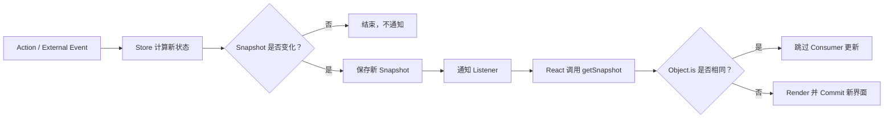
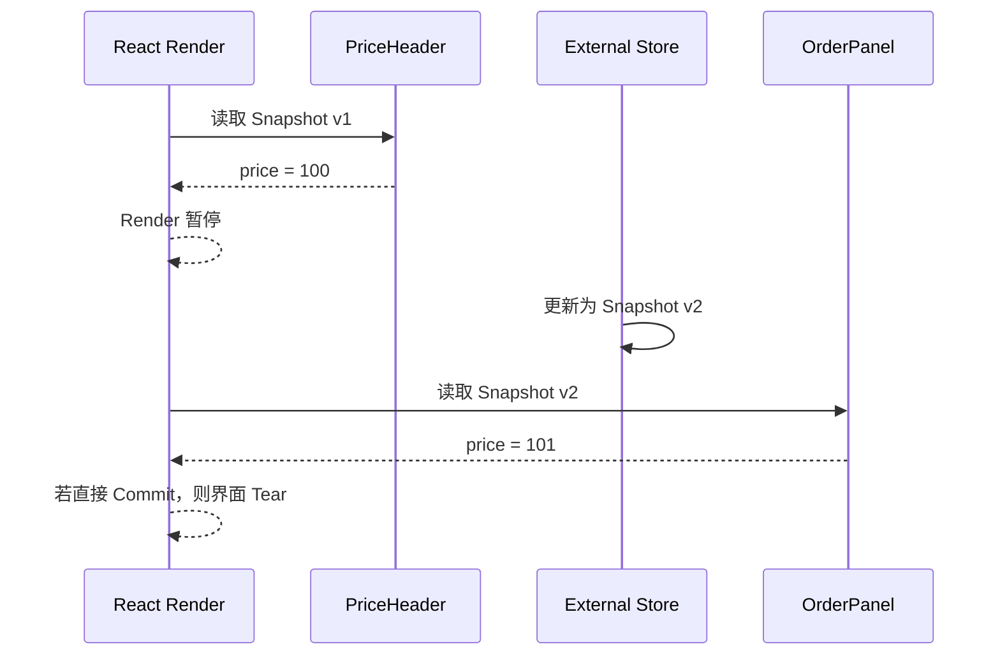

# React 外部 Store 协议：useSyncExternalStore、Snapshot 与并发一致性

> `useSyncExternalStore` 不是另一个全局状态库，而是 React 与外部可变数据源之间的一份一致性协议：Store 提供可缓存的 Snapshot 和可靠的 Subscribe，React 负责在并发 Render、Commit 与 Hydration 之间验证界面读取的是同一版本。

---

## 一、为什么需要外部 Store 协议

Redux Store、浏览器在线状态、媒体查询、WebSocket 缓存和第三方 Event Emitter 都存在于 React State 之外。组件需要读取它们，也需要在外部数据变化后重新 Render。

最直观的写法是 `useState + useEffect`：

```tsx
function CounterView({ store }: { store: CounterStore }) {
  const [snapshot, setSnapshot] = useState(store.getSnapshot());

  useEffect(() => {
    return store.subscribe(() => {
      setSnapshot(store.getSnapshot());
    });
  }, [store]);

  return <strong>{snapshot.count}</strong>;
}
```

这段代码看似合理，却留下几个窗口：

- Render 读取 Snapshot 后，到 Effect 完成订阅前，Store 可能已经更新；
- 并发 Render 可被暂停，多个组件可能在不同时间读取外部可变对象；
- 订阅、读取和 SSR Hydration 没有统一一致性约束；
- 手写 Hook 很容易忘记缓存 Snapshot、释放监听器或处理 Store 切换。

React 18 引入稳定的 `useSyncExternalStore`，用于规范这条边界。应用通常通过 Redux、Zustand 等库提供的 Hook 间接使用它；自研 Store、设计状态库或接入浏览器外部数据源时，才需要直接实现协议。

本文以 React 19.2 稳定公开文档为基准，重点回答：

- `useSyncExternalStore` 三个参数分别承担什么职责；
- Snapshot 为什么必须不可变或具有稳定缓存；
- Subscribe 为什么必须返回 Unsubscribe；
- Concurrent Rendering 中 Tearing 如何产生；
- React 如何在 Transition Commit 前二次检查 Snapshot；
- `getServerSnapshot` 如何保证 SSR 与 Hydration 一致；
- Store 应该是全局单例、页面实例还是每请求实例；
- Selector、Suspense 和异步资源有哪些边界；
- 如何测试通知、清理、竞态和性能。

### 核心结论

1. `useSyncExternalStore(subscribe, getSnapshot, getServerSnapshot?)` 把订阅、读取和服务端初值组成一个协议。
2. `getSnapshot` 必须是纯读取；Store 未变化时，重复调用必须返回 `Object.is` 相同的结果。
3. Store 变化后应先更新内部 Snapshot，再通知所有 Listener。
4. `subscribe` 必须返回清理函数；其函数身份无意义变化会导致重新订阅。
5. React 根据 Snapshot 是否变化决定 Consumer 是否需要更新，不能只通知而不更新 Snapshot。
6. 并发 Render 中，外部 Store 变化可能导致 Tearing；React 会在关键阶段重新检查 Snapshot。
7. Transition 期间若二次 Snapshot 检查发现 Store 改变，React 会把该更新重新按 Blocking Update 完成，以保持屏幕一致。
8. SSR 场景的 `getServerSnapshot` 必须让服务端输出与客户端首次 Hydration 读取一致。
9. Store 实例的创建位置决定租户隔离、页面重置、SSR 请求安全与资源释放。
10. 高频选择、缓存、异步请求、持久化和 DevTools 仍由 Store 或状态库实现，不由该 Hook 自动提供。

---

## 二、API：读取、订阅与服务端初值

```tsx
const snapshot = useSyncExternalStore(
  subscribe,
  getSnapshot,
  getServerSnapshot,
);
```

三个函数的职责不能互换：

| 参数 | 职责 | 核心约束 |
|---|---|---|
| `subscribe` | 注册 Store 变化通知 | 返回 Unsubscribe，身份应稳定 |
| `getSnapshot` | 读取当前客户端 Snapshot | 纯函数，未变化时返回缓存结果 |
| `getServerSnapshot` | 提供 SSR 和 Hydration 初始 Snapshot | 服务端与客户端首次读取一致 |

`getServerSnapshot` 是可选参数，但组件如果要参与服务端渲染，就必须提供可用的服务端 Snapshot；否则应让该功能只在客户端渲染，并接受相应的首屏和 SEO 代价。

### 2.1 浏览器外部状态示例

```tsx
function subscribeToOnlineStatus(listener: () => void) {
  window.addEventListener('online', listener);
  window.addEventListener('offline', listener);

  return () => {
    window.removeEventListener('online', listener);
    window.removeEventListener('offline', listener);
  };
}

function getOnlineSnapshot() {
  return navigator.onLine;
}

function getServerOnlineSnapshot() {
  return true;
}

function useOnlineStatus() {
  return useSyncExternalStore(
    subscribeToOnlineStatus,
    getOnlineSnapshot,
    getServerOnlineSnapshot,
  );
}
```

这里的 Snapshot 是 Boolean Primitive，天然满足稳定比较。服务端暂定 `true` 只是产品策略；客户端 Hydration 首次也会使用 Server Snapshot，Hydration 完成后再依据浏览器真实状态更新。

---

## 三、实现一个最小 Store

一个满足协议的 Store 至少需要：当前 Snapshot、Listener 集合、读取函数、订阅函数和更新入口。

```tsx
type Listener = () => void;

type CounterSnapshot = Readonly<{
  count: number;
  revision: number;
}>;

type CounterStore = {
  getSnapshot(): CounterSnapshot;
  subscribe(listener: Listener): () => void;
  setCount(nextCount: number): void;
};

function createCounterStore(initialCount = 0): CounterStore {
  let snapshot: CounterSnapshot = {
    count: initialCount,
    revision: 0,
  };

  const listeners = new Set<Listener>();

  return {
    getSnapshot: () => snapshot,

    subscribe: (listener) => {
      listeners.add(listener);
      return () => {
        listeners.delete(listener);
      };
    },

    setCount: (nextCount) => {
      if (Object.is(snapshot.count, nextCount)) return;

      snapshot = {
        count: nextCount,
        revision: snapshot.revision + 1,
      };

      for (const listener of [...listeners]) {
        listener();
      }
    },
  };
}
```

组件通过 Hook 读取：

```tsx
const counterStore = createCounterStore();

function useCounterSnapshot() {
  return useSyncExternalStore(
    counterStore.subscribe,
    counterStore.getSnapshot,
  );
}

function Counter() {
  const snapshot = useCounterSnapshot();

  return (
    <button onClick={() => counterStore.setCount(snapshot.count + 1)}>
      {snapshot.count}
    </button>
  );
}
```

更新顺序很重要：

1. 计算新状态；
2. 若语义未变化则直接返回；
3. 创建并保存新 Snapshot；
4. 再通知 Listener；
5. React 收到通知后调用 `getSnapshot`；
6. Snapshot 不同时安排组件更新。



通知不是数据本身。Listener 只告诉 React“可能变化了”，真实版本仍由 `getSnapshot` 返回。

---

## 四、Snapshot 契约：稳定、纯净、可比较

Snapshot 是某一时刻对 Store 的只读观察。它可以是 Primitive，也可以是不可变对象，但必须满足两个条件：

- Store 未变化时，重复调用返回 `Object.is` 相同的值；
- Store 变化且界面应更新时，返回能被 `Object.is` 识别为不同的值。

### 4.1 错误：每次读取都创建对象

```tsx
const store = {
  getSnapshot() {
    return { count: internalState.count }; // 每次都是新引用
  },
};
```

React 在一次更新中可能多次调用 `getSnapshot`。即使 Store 没变化，这段代码也持续返回新对象，可能触发“The result of `getSnapshot` should be cached”错误或更新循环。

正确做法是在 Store 变化时创建一次新 Snapshot，之后复用：

```tsx
let snapshot = { count: 0 };

function getSnapshot() {
  return snapshot;
}

function increment() {
  snapshot = { count: snapshot.count + 1 };
  emitChange();
}
```

### 4.2 外部源只能提供可变对象怎么办

如果第三方数据源原地修改对象，需要根据其 Version 或 Revision 缓存不可变 Snapshot：

```tsx
let cachedVersion = -1;
let cachedSnapshot: ReadonlyArray<Order> = [];

function getOrdersSnapshot() {
  const version = mutableOrderSource.version;

  if (version !== cachedVersion) {
    cachedVersion = version;
    cachedSnapshot = mutableOrderSource.orders.map((order) => ({ ...order }));
  }

  return cachedSnapshot;
}
```

这段转换必须足够便宜，或者在数据源更新时提前生成。不要在每次 `getSnapshot` 中执行深拷贝、排序、`JSON.stringify` 或网络请求。

### 4.3 Snapshot 必须是纯读取

`getSnapshot` 可能在 Render 和一致性检查阶段被重复调用，因此不能：

- 修改 Store；
- 发起请求；
- 注册订阅；
- 读取后递增游标；
- 依赖随机数或当前时间制造新值；
- 抛出仅为驱动 Suspense 而临时创建的 Promise。

更新 Store 应发生在事件、Action、网络回调或明确的 Effect 中，而不是读取函数中。

---

## 五、Subscribe 契约：稳定通知与可靠清理

`subscribe(listener)` 注册变化回调，并返回取消订阅函数：

```tsx
function subscribe(listener: () => void) {
  emitter.on('change', listener);

  return () => {
    emitter.off('change', listener);
  };
}
```

React 可以因组件卸载、Store 更换、参数变化或开发模式检查而取消并重新建立订阅。Unsubscribe 必须可安全执行，不能遗漏 Timer、DOM Event、WebSocket Listener 或第三方 Subscription。

### 5.1 不稳定的 `subscribe` 会重复订阅

```tsx
function ChannelView({ store, channelId }: Props) {
  const snapshot = useSyncExternalStore(
    (listener) => store.subscribe(channelId, listener),
    () => store.getChannelSnapshot(channelId),
  );

  return <Channel snapshot={snapshot} />;
}
```

内联 `subscribe` 每次 Render 都是新函数，React 需要重新订阅。应稳定依赖：

```tsx
function ChannelView({ store, channelId }: Props) {
  const subscribe = useCallback(
    (listener: () => void) => store.subscribe(channelId, listener),
    [store, channelId],
  );

  const getSnapshot = useCallback(
    () => store.getChannelSnapshot(channelId),
    [store, channelId],
  );

  const snapshot = useSyncExternalStore(subscribe, getSnapshot);
  return <Channel snapshot={snapshot} />;
}
```

如果 `subscribe` 不依赖 Props，优先在组件外定义。不要为了函数稳定而遗漏真正依赖，否则组件会继续监听旧 Channel。

### 5.2 订阅期间发生更新

React 不能假设 Render 后 Store 静止不动。`useSyncExternalStore` 会围绕订阅和 Commit 检查 Snapshot，避免“先读取、后订阅”窗口中的更新被永久漏掉。业务代码只需确保：

- Snapshot 总能表达最新已提交 Store 状态；
- 每次有效变化都会通知 Listener；
- 取消订阅后不会继续向已释放 Consumer 推送；
- Store 切换时旧订阅能够完整清理。

不要再额外用 Effect 手写一次“订阅后补读”协议，否则容易产生重复更新和新的竞态。

---

## 六、Concurrent Rendering 一致性与 Tear 防护

Tearing 指同一个已提交界面中，不同组件显示了外部 Store 的不同版本。

假设并发 Render 可被暂停：



单纯读取一个外部可变对象时，React 无法知道它在 Render 中途发生变化。协议通过可比较 Snapshot 把版本变化暴露给 React。

### 6.1 Transition 中的二次检查

React 官方公开说明：如果外部 Store 在 Non-blocking Transition Update 期间发生变化，React 会在应用 DOM 变更前再次调用 `getSnapshot`。

- 若第二次结果与 Render 使用的 Snapshot 相同，可以继续；
- 若不同，React 会从头重新执行，并将该次更新按 Blocking Update 完成；
- 目标是让屏幕上所有 Consumer 反映同一 Store 版本。

这不是把外部 Store 更新变成 Transition，而是在发现版本漂移时选择一致性优先。业务代码不应依赖“Render 一定只执行一次”。

### 6.2 Tear-free 不等于所有数据原子更新

React 能保证的是正确实现协议后，组件不会以已知不一致的 Snapshot 组合 Commit。Store 自身仍要定义事务边界：

```tsx
store.setAccount(account);
store.setPermissions(permissions);
```

如果两次调用分别发布 Snapshot，React 可能观察到两个合法版本。若业务要求账号与权限不可分割，应由 Store 提供一个原子 Action，一次生成完整 Snapshot 并通知。

### 6.3 不要泄露 Snapshot 内部可变引用

顶层 Snapshot 引用更新并不够。如果内部数组、Map 或实体继续被原地修改，旧 Render 仍可能观察到后来变化。Snapshot 应是逻辑不可变结构，或者通过版本化读取保证旧 Snapshot 不再变化。

---

## 七、Server Snapshot：SSR 与 Hydration 的握手

服务端没有 `window`、浏览器事件和客户端单例，因此需要第三个函数：

```tsx
useSyncExternalStore(subscribe, getSnapshot, getServerSnapshot);
```

`getServerSnapshot` 会用于服务端渲染，也用于客户端 Hydration 的首次读取。两端必须产生一致的初始 UI，否则会出现 Hydration Mismatch。

### 7.1 每请求创建 Store

包含账号、租户或请求数据的 Store 不能是 Node 进程级单例：

```tsx
type AppStoreProviderProps = PropsWithChildren<{
  initialSnapshot: AppSnapshot;
}>;

const AppStoreContext = createContext<AppStore | undefined>(undefined);

function AppStoreProvider({
  initialSnapshot,
  children,
}: AppStoreProviderProps) {
  const [store] = useState(() => createAppStore(initialSnapshot));

  return (
    <AppStoreContext value={store}>
      {children}
    </AppStoreContext>
  );
}

function useAppSnapshot() {
  const store = useContext(AppStoreContext);

  if (!store) {
    throw new Error('useAppSnapshot must be used within AppStoreProvider');
  }

  return useSyncExternalStore(
    store.subscribe,
    store.getSnapshot,
    store.getServerSnapshot,
  );
}
```

`createAppStore(initialSnapshot)` 应保存一份稳定的 Hydration Snapshot，使 `getServerSnapshot` 在服务端和客户端首次 Hydration 时返回相同数据。客户端激活后，`getSnapshot` 再反映实时状态。

`useState` 初始化函数用于创建该 Provider 实例的 Store。Strict Mode 在开发环境可能调用初始化函数两次以检查纯度，因此 `createAppStore` 只能构造内存状态，不能在构造阶段直接建立连接或产生外部副作用。若切换到另一个账号或租户应创建新 Store，可以通过业务身份 `key` 重建 Provider，而不是静默忽略新的 `initialSnapshot`。

### 7.2 序列化初始 Snapshot

服务端通常把初始数据安全地序列化到 HTML，客户端创建 Store 时读取同一份数据。工程上必须处理：

- 使用框架提供的安全序列化能力，避免 `</script>` 和 XSS 注入；
- 不把服务端密钥、内部权限或无关 PII 下发到客户端；
- Date、Map、BigInt 等非 JSON 类型需要明确编码协议；
- Snapshot Schema 必须支持版本兼容；
- HTML 缓存键必须区分用户、租户、语言等维度；
- Hydration 前不要让客户端 Store 提前改写初始 Snapshot。

### 7.3 没有合理 Server Snapshot 时

浏览器尺寸、设备连接等数据在服务端无法准确获知。可以选择一个不会破坏 Hydration 的保守默认值，Hydration 后再更新；也可以把区域设为 Client-only。选择应权衡 Layout Shift、SEO 和首次交互，不要伪造“服务端已经知道客户端环境”。

---

## 八、Store 生命周期：全局、子树与资源所有权

Store 生命周期必须先于状态库选型确定。

| Store 类型 | 推荐作用域 | 典型场景 |
|---|---|---|
| 客户端进程级单例 | 整个 SPA 生命周期 | 无用户敏感性的设备状态 |
| Session Store | 登录会话边界 | 当前账号、权限能力 |
| Route Store | 页面或实体边界 | 编辑器、工作区、草稿 |
| Request Store | 单次 SSR 请求 | 服务端用户数据与 Hydration |
| Component Store | 局部子树 | 可复用复杂组件实例 |

### 8.1 用 Context 传 Store 实例

Context 可以传递稳定的 Store 实例，`useSyncExternalStore` 负责订阅 Snapshot。这比把每次变化的整个 Snapshot 放进 Context 更适合细粒度订阅：

```tsx
function EditorStoreProvider({ documentId, children }: Props) {
  const [store] = useState(() => createEditorStore(documentId));

  return (
    <EditorStoreContext value={store}>
      {children}
    </EditorStoreContext>
  );
}
```

如果 `documentId` 改变应创建新实例，父层应使用 `key={documentId}`，或由 Provider 明确实现 Store 切换协议。不要让初始化参数变化后，旧 Store 继续服务新实体而没有任何说明。

### 8.2 外部资源的启动与停止

WebSocket、BroadcastChannel、原生 SDK 等 Store 需要显式资源生命周期：

```tsx
function PriceStoreProvider({ children }: PropsWithChildren) {
  const [store] = useState(createPriceStore);

  useEffect(() => {
    store.start();
    return () => store.stop();
  }, [store]);

  return (
    <PriceStoreContext value={store}>
      {children}
    </PriceStoreContext>
  );
}
```

`start` 和 `stop` 必须允许开发环境 Strict Mode 的 Setup、Cleanup、Setup 检查，不能第一次 `stop` 后永久销毁不可恢复对象。异步连接还应处理：

- 连接错误和重连退避；
- Unmount、切换实体和退出登录时取消；
- 旧连接消息晚到时按 Generation/Request ID 丢弃；
- 鉴权刷新和权限撤销；
- Listener 清空与底层句柄释放；
- 页面后台化时是否降频或暂停。

简单内存 Store 没有外部资源时，每个 `subscribe` 返回可靠 Cleanup 通常已经足够，不必为了形式添加全局 `destroy`。

### 8.3 多 Root 与微前端

多个 React Root 如果引用同一个外部 Store 实例，可以订阅同一 Snapshot；如果各自创建 Store，则状态隔离。微前端需要明确共享的是 Store 实例、事件协议还是服务端数据，不能仅凭包名相同假设已经共享。

---

## 九、Selector 与订阅粒度

直接返回完整 Snapshot 时，任何顶层 Snapshot 变化都会让所有使用该 Hook 的组件重新检查并可能 Render。

对于 Primitive 派生值，可以让 `getSnapshot` 直接返回选择结果：

```tsx
function useCartItemCount(store: CartStore) {
  const getSnapshot = useCallback(
    () => store.getSnapshot().items.length,
    [store],
  );

  const getServerSnapshot = useCallback(
    () => store.getServerSnapshot().items.length,
    [store],
  );

  return useSyncExternalStore(
    store.subscribe,
    getSnapshot,
    getServerSnapshot,
  );
}
```

只要数量未变，返回的 Number 通过 `Object.is` 比较相同，组件可以跳过更新。

### 9.1 派生对象仍需缓存

```tsx
() => store.getSnapshot().items.filter((item) => item.selected)
```

每次都创建新数组，再次违反 Snapshot 稳定性。复杂 Selector 需要 Memoization、Equality Function 和按 Store Version 缓存。成熟状态库通常已经实现这些细节；不要在每个组件里各写一套不一致的 Selector 缓存。

React 的核心 `useSyncExternalStore` 不接收 Selector 参数。React 官方还提供独立兼容包中的 Selector 工具，状态库也可能提供自己的 API；采用前应核对包版本、Equality 语义和 SSR 支持，而不是假设所有库行为一致。

### 9.2 Selector 必须包含参数依赖

按 `productId` 读取实体时，ID 变化必须更新读取函数或 Store Hook。遗漏依赖会让组件继续展示旧实体；随意重建订阅函数则会产生不必要的重新订阅。参数化 Selector 最好由状态层提供统一实现并测试。

---

## 十、Transition、Suspense 与外部 Store 的边界

外部 Store Mutation 不能像 React State 一样被可靠标记为 Non-urgent Transition Update。即使在 `startTransition` 中调用 Store Action，Store 仍可能同步变化并通知订阅者。

React 会优先保持一致性，并可能把受影响更新按 Blocking Update 重做。因此：

- 不要用 `startTransition(() => externalStore.setState(...))` 承诺低优先级语义；
- 输入框的受控值应优先保留在 React State，再把昂贵派生工作延后；
- Store Action 应定义业务原子性，而不是依赖 Scheduler 调整更新顺序；
- 对高频推送进行 Store 层采样或批处理前，必须明确允许丢失哪些中间状态。

### 10.1 不推荐根据 Store Snapshot 直接 Suspend

React 官方不推荐让 `useSyncExternalStore` 返回值驱动会 Suspend 的资源读取。外部 Store Mutation 无法作为 Non-blocking Transition，可能让已经显示的内容突然退回最近 Suspense Fallback。

代码分割和 Data Suspense 应使用 React/框架支持的资源协议；外部 Store 更适合提供已经可同步读取的 Snapshot，并显式包含 Loading、Success、Error 等状态。

---

## 十一、常见错误与修复

### 11.1 `getSnapshot` 每次返回新对象

**问题：** Store 未变化也无法通过 `Object.is`，可能形成重复 Render。

**修复：** 只在 Store 版本变化时创建并缓存新 Snapshot。

### 11.2 修改数据后没有通知

**问题：** `getSnapshot` 已变化，但 React 不知道需要检查。

**修复：** 原子保存新 Snapshot 后同步通知当前 Listener。

### 11.3 先通知再更新 Snapshot

**问题：** React 收到通知后仍读到旧值，真实更新可能被漏掉。

**修复：** 先提交 Store 状态，再发布变化通知。

### 11.4 `subscribe` 定义在组件内且不稳定

**问题：** 每次 Render 取消并重建订阅，增加成本并放大竞态。

**修复：** 放到模块作用域，或根据真实参数使用 `useCallback`。

### 11.5 Unsubscribe 没有释放全部资源

**问题：** 卸载组件仍收到事件，形成内存泄漏或重复通知。

**修复：** 成对释放 Event、Timer、SDK Subscription 和底层连接引用。

### 11.6 SSR 使用进程级用户 Store

**问题：** 不同请求可能共享账号数据，属于严重隔离和安全问题。

**修复：** 每请求创建 Store，并安全传输对应 Initial Snapshot。

### 11.7 把多个业务更新发布成多个临时 Snapshot

**问题：** UI 可能观察到业务不允许的中间状态。

**修复：** Store 提供事务或单一 Domain Action，一次发布完整 Snapshot。

### 11.8 用 Effect 手写外部 Store Hook

**问题：** 容易丢失订阅前更新，也没有并发与 Hydration 契约。

**修复：** 使用 `useSyncExternalStore` 或成熟状态库的官方 React Binding。

---

## 十二、测试与验证

### 12.1 行为测试

```tsx
test('Store 更新后组件显示最新 Snapshot', () => {
  const store = createCounterStore(1);

  function View() {
    const snapshot = useSyncExternalStore(
      store.subscribe,
      store.getSnapshot,
    );
    return <span>{snapshot.count}</span>;
  }

  render(<View />);
  expect(screen.getByText('1')).toBeVisible();

  act(() => {
    store.setCount(2);
  });

  expect(screen.getByText('2')).toBeVisible();
});
```

测试 Store 协议时至少覆盖：

- 未变化时 `getSnapshot()` 引用稳定；
- 有效 Action 生成新 Snapshot；
- 无效或幂等 Action 不重复通知；
- 多个 Consumer 同时收到同一版本；
- Unmount 后 Listener 被移除；
- Store/实体参数切换后旧订阅被清理；
- 异步旧结果不会覆盖新实体；
- 错误、重连和停止状态进入可观察 Snapshot。

### 12.2 SSR 与 Hydration 测试

- 使用服务端 Initial Snapshot 生成 HTML；
- 客户端用同一序列化数据创建 Store；
- Hydration 期间没有 Mismatch；
- Hydration 后外部变化能正常更新；
- 两个并发 SSR 请求不会读取对方 Store；
- 用户数据不会出现在不属于该用户的 HTML Cache 中；
- 无法服务端确定的值使用稳定保守默认值。

### 12.3 Strict Mode 与资源清理

开发测试应允许 Store 的 `start -> stop -> start`，并确认不会产生两个 WebSocket、重复 Timer 或重复 Event Listener。只在生产模式“看起来没重复”不能证明生命周期实现正确。

---

## 十三、性能测量

`getSnapshot` 处于 Render 和一致性检查路径，必须保持便宜。性能分析应观察：

- 每秒 Store Mutation 和 Listener Notification 数量；
- 每次 Action 创建的 Snapshot 大小；
- `getSnapshot` 与 Selector 耗时；
- Consumer Render 数量和 Commit Duration；
- 订阅重建次数；
- 推送高峰下的 INP、Long Task 和内存；
- SSR Snapshot 序列化体积与 Hydration 时间。

在生产构建、目标设备和代表性数据量下使用 React DevTools Profiler 与浏览器 Performance 工具。优化顺序通常是：

1. 避免无语义变化的 Action 和通知；
2. 缓存 Snapshot；
3. 缩小 Selector 返回值；
4. 合并业务上必须原子的更新；
5. 降低不必要的外部事件频率；
6. 最后再评估更复杂的 Equality 与索引结构。

不能仅凭 Consumer 数量断言性能问题。Listener 回调很轻，但慢 Selector、大 Snapshot 克隆和大量组件 Render 仍可能成为瓶颈，必须分别测量。

---

## 十四、工程检查清单

- 数据是否真的位于 React 之外，是否需要 External Store；
- `getSnapshot` 是否纯净、同步且无副作用；
- Store 未变化时 Snapshot 是否 `Object.is` 相同；
- Store 变化时是否先保存新 Snapshot 再通知；
- Snapshot 内部是否仍泄露可变引用；
- `subscribe` 是否返回完整、幂等的 Cleanup；
- `subscribe` 身份是否因无关 Render 改变；
- 参数变化时是否正确切换 Store 或 Channel；
- 多字段业务变更是否需要一次原子 Snapshot；
- Selector 返回对象或数组时是否缓存；
- 外部 Store 更新是否被错误当作 Transition；
- 是否避免根据 Store Snapshot 直接触发 Suspense；
- SSR 是否每请求创建隔离 Store；
- `getServerSnapshot` 是否与 Hydration 首次读取一致；
- 序列化是否处理 XSS、敏感数据和 Schema 版本；
- Store 的 Start/Stop 是否支持 Strict Mode 重放；
- 异步连接是否处理错误、取消、竞态、重连和释放；
- 测试是否覆盖 Listener 清理、SSR 隔离和多 Consumer 一致性；
- 性能结论是否来自生产构建和目标设备测量。

---

## 十五、总结

1. `useSyncExternalStore` 是 React 与外部数据源之间的一致性协议，不是状态库。
2. Snapshot 必须纯净、可比较并缓存；未变化时不能制造新引用。
3. Subscribe 只发送变化信号，真实数据版本始终由 Snapshot 表达。
4. Store 应先提交新状态再通知，并为每个订阅返回可靠 Cleanup。
5. 协议帮助 React 防止并发 Render 中不同 Consumer Commit 不同版本的 Tearing。
6. Transition 期间发现 Snapshot 漂移时，React 会按 Blocking Update 重做以保证一致性。
7. `getServerSnapshot` 是 SSR 与 Hydration 的初值握手，必须使用一致数据。
8. Store 的实例位置决定页面生命周期、用户隔离、SSR 安全和资源所有权。
9. Context 适合传稳定 Store 实例，Selector 决定具体订阅粒度。
10. 异步请求、缓存、重试、事务、持久化和 DevTools 仍由 Store 或状态库负责。

外部 Store 集成真正困难的不是“收到事件后调用一次更新”，而是让每次读取都能证明自己属于一个稳定版本，并让订阅、并发 Commit、服务端输出和资源生命周期共同遵守这份版本契约。

---

## 问答复盘

### Q1：`useSyncExternalStore` 与普通 `useEffect` 订阅的核心差异是什么？

**答：** 前者把读取、订阅和一致性检查纳入 React 协议，能处理订阅窗口、并发 Render 和 Hydration；Effect 手写方案没有这些保证。

### Q2：为什么 `getSnapshot` 不能每次返回 `{ ...state }`？

**答：** Store 未变化时也会产生新引用，React 无法判断快照稳定，可能重复 Render 或报告 Snapshot 应缓存。

### Q3：Store 已调用 Listener，但 Snapshot 引用没变，组件一定更新吗？

**答：** 不一定。React 会重新读取并比较 Snapshot；若 `Object.is` 相同，说明协议层没有可观察变化，可以跳过更新。

### Q4：Tearing 与普通的短暂中间状态有什么区别？

**答：** Tearing 是同一次已提交界面中的 Consumer 显示不同 Store 版本；中间状态则可能是 Store 主动发布的一个合法 Snapshot，需要由业务事务决定是否允许。

### Q5：为什么外部 Store Mutation 不适合依赖 `startTransition` 降低优先级？

**答：** 外部 Store 可以同步变化，无法像 React State 一样可靠标记为 Transition。为保持一致性，React 可能按 Blocking Update 重做。

### Q6：`getServerSnapshot` 只在服务器调用吗？

**答：** 不是。它也用于客户端 Hydration 的首次读取，因此两端必须基于同一份 Initial Snapshot 生成一致 UI。

### Q7：为什么 SSR 不能复用模块级用户 Store 单例？

**答：** Node 进程会处理多个请求，单例可能让不同用户共享状态。用户和租户 Store 必须按请求隔离。

### Q8：组件只读取大型 Snapshot 的一个字段，如何减少更新？

**答：** 让订阅 Hook 返回稳定的选择结果，或使用具有 Selector 和 Equality 支持的成熟库；派生对象仍必须缓存。

### Q9：WebSocket Store 卸载时只清空 React Listener 足够吗？

**答：** 不一定。还要根据所有权停止连接、Timer 和重连任务，并防止旧连接的迟到消息写入新实体 Store。

---

## 延伸知识

- **Context**：用稳定 Context 传递 Store 实例，而不是传播整个动态 Snapshot。
- **状态管理选型**：Redux Toolkit、Zustand、MobX、XState 与原子化状态的订阅模型。
- **Concurrent Rendering**：Interruptible Render、Transition、Commit 原子性与 Tear-free UI。
- **不可变更新**：引用相等、结构共享与 Snapshot Version。
- **Server State**：Cache、Deduplication、Retry、Mutation 和 Hydration。
- **SSR**：请求隔离、安全序列化、Hydration Mismatch 与 Streaming。
