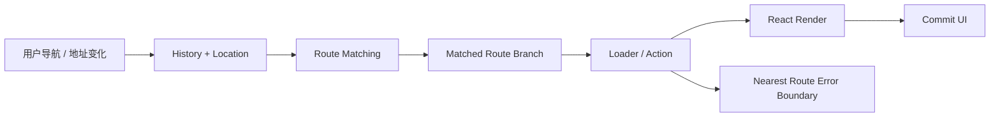
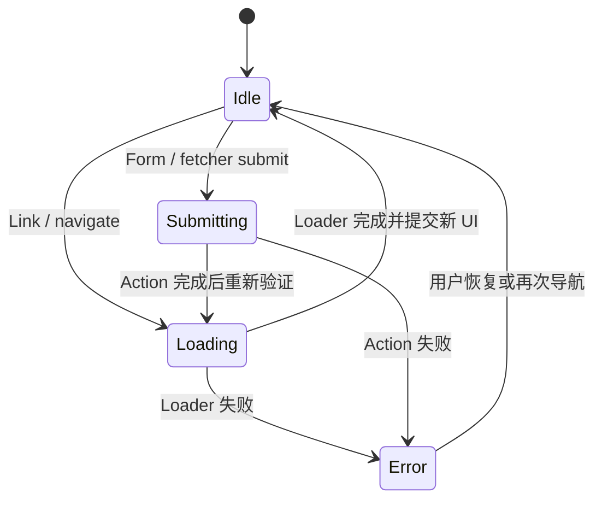
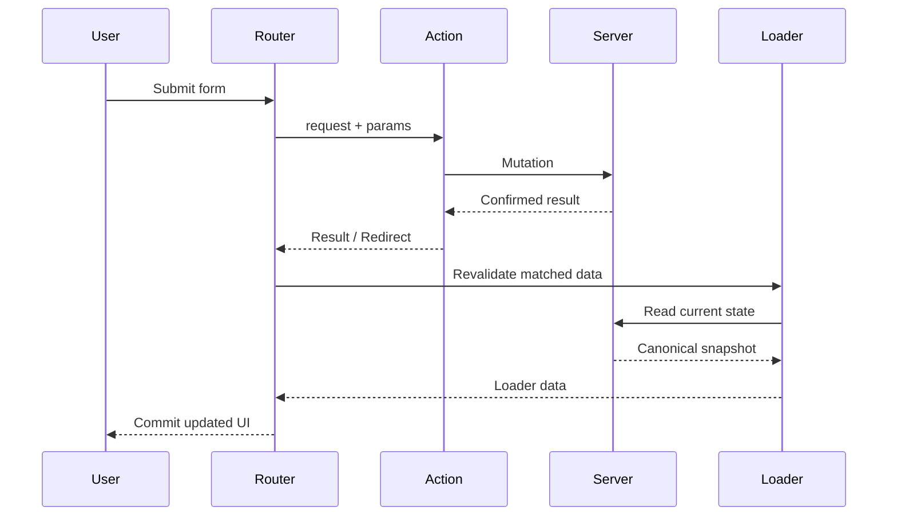

# React 客户端路由：从 History API 到 Loader、Action 与错误边界

> 客户端路由不是“点击链接后切换组件”，而是一套让 URL、浏览器历史、匹配结果、页面数据和错误边界保持一致的导航协议。设计正确时，刷新、前进后退、复制链接和直接访问都应指向同一个可恢复页面。

---

## 一、为什么客户端路由不只是条件渲染

一个订单后台可能包含以下地址：

```text
/orders?status=pending&page=2
/orders/ord_1024
/orders/ord_1024/edit
/settings/members
```

如果只根据组件内的 `currentPage` 切换界面，会立即失去浏览器已经提供的能力：

- 地址栏不能表达当前页面；
- 刷新后回到默认视图；
- 链接无法复制、收藏和分享；
- 浏览器前进、后退与应用状态脱节；
- 页面层级、数据加载和错误恢复没有统一边界；
- 埋点、访问控制和代码分割只能散落在组件中。

客户端路由的核心工作，是把一个 `Location` 映射为一组匹配的 Route Branch，再由这条分支共同决定布局、数据、提交行为和错误 UI。



图中的关键不是某个组件，而是整条匹配分支。父路由可提供外壳和父级数据，子路由提供具体页面；任一阶段失败时，错误由分支上最近的路由错误边界接管。

本文以浏览器 History API 和现代 React Router 的 Data Router 公开 API 为例。React Router 的包入口、类型名称和部分默认行为会随主版本演进，项目应以锁定版本的官方文档为准。本文讨论的是稳定的路由模型，不把某个版本的内部排序算法或缓存实现当成业务契约。

### 核心结论

1. URL 是可分享、可恢复的页面状态，不只是渲染后的附属文本。
2. `pushState`、`replaceState` 只修改当前文档的历史记录，不会自动匹配路由、请求数据或触发 React Render。
3. `popstate` 主要对应历史遍历；调用 `pushState` 或 `replaceState` 本身不会触发它。
4. 路由匹配得到的是一条父子分支，不只是一个叶子组件。
5. 静态路径、动态参数和通配符的含义不同；参数匹配成功不代表业务参数有效。
6. Nested Route 描述 URL 与 UI 层级，Layout Route 可只提供布局而不增加 URL Segment。
7. Path Params 标识资源，Search Params 表达筛选、排序、分页等可选视图状态，但两者都属于不可信外部输入。
8. Navigation State 至少要区分 History Entry State、当前 Location 和路由器的 Pending Navigation，不能都叫 `state`。
9. Loader 负责导航读取，Action 负责路由写入；写入成功后通常还需要重新验证受影响的读取。
10. 路由错误边界应靠近可恢复区域，并区分 404、权限错误、业务失败和未知异常。

---

## 二、底座：History API 与 Location

浏览器当前地址由 `window.location` 暴露，历史栈由 `window.history` 管理。单页应用通常使用：

- `history.pushState(state, '', url)`：增加一条历史记录；
- `history.replaceState(state, '', url)`：替换当前历史记录；
- `history.back()`、`forward()`、`go(delta)`：遍历历史记录；
- `popstate`：监听当前活动历史记录发生变化。

### 2.1 `push` 与 `replace` 是产品语义

假设用户从订单列表进入详情：

```text
/orders -> /orders/ord_1024
```

这通常应使用 Push，因为用户预期“后退”回到列表。登录后把 `/login` 替换为 `/dashboard` 则更适合 Replace，否则后退会再次进入已经失效的登录页。

```ts
history.pushState({ source: 'orders' }, '', '/orders/ord_1024');
history.replaceState(null, '', '/dashboard');
```

错误地把所有导航都设为 Replace，会破坏历史轨迹；把临时规范化跳转全部 Push，则可能让用户在两个地址之间反复后退。

### 2.2 `pushState` 不等于完成导航

以下代码只更新地址和历史栈：

```ts
history.pushState(null, '', '/orders/ord_1024');
```

浏览器不会因此自动：

- 派发 `popstate`；
- 解析 React Route；
- 执行 Loader；
- 更新页面标题；
- 滚动到顶部；
- 向服务器请求新 HTML。

路由库需要封装 History，主动发布 Location 变化，再执行匹配和渲染。不要一边让 React Router 管理 History，一边在业务代码直接调用 `window.history.pushState`，否则路由器可能无法及时感知状态变化。

### 2.3 History Entry State 不是持久存储

`pushState` 的第一个参数会成为当前 History Entry 的关联状态。它适合携带“从哪个列表进入”“关闭弹窗后回到哪里”一类导航上下文，但不适合作为关键业务事实：

- 用户复制 URL 到新标签页时，该状态通常不会随 URL 传递；
- 数据必须可被结构化克隆，且浏览器可能限制大小；
- 不能替代服务端、URL、Session Storage 或应用 Store；
- 不能存放 Token、密码等敏感数据。

如果页面刷新或直接访问时仍必须恢复某个值，应把它放入 URL、持久化存储或通过资源 ID 从服务端读取。

### 2.4 服务器仍必须认识客户端地址

客户端路由只能在 JavaScript 已经加载后工作。用户直接访问 `/orders/ord_1024` 时，请求首先到达 CDN 或服务器。纯 SPA 部署通常需要把未知的前端路由回退到 `index.html`，但不能把真正的静态资源和 API 404 也错误回退成 HTML。

这属于部署契约，不是 React Router 能在浏览器内补救的问题。SSR 或框架路由则由服务器先匹配同一地址并返回对应 HTML。

---

## 三、Route Matching：从 URL 找到匹配分支

路由配置可以看作一棵树：

```tsx
const router = createBrowserRouter([
  {
    path: '/',
    Component: AppLayout,
    children: [
      { index: true, Component: HomePage },
      {
        path: 'orders',
        Component: OrdersLayout,
        children: [
          { index: true, Component: OrdersPage },
          { path: ':orderId', Component: OrderDetailPage },
          { path: ':orderId/edit', Component: EditOrderPage },
        ],
      },
      { path: '*', Component: NotFoundPage },
    ],
  },
]);
```

访问 `/orders/ord_1024/edit` 时，匹配结果不是只有 `EditOrderPage`，而是类似：

```text
AppLayout -> OrdersLayout -> EditOrderPage
```

这条分支决定了哪些 Layout、Loader 和 Error Boundary 参与本次导航。

### 3.1 常见路径类型

| 类型 | 示例 | 语义 |
|---|---|---|
| 静态 Segment | `/orders/new` | 精确业务路径 |
| 动态 Segment | `/orders/:orderId` | 捕获一个路径参数 |
| 可选 Segment | `/:lang?/docs` | Segment 可出现或省略，支持度看版本 |
| Splat / 通配符 | `/files/*` | 捕获剩余路径，通常用于兜底或文件层级 |
| Index Route | 父路由的 `index: true` | 父路径完全匹配时的默认子页面 |

不要依赖“配置顺序一定决定优先级”的直觉。现代路由器通常会对候选分支做确定性排名，让静态 Segment 比动态 Segment 更具体；但不同库的精确评分规则属于实现细节。配置中仍应避免含义重叠、难以解释的路径。

### 3.2 匹配成功不代表参数有效

`/orders/:orderId` 会匹配 `/orders/anything`。Route Matcher 只知道结构符合，不知道 `anything` 是否是合法订单 ID，更不知道订单是否存在。

```ts
function parseOrderId(value: string | undefined): string {
  if (!value || !/^ord_[a-zA-Z0-9]+$/.test(value)) {
    throw new Response('Invalid order id', { status: 400 });
  }
  return value;
}
```

参数处理至少包含三层判断：

1. Segment 是否存在；
2. 格式和取值范围是否合法；
3. 对应资源是否存在且当前用户有权访问。

前两项可在解析层完成，第三项通常需要 Loader 请求服务端。客户端隐藏页面不能替代服务端授权。

### 3.3 404 有两种来源

- 没有 Route Branch 匹配：进入全局 `*` Route；
- Route 匹配成功，但资源不存在：Loader 返回或抛出 404 Response。

前者表示“应用没有这个页面”，后者表示“页面类型存在，但指定资源不存在”。两者可以显示相似 UI，但日志、返回按钮和监控维度不应完全相同。

---

## 四、Nested Route 与 Layout Route

### 4.1 Nested Route 同时表达 URL 和 UI 层级

父组件使用 `<Outlet />` 渲染匹配的子路由：

```tsx
function OrdersLayout() {
  return (
    <section>
      <OrdersNavigation />
      <main>
        <Outlet />
      </main>
    </section>
  );
}
```

当用户从订单列表进入详情时，顶层应用壳和订单导航可以保留，只替换 Outlet 中的子页面。路由树因此也成为布局树、数据边界树和错误恢复树。

### 4.2 Layout Route 不一定增加 URL Segment

有些布局只用于分组，不应出现在 URL 中。例如多个设置页面共享侧边栏：

```tsx
{
  Component: SettingsLayout,
  children: [
    { path: 'profile', Component: ProfileSettingsPage },
    { path: 'security', Component: SecuritySettingsPage },
  ],
}
```

这种没有 `path` 的父 Route 可提供 Layout、Error Boundary 或上下文，但不消费 URL Segment。不要为了复用 UI 强行制造 `/settings-layout/...` 这类暴露实现细节的地址。

### 4.3 路由嵌套不等于任意组件嵌套

只有具备以下需求时，才值得增加一层 Route：

- 需要独立 URL 层级；
- 需要共享 Layout 或 Loader；
- 需要独立错误恢复边界；
- 需要独立代码分割和导航 Pending UI。

普通视觉容器仍应是普通 React Component。路由树过深会增加 Loader 协调、相对链接理解和错误边界设计成本。

---

## 五、Route Params 与 Search Params

### 5.1 Path Params 通常标识资源或层级

```text
/organizations/:organizationId/orders/:orderId
```

`organizationId` 和 `orderId` 决定当前页面的主要资源身份。切换它们通常意味着进入另一个页面实体，应产生明确的导航与数据重新加载。

```tsx
function OrderPage() {
  const { orderId } = useParams();
  // useParams 返回的值仍可能是 undefined，也未经业务校验。
}
```

TypeScript 类型声明不能验证地址栏中的运行时字符串。应在 Loader 边界解析后，再把经过验证的 ID 交给领域层。

### 5.2 Search Params 适合可选视图状态

```text
/orders?status=pending&sort=createdAt&page=2
```

筛选、排序、分页、Tab 和搜索词通常适合放入 Query String，因为用户刷新、分享或后退时希望恢复同一视图。

```ts
type OrderListQuery = {
  status: 'all' | 'pending' | 'paid';
  page: number;
};

function parseOrderListQuery(url: URL): OrderListQuery {
  const rawStatus = url.searchParams.get('status');
  const rawPage = Number(url.searchParams.get('page') ?? '1');

  return {
    status:
      rawStatus === 'pending' || rawStatus === 'paid' ? rawStatus : 'all',
    page: Number.isInteger(rawPage) && rawPage > 0 ? rawPage : 1,
  };
}
```

解析策略必须显式选择：

- 缺失值使用默认值；
- 非法值回退、规范化跳转，或直接返回 400；
- 多值参数使用 `getAll`，不能假设只有一个；
- 写回 URL 时规定稳定顺序和空值删除策略。

### 5.3 不要原地修改共享的 `URLSearchParams`

某些 Router Hook 返回的 Search Params 对象可被读取，但直接 `set` 后如果没有调用 Router Setter，并不会形成正式导航；原地修改还会让引用和值的变化难以推理。

```tsx
const [searchParams, setSearchParams] = useSearchParams();

function changePage(page: number) {
  const next = new URLSearchParams(searchParams);
  next.set('page', String(page));
  setSearchParams(next);
}
```

高频输入如搜索框不应每个按键都无条件 Push 新历史记录。可以先保留本地 Draft，Debounce 后用 Replace 写入 URL；用户确认搜索时再根据产品语义决定是否 Push。

---

## 六、Navigation State：先区分三个概念

“导航状态”经常同时指三种不同事物：

| 状态 | 示例 | 生命周期 |
|---|---|---|
| Current Location | `pathname`、`search`、`hash` | 当前地址 |
| History Entry State | `location.state`、返回来源 | 当前历史条目，不能通过纯 URL 分享 |
| Pending Navigation | `idle`、`loading`、`submitting` | 一次导航或提交过程 |

### 6.1 声明式链接优先

用户可见的普通页面跳转应优先使用 `<Link>` 或 `<NavLink>`，而不是给 `<div>` 绑定点击事件：

```tsx
<Link to={`/orders/${order.id}`}>查看订单</Link>
```

链接保留了新标签页打开、复制地址、键盘访问和浏览器状态栏等原生能力。`navigate()` 更适合命令完成后的跳转、超时跳转或无法自然表示为链接的流程控制。

### 6.2 Pending UI 不能遮蔽旧页面语义

一次导航可能经历：



全局进度条可以反映整个导航；局部骨架屏应放在真正变化的 Outlet 区域。不要在每次后台重新验证时清空旧页面，否则会造成闪烁和上下文丢失。

### 6.3 导航可被替代和取消

用户快速从订单 A 切到 B 时，A 的 Loader 可能仍在进行。现代 Data Router 通常会通过 `request.signal` 传递取消信号。Fetcher 必须继续把信号交给底层请求：

```ts
async function orderLoader({ params, request }: LoaderFunctionArgs) {
  const orderId = parseOrderId(params.orderId);
  const response = await fetch(`/api/orders/${orderId}`, {
    signal: request.signal,
  });

  if (response.status === 404) {
    throw new Response('Order not found', { status: 404 });
  }
  if (!response.ok) {
    throw new Response('Failed to load order', { status: response.status });
  }

  return parseOrder(await response.json());
}
```

Abort 只能取消支持 AbortSignal 的工作，且服务端可能已经收到请求。写操作不能仅依赖客户端取消保证一致性，仍需幂等键、事务或版本检查。

---

## 七、Loader：让数据依赖属于 Route

组件内 `useEffect` 请求通常在组件首次 Commit 后才开始，父子组件各自请求还可能形成 Waterfall。Loader 把“进入该 Route 前需要什么数据”提升到路由匹配阶段。

```tsx
const router = createBrowserRouter([
  {
    path: '/orders/:orderId',
    loader: orderLoader,
    Component: OrderPage,
    ErrorBoundary: OrderRouteErrorBoundary,
  },
]);

function OrderPage() {
  const order = useLoaderData() as Order;
  return <OrderDetail order={order} />;
}
```

### 7.1 Loader 的职责边界

Loader 适合：

- 读取和校验 Route Params、Search Params；
- 请求页面进入时必需的数据；
- 把 HTTP 404、401、403 等转换为明确 Route Error；
- 执行重定向；
- 将 AbortSignal 传到请求层；
- 返回组件渲染所需的稳定数据结构。

Loader 不应：

- 操作 DOM 或依赖组件已挂载；
- 把所有服务端数据永久复制到本地 State；
- 静默吞掉错误并伪造空数据；
- 仅靠客户端检查执行最终授权；
- 无边界地重复实现 Query Cache 已经负责的缓存策略。

路由 Loader 与 TanStack Query 等缓存库可以协作：Loader 负责导航时机和路由错误语义，Query Client 负责资源缓存、共享与失效。但必须明确谁发请求、谁拥有 Freshness，避免 Loader 和组件对同一 Key 重复 Fetch。

### 7.2 父子 Loader 与并行性

匹配分支上的多个 Loader 通常可以并发启动，因此数据依赖应尽量按资源拆分，不要人为制造父请求完成后子请求才开始的 Waterfall。如果子数据确实依赖父 Loader 的结果，应重新考虑 API 是否能从 URL Params 独立请求，或使用框架当前版本提供的上下文和中间件能力。

“通常并发”不是所有路由库和所有模式的永久承诺。SSR、Lazy Route Discovery、Middleware 和自定义数据层可能改变时序，关键流程应按项目版本集成测试。

---

## 八、Action：让写操作进入路由数据流

Action 处理与 Route 关联的写操作，例如创建、编辑和删除。它通常接收 Request，读取 FormData，执行校验和 Mutation，再返回结果或 Redirect。

```tsx
async function updateOrderAction({ params, request }: ActionFunctionArgs) {
  const orderId = parseOrderId(params.orderId);
  const formData = await request.formData();
  const result = parseOrderUpdate(formData);

  if (!result.success) {
    return {
      ok: false as const,
      fieldErrors: result.fieldErrors,
    };
  }

  const response = await fetch(`/api/orders/${orderId}`, {
    method: 'PATCH',
    headers: { 'Content-Type': 'application/json' },
    body: JSON.stringify(result.command),
    signal: request.signal,
  });

  if (response.status === 409) {
    return { ok: false as const, formError: '订单已被其他人修改' };
  }
  if (!response.ok) {
    throw new Response('Failed to update order', {
      status: response.status,
    });
  }

  return redirect(`/orders/${orderId}`);
}
```

### 8.1 预期业务错误与异常错误分流

以下结果通常应作为可渲染 Action Data 返回：

- 字段校验失败；
- 乐观锁冲突；
- 优惠码不可用；
- 用户可修复的业务约束。

以下情况更适合进入 Route Error Boundary：

- 未处理异常；
- 服务不可用且当前区域无法继续；
- 响应结构损坏；
- 不应由当前表单自行恢复的权限或路由错误。

不要把所有失败都 Throw 到整页 Error，也不要把未知 500 伪装成普通字段错误。

### 8.2 Action 后为什么需要 Revalidation

写入成功后，当前页面的 Loader Data 可能已经过期。Data Router 通常会重新验证相关 Loader，使页面回到服务端确认状态：



重新验证保证“写后读”回到权威快照，但也有网络成本。可以通过路由器提供的 Revalidation Policy 缩小范围，不过优化前必须确认不会留下陈旧权限、计数或关联列表。

Action 不是服务端事务本身。在纯 SPA 中它仍运行于浏览器，真正的认证、授权、校验、幂等和事务必须由 API 服务端完成。

---

## 九、Route Error Boundary：按路由层级恢复

路由错误边界可处理 Loader、Action 和 Route Component 渲染阶段的错误，并由匹配分支上最近的边界接管。

```tsx
function OrderRouteErrorBoundary() {
  const error = useRouteError();

  if (isRouteErrorResponse(error)) {
    if (error.status === 404) {
      return <OrderNotFound />;
    }
    if (error.status === 403) {
      return <PermissionDenied />;
    }
  }

  reportUnexpectedRouteError(error);
  return <UnexpectedError retryHref={window.location.href} />;
}
```

### 9.1 边界应放在哪里

- App Root：处理无法局部恢复的未知错误；
- Orders Layout：保留全局导航，只替换订单工作区；
- Order Detail：单个订单失败时保留订单列表或侧栏；
- 独立 Widget：如果它不是 Route，仍可能需要普通 React Error Boundary。

路由错误边界和普通 React Error Boundary 有交集，但不完全相同。普通边界主要捕获后代渲染错误；Data Router 的 Route Boundary 还参与 Loader、Action 和 Response Error 协议。事件处理器和任意异步回调中的错误不会自动被普通 React Boundary 捕获，必须在对应流程显式处理。

### 9.2 不要在错误 UI 中泄露细节

生产环境不要直接渲染 Stack Trace、SQL 错误、内部 URL 或原始 Response Body。用户看到可操作信息，监控系统记录经过脱敏的 Route ID、Status、Trace ID 和异常上下文。

错误页还应提供符合场景的恢复方式：重试当前 Loader、返回列表、重新登录或联系支持，而不是所有错误都只显示“刷新页面”。

---

## 十、完整工程示例：订单详情路由

下面把匹配、Loader、Action 和 Error Boundary 放在同一条路由中：

```tsx
const router = createBrowserRouter([
  {
    path: '/',
    Component: AppLayout,
    ErrorBoundary: RootRouteErrorBoundary,
    children: [
      {
        path: 'orders',
        Component: OrdersLayout,
        children: [
          {
            index: true,
            loader: ordersLoader,
            Component: OrdersPage,
          },
          {
            path: ':orderId',
            id: 'order-detail',
            loader: orderLoader,
            action: updateOrderAction,
            Component: OrderPage,
            ErrorBoundary: OrderRouteErrorBoundary,
          },
        ],
      },
      { path: '*', Component: NotFoundPage },
    ],
  },
]);

createRoot(document.getElementById('root')!).render(
  <RouterProvider router={router} />,
);
```

一次访问 `/orders/ord_1024?panel=history` 的执行路径为：

1. Router 从 History 读取 Location；
2. Matcher 得到 `AppLayout -> OrdersLayout -> OrderPage`；
3. Loader 校验 `orderId`，读取 Search Params，并携带 AbortSignal 请求数据；
4. Loader 成功后，React 渲染匹配分支并把详情放入 Outlet；
5. 表单提交时，Action 解析输入并请求服务端；
6. Action 成功后 Redirect 或触发 Loader Revalidation；
7. Loader、Action 或 Render 失败时，由 `OrderRouteErrorBoundary` 优先接管；
8. 用户后退时，History 激活旧 Entry，Router 重新匹配并恢复对应页面。

路由配置是应用级基础设施，最好集中表达路径和数据边界；页面内部的纯 UI 逻辑仍留在 Feature Module，避免把所有业务都堆进一个 Routes 文件。

---

## 十一、常见误区与错误案例

### 11.1 用普通按钮模拟所有链接

错误做法：

```tsx
<button onClick={() => navigate(`/orders/${order.id}`)}>
  查看订单
</button>
```

如果动作本质是访问资源，应改为 `<Link>`。Button 留给“提交、删除、切换”等命令行为。

### 11.2 把 `location.state` 当作页面唯一数据源

```tsx
navigate('/checkout/success', { state: { order } });
```

直接刷新成功页或从外部打开 URL 时，`order` 可能不存在。应让 URL 携带 `orderId`，页面通过 Loader 获取可授权的订单结果；History State 只能作为非关键优化或返回上下文。

### 11.3 在组件 Effect 中重复 Route Loader 请求

Loader 已读取订单，组件又按相同 ID `useEffect(fetchOrder)`，会产生重复请求、两个 Loading State 和竞争写入。应统一资源所有者，或让 Loader 调用 Query Client 的 `ensureQueryData`，组件订阅同一个 Cache Key。

### 11.4 捕获所有错误并返回空数组

```ts
try {
  return await fetchOrders();
} catch {
  return [];
}
```

这会把“服务器故障”伪装成“没有订单”。正确做法是区分可接受的空结果与请求失败，让错误边界或局部 Error State 显示真实状态。

### 11.5 用前端 Route Guard 代替授权

客户端可以基于已有权限隐藏入口或重定向，但用户仍能构造 URL 和 API 请求。真正的资源授权必须发生在服务端，Loader 只负责把 401/403 映射为合适 UI。

### 11.6 给每次筛选变化都 Push History

滑块、输入框或分页器的每个细微变化都 Push，会让后退键需要执行很多次。应根据交互意图选择 Replace、Debounce 或提交时 Push。详细治理属于下一篇“路由工程”的范围。

---

## 十二、工程选型与边界

### 12.1 什么时候原生 History 足够

只有极小型页面、嵌入式 Widget，且不存在嵌套布局、参数解析、数据加载和错误边界时，才可能手写一个很薄的 History Adapter。完整业务应用通常不应自行实现 Matcher、相对链接、并发导航和无障碍语义。

### 12.2 Declarative Router 与 Data Router

- 只需组件级页面映射时，声明式 Route 模式更简单；
- 需要 Loader、Action、Pending Navigation、Redirect 和 Route Error Boundary 时，Data Router 更适合；
- 已使用 Next.js、Remix 或其他 React Framework 时，应优先采用框架路由，因为服务器渲染、构建和数据协议已经与它绑定。

不要在同一个 URL Scope 内叠加两个路由器。微前端确实可能需要路由分区，但必须明确 History 的唯一写入者、Basename、事件同步和销毁协议。

### 12.3 Browser URL 与 Hash URL

Browser History 路由地址自然，例如 `/orders/1`，但部署端需要正确回退。Hash Router 使用 `/#/orders/1`，Hash 不会作为 HTTP Request Target 的路径发送给服务器，适合无法配置服务器回退的静态环境，但 URL、美观性、服务端处理和部分平台集成会受限。

选型是部署约束，不是个人风格偏好。

---

## 十三、测试与验证方法

### 13.1 路由集成测试优先

使用 Memory Router 或 `createMemoryRouter` 构造真实 Entry，验证整条 Route Branch：

```tsx
it('renders a route-level 404 for a missing order', async () => {
  const router = createMemoryRouter(routes, {
    initialEntries: ['/orders/ord_missing'],
  });

  render(<RouterProvider router={router} />);

  expect(
    await screen.findByRole('heading', { name: '订单不存在' }),
  ).toBeInTheDocument();
});
```

测试应覆盖：

- 静态、动态、Index、Splat Route 是否命中预期分支；
- Path Params 和 Search Params 的缺失、非法、多值与编码输入；
- Push、Replace、Back、Forward 后的页面与 URL；
- Loader Success、404、403、500 和 Response Schema Error；
- 快速连续导航时旧请求是否收到 Abort；
- Action 字段错误、成功 Redirect 和 Revalidation；
- 最近 Error Boundary 是否接管，同时保留上层 Layout；
- 直接访问深层 URL 时部署环境是否返回应用 HTML 或 SSR 页面。

### 13.2 不要只 Mock Router Hook

把 `useParams`、`useNavigate` 全部 Mock 掉，只能证明组件对几个伪造返回值作出反应，无法验证 Route Config、相对路径、History 和 Loader 协作。纯展示组件可单测，路由行为应通过真实 Memory Router 集成测试。

### 13.3 观察导航性能

路由性能应测完整用户路径，而不是只测 Matcher 函数：

- Navigation Start 到可交互内容出现的时间；
- Loader 网络瀑布和重复请求；
- Route Chunk 下载、解析与执行时间；
- 导航期间的 Long Task 和 INP；
- 返回访问是否复用合理缓存；
- Abort 后请求和解析工作是否真正停止。

在目标网络、CPU Throttling 和接近真实数据量下测量，并比较 P50/P95，而不是依据开发机一次点击下结论。

---

## 十四、总结

客户端路由的最小模型是：History 产生 Location，Matcher 找到 Route Branch，分支协调 Layout、Loader、Action、Navigation State 和 Error Boundary，React 最终提交对应 UI。

真正需要记住的是：

- URL 必须足以恢复页面的关键身份和可分享状态；
- Push 与 Replace 决定用户能否获得合理的前进后退体验；
- Params 是外部输入，匹配、格式、存在性和授权是不同检查；
- Nested Route 是 UI、数据和错误边界的共同层级；
- Loader 让数据请求提前进入导航阶段，Action 让写操作进入同一数据流；
- 取消只能减少无用客户端工作，不能替代服务端一致性；
- 路由错误边界应尽可能局部恢复，同时保留必要上下文；
- 部署回退、服务端授权、资源缓存和表单状态仍有各自的工程边界。

一个可靠的路由系统，不是让组件“看起来切换成功”，而是让直接访问、分享、刷新、提交、失败和前进后退都得到一致结果。

---

## 问答复盘

### Q1：调用 `history.pushState` 后，为什么 React 页面不会自动更新？

**答：** `pushState` 只增加 History Entry 并修改地址，不会触发 `popstate`，也不知道 React Route。路由器必须封装这次写入、发布新的 Location，再完成匹配、加载和渲染。

### Q2：Nested Route 与 Layout Route 有什么区别？

**答：** Nested Route 是父子匹配关系，可同时形成 URL 和 UI 层级；Layout Route 通常是没有 `path` 的父 Route，只提供布局、数据或错误边界，不增加 URL Segment。

### Q3：`/orders/:orderId` 已经匹配成功，是否可以直接请求订单？

**答：** 不能直接信任。匹配只证明路径结构符合；仍需检查参数是否存在、格式是否合法、资源是否存在，以及服务端是否授权当前用户读取。

### Q4：筛选条件应该放 Path Params 还是 Search Params？

**答：** 决定主要资源身份和层级的值通常放 Path Params；可选的筛选、排序、分页和视图模式通常放 Search Params。最终标准是该值是否应参与页面身份、分享和恢复。

### Q5：`location.state` 能否用来传递结算成功后的完整订单？

**答：** 可以作为临时导航上下文，但不能作为唯一数据源。刷新、复制链接或新标签页打开时它不可靠；URL 应保存订单 ID，再由 Loader 读取经过授权的服务端结果。

### Q6：Loader 与组件里的 Query Hook 是否一定冲突？

**答：** 不一定。Loader 可负责导航时机，Query Cache 负责资源缓存；关键是共享同一资源 Key 和请求所有者，例如 Loader 调用 `ensureQueryData`。如果双方独立 Fetch，就会产生重复请求和两套状态。

### Q7：Action 被 Abort 后，是否可以确认服务端没有执行写入？

**答：** 不可以。AbortSignal 只能请求取消客户端和支持取消的传输工作，服务端可能已经接收并提交命令。关键写操作仍需幂等键、事务、版本检查和结果查询能力。

### Q8：字段校验错误应该进入 Route Error Boundary 吗？

**答：** 通常不应该。用户可修复的字段错误应作为 Action Data 返回给表单；未知异常、页面无法继续的服务故障或路由级 404/403 更适合交给最近的 Route Error Boundary。

### Q9：为什么不能把所有导航都设为 `replace`？

**答：** Replace 会覆盖当前 History Entry。若用于普通页面跳转，用户将无法后退到之前页面；它更适合规范化 URL、登录后替换失效页面等不应保留旧 Entry 的场景。

### Q10：如何验证客户端路由在生产环境真的可用？

**答：** 除了 Memory Router 集成测试，还必须在实际部署环境直接访问深层 URL，验证服务器回退或 SSR、静态资源 404、刷新、前进后退、Loader 取消和错误边界。只从首页点击进入不能覆盖部署契约。

---

## 延伸知识

- 路由工程：Authentication Guard、Permission、Deep Link 与 Redirect Loop；
- 离页治理：Unsaved Changes、Blocker 与浏览器关闭提示；
- 导航体验：Scroll Restoration、Route-level Code Splitting 与 Prefetch；
- 并发导航：Navigation Race、AbortSignal 与写操作幂等；
- URL State：Search Params Schema、Canonical URL 与缓存 Key；
- 服务端渲染：Hydration、Streaming、Server Router 与 HTTP Status。
