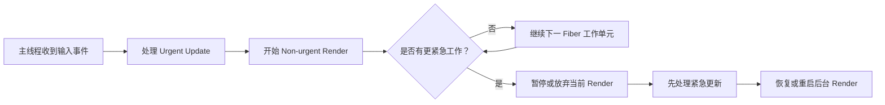
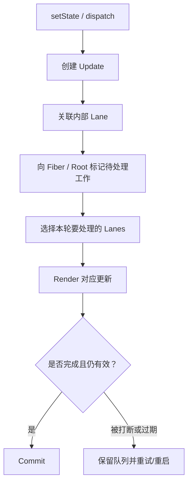
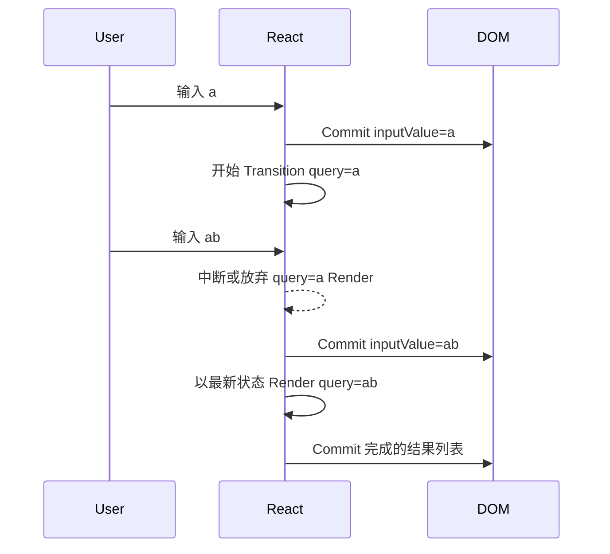

# React 并发渲染：可中断 Render、优先级与原子 Commit

> 并发 React 的核心不是同时在多个线程修改 DOM，而是让 Render 工作具备优先级、可暂停、可恢复或可丢弃，同时只把一棵完成且一致的树原子提交给用户。

---

## 一、本文解决什么问题

一个包含大列表、图表和筛选条件的页面，用户每输入一个字符都可能触发大量组件 Render。传统同步工作一旦开始，浏览器在这段时间内难以处理下一次键盘输入；输入框看起来就会“粘住”。

并发渲染试图解决的不是“让所有计算瞬间完成”，而是让 React 能区分哪些更新必须尽快反馈，哪些工作可以在后台准备，并在更重要的输入到来时让路。

本文回答以下问题：

- Interruptible Render 到底可以中断什么；
- 并发 React 是否等于多线程渲染；
- Priority 如何表达用户感知上的紧急程度；
- Lane 在更新队列和 Fiber 工作中承担什么职责；
- Transition 为什么能标记 Non-urgent Update；
- 输入框更新和列表更新为什么应有不同优先级；
- Render Restart 为什么要求组件保持纯净；
- React 如何避免把半成品 UI 展示给用户；
- 外部 Store 为什么需要 `useSyncExternalStore`；
- Commit 为什么仍然是同步且不可随意中断的；
- 如何测试与测量并发交互的真实收益。

本文以 React 18 及之后的现代 Root 和并发能力为背景。可中断 Render、Transition 和一致 Commit 属于公开模型；Lane 位掩码、具体优先级常量、Scheduler 回调和 Fiber 字段属于版本相关内部实现。文章只解释稳定职责，不把某一版本源码中的 Lane 名称、数量或映射关系当成公共 API。若进行源码分析，应以项目锁定的 React 版本和对应提交为准。

### 核心结论

1. 并发渲染通常仍在浏览器主线程协作执行，不等于组件在多个线程并行运行。
2. React 可以把 Render 拆成 Fiber 工作单元，在单元之间暂停或让出主线程；单个组件函数中的长同步循环仍会阻塞。
3. Priority 表达更新对用户的紧急程度，不是硬实时调度保证。
4. Lane 是 React 内部表示更新优先级、批次和待处理工作的机制，不应由业务代码读取或修改。
5. Transition 将一组状态更新标记为 Non-urgent，使紧急输入可以打断其 Render。
6. 受控输入的值更新必须保持 Urgent；昂贵结果列表可以作为 Transition 工作准备。
7. Render 可能重启或被丢弃，因此组件、Updater、Reducer 和 Memo 计算必须纯净。
8. React 不会把被中断 Render 的部分 DOM 暴露给用户；只有完成的树进入 Commit。
9. Tear-free UI 依赖一致 Snapshot，外部可变 Store 应通过 `useSyncExternalStore` 接入。
10. Commit 仍是同步关键区，大型 DOM Mutation 和 Layout Effect 不能靠并发 Render 自动消除。

---

## 二、并发不是多线程 DOM 渲染

浏览器中，React 的 JavaScript、事件处理和大部分 DOM 操作通常运行在主线程。并发渲染的“并发”表示多个不同优先级的更新可以在时间上交错推进，而不是两个线程同时调用组件并修改 DOM。



这种模型依赖协作式调度：React 在合适的工作单元边界检查是否应让出。它不会抢占正在执行的任意 JavaScript 指令。

### 2.1 一个组件函数仍可能独占主线程

```tsx
function ExpensiveReport({ records }: { records: RecordItem[] }) {
  // 如果这里单次同步计算耗时很长，React 不能在这个函数内部任意暂停。
  const report = calculateHugeReport(records);
  return <ReportView report={report} />;
}
```

并发渲染能在 Fiber 之间调度，但不能自动切开 `calculateHugeReport()` 内部循环。此类问题仍需：

- 优化算法和数据结构；
- 缩小每次处理的数据量；
- 分页或虚拟化；
- 预计算或增量计算；
- 将纯 CPU 重任务移到 Web Worker；
- 在生产环境测量后选择缓存。

同样，长事件处理函数在调用 `setState` 之前已经阻塞主线程，Transition 也无法回收那段时间。

---

## 三、Interruptible Render：可中断的是准备过程

React 更新大体分为 Render 与 Commit：

- **Render**：计算组件输出，构建或复用 Fiber 工作结果；
- **Commit**：把完成结果应用到 DOM，设置 Ref，执行 Layout Effect 等。

并发能力主要作用于 Render。一个低优先级 Render 可以：

- 暂停，稍后继续；
- 因更高优先级更新到来而让路；
- 在依赖输入变化后从新的 Snapshot 重启；
- 因结果过期而被丢弃；
- 完成后等待合适时机 Commit。

被中断不表示已计算内容会逐块显示。React 可以在内存中保留 Current Tree 和正在准备的 Work-in-progress Tree，只有完成的候选树才有资格提交。

```text
Current Tree          Work-in-progress Tree
用户正在看到          React 正在后台准备
     |                         |
     +------ Commit 完成树 <---+
```

这里的“双树”是帮助理解的 Fiber 架构模型，不应据此依赖内部字段或假设任意时刻总有固定两份完整对象。

---

## 四、Priority：先保证输入响应，再完成昂贵结果

更新的优先级来自用户体验语义。常见分类可以概念化为：

- **Urgent**：键盘输入、点击反馈、拖动等需要立即响应的更新；
- **Non-urgent**：大列表筛选、路由内容切换、复杂图表等可在后台准备的更新；
- **外部异步完成**：网络、Timer 或订阅回调产生的更新，其处理仍取决于调用上下文和所用 API。

Priority 不是业务可比较的数字，也不承诺某更新在固定毫秒内完成。浏览器主线程若被长任务占用，再高的 React 优先级也无法执行。

### 4.1 优先级不是数据重要性

订单详情可能在业务上非常重要，但用户当前正在输入搜索词时，输入回显仍应优先。Priority 描述“此刻用户需要多快看到反馈”，不是数据的商业价值或权限等级。

### 4.2 防止低优先级工作永久饿死

React 调度需要在响应紧急更新和最终完成低优先级工作之间取得平衡。具体过期、提升和选择策略属于版本实现。应用不应根据内部时间阈值编写逻辑；业务超时必须由自己的状态机、Timer 和错误策略管理。

---

## 五、Lanes：更新优先级与批次的内部表示

Lane 是 React Fiber 实现中用于标记一组待处理更新的内部机制。常见实现使用位集合表示多个 Lane，使 React 能高效完成：

- 给 Update 标记所属工作类别；
- 在 Fiber 和 Root 上汇总待处理工作；
- 选择下一批要处理的更新；
- 把兼容更新一起 Render；
- 暂时跳过较低优先级更新；
- 在后续 Render 中重新应用被跳过的更新；
- 维护 Transition 等更新之间的协调关系。



### 5.1 Lane 不等于浏览器线程

Lane 只是 React 的内部调度标签，不会为每个 Lane 创建线程，也不会让 DOM 并行更新。

### 5.2 Lane 不等于公开业务优先级 API

业务代码应使用 `startTransition`、`useTransition`、`useDeferredValue` 等公开 API 表达 UI 语义。直接读取或引用源码中的 Lane 常量会绑定特定版本，并且可能误解 Scheduler Priority、Event Priority 与 Lane 选择之间的关系。

### 5.3 跳过不等于丢失

当某次 Render 只处理高优先级 Update 时，低优先级 Update 可以留在队列中，之后以合适的基础状态重新计算。这个能力解释了并发状态队列为什么比“按时间覆盖变量”更复杂，也再次要求 Updater 和 Reducer 保持纯净。

---

## 六、Transition：标记 Non-urgent Update

下面的搜索页面有两份状态：

- `inputValue` 驱动受控输入框，必须立即更新；
- `query` 驱动昂贵列表，可以作为 Transition 更新。

```tsx
function ProductSearch({ products }: { products: Product[] }) {
  const [inputValue, setInputValue] = useState('');
  const [query, setQuery] = useState('');
  const [isPending, startTransition] = useTransition();

  function handleChange(event: ChangeEvent<HTMLInputElement>) {
    const nextValue = event.target.value;

    setInputValue(nextValue); // Urgent：输入框立即回显

    startTransition(() => {
      setQuery(nextValue); // Non-urgent：结果列表可被打断
    });
  }

  const visibleProducts = filterProducts(products, query);

  return (
    <section>
      <input value={inputValue} onChange={handleChange} />
      <span aria-live="polite">{isPending ? '正在更新结果' : ''}</span>
      <ProductList products={visibleProducts} />
    </section>
  );
}
```

当用户连续输入时，可能发生：



用户始终能看到输入框跟手，而列表允许短暂保留上一次完成结果，直到最新后台工作完成。

### 6.1 受控输入更新不能放进 Transition

```tsx
startTransition(() => {
  setInputValue(nextValue); // 错误方向：受控输入可能无法及时跟随键盘
});
```

Transition 适合结果区域，不适合控制正在输入的文本值。下一篇将进一步讨论 Pending State、异步边界和数据请求协作。

### 6.2 Transition 不会让计算更快

列表筛选总 CPU 时间可能不变，甚至因重启增加工作量。收益是把紧急反馈插入其中，降低用户感知延迟。若最终计算本身不可接受，仍需算法优化、Worker 或虚拟化。

---

## 七、Urgent / Non-urgent Update 的状态设计

把同一个可见概念拆成两份 State 不是默认做法。上例中 `inputValue` 与 `query` 分离，是因为它们有不同的 UI 时序语义：一个代表“用户刚输入什么”，一个代表“结果区域正在展示哪个查询”。

设计时应回答：

- 哪个值必须与当前输入同步；
- 哪个区域允许显示旧内容；
- 旧内容是否需要 Pending 标识；
- 最新后台工作失败时保留旧结果还是显示错误；
- URL、缓存和请求参数由哪个状态驱动；
- 是否会产生重复请求或过期响应；
- 可访问性用户能否理解当前正在更新。

如果两个 State 没有不同的时间语义，只是为了使用 Transition 而复制数据，会增加一致性成本。很多场景使用 `useDeferredValue` 延迟消费同一个值更合适，下一篇系列会单独讨论。

---

## 八、Render Restart：执行过不等于提交过

并发 Render 可能执行组件函数多次，只提交其中一次结果：

```tsx
function ProductList({ products }: { products: Product[] }) {
  analytics.track('product_list_rendered'); // 错误：Render 副作用可能重复
  return products.map(product => (
    <ProductRow key={product.id} product={product} />
  ));
}
```

如果后台 Render 被打断并重启，Analytics 会重复记录，即使用户从未看到被放弃的结果。

### 8.1 Render 必须保持纯净

Render 阶段不能：

- 发请求或创建连接；
- 写 `localStorage`；
- 修改 Props、State 对象或模块级集合；
- 注册 Listener 或 Observer；
- 操作 DOM；
- 生成必须唯一且只执行一次的业务命令；
- 依赖组件函数调用次数计费。

可以做的是：

- 根据 Props/State 计算 JSX；
- 执行纯派生计算；
- 创建只属于当前输出的普通对象和函数；
- 抛出由框架支持处理的 Promise/Error；
- 调用遵守 Rules of Hooks 的 Hook。

### 8.2 Updater 与 Reducer 也必须纯净

被跳过的低优先级 Update 可能在之后基于新基础状态重算：

```tsx
setItems(current => [...current, newItem]);
```

Updater 若修改 `current` 或执行副作用，重放时会重复污染。Reducer 同样只能根据 `state` 和 `action` 返回新状态。

### 8.3 Effect 只属于已 Commit 的结果

被放弃 Render 不会执行对应的 Effect Setup。外部资源应在 Effect 中创建与清理，而不是在 Render 中“先创建、等卸载再清理”，因为被放弃 Render 根本没有卸载生命周期。

---

## 九、Tear-free UI：用户看到一致 Snapshot

Tearing 指同一可见界面中的不同部分读取到外部数据的不同时间版本。例如并发 Render 期间，外部 Store 在两个组件读取之间发生变化：

```tsx
function Price() {
  return <span>{priceStore.currentPrice}</span>; // 无订阅、无 Snapshot 协议
}

function Total() {
  return <span>{priceStore.currentPrice * quantity}</span>;
}
```

如果两个读取发生在不同时间，Price 和 Total 可能不属于同一版本。React 无法仅凭普通可变对象知道何时变化、如何验证 Snapshot。

### 9.1 使用 `useSyncExternalStore`

```tsx
function usePrice() {
  return useSyncExternalStore(
    priceStore.subscribe,
    priceStore.getSnapshot,
    priceStore.getServerSnapshot,
  );
}

function Price() {
  const price = usePrice();
  return <span>{price}</span>;
}
```

Store 契约必须保证：

- `subscribe` 在变化时通知 React，并返回 Unsubscribe；
- Store 未变化时，`getSnapshot` 返回 `Object.is` 相等的缓存 Snapshot；
- Store 变化时返回新的不可变 Snapshot；
- SSR/Hydration 时 `getServerSnapshot` 与服务端输出一致；
- 订阅和读取函数具有稳定、明确的生命周期。

React 可以在提交前再次检查外部 Snapshot 是否仍一致；如果变化，可能重新处理更新以避免展示撕裂结果。精确回退和调度策略属于版本实现，应用只应依赖 `useSyncExternalStore` 的公开一致性契约。

### 9.2 React State 的 Snapshot

组件每次 Render 读取该次渲染的 State Snapshot。事件处理函数、Updater 队列和 Fiber 工作让 React 能协调内部状态。不要把 React State 镜像到模块级变量或 Ref，再在 Render 中混合读取，否则会绕开一致性模型。

### 9.3 多 Root 与外部 DOM 的边界

Commit 原子性通常针对一次 Root Commit。多个独立 React Root、微前端、外部脚本或第三方 Widget 不会自动形成全局原子事务。跨 Root 一致性需要上层 Store、消息协议或事务边界设计，不能只依靠 Concurrent Rendering。

---

## 十、Commit 原子性：完成后一次提交

Render 可以暂停，但 Commit 是把选定完成树变为用户可见事实的同步关键阶段。简化职责包括：

- 应用 DOM Mutation；
- 更新 Ref；
- 运行 Layout Effect Cleanup/Setup；
- 让浏览器随后有机会 Style、Layout 与 Paint；
- 被动 Effect 在其调度时机处理。

React 不会先提交列表上半部分，暂停后再提交下半部分作为同一次树更新的半成品。被打断的 Work-in-progress Tree 不会局部替换 Current Tree。

### 10.1 Commit 仍可能造成卡顿

以下成本不能被可中断 Render 自动解决：

- 一次插入或删除大量 DOM 节点；
- Layout Effect 中执行重计算；
- DOM 读写交错触发 Forced Layout；
- Ref Callback 创建大量同步资源；
- 第三方库在 Commit 后同步初始化；
- 浏览器 Style、Layout、Paint 和 Composite 过重。

Commit 工作应通过分页、虚拟化、CSS 优化、Effect 拆分和更小更新边界控制。并发能力不是无限帧预算。

### 10.2 原子不等于单个浏览器事务

React 保证不会提交被放弃的半成品树，但浏览器 Paint、网络、外部 Store 和多个 Root 各有生命周期。不要把“原子 Commit”理解为跨网络、存储和所有 UI 系统的 ACID 事务。

---

## 十一、并发渲染的启用与边界

React 18 的现代 Root API 为并发能力提供基础，但应用通常通过 Transition、Deferred Value、Suspense 等公开能力在具体 UI 边界表达并发语义。不能仅凭使用 `createRoot` 就断言每次更新都会被打断，也不能通过日志顺序推导稳定调度规则。

### 11.1 版本与框架

路由框架、数据框架和 Server Components 可能在内部使用 Transition、Suspense、Streaming 或 Hydration 能力。项目应确认：

- React 和 React DOM 版本；
- Root 创建方式；
- 框架路由切换是否已使用 Transition；
- 数据加载是否与 Suspense 协作；
- SSR/Hydration 边界；
- 第三方状态库是否支持并发 Snapshot；
- 测试工具是否支持相应 React 版本。

### 11.2 React Native

React Native 的宿主环境和绘制链路不同于浏览器，但 Render 可中断、优先级和完成后 Commit 的模型仍有参考价值。具体 Fabric、原生线程和版本支持应查阅当前 React Native 文档，不能直接套用 DOM 时序。

---

## 十二、并发渲染不能解决什么

### 12.1 不会加速网络

Transition 可以控制结果展示优先级，但不缩短请求耗时。请求仍需缓存、去重、取消、超时、重试和竞态处理。

### 12.2 不会自动取消服务端副作用

被放弃 Render 不应发起副作用；已由事件发出的写请求也不会因 Render 中断自动撤销。服务端写操作仍需要幂等键、状态查询或补偿。

### 12.3 不会自动修复大 DOM

十万行 DOM 的 Layout 和 Paint 成本仍然存在。应使用虚拟化、分页和更小可见窗口。

### 12.4 不会切开任意同步函数

单个组件函数或第三方同步 API 的长任务仍会阻塞。需要算法优化或 Worker。

### 12.5 不会替代状态设计

非法状态组合、重复事实源和过宽 Context 不会因为并发而消失，反而会在更多时序下暴露。应先建立明确所有权和状态机。

---

## 十三、常见误区

### 13.1 “并发 React 会在多个线程同时 Render 组件”

错误。常见 Web 环境仍由主线程协作调度，重点是可中断和优先级，不是组件多线程执行。

### 13.2 “使用 `createRoot` 后所有 Render 都会被中断”

错误。是否让出、重启取决于更新语义、工作量和调度环境；应用不能依赖必然中断。

### 13.3 “Transition 会让昂贵计算耗时变短”

错误。它改善紧急交互响应，计算总量可能不变，重启时甚至增加。最终吞吐仍需单独优化。

### 13.4 “低优先级更新可能被 React 随机丢失”

错误。过期 Render 结果可以被丢弃，但 Update 由队列和 Lane 管理，仍会基于合适状态处理；业务代码必须保持纯净与可重算。

### 13.5 “Render 执行过就可以记录曝光”

错误。Render 可能不 Commit。曝光应根据可见性、Commit 后逻辑和产品定义实现，并避免 Strict Mode 重复与 Observer 泄漏。

### 13.6 “Commit 原子表示页面绝不会卡顿”

错误。同步 Commit、Layout Effect 和浏览器布局绘制仍可形成长任务。

### 13.7 “直接读取外部可变对象也能保持一致”

错误。React 无法订阅和验证普通对象 Snapshot，应使用 `useSyncExternalStore` 或支持并发一致性的状态库。

---

## 十四、测试与验证

### 14.1 测试最终行为，而不是调度细节

并发调度时机受环境与版本影响。测试应验证：

- 输入框始终立即反映最新输入；
- 结果列表最终只展示最新查询；
- Pending UI 不遮挡输入；
- 过期请求不能覆盖新结果；
- 被放弃 Render 不产生订阅、请求或 Analytics；
- 外部 Store 更新后多个消费者属于同一 Snapshot；
- Error、取消和重试路径可达。

不要断言组件函数固定调用次数、特定 Lane 常量或每次输入必然发生中断。

### 14.2 用可控工作负载复现

为性能测试准备固定规模的数据和一致输入脚本，例如连续输入 `react`。不要在业务代码中永久保留人为 Busy Loop。基准工具可生成可重复 CPU 负载，并分别测试：

- 同步列表更新；
- Urgent 输入 + Transition 列表；
- 状态下沉后的组件边界；
- 虚拟化列表。

### 14.3 生产环境测量

使用生产构建或 React 提供的 Profiling 构建，在目标浏览器和代表性设备上记录：

- Interaction to Next Paint（INP）或等价交互延迟；
- 输入事件到输入框 Paint 的时间；
- Long Task 数量和最长任务；
- React Commit Duration；
- Transition Pending 持续时间；
- 最终结果完成时间；
- CPU 与内存开销；
- DOM、Layout 与 Paint 成本。

并发优化可能降低输入延迟，却延长最终列表完成时间。两项指标都要报告，不能只选择有利数据。

### 14.4 CPU Throttling 与高刷新率

在低端设备或 DevTools CPU Throttling 下更容易观察中断收益，但最终结论仍应在真实目标设备复核。60 Hz、90 Hz、120 Hz 屏幕帧间隔不同，并发 Render 可用的主线程窗口也不同，不应固定假设每帧都有完整 16.67 ms。

---

## 十五、工程检查清单

- 当前性能问题是 Render、Commit、Layout、Paint 还是网络；
- 是否存在必须立即反馈的 Urgent State；
- 哪些结果允许作为 Non-urgent 后台准备；
- 是否为 Transition 无意义复制了两份 State；
- 受控输入值是否保持 Urgent；
- 单个组件函数是否含无法让出的长同步计算；
- Render、Updater、Reducer 和 Memo 是否纯净；
- 被放弃 Render 是否不会创建外部资源；
- Effect 是否只属于已 Commit 的树并正确 Cleanup；
- 外部 Store 是否使用一致 Snapshot 订阅协议；
- 多 Root 或第三方 Widget 是否有额外一致性边界；
- 大型 Commit 和 Layout Effect 是否单独优化；
- 测试是否避免绑定 Lane 和固定 Render 次数；
- 是否在生产构建、目标设备上同时测量输入延迟与最终完成时间。

---

## 十六、总结

1. 并发渲染是主线程上的协作式调度模型，不等于多线程 DOM 渲染。
2. React 可以在 Fiber 工作单元之间暂停 Render，但不能任意抢占单个长同步函数。
3. Priority 表达 UI 更新的紧急程度，不提供硬实时保证。
4. Lane 是 React 内部的更新分类与选择机制，业务应使用公开并发 API。
5. Transition 允许 Non-urgent Render 被紧急输入打断，但不会让计算本身更快。
6. 受控输入保持 Urgent，昂贵结果区域可以后台准备并显示 Pending 状态。
7. Render 可能重启或丢弃，所有 Render 阶段逻辑必须纯净、可重算。
8. 被打断的半成品树不会局部 Commit，用户只看到完成的一致结果。
9. 外部 Store 必须提供稳定 Snapshot 与订阅，避免并发 Tearing。
10. Commit 仍是同步关键区，大 DOM、Layout Effect 和浏览器绘制需要独立优化。

并发 React 真正改变的是“React 可以何时放弃一份尚未展示的工作”。理解这一点后，纯 Render、状态快照、Transition 优先级和原子 Commit 就不再是分散概念，而是一套完整的一致性协议。

---

## 问答复盘

### Q1：并发渲染是否表示 React 在多个线程同时执行组件？

**答：** 通常不是。Web 中主要仍是主线程协作调度，React 在 Fiber 工作单元之间暂停、恢复或重启 Render。

### Q2：为什么一个组件内的超长循环仍会让输入卡顿？

**答：** React 不能在普通组件函数的任意指令中间抢占。必须缩小计算、优化算法、虚拟化或使用 Web Worker。

### Q3：Lane 与 Transition 有什么区别？

**答：** Transition 是公开 API表达的 Non-urgent 更新语义；Lane 是 React 内部用于标记、选择和协调更新工作的实现机制。

### Q4：为什么受控输入 State 不能作为 Transition 更新？

**答：** 输入值必须立即跟随键盘事件。把它降为 Non-urgent 会导致回显滞后；应只把昂贵结果更新放入 Transition。

### Q5：Render 被重启时，之前调用的组件会执行 Cleanup 吗？

**答：** 被放弃 Render 尚未 Commit，因此对应 Effect Setup 根本不会执行，也没有 Effect Cleanup。Render 阶段不能创建需要清理的资源。

### Q6：Transition 是否一定降低总 CPU 时间？

**答：** 不一定。它主要改善紧急反馈，中断重启甚至可能增加计算。总耗时仍需算法、缓存或虚拟化优化。

### Q7：Commit 原子性如何避免半成品 UI？

**答：** React 只把完成且仍有效的候选树进入 Commit，被中断的 Work-in-progress 不会分段替换当前可见树。

### Q8：为什么外部 Store 不能在 Render 中直接读取全局对象？

**答：** React 无法获知变化并验证一致 Snapshot，不同组件可能读取不同版本。应使用 `useSyncExternalStore` 或兼容状态库。

### Q9：如何验证并发优化有效而不是只把结果变慢？

**答：** 在生产构建和目标设备同时测量输入响应、INP、Long Task、Pending 时长与最终完成时间，并与相同工作负载的同步方案比较。

---

## 延伸知识

- **Transition**：`startTransition`、`useTransition`、Pending State 与异步边界。
- **Deferred Value**：Stale Content、Background Render 与 CPU 密集筛选。
- **Suspense**：Fallback、Promise 协议、Reveal Strategy 与 Streaming SSR。
- **External Store**：`useSyncExternalStore`、不可变 Snapshot 与服务端 Hydration。
- **Fiber 与 Lanes**：Update Queue、Root 调度、跳过更新与 Rebase。
- **浏览器调度**：Event Loop、Long Task、Web Worker、Paint 与 INP。
