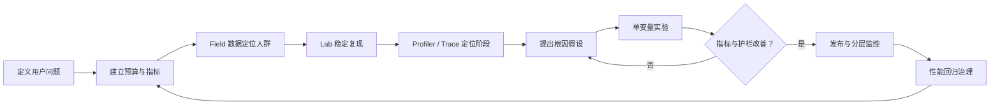
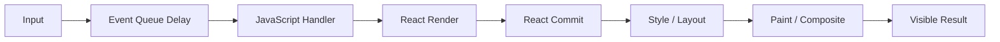
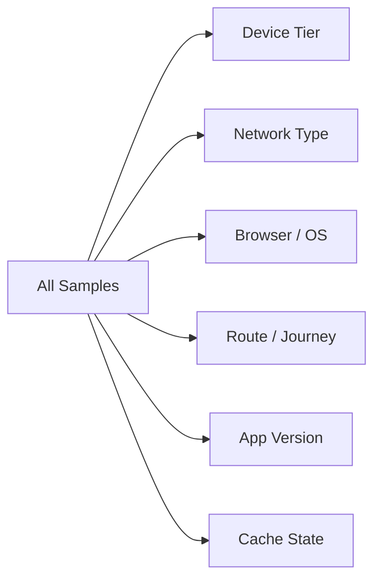
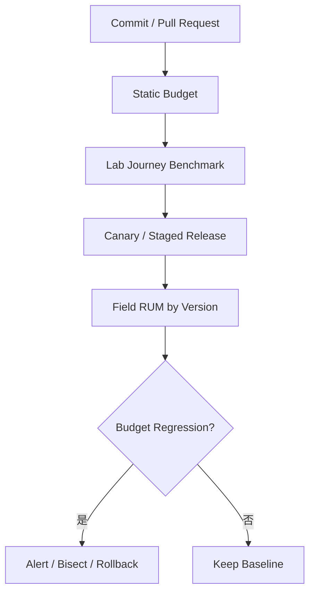
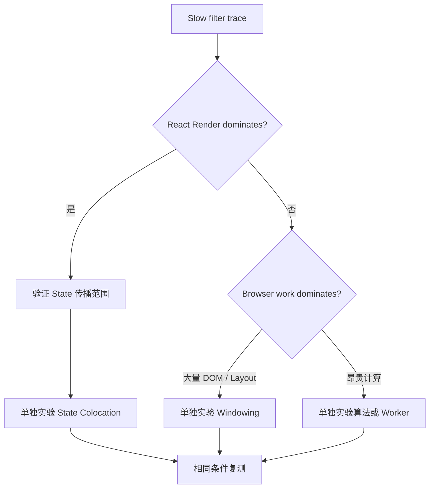

# React 性能方法：从性能预算、Profiler 到可验证回归

> 性能优化不是让 Profiler 图变得更短，而是在明确用户场景、测量环境和业务约束下，用可重复证据证明关键体验改善，并确保收益在后续版本中持续存在。

---

## 一、为什么“感觉更快”不是性能结论

React 项目中常见的性能工作方式是：看到页面卡顿，给组件加 `memo`；看到 Bundle 较大，拆几个 Chunk；本地点击顺畅后就宣布优化完成。这种流程无法回答：

- 慢的是首次加载、点击响应、React Render，还是浏览器 Layout；
- 问题影响所有用户，还是只影响低端设备、弱网或大数据账号；
- 修改改善了用户指标，还是只减少了理论 Render 次数；
- 首屏更快是否以更多流量、内存或后续交互变慢为代价；
- 一次本地录制是否只是缓存、JIT、GC 或后台任务造成的偶然结果；
- 下个版本是否会悄悄把收益全部回退。

性能工程必须形成闭环：



图中 Field Data 指真实用户监控（Real User Monitoring，RUM），Lab Data 指受控环境中的可重复测试。Field 告诉团队“谁在何时变慢”，Lab 帮助解释“为什么慢”；React Profiler 与浏览器 Performance Trace 再把时间归因到不同执行阶段。

本文覆盖性能方法，不提前展开下一篇 Web Vitals 的各指标阈值，也不替后续“React 渲染性能”“列表与大数据”“资源与网络”选择具体优化手段。React、浏览器和 DevTools 会持续演进，Profiler 字段与面板能力应以项目锁定版本和目标浏览器为准。

### 核心结论

1. 先定义用户场景和成功标准，再选择指标与工具；工具输出本身不是目标。
2. Performance Budget 必须绑定 Route、Journey、设备、网络、缓存和分位数，不能只有一个全站平均值。
3. User-centric Metrics 描述用户等待和交互结果，Bundle Size、Render Count 等只是不完整的诊断代理。
4. Field Data 提供真实分布，Lab Data 提供受控复现；两者用途不同，不能互相替代。
5. React Profiler 主要解释组件 Render 与 Commit 关系，不能测量完整网络、Style、Layout、Paint 和像素显示时间。
6. Browser Performance Panel 用于观察主线程、网络、脚本、Layout、Paint 和交互时序，但不直接告诉你哪个 React State 设计错误。
7. CPU 与 Network Throttling 是可重复压力条件，不是某台真实设备或网络的精确模拟。
8. P50 表示典型体验，P95/P99 表示长尾；样本量、分群和采样方式决定分位数是否可信。
9. 性能优化必须通过单变量实验验证因果关系，并同时观察功能、错误率、内存和流量等护栏。
10. 性能回归应组合确定性预算、实验室趋势和线上 RUM，避免把高噪声单次计时直接设为硬门禁。
11. 开发模式、Strict Mode、扩展和日志会改变测量结果，最终结论应来自生产构建或专用 Profiling Build。
12. 任何优化都应保留基线、环境、Trace、修改和复测证据，确保结果可以被他人复现。

---

## 二、先把用户问题转换为可测场景

“订单页很卡”无法直接测量。应把它改写为具备起点、终点和条件的 User Journey：

```text
场景：已登录用户在订单列表输入筛选词
起点：输入事件被浏览器接收
终点：与当前筛选词一致的列表完成可见更新
条件：中端移动设备、生产构建、5000 条本地记录、已加载页面
护栏：结果正确，无输入丢失，内存和错误率不恶化
```

### 2.1 不同用户问题需要不同指标

| 用户问题 | Journey 起点 | Journey 终点 | 主要证据 |
|---|---|---|---|
| 首次打开慢 | Navigation Start | 主要内容可见且可用 | RUM、Navigation/Resource Timing、Trace |
| 点击后迟迟无反馈 | Input Event | 下一次视觉反馈 | Interaction Metric、Event Timing、Trace |
| 输入筛选卡顿 | Key Input | 对应结果可见 | User Timing、Profiler、Trace |
| 列表滚动掉帧 | Scroll/Input | 连续帧完成 | Frame/Long Task、Trace |
| 页面切换慢 | Link Activation | 新 Route 内容可用 | Route Trace、Network、Code/Data Timing |
| 保存耗时长 | Submit | 服务端确认并展示结果 | Business Timing、Network、Mutation Trace |

同一个“慢”可能同时包含多个阶段：



只测 `handler()` 执行时间会漏掉排队、React、Layout 和 Paint；只看 React Render Duration 也无法证明用户已经看到结果。

### 2.2 先写 Measurement Contract

每个关键 Journey 建议有一份测量契约：

```yaml
journey: orders-filter
start: user-input-received
end: matching-list-committed
build: production
data_set: 5000-orders-v3
segments:
  - desktop-mid-warm
  - mobile-mid-warm
metrics:
  - interaction-duration
  - react-actual-duration
  - long-task-count
guardrails:
  - result-correctness
  - error-rate
  - memory-growth
```

这里的 `matching-list-committed` 仍只是 React/DOM 里程碑，不自动等于像素已经显示。指标名称必须说明测量终点，避免团队把不同语义的数字放在同一图表中比较。

---

## 三、Performance Budget：把性能变成工程约束

Performance Budget 是项目允许消耗的时间、字节、主线程工作或资源数量上限。它的价值不是生成一张分数表，而是在需求和代码合入前明确“为了这个功能，最多愿意支付多少性能成本”。

### 3.1 预算至少包含三类

| 预算类型 | 示例 | 作用与限制 |
|---|---|---|
| 用户结果预算 | 页面可用时间、交互响应分位数 | 最接近体验，但噪声和环境影响较大 |
| 执行预算 | 主线程阻塞、Long Task、React Render | 帮助归因，不能单独代表体验 |
| 资源预算 | Initial JS、CSS、图片、请求数 | 易于 CI 检查，但只是传输与执行成本代理 |

还应设置 Guardrail：

- Crash、JS Error 和请求失败率不得上升；
- 业务结果与可访问性不得退化；
- 内存、流量、电量和服务端 QPS 不得出现不可接受增长；
- 低端设备和关键地区不能只因总体平均值改善而变差。

### 3.2 预算必须绑定场景和分群

下面只是预算文件的格式示例，数字必须由项目基线、用户目标和业务价值确定，不能当作通用阈值：

```yaml
route: orders
journey: filter-existing-list
profile: mobile-mid-production
budgets:
  interaction_p95_ms: 240
  react_render_p95_ms: 80
  long_tasks_per_interaction_max: 1
  route_js_gzip_kb_max: 180
guardrails:
  result_error_rate_max: 0.001
  heap_growth_mb_max: 8
```

预算应回答：

- 冷缓存还是热缓存；
- 首次访问还是重复访问；
- 哪个 Route 和 Journey；
- 哪类设备、浏览器和网络；
- P50、P75、P95 还是其他统计量；
- 数据规模和账号复杂度；
- 测量窗口、版本和样本下限。

“全站加载小于 2 秒”通常不可执行，因为不同页面、缓存和用户环境完全不同。

### 3.3 预算不是永远不变的常量

新业务可能合理增加成本，浏览器和设备结构也会变化。调整预算时应记录：

1. 原预算和实际分布；
2. 新功能带来的用户价值；
3. 为什么不能在原预算内实现；
4. 哪些资源或指标被放宽；
5. 后续偿还计划和负责人。

不要让每次超标都通过“临时提高阈值”解决，否则 Budget 只是文档装饰。

---

## 四、User-centric Metrics：测用户等待，而不是代码自我感觉

用户中心指标围绕真实任务：内容何时出现、输入何时得到反馈、界面是否稳定、操作何时完成。Web Vitals 是其中一组标准化指标，具体的 LCP、INP、CLS、TTFB 和 Attribution 会在下一篇展开。

### 4.1 业务 Journey 也需要指标

标准指标无法覆盖所有业务完成点。例如：

- 订单列表的第一屏何时包含真实数据，而不是 Skeleton；
- 编辑器输入后预览何时与当前文本一致；
- 点击支付后何时得到可确认的服务端状态；
- 从详情返回列表何时恢复筛选和滚动位置。

可以使用 User Timing API 标记应用里程碑：

```ts
function markOrderFilterStarted(query: string) {
  performance.mark('orders-filter:start', {
    detail: { queryLength: query.length },
  });
}

function markOrderFilterCommitted(resultCount: number) {
  performance.mark('orders-filter:commit', {
    detail: { resultCount },
  });

  const measure = performance.measure(
    'orders-filter:input-to-commit',
    'orders-filter:start',
    'orders-filter:commit',
  );

  enqueuePerformanceSample({
    name: measure.name,
    duration: measure.duration,
  });
}
```

`performance.mark` 创建高精度时间轴标记，`performance.measure` 计算两个标记之间的 Duration。上例只测到应用定义的 Commit 标记，不等于浏览器已经 Paint；要分析视觉完成时间，应结合 Event Timing、Frame、截图或 Performance Trace。

标记的 `detail` 也可能进入 Trace 和遥测。不要放入搜索原文、邮箱、订单号等高基数或敏感数据。

### 4.2 Field Data 与 Lab Data

| 维度 | Field / RUM | Lab |
|---|---|---|
| 用户与设备 | 真实且分布复杂 | 预先固定 |
| 网络与后端 | 真实波动 | 可控或模拟 |
| 可复现性 | 较低 | 较高 |
| 根因调试 | 上下文有限 | 可录制完整 Trace |
| 长尾发现 | 强 | 依赖选定场景 |
| 发布前验证 | 有滞后 | 强 |

合理流程是：

1. RUM 发现特定 Route、版本、设备或网络的分位数异常；
2. Lab 使用接近该分群的条件复现；
3. Profiler/Trace 定位根因并做单变量实验；
4. 发布后回到同一 RUM Segment 验证真实收益。

Lab 通过不代表线上所有人都快，Field 变慢也不一定能仅靠聚合数据定位代码行。

### 4.3 RUM 采集必须治理

- 对高频事件采样，避免每个 Commit 都上报；
- 使用 Route ID、Journey ID、版本、设备档位等低基数维度；
- 不记录完整 URL、用户输入和敏感业务字段；
- 记录页面可见性、Back/Forward Cache、缓存状态等必要上下文；
- 明确异常值、超时和页面中途关闭如何统计；
- 设定最小样本量，低流量页面不要强行展示不稳定 P99；
- 对 Bot、自动化流量和内部测试进行合理隔离。

---

## 五、React Profiler：定位组件树中的工作

React Profiler 有两种常见形式：

- React Developer Tools 中的交互式 Profiler；
- `<Profiler>` API 的 `onRender` 回调。

### 5.1 `<Profiler>` 提供什么

```tsx
import { Profiler, type ProfilerOnRenderCallback } from 'react';

const onRender: ProfilerOnRenderCallback = (
  id,
  phase,
  actualDuration,
  baseDuration,
  startTime,
  commitTime,
) => {
  enqueueProfilerSample({
    id,
    phase,
    actualDuration,
    baseDuration,
    startTime,
    commitTime,
  });
};

function OrdersRoute() {
  return (
    <Profiler id="OrdersTable" onRender={onRender}>
      <OrdersTable />
    </Profiler>
  );
}
```

主要字段：

| 字段 | 含义 |
|---|---|
| `id` | 当前 Profiler 边界名称 |
| `phase` | Mount、Update 或当前版本支持的其他阶段 |
| `actualDuration` | 本次更新实际用于 Render 该子树的时间估计 |
| `baseDuration` | 无优化地重新 Render 整个子树的基准成本估计 |
| `startTime` | 本次 Render 开始时间 |
| `commitTime` | 当前 Commit 时间，可用于合并同一次 Commit 的多个边界 |

`actualDuration` 与 `baseDuration` 可帮助判断 Memoization 是否跳过了大量工作，但它们不是网络时间，也不是 Layout、Paint 或用户可见完成时间。

`onRender` 运行在性能敏感路径上，不要同步发送网络请求、打印大量日志或执行复杂聚合。应采样并异步批量处理。

### 5.2 交互式 Profiler 应回答什么

- 哪次 Commit 对应用户感知到的慢交互；
- 哪些组件参与了该 Commit；
- 时间主要集中在哪个子树；
- 组件为何 Render：自身 State、Context、父级或 Props；
- 修改后 Commit 次数和 Duration 是否真正下降；
- 优化是否只把时间转移到另一个组件或 Commit。

看到组件 Render 并不代表它需要 `memo`。如果 Render 廉价、没有 DOM 变化，或用户时间主要花在 Layout，优化它不会产生可见收益。

### 5.3 Profiler 的边界

React 官方文档明确指出 Profiling 会增加额外开销，常规 Production Build 默认关闭详细 Profiling。需要接近生产执行方式时，应使用工具链提供的专用 Profiling Build，并在代表性设备复测。

Profiler 不能独立回答：

- 请求何时开始和结束；
- 事件在主线程队列中等了多久；
- DOM Mutation 后 Style/Layout/Paint 花了多久；
- 第三方脚本、JSON Parse、GC 或普通业务函数的完整成本；
- 像素何时真正显示在屏幕上。

这些问题需要浏览器 Performance Trace。

---

## 六、Browser Performance Panel：查看从事件到像素的主线程证据

浏览器 Performance 面板通常能同时展示：

- Input、Animation Frame 和截图；
- Network Request 与资源加载；
- JavaScript Task、Call Tree 和 Bottom-up；
- Style Recalculation、Layout、Paint、Composite；
- Long Task、GC 和部分内存活动；
- User Timing Mark/Measure；
- 支持版本中的 React Performance Track。

### 6.1 一次有效录制的步骤

1. 使用生产构建或明确的 Profiling Build；
2. 关闭无关标签页、扩展和开发日志；
3. 固定数据集、缓存状态、CPU 与网络条件；
4. 预热需要预热的代码路径；
5. 开始录制后只执行目标交互；
6. 停止录制，先定位用户事件和可见结果；
7. 查看中间是否存在 Long Task、Script、Layout 或 Paint；
8. 使用 Bottom-up/Call Tree 找主要 Self Time 与 Total Time；
9. 保存 Trace，并记录 Build Commit、环境和操作脚本；
10. 修改后在同样条件重复多轮。

录制时间过长会产生巨大 Trace，后台任务也更难排除。一次只录制一个清晰 Journey。

### 6.2 Top-down 与 Bottom-up

- Call Tree / Top-down：从调用入口理解执行链；
- Bottom-up：按函数聚合耗时，定位主要成本贡献者；
- Self Time：函数自身工作，不含子调用；
- Total Time：函数及其后代总成本。

只看到某个函数 Total Time 很高，不代表优化该函数自身就有效；成本可能来自它调用的 Layout Read、JSON Parse 或第三方库。

### 6.3 React Profiler 与 Performance Panel 的分工

| 问题 | 优先工具 |
|---|---|
| 哪个 React 子树 Render 较慢 | React Profiler |
| 为什么组件重新 Render | React DevTools Profiler |
| 事件排队和主线程 Long Task | Performance Panel |
| 网络、脚本解析与执行 | Network + Performance |
| Style、Layout、Paint | Performance Panel |
| 一次 Commit 包含哪些组件 | React Profiler |
| 用户事件到可见更新全链路 | Performance Trace + 用户指标 |

两个工具不是竞争关系。Profiler 缩小 React 范围，Performance Trace 判断 React 是否真的是主耗时阶段。

---

## 七、CPU Throttling：放大主线程瓶颈

CPU Throttling 可以让本地快速机器上的短任务变长，从而更容易观察低算力用户的风险。它适合：

- 暴露昂贵同步计算和巨大 Render；
- 比较同一机器上修改前后的相对变化；
- 验证 Long Task、输入响应和动画压力；
- 在 CI/Lab 中建立较稳定的统一条件。

### 7.1 CPU Throttling 不能模拟什么

一个倍率不能精确模拟目标手机，因为真实设备还受到以下因素影响：

- CPU 架构、核心数量和调度；
- 内存容量、带宽与 GC 行为；
- GPU、屏幕刷新率和浏览器实现；
- 温控、低电量模式和后台进程；
- 操作系统版本和厂商策略。

因此结论应分两层：Throttling 用于可重复比较，代表性真机用于最终验证。不要把“4x Slowdown 下耗时 400 ms”直接解释为某台手机一定耗时 400 ms。

### 7.2 控制预热与运行顺序

JavaScript JIT、Module Cache、图片解码、HTTP Cache 和 GC 都会影响结果。建议：

- 冷启动和热交互分开测试；
- 明确每轮是否重载页面、清除 Cache；
- 先运行预热轮，不把它混入热路径统计；
- A/B 交替运行，降低温度和后台波动的时间偏差；
- 每轮间检查页面状态和数据规模一致；
- 保存异常轮次原因，不只删除“难看数据”。

---

## 八、Network Throttling：区分延迟、带宽与应用等待

网络条件至少影响：

- DNS、连接和 TLS；
- Request Latency 与 Server TTFB；
- Response Transfer；
- Chunk、图片和字体的并发竞争；
- Retry、Timeout、Prefetch 和 Cache 命中；
- 数据到达后的 Parse、Render 和 Paint。

### 8.1 冷缓存、热缓存和 Service Worker 是不同场景

测试前应明确：

| 场景 | 目的 |
|---|---|
| Empty Cache + Hard Reload | 首次访问与资源成本 |
| HTTP Cache Warm | 重复访问 |
| App Query Cache Warm | 客户端资源复用 |
| Service Worker Controlled | 离线或应用缓存策略 |
| Back/Forward Cache | History 恢复体验 |

只勾选 DevTools 的 Disable Cache 不一定覆盖应用内 Query Cache、Service Worker 和 CDN 行为。需要在 Trace/Network 中检查资源的真实来源。

### 8.2 节流不是完整真实网络

DevTools Profile 通常主要控制 Latency 和 Throughput，不能完整模拟蜂窝网络的抖动、丢包、切网、无线电唤醒和区域路由。最终仍需真实网络、远端测试节点和 RUM 验证。

判断慢请求时应拆分：

```text
用户等待 = 排队 + 连接 + TTFB + 下载 + 解析 + React + 浏览器渲染
```

压缩 Response 只能减少下载，无法直接解决高 TTFB；增加 Prefetch 可能改善导航，却增加无效流量和服务端 QPS。

---

## 九、P50、P95、P99：用分布理解用户体验

如果一次交互收集了大量 Duration，并按从小到大排序：

- P50：中位数，约一半样本不超过该值；
- P95：约 95% 样本不超过该值，剩余长尾更慢；
- P99：约 99% 样本不超过该值，用于观察更极端长尾。

### 9.1 为什么平均值不够

假设大多数用户很快，少量低端设备极慢，Average 可能看起来正常，却掩盖严重体验。P50 描述典型情况，P95/P99 帮助发现长尾，但它们也不能说明慢的原因，需要按维度分群。



总体 P95 变差，可能只是新版本用户结构改变，也可能是某个地区后端异常。必须比较相同 Segment。

### 9.2 分位数也会误导

- 10 次 Lab 运行无法可靠估计 P99；
- 低流量页面的 P95/P99 会剧烈波动；
- 不同设备组的 P95 不能直接取平均得到总体 P95；
- Sampling Policy 改变会改变分布；
- Timeout、页面关闭和失败样本若被丢弃，会让结果虚假变好；
- Simpson's Paradox 可能让总体趋势与分群趋势相反。

聚合系统应基于原始样本、Histogram 或可合并的 Quantile Sketch，而不是平均各节点已经计算好的百分位数。

### 9.3 如何选择观察层级

- P50：日常典型体验与大盘变化；
- P75/P90/P95：核心 Journey 的稳定长尾；
- P99：高流量、高价值且样本充足的极端体验；
- Max：常受异常值影响，适合排查，不适合单独决策。

具体使用哪个分位数应由流量、业务风险和误差容忍度决定，不是数值越高越专业。

---

## 十、单变量实验：从相关性走向因果证据

性能 Trace 告诉你“发生了什么”，但修改能否改善问题仍需实验验证。

### 10.1 先写假设

不合格的假设：

```text
给组件加 memo 应该会更快。
```

可验证的假设：

```text
订单筛选时，备注输入状态位于页面根组件，导致 5000 行表格参与每次 Commit。
如果把备注状态下沉到侧栏，在数据、设备和操作脚本不变时，
OrdersTable 的 actualDuration 和输入到 Commit 的 P95 应下降，
且结果正确性、内存和列表筛选耗时不恶化。
```

假设明确了根因、修改、目标指标和 Guardrail。

### 10.2 一次只改变一个主要因素

如果同时执行：

- State Colocation；
- `memo`；
- 虚拟化；
- 数据结构重写；
- Bundle 拆分；

即使整体变快，也无法知道收益来自哪里，未来也无法判断哪项复杂度值得保留。应按假设逐步实验，每步保存基线。

“单变量”指一次验证一个主要因果假设，不代表代码只能改一行。实现一个状态所有权调整可能涉及多个文件，但不应同时混入无关优化。

### 10.3 固定实验条件

至少固定：

- Git Commit、依赖和 Build Mode；
- Browser、OS、设备、电源与温控状态；
- CPU/Network Profile；
- 数据集、账号、Feature Flag；
- Cache、Service Worker 和登录状态；
- 操作脚本与输入节奏；
- 后端环境和测试时段；
- 预热轮数、正式轮数和异常处理规则。

### 10.4 同时测收益和代价

| 目标优化 | 可能的代价 |
|---|---|
| Memoization | 比较成本、内存、旧闭包和维护复杂度 |
| Prefetch | 流量、QPS、隐私 Cache 和电量 |
| Virtualization | 可访问性、查找、动态高度与滚动恢复 |
| Worker | 序列化、复制、调度与错误处理 |
| Code Splitting | Chunk Waterfall、失败和部署版本兼容 |
| Cache 扩大 | 内存、陈旧数据和账号隔离 |

优化目标指标改善，但 Error Rate、Memory 或业务结果变差，不能直接判定成功。

---

## 十一、性能回归：让一次收益成为长期能力

性能回归治理通常分三层：



### 11.1 静态预算适合硬门禁

相对稳定、容易重复的指标适合直接阻止合入：

- Initial/Route JS 与 CSS Size；
- 未压缩图片或字体体积；
- Chunk 数量和重复依赖；
- 明确禁止的同步资源；
- Bundle 中意外引入的大型库。

静态预算仍要理解用户价值。一个小 Bundle 也可能执行很慢，一个大但延迟加载的 Route Chunk 未必影响首屏。

### 11.2 高噪声时间指标先做趋势与告警

共享 CI 机器上的 Navigation Timing、Render Duration 和 Long Task 容易受调度噪声影响。更稳妥的做法：

- 使用固定 Runner 或专用设备；
- 多轮运行并保留分布；
- 同一 Job 中比较 Baseline 与 Candidate；
- 同时设置绝对阈值和相对退化阈值；
- 对极小基线避免只用百分比；
- 超标先生成 Trace Artifact，再决定阻断或人工审核；
- 持续跟踪趋势，避免每次更换环境都重置基线。

时间基准足够稳定后可以升级为门禁，但不能把偶发失败简单标记为 Flaky 后长期忽略。

### 11.3 发布后使用同分群验证

比较版本时应保持 Route、Journey、设备、网络、地区和缓存等 Segment 可比。发布结构变化、节假日流量和用户群改变都会影响总体分位数。

建议记录：

```ts
type PerformanceSampleContext = {
  appVersion: string;
  routeId: string;
  journeyId: string;
  deviceTier: 'low' | 'mid' | 'high';
  networkTier: 'slow' | 'regular' | 'fast' | 'unknown';
  cacheState: 'cold' | 'warm' | 'unknown';
  visibilityState: DocumentVisibilityState;
};
```

这些字段必须保持低基数并尊重隐私。版本发布后若目标 Segment 的 P95 恶化，还应同时观察 Error、Crash、后端延迟和 Feature Flag，不能立即把相关性归因到某个前端 Commit。

---

## 十二、完整案例：订单筛选为什么卡顿

以下是方法示例，不提供虚构的优化结果。

### 12.1 定义问题

RUM 显示订单列表筛选 Journey 的长尾恶化，主要集中在低端和中端设备、大数据账号。先固定与该 Segment 接近的 Lab 条件：

- Production Build；
- 固定浏览器版本与 CPU Throttling；
- 5000 条确定性订单数据；
- 页面和 Query Cache 已预热；
- 自动化输入相同筛选词；
- 每轮记录 User Timing、Profiler 和 Trace。

### 12.2 建立阶段证据

1. Performance Trace 先检查 Event Queue、Long Task、Script、Layout 和 Paint；
2. 若主时间在 React Render 区间，再打开 React Profiler；
3. Profiler 检查哪些组件参与慢 Commit，以及触发原因；
4. 检查 DOM 数量、Layout 和 GC，避免只盯 React；
5. 将 Trace 时间轴与 `orders-filter:start`、`commit` 标记对齐。

### 12.3 按假设逐项验证



每个实验都比较：

- 用户输入到目标里程碑的 Duration 分布；
- React `actualDuration` 与 Commit 数量；
- Long Task、Layout、Paint；
- Heap 与 GC；
- 结果正确性和可访问性。

只有目标指标在多轮实验中稳定改善、Guardrail 正常，并在发布后同 Segment RUM 中复现，才能把修改归为有效优化。

---

## 十三、常见误区与错误案例

### 13.1 在 Development Build 下比较生产性能

开发模式包含额外检查、警告、Source Map 和 Strict Mode 行为。它适合定位逻辑，不适合作为生产耗时结论。使用 Production 或专用 Profiling Build，并在目标设备复测。

### 13.2 只看 React Render 次数

一次廉价 Render 可能没有 DOM Mutation，减少次数也不一定改善用户体验。应同时看 Duration、Commit、Layout、Paint 和用户 Journey。

### 13.3 只跑一次并取最好结果

最好结果通常反映幸运的 Cache、JIT 和系统调度。应预热、多轮交替运行，报告分布和异常规则。

### 13.4 用 Average 掩盖长尾

Average 无法说明低端设备和弱网用户。至少观察 P50 与适合流量规模的长尾分位数，并按设备、网络、Route 和版本分群。

### 13.5 用少量 Lab 数据计算 P99

样本不足时 P99 几乎等同于最大值，波动巨大。Lab 更适合多轮 Median、P75/P90 或置信区间；P99 通常需要高流量 RUM 或大量稳定样本。

### 13.6 CPU Throttling 等于真实低端机

节流只建立近似压力环境，不能模拟内存、GPU、温控和系统调度。最终结论必须经过代表性真机验证。

### 13.7 一次提交混入多个优化

结果变快却无法证明原因，也无法评估每项复杂度是否值得。按主要假设拆分实验，保留每一步基线和 Trace。

### 13.8 只守 Bundle Size，不守执行成本

相同字节量的 JavaScript 解析和执行成本可能不同，延迟加载也会改变影响路径。资源预算必须与用户时间和主线程预算组合。

### 13.9 线上指标改善就直接认定因果

发布时用户结构、后端、缓存和流量可能同时变化。使用 Canary、Feature Flag、相同 Segment 和单变量发布提高因果可信度。

---

## 十四、性能实验报告模板

```markdown
# Experiment: orders-filter-state-colocation

## Problem
- Journey:
- Affected segment:
- User-visible symptom:

## Environment
- Commit / build:
- Browser / OS / device:
- CPU / network:
- Cache / data set:
- Script / repetitions:

## Baseline
- User metric distribution:
- React Profiler evidence:
- Browser Trace evidence:
- Guardrails:

## Hypothesis
- Suspected cause:
- Single primary change:
- Expected metric movement:

## Result
- Before / after distribution:
- Trace artifact:
- Functional and resource guardrails:
- Remaining uncertainty:

## Decision
- Keep / revert / continue experiment:
- Regression budget:
- Owner:
```

模板的价值是让结论可审查、可重复。没有环境、基线和证据的“优化了 40%”无法判断测量对象、样本和因果关系。

---

## 十五、工程检查清单

### 指标与预算

- 是否从 User Journey 而不是工具指标出发；
- Budget 是否绑定 Route、设备、网络、缓存和分位数；
- 是否同时包含用户结果、执行/资源代理和 Guardrail；
- 是否明确超时、失败和中途离开样本的统计规则。

### 采集与定位

- 是否结合 Field 分布与 Lab 复现；
- 是否使用 Production 或专用 Profiling Build；
- React Profiler 是否只用于解释 React 阶段；
- Performance Trace 是否覆盖事件、脚本、Layout 与 Paint；
- User Timing 名称和终点语义是否清楚且不泄露隐私。

### 实验与回归

- 是否写出可证伪的根因假设；
- 是否一次验证一个主要变量；
- 环境、数据、Cache 和脚本是否固定；
- 是否多轮运行并报告分布；
- 是否保存 Trace、Profiler 和 Build 信息；
- CI 门禁是否考虑指标噪声；
- 发布后是否回到相同 RUM Segment 验证；
- 性能收益是否进入长期 Budget 和负责人体系。

---

## 十六、总结

React 性能工作的核心不是某个 Hook，而是一套证据方法：

- 用 User Journey 定义用户真正等待的起点和终点；
- 用 Performance Budget 把体验、执行成本和资源成本变成工程约束；
- 用 Field Data 找到真实受影响人群，用 Lab Data 稳定复现；
- 用 React Profiler 判断组件树做了多少工作；
- 用 Browser Performance Panel 判断主线程、网络和渲染管线如何消耗时间；
- 用 CPU/Network Throttling 建立可重复压力条件，再用代表性真机确认；
- 用 P50/P95/P99 理解典型与长尾，而不是依赖平均值；
- 用单变量实验验证因果，并观察正确性、内存和流量 Guardrail；
- 用静态预算、Lab 趋势和 RUM 分层监控防止性能回归。

只有当问题可复现、指标可解释、根因有 Trace、修改可归因、结果能在真实用户中复现，并且后续版本会自动发现回退时，性能优化才真正完成。

---

## 问答复盘

### Q1：为什么不能看到组件重复 Render 就直接加 `memo`？

**答：** Render 次数不是用户指标。组件可能很廉价且没有 DOM 变化，真正成本也可能在 Layout 或 Paint；应先用用户 Journey 和 Trace 证明 React Render 是主要瓶颈。

### Q2：Performance Budget 为什么必须包含设备、网络和缓存条件？

**答：** 同一页面在冷缓存、弱网、低端设备与热缓存桌面上的分布完全不同。没有条件的阈值无法复现，也无法判断超标对应哪类用户。

### Q3：Field Data 与 Lab Data 哪个更可信？

**答：** 两者回答不同问题。Field 反映真实用户分布和长尾，Lab 提供受控复现和完整调试证据；可靠结论通常需要两者闭环。

### Q4：`actualDuration` 下降是否证明用户已经感到更快？

**答：** 不能。它主要描述 React 子树本次 Render 成本，不包含完整排队、网络、Layout、Paint 和视觉完成时间，必须与用户指标和浏览器 Trace 联合验证。

### Q5：CPU 4x Throttling 能否代表某款低端手机？

**答：** 不能精确代表。它适合在同一环境放大 CPU 问题和做相对比较，但无法模拟真实设备的架构、内存、GPU、温控和系统调度。

### Q6：为什么不能平均多个服务节点各自计算的 P95？

**答：** Percentile 不是可直接平均的统计量。各节点样本量和分布不同，应聚合原始样本、Histogram 或可合并 Quantile Sketch 后重新计算总体分位数。

### Q7：P99 是否总比 P95 更有价值？

**答：** 不是。P99 需要更多样本，低流量场景会非常不稳定。应按业务风险、流量和误差容忍度选择分位数，而不是盲目追求更高数字。

### Q8：一次修改同时加入 Memoization 和 Virtualization，整体变快，能否直接合入？

**答：** 功能上可以评估，但无法证明各自收益与代价。性能工程应拆成单变量实验，否则难以维护、回退和建立准确预算。

### Q9：哪些性能指标适合做 CI 硬门禁？

**答：** Bundle Size、资源体积等确定性较高的指标更适合。高噪声时间指标应先在固定 Runner 上多轮比较、生成趋势和 Trace，稳定后再决定是否阻断。

### Q10：怎样才算一次性能优化真正完成？

**答：** 需要同场景前后分布证明改善，功能和资源 Guardrail 正常，真实用户相同 Segment 复现收益，并建立自动预算或监控防止后续回归。

---

## 延伸知识

- Web Vitals：LCP、INP、CLS、TTFB、Field/Lab 与 Attribution；
- React 渲染性能：State Colocation、Selector、Stable Props 与 Profiler Flamegraph；
- 列表与大数据：Virtualization、Overscan、Dynamic Height 与 Worker；
- 资源与网络：Code Splitting、Preload、Prefetch、缓存和图片策略；
- 浏览器渲染：Long Task、Style、Layout、Paint、Composite；
- 统计方法：Histogram、置信区间、A/B Test 与异常检测。
