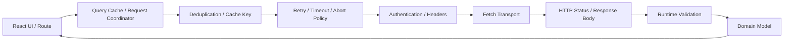
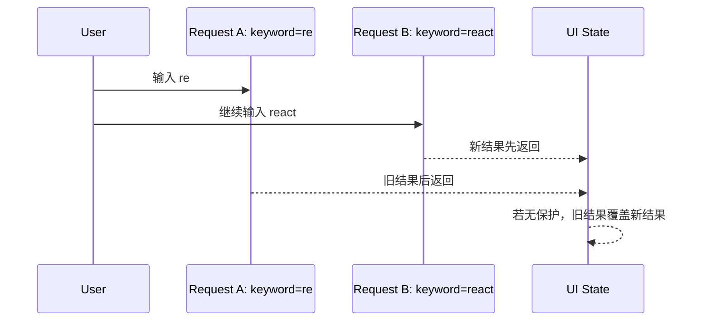

# React 数据请求治理：Fetch、取消、重试、去重与竞态控制

> 可靠的数据请求不是调用一次 `fetch().then(response => response.json())`。生产请求必须同时定义 HTTP 成功语义、响应校验、身份凭证、取消、超时、重试预算、请求去重、竞态优先级和组件生命周期，否则网络抖动、页面切换与重复操作会把偶发问题放大为错误数据。

---

## 一、为什么“能请求成功”远远不够

以下代码在 Happy Path 中可以工作：

```tsx
const response = await fetch(`/api/orders/${orderId}`);
const order = await response.json();
setOrder(order);
```

但它没有回答：

- 404、500 是否会进入 `catch`；
- 响应是否真的是合法 Order；
- 用户快速切换订单时，旧响应能否覆盖新响应；
- 组件卸载后是否继续更新；
- 请求多长时间算超时；
- 网络错误是否应该重试；
- 多个组件请求同一资源是否共享 In-flight Promise；
- Cookie、Bearer Token、CSRF 和 Token Refresh 如何处理；
- 失败后 UI 如何区分取消、超时、离线和服务端错误。

数据请求治理的目标不是封装一个参数越来越多的万能函数，而是把不同职责分层，并让每层都可以测试和替换。

本文依据当前 Fetch、AbortController 与 React 稳定公开契约。`AbortSignal.timeout()`、`AbortSignal.any()` 等静态方法已进入现代 Web 平台，但目标浏览器、WebView、Node.js 和测试运行时的支持范围仍需核对；不满足时应使用经过验证的 Polyfill 或等价组合实现。

### 核心结论

1. `fetch` 只在请求无法完成时 Reject，HTTP 404/500 默认仍会 Resolve 为 `Response`。
2. `response.ok` 表示 Status 处于 200～299，业务必须显式处理其他状态。
3. TypeScript 类型不会验证网络 JSON，响应体应先作为 `unknown` 再做 Runtime Validation。
4. `AbortController` 只取消支持该 Signal 的工作，已完成的同步计算仍需 Request ID 或 Generation 防止旧结果提交。
5. Timeout 本质上是主动 Abort，必须覆盖从请求到响应体读取的整个预算。
6. Retry 只适用于暂时性错误和可安全重放的操作，并需要退避、抖动、上限和取消。
7. Authentication 需要同时考虑凭证传输、Token Refresh、CSRF、CORS、日志脱敏和服务端授权。
8. Request Deduplication 只合并同时进行的等价请求，不等于完成结果 Cache。
9. Race Condition 必须定义“谁赢”：最后发起、最后完成、当前实体或服务端版本。
10. 复杂 Server State 应优先交给 Query Cache、Router Loader 或框架数据层，而不是每个组件重复治理。

---

## 二、请求治理的分层模型



各层职责：

- **Transport**：构造 Request，调用 Fetch，接收 Response；
- **HTTP Policy**：处理 Status、Header、Content Type 和错误体；
- **Validation**：把不可信 `unknown` 转为可信 Domain Type；
- **Resilience**：Timeout、Retry、Backoff、Abort；
- **Coordination**：Deduplication、Cache、Race、Mutation；
- **React Integration**：生命周期、Loading/Error UI、Suspense/Loader 边界。

分层后，Retry 不需要知道组件 State，Schema 不需要知道 Token Refresh，组件也不需要理解 Response Body 只能读取一次。

后文会分别展开 Request / Response 的输入输出契约，再把取消、超时、重试和 React 生命周期组合起来。

---

## 三、Fetch 的真实语义

```tsx
const response = await fetch('/api/orders/42');

if (!response.ok) {
  throw new Error(`HTTP ${response.status}`);
}
```

### 3.1 什么情况会 Reject

浏览器 Fetch 可能因以下原因 Reject：

- DNS、连接或网络层失败；
- 请求被 Abort；
- CORS 等浏览器安全策略阻止读取；
- Request 构造或 Body 使用不合法；
- 运行时无法完成 Fetch 算法。

这些错误常表现为 `TypeError`、`AbortError`、`TimeoutError` 或运行时特定 Error。浏览器不会向 JavaScript 暴露所有底层网络细节，因此不能可靠地仅凭 `TypeError` 区分断网、DNS 和 CORS。

### 3.2 HTTP Error 不会自动 Reject

以下状态通常都得到正常 `Response`：

- `401 Unauthorized`；
- `403 Forbidden`；
- `404 Not Found`；
- `409 Conflict`；
- `429 Too Many Requests`；
- `500 Internal Server Error`。

因此 `catch` 不能代替 Status 判断。

### 3.3 `no-cors` 不是解决 CORS 的办法

`mode: 'no-cors'` 通常得到 Opaque Response，前端无法读取正常 Status、Header 和 Body。CORS 必须由目标服务端正确允许 Origin、Method、Header 和 Credentials，而不是让客户端放弃读取响应。

---

## 四、Request：输入不是只有 URL

`fetch(input, init)` 可以接收 URL 或 `Request`，常见选项包括：

```tsx
const request = new Request('/api/orders', {
  method: 'POST',
  headers: {
    Accept: 'application/json',
    'Content-Type': 'application/json',
    'Idempotency-Key': idempotencyKey,
  },
  body: JSON.stringify(command),
  credentials: 'same-origin',
  signal,
});

const response = await fetch(request);
```

### 4.1 Method 与 Body

- GET/HEAD 不应携带 Request Body；
- JSON Body 需要正确 `Content-Type`；
- `FormData` 通常让浏览器自动生成带 Boundary 的 Content Type，不应手写错误 Boundary；
- 上传 Stream 和已消费的 Body 不能随意重放；
- Retry 时应为每次尝试创建新的 Request/Body。

### 4.2 Header

`Headers` 名称大小写不敏感。浏览器会控制部分 Forbidden Header，例如 `Host` 和某些连接级 Header。不要假设任意 Header 都能由前端修改。

### 4.3 Credentials

浏览器 Fetch 默认使用 `credentials: 'same-origin'`。跨 Origin 携带 Cookie 通常需要 `credentials: 'include'`，服务端同时必须返回允许凭证的 CORS Header，且 `Access-Control-Allow-Origin` 不能使用通配符 `*`。

是否携带 Cookie 与服务端是否授权是两件事。任何客户端请求都必须被服务端重新认证和授权。

### 4.4 Request Body 是一次性流

Request/Response Body 具有 `bodyUsed` 状态。一个 Body 被消费后不能再次读取。需要发送同一逻辑请求的 Retry，优先通过 Factory 重新构造；`request.clone()` 只适用于尚未消费且可克隆的 Body，也会增加资源成本。

---

## 五、Response：Status、Header 与一次性 Body

```tsx
const response = await fetch(request);

console.log(response.status);
console.log(response.ok);
console.log(response.headers.get('content-type'));

const body = await response.json();
```

### 5.1 `ok` 与 Status

`response.ok` 只表示 Status 在 200～299。它不表示 JSON Schema 正确，也不表示业务操作成功。例如服务端可能返回 `200` 和 `{ "status": "rejected" }`，这属于业务协议，需要 Schema 和 Domain Logic 继续解释。

`statusText` 在某些协议或运行时中可能为空，不应直接作为唯一用户提示。

### 5.2 Body 只能读取一次

```tsx
await response.json();
await response.text(); // Body 已被消费
```

日志层和业务层都要读取 Body 时可以提前 `response.clone()`，但 Clone 可能导致额外 Buffer 和内存占用，不适合大型下载或 Stream。更常见的做法是传递已经解析和校验后的数据，而不是传递原始 Response 给多个消费者。

### 5.3 Content Type

不要盲目假设 Error Response 一定是 JSON。网关、CDN 和代理可能返回 HTML 或纯文本。解析前应读取 `Content-Type`，同时允许服务端错误响应格式不完整。

---

## 六、建立可验证的 JSON 请求边界

以下示例使用 Zod 风格 Runtime Schema，把网络数据从 `unknown` 转为可信类型：

```tsx
type JsonSchema<T> = {
  safeParse(input: unknown):
    | { success: true; data: T }
    | { success: false; error: unknown };
};

class HttpError extends Error {
  readonly name = 'HttpError';

  constructor(
    readonly status: number,
    readonly body: unknown,
    readonly requestId: string | null,
  ) {
    super(`HTTP request failed with status ${status}`);
  }
}

class InvalidResponseError extends Error {
  readonly name = 'InvalidResponseError';
}

class NetworkError extends Error {
  readonly name = 'NetworkError';
}

async function readResponseBody(response: Response): Promise<unknown> {
  const text = await response.text();
  if (!text) return null;

  const contentType = response.headers.get('content-type') ?? '';
  const isJson =
    contentType.includes('application/json') || contentType.includes('+json');

  if (!isJson) return text;

  try {
    return JSON.parse(text) as unknown;
  } catch (cause) {
    throw new InvalidResponseError('Response declared JSON but was invalid', {
      cause,
    });
  }
}

async function requestJson<T>(
  input: RequestInfo | URL,
  options: RequestInit & { schema: JsonSchema<T> },
): Promise<T> {
  const { schema, ...init } = options;
  const headers = new Headers(init.headers);

  if (!headers.has('Accept')) {
    headers.set('Accept', 'application/json');
  }

  let response: Response;

  try {
    response = await fetch(input, { ...init, headers });
  } catch (cause) {
    if (init.signal?.aborted) {
      throw init.signal.reason ?? cause;
    }

    throw new NetworkError('The request could not reach the server', { cause });
  }

  const requestId = response.headers.get('x-request-id');
  let body: unknown;

  try {
    body = await readResponseBody(response);
  } catch (cause) {
    if (init.signal?.aborted) {
      throw init.signal.reason ?? cause;
    }

    if (!response.ok) {
      throw new HttpError(response.status, null, requestId);
    }

    throw cause;
  }

  if (!response.ok) {
    throw new HttpError(response.status, body, requestId);
  }

  const parsed = schema.safeParse(body);

  if (!parsed.success) {
    throw new InvalidResponseError('Response did not match the expected schema', {
      cause: parsed.error,
    });
  }

  return parsed.data;
}
```

`Error(message, { cause })` 需要目标 JavaScript Runtime 支持 Error Cause；面向旧环境时应通过项目 Error 基类保存 `cause`。

### 6.1 为什么不用 Type Assertion

```tsx
const order = (await response.json()) as Order;
```

`as Order` 只让 TypeScript 停止检查，不会验证运行时值。字段缺失、类型错误或恶意响应仍会进入业务层。

### 6.2 Error Body 也不可信

`HttpError.body` 仍是 `unknown`。UI 不应直接显示服务端原始 Message，更不能渲染未经处理的 HTML。错误协议也需要 Schema、映射和脱敏。

### 6.3 Response Header 的跨域可见性

跨 Origin 读取自定义 `x-request-id` 需要服务端通过 `Access-Control-Expose-Headers` 暴露。否则浏览器 Network 面板可能看得到，JavaScript 的 `response.headers.get()` 却返回 `null`。

---

## 七、错误分类与 UI 状态

不要把所有失败都压成 `error: true`：

```ts
type RequestFailure =
  | { kind: 'aborted' }
  | { kind: 'timeout' }
  | { kind: 'network'; message: string }
  | { kind: 'http'; status: number; requestId: string | null }
  | { kind: 'invalid-response'; message: string }
  | { kind: 'authentication' }
  | { kind: 'unknown'; message: string };
```

不同错误需要不同处理：

| 错误 | UI 与治理 |
|---|---|
| Aborted | 通常不展示错误，结束旧任务 |
| Timeout | 提示超时，可提供有限重试 |
| Network | 提示网络不可用，监听恢复但避免无限重试 |
| 401 | 进入 Refresh/Login 协议 |
| 403 | 显示权限不足，不应循环 Refresh |
| 404 | 显示资源不存在或路由 Not Found |
| 409/412 | 进入冲突解决或重新同步 |
| 429 | 遵循 Retry-After 和服务端限流 |
| 5xx | 有限重试或降级，记录 Request ID |
| Invalid Response | 上报协议错误，不把脏数据渲染为正常内容 |

用户提示应稳定、可操作；日志应包含 Status、Endpoint Template、Attempt、Request ID 和 Trace Context，但不能记录 Token、密码或完整敏感 Body。

---

## 八、AbortController：取消是生命周期协议

```tsx
const controller = new AbortController();

fetch('/api/orders/42', { signal: controller.signal });

controller.abort();
```

`AbortSignal` 是一次性的。Signal 一旦 Aborted，后续使用它的 Fetch 会立即失败；重试必须创建新的 Controller/Signal。

### 8.1 Abort 不等于事务回滚

取消客户端等待，不保证服务端没有收到或执行请求。对于支付、创建订单等写操作：

- 服务端仍需幂等键；
- 客户端超时后不能假设写入失败；
- 应通过查询状态或操作 ID 确认最终结果；
- Abort 只释放客户端后续工作和资源。

### 8.2 Fetch Resolve 后仍可取消 Body 读取

Fetch Promise 在 Header 到达后即可 Resolve，Body 可能仍在下载。只要同一 Signal 仍生效，Abort 可以使后续 Body 读取失败。Timeout Helper 如果在拿到 `Response` 时就清除 Timer，可能只限制 Header 等待，没有覆盖完整 Body。

### 8.3 非 Fetch 异步任务

自定义 SDK、数据库 Client 或解析任务只有主动监听 Signal 才能取消：

```tsx
signal.throwIfAborted();
const result = await sdk.load();
signal.throwIfAborted();
```

同步 JSON Schema 校验一旦开始通常不能被 Abort，中间结果仍需 Generation/Request ID 防止提交。

---

## 九、Timeout：给完整操作设置预算

现代运行时可以使用：

```tsx
const timeoutSignal = AbortSignal.timeout(8_000);
const response = await fetch('/api/orders/42', {
  signal: timeoutSignal,
});
```

组件卸载取消与 Timeout 可以组合：

```tsx
const lifecycleController = new AbortController();
const timeoutSignal = AbortSignal.timeout(8_000);
const signal = AbortSignal.any([
  lifecycleController.signal,
  timeoutSignal,
]);
```

`AbortSignal.any()` 使用第一个 Abort 的 Reason 结束组合 Signal。业务错误映射可以同时检查 `lifecycleController.signal.aborted` 和 `timeoutSignal.aborted`，区分页面离开与超时。

### 9.1 Timeout 的范围

至少区分：

- 排队/连接预算；
- Header 到达时间；
- Body 下载时间；
- JSON Parse 和 Runtime Validation；
- 整个业务操作 Deadline。

浏览器 Fetch 不直接暴露 DNS、Connect、TLS 等独立 Timeout。应用级 Deadline 通常覆盖整个操作；更细的网络阶段需要服务端、代理或平台能力配合。

### 9.2 Timeout 不是越短越好

Timeout 应基于真实 P95/P99、网络类型和操作价值。过短会制造重试风暴，过长会让 UI 无反馈。长任务应使用 Operation ID、进度查询或异步 Job，而不是无限延长一个 HTTP 请求。

---

## 十、Retry：有限、可取消、可证明安全

适合考虑重试的情况：

- 暂时性网络错误；
- `408`、`429`；
- 部分 `5xx`，例如 `502`、`503`、`504`；
- 服务端明确返回可重试协议。

通常不应自动重试：

- Runtime Schema Validation 失败；
- `400`、`401`、`403`、`404`；
- 非幂等写操作且没有 Idempotency Key；
- 用户已经取消；
- 业务冲突需要用户决策。

### 10.1 Abort-aware Backoff

```tsx
function isRetryable(error: unknown): boolean {
  if (error instanceof NetworkError) return true;

  if (error instanceof HttpError) {
    return [408, 429, 500, 502, 503, 504].includes(error.status);
  }

  return error instanceof DOMException && error.name === 'TimeoutError';
}

function abortableDelay(ms: number, signal: AbortSignal): Promise<void> {
  return new Promise((resolve, reject) => {
    if (signal.aborted) {
      reject(signal.reason);
      return;
    }

    const timeoutId = setTimeout(() => {
      signal.removeEventListener('abort', handleAbort);
      resolve();
    }, ms);

    function handleAbort() {
      clearTimeout(timeoutId);
      reject(signal.reason);
    }

    signal.addEventListener('abort', handleAbort, { once: true });
  });
}

async function retry<T>(
  operation: (signal: AbortSignal) => Promise<T>,
  signal: AbortSignal,
  maxAttempts = 3,
): Promise<T> {
  for (let attempt = 1; ; attempt += 1) {
    try {
      return await operation(signal);
    } catch (error) {
      if (
        signal.aborted ||
        attempt >= maxAttempts ||
        !isRetryable(error)
      ) {
        throw error;
      }

      const exponential = Math.min(500 * 2 ** (attempt - 1), 5_000);
      const jitteredDelay = Math.random() * exponential;
      await abortableDelay(jitteredDelay, signal);
    }
  }
}
```

调用方通过 Operation Factory 为每次尝试创建新的 Request：

```tsx
const order = await retry(
  (signal) =>
    requestJson(`/api/orders/${orderId}`, {
      schema: orderSchema,
      signal,
    }),
  requestSignal,
);
```

### 10.2 Retry Policy

- 使用 Exponential Backoff + Jitter，避免客户端同时重试；
- 遵循合法的 `Retry-After`；
- 限制 Attempt 和总 Deadline；
- 记录重试放大率；
- POST/PATCH 需要 Idempotency Key 或服务端幂等协议；
- 每次尝试都重新构造一次性 Body；
- 页面隐藏、退出登录和用户取消后停止重试。

认证刷新不是普通 Retry。401 应进入单独的 Refresh 协议，并且原请求最多在刷新成功后重放一次，避免无限循环。

---

## 十一、Authentication：传凭证只是第一步

### 11.1 Cookie Session

HttpOnly Cookie 可以降低 Token 被 JavaScript 直接读取的风险，但必须处理：

- `Secure`、`SameSite`、Domain 和 Path；
- Cross-origin Credentials 与 CORS；
- CSRF Token、SameSite 策略和服务端 Origin 校验；
- Session 过期与登出；
- SSR 请求中的 Cookie 转发边界。

### 11.2 Bearer Token

```tsx
headers.set('Authorization', `Bearer ${accessToken}`);
```

Bearer Token 一旦泄漏即可被使用。存储位置要结合 XSS、刷新恢复和平台能力评估；不能把 Token 写入日志、Redux DevTools、URL、Analytics 或错误上报。

### 11.3 Token Refresh Single-flight

多个请求同时返回 401 时，只允许一个 Refresh Request 进行，其他请求等待同一个 Refresh Promise。刷新成功后重放各自请求一次；刷新失败则统一清理会话并跳转登录。

必须避免：

- Refresh Endpoint 自己再次触发 Refresh；
- 每个失败请求各刷新一次；
- 失败后无限重放 401；
- 旧账号请求在新账号登录后继续提交结果；
- 前端把 403 当成 Token 过期。

### 11.4 客户端不是安全边界

前端隐藏按钮、路由 Guard 和 Redux 权限只改善体验。服务端必须对每个请求重新验证身份、租户、资源所有权和操作权限。

---

## 十二、Request Deduplication：只合并进行中的等价请求

```tsx
const inFlightRequests = new Map<string, Promise<unknown>>();

function deduplicate<T>(
  key: string,
  loader: () => Promise<T>,
): Promise<T> {
  const existing = inFlightRequests.get(key) as Promise<T> | undefined;
  if (existing) return existing;

  let promise: Promise<T>;

  promise = loader().finally(() => {
    if (inFlightRequests.get(key) === promise) {
      inFlightRequests.delete(key);
    }
  });

  inFlightRequests.set(key, promise);
  return promise;
}
```

使用时共享已经解析和校验的数据：

```tsx
const key = `GET:/api/orders/${orderId}:session=${sessionId}`;

const order = await deduplicate(key, () =>
  requestJson(`/api/orders/${orderId}`, {
    schema: orderSchema,
    signal,
  }),
);
```

### 12.1 Cache Key 必须表达请求身份

至少考虑：

- Method；
- 规范化 URL 和 Query；
- Body/Variables；
- Locale、Tenant、Feature Flag；
- Authentication Scope；
- 影响响应的 Header。

不要把原始 Token 写进 Key 或日志。可以按 Session 创建独立 Coordinator，或使用不暴露凭证的 Session Generation。

### 12.2 去重与缓存的区别

- **Deduplication**：只共享当前正在进行的 Promise，完成后删除；
- **Cache**：完成后继续保存结果，并定义 Stale、Invalidation 和 GC；
- **HTTP Cache**：由浏览器/代理依据 HTTP Header 管理；
- **Query Cache**：按业务 Query Key 管理数据生命周期。

Fetch 可能受浏览器 HTTP Cache 影响，但不会为应用自动提供可靠的 Promise Deduplication 语义。

### 12.3 Shared Promise 的取消难题

如果多个 Consumer 共享一个底层请求，其中一个组件 Unmount 时直接 Abort，会让其他 Consumer 也失败。需要选择：

- 底层请求不绑定单个 Consumer Signal；
- 使用 Consumer Reference Count，最后一个离开才 Abort；
- 每个 Consumer 只取消自己的结果订阅；
- 交给成熟 Query Cache 管理。

简单 Map 适合演示 In-flight Deduplication，不是完整 Cache 和生命周期实现。

---

## 十三、Race Condition：明确哪个结果有资格提交

搜索、路由参数和 Tab 快速变化时，请求完成顺序不等于发起顺序：



### 13.1 Abort + Generation 双重保护

```tsx
function useOrder(orderId: string) {
  const [state, setState] = useState<RequestState<Order>>({
    status: 'loading',
  });
  const generationRef = useRef(0);

  useEffect(() => {
    const generation = ++generationRef.current;
    const lifecycleController = new AbortController();
    const timeoutSignal = AbortSignal.timeout(8_000);
    const signal = AbortSignal.any([
      lifecycleController.signal,
      timeoutSignal,
    ]);

    setState({ status: 'loading' });

    requestJson(`/api/orders/${orderId}`, {
      schema: orderSchema,
      signal,
    })
      .then((order) => {
        if (generation === generationRef.current) {
          setState({ status: 'success', data: order });
        }
      })
      .catch((error: unknown) => {
        if (lifecycleController.signal.aborted) return;
        if (generation !== generationRef.current) return;

        setState({
          status: 'error',
          error: timeoutSignal.aborted
            ? { kind: 'timeout' }
            : normalizeRequestError(error),
        });
      });

    return () => {
      lifecycleController.abort();
    };
  }, [orderId]);

  return state;
}
```

两层保护各有作用：

- Abort 尽量停止网络和 Body 读取，释放资源；
- Generation 阻止不能取消或已完成的旧任务提交 State。

### 13.2 Debounce 不替代竞态保护

Debounce 减少请求数量，但最后两个请求仍可能乱序。Throttle、Transition 和 Deferred Value 也不自动取消网络请求，仍要定义结果提交资格。

### 13.3 Mutation Race

写操作不能简单采用“最后完成者覆盖”。需要服务端 Version、ETag/`If-Match`、Mutation ID、幂等键或队列协议。`409`/`412` 应进入冲突处理，而不是静默覆盖。

---

## 十四、React 生命周期与数据层选择

### 14.1 Effect Fetch 的边界

Effect 适合在客户端同步外部系统，但存在：

- 服务端不执行 Effect；
- 初次 HTML 没有数据；
- 父子组件可能形成 Request Waterfall；
- 每个组件都要处理 Cache、Race 和 Error；
- Strict Mode 开发检查会执行 Setup、Cleanup、Setup。

正确 Cleanup 会 Abort 第一轮开发检查请求。不要用全局 Boolean 绕过 Strict Mode；这会隐藏真实的卸载和重挂载问题。

### 14.2 普通 Effect Fetch 不会触发 Suspense

`useEffect` 在 Commit 后运行，设置 Loading State 与 Data Suspense 是两种不同模式。Suspense 需要框架、`use(Promise)` 或 React 支持的数据源；不要通过在 Render 中裸创建 Fetch Promise 手写不稳定协议。

### 14.3 何时使用更高层数据工具

出现以下需求时优先使用 Query Cache、Router Loader、Server Component 数据层或 RTK Query：

- Query Key 与 In-flight Deduplication；
- Stale Time、GC 与 Refetch；
- Mutation、乐观更新与失效；
- SSR Prefetch 与 Hydration；
- 多组件订阅同一数据；
- Offline、Polling、Focus Refetch；
- DevTools 和可观察性。

自研请求层仍可作为底层 Transport，但不应在每个组件重新实现 Server State Cache。

---

## 十五、浏览器、Node 与框架 Fetch 的差异

### 15.1 浏览器

- 执行 CORS；
- 管理浏览器 Cookie 与 HTTP Cache；
- 支持相对当前页面 URL；
- 受页面生命周期、Service Worker 和网络策略影响。

### 15.2 Node.js / SSR

- 不会像浏览器一样自动维护用户 Cookie Jar；
- 相对 URL 通常需要明确 Base；
- 不以浏览器方式执行 CORS；
- 必须防止把不可信 URL 直接用于服务端 Fetch，避免 SSRF；
- 用户 Cookie、Authorization 和 Trace Header 要按 Allowlist 转发。

### 15.3 Framework Fetch

Next.js 等框架可能扩展 Fetch 的 Cache、Revalidation 或 Request Memoization 语义。不能把框架行为当成浏览器原生 Fetch 契约；升级时应核对目标框架版本文档。

---

## 十六、测试请求治理

使用 MSW 等网络层 Mock 或测试服务器覆盖：

- 200 + 合法 JSON；
- 200 + Schema 不匹配；
- 204/空 Body；
- 404、401、403、409、429、500；
- Error Body 为 HTML、Text 和 Invalid JSON；
- Network Error；
- Timeout 与用户 Abort；
- `Retry-After`、Backoff 和最大尝试次数；
- POST Idempotency Key；
- 同 Key In-flight Deduplication；
- 不同 Session 不共享请求；
- 两个请求乱序返回；
- Token Refresh Single-flight；
- Unmount 后没有 State Update；
- 日志中不包含 Token 和敏感 Body。

### 16.1 使用可控 Promise 测试竞态

1. 发起 Request A；
2. 切换参数发起 Request B；
3. 先 Resolve B；
4. 再 Resolve A；
5. 断言 UI 仍显示 B；
6. 断言 A 被 Abort 或其 Generation 被忽略。

### 16.2 CORS 和浏览器行为

Node 单元测试无法完整模拟浏览器 CORS、Cookie、Preflight 和页面生命周期。关键跨域认证流程需要真实浏览器和测试环境集成验证。

### 16.3 Retry 测试

使用 Fake Timer 或可注入 Delay，避免测试真实等待；断言 Attempt 次数、Jitter 范围、Abort 能立即结束 Backoff，并确保非幂等错误没有被错误重放。

---

## 十七、性能与可观察性

请求性能应在生产构建、目标网络和真实部署链路测量：

- Request Count 与重复率；
- In-flight Deduplication Hit Rate；
- Retry Amplification；
- Queue、DNS、Connect、TLS、TTFB 和 Content Download；
- JSON Parse、Validation 与 State Update 耗时；
- Payload Size、Compression 和 Cache Hit；
- Abort/Timeout 比例；
- 4xx/5xx 与业务错误率；
- 页面 LCP、INP 和 Request Waterfall。

浏览器 Resource Timing、Performance 面板、服务端 `Server-Timing`、Trace ID 和分布式追踪可以帮助连接客户端等待与服务端处理。

不要把所有慢请求都归因于网络。巨型 JSON Parse、Schema Validation、大量 State Normalization 和 React Render 也可能占用主线程。

### 17.1 监控维度

日志和指标应使用 Endpoint Template，例如 `/orders/:id`，而不是把高基数 ID 直接作为 Metric Label。记录 Attempt、Status、Error Kind、Duration、Request ID、Cache/Dedupe 状态和网络环境，同时执行采样和脱敏。

---

## 十八、常见误区

### 18.1 “Fetch 进入 `then` 就表示请求成功”

错误。404/500 也会 Resolve，必须检查 `response.ok` 或 Status。

### 18.2 “TypeScript 已经保证 JSON 类型正确”

错误。类型在运行时被擦除，网络数据必须从 `unknown` 校验。

### 18.3 “组件卸载时 Abort 就没有竞态”

错误。数据源可能忽略 Signal，同步解析也无法中断；仍需 Generation 或 Request ID。

### 18.4 “Timeout 后服务端一定没有执行写操作”

错误。客户端只是停止等待，服务端可能已经提交。写操作需要 Idempotency 和状态确认。

### 18.5 “所有错误重试三次更稳定”

错误。认证、校验、业务冲突和非幂等写入可能因重试变得更糟。

### 18.6 “Debounce 能解决搜索结果乱序”

错误。它只减少请求数量，不保证完成顺序。

### 18.7 “相同 URL 就能安全去重”

错误。Method、Body、Tenant、Locale、Auth Scope 和 Header 都可能改变响应。

### 18.8 “`no-cors` 可以绕过跨域限制”

错误。它通常返回无法读取的 Opaque Response，正确方案是配置服务端 CORS。

---

## 十九、工程检查清单

- 是否显式检查 `response.ok` 和 Status；
- 是否区分 Network、HTTP、Timeout、Abort 和 Invalid Response；
- JSON 是否先作为 `unknown` 做 Runtime Validation；
- Error Body 是否按不可信输入处理；
- Request/Response Body 是否只读取一次；
- Content Type 是否符合实际协议；
- 是否将 Signal 传到所有可取消的底层 API；
- Effect Cleanup 是否 Abort 旧请求；
- 是否同时使用 Generation/Request ID 防止旧结果提交；
- Timeout 是否覆盖 Body 读取和总操作预算；
- Retry 是否只处理暂时性且可安全重放的错误；
- 是否采用 Backoff、Jitter、Attempt 和 Deadline 上限；
- 是否遵循 `Retry-After`；
- 写操作是否使用 Idempotency Key 或 Version；
- Cookie 是否配置 SameSite、Secure、CSRF 与 CORS；
- Bearer Token 是否避免进入 URL、日志、DevTools 和存储泄漏；
- Token Refresh 是否 Single-flight 且最多重放一次；
- Deduplication Key 是否包含完整请求身份；
- Shared Promise 是否定义 Consumer 取消语义；
- 是否混淆 In-flight Deduplication、HTTP Cache 与 Query Cache；
- SSR 是否正确隔离 Cookie、Token、URL 和用户数据；
- 服务端 Fetch 是否限制目标 Origin，防止 SSRF；
- 测试是否覆盖乱序、取消、超时、重试和认证并发；
- 性能是否在真实网络和部署链路测量。

---

## 二十、总结

1. Fetch 的 Resolve 只代表获得 Response，不代表 HTTP 或业务成功。
2. Request 定义 Method、Header、Credentials、Body 和 Signal，Body 通常只能消费一次。
3. Response 必须经过 Status、Content Type、Body Parse 和 Runtime Schema 四层检查。
4. AbortController 用于结束不再需要的工作，但不能回滚服务端副作用。
5. Timeout 是完整操作 Deadline，不应只限制 Header 到达。
6. Retry 必须有限、可取消、有退避，并建立在幂等性或 Idempotency Key 上。
7. Authentication 需要 Refresh Single-flight、CSRF/CORS、安全存储和服务端授权共同完成。
8. In-flight Deduplication 只共享进行中的等价请求，与 Query Cache 不同。
9. Race Condition 需要 Abort + Generation/Request ID，并为 Mutation 使用 Version 协议。
10. 当 Cache、Hydration、Mutation 和多组件订阅变复杂时，应使用成熟 Server State 层。

请求治理的本质，是让每一次异步结果都能回答三个问题：它是否可信、它是否仍然被需要，以及它是否有资格覆盖当前状态。

---

## 问答复盘

### Q1：为什么 404 不会自动进入 Fetch 的 `catch`？

**答：** Fetch 已成功获得 HTTP Response，Promise 因此 Resolve；应用必须通过 `response.ok` 或 Status 判断 HTTP 失败。

### Q2：`response.json() as Order` 能否保证字段正确？

**答：** 不能。Type Assertion 没有运行时验证能力，应把 JSON 当作 `unknown` 并使用 Schema 校验。

### Q3：Abort 请求后，服务端写操作会自动撤销吗？

**答：** 不会。Abort 只停止客户端等待和支持 Signal 的工作，服务端可能已经执行，需要 Idempotency 和状态查询确认。

### Q4：Timeout 与 AbortController 是什么关系？

**答：** 应用级 Timeout 通常通过在截止时间 Abort Signal 实现，但预算要覆盖 Body 读取和整体操作，而非只覆盖 Header。

### Q5：哪些请求适合自动重试？

**答：** 暂时性网络错误、429 和部分 5xx，并且操作可安全重放；认证、Schema 错误和无幂等保障的写操作通常不应自动重试。

### Q6：请求去重与缓存有什么区别？

**答：** 去重只共享当前 In-flight Promise，完成后删除；缓存会继续保存结果，并需要 Stale、Invalidation 和 GC 策略。

### Q7：为什么共享 Promise 时不能让任一组件直接 Abort 底层请求？

**答：** 其他 Consumer 仍可能需要该结果。应使用引用计数、独立结果订阅或成熟 Query Cache 管理底层生命周期。

### Q8：Debounce 后还需要处理 Race Condition 吗？

**答：** 需要。Debounce 不保证响应顺序，仍要用 Abort、Generation、Query Key 或 Version 判断结果资格。

### Q9：401 与 403 是否都应该刷新 Token？

**答：** 不应该。401 可能进入刷新协议，403 通常表示当前身份没有权限；盲目刷新会形成循环和额外负载。

### Q10：React 组件中什么时候不应直接用 Effect Fetch？

**答：** 当需要 SSR、Cache、去重、失效、Mutation 或多组件共享时，应优先使用 Router Loader、Query Cache、RTK Query 或框架数据层。

---

## 延伸知识

- **Query Cache**：Query Key、Stale Time、GC、In-flight Deduplication 与 Refetch。
- **Mutation**：乐观更新、Rollback、Idempotency、Version 和 Conflict Resolution。
- **Suspense**：框架数据源、Promise Cache、Error Boundary 与 Streaming SSR。
- **Event Loop**：Promise、Task、Abort、并发限制和异步竞态。
- **useEffect**：Cleanup、Strict Mode、依赖与外部系统同步。
- **客户端安全**：Authentication、CSRF、CORS、XSS、SSRF 与敏感数据治理。
