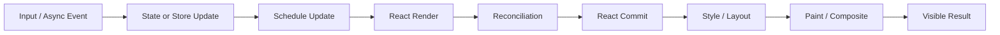
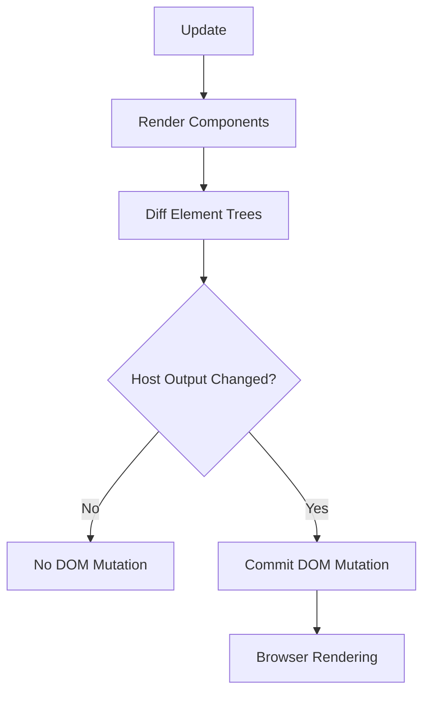
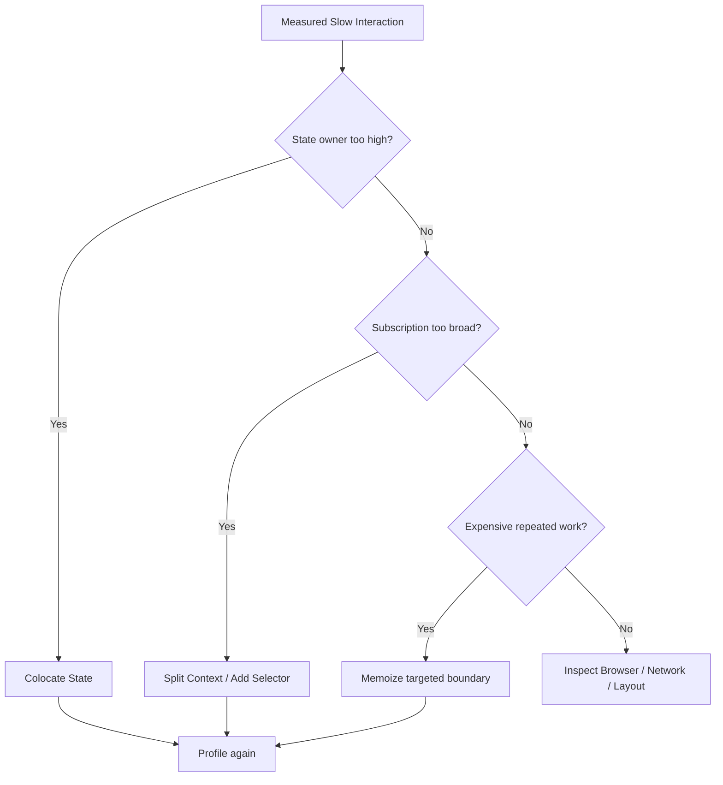
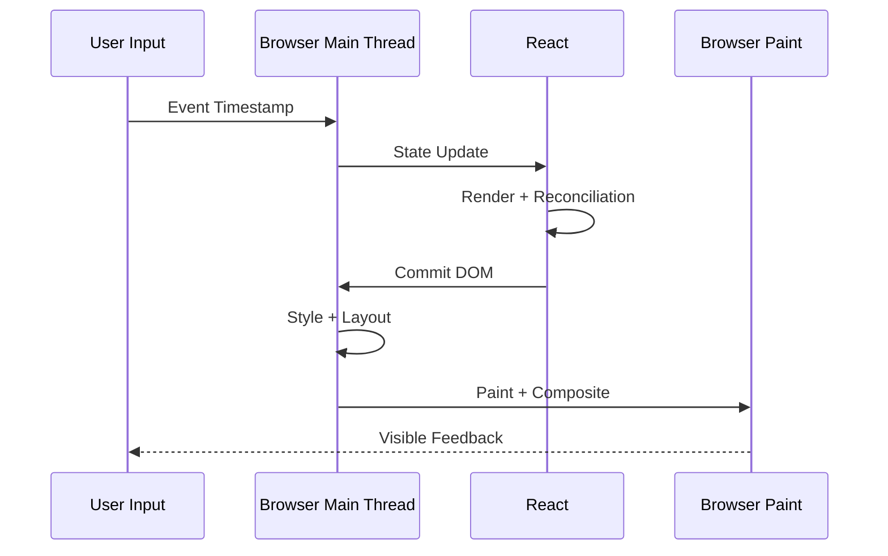

# React 渲染性能：从更新传播、状态边界到 Profiler Flamegraph

> React 渲染性能的核心不是“让组件永不 Render”，而是让每次更新只触及真正依赖该状态的子树，并用 Profiler 证明被跳过的工作确实足够昂贵。

---

## 一、为什么“Render 次数少了”不等于用户更快

在 React 项目中，常见的性能处理方式是：控制台发现组件重复 Render，于是给组件加 `memo`，再给所有函数加 `useCallback`。这种做法可能减少某些 Render，也可能只增加了 Props 比较、缓存和维护成本。

用户看到一次更新，通常要经过以下链路：



React Profiler 主要解释 Render 与 Commit 中的组件工作，但不会完整包含事件排队、网络、Style、Layout、Paint 与像素显示。因此：

- Render 次数减少，不保证 INP 或业务 Journey 改善；
- 组件执行了 Render，不代表 DOM 一定发生 Mutation；
- DOM Mutation 很少，也不代表 Layout 或 Paint 一定便宜；
- 某个组件 Render 很多次，也可能每次都很便宜。

本文以现代 React 函数组件和 React 19.x 公开 API 为背景。Fiber Traversal、Bailout 与 Scheduler 属于可演进的实现细节；React DevTools 面板和 React Compiler 能力也会随版本变化，项目应以锁定版本的官方文档与实际录制结果为准。

### 核心结论

1. 重新 Render 是 React 计算下一个 UI Snapshot 的正常过程，不是自动等于性能缺陷。
2. 组件可因自身 State、父组件 Render、Context 变化或外部 Store Snapshot 变化而更新。
3. State Colocation 通常比广泛 Memoization 更有价值：它直接缩小更新的所有权与传播范围。
4. Component Split 只是创建独立状态、订阅和缓存边界，并不自动阻止父更新向下 Render。
5. `memo`、`useMemo` 和 `useCallback` 是性能优化提示，不能作为正确性、状态持久化或 Effect 依赖的补丁。
6. Stable Props 只在下游使用引用相等性时有价值，例如 `memo` 边界、Effect Dependency 或 Selector Cache。
7. Context Provider 的 Value 变化会通知读取该 Context 的 Consumer；`memo` 不能拦截 Consumer 自己读取的 Context 更新。
8. Selector 的价值在于让 Consumer 订阅最小 Snapshot，但返回新对象、错误 Equality 或遗漏参数依赖都会破坏效果。
9. Expensive Calculation 应先减少输入、调整数据结构或移出热路径，再考虑 `useMemo`、Worker 或预计算。
10. React DevTools Profiler 需结合 Selected Commit、Flamegraph、Why Render、`actualDuration` 与 Browser Trace 建立因果证据。
11. 最终结论应在生产构建或专用 Profiling Build、目标设备和代表性数据上复测。

---

## 二、先理解更新从哪里来

一个函数组件被重新执行，常见原因有四类：

| 更新来源 | 典型场景 | 首先检查 |
|---|---|---|
| 自身 State | Input、Hover、Dialog Open | State 是否过高、是否能下沉 |
| 父组件 Render | 父级 State 或 Props 变化 | 子树是否真依赖更新，是否需要边界 |
| Context Value | Theme、Session、大型业务 Context | Provider 位置、Value Identity、Context 分拆 |
| External Store | Redux/Zustand/自研 Store | Subscription 粒度、Selector、Equality |

父组件 Render 时，React 通常会继续计算它返回的子组件。只有当 React 命中可复用边界，例如 Memoized Component 的 Props 未变、可复用的 Element 或其他 Bailout 条件时，才可能跳过部分工作。不要依赖未公开的 Fiber 字段或遍历细节设计业务正确性。

### 2.1 Render 不等于 Commit



组件 Render 后可能得到与上次等价的宿主输出，此时不一定有 DOM Mutation。但 Render 期间的 JavaScript、列表遍历、格式化与 Element 创建仍然会消耗 CPU。

在 Concurrent Rendering 中，Render 还可能被暂停、放弃或重新执行；只有完成 Commit 的树才成为屏幕上的已提交 UI。因此在 Render 中执行副作用既会破坏正确性，也会让性能记录难以解释。

### 2.2 一次 State Update 不一定形成一次独立 Commit

React 可以对同一事件周期中的多个更新进行 Batching。Batching 减少了部分中间 Commit，但不代表业务计算自动变便宜，也不代表所有子树都会 Bailout。

### 2.3 开发模式日志不是性能证据

Strict Mode 在开发环境中可额外调用组件和部分 Hook 逻辑，用于暴露不纯的 Render 与缺少 Cleanup 的 Effect。`console.log('render')` 的次数因此不能直接当成生产性能指标。

开发模式还可能包含 Source Map、Hot Reload、调试校验、浏览器扩展和额外日志。定位阶段可以用它观察关系，最终耗时结论必须在生产构建或 Profiling Build 中验证。

---

## 三、什么才算 Unnecessary Render

“不必要 Render”是一个工程判断，不是 React 提供的错误类型。它通常同时满足：

1. 目标组件在某个关键交互中被重新执行；
2. 它依赖的业务数据没有变化，屏幕输出等价；
3. 这次工作可通过更合理的状态、订阅或缓存边界避免；
4. 被避免的工作在目标设备和数据规模上足够显著。

第 4 点非常重要。一个只返回两个文本节点的组件，即使重新 Render，也可能比比较十个 Props、维护缓存和增加调试复杂度更便宜。

### 3.1 必要 Render 的例子

- 受控 Input 的 `value` 变化；
- 订单状态从 `pending` 变为 `paid`；
- Consumer 实际读取的 Theme Token 变化；
- Selector 选中的购物车总价变化；
- Error Boundary 切换到错误 UI。

这些更新不应被粗暴的 Custom Comparator 拦截。“不 Render”不能以显示旧数据为代价。

### 3.2 可能不必要的例子

- Dialog 的 Open State 放在整个 Dashboard 顶层；
- 每次 Render 用 Effect 把 Props 复制到 State；
- Context 中的时间戳更新导致只读 Session 的整棵树更新；
- Store Consumer 订阅完整 State，但只显示 `cart.itemCount`；
- Memoized Row 每次都收到新的 Object、Array 或 Function Prop；
- 过滤结果先 Render 一次旧值，再由 Effect `setState` 触发第二次 Render。

---

## 四、State Colocation：先缩小更新所有权

State Colocation 是把状态放到最低、但仍能满足所有消费者的组件边界。它不只是代码组织方式，也直接定义了更新从哪个子树开始。

### 4.1 错误：局部 Dialog 状态放在页面顶层

```tsx
function OrdersPage({ orders }: { orders: Order[] }) {
  const [exportOpen, setExportOpen] = useState(false);

  return (
    <main>
      <OrdersSummary orders={orders} />
      <OrderTable orders={orders} />
      <button onClick={() => setExportOpen(true)}>导出订单</button>
      {exportOpen && (
        <ExportDialog onClose={() => setExportOpen(false)} />
      )}
    </main>
  );
}
```

打开 Dialog 时，`OrdersPage` 的 State 变化，页面返回的 `OrdersSummary` 和 `OrderTable` 也会进入新一轮计算。即使最终 DOM 没变，大表格 Render 仍可能消耗 CPU。

### 4.2 修复：让功能组件拥有自己的短命状态

```tsx
function ExportOrdersButton() {
  const [open, setOpen] = useState(false);

  return (
    <>
      <button onClick={() => setOpen(true)}>导出订单</button>
      {open && <ExportDialog onClose={() => setOpen(false)} />}
    </>
  );
}

function OrdersPage({ orders }: { orders: Order[] }) {
  return (
    <main>
      <OrdersSummary orders={orders} />
      <OrderTable orders={orders} />
      <ExportOrdersButton />
    </main>
  );
}
```

现在 Open State 只会从 `ExportOrdersButton` 这个子树开始更新。这个修复不需要给整个页面添加 Memoization。

### 4.3 下沉的边界是业务一致性

如果 Dialog 的 Open State 必须由 URL 控制，或者页面其他区域需要关闭它，就不能为了减少 Render 而复制一份局部状态。应先确定 Single Source of Truth，再在正确的所有权边界内优化传播。

State Colocation 的判断顺序是：

1. 谁修改它；
2. 谁必须读取它；
3. 这些消费者的最近公共所有者是谁；
4. 状态是否应跟随 Component Identity、Route 或 Session；
5. 下沉后是否会制造多个不一致事实源。

---

## 五、Component Split：按更新频率与依赖分边界

把一个 JSX 片段抽成子组件，不会自动让它变快。如果父组件仍每次创建新 Props，子组件仍会跟随父级 Render。

Component Split 真正提供的是：

- 独立 State 所有权；
- 独立 Context 或 Store Subscription；
- `memo` 可以作用的组件边界；
- Error Boundary 与 Suspense Boundary 的放置点；
- 将高频更新与昂贵低频子树分离的机会。

### 5.1 按变化频率拆分

假设订单页同时有一个每秒更新的连接计时器和一张大表格。如果 Timer State 存在顶层，大表格就可能每秒跟随 Render。更合理的做法是让 `ConnectionAge` 自己订阅时间或连接 Snapshot，而不是让页面根组件持有 Tick。

```tsx
function OrdersPage({ orders }: { orders: Order[] }) {
  return (
    <main>
      <ConnectionAge />
      <OrderTable orders={orders} />
    </main>
  );
}
```

这里的收益来自 Subscription 与 State 边界改变，不是来自文件行数变少。

### 5.2 组合可以保持昂贵子树的 Element Identity

当 Wrapper 只管理局部交互时，可以把不依赖该状态的内容作为 `children` 传入：

```tsx
function ResizablePanel({ children }: PropsWithChildren) {
  const [width, setWidth] = useState(360);

  return (
    <section style={{ width }}>
      <WidthHandle onChange={setWidth} />
      {children}
    </section>
  );
}

function OrdersWorkspace({ orders }: { orders: Order[] }) {
  return (
    <ResizablePanel>
      <OrderTable orders={orders} />
    </ResizablePanel>
  );
}
```

`ResizablePanel` 的局部 State 更新时，`children` 是上层已创建的 React Element。React 可以复用未变的子 Element，避免把 Wrapper 的局部更新传给不相关子树。实际效果仍应通过 Profiler 验证。

### 5.3 不要在 Render 内定义组件类型

```tsx
function OrdersPage() {
  function Toolbar() {
    return <button>导出</button>;
  }

  return <Toolbar />;
}
```

每次 `OrdersPage` Render 都会创建新的 `Toolbar` 函数，React 会把它视为不同 Component Type，可能卸载旧子树并重置其 State。这不是优化边界，而是 Identity 错误。应将组件定义移到模块顶层。

---

## 六、Memoization：在昂贵边界上跳过工作

结构性优化通常应先于缓存：



### 6.1 `memo` 跳过的是组件 Render

```tsx
const OrderRow = memo(function OrderRow({
  order,
  selected,
  onSelect,
}: OrderRowProps) {
  return (
    <button
      className={selected ? 'selected' : undefined}
      onClick={() => onSelect(order.id)}
    >
      {order.number} - {formatCurrency(order.total)}
    </button>
  );
});
```

父组件重新 Render 时，`memo` 默认逐项使用 `Object.is` 比较 Props。Props 未变时，React 可以复用最近的结果。但以下情况仍可以让 `OrderRow` 更新：

- 组件自身 State 变化；
- 组件读取的 Context 变化；
- 所订阅外部 Store Snapshot 变化；
- 任意一个 Prop 的 `Object.is` 比较失败；
- React 因其他正常实现原因重新计算。

`memo` 是优化提示，组件必须在真正重新 Render 时仍然正确。

### 6.2 `useMemo` 缓存计算结果

```tsx
const visibleOrders = useMemo(
  () => filterAndSortOrders(orders, filters, sort),
  [orders, filters, sort],
);
```

它适合已经通过 Profiler 确认昂贵，且依赖在目标交互中经常保持不变的纯计算。如果 `filters` 每次都是新对象，该缓存就会持续 Miss。

### 6.3 `useCallback` 缓存函数引用

```tsx
const handleSelect = useCallback((orderId: string) => {
  setSelectedIds(current => toggleId(current, orderId));
}, []);
```

Updater Function 让 Callback 不必读取当前 `selectedIds`，因此可以减少一个真实依赖。这不是为了凑空依赖数组，而是把“根据旧状态计算新状态”交给 React。

若 Callback 只传给普通、便宜的非 Memoized Child，也不用作 Effect Dependency，稳定引用可能没有实际消费者。

### 6.4 React Compiler 不改变测量要求

React Compiler 可以在其支持和正确配置的代码范围内自动应用部分等价 Memoization。它不会自动修复：

- 过高的 State Owner；
- 过广的 Context 或 Store Subscription；
- 错误的数据结构和算法复杂度；
- 不纯 Render、错误 Effect 或变异数据；
- 网络、Layout、Paint 和第三方脚本瓶颈。

项目应在 CI 中固定 Compiler 版本和配置，并保留性能回归，而不是假设“开启 Compiler 后不再需要 Profiler”。

---

## 七、Stable Props：稳定应该被消费的引用

`memo` 最常见的失效原因是父组件每次创建新对象、数组或函数。

### 7.1 错误：传递每次新建的配置对象

```tsx
<OrderTable
  orders={orders}
  options={{ density: 'compact', currency }}
  onSelect={(id) => setSelectedId(id)}
/>
```

即使 `orders` 和 `currency` 没变，`options` 与 `onSelect` 每次都是新引用。但修复不应机械地给所有值包 Hook，而应先简化 API：

```tsx
<OrderTable
  orders={orders}
  density="compact"
  currency={currency}
  onSelect={handleSelect}
/>
```

原始值 Prop 更容易比较，也更清晰地表达组件真正依赖。若业务上确实需要复合对象，再在拥有其输入的边界用 `useMemo` 创建。

### 7.2 只传子组件需要的数据

```tsx
// 粗粒度：User 任何字段的结构共享失败都会改变 Prop
<Avatar user={user} />

// 更清晰的依赖
<Avatar name={user.name} imageUrl={user.imageUrl} />
```

这不意味着永远把所有对象展平。当对象本身就是稳定 Domain Value，或组件需要它的大部分字段时，传整体可能更合理。选择应考虑 API 可维护性与真实更新频率。

### 7.3 不要为了引用稳定而变异数据

```ts
// 错误：引用没变，React 和 Selector 可能无法发现内容变化
order.status = 'paid';
setOrder(order);
```

正确方向是不可变更新和 Structural Sharing：未变的分支复用引用，变化的分支创建新引用。引用稳定必须与内容语义一致。

### 7.4 Custom Comparator 必须比较所有输出依赖

若 `memo(Component, arePropsEqual)` 忽略 Function Prop，子组件可能长期保留父组件旧 Render 中的闭包。深比较也可能比直接 Render 更贵，并在数据结构变化后变成无界耗时。

只有当 Props 结构有限、比较成本可预测，并且 Profiler 证明收益时，才考虑 Custom Comparator。

---

## 八、Context Update：避免把不同频率的状态绑在一起

Context 解决跨层传递，不自动提供细粒度 Selector。当 Provider 的 `value` 通过 `Object.is` 判定为变化时，读取该 Context 的 Consumer 会获得新值并更新。

### 8.1 错误：高频和低频事实共用一个 Context

```tsx
const AppContext = createContext<AppContextValue | null>(null);

function AppProvider({ children }: PropsWithChildren) {
  const [session, setSession] = useState<Session | null>(null);
  const [notificationCount, setNotificationCount] = useState(0);

  const value = {
    session,
    setSession,
    notificationCount,
    setNotificationCount,
  };

  return <AppContext value={value}>{children}</AppContext>;
}
```

每次 Provider Render 都会创建新 `value`；即使用 `useMemo` 稳定它，`notificationCount` 变化时，只读 `session` 的 Consumer 仍会看到整个 Context Value 变化。

### 8.2 按语义和频率拆分 Context

```tsx
const SessionContext = createContext<Session | null>(null);
const NotificationCountContext = createContext(0);

function AppProvider({ children }: PropsWithChildren) {
  const [session, setSession] = useState<Session | null>(null);
  const [notificationCount, setNotificationCount] = useState(0);

  return (
    <SessionContext value={session}>
      <NotificationCountContext value={notificationCount}>
        {children}
      </NotificationCountContext>
    </SessionContext>
  );
}
```

实际项目还需要提供受控的 Action API，示例只展示读取边界。拆分后，只读 Session 的 Consumer 不再因 Notification Count 变化而接收该 Context 更新。

可以进一步将 State 与 Dispatch Context 分离：Reducer 的 `dispatch` 引用稳定，只需发送 Action 的组件不必读取频繁变化的 State。

### 8.3 Provider 应尽量靠近使用边界

将页面级编辑状态放到应用根 Provider，会延长生命周期、扩大更新范围，还可能在 SSR 中制造跨请求共享风险。Provider 位置应同时匹配数据所有权、生命周期和消费范围。

### 8.4 `memo` 不能屏蔽组件自己读取的 Context

```tsx
const AccountName = memo(function AccountName() {
  const session = useContext(SessionContext);
  return <span>{session?.displayName}</span>;
});
```

`memo` 只比较父组件传入的 Props。`AccountName` 自己读取的 `SessionContext` 变化时，它需要更新以显示新数据。

---

## 九、Selector：让 Consumer 只订阅所需 Snapshot

Selector 是从更大 State Snapshot 中选出 Consumer 所需数据的函数：

```ts
const selectCartItemCount = (state: StoreState) => state.cart.items.length;
```

只有当状态库或订阅协议会根据 Selector Result 的 Equality 决定 Consumer 是否更新时，Selector 才真正缩小 Render 范围。先订阅完整 State，然后在组件内读一个字段，并不等价。

### 9.1 错误：订阅整个 Store

```tsx
function CartBadge() {
  const state = useAppStore();
  return <span>{state.cart.items.length}</span>;
}
```

如果 `useAppStore()` 返回完整 Snapshot，订单、主题或其他无关分支变化也可能让 `CartBadge` 更新。

```tsx
function CartBadge() {
  const itemCount = useAppStore(selectCartItemCount);
  return <span>{itemCount}</span>;
}
```

当选中的 Number 未变时，支持 Selector 的 Store Hook 可以跳过 Consumer 更新。具体比较是 `Object.is`、Strict Equality 还是自定义 Equality，必须查看所用状态库的版本契约。

### 9.2 错误：Selector 每次返回新对象

```tsx
const summary = useAppStore(state => ({
  count: state.cart.items.length,
  total: state.cart.total,
}));
```

如果 Hook 使用引用相等性，这个 Selector 每次都返回新对象，结果就始终不同。可选方案包括：

- 分别订阅 Primitive；
- 使用状态库明确支持的 Shallow Equality；
- 使用按输入版本缓存的 Memoized Selector；
- 在 Store 中维护稳定的不可变 Snapshot。

不要在不知道库的 Equality 契约时猜测优化已经生效。

### 9.3 Parameterized Selector 必须包含参数语义

```tsx
function OrderTotal({ orderId }: { orderId: string }) {
  const total = useAppStore(state => state.orders.byId[orderId]?.total ?? 0);
  return <span>{formatCurrency(total)}</span>;
}
```

`orderId` 变化后必须选中新实体。如果自己实现 Selector Cache，缓存 Key 必须包含参数；多组件共用一个只保留最后一次输入的 Selector 实例，也可能频繁 Miss。

### 9.4 Core Context 不是 Selector Store

React 核心 `useContext` 读取整个 Context Value，不接收 Selector 参数。如果需要高频、细粒度订阅，可以拆分 Context，或选择明确实现 Selector 与并发一致性的状态库。不要只在 Consumer 中对 `useContext()` 结果做一次普通属性读取，就认为已经建立了订阅级 Selector。

---

## 十、Expensive Calculation：避免在每次 Render 重做昂贵工作

Render 必须保持纯净，但纯净不等于便宜。对数万条记录做 Filter、Sort、Group、国际化格式化和权限匹配，仍可能阻塞主线程。

### 10.1 错误：用 Effect 保存同步派生值

```tsx
function OrderSearch({ orders, query }: Props) {
  const [visibleOrders, setVisibleOrders] = useState<Order[]>([]);

  useEffect(() => {
    setVisibleOrders(filterOrders(orders, query));
  }, [orders, query]);

  return <OrderTable orders={visibleOrders} />;
}
```

这会先用旧 `visibleOrders` Render 并 Commit，Effect 执行后再 `setState`，触发第二次 Render。它还制造了 Source State 与 Derived State 的同步边界。

同步可派生数据应直接在 Render 中计算：

```tsx
function OrderSearch({ orders, query }: Props) {
  const visibleOrders = filterOrders(orders, query);
  return <OrderTable orders={visibleOrders} />;
}
```

这保证每个 Render Snapshot 内 Source 与 Derived Value 一致。只有当测量证明 `filterOrders` 昂贵时，再增加 `useMemo`。

### 10.2 优化顺序是算法优先

```text
减少输入规模
  > 避免重复计算
  > 改善数据结构与复杂度
  > 按稳定依赖缓存
  > 分块、延后或移到 Worker
```

例如，每次通过线性扫描查找订单，可能应先建立 `Map<orderId, Order>`；大列表只显示视口内数据，应优先考虑 Virtualization；大量 CPU 计算不必与 DOM 绑定时，才考虑 Web Worker。

### 10.3 `startTransition` 不会减少总计算量

Transition 可以让非紧急更新可中断，帮助受控 Input 等紧急反馈保持响应。但昂贵列表仍需要被计算，被打断的 Render 还可能重做部分工作。

`useDeferredValue` 也不是计算缓存。它可以让昂贵子树暂时继续显示旧值，但最终仍需要 Render 新值。

### 10.4 昂贵初始值使用 Lazy Initializer

```tsx
const [index] = useState(() => buildOrderIndex(initialOrders));
```

如果初始值与 Props 后续变化无关，Lazy Initializer 可避免每次 Render 都调用初始计算。若 `initialOrders` 变化时索引必须更新，就不能用这种写法假装同步，而应定义真实的数据生命周期。

---

## 十一、Profiler Flamegraph：从“哪里慢”到“为什么 Render”

React DevTools Profiler 应围绕一个明确交互录制，例如：

```text
场景：在 5000 条订单页中输入搜索词
起点：键盘输入被浏览器接收
终点：匹配表格完成可见更新
环境：生产构建，中端目标设备，固定数据集
对照：同一设备、同一浏览器、同一缓存状态
```

### 11.1 一次录制的阅读顺序

1. 在 React DevTools Profiler 开始录制；
2. 只执行一次可重复的目标交互；
3. 停止录制，在 Commit Timeline 中选择与交互对应的 Commit；
4. 查看 Flamegraph 中哪些子树花费时间；
5. 查看组件为什么 Render，确认是 Props、State 还是 Context；
6. 用 Ranked 或类似视图检查当次 Commit 中耗时高的组件；
7. 再用 Browser Performance Trace 确认 React 工作在完整 Input-to-Paint 链路中占比。

DevTools 的具体颜色、面板名称和“Why did this render”能力会随版本与设置改变。不应只根据颜色下结论，而应读取 Selected Commit、组件耗时和更新原因。

### 11.2 Flamegraph 展示的是选定 Commit

Flamegraph 用组件树展示当次 Commit 对应的 Render 工作。它可帮助回答：

- 哪些组件在本次更新中 Render；
- 耗时集中在哪个子树；
- 某个大子树是否因上层无关 State 跟随更新；
- Memoization 后目标子树是否真正跳过；
- 收益是减少了工作，还是只把耗时移到比较器或其他组件。

一个很宽或耗时很高的父节点不一定表示父组件自身函数很慢，时间可能来自其整个子树。需要继续向下找到 Self Work 或具体昂贵分支。

### 11.3 `<Profiler>` API 用于程序化测量

```tsx
import { Profiler, type ProfilerOnRenderCallback } from 'react';

const recordRender: ProfilerOnRenderCallback = (
  id,
  phase,
  actualDuration,
  baseDuration,
  startTime,
  commitTime,
) => {
  performance.measure(`react:${id}:${phase}`, {
    start: startTime,
    end: commitTime,
    detail: { actualDuration, baseDuration },
  });
};

function OrdersRoute() {
  return (
    <Profiler id="orders-route" onRender={recordRender}>
      <OrdersPage />
    </Profiler>
  );
}
```

关键字段的稳定语义是：

| 字段 | 用途 | 边界 |
|---|---|---|
| `id` | 区分 Profiler 边界 | 应是稳定、低基数名称 |
| `phase` | 区分 Mount/Update 等阶段 | 具体可选值按 React 版本确认 |
| `actualDuration` | 当次更新实际花在该子树 Render 的时间 | 不包含完整浏览器 Paint 链路 |
| `baseDuration` | 估计没有利用近期 Memoization 时整个子树的 Render 成本 | 是估计值，不是用户耗时 |
| `startTime` | React 开始该次 Render 工作的时间 | 不等于原始 Input Timestamp |
| `commitTime` | React 提交该更新的时间 | 多个 Profiler 可共享同一 Commit Time |

`<Profiler>` 本身增加测量开销，标准生产构建中的 Profiling 能力通常被禁用。需要线上程序化分析时，应按项目锁定 React 版本的官方指南使用专用 Profiling Build，并评估采样、Payload 和隐私。上述 User Timing 示例适合受控录制；持续采集时还必须消费并清理已处理的 Performance Entry，避免无界保留。

### 11.4 Profiler 与 Browser Trace 要对齐同一交互



如果 React `actualDuration` 只有 4 ms，但交互到下一次 Paint 需要 300 ms，根因可能是前序 Long Task、第三方脚本、Layout 或 Paint，而不是 React Render。反之，若 Trace 中大量主线程时间与某个 Profiler 子树重合，才有足够证据继续优化该边界。

---

## 十二、订单搜索案例：如何逐步缩小 Render 范围

假设一个订单页有 5000 条本地记录，用户输入搜索词时明显卡顿。初始代码如下：

```tsx
function OrdersPage({ orders }: { orders: Order[] }) {
  const [query, setQuery] = useState('');
  const [clock, setClock] = useState(() => new Date());

  useEffect(() => {
    const timer = window.setInterval(() => setClock(new Date()), 1000);
    return () => window.clearInterval(timer);
  }, []);

  const visibleOrders = filterAndSortOrders(orders, query);

  return (
    <main>
      <time>{clock.toLocaleTimeString()}</time>
      <input value={query} onChange={event => setQuery(event.target.value)} />
      <OrderTable orders={visibleOrders} />
    </main>
  );
}
```

这段代码有两条更新链：

- Query 变化时需要重新计算过滤结果；
- Clock 每秒变化时，即使 Query 没变，也会重做过滤和表格 Render。

### 12.1 第一步：建立基线

在固定设备和数据集上录制：

- 输入一个字符对应的 Input-to-Paint 耗时；
- React Commit 数量与 `OrdersPage` / `OrderTable` 的 `actualDuration`；
- Clock Tick 时 `filterAndSortOrders` 的调用次数与耗时；
- Browser Trace 中 Layout、Paint 和 Long Task。

不先记录基线，就无法区分改动收益与录制噪声。

### 12.2 第二步：下沉 Clock State

```tsx
function LiveClock() {
  const [clock, setClock] = useState(() => new Date());

  useEffect(() => {
    const timer = window.setInterval(() => setClock(new Date()), 1000);
    return () => window.clearInterval(timer);
  }, []);

  return <time>{clock.toLocaleTimeString()}</time>;
}
```

`OrdersPage` 不再持有 Clock Tick，每秒更新只发生在 `LiveClock` 子树。这一步应让 Clock Tick Commit 中不再出现 `OrderTable`。

### 12.3 第三步：测量过滤与列表的独立成本

如果 Query 变化时 `filterAndSortOrders` 本身昂贵，先检查：

- 是否在每个 Row 中重复创建 Formatter 或 RegExp；
- 是否能对可搜索文本做一次预处理；
- 是否应由服务端分页与查询，而非把全量数据发到客户端；
- 是否需要对稳定 `orders + query + sort` 组合缓存；
- 用户是否只会看到视口内少量 Row。

如果主要成本来自数千 Row Render，则需要后续的 Virtualization 专项，而不是继续堆叠 `useMemo`。

### 12.4 第四步：只对经证明的 Row 边界 Memoize

如果切换单个选中状态会让所有 Row Render，可以让 Row 接收稳定订单引用、Primitive `selected` 和稳定 `onSelect`，再对 `OrderRow` 使用 `memo`。

复测时应看到：

- 只有旧选中 Row 和新选中 Row 更新；
- 目标 Commit 的 `actualDuration` 下降；
- Props Comparator 成本未取代原有瓶颈；
- 选中状态、键盘操作和 Accessibility 仍然正确；
- Browser Trace 中的交互延迟确实改善。

### 12.5 第五步：只接受单变量可归因结果

不要同时修改 State Owner、增加 `memo`、更换列表库并调整 API。每一步都应有独立基线、Trace 和复测，否则无法知道哪个变化带来了收益，也无法在复杂度上升时删除无效优化。

---

## 十三、常见误区与错误案例

### 13.1 所有重新 Render 都是 Bug

错误。Render 是 React 计算 UI 的正常方式。只有当工作可避免、成本显著，并影响目标交互时，才构成需要治理的 Unnecessary Render。

### 13.2 给所有组件添加 `memo`

`memo` 需要比较 Props，并增加边界和调试成本。对便宜组件或总是收到新 Props 的组件，可能只有成本，没有 Cache Hit。

### 13.3 Inline Function 一定很慢

创建普通函数通常不是首要瓶颈。它只在引用稳定性被 `memo`、Effect 或缓存消费时可能破坏优化。应根据下游契约决定是否使用 `useCallback`。

### 13.4 Component Split 越细越快

拆分会增加组件边界、Props 传递和认知负担。应按状态所有权、更新频率、订阅与复用边界拆分，不是每个 `<div>` 一个组件。

### 13.5 Context Value 用 `useMemo` 后就没有广播

`useMemo` 只避免依赖未变时创建新 Value。当任意依赖真正变化时，读取整个 Context 的 Consumer 仍需要更新。过广 Context 需要分拆语义或改用 Selector Store。

### 13.6 Selector 只要写了就会优化

错误。需要确认 Store Hook 是否按 Selector Result 比较、Equality 是什么、Result 引用是否稳定，以及 Parameterized Selector 的 Cache Key 是否正确。

### 13.7 深比较一定比 Render 便宜

深比较需遍历数据，还容易忽略 Function Closure 语义。对大数组或无界嵌套对象，Comparator 本身就可能成为 Long Task。

### 13.8 用 `useEffect` 派生同步 UI 能减少 Render

恰好相反：Effect 后 `setState` 往往会追加一次 Render/Commit，还可能短暂显示旧派生值。可同步计算的数据应在 Render 中派生，昂贵时再测量缓存。

### 13.9 使用 Index Key 可以减少更新

Key 定义 Sibling 中的 Identity，不是通用性能开关。在可插入、删除或排序的列表中使用 Index Key，可能让 State 跟错数据、增加 DOM 变更并产生正确性问题。

### 13.10 只看 Profiler 颜色就能定根因

颜色只是当前工具对相对工作的可视化。根因需要 Selected Commit、更新原因、数据流、Browser Trace 和单变量实验联合证明。

---

## 十四、工程中的方案选择

| 观测到的问题 | 优先方案 | 不应直接做的事 |
|---|---|---|
| 局部 State 让整页更新 | State Colocation | 给全页子组件加 `memo` |
| 高频子树与大表格绑定 | 按频率 Component Split | 随意深比较 Props |
| Memoized Child 总是 Render | 查看变化 Prop，简化 API | 给所有表达式加 `useMemo` |
| Context 更新扩散 | 拆分 Context / 下移 Provider | 指望 `memo` 拦截 Context |
| Store 无关更新导致 Render | 缩小 Selector Snapshot | 在 Consumer 内读整个 Store |
| Selector 结果总变 | Primitive、Memoized Selector 或明确 Equality | 未测量就深比较 |
| Render 中算法昂贵 | 改算法/数据结构，再缓存 | 用 Effect 镜像派生 State |
| React 耗时很低但交互慢 | Browser Trace 查排队、Layout、Paint | 继续堆叠 Memoization |
| 列表持续渲染数千节点 | Virtualization / Pagination | 只优化单 Row 函数 |

### 14.1 优化优先级

通常可以按以下顺序调查：

1. 确认用户问题与完整 Input-to-Paint 链路；
2. 用 Profiler 确认 React 是否为主要成本；
3. 查看 State Owner 和 Subscription 是否过高、过广；
4. 用 Component Split 建立正确更新边界；
5. 用 Selector 缩小外部数据 Snapshot；
6. 对昂贵且重复的边界使用 Memoization；
7. 复测 React Duration、Browser Trace 和用户指标；
8. 记录收益、代价和回归预算。

---

## 十五、测试与验证方法

### 15.1 正确性测试优先

渲染优化最容易引入 Stale UI 和 Identity 错误。应测试：

- Custom Comparator 不会忽略改变输出的 Prop；
- Callback 不会因错误依赖读取旧 State/Props；
- Context 拆分后 Provider 组合与缺省值正确；
- Selector 在 Entity ID 切换后返回新实体；
- Structural Sharing 不会因变异数据跳过必要更新；
- 列表 Key 在插入、删除与排序后仍保持正确 Identity。

不要让大量单元测试精确断言“组件必须 Render 1 次”。React 的 Batching、Strict Mode 与并发实现可演进，过度绑定次数会把测试变成内部实现锁。优先断言用户可见结果和关键订阅边界。

### 15.2 Profiler 自动化不应使用单次绝对时间

可以在固定数据集上用 `<Profiler>` 采集多次 `actualDuration`，但 CI 机器负载、JIT、GC 和后台进程会带来噪声。更稳妥的做法是：

- 固定 React、Browser、OS 与数据集版本；
- Warm-up 后重复多次；
- 使用 Median 或分位数而非单次值；
- 将大幅结构回归设为硬门禁，小幅耗时波动用趋势观察；
- 保留运行产物和 Trace 便于排查。

### 15.3 目标设备复测

桌面开发机上 2 ms 的 Render，在低端移动设备、CPU 降频、内存压力或后台任务下可能明显更慢。最终应使用代表性设备和真实数据规模验证，并回到 Field INP、Route 业务指标和长尾分群观察收益。

### 15.4 优化后的护栏

- 功能和 Accessibility 测试通过；
- Error Rate 与 Hydration Error 不恶化；
- Memory 不因大型 Memo Cache 持续上升；
- 首次 Render 不因建立缓存或索引变慢；
- 缓存失效和数据正确性可以验证；
- 代码复杂度与性能收益成比例。

---

## 十六、渲染性能检查清单

### 更新来源

- 当前交互由哪个 State、Context 或 Store Update 触发；
- State Owner 是否高于最低必要公共边界；
- 高频更新是否与昂贵低频子树耦合；
- 是否用 Effect 制造了可同步派生的第二次 Render。

### 边界与订阅

- Component Split 是否改变了 State/Subscription 边界；
- Context 是否混合不同语义和更新频率；
- Provider 是否靠近实际消费者；
- Store Consumer 是否只订阅所需 Snapshot；
- Selector Result 与 Equality 契约是否稳定。

### Memoization

- Profiler 是否证明目标组件或计算足够昂贵；
- 依赖或 Props 在关键交互中是否有足够 Cache Hit；
- Stable Props 是否有真正的下游消费者；
- Custom Comparator 是否比较所有输出依赖；
- 缓存内存、闭包保留和维护成本是否可接受。

### 证据

- 是否录制了可重复的基线交互；
- 是否选中正确 Commit 并查看更新原因；
- 是否用 Browser Trace 确认 React 是主要瓶颈；
- 是否每次只修改一个主要变量；
- 是否在目标设备、生产构建和真实数据上复测；
- 线上 Field Metric 与业务护栏是否同时改善。

---

## 十七、总结

React 渲染性能可以归纳为三个问题：谁触发更新、更新传到哪里、传播路径上做了多少工作。

1. 先区分 React Render、Commit 与 Browser Rendering，不用 Render Count 代替用户指标。
2. Unnecessary Render 需要同时满足输出等价、工作可避免且成本显著。
3. State Colocation 直接缩小更新起点，但不能破坏 Single Source of Truth。
4. Component Split 要按状态、订阅与更新频率创建边界，而不是机械拆 JSX。
5. Memoization 只应放在已测量的昂贵边界，并确保依赖有足够命中率。
6. Stable Props 的价值来自下游的引用相等契约，不是目标本身。
7. Context 应按语义、更新频率和生命周期分拆；高频细粒度数据应考虑 Selector Store。
8. Selector 必须同时正确处理 Snapshot、Equality、引用稳定和参数。
9. Expensive Calculation 先优化数据规模、数据结构和算法，再决定缓存、延后或 Worker。
10. Profiler Flamegraph 必须结合更新原因、Browser Trace 和单变量复测，才能形成可验证结论。

最好的渲染优化往往不是再加一层缓存，而是让状态、订阅和组件所有权重新对齐。当结构边界已经正确，Memoization 才是可控的局部成本交换。

---

## 问答复盘

### Q1：组件重新 Render，是否代表 DOM 一定更新？

**答：** 不代表。Render 先计算新 React Element，Reconciliation 再判断宿主输出是否变化；只有必要的宿主变更才在 Commit 阶段应用到 DOM。

### Q2：如何判断一次 Render 是否值得优化？

**答：** 要同时证明该 Render 在关键交互中发生、输出等价、工作可避免，且 Profiler/Trace 显示成本显著。只看 Render Count 不足以下结论。

### Q3：State Colocation 为什么常比给子树加 `memo` 更有效？

**答：** 它直接改变更新起点，让无关父级和兄弟子树不进入该更新。`memo` 则需要在传播过程中比较 Props，还可因新引用而持续 Miss。

### Q4：把 JSX 抽成子组件，是否会自动减少 Render？

**答：** 不会。Component Split 只是创建可用的 State、Subscription 和 Memoization 边界。若父每次 Render 且子组件没有复用条件，它仍会跟随计算。

### Q5：一个经过 `memo` 包裹的组件为什么仍然更新？

**答：** 可能是某个 Prop 引用变化，也可能是组件自身 State、所读 Context 或外部 Store Snapshot 变化。`memo` 不是禁止更新的契约。

### Q6：Context Provider 的 Value 已经使用 `useMemo`，为什么 Consumer 还是频繁 Render？

**答：** `useMemo` 只在依赖未变时复用 Value。若 Context 混合了高频和低频状态，任意依赖变化都会让整个 Value 变化；应拆分 Context 或缩小 Provider 范围。

### Q7：Selector 返回 `{ count, total }` 为什么可能失效？

**答：** 对象字面量每次都是新引用。如果 Store Hook 使用引用相等性，Consumer 就会被判定为结果变化。应分别选 Primitive，或使用库明确支持的 Equality/Memoized Selector。

### Q8：订单过滤可以同步计算，是否应先用 Effect 存入 State？

**答：** 不应。这会制造一次旧值 Commit 和后续 `setState` Render，还引入同步问题。应先在 Render 中派生，测量后再决定是否 `useMemo`。

### Q9：Profiler 显示 React Render 只用了 5 ms，但点击后 300 ms 才有反馈，应继续优化 React 吗？

**答：** 不应直接继续。需要用 Browser Performance Trace 检查 Input Delay、前序 Long Task、业务 Handler、Layout 和 Paint。React Duration 很低时，瓶颈很可能在其他阶段。

### Q10：如何证明一次 `memo` 优化值得保留？

**答：** 在同一构建、设备、数据集和交互上进行前后对照，证明目标子树出现高频 Cache Hit、`actualDuration` 和 Input-to-Paint 改善，同时正确性、内存与维护成本可接受。

---

## 延伸知识

- 列表与大数据：Virtualization、Windowing、Overscan 与 Dynamic Height；
- 资源与网络：Code Splitting、Bundle Analysis、Image Optimization 与 Third-party Script；
- React Compiler：编译期 Memoization、支持范围与迁移验证；
- 并发 UI：Transition、Deferred Value、Suspense 与 Interruptible Rendering；
- 浏览器渲染：Style、Layout、Paint、Composite 与 Long Animation Frame；
- 外部 Store：`useSyncExternalStore`、Snapshot Stability、Selector 与 Tearing；
- Web Vitals：INP Attribution、Long Task 与真实用户长尾验证。
