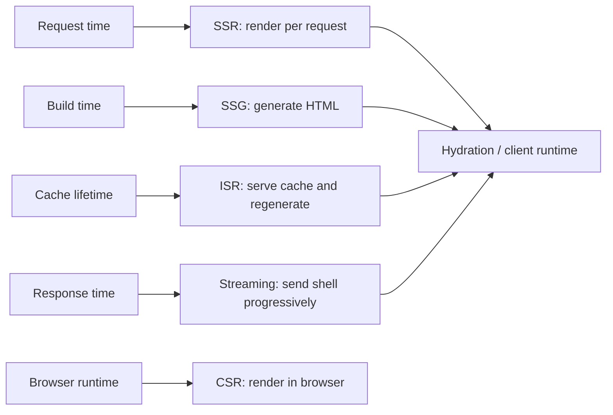
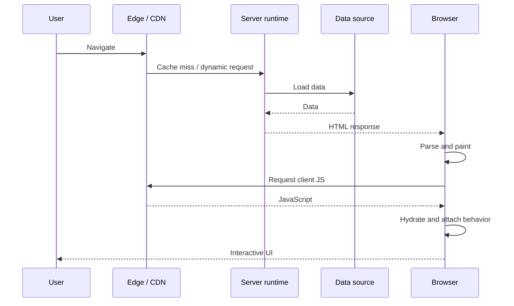
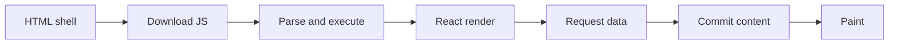
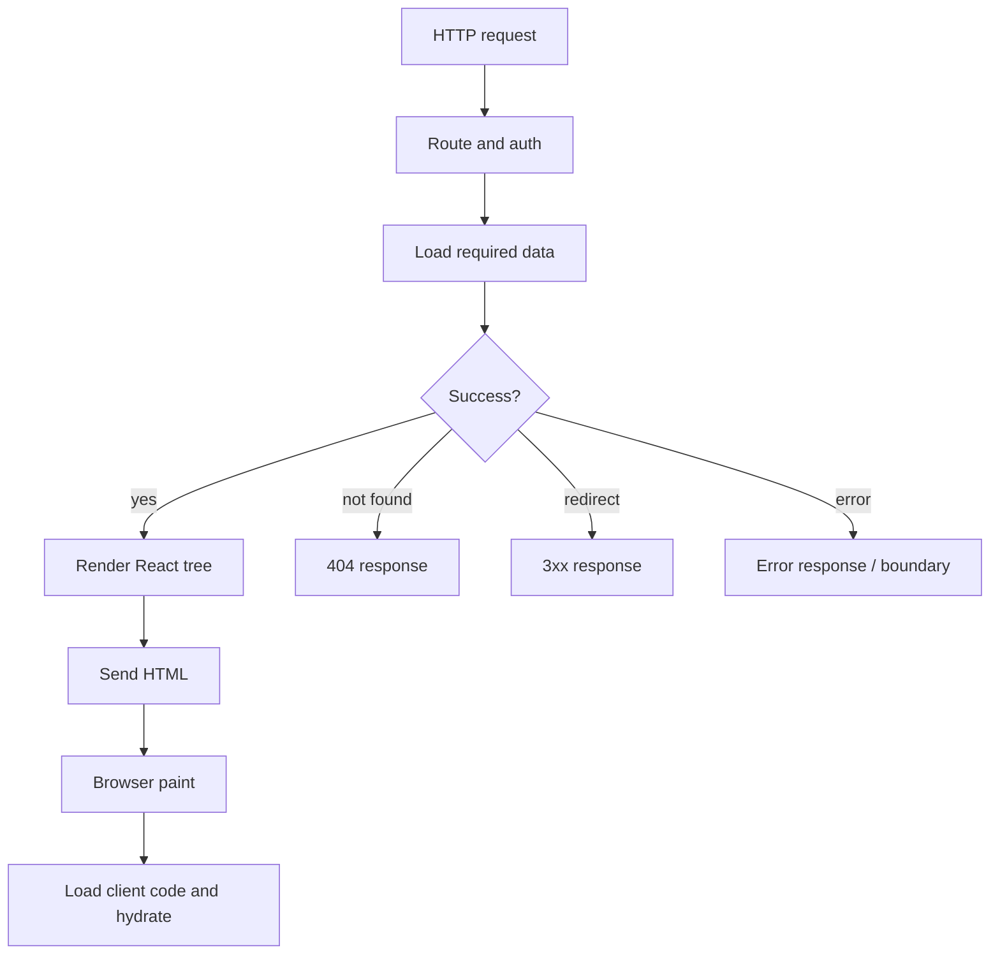
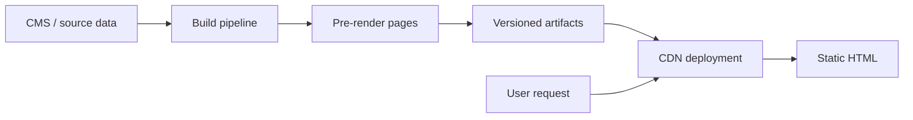
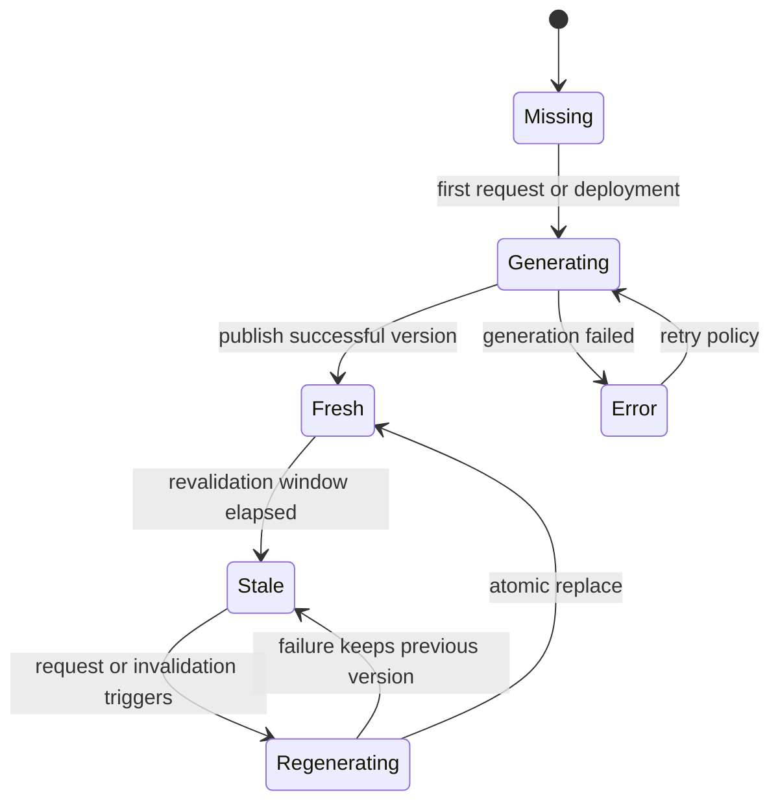
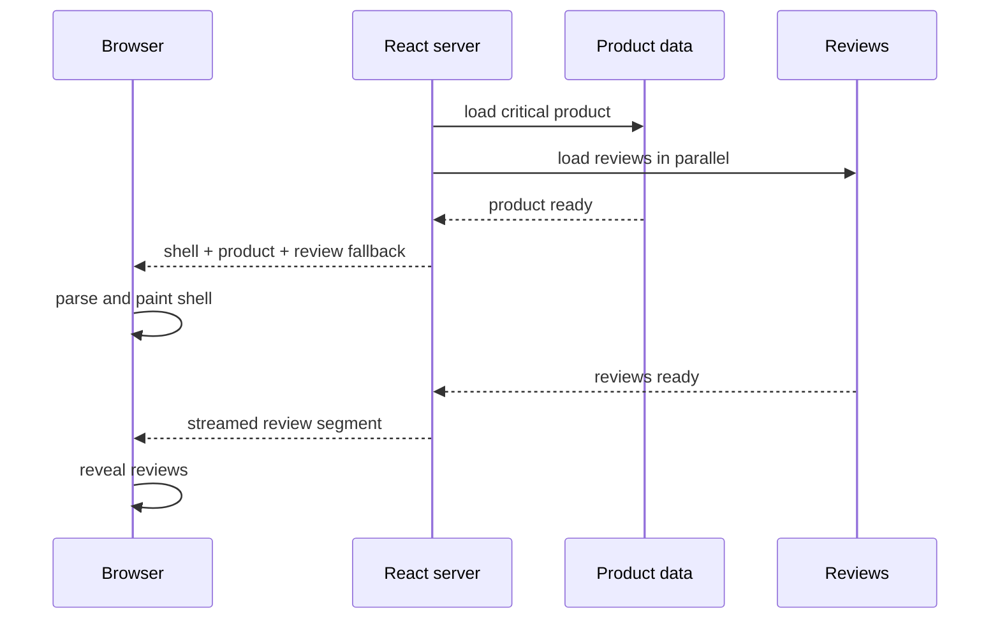
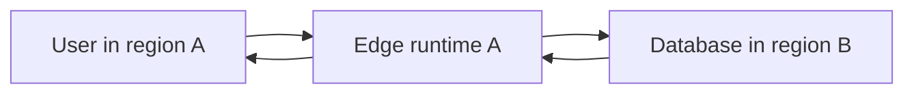
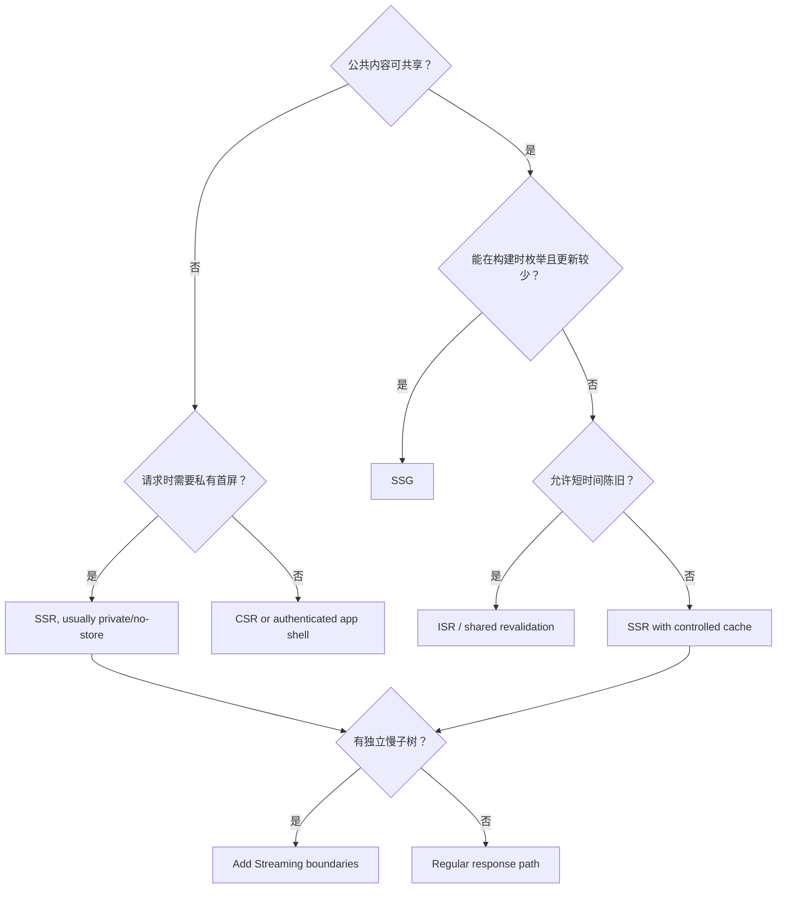
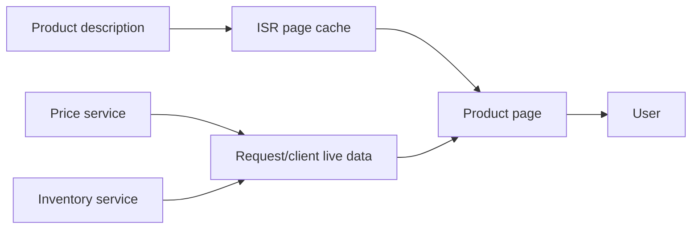

# React 渲染策略：CSR、SSR、SSG、ISR、Streaming SSR 与 Edge Runtime

> 渲染策略决定的不是“React 在哪里运行”这一件事，而是 HTML 在何时、何地、基于哪份数据生成，如何缓存与失效，以及浏览器为了获得可交互页面还要继续支付多少网络和主线程成本。

---

## 一、为什么不能用“SSR 一定更快”做技术选型

一个 React 页面从请求到可交互，可能经历以下工作：

1. 路由匹配与鉴权；
2. 获取页面数据；
3. 生成或读取 HTML；
4. 经过 CDN、平台缓存和网络传输；
5. 浏览器解析 HTML、CSS 和资源提示；
6. 下载 JavaScript；
7. Hydration 或客户端首次 Render；
8. 完成交互、后续导航和数据更新。

不同渲染策略只是把这些工作放在不同时间和位置：



图中策略并不互斥。一个电商站点可以让营销页使用 SSG、商品详情使用 ISR、购物车使用 SSR、账户后台使用 CSR，并在需要服务端输出的页面上启用 Streaming SSR。

因此，选型不能只问“是否 SEO”或“是否首屏快”，还必须回答：

- 内容允许多旧；
- 页面是否包含用户私有数据；
- 首屏是否必须依赖慢数据源；
- HTML 是否可共享缓存；
- 页面交互需要多少 Client JavaScript；
- 数据库、服务端 Runtime 和用户分别位于哪里；
- 构建规模、发布频率和回滚协议是什么；
- 团队能否承担服务器、缓存、失效和可观测性复杂度。

本文以 React 19 的公开服务端渲染能力和现代全栈 React Framework 为背景。SSR 是 React 能力；路由级 SSG、ISR、CDN Cache、Edge Runtime 和部署失效协议通常由 Framework 与 Hosting Platform 实现，具体语义必须以项目锁定版本的官方文档为准。

### 核心结论

1. CSR、SSR、SSG 和 ISR 的核心差异是 HTML 的生成时机、数据新鲜度和缓存共享边界，不是组件写法表面的差异。
2. SSR 可更早输出内容，但仍可能需要下载和执行 Client JavaScript；Server HTML 不等于页面已经可交互。
3. SSG 把请求时计算转移到构建时，适合可枚举、可缓存且更新频率可控的公共内容，但会增加构建和发布成本。
4. ISR 是 Framework/Platform 的增量静态再生成协议，不是 React API；必须定义 Stale Window、并发再生成、失败保留和失效行为。
5. Streaming SSR 通过 Suspense Boundary 逐步发送 HTML，可减少慢子树对 Shell 的阻塞，但不会自动减少总数据请求、JavaScript 或服务端工作。
6. Edge Runtime 可能降低用户到计算节点的 RTT，但若数据库仍在单一区域，跨区域数据访问反而可能增加延迟。
7. 页面级二选一通常过于粗糙，生产系统应按 Route、Layout、数据和组件边界组合策略。
8. 私有响应不能因为使用 SSR 就进入共享缓存；Cache Key、Cookie、Authorization 和 `Vary` 是安全边界。
9. 选择策略前应先定义 Freshness、Personalization、Traffic、Runtime Compatibility、Cost 和 Failure Model。
10. 性能结论必须同时测量 TTFB、FCP/LCP、Hydration/INP、资源成本和后续导航，不能只比较 HTML 是否更早出现。

---

## 二、建立统一模型：页面到底在什么时候变成什么

“页面已渲染”可能指完全不同的里程碑：

| 里程碑 | 含义 | 不代表什么 |
|---|---|---|
| HTML Generated | 服务端或构建系统已生成 HTML | 用户已经收到 |
| First Byte | 浏览器收到响应首字节 | 主内容已经可见 |
| Content Painted | 浏览器显示部分或主要内容 | 事件处理已可用 |
| Hydrated | React 已将 Client Logic 绑定到既有 DOM | 所有异步能力都完成 |
| App Interactive | 目标交互能及时、正确响应 | 后续数据一定新鲜 |

对一个典型服务端输出页面，可用以下时间线理解：



SSR 主要改变 HTML 与数据获取所在的位置。若 Client Bundle 很大、主线程繁忙或 Hydration 存在大量工作，用户仍可能先看到按钮，却不能及时完成点击。

### 2.1 四个必须先定义的输入

渲染策略至少由四类约束共同决定：

#### 内容新鲜度

- 必须读取请求时最新数据；
- 允许几十秒或几分钟旧数据；
- 仅在发布内容时变化；
- 数据更新后必须主动失效。

#### 个性化与权限

- 所有用户共享同一内容；
- 只按 Locale、地区或实验分组；
- 每个用户不同；
- 内容包含权限、订单、支付等敏感状态。

#### 流量与成本

- 请求是否突发；
- 服务端 Render CPU 是否昂贵；
- 数据源能否承受回源；
- 构建页面数量是否会爆炸；
- CDN 是否能有效共享缓存。

#### 交互与 JavaScript

- 页面是内容阅读还是高频应用；
- 首屏有多少 Client Component；
- 是否必须在首屏 Hydrate；
- 后续导航是否由客户端接管；
- 是否有大型编辑器、图表或第三方 SDK。

### 2.2 “静态”和“动态”不是页面的永久身份

同一路由可能同时包含：

- 可长期缓存的文章正文；
- 请求时生成的库存与价格；
- 浏览器中读取的购物车状态；
- 用户交互后才加载的评论编辑器。

成熟 Framework 会允许在不同数据、布局或组件边界上组合缓存与执行位置。不要因为页面中有一个动态角标，就把整页所有公共内容都变成不可缓存的按请求渲染；也不要为了静态化，把权限相关数据嵌进共享 HTML。

---

## 三、CSR：在浏览器中构建主要 UI

Client-side Rendering（CSR，客户端渲染）通常先返回一个较小 HTML Shell，再由浏览器下载 JavaScript、请求数据并创建主要 DOM：

```html
<div id="root"></div>
<script type="module" src="/assets/app.js"></script>
```

```tsx
import { createRoot } from 'react-dom/client';

createRoot(document.getElementById('root')!).render(<App />);
```

### 3.1 CSR 的执行链



如果数据请求只能在组件执行后才开始，就容易形成 `HTML -> JS -> Data -> UI` 串行链。Router Loader、资源预加载、服务端 API 聚合或 Query Prefetch 可以缩短链路，但不会改变主要 UI 在浏览器创建这一事实。

### 3.2 CSR 的优势

- 部署模型简单，可将静态文件放到 CDN；
- 服务端不承担每次请求的 React Render CPU；
- 登录后应用、内部工具和高交互工作台通常可接受 App Shell；
- 浏览器拥有完整交互状态，后续 Soft Navigation 自然；
- 可与独立 API、微前端或现有静态 Hosting 集成。

### 3.3 CSR 的代价

- 首次主要内容可能等待 JavaScript 和数据 Waterfall；
- 低端设备需承担 Parse、Execute 与首次 Render；
- 禁用或加载失败的 JavaScript 会让主要内容不可用；
- 链接预览、部分爬虫、内容抓取和可访问性工具的执行能力并不一致；
- Loading、Error、Retry、Auth Refresh 和导航竞态必须在客户端治理；
- 大型 App Shell 即使有 CDN，也不能消除主线程执行成本。

> 搜索引擎能执行 JavaScript，不等于所有爬虫、分享机器人和索引场景都会及时、完整执行应用。内容发现能力必须用目标平台实际验证，不能用“CSR 一定不能 SEO”或“爬虫都能运行 JS”这类绝对结论代替测试。

### 3.4 适用场景

CSR 常适合：

- 强登录态的管理后台；
- 内容不需要被公开抓取的内部系统；
- 首次加载后长时间使用的高交互应用；
- 离线优先或强 Service Worker 场景；
- 服务端渲染基础设施成本暂不可接受的产品。

但“后台系统”也可能有极慢首屏和低端设备用户，仍需做 Route Splitting、数据并行、缓存和性能预算，不能把 CSR 当作无需治理的默认选项。

---

## 四、SSR：在每个请求中生成 HTML

Server-side Rendering（SSR，服务端渲染）在请求到达时，根据路由、数据和请求上下文生成 HTML。React 提供服务端 Render API，但路由、数据加载、Header、缓存和部署通常由 Framework 管理。

### 4.1 SSR 解决了什么

- 浏览器可在业务 JavaScript 完成前解析有意义 HTML；
- 服务端可直接访问内部数据服务和凭据；
- HTML 可包含正确标题、Metadata 和结构化内容；
- 可根据请求的 Locale、租户或鉴权上下文生成内容；
- 资源 URL 可在 HTML 中更早被浏览器发现。

SSR 没有自动解决：

- 过大的 Client Bundle；
- 昂贵 Hydration；
- 客户端导航 Waterfall；
- 慢数据库与串行请求；
- 错误的 CDN Cache Key；
- 浏览器端第三方脚本和 Long Task。

### 4.2 请求时数据流



状态码和重定向应尽量在 Response Header 尚未发送前决定。Streaming 开始后再发生错误，通常已无法把已发送的 `200` 改成 `500`，只能在流内展示错误边界或终止连接。

### 4.3 SSR 的主要成本

#### TTFB 受服务端关键路径影响

同步等待多个数据源后才开始发送 HTML，会让 Time to First Byte（TTFB）包含路由、鉴权、数据和 Render 全部耗时。应并行无依赖请求，设置超时，并为非关键数据使用 Boundary 或降级。

#### 每个请求消耗计算资源

无法共享缓存的 SSR 请求会持续消耗 CPU、内存和数据源连接。流量突发、慢依赖和重试可能形成放大效应，需要限流、隔离、缓存、负载测试和容量规划。

#### 服务端与浏览器环境不同

Render 期间不能无条件访问 `window`、`document`、`localStorage`。时间、随机数、Locale 和设备判断还可能让 Server HTML 与 Client 首次结果不一致，具体 Hydration 治理将在下一模块展开。

#### 安全边界变宽

服务端可以读取 Secret，不代表它可以把 Secret 或完整内部对象序列化到 HTML。只向客户端发送展示与交互真正需要的数据，并对用户输入、日志和错误输出做脱敏。

### 4.4 SSR 缓存不是一个布尔开关

公共 SSR 页面可以在 CDN 或应用层缓存，但必须定义：

- Cache Key 是否包含真正影响响应的 Locale、设备或实验维度；
- Cookie 与 Authorization 是否导致响应私有；
- TTL、Revalidation 和 Purge；
- 用户数据是否可能进入共享对象；
- Error Response 是否缓存；
- Cache Miss 时如何防止回源风暴。

对用户订单、账户权限等私有响应，默认不应进入共享 CDN Cache。`Vary: Cookie` 可能造成近乎每用户一个缓存变体，也不自动证明这种缓存是安全或有价值的。

### 4.5 React Server API 与 Framework 职责

React 19 的 `react-dom/server` 同时保留字符串与流式 Render API：

- `renderToString` 同步返回 HTML 字符串，不支持 Streaming；组件 Suspend 时会立即输出最近 Suspense Fallback，而不是等待内容准备完成；
- `renderToStaticMarkup` 用于不可 Hydrate 的静态 HTML，例如邮件模板，不能作为交互应用的 Hydration 输入；
- `renderToPipeableStream` 面向 Node.js Stream；
- `renderToReadableStream` 面向 Web Streams 环境。

生产 Framework 通常还负责 Route Data、Document、Asset Manifest、Metadata、状态码、Redirect、CSP、Bot、Cache 和 Hydration Bootstrap。直接调用底层 API 不代表这些工程职责自动存在。

---

## 五、SSG：在构建阶段生成静态页面

Static Site Generation（SSG，静态站点生成）在 Build 或内容发布阶段生成 HTML，运行时通常直接由对象存储或 CDN 返回文件。

### 5.1 SSG 的数据流



构建产物应是不可变、可回滚的版本集合。不要在部署过程中逐个覆盖线上目录，让用户在 HTML、Manifest 和 Chunk 之间读到混合版本。

### 5.2 SSG 的优势

- 请求路径短，静态文件易被全球 CDN 缓存；
- 不需要为每次访问执行 React Server Render；
- Origin 压力和运行时故障面较小；
- 页面版本可审计、可回滚；
- 适合文档、博客、营销页和稳定目录页。

### 5.3 SSG 的代价

- 数据新鲜度受构建与发布频率限制；
- 页面数量乘以 Locale、Tenant、Variant 后可能造成构建爆炸；
- 一条公共布局修改可能要求重建大量页面；
- 构建时依赖 CMS/API，源站抖动可能导致发布失败；
- 用户私有内容仍需在请求时或客户端加载；
- 静态 HTML 仍可能携带大量 Client JavaScript 并产生 Hydration 成本。

### 5.4 不要枚举无限参数空间

如果商品、筛选组合或用户空间无法有限枚举，不应强行在 Build 中生成所有 URL。常见组合策略是：

- 预生成高流量路径；
- 长尾路径使用 SSR 或按需生成；
- 搜索与筛选使用 URL State + Server/API Query；
- 用户私有区域保持动态；
- 删除页面时同步处理 404、Redirect 和 Sitemap。

构建优化必须同时观察总构建时间、单页生成时间、Artifact 数量、上传时间、缓存命中和失败重试，不能只优化某个模板的 React Render 时间。

---

## 六、ISR：在静态缓存之上增量再生成

Incremental Static Regeneration（ISR，增量静态再生成）通常表示：页面先以静态产物或缓存对象提供，超过新鲜期或收到失效信号后，由 Framework/Platform 重新生成并原子替换。

> ISR 不是 React 核心 API。不同 Framework 对“首次访问生成”“后台再验证”“阻塞再生成”“按 Tag 失效”和区域一致性的定义可能不同，必须查阅当前版本文档和部署平台行为。

### 6.1 典型生命周期



图中的“失败保留旧版本”是一种常见且有价值的产品策略，但不是所有平台的统一保证。需要通过集成测试确认失败时返回旧内容、错误页还是直接回源。

### 6.2 ISR 必须明确的契约

#### Freshness Window

页面允许多久旧数据？产品说“准实时”还不够，应转换成可验证时间窗口，并区分价格、库存、文章正文等不同字段。

#### Trigger

- 超过 TTL 后由请求触发；
- CMS Webhook 主动失效；
- 按 Path、Tag 或内容 ID 失效；
- 定时预热或批量刷新。

#### Concurrency

多个请求同时命中过期页面时，平台是否合并再生成？如果每个请求都执行重建，会形成 Cache Stampede 和数据源压力。

#### Atomic Publish

新页面及其资源应作为完整版本发布。用户不能读取到半写入 HTML，也不能让新 HTML 指向尚未可用的 Chunk。

#### Failure Policy

再生成失败时是否继续服务旧版本、返回错误、重试或告警？重试必须有退避和上限，避免故障期间持续轰击依赖。

### 6.3 ISR 与 HTTP `stale-while-revalidate` 的区别

两者都可能“先返回旧内容，再后台更新”，但所在层次不同：

| 机制 | 更新对象 | 谁执行更新 | 典型配置位置 |
|---|---|---|---|
| ISR | 重新生成页面产物 | Framework / Platform Render Pipeline | Route/Data 配置 |
| HTTP SWR | 重新验证缓存的 HTTP Response | Browser/CDN/Shared Cache | `Cache-Control` |

项目可以同时使用两者，但必须知道用户拿到的旧内容来自哪一层。否则 CMS 已触发 ISR，新产物已经生成，CDN 仍可能继续提供另一份旧 Response。

### 6.4 ISR 适用场景

- 商品、门店和内容详情页，允许短时间旧数据；
- 页面数量大，不适合每次全量构建；
- 流量足以从缓存共享中获益；
- 内容系统能发出可靠失效事件；
- 再生成失败时可继续展示上一正确版本。

付款结果、实时权限、账户余额等强一致事实不应只依赖 ISR 页面表达。可将稳定页面结构缓存，同时通过请求时数据或客户端 Query 展示实时状态。

---

## 七、Streaming SSR：先发送可用 Shell，再逐步揭示内容

传统 SSR 若等待整棵树全部准备好才发送 HTML，最慢数据会阻塞整个页面。React Streaming SSR 可以配合 Suspense Boundary，先发送已准备的 Shell，再把后续片段逐步写入响应。

### 7.1 Suspense Boundary 是流式输出边界

```tsx
import { Suspense } from 'react';

function ProductPage() {
  return (
    <PageLayout>
      <ProductSummary />
      <Suspense fallback={<ReviewsSkeleton />}>
        <ProductReviews />
      </Suspense>
      <Suspense fallback={<RecommendationsSkeleton />}>
        <Recommendations />
      </Suspense>
    </PageLayout>
  );
}
```

理想情况下，商品摘要属于关键 Shell；评论和推荐可独立等待。Boundary 太大时仍会整体阻塞，太碎时则增加 Fallback 跳动、标记、调度和认知成本。



### 7.2 Node Stream 示例

React 19 在 Node.js Stream 环境可使用 `renderToPipeableStream`：

```tsx
import type { Request, Response } from 'express';
import { renderToPipeableStream } from 'react-dom/server';

export function handlePage(req: Request, res: Response) {
  let shellFailed = false;
  let responseFinished = false;

  const { pipe, abort } = renderToPipeableStream(<App url={req.url} />, {
    bootstrapScripts: ['/assets/client-entry.js'],
    onShellReady() {
      res.statusCode = shellFailed ? 500 : 200;
      res.setHeader('Content-Type', 'text/html; charset=utf-8');
      pipe(res);
    },
    onShellError(error) {
      shellFailed = true;
      reportServerError(error, { url: req.url, phase: 'shell' });

      if (!res.headersSent) {
        res.status(500).send('<h1>页面暂时不可用</h1>');
      }
    },
    onError(error) {
      shellFailed = true;
      reportServerError(error, { url: req.url, phase: 'stream' });
    },
  });

  const timeoutId = setTimeout(() => abort(), 10_000);
  res.on('finish', () => {
    responseFinished = true;
    clearTimeout(timeoutId);
  });
  res.on('close', () => {
    clearTimeout(timeoutId);
    if (!responseFinished) abort();
  });
}
```

示例中的 10 秒只是展示超时协议，不是通用阈值。实际值应根据 Route SLO、依赖预算和降级策略确定。

`onShellReady` 表示 Shell 已可开始输出；`onAllReady` 表示整棵树已准备完成，常用于爬虫、静态生成或不希望渐进输出的场景。若无条件等待 `onAllReady` 再 `pipe`，就放弃了主要 Streaming 收益。

### 7.3 Web Streams 与 Edge Runtime

支持 Web Streams 的 Runtime 可使用 `renderToReadableStream`：

```tsx
import { renderToReadableStream } from 'react-dom/server';

export async function handleRequest(request: Request): Promise<Response> {
  const stream = await renderToReadableStream(<App url={request.url} />, {
    bootstrapScripts: ['/assets/client-entry.js'],
    signal: request.signal,
    onError(error) {
      reportServerError(error, { url: request.url });
    },
  });

  return new Response(stream, {
    headers: {
      'Content-Type': 'text/html; charset=utf-8',
    },
  });
}
```

具体 Framework 通常已经封装 Stream、Document、资源注入、错误恢复和 Hydration Bootstrap，不应在业务 Route 中重复搭建底层协议。直接使用 React Server API 时，还要负责完整 HTML 文档、CSP Nonce、Bot 策略、断连和监控。

### 7.4 Streaming 的真实边界

- Proxy、CDN 或压缩中间件可能缓冲小片段，导致浏览器收不到渐进输出；
- Shell 前发生错误可返回正确状态码，Shell 后错误通常只能流内降级；
- Streaming 不会自动并行数据请求，串行 `await` 仍会制造 Waterfall；
- 更早显示 Fallback 不等于主要内容 LCP 一定改善；
- 流式 HTML 仍可能需要 Client JavaScript 才能交互；
- Boundary Reveal 可能影响视觉稳定性，Skeleton 应保留合理尺寸；
- 爬虫和链接预览对 Streaming、脚本和超时的处理需实测。

测试 Streaming 时不能只在本地看 `curl` 输出。还应经过真实 CDN、反向代理、压缩和生产协议验证首块大小、Flush 时间、断连、缓存和错误路径。

---

## 八、Edge Runtime：把计算靠近用户，但数据未必靠近

Edge Runtime 通常把请求处理部署到多个边缘区域，并提供 Web Standard 风格 API。它可能缩短用户到计算节点的网络距离，但并不保证端到端更快。

### 8.1 延迟由整条链路决定



如果 Edge 每次都跨洲访问中心数据库，用户到 Edge 节省的 RTT 可能被 Edge 到 Database 的往返抵消。应测量：

- 用户到 Runtime；
- Runtime 冷启动与执行；
- Runtime 到每个 Data Source；
- TLS、连接复用和 DNS；
- 完整 TTFB 与流式首块；
- 不同地区的 P50/P95/P99。

### 8.2 Edge Runtime 的常见约束

- 不一定支持完整 Node.js API 和 Native Addon；
- 文件系统通常只读、临时或不可依赖；
- CPU、内存、包大小和执行时长可能有限制；
- 数据库驱动需支持 HTTP、WebSocket 或平台连接代理；
- 长连接、后台任务和进程级缓存语义不同；
- 日志、Trace 和错误聚合跨区域更复杂；
- 环境变量、Secret 和地区合规需单独治理。

不要等到部署失败后才发现依赖间接使用了 `fs`、原生加密库或 Node-only Socket。应在 CI 中使用目标 Runtime 构建，并运行兼容性和集成测试。

### 8.3 适合放在 Edge 的工作

- 轻量 Redirect、Rewrite 和 Locale 路由；
- Cookie/Header 解析与简单实验分流；
- 靠近 Edge KV/Cache 的公共页面组装；
- 请求签名检查和轻量鉴权前置判断；
- 能与多区域数据架构对齐的 Streaming Render。

不适合直接迁移的常见工作包括 CPU 密集转换、依赖 Node Native Module 的逻辑、需要稳定长连接的任务，以及每次都要访问单一区域数据库的复杂聚合。

### 8.4 Edge 不是安全隔离的替代品

即使代码运行在边缘，也必须验证认证、授权、租户边界和输入。不要把仅用于 UI 显示的 Middleware 判断当作最终权限校验；敏感操作仍应在可信服务和数据层执行授权。

---

## 九、策略比较：收益、成本与适用边界

下表描述一般特征，不代表所有 Framework 的固定行为：

| 策略 | HTML 生成时机 | 数据新鲜度 | 共享缓存潜力 | 主要成本 | 常见场景 |
|---|---|---|---|---|---|
| CSR | 浏览器运行时 | 取决于客户端请求 | HTML Shell 高 | JS、数据 Waterfall、主线程 | 后台、工作台、强交互应用 |
| SSR | 每次请求 | 可读取请求时数据 | 取决于个性化 | Server CPU、TTFB、Hydration | 个性化首屏、动态公开页 |
| SSG | 构建时 | 随发布更新 | 很高 | Build Time、页面枚举、发布 | 文档、博客、营销页 |
| ISR | 缓存 + 增量生成 | 由再验证协议决定 | 高 | 失效、一致性、再生成 | 大规模内容与商品详情 |
| Streaming SSR | 请求时渐进输出 | 可读取请求时数据 | 取决于响应 | Boundary、错误、代理缓冲 | 有独立慢子树的 SSR 页面 |
| Edge SSR | 边缘请求时 | 取决于数据源 | 取决于个性化 | Runtime 约束、跨区数据 | 全球用户、轻量动态路由 |

### 9.1 选型问题清单

按顺序回答以下问题通常比先选 Framework 配置更可靠：

1. 页面主要内容是否公开且可共享？
2. 内容能容忍多久旧数据？
3. 参数空间能否在构建时有限枚举？
4. 是否包含用户或租户私有数据？
5. 首屏关键数据源的延迟和可用性如何？
6. 流量峰值与服务端 Render 成本是多少？
7. Client JavaScript 与 Hydration 预算是多少？
8. 数据源与 Runtime 的区域拓扑是什么？
9. 缓存失效、回滚和旧资源保留协议是什么？
10. 团队能否观测 Cache、Render、Data Fetch 与 Client Hydration？

### 9.2 一种保守决策路径



这只是起点。某个商品页可以用 ISR 输出公共描述，再用请求时接口更新库存；某个 SSR 页面也可以缓存匿名版本，对登录用户走 Private Response。

---

## 十、工程案例：内容、电商与账户系统的混合策略

假设一个产品包含：

- 品牌营销首页；
- 20 万个商品详情页；
- 搜索结果；
- 购物车与结算；
- 用户订单后台。

### 10.1 建议拆分

| Route | 候选策略 | 原因 | 关键护栏 |
|---|---|---|---|
| 营销首页 | SSG | 更新跟随内容发布，公共可缓存 | 发布回滚、表单仍可用 |
| 商品详情 | ISR + 动态库存 | 页面量大，描述可短期旧 | 价格/库存不能只信静态 HTML |
| 搜索结果 | SSR 或 CSR/Data Router | Query 组合巨大且实时变化 | 缓存 Key、分页、爬虫策略 |
| 购物车/结算 | Private SSR + Client Mutation | 用户私有且首屏状态重要 | `no-store`、幂等、权限、错误恢复 |
| 订单后台 | CSR 或 Private SSR Shell | 登录后高交互，公开抓取价值低 | Bundle、请求竞态、低端设备体验 |

### 10.2 商品页的数据分层



页面必须明确价格和库存的权威来源。如果静态 HTML 展示旧价格，用户点击购买时服务端仍需重新校验，不得把缓存页面作为交易事实。

### 10.3 发布与故障策略

- CMS 发布触发相关 Product ID 或 Tag 失效，不做全站无差别 Purge；
- 再生成失败继续服务上一正确描述，并告警；
- 库存服务失败时显示“暂时无法确认”，不伪造有货；
- Client Chunk 使用指纹长缓存，旧版本保留覆盖长会话；
- HTML/页面缓存与 API Cache 分开观测；
- Canary 同时比较 TTFB、LCP、INP、错误率、回源和转化。

---

## 十一、常见误区与错误案例

### 11.1 SSR 页面不需要 JavaScript

错误。若页面包含 Client Component、事件处理、状态或客户端路由，仍需下载并执行相应 JavaScript。只有纯内容或刻意设计为无客户端交互的区域才可能不 Hydrate。

### 11.2 SSR 一定比 CSR 快

错误。慢服务端数据会恶化 TTFB，大 Client Bundle 会继续拖慢 Hydration。应按目标用户、网络、设备和数据链路比较完整体验。

### 11.3 SSG 页面永远不会过期

错误。SSG 只是生成时机；源数据更新后，旧产物仍会继续服务，直到重新构建、部署或被其他机制替换。

### 11.4 ISR 等于定时任务

不准确。ISR 可能由请求、TTL、Webhook、Path 或 Tag 触发，具体并发与发布语义取决于 Framework/Platform，不是一个统一 Cron 模型。

### 11.5 Streaming 会减少服务器总工作

不一定。Streaming 主要改变输出时机。数据获取、React Render、序列化和 Client Hydration 的总量可能没有减少，甚至增加 Boundary 与协议开销。

### 11.6 Edge 一定降低 TTFB

错误。若 Edge 到数据库的跨区延迟更高、Runtime 冷启动或兼容层更重，端到端 TTFB 可能变差。

### 11.7 有 Cookie 的 SSR 也能直接 Public Cache

危险。Cookie 可能影响身份、Locale、实验或价格。只有在明确构造安全 Cache Key、剥离私有内容并完成安全评审后，才可共享缓存。

### 11.8 为了 SEO 必须整站 SSR

错误。公开内容可使用 SSG/ISR，登录应用可用 CSR；搜索、分享和抓取要求应按 Route 与目标机器人验证，不需要全站统一策略。

### 11.9 Server Render 可以隐藏所有数据

错误。服务端 Secret 可以不发送，但任何出现在 HTML、内联 JSON、RSC Payload 或客户端请求中的数据都已到达用户环境。授权必须在服务端执行，不能依赖 UI 隐藏。

### 11.10 在组件里判断 `typeof window` 就解决了 SSR 差异

不完整。它可避免直接访问 Browser API 报错，却可能让 Server 与 Client 首次输出不同并产生 Hydration Mismatch。应设计稳定的首次 UI，再在 Effect 或明确的 Client Boundary 中读取浏览器状态。

---

## 十二、测试与验证方法

### 12.1 建立策略测试矩阵

| 维度 | 至少覆盖 |
|---|---|
| Cache | MISS、HIT、STALE、Revalidated、Purge 后 |
| Runtime | Node/Serverless/Edge 的目标生产环境 |
| Region | 用户近、数据源近、跨区路径 |
| Navigation | Hard Navigation、Client Navigation、Back/Forward |
| JavaScript | 正常、慢下载、加载失败、禁用后的内容可用性 |
| Data | 正常、慢、超时、404、权限拒绝、部分失败 |
| Release | 新发布、Rollback、长会话旧 Chunk |
| Crawler | 搜索、分享预览和业务目标 Bot |

### 12.2 服务端与缓存指标

- Route Match、Auth、Data Fetch 和 React Render Duration；
- TTFB 与首个 Stream Chunk 时间；
- Cache HIT/MISS/STALE/BYPASS；
- Regeneration Duration、Queue、Failure 和旧版本年龄；
- Origin QPS、CPU、Memory、连接池与超时；
- Edge Region 到 Data Source 的网络耗时；
- Response Status、Abort 和 Client Disconnect。

应使用 Trace ID 关联 CDN、Runtime、数据源和浏览器 RUM，避免每层只有独立平均值。

### 12.3 浏览器指标

- TTFB、FCP、LCP 及其 Breakdown；
- HTML 中关键资源的发现时机；
- Client JavaScript Transfer、Parse 与 Execute；
- Hydration/Commit 与 Long Task；
- INP 和首次交互是否发生在 Hydration 完成前；
- CLS 是否来自 Streaming Fallback Reveal；
- Client Navigation 是否重新出现数据 Waterfall。

Server HTML 更快不代表 Field LCP 或 INP 一定改善。必须把服务端指标与真实用户的最终显示和交互结果连接起来。

### 12.4 验证 Streaming 是否真的穿过基础设施

```bash
curl --no-buffer --compressed \
  -D response-headers.txt \
  https://example.com/products/42
```

观察首块到达时间和后续片段，但不要只凭终端肉眼判断。更可靠的方法是记录 Server-Timing、Resource Timing、Trace，以及经过生产 CDN 后的 Chunk Arrival。

需特别检查：

- CDN/Proxy 是否缓冲；
- Compression 是否等到大缓冲区才 Flush；
- Shell 前后的错误状态；
- Client 断开是否取消无意义工作；
- Slow Boundary 是否按预期独立 Reveal；
- Skeleton 是否保留布局空间。

### 12.5 验证 ISR 正确性

1. 发布版本 A 并确认 HIT；
2. 更新源数据到版本 B；
3. 触发 TTL 或 On-demand Invalidation；
4. 并发请求同一路径，观察是否只发生一次有效再生成；
5. 确认切换是原子的，没有部分 B；
6. 人为让再生成失败，验证是否按协议保留 A；
7. 恢复依赖，确认 B 最终发布；
8. 检查各地区 Cache 收敛时间与告警。

---

## 十三、工程选型清单

### 内容与数据

- 页面核心内容的权威数据源是什么；
- 最大可接受陈旧时间是多少；
- 哪些数据公共、哪些私有、哪些仅浏览器拥有；
- 数据请求能否并行，失败时如何降级；
- 删除、重命名和 Redirect 如何传播。

### 缓存与发布

- HTML、Data、RSC Payload 和 Asset 是否使用独立缓存策略；
- Cache Key 是否覆盖响应差异且不会泄漏用户数据；
- 再生成是否去重、原子发布并保留上一正确版本；
- 新旧 HTML 与 Chunk 是否能在长会话中共存；
- Canary、Rollback 和 Purge 是否经过演练。

### Runtime

- Node、Serverless 或 Edge 的 API 兼容性是否验证；
- Runtime 和数据源区域是否匹配；
- CPU、内存、连接、超时和冷启动预算是多少；
- 客户端断连是否能传播取消；
- 日志、Trace 和错误是否能跨区域关联。

### 用户体验

- Server HTML 到可交互之间还有多少 JavaScript 工作；
- Loading、Error、Empty 和 Partial Data 状态是否完整；
- Streaming Boundary 是否与视觉和数据边界一致；
- 首屏、后续导航和 Back/Forward 是否都测量；
- Field 指标是否按策略、Cache 状态、地区和版本分组。

---

## 十四、总结

React 渲染策略没有全局最优解，只有与内容、数据、缓存和运行环境匹配的组合：

1. CSR 把主要 UI 工作放在浏览器，部署简单但首次内容依赖 JavaScript、数据与设备性能。
2. SSR 在请求时输出 HTML，适合动态和个性化首屏，但要承担 TTFB、服务端容量、缓存与 Hydration 成本。
3. SSG 把计算前移到 Build，适合稳定公共内容，但需控制构建规模、发布原子性和内容过期。
4. ISR 用增量生成平衡静态命中与内容新鲜度，其关键不是一个 TTL，而是触发、并发、失败和一致性协议。
5. Streaming SSR 通过 Suspense Boundary 提前发送 Shell，不会自动消除数据 Waterfall、Client JavaScript 或总计算成本。
6. Edge Runtime 只有在计算、缓存和数据拓扑共同合理时才会降低延迟，不能只看节点离用户更近。
7. 缓存共享边界必须服从认证、授权和数据隔离，不能为了命中率缓存私有响应。
8. 生产系统应按 Route、数据和组件边界混合策略，并用端到端指标验证，而不是整站切换渲染模式。

真正需要记住的是：先定义内容的新鲜度、个性化、流量和失败模型，再决定 HTML 在哪里生成；先控制数据与 Client JavaScript 的总成本，再讨论它是一次返回还是流式返回。

---

## 问答复盘

### Q1：SSR 已经返回完整 HTML，是否意味着页面已经可交互？

**答：** 不一定。若页面包含客户端事件和状态，浏览器仍需下载 JavaScript 并 Hydrate。HTML 可见与交互可用是两个不同里程碑。

### Q2：为什么 SSR 的 TTFB 可能比 CSR 更差，但用户仍可能更早看到内容？

**答：** SSR 的首字节可能等待服务端数据和 Render，但返回的 HTML 已包含内容；CSR 可能很快收到空 Shell，却继续等待 JavaScript、数据和客户端 Render。应比较 LCP 与可交互时间，而不只比较 TTFB。

### Q3：SSG 与 ISR 最容易混淆的边界是什么？

**答：** SSG 通常随 Build/Deploy 生成；ISR 在运行期根据 TTL 或失效信号增量重建缓存页面。ISR 的具体一致性和失败行为属于 Framework/Platform 契约，不是 React API。

### Q4：Streaming SSR 是否会自动把串行数据请求变成并行？

**答：** 不会。Streaming 只允许已准备的 UI 先输出；代码中的串行 `await` 仍然串行。数据请求需要主动并行、预加载或由 Framework 调度。

### Q5：什么时候不应该把 SSR HTML 放入公共 CDN Cache？

**答：** 当响应受用户身份、权限、租户、Cookie 或敏感请求数据影响，且没有经过明确的安全分层与 Cache Key 设计时，不应共享缓存。默认使用 Private 或 `no-store` 更稳妥。

### Q6：Edge Runtime 距离用户更近，为什么页面仍可能更慢？

**答：** 计算节点近不代表数据源近。若每次 Render 都跨区访问数据库，或 Runtime 存在兼容、冷启动和 CPU 限制，端到端 TTFB 可能上升。

### Q7：20 万个商品详情页应全部在构建时 SSG 吗？

**答：** 不应仅凭页面公开就全量生成。需要比较构建时间、更新频率和访问分布；常见方案是预生成热门路径，长尾使用 ISR 或 SSR，并把实时库存从静态描述中分离。

### Q8：某个 ISR 页面再生成失败，工程上应如何处理？

**答：** 对允许陈旧的公共内容，通常优先继续服务上一正确版本并告警，采用有上限的退避重试。实际行为必须在目标平台验证，不能假设所有 ISR 实现都会保留旧版本。

### Q9：如何证明从 CSR 改成 Streaming SSR 真正改善了体验？

**答：** 在相同用户、设备、网络和 Cache 条件下，对比 TTFB、首块、FCP/LCP、Client JS、Hydration、INP 和错误率，再通过 Field 分群确认长尾改善；只看到 HTML 更早输出不足以证明成功。

### Q10：一个 React 应用必须统一使用一种渲染策略吗？

**答：** 不需要。策略应按 Route、数据和组件边界组合。公共稳定内容可 SSG/ISR，私有动态首屏可 SSR，高交互后台可 CSR，慢子树可在 SSR 中使用 Streaming。

---

## 延伸知识

- Hydration：Server HTML、Mismatch、Selective Hydration 与 Event Replay；
- React Server Components：Server/Client Boundary、Flight Payload 与 Serialization；
- Next.js App Router：Dynamic Rendering、Cache、Revalidation 与 Deployment Runtime；
- HTTP Cache：`private`、`s-maxage`、`stale-while-revalidate` 与 `Vary`；
- React Suspense：Boundary、Reveal Order、Transition 与 Streaming；
- 性能观测：Server-Timing、Navigation Timing、Resource Timing 与 RUM；
- 多区域架构：Edge Cache、Global Database、Data Residency 与一致性；
- 渐进增强：无 JavaScript 内容、表单提交、错误恢复与可访问性。
