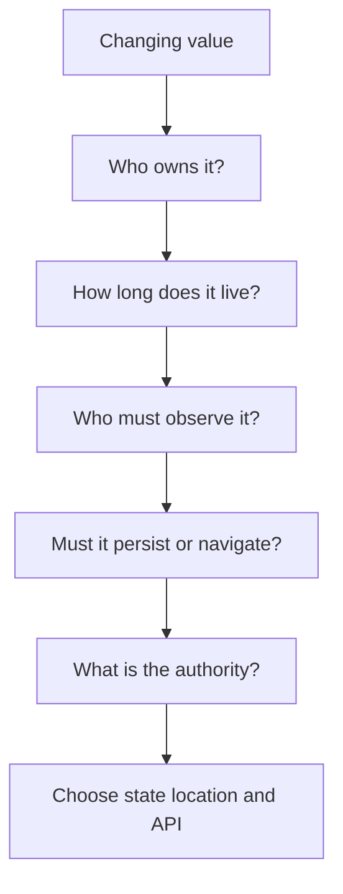
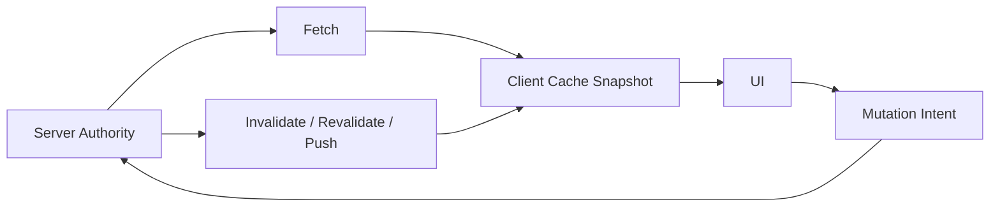
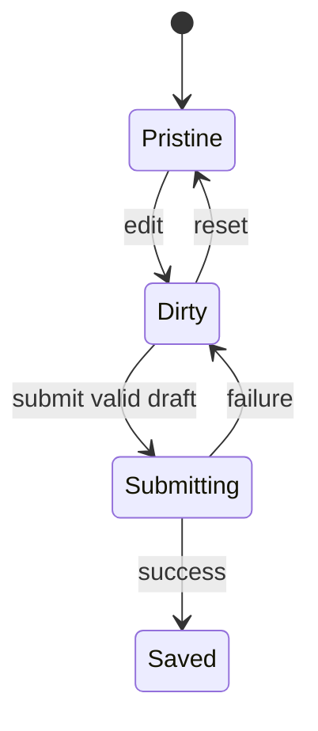
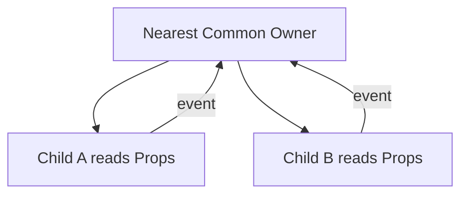

# React 状态分类：从局部交互到 Server、URL 与 Form State

> 状态管理的第一步不是选择 Redux、Context 或请求库，而是判断一个事实由谁拥有、活多久、谁需要读取、能否从其他事实推导，以及真正的权威来源在哪里。分类错误会把局部交互扩散成全局耦合，也会把远端缓存误当成客户端业务真相。

---

## 一、本文解决什么问题

- Hover、焦点、展开状态是否都应进入 React State；
- Component State 与 Page State 的边界在哪里；
- 什么状态才值得进入 Application State；
- Server State 为什么不能按普通客户端对象管理；
- 搜索、分页、筛选何时应放入 URL；
- Form State 与已保存实体为什么必须分开；
- Single Source of Truth 是否意味着所有数据放进一个 Store；
- Derived State 为什么经常造成同步错误；
- 什么时候应状态提升，什么时候应状态下沉；
- Context、外部 Store、Router 和请求缓存层分别适合什么；
- SSR 中模块单例为什么可能造成跨请求泄露；
- 如何测试状态生命周期和所有权是否正确。

本文以现代 React 函数组件和 TypeScript 为主，不绑定某个状态管理库。框架 Router、Server Components、请求缓存和表单 API 会随版本变化，具体能力应按项目依赖验证；状态所有权、单一事实源和派生关系则是相对稳定的工程原则。

### 核心结论

1. 状态应同时按所有者、生命周期、共享范围、持久化需求和权威来源分类。
2. Ephemeral State 是短暂交互信号，优先由 CSS、浏览器或局部 Ref/State 处理。
3. Component State 服务单个组件子树，Page State 服务当前路由工作流，Application State 才是跨页面长期共享事实。
4. Server State 是远端权威数据的客户端快照，天然包含异步、缓存、新鲜度、重试与一致性问题。
5. URL State 是可导航、可分享、可恢复的界面状态，不应保存秘密或大型临时对象。
6. Form State 是尚未提交的用户草稿，不能直接等同于已持久化实体。
7. Single Source of Truth 指同一事实只有一个权威所有者，不是全应用只有一个 Store。
8. Derived State 应在 Render 中由源状态计算；只有测量证明昂贵时才考虑缓存。
9. 状态提升用于协调，状态下沉用于缩小更新和生命周期范围，两者都应停在最低必要边界。
10. 状态库只能承载模型，不能替代分类、生命周期、并发与一致性设计。

---

## 二、状态分类的五个维度



对每个变化值依次回答：

1. **所有者**：哪个最小边界有权修改它？
2. **生命周期**：一次事件、组件挂载、页面会话、登录会话还是长期持久化？
3. **共享范围**：一个节点、兄弟组件、整页还是跨页面？
4. **恢复方式**：刷新、前进后退、重新登录后是否保留？
5. **权威来源**：DOM、URL、客户端 Store 还是服务端？

“多个组件用到”不足以证明状态应全局化。两个兄弟共享的值通常只需提升到最近公共父级。

---

## 三、Ephemeral State：短暂交互状态

Ephemeral State 表示短暂、局部、通常不需要持久化的交互信号，例如 Hover、按压、拖拽中、Tooltip 开关或临时测量结果。

### 3.1 优先使用平台能力

仅用于视觉 Hover 时优先 CSS：

```css
.action:hover {
  background: var(--action-hover);
}
```

不必为了改背景色建立 React State。焦点也应优先依赖 `:focus-visible` 与 DOM 焦点事实。

### 3.2 何时进入 React State

当短暂状态会改变组件结构、ARIA 契约或多个子节点行为时，可以局部持有：

```tsx
function HelpTooltip() {
  const [open, setOpen] = useState(false);

  return (
    <span onPointerEnter={() => setOpen(true)} onPointerLeave={() => setOpen(false)}>
      <button type="button" aria-describedby={open ? 'help' : undefined}>帮助</button>
      {open && <span id="help" role="tooltip">填写订单联系人</span>}
    </span>
  );
}
```

真实 Tooltip 还需键盘、触屏、Escape、焦点与 Portal 策略。

### 3.3 Ref 与 State

Timer ID、DOM 节点、手势起点等不影响 Render 的可变值适合 Ref；会改变可见 UI 的值使用 State。Ref 更新不会请求 Render，也不应在 Render 中随意读取可变值决定 JSX。

---

## 四、Component State：组件子树的私有事实

Component State 的所有者是一个组件及其子树，例如 Accordion 展开项、局部 Tab、播放器控制条或组件内部选择。

```tsx
function ProductGallery({ images }: { images: readonly Image[] }) {
  const [selectedId, setSelectedId] = useState(images[0]?.id ?? null);

  return (
    <GalleryView images={images} selectedId={selectedId} onSelect={setSelectedId} />
  );
}
```

### 4.1 保持局部的收益

- 生命周期与组件身份一致；
- 更新传播范围小；
- API 和测试更容易理解；
- 组件移除后自然释放；
- 不污染全局命名和持久化协议。

### 4.2 不要镜像 Props

```tsx
// 错误：Props 变化后形成两个事实源。
const [selected, setSelected] = useState(props.selected);
```

若组件受控，应直接读取 Props 并通过回调请求更新；若只需要初始值，应命名为 `defaultSelected` 或 `initialSelected`，并明确后续不跟随。

### 4.3 Identity 决定生命周期

Component State 关联到 Type、父级位置和 Key。切换实体时若应创建新会话，可使用稳定业务 Key；若应保留，则不要使用随机或随展示变化的 Key。

---

## 五、Page State：当前路由工作流

Page State 服务一个页面或路由段，例如当前选中的订单、批量操作集合、步骤向导进度、页面级弹窗与尚未提交的组合筛选。

```tsx
function OrdersPage() {
  const [selectedIds, setSelectedIds] = useState<Set<string>>(() => new Set());
  const [drawerOrderId, setDrawerOrderId] = useState<string | null>(null);

  return <OrdersWorkspace selectedIds={selectedIds} drawerOrderId={drawerOrderId} />;
}
```

Page State 通常放在路由页面组件、Layout Route 或页面级 Reducer 中。是否放 URL 取决于它是否需要分享、刷新恢复和历史导航。

### 5.1 页面离开后的策略

必须明确：

- 离开页面是否丢弃；
- 返回时是否通过 URL 恢复；
- 是否保存草稿到 Session Storage；
- 是否存在未保存离开提示；
- 多标签页是否共享。

不要因为“返回页面想保留”就自动升级为 Application State，Router Cache 或持久化层可能更符合生命周期。

---

## 六、Application State：跨页面客户端事实

Application State 是多个远距离功能长期共享、由客户端拥有的事实，例如当前主题偏好、全局通知队列、客户端功能开关快照或跨页面工作区选择。

适合 Context 或外部 Store 的前提：

- 确实跨多个路由读取；
- 生命周期长于单页；
- 有明确写入者和重置时机；
- 订阅粒度与性能可控制；
- SSR 中能够做到请求隔离。

### 6.1 认证用户是否是 Application State

会话信息常跨页面使用，但其权威通常来自服务端或安全 Cookie。客户端可缓存展示所需快照，却不能把 Store 中的 `isAdmin: true` 当作权限依据。服务端必须重新鉴权。

### 6.2 模块单例与 SSR

在服务端把用户状态放进模块级单例 Store，可能让并发请求共享数据。SSR Store 应按请求创建，客户端 Hydration 数据也要做运行时校验并避免泄露敏感字段。

---

## 七、Server State：远端事实的客户端快照

Server State 与普通客户端 State 的区别在于客户端不是最终权威，并且数据会过期：



需要处理：

- Loading、Error、Success、Stale、Refreshing；
- 缓存 Key、去重与 Garbage Collection；
- 新鲜度、失效和后台刷新；
- Retry、Backoff、Offline；
- Abort 与异步竞态；
- Optimistic Update 与 Rollback；
- 权限、Schema Validation 和服务端一致性。

### 7.1 不要无差别复制到全局 Store

请求库或框架数据层通常已经管理缓存和订阅。再复制一份到 Application Store 会产生双缓存、失效顺序和来源不明的问题。

只有在明确转换为客户端拥有的草稿或领域快照时才复制，并定义同步边界。

### 7.2 Server State 不是 Effect 的同义词

Router Loader、Server Component 或专用请求缓存层可以集中处理取数。手写 `useEffect + useState` 时必须补齐取消、竞态、缓存、错误与 Strict Mode 下的幂等性。

---

## 八、URL State：导航和分享契约

适合 URL 的状态包括搜索词、分页、排序、可分享筛选、选中 Tab 和可定位实体 ID。

```text
/orders?status=pending&page=2&sort=created-desc
```

收益：

- 刷新可恢复；
- 前进后退符合预期；
- 可复制分享和收藏；
- SSR/Loader 可直接读取；
- Analytics 能理解页面语义。

### 8.1 URL 是字符串边界

URL 参数必须 Parse、Validate、Normalize：

```typescript
function parsePage(params: URLSearchParams): number {
  const value = Number(params.get('page') ?? '1');
  return Number.isInteger(value) && value >= 1 ? value : 1;
}
```

无效值应回退、规范化或返回错误，不能用类型断言假装可信。

### 8.2 不适合 URL 的内容

- Token、密码、个人敏感信息；
- 大型对象和二进制数据；
- 每次指针移动都变化的高频状态；
- 未提交的敏感表单草稿；
- 无法稳定序列化的实例。

URL 会进入历史、日志、Referer、截图和分享链路，应视为公开数据。

### 8.3 避免 URL 与 State 双向循环

若 URL 是事实源，组件应从 Router 读取并通过导航 API 更新。不要再维护一份长期镜像 State，然后用两个 Effect 相互同步。

---

## 九、Form State：未提交的用户草稿

Form State 通常包括：

- 当前字段值；
- Touched、Dirty、Validating；
- 字段与表单错误；
- 提交中、提交失败；
- 初始值和服务器最新值；
- 文件、动态字段与多步骤进度。

### 9.1 草稿不等于服务器实体

```typescript
type UserEntity = {
  id: string;
  displayName: string;
  avatarUrl: string | null;
  version: number;
};

type ProfileDraft = {
  displayName: string;
  avatarFile: File | null;
  removeAvatar: boolean;
};
```

Form State 允许临时无效值，例如尚未输入完整日期；不能要求每次键入都成为合法服务器实体。

### 9.2 Controlled 与 Uncontrolled

复杂实时联动适合受控状态或表单库；简单一次提交可使用原生 FormData 和非受控输入。选择依据是协调、校验和性能需求，而非“哪种更高级”。

### 9.3 提交生命周期



提交必须处理重复点击、Abort、服务器字段错误、版本冲突、成功后基线重置和页面离开。写请求还应具备服务端幂等与授权。

---

## 十、Single Source of Truth

Single Source of Truth（单一事实源）表示一个事实有一个权威所有者，其他位置通过读取、订阅或派生获得它。

它不表示：

- 所有状态都进一个 Store；
- 所有缓存只能有一份物理副本；
- 不能存在 Server Cache、浏览器 Cache 和 UI Projection；
- 每个组件都必须直接读取全局状态。

### 10.1 同一事实与不同事实

服务器保存的 User Entity、客户端编辑 Draft 和搜索 URL 看似都包含用户名，但它们可能是不同生命周期的事实。关键是明确同步规则，而不是强行合并对象。

### 10.2 双事实源错误

```tsx
function Search({ query }: { query: string }) {
  const [localQuery, setLocalQuery] = useState(query);
  // query 与 localQuery 谁说了算？
}
```

应选择受控 Props、仅初始化的 `defaultQuery`，或明确的“编辑草稿 + Apply”模型。

---

## 十一、Derived State

Derived State 能从当前源状态确定性计算：

```tsx
function CartSummary({ items }: { items: readonly CartItem[] }) {
  const total = items.reduce((sum, item) => sum + item.price * item.quantity, 0);
  return <output>{total}</output>;
}
```

错误做法是用 Effect 维护副本：

```tsx
const [total, setTotal] = useState(0);

useEffect(() => {
  setTotal(calculateTotal(items));
}, [items]);
```

这会先 Commit 旧值，再触发第二次更新，还增加遗漏依赖的风险。

### 11.1 `useMemo` 不是第二事实源

昂贵派生可在测量后使用 `useMemo` 缓存，但它仍是可重算值，不应承载业务正确性或副作用。依赖不稳定时缓存可能没有收益。

### 11.2 服务端派生值

价格、权限、税费等安全或强一致结论必须由服务端验证。客户端派生只用于展示预估，不能成为结算权威。

---

## 十二、状态提升

两个组件需要协调同一事实时，把状态提升到最近公共所有者：

```tsx
function TemperatureCalculator() {
  const [celsius, setCelsius] = useState('');

  return (
    <>
      <CelsiusInput value={celsius} onChange={setCelsius} />
      <FahrenheitOutput celsius={celsius} />
    </>
  );
}
```



提升的成本包括 Props/Callback 增加、父级职责扩大和更新范围变宽。状态只提升到真正需要协调它的最低边界。

---

## 十三、状态下沉

状态下沉是把不再需要上层协调的事实移回更小子树：

- Modal 内部 Tab；
- 单行 Hover/展开；
- 只服务局部组件的输入草稿；
- 昂贵子树的交互状态。

收益是缩小更新范围、减少全局耦合并让卸载自然释放状态。

### 13.1 下沉不是隐藏共享事实

若兄弟组件必须保持一致，把状态分别下沉到两个组件会制造双事实源。应先确定所有者，再决定通过 Props、Context 或 Store 分发。

### 13.2 组件组合帮助下沉

可以把状态拥有者包装在更局部组件中，并把不依赖该状态的内容作为 `children` 传入，减少上层每次更新都重新计算大子树。是否有性能收益仍需 Profiler 验证。

---

## 十四、状态位置决策表

| 状态 | 首选位置 | 生命周期 | 主要风险 |
|---|---|---|---|
| Hover/按压 | CSS 或局部 State | 瞬时 | 过度 Render |
| 局部展开/选择 | Component State | 组件身份 | 错误 Key 重置 |
| 页面批量选择 | Page State | 当前路由 | 离页恢复不清 |
| 主题/工作区 | Application State | 跨路由 | 全局更新扩散 |
| API 数据 | Server Cache | 由新鲜度策略决定 | 双缓存、竞态 |
| 搜索/分页 | URL State | 导航历史 | 无效参数、隐私 |
| 未提交字段 | Form State | 编辑会话 | 覆盖服务器新值 |
| 可计算总价 | Derived Value | 当前 Render | 重复存储 |

---

## 十五、常见误区与错误案例

### 15.1 多个组件使用就必须全局化

错误。先提升到最近公共父级；只有跨远距离、跨路由且生命周期匹配时才考虑 Context 或 Store。

### 15.2 Server State 放 Redux 就变成客户端权威

错误。服务端仍是权威，客户端副本仍需失效、重取、冲突和权限治理。

### 15.3 URL State 与本地 State 各存一份更方便

通常会产生双向同步循环。若 URL 是导航契约，应直接从 Router 派生。

### 15.4 所有派生值都用 `useMemo`

错误。普通计算直接在 Render 执行更简单；只有 Profile 证明昂贵并且依赖稳定时才缓存。

### 15.5 全局 Store 可以跨 SSR 请求复用

错误。用户状态可能泄露到其他请求。服务端 Store 和缓存必须按数据语义实现请求、用户或公共范围隔离。

### 15.6 表单直接编辑缓存对象

错误。取消编辑无法回滚，其他组件会看到半成品。应创建 Draft，并在提交成功后更新或失效 Server Cache。

---

## 十六、性能、测试与验证

### 16.1 测试生命周期

- 组件卸载后局部 State 是否自然丢弃；
- 页面返回时 URL 是否恢复筛选；
- 登出是否清除用户级 Application/Server Cache；
- 切换实体时 Form Draft 是否按 Key 重置；
- 请求竞态是否阻止旧结果覆盖新结果；
- SSR 并发请求是否数据隔离。

### 16.2 性能指标

使用 React Profiler 查看状态更新传播了哪些组件，结合 Performance 面板观察 Commit、Layout 和 INP。不要仅凭 Store 大小判断性能；订阅粒度、Selector 稳定性和更新频率更关键。

### 16.3 一致性测试

为 Server State 测试 Stale/Refreshing、Offline、Retry、Optimistic Rollback 与版本冲突；为 URL 测试无效参数、前进后退；为 Form 测试服务器字段错误、重复提交和未保存离开。

---

## 十七、工程检查清单

- 状态的权威所有者是谁；
- 生命周期与存放位置是否一致；
- 是否能从现有事实派生；
- 是否错误镜像 Props、URL 或 Server Cache；
- 是否需要刷新恢复、分享或历史导航；
- 是否包含敏感数据；
- 是否需要取消、重试、失效或冲突处理；
- 状态提升是否超过最低公共边界；
- 可下沉状态是否污染全局 Store；
- SSR 是否按请求隔离；
- 性能与正确性是否在真实交互中验证。

---

## 十八、总结

1. 状态分类要同时考虑所有者、生命周期、共享范围、恢复需求和权威来源。
2. Ephemeral 与 Component State 应尽量局部，跟随组件身份释放。
3. Page State 服务路由工作流，Application State 只承载真正跨页面的客户端事实。
4. Server State 是会过期的远端快照，应由请求缓存和一致性策略治理。
5. URL State 是导航契约，适合可分享筛选，不适合秘密和大型草稿。
6. Form State 是未提交会话，与服务器实体有不同有效性和生命周期。
7. Single Source of Truth 是每个事实一个权威所有者，不是一个全局 Store。
8. Derived State 应直接计算，缓存只是性能工具。
9. 状态提升解决协调，状态下沉控制范围，两者都围绕最低必要所有者。
10. 状态库选择应发生在分类之后，并通过生命周期、一致性和性能测试验证。

好的状态设计不是让任何地方都能访问，而是让每个事实只在需要的范围内存在，并能清楚回答“谁说了算”。

---

## 问答复盘

### Q1：多个组件需要同一状态时，是否应该放全局 Store？

**答：** 不一定。优先提升到最近公共所有者；只有跨路由、生命周期长且远距离共享时才考虑 Application Store。

### Q2：Server State 与 Application State 的关键区别是什么？

**答：** Server State 的权威在远端，客户端只持有可能过期的缓存；Application State 通常由客户端拥有。

### Q3：搜索条件什么时候应该放 URL？

**答：** 当它需要刷新恢复、前进后退、收藏或分享时。参数必须校验，且不能包含敏感信息。

### Q4：为什么 Form State 不应直接修改服务器缓存对象？

**答：** 草稿可能临时无效且可取消，直接修改会让其他消费者看到半成品，也难以处理提交失败和冲突。

### Q5：Single Source of Truth 是否要求只有一个物理副本？

**答：** 不要求。它要求权威关系唯一；缓存、投影和草稿可以存在，但必须有明确同步规则。

### Q6：从 Props 计算出的总价需要放 State 吗？

**答：** 通常不需要，应在 Render 派生。只有测量证明计算昂贵时才考虑 `useMemo`，且它仍不是新事实源。

### Q7：状态提升有哪些代价？

**答：** 会扩大父级职责、Props/Callback 和更新范围，因此只提升到真正需要协调的最低公共边界。

### Q8：模块级 Store 在 SSR 中有什么风险？

**答：** 并发请求可能共享用户数据并造成泄露。用户级 Store 必须按请求或会话隔离。

### Q9：Hover 应使用 State 还是 CSS？

**答：** 纯视觉 Hover 优先 CSS；只有它改变结构、行为或可访问性契约时才使用局部 React State。

---

## 延伸知识

- **不可变更新**：Reference Equality、Structural Sharing 与 Normalized State。
- **UI 状态机**：Loading、Stale、Optimistic 与 Rollback。
- **组件 API 设计**：Controlled State、Boolean Trap、Slot 与 Context。
- **Server State**：缓存、去重、失效、重试和离线。
- **表单工程**：Schema Validation、异步校验、文件上传与冲突处理。
- **URL 设计**：Router、History、SSR、Canonical URL 与隐私。
