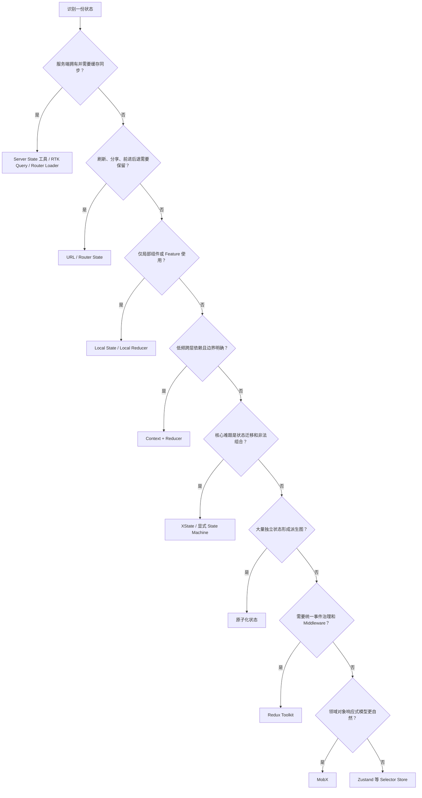
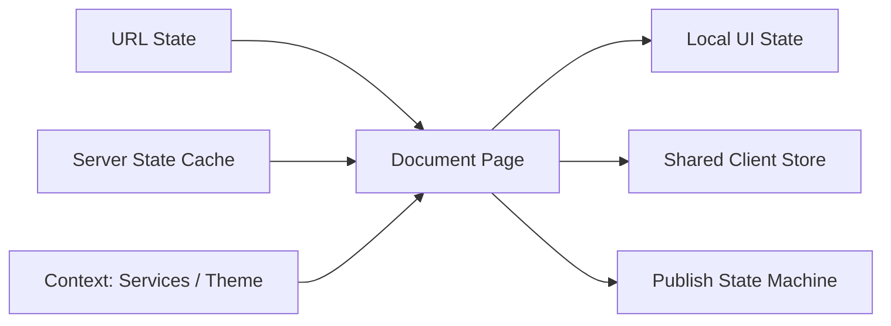

# React 状态管理选型：从 Local State 到 Redux、Zustand、MobX 与 XState

> 状态管理选型不是挑选“最强的全局 Store”，而是为不同类型、生命周期和一致性要求的状态安排正确所有者。一个成熟应用通常同时使用 Local State、URL、Server State、Context 和少量外部 Store，而不是把所有数据塞进同一种工具。

---

## 一、为什么状态管理选型容易失控

团队讨论状态管理时，经常直接从库名开始：Redux 是否太重、Zustand 是否更快、MobX 是否太隐式、XState 是否过度设计。真正决定成本的却是更早的问题：

- 这份状态由客户端、服务端还是 URL 拥有；
- 谁可以修改，修改是否存在严格顺序；
- 状态需要存活到组件、路由、会话还是浏览器进程结束；
- 有多少组件读取，更新频率有多高；
- 是否需要缓存、重试、乐观更新或持久化；
- 团队是否能长期维护所选模型和约束。

如果跳过这些问题，任何库最终都可能演变成一个无边界的 Global Store：Server State 被复制、Derived State 被缓存、页面草稿跨账号泄漏、组件订阅整个 Store，最后再把问题归因于库性能。

本文以当前稳定 React 生态的公开模型为基础。第三方库 API、Middleware 和 SSR 集成会随版本演进，具体项目必须锁定版本并核对官方文档；本文比较的是相对稳定的架构特征，不编造 Bundle Size 或性能排名。

### 核心结论

1. 先分类状态，再选择工具；状态位置比库名更重要。
2. Local State 是默认方案，能放在组件附近的状态不应提前全局化。
3. Context 适合传递低频跨层依赖，Context + Reducer 适合边界明确的中等复杂子树状态。
4. Redux Toolkit 适合需要统一事件流、Middleware、DevTools、规范和大型团队治理的应用。
5. Zustand 适合希望以较少样板获得外部 Store 与 Selector 订阅的场景，但架构约束需要团队自己建立。
6. MobX 适合自然建模为 Observable Domain Object 的响应式业务，代价是依赖追踪更动态、更依赖团队理解。
7. XState 适合状态有限、迁移受约束、异步流程复杂且需要显式可视化的工作流。
8. 原子化状态适合大量相对独立、可组合和可派生的小状态图，但要控制 Atom 数量和依赖拓扑。
9. 没有一种方案在所有场景中绝对更快；性能取决于订阅粒度、更新频率、Selector 稳定性和组件成本。
10. 选型必须同时评估可测试性、SSR 隔离、生命周期、调试能力、学习成本和团队约束。

---

## 二、第一步：先给状态分类

以下状态看起来都能放进 Store，但所有者和生命周期完全不同：

| 状态 | 推荐所有者 | 示例 |
|---|---|---|
| Local UI State | 组件或局部 Reducer | Dialog、Hover、当前 Tab |
| Shared Client State | 页面 Provider 或外部 Store | 编辑器 Selection、跨面板草稿 |
| Server State | 请求层、路由 Loader 或 Server State 工具 | 商品、订单、账号详情 |
| URL State | Router / URL | 搜索词、分页、筛选、当前实体 ID |
| Form State | 表单组件或表单库 | Dirty、Touched、Validation Error |
| Workflow State | Reducer 或 State Machine | 支付、发布、审批、上传流程 |
| Derived State | Render / Memoized Selector | 总价、过滤结果、权限派生值 |

最常见的错误是把后五类统称为“全局状态”。例如：

- 把 URL 中已有的 `page=3` 再复制进 Redux，产生双向同步；
- 把 Query Cache 的订单列表复制进 Zustand，制造两个事实源；
- 把 `items.reduce(...)` 的总价作为独立字段持久化，产生一致性风险；
- 把只在一个 Dialog 使用的 `isOpen` 提升到应用根 Store。

状态分类不是理论步骤，而是直接减少 Store 规模和同步代码。

---

## 三、第二步：建立选型维度

不要只比较 API 长短。至少评估以下维度：

### 3.1 所有权与生命周期

- 谁创建和销毁状态；
- 路由、账号或租户切换时是否重置；
- SSR 是否每请求隔离；
- 多个组件实例是否应拥有独立 Store。

### 3.2 更新模型

- 更新是简单 Setter，还是 Domain Event；
- 是否允许中间状态；
- 是否有 Guard、并行状态、取消和重试；
- 是否需要审计、回放或 Middleware。

### 3.3 订阅拓扑

- Consumer 数量和分布；
- 更新频率；
- 是否需要 Selector；
- 是否存在大量相互派生的小状态。

### 3.4 数据治理

- 是否来自服务端；
- 是否需要 Cache、Deduplication、Retry 和 Mutation；
- 是否需要 Offline、Persistence 或 Cross-tab；
- 敏感数据是否允许落盘。

### 3.5 团队约束

- 团队是否熟悉函数式 Reducer、响应式对象或状态图；
- 是否需要严格统一目录、Action 和调试流程；
- 新成员能否快速定位写入来源；
- 维护周期是否足以承担新的生态依赖。

---

## 四、Local State：默认且常被低估

能由最近共同祖先拥有的状态，优先使用 `useState` 或 `useReducer`：

```tsx
function ProductFilters() {
  const [filters, dispatch] = useReducer(filtersReducer, initialFilters);

  return (
    <FilterPanel
      filters={filters}
      onCategoryChanged={(categoryId) =>
        dispatch({ type: 'categoryChanged', categoryId })
      }
    />
  );
}
```

### 4.1 优势

- 所有权和生命周期与组件树一致；
- 不需要额外订阅协议；
- 删除组件时状态自然释放；
- 测试通过用户交互即可覆盖；
- 不会意外影响无关页面。

### 4.2 代价

- 多个远距离 Consumer 可能需要 Lift State 或 Prop Drilling；
- 跨路由保留需要上移所有者；
- 复杂跨组件 Action 可能使回调链变长；
- 无法天然提供全局 DevTools、持久化和 Middleware。

Prop Drilling 不是必须消灭的 Code Smell。两三层显式 Props 往往比隐式全局依赖更容易复用和测试。

### 4.3 适用场景

- 表单局部交互；
- Dialog、Accordion、Tab；
- 页面内筛选但 URL 不要求可分享；
- 可复用组件实例的内部状态；
- 只在一个 Feature 子树存在的 Reducer。

---

## 五、Context + Reducer：有边界的共享状态

Context 负责传递，Reducer 负责状态迁移：

```tsx
const CartStateContext = createContext<CartState | undefined>(undefined);
const CartDispatchContext = createContext<Dispatch<CartAction> | undefined>(
  undefined,
);

function CartProvider({ children }: PropsWithChildren) {
  const [state, dispatch] = useReducer(cartReducer, initialCartState);

  return (
    <CartStateContext value={state}>
      <CartDispatchContext value={dispatch}>
        {children}
      </CartDispatchContext>
    </CartStateContext>
  );
}
```

### 5.1 优势

- 只依赖 React；
- Action 和 Reducer 可集中表达更新规则；
- Provider 位置清楚定义 State Scope；
- State 与 Dispatch 可拆分，降低写组件的无关更新；
- 测试可以直接替换 Provider 或单测 Reducer。

### 5.2 代价

- 原生 Context 没有 Selector 参数；
- State Context Value 变化会让相关 Consumer 读取新值；
- Middleware、Time Travel、Persistence 和异步治理需要自建；
- Provider 过多时组合和测试 Fixture 变复杂。

### 5.3 适用场景

- 主题、语言、会话能力等低频依赖；
- 一个 Route 或 Feature 内共享的中等复杂状态；
- 更新频率可控，Consumer 数量有限；
- 团队不需要完整外部 Store 基础设施。

如果开始自建 Selector、Middleware、DevTools、Persistence、跨 Tab 同步和 SSR Hydration，应重新评估成熟状态库，而不是继续扩展“轻量 Context”。

---

## 六、Redux Toolkit：标准化事件流与团队治理

Redux Toolkit 是 Redux 官方推荐的现代写法，核心仍是单向数据流：UI Dispatch Action，Reducer 生成新 State，Selector 读取所需片段。

```tsx
const cartSlice = createSlice({
  name: 'cart',
  initialState: { items: [] } as CartState,
  reducers: {
    itemAdded(state, action: PayloadAction<CartItem>) {
      state.items.push(action.payload);
    },
    itemRemoved(state, action: PayloadAction<string>) {
      state.items = state.items.filter(
        (item) => item.productId !== action.payload,
      );
    },
  },
});

const store = configureStore({
  reducer: {
    cart: cartSlice.reducer,
  },
});
```

`createSlice` 使用 Immer 支持“Mutating Syntax”，但最终仍产生不可变结果。不要把这种语法理解成可以在 Reducer 外任意修改 Redux State。

### 6.1 优势

- Action、Reducer、Selector 和 Middleware 边界成熟；
- Redux DevTools 便于观察事件和状态变化；
- 团队目录、命名和数据流容易标准化；
- Selector 与 Normalization 适合大型实体状态；
- Async Thunk、Listener Middleware 等能力覆盖复杂副作用；
- RTK Query 可处理一类 Server State 与请求缓存问题。

### 6.2 代价

- 概念和结构多于 Local State 或小型 Store；
- 如果所有交互都设计成全局 Action，会扩大状态边界；
- 不合理 Selector 仍会造成广泛 Render；
- Middleware 与异步流程过多时调用链可能变长；
- 团队需要约束 Slice、Entity、Action 和 Server State 的职责。

### 6.3 适用场景

- 多团队共享统一 Client State；
- 需要事件审计、DevTools 和可预测更新；
- 大量实体需要规范化和复用 Selector；
- 副作用需要统一 Middleware 管道；
- 已有 Redux 生态和长期维护经验。

Redux Toolkit 不是“项目大就必须用”，也不是“代码多所以一定过重”。价值来自治理需求；没有治理需求时，引入完整事件体系可能只是额外成本。

---

## 七、Zustand：轻量 External Store 与 Selector

Zustand 以较小 API 面提供 Store、Action 和 Selector Hook：

```tsx
type CartStore = {
  items: CartItem[];
  addItem(item: CartItem): void;
};

const useCartStore = create<CartStore>()((set) => ({
  items: [],
  addItem: (item) =>
    set((state) => ({
      items: [...state.items, item],
    })),
}));

function CartBadge() {
  const itemCount = useCartStore((state) => state.items.length);
  return <span>{itemCount}</span>;
}
```

### 7.1 优势

- API 小，创建 Store 和 Action 直接；
- Selector 可以让组件订阅所需片段；
- 不要求 Provider 的客户端单例用法简单；
- 可通过 Vanilla Store Factory 支持测试、SSR 和多实例；
- Middleware 生态可提供 DevTools、Persistence 等能力。

### 7.2 代价

- 自由度高，团队容易形成命名、Action 和 Slice 风格不一致；
- 一个巨型 Store 同样会产生耦合；
- Selector 返回新对象时需要稳定 Equality 或缓存；
- Module Singleton 在 SSR 中可能导致跨请求共享；
- Async、Cache 和事务语义需要项目自行设计。

### 7.3 适用场景

- 中小型 Shared Client State；
- 编辑器、画布、播放器等需要 Selector 的交互状态；
- 团队希望减少 Redux 式结构，但愿意建立自己的 Store 规范；
- 需要局部 Store Factory，而非只有进程级单例。

“代码少”不等于“架构成本低”。如果 Action 可以在任何模块随意修改任意字段，短期简洁会转化为长期追踪困难。

---

## 八、MobX：Observable Domain Model

MobX 通过 Observable、Computed、Action 和 `observer` 建立动态依赖追踪：

```tsx
class CartStore {
  items: CartItem[] = [];

  constructor() {
    makeAutoObservable(this);
  }

  get total() {
    return this.items.reduce((sum, item) => sum + item.price, 0);
  }

  addItem(item: CartItem) {
    this.items.push(item);
  }
}

const CartSummary = observer(function CartSummary({ store }: Props) {
  return <strong>{store.total}</strong>;
});
```

`observer` 在 Render 中追踪实际读取的 Observable，相关值变化后重新 Render。它不是简单地比较整个 Store 引用。

### 8.1 优势

- 对象、集合、Getter 和领域方法表达自然；
- Computed Value 在被观察时按依赖缓存并失效；
- 组件通常只响应 Render 中实际读取的数据；
- 适合富领域模型和复杂派生关系；
- 样板代码相对少。

### 8.2 代价

- 数据依赖比显式 Selector 更动态；
- 在 `observer` 外提前读取或解构 Primitive，可能失去预期追踪位置；
- Action 边界、异步 `await` 后的修改需要理解 MobX 规则；
- 调试和 Code Review 要求团队理解响应式依赖图；
- Store 实例、Reaction 和资源仍需明确释放。

### 8.3 适用场景

- 业务自然建模为长期存在的 Domain Object；
- 大量 Computed 派生和对象关系；
- 团队熟悉响应式编程和 Action 约束；
- 希望模型方法与数据共同封装。

MobX 允许看似直接的赋值，不代表可以忽略事务和异步竞态。网络响应晚到、实体切换和 Reaction Cleanup 仍需显式治理。

---

## 九、XState：显式状态图与 Actor 生命周期

当问题核心是“允许哪些状态和迁移”，State Machine 比通用对象 Store 更贴合：

```tsx
const checkoutMachine = createMachine({
  id: 'checkout',
  initial: 'editing',
  states: {
    editing: {
      on: { SUBMIT: 'submitting' },
    },
    submitting: {
      on: {
        RESOLVE: 'success',
        REJECT: 'failure',
        CANCEL: 'editing',
      },
    },
    failure: {
      on: { RETRY: 'submitting', EDIT: 'editing' },
    },
    success: {
      type: 'final',
    },
  },
});

function Checkout() {
  const [snapshot, send] = useMachine(checkoutMachine);
  return <CheckoutView snapshot={snapshot} send={send} />;
}
```

具体 Hook 和 Actor API 取决于项目锁定的 XState 与 `@xstate/react` 版本，但 State、Event、Guard、Action、Invoke 和 Actor 的建模思想相对稳定。

### 9.1 优势

- 非法状态和非法迁移更难出现；
- Guard、并行状态、层级状态和取消可以显式建模；
- 状态图便于设计、开发和测试共同讨论；
- Actor 生命周期适合隔离复杂工作流；
- 可按 Event 序列测试关键路径。

### 9.2 代价

- 前期建模成本高于几个 Boolean；
- 团队需要学习 Statechart 和 Actor；
- 简单 CRUD State 使用状态机可能过度设计；
- Context、Actor Input 和副作用边界需要统一规范；
- 大型 Machine 若不拆分，同样会变得难以维护。

### 9.3 适用场景

- 支付、审批、发布、上传和认证流程；
- 状态组合容易产生 Impossible State；
- 异步取消、超时、重试和并行步骤复杂；
- 业务需要明确展示迁移规则和审计路径。

XState 不是 Redux 或 Zustand 的通用替代。一个应用可以用 Redux 保存跨域 Client State，同时用独立 Machine 管理发布流程。

---

## 十、原子化状态：从单 Store 到依赖图

原子化状态把状态拆为独立 Atom，并通过 Derived Atom 建立依赖图。以 Jotai 风格为例：

```tsx
const cartItemsAtom = atom<CartItem[]>([]);

const cartTotalAtom = atom((get) =>
  get(cartItemsAtom).reduce((sum, item) => sum + item.price, 0),
);

function CartSummary() {
  const total = useAtomValue(cartTotalAtom);
  return <strong>{total}</strong>;
}

function AddToCartButton({ item }: { item: CartItem }) {
  const setItems = useSetAtom(cartItemsAtom);

  return (
    <button onClick={() => setItems((items) => [...items, item])}>
      加入购物车
    </button>
  );
}
```

### 10.1 优势

- 组件只订阅使用的 Atom；
- Derived Atom 可以组合依赖并自动更新；
- 局部增量采用成本低；
- 适合编辑器面板、工具状态和交叉派生；
- Provider 或 Store Instance 可定义 Scope。

### 10.2 代价

- Atom 数量增长后，依赖拓扑不再直观；
- 命名、目录和写 Atom 规则需要治理；
- 跨多个 Atom 的事务一致性需要明确；
- 动态 Atom 身份错误可能造成重建或泄漏；
- Persistence、SSR 和异步 Atom 行为依赖具体库版本。

### 10.3 适用场景

- 大量相对独立的小状态；
- 状态之间存在清晰派生图；
- 组件消费组合灵活，难以按传统 Slice 划分；
- 团队愿意维护 Atom Ownership 和依赖约束。

原子化不意味着可以忽略领域边界。把每个字段变成 Atom，可能只是把一个大 Store 变成难以追踪的全局节点网络。

---

## 十一、横向比较

| 方案 | 核心模型 | 主要优势 | 主要成本 | 更适合 |
|---|---|---|---|---|
| Local State | 组件树所有权 | 简单、生命周期自然 | 跨层共享有限 | 局部 UI、表单交互 |
| Context + Reducer | Provider + Event Reducer | 仅 React、边界明确 | 无原生 Selector、工具少 | Feature 级共享状态 |
| Redux Toolkit | Action + Reducer + Selector | 标准化、DevTools、Middleware | 概念和治理成本 | 多团队、大型共享状态 |
| Zustand | External Store + Selector | API 小、订阅直接 | 规范需自建 | 中小型交互 Store |
| MobX | Observable + Computed + Action | 领域对象自然、动态追踪 | 隐式依赖学习成本 | 响应式 Domain Model |
| XState | Statechart + Actor | 迁移显式、Impossible State 少 | 建模成本 | 复杂异步工作流 |
| 原子化状态 | Atom Dependency Graph | 细粒度、组合灵活 | 拓扑和 Atom 治理 | 独立状态与派生图 |

这个表格不能直接给出“胜者”。同一项目中的不同 Feature 可能需要不同模型。

---

## 十二、决策流程



决策树只用于缩小范围。最终仍要做一个代表性 Feature Spike，验证 SSR、测试、DevTools、更新频率和团队可读性。

---

## 十三、真实项目通常是组合方案

以协作文档编辑器为例：

- 文档 ID、当前 Tab 放在 URL；
- 文档正文和评论属于 Server State，由请求缓存层管理；
- 输入框 Composition、Popover、Hover 使用 Local State；
- 主题、语言、服务实例通过 Context 传递；
- Selection、Viewport、工具栏状态使用 Zustand 或原子化状态；
- 离线发布流程使用 XState 表达 Draft、Syncing、Conflict、Retry；
- 跨团队统一审计事件和实体缓存时可使用 Redux Toolkit；
- 富领域对象和大量 Computed 关系也可能适合 MobX。



这些层之间要有单向所有权。Server State Cache 是文档数据事实源，Client Store 不应再维护一份可独立修改的完整文档副本；如果编辑器确实需要本地 Draft，应明确 Base Version、Patch、Conflict 和 Commit 协议。

---

## 十四、复杂度：代码量只是表面

### 14.1 概念复杂度

- Local State 概念少，但跨层流程复杂后回调链会增长；
- Redux 概念多，但大型团队获得统一词汇；
- Zustand API 少，但架构规则不会自动出现；
- MobX 代码直接，但动态依赖需要理解；
- XState 前期建模多，换取迁移显式；
- 原子化状态局部简单，全局依赖图可能复杂。

### 14.2 运维复杂度

还要考虑：

- DevTools 和线上诊断；
- Persistence Schema Migration；
- SSR 请求隔离；
- Hydration 与 Client-only 边界；
- HMR、测试重置和多实例；
- 依赖升级和生态维护状态；
- Error、Retry、Cancellation 和 Observability。

不能用一个 Demo 的行数代表五年维护成本。

---

## 十五、性能：没有脱离场景的排名

不同方案降低 Render 的方式不同：

- Local State 通过靠近 Consumer 缩小影响树；
- Context 通过拆分 Provider 和稳定 Value 控制传播；
- Redux 与 Zustand 通过 Selector 和 Equality 缩小订阅；
- MobX 通过 Render 中的 Observable Read 追踪依赖；
- XState 通过 Actor Snapshot 和 Selector 控制订阅；
- 原子化状态通过 Atom 依赖图传播变化。

性能问题通常来自实现，而非库名：

```tsx
const state = useCartStore(); // 订阅整个 Store
```

对比：

```tsx
const itemCount = useCartStore((state) => state.items.length);
```

即使使用 Selector，如果每次返回新数组或对象，也可能失去跳过更新的机会。Redux Selector、Zustand Selector、MobX Computed 和 Derived Atom 都需要遵守各自的引用与缓存规则。

### 15.1 测量方法

1. 在生产构建和目标设备复现真实交互；
2. 用 React DevTools Profiler 观察 Render 原因和 Commit Duration；
3. 记录 Store Action、Mutation 或 Event 频率；
4. 检查 Selector/Computed 是否重复创建大型对象；
5. 测量持久化、序列化和 Hydration 成本；
6. 修改订阅粒度或状态位置后复测；
7. 同时观察 INP、Long Task 和内存，而非只看 Render 次数。

不要用“某库基于 Proxy”“某库更轻”直接推导业务性能。数据量、更新拓扑和组件成本才决定结果。

---

## 十六、可测试性

### 16.1 Local State

通过 React Testing Library 驱动用户事件，断言可见行为。Reducer 复杂时单独测试纯迁移函数。

### 16.2 Context + Reducer

测试 Reducer Invariant，并用真实 Provider 包裹 Consumer。不要 Mock `useContext`，否则会绕开公开契约。

### 16.3 Redux Toolkit

为每个测试创建真实 Store，测试 Reducer、Selector 和关键 Middleware 集成。组件测试优先使用 Provider + 真实 Store，Mock 网络边界，而不是 Mock `useSelector` 和 `dispatch`。

### 16.4 Zustand

使用 Store Factory 或 Vanilla Store 为每个测试创建实例，避免 Module Singleton 跨用例泄漏。测试 Action 后的 Snapshot 和 Selector 结果。

### 16.5 MobX

每个测试创建新的 Domain Store，验证 Action、Computed 和 Reaction；测试结束释放手动创建的 Reaction、Autorun 和外部订阅。

### 16.6 XState

围绕 Event Sequence、Guard 和最终状态测试 Transition；Actor 测试还要覆盖 Invoke Error、Cancel、Timeout 和 Stop。

### 16.7 原子化状态

为测试创建独立 Provider/Store，验证 Base Atom、Derived Atom 和跨 Atom 写入，避免复用进程级默认 Store。

可测试性不只是“函数能否单测”，还包括测试隔离、Fixture 规模、异步可控性和失败时能否解释状态来源。

---

## 十七、生命周期、SSR 与持久化

外部 Store 方案都必须回答实例归属：

- Redux、Zustand、MobX 和 Atom Store 在 SSR 中应按请求隔离用户数据；
- XState Actor 应在页面或业务生命周期结束时 Stop；
- WebSocket、Timer、Reaction 和 Event Listener 必须 Cleanup；
- 账号或租户变化时，旧 Store 是否重建必须明确；
- Hydration Initial State 必须与服务端 HTML 一致。

### 17.1 Persistence 不是免费能力

把 Store 写进 `localStorage` 还需处理：

- Schema Version 与 Migration；
- 过期、清理和账号隔离；
- 敏感信息与 XSS 风险；
- 多 Tab 冲突；
- 部分写入和损坏恢复；
- SSR 环境没有浏览器存储；
- Hydration 前后 UI 跳变。

Session Token、权限真相和服务端实体不能因为 Middleware 配置简单就无条件持久化。

### 17.2 异步任务仍需治理

无论使用哪种方案，都要明确：

- 请求由谁发起和取消；
- 新请求是否使旧请求失效；
- Retry 是否幂等；
- Error 放在哪个状态层；
- Unmount、退出登录和实体切换时如何 Cleanup；
- 乐观更新失败如何 Rollback。

RTK Query、XState Invoke 或其他数据层可以提供部分机制，但不能替代业务对一致性和权限的定义。

---

## 十八、团队约束与治理

### 18.1 Redux Toolkit 团队

- 统一 Slice、Action 和 Selector 命名；
- 明确哪些数据归 RTK Query；
- 禁止组件绕过 Action 修改 State；
- 建立 Normalization 和 Middleware 边界。

### 18.2 Zustand 团队

- 要求组件使用 Selector，避免订阅整个 Store；
- 规定 Action 是否必须定义在 Store 内；
- 按 Domain 拆分，不创建万能 Store；
- SSR 和测试统一使用 Factory。

### 18.3 MobX 团队

- 统一 Action 与 Computed 规则；
- 规定 Store 实例所有权；
- Code Review 检查 Observer 边界和异步修改；
- 清理 Reaction 和外部资源。

### 18.4 XState 团队

- 事件使用业务语言；
- Guard 保持纯净；
- Side Effect 放入明确 Action/Invoke；
- 大 Machine 按 Actor 或子流程拆分。

### 18.5 原子化状态团队

- 规定 Atom 所有者、命名和目录；
- Derived Atom 优先于重复派生字段；
- 跨 Atom 写入定义事务边界；
- 避免在 Render 中动态创建不稳定 Atom。

选型若无法转化为 Code Review 规则，就很难长期保持预期架构。

---

## 十九、渐进采用与迁移

推荐从最小作用域开始：

1. Local State；
2. Lift 到最近共同祖先；
3. 低频跨层共享时加入 Context；
4. 更新规则复杂时加入 Reducer；
5. 出现明确 Selector、DevTools、Middleware 或跨域治理需求时引入外部 Store；
6. 工作流出现 Impossible State 时提取 State Machine；
7. Server State 始终回到请求缓存层评估。

迁移时不要一次替换全项目。先定义 Feature 对外 Hook 和 Action API，再替换内部实现：

```tsx
const cart = useCart();
cart.addItem(product);
```

只要组件依赖业务 API，而非到处直接读取 Store 结构，Context、Redux 或 Zustand 之间的迁移成本都会更低。

---

## 二十、常见误区

### 20.1 “大型项目必须使用 Redux”

错误。大型项目需要治理，但治理可以由多种模型组合完成。Redux Toolkit 的价值应对应事件流、工具链和团队规范需求。

### 20.2 “Zustand API 少，所以不需要架构”

错误。Store Scope、Action、Selector、SSR、测试和 Persistence 仍需设计。

### 20.3 “MobX 会自动优化所有组件”

错误。Observer 边界、读取位置、Computed、Action 和对象生命周期仍决定正确性与性能。

### 20.4 “XState 能替代全部状态管理”

错误。它擅长迁移和工作流，不意味着主题、Server Cache 或简单 Input 都应建 Machine。

### 20.5 “原子越小，性能越好”

错误。过细 Atom 会增加依赖图和事务协调成本，性能仍需测量。

### 20.6 “把 Server State 放进 Client Store 更统一”

错误。通常会复制缓存、失效、重试和一致性职责。除非明确定义本地副本或编辑协议，否则保持单一事实源。

### 20.7 “状态管理库可以修复错误的状态建模”

错误。重复 State、非法组合、错误生命周期和缺失取消协议会在任何库中继续存在。

---

## 二十一、工程检查清单

- 是否先区分 Local、Server、URL、Form、Workflow 和 Derived State；
- 状态是否位于最低合理共同祖先；
- 是否存在两个可独立修改的事实源；
- 状态生命周期是否与组件、路由、账号或请求一致；
- 更新是否需要 Event、Guard、Middleware 或事务；
- Consumer 是否需要 Selector，更新频率有多高；
- Context + Reducer 是否已足够；
- Redux Toolkit 的治理收益是否真实存在；
- Zustand 的 Store Scope 和 Action 规范是否定义；
- MobX 的 Observer、Action 和异步边界是否明确；
- XState 是否解决真实的状态迁移复杂度；
- Atom 依赖图和跨 Atom 写入是否可维护；
- Server State 是否由专门缓存层管理；
- SSR 是否每请求隔离 Store；
- Hydration Initial State 是否一致；
- Persistence 是否处理迁移、安全和账号隔离；
- 异步任务是否处理 Error、Abort、Race、Retry 和 Cleanup；
- 测试是否创建隔离实例而非复用全局单例；
- 团队是否有可执行的命名、目录和 Code Review 规则；
- 性能是否在生产构建和目标设备上测量。

---

## 二十二、总结

1. 状态管理选型从状态分类和生命周期开始，不从库名开始。
2. Local State 是默认方案，Context + Reducer 是边界明确的自然升级。
3. Redux Toolkit 用更多结构换取事件流、工具链和团队治理。
4. Zustand 用较小 API 提供 Selector Store，但架构约束需要团队补齐。
5. MobX 适合 Observable Domain Model，要求团队理解动态依赖和 Action 边界。
6. XState 适合复杂工作流和非法状态治理，不必覆盖所有普通状态。
7. 原子化状态适合可组合依赖图，但 Atom 数量与事务边界仍需控制。
8. Server State、URL State 和 Form State 应优先使用匹配其语义的工具。
9. 性能不能按库排名，必须分析订阅拓扑、Selector、更新频率和组件成本。
10. 可测试性、SSR 隔离、持久化安全和团队规则与 API 易用性同样重要。

最稳妥的架构通常不是“一库管理全部”，而是让每份状态只拥有一个清晰事实源，并用最小但足够的机制维护它的生命周期与更新约束。

---

## 问答复盘

### Q1：为什么 Local State 应作为默认选择？

**答：** 它让所有权、生命周期和影响范围保持局部，不引入额外订阅和全局协调成本；只有出现真实共享需求时才上移。

### Q2：Context + Reducer 与 Redux Toolkit 的关键边界是什么？

**答：** 前者适合边界明确、频率可控的子树状态；需要 Selector、Middleware、DevTools、实体规范化和跨团队事件治理时，Redux Toolkit 更完整。

### Q3：Zustand 比 Redux Toolkit 一定更快吗？

**答：** 不一定。两者都能进行细粒度选择，实际性能取决于 Selector 稳定性、更新拓扑、组件成本和数据规模。

### Q4：MobX 的“自动追踪”意味着不需要关注依赖吗？

**答：** 不是。Observable 在哪里读取、组件是否由 `observer` 包装、Computed 和 Action 如何划分，都会影响追踪与更新。

### Q5：什么信号说明应该考虑 XState？

**答：** 多个 Boolean 产生大量非法组合，流程包含 Guard、取消、超时、重试或并行阶段，并且团队需要明确迁移图时。

### Q6：原子化状态是否应该把每个字段都拆成 Atom？

**答：** 不应该。Atom 应具有清晰所有权和组合价值；过细拆分会增加依赖图、命名和事务协调成本。

### Q7：订单列表已经由请求缓存管理，还需要复制到 Zustand 吗？

**答：** 通常不需要。复制会产生两个事实源；只有明确的离线草稿、编辑 Patch 或本地事务协议才值得建立独立副本。

### Q8：状态库选型时如何评估性能？

**答：** 在生产构建和目标设备记录真实交互，测量 Store 更新、Selector、Consumer Render、Commit Duration、INP 和内存，而不是比较营销指标。

### Q9：为什么 SSR 项目不能直接使用模块级用户 Store？

**答：** 服务进程会处理多个请求，单例可能跨用户共享状态。Redux、Zustand、MobX 或 Atom Store 都应按请求隔离用户数据。

### Q10：团队不确定方案时，最安全的验证方式是什么？

**答：** 选择一个具有真实更新频率、SSR、测试和异步流程的代表性 Feature 做 Spike，再比较代码可读性、诊断能力和测量结果。

---

## 延伸知识

- **Redux**：Store、Reducer、Dispatch、Middleware、Selector、RTK Query 与 DevTools。
- **外部 Store 协议**：`useSyncExternalStore`、Snapshot、Subscribe 与 Tear 防护。
- **Context**：Provider Value、传播粒度、模块身份与测试替换。
- **UI 状态机**：判别联合、Event、Effect、乐观更新与回滚。
- **Server State**：Cache、Stale Time、Retry、Mutation 和 Hydration。
- **状态分类**：Local、Server、URL、Form、Derived 与 Workflow State。
