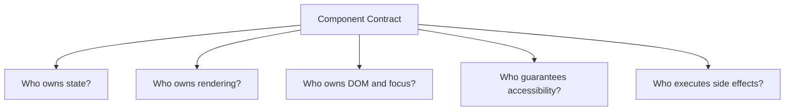

# React 组件 API 设计：从 Props、所有权到 Headless 与可访问性契约

> 好的组件 API 不以“支持最多配置”为目标，而是让正确用法自然、非法组合难以表达，并明确谁拥有 State、DOM、样式和交互语义。复用的不只是 JSX，还包括生命周期、键盘行为、焦点管理和错误边界。

---

## 一、本文解决什么问题

- Props 越多是否越灵活；
- 多个 Boolean 为什么会产生冲突模式；
- Compound Components 何时优于单个巨型配置对象；
- Render Props 与 Custom Hook 如何选择；
- Headless Components 应承担多少可访问性行为；
- 组件如何同时支持 Controlled 与 Uncontrolled State；
- `children`、Named Slot 与 `asChild` 有何区别；
- Context 是否可以替代所有 Props；
- Ref 应暴露 DOM 还是最小命令集合；
- 组件 State、渲染结构和业务数据分别由谁拥有；
- 可访问性是文档建议还是 API 契约；
- 如何测试组件 API 的类型、行为、键盘与生命周期。

本文以现代 React 与 TypeScript 为主。React 不同版本对 Ref、`forwardRef`、Server Components 和表单 API 的支持存在差异，组件库必须明确 React Peer Dependency 范围并在目标版本验证；模式原则不依赖某个样式方案。

### 核心结论

1. Props 应只表达组件真正需要的输入和事件，不应暴露内部实现的每个开关。
2. 多个互斥 Boolean 应改为 Variant、判别联合或显式状态机。
3. Compound Components 适合结构可组合、成员共享状态的组件族，但需要作用域 Context 和使用约束。
4. Render Props 让调用方控制渲染，Custom Hook 让调用方控制结构；两者的约束和可访问性责任不同。
5. Headless Component 应提供行为、状态和可访问性契约，而不是把复杂交互全部推给调用方。
6. Controlled State 由外部拥有，Uncontrolled State 由组件拥有；模式在生命周期中应保持稳定。
7. Slot 是结构注入点，`asChild`/Polymorphic API 还涉及事件、属性、语义与 Ref 合并。
8. Context 适合 Compound 内部协作和跨层稳定依赖，不应隐藏普通业务输入。
9. Ref API 应暴露最小命令能力，避免调用方依赖内部 DOM 结构。
10. 可访问性决定组件的必需结构、键盘交互、焦点与 ARIA，属于 API 的可测试契约。

---

## 二、先定义组件所有权



设计前先回答：

- State 是组件内部、父级还是外部 Store 的事实；
- 调用方能否替换结构，还是只能提供内容；
- DOM 节点是否属于组件实现细节；
- 焦点、Escape、键盘导航由谁实现；
- Analytics、网络和业务命令由谁触发；
- 卸载时谁释放 Listener、Observer 和 Portal。

所有权模糊时，组件会同时提供 `open`、`defaultOpen`、`forceOpen`、`internalOpen` 等互相竞争的入口。

---

## 三、Props 最小化

```tsx
type ConfirmDialogProps = {
  open: boolean;
  title: string;
  description?: string;
  pending?: boolean;
  onConfirm: () => void;
  onOpenChange: (open: boolean) => void;
};
```

Props 最小化不是 Props 数量越少越好，而是每个 Props 都有独立、稳定、必要的语义。

### 3.1 不传可派生值

若已有 `items`，通常不再传 `itemCount`；若已有 `status`，不再传可冲突的 `loading`。派生值应在组件内部计算。

### 3.2 传意图，不传内部步骤

优先 `onConfirm`，而不是让调用方分别控制内部 Spinner、关闭 Timer 和焦点恢复。组件负责交互协议，业务负责确认命令。

### 3.3 原生属性透传

叶子组件可复用原生类型，但要排除冲突字段：

```tsx
type ButtonProps = Omit<React.ComponentPropsWithoutRef<'button'>, 'color'> & {
  variant?: 'primary' | 'danger' | 'ghost';
};
```

无差别 Spread 可能让调用方覆盖内部 `role`、事件和 ARIA。必须定义合并顺序、冲突策略和 Ref 行为。

### 3.4 回调表达领域事件

`onSelectedUserChange(userId)` 通常比暴露原始 DOM Event 更稳定。只有调用方确实需要浏览器事件语义时才传 Event。

---

## 四、Boolean Trap

```typescript
type ButtonProps = {
  primary?: boolean;
  danger?: boolean;
  loading?: boolean;
  success?: boolean;
};
```

`primary && danger`、`loading && success` 都可能出现。改为有限模式：

```typescript
type ButtonProps = {
  variant: 'primary' | 'danger' | 'ghost';
  status?: 'idle' | 'loading' | 'success';
};
```

互斥结构用判别联合：

```typescript
type ActionProps =
  | { kind: 'button'; onPress: () => void; href?: never }
  | { kind: 'link'; href: string; onPress?: never };
```

### 4.1 Boolean 仍有合理场景

真正独立的二元能力，例如 `disabled`、`required`、`readOnly`，可以使用 Boolean。关键是它们不能与其他 Props 形成未定义组合。

### 4.2 命名正向语义

优先 `disabled` 而不是 `notEnabled`，避免双重否定。默认值和省略语义必须清晰。

---

## 五、Compound Components

Compound Components 让一组组件共享状态和语义：

```tsx
<Tabs value={tab} onValueChange={setTab}>
  <Tabs.List aria-label="账户设置">
    <Tabs.Trigger value="profile">资料</Tabs.Trigger>
    <Tabs.Trigger value="security">安全</Tabs.Trigger>
  </Tabs.List>
  <Tabs.Content value="profile"><ProfileForm /></Tabs.Content>
  <Tabs.Content value="security"><SecurityPanel /></Tabs.Content>
</Tabs>
```

### 5.1 收益

- 调用方可组合结构；
- 根组件集中管理选中状态与 ID；
- Trigger/Content 保持语义关联；
- 比巨型 `items` 配置更适合富内容；
- 成员可通过 Context 协作。

### 5.2 风险

- 成员脱离 Root 使用；
- 嵌套多个实例时 Context 串位；
- 任意结构破坏可访问性顺序；
- 运行时才发现缺少 Trigger/Content；
- Context Value 不稳定导致广泛更新。

### 5.3 Scope 与错误提示

```tsx
function useTabsContext(): TabsContextValue {
  const value = useContext(TabsContext);
  if (value === null) {
    throw new Error('Tabs components must be used inside <Tabs>');
  }
  return value;
}
```

不要用伪造默认值隐藏缺失 Provider。复杂组件库还要验证嵌套作用域和 Portal 场景。

---

## 六、Render Props

Render Props 把状态与行为交给调用方渲染：

```tsx
<Disclosure>
  {({ open, toggle, buttonProps, panelProps }) => (
    <section>
      <button {...buttonProps} onClick={toggle}>{open ? '收起' : '展开'}</button>
      {open && <div {...panelProps}>内容</div>}
    </section>
  )}
</Disclosure>
```

### 6.1 适用场景

- 虚拟化、测量和数据边界；
- 调用方必须决定完整渲染结构；
- 同一行为有多种视觉表达；
- 需要把已合并的 Props 交给指定节点。

### 6.2 与 Custom Hook 对比

| 维度 | Render Props | Custom Hook |
|---|---|---|
| 调用位置 | JSX 树 | 组件函数顶层 |
| 结构控制 | 调用方 | 调用方 |
| 行为封装 | 组件可包裹生命周期 | Hook 封装逻辑 |
| Context 边界 | 可由组件建立 | 需调用方提供 |
| 可访问性约束 | 可返回 Prop Getter | 更依赖调用方正确挂载 |

Hooks 替代了许多逻辑复用场景，但 Render Props 对“必须把行为绑定到某个渲染位置”的 API 仍有价值。

### 6.3 避免 Props Getter 冲突

若提供 `getTriggerProps(userProps)`，必须定义事件调用顺序、`preventDefault`、ARIA 覆盖和 Ref 合并。隐藏的合并规则越多，API 越难调试。

---

## 七、Headless Components

Headless Component 不规定视觉样式，但应负责复杂行为和可访问性：

- 状态转换；
- 键盘交互；
- 焦点移动与恢复；
- ARIA 属性和 ID 关联；
- Dismiss、Outside Interaction；
- Portal 与滚动锁边界；
- Controlled/Uncontrolled 协议。

### 7.1 Headless 不等于无 DOM

有些 Headless API 渲染最小语义节点，有些提供 Prop Getter 或 Slot。关键是视觉可替换，而不是完全不创建 DOM。

### 7.2 灵活性与安全的平衡

如果调用方能把 Dialog Trigger 渲染成不可聚焦 `<div>`，组件就无法保证键盘可用。Polymorphic API 应限制可接受元素，或在开发环境警告不兼容语义。

### 7.3 行为不应由 CSS 假装

Accordion、Menu、Combobox、Dialog 具有不同 WAI-ARIA 和键盘模型，不能只通过同一 `open` Boolean 加动画实现。应参考当前平台和 WAI-ARIA Authoring Practices，并在真实辅助技术中验证。

---

## 八、Controlled State

```tsx
type AccordionProps = {
  value: string | null;
  onValueChange: (value: string | null) => void;
};
```

外部是事实源，组件通过回调请求改变。外部可以拒绝更新，组件必须继续显示 Props 值。

### 8.1 Uncontrolled 版本

```tsx
type UncontrolledAccordionProps = {
  defaultValue?: string | null;
  onValueChange?: (value: string | null) => void;
};
```

`defaultValue` 只用于初始化，后续变化不持续控制内部 State。

### 8.2 双模式 API

```typescript
type AccordionProps =
  | { value: string | null; onValueChange: (value: string | null) => void; defaultValue?: never }
  | { defaultValue?: string | null; onValueChange?: (value: string | null) => void; value?: never };
```

类型可减少混用，但运行时仍应检测生命周期中模式切换。受控判定应明确，不能用 Truthy 判断，因为 `null`、空字符串可能是合法值。

### 8.3 Controllable State 的规则

- 当前值从唯一来源读取；
- 用户意图只触发一次回调；
- Uncontrolled 才修改内部 State；
- 模式生命周期内稳定；
- Reset 和 Form 集成语义明确；
- 外部更新与用户事件顺序可测试。

---

## 九、Slot API

Named Slot 通过 Props 注入区域：

```tsx
<PageLayout
  header={<PageHeader />}
  sidebar={<Filters />}
  footer={<Pagination />}
>
  <Results />
</PageLayout>
```

适合布局拥有结构、调用方拥有内容的场景。

### 9.1 `children` 与 Named Slot

单一主要内容使用 `children`；多个有语义区域使用命名 Props。不要要求调用方依赖 Child 顺序和 `child.type` 猜测 Slot，这会破坏包装、Lazy 和 Server Component 边界。

### 9.2 `as` 与 `asChild`

Polymorphic API 可减少额外 Wrapper：

```tsx
<Button asChild>
  <a href="/settings">设置</a>
</Button>
```

但必须解决：

- 内部和用户 `onClick` 的顺序；
- `disabled` 在 `<a>` 上没有原生语义；
- `className`、Style 与 ARIA 合并；
- 单 Child 限制；
- Ref 合并；
- Child 是否接受并透传 Props；
- 服务端/客户端组件边界。

这类 API 功能强，但类型和运行时错误信息必须足够清晰。

---

## 十、Context API

Context 适合：

- Compound Component 内部共享；
- 主题、Locale、认证会话等跨层依赖；
- 稳定服务入口与状态 Dispatch。

不适合把每个普通 Props 都隐藏起来。

### 10.1 更新粒度

Provider Value 变化会通知消费者。把巨大对象和高频 State 放在单个 Context 中可能扩大 Render：

```tsx
const value = useMemo(() => ({ state, dispatch }), [state, dispatch]);
```

`useMemo` 只能稳定容器引用，`state` 变化仍会通知全部消费者。需要时拆分 State/Dispatch Context、细分领域或使用支持 Selector 的外部 Store，并用 Profiler 验证。

### 10.2 Context 是依赖注入，不是全局变量

Provider 定义作用域，同一组件可在不同 Provider 下得到不同值。服务端渲染还需请求隔离，不能把用户 Context 数据放入模块单例。

---

## 十一、Ref API

Ref 是命令式逃生口，适合 Focus、Scroll、Selection、Media 和第三方实例。

### 11.1 暴露最小命令接口

```tsx
export type SearchInputHandle = {
  focus: () => void;
  selectAll: () => void;
};

function SearchInput(props: SearchInputProps, ref: React.Ref<SearchInputHandle>) {
  const inputRef = useRef<HTMLInputElement>(null);

  useImperativeHandle(ref, () => ({
    focus: () => inputRef.current?.focus(),
    selectAll: () => inputRef.current?.select(),
  }), []);

  return <input ref={inputRef} {...props} />;
}
```

具体组件签名需按目标 React 版本选择 Ref-as-prop 或 `forwardRef`。组件库若支持多个 React 主版本，应编译和类型测试所有范围。

### 11.2 为什么不直接暴露 DOM

暴露内部节点会让调用方依赖标签、Wrapper 和布局，阻碍重构。只有叶子 Primitive 明确承诺原生元素语义时，才适合直接提供 DOM Ref。

### 11.3 Ref Callback 生命周期

节点替换、卸载和 Strict Mode 检查都可能触发 Ref 连接/清理。Ref Callback 应可重复且正确处理 `null` 或当前版本支持的 Cleanup 契约。

---

## 十二、可访问性契约

可访问性不是额外 Props，而是组件行为的一部分。

### 12.1 契约内容

- 正确原生语义优先于 ARIA 模拟；
- 键盘操作与指针操作等价；
- 焦点进入、循环、恢复和可见性；
- Label、Description、Error 的 ID 关联；
- Disabled、Read-only、Required 状态；
- 动态状态的 Announcement；
- Portal 后的阅读顺序和背景隔离；
- Reduced Motion、High Contrast 和放大布局。

### 12.2 Dialog 示例

Dialog API 需要明确：

- 打开后初始焦点去哪里；
- Tab 是否限制在 Modal 内；
- Escape 和背景点击能否关闭；
- Pending 时能否关闭；
- 关闭后焦点恢复到哪个 Trigger；
- Title/Description 是否必需；
- 嵌套 Dialog 如何处理。

这些决策比 `borderRadius` 更接近组件核心 API。

### 12.3 类型不能证明可访问性

TypeScript 可要求 `aria-label` 或 `title`，却不能证明文本有意义、焦点顺序正确。必须结合静态规则、组件测试、键盘测试和真实屏幕阅读器验证。

---

## 十三、组件所有权边界

| 能力 | 组件负责 | 调用方负责 |
|---|---|---|
| 状态协议 | Controlled/Uncontrolled 规则 | 持久化业务 State |
| 交互 | 键盘、焦点、Dismiss | 业务 Command |
| 渲染 | 必要语义和 Slot 契约 | 内容与视觉样式 |
| 错误 | API 误用提示 | 网络/业务错误映射 |
| 生命周期 | Listener、Portal、Observer Cleanup | 外部资源生命周期 |
| 安全 | 不危险透传属性 | 权限与输入校验 |

组件不应直接 Fetch 业务数据，除非它本身就是明确的数据边界；通用 UI 组件更适合接收 State 与 Event Callback。

---

## 十四、常见误区与错误案例

### 14.1 Props 越多越灵活

过多开关会形成组合爆炸和隐式优先级。应提供有限 Variant、组合 API 或拆分组件。

### 14.2 Compound Components 自动更易用

它增加结构自由，也增加错误嵌套、Context 和可访问性约束。简单组件不需要 Compound。

### 14.3 Headless 意味着可访问性由用户负责

错误。复杂行为恰恰应由 Headless 层统一实现；视觉定制不应牺牲键盘和语义。

### 14.4 Context 可以消灭 Props Drilling

Context 会隐藏依赖并扩大耦合。局部、明确、稳定的输入仍应通过 Props。

### 14.5 Ref 可以同步控制组件 State

Ref 适合命令，不应成为第二套 State 写入通道。可观察状态使用 Controlled Props/Events。

### 14.6 同时传 `value` 和 `defaultValue`

这使所有权不明确。类型和运行时应拒绝混用，且生命周期内不能切换模式。

### 14.7 `asChild` 可包装任意节点

错误。Child 必须接受并正确透传事件、ARIA 和 Ref，最终语义也必须匹配组件行为。

---

## 十五、版本与演进策略

组件库 API 一旦发布就是跨团队契约。需要：

- Semantic Versioning 与迁移指南；
- Deprecated Props 的可观测迁移期；
- Codemod 或类型错误引导；
- React、TypeScript 和浏览器支持矩阵；
- SSR、Hydration、RSC 边界说明；
- CSS Token 与 DOM 结构稳定性等级；
- 公开哪些 Ref/Slot，哪些是实现细节。

不要承诺内部 DOM 层级永远不变，除非消费者必须依赖它；测试也应优先使用 Role、Label 和可观察行为。

---

## 十六、测试与验证

### 16.1 类型测试

验证非法 Props 组合被拒绝：

```tsx
<Action kind="link" href="/docs" />;

// @ts-expect-error link 模式不能使用 onPress
<Action kind="link" href="/docs" onPress={() => {}} />;
```

### 16.2 Controlled 协议测试

- 外部不更新时组件值保持不变；
- 用户事件只调用一次 `onValueChange`；
- Uncontrolled 正常更新内部 State；
- `defaultValue` 后续变化不覆盖 State；
- 模式切换产生明确警告。

### 16.3 可访问性测试

- 通过 Role/Name 查询；
- 只用键盘完成操作；
- 焦点进入、移动和恢复；
- ARIA ID 关系正确；
- Disabled/Read-only 行为正确；
- Portal 和嵌套实例不串位；
- 使用真实浏览器和至少目标辅助技术人工验证。

### 16.4 生命周期与性能

测试 Strict Mode 下 Listener/Observer Cleanup，Profiler 验证 Context 更新范围，Performance 面板检查 Dialog 打开、焦点和布局。不要因为“Headless”就假设性能免费。

---

## 十七、方案选择

| 需求 | 优先模式 | 代价 |
|---|---|---|
| 简单叶子控件 | 明确 Props + 原生属性 | 定制范围有限 |
| 多区域布局 | Named Slot | Slot 数量会增长 |
| 共享状态组件族 | Compound Components | Context 与结构约束 |
| 调用方完全控制结构 | Hook 或 Render Props | 可访问性更难保证 |
| 无样式复杂交互 | Headless Component | 实现与测试成本高 |
| 外部协调 State | Controlled State | 调用方样板增加 |
| DOM 命令 | 最小 Ref Handle | 命令式耦合 |
| 跨层稳定依赖 | Context | 更新与依赖隐式化 |

---

## 十八、工程检查清单

- Props 是否最小且语义独立；
- 是否存在互斥 Boolean；
- State、渲染、DOM 和业务 Command 所有者是否明确；
- Controlled/Uncontrolled 是否互斥且模式稳定；
- Compound 成员脱离 Root 时是否报错；
- Slot/`asChild` 是否定义事件、ARIA 和 Ref 合并；
- Context 是否过大或隐藏普通依赖；
- Ref 是否只暴露必要命令；
- 原生语义、键盘和焦点契约是否完整；
- SSR/Hydration 与目标 React 版本是否验证；
- 类型、行为、可访问性和性能是否都有测试。

---

## 十九、总结

1. 组件 API 从所有权开始，而不是从 Props 清单开始。
2. Props 最小化要求每个输入都有必要、独立和稳定的语义。
3. Boolean Trap 应用 Variant、判别联合或状态机消除。
4. Compound Components 适合成员协作，Render Props/Hook 适合调用方控制结构。
5. Headless 层应拥有复杂行为和可访问性，不只提供 State。
6. Controlled 与 Uncontrolled 的本质是 State 所有权，不能生命周期中切换。
7. Slot 和 Polymorphic API 必须定义属性、事件、语义与 Ref 合并。
8. Context 适合作用域依赖，不应成为隐藏所有 Props 的捷径。
9. Ref 是最小命令接口，不是第二套 State API。
10. 可访问性、版本兼容和测试共同构成生产级组件契约。

真正稳定的组件不是“能配置任何东西”，而是让调用方清楚知道哪些可以控制、哪些由组件保证，以及错误组合为什么不被允许。

---

## 问答复盘

### Q1：Props 最小化是否意味着 Props 越少越好？

**答：** 不是。目标是每个 Props 都必要且语义独立，避免重复事实和内部实现开关。

### Q2：什么时候 Boolean Props 是合理的？

**答：** 当它表达独立二元能力，如 `disabled`；互斥模式应使用 Variant 或判别联合。

### Q3：Compound Components 的主要收益是什么？

**答：** 调用方可组合结构，成员通过 Root 共享状态和语义；代价是 Context、嵌套和可访问性约束更复杂。

### Q4：Render Props 与 Custom Hook 如何选择？

**答：** Hook 让调用方完全拥有结构；Render Props 适合把行为和已合并 Props 绑定到特定渲染边界。

### Q5：Headless Component 是否可以不负责键盘交互？

**答：** 不应。视觉可以无样式，但复杂组件的语义、焦点和键盘行为应由 Headless 层统一保证。

### Q6：受控组件中用户点击后，组件能否先修改内部 State？

**答：** 不应把内部 State 当事实源。它应触发回调，并继续以外部 `value` 渲染。

### Q7：为什么 `asChild` 是高风险 API？

**答：** 它需要正确合并事件、ARIA、样式和 Ref，还必须保证最终元素语义与行为兼容。

### Q8：Context Value 使用 `useMemo` 后是否不会导致消费者更新？

**答：** 不是。依赖变化时 Value 仍会变化并通知消费者；应拆分职责和订阅范围并实际测量。

### Q9：Ref 为什么应暴露命令而非内部 DOM？

**答：** 最小命令接口能保持实现可重构，并阻止调用方依赖 Wrapper、标签和内部布局。

---

## 延伸知识

- **Hooks 运行机制**：Custom Hook、闭包快照、Effect 和 Ref 生命周期。
- **表单组件**：Controlled Input、Validation、Form State 与 Server Error。
- **可访问性**：WAI-ARIA Pattern、Focus Management、Live Region 与 Portal。
- **设计系统**：Token、Variant、Primitive、Component Composition 与版本治理。
- **Server Components**：Client Boundary、Serializable Props 与交互组件拆分。
- **组件测试**：Type Test、Contract Test、Visual Regression 与辅助技术验证。
