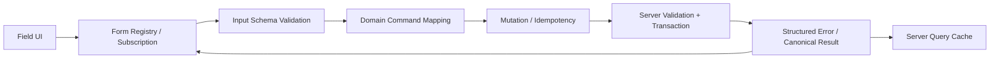
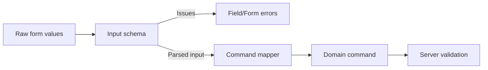
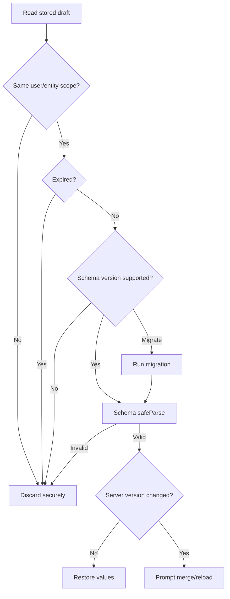

# React 表单工程：React Hook Form、Zod、动态字段与草稿治理

> 表单库解决的是字段注册、订阅、校验和提交编排，不会自动定义业务输入契约、服务端错误协议、草稿安全与重复提交语义。工程质量取决于这些边界能否使用同一套 Field Path、Schema、Version 和 Operation Identity 协作。

---

## 一、为什么表单进入工程阶段后迅速变复杂

一个包含几十个字段的订单表单，通常还会出现：

- 字段分区、条件显示和动态列表；
- 原生 Input 与第三方 Select、Date Picker 混用；
- 客户端 Schema 与服务端规则不一致；
- 后端返回 `items[3].sku` 错误，但列表刚刚发生重排；
- Initial Values 异步加载后覆盖用户已经输入的 Draft；
- 整张 Form 每次键入都重新 Render；
- 自动保存旧请求覆盖新草稿；
- 页面刷新后草稿需要恢复，但不能泄露其他账号数据；
- Pending Button 已禁用，服务端仍收到重复命令。

这些问题不能靠增加更多 `useState` 解决。需要明确分层：



本文以当前 React Hook Form、Formik 和 Zod 的公开 API 为参考。不同 Major Version 的默认值、Type Inference、Resolver 和 Array 行为可能变化，项目必须锁定版本并查阅对应文档。文章重点是相对稳定的工程边界，不把某个库的内部实现当成业务契约。

### 核心结论

1. 小型表单优先使用原生 Form 能力；表单库应在重复协调成本真实出现后引入。
2. React Hook Form 以字段注册和细粒度订阅为中心，适合原生非受控输入与大型表单。
3. Formik 以集中 Values、Errors、Touched 和 Context 为中心，适合已有受控模型，但大型表单要测量更新范围。
4. Schema Validation 应验证外部输入，不应把 UI Draft、Domain Command 和数据库实体混成一个 Schema。
5. Zod 提供运行时解析和 TypeScript 推断，但客户端通过不代表服务端可以信任。
6. Server Error 必须使用稳定 Field Path 和 Error Code；未知路径进入 Form-level Error。
7. Dynamic Field 的隐藏、卸载和提交保留策略必须显式定义。
8. Field Array 的 React Key 必须稳定，不能用 Index；表单行身份还应与服务端 ID 分离。
9. 大型表单性能应从订阅粒度、Validation 范围和 DOM 数量测量，而不是先堆 Memoization。
10. 草稿保存需要版本、身份隔离、TTL、迁移、竞态和敏感数据策略。
11. `isSubmitting` 只能降低前端重复交互，最终防重复依赖服务端 Idempotency。

---

## 二、什么时候需要表单库

### 2.1 原生 Form 已经足够

以下场景通常可以使用 Uncontrolled Input、`FormData` 和浏览器 Constraint Validation：

- 登录、订阅、简单搜索；
- 字段数量少；
- 只在 Submit 时读取；
- 没有复杂动态字段和跨字段联动；
- 错误协议简单；
- 不需要细粒度 Dirty/Touched 观察。

库本身也有学习、Bundle、升级和适配成本。不要因为“React 项目应该有表单库”而默认引入。

### 2.2 引入库的合理信号

- 多个页面重复实现 Field Registration；
- 需要统一 Dirty、Touched、Error 和 Submit State；
- 有复杂 Schema、异步校验和服务端错误回写；
- 动态 Field Array 频繁增删移动；
- 大型 Controlled Form 出现广泛 Render；
- 需要组件库 Field Adapter；
- 草稿保存、分步表单和 Reset Policy 复杂；
- 团队需要一致的测试和可访问性封装。

选型前应先写出数据流和错误协议，再选择承载它的库。

---

## 三、React Hook Form：注册与订阅模型

React Hook Form（RHF）常通过 `register` 连接原生输入，通过 `formState`、`useWatch` 和 `useFormState` 订阅需要的状态。

```tsx
type LoginFormValues = {
  email: string;
  password: string;
};

function LoginForm() {
  const {
    register,
    handleSubmit,
    formState: { errors, isSubmitting },
  } = useForm<LoginFormValues>({
    defaultValues: {
      email: '',
      password: '',
    },
  });

  async function onSubmit(values: LoginFormValues) {
    await login(values);
  }

  return (
    <form onSubmit={handleSubmit(onSubmit)}>
      <input
        type="email"
        {...register('email', { required: '请输入邮箱' })}
        aria-invalid={Boolean(errors.email)}
      />
      {errors.email && <p>{errors.email.message}</p>}

      <input
        type="password"
        {...register('password', { required: '请输入密码' })}
      />

      <button type="submit" disabled={isSubmitting}>
        {isSubmitting ? '登录中' : '登录'}
      </button>
    </form>
  );
}
```

`onSubmit` 必须返回或 `await` 实际 Promise，`isSubmitting` 才能覆盖完整异步周期。网络异常仍应在 Submit Handler 或 Mutation Layer 中处理，不能让未处理 Promise 直接逃逸。

### 3.1 `defaultValues` 是表单基线

```tsx
const form = useForm<ProfileFormValues>({
  defaultValues: toProfileFormValues(profile),
});
```

RHF 当前文档明确说明 `defaultValues` 会被缓存。后台 Query 返回新对象并不等于表单应自动重建。保存成功或显式切换实体时，应使用 `reset` 建立新的 Values 与 Dirty Baseline：

```ts
const confirmedProfile = await updateProfile(values);
form.reset(toProfileFormValues(confirmedProfile));
```

Dirty Form 遇到 Background Refetch 时，不要无条件 Reset。应比较 Entity ID/Version，并让用户选择保留 Draft、重新加载或合并。

### 3.2 `register` 与 `Controller`

原生 Input 优先使用 `register`。第三方 Controlled Component 如果使用 `value`/`onChange`/`onBlur` 的非原生协议，可以使用 `Controller`：

```tsx
<Controller
  name="countryCode"
  control={control}
  render={({ field, fieldState }) => (
    <CountrySelect
      value={field.value}
      onChange={field.onChange}
      onBlur={field.onBlur}
      inputRef={field.ref}
      error={fieldState.error?.message}
    />
  )}
/>
```

Adapter 必须正确转发 Value、Blur 和 Ref，不能只转发 `onChange`。不要把所有原生 Input 都包成 `Controller`，否则会放弃非受控注册带来的订阅优势。

### 3.3 只订阅需要的状态

在 Form Root 读取整个 `formState`、`watch()` 全部字段，再把结果传遍所有后代，可能扩大每次更新范围。优先：

- Field 内通过 `useFormState({ name })` 订阅对应 Error；
- 联动区域使用 `useWatch({ name })` 读取必要字段；
- 非 UI 逻辑使用库提供的 Subscription API；
- 使用 `FormProvider` 共享能力，但不要让所有组件读取所有状态。

细粒度订阅是否产生收益必须用 React Profiler 和真实表单测量。

### 3.4 `shouldUnregister` 是数据语义

条件字段卸载时：

- `shouldUnregister: false` 通常保留已卸载字段值；
- `shouldUnregister: true` 更接近原生 Form，卸载字段从注册与结果中移除。

选择取决于业务：切换配送方式后，隐藏的自提点是否仍应提交？不能只为“清内存”随意切换。Field Array 与 `shouldUnregister` 的组合还有版本限制，应按当前 RHF 文档测试，不能套用普通字段结论。

---

## 四、Formik 边界：集中 Controlled Form

Formik 通常集中维护 `values`、`errors`、`touched`、`isSubmitting` 和 `status`，并通过 Context/Render Props/Hook 暴露。

```tsx
function ProfileForm({ profile }: { profile: Profile }) {
  const formik = useFormik({
    initialValues: toProfileFormValues(profile),
    validate: validateProfile,
    onSubmit: async (values, helpers) => {
      try {
        const confirmed = await updateProfile(values);
        helpers.resetForm({
          values: toProfileFormValues(confirmed),
        });
      } catch (error) {
        applyFormikServerError(error, helpers);
      }
    },
  });

  return (
    <form onSubmit={formik.handleSubmit}>
      <input
        name="displayName"
        value={formik.values.displayName}
        onChange={formik.handleChange}
        onBlur={formik.handleBlur}
      />
      <button type="submit" disabled={formik.isSubmitting}>
        保存
      </button>
    </form>
  );
}
```

当前 Formik 文档中，Async `onSubmit` Resolve 后会结束 `isSubmitting`；同步 Handler 则需要显式 `setSubmitting(false)`。无论库是否自动收尾，业务代码都应处理 Reject，并避免错误后卡在 Pending。

### 4.1 Formik 适合什么

- 项目已有成熟 Formik Field 组件；
- 团队偏好显式 Controlled Values；
- 表单规模中等，集中状态易于理解；
- 已有围绕 Formik 的错误、校验和测试基础设施；
- 迁移成本高于当前痛点。

### 4.2 Formik 的工程边界

- Context 中的集中 Values 变化可能让较大子树更新，应测量并使用 Field/FastField、分区或自定义订阅策略；
- `validationSchema` 的直接集成传统上围绕 Yup-compatible Schema，Zod 通常需要 Adapter 或自定义 `validate`；
- `enableReinitialize` 会在 `initialValues` 变化时重置表单，Dirty Draft 可能被覆盖；
- `resetForm({ values })` 可以显式建立新 Initial State，比自动跟随 Query Object 更可控；
- 复杂 Field Array 和深层路径仍需稳定 Key 与错误映射协议。

Formik 不是“过时就必须重写”。是否迁移应依据维护风险、性能证据、功能缺口和团队成本，而不是流行度。

---

## 五、React Hook Form 与 Formik 如何选择

| 维度 | React Hook Form | Formik |
|---|---|---|
| 核心模型 | 注册、Ref 与细粒度订阅 | 集中 Controlled Values 与 Context |
| 原生输入 | `register` 直接连接 | 常由 `value`/`onChange` 控制 |
| 第三方控件 | `Controller`/Adapter | Field Adapter 或显式 Setter |
| Schema | Resolver 生态 | `validationSchema` 或 `validate` |
| 动态数组 | `useFieldArray` | `<FieldArray>` / Array Helpers |
| Initial 更新 | 显式 `reset` 或 Reactive Values | `resetForm` / `enableReinitialize` |
| 性能关注 | 订阅范围、Controller 数量 | Context 更新范围、Field 粒度 |
| 迁移成本 | 取决于注册与 Adapter 数量 | 取决于现有 Field 组件和状态依赖 |

两者都可以构建可靠表单。真实选型至少实现一个包含第三方 Select、Server Error、Field Array 和 Reset 的 Spike，再测量目标设备上的 Render 与维护复杂度。

---

## 六、Schema Validation：定义输入边界

Schema 的职责是把不可信输入解析为已验证结构：



### 6.1 不要一个 Schema 承担所有层

| Schema/Type | 典型内容 |
|---|---|
| Form Draft | String、空值、临时 UI ID |
| Parsed Input | 已 Trim、格式和跨字段合法 |
| Domain Command | Number、Date-only、业务枚举、Expected Version |
| API DTO | 传输字段、序列化格式 |
| Persistence Entity | 数据库 ID、审计字段、内部状态 |

Form Draft 允许暂时无效；数据库实体不应允许。强行共用会让 UI 无法表达中间态，或让服务端接受过宽结构。

### 6.2 Client 与 Server 共享 Schema 的边界

可以共享纯输入规则和 Error Code，但仍要考虑：

- 服务端必须重新 Parse，不能信任客户端结果；
- Authorization、唯一性和库存只能在服务端确认；
- Server-only Dependency 不应打进浏览器 Bundle；
- 本地化 Message 可能由 UI 层决定；
- 客户端与服务端部署版本可能短暂不同；
- Schema Migration 和向后兼容需要版本策略。

共享代码能减少漂移，但不等于共享信任。

### 6.3 Validation 时机

- Field Change：只验证相关轻量规则；
- Blur：适合格式和局部异步提示；
- Submit：验证完整 Snapshot；
- Server：再次校验并执行授权、唯一约束和事务；
- Draft Restore：先按 Draft Schema/Migration 校验，再放入 Form。

不要在每次键入时同步运行昂贵的整表 Schema。

---

## 七、Zod：运行时解析与类型推断

```ts
import { z } from 'zod';

const orderFormSchema = z
  .object({
    customerEmail: z.string().trim().email('邮箱格式不正确'),
    deliveryMethod: z.enum(['delivery', 'pickup']),
    address: z.string(),
    pickupStoreId: z.string(),
    items: z
      .array(
        z.object({
          clientRowId: z.string(),
          productId: z.string().min(1, '请选择商品'),
          quantity: z
            .string()
            .regex(/^[1-9]\d*$/, '数量必须是正整数'),
        }),
      )
      .min(1, '至少添加一个商品'),
  })
  .superRefine((values, context) => {
    if (values.deliveryMethod === 'delivery' && !values.address.trim()) {
      context.addIssue({
        code: 'custom',
        path: ['address'],
        message: '请输入配送地址',
      });
    }

    if (values.deliveryMethod === 'pickup' && !values.pickupStoreId) {
      context.addIssue({
        code: 'custom',
        path: ['pickupStoreId'],
        message: '请选择自提门店',
      });
    }
  });

type OrderFormValues = z.infer<typeof orderFormSchema>;
```

### 7.1 `safeParse` 与 Error Issue

```ts
const result = orderFormSchema.safeParse(rawValues);

if (!result.success) {
  for (const issue of result.error.issues) {
    console.log(issue.path, issue.code, issue.message);
  }
} else {
  const parsedValues = result.data;
}
```

不要只使用 Message。`path` 用于 Field Mapping，`code` 用于分类和本地化，Message 用于展示或开发诊断。

### 7.2 Transform 与 Coercion 边界

表单 HTML Value 通常是 String。可以用 Transform 生成 Number，但要注意空字符串和中间态：

```ts
const positiveIntegerString = z
  .string()
  .regex(/^[1-9]\d*$/)
  .transform((value) => Number(value));
```

不要未经验证直接 `z.coerce.number()`：JavaScript Coercion 可能把空字符串转换为 `0`，与业务“未填写”语义不同。先定义允许的 Raw Input，再 Transform。

### 7.3 Async Refinement

Zod 支持异步解析路径，但用户名唯一性、库存等远程校验仍需 Debounce、Abort、Request ID 和服务端事务确认。把 Fetch 隐藏进每次整表 Schema Parse，容易形成不可见 Waterfall 和重复请求。

优先让 Schema 负责纯结构规则，远程可用性由显式 Validation Service 或 Submit Mutation 处理。

---

## 八、React Hook Form + Zod 完整组合

```tsx
import { zodResolver } from '@hookform/resolvers/zod';
import { useFieldArray, useForm } from 'react-hook-form';

function createEmptyOrder(): OrderFormValues {
  return {
    customerEmail: '',
    deliveryMethod: 'delivery',
    address: '',
    pickupStoreId: '',
    items: [createEmptyItem()],
  };
}

function OrderForm() {
  const {
    register,
    control,
    handleSubmit,
    reset,
    setError,
    formState: { errors, isDirty, isSubmitting },
  } = useForm<OrderFormValues>({
    resolver: zodResolver(orderFormSchema),
    defaultValues: createEmptyOrder(),
    mode: 'onBlur',
  });

  const { fields, append, remove, move } = useFieldArray({
    control,
    name: 'items',
  });

  async function onSubmit(values: OrderFormValues) {
    try {
      const command = toCreateOrderCommand(values);
      const confirmed = await createOrder(command);
      reset(toOrderFormValues(confirmed));
    } catch (error) {
      applyReactHookFormServerErrors(error, setError);
    }
  }

  return (
    <form onSubmit={handleSubmit(onSubmit)}>
      <input {...register('customerEmail')} />
      {errors.customerEmail && <p>{errors.customerEmail.message}</p>}

      {fields.map((field, index) => (
        <fieldset key={field.id}>
          <input
            type="hidden"
            {...register(`items.${index}.clientRowId` as const)}
          />
          <select {...register(`items.${index}.productId` as const)}>
            <option value="">请选择商品</option>
          </select>
          <input {...register(`items.${index}.quantity` as const)} />
          <button type="button" onClick={() => remove(index)}>
            删除
          </button>
        </fieldset>
      ))}

      <button type="button" onClick={() => append(createEmptyItem())}>
        添加商品
      </button>
      <button type="submit" disabled={isSubmitting || !isDirty}>
        {isSubmitting ? '提交中' : '提交订单'}
      </button>
    </form>
  );
}
```

示例中的 `createOrder` 仍必须处理 HTTP Error、Runtime Validation、Idempotency 和 Unknown Result；Resolver 只负责客户端 Form Values。

`move` 在示例中尚未绑定 UI，但说明 Field Array 可以表达排序。真实排序按钮必须有可访问名称、键盘操作和边界检查。

---

## 九、Server Error Mapping：统一 Field Path

服务端应返回结构化错误：

```json
{
  "code": "VALIDATION_FAILED",
  "issues": [
    {
      "path": ["items", "row-7", "productId"],
      "code": "PRODUCT_UNAVAILABLE",
      "message": "该商品当前不可购买"
    },
    {
      "path": ["_form"],
      "code": "ORDER_CONFLICT",
      "message": "订单数据已变化，请刷新后重试"
    }
  ]
}
```

这里使用稳定 `clientRowId`，而不是数组 Index。客户端收到后查找当前 Row Index，再映射成库路径：

```ts
function resolveIssuePath(
  issuePath: readonly string[],
  values: OrderFormValues,
): `items.${number}.productId` | 'root.server' | undefined {
  if (issuePath[0] === '_form') return 'root.server';

  const [collection, rowId, field] = issuePath;
  if (collection !== 'items' || field !== 'productId') return undefined;

  const index = values.items.findIndex((item) => item.clientRowId === rowId);
  return index >= 0 ? `items.${index}.productId` : undefined;
}
```

### 9.1 React Hook Form

```ts
setError('items.2.productId', {
  type: 'server',
  message: '该商品当前不可购买',
});

setError('root.server', {
  type: 'server',
  message: '订单提交失败，请检查后重试',
});
```

### 9.2 Formik

```ts
helpers.setFieldError(
  'items[2].productId',
  '该商品当前不可购买',
);
helpers.setStatus({ formError: '订单提交失败，请检查后重试' });
```

### 9.3 映射规则

- 只接受前端已知且允许显示的 Path；
- 未知 Path 进入 Form-level Error，并记录脱敏诊断；
- Field 修改后清理对应旧 Server Error；
- 不因一个字段 Change 清除所有 Server Error；
- 旧 Submission Response 不能写入新的编辑会话；
- Message 若需要本地化，优先根据 Error Code 映射。

---

## 十、Dynamic Fields：显示条件也是数据协议

动态字段可以来自用户选择，也可以来自服务端配置。

### 10.1 判别联合优于互斥可选字段

```ts
const deliverySchema = z.discriminatedUnion('deliveryMethod', [
  z.object({
    deliveryMethod: z.literal('delivery'),
    address: z.string().trim().min(1),
  }),
  z.object({
    deliveryMethod: z.literal('pickup'),
    pickupStoreId: z.string().min(1),
  }),
]);
```

这样可以让不同模式只拥有合法字段，减少 `{ address?: string; pickupStoreId?: string }` 产生的非法组合。

### 10.2 隐藏字段保留还是删除

切换 `delivery -> pickup -> delivery` 时，需要决定地址：

- 保留，方便用户切回来；
- 删除，避免提交隐藏数据；
- 保留在 Draft，但 Command Mapper 只提交当前分支；
- 高敏感字段切换后立即清理。

推荐把“UI 是否保留”和“API 是否提交”分开。即使表单库保留隐藏值，Command Mapper 也应根据当前 Discriminant 构造最小 Payload。

### 10.3 配置驱动表单

不要把服务端返回的任意 Component Name、HTML 或 Validation Script 直接执行。使用受控 Field Registry：

```ts
const fieldRegistry = {
  text: TextField,
  select: SelectField,
  date: DateField,
} satisfies Record<string, React.ComponentType<FieldProps>>;
```

配置必须经过 Schema 校验、版本控制和组件 Allowlist。服务端控制业务字段，不应获得执行任意前端代码的能力。

---

## 十一、Field Array：稳定身份比数组位置重要

### 11.1 三种 ID 不要混用

| ID | 职责 |
|---|---|
| `field.id` | RHF 为 React Render 生成的稳定 Key |
| `clientRowId` | 草稿行跨重排、错误和保存的客户端身份 |
| `serverItemId` | 已持久化实体身份，可能暂时不存在 |

`field.id` 必须作为 JSX Key：

```tsx
{fields.map((field, index) => (
  <ItemRow key={field.id} index={index} />
))}
```

使用 Index Key 会在 Insert、Remove、Move 后把 Input DOM、Focus、Error 和局部 State 绑定到错误行。

### 11.2 Append 完整默认对象

```ts
function createEmptyItem(): OrderFormValues['items'][number] {
  return {
    clientRowId: crypto.randomUUID(),
    productId: '',
    quantity: '1',
  };
}
```

不要 Append `{}` 再等待各 Field 自行补齐，Schema、Dirty Baseline 和 Controlled Adapter 会得到不完整结构。

### 11.3 Update 与 Remount

当前 RHF 文档说明 `useFieldArray().update()` 可能让目标 Field 卸载并重新挂载。若只修改某个 Leaf 且需要保留 DOM/Focus，应考虑 `setValue`；具体行为要按锁定版本测试。

### 11.4 Array Error

同时处理：

- Row Field Error；
- Array-level Min/Max；
- 重复 Product；
- Row 之间的 Cross-field Rule；
- 重排后的 Server Error 定位；
- 删除行后 Error、Touched 和异步请求清理。

---

## 十二、大型表单性能

“字段很多”不必然慢。需要区分：

- React Render 计算；
- Schema Validation；
- 第三方 Controlled Widget；
- DOM Layout/Paint；
- Field Array 重排；
- Autosave Serialization；
- Error Summary 和复杂派生 Preview。

### 12.1 先测量更新范围

在生产构建、目标浏览器和目标设备上使用 React Profiler 与 Performance 面板：

1. 记录单字段键入；
2. 查看哪些 Field/Section Render；
3. 测量 Validator 和 Resolver 耗时；
4. 检查 Long Task、Layout 和 Paint；
5. 对比有无 DevTools 的结果；
6. 使用真实字段数和数据量。

### 12.2 React Hook Form 优化顺序

- 原生 Field 优先 `register`；
- 只为第三方 Controlled Widget 使用 `Controller`；
- Field 内订阅自己的 Error/Touched；
- `useWatch` 只监听联动所需字段；
- 避免 Root `watch()` 全表后下发；
- 将大型 Section 拆分为独立订阅边界；
- Field Array 使用稳定 ID；
- 昂贵 Schema 不在每个 Key Stroke 全量执行。

### 12.3 Formik 优化顺序

- 将无关区域移出 Formik Context 消费；
- 使用 Field/FastField 或自定义 Selector 边界；
- 分区 Validation；
- 避免在 Render 中构造大型 Derived Object；
- 测量 `enableReinitialize`、Array 更新和 Context 扩散；
- 只有证据明确时才添加 Memoization。

### 12.4 Virtualization 的边界

虚拟化可以减少 DOM，但卸载 Field 可能影响 Registration、Error Focus、浏览器 Autofill 和可访问性。长表单优先考虑 Section、Accordion、Step Form 和 Progressive Disclosure；必须虚拟化时，要定义卸载字段的保留和导航协议。

---

## 十三、草稿保存

草稿保存分为两类：

- **Local Draft**：LocalStorage、IndexedDB 或平台安全存储；
- **Remote Draft**：保存到服务器，可跨设备恢复。

### 13.1 不要直接持久化整个 Form State

通常保存：

- Values；
- Draft Schema Version；
- Entity/User/Tenant Scope；
- Base Server Version；
- Updated At、Expires At；
- 可选 Client Row ID。

通常不保存：

- Touched 和临时 Error；
- `isSubmitting`、Promise 和 AbortController；
- Access Token；
- 无必要的敏感字段；
- 不能序列化的 File/DOM Ref。

```ts
type PersistedOrderDraft = {
  schemaVersion: 3;
  userScope: string;
  orderId: string | null;
  baseServerVersion: number | null;
  values: OrderFormValues;
  updatedAt: number;
  expiresAt: number;
};
```

### 13.2 Local Draft 恢复流程



### 13.3 Debounced Local Save

```tsx
const draftValues = useWatch({ control });

useEffect(() => {
  const timer = window.setTimeout(() => {
    saveDraftSafely({
      schemaVersion: 3,
      userScope,
      orderId,
      baseServerVersion,
      values: draftValues,
      updatedAt: Date.now(),
      expiresAt: Date.now() + DRAFT_TTL,
    });
  }, 500);

  return () => window.clearTimeout(timer);
}, [draftValues, userScope, orderId, baseServerVersion]);
```

生产实现还要处理 Storage Quota、序列化失败、多 Tab 冲突和加密能力。密码、支付数据和高敏感身份信息通常不应进入通用浏览器持久化。

### 13.4 Remote Autosave

Remote Draft 是 Mutation，必须处理：

- Debounce 只减少频率；
- 同实体请求串行或使用 Generation；
- Expected Version/ETag；
- Idempotency Key；
- Offline Queue 与恢复；
- 响应乱序；
- Unknown Result；
- 页面卸载不代表服务端未保存。

Autosave Indicator 应区分“本地已保存”“正在同步”“服务器已确认”“同步失败”，不能只显示一个永久的“已保存”。

---

## 十四、防重复提交

### 14.1 前端三层保护

1. `isSubmitting` 时禁用 Submit；
2. 同一组件使用 In-flight Guard；
3. 同一逻辑提交复用 Operation/Idempotency Key。

```tsx
const inFlightRef = useRef(false);

const onSubmit = handleSubmit(async (values) => {
  if (inFlightRef.current) return;

  inFlightRef.current = true;
  const operation = getOrCreateOperationForPayload(values);

  try {
    await submitOrder(values, operation.id);
    clearCurrentOperationId();
  } catch (error) {
    if (!(error instanceof UnknownResultError)) {
      clearCurrentOperationId();
    }
    throw error;
  } finally {
    inFlightRef.current = false;
  }
});
```

`getOrCreateOperationForPayload` 必须同时保存规范化 Payload Fingerprint：只有 Timeout、断连等 Unknown Result 对同一 Payload 重试时才复用 Operation ID。用户修正字段、服务端明确拒绝或明确开始新订单后，应清除旧 Operation，生成新 ID，避免同一个 Key 对应不同 Payload。

### 14.2 服务端才是最终防线

服务端需要：

- User/Tenant + Operation Type + Idempotency Key 唯一约束；
- 同 Key Payload Fingerprint 校验；
- 原子执行业务写入与 Idempotency Record；
- 重复请求返回原结果或 Processing；
- 合理 TTL；
- Authorization 和业务校验。

Button Disabled、Debounce 和 In-flight Ref 都无法处理跨 Tab、刷新、代理 Retry 和响应丢失。

### 14.3 不要把提交错误都变成可重试

- Validation/Conflict：保留 Draft，回写 Field/Form Error；
- 401：受控重新认证；
- 403：停止提交并清理敏感状态；
- 429：遵守 `Retry-After`；
- 5xx/Network：仅在幂等保证下重试；
- Timeout：查询操作状态或同 Key 重试；
- Schema Error：不要把非法响应作为成功 Reset Baseline。

---

## 十五、错误、焦点与可访问性

Field Component 应统一：

- Label 与 Input 关联；
- `aria-invalid`；
- `aria-describedby`；
- Help Text 与 Error ID；
- Required 与 Optional 文案；
- Disabled/ReadOnly 语义；
- Error Summary；
- Submit 失败后的 Focus。

```tsx
function FieldError({ id, message }: { id: string; message?: string }) {
  if (!message) return null;
  return <p id={id}>{message}</p>;
}
```

动态 Field Array 删除当前焦点行时，应把焦点移动到合理的上一行、下一行或“添加”按钮。Error Summary 中的链接必须能定位到仍存在的 Field；已删除行错误应同步清理。

---

## 十六、测试策略

### 16.1 Schema Unit Test

- 空值、边界值和格式；
- Cross-field 与 Discriminated Union；
- Array Min/Max、重复项；
- Transform 前后类型；
- Error Path 和 Code；
- Draft Migration；
- 客户端与服务端共享用例。

### 16.2 Form Integration Test

- Register/Controller Adapter 正确传递 Change、Blur、Ref；
- Default Values 和显式 Reset；
- Dirty Form 不被 Query Refetch 覆盖；
- Server Error 映射并在字段修改后清理；
- Field Array Insert/Remove/Move 保持正确值和 Focus；
- Dynamic Branch 只提交当前合法 Payload；
- Async Submit 完成后 `isSubmitting` 恢复；
- 快速双击只产生预期逻辑命令。

### 16.3 Draft Test

- 同 User/Entity 恢复；
- 跨用户不恢复；
- TTL 到期清理；
- Schema Migration 成功与失败；
- Corrupted Storage 安全丢弃；
- 多 Tab 更新冲突；
- 敏感字段不被持久化；
- Logout 清理 Draft。

### 16.4 Performance Test

在生产构建、目标设备和真实字段规模下记录：

- 单字段输入触发的 Render 数；
- Schema/Resolver 耗时；
- Field Array 大批量操作；
- Third-party Widget Render；
- Autosave 序列化和 Storage 耗时；
- Error Summary 与滚动定位。

不要用只含三个 Input 的 Demo 推断百字段业务表单性能。

---

## 十七、常见误区

### 17.1 使用 React Hook Form 后所有表单都会自动更快

错误。全表 `watch()`、大量 `Controller`、昂贵 Resolver 和巨大 DOM 仍可能变慢，必须测量订阅和浏览器成本。

### 17.2 Formik Context 一定导致性能问题

错误。问题取决于字段规模、消费范围和更新频率。已有稳定 Formik 架构不应在没有证据时重写。

### 17.3 Zod Schema 可以替代服务端验证

错误。客户端代码可绕过，权限、唯一性和事务只在服务端成立。

### 17.4 `defaultValues` 随 Props 自动成为新 Baseline

错误。RHF 会缓存 Default Values；应在明确事件中 `reset`。Formik 的自动 Reinitialize 也可能覆盖 Dirty Draft。

### 17.5 Dynamic Field 隐藏后一定不会提交

错误。是否保留取决于注册策略和 Command Mapper，隐藏 UI 不等于从 Payload 删除。

### 17.6 Field Array 可以使用 Index Key

错误。重排后 DOM、局部 State、Error 和 Focus 会错配。RHF 应使用 `field.id`，业务错误再用稳定 Row ID 映射。

### 17.7 Draft 只要写入 LocalStorage 就完成了

错误。还需要 User Scope、Schema Version、TTL、迁移、容量、多 Tab 和敏感数据治理。

### 17.8 `isSubmitting` 已经彻底解决重复提交

错误。它只覆盖当前 Form 实例；服务端 Idempotency 才能处理跨 Tab、Retry 和响应丢失。

### 17.9 Autosave 最后完成的请求一定最新

错误。网络顺序不代表 Draft Version，应使用串行、Generation 或服务端 Version。

---

## 十八、工程方案选择

| 场景 | 建议方案 |
|---|---|
| 少量简单字段 | 原生 Form + FormData |
| 大量原生输入 | React Hook Form + Field-level Subscription |
| 现有受控组件体系 | Formik 或 RHF Controller，先测量迁移成本 |
| 统一运行时校验 | Zod + Resolver/Adapter + Server Parse |
| 复杂动态分支 | Discriminated Union + Command Mapper |
| 可重排明细 | Field Array + Stable Row ID |
| 百字段表单 | Section Subscription + 分段 Validation + Profiler |
| 本地恢复 | Versioned/Scoped Draft + TTL + Migration |
| 跨设备草稿 | Remote Draft Mutation + Version/Idempotency |
| 高风险提交 | Submit State Machine + Server Idempotency |

---

## 十九、工程检查清单

- 当前表单复杂度是否真的需要库；
- Form Draft、Parsed Input、Domain Command 是否分层；
- RHF `defaultValues` 更新是否通过明确 Reset；
- 第三方 Controlled Widget Adapter 是否转发 Value、Blur、Ref 和 Error；
- Formik `enableReinitialize` 是否可能覆盖 Dirty Draft；
- Schema 是否同时返回 Path、Code 和 Message；
- Client/Server 是否分别执行 Runtime Validation；
- Async/Remote Rule 是否避免隐藏请求 Waterfall；
- Server Error Path 是否经过 Allowlist 和 Row ID 映射；
- Dynamic Field 隐藏值的保留与提交语义是否明确；
- Field Array 是否使用 `field.id` 作为 React Key；
- Client Row ID 与 Server Entity ID 是否分离；
- 大型表单是否使用细粒度订阅并经过生产测量；
- Draft 是否有 Scope、Version、TTL、Migration 和安全策略；
- Autosave 是否处理 Abort、Generation、Version 和 Unknown Result；
- Submit Handler 是否返回完整 Promise；
- 防重复是否同时包含前端 Guard 与服务端 Idempotency；
- Error、Focus 和动态行操作是否满足可访问性；
- 测试是否覆盖 Schema、Reset、Server Error、Array、Draft 和性能。

---

## 二十、总结

1. 表单工程首先是输入、校验、命令和服务器结果的分层，而不是库 API 堆叠。
2. React Hook Form 擅长注册和细粒度订阅，Formik 擅长显式集中 Controlled State；两者都有适用边界。
3. Default Values 是 Baseline，服务器确认或实体切换后应通过明确 Reset 建立新会话。
4. Schema Validation 要区分 Raw Draft、Parsed Input、Domain Command 和 Persistence Entity。
5. Zod 提供运行时解析与类型推断，但服务端仍必须独立验证、授权和执行约束。
6. Server Error 必须使用稳定路径与错误码，Array Error 需要 Stable Row ID 映射。
7. Dynamic Field 的显示、注册、保留和提交是四个不同决策。
8. Field Array 的 UI Key、Client Row ID 和 Server ID 分别承担不同身份职责。
9. 大型表单性能应从订阅范围、Validation 和 DOM 成本测量，不靠盲目 Memoization。
10. 草稿保存是带版本、身份、迁移和冲突的持久化协议。
11. 防重复提交最终依赖服务端 Idempotency，`isSubmitting` 只是交互保护。

可靠的表单工程应让每个失败都可定位、每次 Reset 都有明确基线、每个动态字段都有稳定身份、每份草稿都知道属于谁和哪个版本，并让一次用户提交在网络重试中仍只产生一次业务效果。

---

## 问答复盘

### Q1：什么情况下不应该引入 React Hook Form 或 Formik？

**答：** 字段少、只在 Submit 读取且原生校验足够时，FormData 的复杂度更低。表单库应解决真实重复成本，而不是成为默认仪式。

### Q2：RHF 的 `defaultValues` 为什么在服务器数据更新后没有自动变化？

**答：** 它们是被缓存的初始基线。明确切换实体或保存成功后应调用 `reset`；Dirty 时不能让后台 Refetch 自动覆盖。

### Q3：第三方 Select 为什么常需要 `Controller`？

**答：** 它通常不暴露标准原生 Ref/事件协议，而是 Controlled `value/onChange` API。Adapter 还必须正确连接 Blur、Ref 和 Error。

### Q4：Formik 的 `enableReinitialize` 有什么主要风险？

**答：** Initial Values 变化时会重置 Form。若变化来自后台 Query 新对象，可能覆盖用户 Dirty Draft，应优先由业务事件显式 Reset。

### Q5：Zod 推断出的 Type 是否说明网络数据已经安全？

**答：** 不说明。只有成功执行 Runtime Parse 的具体数据才可信；客户端结果也不能替代服务端 Parse、Authorization 和事务约束。

### Q6：动态字段隐藏后应立即删除值吗？

**答：** 不一定。可以保留 Draft 方便切回，但 Command Mapper 必须只提交当前合法分支；敏感或失效数据则应清理。

### Q7：Field Array 为什么同时需要 `field.id` 和 `clientRowId`？

**答：** `field.id` 服务 React/RHF Render 身份，`clientRowId` 用于业务草稿、重排后错误定位和保存协议，两者生命周期不同。

### Q8：大型表单优化为什么不能先给所有 Field 加 `memo`？

**答：** 根因可能是 Root 全表订阅、Schema 耗时或 DOM Layout。Memoization 只处理部分 Render，且增加比较成本；应先用 Profiler 定位。

### Q9：草稿恢复时为什么必须保存 Base Server Version？

**答：** 它用于判断服务器事实是否在离线期间变化。没有 Version，恢复旧草稿可能静默覆盖更新后的实体。

### Q10：`isSubmitting` 为何不能替代 Idempotency Key？

**答：** 它只存在于当前浏览器 Form 生命周期，无法覆盖刷新、跨 Tab、代理 Retry 和响应丢失；服务端必须识别同一逻辑操作。

---

## 延伸知识

- **表单状态**：Controlled/Uncontrolled、Dirty/Touched、Validation、Submit State 和 Reset。
- **Mutation**：Optimistic Update、Idempotency、Unknown Result 与 Conflict Resolution。
- **组件 API**：Field Adapter、Controlled State、Ref、Context 和可访问性契约。
- **数据建模**：Discriminated Union、DTO、Domain Command、Schema Version 和 Migration。
- **浏览器存储**：LocalStorage、IndexedDB、Quota、Cross-tab 和敏感数据保护。
- **官方文档**：[React Hook Form](https://react-hook-form.com/docs)、[Formik](https://formik.org/docs/overview)、[Zod](https://zod.dev/)。
