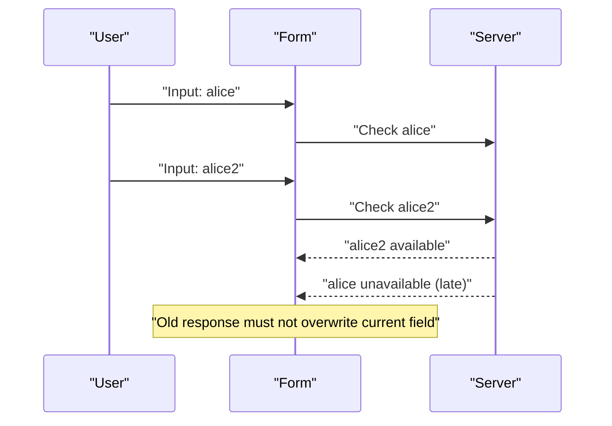
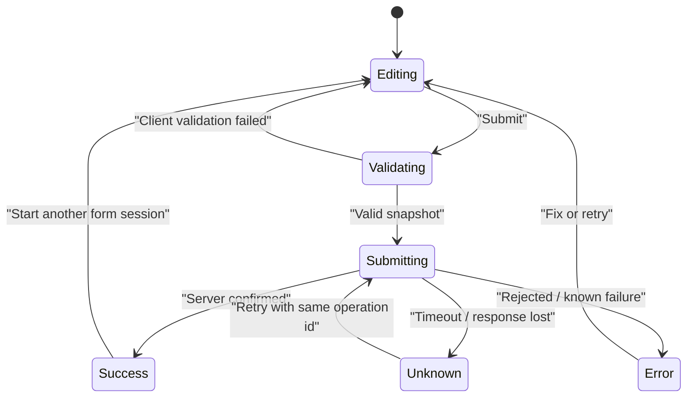
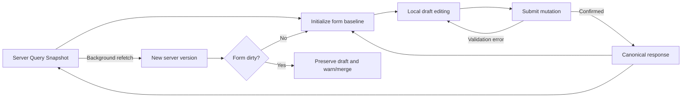

# React 表单状态：受控输入、校验生命周期与可靠重置

> 表单不是一组字符串输入框，而是一段允许暂时无效、可被触碰、可被校验、可能提交失败并需要恢复的编辑会话。正确设计的关键不是“所有字段都放进 State”，而是明确当前值、初始基线、交互元数据和服务器事实分别由谁拥有。

---

## 一、为什么表单状态容易失控

一个“编辑订单”表单通常同时包含：

- 用户正在输入的 Draft；
- 服务端加载的 Initial Values；
- Dirty、Touched 和字段错误；
- 同步与异步校验状态；
- 跨字段约束；
- Submit Pending、成功和失败；
- 服务端返回的字段错误；
- Reset、切换实体与离页确认。

如果只维护一个 `values` 对象，很快会出现：

- `defaultValue` 更新了，但输入框仍显示旧内容；
- 输入从 Uncontrolled 切成 Controlled，React 发出警告；
- 用户刚输入一个字符就看到整页错误；
- 异步校验旧响应覆盖新输入；
- 提交成功后字段重置了，Dirty 却仍为 `true`；
- 服务端 Query Refetch 覆盖尚未提交的 Draft；
- 两次点击产生重复 Mutation；
- Reset 只清了字段值，没有清 Error 和 Touched。

本文以现代 React、TypeScript 和浏览器原生 Form API 为主，不绑定具体表单库。React 19 的 Form Action、`useActionState` 和 `useFormStatus` 会在 Submit State 中说明，但框架 Server Action、渐进增强和序列化行为应以项目锁定版本为准。

### 核心结论

1. Form State 是未提交 Draft，不等于 Server State 中已保存实体。
2. Controlled Input 的当前值由 React State 决定，必须在 `onChange` 中同步更新。
3. Uncontrolled Input 的当前值由 DOM 保存，通常在提交时通过 `FormData` 读取。
4. 同一输入生命周期内不应在 Controlled 与 Uncontrolled 之间切换。
5. `defaultValue`、`defaultChecked` 只定义初始值，不持续控制当前 DOM Value。
6. Dirty 表示当前值偏离初始基线，Touched 表示用户已与字段交互，两者不是同一概念。
7. 同步校验应是纯函数；异步校验必须处理 Debounce、Abort、乱序和服务端最终权威。
8. 跨字段校验必须基于同一个 Values Snapshot，不能让各字段各自猜测其他字段状态。
9. Submit State 应区分 Validating、Submitting、Success、Error 和 Unknown Result，不能只用一个 `loading`。
10. Reset 必须同时处理 Values、Baseline、Touched、Errors、Async Validation 和 Submit State。

---

## 二、先建立完整的表单状态模型

以预订表单为例，输入阶段应保存用户原始 Draft：

```ts
type BookingDraft = {
  email: string;
  guestCount: string;
  startDate: string;
  endDate: string;
  notes: string;
  acceptTerms: boolean;
};

type FieldName = keyof BookingDraft;
type FieldErrors = Partial<Record<FieldName, string>>;
type FieldFlags = Partial<Record<FieldName, boolean>>;

type SubmitState =
  | { status: 'idle' }
  | { status: 'validating' }
  | { status: 'submitting'; submissionId: string }
  | { status: 'success'; bookingId: string }
  | { status: 'error'; message: string }
  | { status: 'unknown'; operationId: string };

type BookingFormState = {
  initialValues: BookingDraft;
  values: BookingDraft;
  touched: FieldFlags;
  clientErrors: FieldErrors;
  serverErrors: FieldErrors;
  validating: FieldFlags;
  submitCount: number;
  submit: SubmitState;
};
```

### 2.1 为什么数量先保存为字符串

用户输入数字时可能经历 `''`、`'-'`、`'1.'` 等不完整阶段。若每次 `onChange` 都立即转换成 Number，会丢失用户输入语义，并把空字符串错误变成 `0` 或 `NaN`。

表单 Draft 可以暂时无效；提交前再解析成 Domain Command：

```ts
type CreateBookingCommand = {
  email: string;
  guestCount: number;
  startDate: string;
  endDate: string;
  notes?: string;
  acceptTerms: true;
};
```

### 2.2 Values 与 Meta 分开

- **Values**：用户当前草稿；
- **Initial Values**：Dirty 比较和 Reset 基线；
- **Touched**：错误展示时机；
- **Errors**：当前已知的校验结果；
- **Validating**：异步校验是否进行；
- **Submit State**：整次提交的生命周期。

这些状态相关但不能合并成一个 Boolean。例如字段可以 Dirty 但未 Touched，也可以 Touched 但重新改回初始值后不再 Dirty。

---

## 三、Controlled Input：React State 是当前事实

受控输入通过 `value` 或 `checked` 指定当前值：

```tsx
function EmailField() {
  const [email, setEmail] = useState('');

  return (
    <label>
      邮箱
      <input
        name="email"
        type="email"
        value={email}
        onChange={(event) => setEmail(event.target.value)}
      />
    </label>
  );
}
```

React 会强制 DOM Input 显示 `value`。因此 `onChange` 必须同步更新对应 State；如果延迟更新、更新到别的值或忘记更新，输入会回退，看起来像“无法键入”。

### 3.1 Checkbox 和 Radio 使用 `checked`

```tsx
<input
  name="acceptTerms"
  type="checkbox"
  checked={values.acceptTerms}
  onChange={(event) => {
    setValues((current) => ({
      ...current,
      acceptTerms: event.target.checked,
    }));
  }}
/>
```

Checkbox 的 `event.target.value` 默认常是字符串 `'on'`，是否选中应读取 `checked`。

### 3.2 Select 与多选

```tsx
<select
  name="roles"
  multiple
  value={roles}
  onChange={(event) => {
    setRoles(
      Array.from(event.target.selectedOptions, (option) => option.value),
    );
  }}
>
  <option value="viewer">查看者</option>
  <option value="editor">编辑者</option>
</select>
```

Controlled `<select multiple>` 的 `value` 是字符串数组。不要逐个给 `<option selected>`；由父级 `<select value>` 统一控制。

### 3.3 Textarea 不使用 Children 作为初始值

```tsx
<textarea
  name="notes"
  value={values.notes}
  onChange={(event) => {
    setValues((current) => ({
      ...current,
      notes: event.target.value,
    }));
  }}
/>
```

React 中 `<textarea>` 使用 `value` 或 `defaultValue`，不通过 Children 设置文本。

### 3.4 不能在生命周期中切换模式

错误示例：

```tsx
// 初次 Render 时 user 为空，value 是 undefined，输入为 Uncontrolled。
// 数据返回后 value 变成字符串，又切为 Controlled。
<input value={user?.name} onChange={handleNameChange} />
```

修复方式是从第一次 Render 就提供稳定字符串：

```tsx
<input value={user?.name ?? ''} onChange={handleNameChange} />
```

对 Checkbox 使用稳定 Boolean。不要用 `null`/`undefined` 表示受控文本框的空值。

### 3.5 什么时候适合 Controlled

- 输入会即时驱动其他 UI；
- 需要字符计数、格式提示或条件字段；
- 需要按字段统一校验和错误展示；
- 多字段之间实时联动；
- 需要外部组件控制值；
- 需要精确追踪 Dirty、Touched 和 Draft。

受控并不代表所有值都要提升到页面顶层。State 应放在最低必要共同所有者，避免每次键入重渲染整个页面。

---

## 四、Uncontrolled Input：DOM 保存当前值

非受控输入不传 `value`/`checked`，浏览器负责当前 Value：

```tsx
function NewsletterForm() {
  function handleSubmit(event: React.FormEvent<HTMLFormElement>) {
    event.preventDefault();

    const formData = new FormData(event.currentTarget);
    const email = String(formData.get('email') ?? '');

    subscribe({ email });
  }

  return (
    <form onSubmit={handleSubmit}>
      <label>
        邮箱
        <input name="email" type="email" defaultValue="" required />
      </label>
      <button type="submit">订阅</button>
    </form>
  );
}
```

适合：

- 字段少、只在提交时读取；
- 主要依赖浏览器原生 Constraint Validation；
- 不需要每次键入驱动 React UI；
- 需要与传统 HTML Form、渐进增强或第三方 DOM 控件协作。

### 4.1 `name` 是提交协议的一部分

`FormData` 只收集有 `name` 的成功控件。还要注意：

- Disabled Control 通常不提交；
- 未选中的 Checkbox 不产生对应 Entry；
- 同名多选项应使用 `getAll()`；
- Value 主要是 String 或 File；
- `Object.fromEntries(formData)` 会丢失同名字段的多值语义。

```ts
const formData = new FormData(form);
const interests = formData.getAll('interests').map(String);
```

### 4.2 Ref 适合命令，不适合复制状态

```tsx
const inputRef = useRef<HTMLInputElement>(null);

function focusEmail() {
  inputRef.current?.focus();
}
```

可以用 Ref 聚焦或在必要时读取 DOM，但不要再把 DOM Value 定期复制到 React State，形成两个权威来源。

### 4.3 File Input

File Input 的文件选择由用户和浏览器管理，不能像普通文本框一样通过文件路径字符串受控：

```tsx
function AvatarForm() {
  function handleSubmit(event: React.FormEvent<HTMLFormElement>) {
    event.preventDefault();

    const formData = new FormData(event.currentTarget);
    const avatar = formData.get('avatar');

    if (!(avatar instanceof File) || avatar.size === 0) {
      return;
    }

    uploadAvatar(avatar);
  }

  return (
    <form onSubmit={handleSubmit}>
      <input name="avatar" type="file" accept="image/png,image/jpeg" />
      <button type="submit">上传</button>
    </form>
  );
}
```

`accept` 只帮助用户选择，不是安全校验。服务端仍必须检查 MIME、文件内容、大小和权限。若用 `URL.createObjectURL()` 预览，替换文件或卸载时要调用 `URL.revokeObjectURL()`。

### 4.4 一个表单可以混合两种模式

例如搜索关键词受控以驱动建议列表，附件使用非受控 File Input。选择应按字段交互需求，而不是要求整个 Form 只能采用一种模式。

---

## 五、Default Value：初始值不是当前值

```tsx
<input name="displayName" defaultValue="Ada" />
<input name="subscribed" type="checkbox" defaultChecked />
```

`defaultValue` 和 `defaultChecked` 只声明初始状态。用户编辑后，父组件再次传入新的 Default Value，不能被理解为强制更新当前输入。

### 5.1 编辑实体切换问题

```tsx
function UserForm({ user }: { user: User }) {
  return <input name="name" defaultValue={user.name} />;
}
```

如果组件身份不变，只把 `user` 从 A 换成 B，输入可能保留 A 的 DOM Value。可选策略：

1. 用业务 Key 创建新的表单身份；
2. 显式执行 Reset；
3. 改为 Controlled，并在实体切换事件中重建 Draft。

```tsx
<UserForm key={user.id} user={user} />
```

Key Remount 会同时清除焦点、选择区、Touched、异步请求和子组件 State，适合“这是全新编辑会话”的场景。若需要保留部分交互，应使用显式 Reset Protocol。

### 5.2 `useState(initialValue)` 也只初始化一次

```tsx
const [name, setName] = useState(user.name);
```

`user.name` 后续变化不会自动重置 State。不要用一个 Effect 在每次 Query Refetch 时覆盖 Draft，否则后台刷新可能抹掉用户输入。

更合理的规则是：

- 表单未 Dirty 时，可以提示或接受新 Baseline；
- 表单已 Dirty 时，保留 Draft，并提示服务器数据已变化；
- 切换到不同 Entity ID 时，显式开始新会话；
- 保存成功后，用确认响应建立新 Baseline。

---

## 六、Dirty / Touched：变化和交互不是一回事

### 6.1 Dirty

Dirty 表示当前值与 Initial Baseline 不同：

```ts
function isFieldDirty<K extends FieldName>(
  field: K,
  values: BookingDraft,
  initialValues: BookingDraft,
): boolean {
  return values[field] !== initialValues[field];
}
```

字段改动后再改回初始值，通常应恢复为 Not Dirty。`hasChangedOnce` 是另一种审计语义，不要与 Dirty 混用。

### 6.2 比较前是否 Normalize

是否把 `' Ada '` 与 `'Ada'` 视为相同，要由业务定义：

- 显示名称可能提交前 Trim；
- 密码不能擅自 Trim；
- 电话号码可能规范化；
- 金额字符串需要精确定点解析；
- 数组顺序是否重要取决于领域。

Dirty 比较应与最终提交规范一致，否则 UI 会显示“未修改”，服务端却收到不同值。

### 6.3 Touched

Touched 常在 Blur 后置为 `true`：

```tsx
<input
  value={values.email}
  onChange={(event) => updateField('email', event.target.value)}
  onBlur={() => {
    setTouched((current) => ({ ...current, email: true }));
  }}
/>
```

Touched 的目标通常是控制错误何时展示，避免页面首次打开就出现一片红色。提交尝试后，可以把所有相关字段视为 Touched 或用 `submitCount > 0` 统一展示错误。

### 6.4 常见显示规则

```ts
const showEmailError =
  Boolean(clientErrors.email) &&
  (Boolean(touched.email) || submitCount > 0);
```

对于高风险即时约束，例如超出最大字符数，可以立即提示；普通必填错误通常在 Blur 或 Submit 后显示。错误时机属于 UX Contract，应全产品一致。

---

## 七、Sync Validation：纯函数验证一个 Snapshot

同步校验适合：

- 必填；
- 长度和格式；
- 数字范围；
- 本地可判断的业务约束；
- 跨字段关系。

```ts
function validateBooking(values: BookingDraft): FieldErrors {
  const errors: FieldErrors = {};

  if (!values.email.trim()) {
    errors.email = '请输入邮箱';
  } else if (!isEmail(values.email)) {
    errors.email = '邮箱格式不正确';
  }

  const guestCount = Number(values.guestCount);
  if (!Number.isInteger(guestCount) || guestCount < 1 || guestCount > 8) {
    errors.guestCount = '人数必须是 1 到 8 的整数';
  }

  if (!values.acceptTerms) {
    errors.acceptTerms = '请先同意预订条款';
  }

  return errors;
}
```

Validation Function 应：

- 不修改 Values；
- 不执行 Fetch；
- 对相同 Snapshot 返回相同结果；
- 返回结构化错误，而不是直接操作 DOM；
- 可以独立单元测试。

### 7.1 校验时机

| 时机 | 优点 | 代价 |
|---|---|---|
| Change | 反馈及时 | 容易在输入中间态制造噪声 |
| Blur | 减少打扰 | 用户离开字段后才发现 |
| Submit | 实现简单 | 反馈较晚 |
| 混合 | 首次 Blur 后随 Change 更新 | 状态规则更复杂 |

常见策略是：首次 Blur 或 Submit 后展示错误，之后该字段 Change 时实时更新已显示错误。

### 7.2 浏览器原生 Constraint Validation

```tsx
<input
  name="email"
  type="email"
  required
  maxLength={120}
/>
```

原生 `required`、`type`、`min`、`max`、`minLength`、`maxLength` 和 `pattern` 可以减少重复代码，并提供基础键盘与浏览器集成。

如果使用 `noValidate` 关闭浏览器提示，就必须完整承担错误展示、焦点和可访问性。客户端原生校验仍不能替代服务端验证。

---

## 八、Async Validation：处理取消和乱序

用户名可用性、优惠码和地址服务常需要异步验证。最危险的实现是每次键入直接 Fetch，并让最后完成的响应覆盖当前错误。



### 8.1 Debounce + Abort + Generation

```tsx
function UsernameField() {
  const [username, setUsername] = useState('');
  const [error, setError] = useState<string>();
  const [validating, setValidating] = useState(false);
  const generationRef = useRef(0);

  useEffect(() => {
    const normalized = username.trim();

    if (normalized.length < 3) {
      generationRef.current += 1;
      setValidating(false);
      setError(normalized ? '用户名至少需要 3 个字符' : undefined);
      return;
    }

    const generation = ++generationRef.current;
    const controller = new AbortController();
    setValidating(false);

    const timer = window.setTimeout(async () => {
      setValidating(true);

      try {
        const available = await checkUsername(
          normalized,
          controller.signal,
        );

        if (generation !== generationRef.current) return;
        setError(available ? undefined : '该用户名已被使用');
      } catch (requestError) {
        if (controller.signal.aborted) return;
        if (generation !== generationRef.current) return;
        setError('暂时无法验证用户名，请稍后重试');
      } finally {
        if (generation === generationRef.current) {
          setValidating(false);
        }
      }
    }, 300);

    return () => {
      window.clearTimeout(timer);
      controller.abort();

      if (generationRef.current === generation) {
        generationRef.current += 1;
      }
    };
  }, [username]);

  return (
    <label>
      用户名
      <input
        value={username}
        onChange={(event) => setUsername(event.target.value)}
        aria-invalid={Boolean(error)}
        aria-describedby={error ? 'username-error' : undefined}
      />
      {validating && <span role="status">正在验证</span>}
      {error && <span id="username-error">{error}</span>}
    </label>
  );
}
```

三层保护职责不同：

- Debounce 减少请求数量；
- Abort 尝试停止旧请求；
- Generation 防止不支持取消或已完成请求提交旧结果。

### 8.2 异步通过不代表提交一定成功

用户名在校验后到提交前仍可能被其他用户占用。异步字段校验只是提前反馈，服务端提交必须在事务或唯一约束下再次验证。

### 8.3 何时不做字段异步校验

- 校验成本很高；
- 结果变化太快；
- 会泄露账号是否存在等敏感信息；
- 提交接口已经能快速返回结构化字段错误；
- 校验需要完整表单上下文。

此时在 Submit 后处理服务端错误可能更正确。

---

## 九、Cross-field Validation：一次验证同一份 Values

结束日期必须晚于开始日期，确认密码必须等于密码，折扣与商品类型存在组合约束。这些错误不属于单个输入的孤立事实。

```ts
function validateDateRange(values: BookingDraft): FieldErrors {
  if (!values.startDate || !values.endDate) return {};

  const start = parseDateOnly(values.startDate);
  const end = parseDateOnly(values.endDate);

  if (!start || !end) return {};

  if (end < start) {
    return {
      endDate: '结束日期不能早于开始日期',
    };
  }

  return {};
}
```

### 9.1 错误挂在哪里

- 能由某个字段修复时，挂到该字段，例如 `endDate`；
- 多字段共同导致且无法归属时，使用 Form-level Error；
- 同时提供字段提示和顶部摘要时，二者应来自同一错误对象。

### 9.2 依赖字段变化要重新验证

如果用户已经 Touch `endDate`，随后修改 `startDate`，日期范围错误必须重新计算。不要只在 `endDate.onChange` 中校验，否则错误会过期。

最稳妥的方法是让同步 Validator 每次接收完整 Values Snapshot，再按显示策略选择哪些错误呈现。

### 9.3 Date 与 Time Zone

`<input type="date">` 提交的是日期字符串。把它转换为 JavaScript `Date` 时会引入时区语义，可能让本地日期偏移。Date-only、Local DateTime 和 UTC Instant 是不同领域类型，必须在 Parse 层明确。

---

## 十、Submit State：一次提交是一段异步协议



### 10.1 传统 `onSubmit` 实现

```tsx
async function handleSubmit(event: React.FormEvent<HTMLFormElement>) {
  event.preventDefault();

  if (submit.status === 'submitting') return;

  const snapshot = values;
  const errors = validateBooking(snapshot);

  setSubmitCount((count) => count + 1);
  setClientErrors(errors);

  if (Object.keys(errors).length > 0) {
    focusFirstInvalidField(event.currentTarget, errors);
    return;
  }

  const submissionId = crypto.randomUUID();
  setSubmit({ status: 'submitting', submissionId });
  setServerErrors({});

  try {
    const command = parseBookingCommand(snapshot);
    const booking = await createBooking(command, submissionId);

    setSubmit({ status: 'success', bookingId: booking.id });
    resetToConfirmedBooking(booking);
  } catch (error) {
    if (error instanceof ValidationError) {
      setServerErrors(error.fieldErrors);
      setSubmit({ status: 'error', message: '请修正表单内容' });
      return;
    }

    if (error instanceof UnknownResultError) {
      setSubmit({ status: 'unknown', operationId: submissionId });
      return;
    }

    setSubmit({ status: 'error', message: '提交失败，请稍后重试' });
  }
}
```

这里的 `snapshot` 保证本次 Validation 和 Command Parse 针对同一份 Values。真实实现还要处理组件卸载后的 UI 回写、当前编辑会话是否仍相同，以及服务端 Mutation 的 Idempotency。

### 10.2 Pending UI

- 禁用会产生重复副作用的 Submit；
- 保持字段内容可读，不要用 Loading 覆盖整张 Form；
- 明确“正在提交”而不是只改变按钮颜色；
- 允许取消只代表停止等待时，要明确服务端可能已经执行；
- Timeout 后显示“结果确认中”，不要直接诱导新操作。

Button Disabled 只能改善当前页面交互，不能替代服务端 Idempotency Key。

### 10.3 React 19 Form Action

现代 React 支持把函数传给 `<form action>`，并通过 `useFormStatus` 在子组件读取 Pending：

```tsx
function SubmitButton() {
  const { pending } = useFormStatus();

  return (
    <button type="submit" disabled={pending}>
      {pending ? '保存中' : '保存'}
    </button>
  );
}

function ProfileForm() {
  async function saveProfile(formData: FormData) {
    const displayName = String(formData.get('displayName') ?? '');
    await updateProfile({ displayName });
  }

  return (
    <form action={saveProfile}>
      <input name="displayName" />
      <SubmitButton />
    </form>
  );
}
```

函数 Action 成功后，React 会重置表单中的非受控字段。Controlled Field 仍由 React State 决定，必须显式更新 State。Server Function、Progressive Enhancement 和错误序列化属于框架与部署边界，应按当前版本验证。

需要保存 Action 返回的结构化成功或错误状态时，可以使用 `useActionState`；需要让 Submit Button 等后代读取所属 Form 的 Pending 时，使用 `useFormStatus`。两者不能替代服务端字段校验、幂等和权限检查。

---

## 十一、Server Error Mapping

客户端校验提升反馈速度，服务端校验才是权威。API 应返回稳定错误码和字段路径，而不是让前端解析自然语言：

```ts
type ServerValidationIssue = {
  path: 'email' | 'guestCount' | 'startDate' | 'endDate' | '_form';
  code: string;
  message: string;
};
```

映射规则：

- 已知字段路径进入 `serverErrors`；
- `_form` 或未知路径进入 Form-level Error；
- 用户修改对应字段后，可以清除该字段旧 Server Error；
- 不应因任意字段变化清除所有服务端错误；
- Error Message 是否直接使用服务端文本取决于本地化和安全策略。

不要把数据库字段名、堆栈、SQL 或敏感业务规则直接显示给用户。

---

## 十二、Reset：重置的是完整编辑会话

### 12.1 Controlled Form Reset

```ts
function resetForm(nextInitialValues: BookingDraft) {
  setInitialValues(nextInitialValues);
  setValues(nextInitialValues);
  setTouched({});
  setClientErrors({});
  setServerErrors({});
  setValidating({});
  setSubmitCount(0);
  setSubmit({ status: 'idle' });
}
```

注意 `nextInitialValues` 应作为不可变 Snapshot 使用。若后续会修改对象，先做符合数据结构的复制。

### 12.2 Uncontrolled Form Reset

```tsx
function ResetButton() {
  return <button type="reset">恢复初始值</button>;
}
```

浏览器 `form.reset()` 会把非受控控件恢复到它们的 Default Value/Default Checked。它不会自动清理你另存在 React State 中的 Error、Touched 和 Submit Message，因此仍需监听 Reset：

```tsx
<form
  onReset={() => {
    setErrors({});
    setTouched({});
    setSubmit({ status: 'idle' });
  }}
>
```

### 12.3 Reset 的不同语义

| 事件 | Reset 目标 |
|---|---|
| 用户点击“撤销修改” | 回到当前 Initial Baseline |
| 切换编辑实体 | 建立新实体的新 Baseline |
| 提交成功 | 用服务器确认结果建立新 Baseline |
| 关闭后重新打开 | 取决于产品是否保留 Draft |
| Query 后台刷新 | Dirty 时通常不应自动覆盖 |
| Logout/权限变化 | 清理敏感 Draft 和文件引用 |

“清空”与“重置”也不同：清空把字段变为空，重置回到 Baseline。

### 12.4 Reset 与进行中的异步校验

Reset 时应增加 Validation Generation、Abort 当前请求并清理 Validating。否则旧校验响应可能在 Reset 后重新写入 Error。

提交请求若已发送，Reset UI 不代表取消服务端 Mutation。两者必须分开处理。

---

## 十三、Server State 与 Draft 的协作



不要直接编辑 Query Cache 中的 Entity Object：

- 其他组件会看到半成品；
- 取消编辑无法恢复；
- Background Refetch 会产生竞态；
- Mutation Rollback 粒度不清。

进入编辑页时从 Server Snapshot 创建 Draft。提交成功后，用服务端确认响应更新 Query Cache，并把该响应作为新的 Form Baseline。

如果服务器 Version 在编辑期间变化，应使用 ETag/Version 检测冲突，并保留 Local Draft，不要静默 Last-write-wins。

---

## 十四、性能：先缩小更新范围

Controlled Input 每次键入都会更新 State。如果 State 位于大型页面顶部，整个子树可能重新 Render。

优化顺序：

1. 把 Form State 下沉到表单子树；
2. 把大型静态区域移出频繁更新组件；
3. 按字段或分区拆分订阅；
4. 将昂贵派生 UI 与输入更新解耦；
5. 大型表单再考虑 Uncontrolled Model 或成熟表单库；
6. 在生产构建和目标设备上用 React Profiler 测量。

### 14.1 不要把输入更新放进 Transition

受控输入的 Backing State 必须同步更新。可以对依赖输入的昂贵结果使用 `useDeferredValue`：

```tsx
const [query, setQuery] = useState('');
const deferredQuery = useDeferredValue(query);

<input value={query} onChange={(event) => setQuery(event.target.value)} />
<ExpensivePreview query={deferredQuery} />
```

Input 本身保持同步，Preview 可以使用较旧值后台 Render。

### 14.2 不要用 Memoization 掩盖错误所有权

先检查是否把 Form State 提升过高、Context Value 是否包含整张 Form、Validator 是否在每次 Render 重建大对象。`memo`、`useMemo` 和 `useCallback` 都有比较与维护成本，应以 Profiler 证据决定。

---

## 十五、可访问性与交互契约

```tsx
<label htmlFor="email">邮箱</label>
<input
  id="email"
  name="email"
  value={values.email}
  onChange={handleEmailChange}
  aria-invalid={Boolean(visibleErrors.email)}
  aria-describedby={visibleErrors.email ? 'email-error' : undefined}
/>
{visibleErrors.email && (
  <p id="email-error">{visibleErrors.email}</p>
)}
```

工程要求：

- 每个输入有可感知 Label；
- 错误通过 `aria-describedby` 与字段关联；
- 无效时设置 `aria-invalid`；
- Submit 失败后聚焦第一个错误或错误摘要；
- 异步 Pending/结果使用适度的 Live Region，避免每次键入反复播报；
- 不只用颜色表达 Error、Dirty 或 Success；
- Enter Submit、键盘顺序和浏览器 Autofill 正常工作；
- Disabled 与 `aria-disabled` 的行为差异符合需求。

不要为了自定义样式把原生 Input、Button、Label 全部替换成无语义 `div`。

---

## 十六、测试表单状态

### 16.1 Controlled 与 Uncontrolled

- Controlled Field 输入后 State 与 DOM 一致；
- `undefined` 数据不会触发模式切换；
- Checkbox 使用 `checked`；
- FormData 正确读取 String、File 和多值字段；
- Disabled、Unchecked 和无 `name` 字段行为符合提交契约。

### 16.2 Dirty 与 Touched

- 初始时两者为 False；
- Change 后 Dirty；
- 改回 Baseline 后 Not Dirty；
- Blur 后 Touched；
- Submit 后未触碰字段也显示必要 Error；
- Reset 后 Meta 全部清理。

### 16.3 Validation

- Sync Validator 覆盖边界值和临时无效值；
- Cross-field Error 随任一依赖字段变化更新；
- Async Validation 会 Debounce；
- 新请求会取消或淘汰旧结果；
- Abort 不显示普通错误；
- Async Pass 后服务端仍可返回冲突错误。

### 16.4 Submit 与 Reset

- Invalid Form 不调用 Mutation；
- Pending 时快速双击只产生预期逻辑提交；
- Server Field Error 映射正确；
- Timeout 进入 Unknown，而非误报未执行；
- Success 使用 Canonical Response 建立 Baseline；
- Reset 会清 Values、Error、Touched、Validating 和 Submit State；
- 切换 Entity 不会带入上一实体 Draft。

使用 Testing Library 按用户行为输入、Blur 和 Submit，不要只调用内部 Setter。异步网络用 MSW、测试服务器或等价边界模拟延迟、乱序和取消。

---

## 十七、常见误区

### 17.1 所有表单都必须 Controlled

错误。简单一次提交可以充分利用 Uncontrolled Input、FormData 和浏览器原生能力。选择依据是交互与协调需求。

### 17.2 `defaultValue` 会随 Props 持续更新

错误。它定义初始值，不控制当前值。切换实体应使用新身份、显式 Reset 或 Controlled Draft。

### 17.3 Dirty 与 Touched 是同一个状态

错误。Dirty 表示偏离 Baseline，Touched 表示发生过指定交互。字段可以只满足其中一个。

### 17.4 输入时直接把所有值 Parse 成 Domain Type

错误。用户需要经历暂时无效状态；应保留 Raw Draft，在 Validation/Submit 边界解析。

### 17.5 Debounce 已经解决异步校验竞态

错误。Debounce 只减少请求，已发请求仍可能乱序返回，还需要 Abort 和 Generation。

### 17.6 客户端校验通过就可以信任数据

错误。客户端代码可绕过，数据也可能在校验后变化。服务端必须再次验证、授权并保证唯一约束。

### 17.7 Submit Button Disabled 就不会重复创建

错误。刷新、跨 Tab、代理 Retry 和响应丢失仍可能重复提交，服务端需要 Idempotency。

### 17.8 `form.reset()` 会清除所有 React 状态

错误。它主要重置原生控件；另存的 Error、Touched、Async State 和 Controlled Values 仍需显式处理。

### 17.9 Query Refetch 后应始终覆盖表单

错误。Dirty Draft 是独立编辑会话，应提示冲突、合并或由用户选择，而不是静默丢弃。

---

## 十八、工程方案选择

| 场景 | 建议状态策略 |
|---|---|
| 简单订阅表单 | Uncontrolled + FormData + 原生校验 |
| 搜索建议 | Controlled Query + Debounced Async Result |
| 登录表单 | 可 Controlled 或 Uncontrolled；明确 Submit Error |
| 长编辑表单 | 独立 Draft、Dirty/Touched、Server Version |
| 文件上传 | File Input Uncontrolled，React 管理元数据与进度 |
| 多字段实时联动 | Controlled 或具备细粒度订阅的表单库 |
| 高风险提交 | 状态机 + Idempotency + Unknown Result |
| SSR 初始编辑 | Server Snapshot 初始化 Draft，Hydration 后不自动覆盖 |

具体表单库选型、Schema Validation、Dynamic Fields 和 Field Array 将在“表单工程”模块展开。

---

## 十九、工程检查清单

- Form State 是否与 Server State 分离；
- 每个字段由 React 还是 DOM 控制是否明确；
- Controlled Value 是否从首个 Render 就保持稳定类型；
- Checkbox/Radio 是否使用 `checked`；
- `defaultValue` 是否只承担初始化；
- Numeric/Date Draft 是否允许中间无效值；
- Initial Baseline 和当前 Values 是否同时存在；
- Dirty 与 Touched 是否分开定义；
- Sync Validator 是否纯净且可测试；
- Async Validator 是否有 Debounce、Abort、Generation 和 Cleanup；
- Cross-field Validation 是否读取统一 Snapshot；
- Client 与 Server Error 是否能稳定映射；
- Submit 是否区分 Validating、Pending、Error 和 Unknown；
- 重复提交是否有服务端幂等；
- Reset 是否覆盖 Values、Meta、Error、Async 和 Submit State；
- Dirty Form 遇到 Server Refetch 是否避免静默覆盖；
- Label、Error Association、Focus 和 Live Region 是否可访问；
- 性能结论是否经过生产构建和目标设备测量。

---

## 二十、总结

1. Form State 是一个有独立生命周期的本地 Draft，不是服务器实体本身。
2. Controlled Input 由 React State 决定当前值，Uncontrolled Input 由 DOM 决定当前值。
3. 同一字段不能在生命周期中切换 Controlled/Uncontrolled Mode。
4. Default Value 只负责初始化；实体切换和服务器更新需要显式 Reset Policy。
5. Dirty 关注当前值与 Baseline，Touched 关注用户交互，两者服务不同 UI 决策。
6. Sync Validation 应是纯函数，并允许输入过程中的暂时无效状态。
7. Async Validation 必须同时治理请求频率、取消、乱序和服务端最终校验。
8. Cross-field Validation 应验证同一 Values Snapshot，并随所有依赖字段更新。
9. Submit 是带校验、错误、幂等和未知结果的异步状态机。
10. Reset 不是简单清空 Input，而是重新建立 Values、Baseline 和全部 Meta 的一致状态。

表单设计真正要维护的是一份可解释的编辑会话：用户当前写了什么、哪些内容偏离初始事实、哪些错误已经值得展示、服务端确认了什么，以及取消、失败或成功后应回到哪一个稳定基线。

---

## 问答复盘

### Q1：Controlled Input 与 Uncontrolled Input 的根本区别是什么？

**答：** 当前值的权威所有者不同。Controlled 由 React State 决定，Uncontrolled 由 DOM 保存并通常通过 FormData 或 Ref 读取。

### Q2：为什么 `value={user?.name}` 容易产生模式切换警告？

**答：** 初次 Render 可能是 `undefined`，输入被视为 Uncontrolled；数据返回后变成字符串又转为 Controlled。应从一开始使用 `user?.name ?? ''` 等稳定值。

### Q3：修改 `defaultValue` 为什么没有更新用户当前看到的文本？

**答：** `defaultValue` 只定义初始值，不持续控制 DOM。需要新编辑会话时应更换 Key、显式 Reset 或改为 Controlled。

### Q4：字段已经 Dirty，是否一定 Touched？

**答：** 不一定。程序更新可以让字段 Dirty 但未发生 Blur；用户 Focus/Blur 后不修改，则 Touched 但不 Dirty。

### Q5：为什么数量字段在编辑阶段建议保存字符串？

**答：** 用户输入会经过空值和不完整数字等中间态。保存字符串能保留 Draft 语义，提交前再校验并转换成 Domain Number。

### Q6：Debounce 能否防止旧异步校验覆盖新值？

**答：** 不能完全防止。它只减少请求；仍需 Abort 旧请求并用 Generation/Request ID 忽略迟到结果。

### Q7：跨字段错误应该挂到哪个字段？

**答：** 若一个字段可直接修复，就挂到该字段；无法单字段归属时使用 Form-level Error。所有错误应来自同一次完整 Snapshot 校验。

### Q8：React 19 函数式 Form Action 成功后会重置 Controlled Input 吗？

**答：** 不会自动改变其 React State。成功后会重置非受控字段；Controlled Field 仍需显式更新 Backing State。

### Q9：点击 Reset 后为何旧异步错误又出现？

**答：** Reset 只改了 Values，没有 Abort 请求或推进 Validation Generation。迟到响应仍被接受，应在 Reset 时同时清理异步生命周期。

### Q10：服务端 Query 在编辑期间刷新，应该直接覆盖 Draft 吗？

**答：** Dirty 时通常不应。应保留用户 Draft，比较服务端 Version，并提示重新加载、合并或解决冲突。

---

## 延伸知识

- **表单工程**：React Hook Form、Formik、Schema Validation、Zod、Dynamic Fields 和 Field Array。
- **Mutation**：Idempotency、Optimistic Update、Server Error Mapping 和 Conflict Resolution。
- **状态分类**：Form State、Server State、URL State 与 Single Source of Truth。
- **组件 API**：Controlled/Uncontrolled Component、Default Props 和状态所有权。
- **可访问性**：Label、Constraint Validation、Error Summary、Focus Management 和 Live Region。
- **浏览器表单协议**：FormData、Constraint Validation API、Autofill、File Input 和 Native Submit。
