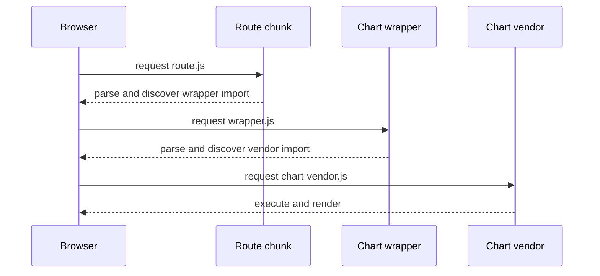
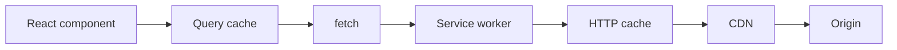
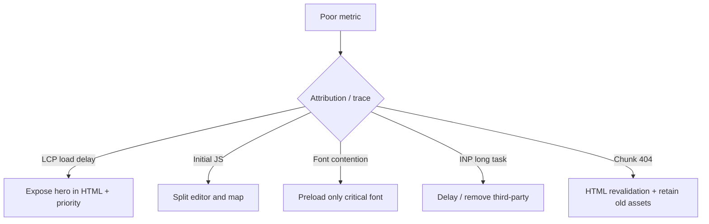

# React 资源与网络性能：从代码分割、加载优先级到 CDN 缓存

> 资源优化的目标不是让每个 Bundle 都更小，而是让当前用户任务所需的正确字节，以正确优先级、在正确时间到达并完成解析执行，同时不让未来可能用到的资源抢占当前带宽和主线程。

---

## 一、为什么“Bundle 变小”不一定代表页面变快

一个 React 页面可能同时加载：

- HTML 与服务端渲染内容；
- Critical CSS 和后续样式；
- React Runtime、Router、业务 JavaScript 和 Polyfill；
- 首屏图片、图标、视频 Poster；
- Web Font；
- API 数据；
- Analytics、A/B Test、Chat、Map、Payment 等第三方资源。

从 Navigation 到像素显示，资源经过的链路并不只是下载：

```mermaid
flowchart LR
    N["Navigation"] --> H["HTML response"]
    H --> D["Resource discovery"]
    D --> Q["Priority and connection queue"]
    Q --> T["Transfer"]
    T --> X["Decompression"]
    X --> P["Parse / decode"]
    P --> E["JS execution or style calculation"]
    E --> R["React render / hydration"]
    R --> L["Layout / paint"]
    L --> V["Visible and interactive UI"]
```



因此，一个 100 kB 的 JavaScript Chunk 可能有不同成本：

- Transfer Size：网络上经 Brotli/Gzip 压缩后的字节；
- Resource Size：解压后的源文本字节；
- Parse/Compile：JavaScript Engine 解析与编译成本；
- Execute：模块顶层代码、初始化和 Hydration 占用主线程；
- Retained Memory：模块、闭包和缓存长期保留。

一个高压缩比的大 JavaScript Bundle 在 Network 面板中看似不大，仍可能在低端设备上产生昂贵 Parse 和 Execute。相反，一张已压缩的大图片主要成本可能是 Transfer、Decode 和像素内存，不能用 JavaScript 的分析方法概括。

本文以现代 React、ES Modules、HTTP/2/3 和现代浏览器为背景。Bundler、Framework、CDN、React DOM Resource Hint API 和浏览器优先级会持续演进；具体产物、Header 和优先级必须在项目锁定版本及目标浏览器上验证。

### 核心结论

1. 资源成本必须同时观察 Discovery、Priority、Transfer、Decode/Parse、Execute 和 Cache，不能只看 Bundle 文件大小。
2. Code Splitting 应按 Route、Feature 和低频能力分割，目标是减少当前 Journey 必须工作，不是制造尽可能多的 Chunk。
3. `lazy` 与 Dynamic `import()` 可延后模块加载，但会引入 Suspense、Error、部署版本与 Waterfall 边界。
4. Bundle Analysis 要查找重复依赖、无效 Tree Shaking、巨大 Barrel Import、Polyfill 与顶层副作用，不是只看一张 Treemap。
5. Preload 用于当前 Navigation 确定需要的关键资源，Prefetch 用于未来可能需要的资源；过度 Hint 会抢占带宽。
6. LCP 图片应可早发现、选用正确尺寸、保留布局空间，不应 Lazy Load；屏外图片才适合延迟。
7. Font 优化需同时控制 WOFF2/Subset、Preload、`font-display` 与 Fallback Metrics，否则可在 FCP、LCP 和 CLS 之间互相交换问题。
8. 指纹化静态资源可使用长时间 Immutable Cache；HTML、用户 API 和敏感内容需要不同 Cache-Control 语义。
9. CDN 只在 Cache Key、Vary、Purge/Version、Authorization 与 Origin 策略正确时才能安全加速；错误缓存个性化内容是严重数据泄漏。
10. Compression 与 Minification 是不同阶段；Brotli/Gzip 适合文本，已压缩图片和视频不应无条件重复压缩。
11. Third-party Script 必须有业务 Owner、预算、Consent、CSP/SRI、失败隔离和删除机制，不能因为“异步加载”就视为免费。
12. 优化结论必须分别在 Cold/Warm Cache、弱网/正常网络、低端/中端设备上验证，并回到 Field LCP、INP、Cache Hit Ratio 与业务转化观察。

---

## 二、先建立资源成本模型

优化前应为目标 Route 建立 Resource Inventory：

| 资源 | 冷缓存 Transfer | 解压/解码后大小 | 发现时机 | 主线程成本 | Cache TTL | Owner |
|---|---:|---:|---|---:|---|---|
| Entry JS | 实测 | 实测 | HTML Parser | Parse/Execute | 指纹化长缓存 | Platform |
| Route JS | 实测 | 实测 | Router/Preload | Parse/Execute | 指纹化长缓存 | Feature |
| LCP Image | 实测 | 解码像素 | HTML/CSS/JS | Decode/Paint | 版本化长缓存 | Content |
| Font | 实测 | Glyph Data | CSS/Preload | Text Layout | 版本化长缓存 | Design System |
| Third-party | 实测 | 不可控 | Script Tag | Parse/Execute | Vendor 决定 | Business Owner |

不要填写经验值后就当作事实。Network 面板、Coverage、Performance Trace、Bundle Stats、Server/CDN Log 和 RUM 应提供真实数据。

### 2.1 冷缓存与热缓存是不同产品场景

- Cold Cache 暴露首次访问、新版本发布和新设备成本；
- Warm HTTP Cache 反映重复访问与跨 Route 复用；
- Memory Cache 与 Disk Cache 的命中、时延和生命周期不同；
- Service Worker 可形成另一层响应来源；
- Query Cache 缓存的是数据 Snapshot，不等于 HTTP Cache。

只在 DevTools 勾选 Disable Cache 下测试，会漏掉重复访问和版本升级语义；只测 Warm Cache 则可能完全隐藏首次用户的 JavaScript 与图片成本。

### 2.2 HTTP/2/3 不会让无限拆包免费

Multiplexing 降低了部分连接和队头成本，但仍存在：

- 每个请求的 Header、调度与 CDN/Origin 处理；
- 依赖图导致的 Discovery Waterfall；
- 过多 Chunk 带来的 Runtime/Manifest 和 Cache Churn；
- 每个 JavaScript Module 的 Parse、Compile 和 Execute；
- 高优先级资源与过度 Prefetch 的带宽竞争。

拆分粒度必须用实际依赖图、Cache Reuse 和 Network Waterfall 验证，不能从“HTTP/2 支持并发”推导出“请求越多越好”。

---

## 三、Code Splitting：按用户 Journey 切分 JavaScript

Code Splitting 将一个大型 JavaScript Graph 切成多个可独立加载的 Chunk。它的核心收益是：用户首次打开订单页时，不需同时下载报表编辑器、地图和管理员工具。

### 3.1 Route-level Splitting

```tsx
import { lazy, Suspense } from 'react';

const OrdersRoute = lazy(() => import('./routes/OrdersRoute'));
const ReportsRoute = lazy(() => import('./routes/ReportsRoute'));

function AppRoutes() {
  return (
    <RouteErrorBoundary>
      <Suspense fallback={<RouteSkeleton />}>
        <Routes>
          <Route path="/orders" element={<OrdersRoute />} />
          <Route path="/reports" element={<ReportsRoute />} />
        </Routes>
      </Suspense>
    </RouteErrorBoundary>
  );
}
```

`lazy(load)` 会缓存 Load Promise 和已解析模块，并要求模块提供 Default Export。模块尚未准备好时，最近 Suspense Boundary 显示 Fallback；加载失败则需 Error Boundary 和恢复策略。

路由级分割通常是起点，因为 Route 本来就是用户导航边界。但不应将每个小页面都拆成大量串行子 Chunk，否则可能从“一个大包”变成“一条深水瀑”。

### 3.2 Feature-level Splitting

低频、昂贵且有明确交互边界的功能适合延后：

```tsx
const RichTextEditor = lazy(() => import('./RichTextEditor'));

function CommentComposer({ advanced }: { advanced: boolean }) {
  if (!advanced) return <SimpleTextarea />;

  return (
    <Suspense fallback={<EditorSkeleton />}>
      <RichTextEditor />
    </Suspense>
  );
}
```

适合候选包括：

- Rich Text/Code Editor；
- Chart/Map；
- PDF/Spreadsheet Export；
- 管理员或低频权限功能；
- 用户打开后才需要的 Modal/Drawer；
- 特定文件类型的 Parser。

不适合延后的常见内容包括首屏必然显示的 Hero/LCP 内容、核心导航和用户立即需要的输入反馈。

### 3.3 Vendor Chunk 不是越稳定越大越好

将所有 `node_modules` 强制合并为一个 Vendor Chunk，可能让任意一个依赖升级都使整个文件缓存失效，也可能让只需一个小库的 Route 下载整个 Vendor Graph。

更合理的策略需结合：

- 跨 Route 共用频率；
- 独立 Cache 价值；
- 单库体积与更新频率；
- 实际 Navigation Waterfall；
- Bundler 自动 Chunking 结果。

在没有 Bundle Stats 与 Cache 数据前，不应根据包名手写大量长期无人维护的 Manual Chunks。

### 3.4 过度拆分会制造 Waterfall



如果这些模块在当前 Route 中必然同时需要，三层串行 Discovery 可能比一个合理 Chunk 更慢。可通过 Framework Route Manifest、`modulepreload`、Server Hint 或调整 Chunk Boundary 让依赖更早发现，但必须以 Waterfall 为证据。

---

## 四、Dynamic Import：模块边界、错误与预热

Dynamic `import()` 返回 Promise，常用于事件驱动加载：

```ts
async function exportOrders(orderIds: string[]): Promise<void> {
  try {
    const { createOrderWorkbook } = await import('./order-export');
    const workbook = await createOrderWorkbook(orderIds);
    await downloadWorkbook(workbook);
  } catch (error) {
    reportError(error);
    showToast('导出组件加载失败，请重试');
  }
}
```

### 4.1 Import 无法用 AbortSignal 标准取消

当用户关闭 Dialog 或离开 Route 时，标准 Dynamic Import 没有与 `fetch` 一样的 AbortSignal 取消协议。模块下载可能仍会完成并进入 Module Cache。

业务代码应防止已过期操作继续执行：

```tsx
function ExportDialog({ orderIds }: { orderIds: string[] }) {
  const operationRef = useRef(0);

  useEffect(() => {
    return () => {
      operationRef.current += 1;
    };
  }, []);

  const handleExport = async () => {
    const operation = ++operationRef.current;
    try {
      const { createOrderWorkbook } = await import('./order-export');

      if (operation !== operationRef.current) return;
      const workbook = await createOrderWorkbook(orderIds);

      if (operation !== operationRef.current) return;
      await downloadWorkbook(workbook);
    } catch (error) {
      if (operation !== operationRef.current) return;
      reportError(error);
      showToast('导出失败，请重试');
    }
  };

  return <button onClick={() => void handleExport()}>导出</button>;
}
```

这只阻止旧 Operation 继续修改 UI，不会停止 Import 传输。`createOrderWorkbook` 如果又执行长时间 CPU 任务，仍需 Worker 或可取消的任务协议。

### 4.2 Dynamic Specifier 必须让 Bundler 能分析

```ts
// 边界清晰：Bundler 可以建立有限依赖图
const localeLoaders = {
  en: () => import('./locales/en'),
  zh: () => import('./locales/zh'),
} as const;

async function loadLocale(locale: keyof typeof localeLoaders) {
  return localeLoaders[locale]();
}
```

无约束的 `import('./locales/' + userInput)` 可能让 Bundler 将整个目录打包为 Context Module，也可能直接拒绝构建。还不应允许用户输入构造任意远程脚本 URL；动态模块必须来自编译期可审计白名单。

### 4.3 按意图预热低频模块

```tsx
type NavigatorWithConnection = Navigator & {
  connection?: { saveData?: boolean };
};

function prefersReducedData(): boolean {
  return (navigator as NavigatorWithConnection).connection?.saveData === true;
}

function ReportsLink() {
  const warmRoute = () => {
    if (prefersReducedData()) return;
    void import('./routes/ReportsRoute').catch(() => {});
  };

  return (
    <Link
      to="/reports"
      onFocus={warmRoute}
      onPointerEnter={warmRoute}
    >
      报表
    </Link>
  );
}
```

`navigator.connection` 的支持有限，必须 Feature Detect。Dynamic Import 不只下载，还会实例化/评估模块，所以模块顶层必须避免注册全局 Listener、启动 Timer 或发起业务请求等副作用。

预热应限于高意图信号，例如 Focus、Pointer Hover 或上一步 Journey 完成。不要在页面加载后立即 Import 所有未来 Route，那会使 Code Splitting 退化为延迟几毫秒的全量加载。

### 4.4 发布后的 Chunk 404

用户可能长时间保持旧 HTML/Runtime，发布后再访问某个延迟 Route。如果 CDN 已删除旧指纹 Chunk，Dynamic Import 会失败。

发布系统应：

- 保留至少覆盖最长会话的旧指纹资源；
- HTML 不使用与指纹 Chunk 相同的长 Immutable Cache；
- 记录 Chunk URL、App Version 和 Navigation Type；
- 对版本不匹配显示可控刷新提示；
- 防止自动 Reload Loop，同一版本最多尝试一次；
- Canary/Rollback 时保证多版本 Asset 共存。

---

## 五、Bundle Analysis：从产物追回源码和依赖

Bundle Analyzer 的 Treemap 只是起点。真正需要回答：

- 哪个 Route/Journey 下载了该模块；
- 它是 Initial、Async 还是 Shared Chunk；
- 是否被多个版本或子依赖重复打包；
- 未使用 Export 为何没有 Tree Shake；
- 模块体积大，还是顶层执行昂贵；
- 缓存失效时影响多少用户。

### 5.1 不同工具的证据不同

| 工具 | 主要证据 | 不能单独证明 |
|---|---|---|
| Bundler Stats/Treemap | 模块归属、Chunk 体积、重复 | 真实网络与执行耗时 |
| DevTools Coverage | 当前录制中未执行 CSS/JS | 代码永远无用 |
| Network | Transfer、Priority、Cache、Waterfall | Main-thread Execute 根因 |
| Performance Trace | Parse/Compile/Execute、Long Task | 模块源码为何进包 |
| RUM | 真实分布与用户分群 | 精确源码依赖图 |

Coverage 中的“未使用”只代表该录制没有走到对应功能。不能在只点击首屏后，就删除后续导出、错误恢复或无障碍分支。

### 5.2 Tree Shaking 的前提

Tree Shaking 通常依赖静态 ESM Import/Export 与可分析的副作用边界。常见破坏原因包括：

- 包只提供 CommonJS 或混合不可分析导出；
- `sideEffects` Metadata 错误或缺失；
- 模块顶层执行注册、Patch 或 CSS Import；
- 从巨大 Barrel File 导入一个符号，但包结构阻止裁剪；
- Namespace Import 后动态访问属性；
- 库同时安装多个版本。

`sideEffects: false` 是强契约，错误标记可能让 Bundler 删除必要 CSS、Polyfill 或注册代码。只能在确认包中模块顶层副作用后配置，并为构建产物做集成测试。

### 5.3 常见优化候选

- 将全量 Date/Locale 数据改为需求导入或平台 `Intl`；
- 只导入所需 Icon，不打包整个 Icon Registry；
- 去除已由目标浏览器支持的无用 Polyfill；
- 合并重复版本，但先确认 Peer Dependency 兼容；
- 将低频 Parser/Editor/Chart 移到 Feature Chunk；
- 用小型、稳定 API 替换只使用 5% 能力的重型 SDK；
- 修正导入路径和 Package Export Map；
- 删除顶层初始化，改为按需创建实例。

替换库必须比较功能、正确性、浏览器支持、可访问性、安全与维护成本，不能只根据 Minified kB 决定。

### 5.4 Bundle Budget 必须绑定 Route 和口径

```yaml
route: /orders
scenario: cold-mobile-entry
budgets:
  initial_js_transfer_kb: 180
  initial_js_uncompressed_kb: 650
  route_async_js_transfer_kb: 80
  third_party_js_transfer_kb: 60
  main_thread_script_p75_ms: 200
```

上述数字只是格式示例，不是通用推荐阈值。项目预算必须来自目标设备、网络、当前基线和产品目标。同时必须标注 Transfer/Uncompressed、Initial/Async、First-party/Third-party，避免不同团队用不同口径“通过”同一预算。

---

## 六、Preload、Prefetch 与连接提示

Resource Hint 是浏览器调度提示，不是强制立即执行的业务指令。优先级、支持和真实调度可因浏览器、网络和资源类型不同而变化。

### 6.1 Preload：当前页确定需要

```html
<link
  rel="preload"
  href="/fonts/app-sans-latin.woff2"
  as="font"
  type="font/woff2"
  crossorigin
>
```

Preload 要求浏览器提前获取资源。`as`、`type`、CORS/Credentials 与后续真实请求必须匹配，否则可能发生重复下载或 Preload 不被复用。

只应 Preload 当前页高确定、发现过晚且真正关键的少量资源，例如：

- CSS 中才能发现的关键 Font；
- CSS Background 中的 LCP Image；
- Framework 没有自动提示的必需 Route Module；
- 当前首屏确定需要的关键数据，但与普通 Fetch 的复用契约必须经过验证。

如果 Preload 后数秒内未使用，浏览器通常会在 DevTools 给出警告。这通常表明资源不够关键、属性不匹配或条件加载判断错误。

### 6.2 `modulepreload`：提前获取 ES Module Graph

```html
<link rel="modulepreload" href="/assets/orders-route.a1b2c3.js">
```

`modulepreload` 面向 ES Module，可让浏览器更早获取并处理模块。实际 Bundler/Framework 往往根据 Manifest 自动生成相关 Hint，手写时容易在文件指纹变化后失效。应优先使用 Framework 的 Route Preload 协议。

### 6.3 Prefetch：未来可能需要

```html
<link rel="prefetch" href="/assets/reports-route.d4e5f6.js" as="script">
```

Prefetch 通常以较低优先级为未来 Navigation 准备资源，但不保证一定执行或跨会话保留。它应考虑：

- 用户导航概率；
- Save-Data、设备与网络类型；
- 当前页是否仍有关键下载；
- 预取资源的体积和过期概率；
- CDN/HTTP Cache 是否允许它在导航时复用。

不要同时 Prefetch 导航栏中所有 Route。对低概率大资源，浪费比命中更可能发生。

### 6.4 Preconnect 与 DNS Prefetch

```html
<link rel="preconnect" href="https://images.example-cdn.com" crossorigin>
<link rel="dns-prefetch" href="//analytics.example.com">
```

Preconnect 可提前建立 DNS、TCP 和 TLS 等连接准备，适合当前页很快就要使用的少量关键 Origin。DNS Prefetch 更轻，只提前解析域名。

每个 Preconnect 都消耗 Socket、CPU 和 TLS 工作。对数十个 Third-party Origin 全部 Preconnect 会浪费资源。如果能将关键资源收敛到少数 Origin，通常比增加更多 Hint 更稳定。

### 6.5 React DOM 的 Resource Hint API

React 19 的 React DOM 提供 `preconnect`、`prefetchDNS`、`preload`、`preinit` 等公开 API，便于在组件逻辑中声明资源。例如：

```tsx
import { preconnect, preload } from 'react-dom';

function ProductPage({ heroUrl }: { heroUrl: string }) {
  preconnect('https://images.example-cdn.com', {
    crossOrigin: 'anonymous',
  });
  preload(heroUrl, { as: 'image', fetchPriority: 'high' });

  return <ProductDetails heroUrl={heroUrl} />;
}
```

这些 API 的参数、去重、Server Rendering 与 Framework 集成行为属于 React 版本公开契约。使用前应查看项目锁定 React DOM 版本，并避免与 Framework 自动 Hint 重复。

---

## 七、Image Optimization：从正确像素到正确优先级

图片优化首先要回答四个问题：

1. 当前 Viewport 需要多少像素；
2. 图片在什么时候被浏览器发现；
3. 它是 LCP 候选还是屏外装饰；
4. 下载前是否已知 Layout Size。

### 7.1 Responsive Image

```tsx
function ProductHero() {
  return (
    <picture>
      <source
        type="image/avif"
        srcSet="/images/product-640.avif 640w, /images/product-1280.avif 1280w"
      />
      <source
        type="image/webp"
        srcSet="/images/product-640.webp 640w, /images/product-1280.webp 1280w"
      />
      
    </picture>
  );
}
```

- `srcset` 提供候选尺寸；
- `sizes` 告诉浏览器图片实际展示宽度；
- `width` / `height` 建立 Aspect Ratio，减少 CLS；
- AVIF/WebP 并非对所有图片都绝对更小，需比较画质、编码与解码成本；
- Alt 描述业务内容，不把文件名当替代文本。

### 7.2 LCP Image 不应 Lazy Load

```tsx
// 错误：首屏主图被告知浏览器延迟加载

```

LCP 图片应：

- 尽量出现在服务器 HTML 或可早发现 Markup 中；
- 避免等到 `useEffect` 请求数据后才创建 URL；
- 不使用 `loading="lazy"`；
- 在真正是关键候选时才使用 `fetchPriority="high"`；
- 必要时通过 Responsive Image Preload 提供 `imagesrcset` / `imagesizes`；
- 缩短 Resource Load Delay，而不只压缩文件。

不要对页面中多张大图都设 High Priority。优先级是竞争关系，所有资源都高优先级等于没有优先级。

### 7.3 屏外图片才适合 Lazy Loading

```tsx

```

Native Lazy Loading 的实际距离阈值由浏览器决定，不是精确的 IntersectionObserver 契约。过长列表还应使用 Virtualization/Pagination 限制图片 Element 数量，否则即使资源未下载，DOM 和 Observer 成本仍可能很高。

### 7.4 Image CDN 需要约束参数

Image CDN 可根据 Width、DPR、Format 和 Quality 生成变体，但任意 Query Parameter 可能制造无限 Cache Variant 和计算流量攻击。应：

- 只允许白名单尺寸档位；
- 限制最大宽高、像素总量和 Quality Range；
- Cache Key 只包含实际影响输出的参数；
- 验证源图 URL，防止 SSRF 和越权访问；
- 用指纹或版本号更新内容；
- 观察 Origin Fetch、Transform Latency、Hit Ratio 和输出字节。

---

## 八、Font Loading：在文本可见性、品牌和 CLS 之间取舍

Font 影响的不只是网络，还包括 Text Metrics、Line Break、LCP Text 与 Layout Shift。

### 8.1 只加载必要字重和字符集

```css
@font-face {
  font-family: "App Sans";
  src: url("/fonts/app-sans-latin.woff2") format("woff2");
  font-display: swap;
  font-style: normal;
  font-weight: 400 700;
}
```

- WOFF2 通常是现代 Web Font 的优先格式；
- Variable Font 可以合并多个字重，但若项目只用两个静态字重，变体文件不一定更小；
- Latin、CJK 与 Icon Font 的字符规模差异很大，Subset 策略必须基于实际语言；
- `unicode-range` 可让浏览器按字符集加载，但过多 Subset 也会增加请求和管理成本。

### 8.2 `font-display` 是产品策略

| 值 | 倾向 | 主要代价 |
|---|---|---|
| `swap` | 尽快显示 Fallback，Font 到达后替换 | 可产生字体切换和 CLS |
| `optional` | 弱网下可继续使用 Fallback | 部分访问可能不显示品牌 Font |
| `block` | 给 Font 更长的阻塞窗口 | 文本不可见风险更高 |

正文和交互文本通常优先可读性，不应长时间隐藏文本等待品牌 Font。是使用 `swap` 还是 `optional`，应根据品牌要求、网络分布和 CLS 实测决定。

### 8.3 Fallback Metrics 决定切换是否跳动

不同 Font 的 Glyph Width、Ascent、Descent 和 Line Gap 不同。Fallback 与 Web Font 差距过大时，替换会改变换行和容器高度。

CSS Fonts 提供 `size-adjust`、`ascent-override`、`descent-override` 和 `line-gap-override` 等 Descriptor，可构造 Metrics 更接近的 Fallback Face。这些百分比必须根据真实 Font File 测量，不应复制其他字体的数值。

### 8.4 Font Preload 不应覆盖所有字重

只 Preload 首屏确定需要、且 CSS 发现过晚的 Font File。预加载十几个字重和语言 Subset 会与 CSS、LCP Image 和 JavaScript 争夺带宽。

跨 Origin Font 请求需要正确 CORS；Preload 的 `crossorigin` 必须与实际 Font Fetch 匹配，否则可能下载两次。

---

## 九、HTTP Cache：让版本化资源持久，让可变响应可验证

HTTP Cache 不是单一开关。应根据资源是否版本化、是否个性化、是否敏感和是否可重新验证定义 Header。

### 9.1 指纹化静态资源

```http
Cache-Control: public, max-age=31536000, immutable
```

适合：

```text
/assets/app.a1b2c3.js
/assets/orders.d4e5f6.css
/images/product.9a8b7c.avif
```

内容变化时 URL 必须变化。只对文件名加 Hash，但 HTML 仍长时间指向旧 Manifest，不能构成完整发布协议。

### 9.2 HTML 通常需要重新验证

```http
Cache-Control: no-cache
ETag: "html-version-123"
```

`no-cache` 不表示禁止存储，而是复用前必须向服务器重新验证。服务器可返回 `304 Not Modified`，避免重传 Body。

对包含用户信息的 HTML，还需 `private` 或更严格策略；对高敏感且不应存储的响应才考虑 `no-store`。不要将 `no-cache` 与 `no-store` 混为同一语义。

### 9.3 API Cache 需区分共享与私有数据

| 数据 | 可选策略 | 主要风险 |
|---|---|---|
| 公共产品目录 | CDN Shared Cache + Revalidation | 库存/价格新鲜度 |
| 用户订单 | `private` / `no-store` 按安全要求 | 共享缓存泄漏 |
| 个性化推荐 | Private Cache 或不缓存 | Cookie/Auth 未进 Cache Key |
| 版本化配置 | Public Long Cache | 更新 URL 未变 |

`Vary: Authorization` 或 `Vary: Cookie` 可能导致极高 Cache Cardinality，也不代表一定适合 Shared CDN Cache。对私有数据，更稳妥的默认是不进共享缓存，再根据明确的 Tenant/User Cache Key 和安全评审逐步开放。

### 9.4 `stale-while-revalidate`

```http
Cache-Control: public, max-age=60, stale-while-revalidate=300
```

在支持的 Cache 中，60 秒后的 Stale Response 可在后台重新验证期间继续服务。它适合允许短期旧数据的公共内容，不适合付款状态、权限、库存扣减结果等需要强新鲜度的事实。

### 9.5 HTTP Cache、Service Worker 和 Query Cache



同一请求可能经过多层 Cache。数据不新鲜时，必须确认是 Query Stale Time、Service Worker Strategy、Browser Cache Header、CDN TTL 还是 Origin 未更新。只在 React Query 中 `invalidateQueries()` 不会自动清理错误的 CDN/Service Worker Cache。

---

## 十、CDN：边缘命中之前先定义 Cache Key

CDN 通过将资源缓存到靠近用户的 Edge 降低 RTT 与 Origin Load。但“上 CDN”不代表自动命中。

### 10.1 Cache Key 必须与响应差异一致

Cache Key 可能包含：

- Scheme/Host/Path；
- 经白名单的 Query Parameters；
- 少量真正影响响应的 Header；
- Device/Image Variant；
- Locale/Tenant，仅当安全且可控时。

错误策略的两个极端：

- Key 太粗：不同用户或租户共享响应，导致数据泄漏；
- Key 太细：将 Tracking Query、全部 Cookie 或 User-Agent 进入 Key，命中率接近于零。

应在 CDN Log 中观察 HIT/MISS/BYPASS、Age、Cache Key Dimension、Origin TTFB 与 Purge 行为，不只看管理台的全站平均 Hit Ratio。

### 10.2 发布优先用版本 URL，不依赖全网 Purge

指纹化静态资源不需要覆盖旧内容：新发布产生新 URL，旧 URL 保留到足以覆盖长会话。这比在全球 Edge 同步 Purge 更稳定，也支持 Rollback 和 Canary 多版本共存。

对不能版本化的 HTML/API，Purge 只是一种运维手段，仍需正确 TTL、Revalidation 和 Stale 策略。

### 10.3 CDN 失败与回源风暴

热门 Cache Entry 同时过期时，大量 Edge Request 可能一起回源，形成 Cache Stampede。可选手段包括 Request Collapsing、Origin Shield、Stale Serving、TTL Jitter 和预热，但支持与具体语义取决于 CDN 产品。

还应测试：

- Edge 无法访问 Origin；
- Purge 只部分生效；
- Origin 返回 5xx/429；
- Stale Content 是否允许继续服务；
- Signed URL/Cookie 过期；
- 不同地区的 TLS、DNS 和 Origin Routing。

---

## 十一、Compression：减少传输不等于减少执行

### 11.1 Minification 与 Compression

- Minification 删除空白、缩短符号、优化源文本，改变资源内容；
- Compression 根据 `Accept-Encoding` 选择 Brotli/Gzip 等传输编码，浏览器收到后解压；
- Tree Shaking 删除不需要的模块/导出，发生在构建图阶段。

三者不能互相代替。一个包含大量无用代码的 Bundle 可能压缩得很好，但解压后仍需 Parse，部分代码还会 Execute。

### 11.2 为文本资源预生成压缩变体

静态 JS/CSS/HTML/SVG/JSON 可在构建或部署阶段预生成 `.br` / `.gz` 变体，避免 Edge/Origin 对每个请求执行高成本实时压缩。但必须保证：

```http
Content-Encoding: br
Vary: Accept-Encoding
Content-Type: text/javascript; charset=utf-8
```

- 压缩文件与原始文件指纹一致；
- CDN Cache Key 或 Variant 正确区分 Encoding；
- 不支持 Brotli 的客户端可降级 Gzip/Identity；
- Range Request 和 Streaming 行为符合资源类型；
- 监控 Transfer Size 而不只检查文件是否存在。

### 11.3 不要对已压缩媒体反复压缩

JPEG、WebP、AVIF、MP4、WOFF2 等已使用特定压缩。再用 Gzip/Brotli 往往收益极小，却增加 CPU 和缓存变体。应在 Origin/CDN 中根据 MIME Type 建立明确白名单。

### 11.4 Compression Level 不是越高越好

更高 Brotli Level 可能换来更小产物，但构建或实时压缩 CPU 成本上升。静态指纹资源可在 CI 中使用较高成本预压缩；动态 API 则需在 TTFB、CPU、Payload 之间权衡。结论应来自代表性 Payload 与 Origin Load Test。

---

## 十二、Third-party Script：把外部代码当作不可控依赖

第三方脚本可以影响：

- DNS/TLS 与网络竞争；
- JavaScript Parse/Execute 与 Long Task；
- DOM Mutation、Style/Layout 和 CLS；
- Cookie、Storage、Fingerprinting 与隐私 Consent；
- CSP、Supply-chain 与 XSS 攻击面；
- Error、Global Handler 和业务稳定性；
- 缓存与 Vendor 无预告变更。

### 12.1 `async`、`defer` 与 Module

| 方式 | 下载 | 执行时机 | 顺序 |
|---|---|---|---|
| Classic `async` | 与 HTML Parse 并行 | 下载完立即执行，会打断 Parser | 多个 Async 不保证声明顺序 |
| Classic `defer` | 与 HTML Parse 并行 | Parse 完成后、`DOMContentLoaded` 前 | 通常保持文档顺序 |
| `type="module"` | 并行获取 Module Graph | 默认具有类似 Defer 的执行时机 | 按 Module Dependency 语义 |

`async` 只避免下载阻塞 HTML Parser，执行仍占用主线程。一个 Async Analytics Script 仍可以在用户首次点击前执行 300 ms Long Task。

### 12.2 建立第三方资产台账

| 字段 | 说明 |
|---|---|
| Vendor / URL | 真实加载 Origin 与版本 |
| Business Owner | 谁决定引入与删除 |
| Purpose | 关联的业务目标 |
| Consent Category | Essential / Analytics / Marketing 等 |
| Load Condition | 首屏、Consent 后、交互后、特定 Route |
| Transfer / Main Thread | 在目标场景的实测成本 |
| Data Access | Cookie、DOM、Storage、PII |
| Removal Plan | 实验结束或 Vendor 下线时如何删除 |

没有 Owner 的 Script 通常也没有人能回答它是否仍有价值。资产台账应与 Performance Budget、Consent Manager 和 CSP 同步，不只存在一份过期文档。

### 12.3 按 Consent 与交互加载

```ts
const scriptPromises = new Map<string, Promise<void>>();

type ScriptOptions = {
  src: string;
  integrity?: string;
  nonce?: string;
  crossOrigin?: 'anonymous' | 'use-credentials';
};

export function loadExternalScript({
  src,
  integrity,
  nonce,
  crossOrigin,
}: ScriptOptions): Promise<void> {
  const cacheKey = JSON.stringify({ src, integrity, nonce, crossOrigin });
  const existing = scriptPromises.get(cacheKey);
  if (existing) return existing;

  const promise = new Promise<void>((resolve, reject) => {
    const script = document.createElement('script');
    script.src = src;
    script.async = true;
    if (crossOrigin) script.crossOrigin = crossOrigin;
    else if (integrity) script.crossOrigin = 'anonymous';
    if (integrity) script.integrity = integrity;
    if (nonce) script.nonce = nonce;

    let settled = false;
    let timeoutId = 0;

    const cleanup = () => {
      window.clearTimeout(timeoutId);
      script.removeEventListener('load', handleLoad);
      script.removeEventListener('error', handleError);
    };

    const finish = (error?: Error) => {
      if (settled) return;
      settled = true;
      cleanup();

      if (error) {
        script.remove();
        reject(error);
      } else {
        resolve();
      }
    };

    function handleLoad() {
      finish();
    }

    function handleError() {
      finish(new Error(`Script loading failed: ${src}`));
    }

    script.addEventListener('load', handleLoad);
    script.addEventListener('error', handleError);

    timeoutId = window.setTimeout(() => {
      finish(new Error(`Script loading timed out: ${src}`));
    }, 10000);

    document.head.append(script);
  }).catch(error => {
    scriptPromises.delete(cacheKey);
    throw error;
  });

  scriptPromises.set(cacheKey, promise);
  return promise;
}
```

实际项目不应让用户输入或远程未签名配置任意传入 `src`，必须使用可审计 Vendor Allowlist。SRI `integrity` 适合内容固定的版本 URL；Vendor 若原地更新同一 URL，SRI 会拒绝新内容，这正是应促使团队采用版本化 URL 的信号。

还要注意：

- 移除 `<script>` 不会撤销已执行的全局副作用；
- SDK 需要明确 `destroy()` / Unsubscribe 才能释放 Listener、Timer 和 DOM；
- Timeout 后 Network 仍可能已传输部分字节；
- Consent 撤回需同时处理 Cookie/Storage 与 Vendor 停止协议；
- 脚本失败不应阻塞主业务购买、登录或导航。

### 12.4 CSP、SRI 与 Iframe 隔离

- CSP `script-src` 限制脚本来源，Nonce/Hash 可控制 Inline Script；
- SRI 验证外部资源内容 Hash，并需正确 CORS；
- Sandbox Iframe 可限制部分 DOM、Navigation 和 Origin 能力，但 Sandbox Token 设置过宽会破坏隔离；
- Trusted Types 可帮助治理 DOM XSS Sink，不代替 Vendor 审计；
- 将脚本移到 Worker 的方案只适用于兼容的 API，对 DOM-heavy SDK 可能破坏功能或增加 Proxy 成本。

安全控制和性能控制应使用同一 Vendor Inventory，避免一边通过 CSP 放行新域名，一边在性能面板中没有 Owner。

---

## 十三、电商商品页案例：从 Waterfall 到资源策略

假设商品页的 Field LCP 与 INP 长尾恶化，Trace 发现：

- LCP Image 需等客户端 API 返回 URL 后才发现；
- Entry JS 包含只在点击后使用的 Review Editor 和 Map SDK；
- 首屏 Preload 了 8 个 Font File；
- Analytics 与 A/B SDK 在 Hydration 期间产生 Long Task；
- HTML 被 CDN 缓存 1 小时，发布后仍指向已删除 Chunk。

### 13.1 建立根因映射



### 13.2 单变量修复顺序

1. 先让 Hero URL 在 Server HTML 中可发现，设置正确 Responsive Source、Size 和 Priority；
2. 用 Route/Feature Splitting 移出 Review Editor 与 Map，记录 Initial JS Transfer/Execute 变化；
3. Font Preload 只保留首屏实际字重/Subset，并调整 Fallback Metrics；
4. Analytics 在 Consent 与主内容稳定后加载，A/B SDK 若必须影响首屏则需更严预算；
5. HTML 改为 Revalidate，指纹 Asset 长缓存并保留旧版；
6. 每次改动单独复测 Waterfall、LCP Breakdown、Main-thread Time、Error Rate 和 Conversion。

### 13.3 避免局部指标欺骗

- LCP 改善不能以首屏图片质量明显降低为代价；
- Initial JS 减少后，首次打开 Review Editor 不应出现不可接受空白；
- Prefetch 提高下一页速度不能恶化当前页 LCP 和数据流量；
- CDN Hit Ratio 上升不能以缓存过期价格或泄漏个性化内容为代价；
- Third-party 延后不能破坏合规 Consent、Experiment Assignment 或订单 Attribution 正确性。

---

## 十四、常见误区与错误案例

### 14.1 Chunk 越多性能越好

过多 Chunk 会增加 Discovery Waterfall、Request/Runtime Overhead 和 Cache Churn。应按当前 Journey 必需与未来低频能力切分，而不是按文件数切分。

### 14.2 JavaScript 经 Brotli 后很小，就没有主线程成本

Brotli 只减少 Transfer。浏览器仍需解压、Parse、Compile 并执行必要代码，低端 CPU 可能比网络更慢。

### 14.3 页面加载后立即 Prefetch 所有 Route

这会与当前图片、Font、API 和 Hydration 争夺带宽/CPU，并为永不导航的 Route 浪费流量。应使用意图、概率和 Save-Data 策略。

### 14.4 所有图片都使用 `loading="lazy"`

LCP 图片会因 Lazy Load 增加发现和调度延迟。只有屏外图片才应延后，首屏主图需早发现和正确 Priority。

### 14.5 预加载所有 Font 能消除字体问题

过多 Font Preload 会抢占关键带宽，且不会修复 Fallback Metrics 导致的 CLS。应减少字重/Subset，选择 `font-display` 并校准 Metrics。

### 14.6 `no-cache` 表示浏览器不能缓存

错误。`no-cache` 允许存储，但每次复用前需 Revalidate；`no-store` 才是要求不存储响应。

### 14.7 CDN 会自动安全缓存所有 API

CDN 不知道项目的 User/Tenant 语义。错误 Cache-Control、Cookie/Authorization 处理和 Cache Key 可导致个性化数据泄漏或命中率归零。

### 14.8 有 Gzip 就不需要 Tree Shaking

Gzip 不会删除代码语义。无用模块解压后仍存在，并可能被 Parse/Execute。Tree Shaking、Code Splitting、Minification 和 Compression 是不同阶段。

### 14.9 Third-party Script 用 `async` 就没有性能影响

`async` 只让下载不阻塞 HTML Parse，脚本下载完后仍在主线程执行，可以产生 Long Task、DOM Mutation 和 Layout Shift。

### 14.10 删除 Script Element 就完成 SDK Cleanup

已执行 SDK 可能已注册 Listener、Timer、Global Handler、Cookie 与 DOM。只删除 Element 不会撤销副作用，必须使用 Vendor 公开 Destroy/Consent Revocation 协议。

---

## 十五、测试与验证方法

### 15.1 测试矩阵

| 维度 | 至少覆盖 |
|---|---|
| Cache | Cold、Warm Memory、Warm Disk、Revalidated、Service Worker Controlled |
| Network | 正常宽带、高 RTT、丢包/不稳定、Offline/Recovery |
| Device | Desktop、中端 Mobile、低端 CPU/Memory |
| Navigation | Hard Navigation、Soft Navigation、Back/Forward Cache |
| Release | 首次发布、Canary、Rollback、长会话旧版 |
| Consent | 拒绝、接受必要项、接受全部、中途撤回 |

CPU/Network Throttling 是可重复压力条件，不是真实设备和运营商网络的精确模拟。最终仍需目标实机与 Field Segment。

### 15.2 Network Waterfall

检查：

- Resource 在 HTML、CSS、JS 还是 Effect 后被发现；
- Queueing/Stalled、DNS、Connection、Request、TTFB、Content Download；
- Priority 是否与用户关键性一致；
- Initiator Chain 是否形成串行 Waterfall；
- Preload 是否被真实请求复用；
- `from memory cache`、`from disk cache`、`304`、Service Worker 与 CDN HIT/MISS；
- Transfer Size 与 Resource Size 是否符合 Compression 预期；
- 重定向、跨 Origin 和 CORS 是否增加往返。

### 15.3 Main-thread Trace

对 JavaScript 同时观察：

- Parse/Compile 和 Evaluate Script；
- Module Top-level Initialization；
- React Hydration/Render/Commit；
- Third-party Long Task 与 Event Handler；
- Style/Layout/Paint 是否由 Script DOM Mutation 触发；
- GC 与大量临时对象；
- LCP Resource 下载完成后是否仍被主线程延迟绘制。

如果 Network 已很快，但 LCP Render Delay 很高，继续压缩图片可能不是最高优先级；应检查 JavaScript、CSS、Font 和主线程阻塞。

### 15.4 Cache 与 CDN 验证

```bash
curl -I --compressed https://example.com/assets/app.a1b2c3.js
curl -I https://example.com/
```

重点检查：

- `Cache-Control`、`Age`、`ETag` / `Last-Modified`；
- `Content-Encoding`、`Vary`、`Content-Type`；
- CDN 产品提供的 Cache Status Header；
- 不同 Query/Cookie/Auth 是否错误命中同一对象；
- Purge/Version 后新旧 URL 的共存；
- 304 是否避免 Body 传输，但仍计入了 RTT/TTFB；
- 原站故障时 Stale/Fallback 是否符合数据正确性。

### 15.5 Field 验证

发布前后按以下维度切分：

- App/Asset Version；
- Route 和 Hard/Soft Navigation；
- Device/Browser/Network 粗粒度分组；
- Cold/Warm Cache 近似信号；
- CDN Region/Cache Status；
- LCP Element/Resource 与 Breakdown；
- INP Attribution/Long Task；
- Third-party Enabled/Consent Segment；
- Error Rate、Conversion、Data Usage 和 Origin QPS 护栏。

减少 30% Initial JS 后，如果 Field LCP/INP 没有变化，需检查该 JavaScript 是否本来就在闲时下载、是否影响目标人群，或者真实瓶颈在 Server/Image/Layout。不能因为 Bundle CI 变绿就宣布用户体验改善。

---

## 十六、工程选型表

| 问题 | 优先方案 | 不应直接做的事 |
|---|---|---|
| 首次 Route JS 过大 | Route/Feature Splitting + Analyze | 将每个 Component 都 Dynamic Import |
| 延迟 Chunk 加载慢 | 意图预热、调整 Waterfall | 页面后立即 Prefetch 所有 Route |
| Bundle 包含大量无用代码 | Stats + Tree Shaking/Import 修复 | 只调高 Brotli Level |
| LCP Image 发现晚 | Server Markup / Preload / Priority | 对所有图片设 High Priority |
| Mobile 下载过大图 | `srcset` / `sizes` / Image CDN | 只用 CSS 缩小原图 |
| Font 造成 CLS | Fallback Metrics + Subset + Display | 预加载所有 Font |
| 重复访问仍重下载 Asset | Fingerprint + Immutable Cache | 给无版本 URL 长缓存 |
| CDN Hit Ratio 低 | 检查 Cache Key/Vary/TTL | 无差别延长个性化 API TTL |
| JS Transfer 大 | Tree Shaking + Brotli/Gzip | 忽略 Parse/Execute |
| Third-party 阻塞 INP | 删除、延后、隔离、设预算 | 只加 `async` |
| 发布后 Chunk 404 | HTML Revalidate + Old Asset Retention | 无限自动 Reload |

---

## 十七、发布前检查清单

### JavaScript 与 Chunk

- Initial/Route/Third-party JS 是否有独立 Budget；
- Code Splitting 是否按 Journey 而非文件数组织；
- Dynamic Import 是否有 Suspense、Error 和版本恢复策略；
- 是否存在串行 Chunk Waterfall；
- Bundle Stats 是否检查重复依赖与 Tree Shaking；
- Module Top-level 是否有无意义副作用；
- 旧指纹 Asset 是否保留足够长会话。

### Image 与 Font

- LCP Image 是否早发现、非 Lazy、尺寸和 Priority 正确；
- `srcset` / `sizes` 是否让 Mobile 选到合理候选；
- Image 是否提供 Width/Height 或 Aspect Ratio；
- Image CDN 参数是否白名单化并防止 SSRF；
- Font 是否只包含需要字重/Subset；
- `font-display` 和 Fallback Metrics 是否经过 FCP/LCP/CLS 验证；
- Font Preload 的 CORS 是否与真实请求匹配。

### HTTP、CDN 与 Compression

- 指纹静态资源是否长 Immutable Cache；
- HTML 是否能及时获得新 Asset Manifest；
- 私有 API 是否被 Shared Cache 排除；
- Cache Key 是否只包含真正响应维度；
- `Vary`、ETag、Age 与 CDN Cache Status 是否正确；
- Brotli/Gzip 是否对文本资源生效；
- `Content-Encoding`、`Content-Type` 与 Encoding Variant 是否匹配；
- Purge、Rollback、Origin Failure 和 Stale 路径是否测试。

### Third-party

- 每个 Vendor 是否有 Owner、Purpose、Budget 和 Removal Plan；
- 是否只在必要 Route、Consent 或交互后加载；
- CSP、SRI、Allowlist 和 Sandbox 是否与风险匹配；
- Vendor 失败是否不阻断主业务；
- SDK 是否有 Destroy/Consent Revocation 协议；
- Field 是否可按 Third-party Enabled/Version 对比。

---

## 十八、总结

React 资源与网络性能的核心是缩短关键依赖链，同时控制非关键资源的传输、执行与生命周期：

1. 用 Waterfall 与 Trace 分开查看 Discovery、Transfer、Parse/Execute 与 Paint。
2. Code Splitting 按 Route/Feature/Journey 分割，同时防止过度 Chunk 导致 Waterfall。
3. Dynamic Import 需要错误、过期 Operation、意图预热和发布版本协议。
4. Bundle Analysis 需从 Chunk 追到模块、Import、副作用与重复版本。
5. Preload 只给当前页少量确定关键资源，Prefetch 由意图和网络条件决定。
6. Image 需正确 Source Size、Priority、Layout Size 和 Cache，LCP Image 不 Lazy Load。
7. Font 需缩小字重/字符集，选择 Display 并用 Fallback Metrics 减少 Shift。
8. HTTP Cache 区分 Immutable Asset、Revalidated HTML、Private API 和 Sensitive `no-store`。
9. CDN 优化的基础是正确 Cache Key、Vary、Version/Purge 和权限隔离。
10. Compression 减少传输，Tree Shaking 删除代码，Minification 重写源文本，三者不能互相代替。
11. Third-party Script 是性能、安全、隐私和稳定性的联合依赖，必须持续审计与可删除。
12. 所有收益都要在 Cold/Warm Cache、目标设备与 Field Segment 中验证，不用单个 Bundle kB 代替用户体验。

真正稳定的资源工程不依赖一次“减包”运动，而是把 Route Budget、Asset Fingerprint、Cache Header、CDN Log、Third-party Inventory 和 RUM 变成发布系统的持续契约。

---

## 问答复盘

### Q1：JavaScript Bundle 的 Transfer Size 很小，是否代表主线程成本也很小？

**答：** 不代表。Transfer Size 是压缩后网络字节；浏览器仍需解压、Parse、Compile 和 Execute。应结合 Resource Size 和 Performance Trace 判断。

### Q2：Code Splitting 是否应该把每个 React Component 都拆成独立 Chunk？

**答：** 不应该。分割应对齐 Route、低频 Feature 和用户 Journey。过细拆分会增加 Discovery Waterfall、Request Overhead 和 Cache Churn。

### Q3：用户 Hover 报表链接时调用 `import()`，只会下载而不执行模块吗？

**答：** 不是。Dynamic Import 会加载、实例化并评估模块。因此模块顶层必须避免启动 Timer、Listener 或业务请求等副作用。

### Q4：Preload 与 Prefetch 的核心区别是什么？

**答：** Preload 针对当前 Navigation 确定需要的关键资源；Prefetch 为未来可能的 Navigation 准备资源，通常优先级更低且不保证执行。

### Q5：为什么首屏 LCP 图片不应使用 `loading="lazy"`？

**答：** Lazy Loading 会延后资源调度，增加 LCP Resource Load Delay。主图应早出现在 Markup 中，选择正确尺寸并给予合理 Priority。

### Q6：`Cache-Control: no-cache` 与 `no-store` 是否相同？

**答：** 不相同。`no-cache` 允许存储，但复用前必须 Revalidate；`no-store` 要求 Cache 不存储响应，更适合明确不应落盘的敏感内容。

### Q7：为什么指纹 JavaScript 可以缓存一年，HTML 却通常不行？

**答：** 指纹 URL 在内容变化时会更换，旧 URL 可安全 Immutable；HTML 负责指向当前 Asset Manifest，长缓存会让用户长期停留在旧版本并可能请求已删除 Chunk。

### Q8：CDN Hit Ratio 越高就一定越好吗？

**答：** 不一定。若通过延长不适合的 TTL、忽略权限或缓存个性化响应获得高命中，会导致过期数据或泄漏。应同时观察正确性、Cache Key 与数据新鲜度。

### Q9：Third-party Script 已经使用 `async`，为什么仍可能影响 INP？

**答：** `async` 只让下载与 HTML Parse 并行；脚本完成后仍在主线程执行。若在交互前生成 Long Task，会增加 Input Delay 或 Presentation Delay。

### Q10：Bundle 体积下降 30% 后，如何证明这次优化对用户有价值？

**答：** 在相同 Route、设备、网络和 Cache 条件下对比 Waterfall、Parse/Execute、LCP/INP 与业务指标，再在 Field Segment 中确认长尾改善，同时检查错误率、流量和二次导航护栏。

---

## 延伸知识

- 渲染策略：CSR、SSR、SSG、ISR、Streaming SSR 与 Edge Runtime；
- React Server Components：Client Boundary、Flight Payload、Module Graph 与 Bundle 边界；
- 浏览器调度：Fetch Priority、Resource Timing、Priority Hints 与 103 Early Hints；
- Service Worker：Cache First、Network First、Stale While Revalidate 与版本升级；
- 图片管线：AVIF/WebP、Responsive Images、Client Hints 与 Image CDN；
- 可观测性：Server-Timing、Resource Timing、CDN Log 与 RUM Attribution；
- 供应链安全：CSP、SRI、Trusted Types、Dependency Pinning 与 SBOM。
