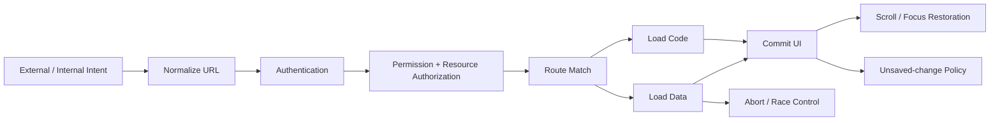
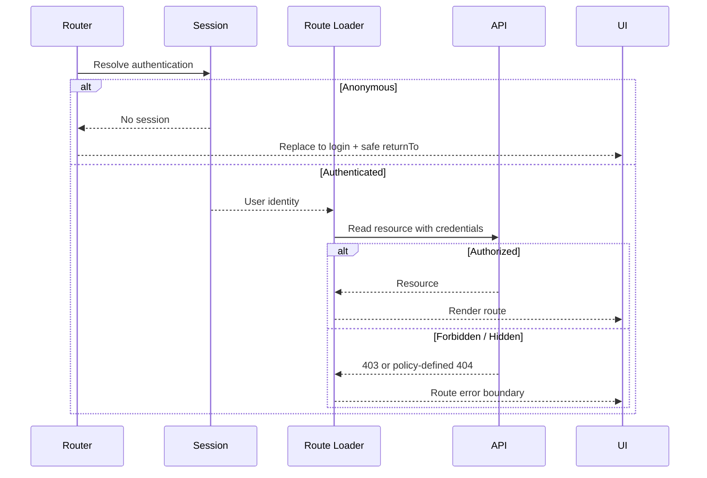
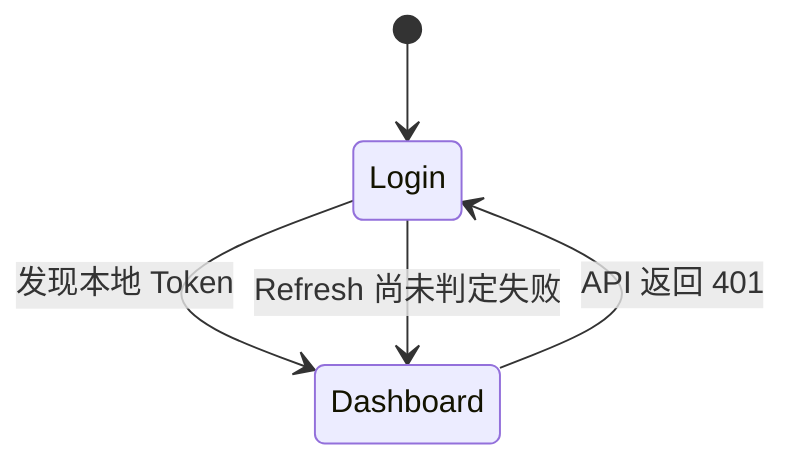
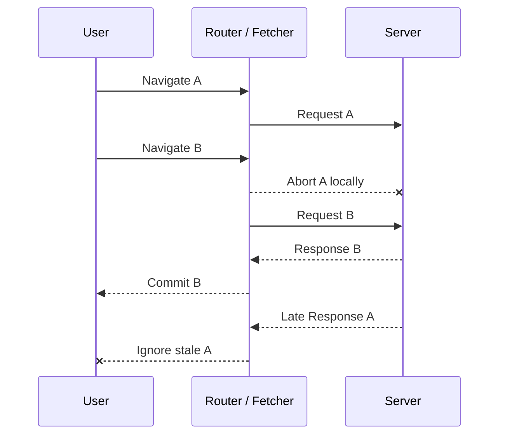
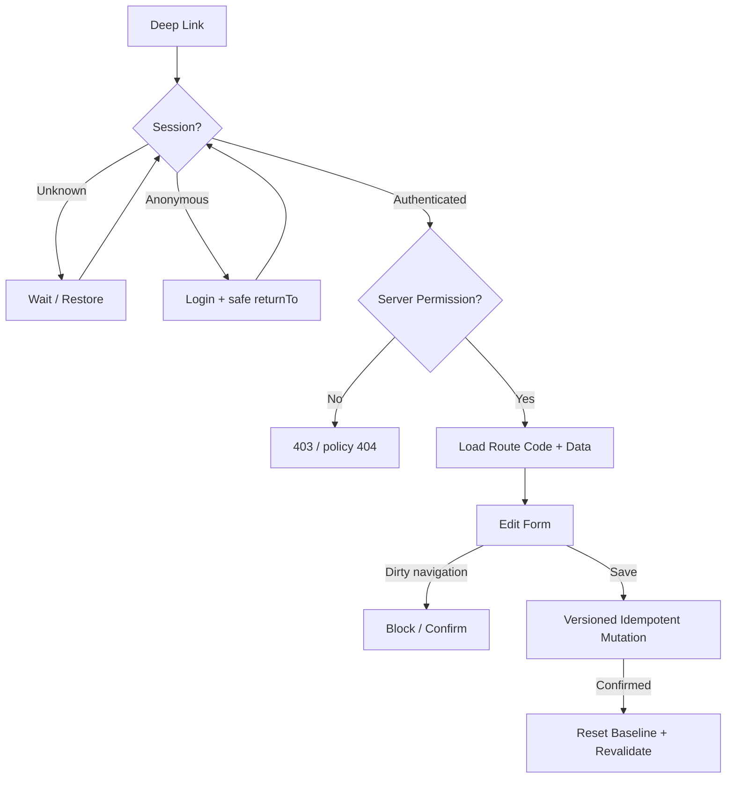

# React 路由工程：鉴权、深链接、预取与导航竞态治理

> 路由工程的目标不是“禁止用户看到某个组件”，而是让任意入口、任意身份、任意网络时序下的导航都可解释、可恢复、可取消且不破坏服务端安全与数据一致性。

---

## 一、为什么 Route 配置正确，应用仍可能不可靠

一个企业后台即使已经正确配置 Route、Loader 和 Action，仍可能出现：

- 未登录用户先看到受保护页面，再被 `useEffect` 跳走；
- 菜单隐藏了“财务报表”，但手输 URL 仍能请求敏感 API；
- 邮件中的订单链接刷新后 404，或登录后丢失原目标；
- `/login` 与 `/dashboard` 之间无限重定向；
- 从详情返回长列表时滚动位置丢失；
- 编辑表单尚未保存，点击侧栏直接丢失 Draft；
- 首页 Bundle 包含所有后台页面，首屏下载过大；
- 鼠标经过几十个链接就发起大量无用预取；
- 快速切换筛选时，旧响应覆盖新页面；
- 客户端取消了保存请求，服务端却已经写入成功。

这些问题分属安全、部署、交互、性能和并发，不能靠一个 `ProtectedRoute` 组件统一解决。



图中的每一步都有独立失败模式。URL 规范化应幂等，身份未知时不能提前判定匿名，客户端 Permission 不能替代 API 授权，代码和数据预取必须共享缓存身份，离页阻塞也不能覆盖浏览器所有退出路径。

本文延续上一篇“客户端路由”的 History、Route Matching、Loader、Action 与 Error Boundary 模型，以现代 React Router 的公开能力为主要示例。`useBlocker`、`ScrollRestoration`、Route `lazy` 和 Link Prefetch 的可用模式、包入口与 API 细节会随版本变化，项目必须以锁定版本文档为准。

### 核心结论

1. Authentication 回答“用户是谁”，Authorization 回答“用户能否对资源执行动作”，两者不能混为一个 Boolean。
2. Route Guard 负责导航体验，服务端负责最终认证、授权和数据隔离。
3. 身份状态至少包含 `unknown`、`anonymous`、`authenticated`；把 `unknown` 当匿名容易产生闪烁和重定向循环。
4. Deep Link 必须在直接访问、刷新、登录恢复、部署回退和参数非法时都得到确定结果。
5. `returnTo` 是不可信输入，必须限制为允许的站内路径，避免 Open Redirect。
6. Redirect Rule 应集中、幂等且可观测，不能由多个组件 Effect 相互修正 URL。
7. Scroll Restoration 应区分 Push、Replace、Pop、Hash Target 和嵌套滚动容器。
8. Unsaved Changes 只应基于真实 Dirty Draft 阻塞，并同时考虑站内导航与浏览器离页。
9. Route-level Code Splitting 解决代码传输边界，Prefetch 用额外资源换取导航延迟，二者都必须测量。
10. Router 可以避免大多数陈旧读取提交 UI，但无法撤销服务端已经处理的写操作。
11. 导航竞态的完整治理需要 AbortSignal、资源身份、Latest Intent、幂等键和版本检查共同协作。
12. 路由工程应通过真实 Deep Link、History、弱网和延迟乱序测试验证，而不是只 Mock `useNavigate`。

---

## 二、先定义职责边界

路由层最容易失控的原因，是把多种能力都叫作“Guard”。更清晰的分层如下：

| 层级 | 主要职责 | 不能替代 |
|---|---|---|
| CDN / Web Server | TLS、域名规范化、SPA Fallback、静态资源与 HTTP Redirect | 应用权限判断 |
| Router | URL 匹配、导航、Loader/Action、局部错误和 Pending UI | 服务端最终授权 |
| Auth Session | 恢复登录身份、过期处理、刷新协调 | 资源级 Permission |
| API / Domain | 认证、授权、校验、幂等、事务和审计 | 客户端导航体验 |
| Query Cache | 资源缓存、共享、失效和重新验证 | Route History 与离页阻塞 |
| Form State | Draft、Dirty、Touched、校验和提交状态 | 已保存服务器事实 |

一个受保护页面的正常执行链应是：



服务端返回的结果才是资源访问权威。客户端提前判断 Permission 的价值，是减少无效跳转和改善 UI，不是建立安全边界。

---

## 三、Authentication Guard：先可靠恢复身份

### 3.1 身份不是一个初始值为 `false` 的 Boolean

应用启动时，身份可能还在从 Cookie Session、Token Refresh 或本地凭据恢复。更合理的模型是：

```ts
type AuthState =
  | { status: 'unknown' }
  | { status: 'anonymous' }
  | { status: 'authenticated'; user: CurrentUser };
```

如果把初始状态写成 `isLoggedIn = false`，受保护页面会先跳到登录页；Session 恢复后，登录页又把用户跳回后台，形成闪烁、额外 History Entry，甚至循环。

在 Data Router 中，优先让受保护 Route 的 Loader 等待 Session 判定并直接返回 Redirect，而不是先 Render 页面，再在 `useEffect` 中导航：

```ts
async function protectedLoader({ request }: LoaderFunctionArgs) {
  const session = await sessionClient.getCurrentUser({
    signal: request.signal,
  });

  if (!session) {
    const currentUrl = new URL(request.url);
    const returnTo = `${currentUrl.pathname}${currentUrl.search}`;
    const search = new URLSearchParams({ returnTo });

    throw redirect(`/login?${search}`, { status: 302 });
  }

  return { user: session.user };
}
```

Loader Guard 可以避免受保护组件短暂 Commit，但在纯 SPA 中它仍运行于浏览器。API 必须独立验证 Cookie、Token 和 Session，不能因为 Loader 已检查就信任后续请求。

### 3.2 `returnTo` 必须防止 Open Redirect

登录后恢复原目标很常见：

```text
/orders/ord_1024 -> /login?returnTo=/orders/ord_1024
```

攻击者也可能构造：

```text
/login?returnTo=https://evil.example/phishing
```

因此不能直接 `navigate(searchParams.get('returnTo'))`。应只接受允许的站内目标：

```ts
function getSafeReturnTo(
  requestUrl: string,
  candidate: string | null,
): string {
  const current = new URL(requestUrl);
  const fallback = '/dashboard';

  if (!candidate) return fallback;

  try {
    const target = new URL(candidate, current.origin);
    if (target.origin !== current.origin) return fallback;
    if (!target.pathname.startsWith('/')) return fallback;
    if (target.pathname === '/login') return fallback;

    return `${target.pathname}${target.search}${target.hash}`;
  } catch {
    return fallback;
  }
}
```

更严格的系统还应按业务维护允许的 Path Prefix 或 Route ID，而不是只校验 Same Origin。`returnTo` 不应携带 Token、密码、一次性凭据或其他会进入日志和 Referer 的敏感信息。

### 3.3 Session 失效需要统一处理

多个并发 Loader 同时收到 401 时，不能各自刷新 Token 并各自 Redirect。应由 Auth Client 提供 Single-flight Refresh：

- 同一时刻只允许一个 Refresh Request；
- 其他请求等待同一个 Promise；
- 刷新成功后按幂等性规则重试安全请求；
- 刷新失败统一清理 Session 和用户作用域缓存；
- 导航到登录页时保留经过校验的当前目标；
- Mutation 是否重试必须由 Operation Identity 和业务策略决定。

不要对所有 401 无限刷新。Refresh Endpoint 自身返回 401、凭据被撤销或 Session 已过期时必须终止。

---

## 四、Permission：从“能看页面”到“能操作资源”

### 4.1 Authentication 与 Authorization 的区别

假设用户已登录：

- 是否能进入 `/admin` 是粗粒度 Route Permission；
- 是否能读取订单 `ord_1024` 是资源级 Permission；
- 是否能退款是动作级 Permission；
- 是否能看到成本字段是字段级 Permission。

这些结果可能由角色、组织、资源归属、订单状态和临时策略共同决定，不能只写成：

```ts
const canAccess = user.role === 'admin';
```

前端可以使用服务端下发的 Capability 改善体验：

```ts
type OrderCapabilities = {
  canRead: boolean;
  canEdit: boolean;
  canRefund: boolean;
  canViewCost: boolean;
};
```

但 Action/API 在每次写入时仍要重新授权，因为 Capability Snapshot 可能已经过期，资源状态也可能变化。

### 4.2 401、403 与 404 的语义

| 状态 | 常见含义 | 典型 UI |
|---|---|---|
| 401 | 未建立有效身份 | 登录或重新认证 |
| 403 | 身份明确，但无权执行 | 权限不足、申请权限 |
| 404 | Route 或资源不存在 | 返回列表、检查链接 |

某些安全策略会对无权感知其存在的资源返回 404，避免泄露资源是否存在。这必须由服务端统一决定，客户端不要针对同一资源随机混用 403 和 404。

### 4.3 隐藏入口不是授权

```tsx
{order.capabilities.canRefund && (
  <button onClick={refundOrder}>退款</button>
)}
```

这段代码只减少无效操作。攻击者仍可直接构造 Request，因此 Refund API 必须验证：

- 当前身份和 Tenant；
- 订单归属；
- 当前状态是否允许退款；
- 金额与币种；
- 幂等键和审计信息。

Permission Cache 也必须按 User、Tenant 和 Session 隔离。退出登录时若只清 UI Store、不清 Query Cache，下一个用户可能短暂看到上一个用户的菜单或资源摘要。

---

## 五、Deep Link：从外部入口恢复完整页面

Deep Link 不只来自地址栏。它可能来自邮件、消息、浏览器书签、二维码、OAuth Callback 或另一个系统：

```text
https://app.example.com/orgs/acme/orders/ord_1024?panel=history#event-88
```

一个可靠 Deep Link 要依次解决：

1. 域名、协议和 Base Path 是否正确；
2. CDN/Server 是否把该路径交给 SPA 或 SSR Router；
3. Route 与参数是否可匹配、解析；
4. 身份未知时是否等待恢复；
5. 未登录时是否安全保存原目标；
6. 登录后是否回到允许的目标；
7. Tenant、资源和 Permission 是否仍有效；
8. Query、Hash 和 Scroll Target 是否能恢复；
9. 旧 URL 是否有明确、幂等的迁移规则。

### 5.1 直接访问与站内导航必须等价

只从首页点击进入 `/orders/ord_1024` 成功，不代表 Deep Link 可用。生产部署必须验证：

- 请求文档路径时返回应用 HTML 或正确 SSR Response；
- `/assets/app.js` 不存在时仍返回真正的 404，而不是 `index.html`；
- API 路径不会被 SPA Fallback 吞掉；
- 部署在 `/console/` 下时，Router Basename、静态资源 Base 和服务器 Rewrite 一致；
- Refresh、New Tab 和复制链接不会依赖 `location.state`。

### 5.2 URL 规范化必须幂等

旧路径和非法但可修复参数可以 Redirect 到 Canonical URL：

```ts
function canonicalizeOrderUrl(url: URL): string {
  const next = new URL(url);
  const page = Number(next.searchParams.get('page') ?? '1');

  if (!Number.isInteger(page) || page <= 1) {
    next.searchParams.delete('page');
  }

  next.searchParams.sort();
  return `${next.pathname}${next.search}${next.hash}`;
}
```

必须满足：

```text
canonicalize(canonicalize(url)) === canonicalize(url)
```

只有规范化结果与当前 URL 不同时才 Replace。否则每次 Loader 都 Redirect 到同一个地址，会形成循环或多余导航。

### 5.3 不要把敏感信息放入 URL

URL 可能进入浏览器历史、服务端日志、分析系统、截图和 Referer。密码、长期 Token、个人敏感数据不应放在 Path 或 Search Params 中。OAuth/OIDC 回调中的短期 Code、State 和 PKCE 流程也必须遵循协议校验，并尽快交换和清理地址。

---

## 六、Redirect Loop：把跳转规则当作状态图

常见循环不是单条规则错误，而是多条“看似合理”的规则相互作用：



其他高频来源包括：

- Login Route 也被 Protected Layout 包裹；
- `unknown` 被不同组件分别解释为匿名和已登录；
- `/orders?page=1` 与 `/orders` 双向规范化；
- Locale Guard 在 `/zh` 与 `/zh-CN` 之间来回跳；
- `returnTo` 指回 `/login`；
- CDN HTTP Redirect 与客户端 Redirect 目标不一致；
- 权限缓存过期，两个布局对同一用户得出不同结论。

### 6.1 集中为纯决策函数

把导航决策与副作用分开，更容易测试所有状态：

```ts
type AccessDecision =
  | { kind: 'pending' }
  | { kind: 'allow' }
  | { kind: 'redirect'; to: string; reason: string };

function decideAccess(
  auth: AuthState,
  pathname: string,
): AccessDecision {
  if (auth.status === 'unknown') return { kind: 'pending' };

  if (auth.status === 'anonymous' && pathname !== '/login') {
    return {
      kind: 'redirect',
      to: `/login?${new URLSearchParams({ returnTo: pathname })}`,
      reason: 'authentication-required',
    };
  }

  if (auth.status === 'authenticated' && pathname === '/login') {
    return {
      kind: 'redirect',
      to: '/dashboard',
      reason: 'already-authenticated',
    };
  }

  return { kind: 'allow' };
}
```

真实工程还要让 `returnTo` 通过前文的安全校验，并把 Search、Hash 和 Route Permission 纳入输入。

### 6.2 为 Redirect 建立不变量

- Redirect Target 不能与当前 Canonical URL 相同；
- Authentication 只能有一个权威状态源；
- Login、Logout、Forbidden、Callback 必须明确是 Public 还是 Protected；
- 每条 Redirect 记录 `from`、`to`、Route ID 和 Reason Code；
- 服务端与客户端规范化规则使用同一份契约；
- 自动测试限制最大跳转次数，超过阈值立即失败并输出链路。

不要把完整 Query String 写入普通日志，其中可能包含用户输入或凭据。应脱敏或只记录允许字段。

---

## 七、Scroll Restoration：恢复的是浏览上下文

浏览器多页导航通常会保存和恢复滚动位置。SPA 替换了文档导航后，Router 需要重新定义策略。

| 导航类型 | 常见期望 |
|---|---|
| Push 到新页面 | 主容器回到顶部 |
| Replace 当前筛选 | 通常保持位置，取决于产品语义 |
| Pop 返回列表 | 恢复该 History Entry 的滚动位置 |
| Hash Navigation | 滚动到对应 Anchor，并考虑固定 Header |
| 同页面 Tab/Search 更新 | 通常避免无意义 Scroll Reset |

### 7.1 History Entry 比 Pathname 更精确

用户可能多次访问同一个 Pathname，但每次滚动位置不同：

```text
/orders?page=1 -> /orders/1 -> Back -> /orders?page=1
```

默认按 History Entry Key 保存更接近浏览器语义。某些产品希望同一路径共享一个位置，可以通过 Router 的 `getKey` 等能力改用 Pathname，但这会合并多个 Entry，必须明确代价。

现代 React Router 的 Data/Framework 模式提供 `ScrollRestoration` 一类能力；具体组件位置和选项按项目版本确认。不要同时让浏览器 `history.scrollRestoration = 'auto'` 和自定义 Router Restoration 竞争控制权。

### 7.2 数据和布局会影响恢复时机

列表还没加载完成时立即滚到 `y = 3000`，文档高度可能不足；图片加载、字体替换和折叠区域展开又会改变布局。需要：

- 在关键内容具备稳定尺寸后恢复；
- 图片和 Skeleton 使用明确尺寸，减少 Layout Shift；
- 虚拟列表按 Item Key/Index 恢复，而不是只保存 Pixel Offset；
- 嵌套滚动容器分别保存位置；
- 固定 Header 配合 `scroll-margin-top`；
- 导航完成后把 Focus 移到页面标题或主内容，不能只移动视口。

Scroll 与 Focus 是不同可访问性问题。屏幕阅读器用户需要明确的页面标题和焦点变化，视觉滚动正确不代表导航体验完整。

### 7.3 不要每次 Location 变化都强制置顶

```tsx
useEffect(() => {
  window.scrollTo(0, 0);
}, [location]);
```

这段代码会破坏 Back/Forward Restoration，也会在只修改 Search Params 或 Hash 时抢走用户位置。应使用 Router 对 History Action 的认识，或在明确的 Route 边界设置策略。

---

## 八、Unsaved Changes：阻止真正的数据丢失

### 8.1 应阻塞 Dirty，而不是 Touched

用户聚焦过字段不代表有未保存修改。离页条件应基于当前 Draft 是否偏离已确认 Baseline：

```ts
const shouldBlockNavigation =
  formState.isDirty &&
  submitState !== 'success' &&
  !draftHasBeenSafelyPersisted;
```

如果自动保存已确认最新版本，未必需要阻塞；如果自动保存仍 Pending 或结果 Unknown，则要按业务风险决定。

### 8.2 站内导航使用 Router Blocker

现代 React Router 的 `useBlocker` 可阻塞 Router 管理的客户端导航，并提供 `blocked`、`proceeding`、`unblocked` 等状态。示意代码如下：

```tsx
function EditOrderPage() {
  const { isDirty } = useOrderFormState();
  const blocker = useBlocker(isDirty);

  return (
    <>
      <OrderForm />

      {blocker.state === 'blocked' && (
        <ConfirmDialog
          title="放弃未保存的修改？"
          onConfirm={() => blocker.proceed()}
          onCancel={() => blocker.reset()}
        />
      )}
    </>
  );
}
```

确认框必须可被键盘操作、正确管理 Focus，并防止重复点击。保存成功时要建立新 Baseline 并解除阻塞；如果用户在保存 Pending 时已经尝试离开，应明确成功后是自动继续，还是让用户再次确认。

### 8.3 Reload、Close 和跨站跳转使用 `beforeunload`

Router Blocker 通常只能处理应用内导航。浏览器刷新、关闭标签页或输入外部地址需要 `beforeunload`：

```tsx
useEffect(() => {
  if (!isDirty) return;

  function handleBeforeUnload(event: BeforeUnloadEvent) {
    event.preventDefault();
    event.returnValue = 'unsaved';
  }

  window.addEventListener('beforeunload', handleBeforeUnload);
  return () => {
    window.removeEventListener('beforeunload', handleBeforeUnload);
  };
}, [isDirty]);
```

现代浏览器通常只显示通用提示，不会展示自定义文本；部分移动端退出场景也不保证触发。`beforeunload` 还可能影响 Back/Forward Cache，因此只在确实 Dirty 时注册，恢复干净状态后立即移除。

高价值长表单还应配合版本化草稿保存。Prompt 是最后一道提醒，不是数据恢复方案。

---

## 九、Route-level Code Splitting：按导航边界加载代码

一次性把所有页面打入入口 Bundle，会让未访问的报表、编辑器和管理模块占用首屏网络、解析和执行成本。Route 是天然的异步边界：

```ts
const routes = [
  {
    path: '/reports',
    lazy: () => import('./routes/reports'),
  },
];
```

Lazy Route Module 可以按当前版本约定导出：

```tsx
export async function loader(args: LoaderFunctionArgs) {
  return loadReports(args.request.signal);
}

export function Component() {
  const reports = useLoaderData() as Report[];
  return <ReportDashboard reports={reports} />;
}

export function ErrorBoundary() {
  return <ReportRouteError />;
}
```

Route Matching 所需的 `path`、`index` 和 `children` 通常必须预先已知，Lazy 阶段再加载 Component、Loader、Action 和 Error Boundary。具体允许字段以锁定版本为准。

### 9.1 拆分粒度不是越细越好

| 粒度 | 收益 | 代价 |
|---|---|---|
| 按大型 Feature | 首屏收益明显、请求数量可控 | Feature 内仍可能较大 |
| 每个 Route 一个 Chunk | 缓存和变更隔离较好 | 小文件过多、请求与调度成本增加 |
| 每个组件都 Lazy | 理论上传输最细 | Waterfall、Fallback 闪烁、维护复杂 |

优先拆分低频、大体积、独立依赖的路由，例如图表、富文本、地图和后台配置。共享 Design System、Auth Client 和基础 Runtime 通常应稳定复用，避免在多个 Route Chunk 重复打包。

### 9.2 代码和数据可能形成 Waterfall

若必须先下载 Route Module 才知道 Loader，再开始数据请求，就可能出现：

```text
Click -> Load route JS -> Discover loader -> Fetch data -> Render
```

框架或 Router 的 Lazy Discovery 策略不同。优化时应在 Performance Panel 查看真实 Waterfall，评估静态声明 Loader、并行加载 Code/Data、SSR 或 Prefetch，而不是只比较 Bundle 文件大小。

Chunk 加载失败可能来自离线、部署版本切换或缓存中的旧 HTML 指向已删除文件。错误边界应提供安全重试或刷新入口，部署应保留合理时间的旧 Hash Asset，避免滚动发布期间大面积 Chunk 404。

---

## 十、Prefetch：用资源预算换导航延迟

Prefetch 可以提前准备：

- Route Module 与依赖 Chunk；
- Loader/Query Data；
- 图片、字体等页面关键资源；
- DNS、Connection 或 Server Render 结果。

### 10.1 选择与用户意图匹配的时机

| 策略 | 适合场景 | 风险 |
|---|---|---|
| Render 时预取 | 几乎必达的下一步 | 页面链接多时浪费严重 |
| Hover / Focus Intent | 桌面链接、键盘导航 | 触屏无 Hover，快速划过误触发 |
| Viewport | 移动端列表、即将看到的链接 | 长列表可能触发大量请求 |
| Idle | 稳定的后续流程 | Idle 不等于网络和电量充足 |
| Explicit | Wizard 下一步、用户展开前 | 需要业务预测 |

当前 React Router Framework Mode 可在支持的版本中使用 Link Prefetch Policy，例如：

```tsx
<Link to={`/orders/${order.id}`} prefetch="intent">
  查看订单
</Link>
```

不同 Router Mode 和版本的 `prefetch`、`discover` 行为并不完全相同。Data Router 与第三方 Query Cache 也可手动预取：

```ts
async function prefetchOrder(orderId: string) {
  await Promise.all([
    import('./routes/order-detail'),
    queryClient.prefetchQuery({
      queryKey: ['order', currentTenantId, orderId],
      queryFn: ({ signal }) => fetchOrder(orderId, signal),
      staleTime: 30_000,
    }),
  ]);
}
```

### 10.2 Prefetch 必须复用正式导航的身份

预取有效的前提是正式导航能命中同一个 Code Chunk 或 Cache Key。所有影响响应的变量都要进入 Key：

- User/Tenant Scope；
- Resource ID；
- Locale、Currency；
- Filter、Sort、Page；
- 权限或数据版本中真正影响响应的部分。

登出、切换组织或权限变更时，应清理或隔离用户作用域预取数据。不能因为页面尚未 Render，就认为敏感 Response 留在共享 Cache 中没有风险。

### 10.3 控制预算与失效

Prefetch 会消耗带宽、服务端 QPS、内存和电量。工程上应：

- 对同一资源 Deduplicate；
- 设置并发上限和优先级；
- 在弱网、Data Saver 或后台标签页降低策略；
- 避免预取不可缓存、昂贵或会产生副作用的 Endpoint；
- 记录 Prefetch Hit、Waste、Bytes 和 Navigation Latency；
- 明确数据在真正导航时是否仍 Fresh；
- Never Prefetch Mutation。

`GET` 也必须没有业务副作用，否则浏览器、Crawler 或 Prefetch 都可能意外触发行为。

---

## 十一、Navigation Race：取消旧意图，但不要高估取消

### 11.1 读取竞态

用户依次输入 `r`、`re`、`react`，三个请求可能按相反顺序返回。如果旧结果最后 Commit，UI 会显示与当前输入不一致的数据。



React Router 会取消被新导航替代的进行中读取，并避免大多数陈旧结果提交。自定义 Fetcher 仍要把 `request.signal` 传递到底层 Fetch 和可取消解析：

```ts
async function searchLoader({ request }: LoaderFunctionArgs) {
  const url = new URL(request.url);
  const query = url.searchParams.get('q')?.trim() ?? '';

  if (query.length < 2) return { items: [] };

  const response = await fetch(
    `/api/search?${new URLSearchParams({ q: query })}`,
    { signal: request.signal },
  );

  if (!response.ok) {
    throw new Response('Search failed', { status: response.status });
  }

  return parseSearchResult(await response.json());
}
```

如果使用自己的 Effect 请求，则需要 AbortController 或 Request ID，并在 Cleanup 中阻止旧结果写入。只判断组件是否 Mounted 不够，因为同一个组件可能仍挂载，但参数已经变化。

### 11.2 Prefetch 与正式导航也会竞争

预取 A 尚未完成时，用户导航到 A，应该复用同一个 Promise 或由缓存去重，而不是再发一次请求。用户随后切到 B 时，A 的预取是否取消取决于成本和复用概率：

- 私有、昂贵、低复用请求适合取消；
- 小型公共 Chunk 可能继续下载并进入缓存；
- 无论是否取消，都不能让 A 的数据写入 B 的 Cache Key。

资源身份和 Cache Scope 比“最后一次请求获胜”更基础。不同 Key 的结果本来就可以并存。

### 11.3 写入竞态不会被 Abort 自动解决

用户连续保存 V1 和 V2：

```text
Client sends V1 -> Client sends V2 -> Server commits V2 -> Server commits V1
```

即使客户端 Abort V1，服务器也可能已经执行。可靠方案包括：

- 每个逻辑操作使用 Idempotency Key；
- 使用 Entity Version / ETag 执行乐观并发控制；
- 服务端事务内校验当前状态；
- 对同一实体串行化或拒绝过期命令；
- Unknown Result 时按 Operation ID 查询结果；
- 客户端只展示服务端确认的 Canonical Snapshot。

路由器负责网络并发体验，不负责业务事务。不要把“旧导航响应没有渲染”误解为“旧写入没有发生”。

---

## 十二、把能力组合到真实编辑流程

以 `/orgs/:orgId/orders/:orderId/edit` 为例：

1. Deep Link 直接到达 CDN，服务器正确回退到 SPA 或返回 SSR 文档；
2. Root Loader 等待 Session，匿名用户 Replace 到 Login，并保存安全 `returnTo`；
3. 登录后恢复目标，API 校验 User、Tenant 和 Order Permission；
4. Route Chunk 与订单数据按同一目标并行加载；
5. 404/403 进入最近 Route Error Boundary；
6. Form 以服务端 Snapshot 建立 Dirty Baseline；
7. Dirty 时站内导航由 Blocker 拦截，浏览器关闭由 `beforeunload` 提醒；
8. 保存请求携带 Entity Version 和 Idempotency Key；
9. 保存成功后 Reset Baseline、解除 Blocker 并重新验证订单；
10. Back 返回订单列表时恢复对应 History Entry 的滚动位置和 Focus；
11. 快速切换订单时旧 Loader 被 Abort，旧结果不能覆盖新 Route；
12. 日志记录 Route ID、Redirect Reason、Navigation ID 和脱敏错误。



这条链路的价值在于每个状态都有唯一所有者。Auth 不由 Form 猜测，Permission 不由菜单决定，Dirty 不由 Router 计算，Mutation 也不由 Abort 保证一致性。

---

## 十三、常见误区与修复

### 13.1 在 `useEffect` 中统一跳转受保护页面

组件已经 Render/Commit 后才跳转，会产生内容闪烁和组件副作用。优先在 Loader、Middleware 或框架服务器边界判定；客户端 API 仍独立授权。

### 13.2 只要菜单不可见就认为页面安全

隐藏 Menu、Button 和 Route 只是 UI Policy。服务端必须验证每次读取和写入，并按 Tenant 隔离缓存。

### 13.3 登录后无条件使用外部 `returnTo`

这会形成 Open Redirect。只接受 Same Origin 且属于允许 Route Scope 的相对目标，排除 Login/Logout/Callback 循环目标。

### 13.4 每次 URL 变化都 `window.scrollTo(0, 0)`

这会破坏 Back/Forward、Hash 和同页面筛选。应按 Navigation Type、History Entry 和 Route 语义恢复。

### 13.5 表单一有输入就永久注册 `beforeunload`

Touched 不等于 Dirty，保存成功后也必须清理 Listener。长期注册会制造无意义提示，并可能影响浏览器页面缓存能力。

### 13.6 所有链接 Render 时都 Prefetch

大型列表会产生流量和 QPS 风暴。根据 Intent、Viewport、网络条件和命中概率选择策略，并测量 Waste。

### 13.7 看到 AbortError 就认为写入失败

Abort 只说明客户端不再等待，不能证明服务端未提交。应进入 Unknown Result 或按 Operation ID 查询，而不是直接允许用户无条件重试。

### 13.8 Lazy 之后不再关注性能

Route Chunk 可能仍包含巨大共享依赖，或形成 Code-then-Data Waterfall。必须查看产物分析、Network Waterfall、Long Task 和真实导航延迟。

---

## 十四、测试、监控与性能验证

### 14.1 Authentication 与 Permission

- `unknown` 身份不会短暂跳到 Login；
- Anonymous Deep Link 登录后恢复原目标；
- 外部、协议相对和 Login 自指 `returnTo` 被拒绝；
- Session 过期的并发 401 只触发一次 Refresh；
- 前端隐藏入口时，直接调用 API 仍返回正确 403/404；
- Logout 和 Tenant Switch 清理用户作用域缓存。

### 14.2 Deep Link 与 Redirect

- 在生产同构环境直接打开每类动态 Route；
- Refresh、New Tab、Base Path、Trailing Slash、Encoded Params；
- 旧 URL 只执行一次 Canonical Redirect；
- Redirect Chain 有明确最大步数，发生循环时输出 Reason；
- CDN、Server、Client 的 HTTP/HTTPS、Host、Locale 规则一致。

### 14.3 Scroll 与 Unsaved Changes

- Push 新页面置顶，Pop 返回恢复原 Entry；
- Search/Tab 更新是否按产品要求保持位置；
- 图片、虚拟列表和嵌套容器恢复后不跳动；
- Dirty Form 的 Link、Back、Reload、Close 行为；
- Save Success、Save Failure、Unknown Result 时 Blocker 状态正确；
- Dialog Focus Trap、键盘操作和屏幕阅读器名称完整。

### 14.4 Code Splitting、Prefetch 与 Race

- Route Chunk 是否真的从入口产物拆出；
- 冷缓存与热缓存下 Click-to-Content 的 P50/P95；
- Prefetch Hit Rate、Waste Rate、Bytes、Server QPS；
- Slow 3G、CPU Throttling、Data Saver 下的策略；
- Chunk 404、离线、超时是否进入可恢复 UI；
- 使用可控延迟让 A 晚于 B 返回，验证只 Commit 最新意图；
- Mutation 乱序时服务端版本检查阻止旧写入覆盖新状态。

### 14.5 建议的可观测字段

```ts
type NavigationTrace = {
  navigationId: string;
  fromRouteId: string | null;
  toRouteId: string;
  navigationType: 'push' | 'replace' | 'pop';
  redirectReason?: string;
  authOutcome?: 'anonymous' | 'authenticated' | 'forbidden';
  codeLoadMs?: number;
  dataLoadMs?: number;
  prefetched?: boolean;
  aborted?: boolean;
};
```

日志应使用 Route ID 和脱敏参数，不要直接记录包含搜索词、邮箱、Token 或订单隐私字段的完整 URL。性能结论应在生产相近设备与网络下验证，并同时观察客户端指标和服务端 QPS。

---

## 十五、工程检查清单

### 安全与身份

- Auth 有 `unknown` 状态和唯一权威来源；
- Route Guard 不替代 API 认证授权；
- `returnTo` 只允许安全站内目标；
- Permission 与 Query Cache 按 User/Tenant 隔离；
- Logout、Revocation、Tenant Switch 有统一清理协议。

### 导航与恢复

- Deep Link、Refresh、Back/Forward 在部署环境可用；
- Canonical Redirect 幂等且可观测；
- Scroll 按 Entry、Navigation Type 和容器恢复；
- Dirty、Saving、Saved、Unknown Result 有明确离页策略；
- Browser Exit 不依赖一定会触发的事件保存数据。

### 性能与并发

- Route Chunk 边界来自测量而非文件数量；
- Prefetch 有触发策略、预算、Scope 和命中指标；
- Loader 把 AbortSignal 传到底层；
- Cache Key 覆盖所有响应变量；
- Mutation 使用幂等和版本控制解决服务端竞态。

---

## 十六、总结

路由工程把“能跳转”提升为“在真实生产约束下可靠导航”。其核心不是堆叠 Guard，而是让每个问题回到正确边界：

- Authentication 先可靠恢复身份，Permission 再判断资源与动作；
- 客户端优化入口和反馈，服务端执行最终安全检查；
- Deep Link 贯穿部署、登录恢复、参数校验和 Canonical URL；
- Redirect 是需要不变量和监控的状态图，不是零散 Effect；
- Scroll 与 Focus 共同恢复浏览上下文；
- Unsaved Changes 由 Dirty Baseline 驱动，并区分站内与浏览器离页；
- Code Splitting 降低初始成本，Prefetch 只在预算内提前支付成本；
- Router 取消旧读取以保护 UI，服务端幂等和版本控制保护写入一致性。

真正可靠的导航，不依赖用户“按正常顺序点击”。它应允许用户从任意合法 URL 进入、在任意时刻后退或切换，并在身份变化、弱网、错误和乱序下仍给出一致、可恢复的结果。

---

## 问答复盘

### Q1：Authentication Guard 为什么不能代替服务端授权？

**答：** Guard 运行在用户可控制的客户端，只能改善导航体验。用户可绕过 Route 直接请求 API，因此服务端必须重新验证身份、Tenant、资源和动作权限。

### Q2：为什么 Auth State 需要 `unknown`？

**答：** 应用启动时 Session 可能仍在恢复。把未知状态当匿名会提前跳到 Login；随后恢复成功又跳回原页，造成闪烁、历史污染或 Redirect Loop。

### Q3：登录后的 `returnTo` 只校验 Same Origin 就足够吗？

**答：** 不一定。Same Origin 是最低要求；高安全应用还应限制 Route Prefix、排除 Login/Logout/Callback 等循环目标，并禁止敏感信息进入 URL。

### Q4：前端应该对无权限资源显示 403 还是 404？

**答：** 由服务端安全策略统一决定。普通权限不足可用 403；如果资源存在性本身敏感，可返回 404。客户端应忠实映射，不能按页面随意混用。

### Q5：为什么不能监听 Location 后统一滚到顶部？

**答：** Location 变化可能是 Back、Forward、Hash 或 Search 更新。统一置顶会破坏 History Entry 的滚动恢复和同页面上下文，应按 Navigation Type 与 Route 语义处理。

### Q6：`useBlocker` 能阻止关闭浏览器标签页吗？

**答：** 通常不能。它主要阻塞 Router 管理的站内导航；Reload、Close 和外部地址需要 `beforeunload`，且该事件在部分移动端场景也不可靠，因此重要 Draft 还应持久化。

### Q7：Route-level Code Splitting 是否一定提升导航性能？

**答：** 不一定。它可减少入口 Bundle，但也可能增加 Chunk 请求或形成 Code-then-Data Waterfall。必须测量冷/热缓存、网络瀑布、解析执行和 Click-to-Content。

### Q8：什么时候适合 `prefetch="intent"`？

**答：** 适合桌面端可预测的 Link Hover/Focus，且目标 Code/Data 可缓存、成本受控。触屏、长列表、弱网和敏感私有数据需要其他策略或禁用预取。

### Q9：Router 已取消旧 Action，为什么仍需要 Idempotency Key？

**答：** 客户端取消不代表服务器停止处理。旧 Action 可能已经提交；幂等键避免同一逻辑操作重复执行，实体版本防止旧命令覆盖新状态。

### Q10：如何可靠复现 Navigation Race？

**答：** 在集成或端到端测试中人为控制响应顺序，让请求 A 先发后回、请求 B 后发先回，再断言只 Commit B；写操作还要断言服务端版本检查拒绝过期命令。

---

## 延伸知识

- URL State Schema、Canonical URL 与 Query Cache Key；
- OAuth 2.0 / OpenID Connect、PKCE 与 Callback 安全；
- Back/Forward Cache、Navigation API 与 View Transition；
- SSR、Streaming、Hydration 与服务端 Redirect；
- Service Worker、离线导航与旧 Chunk 版本治理；
- Web Vitals、Route Navigation Timing 与真实用户监控。
