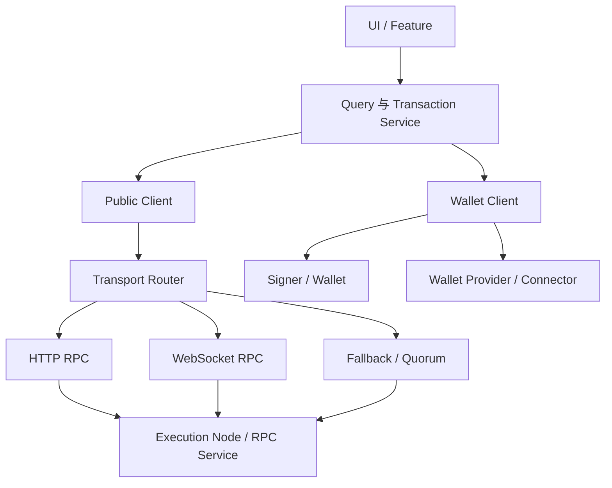
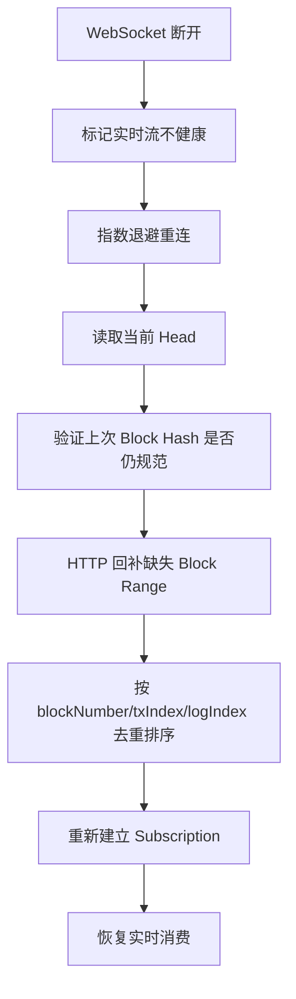
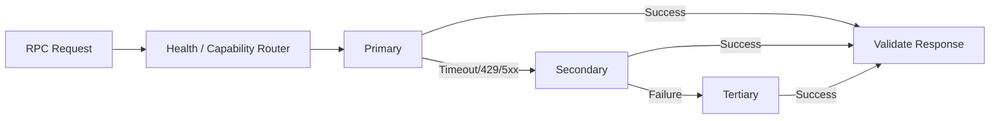
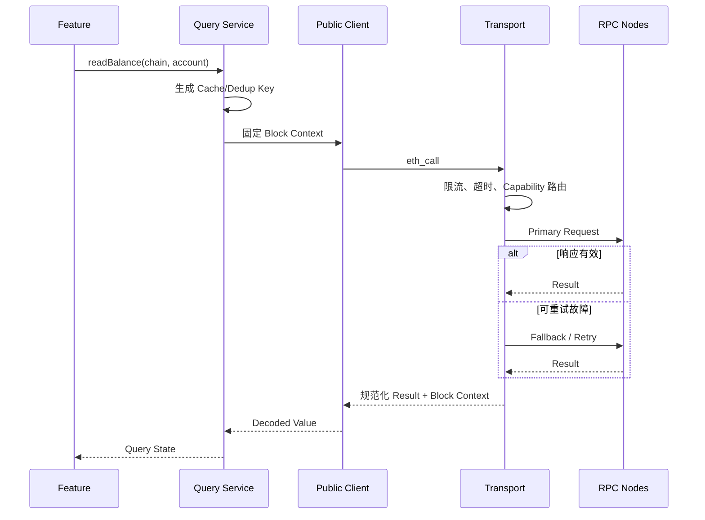
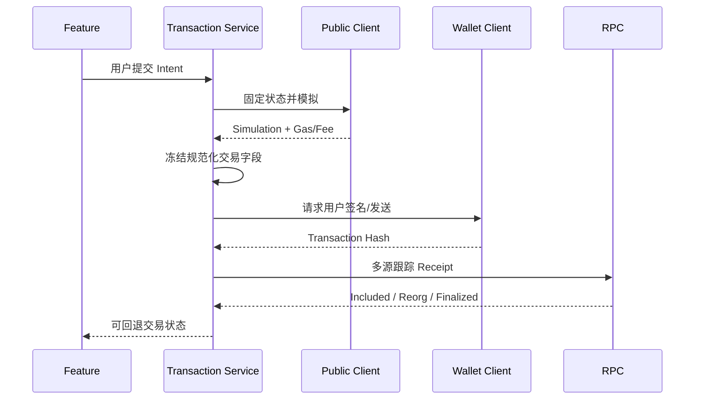

# Web3 Provider 架构：从 Transport、Public Client 到 RPC Quorum 与请求治理

> Provider 不是“一个 RPC URL 的包装器”。成熟 DApp 需要把链配置、只读查询、钱包授权、签名、传输协议、故障转移和一致性策略拆开。否则一次 RPC 抖动会被误判为钱包断开，一次切链会污染旧缓存，而盲目重试写请求还可能产生重复业务操作。

---

## 一、本文解决什么问题

前端通常从一段简单代码开始：

```typescript
const provider = new Provider(RPC_URL);
const balance = await provider.getBalance(address);
```

随着业务增长，它很快需要同时处理：

- 公共链数据读取；
- 注入钱包与 WalletConnect；
- 多条链配置；
- HTTP 查询和 WebSocket 订阅；
- RPC 限流、超时与故障；
- 多节点高度不一致；
- 请求重试与去重；
- 交易签名和广播；
- 页面切链、切账户和后台恢复；
- 区块重组导致的数据回退。

如果所有能力都放进一个全局 `provider`，常见问题包括：

- 用户没有连接钱包时，页面连公开数据都无法展示；
- 钱包当前 RPC 故障被错误展示成“账户断开”；
- 合约读取依赖用户钱包速度和限额；
- 同一个请求同时打到多个 Provider，却选中不同区块状态；
- HTTP Fallback 切换后，Nonce、Receipt 和 Logs 出现前后矛盾；
- WebSocket 重连后漏事件或重复事件；
- 对 `eth_sendRawTransaction` 进行普通重试，无法解释交易是否已广播；
- 组件重复渲染触发几十次相同 RPC；
- 把 Signer 与 Provider 混为一谈，导致只读模块意外获得签名能力。

本文覆盖大纲中的：

- Transport
- HTTP / WebSocket
- Chain Configuration
- Public Client
- Wallet Client
- Signer
- Provider Fallback
- RPC Quorum
- Rate Limit
- Retry
- Request Deduplication

### 核心结论

1. Public Client 负责链上公共数据与模拟，Wallet Client 负责账户授权和钱包请求，Signer 只负责产生签名；三者不应因 API 方便而混成一个安全边界。
2. HTTP 适合请求/响应和可控重试，WebSocket 适合低延迟订阅，但断线恢复必须按区块范围补数，不能只重新订阅。
3. Chain Configuration 是所有 RPC、地址、Explorer 和 Finality 策略的根上下文，必须经过可信配置管理，不能直接接受用户输入。
4. Provider Fallback 解决可用性，不自动解决正确性。切换节点可能带来 Head、Mempool、Archive 能力和日志结果差异。
5. RPC Quorum 只适合可定义等价关系的读请求；对 `latest`、Pending、Gas Estimate 和 Trace 盲目多数投票可能得出没有意义的结果。
6. Rate Limit 应在客户端、服务端代理和供应商三个层级治理，并按方法成本区分预算。
7. Retry 必须基于幂等性、错误类型和截止时间；签名弹窗、交易意图和非幂等业务请求不能做无条件自动重试。
8. Request Deduplication 只合并语义完全相同且处于同一链状态上下文的请求，不能跨账户、区块标签或 Provider 世代复用。

---

## 二、Provider 架构中的对象边界

### 2.1 推荐分层



每层职责：

| 层 | 负责 | 不负责 |
|---|---|---|
| Feature/UI | 展示状态、发出用户意图 | 不直接拼接任意 JSON-RPC |
| Query Service | 缓存、区块绑定、数据组合 | 不持有私钥 |
| Transaction Service | 模拟、构造、跟踪交易状态 | 不绕过钱包确认 |
| Public Client | 公共读取、日志、模拟、费用数据 | 不要求用户账户授权 |
| Wallet Client | 请求账户、切链、签名和发送 | 不作为高吞吐公共读取源 |
| Signer | 对明确 Payload 签名 | 不决定业务目标和 RPC 路由 |
| Transport | 超时、序列化、限流、重试、路由 | 不解释业务成功 |
| Chain Config | 网络身份和可信基础设施 | 不从不可信 URL 动态覆盖 |

### 2.2 “Provider”一词为什么容易混乱

不同库中 Provider 可能表示：

- EIP-1193 钱包 Provider；
- JSON-RPC 网络 Provider；
- React Context Provider；
- Fallback Provider；
- 节点服务商；
- 数据源抽象。

代码命名应更具体：

```typescript
type PublicRpcClient = { /* read/simulate */ };
type WalletProvider = { request(args: RpcRequest): Promise<unknown> };
type TransactionSigner = { signTransaction(tx: UnsignedTx): Promise<Hex> };
type RpcTransport = { send(request: JsonRpcRequest): Promise<JsonRpcResponse> };
```

命名清楚会直接改善权限评审和故障诊断。

### 2.3 数据读取不应依赖钱包连接

首页 TVL、Token 信息、价格和合约状态属于公开数据。它们应通过 Public Client 获取，使用户在未安装钱包、未授权账户或钱包锁定时仍能浏览。

只有下列行为需要 Wallet Client：

- 获取当前授权账户；
- 请求切链或添加网络；
- 签署交易或消息；
- 通过钱包发送交易；
- 响应账户、链和连接事件。

---

## 三、Transport

### 3.1 Transport 的稳定职责

Transport 把结构化 JSON-RPC Request 发送到目标 Endpoint，并返回 Response。它应统一处理：

- JSON 序列化和反序列化；
- Request ID；
- HTTP/WS 生命周期；
- 超时和取消；
- 并发限制；
- Rate Limit；
- Retry；
- Batch；
- 指标、Trace 和安全日志；
- Fallback/Quorum 路由；
- 错误归一化。

Transport 不应把 `eth_call` Revert 当作网络重试错误，也不应把 HTTP 200 直接解释为 RPC 成功。JSON-RPC Error 可能包含在成功的 HTTP 响应中。

### 3.2 结构化请求

```typescript
type JsonRpcRequest = {
  jsonrpc: '2.0';
  id: number | string;
  method: string;
  params?: readonly unknown[] | object;
};

type RpcRequestContext = {
  chainId: number;
  deadlineMs: number;
  consistency: 'latest' | 'safe' | 'finalized' | 'pinned-block';
  idempotency: 'read' | 'raw-broadcast' | 'interactive' | 'unknown';
  priority: 'foreground' | 'background';
};
```

Context 不一定发给节点，但用于路由和治理。缺少 Chain ID 与一致性标签的裸请求很难安全 Fallback。

### 3.3 错误分类

至少区分：

```text
TransportError
  - DNS / TLS / Connection
  - Timeout / Abort
  - HTTP 429 / 5xx
  - WebSocket Closed

ProtocolError
  - Invalid JSON
  - JSON-RPC ID Mismatch
  - Malformed Result

RpcError
  - Method Not Found
  - Invalid Params
  - Execution Reverted
  - Rate Limited by Provider

ConsistencyError
  - Wrong Chain
  - Head Too Old
  - Block Hash Mismatch
  - Quorum Not Reached
```

只有部分错误适合重试。

### 3.4 超时不是失败事实

读请求超时通常可以换节点重试；广播请求超时则可能已经被节点接受。对于 `eth_sendRawTransaction`：

1. 广播前本地计算 Transaction Hash；
2. 超时后按 Hash 查询；
3. 可以重播完全相同的 Raw Transaction；
4. 不能因为超时就重新分配 Nonce 创建另一笔业务交易。

Transport 应把“响应未知”保留为独立状态。

---

## 四、HTTP 与 WebSocket

### 4.1 HTTP 的特点

HTTP RPC 适合：

- `eth_call`；
- `eth_getBalance`；
- `eth_getLogs`；
- `eth_getTransactionReceipt`；
- Gas/Fee 查询；
- 交易广播；
- 服务端 Batch 和高并发读取。

优势：

- 请求生命周期清晰；
- 易于设置超时、代理、缓存和重试；
- 无长期连接状态；
- 服务端与 Serverless 兼容较好。

代价是实时事件通常需要轮询。

### 4.2 WebSocket 的特点

WebSocket 适合通过 `eth_subscribe` 等机制获取：

- New Heads；
- Logs；
- 某些节点支持的 Pending Transaction 通知。

优势是低延迟推送；代价是：

- 长连接会断开；
- 代理、移动网络和后台策略可能终止连接；
- 订阅 ID 只在特定连接生命周期内有效；
- 重连可能漏事件；
- 同一事件可能重复推送；
- 服务商对订阅数量和消息速率限制更严格。

### 4.3 WebSocket 不是可靠消息队列

错误实现：

```typescript
socket.on('log', (log) => database.insert(log));
socket.on('close', reconnect);
```

连接断开到重连之间的 Logs 会永久缺失。正确策略是保存 Cursor：

```text
lastProcessedBlockNumber
lastProcessedBlockHash
lastLogIndex
```

重连后先通过 HTTP `eth_getLogs` 回补缺口，再从新的 Head 继续订阅。

### 4.4 订阅恢复流程



若上次 Block Hash 不再规范，还要回退到共同祖先并处理 Removed Log。

### 4.5 混合 Transport

常见方案：

- HTTP 负责查询、模拟、Receipt 和回补；
- WebSocket 只负责提示“可能有新块/新日志”；
- 收到推送后仍通过 HTTP 按 Block Hash 拉取权威详情。

这比把 WebSocket 消息直接作为最终数据库事实更可靠。

### 4.6 移动端与浏览器后台

页面进入后台后，浏览器可能冻结 Timer 或断开 WebSocket。恢复前台时必须：

- 检查连接世代；
- 获取最新 Head；
- 回补后台期间区块；
- 取消旧订阅回调；
- 防止多个 Socket 同时活跃；
- 重新评估 Rate Limit 与批量回补范围。

---

## 五、Chain Configuration

### 5.1 配置是信任根

Chain Configuration 至少包含：

```typescript
type ChainConfig = {
  chainId: number;
  name: string;
  nativeCurrency: {
    name: string;
    symbol: string;
    decimals: number;
  };
  rpc: {
    http: readonly RpcEndpoint[];
    webSocket?: readonly RpcEndpoint[];
  };
  blockExplorers: readonly string[];
  contracts: Readonly<Record<string, `0x${string}`>>;
  finalityPolicy: FinalityPolicy;
  capabilities: ChainCapabilities;
};
```

不要把 RPC、Explorer 和合约地址散落在组件里。

### 5.2 Chain ID 不足以证明 RPC 正确

连接 Endpoint 后至少调用 `eth_chainId` 校验网络，但恶意 RPC 可以谎报 Chain ID。高价值场景可进一步核对：

- 已知 Genesis/Checkpoint Block Hash；
- 关键合约 Code Hash；
- 当前 Head 与其他独立节点差异；
- 客户端/网络身份方法；
- 可信部署清单。

这是提高置信度，不是从单个不可信 RPC 获得密码学最终证明。

### 5.3 不要接受任意 RPC URL

如果 DApp 允许 URL 参数覆盖 RPC，攻击者可以构造钓鱼链接，使页面：

- 隐藏真实余额或交易；
- 返回伪造合约调用结果；
- 提供恶意 Gas/Nonce 数据；
- 诱导用户签署错误目标链交易；
- 收集地址和请求隐私。

自定义网络功能应隔离为高级设置，明确警告并验证协议、Chain ID、私网地址和权限。

### 5.4 Capability 不应靠失败探测

链配置可以声明：

- 是否支持 EIP-1559；
- 是否提供 `safe/finalized` 标签；
- 是否支持 WebSocket；
- 是否提供 Archive/Trace；
- L2 Fee 获取方式；
- 最大 Logs Range；
- Bundler/Paymaster EntryPoint 版本。

运行时仍需检测，但不要在每次用户请求时靠不断调用不支持方法来猜能力。

### 5.5 配置版本化

合约升级、RPC 下线、Explorer 迁移都需要配置发布。配置应：

- 有 Schema Validation；
- 有版本和变更记录；
- 支持灰度；
- 可快速撤销故障 Endpoint；
- 区分构建时可信默认值与运行时远程配置；
- 对远程配置签名或通过可信发布渠道保护。

---

## 六、Public Client

### 6.1 职责

Public Client 面向无需用户授权的链数据：

- Block、Transaction、Receipt；
- Balance、Code、Storage；
- Contract Read；
- Logs；
- Gas Estimate 与 Fee；
- `eth_call` Simulation；
- ENS/Name Resolution；
- Chain 状态与 Finality。

它应由应用控制的 RPC 配置驱动，而不是默认绑定当前钱包 RPC。

### 6.2 为什么不使用 Wallet Provider 做所有读取

钱包 Provider：

- 需要安装和授权；
- Endpoint、限流和网络由钱包控制；
- 可能不支持 Archive、Trace 或大范围 Logs；
- 切链会改变读取上下文；
- 用户锁定或 Disconnect 会影响可用性；
- 不适合后台服务和 SSR。

Public Client 让数据层与钱包生命周期解耦。

### 6.3 区块绑定读取

组合多个 RPC 时，如果都使用 `latest`，结果可能来自不同高度：

```text
balance at block 100
allowance at block 101
pool reserve at block 102
```

对于必须一致的页面或模拟，应先读取一个 Block Number/Hash，再让后续调用绑定同一区块：

```typescript
const block = await publicClient.getBlock({ blockTag: 'latest' });

const [balance, allowance] = await Promise.all([
  publicClient.readContract({ ...balanceCall, blockNumber: block.number }),
  publicClient.readContract({ ...allowanceCall, blockNumber: block.number }),
]);
```

节点必须仍保留该历史状态，否则可能返回 Missing Trie Node/Archive 能力错误。

### 6.4 Multicall 与 JSON-RPC Batch

两者不同：

- JSON-RPC Batch：一个 HTTP 请求包含多个独立 RPC，请求可能仍在不同处理时点执行；
- Multicall 合约：在一次 `eth_call` 执行中读取多个合约，天然共享同一 EVM 状态上下文。

Multicall 还要校验合约地址、链部署和子调用失败语义。不能默认所有 Multicall 都原子 Revert 或返回同一格式。

### 6.5 Public Client 不是业务缓存

Client 可以提供底层 Dedup 和 Batch，但 React Query/业务缓存仍负责：

- Stale Time；
- Account/Chain Key；
- Block-based Invalidation；
- UI Loading/Error；
- SSR Hydration；
- 乐观更新和 Reorg 回退。

不要让 Transport 缓存无限期取代业务状态管理。

---

## 七、Wallet Client

### 7.1 职责

Wallet Client 包装用户钱包能力：

- `eth_accounts` / `eth_requestAccounts`；
- 账户与链事件；
- 请求切链和添加网络；
- 发送交易；
- 签署消息与 Typed Data；
- 获取钱包特定 Capability；
- 管理 WalletConnect Session。

它的核心上下文是：

```text
connectorId + providerInstance + sessionId + chainId + account
```

任何一项变化都可能使 Pending 请求失效。

### 7.2 Wallet Client 不应静默切换账户

交易前必须核对：

- 当前 Provider 是否仍是用户选择的钱包；
- 当前账户是否等于交易 `from`；
- Chain ID 是否符合 Intent；
- Session 是否批准相应方法；
- 用户是否重新确认过变化后的内容。

如果 `accountsChanged` 在模拟后发生，旧 Simulation 必须失效。

### 7.3 钱包 RPC 与 Public RPC 交叉验证

构造交易时可以用 Public Client 模拟，用 Wallet Client 签名。但要避免两个数据源高度差异过大：

- Public RPC 返回最新 Nonce；
- 钱包 RPC 看到不同 Pending Pool；
- Public RPC 模拟通过；
- 钱包实际发送时状态已经改变。

最终交易字段应由钱包明确展示，发送前重新验证 Chain/Account，Receipt 则通过多个可信来源跟踪。

### 7.4 业务登录不是 Wallet Client 状态

钱包暴露账户不等于后端登录。SIWE 等签名认证应生成独立业务 Session，并在账户变化、域变化或策略需要时失效。

---

## 八、Signer

### 8.1 Signer 的最小职责

Signer 接收规范化 Payload 并返回签名：

```typescript
interface TransactionSigner {
  getAddress(): Promise<`0x${string}`>;
  signTransaction(transaction: UnsignedTransaction): Promise<Hex>;
  signMessage(message: SignableMessage): Promise<Hex>;
  signTypedData(data: TypedDataPayload): Promise<Hex>;
}
```

具体方法因库而异。权限边界比接口名称重要：Signer 不应自行选择目标合约、金额或 Chain。

### 8.2 Signer 类型

- Injected Wallet Signer；
- WalletConnect Remote Signer；
- Local Keystore Signer；
- Hardware Wallet Signer；
- HSM/MPC Signer；
- Smart Account Signer/Validator；
- Test Signer。

不同 Signer 的生命周期、算法、交互和错误不同，不应通过一个 `privateKey?: string` 抽象所有情况。

### 8.3 Signer 与 Transport 解耦

离线 Signer 可以只签名不广播；Watch-only Public Client 可以只读取不签名。拆分后可以：

- 在离线设备签署；
- 通过多个 RPC 广播同一 Raw Transaction；
- 在测试中替换 Fake Signer；
- 防止只读模块意外获取签名权限；
- 清晰记录“谁签名、谁广播、谁跟踪”。

### 8.4 不要自动重试交互签名

用户拒绝、钱包关闭或硬件设备超时属于交互结果。自动重弹签名可能造成：

- 多个并行请求；
- 用户误签；
- 旧 Intent 在切链后继续；
- WalletConnect Request ID 混乱。

重试必须由新的明确用户操作触发，并重新验证 Intent。

---

## 九、Provider Fallback

### 9.1 Fallback 解决什么

当主 RPC 超时、限流或不可用时，路由到备用 Endpoint，提高读取和广播可用性。



### 9.2 Fallback 不等于任意换节点

Endpoint 可能不同：

- Head 高度；
- Mempool 内容；
- Archive 历史；
- Trace API；
- Logs Range；
- Pending State；
- Client 实现；
- Rate Limit；
- L2 扩展 RPC。

路由前必须按 Capability 过滤。

### 9.3 健康检查

健康度不能只看 TCP/HTTP 200。至少监控：

- `eth_chainId`；
- 当前 Head Number/Hash；
- Head 与参考节点的延迟；
- P50/P95/P99；
- 错误率、429、超时；
- 历史状态能力；
- Logs/Trace 方法成功率；
- WebSocket 消息停滞时间。

故障节点进入熔断，经过冷却和探测后再恢复流量。

### 9.4 Hedged Request

高延迟读请求可以先发主节点，超过短延迟再向备用节点发送，取第一个满足校验的结果。这能降低尾延迟，但会增加请求成本和供应商限额消耗。

不适合：

- 用户签名请求；
- 会产生副作用的自定义 RPC；
- 未定义幂等性的服务方法；
- 隐私敏感交易意图。

### 9.5 Sticky Routing

某些流程应粘住同一节点或节点组：

- Pending Nonce 与广播；
- Transaction Hash 后续查询；
- 分页 Logs；
- Debug Trace；
- 基于 Pending State 的 Simulation。

完全随机 Fallback 会让状态看起来来回跳变。

---

## 十、RPC Quorum

### 10.1 什么是 Quorum

Quorum 同时查询多个独立 RPC，只有达到阈值的相容结果才返回。目的可能是：

- 降低单节点错误或恶意响应风险；
- 检测节点落后；
- 提升高价值读请求置信度；
- 观察链分叉或服务商异常。

### 10.2 先定义等价关系

不同方法不能统一 `JSON.stringify(result)` 投票。

| 方法 | 合理比较方式 | 风险 |
|---|---|---|
| `eth_chainId` | 精确相等 | 恶意节点仍可伪报 |
| 固定 Block Hash 的 Block | Hash、Parent、State Root 精确相等 | 节点可能尚未保存该块 |
| 固定 Block 的 Balance | 规范化数量相等 | 需要 Archive 状态 |
| `latest` Block Number | 容许高度窗口并检查 Hash 链 | 同时到达时间不同 |
| Gas Estimate | 不能简单要求精确相等 | 客户端算法与状态不同 |
| Fee Suggestion | 使用分位数/策略，不是事实投票 | 本身就是建议值 |
| Pending Nonce | 不适合全局多数 | Mempool 是本地视图 |
| Logs 固定范围 | 按 Block Hash、Tx Index、Log Index 比较 | Reorg 与节点限制 |

### 10.3 固定区块后再 Quorum

对于高价值读取：

1. 多节点确定一个共同认可的 Block Hash；
2. 对该 Block Hash/Number 读取状态；
3. 对规范化结果投票；
4. 达不到阈值则返回不确定状态，而不是随便选最快结果。

这比同时查询三个节点的 `latest` 更有意义。

### 10.4 节点独立性

三个 URL 可能都属于同一供应商、同一上游集群或同一客户端实现，故障相关性很高。Quorum 设计应考虑：

- 不同供应商；
- 不同地域；
- 不同客户端实现；
- 自建节点与第三方节点组合；
- 共同依赖的 Cloud/Network；
- 数据源是否实际共享上游。

### 10.5 Quorum 的代价

- RPC 成本成倍增长；
- 延迟由第 K 个响应决定；
- 结果归一化复杂；
- Reorg 时容易短暂无 Quorum；
- 隐私暴露给更多服务商；
- 对 Trace/大 Logs 请求代价很高。

只应用于高风险、可验证的关键读取，而不是所有首页请求。

---

## 十一、Rate Limit

### 11.1 限流来源

- 浏览器自身并发限制；
- 应用 API Gateway；
- RPC 服务商按 Key/IP/Method 计费；
- 节点 CPU、内存和数据库保护；
- WebSocket Subscription 数量；
- Bundler/Paymaster 业务配额。

HTTP `429` 是常见信号，但部分服务会返回 JSON-RPC Error 或 `503`。应按供应商文档识别，同时保留通用退避策略。

### 11.2 按成本分级

不同方法成本差异很大：

| 级别 | 示例 | 治理策略 |
|---|---|---|
| 低 | `eth_chainId`、固定块简单读取 | 可缓存、可 Dedup |
| 中 | `eth_call`、Receipt、Block | 并发限制、短缓存 |
| 高 | 大范围 `eth_getLogs` | 分块、服务端执行 |
| 极高 | Trace、Archive State、复杂模拟 | 单独队列、预算和授权 |

不能只按“每秒请求数”限流。

### 11.3 客户端 Token Bucket

```typescript
type RpcBudget = {
  maxConcurrent: number;
  tokensPerSecond: number;
  burst: number;
};
```

前台交互请求优先于后台刷新。页面不可见时降低轮询频率，恢复时合并刷新，避免所有组件同时打满 RPC。

### 11.4 服务端 RPC Proxy

将受保护 API Key 放在浏览器代码中无法保密。生产 DApp 可使用服务端代理实现：

- 隐藏供应商凭据；
- 用户/IP/Session 限流；
- Method Allowlist；
- 参数和 Block Range 限制；
- 缓存与 Dedup；
- 多供应商路由；
- 指标与成本治理。

Proxy 不能允许任意 JSON-RPC 透传，否则可能成为公开 Trace/Archive 滥用入口。

### 11.5 Backpressure

当队列超过阈值时，应丢弃过时后台任务或返回可解释错误，而不是无限排队。区块 100 的余额刷新在区块 105 到来后通常已无价值。

---

## 十二、Retry

### 12.1 按幂等性分类

| 请求类型 | 自动重试 | 条件 |
|---|---|---|
| 固定区块只读 | 通常可以 | 超时、连接、部分 5xx |
| `latest` 只读 | 可以，但结果可能变化 | 标记新 Snapshot |
| `eth_call` | 可以 | 同 Chain、Block、参数 |
| `eth_getLogs` | 可以 | 固定 Block Range |
| `eth_sendRawTransaction` | 可重播相同 Raw Tx | 不能生成新交易 |
| `eth_sendTransaction` | 不应自动重弹钱包 | 新用户意图触发 |
| `wallet_switchEthereumChain` | 不自动反复弹窗 | 用户明确重试 |
| 签名请求 | 不自动重试 | 重新校验 Intent |
| 未知自定义 RPC | 默认不重试 | 先确认副作用 |

### 12.2 指数退避与抖动

```text
delay = min(cap, base * 2^attempt) + random_jitter
```

还应受总 Deadline 约束。例如页面查询只允许 4 秒，不能执行 5 次各 3 秒的重试。

### 12.3 不应重试的错误

- Invalid Params；
- Method Not Found；
- Execution Reverted；
- User Rejected；
- Unauthorized；
- Wrong Chain；
- 明确的业务校验失败；
- 超过用户费用或安全策略。

换节点可能用于确认错误是否一致，但不能把确定性 Revert 当网络抖动无限重试。

### 12.4 Retry Storm

当 RPC 故障时，所有客户端立即重试会放大故障。需要：

- 指数退避与随机抖动；
- 熔断；
- 全局并发上限；
- 后台任务降级；
- 共享失败结果短缓存；
- 服务端 Retry Budget。

### 12.5 Retry 与 Fallback 顺序

可以按请求类型选择：

```text
快速读：Primary 一次 -> Secondary -> 退避重试
Archive：具备能力的 Primary -> 同能力 Secondary
广播：Primary + 可选同 Raw Tx 多播 -> 按 Hash 查询
Trace：单节点长 Deadline -> 明确失败，不盲目跨节点风暴
```

---

## 十三、Request Deduplication

### 13.1 为什么会产生重复请求

- 多个组件读取同一余额；
- React Strict Mode 开发环境重复执行；
- 页面切换和 Hydration；
- Block Event 同时触发多个 Query；
- 用户快速切换 Tab；
- WebSocket 重连与轮询同时刷新；
- Fallback 层与业务层都做重试。

### 13.2 In-flight Dedup

只合并正在执行的相同请求：

```typescript
class InflightDeduper {
  private readonly inflight = new Map<string, Promise<unknown>>();

  run<T>(key: string, request: () => Promise<T>): Promise<T> {
    const existing = this.inflight.get(key);
    if (existing) return existing as Promise<T>;

    const promise = request().finally(() => {
      if (this.inflight.get(key) === promise) {
        this.inflight.delete(key);
      }
    });

    this.inflight.set(key, promise);
    return promise;
  }
}
```

### 13.3 Dedup Key

Key 至少包含：

```text
chainId
method
canonical params
blockRef / consistency mode
provider generation
account if semantics depend on it
```

JSON 对象需要稳定序列化。数组顺序、十六进制 Quantity 规范化、地址大小写和默认参数都要处理。

### 13.4 不能 Dedup 的请求

- 钱包授权；
- 用户签名；
- 切链；
- 业务创建订单；
- 不同 Intent 的交易发送；
- Pending State 下语义可能不同的请求；
- 隐私或权限上下文不同的请求。

`eth_sendRawTransaction` 对完全相同 Raw Transaction 可幂等重播，但不应与普通读 Dedup 使用同一策略。

### 13.5 Dedup、Cache 与 Batch 的区别

- Dedup：合并同一时刻的相同请求；
- Cache：复用过去的结果；
- Batch：一次传输发送多个不同请求；
- Multicall：在同一 EVM 调用上下文执行多个读取。

四者可以组合，但解决的问题不同。

### 13.6 取消语义

多个调用者共享一个 In-flight Promise 时，一个组件取消不应直接 Abort 底层请求，除非所有订阅者都取消。需要引用计数或让取消只忽略调用者自己的结果。

---

## 十四、一致性策略

### 14.1 Block Tag 的语义

常见标签：

- `latest`：当前节点认为的最新规范块；
- `pending`：包含节点本地 Pending 状态，非全局共识；
- `safe` / `finalized`：仅在目标链和节点支持时使用；
- 明确 Block Number；
- EIP-1898 风格 Block Hash 引用，取决于方法和节点支持。

同一个标签在不同节点同一时刻可能对应不同 Block Hash。

### 14.2 页面一致性等级

```typescript
type ReadConsistency =
  | { mode: 'fast-latest' }
  | { mode: 'pinned'; blockNumber: bigint; blockHash?: Hex }
  | { mode: 'safe' }
  | { mode: 'finalized' }
  | { mode: 'quorum'; threshold: number };
```

首页行情可用 Fast Latest；资产结算、证明生成和跨链确认需要更强策略。

### 14.3 Receipt 跟踪的一致性

获取 Receipt 后保存 `blockHash`，继续验证该 Block Hash 是否仍在规范链。Provider Fallback 时不能只比较 Block Number。

### 14.4 Cache Key 必须包含 Block Context

固定区块结果可以长缓存；`latest` 结果必须随新块失效。切换 Provider 不一定需要清空固定 Block Hash 数据，但必须清空 Pending 和未绑定区块的结果。

---

## 十五、端到端请求流程

### 15.1 Contract Read



### 15.2 Contract Write



Public Client 和 Wallet Client 在流程中协作，但权限和故障域保持独立。

---

## 十六、常见错误案例

### 16.1 全站只使用 `window.ethereum`

未连接钱包时无法读取，且所有查询受钱包 RPC 和切链影响。应使用独立 Public Client。

### 16.2 Public Client 与 Wallet Client 共用一个可变全局对象

用户切链会让旧页面请求落到新链。Client 应绑定不可变 Chain Config，切链创建新上下文。

### 16.3 WebSocket 重连后只重新订阅

断线期间事件会丢失。必须按最后处理 Block 回补。

### 16.4 Fallback 到不支持 Archive 的节点

历史 `eth_call` 突然失败。Endpoint 必须声明并验证 Capability。

### 16.5 三个 `latest` 结果直接多数投票

节点高度不同，结果不相等并不表示恶意。应先确定共同 Block Hash。

### 16.6 对所有错误做三次 Retry

Revert、Invalid Params 和 User Rejected 不会因重试消失，还会制造弹窗和流量风暴。

### 16.7 Dedup Key 不包含 Chain ID

切链后可能复用上一条链的余额或合约结果。

### 16.8 把 HTTP 200 当成功

JSON-RPC Error 通常也可以通过 HTTP 200 返回。必须解析 Response Body。

### 16.9 RPC Key 写进前端后认为受环境变量保护

构建进浏览器 Bundle 的 Key 对用户可见。需要服务端 Proxy 或使用可公开、受域和限额约束的凭据。

### 16.10 广播超时后构造新交易

原交易可能已被接受。应按本地 Hash 查询或重播相同 Raw Transaction。

---

## 十七、工程实现建议

### 17.1 Client Registry

```typescript
class ChainClientRegistry {
  private readonly publicClients = new Map<number, PublicClient>();

  getPublicClient(chainId: number): PublicClient {
    const existing = this.publicClients.get(chainId);
    if (existing) return existing;

    const config = getTrustedChainConfig(chainId);
    const client = createPublicClient(config);
    this.publicClients.set(chainId, client);
    return client;
  }
}
```

Public Client 按 Chain ID 固定；Wallet Client 按 Connector/Session 生命周期创建，不应放进同一永久单例。

### 17.2 Transport Middleware

```text
Request
  -> Schema Validation
  -> Capability Routing
  -> Cache / In-flight Dedup
  -> Rate Limit / Priority Queue
  -> Timeout
  -> HTTP or WebSocket Transport
  -> Retry / Fallback
  -> Response Validation
  -> Metrics / Safe Logging
```

顺序很重要。例如先 Retry 再限流会绕过预算，先 Cache 再验证 Chain Context 会污染数据。

### 17.3 日志脱敏

不要记录：

- Raw Transaction；
- 完整 Typed Data；
- WalletConnect URI；
- 私有 RPC Key；
- 用户签名；
- Authorization Header；
- 可能包含隐私的 Calldata。

可以记录 Hash、Method、Chain ID、Endpoint ID、Latency、Error Code 和 Block Context。

### 17.4 SSR 边界

服务端渲染可使用 Public Client，但不能访问浏览器 Wallet Provider。Hydration 后再发现钱包，并避免服务端链数据与客户端 `latest` 高度差造成闪烁。

对于固定区块数据，可把 Block Number 一并 Hydrate，客户端先展示同一 Snapshot，再随新区块刷新。

---

## 十八、测试与验证方法

### 18.1 Transport Contract Test

```text
[ ] HTTP 200 + JSON-RPC Error 被识别为 RpcError
[ ] Response ID 不匹配时拒绝
[ ] Timeout 可取消且不会泄漏连接
[ ] 429/5xx 按策略退避
[ ] Revert 不自动网络重试
[ ] 同 Raw Transaction 可安全重播
[ ] 错误日志不含密钥、签名和完整 Calldata
```

### 18.2 Fallback 故障注入

- Primary DNS 失败；
- Primary 延迟但最终成功；
- Primary Head 落后；
- Secondary Chain ID 错误；
- Archive 请求被路由到 Full Node；
- 所有 Endpoint 同时 429；
- 一个节点返回格式错误；
- 节点在 Reorg 分支。

### 18.3 WebSocket 测试

1. 订阅 Logs；
2. 强制断开连接；
3. 断线期间生成多个区块和事件；
4. 重连并 HTTP 回补；
5. 验证无丢失、无重复；
6. 制造 Reorg，验证 Removed/回退；
7. 页面后台后恢复，确保只有一个活跃 Socket。

### 18.4 Quorum 测试

- 三节点高度差 1～2 个块；
- 固定 Block Hash 查询一致；
- 一个节点伪造/错误结果；
- 两节点共享同一上游故障；
- Reorg 期间暂时无法达到阈值；
- Gas Estimate 返回不同值，不应做精确多数；
- Pending Nonce 不应进入普通 Quorum。

### 18.5 Rate Limit 与 Retry Storm

在测试环境返回连续 `429`，验证：

- 指数退避和 Jitter；
- 全局并发下降；
- 后台请求被丢弃；
- 前台交易跟踪仍有预算；
- Circuit Breaker 生效；
- 服务恢复后逐步放量，而不是瞬时洪峰。

### 18.6 Dedup 测试

- 100 个组件同时请求同一固定区块余额，只产生一次 RPC；
- 不同 Chain ID 不合并；
- 不同 Block Number 不合并；
- 不同账户/Calldata 不合并；
- 一个订阅者取消不影响其他订阅者；
- 请求失败后 In-flight Key 被清理；
- Wallet 签名请求永不被底层读请求 Deduper 合并。

### 18.7 性能与可用性指标

```text
rpc_request_latency{chain,method,endpoint,status}
rpc_error_rate{chain,method,error_type}
rpc_rate_limit_count{endpoint}
rpc_fallback_count{from,to,reason}
rpc_head_lag{endpoint}
rpc_quorum_failure{method}
ws_disconnect_count{endpoint}
ws_gap_blocks
request_dedup_saved_count{method}
retry_attempts{method,reason}
```

指标必须控制标签基数，不能把地址、Transaction Hash 或完整 Method Params 当作无限 Cardinality Label。

---

## 十九、方案选择

| 场景 | 推荐架构 | 主要代价 |
|---|---|---|
| 小型只读页面 | 单 Public Client + HTTP + 基础 Retry | 单 RPC 可用性 |
| 普通 DApp | Public/Wallet Client 分离 + HTTP Fallback | 配置和状态管理 |
| 实时交易界面 | HTTP 查询 + WS 提示 + 区块回补 | 重连与去重复杂度 |
| 高价值资产页面 | 固定区块读取 + 关键数据 Quorum | 延迟和 RPC 成本 |
| 大规模前端 | Server RPC Proxy + Cache/Dedup/Rate Limit | 服务端运维 |
| 索引与历史分析 | 专用 Indexer + Archive RPC | 数据管道和 Reorg 处理 |
| 自动交易服务 | Sticky RPC + 多播广播 + Nonce Manager | 一致性和资金风险 |

不要用 RPC Quorum 替代 Indexer，也不要用 WebSocket 替代可回放事件存储。每层解决的问题不同。

---

## 二十、上线检查清单

```text
[ ] Public Client 与 Wallet Client 已分离
[ ] Signer 不被只读模块持有
[ ] 每个 Client 绑定明确 Chain ID 和可信配置
[ ] Endpoint 启动时验证 Chain ID、Head 和 Capability
[ ] HTTP 请求有超时、取消和错误分类
[ ] WebSocket 断线后按区块回补，不只重新订阅
[ ] Fallback 节点按 Archive/Trace/WS 等能力路由
[ ] Pending、Receipt 和 Logs 流程使用合适 Sticky Routing
[ ] Quorum 只用于定义了等价关系的关键读取
[ ] 高价值读取先固定 Block Hash/Number
[ ] Rate Limit 按 Method 成本和优先级治理
[ ] 浏览器中没有可滥用的私有 RPC Key
[ ] Retry 仅用于可重试错误和幂等操作
[ ] 广播超时按本地 Transaction Hash 查询
[ ] Request Dedup Key 包含 Chain、Params、Block 与 Client 世代
[ ] 签名、授权和切链请求不自动 Dedup/Retry
[ ] Cache、Dedup、Batch 和 Multicall 职责清晰
[ ] 日志不包含 Raw Tx、签名、URI 和敏感 Calldata
[ ] Receipt 保存 Block Hash 并支持 Reorg 回退
[ ] 已通过断网、429、节点落后、错链和重组演练
```

---

## 二十一、总结

Web3 Provider 架构的核心，是把“从哪里读链”“由谁授权”“在哪里签名”和“如何容错”拆成独立、可验证的能力。

真正需要记住的是：

1. Public Client 面向公开链数据，Wallet Client 面向用户钱包授权，Signer 只产生签名。
2. Transport 负责通信治理，不负责判断业务成功；HTTP 200 也可能包含 JSON-RPC Error。
3. HTTP 更适合可靠请求与回补，WebSocket 更适合低延迟提示；实时订阅必须搭配 Cursor 和区块回放。
4. Chain Configuration 是信任根，RPC URL、合约地址、能力和 Finality 策略必须集中版本化。
5. Fallback 提高可用性，但节点之间存在 Head、Mempool 和能力差异，需要校验和 Sticky Routing。
6. Quorum 必须先定义结果等价关系，`latest`、Pending 和 Gas Estimate 不能做幼稚的字符串多数投票。
7. Rate Limit、Retry 与 Dedup 是一套协作机制：限流保护预算，重试处理瞬时故障，去重减少重复工作。
8. 任何缓存和请求合并都必须绑定 Chain、Block、Account 和 Provider 世代，才能避免跨链和陈旧状态污染。

好的 Provider 层不是把错误全部隐藏，而是能准确回答：请求发往哪条链、基于哪个区块、经过哪个节点、为什么重试、结果具有什么一致性保证。

---

## 问答复盘

### Q1：为什么 DApp 不应使用钱包 Provider 读取所有公开数据？

**答：** 钱包 Provider 受用户授权、切链、钱包 RPC 和限流影响。独立 Public Client 能让只读数据在未连接钱包时仍可用，并保持固定链上下文。

### Q2：WebSocket 重新连接并恢复订阅后，是否就不会丢事件？

**答：** 不能保证。断线期间的事件需要根据上次处理区块通过 HTTP 回补，并检查 Reorg、去重和排序。

### Q3：Provider Fallback 为什么不能只选择最快返回的节点？

**答：** 最快节点可能落后、错链或缺少 Archive/Trace 能力。必须先校验 Chain、Head、Capability 和结果上下文。

### Q4：三个 RPC 对 `latest` Balance 返回不同值，能否直接多数投票？

**答：** 不宜。节点可能处于不同区块。应先确定共同 Block Hash/Number，再比较该固定状态下的余额。

### Q5：`eth_estimateGas` 是否适合使用精确 Quorum？

**答：** 通常不适合。节点状态、客户端算法和估算策略可能产生不同但合理的结果，应采用风险上限、模拟和异常比较，而不是要求字节级相等。

### Q6：哪些请求不能自动 Retry？

**答：** 用户签名、账户授权、切链、明确 Revert 和未知副作用请求不能无条件重试。`eth_sendRawTransaction` 只能重播同一 Raw Transaction。

### Q7：Request Deduplication 与 Cache 有什么区别？

**答：** Dedup 合并同时进行的相同请求；Cache 复用过去结果。前者通常只活到 Promise 结束，后者需要明确过期和区块失效策略。

### Q8：为什么 Dedup Key 必须包含 Block Context？

**答：** 相同方法和参数在不同区块可能返回不同状态。忽略 Block 会把旧链状态错误复用到新 Snapshot。

### Q9：HTTP 返回 200 是否代表 JSON-RPC 成功？

**答：** 不代表。JSON-RPC Error 常通过 HTTP 200 返回，Transport 必须解析 `result` 与 `error`，并验证 Response ID。

### Q10：交易广播超时后最安全的处理是什么？

**答：** 使用广播前本地计算的 Transaction Hash 查询多个节点，必要时重播完全相同 Raw Transaction，不能直接创建新 Nonce 交易。

---

## 延伸知识

- **React 集成**：Wallet/Chain/Account State、Query Cache、Block Invalidation 与 Pending Transaction。
- **交易状态机**：Draft、Simulation、Signature、Pending、Replacement、Reorg 与 Finality。
- **UX 与安全**：可读交易、Approval、ENS、钓鱼提示和签名预览。
- **事件索引**：Logs、Block Range、Removed Log、Checkpoint 与 Reorg Recovery。
- **RPC 安全**：错误节点、隐私泄露、供应商信任和链数据交叉验证。
