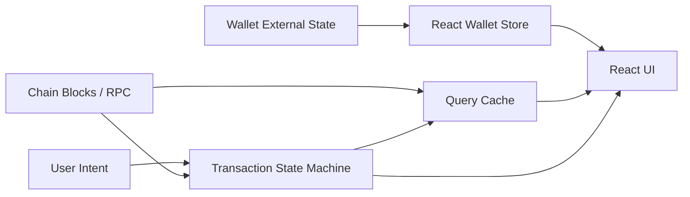
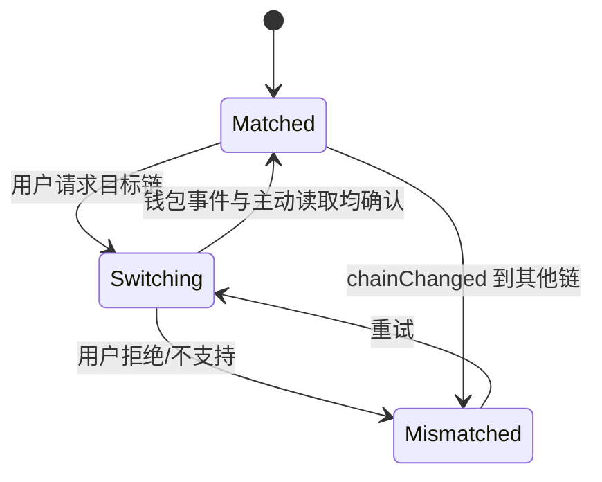
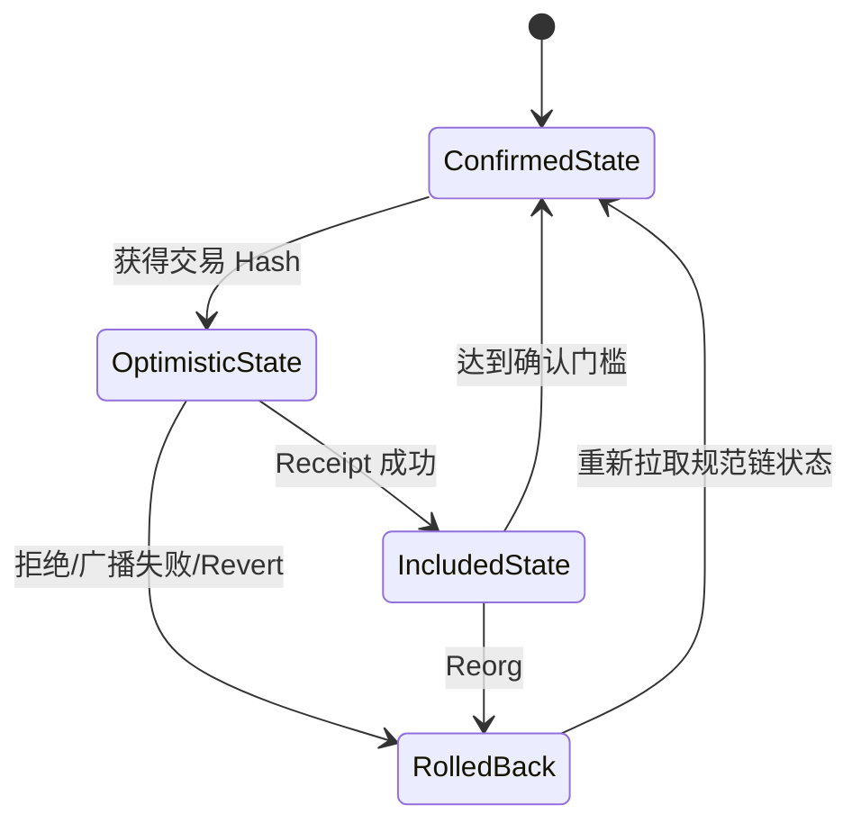
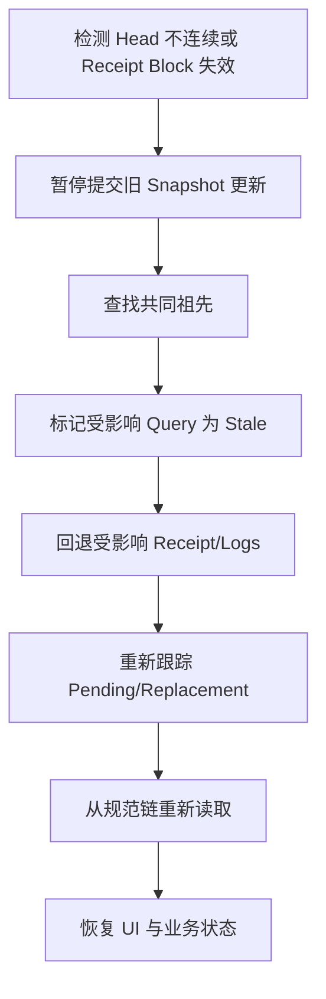
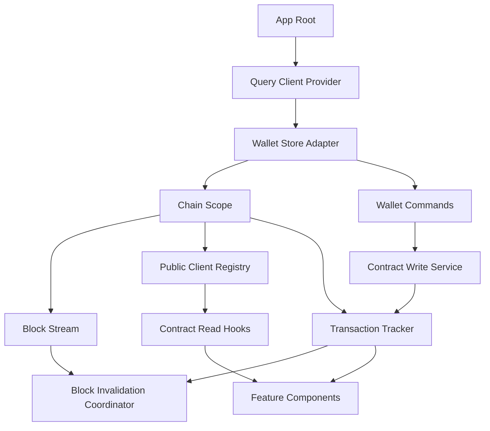

# Web3 React 集成：从钱包状态、Query Cache 到交易确认与 Reorg

> Web3 状态不是普通接口数据：钱包账户和网络可以在组件存活期间变化，`latest` 查询会随区块推进失效，交易被打包后仍可能 Reorg。可靠的 React 集成必须把外部钱包 Store、链上 Query Cache 和交易状态机分开管理，而不是用几个 `useState` 拼出一个 `isConnected`。

---

## 一、本文解决什么问题

一个交易页面通常同时依赖：

- 钱包是否可用、是否正在连接；
- 当前 Connector 和 Session；
- 当前 Chain ID；
- 当前 Account；
- Token Balance、Allowance 和合约状态；
- 表单输入和 Simulation；
- 用户签名结果；
- Pending Transaction；
- Receipt、Confirmations 和 Reorg；
- 后端业务状态。

这些状态的生命周期不同：



如果直接在组件中写：

```typescript
const [address, setAddress] = useState<string>();
const [balance, setBalance] = useState('0');
const [loading, setLoading] = useState(false);
```

很快会出现：

- React Strict Mode 下重复订阅 Provider；
- Wallet A 的迟到结果覆盖 Wallet B；
- Chain 1 的请求结果写进 Chain 137 页面；
- Account 切换后继续显示旧 Allowance；
- 每个组件各自轮询同一合约；
- 每个新区块让全站所有 Query 同时刷新；
- 用户拒签却被显示为系统异常；
- `transactionHash` 返回后立即显示“成功”；
- Receipt 所在区块被 Reorg，UI 无法回退；
- Error Boundary 捕获不到异步 Query 或事件回调错误。

本文覆盖大纲中的：

- Wallet State
- Chain State
- Account State
- Contract Read
- Contract Write
- Query Cache
- Block-based Invalidation
- Optimistic UI
- Pending Transaction
- Receipt
- Reorg
- Error Boundary

### 核心结论

1. 钱包是 React 外部 Store，应通过稳定订阅和 Snapshot 接入，而不是让每个组件直接监听 EIP-1193 事件。
2. Wallet、Chain、Account 是相关但独立的状态；Provider 可用不等于 Account 已授权，Account 已授权不等于 Chain 正确。
3. 所有链上 Query Key 必须包含 Chain ID；账户相关数据还必须包含规范化 Account，固定区块读取应包含 Block Context。
4. Contract Read 是服务端状态读取，不应复制到多个本地 `useState`；使用 Query Cache 管理请求合并、过期和错误。
5. Contract Write 是一个多阶段异步工作流，不能只用 `isLoading` 表示 Draft、Simulation、Signature、Pending、Receipt 与 Reorg。
6. Block-based Invalidation 应按依赖选择性刷新并合并新区块事件，不能每个 Block 全量清空所有缓存。
7. Optimistic UI 必须标记为暂定结果，具备 Receipt 失败、Replacement 和 Reorg 的回滚路径。
8. Error Boundary 只捕获 React 渲染生命周期中的部分错误，异步请求、事件处理器和 Provider 回调仍需显式错误状态与日志。

---

## 二、状态分类与所有权

### 2.1 五类状态

| 状态类型 | 示例 | 推荐所有者 |
|---|---|---|
| Wallet External State | Connector、Session、授权账户 | Wallet Store |
| Chain Server State | Balance、Allowance、Block、Receipt | Query Cache |
| Transaction Workflow | Simulation、Signature、Pending、Reorg | Transaction Store/State Machine |
| Local UI State | Modal、Tab、输入焦点 | Component/Local Reducer |
| Business Auth State | SIWE Session、权限、用户资料 | Auth Store + Server |

同一个地址可能同时出现在 Wallet State 和业务认证中，但含义不同。钱包暴露地址不等于后端 Session 已验证。

### 2.2 不要复制派生状态

错误示例：

```typescript
const [isConnected, setIsConnected] = useState(false);
const [address, setAddress] = useState<string>();

useEffect(() => {
  setIsConnected(Boolean(address));
}, [address]);
```

`isConnected` 可以从 Connection Phase、Provider、Session 和 Account 派生，不应再维护一份可能不同步的布尔值。

### 2.3 状态键空间

Web3 状态至少受以下维度影响：

```text
connectorId
providerGeneration
sessionId
chainId
account
blockNumber / blockHash
contractAddress
functionName
args
```

如果 Query/Mutation 没有明确这些维度，就很容易跨链、跨账户复用错误结果。

---

## 三、Wallet State

### 3.1 钱包是外部 Store

钱包状态来自浏览器扩展、WalletConnect SDK 或移动桥接，不由 React 控制。推荐集中封装：

```typescript
type WalletSnapshot = {
  phase:
    | 'idle'
    | 'discovering'
    | 'authorizing'
    | 'connected'
    | 'disconnected'
    | 'error';
  connectorId?: string;
  providerGeneration: number;
  sessionId?: string;
  accounts: readonly `0x${string}`[];
  chainId?: number;
  rpcConnected: boolean;
  error?: WalletError;
};
```

所有 EIP-1193/WalletConnect 事件由 Store 监听，组件只订阅 Snapshot。

### 3.2 使用 `useSyncExternalStore`

React 提供 `useSyncExternalStore` 将外部可变源接入并发渲染：

```typescript
import { useSyncExternalStore } from 'react';

export function useWalletSnapshot(): WalletSnapshot {
  return useSyncExternalStore(
    walletStore.subscribe,
    walletStore.getSnapshot,
    walletStore.getServerSnapshot,
  );
}
```

要求：

- `getSnapshot()` 在状态未变化时返回稳定引用；
- `subscribe()` 返回清理函数；
- Server Snapshot 不访问 `window`；
- Store 更新后同步通知订阅者；
- 不在 `getSnapshot()` 内发起副作用。

### 3.3 Store 只注册一次 Provider 监听

```typescript
function attachProvider(
  provider: Eip1193Provider,
  generation: number,
): () => void {
  const onAccountsChanged = () => reconcileProvider(provider, generation);
  const onChainChanged = () => reconcileProvider(provider, generation);
  const onDisconnect = (error: unknown) => {
    walletStore.handleDisconnect(generation, error);
  };

  provider.on('accountsChanged', onAccountsChanged);
  provider.on('chainChanged', onChainChanged);
  provider.on('disconnect', onDisconnect);

  return () => {
    provider.removeListener('accountsChanged', onAccountsChanged);
    provider.removeListener('chainChanged', onChainChanged);
    provider.removeListener('disconnect', onDisconnect);
  };
}
```

`generation` 用于丢弃旧 Connector 的迟到事件。

### 3.4 Strict Mode 边界

React 开发环境 Strict Mode 可能额外执行 Effect Setup/Cleanup，以暴露缺少清理的问题。正确实现应满足：

- Setup 可重复；
- Cleanup 完整；
- 不会重复弹账户授权；
- 不会创建两个 WalletConnect Proposal；
- 不会留下两个 WebSocket；
- 不依赖“Effect 只运行一次”的偶然行为。

用户交互请求应在点击事件中发起，不应放在初始化 Effect 中。

### 3.5 Context 只传状态接口

```typescript
type WalletContextValue = {
  snapshot: WalletSnapshot;
  connect(connectorId: string): Promise<void>;
  disconnect(): Promise<void>;
  switchChain(chainId: number): Promise<void>;
};
```

避免 Context Value 每次 Render 创建新对象；可由稳定 Store Hook 和 Memoized Commands 组成。高频 Block State 不应塞进同一个 Wallet Context，否则每个新区块会重渲染整个钱包 UI 子树。

---

## 四、Chain State

### 4.1 Chain State 不只是 Chain ID

```typescript
type ChainState = {
  walletChainId?: number;
  selectedReadChainId: number;
  supported: boolean;
  switching: boolean;
  publicClientReady: boolean;
  latestBlock?: BlockRef;
  safeBlock?: BlockRef;
  finalizedBlock?: BlockRef;
};
```

产品可能允许用户查看 Chain A 数据，同时钱包连接 Chain B。应明确区分：

- Read Chain：页面展示哪条链；
- Wallet Chain：签名和发送使用哪条链；
- Transaction Target Chain：当前 Intent 绑定哪条链。

### 4.2 Network Mismatch

写操作门禁：

```typescript
const canWrite =
  wallet.phase === 'connected' &&
  wallet.accounts.length > 0 &&
  wallet.chainId === transactionIntent.chainId &&
  supportedChains.has(transactionIntent.chainId);
```

网络不匹配时，读取可以继续，写入必须停止并由用户明确发起切链。

### 4.3 切链是异步状态机



`wallet_switchEthereumChain` Promise Resolve 后仍应重新读取 Chain ID。切链期间取消旧链 Simulation 和 Pending 表单结果。

### 4.4 Chain Config 是 Query 根依赖

切换 Read Chain 时：

- 创建/选择对应 Public Client；
- 更换合约地址和 ABI 版本；
- 使旧链 Query 停止订阅，但不一定删除缓存；
- 加载该链 Block State；
- 更新 Explorer、Native Currency 和 Finality 策略；
- 取消只适用于旧链的 Deferred Request。

---

## 五、Account State

### 5.1 当前账户是授权结果

账户可能：

- 尚未授权；
- 授权多个，当前选择第一个；
- 在钱包中切换；
- 因锁定或撤权变为空数组；
- 是 EOA；
- 是 Smart Account；
- 与业务登录账户不同。

不要假设 `accounts[0]` 永远存在或永远不变。

### 5.2 规范化地址

Query Key 使用解析后的规范地址，而不是用户输入字符串：

```typescript
function accountKey(address: string): `0x${string}` {
  return normalizeEthereumAddress(address);
}
```

显示时使用校验和格式，比较时按 20-byte 值比较。

### 5.3 Account Change 的清理

账户 A 切换为 B 时立即处理：

```text
[ ] 取消 A 的未签交易 Intent
[ ] 清除 A 的 Simulation
[ ] 使 A 的业务登录 Session 失效或重新认证
[ ] 停止 A 的账户订阅
[ ] 不再把 A 的 Pending Transaction 显示为 B 发起
[ ] 用 B 作为新 Query Key 加载 Balance/Allowance
[ ] 保留 A 的历史交易记录，但清晰标注发送者
```

Pending 链上交易不会因账户切换而消失，Transaction Tracker 应继续按原 `{chainId, from, hash}` 跟踪。

### 5.4 EOA 与 Smart Account

页面可能同时有：

- Wallet Owner EOA；
- 当前 Smart Account Address；
- Session Key；
- Paymaster/Sponsor 状态。

不要把 `walletAccount`、`smartAccount` 和 `transactionSender` 都命名为 `address`。明确类型可避免签名者与资产持有者混淆。

---

## 六、Contract Read

### 6.1 Read 是 Server State

合约读取依赖远端链状态，具有缓存、陈旧、失败和 Reorg 属性，适合 Query Library 管理。下面以 TanStack Query 风格和抽象 Public Client 示意；具体 API 应以项目实际版本为准。

```typescript
function useTokenBalance(params: {
  chainId: number;
  token: `0x${string}`;
  account?: `0x${string}`;
}) {
  const publicClient = usePublicClient(params.chainId);

  return useQuery({
    queryKey: [
      'tokenBalance',
      params.chainId,
      params.token,
      params.account ?? null,
    ],
    enabled: Boolean(params.account),
    queryFn: ({ signal }) =>
      publicClient.readContract({
        address: params.token,
        abi: erc20Abi,
        functionName: 'balanceOf',
        args: [params.account!],
        signal,
      }),
  });
}
```

### 6.2 Query Key 是数据身份

至少包含：

- Chain ID；
- Contract Address；
- ABI/接口版本必要标识；
- Function Name；
- 规范化 Args；
- Account；
- Block Context；
- 影响结果的 Feature Flag。

错误 Key：

```typescript
['balance', account]
```

它会跨 Chain 和 Token 冲突。

### 6.3 `enabled` 不是参数校验替代品

Query 不应在 Account/Chain 未准备好时发起。但 Query Function 内仍要校验地址、参数和 Client，因为状态可能在调度后变化。

### 6.4 竞态与取消

Account/Chain 快速变化时，旧请求可能后返回。Query Key 隔离能防止写入新 Key，Transport `AbortSignal` 可以减少无用工作。

不要在 Promise Resolve 后手工 `setBalance`，否则很容易覆盖当前账户。

### 6.5 固定区块快照

需要一致读取多个状态时：

```typescript
const block = await publicClient.getBlock({ blockTag: 'latest' });

const [balance, allowance, quote] = await Promise.all([
  readBalance({ blockNumber: block.number }),
  readAllowance({ blockNumber: block.number }),
  readQuote({ blockNumber: block.number }),
]);
```

将 `block.number` 或 `block.hash` 记录在 Query Data 中，让 UI 知道数据属于哪个 Snapshot。

### 6.6 Error 类型

Contract Read 错误至少区分：

- RPC/Transport；
- Wrong Chain；
- Contract Not Deployed；
- ABI Decode；
- Execution Reverted；
- Archive State Unavailable；
- Rate Limit；
- Query Cancelled。

不是所有错误都应该自动 Retry。

---

## 七、Query Cache

### 7.1 Cache 不等于链上事实

Query Cache 是某个 Block Context 下的数据副本。必须保留：

```typescript
type ChainQueryMeta = {
  chainId: number;
  blockNumber?: bigint;
  blockHash?: `0x${string}`;
  fetchedAt: number;
  source: string;
};
```

### 7.2 Stale Time 按数据类型设置

| 数据 | 失效策略 |
|---|---|
| Chain Config / Token Decimals | 长缓存，配置版本变化失效 |
| ENS/Metadata | 中长缓存，允许手动刷新 |
| Balance/Allowance | 新区块或账户变化失效 |
| Pending Nonce | 短缓存，发送交易后立即失效 |
| Receipt | Pending 时轮询，Included 后按确认策略 |
| 固定 Block 数据 | 可长期缓存，Reorg 窗口内仍需 Block Hash 校验 |
| Simulation | Intent/Account/Chain/Block 任一变化即失效 |

### 7.3 选择性 Invalidation

交易成功后不要 `invalidateQueries()` 全清。根据影响集合刷新：

```typescript
await queryClient.invalidateQueries({
  queryKey: ['tokenBalance', chainId, token, account],
});

await queryClient.invalidateQueries({
  queryKey: ['allowance', chainId, token, account, spender],
});
```

合约事件或 Simulation 可以帮助确定受影响资源，但不能完全依赖 DApp 自报。

### 7.4 Cache 与 Wallet Disconnect

Disconnect 时不一定删除所有公开缓存。建议：

- 保留与账户无关的公共数据；
- 账户私有或敏感数据清除；
- Account Query 仍可按地址保留短期历史，但当前 UI 不再绑定；
- 清除签名挑战、Session Token 和未提交 Intent；
- 不把 Cache 存在误判为仍已连接。

### 7.5 持久化边界

持久化 Query Cache 时不要存：

- WalletConnect URI；
- 签名；
- Raw Transaction；
- 私有后端 Token；
- 未加密敏感账户资料。

Hydration 后先校验 Schema、Chain Config 版本和 Block 新鲜度。

---

## 八、Block-based Invalidation

### 8.1 新块驱动刷新

```typescript
function useBlockInvalidation(chainId: number): void {
  const queryClient = useQueryClient();
  const blockStream = useBlockStream(chainId);

  useEffect(() => {
    return blockStream.subscribe((block) => {
      queryClient.invalidateQueries({
        predicate: (query) =>
          query.meta?.chainId === chainId &&
          query.meta?.invalidateOnBlock === true,
      });
    });
  }, [blockStream, chainId, queryClient]);
}
```

示例表达机制，真实项目要做批处理和 Reorg 检测。

### 8.2 不要每块全量 Refetch

若 100 个 Query 每 12 秒同时刷新，会形成请求尖峰。优化：

- 只标记 Stale，等可见组件按需读取；
- 合并同 Block 的多次通知；
- 使用 Multicall/Batch；
- 按优先级分批；
- 页面后台降低频率；
- 静态 Metadata 不参与；
- Pending Receipt 与普通 Balance 分开预算。

### 8.3 Block Number 与 Block Hash

仅保存最新 Block Number 无法检测同高度 Reorg。Block Stream 应提供：

```typescript
type BlockRef = {
  number: bigint;
  hash: `0x${string}`;
  parentHash: `0x${string}`;
};
```

如果新块的 `parentHash` 不等于上一个已接受 Head Hash，需要进入 Reorg 处理，而不是普通 Invalidation。

### 8.4 可见性和恢复

浏览器后台可能错过多个区块。回到前台时：

1. 获取当前 Head；
2. 校验上次 Head 是否仍规范；
3. 计算缺失范围；
4. 回补 Logs/Receipts；
5. 合并触发一次 Query Invalidation；
6. 恢复实时订阅。

### 8.5 Event-driven 与 Block-driven

- Block-driven 简单可靠，但会刷新未变化数据；
- Event-driven 精确，但可能漏掉未发事件的状态变化或代理/外部依赖；
- 混合方案：Logs 精确更新关键实体，新块低频校验兜底。

---

## 九、Contract Write

### 9.1 Write 不是普通 Mutation

一次写入包含：

```text
Draft
  -> Simulating
  -> Awaiting Signature
  -> User Rejected / Signed
  -> Submitted
  -> Pending
  -> Included / Reverted / Replaced
  -> Confirming
  -> Finalized / Reorganized
```

Mutation Promise Resolve 可能只表示钱包返回 Transaction Hash，不表示链上成功。

### 9.2 不可变 Intent

```typescript
type TransactionIntent = {
  id: string;
  chainId: number;
  from: `0x${string}`;
  to: `0x${string}`;
  value: bigint;
  data: `0x${string}`;
  createdAt: number;
};
```

Simulation、用户展示和签名必须基于同一个 Intent。账户、Chain 或表单变化后，创建新 Intent，而不是修改已模拟对象。

### 9.3 Mutation Hook 只负责发起

```typescript
function useSubmitTransaction() {
  const transactionStore = useTransactionStore();

  return useMutation({
    mutationFn: async (intent: TransactionIntent) => {
      const prepared = await prepareAndSimulate(intent);
      const hash = await walletClient.sendTransaction(prepared.request);
      transactionStore.track({ intent, hash });
      return hash;
    },
  });
}
```

长期 Receipt 跟踪不应依赖组件或 Mutation Observer 存活，应交给应用级 Tracker。

### 9.4 防止重复提交

- 点击期间禁用同一 Intent；
- 使用 Intent ID 去重；
- 钱包请求返回前不创建第二个请求；
- 页面恢复后读取已有 Pending；
- 广播超时按本地/钱包返回 Hash 查询；
- 不用按钮 `loading` 作为唯一幂等机制。

### 9.5 User Rejected 是正常状态

用户拒签应回到可编辑 Draft，保留安全的表单输入，不上报为高优先级异常，也不自动重弹钱包。

---

## 十、Pending Transaction

### 10.1 Pending 的含义

钱包返回 Hash 后，交易可能：

- 已被某节点接受；
- 在部分 Mempool 可见；
- 等待前序 Nonce；
- Fee 太低；
- 被 Replacement；
- 被节点丢弃；
- 已进入区块但当前 RPC 未同步。

### 10.2 持久化 Tracker

```typescript
type TrackedTransaction = {
  intentId: string;
  chainId: number;
  from: `0x${string}`;
  nonce?: bigint;
  hash: `0x${string}`;
  status: TransactionStatus;
  submittedAt: number;
  replacementOf?: `0x${string}`;
  receipt?: TransactionReceipt;
};
```

刷新页面后继续跟踪。持久化前注意数据版本和隐私，不保存私钥或完整敏感签名材料。

### 10.3 Polling 策略

- 初始较短间隔；
- 随 Pending 时间增长退避；
- 页面后台降低频率；
- 新块事件到达时触发检查；
- Rate Limit 时延长；
- 达到产品阈值后显示“长时间 Pending”，但继续跟踪；
- 不把查不到 Receipt 立即标为 Dropped。

### 10.4 Replacement 关联

同 `{chainId, from, nonce}` 的多个 Hash 属于一个交易族。Speed Up/Cancel 后：

- 原 Hash 仍可能先入块；
- 新 Hash 可能被拒绝或传播不足；
- UI 显示“正在尝试替换”，不是“已替换”；
- 只有规范链消费 Nonce 后才能确定获胜者；
- Reorg 后获胜关系可能回退。

### 10.5 Account 切换不停止跟踪

用户切到 B 后，A 的 Pending Transaction 仍可能执行。Tracker 继续运行，UI 可以按“当前账户”和“全部最近交易”分组展示。

---

## 十一、Receipt

### 11.1 Receipt 验证

```typescript
async function verifyReceipt(
  chainId: number,
  expectedHash: `0x${string}`,
  receipt: TransactionReceipt,
): Promise<void> {
  if (receipt.transactionHash !== expectedHash) {
    throw new Error('Transaction hash mismatch');
  }

  const block = await getPublicClient(chainId).getBlock({
    blockNumber: receipt.blockNumber,
  });

  if (block.hash !== receipt.blockHash) {
    throw new ReorgDetectedError(receipt.blockHash);
  }
}
```

### 11.2 Receipt Success 不等于业务成功

即使顶层 `status = success`：

- 子调用可能被捕获失败；
- 批处理可能允许部分失败；
- Token 返回值可能非标准；
- 实际成交量可能与预期不同；
- 恶意合约可能发出同名 Event。

业务层要核对可信合约 Event 和最终状态。

### 11.3 Receipt 驱动 Cache 更新

Receipt 进入规范链后：

1. 解析可信 Logs；
2. 精确更新已知 Query；
3. 对难以推断的依赖做选择性 Invalidation；
4. 保存更新前 Snapshot，供 Reorg 回滚；
5. 继续等待确认或 Finality。

### 11.4 Confirmations

确认策略按 Chain 和业务风险配置：

```typescript
type ConfirmationPolicy =
  | { mode: 'blocks'; count: number }
  | { mode: 'safe' }
  | { mode: 'finalized' };
```

不能用一个固定确认数覆盖所有 EVM 网络。

---

## 十二、Optimistic UI

### 12.1 什么可以乐观更新

适合：

- 本地交易列表立即显示 Pending；
- 按钮状态变为“已提交”；
- 临时减少可用余额并标注 Pending；
- 订单进入“等待链上确认”；
- 已知确定影响的简单状态。

不适合直接宣称：

- Swap 已按预期成交；
- 跨链资产已到账；
- NFT 所有权最终转移；
- 高价值提现不可逆完成；
- Governance 已最终生效。

### 12.2 乐观更新流程



### 12.3 Snapshot 与 Rollback

```typescript
const mutation = useMutation({
  mutationFn: submitTransfer,
  onMutate: async (intent) => {
    await queryClient.cancelQueries({ queryKey: balanceKey(intent) });
    const previous = queryClient.getQueryData(balanceKey(intent));

    queryClient.setQueryData(balanceKey(intent), (current: bigint) =>
      current - intent.value,
    );

    return { previous };
  },
  onError: (_error, intent, context) => {
    queryClient.setQueryData(balanceKey(intent), context?.previous);
  },
});
```

示例只说明机制。实际还要处理 Fee、并发 Pending、Replacement 和余额不足，不能把多个乐观事务都回滚到同一个旧 Snapshot。

### 12.4 Layered Optimistic State

更可靠的方式不是覆盖 Confirmed Cache，而是分层：

```text
displayBalance = confirmedBalance + sum(pendingDeltas)
```

每个 Pending Delta 由 Intent ID 管理：

- Included 后移除 Delta 并刷新 Confirmed；
- Revert/Dropped 后移除；
- Replacement 迁移到新 Hash；
- Reorg 后重新加入或重新计算。

这比保存单一 Previous Value 更能处理并发交易。

### 12.5 Optimistic UI 必须可见

使用“Pending”“预计”“等待确认”等明确状态，不应把暂定余额和最终余额视觉上完全相同。

---

## 十三、Reorg

### 13.1 React 层为什么必须关心 Reorg

如果 Cache 在 Receipt 出现后立即永久更新，Reorg 会让 UI 与规范链不一致。需要保存 Block Hash 并允许状态回退。

### 13.2 Block Stream 检测

```typescript
function detectReorg(previous: BlockRef, current: BlockRef): boolean {
  return current.number > previous.number &&
    current.parentHash !== previous.hash;
}
```

这只检测直接父关系异常。断线跨多个区块时，需要 RPC 查找共同祖先。

### 13.3 Reorg 处理流程



### 13.4 Query Cache 回退

两种策略：

- 简单策略：受影响 Chain 的区块相关 Query 全部失效，从共同祖先之后重新拉取；
- 精确策略：记录每个 Block 应用的 Cache Patch，Reorg 时反向撤销。

前端通常选择简单策略，Indexer/复杂交易终端才值得维护精确 Patch Log。

### 13.5 UI 语义

交易从 Confirming 回到 Reorganized/Pending 时，应展示：

- 原 Receipt 所在区块不再规范；
- 交易可能重新被打包；
- 当前不应重复提交同一业务操作；
- 下游结果暂时不确定。

不要直接显示“交易失败”，因为它可能重新进入规范链。

---

## 十四、Error Boundary

### 14.1 Error Boundary 能捕获什么

React Error Boundary 主要捕获子树在 Render、生命周期和构造过程中的错误，并展示 Fallback UI。它通常不能自动捕获：

- Event Handler 中抛出的错误；
- `setTimeout`/Promise 异步回调；
- Provider Event Listener；
- Query Promise 的普通错误状态；
- Error Boundary 自身错误；
- 服务端渲染阶段的所有同类错误处理路径。

具体行为应按使用的 React 版本和框架文档确认。

### 14.2 分层 Boundary

```text
App Boundary
  Chain Page Boundary
    Wallet Panel Boundary
    Portfolio Boundary
    Transaction Composer Boundary
    Activity Feed Boundary
```

单个行情组件崩溃不应让用户无法查看 Pending Transaction。

### 14.3 Query Error 与 Render Error 分开

```typescript
function BalanceView() {
  const balanceQuery = useTokenBalance(...);

  if (balanceQuery.isPending) return <BalanceSkeleton />;
  if (balanceQuery.isError) {
    return (
      <InlineRetry
        message={toUserMessage(balanceQuery.error)}
        onRetry={() => balanceQuery.refetch()}
      />
    );
  }

  return <BalanceValue value={balanceQuery.data} />;
}
```

预期的 RPC 错误应成为 UI State，不必全部 `throw` 到页面级 Boundary。

### 14.4 Mutation Error

区分：

- User Rejected：正常取消；
- Network Mismatch：提供切链操作；
- Simulation Revert：展示原因并保持 Draft；
- Transport Error：允许安全重试；
- Broadcast Unknown：按 Hash 跟踪；
- Receipt Revert：交易已上链但执行失败；
- Reorg：状态回退而非普通错误。

### 14.5 Reset 边界

当 Chain/Account 改变时，可以重置只与旧上下文相关的 Error Boundary，但不要通过给整个 App 一个变化的 `key` 粗暴重挂载，导致 Pending Tracker、Modal 和用户输入全部丢失。

---

## 十五、并发渲染与生命周期

### 15.1 Render 必须纯净

禁止在 Render 中：

- 调用钱包授权；
- 发交易；
- 注册 Provider Listener；
- 修改 Query Cache；
- 创建永久 WebSocket；
- 写 Local Storage。

Render 可能被暂停、重试或丢弃。

### 15.2 Effect 只做同步外部系统

Query Library 负责数据请求；Wallet Store 负责 Provider；组件 Effect 只在确实需要时桥接外部订阅，并完整 Cleanup。

### 15.3 Stale Closure

Provider/Event Callback 若闭包捕获旧 Chain/Account，会错误更新状态。解决：

- 回调只触发 Store Reconcile；
- 使用事件携带的 Generation；
- 从 Store 读取最新 Snapshot；
- 不在 Listener 中使用组件局部旧值。

### 15.4 Transition 的适用边界

切换 Read Chain 后加载大型 Portfolio，可以用 Transition 降低 UI 阻塞，但 Transition 不会：

- 取消旧 RPC；
- 防止旧结果写入；
- 解决 Query Key 错误；
- 保证钱包切链成功。

它是渲染优先级工具，不是 Web3 一致性机制。

---

## 十六、端到端组件架构



### 16.1 Provider 顺序

不要把所有 Context 嵌套成不可拆分的巨大根。稳定依赖关系是：

- Query Client 不依赖 Wallet；
- Public Client Registry 不依赖 Account；
- Wallet Store 可独立初始化；
- Chain Scope 选择 Read Chain；
- Transaction Tracker 可在页面切换后继续；
- Feature Hook 组合所需状态。

### 16.2 Feature Hook

```typescript
function useSwapScreenModel() {
  const wallet = useWalletSnapshot();
  const chain = useSelectedChain();
  const account = wallet.accounts[0];
  const balance = useTokenBalance({
    chainId: chain.id,
    token: selectedToken,
    account,
  });
  const transactions = useAccountTransactions(chain.id, account);

  return {
    wallet,
    chain,
    account,
    balance,
    transactions,
    canSubmit: deriveCanSubmit(...),
  };
}
```

Feature Hook 负责组合，不重新发明底层 Wallet/Query 状态。

---

## 十七、常见错误案例

### 17.1 每个组件直接监听 `accountsChanged`

造成重复 Listener、顺序不一致和内存泄漏。应由单一 Wallet Store 监听。

### 17.2 Query Key 只有函数名

跨 Chain、Contract、Account 和 Args 污染缓存。Key 必须表达完整数据身份。

### 17.3 `useEffect` 中手工读取余额并 `setState`

容易产生竞态、重复请求和缺少缓存。使用 Query Cache 和 Abort Signal。

### 17.4 每个新区块 `invalidateQueries()`

导致全站请求风暴。按 Chain、Meta 和数据类型选择性失效。

### 17.5 Mutation Success 就显示交易完成

Mutation 可能只返回 Hash。必须继续跟踪 Receipt、确认和 Reorg。

### 17.6 Optimistic UI 覆盖真实 Cache 且不保存回滚

交易 Revert 后余额永久错误。使用 Pending Delta 或完整 Rollback Context。

### 17.7 账户切换后删除全部 Pending

旧账户交易仍在链上执行。Tracker 必须独立于当前账户继续运行。

### 17.8 Receipt `status = 1` 就永久提交业务状态

还需校验业务事件、Block Hash 和确认门槛，并处理 Reorg。

### 17.9 认为 Error Boundary 会捕获所有 Promise Error

异步 Query/Mutation 和 Event Handler 需要显式错误状态与日志。

### 17.10 用 Strict Mode 重复行为作为删除 Strict Mode 的理由

重复副作用说明 Setup/Cleanup 或幂等设计有问题。生产生命周期中切链、重连和页面恢复同样会暴露这些缺陷。

---

## 十八、测试与验证方法

### 18.1 Wallet Store Test

```text
[ ] Provider 监听只注册一次
[ ] Cleanup 后 Listener 数量归零
[ ] accountsChanged([]) 清除当前授权账户
[ ] 旧 Generation 事件不能覆盖新 Connector
[ ] chainChanged 后 Snapshot 主动 Reconcile
[ ] Disconnect 与 Account Empty 状态不同
[ ] Strict Mode Setup/Cleanup 不产生重复 Proposal
```

### 18.2 Query Cache Test

- 相同 Query 并发只发送一次 RPC；
- Chain 1 与 Chain 137 Cache 隔离；
- Account A/B Cache 隔离；
- 固定 Block Query 不被普通新区块错误覆盖；
- Abort 后迟到结果不进入当前 Key；
- Rate Limit 不导致无限 Retry；
- Hydration 后过期数据正确标记 Stale。

### 18.3 Block Invalidation Test

1. 推送同一 Block 多次，只触发一次批量刷新；
2. 连续快速生成多个 Block，合并刷新；
3. 页面后台错过区块，恢复时只做一次协调回补；
4. Parent Hash 不连续，进入 Reorg 分支；
5. 静态 Metadata 不随每块刷新。

### 18.4 Transaction Test

- Simulation 后切账户，签名请求必须失效；
- 用户拒签回到 Draft；
- Hash 返回后页面刷新，Tracker 继续；
- Receipt Revert 回滚 Optimistic Delta；
- Speed Up 与原 Hash 归为同一交易族；
- Cancel 只显示尝试中，直到规范链确认；
- Account 切换后旧交易继续跟踪。

### 18.5 Reorg Test

使用可回滚本地链：

1. 提交交易并生成 Receipt；
2. 应用 Optimistic/Included Cache 更新；
3. 回滚 Receipt 区块；
4. Block Stream 检测 Reorg；
5. UI 从 Confirming 回到 Reorganized/Pending；
6. Cache 恢复规范链数据；
7. 重新打包后幂等完成。

### 18.6 Error Boundary Test

- Render Decode Error 被局部 Boundary 捕获；
- Query 429 显示 Inline Retry，不摧毁页面；
- User Rejected 不显示 Crash UI；
- Provider Listener Error 被 Store 捕获并报告；
- Boundary Reset 不删除 Transaction Tracker；
- 一个 Portfolio Widget 崩溃不影响交易状态面板。

### 18.7 性能测量

测量：

- 新区块触发的 Query 数；
- Dedup 前后 RPC 数；
- Wallet Store 更新造成的 React Commit 数；
- Account/Chain 切换到可交互时间；
- Pending Tracker 的轮询成本；
- 大型 Portfolio 的 Render Duration；
- Reorg 恢复时间。

在 React Profiler、目标浏览器、真实 RPC 延迟和生产构建中测量，不能只根据开发模式 Render 次数判断性能。

---

## 十九、方案选择

| 场景 | 推荐方案 | 主要代价 |
|---|---|---|
| 小型只读 DApp | Public Client + Query Cache | 功能较少但边界清晰 |
| 钱包交互页面 | Wallet External Store + Query Hooks | Store 与 Query 组合成本 |
| 高频交易终端 | 独立 Transaction Tracker + Block Stream | 状态机和 Reorg 复杂度 |
| 多链 Portfolio | Chain-scoped Query Key + Indexer | 数据量与索引依赖 |
| 链游 | Smart Account Session + Pending Delta | 权限和乐观状态风险 |
| SSR 页面 | Server Public Client + Hydration Block Context | 高度差与钱包延迟接入 |

状态管理库不是核心决策。无论使用 Context、Redux、Zustand、XState 或其他方案，都应保持 Wallet External State、Server Query State 和 Transaction Workflow 的职责分离。

---

## 二十、上线检查清单

```text
[ ] 钱包事件由单一 External Store 管理
[ ] useSyncExternalStore Snapshot 引用稳定且支持 SSR
[ ] Provider Listener 有完整 Cleanup 与 Generation 隔离
[ ] Wallet、Chain、Account、Auth 状态没有混成一个布尔值
[ ] Read Chain 与 Wallet Chain 明确区分
[ ] Query Key 包含 Chain、Contract、Args、Account 和 Block Context
[ ] Contract Read 使用 Query Cache，不复制到局部 State
[ ] Account/Chain 切换会取消或隔离旧请求
[ ] 新块只选择性 Invalidate 相关 Query
[ ] WebSocket/页面恢复会回补缺失区块
[ ] Contract Write 使用不可变 Intent 和明确状态机
[ ] User Rejected 不自动 Retry
[ ] Pending Tracker 独立于组件和当前账户生命周期
[ ] Receipt 校验 Transaction Hash 与 Block Hash
[ ] 业务成功验证可信 Event 和最终状态
[ ] Optimistic UI 明确标记 Pending 并支持并发回滚
[ ] Replacement 以 Sender/Nonce 交易族管理
[ ] Reorg 会回退 Receipt、Query Cache 和 UI 状态
[ ] Error Boundary 与 Query/Mutation Error 分层处理
[ ] Strict Mode 下无重复授权、订阅和交易请求
[ ] 已完成切链、切账户、刷新、断网和 Reorg 测试
```

---

## 二十一、总结

React 集成 Web3 的难点不是调用某个 Hook，而是让不同来源、不同生命周期的状态在并发渲染和链重组下保持一致。

真正需要记住的是：

1. Wallet Provider 是外部可变源，应通过集中 Store 和稳定 Snapshot 接入 React。
2. Chain、Account 和业务登录必须分开；任一变化都可能让旧 Simulation、Query 和签名 Intent 失效。
3. Contract Read 属于链上 Server State，Query Key 必须包含完整链上下文并由 Cache 管理。
4. Block-based Invalidation 应选择性、批量化，Block Hash 用于检测 Reorg。
5. Contract Write 是从 Draft 到 Finalized 的状态机，Mutation Resolve 和 Receipt Success 都不是完整业务终点。
6. Pending Transaction 应持久化并独立跟踪，Account 切换或页面卸载不能停止它。
7. Optimistic UI 是带回滚能力的暂定层，不能覆盖最终链上事实。
8. Error Boundary 负责渲染隔离，RPC、钱包和异步错误仍需显式状态、分类和可操作恢复。

一个可靠 DApp 的 React 层，应能在用户切链、钱包断开、请求迟到、交易替换和区块 Reorg 时，仍准确说明当前状态来自哪里、是否已经确认，以及下一步可以安全做什么。

---

## 问答复盘

### Q1：为什么钱包状态适合使用 `useSyncExternalStore`？

**答：** 钱包由 React 外部系统驱动。`useSyncExternalStore` 提供稳定订阅和 Snapshot 语义，更适合并发渲染与 SSR，但仍要求 Store 正确管理引用和 Cleanup。

### Q2：Wallet Chain 与 Read Chain 为什么要分开？

**答：** 用户可以浏览一条链的数据，同时钱包停留在另一条链。读取可以继续，但写交易必须要求 Wallet Chain 与 Intent Chain 一致。

### Q3：Query Key 只包含账户地址会有什么问题？

**答：** 同一地址在不同链和不同 Token 下状态不同，会发生跨链、跨合约缓存污染。Key 还需包含 Chain、Contract、函数、参数和 Block Context。

### Q4：为什么不能每个新区块都清空全部 Query Cache？

**答：** 会造成请求尖峰和无关重渲染。应只使依赖该 Chain 新块的 Query 失效，并合并 Block 通知、使用 Batch 或按需刷新。

### Q5：Contract Write Mutation 返回 Transaction Hash 后可以显示成功吗？

**答：** 只能显示已提交或 Pending。还需等待 Receipt、检查执行状态、业务结果、确认门槛，并处理 Replacement 和 Reorg。

### Q6：账户切换后，旧账户 Pending Transaction 应删除吗？

**答：** 不应。交易仍可能上链执行。Tracker 应继续按原 Chain、From 和 Hash 跟踪，只是不再把它当成当前账户的新操作。

### Q7：Optimistic UI 为什么更适合使用 Pending Delta？

**答：** 多笔并发交易时，单一 Previous Snapshot 很容易错误回滚。每个 Intent 独立 Delta 可以分别确认、替换、失败或 Reorg。

### Q8：Receipt `status = 1` 后为什么仍要保存 Block Hash？

**答：** 同高度区块可能被 Reorg 替换。Block Hash 用于验证 Receipt 是否仍位于规范链，并触发状态回退。

### Q9：Error Boundary 能捕获 Provider 事件回调中的错误吗？

**答：** 通常不能自动捕获。Provider Listener 和异步 Query/Mutation 需要自己捕获、分类并写入 Store 或错误监控。

### Q10：React Strict Mode 下出现重复钱包弹窗说明什么？

**答：** 通常说明副作用放错位置或缺少幂等与 Cleanup。账户授权和签名应由用户事件触发，初始化 Effect 不应自动弹窗。

---

## 延伸知识

- **Web3 Provider 架构**：Public/Wallet Client、Fallback、Quorum、Rate Limit 与 Dedup。
- **交易状态机**：Draft、Simulation、Signature、Pending、Replacement 与 Finality。
- **UX 与安全**：Approval、Permit、网络错配、钓鱼提示与签名预览。
- **事件与索引**：Logs、Removed Log、Checkpoint、Backfill 与 Reorg Recovery。
- **React 状态设计**：External Store、Server State、Reducer、并发渲染和 Error Boundary。
