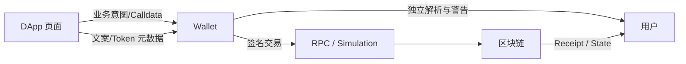
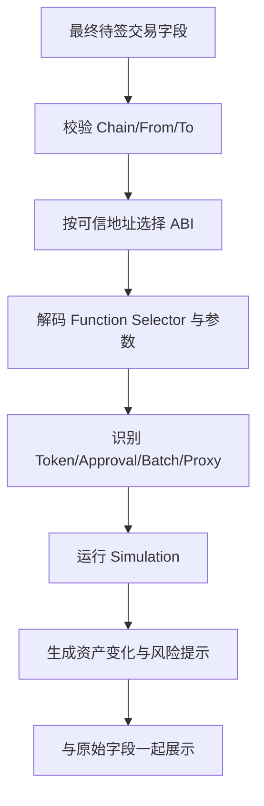
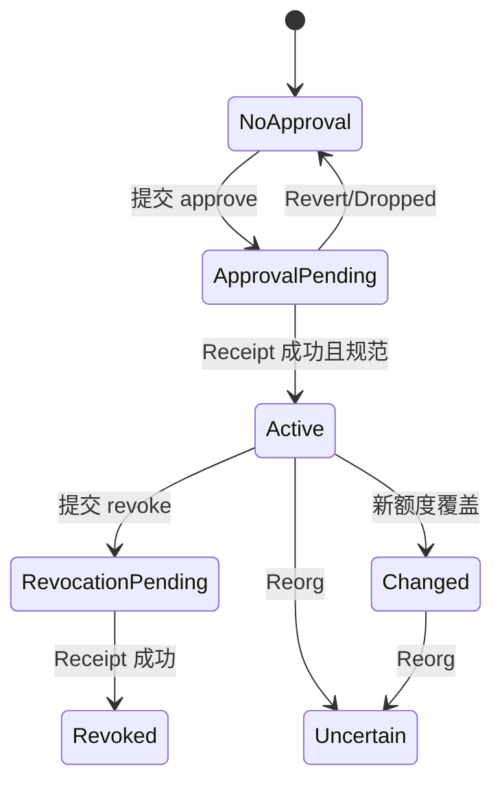
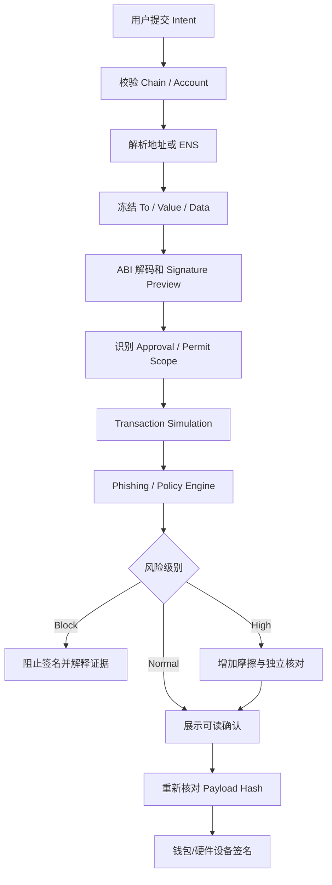

# Web3 DApp UX 与安全：从可读交易、Approval 与 Permit 到钓鱼防护和模拟

> 钱包签名验证的是字节，不是页面文案。安全 UX 的职责，是让用户在可信边界内理解这些字节将授权谁、转移什么、作用在哪条链、何时失效，以及模拟结果仍有哪些不确定性。更漂亮的确认框不能修复被隐藏的无限授权、错误网络或恶意合约。

---

## 一、本文解决什么问题

Web3 用户常面对两类确认：

```text
交易签名：签名后广播，可直接改变链上状态
消息签名：不一定立即上链，但可能用于登录、Permit、订单或资产授权
```

用户看到的却可能只是：

- `Confirm transaction`；
- 一段十六进制 Calldata；
- “Sign to continue”；
- 一个被截断的地址；
- 一个未经验证的 ENS 名称；
- 一个写着“免费”的 Permit；
- 一个没有说明授权额度和 Spender 的 Approve；
- 一个来自 DApp 的“模拟成功”绿色提示。

这会产生真实资产风险：

- 用户以为是登录，实际签署了可执行订单或 Permit；
- 用户只想交换 100 Token，却授权无限额度；
- 用户在错误 Chain 上向同地址合约发送交易；
- 剪贴板中的收款地址被恶意软件替换；
- 钓鱼站复制品牌和 ENS 名称，诱导签署资产转移；
- 模拟基于旧区块或错误 RPC，实际执行结果不同；
- 钱包无法解析新合约，退化为 Blind Signing；
- Approval 成功后 Swap 失败，长期权限残留；
- 用户断开钱包，却以为链上 Allowance 已撤销。

本文覆盖大纲中的：

- Human-readable Transaction
- Approval Scope
- Unlimited Approval
- Permit
- Network Mismatch
- Address Checksum
- ENS / Name Resolution
- Phishing Warning
- Signature Preview
- Clipboard Risk
- Transaction Simulation

### 核心结论

1. 可读交易必须由最终待签字段和可信 ABI/资产元数据生成，不能直接相信 DApp 提供的自然语言说明。
2. Approval 的风险由 Spender、Token、额度、有效期、可调用路径和目标合约升级能力共同决定，不只是“是否无限”。
3. Unlimited Approval 降低重复授权成本，却把未来 Token 余额暴露给长期 Spender 权限；默认策略应基于使用频率与风险，而不是一刀切。
4. Permit 是签名授权，不等于无风险登录。签名可能被任何持有者提交，必须展示 Owner、Spender、Value、Nonce、Deadline、Chain 和 Verifying Contract。
5. Network Mismatch 必须阻止签名和发送；同一个地址在不同链上可以代表完全不同代码与资产。
6. Address Checksum 只能发现一部分输入错误，不能证明地址属于正确的人、正确合约或正确网络。
7. ENS/Name Resolution 是名称到地址的解析层，不是身份认证。Forward 与 Reverse 记录、Chain Context 和解析时点都要校验。
8. Phishing Warning 应基于可解释证据和阻断策略，不能只依赖容易误报的域名黑名单。
9. Signature Preview 必须区分交易、EIP-191 消息、EIP-712 Typed Data 和合约账户签名语义。
10. Transaction Simulation 是风险信号，不是执行保证；模拟与签名字段必须完全绑定，并显示状态时点与不确定性。

---

## 二、安全 UX 的信任边界

### 2.1 页面、钱包与链分别知道什么



- DApp 最了解业务意图，但页面可能被 XSS 或供应链攻击控制；
- 钱包掌握最终签名 Payload，但可能缺少 ABI 和业务上下文；
- RPC/模拟器能解释执行路径，但可能落后、错误或被恶意控制；
- 用户拥有最终授权权，却无法直接阅读字节。

安全 UX 必须组合多个来源，并清楚标记哪些信息已验证、哪些只是声明。

### 2.2 三层展示

1. **原始事实**：Chain ID、From、To、Value、Data、Fee、签名域；
2. **解析结果**：函数名、参数、Token、Approval、资产变化；
3. **风险解释**：未知合约、无限授权、代理升级、模拟失败、钓鱼信号。

任何自然语言都必须能回溯到原始事实。

### 2.3 不要把安全责任推给用户

“请自行核对所有信息”不是完整安全设计。产品应：

- 默认最小权限；
- 阻止错链；
- 对高风险签名增加摩擦；
- 自动解析常见权限；
- 提供撤销入口；
- 保存可审计的交易意图；
- 在无法解释时明确降级，而不是伪装成安全。

---

## 三、Human-readable Transaction

### 3.1 可读交易包含什么

```typescript
type HumanReadableTransaction = {
  network: {
    chainId: number;
    name: string;
  };
  sender: AddressLabel;
  target: AddressLabel;
  action: string;
  value: AssetAmount;
  parameters: readonly DisplayField[];
  approvals: readonly ApprovalChange[];
  assetChanges: readonly AssetChange[];
  estimatedFee: FeeDisplay;
  warnings: readonly RiskWarning[];
  sourceBlock?: BlockRef;
};
```

### 3.2 解析流程



### 3.3 ABI 的信任

Function Selector 只有 4 byte，不同函数签名可能碰撞。仅从 Selector 数据库猜函数名不足以证明真实 ABI。

ABI 来源优先级可以是：

1. 产品维护的可信部署清单和 Code Hash；
2. 已验证源码/可信 Explorer；
3. 经过审计的协议 Registry；
4. Selector 猜测，仅标为“可能”。

代理合约还要解析当前 Implementation，且升级后 ABI 可能变化。

### 3.4 Batch 与嵌套调用

`multicall`、Smart Account Batch、Router 和 Universal Executor 可能在一笔交易中包含多个动作。UI 不应只显示最外层 `execute(bytes)`：

```text
1. Approve TOKEN to Router: Unlimited
2. Swap 100 TOKEN for at least 0.5 ETH
3. Transfer remaining TOKEN to 0x...
```

无法完全解析时，应展示未知子调用数量、Target、Value 和 Calldata Hash，并提高风险级别。

### 3.5 不能隐藏的字段

- Chain；
- From；
- To；
- 原生 Value；
- Token/NFT 资产变化；
- Approval/Operator；
- Deadline/Expiry；
- 最大费用；
- Delegatecall/升级/权限变更；
- 未知调用。

### 3.6 DApp 文案与签名字段绑定

DApp 可传递业务 Intent ID，但钱包/确认层必须计算：

```text
intentPayloadHash = hash(normalized chainId, from, to, value, data)
```

模拟、预览和签名都绑定同一 Hash，防止预览后字段被替换。

---

## 四、Approval Scope

### 4.1 Approval 是能力授权

ERC-20 `approve(spender, amount)` 允许 Spender 通过 `transferFrom` 在额度内移动 Owner Token。ERC-721/1155 还存在 Token ID 级 Approval 和 Operator 全局授权。

风险维度：

```text
Who:       Spender / Operator
What:      Token Contract / NFT Collection
How much:  Amount / Token ID / All Assets
Where:     Chain ID
When:      是否有 Expiry
How used:  transferFrom / protocol execution path
Can change: Spender 是否 Proxy/Upgradeable
```

### 4.2 Spender 不一定是用户正在交互的页面合约

Swap UI 可能让用户授权 Router、Permit2 或 Vault，而交易 Target 是另一个 Executor。确认页必须展示真正被授权地址，而不是只显示 DApp 品牌。

### 4.3 Exact Approval

只授权本次所需额度：

```text
需要支出：100 TOKEN
建议授权：100 TOKEN
当前授权：0 TOKEN
```

优点：最小化未来风险；缺点：重复操作需要再次授权，增加 Gas 和交互步骤。

### 4.4 Bounded Approval

可提供预设：

- 本次额度；
- 自定义额度；
- 有上限的周期额度；
- Unlimited，作为高级选项并明确风险。

不要使用暗色模式按钮、预选无限额度或模糊文案诱导扩大权限。

### 4.5 Approval 状态机



Approval 交易 Confirmed 后再发业务交易，或使用协议支持的原子 Permit/Batch，避免在本地乐观假设额度已生效。

### 4.6 修改非零 Allowance 的边界

历史上部分 ERC-20 和集成会建议先将 Allowance 设为 0，再设置新值，以降低某些竞态/兼容问题。Token 行为并不完全统一，应使用成熟库和目标 Token 实测，不能假设所有 Token 都支持相同增减接口或返回值。

---

## 五、Unlimited Approval

### 5.1 为什么常见

授权最大 `uint256` 可减少后续 Approve 交易和 Gas，适合频繁使用同一可信 Spender 的场景。

但风险不是“本次余额”，而是 Spender 在授权有效期间可能移动的未来余额。

### 5.2 风险来源

- Spender 合约漏洞；
- Proxy Upgrade 被劫持；
- Admin/Signer Key 泄露；
- 任意调用或 Router 漏洞；
- 用户误授权钓鱼 Spender；
- Token 回调/非标准行为；
- 长期不用却未撤销；
- 跨链同地址造成误认。

### 5.3 UI 要求

```text
授权对象：Router 0x...
授权资产：USDC（Ethereum）
授权额度：无限
当前余额：1,000 USDC
风险范围：包括未来转入该地址的 USDC
撤销方式：链上 revoke，需支付 Gas
```

不要只写“Recommended”。如果确实基于频繁交易推荐，应说明原因和替代方案。

### 5.4 默认策略

合理策略取决于：

- 使用频率；
- Spender 审计和升级治理；
- Token 价值；
- 用户 Gas 成本；
- 是否支持 Permit；
- 是否能原子授权与执行；
- 用户风险偏好。

高价值、低频操作优先 Exact Approval；高频小额可以提供 Bounded/Unlimited 选择。

### 5.5 Allowance Inventory

DApp 可以提供授权管理页：

- 按 Chain/Token/Spender 展示；
- 区分 Exact 与 Unlimited；
- 显示最后使用和合约风险；
- 支持批量选择，但每条撤销仍是链上操作；
- Receipt/Reorg 后更新状态；
- 不声称断开钱包会撤销授权。

---

## 六、Permit

### 6.1 Permit 解决什么

Permit 允许 Owner 通过离线签名表达 Token Allowance，由 Relayer、Spender 或后续交易提交链上，从而减少单独 Approve 交互。

常见但不同的方案包括：

- EIP-2612 风格 Token Permit；
- DAI 等历史变体；
- NFT Permit 相关标准/实现；
- Permit2 等独立授权合约方案；
- 协议自定义订单或授权签名。

不能因为函数名叫 `permit` 就假设字段和安全语义相同。

### 6.2 EIP-2612 核心上下文

常见 Typed Data 语义包含：

```text
owner
spender
value
nonce
deadline
verifyingContract
chainId via EIP-712 domain
```

具体 Domain 字段、Token Name/Version 和 Nonce 方法需要从合约实现和规范确认。

### 6.3 Permit 不是“只是登录签名”

签名持有者可以在 Deadline 前提交 Permit，创建链上 Allowance。即使用户未支付 Gas，资产权限仍可能被使用。

确认页必须明确写：

- 授权 Token；
- Spender；
- 额度；
- 有效期限；
- 网络与 Verifying Contract；
- 签名是否可由任何持有者提交；
- 后续是否会立即执行 Transfer/Swap。

### 6.4 Nonce 与 Deadline

Permit 防重放通常依赖 Nonce，时间限制依赖 Deadline。风险：

- Deadline 太长；
- Nonce 查询来自错误 Chain；
- 用户并发签署多个 Permit；
- 签名未提交但已泄露；
- Token 合约升级改变 Domain；
- 前端错误使用本地时间解释链上截止。

### 6.5 Permit2 的两层权限

独立授权合约方案可能先要求用户对该合约做一次 ERC-20 Approval，再通过签名细分协议 Spender、额度和期限。

UI 必须区分：

```text
Token -> Permit Contract 的链上长期 Allowance
Permit Contract -> 应用 Spender 的签名权限
```

只展示第二层会隐藏第一层长期授权风险。

### 6.6 签名失败与提交失败

用户完成 Permit 签名后，后续链上交易仍可能失败。产品应跟踪：

- 签名是否已上传给服务端；
- 是否已广播；
- Nonce 是否被消费；
- Deadline 是否过期；
- 业务交易是否成功；
- 未使用签名是否需要在服务端删除或链上失效。

删除服务端副本不能保证其他持有者没有复制签名。

---

## 七、Network Mismatch

### 7.1 同地址不等于同对象

地址 `0xabc...` 在 Ethereum、L2 和测试网可以部署不同代码，甚至一条链有合约、另一条链是 EOA。

因此所有显示都绑定：

```text
chainId + address
```

### 7.2 Read Chain、Wallet Chain 与 Intent Chain

- Read Chain：当前页面数据来源；
- Wallet Chain：钱包当前网络；
- Intent Chain：模拟和待签交易绑定网络。

写操作要求 Wallet Chain 与 Intent Chain 一致。Read Chain 可以不同，但 UI 必须清晰显示。

### 7.3 错链时阻断什么

```text
[x] 禁止发起签名交易
[x] 使旧 Simulation 失效
[x] 清除旧 Gas/Nonce/Fee
[x] 重新选择该链合约地址
[x] 重新解析 ENS/Token 元数据
[ ] 不必阻止用户浏览只读页面
```

### 7.4 切链不是强制命令

`wallet_switchEthereumChain` 可能被拒绝或不支持。DApp 应保留原状态，提供手动指引，不自动反复弹钱包。

切链成功后重新读取 Chain ID，不能只依赖 Promise Resolve。

### 7.5 RPC 错链

即使钱包 Chain 正确，Public RPC 也可能配置错误。客户端启动时调用 `eth_chainId`，高价值场景核对关键合约 Code Hash 和已知 Checkpoint。

---

## 八、Address Checksum

### 8.1 EIP-55 解决什么

EIP-55 使用地址十六进制字符的大小写携带校验信息，可发现一部分输入错误。它不改变底层 20-byte 地址。

### 8.2 Checksum 不能证明什么

- 地址属于预期收款人；
- 地址来自正确网络；
- 地址是安全合约；
- 地址不是钓鱼地址；
- 用户没有复制错但格式合法的另一个地址；
- 合约当前代码与过去相同。

### 8.3 输入策略

```typescript
function parseRecipient(input: string): Address {
  const trimmed = input.trim();
  const address = parseEthereumAddress(trimmed);

  if (hasMixedCase(trimmed) && !isValidChecksumAddress(trimmed)) {
    throw new InvalidChecksumError(trimmed);
  }

  return address;
}
```

全小写地址在一些库中可被视为非校验格式但仍是合法地址。产品应明确策略，不应自行实现 Hash 规则。

### 8.4 地址展示

只显示 `0x1234…abcd` 便于扫描，却容易被 Address Poisoning 利用。高价值操作应：

- 显示 ENS/标签和完整地址入口；
- 突出更多非连续字符；
- 与可信地址簿比对；
- 首次地址增加确认；
- 硬件钱包屏幕独立核对；
- 显示最近使用来源而非只按相似度推荐。

### 8.5 零地址与特殊地址

根据业务校验零地址、Precompile、系统合约和 Burn Address。不要把所有特殊地址简单判为非法，也不要允许资产转账表单默认为零地址。

---

## 九、ENS 与 Name Resolution

### 9.1 名称解析是动态查询

ENS 等名称系统把人类可读名称映射为地址或其他记录。解析结果可能随 Owner、Resolver 和 Record 更新而变化。

UI 应展示：

```text
输入名称
解析网络/Registry
解析地址
解析区块或时间
是否通过额外验证
```

### 9.2 Forward 与 Reverse

- Forward Resolution：`name -> address`；
- Reverse Resolution：`address -> name`。

Reverse Name 不是天然可信标签。常见安全展示会验证 Reverse 返回的 Name 再 Forward 解析回同一地址，才显示为一致名称。

### 9.3 Chain Context

不同网络可能使用不同 Registry、Resolver 或跨链解析方案。不能在 Chain A 解析名称后直接用于 Chain B 交易。

还要处理多 Coin Record：名称可能对不同 Coin Type 配置不同地址。

### 9.4 Homograph 与 Unicode

Unicode 相似字符可制造视觉相同的钓鱼名称。UI 应使用成熟规范化和安全显示策略：

- 对可疑混合脚本告警；
- 提供 Punycode/规范表示；
- 不自行拼写 Unicode 规则；
- 高价值转账仍展示最终地址；
- 品牌名称使用可信 Allowlist/已验证资料。

### 9.5 解析与签名绑定

用户确认的是最终地址，不是名称字符串。解析后应冻结：

```text
name + resolvedAddress + chainId + resolutionBlock
```

如果签名前名称重新解析到不同地址，必须重新确认。

### 9.6 Resolver 故障

解析失败时不要静默使用历史地址。可以展示缓存结果及其时间，但要求用户明确接受或直接输入地址。

---

## 十、Phishing Warning

### 10.1 钓鱼信号

- 域名与官方域名相似；
- 新注册或信誉未知域名；
- TLS/证书异常；
- 钱包连接后立即要求高风险签名；
- 要求输入助记词/私钥；
- Spender/Target 与官方部署不符；
- Unlimited Approval 与页面功能不匹配；
- 签名 Domain 指向另一站点；
- 模拟显示资产流向未知地址；
- 前端资源或 DNS 被篡改。

### 10.2 风险分级

```typescript
type RiskLevel = 'info' | 'warning' | 'high' | 'block';

type RiskFinding = {
  code: string;
  level: RiskLevel;
  evidence: readonly string[];
  userAction: string;
};
```

高风险警告必须说明证据，例如“将授予未知地址无限 USDC 额度”，而不是泛泛写“此交易可能有风险”。

### 10.3 何时阻断

建议阻断：

- Chain 与 Intent 不一致；
- 签名字段与预览不一致；
- 已知恶意 Target/Spender；
- 助记词/私钥输入流程；
- Simulation 显示与用户意图相反的资产转移；
- 无法解析的通用资产转移且风险极高；
- 安全策略明确禁止的合约或函数。

警告疲劳会让用户习惯点击确认。低价值提示不要与真正资产风险使用同等级视觉。

### 10.4 黑名单边界

域名、地址和合约黑名单：

- 有更新延迟；
- 容易漏掉新攻击；
- 可能误报；
- 同地址在不同链语义不同；
- Proxy Implementation 可变化。

黑名单只是一个信号，还要结合行为分析、部署清单和 Simulation。

### 10.5 品牌与官方链接

官方域名、合约地址和社交渠道应通过多个可信来源发布。发生前端安全事故时，团队需要能快速：

- 下线受影响前端；
- 标记恶意域名；
- 通知钱包和安全服务；
- 发布链上/签名公告；
- 指导用户撤销 Approval/Permit；
- 监控受影响地址。

---

## 十一、Signature Preview

### 11.1 先区分签名类型

| 类型 | 典型用途 | 主要风险 |
|---|---|---|
| Transaction | 链上状态变更 | 直接转移资产/调用合约 |
| EIP-191 / Personal Sign | 登录、声明、挑战 | 文本欺骗、跨域重放、原始 Hash 误导 |
| EIP-712 Typed Data | Permit、订单、授权 | 可读但可能直接产生资产权限 |
| Raw/Unknown Bytes | 专有协议 | 用户难以理解，Blind Signing |
| Smart Account/UserOp | 账户自定义执行 | Batch、Session、Paymaster 等复杂语义 |

### 11.2 EIP-712 预览

至少展示：

- Domain Name、Version；
- Chain ID；
- Verifying Contract；
- Primary Type；
- 关键字段；
- Nonce；
- Deadline/Expiry；
- 可能产生的资产或权限结果。

“结构化”不代表“安全”。攻击者同样可以构造结构清晰的恶意 Permit。

### 11.3 登录签名

安全登录消息应绑定：

- Domain；
- URI；
- Address；
- Chain ID；
- 一次性 Nonce；
- Issued At；
- Expiration；
- Statement/Resources。

固定可重复消息不能抵抗重放。

### 11.4 Hash 和十六进制签名

如果只能显示 Hash/Bytes，钱包不能知道其真实语义。应：

- 明确标记“无法解析”；
- 不伪造自然语言；
- 展示调用来源和 Domain；
- 对高价值账户默认拒绝或要求高级确认；
- 使用独立 Simulation/Policy Engine。

### 11.5 Signature 与提交生命周期

消息签名可能在未来由第三方提交。预览要说明：

- 谁可以提交；
- 是否一次性；
- 何时失效；
- 如何撤销；
- 签名是否已上传服务端；
- 断开钱包是否影响其有效性。

---

## 十二、Clipboard Risk

### 12.1 地址替换

恶意软件可监听剪贴板，将 Ethereum 地址替换为攻击者地址。由于首尾字符可预先碰撞，简单核对 4+4 字符不够。

### 12.2 DApp 输入防护

粘贴地址后：

- 去除不可见空白；
- 解析并规范化地址；
- 验证 Mixed-case Checksum；
- 展示完整地址或分组；
- 查询地址标签、代码和历史关系；
- 首次收款地址二次确认；
- 检测与近期地址高度相似但不同的 Address Poisoning；
- 签名前再次核对最终 `to`。

### 12.3 复制操作

复制地址时：

- 使用明确按钮和成功反馈；
- 不自动把私钥、助记词、签名写入剪贴板；
- 移动端提示系统剪贴板可能被其他应用读取；
- 敏感内容必要时提供短时清除，但不能保证所有系统历史都被删除；
- 不在 Analytics 记录被复制内容。

### 12.4 QR Code

QR 减少手工输入但并非绝对安全：

- 页面 QR 可被 XSS 替换；
- 扫码结果仍需展示地址和 Chain；
- Payment URI 参数可能包含 Value/Token/Calldata；
- 相机解析库可能误处理；
- 线下二维码贴纸可被覆盖。

### 12.5 硬件钱包核对

最终以可信设备屏幕展示的地址和金额为重要独立信号。若设备只显示 Blind Signing Hash，剪贴板替换和页面篡改风险仍无法由硬件隔离解决。

---

## 十三、Transaction Simulation

### 13.1 Simulation 要回答什么

- 交易是否 Revert？
- 资产如何变化？
- 创建/修改了哪些 Approval？
- 调用了哪些合约？
- 是否 Delegatecall、升级、安装模块？
- 是否转移 NFT/原生资产？
- 实际接收者是谁？
- Gas 与 Fee 估计多少？
- 是否命中已知恶意模式？

### 13.2 模拟与签名字段一致

```typescript
type SimulationBinding = {
  chainId: number;
  from: `0x${string}`;
  to?: `0x${string}`;
  value: bigint;
  data: `0x${string}`;
  nonce?: bigint;
  transactionType?: number;
  blockNumber: bigint;
  payloadHash: `0x${string}`;
};
```

签名前重新计算 Payload Hash。任何字段变化都使模拟失效。

### 13.3 模拟来源

- 本地/公共 RPC `eth_call`；
- Debug Trace；
- 第三方 Simulation Service；
- Fork 节点；
- 钱包内置模拟。

多个来源的能力、隐私和客户端版本不同。第三方服务会看到用户地址和交易意图，应纳入隐私评估。

### 13.4 Simulation 的不确定性

模拟成功后，以下因素可变化：

- Balance/Allowance；
- Oracle；
- AMM 储备；
- Deadline；
- Nonce；
- 合约升级和暂停；
- Base Fee；
- 区块时间和 Coinbase；
- 前置交易、MEV 和 Reorg。

因此仍需链上 Min Output、Deadline、额度和权限限制。

### 13.5 资产变化展示

```text
发送：100 USDC
预计收到：0.038 ETH
最少收到：0.037 ETH
新增授权：Router 可使用最多 100 USDC
Gas：预计 0.002 ETH，最大 0.004 ETH
模拟区块：#12345678
风险：输出受池状态变化影响
```

区分“预计”“最少”“最大”和“最终”。

### 13.6 未知 Token 与欺骗性元数据

Token Name/Symbol/Decimals 可由恶意合约伪造或与知名资产相同。显示时绑定 Chain + Contract Address，并优先使用可信 Token List 和 Code/Deployment 信息。

### 13.7 Simulation 失败

区分：

- 确定性 Revert；
- RPC/Trace 不支持；
- Archive 状态缺失；
- Simulation Service 超时；
- 无法解析但执行可能成功；
- 状态过快变化。

高风险且无法模拟时可以阻断；低风险可以明确降级并要求用户核对原始字段。策略需要产品和风险模型共同定义。

---

## 十四、把 UX 组合成签名前决策流



### 14.1 决策结果

```typescript
type SigningDecision =
  | { action: 'allow'; preview: TransactionPreview }
  | { action: 'warn'; preview: TransactionPreview; findings: RiskFinding[] }
  | { action: 'block'; findings: RiskFinding[] };
```

用户覆盖高风险警告时，记录的是风险代码和 Intent Hash，不记录签名/私钥。

### 14.2 安全摩擦要与风险匹配

低风险重复确认会造成警告疲劳；高风险操作可以：

- 要求展开完整 Spender；
- 手动输入部分地址；
- 等待短暂冷静期；
- 使用硬件钱包；
- 多方审批；
- 限额和 Timelock；
- 禁止 Blind Signing。

---

## 十五、移动端 UX

### 15.1 小屏信息层级

首屏优先展示：

1. 资产变化；
2. Approval/Permit；
3. 目标和网络；
4. 最大费用；
5. 风险告警。

原始 Calldata、完整 ABI 和 Trace 放在可展开详情，但不能隐藏高风险权限。

### 15.2 App 切换

DApp 跳转钱包后，页面可能后台冻结。恢复时：

- 检查签名 Request ID；
- 校验 Chain/Account；
- 不重复创建签名；
- 重新确认 Simulation 是否过期；
- 不信任 Deep Link 的 `success` 参数；
- 以钱包响应和链上 Receipt 为准。

### 15.3 截图与屏幕共享

高风险页面避免展示助记词、私钥和完整恢复材料。签名确认可以显示地址和资产事实，不应为了“隐私”隐藏到无法核对。

---

## 十六、常见错误案例

### 16.1 DApp 说“登录”就按登录展示

实际 EIP-712 可能是 Permit 或订单。钱包必须按签名字段独立解析。

### 16.2 Approval 弹窗只显示 Token Symbol

同名 Token 可伪造。必须展示 Chain、Token Contract、Spender 和 Amount。

### 16.3 默认无限授权并隐藏 Exact 选项

这将未来余额暴露给 Spender。应提供清晰范围选择和撤销说明。

### 16.4 Permit 没有 Gas 就当作无风险

签名可被第三方提交并产生 Allowance。必须按资产授权展示。

### 16.5 Checksum 通过就认为地址正确

Checksum 只能检测部分输入错误，不能验证身份和网络。

### 16.6 只显示 ENS 不显示解析地址

名称记录可能变化或被劫持。签名前展示并冻结最终地址。

### 16.7 钓鱼警告只有“请注意风险”

没有证据和行动建议，用户无法判断。应说明未知 Spender、无限额度或 Domain 不一致等具体原因。

### 16.8 复制地址后只核对首尾 4 位

Address Poisoning 可以制造相似地址。高价值转账使用地址簿、更多字符和硬件屏幕核对。

### 16.9 Simulation 绿色就承诺一定成功

状态和排序会变化。必须说明模拟区块、边界，并用链上约束保护结果。

### 16.10 钱包断开后显示“所有授权已撤销”

连接 Session 与链上 Approval/Permit 独立。撤销需要链上交易或协议 Nonce/状态更新。

---

## 十七、安全实现建议

### 17.1 可信部署 Registry

```typescript
type ContractIdentity = {
  chainId: number;
  address: `0x${string}`;
  label: string;
  protocol: string;
  codeHash?: `0x${string}`;
  proxy?: {
    implementation?: `0x${string}`;
    upgradeAdmin?: `0x${string}`;
  };
  abiVersion: string;
};
```

Registry 版本化并通过可信发布渠道更新。

### 17.2 Risk Rule

```typescript
type RiskRule = {
  id: string;
  evaluate(context: SigningContext): RiskFinding | null;
};

const unlimitedApprovalRule: RiskRule = {
  id: 'unlimited-approval',
  evaluate(context) {
    const approval = context.approvals.find((item) => item.isUnlimited);
    if (!approval) return null;
    return {
      code: 'UNLIMITED_APPROVAL',
      level: 'high',
      evidence: [approval.spender, approval.token],
      userAction: '改为本次所需额度，或确认你信任该 Spender。',
    };
  },
};
```

规则输出可解释证据，不直接依赖模糊分数。

### 17.3 元数据降级

Token/ENS/ABI 元数据失败时仍展示原始 Chain + Address，不应空白或用未经验证的缓存名称替代。

### 17.4 安全日志

记录：

- Intent ID；
- Payload Hash；
- Chain；
- Target/Spender 地址；
- 风险代码；
- 用户选择；
- Simulation Block；
- Transaction Hash。

不记录助记词、私钥、完整签名、WalletConnect URI 和敏感 Raw Payload。

---

## 十八、测试与验证方法

### 18.1 Human-readable Transaction

```text
[ ] 已知 ABI 正确解码
[ ] Selector Collision 不被当成确定 ABI
[ ] Proxy Implementation 变化后缓存失效
[ ] Batch 子调用完整展示
[ ] 未知调用明确标记
[ ] 预览 Payload Hash 与最终签名字段一致
```

### 18.2 Approval/Permit

- Exact、Bounded、Unlimited；
- ERC-20 非标准返回；
- ERC-721 Token Approval；
- `setApprovalForAll`；
- EIP-2612 与非标准 Permit；
- Permit Deadline 过期；
- Nonce 重放；
- Permit2 两层权限；
- Approval Receipt Reorg；
- Spender Proxy Upgrade。

### 18.3 Network/Address/ENS

- 钱包与 Intent Chain 不一致；
- RPC 返回错误 Chain ID；
- 同地址不同链不同 Code；
- Mixed-case Checksum 错误；
- 全小写地址产品策略；
- ENS Forward/Reverse 不一致；
- Unicode Homograph；
- 签名前 ENS 记录变化；
- Resolver 暂时不可用。

### 18.4 Phishing

- 品牌相似域名；
- 未知 Spender 无限授权；
- DApp 文案与 EIP-712 Primary Type 不一致；
- 已知恶意地址；
- 新 Proxy Implementation；
- 模拟资产流向第三方；
- 黑名单误报后的安全降级；
- 高风险 Block 规则不可被普通 UI 参数绕过。

### 18.5 Clipboard

1. 复制合法地址；
2. 测试工具替换为相似地址；
3. 粘贴后触发差异和地址簿警告；
4. 最终交易 `to` 再次核对；
5. 硬件屏幕显示真实地址；
6. 剪贴板内容不进入 Analytics。

### 18.6 Simulation

- 模拟成功后余额变化；
- Oracle/AMM 变化；
- Deadline 过期；
- 合约升级；
- `eth_call` 成功但实际被 MEV 影响；
- Trace Service 与本地 RPC 结果不同；
- Simulation 结果迟到且 Payload 已改变；
- Reorg 使 Simulation Block 不再规范。

### 18.7 可用性测试

让目标用户在不看教程的情况下回答：

- 这笔操作在哪条链？
- 谁可以动用哪种资产？
- 额度和有效期是多少？
- 最坏费用是多少？
- 签名后是否立即上链？
- 如何撤销？
- 哪些结果只是模拟？

无法回答说明信息架构需要改进，而不是增加更多技术术语。

---

## 十九、监控与事故响应

### 19.1 指标

```text
signature_warning_shown{code,chain}
signature_warning_override{code,chain}
unlimited_approval_selected{protocol,chain}
permit_signature_requested{type,chain}
simulation_failure{reason,chain}
network_mismatch_blocked{wallet,chain}
phishing_block{rule,chain}
address_book_mismatch{chain}
```

控制标签基数，不把地址和域名直接作为无限 Metrics Label。

### 19.2 前端供应链事故

若 DApp 被注入恶意交易：

1. 下线或隔离受影响构建；
2. 保存恶意 Bundle、域名和 Payload 证据；
3. 通知钱包、安全服务和用户；
4. 发布可信官方公告；
5. 识别恶意 Spender/Permit/Transaction；
6. 提供链上撤销步骤；
7. 监控资金流和受影响地址；
8. 发布 Postmortem 和长期修复。

不要要求用户把助记词提交给“恢复工具”。

---

## 二十、方案选择

| 场景 | UX 安全重点 | 主要代价 |
|---|---|---|
| 简单转账 | 地址、网络、金额、Checksum | 核对摩擦 |
| DEX | Approval、Slippage、Simulation、MEV | 信息量较大 |
| NFT 市场 | Operator Approval、Collection/Token ID | 全局授权风险 |
| Permit 登录/交易 | Domain、Spender、Value、Deadline | 签名语义复杂 |
| Smart Account | Batch、Module、Session Key、Paymaster | 多层执行解析 |
| 跨链桥 | 源/目标链、Token 映射、Finality | 流程长且不确定 |
| Treasury | 地址簿、硬件屏幕、多方审批 | 操作效率降低 |

安全 UX 不应追求最少点击，而应追求每次高风险点击都对应清晰、准确、可验证的决定。

---

## 二十一、上线检查清单

```text
[ ] 可读预览从最终待签字段生成
[ ] ABI 来源和置信度可追踪
[ ] 未知/Batch/Delegatecall 调用不会被隐藏
[ ] Chain、From、To、Value、Fee 始终可查看
[ ] Approval 展示 Token、Spender、额度和作用范围
[ ] Unlimited Approval 非隐藏默认且说明未来余额风险
[ ] 提供 Exact/Bounded Approval 和撤销入口
[ ] Permit 展示 Owner、Spender、Value、Nonce、Deadline 和 Domain
[ ] Permit2 等方案展示底层长期 Allowance
[ ] Wallet Chain、Read Chain、Intent Chain 明确区分
[ ] Network Mismatch 阻止签名并使旧 Simulation 失效
[ ] 地址解析使用成熟 Checksum 实现
[ ] 高价值地址不只显示首尾 4 位
[ ] ENS 展示最终地址并验证 Forward/Reverse 一致性
[ ] Unicode 可疑名称有安全显示策略
[ ] Phishing Warning 包含具体证据和行动建议
[ ] 已知恶意/字段不一致场景可以硬阻断
[ ] 签名类型和链上后果明确区分
[ ] 剪贴板内容不进入日志与 Analytics
[ ] Simulation 与签名 Payload Hash 完全绑定
[ ] 模拟结果标注区块、来源和不确定性
[ ] 已完成 Approval、Permit、错链、钓鱼、剪贴板和 Reorg 测试
```

---

## 二十二、总结

Web3 UX 与安全的共同目标，是让用户理解并控制真实授权，而不是让确认流程看起来更顺滑。

真正需要记住的是：

1. Human-readable Transaction 必须从最终待签字段、可信 ABI 和模拟结果生成，并保留原始事实入口。
2. Approval 是长期能力授权，Scope 由资产、Spender、额度、期限、网络和升级能力共同决定。
3. Unlimited Approval 的风险覆盖未来余额，是否使用应基于频率、合约治理和用户选择。
4. Permit 虽然只是消息签名，却可能由第三方上链创建权限，必须按资产授权级别展示。
5. Chain ID 与地址共同定义对象；Network Mismatch 必须阻断写操作并重新模拟。
6. Checksum、ENS 和品牌标签都是辅助信号，不能证明地址身份或合约安全。
7. Phishing Warning 应可解释、分级并在确定高风险时阻断，避免警告疲劳。
8. Signature Preview 必须说明签名类型、Domain、Nonce、Deadline 和可提交者。
9. Clipboard 与二维码只改变输入通道，不消除地址替换风险，最终仍需独立核对。
10. Transaction Simulation 降低未知性，但只有链上约束、最终签名字段和实际 Receipt 共同决定结果。

真正安全的确认体验，会让用户在点击之前知道自己授予了什么，也会在系统无法确定时诚实地说“不确定”。

---

## 问答复盘

### Q1：DApp 页面显示“兑换 100 USDC”是否足以证明签名内容？

**答：** 不足。必须从最终 `chainId/from/to/value/data` 解码并模拟，确认预览 Payload Hash 与实际签名字段一致。

### Q2：Unlimited Approval 的风险是否只等于用户当前 Token 余额？

**答：** 不是。只要授权仍有效，Spender 可能使用未来转入的 Token，风险还取决于 Spender 合约、升级权限和漏洞。

### Q3：Permit 不消耗 Gas，为什么仍是高风险签名？

**答：** Permit 可以由持有签名的人提交链上并创建 Allowance。用户必须核对 Spender、额度、Nonce、Deadline、Chain 和 Verifying Contract。

### Q4：Address Checksum 通过是否意味着收款地址正确？

**答：** 不意味着。Checksum 只能发现部分输入错误，无法证明地址身份、网络、合约代码或是否为钓鱼地址。

### Q5：ENS Reverse Record 显示知名名称，可以直接信任吗？

**答：** 不可以。应把 Reverse Name 再做 Forward Resolution，确认返回同一地址，并展示最终地址和解析网络。

### Q6：Wallet Chain 与 DApp Read Chain 不一致时，是否必须阻止页面使用？

**答：** 不必阻止只读浏览，但必须阻止签名和发送，直到 Wallet Chain 与 Transaction Intent Chain 一致并重新模拟。

### Q7：EIP-712 Typed Data 可读，是否天然比普通消息安全？

**答：** 不天然安全。结构化字段提高可解释性，但恶意 Permit、订单和授权同样可以使用 EIP-712，仍需验证 Domain 和业务后果。

### Q8：复制地址后核对首尾字符为什么不够？

**答：** 攻击者可以生成首尾相似地址并通过 Address Poisoning 混入历史记录。高价值操作应使用地址簿、更多字符和硬件屏幕核对。

### Q9：Transaction Simulation 成功是否保证交易不会 Revert？

**答：** 不保证。模拟与执行之间状态、时间、Nonce、Oracle、AMM 和交易排序可能变化，应通过 Deadline、Slippage 和额度等链上约束保护。

### Q10：用户断开钱包后，Approval 和 Permit 会自动失效吗？

**答：** 不会。钱包连接是通信状态，链上 Allowance 或仍有效的签名授权需要通过链上撤销、Nonce 或协议状态显式失效。

---

## 延伸知识

- **交易状态机**：Simulation、Signature、Pending、Replacement、Receipt 与 Reorg。
- **Wallet Connection**：Provider、Session、Chain Switching 与 Disconnect 边界。
- **签名安全**：EIP-191、EIP-712、Nonce、Deadline 和跨域重放。
- **智能合约权限模型**：Owner、Role、Multisig、Timelock 与 Guardian。
- **Oracle 与 MEV**：价格、Slippage、抢跑、夹击和私有交易。
- **前端供应链安全**：CSP、依赖锁定、可信构建、DNS 与事故响应。
