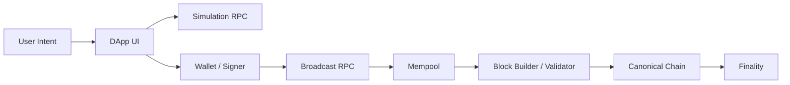
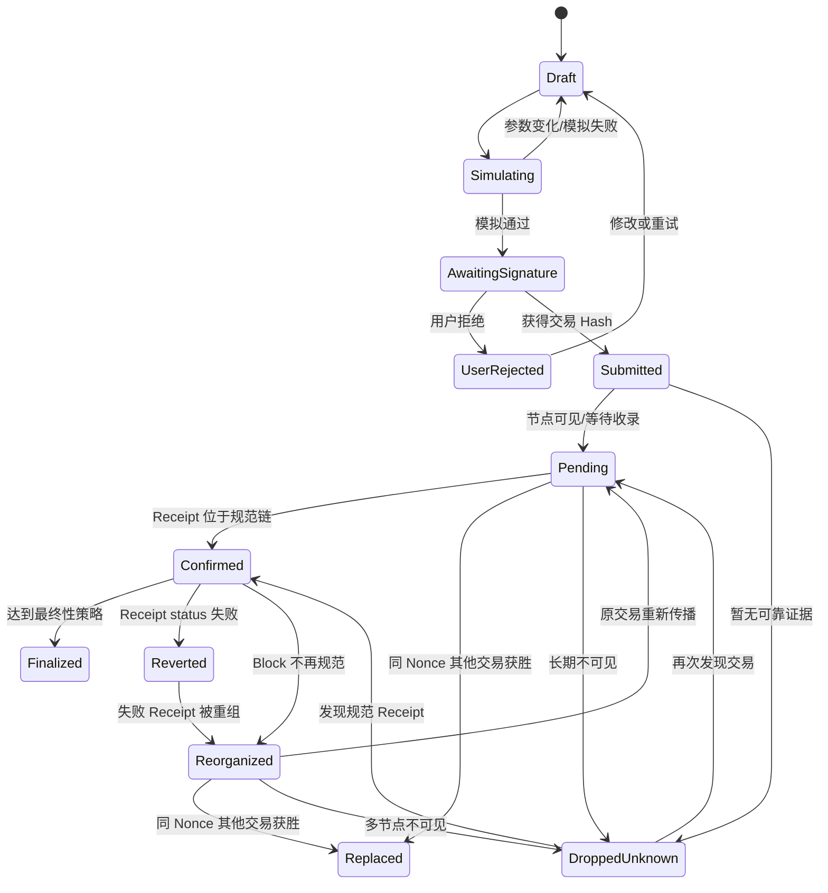
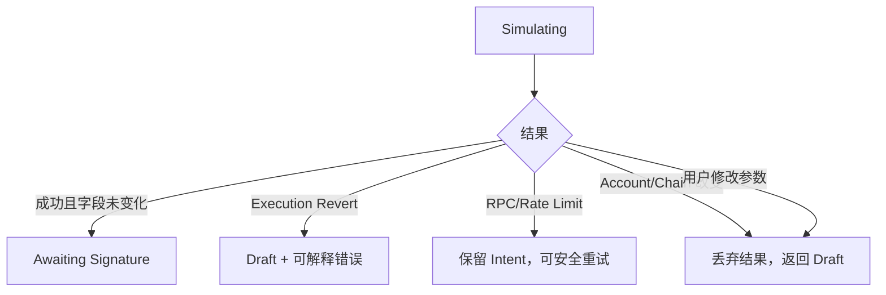
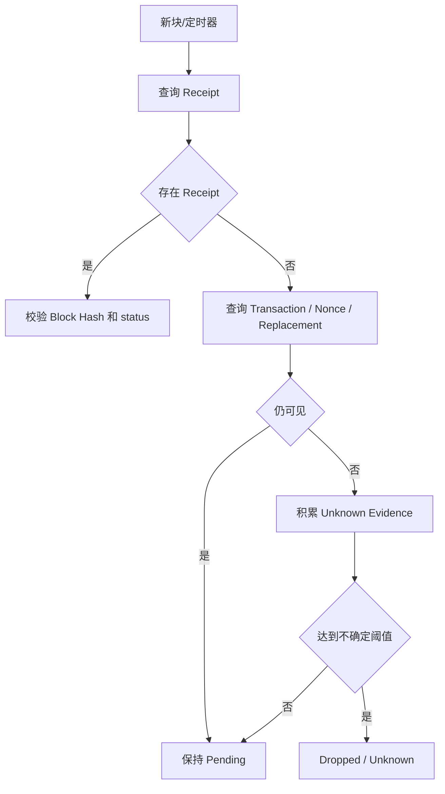
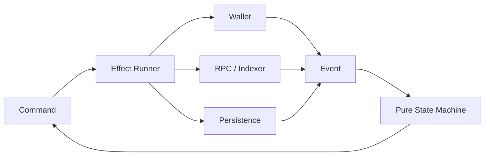

# Web3 交易状态机：从 Draft、签名与 Pending 到 Replacement、Reorg 和 Finality

> 交易状态不是 `loading / success / error`。用户拒签不是链上失败，拿到 Hash 不是已进入 Mempool，Receipt 出现不是最终不可逆，Reorg 还会让 Confirmed 交易重新回到 Pending。可靠 DApp 必须用可回退状态机表达事实，而不是用乐观文案覆盖不确定性。

---

## 一、本文解决什么问题

很多 DApp 的交易代码只有三个状态：

```typescript
type TransactionState = {
  loading: boolean;
  success: boolean;
  error?: Error;
};
```

它无法回答：

- 正在模拟，还是正在等待钱包确认？
- 用户拒签后是否可以继续编辑？
- 钱包返回 Hash，但 RPC 查询不到交易，属于哪种状态？
- 交易在某个节点 Mempool 中可见，是否说明全网都看到了？
- Speed Up 后原交易是否已经被替换？
- Receipt `status = 0` 与广播错误有什么区别？
- 已有 1 个确认的交易发生 Reorg，应如何回退？
- 长时间查不到 Receipt，是 Dropped 还是 RPC 落后？
- `Confirmed` 与 `Finalized` 的业务承诺有何差别？
- 用户刷新、切账户、切链后，如何继续追踪原交易？

大纲要求的状态为：

- Draft
- Simulating
- Awaiting Signature
- User Rejected
- Submitted
- Pending
- Replaced
- Confirmed
- Reverted
- Reorganized
- Finalized
- Dropped / Unknown

本文以普通 EVM 交易为主。ERC-4337 `UserOperation` 具有 UserOp Hash、Bundler 和 EntryPoint 等额外层次，应复用状态机思想，但不能直接把 UserOperation 与外层 Bundle Transaction 当成同一对象。

### 核心结论

1. 每个状态必须由可观察证据定义，而不是由等待时长或 UI 猜测定义。
2. `Submitted` 表示客户端获得可追踪 Hash 或完成广播尝试；`Pending` 需要更强的节点/Mempool/Nonce 证据，两者不能混用。
3. `User Rejected` 是签名前的正常终止分支，不会产生链上交易，也不应自动重试钱包弹窗。
4. `Replaced` 是同一发送方、同一 Nonce 的另一笔交易在规范链消费该 Nonce，或已获得足够证据成为获胜候选；仅广播 Speed Up 不应立即标记原交易已被替换。
5. `Confirmed` 表示交易当前位于规范链且达到产品定义的初步确认条件；它仍可因 Reorg 回退。
6. `Finalized` 必须绑定目标链的共识/业务最终性策略，不能用所有链通用的固定区块数定义。
7. `Dropped / Unknown` 是不确定状态，不是确定失败。用户不应在缺少 Nonce 和多节点证据时盲目重复业务操作。
8. 状态机必须持久化、幂等、支持 Replacement Family，并独立于页面、当前账户和单个 RPC 生命周期。

---

## 二、为什么需要显式状态机

### 2.1 交易是跨系统工作流



各系统没有原子事务。钱包可能签名成功但广播失败；节点可能接受交易但响应超时；交易可能进入区块后又被 Reorg。

### 2.2 状态、事件与事实

```text
State：系统当前对交易所知事实的归纳
Event：导致状态迁移的新证据
Command：系统希望执行的动作
Effect：RPC、钱包、持久化等外部副作用
```

例如：

```text
Command: REQUEST_SIGNATURE
Effect:  打开钱包确认
Event:   WALLET_REJECTED
State:   USER_REJECTED
```

不能在 Reducer 中直接调用钱包或 RPC；Reducer 只根据 Event 计算新状态。

### 2.3 状态机不是线性进度条



`Reverted` 在实现中通常由 Receipt 一出现就直接判断，而图中把 `Confirmed → Reverted` 表达为结果分类。关键是两者都依赖当前规范 Receipt，也都可能 Reorg。

---

## 三、交易身份与数据模型

### 3.1 Intent、Transaction 与 Attempt

三者应分开：

```text
Intent
  用户想完成的业务目标，例如订单 #123 Swap 1 ETH

Transaction Attempt
  某组确定字段、签名和 Hash，例如原交易、Speed Up、Cancel

On-chain Outcome
  哪个 Attempt 最终在规范链消费 Nonce，以及业务执行结果
```

一个 Intent 可以有多个 Attempt，但最多只能把一次业务结果视为成功。

### 3.2 持久化模型

```typescript
type TransactionIntent = {
  id: string;
  chainId: number;
  from: `0x${string}`;
  action: string;
  createdAt: number;
  payloadHash: `0x${string}`;
};

type TransactionAttempt = {
  hash: `0x${string}`;
  intentId: string;
  chainId: number;
  from: `0x${string}`;
  nonce?: bigint;
  kind: 'original' | 'speed-up' | 'cancel';
  replaces?: `0x${string}`;
  submittedAt: number;
  rawTransactionRef?: string;
};
```

`rawTransactionRef` 应是受控存储引用，而不是普通日志中的完整 Raw Transaction。

### 3.3 状态联合类型

```typescript
type TxState =
  | { type: 'draft'; intent: TransactionIntentDraft }
  | { type: 'simulating'; intent: TransactionIntent; requestId: string }
  | { type: 'awaiting-signature'; intent: TransactionIntent; simulation: Simulation }
  | { type: 'user-rejected'; intent: TransactionIntent; reason?: string }
  | { type: 'submitted'; attempt: TransactionAttempt; broadcast: BroadcastEvidence }
  | { type: 'pending'; family: TransactionFamily; evidence: PendingEvidence }
  | { type: 'replaced'; family: TransactionFamily; winner: TransactionAttempt }
  | { type: 'confirmed'; attempt: TransactionAttempt; receipt: Receipt }
  | { type: 'reverted'; attempt: TransactionAttempt; receipt: Receipt }
  | { type: 'reorganized'; previous: Receipt; family: TransactionFamily }
  | { type: 'finalized'; attempt: TransactionAttempt; receipt: Receipt }
  | { type: 'dropped-or-unknown'; family: TransactionFamily; evidence: UnknownEvidence };
```

Discriminated Union 可以让 UI 必须处理所有状态，减少“Hash 为空但状态为成功”之类非法组合。

### 3.4 必须保存 Chain ID 与 Block Hash

Transaction Hash 跨链并非全局业务主键。最小定位键是：

```text
chainId + transactionHash
```

Receipt 还必须保存 `blockHash`，用于确认它是否仍在规范链。

---

## 四、Draft

### 4.1 定义

Draft 是尚未形成可签名不可变 Intent 的编辑状态。用户可以修改：

- 目标资产和数量；
- Slippage、Deadline；
- 接收地址；
- 目标链；
- Gas/费用偏好；
- Approval 范围；
- Batch 内容。

### 4.2 进入条件

- 新建交易；
- User Rejected 后返回；
- Simulation 失败且允许修改；
- Account/Chain 变化使旧 Intent 失效；
- 用户主动取消签名前流程。

### 4.3 Draft 不是链上对象

此阶段没有 Transaction Hash，也不应显示 Explorer 链接。可以保存本地草稿，但需避免持久化敏感 Calldata、私有报价和签名挑战。

### 4.4 校验

进入 Simulation 前完成结构校验：

```text
[ ] Chain 受支持
[ ] Account 已授权
[ ] 地址合法且非意外零地址
[ ] 金额使用整数单位
[ ] Deadline 未过期
[ ] 合约地址来自可信配置
[ ] ABI 参数可编码
[ ] 用户余额和产品限额初步满足
```

本地校验不能替代链上 Simulation。

---

## 五、Simulating

### 5.1 定义

Simulating 表示系统正在基于冻结的 Intent 评估执行结果、Gas 和风险。

模拟输入至少绑定：

```text
chainId
from
to
value
data
block context
state overrides if any
```

### 5.2 进入条件

- Draft 通过本地校验；
- 用户明确点击预览/提交；
- 前一次 Simulation 因新区块或参数变化失效后重新执行。

### 5.3 退出分支



### 5.4 防止迟到模拟结果

```typescript
let simulationGeneration = 0;

async function simulate(intent: TransactionIntent): Promise<void> {
  const generation = ++simulationGeneration;
  dispatch({ type: 'SIMULATION_STARTED', intent, generation });

  const result = await simulator.simulate(intent);
  if (generation !== simulationGeneration) return;

  dispatch({ type: 'SIMULATION_SUCCEEDED', intent, result, generation });
}
```

Account、Chain 或 Draft 改变时增加 Generation 并 Abort 旧请求。

### 5.5 Simulation Success 不是安全证明

广播前状态可能变化，公共 Mempool 还可能引入 MEV。Slippage、Deadline、Min Output 和权限边界必须在合约参数中约束。

---

## 六、Awaiting Signature

### 6.1 定义

系统已冻结待签字段并向钱包/Signer 发出确认请求，正在等待用户或签名设备响应。

### 6.2 UI 必须展示什么

- 目标链；
- From/To；
- Value；
- 合约方法和关键参数；
- Token/NFT 资产变化；
- Approval 范围；
- 预计和最大费用；
- Simulation Block 与风险提示。

### 6.3 阶段不允许静默修改字段

钱包弹窗打开后，DApp 不得在后台修改 `to/value/data/chainId`。若费用或 Nonce 需要重新准备，应取消旧请求并生成新 Intent/Attempt。

### 6.4 账户与链变化

收到 `accountsChanged` 或 `chainChanged`：

1. 标记当前签名请求过期；
2. 即使旧 Promise 后续返回，也不接受其结果进入当前 Intent；
3. 重新核对实际签名交易中的 From/Chain；
4. 要求用户重新模拟和确认。

### 6.5 超时边界

钱包等待过久可以让 UI 提供“取消等待”，但 DApp 未必能关闭所有钱包弹窗。超时后应使 Request Generation 失效，防止迟到签名自动广播。

---

## 七、User Rejected

### 7.1 定义

用户、钱包或硬件设备明确拒绝签名/发送请求，且没有产生可广播的已签交易。

### 7.2 它不是错误告警

User Rejected 是正常用户控制流：

- 不自动 Retry；
- 不弹全局 Error Boundary；
- 不上报为高优先级 Crash；
- 不清空安全的 Draft；
- 不生成 Transaction Hash；
- 不创建 Pending Tracker。

### 7.3 与钱包故障区分

```text
User Rejected：用户明确拒绝
Wallet Disconnected：通信中断，结果未知
Unsupported Method：钱包不支持请求
Request Already Pending：钱包已有同类请求
Signer Error：硬件/算法/设备错误
```

只有明确拒绝才能进入 `User Rejected`。通信超时不应伪装成用户拒绝。

### 7.4 下一步

允许用户：

- 返回 Draft 修改；
- 重新发起一次新的签名请求；
- 更换钱包；
- 切换正确网络；
- 放弃 Intent。

---

## 八、Submitted

### 8.1 定义

Submitted 表示客户端已经获得一个可追踪 Transaction Hash，并完成至少一次广播请求，或钱包声明已提交交易。

它不保证：

- 当前 RPC 的 TxPool 可见；
- 其他节点已传播；
- Nonce 可立即执行；
- 费用足够；
- 一定会进入区块。

### 8.2 为什么与 Pending 分开

广播 RPC 可能返回 Hash 后，查询节点尚未看到交易；钱包也可能使用私有 Relay。Submitted 描述“提交边界已越过”，Pending 描述“等待链上收录的已知状态”。

### 8.3 本地 Hash

本地签名场景应在广播前由 Raw Transaction 计算 Hash。即使 RPC 超时，也可进入带 `broadcastOutcome = unknown` 的 Submitted 状态继续查询。

钱包 `eth_sendTransaction` 场景通常由钱包返回 Hash。仍需绑定 Chain ID、From 和 Intent ID。

### 8.4 Submitted 的证据

```typescript
type BroadcastEvidence = {
  hash: `0x${string}`;
  endpoint?: string;
  acceptedAt?: number;
  outcome: 'accepted' | 'already-known' | 'response-unknown';
};
```

HTTP Timeout 只能标记 `response-unknown`，不能直接标记 Dropped。

### 8.5 提交后的持久化顺序

尽量保证：

1. 创建持久化 Intent；
2. 保存 Attempt 与 Hash；
3. 启动 Tracker；
4. 更新 UI；
5. 再执行非关键 Analytics。

避免拿到 Hash 后页面崩溃，导致用户刷新后完全找不到交易。

---

## 九、Pending

### 9.1 定义

交易尚无当前规范 Receipt，但存在足够证据表明它正在等待收录，例如：

- 一个或多个节点返回交易对象且 `blockHash = null`；
- 钱包/私有 Relay 提供 Pending 状态；
- 账户 Pending Nonce 表明该 Nonce 已进入节点视图；
- 刚刚被 Reorg 移出且重新进入 Mempool。

Mempool 是节点本地视图，因此 Pending 也不是全网共识状态。

### 9.2 Pending 诊断维度

```text
Current Base Fee vs maxFeePerGas
Priority Fee
Account latest nonce
Account pending nonce
Missing lower nonce
Transaction visible endpoints
Replacement candidates
First/last seen time
Private/public submission path
```

### 9.3 长时间 Pending 不等于失败

可能原因：

- 费用不足；
- 前序 Nonce 阻塞；
- 节点传播有限；
- 私有 Relay 等待目标区块；
- 网络拥堵；
- RPC 查的是不同 Mempool；
- 交易仅在某些 Builder 可见。

### 9.4 UI 动作

- 查看 Explorer，但说明 Explorer 也可能未收录；
- Speed Up；
- Cancel Attempt；
- 切换 RPC 重新检查；
- 展示 Nonce Gap；
- 不允许无保护地重复同一业务 Intent。

### 9.5 Tracker 轮询



时间阈值只是触发诊断，不是确定交易已 Dropped 的证明。

---

## 十、Replaced

### 10.1 定义

同一 `chainId + from + nonce` 的另一个交易 Attempt 在当前规范链中消费该 Nonce，原 Attempt 因而不能再在该链状态下执行。

### 10.2 Speed Up 与 Cancel

- Speed Up：业务字段通常相同，费用更高；
- Cancel：常见为同 Nonce 向自己发送零 Value/空 Data；
- 其他 Replacement：钱包或用户发送了完全不同的交易。

### 10.3 广播替换交易不等于已 Replaced

正确中间状态是：

```text
Pending Family
  original tx0
  replacement candidate tx1
  cancel candidate tx2
```

直到某个 Attempt 进入规范链，才确定当前获胜者。仅某节点从 TxPool 删除原交易仍不足以证明全网替换结果。

### 10.4 业务结果归并

```typescript
type TransactionFamily = {
  chainId: number;
  from: `0x${string}`;
  nonce: bigint;
  attempts: readonly TransactionAttempt[];
  canonicalWinner?: `0x${string}`;
};
```

如果 Speed Up 获胜，原 Intent 可以继续走 Confirmed；如果 Cancel 获胜，原业务 Intent 应标记“取消成功”，而不是“原交易执行成功”。

### 10.5 Reorg 边界

Replacement Winner 所在区块发生 Reorg 后：

- 原交易可能重新进入 Mempool；
- 另一个 Candidate 可能在新分支获胜；
- 状态从 Replaced 回到 Reorganized/待重新判定；
- 不能永久删除失败候选的跟踪记录。

---

## 十一、Confirmed

### 11.1 定义

交易存在 Receipt，Receipt 的 Block Hash 当前属于规范链，并达到产品定义的初步确认条件。

若产品将首个 Receipt 称为 Included，可在内部增加 `included` 子状态；对外大纲中的 Confirmed 必须明确其确认门槛。

### 11.2 验证 Receipt

```text
[ ] receipt.transactionHash == attempt.hash
[ ] receipt.blockHash 对应当前规范块
[ ] receipt.blockNumber 与查询链一致
[ ] receipt.from 与预期发送者一致
[ ] 必要时核对 to / contractAddress
[ ] status 与执行结果已解析
[ ] Logs 来自可信合约地址
```

### 11.3 Confirmed 与业务成功

Receipt Success 不保证：

- 每个内部调用成功；
- 批处理没有允许失败项；
- 用户得到期望金额；
- Event 来自正确合约；
- 下游跨链消息已执行；
- 不会 Reorg。

业务层应验证事件和最终状态。

### 11.4 Confirmations 计算

如果 Receipt 位于区块 `N`，当前规范 Head 为 `H`，常见确认数定义需由项目统一。例如有的 UI 把包含区块算作第 1 个确认。不要在不同组件中各自实现造成 Off-by-one。

### 11.5 Confirmed 的 UI

应显示：

- 当前确认进度；
- Receipt 执行结果；
- Block Number/Explorer；
- 仍在等待最终性的说明；
- 高价值业务尚未释放的原因。

---

## 十二、Reverted

### 12.1 定义

交易已进入当前规范链，但顶层执行失败，Receipt `status` 表示 Revert/Failure。

它与以下情况不同：

- Simulation Revert：未上链；
- Broadcast Error：没有规范 Receipt；
- User Rejected：没有签名交易；
- Dropped：没有上链执行；
- 子调用失败但顶层捕获：Receipt 可能仍成功。

### 12.2 Gas 与状态

Reverted Transaction 仍消费 Nonce，并通常消耗已执行部分对应 Gas；该交易内部状态变更回滚，但 Gas 支付和外层链上记录仍存在。

### 12.3 诊断

Receipt 本身通常不提供完整 Revert 原因。可以：

- 在相同或接近状态上重放 `eth_call`；
- 使用受信 Trace API；
- 解析标准 Revert Data；
- 对照合约事件和前置状态；
- 保存原始 Intent 与 Simulation Block。

状态变化可能导致事后重放得到不同原因，因此诊断要标注不确定性。

### 12.4 Reverted 也会 Reorg

失败 Receipt 所在区块被移出后，Nonce 可能重新可用，交易也可能在新分支执行成功或继续失败。因此 Reverted 在达到 Finality 前不是绝对终态。

### 12.5 UI 与重试

不要提供“一键原样重试”而不重新模拟。需要：

1. 回到新 Draft；
2. 更新 Nonce/Fee/Deadline；
3. 重新读取链状态；
4. 重新 Simulation；
5. 由用户再次确认。

---

## 十三、Reorganized

### 13.1 定义

此前已记录的 Receipt Block Hash 不再是该高度的规范块，或已知 Head 链与保存的区块祖先关系不一致。

### 13.2 检测

```typescript
async function receiptIsCanonical(
  client: PublicClient,
  receipt: TransactionReceipt,
): Promise<boolean> {
  const block = await client.getBlock({
    blockNumber: receipt.blockNumber,
  });
  return block.hash === receipt.blockHash;
}
```

需要处理 RPC 落后和节点分歧，重要场景可用多个独立节点确认。

### 13.3 Reorganized 不是 Failed

交易可能：

- 回到 Pending；
- 很快在新分支重新 Confirmed；
- 被 Replacement；
- 变成 Dropped/Unknown；
- 因新状态变为无效。

### 13.4 回退动作

```text
[ ] 撤销基于旧 Receipt 的暂定业务状态
[ ] 回滚/失效受影响 Query Cache
[ ] 恢复 Pending Delta 或重新计算
[ ] 重新检查账户 Nonce
[ ] 查询 Transaction Family 所有 Attempt
[ ] 暂停不可逆下游动作
[ ] 向用户显示“链重组，正在重新确认”
```

### 13.5 深度 Reorg

不同链正常 Reorg 范围和 Finality 模型不同。若超过产品预期深度，应触发高优先级告警、切换多节点验证，并可能暂停跨链/提现等高风险流程。

---

## 十四、Finalized

### 14.1 定义

交易及其所在区块达到目标链和业务策略认可的最终性门槛，此后被移出规范链的概率或协议条件已达到产品可接受水平。

### 14.2 最终性策略

```typescript
type FinalityPolicy =
  | { type: 'block-confirmations'; count: number }
  | { type: 'safe-tag' }
  | { type: 'finalized-tag' }
  | { type: 'protocol-specific'; policyId: string };
```

必须确认目标 RPC 和链是否支持相应标签及其语义。

### 14.3 Finalized 不是数学上的永远不变承诺

协议可能发生严重故障、社会层协调或客户端 Bug。工程上的 Finalized 表示达到明确、记录在案的风险门槛，而不是宣称宇宙中绝无回滚可能。

### 14.4 业务动作

适合在 Finalized 后执行：

- 大额资产结算；
- 跨链消息进入下一阶段；
- 不可逆权益发放；
- 会计最终入账；
- 清理部分临时跟踪数据。

但仍保留审计记录和 Intent/Receipt 关联。

### 14.5 Finality 与 UX

普通用户可以先看到“交易已确认”，后台继续等待 Finalized。高风险业务应明确显示“链上已确认，最终结算中”。

---

## 十五、Dropped / Unknown

### 15.1 为什么使用组合状态

公共 RPC 查不到交易无法证明它已从全网丢弃。它可能：

- 只存在于其他节点；
- 在私有 Relay；
- RPC 落后或更换了 Mempool；
- 被 Replacement 但新 Hash 未发现；
- 曾进入 Reorg 区块；
- 从未成功广播。

因此安全 UI 应使用 `Dropped / Unknown`，而不是确定的“失败”。

### 15.2 进入条件

可以基于证据阈值：

```typescript
type UnknownEvidence = {
  checkedEndpoints: readonly string[];
  lastSeenAt?: number;
  latestNonce: bigint;
  pendingNonce?: bigint;
  replacementFound?: `0x${string}`;
  checkedAt: number;
};
```

等待时长只是其中一个维度。

### 15.3 Nonce 推断

- `latestNonce <= txNonce`：Nonce 尚未在规范链消费，原交易仍可能执行；
- `latestNonce > txNonce`：某笔同 Nonce 交易已在规范链消费，需要寻找 Winner；
- Pending Nonce 是节点本地视图，只能作为辅助证据。

### 15.4 用户动作

提供：

- 重新检查；
- 查询多个 RPC/Explorer；
- 使用同 Nonce Speed Up/Cancel；
- 查看 Nonce 状态；
- 联系支持并提供 Chain ID + Hash；
- 在确认 Nonce 未消费前避免重复业务操作。

### 15.5 状态可恢复

后续发现 Receipt 时可以直接进入 Confirmed/Reverted；重新发现 Mempool 交易则回到 Pending；发现同 Nonce Winner 则进入 Replaced。

---

## 十六、Reducer 与迁移约束

### 16.1 Event 定义

```typescript
type TxEvent =
  | { type: 'EDITED'; draft: TransactionIntentDraft }
  | { type: 'SIMULATION_STARTED'; intent: TransactionIntent; generation: number }
  | { type: 'SIMULATION_SUCCEEDED'; simulation: Simulation; generation: number }
  | { type: 'SIMULATION_FAILED'; error: SimulationError; generation: number }
  | { type: 'SIGNATURE_REQUESTED' }
  | { type: 'USER_REJECTED'; reason?: string }
  | { type: 'HASH_OBTAINED'; attempt: TransactionAttempt; evidence: BroadcastEvidence }
  | { type: 'MEMPOOL_SEEN'; evidence: PendingEvidence }
  | { type: 'RECEIPT_FOUND'; receipt: TransactionReceipt }
  | { type: 'REPLACEMENT_CONFIRMED'; winner: TransactionAttempt }
  | { type: 'REORG_DETECTED'; previous: TransactionReceipt }
  | { type: 'FINALITY_REACHED'; proof: FinalityEvidence }
  | { type: 'VISIBILITY_LOST'; evidence: UnknownEvidence };
```

### 16.2 Reducer 必须拒绝非法迁移

```typescript
function transactionReducer(state: TxState, event: TxEvent): TxState {
  switch (state.type) {
    case 'draft':
      if (event.type === 'SIMULATION_STARTED') {
        return {
          type: 'simulating',
          intent: event.intent,
          requestId: String(event.generation),
        };
      }
      break;

    case 'awaiting-signature':
      if (event.type === 'USER_REJECTED') {
        return {
          type: 'user-rejected',
          intent: state.intent,
          reason: event.reason,
        };
      }
      if (event.type === 'HASH_OBTAINED') {
        return {
          type: 'submitted',
          attempt: event.attempt,
          broadcast: event.evidence,
        };
      }
      break;
  }

  throw new InvalidTransitionError(state.type, event.type);
}
```

生产代码可以记录并忽略重复 Event，但不能静默接受逻辑上不可能的迁移。

### 16.3 重复和乱序事件

RPC Polling、WebSocket、Indexer 和多个节点可能重复/乱序返回。处理规则：

- Event 有 Chain ID、Hash、Block Hash；
- Receipt 以规范链校验为准；
- 相同 Event 幂等；
- 旧 Block 事件不能覆盖新 Finality；
- Reorg Event 可以回退未 Finalized 状态；
- 超出模型的“Finalized 后 Reorg”进入事故流程，而不是普通 UI 分支。

---

## 十七、副作用编排

### 17.1 State Machine 与 Effect Runner



钱包弹窗、RPC 和数据库写入不放在纯 Reducer 内。

### 17.2 Tracker 独立于页面

用户关闭 Modal、切 Route 或切 Account 后：

- Tracker 继续轮询；
- 状态写入应用级 Store/数据库；
- 通知中心仍可显示结果；
- 页面重新打开时从持久化状态恢复；
- 不重复启动多个 Tracker。

### 17.3 SSR 与多标签页

浏览器多标签页可能同时跟踪同一 Hash。可以使用：

- BroadcastChannel 同步；
- Shared Worker/Service Worker；
- Leader Election；
- 后端统一 Tracker。

至少保证业务回调幂等，即使多个标签页都观察到 Receipt 也只处理一次。

---

## 十八、幂等与业务一致性

### 18.1 Intent ID

每次用户业务意图生成稳定 ID。重复点击、页面刷新和网络重试都先查询该 Intent 是否已有 Attempt。

### 18.2 链上事件幂等键

```text
chainId + transactionHash + logIndex
```

若发生 Reorg，同一业务 Event 可能在新 Block 重新出现。数据库还要保存 Block Hash 和 Canonical 状态，而不是只用唯一键永久吞掉后续变化。

### 18.3 业务状态分层

```text
Requested
Submitted
OnChainConfirmed
Finalized
Settled
```

`Settled` 可能还依赖后端库存、跨链消息或法币系统，不应与链上 Finalized 混为一谈。

### 18.4 不可逆副作用

发货、提现和跨链 Mint 等不可逆动作应等待适当最终性，或具备补偿/冻结机制。不要因为前端显示绿色勾就立即触发。

---

## 十九、UI 映射

| 状态 | 推荐文案语义 | 主要操作 |
|---|---|---|
| Draft | 编辑交易 | 预览/模拟 |
| Simulating | 正在验证执行结果 | 取消/等待 |
| Awaiting Signature | 请在钱包核对并确认 | 打开钱包/取消等待 |
| User Rejected | 已取消签名 | 修改/重试 |
| Submitted | 已提交，正在确认传播 | 查看 Hash/等待 |
| Pending | 等待链上收录 | Speed Up/Cancel/诊断 |
| Replaced | 已由同 Nonce 交易替代 | 查看 Winner |
| Confirmed | 已进入规范链，确认中 | 查看 Receipt |
| Reverted | 已上链但执行失败 | 查看原因/重新构造 |
| Reorganized | 链发生重组，重新确认中 | 等待，不重复提交 |
| Finalized | 已达到最终性门槛 | 完成 |
| Dropped/Unknown | 当前无法确认交易位置 | 重新检查/Nonce 诊断 |

文案应准确，不使用“100% 永久成功”等无法保证的表述。

### 19.1 稳定布局

交易按钮和状态面板应预留稳定尺寸，避免状态文案变化导致布局跳动。长 Hash、错误原因和移动端钱包名称需要换行或截断，并保留完整值的复制入口。

### 19.2 通知去重

相同 Intent 不应在每次 Poll 时重复弹“交易已确认”。通知事件也要幂等，并在 Reorg 时发出明确更正，而不是静默消失。

---

## 二十、常见错误案例

### 20.1 `sendTransaction()` Resolve 就设置 Success

通常只获得 Hash，应进入 Submitted/Pending，而不是 Finalized。

### 20.2 用户拒签显示“交易失败”

没有链上交易发生。应进入 User Rejected 并允许回到 Draft。

### 20.3 30 秒查不到 Receipt 就标记 Dropped

等待时间不能证明全网丢弃。应结合多节点、Mempool 和 Nonce 证据进入 Dropped/Unknown。

### 20.4 Speed Up 广播成功就把原交易标为 Replaced

两个交易仍在竞争。必须等待规范链 Winner。

### 20.5 Confirmed 是不可回退终态

未达到 Finality 前可能 Reorg。状态机必须允许 Confirmed/Reverted 回到 Reorganized。

### 20.6 Reverted 交易复用原参数直接重试

Nonce、Deadline、Gas 和链状态已变化。必须返回 Draft 并重新模拟。

### 20.7 切账户后停止旧交易 Tracker

旧账户交易仍可能执行，造成用户不知道资产变化。

### 20.8 只存 Transaction Hash，不存 Chain ID

无法可靠路由 RPC、Explorer 和 Receipt，也可能与其他链 Hash 混淆。

### 20.9 只存 Block Number，不存 Block Hash

无法检测同高度 Reorg。

### 20.10 用前端内存作为唯一事实源

刷新、崩溃或移动端进程回收后丢失状态。Submitted 之后必须持久化。

---

## 二十一、监控与可观测性

### 21.1 关键时间点

```text
intentCreatedAt
simulationStartedAt / completedAt
signatureRequestedAt / resolvedAt
hashObtainedAt
firstMempoolSeenAt
includedAt
confirmedAt
finalizedAt
reorgDetectedAt
```

### 21.2 指标

```text
transaction_state_total{chain,state,action}
transaction_state_duration{from,to,chain}
transaction_user_rejected_rate{wallet,action}
transaction_pending_age{chain,fee_bucket}
transaction_replacement_rate{chain}
transaction_revert_rate{contract,selector}
transaction_reorg_count{chain,depth}
transaction_unknown_rate{rpc_provider}
```

地址和 Hash 不应作为高基数 Metrics Label，可放在受控 Trace/Log 字段。

### 21.3 Trace 关联

使用 `intentId` 串联前端、钱包请求、广播 RPC、后端 Tracker 和业务订单。签名和 Raw Transaction 不写入普通日志。

### 21.4 告警

- 某 Chain Pending Age 突增；
- Revert Rate 按 Function Selector 突增；
- 多 RPC Receipt 可见性分歧；
- Replacement 激增；
- Reorg 深度超过基线；
- Submitted 长期无法进入 Pending；
- Finalized Tracker 停滞。

告警阈值应基于目标链历史和业务 SLO，不使用跨链通用固定秒数。

---

## 二十二、测试与验证方法

### 22.1 状态迁移单元测试

```text
[ ] Draft 只能在校验后进入 Simulating
[ ] 迟到 Simulation 结果被 Generation 丢弃
[ ] User Rejected 不创建 Hash
[ ] Submitted 持久化后才能启动 Tracker
[ ] Pending 可进入 Confirmed/Replaced/Unknown
[ ] Confirmed/Reverted 可进入 Reorganized
[ ] Reorganized 可回到 Pending/Replaced/Unknown
[ ] Finalized 普通流程不可回退
[ ] 重复 Event 幂等
[ ] 非法迁移被拒绝并记录
```

### 22.2 钱包交互测试

- 用户拒绝；
- 钱包关闭但未明确拒绝；
- 签名期间切 Chain；
- 签名期间切 Account；
- 硬件钱包超时后迟到返回；
- 两次快速点击只生成一个 Request；
- WalletConnect 页面刷新后恢复 Pending Request。

### 22.3 广播不确定性测试

1. 节点接受 Raw Transaction；
2. 故意丢弃 HTTP 响应；
3. 客户端进入 Submitted/Response Unknown；
4. 按本地 Hash 查询发现交易；
5. 不生成第二个 Nonce；
6. 重播相同 Raw Transaction 保持幂等。

### 22.4 Replacement 测试

- Original Pending；
- 广播 Speed Up Candidate；
- 原交易先打包；
- Speed Up 先打包；
- Cancel 先打包；
- Winner 区块 Reorg；
- 不同 RPC 看到不同 Candidate；
- UI 始终按 Family 归并。

### 22.5 Revert 测试

- Simulation 已知 Revert，不进入签名；
- Simulation 成功但执行前状态变化导致链上 Revert；
- 顶层成功、内部允许失败；
- Receipt Revert 后重新模拟；
- Reverted Receipt 发生 Reorg 后重新执行成功。

### 22.6 Reorg 测试

使用可回滚开发链：

1. 将交易打包并进入 Confirmed；
2. 应用暂定业务更新；
3. 回滚对应区块；
4. 生成竞争分支；
5. 检测 Block Hash 变化；
6. 状态进入 Reorganized；
7. 回滚业务和 Cache；
8. 交易重新 Pending 或被替换；
9. 最终再次 Confirmed/Finalized。

### 22.7 Dropped/Unknown 测试

- 单节点查不到但另一节点可见；
- 所有节点查不到且 Nonce 未消费；
- Nonce 已消费但 Winner 未发现；
- 私有 Relay 交易；
- RPC 节点落后；
- 页面离线数小时后恢复；
- Unknown 后重新发现 Receipt。

### 22.8 属性测试

重要不变量：

```text
同一 Intent 最多结算一次业务成功
同一 Sender/Nonce 规范链最多一个 Winner
没有 Hash 不能进入 Pending/Confirmed
没有 Receipt 不能进入 Confirmed/Reverted
没有规范 Block Hash 不能进入 Finalized
任何非 Finalized Receipt 都可被 Reorg 证据回退
```

---

## 二十三、方案选择

| 场景 | 状态机位置 | 主要考虑 |
|---|---|---|
| 简单前端转账 | 应用级 Store + 本地持久化 | 页面刷新恢复 |
| 交易型 DApp | 前端状态机 + 后端 Tracker | Replacement、通知、幂等 |
| 多设备钱包 | 后端/同步服务为主 | 跨设备一致性和隐私 |
| 托管/Relayer | 服务端持久化工作流 | Nonce、审批、广播未知 |
| ERC-4337 | UserOp 状态机 + 外层交易状态机 | 双 Hash、Bundler、EntryPoint |
| 跨链应用 | 每条链状态机 + 消息状态机 | Finality 和补偿流程 |

状态机库可以使用 Reducer、XState 或后端工作流引擎；关键不是库，而是状态定义、证据、幂等和回退规则完整。

---

## 二十四、上线检查清单

```text
[ ] Draft、Simulation、Signature 与链上状态明确分层
[ ] User Rejected 与系统故障分开
[ ] Intent、Attempt、Transaction Family 数据模型已建立
[ ] Chain ID + Hash 作为交易定位键
[ ] 同 Nonce Replacement Candidate 归入同一 Family
[ ] Submitted 不被错误展示为 Confirmed
[ ] 广播超时保留 Response Unknown 并按 Hash 查询
[ ] Pending 诊断包含 Fee、Nonce、可见节点和前序交易
[ ] Speed Up/Cancel 广播后不立即标记 Replaced
[ ] Receipt 校验 Transaction Hash、Block Hash 和 Chain
[ ] Reverted 与 Simulation Revert 分开
[ ] Confirmed 与 Finalized 有明确不同门槛
[ ] Confirmed/Reverted 可以进入 Reorganized
[ ] Reorg 会回滚 Query、乐观状态和业务副作用
[ ] Dropped/Unknown 不被当作确定失败
[ ] Tracker 独立于页面和当前 Account 生命周期
[ ] Submitted 后状态持久化并支持刷新恢复
[ ] Event 重复、乱序和多 RPC 分歧可幂等处理
[ ] 不可逆业务动作等待适当 Finality
[ ] 已完成拒签、超时、Replacement、Revert 和 Reorg 演练
```

---

## 二十五、总结

交易状态机的目标不是给进度条增加更多步骤，而是让产品、用户和运维始终对链上事实保持一致理解。

真正需要记住的是：

1. Draft、Simulation 和 Awaiting Signature 都发生在链上交易被可靠提交之前。
2. User Rejected 是正常终止分支，不产生 Hash，也不应自动重试。
3. Submitted 表示已经越过提交边界，Pending 表示已知正在等待收录，两者证据不同。
4. Replacement 由同 Sender/Nonce 的交易族决定，广播 Speed Up 或 Cancel 只是新增候选。
5. Confirmed 与 Reverted 都依赖当前规范 Receipt，在 Finality 前都可能因 Reorg 回退。
6. Reorganized 是重新判定状态，不等于交易永久失败。
7. Dropped/Unknown 表达证据不足，必须结合多节点、Nonce 和 Replacement 继续诊断。
8. Finalized 是链和业务策略共同定义的风险门槛，不能用所有网络通用的固定确认数。
9. 状态机必须持久化、幂等、可回退，并与页面、钱包当前账户和单 RPC 解耦。

可靠 DApp 不会急着宣布交易成功，而是准确说明它已经发生到哪一步、证据是什么、是否仍可能变化，以及用户现在能安全采取什么动作。

---

## 问答复盘

### Q1：钱包返回 Transaction Hash 后，交易应进入 Confirmed 吗？

**答：** 不应。此时最多进入 Submitted，并在获得 Mempool 或节点可见证据后进入 Pending；只有规范 Receipt 才能进入 Confirmed/Reverted。

### Q2：User Rejected 与 Reverted 有什么区别？

**答：** User Rejected 发生在签名前，没有链上交易和 Gas 消耗；Reverted 表示交易已上链执行失败，Nonce 已消费并通常产生 Gas 成本。

### Q3：为什么 Submitted 与 Pending 要分开？

**答：** 广播返回或本地获得 Hash，不保证节点 TxPool 已可见。分开后可以准确表达响应超时、私有 Relay 和传播延迟。

### Q4：Speed Up 交易广播成功后，原交易是否已经 Replaced？

**答：** 没有。两者仍以同 Nonce 竞争，只有规范链中的 Winner 消费 Nonce 后才能确定当前替换结果。

### Q5：Receipt `status = 1` 是否意味着交易 Finalized？

**答：** 不意味着。它只说明当前规范区块中的顶层执行成功，仍需等待目标链和业务定义的确认或最终性门槛。

### Q6：Reverted 为什么不是绝对终态？

**答：** 失败 Receipt 所在区块仍可能 Reorg。交易回到 Mempool 后，在不同状态下可能重新执行并得到不同结果。

### Q7：查不到交易多久后可以确定 Dropped？

**答：** 不能仅靠时间确定。需要结合多个节点、交易最后可见时间、Latest/Pending Nonce 和同 Nonce Replacement 证据，因此状态应称为 Dropped/Unknown。

### Q8：用户切换账户后为什么还要跟踪旧账户交易？

**答：** 已广播交易不受当前 UI 账户影响，仍可能执行、替换或 Reorg。停止跟踪会让用户错过真实资产变化。

### Q9：检测 Reorg 为什么必须保存 Block Hash？

**答：** 同一个 Block Number 可以对应不同分支区块。只有比较 Receipt Block Hash 与当前规范块 Hash，才能发现其是否被移出规范链。

### Q10：交易状态机最重要的业务不变量是什么？

**答：** 同一个 Intent 最多结算一次业务成功；任何未达到 Finality 的链上结果都必须具备验证和回退路径。

---

## 延伸知识

- **Transaction Signing**：交易类型、Nonce、Gas、模拟、广播和 Replacement。
- **React 集成**：Query Cache、Pending Tracker、Optimistic UI 与 Error Boundary。
- **Provider 架构**：RPC Fallback、Quorum、Retry、Dedup 和一致性策略。
- **交易与最终性**：Mempool、区块传播、Fork Choice 与共识最终性。
- **事件索引**：Receipt、Logs、Removed Log、Checkpoint 和 Reorg Recovery。
- **Account Abstraction**：UserOperation 与外层 Bundle Transaction 的双层状态机。
