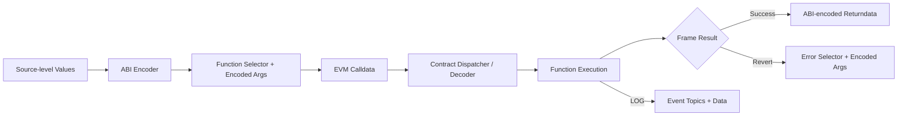
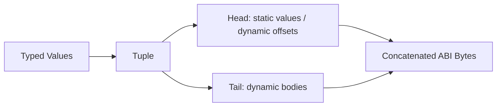
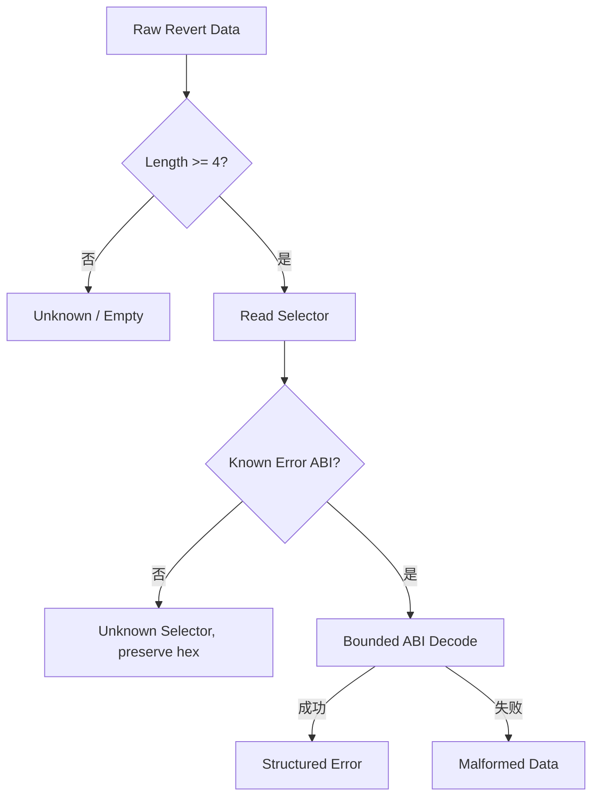

# EVM ABI：从 Function Selector、动态编码到 Event 与错误数据

> ABI 不是 Solidity 源码的序列化文件，而是调用方与合约之间的字节协议。Function Selector 只负责选择入口，标准 ABI Encoding 用 Head/Tail 表达参数，Event 把索引字段分配到 Topics，Revert 则复用类似编码承载错误；任何解码都必须同时知道类型，并把链上字节视为不可信输入。

---

## 一、本文解决什么问题

调用合约时，钱包最终发送的是 Calldata；读取结果时，客户端得到的是 Returndata；交易失败时，节点可能返回 Revert Data；订阅事件时，Indexer 看到 Topics 与 Data。这些字节都可能由 ABI 描述，却有不同外层结构：

- Function Selector 如何从函数签名生成？
- `uint`、`address`、`bytes32`、`string` 和数组如何编码？
- 动态参数中的 Offset 相对哪里计算？
- Tuple 与嵌套动态数组为何容易手写出错？
- Event Topic 0 与 Indexed Parameter 分别保存什么？
- 为什么 Indexed `string` 通常只能拿到 Hash，不能从 Log 还原原文？
- Custom Error 与 `Error(string)` 如何进入 Revert Data？
- `abi.encodePacked` 为什么可能产生碰撞歧义？
- 4 Byte Selector Collision 是否会调用错误函数？
- ABI JSON、Runtime Code 与链上行为之间是什么关系？

本文以 Solidity ABI Specification 的经典稳定规则为主。ABI 类型支持、编译器诊断、事件编码细节与工具行为可能随版本演进；生产系统应固定 Compiler、ABI Artifact、Runtime Code Hash、Chain ID 和 Contract Address，并以对应版本官方规范验证。

### 核心结论

1. ABI（Application Binary Interface）是类型驱动的字节交互约定；EVM 本身只处理字节，不知道函数名、Struct 名或 JSON ABI。
2. Function Selector 是规范函数签名 Keccak-256 Hash 的前 4 Byte；返回值编码不带 Function Selector。
3. 标准 ABI Encoding 以 32 Byte Word 为基础。静态值直接进入 Head，动态值在 Head 保存相对 Offset，实际内容进入 Tail。
4. Offset 相对于当前被编码 Tuple 的起始位置，而不是固定相对整笔交易或某个全局地址；嵌套编码必须逐层确定基准。
5. Tuple 是 ABI 参数列表、Struct 和多返回值的统一组合模型；Tuple 是否动态取决于其成员。
6. 非 Anonymous Event 的 `topics[0]` 通常是规范事件签名 Hash；后续 Topic 对应 Indexed 参数，非索引参数进入 Data。
7. Indexed 动态或复杂参数通常以特殊原地编码的 Hash 写入 Topic，适合过滤但不能直接恢复原始值。
8. Custom Error 的 Revert Data 由错误 Selector 与参数编码组成；`Error(string)`、`Panic(uint256)` 和空数据只是不同失败表现。
9. Revert Data 来自被调用方，可能被伪造、截断或恶意放大，不能把错误名称当成可信身份或授权证据。
10. Packed Encoding 省略标准 Padding/Offset 信息，多个动态值拼接可能产生相同字节；签名和 Hash 前必须消除歧义。
11. 4 Byte Selector 存在碰撞概率。代理、Facet 和路由器必须检测冲突，不能仅按函数名或 ABI 文件假设唯一。

---

## 二、ABI 在调用链中的位置



ABI 主要描述四类边界：

| 场景 | 外层结构 | 是否有 4 Byte Selector |
|---|---|---|
| 函数调用输入 | Selector + 参数编码 | 有，函数 Selector |
| 函数成功返回 | 返回值 Tuple 编码 | 无 |
| Revert Data | 错误 Selector + 参数编码，或其他字节 | 常见但不保证 |
| Event Log | Topics + Data | Topic 0 是 32 Byte Event Signature Hash，不是 4 Byte Selector |

JSON ABI 是给工具描述接口的 Artifact，不会作为 JSON 被 EVM 读取。链上 Runtime Code 可以实现与 JSON ABI 不一致的 Dispatcher；应把 ABI 与地址、Code Hash、版本绑定。

---

## 三、Canonical Type：编码从规范类型开始

Selector 和 Event Signature 使用 Canonical Signature，必须将类型写成规范形式：

- `uint` 规范为 `uint256`；
- `int` 规范为 `int256`；
- Struct 在签名中表示为其 Tuple 组件类型，而不是 Solidity Struct 名；
- 参数名、返回类型、可见性、Mutability 和空格不参与 Function Selector；
- Array 维度和 Tuple 嵌套必须完整保留。

例如：

```text
transfer(address,uint256)
```

而不是：

```text
transfer(address recipient, uint amount) returns (bool)
```

工具生成 Selector 时应使用 ABI 库的规范化能力，不应手工拼接包含别名、空格或 Struct 名的字符串。

---

## 四、Function Selector：4 Byte 入口标识

Function Selector 的经典计算方式是：

```text
selector = first4Bytes(keccak256(utf8(canonicalFunctionSignature)))
```

`transfer(address,uint256)` 的常见 Selector 为 `0xa9059cbb`。完整函数 Calldata 是：

```text
0xa9059cbb ++ abi.encode(recipient, amount)
```

### 4.1 Dispatcher 如何使用 Selector

典型 Runtime Code 读取 Calldata 前 4 Byte，与已知 Selector 比较后跳转到对应函数入口。具体 Dispatcher 结构由 Compiler、Optimizer、Fallback/Receive 和代码格式决定，不是 ABI 规范强制的唯一实现。

Calldata 少于 4 Byte、Selector 未命中或为空时，代码可能进入 Fallback、Receive 或 Revert，取决于合约实现。

### 4.2 返回值没有 Selector

调用方已知道调用了哪个函数，因此成功 Returndata 通常只编码返回值 Tuple。错误地把前 4 Byte 当成返回 Selector，会导致整体 Offset 错位。

### 4.3 Overload

重载函数名称相同，但参数规范类型不同，因此 Canonical Signature 和 Selector 通常不同。客户端不得只用函数名定位重载，应使用完整签名或强类型生成代码。

---

## 五、标准 ABI Encoding：32 Byte Word 与 Head/Tail

标准编码把参数列表看成一个 Tuple。每个 Head 位置占一个或多个 32 Byte Word：

- 静态成员直接编码在 Head；
- 动态成员的 Head 保存指向自身 Tail 的 Offset；
- Tail 保存动态成员内容，并按规则 Padding。



### 5.1 Word 对齐不等于所有类型都占满有效 32 Byte

`address`、`bool`、较小整数和定长 Bytes 会按各自规则放入 Word。整数的符号扩展、`bytesN` 的对齐方向等存在类型差异，不能统一用“左边补零”处理所有类型。

最可靠做法是使用经过验证的 ABI Codec，并用测试向量比对原始 Hex。

### 5.2 编码与解码都需要类型

同一 32 Byte 可以解释成 `uint256`、`address`、`bytes32` 或 Offset。字节本身不带 Schema；没有目标类型就无法唯一解码。

---

## 六、Static Type 与 Dynamic Type

ABI 中“静态/动态”描述编码大小能否仅由类型确定，不等同于 Solidity Value Type/Reference Type。

常见静态类型包括：

- `uint<M>`、`int<M>`、`address`、`bool`；
- `bytes<M>`（如 `bytes32`）；
- 元素静态且长度固定的 Fixed Array；
- 所有成员静态的 Tuple。

常见动态类型包括：

- `bytes`、`string`；
- Dynamic Array；
- 元素动态的 Fixed Array；
- 包含任一动态成员的 Tuple。

### 6.1 `bytes32` 与 `bytes` 不同

`bytes32` 是静态类型，内容直接位于 Head；`bytes` 是动态类型，Head 保存 Offset，Tail 保存 Length 与内容。二者即使有效内容相同，标准编码结构也不同。

### 6.2 `string` 是 UTF-8 字节语义

ABI 对 `string` 编码其 UTF-8 字节长度与内容。长度是 Byte 数，不是 Unicode 字符数。前端按 JavaScript 字符串长度分配缓冲会在多字节字符上出错。

---

## 七、动态值：Offset、Length 与 Padding

以函数参数 Tuple `(uint256 id, string name)` 为例，去掉 Function Selector 后的概念编码为：

```text
Head word 0: id
Head word 1: 0x40          // name Tail 相对 Tuple 起点的 Offset
Tail word 0: byteLength(name)
Tail words : UTF-8 bytes(name), padded to 32-byte boundary
```

因为 Head 有两个 Word，共 64 Byte，所以首个动态 Tail 从 `0x40` 开始。

### 7.1 Offset 的基准

Offset 相对于包含该动态成员的当前 Tuple 编码起点。对顶层函数参数，它通常相对于 Selector 之后的参数区域，而不是相对于包含 Selector 的整个 Calldata。

嵌套 Tuple、动态数组中的动态元素还会产生各自局部 Offset 基准。手写 Encoder 最常见错误就是把 Offset 当成绝对字节位置。

### 7.2 Dynamic Array

动态数组通常先编码元素数量，再编码元素序列。若元素本身动态，数组元素区会包含 Offset，再指向各自 Tail。Fixed Array 不写运行时长度，但若元素动态，整体仍是动态类型。

### 7.3 解码安全

Decoder 必须检查：

- Offset 与 Length 是否在输入范围内；
- 加法、乘法和向上对齐是否溢出；
- 动态区域是否符合目标类型；
- 数组大小是否超过业务上限；
- 是否允许非规范但可解码的 Padding。

链上 Solidity Decoder 通常会执行必要检查；链下手写 Decoder、Indexer 与跨链证明解析器必须自行保证边界安全。

---

## 八、Tuple：ABI 的组合基础

ABI 把函数参数列表、多返回值和 Struct 都表达为 Tuple。JSON ABI 中 Struct 参数通常使用 `type: "tuple"`，并通过 `components` 描述成员。

```json
{
  "name": "order",
  "type": "tuple",
  "components": [
    { "name": "maker", "type": "address" },
    { "name": "amount", "type": "uint256" },
    { "name": "memo", "type": "string" }
  ]
}
```

这个 Tuple 因含 `string` 而是动态类型。它出现在更外层 Tuple 时，外层 Head 保存指向整个 Order 编码的 Offset；Order 内部再拥有自己的 Head/Tail。

### 8.1 参数名不进入字节

`maker`、`amount`、`memo` 仅帮助工具映射字段，编码只由顺序和类型决定。重排 JSON ABI Components 即改变解码语义，即使字段名仍相同。

### 8.2 返回 Tuple

多返回值按 Tuple 编码，不带函数 Selector。调用方必须使用与部署版本匹配的返回类型，否则可能解码失败，或更危险地解码为结构合法但语义错误的数据。

---

## 九、Event Topic：过滤索引与数据承载

EVM Log 包含发出地址、0 到 4 个 Topics 和 Data。对常见非 Anonymous Solidity Event：

```solidity
event Transfer(address indexed from, address indexed to, uint256 value);
```

通常映射为：

```text
topics[0] = keccak256("Transfer(address,address,uint256)")
topics[1] = encoded indexed from
topics[2] = encoded indexed to
data      = abi.encode(value)
```

Event Signature Topic 是完整 32 Byte Hash，不是 Function Selector 的前 4 Byte。

### 9.1 Anonymous Event

Anonymous Event 不自动把事件签名放入 `topics[0]`，因此可使用更多 Topic 存放 Indexed 参数，但失去默认签名识别。Indexer 必须依赖地址、Topic 布局和已知 ABI 解析，冲突风险更高。

### 9.2 Event Overload

事件同样可以重载。只按事件名过滤不够，必须使用完整 Canonical Event Signature Hash，并绑定合约地址与 Code 版本。

---

## 十、Indexed Parameter：可过滤不等于可还原

Indexed 参数进入 Topic，但编码取决于类型：

- 适合直接放入一个 32 Byte Word 的值按 Topic 规则编码；
- 数组、`string`、`bytes`、Tuple 等动态或复杂值通常把特殊原地编码的 Keccak-256 Hash 放入 Topic。

因此 Indexed `string` 的 Topic 只能用于已知候选值的 Hash 匹配，无法从 Hash 反推出原文。

### 10.1 双字段模式

若既要按动态值过滤，又要从 Log 读取原文，可同时记录：

```solidity
event DocumentPublished(
    bytes32 indexed contentHash,
    string uri
);
```

Hash 用于索引和完整性关联，原始 URI 放在 Data。重复记录增加 Gas，应由查询需求决定。

### 10.2 Topic 不是 Storage

Topic 只存在于 Receipt Log，合约无法通用回读历史 Topic。业务状态仍需 Storage；Indexer 还必须处理 Reorg、Removed Log、分页回填和 ABI 版本。

---

## 十一、Custom Error：类型化的失败载荷

Solidity Custom Error 示例：

```solidity
error InsufficientBalance(address account, uint256 available, uint256 required);

function withdraw(uint256 amount) external {
    uint256 available = balances[msg.sender];
    if (available < amount) {
        revert InsufficientBalance(msg.sender, available, amount);
    }
}
```

概念上的 Revert Data 为：

```text
first4Bytes(keccak256("InsufficientBalance(address,uint256,uint256)"))
++ abi.encode(account, available, required)
```

Custom Error 通常比长字符串更紧凑，也让客户端按类型和字段处理，但它仍不是可信来源证明。

### 11.1 Error Selector 也会碰撞

错误 Selector 同样只有 4 Byte。外部合约可以刻意返回与目标 Custom Error 相同的字节。捕获错误时可以改善 UX 或控制预期分支，但不能仅凭 Selector 授予权限、结算资产或证明某合约真的执行了某条路径。

### 11.2 `try/catch` 的边界

高级语言 Catch 能分类部分错误形态，但空数据、畸形数据、Out of Gas 和 Decoder 自身失败仍需兜底。跨 Provider 的 RPC 错误包裹结构也不统一，应尽可能提取原始 Revert Data 再解码。

---

## 十二、Revert Reason：失败数据不只有字符串

常见失败数据形态包括：

| 形态 | 常见来源 | 数据特征 |
|---|---|---|
| `Error(string)` | `revert("...")`、`require` 文案 | Selector `0x08c379a0` + String 编码 |
| `Panic(uint256)` | Solidity 内部 Panic | Selector `0x4e487b71` + Panic Code |
| Custom Error | `revert MyError(...)` | 自定义 4 Byte Selector + 参数 |
| 空数据 | OOG、无数据 Revert、调用路径差异 | `0x` |
| 任意字节 | Assembly 或恶意目标 | 无可信 Schema |

具体 Compiler 生成行为应以版本为准。Panic Code 应使用对应 Compiler 文档解释，不能把所有 Panic 都翻译成“算术溢出”。

### 12.1 安全解码流程



UI 应使用本地可信文案映射错误类型，将不可信字符串转义并限制长度。日志保留 Selector 与受控长度的 Hash/Hex，避免大数据和隐私泄露。

---

## 十三、Packed Encoding：紧凑但会丢失边界

`abi.encodePacked` 使用非标准紧凑编码，省略很多 32 Byte Padding、Length 和 Offset 信息。它适合明确、无歧义的字节协议，却不适合作为通用可逆序列化格式。

经典歧义示例：

```solidity
keccak256(abi.encodePacked("ab", "c"))
    == keccak256(abi.encodePacked("a", "bc"));
```

两组动态字符串都拼成字节 `abc`。如果 Hash 用于签名、唯一 ID 或权限证明，攻击者可能构造不同字段得到相同消息字节。

### 13.1 修复方式

优先使用：

```solidity
keccak256(abi.encode(domain, account, nonce, payload));
```

标准编码保留类型边界。若协议必须 Packed，应保证最多一个动态字段，或显式加入不可歧义的 Length/Domain/Type Tag，并给出跨语言测试向量。

### 13.2 Packed 与标准 ABI 不可混解

`abi.decode` 面向标准 ABI Encoding，不能通用恢复 Packed 的动态边界。链下库中的 `solidityPacked`、紧凑签名格式和标准 Encoder 也不能混用。

### 13.3 Domain Separation

即使字段边界明确，签名 Hash 仍应绑定协议名、版本、Chain ID、验证合约、消息类型和 Nonce/Deadline 等域信息。ABI 无歧义不等于消息不能跨链或跨合约重放。

---

## 十四、Selector Collision：4 Byte 空间不是唯一命名空间

Function Selector 只有 32 bit，不同 Canonical Signature 可能得到相同前 4 Byte。随着接口数量增加，碰撞风险会按生日悖论增长。

### 14.1 普通合约

编译器通常会拒绝同一合约可见函数之间的冲突，但具体诊断取决于工具版本。外部系统不能据此假设全局不存在碰撞：另一个合约完全可能使用相同 Selector 表示不同函数。

### 14.2 Proxy Collision

代理自身管理函数与实现函数可能共享 Selector。透明代理等模式通过 Caller/管理边界减少冲突影响，但使用方式必须遵循具体标准；随意向代理添加函数会破坏路由语义。

### 14.3 Diamond/Router

多 Facet 路由器通常维护 `selector -> implementation` 映射。升级时必须检测：

- 新 Selector 是否已注册；
- 替换与删除是否符合治理意图；
- ABI Artifact 是否与映射一致；
- 相同函数名的 Overload 是否路由正确；
- Fallback 对未知 Selector 如何处理。

### 14.4 错误与事件的碰撞边界

Custom Error 使用 4 Byte Selector，也可能碰撞；Event Signature 使用完整 32 Byte Topic，碰撞空间不同。不能把 Function Selector、Error Selector 与 Event Topic 混为同一种长度。

---

## 十五、ABI Versioning 与升级治理

ABI 没有自动协商版本。代理地址不变但实现升级后，方法、返回类型、Event 和 Error 都可能变化。

### 15.1 兼容与不兼容变化

新增独立函数通常不会改变旧 Selector，但仍可能碰撞。改变参数类型会生成新 Selector，相当于新入口；仅改变返回类型不会改变 Function Selector，却会让旧客户端错误解码，这是尤其危险的兼容性变化。

Event 参数顺序、Indexed 标记或类型变化会改变 Topic/Data 布局。应定义新 Event 名称或版本，而不是让同名消费逻辑静默误读。

### 15.2 Artifact Registry

生产系统应将 ABI 与以下信息绑定：

- Chain ID；
- Contract/Proxy Address；
- 生效 Block Range；
- Implementation Address 与 Code Hash；
- Compiler/Build Artifact；
- Storage Layout 与发布版本。

Indexer 按 Log 所在 Block 选择 ABI，而不是总用“当前最新 ABI”回放历史。

---

## 十六、TypeScript 工程示例

实际项目应使用成熟库编码和解码，并保留大整数：

```ts
type TransferInput = {
  recipient: `0x${string}`;
  amount: bigint;
};

function assertTransferInput(input: TransferInput): void {
  if (!/^0x[0-9a-fA-F]{40}$/.test(input.recipient)) {
    throw new Error("Invalid recipient address");
  }
  if (input.amount < 0n) {
    throw new Error("Amount must be non-negative");
  }
}
```

ABI Codec 解决字节布局，不解决业务校验。`address` 长度正确不代表网络、合约或 Token 正确；`uint256` 可编码不代表金额符合业务范围。

### 16.1 解码返回值

解码前至少验证：

- 使用的 ABI 与目标 Code 版本匹配；
- RPC 读取固定到预期 Block；
- 返回 Hex 格式和大小受控；
- 大整数不转成 JavaScript `number`；
- 空数据按“无 Code、Fallback、失败包装或不兼容”分类处理。

### 16.2 生成类型优于字符串调用

从固定 Artifact 生成 TypeScript 类型可减少函数名、Overload 和 Tuple 字段错误，但生成代码不会验证链上地址是否部署了对应 Code。启动时仍应检查 Chain Configuration 与 Code Hash。

---

## 十七、常见误区与错误案例

### 17.1 ABI 存在链上，节点会自动验证

错误。EVM 只运行 Bytecode。JSON ABI 通常由构建、验证服务或应用保存，可能与链上 Code 不一致。

### 17.2 Selector 包含返回类型

错误。Function Selector 只使用函数名和输入参数规范类型。改变返回类型不会改变 Selector，却可能破坏客户端解码。

### 17.3 所有参数都直接放在 32 Byte Head

错误。动态参数 Head 放 Offset，内容在 Tail；嵌套动态结构还有逐层 Offset。

### 17.4 Indexed `string` 可从 Topic 直接解码

错误。Topic 通常保存其特殊编码 Hash，只能用已知候选值重新计算后匹配。

### 17.5 Revert String 是可信后端消息

错误。被调用方可返回任意字节或伪造已知错误。UI 应映射可信文案，不能直接执行或信任错误内容。

### 17.6 `abi.encodePacked` 只是更省 Gas 的 `abi.encode`

错误。Packed 会丢失边界，通常不可逆，并可能在多个动态字段上产生歧义碰撞。

### 17.7 4 Byte Selector 全局唯一

错误。不同签名可碰撞，代理和路由器升级必须显式检查。

### 17.8 Event Topic 0 就是 4 Byte Selector

错误。常见非 Anonymous Event 的 Topic 0 是完整 32 Byte Event Signature Hash。

---

## 十八、测试与验证方法

### 18.1 Golden Vector

为每个公共接口保存跨语言测试向量：

- Canonical Signature 与 Selector；
- 输入类型、值和完整 Calldata；
- 成功 Returndata；
- Event Topics/Data；
- Custom Error Revert Data；
- 边界大整数、空值和 Unicode 字符串。

至少用两种独立成熟实现交叉验证，避免同一错误 Encoder 与 Decoder 自洽。

### 18.2 Dynamic/Nested Matrix

覆盖静态 Tuple、含一个动态成员、多个动态成员、嵌套 Tuple、动态元素数组、固定长度动态元素数组、空数组、空 String 与最大业务长度。

### 18.3 Fuzz 与恶意输入

对 Decoder 输入随机截断、Offset 越界、Length 溢出、重叠 Tail、非规范 Padding、超大数组、未知 Selector 和恶意 Revert Data。断言系统有限失败，不产生无界内存或错误业务状态。

### 18.4 Collision Scan

CI 收集代理、实现、Facet、Error 的所有 Selector，检测重复并输出 Canonical Signature。Event 则按完整 Topic 与 Indexed Layout 比较。升级 PR 必须展示新增、替换和删除的接口差异。

### 18.5 链上对账

部署后在固定 Block Hash 上验证 Runtime Code Hash，用实际 `eth_call` 对 Golden Calldata/Returndata，并发送测试交易核对 Receipt Log。仅通过本地编译测试不足以证明目标地址接口正确。

---

## 十九、总结

ABI 的关键不是背诵 Padding，而是保持类型、偏移基准和外层载体一致：

1. Function Selector 来自规范输入签名的 Keccak-256 前 4 Byte，不包含返回类型。
2. 标准编码把参数视为 Tuple，静态值进入 Head，动态值以 Offset 指向 Tail。
3. Tuple、数组和嵌套动态值的 Offset 必须相对当前编码容器计算。
4. Event Signature 使用完整 Topic，Indexed 动态值通常只能通过 Hash 匹配。
5. Custom Error 与 Revert Reason 都是不可信字节，应有限解码并保留 Unknown 分支。
6. Packed Encoding 会丢失边界，签名和 Hash 场景应优先使用标准编码与 Domain Separation。
7. Selector 可能碰撞，代理、路由器和升级流程必须自动扫描。
8. ABI 必须与 Chain、Address、Block Range 和 Code Hash 版本化绑定，才能可靠解码历史与当前数据。

---

## 问答复盘

### Q1：Function Selector 的输入是否包含返回类型？

**答：** 不包含。它只 Hash 函数名与输入参数的 Canonical Types；因此只改变返回类型不会改变 Selector，却会破坏旧客户端解码。

### Q2：动态参数 Head 中保存的是什么？

**答：** 保存指向动态内容 Tail 的相对 Offset。Offset 基准是当前被编码 Tuple 的起点，不是全局 Calldata 起点。

### Q3：`bytes32` 与 `bytes` 的编码为何不同？

**答：** `bytes32` 是静态类型，直接占 Head Word；`bytes` 是动态类型，Head 保存 Offset，Tail 保存 Length、内容和 Padding。

### Q4：Struct 名称会写入 ABI 字节吗？

**答：** 不会。Struct 以 Tuple 组件的类型和顺序编码，字段名主要存在于 JSON ABI 供工具使用。

### Q5：Indexed `string` 为什么不能从 Event Topic 还原？

**答：** Topic 通常保存该动态值特殊原地编码的 Keccak-256 Hash。Hash 不可逆，只能对已知候选重新计算并匹配。

### Q6：看到已知 Custom Error Selector，能否证明错误来自目标合约？

**答：** 不能。任意被调用方都可构造相同字节，错误 Selector 还可能碰撞；它只适合解码提示，不是身份或授权证据。

### Q7：什么时候 `abi.encodePacked` 会有歧义风险？

**答：** 多个动态字段相邻时尤其危险，因为缺少 Length/Offset 后不同字段分割可产生相同字节。应改用 `abi.encode` 或显式无歧义分隔。

### Q8：Function Selector Collision 对代理有什么影响？

**答：** 代理管理函数可能截获本应委托给实现的 Selector。必须采用明确代理模式，并在每次升级扫描代理、实现和 Facet 的全部 Selector。

### Q9：如何验证链下 ABI 编码实现正确？

**答：** 保存 Canonical Signature、完整 Hex 和边界值 Golden Vector，用独立实现交叉验证，再对固定 Code Hash 的链上合约执行调用与日志对账。

---

## 延伸知识

- **EIP-712**：Typed Structured Data、Domain Separator 与签名重放边界。
- **代理 ABI 治理**：Selector 路由、实现版本、Block Range 与 Artifact Registry。
- **Event Indexer**：Topic Filter、Backfill、Removed Log 与 ABI Versioning。
- **Calldata 优化**：标准 ABI、Custom Codec、Compression 与 Rollup Data Fee。
- **跨链消息编码**：Domain Separation、Canonical Serialization 与 Decoder 安全。
