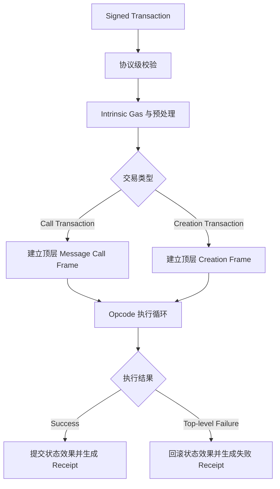
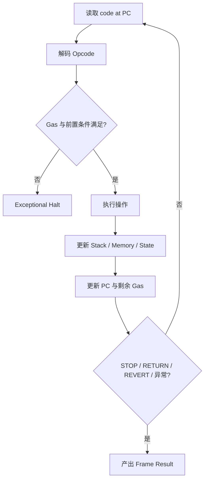
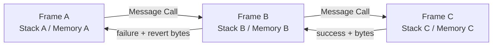
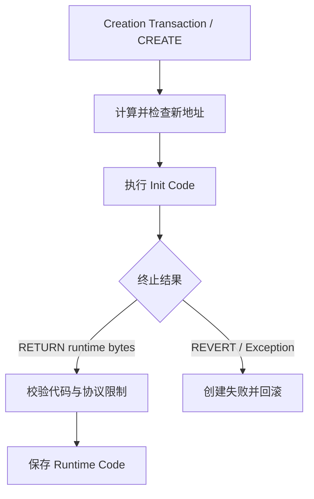
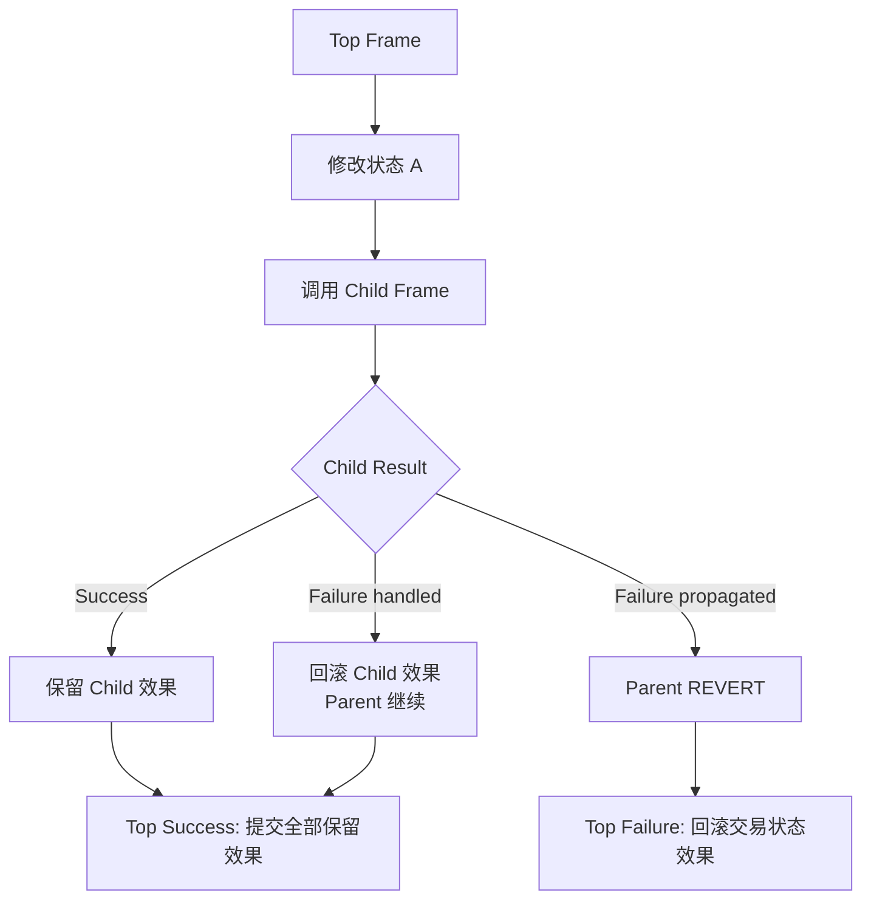

# EVM 执行模型：从栈式字节码、调用帧到交易原子性

> EVM 不是“逐行运行 Solidity”的黑盒。执行客户端先建立顶层执行环境，再按 Program Counter 解释字节码；每次外部消息调用或合约创建产生新的执行帧，帧通过成功标志与返回数据向上层交付结果，而状态变更能否保留取决于异常边界是否被调用方处理。

---

## 一、本文解决什么问题

阅读 Solidity、反编译字节码或调试交易 Trace 时，经常遇到这些问题：

- 为什么 EVM 被称为 Stack Machine，而 Solidity 变量并不都在栈上？
- Opcode 与 Bytecode 是什么关系，Program Counter 如何移动？
- 一笔交易只有一个 Call Frame 吗？
- Message Call 是否一定调用合约函数？
- 合约部署时执行的是 Init Code 还是最终 Runtime Code？
- `RETURN` 和 `REVERT` 都能携带字节，它们的状态效果有何不同？
- 内层调用 Revert 为什么有时不会让整笔交易失败？
- 交易失败后 Gas、Log、余额和 Storage 分别如何处理？
- `msg.sender`、`msg.value`、代码地址和状态地址属于哪个上下文？

本文聚焦 EVM 的执行骨架。Opcode 定价、启用集合、合约创建规则和执行环境字段会随 Fork 演进；EOF 等演进也可能改变代码验证与容器规则。分析具体交易时，应固定 Chain ID、Fork、Block Hash、交易字节和客户端版本。

### 核心结论

1. EVM 是确定性的 256-bit Stack Machine；字节码由 Opcode 与其立即数据组成，但 Stack 只是多个数据区域之一。
2. Program Counter（PC）是当前执行帧内的字节码偏移。普通 Opcode 后移，`PUSHn` 跳过立即数据，合法跳转会重设 PC。
3. Call Frame 是一次调用或创建的局部执行实例，持有 PC、Stack、Memory、Gas、输入、返回缓冲和执行上下文；调用帧之间不共享 Stack 与 Memory。
4. Message Call 在账户之间传递调用语义，可转移 Value 并在目标代码存在时执行代码；没有代码不等于所有路径都无副作用。
5. Contract Creation 执行 Init Code；Init Code 成功返回的字节才成为 Runtime Code。构造阶段返回值与普通函数返回值语义不同。
6. `RETURN` 成功结束当前帧并返回字节；`REVERT` 失败结束当前帧、回滚该帧及其子帧的状态效果，并返回错误数据。
7. 内层帧失败不必然导致顶层交易失败。调用 Opcode 把成功标志交给父帧，父帧可以处理失败，也可以继续向上 Revert。
8. 交易原子性指未被处理并传播到顶层的失败会撤销交易的持久状态效果；Gas 消耗仍被计费，Receipt 也仍可记录失败。
9. Execution Context 决定当前代码观察到的 Caller、Address、Value、Input、Block Environment 和静态限制；代码地址与状态上下文在特殊调用语义下不一定相同。
10. EVM 确定性不代表执行结果与时间无关：给定相同前状态、区块环境和输入才应得到相同结果。

---

## 二、从交易到 EVM 执行



交易进入 EVM 前，执行客户端还要完成签名、Nonce、Intrinsic Gas、余额和费用等协议校验。EVM 执行不是整条交易处理链的全部。

顶层调用与内部调用也不同：顶层来自交易，内部调用由执行中的 Opcode 产生。二者共享同一笔交易的全局状态变更集合和 Gas 预算来源，但具有不同调用帧。

---

## 三、Stack Machine：以栈为主要操作数通道

EVM 的基础字长是 256 bit，适合 Ethereum 的 Hash、Address、整数与 Storage Slot 运算。大多数 Opcode 从 Stack 顶部弹出操作数，再压入结果。

以概念字节码为例：

```text
PUSH1 0x02
PUSH1 0x03
ADD
```

执行后的 Stack 顶部为 `5`。注意操作数弹出顺序对 `SUB`、`DIV`、比较、Memory/Storage 写入等指令很重要，不能仅凭源码阅读顺序推断。

### 3.1 Stack 不是全部状态

每个调用帧至少还涉及：

- Memory：帧内、易失、按字节寻址；
- Calldata/Input：当前调用的只读输入；
- Returndata Buffer：最近一次外部调用的返回字节；
- Code：当前执行的字节码；
- Gas：该帧剩余执行预算；
- World State：账户、余额、Storage 等交易级状态视图；
- Substate：Log、Refund 等需要随成功或回滚处理的效果。

Stack 与 Memory 在进入新帧时隔离，子帧不能直接读取父帧的 Stack。跨帧传参通常要由调用 Opcode 指定父 Memory 中的输入区间，再把返回字节复制回父 Memory。

### 3.2 Stack 边界

经典 EVM Stack 最大深度为 1024 项。弹出不足会 Stack Underflow，压入超过上限会 Stack Overflow，都会异常终止当前帧。高级语言编译器通常管理这些约束，但手写汇编、复杂表达式和反编译分析仍需关注栈高度。

---

## 四、Opcode 与执行循环

Opcode 是一个字节的操作码；某些指令后跟立即数据，例如 `PUSH1` 到 `PUSH32`。Bytecode 是 Opcode 和数据的字节序列，不是 Solidity 源码的逐行保存。



Opcode 可粗略分为：

- 算术、位运算和比较；
- Stack、Memory、Calldata 与 Returndata 操作；
- 环境信息读取；
- Storage 与状态访问；
- 控制流；
- Log；
- Message Call 与 Contract Creation；
- 正常、回滚或异常终止。

Opcode 的确切 Gas Cost、可用性和状态访问冷热规则属于 Fork 规则。不能把某个旧版本 Gas 表当作永久常量。

### 4.1 无效指令与异常终止

无效 Opcode、Stack 错误、非法跳转、静态上下文中的禁用状态变更、Out of Gas 等会造成 Exceptional Halt。它通常与显式 `REVERT` 不同：后者可携带 Revert Data，并按协议保留未消耗 Gas 返回父帧；异常终止通常不会提供业务错误数据，当前帧可用 Gas 的处理也不同。

---

## 五、Program Counter：帧内控制流坐标

Program Counter 指向当前帧 Code 中待执行 Opcode 的字节偏移。它不是“第几个 Solidity 语句”，也不是交易全局计数器。

PC 更新规则可以概括为：

1. 普通单字节 Opcode 执行后移向下一字节；
2. `PUSHn` 执行后越过 Opcode 与其后 `n` 字节立即数据；
3. 跳转指令在条件满足且目标合法时，把 PC 设为目标；
4. 进入子调用时，新帧从目标 Code 的入口开始维护自己的 PC；
5. 子帧结束后，父帧从调用 Opcode 之后继续。

### 5.1 为什么反汇编必须识别 PUSH Data

PUSH 后面的数据字节即使数值恰好等于某个 Opcode，也不能当成指令执行。静态反汇编若不先解析指令边界，会生成错误控制流图。

### 5.2 Jump Destination

经典 Legacy Bytecode 的动态跳转目标必须满足协议规定，例如目标需要落在有效 `JUMPDEST` 上，而不能落进 PUSH Data。具体代码格式的验证方式可能随 EVM 对象格式演进，因此工具应按目标 Code Format 和 Fork 分析。

---

## 六、Call Frame：一次调用的局部执行单元

Call Frame 可以理解为 EVM 的一次局部执行上下文。概念上包含：

| 字段 | 作用 |
|---|---|
| Code 与 PC | 决定执行哪段指令及当前位置 |
| Stack | Opcode 的 256-bit 操作数 |
| Memory | 当前帧临时字节空间 |
| Input Data | 当前调用只读输入 |
| Return Data Buffer | 最近子调用返回数据 |
| Gas | 当前帧可用执行预算 |
| Address/Caller/Value | 调用语义与状态归属 |
| Static Flag | 是否禁止状态变更 |

这是一种协议语义模型，不等于某个客户端源码中的具体类名或内存布局。



### 6.1 父子帧如何通信

父帧发起调用时指定目标、Gas、Value 及输入/输出 Memory 区间。子帧结束后向父帧返回：

- 成功或失败状态；
- 返回或 Revert 字节；
- 剩余 Gas（按终止类型与协议规则）；
- 可提交或需要撤销的状态效果。

父帧得到的是调用 Opcode 的结果，不会自动获得 Solidity 异常。高级语言编译器会把低级结果转换成外部调用、`try/catch` 或低级 `call` 的语义。

### 6.2 调用深度与资源边界

协议限制调用深度，且每层调用还受 Gas Forwarding 影响。即使未触及深度上限，Gas 也常先成为边界。具体限制和转发规则应按目标 Fork 查验；合约不应依赖“总能再调用一层”。

---

## 七、Message Call：账户间的执行消息

Message Call 不是一笔新交易。它发生在同一交易执行过程中，由调用类 Opcode 建立子帧。

一次调用通常需要确定：

- 目标账户；
- 执行代码与状态归属；
- Caller 与当前 Address；
- Value；
- Input Data；
- 转发 Gas；
- 是否处于 Static Context。

若目标没有 Runtime Code，调用可能仍然成功，并可能发生协议允许的 Value 转移；因此“地址没有代码”不等于调用绝对无副作用。预编译合约、账户模型演进和特定 Fork 规则也要求避免过时的二分简化。

### 7.1 高级调用与低级调用

Solidity 高级外部调用通常会在失败时向上冒泡异常；低级 `call` 返回 `(success, returndata)`，调用方必须检查 `success`。忽略它是典型安全错误：业务可能继续执行并提交，而关键子操作已经失败。

```solidity
(bool success, bytes memory result) = target.call(payload);
if (!success) {
    assembly {
        revert(add(result, 0x20), mload(result))
    }
}
```

该示例把子调用 Revert Data 原样向上冒泡。生产代码还要限制目标、处理空错误数据，并评估 Reentrancy；不能因为检查了 `success` 就认为调用安全。

---

## 八、Contract Creation：执行 Init Code 产生 Runtime Code

合约创建不是“把 Solidity 编译结果原样存到账户”。创建帧执行 Init Code，成功返回的字节才被部署为 Runtime Code。



Init Code 通常负责：

1. 解析构造参数；
2. 执行构造逻辑；
3. 初始化新账户的 Storage；
4. 生成并 `RETURN` Runtime Code。

### 8.1 两种 Return Data 不要混淆

普通 Message Call 的 `RETURN` 字节交给调用方；创建帧的成功返回字节用于形成新合约 Runtime Code。构造函数在高级语言层面“没有返回值”，不代表 Init Code 不执行 `RETURN`。

### 8.2 创建失败

构造逻辑 Revert、Out of Gas、返回代码违反当前 Fork 限制、地址冲突或其他协议条件都可能导致创建失败。内部 `CREATE`/`CREATE2` 会把结果交给父帧，父帧是否继续取决于代码处理；顶层创建失败则产生失败交易结果，持久状态效果回滚但 Gas 仍结算。

地址推导、`CREATE2` Salt 与碰撞规则属于调用语义模块，本篇不展开。

---

## 九、Return Data 与 Revert Data

Return Data 是子帧结束时交给父帧的任意字节序列。EVM 本身不要求它必须符合 Solidity ABI。

| 终止方式 | 帧结果 | 数据 | 当前帧状态效果 |
|---|---|---|---|
| `STOP` | Success | 通常为空 | 可提交 |
| `RETURN` | Success | 返回指定 Memory 区间 | 可提交 |
| `REVERT` | Failure | 返回指定 Memory 区间 | 回滚 |
| Exceptional Halt | Failure | 通常无业务数据 | 回滚 |

### 9.1 Returndata Buffer

父帧执行外部调用后，可读取最近一次调用产生的返回数据。该缓冲属于父帧当前执行过程，会被后续调用结果替换；代码必须在正确时机检查大小并复制数据。

### 9.2 Revert Data 不是可信文本

Revert Data 可编码 `Error(string)`、`Panic(uint256)`、Custom Error，也可以是任意恶意字节。前端或合约不能直接把未经验证的数据当作可信 UI 文案，更不能只匹配 Provider 拼接的错误字符串。

### 9.3 返回数据也可能造成资源压力

恶意目标可以返回超大数据。调用方复制 Returndata 会产生 Memory Expansion 和 Gas 成本。工程上应限制外部返回数据的处理规模，并避免无界解码。

---

## 十、Execution Context：代码看到的“当前世界”

执行结果不仅由 Bytecode 与 Calldata 决定，还依赖完整 Execution Context：

- 当前执行代码；
- 当前账户/状态上下文；
- Caller、Origin 与 Value；
- Input Data；
- 当前区块环境，如 Number、Timestamp、Base Fee 等；
- 交易环境，如 Gas Price 语义；
- Static Flag；
- 当前 World State 与访问记录；
- 剩余 Gas 和调用深度。

### 10.1 确定性的准确含义

EVM 确定性指：在相同协议版本、前状态、区块环境和输入下，正确实现应得到相同状态转换结果。它不意味着同一 `eth_call` 在不同 `latest` 时刻返回相同值。

### 10.2 代码地址与状态地址可能分离

普通调用通常在目标账户上下文执行目标代码；特殊调用语义可能执行另一个地址的代码，却读写当前上下文的 Storage，并改变 `msg.sender`/`msg.value` 继承方式。这里是理解代理合约的入口，具体 `CALL`、`STATICCALL`、`DELEGATECALL` 差异留给调用语义模块。

### 10.3 静态上下文会向下传播

一旦进入 Static Context，后续子调用也不能通过绕行方式进行受禁止的状态修改。违反静态限制会使相应帧异常失败。`view` 是语言级约束与编译器表达，真正的运行时边界要结合调用 Opcode 与执行上下文理解。

---

## 十一、Transaction Atomicity：原子性发生在哪个边界

“交易要么全部成功，要么全部失败”是有用但不完整的简化。



### 11.1 帧级回滚

子帧 `REVERT` 或异常终止时，该子帧及其成功子孙帧产生的状态修改、Value 转移和 Log 都会撤销到进入该帧前的检查点。父帧之前的修改仍可保留，前提是父帧处理失败并最终成功。

### 11.2 顶层失败

失败传播到顶层后，整笔交易的持久状态效果回滚，包括执行期间写入的 Storage、余额转移和 Log。交易本身仍会被区块收录，Nonce 与费用结算遵循协议规则，Receipt 会记录失败。因此“状态回滚”等于“没发生任何事”是错误的。

### 11.3 外部世界不在原子事务内

EVM 无法直接撤销链下系统已经采取的动作。服务不能看到 Pending 事件或一次模拟结果就发货；应等待业务要求的最终性，并让链下消费者幂等、可补偿、可处理重组。

### 11.4 捕获失败会改变业务原子边界

```solidity
function settle(address optionalHook) external {
    balances[msg.sender] = 0;

    try IHook(optionalHook).afterSettle(msg.sender) {
        emit HookSucceeded(optionalHook);
    } catch {
        emit HookFailed(optionalHook);
    }
}
```

此代码把 Hook 定义为可选步骤：Hook 失败会回滚 Hook 自己的效果，但 `balances` 修改仍可能提交。这不是 EVM 破坏原子性，而是合约主动把失败限制在子帧。若 Hook 是结算必要条件，就不应吞掉异常。

---

## 十二、异常、Gas 与状态的关系

| 场景 | 当前帧成功 | 状态效果 | 剩余 Gas | 错误数据 |
|---|---|---|---|---|
| `RETURN` | 是 | 可提交 | 返回父帧 | 可有 |
| `REVERT` | 否 | 当前帧回滚 | 按规则返回父帧 | 可有 |
| Out of Gas | 否 | 当前帧回滚 | 当前帧通常耗尽 | 通常无业务数据 |
| 父帧捕获子失败 | 父帧可成功 | 子帧回滚，父帧可继续 | 取决于终止类型 | 父帧可读取 |
| 失败传播至顶层 | 否 | 交易执行效果回滚 | 已消耗部分计费 | Receipt 记录失败 |

具体 Gas 转发、Stipend、Refund 和 Opcode Cost 属于 Fork 相关规则。稳定结论是：状态回滚不会退还已经消耗的计算资源费用，否则攻击者可免费制造昂贵失败执行。

---

## 十三、从 Trace 还原执行模型

Receipt 只给出顶层状态、Gas Used、Logs 等摘要，不能展示内部帧。调试复杂调用通常需要客户端 Debug/Trace 能力或模拟服务。

分析 Trace 时建议按以下顺序：

1. 固定 Chain、Block Hash、Transaction Hash 与客户端版本；
2. 定位顶层交易类型和执行环境；
3. 建立调用树，记录每帧 Call Type、From、To、Value、Input 与 Gas；
4. 找到第一个实际失败帧，而不是只看最外层错误；
5. 解码 Return/Revert Data，但保留原始字节；
6. 检查父帧是冒泡、捕获还是忽略失败；
7. 对照状态差异、Log 与 Gas，验证哪些效果最终提交。

Trace API 不是统一的核心 JSON-RPC 契约。方法名、Tracer、字段和资源限制因客户端与 Provider 而异，生产诊断工具需要适配层与超时保护。

### 13.1 一个简化调用树

```text
TX -> Router.swap()
  CALL Token.transferFrom()       SUCCESS
  CALL Pool.swap()
    CALL Token.transfer()         REVERT InsufficientBalance()
  Pool.swap()                     REVERT bubbled
Router.swap()                     REVERT bubbled
TX                                FAILED
```

若 Router 使用低级调用并忽略 `success`，顶层可能反而显示成功。这正是为什么审计不能只看 Receipt Status，还要验证预期状态与事件。

---

## 十四、常见误区与错误案例

### 14.1 EVM Stack 等于 Solidity 调用栈

错误。Operand Stack 是每个帧内的操作数结构；Call Frame Stack 表示嵌套调用层级，两者不是同一个栈。

### 14.2 PC 指向 Solidity 源码行

错误。PC 是字节码偏移。Source Map 才能把 Bytecode 区间近似映射回源文件位置，优化后映射还会更复杂。

### 14.3 合约部署直接保存 Init Code

错误。Init Code 只在创建阶段执行，其成功 `RETURN` 的字节成为 Runtime Code。

### 14.4 子调用 Revert 必然导致整笔交易失败

错误。父帧可以检查失败并继续；只有失败被冒泡到顶层，顶层交易才失败。

### 14.5 Revert 后不花 Gas

错误。状态效果回滚，但已经执行的指令和资源仍消耗 Gas；`REVERT` 只保留当时剩余的可用 Gas，不会恢复到调用前。

### 14.6 返回字节一定符合 ABI

错误。EVM 只处理字节。目标可以返回空数据、畸形数据或恶意超大数据，解码方必须校验长度与类型。

### 14.7 交易失败后 Event 仍可查询

错误。失败范围内产生的 Log 会随状态效果回滚。客户端调试 Trace 可能展示“曾执行 LOG Opcode”，但规范 Receipt 不会保留被回滚日志。

### 14.8 EVM 确定性意味着 `latest` 调用永远相同

错误。确定性要求输入和执行环境相同；`latest` 对应的前状态与区块字段会变化。

---

## 十五、工程实践：设计可验证的调用边界

### 15.1 明确必要与可选子调用

必要步骤应让失败向上冒泡；可选步骤才适合 `try/catch`，并应记录可追踪结果。不要为了“提高成功率”吞掉资产转移、权限校验或记账失败。

### 15.2 Checks-Effects-Interactions 不是完整防线

先检查、再更新状态、最后外部调用能降低一部分 Reentrancy 风险，但代理、回调、多合约不变量和可捕获失败仍需单独分析。还应结合 Reentrancy Guard、Pull Payment、权限最小化与不变量测试。

### 15.3 错误应结构化

优先使用 Custom Error 表达稳定错误类型，前端按 ABI 解码 Selector 与参数；但来自不可信外部合约的错误仍需视为不可信输入。不要把自然语言错误文案当作程序分支协议。

### 15.4 给外部调用设置资源边界

评估 Gas Forwarding、返回数据规模、调用深度和目标可控性。限制 Gas 可能降低某些风险，但也可能造成 Gas Griefing 或因 Fork 成本变化破坏兼容，不能用固定小 Gas 代替正确状态设计。

---

## 十六、测试与验证方法

### 16.1 单元与集成测试矩阵

至少覆盖：

- 顶层正常 `RETURN`；
- 显式 `REVERT` 与 Custom Error；
- 子调用成功、失败冒泡和失败被捕获；
- 子调用 Out of Gas；
- 返回空数据、畸形数据与较大数据；
- 创建成功、构造 Revert 和部署代码校验失败；
- 多层调用中的状态与 Log 回滚；
- Static Context 尝试状态修改；
- 接近调用深度或 Gas 边界的行为。

### 16.2 状态不变量

不要只断言 `receipt.status`。还应验证：

- 余额总和与资产守恒；
- 失败路径 Storage 未部分提交；
- 被捕获失败是否只保留允许的父帧效果；
- 回滚范围内没有规范日志；
- 创建失败后没有可用 Runtime Code；
- Nonce 与费用结果符合顶层交易规则。

### 16.3 Gas 与 Trace 测量

在固定 Fork 的本地链或目标网络 Fork 上记录 Gas Used，并保存调用树。比较优化前后时必须保持编译器、优化参数、Calldata、前状态和区块环境一致。一次成功样本不能代表最坏路径。

### 16.4 差分验证

高风险底层字节码可在多个兼容执行客户端或权威测试向量上验证结果，比较最终状态根、Receipt、Gas 与异常。差异不应通过“多数客户端”草率掩盖，而应定位协议版本或实现问题。

---

## 十七、总结

理解 EVM 执行模型，需要同时把握“指令循环”和“调用帧树”：

1. Opcode 在每个帧的 PC 驱动下操作 256-bit Stack，并访问帧内 Memory 与交易状态。
2. 外部调用和合约创建建立子帧，每个帧拥有独立 Stack、Memory、Input、PC 与 Gas。
3. Message Call 通过成功标志和字节数据向父帧交付结果，父帧决定失败是否继续传播。
4. 创建帧执行 Init Code，其成功返回值才是 Runtime Code。
5. `RETURN` 保留当前帧效果，`REVERT` 和异常终止回滚当前帧效果，但二者的 Gas 与错误数据语义不同。
6. 交易原子性允许父帧捕获子失败；只有传播到顶层的失败才回滚整笔交易执行效果。
7. 状态回滚不会抹去 Gas、Nonce、失败 Receipt 等协议事实，也无法撤销链下动作。
8. 分析结果必须固定 Fork、前状态、区块环境和输入，Trace 才具有可复现性。

---

## 问答复盘

### Q1：EVM 是 Stack Machine，是否意味着所有数据都存放在 Stack？

**答：** 不是。Stack 是 Opcode 的主要操作数通道；每个帧还有 Memory、Calldata、Returndata、Code 和 Gas，持久数据位于 World State。

### Q2：Program Counter 为什么不能直接映射为 Solidity 行号？

**答：** PC 是当前帧 Code 的字节偏移，编译、内联和优化会重排源码结构；需要编译器 Source Map 才能建立近似映射。

### Q3：父帧和子帧是否共享 Stack 与 Memory？

**答：** 不共享。调用通过指定父 Memory 的输入/输出区间传递字节，子帧有自己的 Stack、Memory 与 PC。

### Q4：Contract Creation 中 `RETURN` 的字节表示什么？

**答：** 表示要部署的 Runtime Code，而不是 Solidity 构造函数的普通业务返回值。Init Code 本身只在创建阶段执行。

### Q5：`RETURN` 与 `REVERT` 最容易混淆的边界是什么？

**答：** 二者都能返回字节并保留剩余 Gas，但 `RETURN` 表示成功、状态效果可提交；`REVERT` 表示失败并回滚当前帧效果。

### Q6：子调用 Revert 后父合约为什么还能成功？

**答：** 调用 Opcode 把失败标志与 Revert Data 返回父帧。父帧若捕获失败并继续，只有子帧效果回滚，父帧仍可最终提交。

### Q7：顶层交易 Revert 后是否完全没有链上痕迹？

**答：** 不是。执行状态和 Log 回滚，但交易可被收录，发送者 Nonce、Gas 费用和失败 Receipt 仍按协议记录。

### Q8：为什么不能直接信任外部合约的 Revert Data？

**答：** EVM 只把它视为任意字节。外部目标可伪造错误 Selector、返回畸形或超大数据，调用方必须校验并限制处理规模。

### Q9：调试“Receipt 成功但业务未完成”应先检查什么？

**答：** 检查调用 Trace 中低级调用的成功标志是否被忽略，或异常是否被 `try/catch` 捕获；再验证最终状态，而不是只看 Receipt Status。

---

## 延伸知识

- **EVM 数据区域**：Stack、Memory、Storage、Calldata、Returndata、Transient Storage 与 Logs。
- **调用语义**：`CALL`、`STATICCALL`、`DELEGATECALL`、`CREATE`、`CREATE2` 与 Gas Forwarding。
- **ABI**：Function Selector、静态/动态编码、Custom Error 与 Event Topic。
- **字节码分析**：Source Map、Control-flow Graph、Decompiler 与 EOF。
- **形式化验证**：状态转换、不变量、符号执行与等价性检查。
