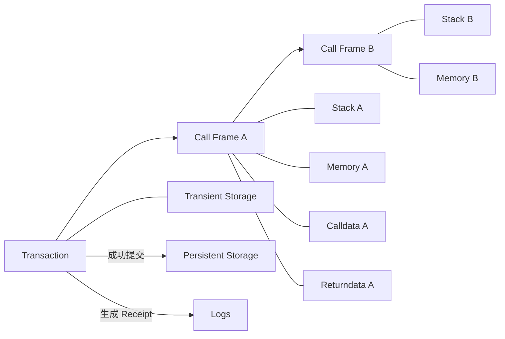
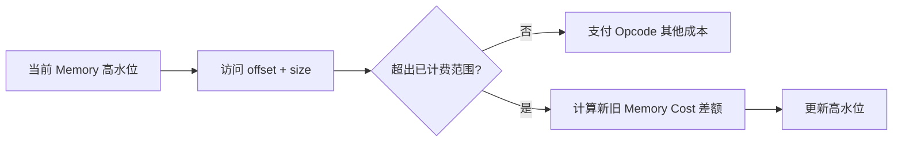
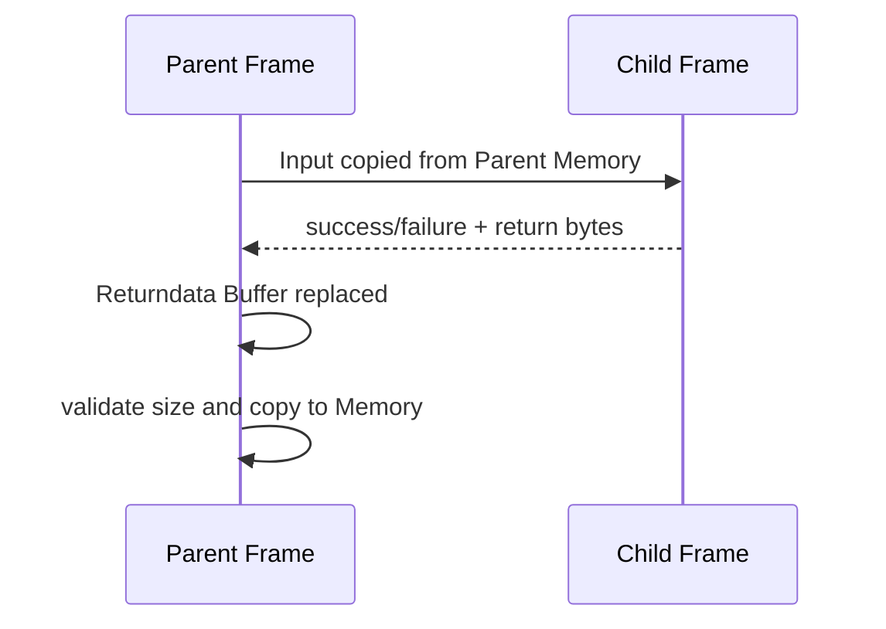
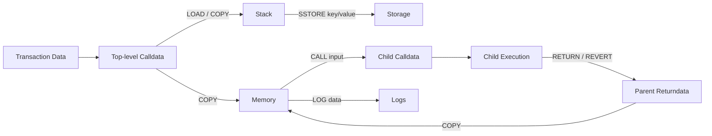

# EVM 数据区域：从 Stack、Memory、Storage 到 Transient Storage

> EVM 中的数据并不位于同一块“内存”：Stack 与 Memory 属于当前调用帧，Calldata 和 Code 是只读输入，Returndata 连接父子调用，Transient Storage 跨同一交易的相关调用帧但不跨交易，Storage 则进入持久 World State；Logs 是可索引执行结果，不是合约可回读的数据库。

---

## 一、本文解决什么问题

Solidity 用局部变量、状态变量、`calldata`、`memory` 和 Event 描述程序，但编译为 EVM 后，数据会落到生命周期和成本完全不同的区域：

- Stack、Memory 与 Storage 分别保存什么，何时销毁？
- 子调用能否直接读取父调用的 Memory？
- Calldata 为什么只读，是否等于 ABI 参数？
- Returndata 与父帧输出 Memory 有何关系？
- Runtime Code 能否在执行时修改？
- Transient Storage 与 Memory、Storage 的核心边界是什么？
- Event Log 会不会写入 Storage，合约能否查询历史 Event？
- Solidity 变量怎样映射到 32 Byte Storage Slot？
- Memory Expansion 为什么会显著增加 Gas？
- Revert 时哪些区域回滚，哪些只是随帧销毁？

本文讨论 EVM 数据区域的稳定语义，不绑定客户端的内存结构。Opcode 成本、冷暖访问、Refund、Transient Storage 可用性和代码格式受 Fork 影响；部署或测量前应固定网络、Fork、编译器、优化参数、Code Hash 与输入。

### 核心结论

1. Stack 是每个调用帧私有的 256-bit 操作数栈，不是 Solidity 调用栈，也不承担持久存储。
2. Memory 是每帧私有、按字节寻址、零初始化的易失空间；访问更高偏移会扩大已计费范围。
3. Storage 是账户级持久状态，逻辑上由 256-bit Slot Key 映射到 256-bit Value；写入会影响 World State。
4. Calldata 是当前调用的只读输入，帧之间不会自动共享；父帧通常从 Memory 复制输入建立子调用。
5. Returndata Buffer 保存当前帧最近一次外部调用的返回字节，会被后续调用替换，复制时必须校验长度。
6. Code 是当前执行的只读字节码；创建阶段执行 Init Code，其成功返回字节才成为 Runtime Code。
7. Transient Storage 是交易范围内、按合约状态上下文寻址的临时 Key-Value 区域，交易结束即清空。
8. Logs 是成功执行产生的 Receipt 数据，适合链下索引；合约不能像读取 Storage 一样读取历史 Logs。
9. Solidity Storage Layout 是代理升级的重要兼容契约，改变既有 Slot 含义会破坏状态。
10. 区域选择同时影响生命周期、可见性、复制、回滚、Gas、安全与升级，不能只按“哪个便宜”决定。

---

## 二、生命周期地图



| 区域 | 作用域 | 可变性 | 跨调用帧 | 跨交易 |
|---|---|---|---|---|
| Stack | 当前帧 | 可变 | 否 | 否 |
| Memory | 当前帧 | 可变 | 否 | 否 |
| Calldata | 当前帧输入 | 只读 | 不自动共享 | 否 |
| Returndata | 最近子调用结果 | 被调用结果替换 | 复制传递 | 否 |
| Code | 当前执行代码 | 执行时只读 | 可被不同帧执行 | 是 |
| Transient Storage | 当前交易的状态上下文 | 可变 | 按调用语义可见 | 否 |
| Storage | 合约状态上下文 | 可变 | 按调用语义共享 | 是 |
| Logs | 执行子状态/Receipt | 追加 | 不可由合约回读 | 是 |

“按调用语义可见”很重要：`DELEGATECALL` 会让 Code Address 与状态上下文分离，具体规则属于后续调用语义模块。

---

## 三、Stack：Opcode 的操作数工作台

EVM Stack 每项为 256 bit，采用后进先出。Opcode 从栈顶弹出参数并压入结果。

```text
PUSH1 0x20
PUSH1 0x00
MSTORE
```

该片段把值 `0x20` 写入 Memory 起始位置。实际分析时必须按 Opcode 规范确认弹栈顺序，不能凭自然语言参数顺序猜测。

### 3.1 帧隔离

每个 Call Frame 都有自己的 Stack。子调用不会继承父 Stack；父帧必须通过调用参数指定输入字节，子帧返回后只交付成功标志和返回数据。

### 3.2 深度边界

经典 EVM Stack 最多 1024 项。Underflow 或 Overflow 会异常终止当前帧。Solidity 的“Stack too deep”常是编译阶段的变量分配问题，与运行时达到 1024 项不是同一个错误。

Stack 适合表达式中的定长值、Offset、Length 和引用。动态内容通常位于 Memory、Calldata 或 Storage，Stack 保存位置与长度。

---

## 四、Memory：调用帧内的易失字节空间

Memory 是每帧独立、按字节寻址、初始为零的临时空间，常用于：

- ABI 编码和临时对象；
- 外部调用输入/输出缓冲；
- Hash 输入；
- `RETURN`/`REVERT` 数据；
- 动态数组、字符串和结构体。

子帧不共享父帧 Memory。调用 Opcode 从父 Memory 指定区间读取输入，子调用结束后再把返回数据复制到父 Memory。

### 4.1 Memory 没有通用释放

EVM 没有通用 `free` Opcode。帧结束时整个 Memory 销毁。Solidity 通常维护 Free Memory Pointer 以追加分配，但这是编译器约定，不是 EVM 垃圾回收。

手写 Assembly 若覆盖编译器保留区域，可能破坏后续 ABI 编码。具体布局应以所用编译器版本文档为准，不能把 Solidity 惯例当成协议要求。

---

## 五、Memory Expansion：按高水位累计计费

访问尚未覆盖的高地址会扩展 Memory。成本取决于本帧迄今使用的最高范围，而非实际写入多少非零字节。



经典模型按 32 Byte Word 向上取整，并包含线性与二次项。本文不硬编码系数，因为测量应使用目标 Fork 规则。稳定结论是：

- 跳到极高 Offset 写 1 Byte，也会扩展中间范围；
- 已扩展 Memory 不会在帧内缩回，访问低地址不会退款；
- 复制、Hash、Return/Revert 和调用输出都可能触发扩展；
- 大数组和恶意 Returndata 可能造成 Out of Gas。

### 5.1 为动态分配设置边界

```solidity
error PayloadTooLarge(uint256 actual, uint256 maximum);

function boundedBuffer(uint256 length) external pure returns (bytes memory out) {
    uint256 maximum = 4096;
    if (length > maximum) revert PayloadTooLarge(length, maximum);
    out = new bytes(length);
}
```

示例值不是通用上限。生产上限应由业务协议、目标输入和 Gas 测试决定，并在合约内强制执行，而非只在前端校验。

---

## 六、Storage：账户级持久状态

Storage 逻辑上是 `256-bit key -> 256-bit value` 的稀疏映射，属于合约状态上下文。未写入 Slot 读取为零；成功交易的写入进入 World State 并影响 State Root。

Storage 与客户端数据库不是同一抽象。协议定义状态语义与承诺，节点如何缓存和落盘属于实现细节。

### 6.1 成本依赖上下文

Storage Gas 受访问冷暖、旧值、新值、原始值、Refund 和 Fork 规则影响，不能宣称一次 `SSTORE` 永远是固定成本。优化必须固定 Fork、前状态和访问序列。

### 6.2 回滚边界

Storage 写入先作用于交易状态视图。若所在帧失败，写入回滚到进入该帧前；顶层失败则交易执行产生的 Storage 效果全部回滚。已消耗 Gas 不恢复。

### 6.3 Storage 与 Logs 的职责

Storage 提供合约未来可读取的持久状态，但增加长期状态成本。仅供链下审计的数据可以考虑 Event；协议未来需要读取的数据不能只发 Event。

---

## 七、Storage Slot：高层变量如何落到 Key

Solidity 编译器按 Storage Layout 将变量分配到 Slot。定长小类型可能在同一 32 Byte Slot 内打包；结构体、数组和映射遵循各自布局规则。

### 7.1 Packing 不总是更省 Gas

相邻小型定长字段可共享 Slot，但只更新其中一个字段时，通常需要读整 Slot、掩码修改再写回。Packing 节省空间，不保证每条写路径更便宜。

### 7.2 Mapping Slot

Mapping 元素位置不是顺序索引。概念上会对 Key 与 Mapping 声明 Slot 的规范编码做 Hash 派生：

```text
elementSlot = keccak256(encode(key) ++ encode(mappingSlot))
```

嵌套 Mapping 和动态成员继续派生。具体编码、字节顺序与类型宽度必须按对应 Solidity Storage Layout 实现，不能用字符串拼接替代。

### 7.3 代理升级风险

代理模式下，逻辑代码在代理 Storage 上下文运行。删除、重排或改变已有字段类型，可能让新代码把旧 Slot 解释成另一含义。

升级前应保存并比较编译器生成的 Storage Layout，运行迁移测试和状态不变量。Storage Gap 或 Namespaced Storage 可降低部分风险，但不能替代布局审查。

### 7.4 原始 Slot 查询

`eth_getStorageAt` 返回目标 Slot 的原始 32 Byte 值，不理解变量、Mapping Key 或代理布局。正确解码需要匹配 Code、编译器布局、代理实现和目标 Block Hash。

---

## 八、Calldata：当前帧的只读输入

Calldata 是调用帧输入字节。顶层 Call Transaction 中它来自交易 Data；对子调用，它通常来自父帧指定的 Memory 区间。

### 8.1 Calldata 不等于 ABI

EVM 只看到任意字节。Solidity ABI 通常把前 4 Byte 解释为 Function Selector，后续解释为参数；Fallback、自定义 Dispatcher 或其他语言可采用不同规则。

### 8.2 只读与复制

Opcode 可读取或复制 Calldata，却不能原地修改。需要变换数据时必须复制到 Memory，或以 Offset/Length 直接解析以减少复制。

每个帧有自己的 Calldata 视图。外部输入不可信，解码必须检查长度、Offset 和动态数组边界。Assembly 绕过成熟 Decoder 时需要自行完成检查。

### 8.3 费用边界

顶层交易 Calldata 影响 Intrinsic Gas；在 Rollup 上还可能影响数据发布费。把参数标记为 `calldata` 可减少某些复制，但总成本必须结合调用路径和目标网络测量。

---

## 九、Returndata：连接父子帧的结果缓冲

外部调用结束后，父帧的 Returndata Buffer 被替换为该次调用的完整返回字节。父帧可以查询长度并复制指定范围到 Memory。



调用 Opcode 还可指定输出 Memory 区间以复制返回数据的一部分。若代码期望的长度大于实际数据而盲目解码，可能 Revert 或错误解释。

### 9.1 成功与失败数据

`RETURN` 产生成功字节，`REVERT` 产生失败字节；Exceptional Halt 通常没有业务 Revert Data。Returndata 没有 ABI 可信度，恶意合约可以伪造标准错误、返回空或超大数据。

### 9.2 最近一次调用语义

Returndata Buffer 只表示最近一次外部调用。下一调用会替换它；需要保留时，应在发起下一调用前复制到 Memory。

---

## 十、Code：只读执行字节

当前帧执行的 Code 在帧内只读。Opcode 可以读取自身或其他账户 Code/Code Hash，却不能原地修改已部署 Runtime Code。

### 10.1 Init Code 与 Runtime Code

创建时执行 Init Code；Init Code 成功返回的字节才成为 Runtime Code。构造参数参与创建过程，但不会自动成为 Runtime Code 的永久组成部分。

### 10.2 Code 与状态上下文可能不同

普通调用通常执行目标 Code 并使用目标状态；`DELEGATECALL` 等语义可执行另一个地址的 Code，却读写调用者状态上下文。这是代理模式基础，也说明仅看 Code Address 无法判断 Storage 归属。

### 10.3 Code 不等于源码

Runtime Code 不包含完整源码、变量名或注释。源码验证是将编译输入与链上 Code 对照；Compiler、Metadata 和链接参数都可能影响结果。

---

## 十一、Transient Storage：交易级临时状态

Transient Storage 由 EIP-1153 引入，并在支持该规则的 Fork/网络上通过相应 Opcode 使用。它按合约状态上下文和 256-bit Key 寻址，值为 256 bit。

核心生命周期是：

- 同一交易内可跨相关调用帧读取；
- 写入跟随状态上下文，不简单跟随 Code Address；
- 帧回滚会撤销相应 Transient 写入；
- 顶层交易结束后全部清空，不进入下一交易的 World State。

| 特性 | Memory | Transient Storage | Storage |
|---|---|---|---|
| 作用域 | 单帧 | 单交易 | 跨交易 |
| 子调用可见 | 否 | 取决于状态上下文 | 取决于状态上下文 |
| 交易后保留 | 否 | 否 | 成功时保留 |
| 典型用途 | 编码、临时数组 | 交易级锁、标记 | 余额、权限、协议状态 |

### 11.1 使用边界

它适合同一交易内跨函数/帧协调，例如可重入锁或临时上下文；不适合保存下一交易要读取的数据，也不能替代 Memory 的大块字节缓冲。

采用前必须确认目标链已启用相应 Fork，Compiler、工具链和审计工具均支持。不能凭“EVM 兼容”假设所有链一致。

### 11.2 自动清空不等于无需清理

父帧捕获子调用失败后可能继续执行，同一交易后续路径仍可能观察未重置的 Transient 值。锁的设置、清理、Revert 与捕获路径都必须测试。

---

## 十二、Logs：面向链下消费者的输出

Log 由 `LOG0` 到 `LOG4` 等 Opcode 产生，包含发出地址、Topics 和 Data。顶层成功后，它们进入 Receipt，可被 RPC 过滤和 Indexer 消费。

### 12.1 Topics 与 Data

Topics 适合索引关键字段，Data 承载非索引字节。Solidity Event ABI 定义常用编码，但 EVM 只处理 Topics 与任意字节。

### 12.2 合约不能读取历史 Logs

EVM 没有让合约遍历历史 Receipt Logs 的通用机制。未来合约逻辑需要的值必须保存到 Storage 或通过可验证输入重新提供；只发 Event 不足以成为链上状态。

### 12.3 回滚与重组

帧 Revert 会删除该帧范围产生的 Logs；顶层失败不会在规范 Receipt 保留回滚 Event。区块 Reorg 还会从规范链移除成功交易的 Logs，因此 Indexer 必须保存 Block Hash Checkpoint 并支持回滚重放。

| 需求 | 选择 |
|---|---|
| 合约未来必须读取 | Storage |
| 链下审计与列表查询 | Logs |
| 既参与协议又需索引 | Storage + Event |

---

## 十三、跨区域数据流



关键边界包括 Calldata 到 Stack/Memory、父 Memory 到子 Calldata、子返回字节到父 Returndata 再到 Memory，以及 Stack 为 Storage 提供 Key/Value。

减少复制可能降低 Gas，但 Assembly 优化会增加 Offset、Length、Free Memory Pointer 和审计风险。应先测量再决定。

---

## 十四、回滚与销毁不是一回事

| 区域 | 帧成功 | 帧失败 | 交易结束 |
|---|---|---|---|
| Stack | 随帧销毁 | 随帧销毁 | 不存在 |
| Memory | 随帧销毁 | 随帧销毁 | 不存在 |
| Calldata | 随帧结束失效 | 随帧结束失效 | 不存在 |
| Returndata | 交付父帧 | Revert Data 可交父帧 | 不存在 |
| Transient Storage | 同交易后续可见 | 失败范围回滚 | 全部清空 |
| Storage | 候选写入保留 | 失败范围回滚 | 顶层成功才提交 |
| Logs | 候选 Log 保留 | 失败范围删除 | 顶层成功进入 Receipt |

Stack/Memory 的消失不是状态回滚，它们本来就是帧内数据。Storage、Transient Storage 与 Logs 才涉及执行检查点和回滚。

---

## 十五、常见误区与错误案例

### 15.1 Memory 便宜，所以可替代 Storage

错误。Memory 交易后不保留。生命周期先决定区域，成本只能在相同需求下比较。

### 15.2 子调用继承父 Memory

错误。子帧拥有独立 Memory，输入通过调用参数形成新的 Calldata。

### 15.3 `calldata` 就是 ABI 参数

错误。Calldata 是任意只读字节，ABI 只是常见编码约定。

### 15.4 Event 是便宜版 Storage

错误。合约无法通用读取历史 Event，Event 还受 Revert 和 Reorg 影响。

### 15.5 Transient Storage 等于全局 Memory

错误。它按状态上下文寻址、跨帧可见并具有回滚语义；Memory 是单帧字节数组。

### 15.6 Storage Slot 与变量一一对应

错误。多个小变量可打包，Mapping 和动态数组会通过 Hash 派生位置。

### 15.7 高 Offset 写一个字节只付一个字节成本

错误。Memory Expansion 按最高访问范围计费。

### 15.8 Returndata 可在任意后续调用后读取

错误。下一次调用会替换最近 Returndata Buffer，需要时应及时复制。

---

## 十六、工程实践与方案选择

### 16.1 先按生命周期选区域

1. 当前表达式定长值：Stack；
2. 当前帧动态临时字节：Memory；
3. 只读外部输入：Calldata；
4. 同交易跨帧协调：在支持时评估 Transient Storage；
5. 跨交易协议状态：Storage；
6. 链下索引与审计：Logs；
7. 跨调用结果：Returndata，校验后复制与解码。

### 16.2 限制动态数据

对 Calldata 数组、Returndata、Memory 分配、循环和 Event Data 设置业务上限。上限必须进入合约约束，不能只依赖前端。

### 16.3 冻结升级证据

保存每次发布的 Compiler Version、Storage Layout JSON、Runtime Code Hash 和部署清单。CI 比较布局兼容性，并在目标链 Fork 上运行迁移与状态不变量测试。

### 16.4 不用 Assembly 猜成本

Assembly 可减少复制，也容易引入 Offset、Length、Free Memory Pointer、Returndata 和 Slot 计算错误。优化前后应同时比较 Gas、Code Size、安全测试和审计复杂度。

---

## 十七、测试与验证方法

### 17.1 测试矩阵

至少覆盖：

- 空、最短和最大允许 Calldata；
- Memory 边界及跨 32 Byte Word 扩展；
- 外部调用空、短、长和畸形 Returndata；
- Storage 零到非零、非零到非零、非零到零及 Revert；
- Mapping、数组、结构体和 Packing Slot；
- Transient Storage 同帧、跨帧、捕获 Revert 和交易后清空；
- Event 成功、子帧回滚、顶层回滚和 Reorg；
- 代理升级前后 Storage Layout。

### 17.2 Gas 测量

在固定 Fork、Compiler、Optimizer、Code Hash、Calldata 和前状态下测量 Receipt Gas Used，并用 Trace 定位 Memory Expansion、复制与 Storage 访问。不同状态下的单次交易不能直接比较。

### 17.3 保留原始证据

调试时保存 Chain ID、Block Number/Hash、Transaction Input、Runtime Code Hash、Compiler、Storage Layout、原始 Storage Word、Returndata/Revert Data、Call Trace 与 Receipt。

只有保留原始字节和状态锚点，ABI 解码与变量解释才能复核。

### 17.4 不变量测试

验证失败路径不部分提交 Storage、Transient Lock 不污染同交易后续路径、返回数据不会触发无界分配，以及 Event 投影在 Reorg 回滚后与最终 Storage 一致。

---

## 十八、总结

EVM 数据区域的区别，本质是生命周期、可见性和成本模型的区别：

1. Stack 与 Memory 属于单帧，前者服务 256-bit 操作数，后者服务动态字节。
2. Memory Expansion 按最高访问范围累计计费，高 Offset 和无界数据会放大成本。
3. Calldata 是只读输入，Returndata 是最近子调用结果，跨帧传递需要复制与长度校验。
4. Storage 是持久状态，Storage Slot 布局直接决定代理升级兼容性。
5. Code 执行时只读，Init Code 与 Runtime Code 是不同对象。
6. Transient Storage 跨同一交易相关帧，但交易结束清空，不能替代持久 Storage。
7. Logs 面向 Receipt 与链下索引，不是合约可回读状态，并随 Revert/Reorg 撤销。
8. 区域选择应先满足协议语义，再以固定环境测量 Gas、安全与维护代价。

---

## 问答复盘

### Q1：Stack 与 Memory 最关键的区别是什么？

**答：** Stack 是 256-bit 操作数栈，Memory 是按字节寻址的动态临时空间；二者都属于当前帧，子调用不会共享。

### Q2：访问 Memory 的高 Offset 为什么昂贵？

**答：** Memory Expansion 按本帧最高访问范围计费，而不是只按实际非零字节；扩展成本还包含非线性部分。

### Q3：Calldata 与 Solidity ABI 是否相同？

**答：** 不同。Calldata 是任意只读输入；ABI 是把函数选择器和参数编码到其中的一套约定。

### Q4：Returndata 有什么安全边界？

**答：** 它是不可信任意字节，且会被下次调用替换。应先检查成功状态和长度，再及时复制并按预期 ABI 解码。

### Q5：Storage Slot 是否总与一个变量对应？

**答：** 不是。小型定长变量可打包，Mapping 和动态数组通过 Hash 派生 Slot，必须依据 Storage Layout 解码。

### Q6：Transient Storage 与 Storage 最容易混淆的边界是什么？

**答：** 两者都按状态上下文和 Key 寻址并支持回滚，但 Transient Storage 只存在于当前交易，结束后自动清空。

### Q7：Event 能否替代合约未来要读取的 Storage？

**答：** 不能。合约没有通用能力查询历史 Logs；Event 适合链下索引，协议需要读取的数据必须保存在状态中。

### Q8：代理升级为什么必须比较 Storage Layout？

**答：** 新逻辑继续解释代理旧 Storage。字段重排或类型变化会让同一 Slot 获得不同含义，造成状态损坏。

### Q9：如何验证把 `memory` 参数改为 `calldata` 真有收益？

**答：** 固定 Fork、Compiler、Optimizer、Code Hash、输入与前状态，比较 Receipt 和 Trace 中复制、Memory Expansion 与总 Gas，同时运行安全回归。

---

## 延伸知识

- **EVM 调用语义**：`CALL`、`STATICCALL`、`DELEGATECALL` 如何决定 Code 与 Storage 上下文。
- **Solidity Storage Layout**：Packing、Mapping、Dynamic Array、Inheritance 与 Namespaced Storage。
- **ABI 编码**：Offset、Length、Tuple、Custom Error 与 Event Topic。
- **Gas Schedule**：Memory Expansion、Warm/Cold Access、`SSTORE` 与 Refund。
- **Indexer**：Logs 回填、Checkpoint、幂等消费与 Reorg Rollback。
