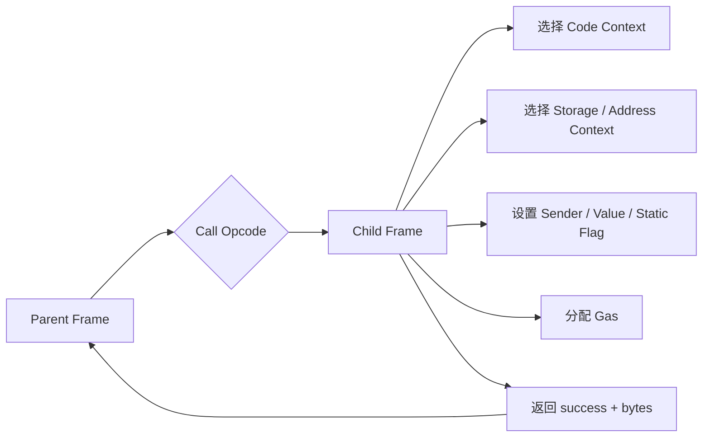
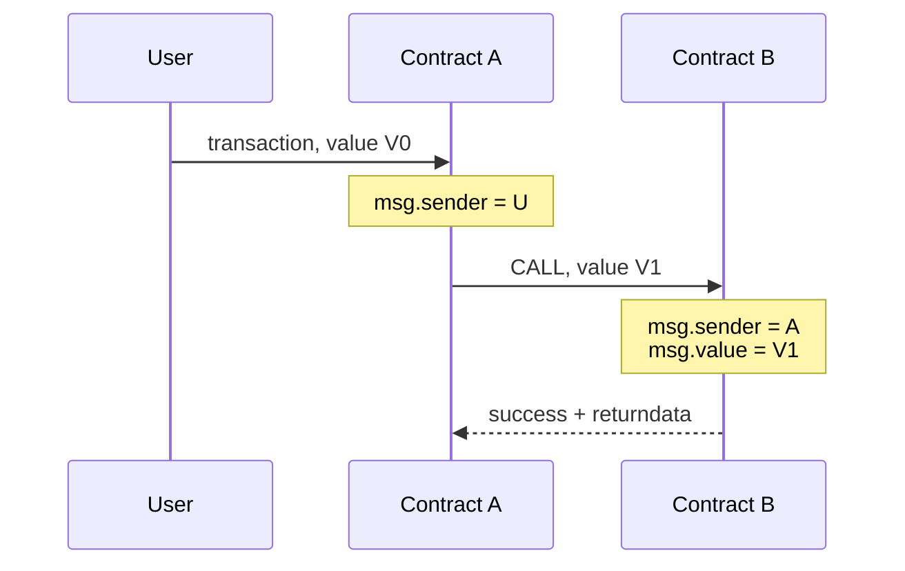
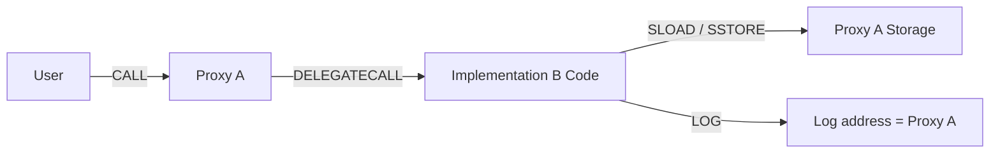
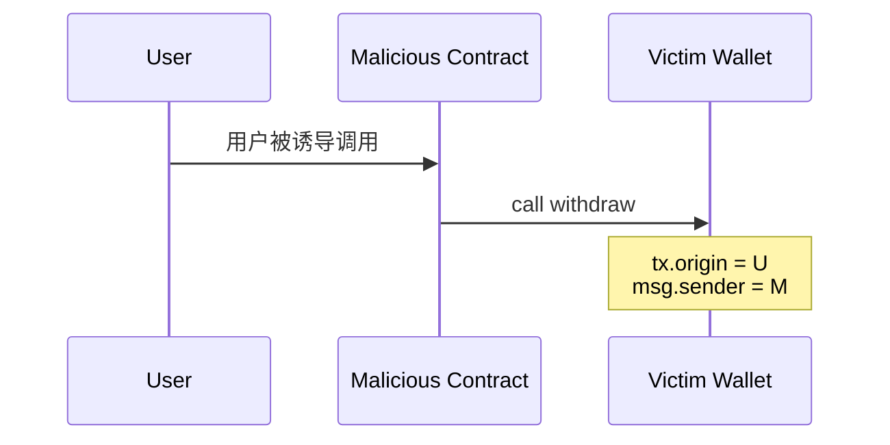
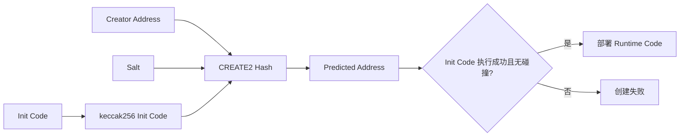
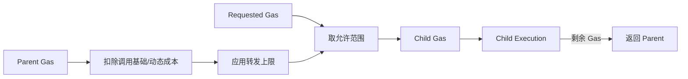
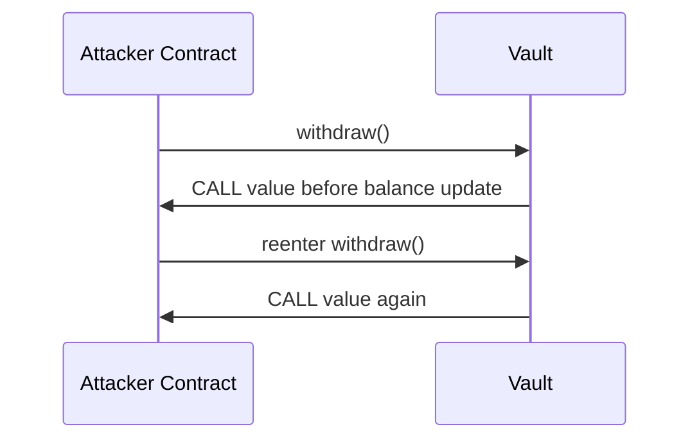

# EVM 调用语义：从 CALL、DELEGATECALL 到 CREATE2 与可重入

> EVM 调用不能只理解为“从合约 A 跳到合约 B”。每种调用都要回答四个问题：执行谁的 Code、读写谁的 Storage、子帧看到的 `msg.sender` 是谁、`msg.value` 如何确定。代理升级、权限控制、Gas Griefing 和 Reentrancy 都源于这些上下文边界。

---

## 一、本文解决什么问题

同一段 Runtime Code 经不同 Opcode 调用，可能读写完全不同的 Storage，并看到不同的调用身份：

- `CALL`、`STATICCALL` 与 `DELEGATECALL` 的核心区别是什么？
- `CALLCODE` 为什么被 `DELEGATECALL` 取代，今天还应不应该使用？
- `msg.sender` 是用户、代理、实现合约，还是中间路由器？
- `msg.value` 在普通调用和代理调用中如何传播？
- 为什么不能用 `tx.origin` 做授权？
- Call Depth 与 Gas Forwarding 如何限制嵌套调用？
- `CREATE` 与 `CREATE2` 如何计算地址，预计算地址是否等于部署成功？
- 外部调用 Revert 时，父调用为什么可能继续成功？
- Checks-Effects-Interactions 是否足以防住所有 Reentrancy？

本文以经典 EVM 调用语义为主。Opcode 成本、账户存在性、代码格式、创建限制、Gas 规则和账户模型会随 Fork 演进；具体部署与审计必须固定目标网络、Fork、编译器、代理模式和 Code Hash。

### 核心结论

1. `CALL` 在目标账户上下文执行目标 Code，读写目标 Storage；子帧的 `msg.sender` 是当前调用合约，`msg.value` 是显式转发值。
2. `STATICCALL` 创建静态子上下文，不允许该调用树执行受禁止的状态修改，也不携带 Value；它不等于“被调用函数一定是 Solidity `view`”。
3. `DELEGATECALL` 执行目标 Code，却保留调用者的 Address、Storage、`msg.sender` 和 `msg.value` 上下文，是代理模式基础也是高权限边界。
4. `CALLCODE` 同样在调用者状态上下文运行其他 Code，但 Sender/Value 语义不同且已成为历史遗留；新系统不应使用。
5. `CREATE` 地址通常由创建者地址与创建 Nonce 等协议输入确定；`CREATE2` 地址由创建者、Salt 与 Init Code Hash 确定。
6. `CREATE2` 只提供确定性候选地址，不保证部署成功、代码永久不变或地址无人抢占；构造参数变化也会改变 Init Code Hash。
7. `msg.sender` 每一层都会变化，`tx.origin` 在顶层交易调用链内保持原始发起账户语义；使用后者授权会扩大钓鱼与组合调用风险。
8. EVM 调用深度有协议上限，Gas 转发又会逐层收缩；合约不能假设任意深度调用都成功。
9. 低级调用返回成功标志与任意 Returndata；忽略 `success` 会把关键子操作失败误当成顶层成功。
10. Reentrancy 不只发生在提款函数，也可跨函数、跨合约、只读观察或 Token Hook。防护应围绕协议不变量，而不只是添加一个锁。

---

## 二、一次调用到底切换了什么



分析任何调用，至少记录：

1. Code Context：实际执行哪一个账户的字节码；
2. State Context：余额、Storage、Transient Storage 与 Event Address 属于谁；
3. Caller Context：子帧看到的 `msg.sender`、`msg.value`；
4. Mutability：是否处于 Static Context；
5. Resource：转发 Gas、调用深度与返回数据；
6. Failure：失败是否冒泡、被捕获或被忽略。

---

## 三、四类调用 Opcode 的上下文矩阵

设当前执行合约为 A，目标地址为 B，A 当前帧的调用者为 U，当前帧 `msg.value = V`。

| Opcode | 执行 Code | Address/Storage 上下文 | 子帧 `msg.sender` | 子帧 `msg.value` | 状态修改 |
|---|---|---|---|---|---|
| `CALL` | B | B | A | 显式转发值 | 允许 |
| `STATICCALL` | B | B | A | 0 | 禁止受限修改 |
| `DELEGATECALL` | B | A | U（保留） | V（保留） | 写 A 的状态 |
| `CALLCODE` | B | A | A | 显式值 | 写 A 的状态 |

表格描述经典稳定语义，未展开预编译、账户模型升级及不同代码格式细节。Event 的发出地址跟随当前 Address/State Context：代理通过 `DELEGATECALL` 执行实现逻辑时，日志地址通常是代理而不是实现合约。

---

## 四、`CALL`：切换到目标账户上下文

`CALL` 建立目标账户 B 的子帧，执行 B 的 Code，并读写 B 的 Storage。子帧看到 A 为 `msg.sender`。



### 4.1 Value 转移

`CALL` 可显式携带原生资产 Value。调用建立时会进行余额及协议条件检查；若子帧失败，属于该帧范围的 Value 转移随状态回滚。

不要把“目标没有 Code”等同于“没有效果”：向无 Code 地址调用可能仍完成 Value 转移。预编译和协议演进也使简单 EOA/Contract 二分不足以覆盖所有情况。

### 4.2 高级与低级调用

Solidity 高级外部调用通常在失败时 Revert；低级 `call` 返回 `(bool success, bytes returndata)`，调用者必须处理结果：

```solidity
error ExternalCallFailed(bytes reason);

function execute(address target, bytes calldata payload) external {
    (bool success, bytes memory result) = target.call(payload);
    if (!success) revert ExternalCallFailed(result);
}
```

这段代码只演示失败传播。生产代码还必须限制目标、Calldata 和返回数据，并评估权限与 Reentrancy。把不可信 Revert Data 直接展示给用户也不安全。

### 4.3 成功不等于业务完成

低级调用返回 `true` 只表示 EVM 子帧成功结束。某些 Token 历史实现可能通过返回布尔值表达业务失败，甚至返回空数据；集成应使用经过审计的兼容库和明确接口约束，不能只检查 EVM Success。

---

## 五、`STATICCALL`：传播静态限制

`STATICCALL` 在目标 B 的账户上下文执行 Code，但建立 Static Context。该标志会向更深层调用传播，受协议禁止的状态变更会使相应帧异常失败。

静态限制覆盖的行为以目标 Fork 规则为准，通常涉及 Storage 写、Log、创建、销毁及带 Value 调用等状态效果。

### 5.1 `STATICCALL` 不等于 Solidity `view`

`view`/`pure` 是语言和 ABI 层声明，编译器会选择相应调用方式或做静态检查；EVM 最终是否限制状态修改取决于实际 Opcode 和 Static Flag。

同一段函数代码经普通 `CALL` 进入时，运行时并不会因为 ABI 上写了 `view` 就天然获得完全相同的静态保护。因此安全分析要看实际字节码调用路径。

### 5.2 静态读取仍可 Revert 或耗尽 Gas

只读不代表廉价、可靠或无风险。目标可执行昂贵循环、递归调用、返回大量数据或显式 Revert。链下 `eth_call` 也可能受节点资源上限影响。

---

## 六、`DELEGATECALL`：借用 Code，保留状态上下文

`DELEGATECALL` 执行目标 B 的 Code，但当前 Address、Storage、余额和日志地址仍属于 A，同时保留 A 当前帧的 `msg.sender` 与 `msg.value`。



这解释了代理模式为何能升级逻辑而保留地址和状态：用户与代理交互，实现代码在代理状态上运行。

### 6.1 Storage Layout 是安全契约

实现合约声明的变量会按自身编译布局生成 Slot 操作，但实际读写代理 Storage。若升级重排字段、改变类型或与代理管理 Slot 冲突，新逻辑会错误解释旧状态。

必须使用明确的代理标准、受保护的实现 Slot、Storage Layout Diff、初始化版本控制和主网 Fork 升级演练。

### 6.2 实现合约权限等于代理权限

一旦代理将任意 Calldata 委托给实现，实现代码几乎能以代理身份修改状态、转移资产或发起调用。升级管理员、实现地址验证和初始化函数都属于最高风险边界。

仅验证实现地址“有代码”远远不够；还应验证 Code Hash、升级授权、兼容布局和初始化状态。

### 6.3 不可信目标不能随意 Delegatecall

```solidity
// 严重错误：调用者可让任意代码在本合约 Storage 上下文运行。
function unsafeDelegate(address target, bytes calldata data) external {
    (bool ok,) = target.delegatecall(data);
    require(ok);
}
```

目标可覆盖 Owner、实现地址、余额记账等任意可达 Slot。修复不是“检查返回值”，而是从架构上限制经过治理和验证的实现集合。

---

## 七、`CALLCODE`：只保留历史理解

`CALLCODE` 也执行 B 的 Code、使用 A 的状态上下文，但子帧 `msg.sender` 为 A，Value 由调用显式提供；`DELEGATECALL` 则保留 A 当前帧原有的 Sender 与 Value。

这种差异使 `CALLCODE` 难以透明表达“像原代码一样继续执行”的代理语义。现代系统应使用标准化的 `DELEGATECALL` 代理方案，不应新写 `CALLCODE`。

审计旧 Bytecode、反编译历史交易或兼容遗留链时仍需识别它。工具不能假设所有状态上下文复用都来自 `DELEGATECALL`。

---

## 八、`msg.sender`：直接调用者，不是永远的用户

`msg.sender` 表示当前帧语义下的直接 Caller：

- 用户直接调用 A：A 中通常是用户地址；
- A 使用 `CALL` 调用 B：B 中是 A；
- Proxy 使用 `DELEGATECALL` 执行实现：实现逻辑观察到原调用 Proxy 的 Sender；
- Trusted Forwarder/账户抽象入口：合约直接看到的可能是转发器或入口合约。

因此 `onlyEOA`、`msg.sender == tx.origin` 等模式会破坏多签、智能账户和组合性，也不是可靠的 Bot 防护。

### 8.1 元交易与转发器

若协议支持可信转发，业务“原始用户”可能编码在 Calldata 中。合约必须验证转发器身份并按标准解析，不能信任任意调用者附带的 `from` 字段。

权限模型应明确区分 EVM Direct Caller、认证后的 Logical Sender 与资产 Owner。

---

## 九、`msg.value`：当前调用帧携带的 Value

`msg.value` 是当前调用语义携带的原生资产值：

- 顶层 Payable Call 来自交易 Value；
- `CALL` 子帧看到显式转发值；
- `STATICCALL` 不携带 Value；
- `DELEGATECALL` 保留父帧当前 `msg.value`，但不会再次执行一笔新的 Value 转移。

最后一点容易造成重复记账：实现函数通过 Delegatecall 看到非零 `msg.value`，但该资产已经进入代理上下文，不能把每次内部委托理解为再次收款。

非 Payable 是编译器生成的入口检查。低级字节码、Fallback 和代理转发需要结合实际 Runtime Code 判断，不能只看源码函数签名。

---

## 十、`tx.origin`：顶层起源不是授权主体

`tx.origin` 在传统交易调用链中表示顶层交易的原始账户起源，并在内部调用中保持不变。正因如此，它无法表达当前哪一个中间合约获得了权限。



若 Victim 用 `tx.origin == owner` 授权，用户只要调用恶意中间合约，恶意合约便可能借用户 Origin 通过检查。授权应基于经过设计的 `msg.sender`、签名、Role、Session Key 或账户抽象验证逻辑。

随着账户抽象和协议演进，关于“Origin 永远是哪类账户”的历史简化更不应作为长期架构假设。应按目标网络当前规范验证具体语义。

---

## 十一、`CREATE`：Nonce 驱动的合约地址

`CREATE` 建立创建帧并执行 Init Code。经典地址推导概念上依赖创建者地址与创建 Nonce 的 RLP 编码 Hash，取低 20 Byte：

```text
address = last20Bytes(keccak256(rlp([creator, creatorNonce])))
```

具体 Nonce 更新、碰撞和账户存在规则应按目标 Fork 确认。创建成功还要求 Init Code 成功执行并返回符合规则的 Runtime Code。

### 11.1 创建者不一定是交易发送者

若 Factory 合约执行 `CREATE`，地址公式中的 Creator 是 Factory 的当前地址上下文，而不是最外层 EOA。通过 Delegatecall 执行创建逻辑时，还要结合当前状态 Address 判断创建者。

### 11.2 创建失败的结果

内部创建失败会向父帧返回失败结果；父帧可以处理并继续。顶层创建交易失败则执行效果回滚，但交易仍消耗 Gas 并产生失败 Receipt。

---

## 十二、`CREATE2`：由 Salt 与 Init Code Hash 定位

`CREATE2` 的经典地址公式为：

```text
address = last20Bytes(
  keccak256(0xff ++ creator ++ salt ++ keccak256(initCode))
)
```

其中 `creator` 是执行创建的当前地址上下文，`salt` 为 32 Byte，`initCode` 包含构造过程所需代码和通常编码在其中的构造参数。



### 12.1 确定地址不等于确定 Runtime Code

地址绑定的是 Init Code Hash，而非最终 Runtime Code Hash。Init Code 可根据执行环境或外部状态生成不同结果；安全系统应在部署后验证 Runtime Code Hash 和初始化状态。

### 12.2 构造参数会影响地址

如果构造参数被拼入 Init Code，更改参数会更改 Init Code Hash 和地址。前端、后端与 Factory 必须使用完全一致的字节序列计算，不能只 Hash Creation Bytecode 主体。

### 12.3 Counterfactual 与抢占边界

预计算地址可提前授权或收款，但部署仍可能失败，且错误 Factory、Salt、Chain 配置或 Init Code 会得到不同地址。向未部署地址转入资产前，应设计无法部署时的恢复路径。

旧式“自毁后在同一地址重新部署不同代码”的假设受当前 Fork 的 `SELFDESTRUCT` 与账户创建规则约束，不能把历史 Metamorphic Contract 技巧当作跨网络稳定能力。

---

## 十三、Call Depth：嵌套调用不是无限的

经典 EVM 调用栈有 1024 层上限。调用达到边界会失败并把结果返回父帧，父帧是否 Revert 取决于处理方式。

不要把该限制与每帧 1024 项 Operand Stack 混淆：一个限制调用帧层级，一个限制单帧操作数数量。

### 13.1 深度攻击的现代边界

历史上可通过预先消耗深度影响目标调用。现代 Gas 转发规则通常更早限制实际可达深度，但协议上限仍存在。代码应检查调用结果，不能依赖“深度永远够用”。

递归合约还会受到每层基础成本、Memory、Returndata 和状态访问成本影响。生产业务应使用显式循环上限、批处理或可续跑状态机，而不是无界递归。

---

## 十四、Gas Forwarding：子调用拿不到父帧全部 Gas

调用 Opcode 会先支付基础与动态成本，再按协议规则限制可转发 Gas。EIP-150 引入的经典 63/64 规则使调用者通常至少保留剩余 Gas 的一部分，实际子帧 Gas 还受请求值、调用类型和附加规则影响。



### 14.1 `gasleft()` 不是业务时钟

Opcode Cost 与冷暖访问会随 Fork 和路径变化。用精确 `gasleft()` 阈值决定关键业务分支容易脆弱，应只在充分验证的底层协议中谨慎使用。

### 14.2 固定 Gas Stipend 不是通用安全机制

依赖固定小 Gas 阻止回调会因 Fork 成本变化、接收方代理逻辑和组合调用而失效，也会破坏合约钱包兼容性。原生资产发送应检查结果，并以状态机、Pull Payment 和 Reentrancy 防护建立安全性。

### 14.3 Gas Griefing

不可信目标可以消耗几乎全部获配 Gas 后失败，让父帧只剩有限预算处理结果。父帧应限制可选 Hook 的 Gas、避免失败后执行复杂恢复，并测试最坏路径。限制 Gas 也可能使合法目标升级后无法工作，需要版本化和监控。

---

## 十五、Failure Propagation：失败可以被捕获

低级调用不会自动让父帧 Revert，而是压入成功标志并设置 Returndata。父帧可选择：

1. 原样冒泡 Revert；
2. 转换成自己的 Custom Error；
3. 记录失败并继续；
4. 忽略结果，这是高风险做法。

```solidity
function notify(address hook, bytes calldata data) external {
    (bool success, bytes memory reason) = hook.call{gas: 50_000}(data);
    if (!success) emit HookFailed(hook, keccak256(reason));
}
```

这个模式只适用于明确可选的通知。若 Hook 是转账、授权或结算必需步骤，捕获失败会破坏业务原子性。

对 Returndata 做 Hash 可限制日志体积，但仍需考虑目标返回超大数据时，EVM/编译器复制返回数据的资源成本。更严格实现可使用受控 Assembly 限制复制，但需专项审计。

---

## 十六、Reentrancy：外部调用让控制权离开当前不变量

当合约在状态尚未稳定时调用不可信目标，目标可在原调用完成前重新进入当前协议。



### 16.1 典型错误

```solidity
mapping(address => uint256) public balances;

function unsafeWithdraw() external {
    uint256 amount = balances[msg.sender];
    (bool success,) = msg.sender.call{value: amount}("");
    require(success);
    balances[msg.sender] = 0;
}
```

余额在外部调用后才清零，回调可重复读取旧余额。

### 16.2 基础修复

```solidity
error TransferFailed();

function withdraw() external {
    uint256 amount = balances[msg.sender];
    balances[msg.sender] = 0;

    (bool success,) = msg.sender.call{value: amount}("");
    if (!success) revert TransferFailed();
}
```

这是 Checks-Effects-Interactions（CEI）：在交出控制权前让关键状态达到一致。若转账失败，顶层 Revert 会恢复余额。

### 16.3 CEI 不是完整答案

还需考虑：

- Cross-function Reentrancy：回调进入另一个共享状态函数；
- Cross-contract Reentrancy：多个合约共同维护一个不变量；
- Read-only Reentrancy：回调读取暂时不一致状态，影响 Oracle/定价方；
- Token Hook：ERC-777、NFT 接收回调或自定义 Token 行为；
- Delegatecall：实现逻辑在同一 Storage 上改变锁或状态；
- 捕获失败：父帧继续后是否留下半完成状态。

Reentrancy Guard 应覆盖共享不变量，而不只是单函数。Pull Payment、阶段状态机、最小外部调用和不变量测试通常要组合使用。

### 16.4 Transient Storage Lock

支持 EIP-1153 的网络可用 Transient Storage 实现交易级锁，减少持久 Storage 写入，但仍需验证 Delegatecall 状态上下文、捕获 Revert、锁清理和多链兼容。它改变存储介质，不改变 Reentrancy 不变量设计。

---

## 十七、代理与调用链的工程治理

### 17.1 初始化

代理构造函数不会自动执行实现合约构造函数。状态初始化通常通过 Delegatecall 初始化函数完成，必须保证只能按版本执行一次，并防止实现合约自身被恶意初始化带来的治理风险。

### 17.2 Selector 与 Fallback

代理 Fallback 把 Calldata 转发给实现，并原样返回或冒泡 Returndata。代理自身管理函数与实现函数可能发生 Selector Collision；应使用成熟透明/UUPS 等模式并遵循其管理边界。

### 17.3 升级验证

升级至少检查：

- 授权主体与 Timelock；
- 新实现 Code Hash；
- Storage Layout 兼容；
- 初始化/迁移原子性；
- `proxiableUUID` 或目标模式要求；
- 回滚或紧急暂停方案；
- 主网 Fork 上的调用 Trace 与状态不变量。

---

## 十八、常见误区与错误案例

### 18.1 `DELEGATECALL` 会写实现合约 Storage

错误。它执行实现 Code，却写调用者/代理的状态上下文。

### 18.2 `STATICCALL` 调用的函数一定标记了 `view`

错误。Static 是运行时调用上下文，ABI Mutability 是语言级声明，两者不是同一层契约。

### 18.3 `msg.sender` 永远是钱包用户

错误。普通内部 `CALL` 会让下一帧看到中间合约；转发器和智能账户也会改变直接 Caller。

### 18.4 `tx.origin` 更接近真实用户，所以更适合授权

错误。它忽略中间调用边界，容易被恶意合约借用用户 Origin 绕过授权。

### 18.5 `CREATE2` 地址相同就保证代码相同

错误。地址绑定 Init Code Hash，而非直接绑定 Runtime Code Hash；部署成功后仍需验证 Runtime Code 与状态。

### 18.6 低级调用没有 Revert 就表示业务成功

错误。目标可能用返回值表达失败或返回畸形数据，必须按接口语义解码。

### 18.7 限制 2300 Gas 就能永久防 Reentrancy

错误。依赖固定 Gas 成本既脆弱又不兼容合约钱包。安全性应来自状态不变量与明确调用设计。

### 18.8 加一个 `nonReentrant` 就解决全部问题

错误。跨函数、跨合约和只读 Reentrancy 可能位于锁覆盖范围之外，需按协议不变量分析。

---

## 十九、测试与验证方法

### 19.1 上下文矩阵测试

为 `CALL`、`STATICCALL`、`DELEGATECALL` 分别记录并断言：

- `address(this)`；
- `msg.sender` 与 `msg.value`；
- 实际写入的 Storage Slot；
- Event Address；
- Static 状态修改失败；
- Return/Revert Data 与父帧处理。

### 19.2 创建测试

验证 `CREATE/CREATE2` 预计算地址、构造参数、Salt 重复、地址碰撞、Init Code Revert、部署后 Runtime Code Hash 和初始化状态。测试不能只断言地址上出现 Code。

### 19.3 Reentrancy 测试

恶意测试合约应尝试同函数、跨函数、跨合约、只读回调、Token Hook 和深层回调，并覆盖外部调用成功、Revert、Out of Gas 与返回超大数据。

断言资产守恒、债务与份额不变量、锁最终状态、失败路径原子性和 Event/Storage 一致性。

### 19.4 Gas 与深度

在固定 Fork、Compiler、Optimizer、前状态和 Calldata 下测量不同转发 Gas；测试目标消耗大部分 Gas 后成功/失败，以及接近 Call Depth 边界的行为。不要用单个 Happy Path 推断安全余量。

### 19.5 Trace 证据

调试时保存 Chain ID、Block Hash、Transaction Hash、Code Hash、代理实现 Slot、Call Type、From/To、Value、Gas In/Used、Success 和原始 Returndata。Trace API 因客户端而异，字段需通过适配层规范化。

---

## 二十、总结

EVM 调用语义的核心，是把 Code、State、Sender、Value 与 Gas 五个上下文分开：

1. `CALL` 切换到目标 Code 和目标状态，Sender 变为当前合约。
2. `STATICCALL` 同样切换目标上下文，但把静态限制传播到子调用树。
3. `DELEGATECALL` 借用目标 Code，却保留当前状态、Sender 与 Value，是代理能力和风险来源。
4. `CALLCODE` 是 Sender/Value 语义不同的历史方案，新系统不应采用。
5. `CREATE` 依赖 Creator Nonce，`CREATE2` 依赖 Creator、Salt 与 Init Code Hash；二者都必须验证实际部署结果。
6. `msg.sender` 是逐帧直接调用者，`tx.origin` 不是安全授权主体。
7. Call Depth 与 Gas Forwarding 都会使调用失败，低级调用必须检查结果。
8. Reentrancy 是不变量在外部控制权期间被再次观察或修改的问题，需组合 CEI、锁、Pull 模式与不变量测试。

---

## 问答复盘

### Q1：`CALL` 与 `DELEGATECALL` 最关键的区别是什么？

**答：** `CALL` 执行并修改目标账户上下文；`DELEGATECALL` 只借目标 Code，实际读写调用者 Storage，并保留原 `msg.sender` 和 `msg.value`。

### Q2：为什么 `STATICCALL` 不等于调用 Solidity `view` 函数？

**答：** `STATICCALL` 是 EVM 运行时限制，`view` 是语言/ABI 声明。实际保护取决于调用 Opcode 与 Static Flag。

### Q3：代理通过 Delegatecall 发出 Event 时，日志地址是谁？

**答：** 通常是代理地址，因为 Event 跟随当前 Address/State Context；实现合约只提供执行 Code。

### Q4：为什么不能用 `tx.origin` 做 Owner 授权？

**答：** 中间恶意合约可在用户发起的交易中调用受害合约，此时 Origin 仍是用户而直接 Sender 已是恶意合约。

### Q5：`CREATE2` 预计算地址是否保证部署成功？

**答：** 不保证。Init Code 可能 Revert、Gas 不足或发生地址碰撞；部署后还需验证 Runtime Code Hash 和初始化状态。

### Q6：Call Depth 与 Stack 1024 项是否是同一限制？

**答：** 不是。Call Depth 限制嵌套帧层级，Operand Stack 限制单个帧内的 256-bit 栈项数量。

### Q7：低级 `call` 返回 `true` 是否代表 Token 转账成功？

**答：** 不一定。它只表示 EVM 帧成功结束；还要按 Token 接口处理返回布尔、空数据和兼容差异。

### Q8：CEI 为什么不能覆盖全部 Reentrancy？

**答：** 不变量可能跨函数或跨合约，回调也可能只读取中间状态。需要按共享不变量设置锁、阶段状态和测试范围。

### Q9：限制子调用 Gas 能否代替 Reentrancy Guard？

**答：** 不能。Opcode 成本会随 Fork 和路径变化，固定 Gas 还会破坏兼容性；安全性应来自状态设计而非脆弱预算假设。

---

## 延伸知识

- **ABI**：Function Selector、动态编码、Custom Error 与 Selector Collision。
- **代理模式**：Transparent、UUPS、Beacon、Diamond 与 Namespaced Storage。
- **合约安全**：Cross-function、Cross-contract、Read-only Reentrancy 与 Token Hook。
- **账户抽象**：EntryPoint、Smart Account、Paymaster 与 Logical Sender。
- **确定性部署**：Factory、Counterfactual Address、Salt Governance 与 Code Hash Registry。
