# Ethereum 状态模型：从账户、Storage 到三类 Root

> Ethereum 区块不是一张“最终余额表”，交易也不是直接修改数据库的 SQL。执行客户端从父区块状态出发，按顺序验证并执行交易，得到新的 World State、交易回执与三个不同的数据承诺。

---

## 一、本文解决什么问题

阅读 Ethereum RPC、EVM 或智能合约源码时，经常遇到这些问题：

- Account-based Model 与 Bitcoin 的 UTXO 模型有什么本质差异？
- EOA 和 Contract Account 在协议状态中分别保存什么？
- 一个地址余额为零、没有 Code，是否代表它从未存在？
- Nonce 为什么既与交易顺序有关，又与合约创建有关？
- Solidity 状态变量怎样映射到 32 Byte Storage Slot？
- 合约调用失败后，Balance、Storage、Log 和 Gas 分别如何处理？
- `eth_getStorageAt` 返回的是 Solidity 变量，还是原始 Slot？
- State Root、Transaction Root、Receipt Root 是否都是“区块哈希”？
- Receipt 能否还原完整状态变化？
- Archive Node 为什么能查询历史状态，普通 Full Node 却未必可以？

本文以 Ethereum Execution Layer 的经典账户模型为主，解释稳定概念而不绑定某一客户端数据库实现。账户代码语义、交易类型、Trie 方案和区块字段会随网络升级演进；涉及部署或证明验证时，应固定 Network、Fork、Block Number/Hash、客户端版本和验证日期。

### 核心结论

1. Ethereum 是 Account-based Model：World State 将地址映射到账户状态，交易按顺序把父状态转换为子状态。
2. EOA 与 Contract Account 是常用概念分类，但“EOA 永远没有执行代码”等历史简化可能被协议升级扩展，必须按目标 Fork 判断。
3. 经典账户状态由 Nonce、Balance、Storage Root 和 Code Hash 等字段承诺；客户端数据库布局不是协议公开 API。
4. Balance 是协议原生资产余额，不等于 ERC-20 余额；Token 余额通常存在 Token 合约自己的 Storage 中。
5. Contract Code 与 Contract Storage 分离：多个账户或代理模式可能共享逻辑语义，但 Storage 始终属于执行上下文中的账户地址。
6. Storage 是 256-bit Key 到 256-bit Value 的稀疏持久映射；Solidity Storage Layout 决定变量如何映射到 Slot，升级时不能随意改变。
7. 账户 Nonce 的精确更新规则取决于账户类型、交易和合约创建路径，不能简单翻译为“交易总数”。
8. State Root 承诺交易执行后的 World State；Transaction Root 承诺区块有序交易；Receipt Root 承诺有序执行回执，三者不可互换。
9. Receipt 记录执行状态、累计 Gas 与 Log 等协议数据，但不是完整 State Diff，无法单独还原所有 Storage 变化。
10. RPC 返回值必须绑定 Chain ID、Block Number 与 Block Hash；只读 `latest` 会在重组和并发请求中产生不一致快照。

---

## 二、从父状态到子状态

Ethereum 执行可以抽象为确定性状态转换：

```text
postState = executeBlock(parentState, orderedTransactions, blockContext)
```

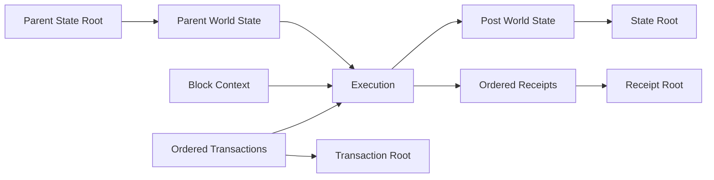

诚实执行客户端会：

1. 从父区块确定起始状态；
2. 验证区块上下文与交易编码；
3. 按区块内顺序执行每笔交易；
4. 计算费用、状态变更、Log 和 Receipt；
5. 得到最终 State Root、Transaction Root 和 Receipt Root；
6. 与区块承诺比较，不一致则拒绝区块。

这里的 World State 不是每个区块完整复制一份账户表。客户端通常使用持久化结构、缓存、快照和裁剪优化，但这些属于实现，不能假设某客户端数据库目录就是协议数据模型。

---

## 三、Account-based Model

Account-based Model 直接维护地址对应的账户状态。转账的概念变化类似：

```text
sender.balance   -= value
receiver.balance += value
sender.nonce     += protocol-defined increment
```

真实执行还包含费用、Gas、代码执行、退款、创建/销毁语义和失败回滚。

### 3.1 与 UTXO 模型比较

| 维度 | Ethereum 账户模型 | UTXO 模型 |
|---|---|---|
| 基本状态 | 地址到账户字段 | 未花费输出集合 |
| 支付输入 | 账户余额与 Nonce | 指定 UTXO |
| 冲突域 | 同账户连续 Nonce 等 | 消费同一 UTXO |
| 找零 | 直接更新余额 | 通常生成 Change Output |
| 并发 | 同账户交易受顺序约束 | 独立输入可并行构造 |
| 合约状态 | 账户 Storage | 取决于具体 UTXO 链扩展 |

账户模型让合约读写全局命名状态更直接，但也带来同账户 Nonce 协调、共享状态竞争和 Storage 访问成本。

### 3.2 状态不是交易历史

当前余额是历史执行结果，不能替代历史本身：

```text
S0 --T1--> S1 --T2--> S2 --T3--> S3
```

只知道 `S3` 无法完整推导 `T1...T3`。Transaction、Receipt、Log 和 Trace 提供不同历史视角，不能从 State Root 单独恢复所有交易。

### 3.3 状态转换依赖顺序

Alice 余额只能支付一笔交易时，相同 Nonce 的两个交易不能同时有效；合约中的抢购、清算和 AMM 价格也随前序交易变化。因此 Transaction Root 承诺的是**有序交易序列**，不是无序集合。

---

## 四、World State

World State 可以概念化为：

```text
Address -> AccountState
```

经典账户状态可表示为：

```text
AccountState {
  nonce
  balance
  storageRoot
  codeHash
}
```

这只是协议概念，不是 Solidity Struct，也不是 RPC 直接返回的 JSON 对象。

### 4.1 地址与账户状态

地址空间很大，World State 只需承诺有状态的账户。对于查询到的空值，要区分：

- 协议意义上的不存在账户；
- 存在但字段处于空值的账户；
- RPC 节点裁剪或缺少历史状态；
- 请求指定区块不存在或节点尚未同步；
- 协议升级对空账户清理和代码授权的影响。

不能用“余额为 0”判断地址从未使用。

### 4.2 状态承诺与客户端数据库

协议要求不同客户端对相同输入得到相同 Root，但不要求它们采用相同存储引擎。客户端可以使用：

- Trie 节点数据库；
- Flat State / Snapshot；
- 内存缓存；
- Journal；
- History/Ancient 数据；
- Path-based 或 Hash-based 方案。

这些实现会随版本变化。应用应通过稳定 RPC 或协议证明访问，不能直接依赖节点内部 Key-Value Schema。

---

## 五、EOA 与 Contract Account

### 5.1 EOA

EOA（Externally Owned Account，外部拥有账户）经典上由私钥/签名授权发起交易，拥有 Balance 和 Nonce，通常不承载传统合约部署产生的持久 Runtime Code。

但需要两个边界：

- 地址本身不保存“真实用户身份”，控制权来自当前协议认可的授权规则；
- 账户抽象和账户代码相关升级可能扩展 EOA 行为，写作与实现必须标注 Fork，不能永久假设 `code.length === 0` 等价于“普通用户”。

### 5.2 Contract Account

Contract Account 具有 Runtime Code，并可拥有 Balance、Nonce 和独立 Storage。它不能像 EOA 一样凭私钥主动产生顶层交易，通常由外部交易或其他合约调用触发执行。

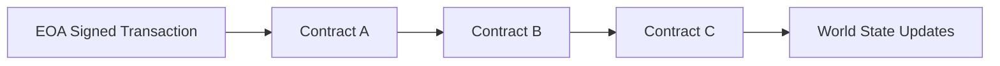

内部调用不是新的顶层签名交易，也不拥有独立交易哈希。Trace 可以描述调用帧，但 Trace API 常为客户端扩展，不属于所有节点必须提供的标准核心接口。

### 5.3 `msg.sender` 与执行上下文

直接调用、代理调用、`delegatecall` 和账户抽象会改变“谁发起”“谁执行代码”“谁的 Storage 被写入”的关系。安全判断不能只看 `tx.origin` 或假设调用者一定是 EOA。

合约授权应基于明确协议设计，并考虑 Forwarder、Smart Account、Proxy 和跨链消息验证器。

---

## 六、Balance：原生资产不是 Token 余额

账户 `balance` 表示协议原生资产的最小单位数量。它是整数，不使用浮点数。

```typescript
function formatUnits(value: bigint, decimals: number): string {
  if (!Number.isInteger(decimals) || decimals < 0) {
    throw new RangeError('invalid decimals');
  }

  const base = 10n ** BigInt(decimals);
  const whole = value / base;
  const fraction = (value % base)
    .toString()
    .padStart(decimals, '0')
    .replace(/0+$/, '');

  return fraction ? `${whole}.${fraction}` : whole.toString();
}
```

生产代码优先使用经过测试的链 SDK 单位转换 API。不要把大整数转为 JavaScript `number`，否则可能超过安全整数范围。

### 6.1 ERC-20 Balance 在哪里

Token 余额通常是 Token Contract Storage 中的 Mapping：

```text
tokenContract.storage[slot(address, balancesMapping)] -> tokenBalance
```

所以：

- `eth_getBalance(address)` 查询原生资产；
- Token `balanceOf(address)` 执行合约读取 Storage；
- Token Decimal 是展示元数据，不改变链上整数；
- 非标准 Token 可能有 Fee、Rebase、Blacklist 或返回值差异。

### 6.2 Balance 变化不只来自显式转账

费用支付、区块奖励/协议款项、合约调用 Value、销毁或协议升级规则都可能影响余额。仅靠普通 Transfer Event 不能重建所有原生资产变化；完整分析可能需要 State Diff/Trace 和协议规则。

---

## 七、Nonce：不只是“交易数量”

账户 Nonce 用于协议排序、防重放和创建地址推导等语义。常见简化是：EOA 顶层交易每成功纳入执行流程会按规则推进发送者 Nonce；Contract Account 的 Nonce 与创建合约等操作相关。

精确更新时机和特殊路径必须以目标 Fork 的 Execution Specification 为准。

### 7.1 Nonce 与并发发送

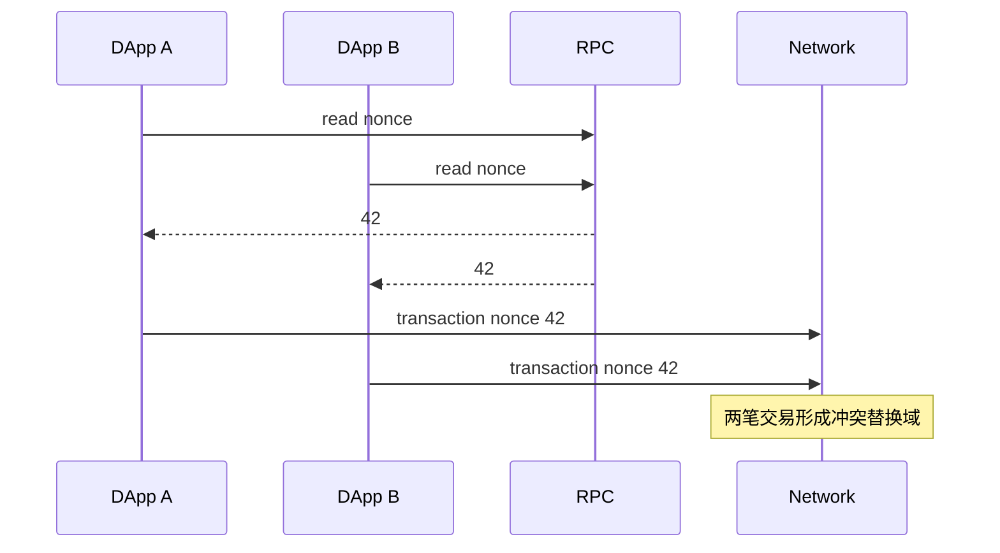

多个发送器必须使用账户级协调器，综合规范链 Nonce、本地已签名交易、Pending 视图、替换与重组记录。

### 7.2 Nonce 与合约地址

传统 `CREATE` 地址推导与创建者地址及其 Nonce 等输入相关；`CREATE2` 使用不同的确定性地址公式，涉及 Salt 和 Init Code Hash。两者都可能发生地址已被占用、部署失败或协议升级带来的语义边界。

不要把预测地址等同于合约已部署，应在目标区块验证 Code Hash 与初始化状态。

---

## 八、Code：Init Code 与 Runtime Code

部署合约时，交易或创建调用提供 Init Code。EVM 执行 Init Code，其返回字节成为账户持久 Runtime Code：

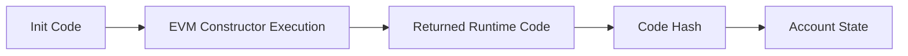

Constructor 逻辑本身通常不会作为 Runtime Code 原样保留。

### 8.1 Code Hash

账户状态通过 Code Hash 承诺 Runtime Code，客户端可按哈希去重或定位 Code。相同 Runtime Code 可对应多个账户，但每个账户仍有自己的 Balance、Nonce 与 Storage Root。

### 8.2 Code 不是业务状态

合约升级常用 Proxy：用户调用 Proxy 地址，Proxy Storage 保存业务状态，并通过 `delegatecall` 执行 Implementation Code。

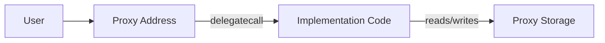

此时：

- `address(this)` 和 Storage Context 通常是 Proxy；
- 执行字节码来自 Implementation；
- Storage Layout 必须跨升级兼容；
- 只查看 Proxy Code 不能确定当前全部业务逻辑；
- Implementation Slot、Admin 和 Beacon 等取决于代理标准。

---

## 九、Storage：256-bit Key 到 256-bit Value

Contract Storage 概念上是：

```text
storage[address][256-bit key] -> 256-bit value
```

未写入 Slot 的默认读取值为零。Storage 是持久状态，与一次调用中的 Stack、Memory 和 Transient Storage（若目标 Fork 支持）不同。

### 9.1 Solidity Storage Layout

Solidity 编译器按类型和声明顺序安排 Slot：

- 小型静态值可能 Pack 到同一 Slot；
- Struct 和 Array 有布局规则；
- Mapping 元素位置由 Key、基准 Slot 和规范哈希编码派生；
- Dynamic Array 数据区从派生位置开始；
- Inheritance 会影响变量顺序。

布局属于编译器契约并可能受版本影响。分析前必须固定 Solidity 版本和 Compiler Output 中的 `storageLayout`。

### 9.2 Mapping Slot 概念

对于简化声明：

```solidity
mapping(address => uint256) internal balances;
```

元素位置由 Key 与 Mapping 基准 Slot 按 Solidity 规定的 32 Byte 编码和 Keccak 计算。不能使用字符串拼接或 SHA-256 代替，也不能忽略 Key Padding。

应使用编译器布局、标准 SDK 或经过验证的工具计算，不手写生产解码器。

### 9.3 `eth_getStorageAt` 返回原始 Slot

```typescript
interface StorageReadEvidence {
  chainId: bigint;
  blockNumber: bigint;
  blockHash: string;
  contract: string;
  slot: string;
  value: string;
  compilerVersion?: string;
  layoutArtifactHash?: string;
}
```

RPC 不知道 Slot 对应 `owner`、`balance` 还是 Packed Struct。语义解释依赖源码、编译器版本、代理实现和 Storage Layout。

### 9.4 Storage 成本不是数据库磁盘价格

EVM 对 Storage 访问和修改收取 Gas，成本由协议规则决定，可能受 Warm/Cold Access、原值/新值、Refund 和 Fork 影响。不能用“写一个 Slot 固定多少 Gas”的过时常数做长期容量规划。

---

## 十、调用、回滚与状态提交

一笔交易可以产生嵌套调用帧，每个帧可能修改临时可回滚状态。

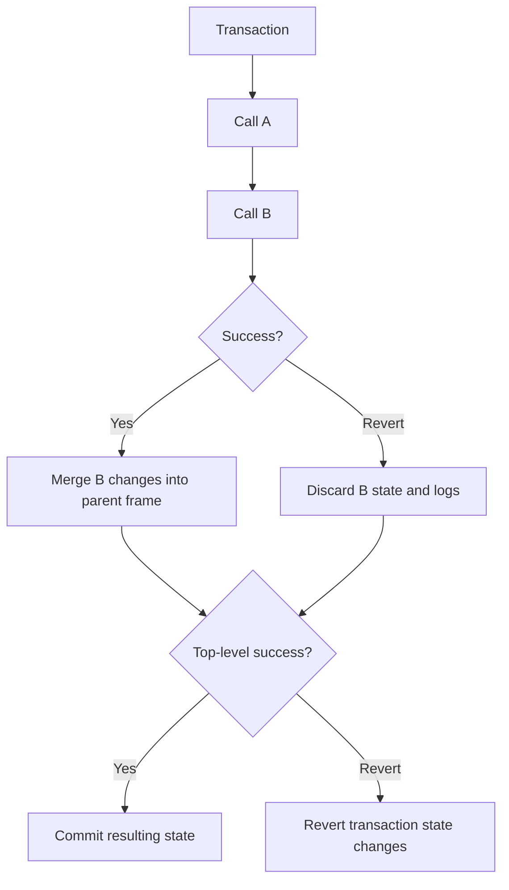

### 10.1 Revert 不等于“什么都没发生”

失败交易仍可能：

- 被区块收录；
- 消耗 Gas 并支付费用；
- 推进发送账户 Nonce；
- 产生失败 Receipt 状态；
- 在 Trace 中显示执行路径。

失败调用帧内的 Storage、Balance 变化和 Log 会按 EVM 规则回滚，但已经消耗的执行资源不会时间倒流。

### 10.2 内层失败可以被捕获

低级调用返回失败时，外层合约可以选择处理并继续，因此顶层交易成功不代表每个内部调用都成功。业务验证应检查最终状态或可靠的应用事件，必要时结合 Trace。

### 10.3 Read-only Call 不是共识交易

`eth_call` 在节点选择的状态上模拟执行，不广播、不进入区块、不永久提交状态，也没有协议最终性。结果依赖：

- 指定 Block Tag/Hash；
- From、Value、Gas 等调用参数；
- 节点支持的 Override；
- 当前 Fork 规则；
- RPC 是否位于正确规范链。

一次 `eth_call` 成功不能保证之后提交的交易成功。

---

## 十一、State Root

State Root 承诺区块执行完成后的 World State。在经典 Ethereum 模型中，它与 Merkle Patricia Trie（MPT）状态承诺相关。

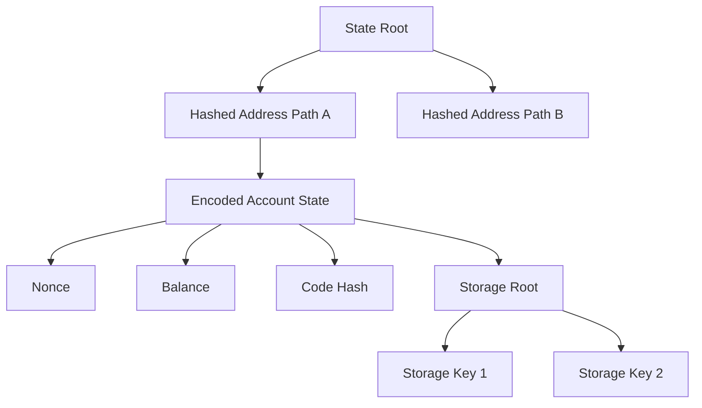

图省略了 MPT 的 Branch/Extension/Leaf、Nibble Path、RLP 和节点内联规则，不能作为 Proof 实现。

### 11.1 State Root 提供什么

- 固定长度承诺整个 World State；
- 不同客户端可比较执行结果；
- 可配合账户/Storage Proof 验证局部状态；
- 父状态与交易执行可确定地产生子 Root。

它不提供：

- 全部状态数据本身；
- Root 所在区块一定属于规范链；
- 数据可用性；
- 业务输入真实性；
- 历史状态永久可由任意 RPC 查询。

### 11.2 Proof 验证链

验证某 Storage 值需要形成信任链：

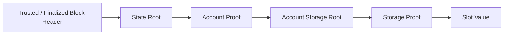

只验证 Storage Proof，却从不验证 Block Header 和 Finality，仍然信任 RPC 提供的 Root。

---

## 十二、Transaction Root

Transaction Root 承诺区块中的**有序、规范编码交易列表**。在经典执行层区块中，交易按区块索引组织到协议规定的 Trie/承诺结构。

### 12.1 它解决什么

- 检测区块交易内容或顺序被替换；
- 让区块头以固定长度承诺交易列表；
- 配合 Proof 验证某个编码交易位于该区块位置。

Transaction Root 不证明交易执行成功。失败交易也可以合法出现在交易列表中。

### 12.2 交易哈希与 Transaction Root

交易哈希标识一份规范编码交易，Transaction Root 承诺整个有序列表。一个交易哈希不能替代区块级 Root，Root 也不能直接当作任一交易哈希。

Typed Transaction 的编码与旧式交易可能不同，Proof/Root 计算必须按目标 Fork 的规范序列化处理。

---

## 十三、Receipt Root

每笔交易执行后形成 Receipt。Receipt Root 承诺与交易顺序对应的有序 Receipt 列表。

经典 Receipt 概念通常包含：

- 交易执行状态或历史 Fork 中的状态字段；
- Cumulative Gas Used；
- Logs Bloom；
- Logs；
- Typed Receipt 的类型封装（若适用）。

精确字段和编码应查目标 Fork 的 Execution Specification。

### 13.1 Receipt、Log 与 Event

Solidity Event 编译为 EVM Log。Log 包含发出合约地址、Topics 和 Data。Indexer 用 ABI 解码成业务事件。

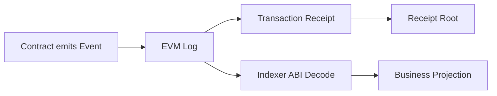

需要验证：

- 发出地址是否为目标合约/代理；
- Topic 与 ABI 是否匹配；
- Block Hash 是否仍在规范链；
- Log 是否因重组被移除；
- 合约升级后 Event 语义是否改变。

### 13.2 Receipt 不是 State Diff

Receipt 不列出每一个账户和 Storage Slot 的前后值。没有 Event 的 Storage 更新仍会影响 State Root，但不会自动出现在 Receipt Log 中。

完整 State Diff 通常需要客户端 Trace/Debug 能力或重放执行；这些接口可能成本高、非标准且因客户端而异。

### 13.3 Cumulative Gas 与单笔 Gas

Receipt 协议字段可能保存区块内累计 Gas。RPC 常派生并返回该交易自身 `gasUsed`。不要混用累计值、交易 Gas Limit、实际 Gas Used 和费用金额。

---

## 十四、三类 Root 对比

| Root | 承诺对象 | 是否有序 | 能回答 | 不能回答 |
|---|---|---|---|---|
| State Root | 执行后的 World State | 地址/Key 由结构定义 | 某账户/Slot 是否匹配该状态 | 哪些交易导致变化 |
| Transaction Root | 区块规范交易列表 | 是 | 某交易是否位于该区块列表 | 执行是否成功 |
| Receipt Root | 有序执行回执列表 | 是 | 某 Receipt/Log 是否匹配区块执行回执 | 完整 State Diff |

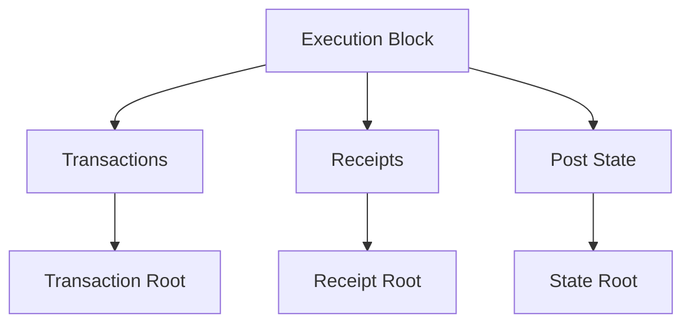

三者共同约束“输入、执行摘要和输出状态”，但仍要结合父区块、区块哈希与共识最终性才能形成完整验证链。

---

## 十五、历史状态、Full Node 与 Archive Node

验证新区块通常需要当前/近期状态，不代表节点必须永久保留每个历史高度的完整可查询状态。

### 15.1 为什么历史查询会失败

- 节点启用了 State Pruning；
- RPC 提供商只开放有限历史范围；
- 节点仍在同步；
- 请求的区块已重组为非规范块；
- Trace/Proof 接口未启用；
- 历史数据位于独立服务或冷存储。

Archive Node 通常保留或能重建更完整历史状态，但“Archive”能力和实现方式应按客户端/服务商确认。

### 15.2 Indexer 不等于 Archive State

Indexer 可以从 Event 构建余额、订单和持仓投影，但未必能回答任意 Storage Slot 的历史值。它还需要处理：

- Backfill；
- Reorganization Rollback；
- ABI/Contract Upgrade；
- Missing Event；
- Checkpoint Height + Block Hash；
- 与链上状态的周期对账。

---

## 十六、RPC 读取的一致性

连续读取 `latest` 可能跨越不同区块：

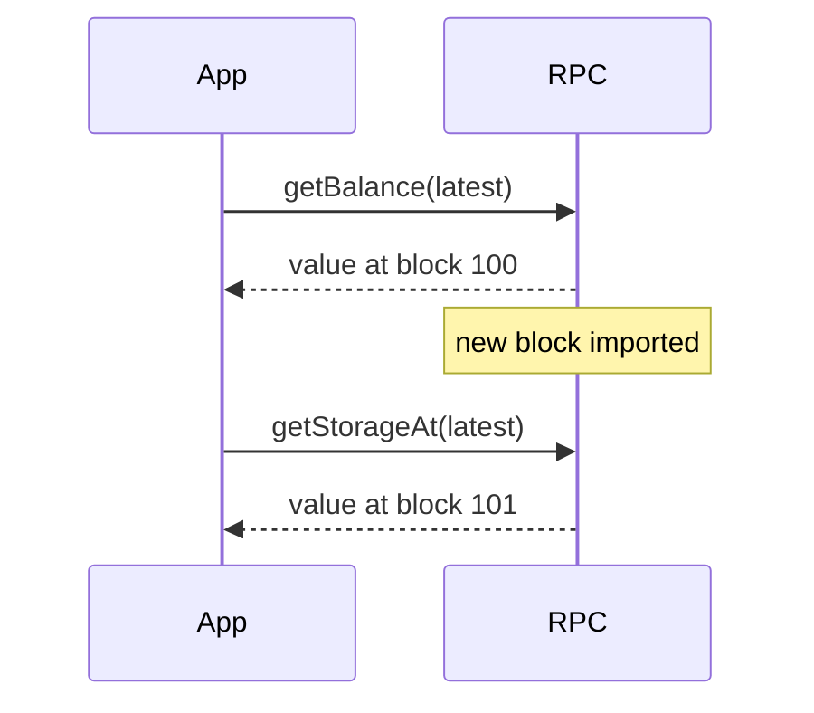

组合结果不属于同一状态快照。

### 16.1 固定区块证据

```typescript
interface BlockReference {
  chainId: bigint;
  number: bigint;
  hash: string;
}

interface AccountSnapshot {
  block: BlockReference;
  address: string;
  balance: bigint;
  nonce: bigint;
  codeHash?: string;
}
```

读取流程应先获取目标 Block Reference，再在所有查询中固定相同 Block Number/Hash；RPC 支持按 Hash 查询时优先避免高度在重组后指向不同块。最后再次验证该 Block 是否仍规范并达到所需 Finality。

### 16.2 RPC 数据类型

Ethereum JSON-RPC 常使用 Hex Quantity 与 Hex Data，两者编码规则不同。应用必须通过成熟 SDK 解析：

- 保持 `bigint` 精度；
- 校验地址和 Byte 长度；
- 区分 `null`、`0x` 与零 Quantity；
- 不用浮点数处理 Balance/Nonce；
- 记录 Chain ID 和 Block Hash。

---

## 十七、常见误区与错误案例

### 17.1 误区：EOA 永远没有 Code

这是经典模型的历史简化。账户代码授权与账户抽象相关升级会扩展行为，安全代码不能永久用 `code.length === 0` 判断“真人”或阻止合约调用。

### 17.2 误区：Nonce 就是成功交易数量

Nonce 是协议字段，失败但被收录的交易、合约创建和不同账户语义都会影响它。应按目标 Fork 规则解释。

### 17.3 误区：ERC-20 余额等于账户 Balance

账户 Balance 是原生资产；Token 余额通常位于 Token Contract Storage，需要执行 `balanceOf` 或读取正确 Mapping Slot。

### 17.4 误区：Receipt 成功即可知道所有状态变化

Receipt 不包含完整 State Diff。它提供状态、Gas 和 Log 等摘要；没有 Event 的 Storage 更新仍体现在 State Root 中。

### 17.5 误区：三个 Root 都是交易的 Merkle Root

State、Transaction、Receipt Root 分别承诺输出状态、输入交易和执行回执，不可互换。

### 17.6 错误案例：用多个 `latest` 读取结算

```typescript
// 错误：两次 latest 可能来自不同区块。
const balance = await rpc.getBalance(account, 'latest');
const nonce = await rpc.getTransactionCount(account, 'latest');
```

应先固定一个达到业务要求的 Block Reference，让所有读取绑定同一块，并在结算前确认该块仍属于规范链。

### 17.7 错误案例：升级合约随意调整变量顺序

Proxy 保留旧 Storage，Implementation 改变布局后，相同 Slot 会被按新类型解释，可能破坏权限、余额和地址。升级前必须比较编译器 Storage Layout，并运行 Fork Test 与状态迁移测试。

---

## 十八、工程实践

### 18.1 状态读取分层

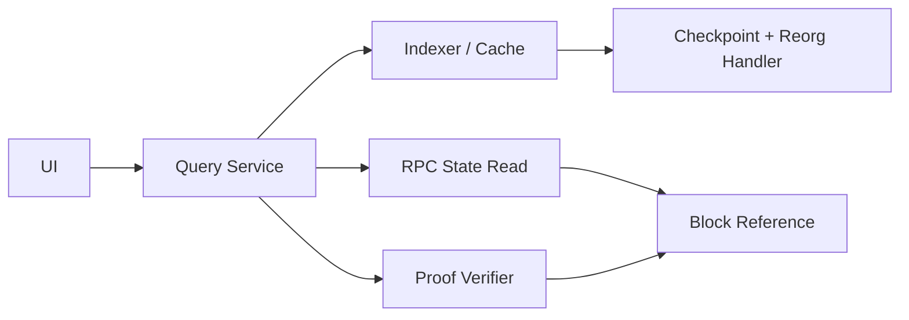

- UI 展示可用 Indexer 与 Cache 提升速度；
- 高风险操作在提交前用 RPC/Simulation 复核；
- 结算证据固定 Block Hash 和 Finality；
- 需要减少 RPC 信任时验证账户/Storage Proof；
- 多来源冲突时进入 Degraded，而不是按最快响应覆盖。

### 18.2 合约升级检查

- 固定 Compiler 和 Optimizer 配置；
- 导出并 Diff Storage Layout；
- 禁止删除、重排或不兼容修改已有变量；
- 检查 Inheritance 顺序；
- 验证 Initializer 只能按设计执行；
- 在主网 Fork 上加载真实 Storage 回归；
- 检查 Proxy、Implementation、Admin 与 Beacon Slot；
- 记录 Code Hash 和部署交易；
- 设置 Timelock、Pause 与回滚预案。

### 18.3 缓存 Key 必须包含区块语义

错误 Cache Key：

```text
balance:{address}
```

更完整的 Key：

```text
balance:{chainId}:{blockHash}:{address}
```

若缓存“当前值”，还需要记录来源高度/哈希，并在重组时失效。

---

## 十九、测试与验证方法

### 19.1 状态转换测试

- 原生转账成功与余额不足；
- 合约调用成功、Revert 和 Out of Gas；
- 内层失败被外层捕获；
- Nonce Gap 与替换交易；
- Contract Creation 成功与失败；
- Event 与最终 Storage 一致性；
- Proxy 升级前后 Storage Layout；
- 重组后 State/Receipt/Transaction Root 变化；
- Historical State 与 Pruned Node 行为。

### 19.2 Root 与 Proof 验证

1. 固定 Chain、Fork、Block Number 和 Block Hash。
2. 从至少一个可信客户端获取区块头与三个 Root。
3. 独立获取规范编码交易和 Receipt，使用成熟库重建相应承诺。
4. 获取 Account/Storage Proof 并从 State Root 验证。
5. 修改一个 Byte，确认验证失败。
6. 在不同 Execution Client 上交叉验证同一区块。

不要在业务代码中手写 RLP、MPT 或 Typed Transaction Proof；应使用协议测试向量和经过审计的实现。

### 19.3 版本记录

- Network 与 Chain ID；
- Fork/协议升级名称；
- Block Number + Block Hash；
- Execution Client 与版本；
- Solidity Compiler 与设置；
- Contract Address、Proxy 与 Implementation；
- ABI、Bytecode、Code Hash、Storage Layout Artifact Hash；
- RPC 方法和提供商；
- 验证日期。

---

## 二十、总结

Ethereum 状态模型可以按“输入、执行、输出承诺”理解：

1. World State 把地址映射到账户状态，交易按区块顺序推进状态。
2. 账户经典字段包含 Nonce、Balance、Storage Root 和 Code Hash。
3. EOA 由外部授权发起交易，Contract Account 由调用触发代码执行；升级可能扩展传统边界。
4. Balance 是原生资产，Token 余额通常属于 Token Contract Storage。
5. Runtime Code 与 Storage 分离，代理模式让执行代码和状态地址进一步解耦。
6. Storage Layout 是可升级合约的持久数据契约，必须固定编译器并做兼容性检查。
7. Revert 回滚状态和 Log，但失败交易仍可能消耗 Gas、推进 Nonce 并留下 Receipt。
8. State Root 承诺执行后状态，Transaction Root 承诺有序输入，Receipt Root 承诺有序执行摘要。
9. Receipt 不是 State Diff，Event 也不是所有状态变化的完整日志。
10. 历史查询依赖节点保留策略，多个 `latest` RPC 读取不构成一致快照。

真正可靠的 DApp 不只“调用 RPC 拿到一个值”，而是知道这个值属于哪条链、哪个区块、哪种状态语义、是否已最终化，以及如何从 Root 或独立来源验证。

---

## 问答复盘

### Q1：Ethereum 的 Account-based Model 与 UTXO 最大区别是什么？

**答：** 账户模型直接更新地址状态和连续 Nonce；UTXO 模型消费离散未花费输出。两者的并发冲突域、找零和状态访问方式不同。

### Q2：EOA 是否可以永久定义为“没有 Code 的地址”？

**答：** 不能作为永久安全假设。经典 EOA 通常无传统 Runtime Code，但账户代码和账户抽象相关升级可能扩展语义，必须按目标 Fork 判断。

### Q3：原生资产 Balance 与 ERC-20 Balance 是否存放在同一字段？

**答：** 否。原生资产位于账户 Balance；ERC-20 余额通常是 Token Contract Storage 中 Mapping 的值。

### Q4：Contract Code 和 Storage 属于同一个数据区域吗？

**答：** 不是。账户通过 Code Hash 关联 Runtime Code，通过 Storage Root 承诺独立 Storage。代理 `delegatecall` 还会用 Implementation Code 操作 Proxy Storage。

### Q5：State Root、Transaction Root 和 Receipt Root 最容易混淆的边界是什么？

**答：** 它们分别承诺执行后状态、有序交易输入和有序回执。交易被承诺不代表执行成功，Receipt 被承诺也不包含完整 State Diff。

### Q6：交易 Revert 后是否完全没有链上影响？

**答：** 不是。状态写入和 Log 会按规则回滚，但交易仍可被收录、消耗 Gas、推进发送者 Nonce，并产生失败 Receipt。

### Q7：为什么连续两次读取 `latest` 可能不一致？

**答：** 两次调用之间节点可能导入新区块或发生重组，返回值属于不同状态快照。应固定 Block Number/Hash，并验证其规范性和最终性。

### Q8：代理合约升级前最关键的状态检查是什么？

**答：** 比较旧、新 Implementation 的 Storage Layout，确保已有变量 Slot、类型和继承顺序兼容，并在真实状态 Fork 上测试升级和回滚。

---

## 延伸知识

- **Execution 与 Consensus**：Execution Payload 如何被共识层提议、验证和最终化。
- **EVM 数据区域**：Stack、Memory、Calldata、Storage、Transient Storage 和 Return Data。
- **Solidity Storage Layout**：Packing、Mapping、Dynamic Array、Inheritance 与 Upgrade Gap。
- **Gas 模型**：Storage Warm/Cold Access、SSTORE 状态转换与 Refund。
- **事件与 Indexer**：Receipt Log、Bloom、重组回滚和链下投影。
- **State Proof**：MPT、RLP、Account Proof、Storage Proof 与轻客户端验证链。
