# Ethereum Execution 与 Consensus：双客户端如何协作完成出块和最终化

> 合并后的 Ethereum 节点不是一个客户端包办所有职责。Consensus Client 维护 PoS 共识视图，Execution Client 执行交易并验证状态；两者通过 Engine API 共同判断一个区块是否既满足共识规则，又包含有效的 Execution Payload。

---

## 一、本文解决什么问题

运行 Ethereum 节点或阅读架构文档时，经常遇到这些问题：

- 为什么通常需要 Execution Client 和 Consensus Client 两套软件？
- Consensus Client 能否自己执行 EVM 交易？
- Execution Client 已验证交易，为什么还不能决定规范链？
- Engine API 与 DApp 使用的 JSON-RPC 有什么区别？
- Beacon Block 与 Execution Payload 是什么关系？
- Slot 是否必然有区块，Epoch 是否等于固定确认数？
- Validator 在一次 Slot 中承担哪些 Duty？
- Proposer 如何从 Mempool 获得交易并构造区块？
- Payload 返回 `VALID`、`INVALID` 或同步中状态时如何处理？
- 最新区块仍增长，为什么 `finalized` 可能停止？
- 为什么 EL 和 CL 都需要 Client Diversity？

本文讨论 Ethereum 完成 The Merge 后的通用双客户端模型。Engine API 方法版本、Payload 字段、Fork Choice 参数和 Validator Duty 会随 Fork 演进；部署前必须以目标网络当前 Fork 的 Execution API、Consensus Specification 和客户端兼容矩阵为准。

### 核心结论

1. Execution Layer（EL）负责 Mempool、EVM 执行、World State、Receipt 和 Execution Payload 有效性；Consensus Layer（CL）负责 Beacon Chain、PoS Fork Choice、Validator 投票和 Finality。
2. 一个区块只有同时通过 Consensus 与 Execution 验证，才能成为节点接受的完整有效区块。
3. CL 决定 Head、Safe 与 Finalized 视图；EL 根据 CL 的 Fork Choice 状态切换规范执行链并维护 JSON-RPC 视图。
4. Engine API 是 CL 与 EL 间的版本化控制接口，不是应暴露给公网 DApp 的普通 RPC。
5. Execution Payload 是 Beacon Block 中承载执行层区块数据的部分，不包含全部 Beacon 共识数据。
6. Slot 是调度机会，不保证一定产生区块；Epoch 是一组 Slot，不保证每个 Epoch 必然 Finalized。
7. Validator Duty 包含提议、Attestation 和协议定义的委员会职责，签名必须绑定正确 Domain、Slot/Epoch 并经过 Slashing Protection。
8. 出块时 CL 提供共识上下文，EL 构造并执行 Payload，CL 再封装为 Beacon Block 并传播。
9. Optimistic Sync 允许 CL 暂时跟随尚未完成执行验证的 Head，但不能把该状态当成最终业务证据。
10. Finality Stall 时 Head 可能继续增长，高价值结算必须监控 Finalized Checkpoint。
11. Client Diversity 要同时覆盖 EL、CL、运营实体和基础设施，而不是同机多开进程。

---

## 二、双客户端架构

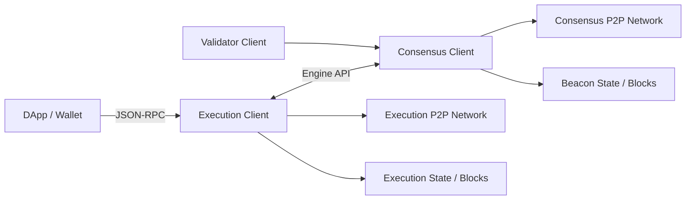

有的发行方式会打包多个组件，但职责边界仍存在。常见部署还会把 Beacon Node 与持有签名能力的 Validator Client 分开。

### 2.1 为什么拆层

- 复用成熟 EVM 和执行客户端生态；
- 独立演进 PoS 共识和执行协议；
- 用标准 Engine API 组合不同 EL/CL；
- 分别实现两层 Client Diversity；
- 隔离高频 Validator Key 与公共 RPC。

代价是版本兼容、双 P2P 网络、双数据库、Engine 认证、同步状态和故障定位都更复杂。

### 2.2 两个 P2P 网络

- EL 网络传播交易及执行相关数据；
- CL 网络传播 Beacon Block、Attestation 和共识消息；
- Engine API 通常只在同一受控节点边界内连接 EL 与 CL。

EL Peer 正常不代表 CL 已同步，CL Peer 正常也不代表 Execution State 已就绪。

---

## 三、Execution Client

Execution Client 的主要职责：

- 维护 Mempool；
- 验证交易签名、Nonce 与费用；
- 执行 EVM 状态转换；
- 维护账户、Code、Storage、Receipt 和 Log；
- 验证或构造 Execution Payload；
- 根据 CL 指令更新规范执行链；
- 提供 `eth_*` JSON-RPC。

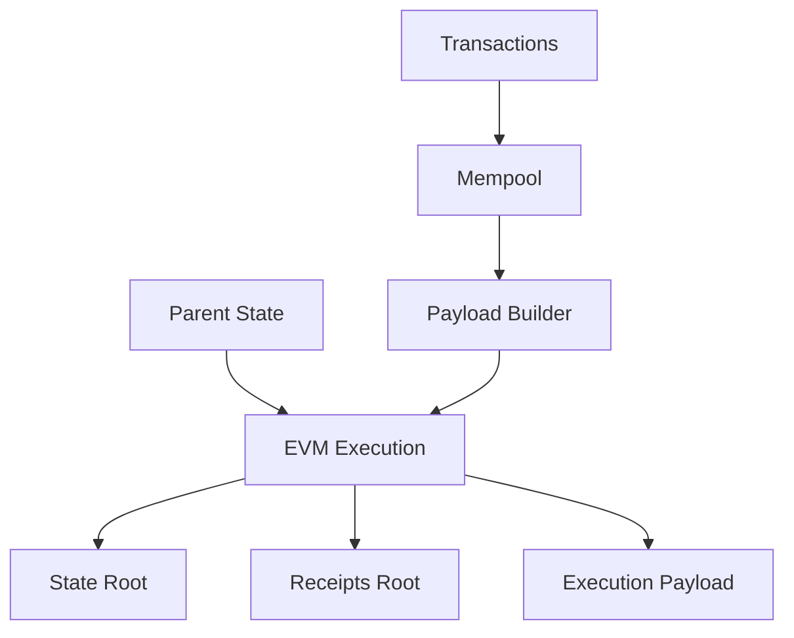

### 3.1 EL 不决定 PoS 最终性

EL 能判断交易和状态转换是否有效，却不能仅凭执行数据知道哪个分支获得足够 Attestation、哪个 Checkpoint 已 Finalized。这是 CL 的共识职责。

### 3.2 Mempool 是本地视图

不同 EL 的 Mempool 可能不同。CL 不直接把 DApp 交易放进区块，Proposer 配对的 EL 或外部 Builder 只能从自己可见的订单流构造 Payload。因此 RPC 提交成功不保证交易被目标 Proposer 看见。

### 3.3 EL 的规范视图受 CL 驱动

合并后，CL 通过 Engine API 告诉 EL 当前 Head、Safe、Finalized Execution Hash。若 CL 断开，EL 可能仍接受交易或查询历史，但不能独立正确推进 PoS 规范链。

---

## 四、Consensus Client

Consensus Client 负责：

- 同步 Beacon Block 与 Beacon State；
- 验证 Proposer、Attestation 和委员会消息；
- 执行 PoS State Transition；
- 运行 Fork Choice；
- 跟踪 Justified/Finalized Checkpoint；
- 调度 Validator Duty；
- 调用 Engine API 验证或构造 Payload；
- 通过共识 P2P 网络传播消息。

### 4.1 CL 不执行完整 EVM

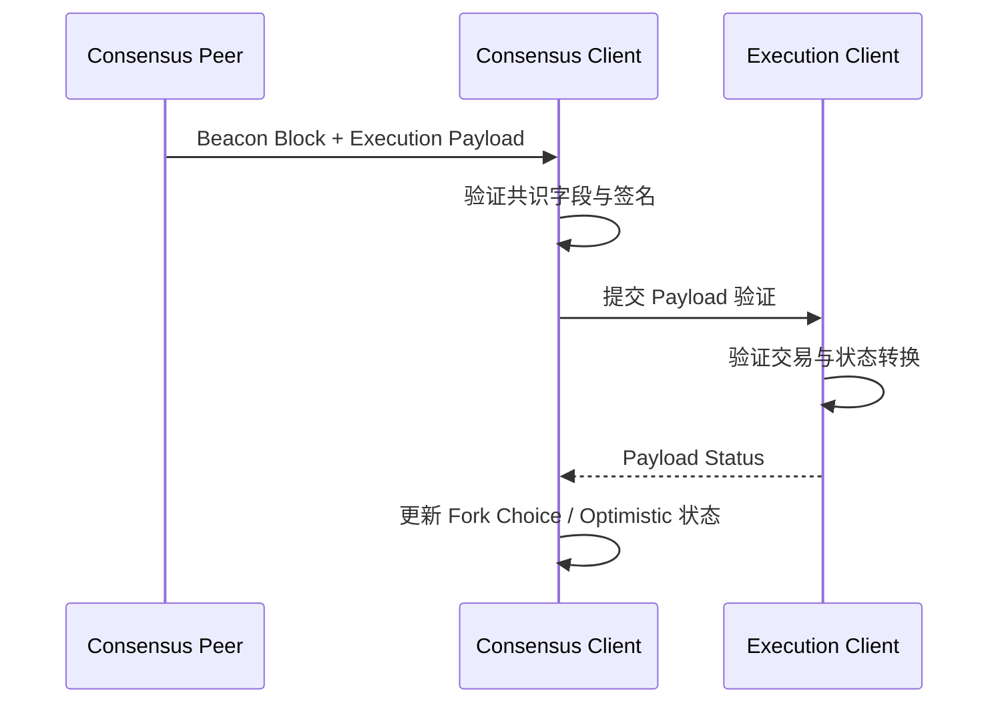

Beacon 共识字段有效不代表 EVM 执行有效；两层验证缺一不可。

### 4.2 Beacon Node 与 Validator Client

- Beacon Node 负责 P2P、Fork Choice、Beacon State 和 Engine API；
- Validator Client 获取 Duty 并调用 Validator Key 签名；
- Remote Signer 可以隔离密钥。

Remote Signer 不应是“给什么签什么”的裸服务。它需要校验 Fork/Domain、Slot、Source/Target，并持有完整 Slashing Protection 记录。

---

## 五、Engine API

Engine API 用于交换：

- 新 Execution Payload 与验证状态；
- Fork Choice State；
- Payload 构造属性；
- 已构造 Payload；
- Capability/版本信息；
- 新 Fork 引入的执行对象。

方法名和 Payload Schema 通常带版本，不能把某一 Fork 的方法集合当作永久接口。

### 5.1 三类核心交互

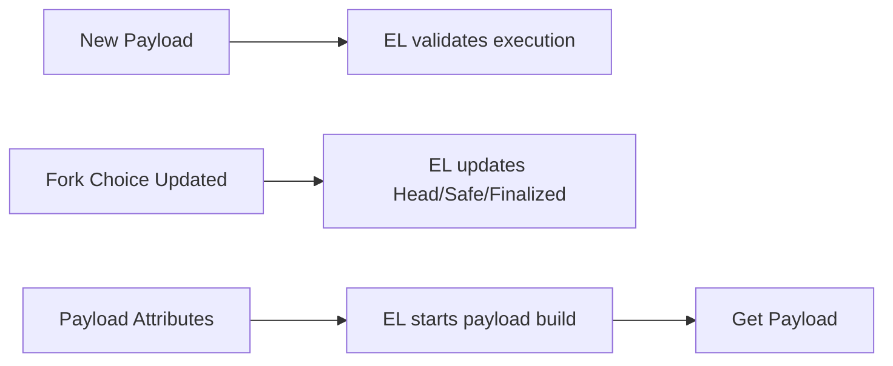

1. **New Payload**：CL 将网络收到的 Payload 交给 EL 验证。
2. **Fork Choice Updated**：CL 告诉 EL Head/Safe/Finalized，并可能触发构造。
3. **Get Payload**：CL 为 Proposal 获取候选 Payload。

真实调用还包含 Payload ID、缓存、状态响应和 Fork 特定对象，应使用官方测试向量验证。

### 5.2 Payload Status 不是 Boolean

状态可能表达：

- 已验证有效；
- 明确无效，并带 Latest Valid Hash 等上下文；
- EL 正在同步；
- 暂时接受但尚未完成验证；
- 参数或版本错误。

把所有非 `VALID` 当永久失败会破坏 Optimistic Sync；把同步中当 `VALID` 则会错误扩大信任。

### 5.3 安全边界

Engine API 通常使用共享 JWT Secret，并只监听 Loopback 或受保护私网：

- EL、CL 使用同一 Secret；
- Secret 不入 Git、镜像层和日志；
- 文件权限最小化；
- Engine Port 不暴露公网；
- 容器网络只允许配对 CL；
- 认证失败可监控但不记录 Token。

JWT 不是把 Engine API 暴露公网的理由。该接口可影响 Fork Choice 和 Payload 构造，应按控制平面隔离。

### 5.4 版本兼容

EL 与 CL 可以各自启动成功，却因 Fork/Engine 版本不兼容而无法协作。升级前检查目标 Fork、最低客户端版本、Capability、Payload Schema、JWT 和回滚兼容性。Fork 激活后回滚到不支持它的版本不是安全回滚。

---

## 六、Beacon Chain、Slot 与 Epoch

Beacon Chain 是 Ethereum PoS 共识链和状态机，维护 Validator Registry、Attestation、Checkpoint 与 Execution Payload 关联等数据。

### 6.1 Slot 是提议机会

- Slot 是时间位置，不是区块 ID；
- Proposer 离线、区块无效或传播过晚会出现 Missed Slot；
- 后续 Slot 仍可继续；
- Slot 与 Execution Block Number 不一一等同；
- 时钟偏差会影响 Duty。

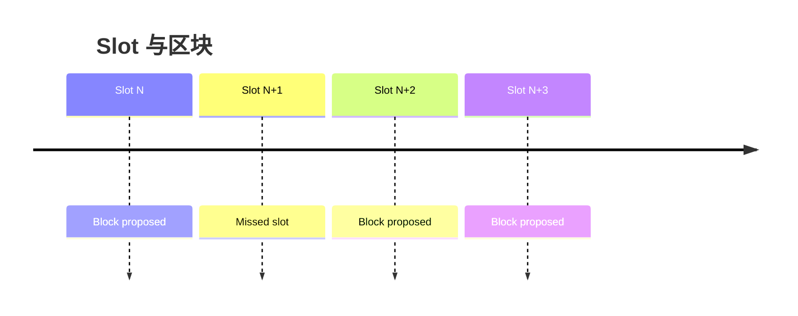

### 6.2 Epoch 是一组 Slot

Epoch 用于委员会安排、Checkpoint 和 Validator 生命周期中的部分计算。每个 Epoch 的 Slot 数是协议参数。

Epoch 边界不等于自动 Finalized。最终化需要足够正确的验证者投票满足协议关系；参与率不足时，多个 Epoch 过去仍可停滞。

### 6.3 时间同步

Validator 需要可靠系统时间。时钟过慢会错过窗口，过快可能提前广播无效时间消息。NTP 源、虚拟机暂停和宿主时间跳变都需监控，不能在 Validator 运行时随意大幅调整时钟。

---

## 七、Validator Duty

常见 Duty 包括：

- Block Proposal；
- Attestation；
- Attestation Aggregation；
- Sync Committee 等 Fork 定义职责。

### 7.1 Attestation 路径

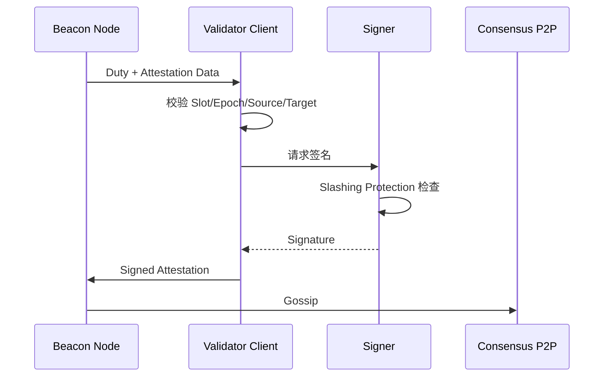

### 7.2 Proposer Duty

在有限 Slot 时间内，Proposer 需要：

1. 获取 Beacon Head；
2. 准备共识字段与 Payload Attributes；
3. 让 EL 或 Builder 构造 Payload；
4. 组装并检查 Beacon Block；
5. 使用正确 Domain 签名；
6. 及时传播。

### 7.3 常见失败

| 失败 | 影响 | 常见原因 |
|---|---|---|
| Missed Attestation | 收益、参与率 | CL 落后、时钟、网络、Signer 延迟 |
| Wrong Head Vote | Fork Choice 质量 | 传播或 EL 验证慢 |
| Missed Proposal | 空 Slot、收益 | Payload/Relay/签名超时 |
| Double Vote/Proposal | Slashing | 双 Active、保护记录缺失 |
| Invalid Signature | 消息被拒 | Fork/Domain/Key 错误 |

---

## 八、Execution Payload

Execution Payload 是 Beacon Block 中由 EL 解释和验证的执行层数据，典型语义包括：

- Parent Execution Hash；
- Fee Recipient；
- State Root、Receipts Root；
- Logs Bloom；
- Block Number、Gas Limit、Gas Used、Timestamp；
- Base Fee；
- Transactions；
- Fork 引入的其他字段。

字段集合会随 Fork 变化。

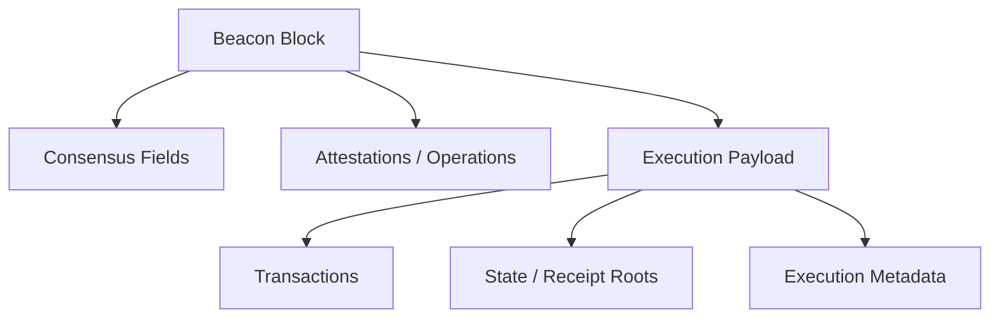

### 8.1 两种区块标识

Beacon Block Root 与 Execution Block Hash 是不同标识。DApp 和审计证据必须明确记录哪一种，并建立两者所属关系。

### 8.2 Fee Recipient

Fee Recipient 接收协议定义的执行层费用部分，不等同于 Consensus Withdrawal Credential。地址配置错误可能永久损失收益，变更应双人复核并监控首个 Proposal。

### 8.3 候选 Payload 不等于上链

候选 Payload 可能因 Proposer Miss、Fork Choice 改变、Builder 替换、验证失败或传播过晚而未进入规范链。只有进入规范 Beacon Chain 并推进 Finality 才获得相应保证。

---

## 九、出块协作链路

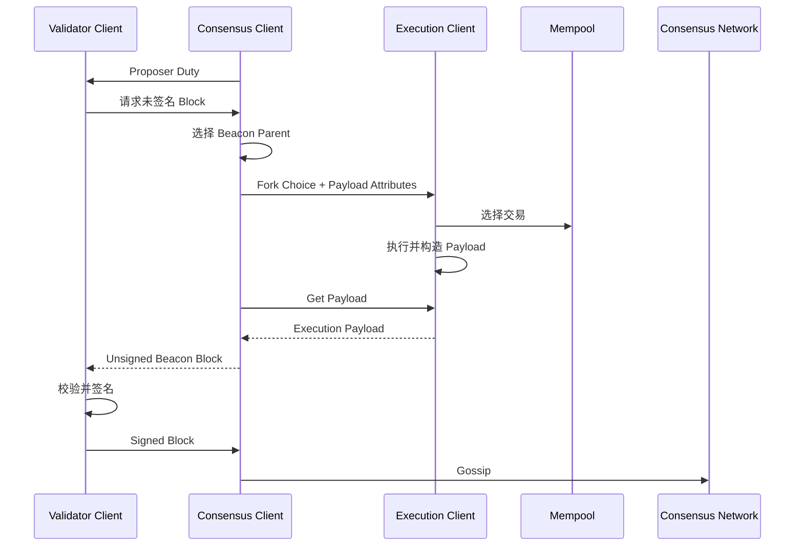

### 9.1 Slot 时间预算

延迟可能来自 EL 数据库、Payload 构造、CL Fork Choice、Remote Signer、Builder/Relay、资源争用和时钟偏差。应使用 Slot/Payload ID 关联跨组件 Trace，而不是分别看两个进程“无错误”。

### 9.2 Builder 与本地构造

在 MEV/PBS 相关架构中，Validator 可能从 Builder/Relay 获得候选内容。必须分析 Relay 不可用时本地构造、Builder 隐藏 Payload、Bid 匹配、审查、多 Relay 独立性及最终区块验证。具体流程随当前协议与实现变化。

---

## 十、接收区块与 Optimistic Sync

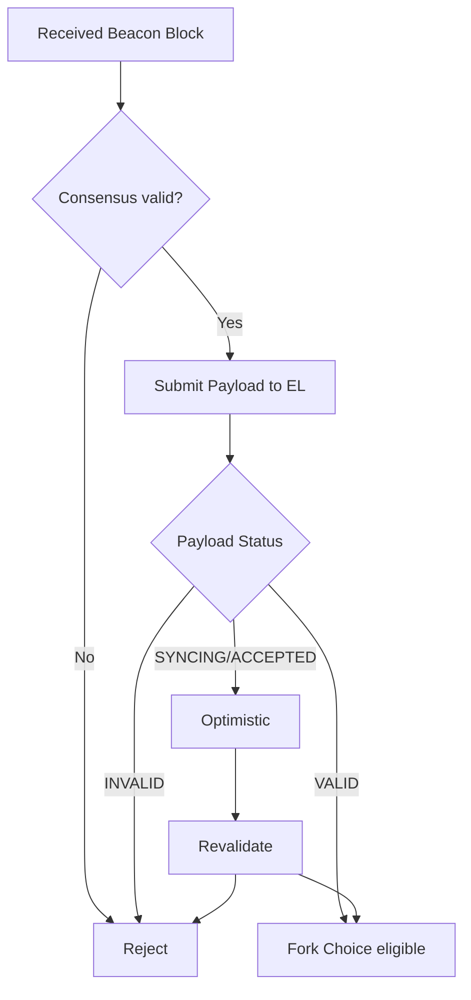

### 10.1 `INVALID` 的处理

EL 证明 Payload 无效后，CL 应按规范排除分支并利用 Latest Valid Hash 等上下文恢复。不能把数据库暂时故障误判为协议 Invalid，也不能把明确 Invalid 当同步中忽略。

### 10.2 Optimistic Head 的边界

CL 可在共识结构有效但 EL 尚未完成执行验证时暂时跟随候选 Head。此时：

- 不能向高价值业务宣称执行已最终确认；
- Validator 行为可能受客户端安全规则限制；
- EL 返回 Invalid 后必须回退；
- 监控必须显式暴露 Optimistic 状态。

### 10.3 不要自行做多 EL 投票

普通 Engine API 不是多个 EL 的 Quorum 协议。客户端多样性主要由不同运营节点分散实现，不是让单个 CL 随意多数表决多个 EL 的返回值。

---

## 十一、Fork Choice 与 Finality

CL 根据 Beacon Block、Attestation 和 Checkpoint 运行 Fork Choice，得到 Head，并把对应 Execution Hash 通知 EL。

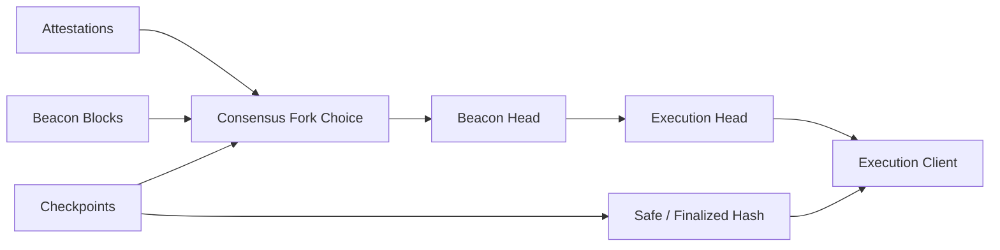

### 11.1 Head 与 Finalized

Head 是当前最佳分支，可发生浅重组。Finalized Checkpoint 由足够验证者权重按协议投票形成，并映射到执行层历史。

Finality 不代表 Oracle 正确、管理员不能修改未来状态，或极端安全故障下不存在社会恢复。

### 11.2 Finality Stall

验证者参与不足时，Head 和 Execution Block Number可能继续增长，Finalized Checkpoint 却停止。Bridge、Exchange 和高价值结算应监控 Latest-to-finalized Distance 并降级。仅检查“有新区块”会漏报。

---

## 十二、同步与 Readiness

CL 可从可信近期 Checkpoint 加速同步，但仍要获得并验证执行数据。Checkpoint 来源属于信任启动边界，应按官方推荐、多源对比和传输安全治理。

EL 的具体同步策略因客户端版本而异，最终都必须能验证目标 Execution State。

### 12.1 `synced` 不是一个 Boolean

```typescript
interface EthereumNodeReadiness {
  executionPeerHealthy: boolean;
  consensusPeerHealthy: boolean;
  executionSyncing: boolean;
  consensusSyncing: boolean;
  optimisticHead: boolean;
  engineConnected: boolean;
  headAgeSeconds: number;
  finalizedAgeSeconds: number;
  chainId: bigint;
}
```

这是运维聚合模型，不是标准 RPC Schema。Readiness 应按 Historical Read、Latest Read、Broadcast、Validator Duty 和 Finalized Settlement 分级。

### 12.2 配置一致性

启动后确认 Engine 可达且认证成功、EL/CL 网络一致、Genesis/Fork 配置匹配、Chain ID 正确、Checkpoint 与执行历史一致，并观察 Finality 恢复推进。

---

## 十三、Client Diversity

Ethereum 支持多个独立 EL 和 CL 实现。多样性降低单一实现 Bug 同时影响过多协议权重的风险。

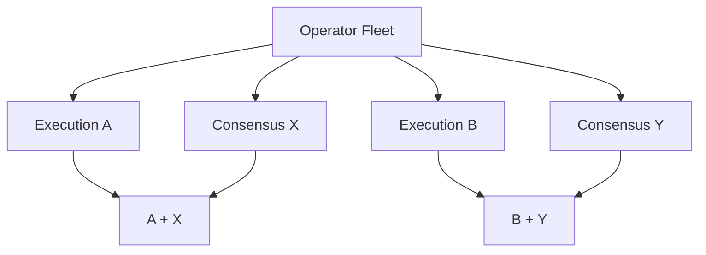

### 13.1 两层都要分散

只更换 CL 而所有节点仍使用同一 EL，Execution Bug 仍集中；反之亦然。还应考虑运营实体、Cloud/Region/ASN、OS、镜像供应链、Checkpoint、Relay、Signer 和控制平面。

### 13.2 代价

- Runbook 与运维知识增加；
- 指标、日志和数据库行为不同；
- 资源需求和升级节奏不同；
- 兼容矩阵复杂；
- Edge Case 可能产生实现分歧。

因此需要官方测试向量、跨客户端 Interop、Canary 和分阶段 Rollout。

### 13.3 超级多数客户端风险

若单一实现控制超过共识关键阈值的 Validator 权重，其一致性 Bug 可能导致共同投错、Finality Stall，甚至威胁 Safety。应统计质押权重和实际配对，而不是只看下载量或 Node ID 数。

---

## 十四、常见误区与错误案例

### 14.1 EL 验证有效就代表 Finalized

错误。EL 只验证 Execution；规范链与 Finality 来自 CL。

### 14.2 CL 决定 Head，所以不需要 EL

错误。CL 无法独立确认 EVM 状态转换，执行无效分支不能成为完整有效链。

### 14.3 每个 Slot 都有区块

错误。Slot 是提议机会，允许 Miss，且 Slot 与 Block Number 不一一对应。

### 14.4 一个 Epoch 后必然 Finalized

错误。Finality 取决于足够权重的投票和检查点关系。

### 14.5 Engine API 是公开 Ethereum RPC

错误。它是高权限控制接口，必须认证并隔离。

### 14.6 同机运行两个 EL 就实现多样性

错误。普通 Engine API 没有随意多 EL 多数决策，且同机仍共享大量故障域。

### 14.7 错误案例：只检查区块高度

```typescript
// 错误：Head 增长不能证明 Finality 和 Engine 健康。
const blockNumber = await rpc.getBlockNumber();
return blockNumber > 0;
```

还需检查 Head/Finalized Age、Distance、EL/CL Sync、Optimistic、Engine、Peer 和 Chain/Fork 配置。

---

## 十五、部署与安全

| 接口 | 调用方 | 暴露策略 |
|---|---|---|
| Execution P2P | EL Peers | 按 P2P 要求开放 |
| Consensus P2P | CL Peers | 按 P2P 要求开放 |
| Engine API | 配对 CL | Loopback/受控私网 + JWT |
| DApp JSON-RPC | 应用/网关 | 鉴权、限流、方法白名单 |
| Validator API | Validator Client | 私网、最小权限 |
| Metrics | Monitoring | 内网、只读、脱敏 |

### 15.1 资源隔离

公共 RPC 高峰可能争抢 EL 数据库、CPU 和 IO，拖慢 Payload 验证/构造并导致 Missed Duty。关键 Validator 应隔离公共 RPC，为磁盘、内存和带宽预留余量，并监控 Engine P99。

### 15.2 密钥边界

- Engine JWT 只认证 EL/CL，不控制 Validator 资金；
- Validator Signing Key 泄露可能触发 Slashing；
- Withdrawal Credential 应与在线环境隔离；
- Fee Recipient 配错会损失执行费用；
- Relay/API Token 不与上述密钥复用。

### 15.3 高可用

不能以两个 Active Validator 共享同一 Key 换取可用性。安全切换需要单一活动签名权、Fencing、Slashing Protection 一致、目标 EL/CL 已同步且非 Optimistic，并核对 Finalized Checkpoint。

---

## 十六、可观测性

**EL 指标：** Peer、Sync Distance、Head Age、Mempool、Payload Build/Validation、State DB、RPC、Invalid Payload。

**CL 指标：** Peer、Head Slot、Finalized Epoch、Optimistic、Participation、Attestation Delay、Reorg、Fork Choice Duration。

**Engine 指标：** Auth Failure、Capability Mismatch、Payload Status、Fork Choice Update Latency、Build Timeout、EL/CL Head Hash 对齐。

### 16.1 跨组件 Trace

使用 `slot + beaconBlockRoot + executionBlockHash + payloadId` 串联：

```text
Proposer Duty
 -> Fork Choice
 -> Payload Build
 -> Payload Retrieved
 -> Beacon Block Signed
 -> Block Published
 -> Peer Observed
```

### 16.2 故障矩阵

| 现象 | 可能根因 | 首要验证 |
|---|---|---|
| EL 同步、CL 落后 | CL Peer/Checkpoint/DB | CL Head 与 Peer |
| CL Head 增长、EL 不更新 | Engine 断连 | Auth、Payload Status |
| Head 增长、Finalized 停止 | 参与不足 | Participation |
| Proposal 经常 Miss | Payload/Signer/Relay 慢 | Slot Trace P99 |
| 大量 Optimistic | EL 同步或性能 | Validation Queue |
| DApp 读旧数据 | EL Head/网关缓存 | Block Hash、Head Age |

---

## 十七、测试与验证

### 17.1 Engine 集成测试

- 正确版本握手；
- JWT 缺失、错误和时钟偏差；
- 正确 Payload 返回 Valid；
- 修改 Root/Transaction 返回 Invalid；
- 同步中状态的规范处理；
- Head/Safe/Finalized 更新；
- Payload 构造、过期和取消；
- Fork 激活边界；
- EL/CL 重启与重连。

应使用官方 Hive/Interop、Execution API 和 Consensus Spec 测试向量。

### 17.2 故障注入

在隔离测试网：

1. 断开 Engine API，观察告警和恢复。
2. 延迟 Payload Validation，验证 Optimistic 状态。
3. 停止部分 Validator，观察 Head 与 Finality 差异。
4. 停止 Relay，验证本地构造降级。
5. 注入磁盘 IO 抖动，测量 Proposal Deadline。
6. Canary 升级一组 EL/CL，跨客户端比较 Payload 状态。
7. 重启后核对 Finalized、EL Head 和 Slashing Protection。

不得在生产 Validator 上注入可能导致双签的实验。

### 17.3 记录版本

- Network、Chain ID、Genesis Validators Root；
- Fork Digest/Version；
- Slot、Epoch、Beacon Block Root；
- Execution Block Number/Hash；
- EL、CL、Validator Client 版本；
- Engine Capability 与 Payload Version；
- Builder/Relay 配置；
- Checkpoint Source；
- 测试日期。

---

## 十八、总结

Ethereum 双客户端架构可以概括为“共识定序、执行验算、接口协作”：

1. EL 维护 Mempool、执行 EVM、计算状态并验证 Payload。
2. CL 维护 Beacon Chain、Validator Duty、Fork Choice 和 Finality。
3. Engine API 连接 Payload 验证、Fork Choice 状态和 Payload 构造。
4. Beacon Block 的 Consensus 与 Execution 两部分都有效才构成完整有效区块。
5. Slot 是提议机会，Epoch 是共识周期，都不能直接等同于最终确认。
6. Validator 签名必须校验 Duty、Domain 与 Slashing Protection。
7. 出块时 CL 决定父链和上下文，EL 构造执行结果，CL 封装传播。
8. Optimistic Head 尚未完成执行验证，不能作为高价值结算证据。
9. Finality Stall 可能发生在 Head 增长时，必须单独监控。
10. Client Diversity 要覆盖 EL、CL 与运营故障域，并以跨客户端测试控制复杂度。

理解这条边界后，“节点没同步”就能进一步拆成：共识网络没有 Head、Engine 没有传递 Fork Choice、Payload 尚未执行验证，或 Finality 因参与率不足而停滞。

---

## 问答复盘

### Q1：EL 和 CL 谁决定规范链？

**答：** CL 依据 PoS Fork Choice 与 Finality 决定共识视图，并驱动 EL 的 Head/Safe/Finalized；EL 负责确认该分支 Execution Payload 有效。

### Q2：CL 已验证 Beacon Block 签名，为什么还要调用 EL？

**答：** 共识字段有效不代表 EVM 状态转换有效。EL 必须验证交易、Gas、State Root 和 Receipt。

### Q3：Engine API 与 DApp JSON-RPC 最关键的区别是什么？

**答：** Engine API 是 EL/CL 控制平面，可更新 Fork Choice 和构造 Payload；DApp RPC 是执行数据服务接口。前者必须隔离并认证。

### Q4：一个 Slot 是否一定对应一个 Execution Block？

**答：** 不一定。Slot 可能 Miss；没有 Beacon Block 就没有该 Slot 的新 Execution Payload，Slot 与 Block Number 也不一一对应。

### Q5：经过一个 Epoch 后是否一定 Finalized？

**答：** 不一定。Finality 需要足够 Validator 权重按协议投票，参与不足时 Head 可增长而 Finalized 停滞。

### Q6：Optimistic Head 能否确认高价值支付？

**答：** 不能。它表示共识结构暂时可跟随，但 EL 尚未完全确认执行有效；应等待执行验证和业务要求的 Finality。

### Q7：公共 RPC 为什么可能导致 Validator Missed Duty？

**答：** 若共用 EL 和数据库，查询高峰会拖慢 Payload 构造/验证并错过 Slot Deadline。关键节点应隔离负载。

### Q8：客户端多样性为什么要同时考虑 EL 和 CL？

**答：** 两层都有共识关键实现。只分散一层，另一层的共同 Bug 仍可能相关失败；还需分散运营商、云、版本和控制面。

---

## 延伸知识

- **Gas 模型**：EL 如何计算 Intrinsic Gas、Base Fee 和 Block Gas Limit。
- **Engine API 规范**：版本化 New Payload、Fork Choice Update 与 Get Payload。
- **Beacon State Transition**：Validator Registry、Attestation 与 Finalization。
- **MEV/PBS**：Searcher、Builder、Relay、Proposer 和本地构建降级。
- **Validator 工程**：Remote Signer、DVT、Slashing Protection 与切换。
- **RPC 一致性**：`latest`、`safe`、`finalized` 与多 Provider 对账。
