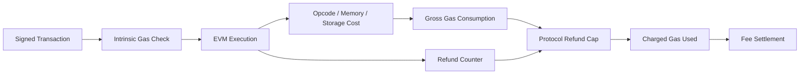
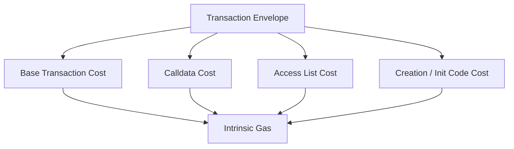
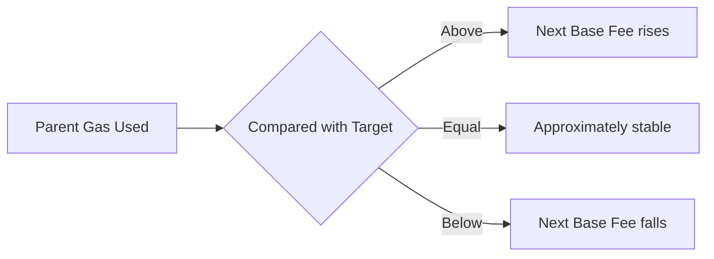
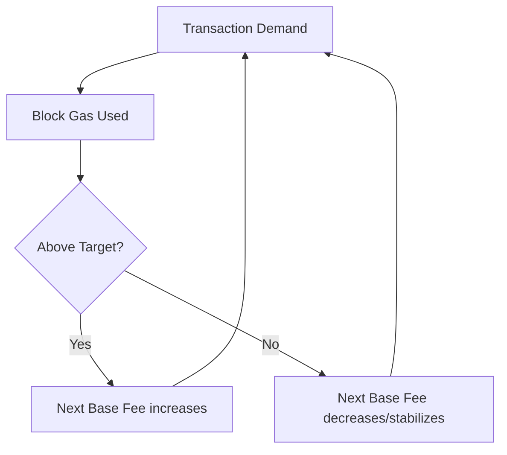
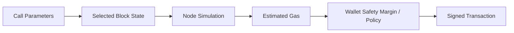
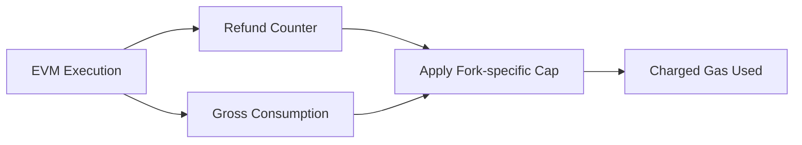

# Ethereum Gas 机制：从执行成本、EIP-1559 到估算与退款

> Gas 不是支付给合约的业务金额，也不是“代码执行毫秒数”。它是 Ethereum 对执行、状态访问和区块资源的协议计量单位；交易费用则由 Gas Used 与该区块适用的有效单价共同决定。

---

## 一、本文解决什么问题

DApp 发送交易时通常会看到 `gasLimit`、`maxFeePerGas` 和 `maxPriorityFeePerGas`，Receipt 又返回 `gasUsed` 与 `effectiveGasPrice`。这些字段很容易被混为一谈：

- Gas 与 Wei/ETH 是同一种单位吗？
- `gasLimit` 设置很高，是否一定会支付全部上限？
- `maxFeePerGas` 为什么不等于实际 Gas Price？
- Base Fee 与 Priority Fee 分别给了谁？
- EIP-1559 如何根据区块拥堵调整 Base Fee？
- `eth_estimateGas` 成功，为什么交易仍会 Revert 或 Out of Gas？
- Out of Gas 与 `revert` 对状态、剩余 Gas 和错误数据的影响有何区别？
- Block Gas Limit 与 EIP-1559 Target 有什么关系？
- 删除 Storage 为什么可能产生 Gas Refund，它是否是一笔 ETH 转账？
- `eth_feeHistory` 能否准确预测下一块费用？
- Blob Transaction 的费用能否直接套用 Execution Gas 公式？

本文以支持 EIP-1559 类型费用的 Ethereum Execution Layer 为主。Opcode 成本、Refund 上限、访问冷热规则、交易类型和区块字段会随 Fork 变化；生产逻辑必须固定 Network、Fork、Block Number/Hash、客户端和验证日期。

### 核心结论

1. Gas 是协议资源计量单位，Wei 是货币单位；费用近似为协议结算后的 `gasUsed × effectiveGasPrice`，不能把两者混成一个字段。
2. Transaction Gas Limit 是发送者允许交易消耗的执行 Gas 上限；未使用部分通常不按实际消耗收费，但发送前需要满足协议规定的余额可承担性检查。
3. Intrinsic Gas 在进入 EVM 主执行前产生，取决于交易类型、Calldata、创建交易、Access List 等 Fork 规则。
4. Gas Used 是交易最终被协议计费的实际 Gas，用于 Receipt 和区块容量统计；失败交易也会消耗 Gas。
5. EIP-1559 交易的有效单价受 `maxFeePerGas`、`maxPriorityFeePerGas` 和区块 `baseFeePerGas` 共同约束。
6. 在常见 EIP-1559 结算模型中，`effectiveGasPrice = min(maxFeePerGas, baseFeePerGas + maxPriorityFeePerGas)`；实际 Tip 是两者之差。
7. Base Fee 由协议按父区块拥堵调整并被销毁；Priority Fee 激励区块构造/提议方。具体资金流与 Fork 规则应按目标网络确认。
8. Gas Estimation 是在某个状态和参数上的模拟，不是未来收录环境的成功证明，也不是最坏情况上限证明。
9. Out of Gas 是执行资源耗尽的异常结果；内层调用耗尽可由外层根据调用方式处理，顶层交易仍可能被收录并收费。
10. Block Gas Limit 约束单区块可承载的 Execution Gas，和单笔交易 Gas Limit、EIP-1559 Target 是不同概念。
11. Gas Refund 是协议内的 Refund Counter，经 Fork 定义的上限抵扣部分计费 Gas，不是合约直接收到 ETH，也不能无限抵扣。
12. Fee History 提供历史 Base Fee、Gas 使用率和 Reward 分位数据，只能作为费用策略输入，无法保证下一块收录。
13. Blob Gas 等独立资源市场有自己的计量和费用字段，不能直接套用 Execution Gas 的单一乘法公式。

---

## 二、Gas 在执行链路中的位置



Gas 同时承担三类作用：

1. **防止无限执行**：每步消耗 Gas，余额耗尽会终止当前执行范围。
2. **为稀缺资源定价**：CPU、内存扩展、状态读取/写入和数据占用按协议权重计量。
3. **约束区块容量**：区块内交易 Gas Used 总和受 Block Gas Limit 约束。

Gas Schedule 不是硬件纳秒的直接映射。协议会通过 Fork 调整成本，以反映 DoS 风险、状态压力和客户端实现现实。

---

## 三、Gas 与费用单位

Gas 是无货币维度的资源单位；Gas Price 用 Wei/Gas 表示：

```text
fee(wei) = gasUsed(gas) × effectiveGasPrice(wei/gas)
```

`value` 是交易向目标转移的原生资产，与交易费用分开：

```text
senderCost ≈ value + executionFee + otherResourceFees
```

若交易包含 Blob 等其他资源，整体费用还要加入对应独立费用市场的结算结果。

### 3.1 全程使用整数

```typescript
interface ExecutionFee {
  gasUsed: bigint;
  effectiveGasPrice: bigint;
}

function executionFeeWei(input: ExecutionFee): bigint {
  if (input.gasUsed < 0n || input.effectiveGasPrice < 0n) {
    throw new RangeError('fee inputs must be non-negative');
  }
  return input.gasUsed * input.effectiveGasPrice;
}
```

不要将 Wei 转为 JavaScript `number` 后计算；大整数会超过安全整数范围。展示时使用 SDK 的 `formatUnits`，不要用浮点数参与结算。

### 3.2 报价与结算证据

```typescript
interface FeeEvidence {
  chainId: bigint;
  transactionHash: string;
  blockNumber: bigint;
  blockHash: string;
  gasLimit: bigint;
  gasUsed: bigint;
  effectiveGasPrice: bigint;
  executionFeeWei: bigint;
}
```

报价发生在签名前，结算以规范区块 Receipt 和 Block 为准。两者必须分开存储，不能用估算值覆盖实际值。

---

## 四、Transaction Gas Limit

`gasLimit` 表示发送者为该交易执行提供的最大 Execution Gas。它解决两个问题：

- 给 EVM 一个确定的资源上限；
- 给发送者一个单次交易费用风险边界。

### 4.1 高 Gas Limit 不等于全部收费

假设交易 Limit 为 `200,000`，协议结算 Gas Used 为 `80,000`，通常按 `80,000` 对应的有效价格计费，而不是按 `200,000` 全额计费。

但签名/接收前，账户需要满足交易 Value 和最大潜在费用等协议检查。具体 Upfront Cost 和余额检查取决于交易类型与 Fork。

### 4.2 过低与过高的风险

**过低：**

- 在执行中 Out of Gas；
- 状态变更回滚但仍付费；
- 内层调用获得的 Gas 不足；
- 钱包频繁失败，用户重复提交。

**过高：**

- 提高用户看到的最大费用风险；
- 某些恶意或状态相关路径可能消耗更多 Gas；
- 掩盖合约复杂度回归；
- 不能突破 Block Gas Limit 和协议合法性约束。

Gas Limit 应基于模拟结果加**有依据的安全余量**，而不是固定乘以一个适用于所有合约的魔法数字。

### 4.3 转发给内层调用的 Gas

合约调用另一个合约时，实际可转发 Gas 受 Opcode 参数、调用开销和协议规则限制。即使外层剩余很多 Gas，内层也不一定获得调用者填写的全部值。

不要依赖“精确剩余多少 Gas”作为业务授权逻辑；Opcode 成本和转发规则可能随 Fork 调整。

---

## 五、Intrinsic Gas

Intrinsic Gas 是交易进入主要 EVM 执行前就必须支付的基础成本。它可能由以下因素组成：

- 交易基础成本；
- Calldata 中零/非零 Byte 的成本；
- Contract Creation 额外成本；
- Access List 地址与 Storage Key；
- Init Code 长度或其他 Fork 规则；
- 特定交易类型的协议字段。



如果 `gasLimit < intrinsicGas`，交易在进入合约业务逻辑前就无效，不能把它解释成 Solidity 函数 Revert。

### 5.1 Calldata 优化边界

减少 Calldata 可降低部分执行/数据成本，但优化要考虑：

- ABI 可读性和兼容性；
- 解码 Gas；
- 签名和域分离；
- L1 与 Rollup 对 Calldata/Blob 的不同收费；
- 压缩在客户端和链上的计算成本。

不要只比较某次交易的总 Gas，就宣称编码方案在所有链上更便宜。

---

## 六、Gas Used

Receipt 中的 `gasUsed` 表示该交易按协议最终计入的 Execution Gas。它受到：

- Intrinsic Gas；
- Opcode 执行；
- Memory 扩展；
- Warm/Cold State Access；
- Storage 原值、新值和访问状态；
- Log/Data；
- 合约创建和 Code Deposit；
- Refund Counter 与上限；
- Fork Gas Schedule。

### 6.1 同一函数 Gas Used 为什么变化

```solidity
function setStatus(uint256 nextStatus) external {
    status = nextStatus;
}
```

相同 ABI 调用可能因当前 `status` 值、Slot 是否 Warm、写入是否改变值、调用前路径和 Fork 不同而消耗不同 Gas。

Gas 不是纯粹由源码行数决定，也不能只用一次本地测试作为生产常量。

### 6.2 交易失败也有 Gas Used

失败交易可能被区块收录，消耗资源并产生失败 Receipt。状态写入按规则回滚，发送者 Nonce 和费用结算仍会推进。

### 6.3 `gasUsed` 与 `cumulativeGasUsed`

- `gasUsed`：单笔交易的实际计费 Gas；
- `cumulativeGasUsed`：区块内执行到该 Receipt 时的累计 Gas。

两者不能互换。不同 RPC/SDK 字段应以其类型定义验证。

---

## 七、Legacy Gas Price 与 EIP-1559

Legacy Transaction 使用单一 `gasPrice`。支持 EIP-1559 的动态费用交易通常使用：

- `maxFeePerGas`：发送者愿意支付的每 Gas 总价上限；
- `maxPriorityFeePerGas`：愿意支付的每 Gas Tip 上限；
- 区块 `baseFeePerGas`：协议决定的基础费用。

### 7.1 有效单价

常见 EIP-1559 结算关系：

```text
effectiveGasPrice = min(
  maxFeePerGas,
  baseFeePerGas + maxPriorityFeePerGas
)

priorityFeePerGas = effectiveGasPrice - baseFeePerGas
```

交易必须满足 `maxFeePerGas >= baseFeePerGas` 才能在该区块按相应规则被纳入。

```typescript
interface DynamicFeeInput {
  baseFeePerGas: bigint;
  maxFeePerGas: bigint;
  maxPriorityFeePerGas: bigint;
}

function effectiveGasPrice(input: DynamicFeeInput): bigint {
  if (input.maxFeePerGas < input.baseFeePerGas) {
    throw new Error('max fee is below block base fee');
  }

  const desired = input.baseFeePerGas + input.maxPriorityFeePerGas;
  return desired < input.maxFeePerGas ? desired : input.maxFeePerGas;
}
```

这是结算公式演示，不替代 SDK 交易编码、Fork 校验与其他费用字段。

### 7.2 Max Fee 不是实际报价

假设：

```text
baseFee = 30
maxPriorityFee = 2
maxFee = 100
```

有效单价为 `32`，不是 `100`。未使用的 Fee Cap 空间不会作为 Tip 全部支付。

若 Base Fee 增长到 `99`，有效单价最多 `100`，实际 Tip 只有 `1`；Fee Cap 会挤压 Priority Fee。

### 7.3 Base Fee

Base Fee 根据父区块 Gas 使用相对 Target 的偏离按协议公式调整：



具体最大变化率、Target 与整数舍入属于协议参数。应用应读取节点返回的 Block/Fee History，而不是手写长期固定常数。

Base Fee 的作用是让拥堵定价更可预测，并按协议销毁，而非直接成为 Proposer Tip。

### 7.4 Priority Fee

Priority Fee 激励区块构造与提议方纳入交易，但收录还受：

- Fee Cap 是否覆盖 Base Fee；
- Mempool 可见性；
- Block Gas 剩余容量；
- Builder/Proposer 排序与 MEV；
- 交易依赖和 Nonce Gap；
- 本地策略与审查。

高 Tip 不保证立即收录，无效交易或 Nonce 未就绪仍无法执行。

---

## 八、EIP-1559 的区块弹性

EIP-1559 将 Block Gas Target 与可允许的 Block Gas Limit/弹性容量区分开。区块可在短时拥堵时超过 Target，但不能超过 Block Gas Limit；持续高于 Target 会推动 Base Fee 上升，抑制需求。



这是反馈机制，不是保证某个具体交易等待时间的控制器。突发需求、Builder 策略和用户 Fee Cap 都会造成延迟。

### 8.1 为什么仍会堵塞

- 用户 `maxFeePerGas` 低于后续 Base Fee；
- 大量用户同时提高 Fee Cap；
- 交易具有 Nonce Gap；
- 区块接近 Gas Limit；
- 特定状态争用或 MEV 排序；
- RPC/Mempool 传播不充分。

### 8.2 Legacy Transaction 在 EIP-1559 区块中

协议可继续处理 Legacy 类型，但其 Gas Price 如何分解为 Base Fee 与 Tip，应由执行规则和 Receipt 的 `effectiveGasPrice` 解释。钱包新交易通常优先采用目标网络支持的动态费用类型。

---

## 九、Gas Estimation

`eth_estimateGas` 通常在节点指定状态上模拟调用，并搜索能成功执行的 Gas Limit。它不是对未来状态的证明。



### 9.1 估算依赖完整参数

至少需要考虑：

- `from`；
- `to`；
- `value`；
- `data`；
- Fee 字段和 Access List（若影响路径）；
- Block Tag/State；
- 节点 Fork 和 State Override（若使用）。

遗漏 `from` 或 `value` 可能让权限、余额和分支判断与真实交易不同。

### 9.2 估算成功仍可能失败

签名到收录期间：

- 合约状态改变；
- 余额/Allowance 被使用；
- Oracle 价格和 Slippage 改变；
- 代理升级或暂停；
- 交易顺序不同；
- Base Fee 超过 Fee Cap；
- 动态循环输入或外部调用路径变化。

Gas Margin 只能覆盖 Gas 消耗波动，不能修复业务条件变化。

### 9.3 估算失败如何处理

不要直接返回一个极大 Gas Limit 掩盖错误。应区分：

- Revert，并解析可信的 Revert Data；
- Insufficient Funds；
- Intrinsic Gas/编码错误；
- RPC 缺少历史状态；
- 节点同步或限流；
- 估算算法上限/超时。

如果模拟已经确定 Revert，提高 Gas Limit 通常无效。

### 9.4 多 Provider 差异

不同节点可能因 Head、Mempool Pending State、客户端策略和 Override 支持不同而返回不同估算。高风险交易应固定同一 Block Reference/State 进行模拟，并记录 Provider 与版本。

---

## 十、Out of Gas 与 Revert

### 10.1 Out of Gas

执行某一步所需 Gas 超过当前调用帧剩余 Gas 时，发生 Out of Gas（OOG）。通常：

- 当前调用帧异常终止；
- 该帧状态变更和 Log 回滚；
- 分配给该帧的 Gas 按规则消耗；
- 若传播到顶层，交易 Receipt 标记失败；
- 交易仍可能被收录并收费。

### 10.2 `revert`

显式 Revert 也回滚当前帧状态和 Log，但可返回 Revert Data，并保留协议允许的剩余 Gas 返回上层。它与 OOG 的错误语义和剩余 Gas 行为不同。

| 维度 | Revert | Out of Gas |
|---|---|---|
| 状态变更 | 当前帧回滚 | 当前帧回滚 |
| Revert Data | 可携带 | 通常无业务 Revert Data |
| 剩余 Gas | 按规则可返回上层 | 分配给失败帧的 Gas 通常耗尽 |
| 常见原因 | 条件/显式错误 | Gas Limit 或路径消耗不足 |

### 10.3 内层失败可以被捕获

低级调用返回失败时，外层合约可以处理并继续，因此顶层 Receipt 成功不代表每个内部调用成功。Trace 和业务状态验证要结合使用。

### 10.4 Gas Griefing

攻击者可能选择高成本输入、扩大循环、强迫外部调用失败或利用调用方固定 Gas 假设。防护包括：

- 有界循环与分页；
- Pull over Push；
- 不让单个接收者阻塞整批处理；
- 对外部调用失败显式建模；
- 测试最坏状态，而不是只测空状态；
- 不用 `gasleft()` 阈值承担关键授权。

---

## 十一、Block Gas Limit

Block Gas Limit 约束一个 Execution Block 内交易可累计消耗的 Gas。区块构造者选择交易时必须满足：

```text
sum(transactionGasUsed) <= blockGasLimit
```

具体还受系统级执行、Fork 字段和协议规则约束。

### 11.1 三个 Limit 不要混淆

| 名称 | 作用域 | 含义 |
|---|---|---|
| Transaction Gas Limit | 单笔交易 | 发送者允许的最大执行 Gas |
| Call Gas | 单个调用帧 | 调用传递且经协议限制的 Gas |
| Block Gas Limit | 整个区块 | 区块执行容量上限 |

### 11.2 Block Gas Limit 与 Target

EIP-1559 Target 是 Base Fee 调整参考，Block Gas Limit 是硬容量上限。区块 Gas Used 可以高于 Target，但不能高于 Limit。

### 11.3 调高 Limit 的代价

- 节点执行和验证时间增加；
- State IO 与增长压力增加；
- 区块传播和重组风险变化；
- 低配置节点更难跟上；
- Validator 在 Slot 内完成验证的余量减少。

吞吐不是只把 Limit 调大就免费获得，必须用多客户端基准、State Growth 和去中心化成本评估。

---

## 十二、Gas Refund

某些状态转换会增加 Refund Counter，交易结束时在协议上限内抵扣部分 Gas Used。



### 12.1 Refund 不是什么

- 不是合约收到 ETH 转账；
- 不是立即增加 `gasleft()` 供当前执行继续使用；
- 不能超过协议定义的抵扣上限；
- 不是永久稳定的某个 Opcode 常数；
- 不保证“先存后删”有经济收益。

历史上的 Gas Token 依赖 Refund 规则套利，后续 Fork 已调整相关 Refund 和上限。不要基于旧文章设计当前协议成本模型。

### 12.2 清理 Storage 的工程价值

清理无用状态仍可能降低长期 State Footprint 和部分成本，但方案选择需比较：

- 写零的当前 Fork 成本与 Refund；
- 删除后是否还需历史业务查询；
- Event/Indexer 是否保留审计记录；
- Mapping 是否能枚举清理；
- 批处理是否超过 Block Gas Limit；
- 删除是否破坏升级布局。

---

## 十三、Fee History

`eth_feeHistory` 类接口提供一段历史区块的：

- Base Fee 序列；
- Gas Used Ratio；
- 按请求分位统计的 Priority Fee/Reward；
- 下一块 Base Fee 的协议推导值或相关数据（精确字段按 RPC 规范）。

### 13.1 费用推荐流程


不同业务应有不同策略：

- Low：允许等待，选择较低分位；
- Market：平衡近期收录概率与费用；
- Urgent：提高 Tip 和 Base Fee Headroom，但仍设上限。

### 13.2 Fee History 的边界

- 历史不能预测突发 NFT Mint 或清算竞争；
- Reward 分布受 Builder/MEV 和交易样本影响；
- 不同 Provider 的 Head 可能不同；
- 低使用区块的分位样本可能稀疏；
- 交易 Nonce/有效性问题不能靠加价解决；
- 私有订单流的收录行为可能不同。

### 13.3 替换交易

Pending 交易加速通常需要相同 Nonce，并满足节点的价格替换策略。EIP-1559 交易要同时考虑 `maxFeePerGas` 与 `maxPriorityFeePerGas`；只提高其中一个可能仍不被接受。

替换阈值属于客户端/Mempool 策略，不应硬编码一个跨所有网络和版本的百分比。

---

## 十四、Blob Gas 与多资源费用市场

支持 Blob Transaction 的 Fork 引入独立 Blob Gas 计量和费用字段。它与 EVM Execution Gas：

- 计量对象不同；
- Base Fee 调整机制独立；
- 费用上限字段不同；
- Receipt/交易总成本计算需要分别处理；
- 不可用 `gasUsed × effectiveGasPrice` 一项表示全部成本。

```text
totalFee = executionGasFee + blobGasFee + protocolDefinedOtherFees
```

具体字段和计算必须按目标 Fork 规范与 SDK 实现。普通 ETH 转账没有 Blob Fee，不要无条件添加。

Rollup 用户支付的 L2 Fee 还可能包含 L2 Execution、L1 Data、Sequencer Margin 等组成，不能直接等同 Ethereum L1 Gas。

---

## 十五、DApp 费用状态设计

```typescript
type FeeQuoteState =
  | { kind: 'estimating' }
  | {
      kind: 'quoted';
      blockHash: string;
      gasLimit: bigint;
      maxFeePerGas: bigint;
      maxPriorityFeePerGas: bigint;
      maximumExecutionFeeWei: bigint;
      expiresAt: number;
    }
  | { kind: 'stale'; reason: string }
  | { kind: 'failed'; reason: string };
```

### 15.1 报价需要过期

Base Fee 和状态会变化。钱包确认页停留过久时，应刷新：

- Gas Estimate；
- Base Fee/Fee History；
- Nonce；
- Balance；
- 合约模拟结果。

刷新后若签名字节改变，需要用户重新确认，不能静默替换费用与调用参数。

### 15.2 显示三个数字

用户界面应区分：

- 预计费用；
- 最大可能 Execution Fee；
- 实际结算费用（上链后）。

并说明报价网络、时效和是否包含 Blob/L2 Data Fee。不要把 Max Fee 显示成“一定支付”。

### 15.3 费用不足

发送前校验至少包括 Value、最大潜在费用和余额余量。但 Balance 可能被并发交易使用，最终以节点执行为准。多笔批量发送需要统一 Nonce 与预算协调。

---

## 十六、常见误区与错误案例

### 16.1 Gas Limit 越高，实际费用一定越高

错误。实际费用取决于 Gas Used 与有效单价；Limit 是上限。但过高会扩大风险边界，仍不应无条件设置。

### 16.2 `maxFeePerGas` 全部支付给 Validator

错误。实际单价由 Base Fee 与 Tip 共同约束；Max Fee 是 Cap，Base Fee 按协议销毁，未使用 Cap 不会全部成为 Tip。

### 16.3 Estimation 成功保证交易成功

错误。模拟状态与未来收录状态不同，业务条件、顺序和费用都可能变化。

### 16.4 Revert 不花 Gas

错误。失败路径已执行并消耗资源，交易可被收录并收费。

### 16.5 Refund 是合约收到 ETH

错误。它是受上限约束的协议计费抵扣，不是 Value Transfer。

### 16.6 Block Gas Limit 就是 EIP-1559 Target

错误。Target 用于 Base Fee 反馈，Limit 是区块硬容量上限。

### 16.7 错误案例：用 `number` 计算费用

```typescript
// 错误：大整数可能丢失精度。
const fee = Number(receipt.gasUsed) * Number(receipt.effectiveGasPrice);
```

应使用 `bigint` 或成熟大整数库，并只在展示层格式化。

### 16.8 错误案例：估算失败后填满 Block Gas Limit

这会掩盖 Revert、权限、余额和参数错误，并扩大用户最大费用风险。应解析失败原因、固定模拟状态并让业务修复根因。

---

## 十七、Gas 优化的正确方法

### 17.1 先测量

记录：

- Chain、Fork、Block Hash；
- Compiler Version、Optimizer、IR 配置；
- Contract Code Hash 与 Proxy Implementation；
- Calldata 和状态前置条件；
- 冷/热访问路径；
- Gas Estimate、Receipt Gas Used；
- Trace 中的 Opcode/Call/Storage 分布。

### 17.2 优化优先级

1. 降低算法复杂度和无界循环；
2. 减少不必要持久 Storage 写入；
3. 合理 Batch，但不突破 Block Gas 与失败原子性；
4. 复用已读取数据，减少重复外部调用；
5. 优化 Calldata/ABI，但保留安全与兼容性；
6. 最后再做低可读性的微优化。

### 17.3 代价

- Packing 增加位运算和升级复杂度；
- Batch 省固定成本，却扩大单笔失败范围；
- 缓存派生状态减少计算，但增加一致性风险；
- Assembly 可能省 Gas，却绕过类型和内存安全；
- 删除 Event 降低 Gas，却损害 Indexer 和审计。

不能为了微小 Gas 节省牺牲权限正确性、可测试性和升级安全。

---

## 十八、测试与验证方法

### 18.1 Gas 测试矩阵

- 第一次写 Slot、重复写、写相同值、清零；
- 冷/热账户与 Storage Access；
- 空/最大 Calldata；
- 成功、Revert、Panic、Out of Gas；
- 内层调用失败被捕获；
- 最小/最大循环数据；
- Proxy 与直接调用；
- 不同 Compiler/Optimizer；
- Fork 升级前后 Gas Schedule；
- Legacy 与动态费用交易。

### 18.2 Gas Snapshot 与阈值

在 CI 保存关键函数 Gas Snapshot，设置有业务意义的回归阈值。Snapshot 只能在固定环境比较，不能跨 Compiler/Fork 无条件对照。

### 18.3 Estimation 可靠性实验

1. 固定区块状态估算并执行 Fork Simulation。
2. 对 Gas Limit 在估算值附近做边界测试。
3. 修改前置状态，观察路径变化。
4. 在多个客户端上对比估算与实际 Gas Used。
5. 注入 Base Fee 上涨和 Pending Nonce。
6. 验证报价过期、刷新和重新签名流程。
7. 模拟 OOG 后确认状态回滚、Nonce 和 Receipt。

### 18.4 监控指标

- Estimate Failure Rate；
- Estimated/Actual Gas Ratio；
- OOG 与 Revert Rate；
- Time to Inclusion；
- Effective Priority Fee；
- Replacement Rate；
- Base Fee 与 Block Gas Used Ratio；
- Fee Quote Staleness；
- 按合约方法的 Gas P50/P95/P99。

---

## 十九、总结

Ethereum Gas 应按“资源、上限、单价、结算”四层理解：

1. Gas 对 EVM 执行和状态资源计量，Wei 为这些 Gas 定价。
2. Transaction Gas Limit 是资源上限，未使用部分通常不按实际消耗收费。
3. Intrinsic Gas 在业务代码执行前产生，受交易编码和 Fork 规则影响。
4. Gas Used 是协议最终计费量，失败交易同样会消耗。
5. EIP-1559 用 Base Fee、Priority Fee 和 Max Fee 分离拥堵价格、激励和用户上限。
6. Max Fee 是 Cap，不是实际支付单价；Base Fee 被销毁，Tip 才是提议者激励部分。
7. Estimation 是指定状态模拟，必须处理状态变化、Margin、过期和失败原因。
8. OOG 与 Revert 都会回滚当前帧状态，但剩余 Gas 和错误数据语义不同。
9. Block Gas Limit 是区块硬容量，Target 是 Base Fee 调整参考。
10. Refund 是受 Fork 上限约束的计费抵扣，不是 ETH 转账。
11. Fee History 是历史统计输入，不能保证未来收录。
12. Blob/L2 Data Fee 属于额外资源市场，必须单独报价和结算。

可靠的费用体验不是“给一个更高 Gas”，而是让用户看清预计费用、最大风险、报价有效期和实际结算，并让系统在状态变化、拥堵、替换与失败时仍能解释每一笔成本。

---

## 问答复盘

### Q1：Gas 与 ETH/Wei 的关系是什么？

**答：** Gas 是资源单位，Wei 是货币单位。执行费用由 Gas Used 乘以有效 Wei/Gas 单价得到。

### Q2：Gas Limit 设置 200,000，是否一定支付 200,000 Gas？

**答：** 不一定。它是消耗上限，通常按协议结算后的实际 Gas Used 收费；但账户需满足最大潜在费用等前置检查。

### Q3：`maxFeePerGas` 与 `maxPriorityFeePerGas` 最容易混淆的边界是什么？

**答：** Max Fee 是总单价上限，Max Priority Fee 是 Tip 上限。Base Fee 上涨会占用 Max Fee 空间并可能压缩实际 Tip。

### Q4：`eth_estimateGas` 成功为什么仍可能 Revert？

**答：** 估算只模拟某个状态。签名到收录期间余额、授权、价格、顺序或合约状态都可能变化。

### Q5：Out of Gas 与显式 Revert 是否相同？

**答：** 都回滚当前帧状态，但 Revert 可返回错误数据并保留规则允许的剩余 Gas；OOG 通常耗尽分配给失败帧的 Gas。

### Q6：Gas Refund 是否会向合约转入 ETH？

**答：** 不会。Refund Counter 只在交易结束时按协议上限抵扣部分计费 Gas，不是资产转账。

### Q7：Block Gas Limit 与 EIP-1559 Target 是否相等？

**答：** 不是。Limit 是区块硬上限，Target 是 Base Fee 调整参考；区块可高于 Target，但不能高于 Limit。

### Q8：如何验证一次 Gas 优化真的有效？

**答：** 固定 Fork、Compiler、Code Hash、Calldata 和前置状态，在相同环境比较 Receipt/Trace，并运行功能、安全和升级回归测试。

---

## 延伸知识

- **EVM Opcode 成本**：Stack、Memory Expansion、Storage Warm/Cold Access。
- **交易类型**：Legacy、Access List、Dynamic Fee 与 Blob Transaction。
- **Mempool 与替换**：Nonce、Fee Bump、Dropped Transaction 和 Builder 排序。
- **Solidity 优化**：Storage Layout、Calldata、Custom Error、Assembly 与 IR Pipeline。
- **Rollup 费用**：L2 Execution、L1 Data、Blob 与 Sequencer 定价。
- **RPC 费用接口**：`eth_estimateGas`、`eth_feeHistory` 与历史 Block Base Fee。
