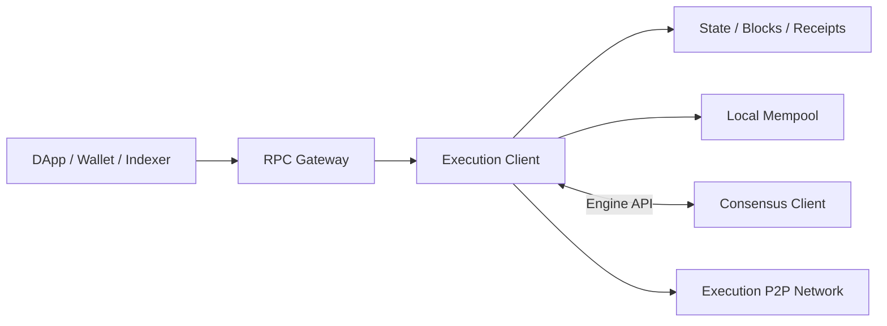
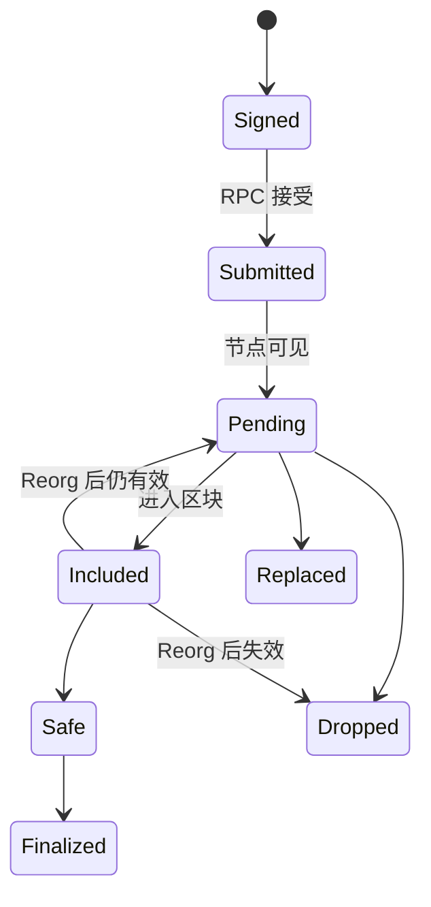
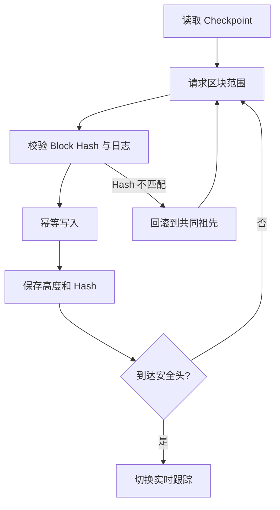
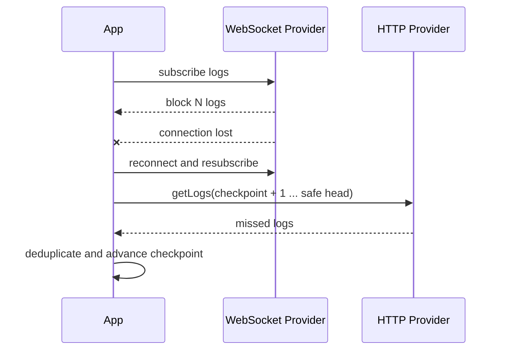
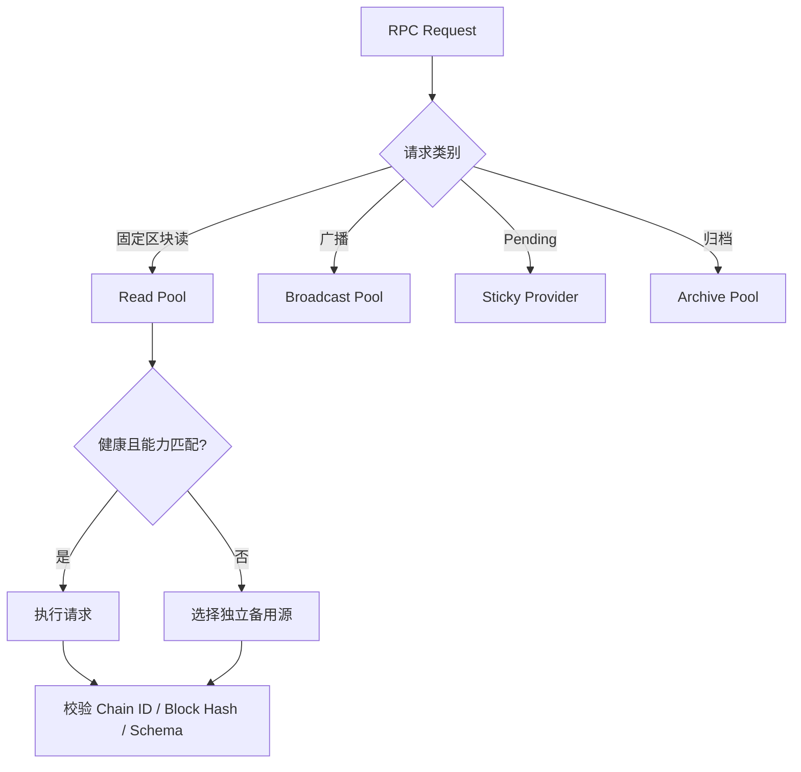

# Ethereum RPC：从 JSON-RPC 调用到一致性与多 Provider 治理

> RPC 是应用访问节点状态与提交交易的接口，不是共识证明。成功响应只说明某个节点在某个时刻返回了它的本地视图；可复现、可结算的结果还必须明确链、区块、最终性与数据能力。

---

## 一、本文解决什么问题

DApp、钱包、Indexer 和后端通常不直接参与 Ethereum P2P 网络，而是通过 Remote Procedure Call（RPC）访问执行客户端。接口看似只是发送 JSON，真正的难点却在语义边界：

- HTTP 200 是否代表调用成功？
- `eth_call` 不上链，为什么也会 Revert？
- `eth_sendRawTransaction` 返回哈希，是否代表交易已进入全网 Mempool？
- `eth_getLogs` 为什么不能无限扩大区块范围？
- `latest`、`safe`、`finalized` 与具体 Block Hash 有何不同？
- WebSocket 断线期间的事件如何补齐？
- Provider 限流时，哪些请求可以重试？
- 两个 Provider 返回不同结果时应该相信谁？
- 为什么 Full Node 未必能查询很久以前的状态？

本文以 Ethereum Execution JSON-RPC 的稳定概念为主。方法扩展、历史保留、错误文本、批量限制和订阅能力会因客户端、Provider、网络与版本而异；生产接入应以目标 Provider 文档、Ethereum JSON-RPC 规范及目标网络当前 Fork 为准。

### 核心结论

1. JSON-RPC 定义请求与响应信封；HTTP 状态不能替代 JSON-RPC `error`、EVM 结果和业务结果检查。
2. RPC 返回节点视图。`latest` 可能重组，`pending` 依赖本地 Mempool，固定 Block Number/Hash 的读取才容易复现。
3. `eth_call` 在指定状态上模拟调用，不写入链也不真实扣费，但仍执行 EVM 并可能 Revert、超时或缺少历史状态。
4. `eth_sendRawTransaction` 提交已签名字节；返回哈希不等于收录、成功或最终化。
5. `eth_getLogs` 必须分页、保存 Block Hash Checkpoint，并处理重复、断线与重组。
6. `eth_estimateGas` 是特定节点、状态和参数下的模拟，不是未来执行保证。
7. WebSocket 是低延迟通知通道，不是可靠消息队列；重连后必须用 HTTP 回填。
8. 多 Provider Failover 需要能力分层与请求分类，盲目切换会改变链头、Mempool 和 Nonce 视图。
9. Archive Data 是历史状态能力，不等于仅能读取历史区块。

---

## 二、RPC 在 Ethereum 架构中的位置



应用通常调用 Execution Client 的 `eth_*` 接口。Execution Client 执行 EVM、维护区块与状态，并根据 Consensus Client 给出的 Fork Choice 维护规范链视图。

| 接口 | 调用方 | 职责 | 暴露策略 |
|---|---|---|---|
| DApp JSON-RPC | 钱包、DApp、Indexer | 查询、模拟、广播 | 鉴权、限流、方法白名单 |
| Engine API | Consensus Client | Fork Choice、Payload 构造与验证 | JWT 认证，私网隔离 |
| P2P Protocol | 其他节点 | 传播交易与区块 | 按节点网络策略开放 |

Engine API 不是“更高级的公共 RPC”。它属于节点控制面，不能与 DApp Endpoint 共用公网边界。

---

## 三、JSON-RPC 协议模型

```json
{
  "jsonrpc": "2.0",
  "id": 42,
  "method": "eth_getBalance",
  "params": ["0x0000000000000000000000000000000000000000", "finalized"]
}
```

成功响应包含相同 `id` 与 `result`；协议错误则返回 `error`：

```json
{
  "jsonrpc": "2.0",
  "id": 42,
  "error": { "code": -32602, "message": "invalid params" }
}
```

### 3.1 HTTP 成功不等于 RPC 成功

Provider 可能在 HTTP 200 中返回 JSON-RPC `error`，也可能用 429 表示限流、用 5xx 表示网关或上游故障。客户端必须分层处理：

1. Transport：DNS、TLS、连接和超时；
2. HTTP：状态码、响应大小和格式；
3. JSON-RPC：`id`、`result`、`error`；
4. Ethereum：Revert、未知交易、历史状态不可用；
5. Business：链、合约、事件和最终性是否满足约束。

### 3.2 Quantity、Data 与数值安全

Ethereum RPC 广泛使用十六进制编码。Quantity 表示整数，Data 表示字节序列，两者长度语义不同。应交给成熟库编解码，并使用 `bigint` 或大整数处理余额、Gas 和区块高度，不能转成 JavaScript `number`。

### 3.3 Batch 不是事务

JSON-RPC Batch 可减少网络往返，但不保证按数组顺序执行、不保证共享同一链头快照，也不是原子事务。响应必须按 `id` 关联；需要一致状态时，应把请求固定到同一 Block Number 或 Block Hash。

---

## 四、`eth_call`：只读模拟不等于纯函数

`eth_call` 在指定区块状态上执行 Call Message，返回执行数据。它不会写回规范链，也不会真实扣除调用者 ETH，但仍遵循 EVM 规则。

```json
{
  "jsonrpc": "2.0",
  "id": 1,
  "method": "eth_call",
  "params": [{
    "from": "0x1111111111111111111111111111111111111111",
    "to": "0x2222222222222222222222222222222222222222",
    "data": "0x...",
    "value": "0x0"
  }, "safe"]
}
```

调用可能依赖 `msg.sender`、`msg.value`、余额、Allowance、区块上下文、Oracle 或权限。省略 `from` 或改变区块，都可能改变结果。

Revert Data 可能编码标准错误、自定义错误或为空。错误文本与嵌套结构存在 Provider 差异，不应靠字符串判断业务类型；应按 ABI 解码可用数据，并保留 Unknown 分支。

### 4.1 模拟不能承诺未来

从模拟到交易收录之间，余额、Nonce、价格、储备和权限都可能变化。合约应设置 `deadline`、最小输出、最大输入等不可绕过的约束，不能只相信前端刚刚模拟成功。

部分 Provider 支持 State Override 等扩展参数，但能力和语义并不统一。未做能力探测时，不能把扩展当作跨 Provider 公开契约。

---

## 五、`eth_sendRawTransaction`：提交不是确认

该方法接收已签名交易字节。签名端应明确 Chain ID、Nonce、目标、Calldata、Value、Gas 与费用字段，RPC 不应重写已签名内容。



返回哈希不证明交易已传播到所有节点、已被目标 Proposer 看见、一定会收录、执行会成功或已最终化。

### 5.1 安全重试

同一原始交易字节的哈希是确定的。Transport 超时导致结果未知时，应先查询哈希，再按策略重播相同字节。不要立即重新分配 Nonce 并签一笔新业务交易，否则可能双重执行。

对于“already known”“nonce too low”等结果，不能只按错误字符串归类。应结合交易、Receipt、账户 Nonce 和同 Nonce 冲突交易恢复真实状态。

广播可向受控的多个入口提交同一字节，但 Pending/Nonce 查询最好保持来源亲和，因为 Mempool 是本地视图。

---

## 六、`eth_getLogs`：历史扫描必须可分页、可回滚

日志过滤通常包含 Address、Topics 与区块范围。范围过大、命中过多或过滤太宽时，Provider 可能超时、截断或拒绝。



分页窗口应动态调节：响应较小时扩大，超时、限流或结果过大时缩小。不要假设所有 Provider 有相同最大范围。

应用可用 `(chainId, blockHash, transactionHash, logIndex)` 标识一次日志出现，并按 `(blockNumber, transactionIndex, logIndex)` 排序。只用交易哈希无法完整表达重组前后的区块归属。

订阅日志可能带 `removed`，但断线或切换时不保证收到全部撤销通知。Indexer 必须保存 Block Hash Checkpoint，发现父子关系断裂后回滚派生数据，再从共同祖先重放。

---

## 七、`eth_estimateGas`：模拟值不是保证值

Gas 估算通常通过模拟寻找可成功执行所需上限。它依赖 `from`、`to`、`value`、`data`、费用字段、区块状态和客户端策略。

常见失败原因包括调用会 Revert、余额或权限不足、参数与最终交易不同、节点落后、缺少历史状态，以及 Provider 的模拟资源上限。

可以在估算值上增加受控余量，但余量不能修复 Revert，也不能无限提高到接近 Block Gas Limit。必须同时设置业务最大 Gas 和费用上限。模拟后状态变化仍可能导致路径与成本改变。

---

## 八、Block Tag 与一致性语义

| 标签 | 常见含义 | 主要风险 |
|---|---|---|
| `earliest` | 最早可引用区块 | 节点未必保留对应历史状态 |
| `latest` | 当前规范链头 | 会推进、可重组 |
| `pending` | 节点待处理状态视图 | 客户端与 Provider 差异大 |
| `safe` | 共识层认为安全的执行头 | 网络与节点支持需确认 |
| `finalized` | 共识已最终化的执行头 | 更新更慢，Finality 可能停滞 |

### 8.1 Block-pinned Read

页面一次读取余额、Allowance、价格和配置时，应先确定目标 Block Number/Hash，再把后续查询固定到该区块。否则链头可能在请求之间推进，组合出从未同时存在的状态。

更严格的客户端可使用 EIP-1898 风格的 Block Hash 引用，但需确认目标方法与 Provider 支持。高度相同不代表区块相同，Hash 才能区分分支。

### 8.2 最终性不是业务真实性

`safe` 与 `finalized` 描述链历史稳定性，不证明 Token 不可冻结、Oracle 正确或跨链消息已完成目标链结算。业务仍需验证合约地址、事件参数、Receipt 状态和权限模型。

---

## 九、WebSocket Subscription：低延迟但非可靠队列

`eth_subscribe` 常用于新区块头、日志和 Pending 通知，具体类型取决于节点与 Provider。



客户端必须实现心跳、断线检测、退避重连、重新订阅、HTTP 回填、有界队列与背压、去重和重组回滚。页面或服务停止时要取消订阅并释放连接。

只监听新区块头也会漏块。收到高度 `N+2` 时应检查 Parent Hash 和本地 Checkpoint，不能假定 `N+1` 已处理。

---

## 十、Provider Rate Limit 与错误治理

限流可能按请求数、计算单元、并发、响应大小、方法或套餐计算。宽范围 `eth_getLogs` 的成本通常高于余额查询。

| 类型 | 示例 | 重试策略 |
|---|---|---|
| 固定区块读取 | 指定 Block Hash 的余额 | 有限重试，可切换 Provider |
| 浮动链头读取 | `latest` 查询 | 可重试，但语义可能变化 |
| 历史范围读取 | `eth_getLogs` | 缩小窗口，Checkpoint 续跑 |
| 原始交易广播 | 同一签名字节 | 先查哈希，再幂等重播 |
| Mempool 读取 | Pending Nonce | 保持 Provider 亲和 |

重试应使用指数退避、随机抖动、最大次数和总 Deadline，并尊重 Provider 的重试提示。参数错误、确定性 Revert 和权限错误不应无限重试。

固定 Block Hash 的确定性读取适合缓存；`latest`、Pending 和费用数据需要短 TTL 或不缓存。缓存键至少包含 Chain ID、方法、规范化参数和区块引用，避免跨链污染。

---

## 十一、RPC Consistency：同一节点也可能前后不一致

常见原因包括节点同步高度不同、同高度处于不同分支、负载均衡命中不同后端、Mempool/剪枝策略不同、Provider 缓存未刷新，以及客户端或网络故障。

比较 Provider 时至少记录 Chain ID、Block Number、Block Hash、Parent Hash 和目标结果。只看高度无法排除分叉。

### 11.1 RPC Quorum 的边界

多个 Endpoint 多数一致不自动构成可信共识：它们可能共享云厂商、上游节点、客户端实现或缓存层。Quorum 适合发现异常，不能替代协议证明和 Finality。

高价值结果冲突时，应进入 Degraded/Unknown，暂停不可逆结算，保存各 Provider 的区块哈希与响应证据，并从独立来源核验，而不是随意选择最快响应。

---

## 十二、Multi-provider Failover 设计



Endpoint 不应只建模为 URL。能力矩阵至少记录：

- Chain ID 与网络身份；
- 方法、Batch、WebSocket 和请求体限制；
- `safe`/`finalized`、Block Hash 参数支持；
- Archive State 起始范围；
- Log Range、并发、配额与地域；
- 数据保留、隐私和故障域。

健康检查不能止于 TCP。应观察 Chain ID、Head Age、Safe/Finalized Lag、固定区块读取、错误率和延迟分位数。

固定历史读取可透明切换；链头读取切换后应重新固定区块；Pending Nonce 切换会丢失本地 Mempool 视图；WebSocket 切换必须回填；Archive 查询只能切到具备相同历史能力的入口。

---

## 十三、Archive Data：历史区块不等于历史状态

读取旧区块 Header、交易或 Receipt，与在旧区块执行 `eth_call` 是两类能力。后者需要该高度的历史状态或可重建状态。

| 能力 | 需要的数据 |
|---|---|
| 读取旧区块与交易 | 区块历史 |
| 读取旧 Receipt/Log | Receipt 与日志索引 |
| 查询旧余额/Storage | 历史 World State |
| 在旧区块 `eth_call` | 历史状态与执行能力 |
| 生成状态证明 | 对应状态与证明能力 |

Full Node 说明验证职责，不承诺永久保留每个历史状态；Archive Node 也要结合客户端模式和 Provider 实际范围理解。遇到历史状态不可用时，应路由到 Archive Pool，而不是反复请求普通入口。

---

## 十四、可治理的 TypeScript RPC 边界

下面示例只展示错误分层，不替代成熟 Ethereum Client Library：

```ts
type RpcError = { code: number; message: string; data?: unknown };
type RpcResponse<T> =
  | { jsonrpc: "2.0"; id: number; result: T }
  | { jsonrpc: "2.0"; id: number; error: RpcError };

class JsonRpcFailure extends Error {
  constructor(readonly rpcError: RpcError) {
    super(`RPC ${rpcError.code}: ${rpcError.message}`);
  }
}

async function rpc<T>(
  endpoint: string,
  method: string,
  params: unknown[],
  signal: AbortSignal,
): Promise<T> {
  const response = await fetch(endpoint, {
    method: "POST",
    headers: { "content-type": "application/json" },
    body: JSON.stringify({ jsonrpc: "2.0", id: 1, method, params }),
    signal,
  });
  if (!response.ok) {
    throw new Error(`RPC transport failed: HTTP ${response.status}`);
  }
  const body = (await response.json()) as RpcResponse<T>;
  if ("error" in body) throw new JsonRpcFailure(body.error);
  return body.result;
}
```

生产版本还需 Schema Validation、唯一 Request ID、响应大小限制、认证脱敏、超时、结构化错误与指标。Endpoint Token 不应写入前端仓库；公开前端 Key 即使受域名限制，也应视为用户可观察。

### 14.1 固定区块的聚合读取

```ts
async function loadAccountSnapshot(
  client: {
    getBlockNumber(): Promise<bigint>;
    getBalance(address: `0x${string}`, block: bigint): Promise<bigint>;
    getTransactionCount(address: `0x${string}`, block: bigint): Promise<number>;
  },
  address: `0x${string}`,
) {
  const block = await client.getBlockNumber();
  const [balance, nonce] = await Promise.all([
    client.getBalance(address, block),
    client.getTransactionCount(address, block),
  ]);
  return { block, balance, nonce };
}
```

高价值场景还应保存 Block Hash，并确认区块仍在期望规范链或已达到要求的最终性。

---

## 十五、常见误区与错误案例

### 15.1 RPC 返回即链上事实

错误。它是一个节点的观察结果，必须明确区块引用、同步状态与最终性。

### 15.2 `eth_call` 免费，所以没有 Gas 边界

错误。调用者不支付链上费用，但节点仍消耗资源并会施加 Gas、超时和资源限制。

### 15.3 广播超时就签一笔新的

错误。超时意味着结果未知；先按原哈希查询，再幂等重播相同字节。

### 15.4 WebSocket 不会漏事件

错误。断线、订阅重建、切换和背压都会造成缺口，必须用范围查询回填。

### 15.5 多 Provider 多数投票等于链上共识

错误。Endpoint 可能共享上游与故障域，多数只能作为异常检测信号。

### 15.6 Batch 内请求天然处于同一状态

错误。Batch 不是快照事务，需要一致性时应固定 Block Hash/Number。

### 15.7 Full Node 一定能查询任意历史状态

错误。验证完整历史不等于永久保存每个历史 World State，旧状态调用通常需要 Archive 能力。

---

## 十六、安全、隐私与可观测性

公网 Endpoint 只开放业务所需方法。管理、调试、账户解锁、节点控制和 Engine API 必须隔离；危险方法取决于客户端版本，部署前应查阅当前文档。

网关应限制请求体、Batch 数量、并发、日志区间、响应大小和执行时间。Address、Topic、Calldata 与 Block 参数都要做 Schema 校验，避免任意请求变成昂贵工作负载。

Provider 可观察 IP、账户查询、广播和时间相关性。日志不得记录私钥、助记词或认证 Token，原始交易也应按安全策略留存。

至少按 Chain、Provider、Method 和结果类别记录：

- 可用率、超时率和 P50/P95/P99 延迟；
- HTTP、JSON-RPC、Revert 与限流错误；
- Head Age、Safe/Finalized Lag；
- Provider Block Hash Divergence；
- WebSocket 重连、缺口与回填量；
- Indexer Lag 与日志扫描窗口；
- 广播到可见、收录和最终化耗时。

完整 Calldata、地址或认证参数不应成为无界指标标签，否则会造成高基数与隐私泄露。

---

## 十七、测试与验证方法

### 17.1 Provider 契约测试

对每个 Provider 验证 Chain ID、已知固定区块哈希、Quantity/Data 编解码、Block Tag、固定 Hash 查询、Revert Data、Batch `id` 关联、Archive 范围、Log Range 和限流边界。

### 17.2 故障注入

至少模拟 DNS/TLS 失败、HTTP 429/5xx、超时、Malformed JSON、JSON-RPC Error、节点落后、同高度异 Hash、WebSocket 断线、重复日志、漏块、重组和 Archive 数据缺失。

目标不是“最终总返回数据”，而是正确进入 Retry、Fallback、Degraded、Unknown 或人工介入状态，不把不确定结果误报为成功。

### 17.3 本地可复现实验

1. 部署会发出事件且可条件 Revert 的测试合约；
2. 在固定区块调用 `eth_call` 并记录结果；
3. 改变状态后分别用旧区块与 `latest` 调用；
4. 广播签名交易，区分哈希、Receipt 和执行状态；
5. 分页回填日志并重复执行，验证幂等性；
6. 制造测试链回滚，验证派生数据撤销；
7. 断开 WebSocket 后产生事件，重连并用 HTTP 补洞。

记录客户端版本、网络配置、区块号/哈希、参数和原始响应，结论才可复现。

---

## 十八、总结

Ethereum RPC 的工程本质，是管理具有分叉、最终性、局部 Mempool、历史边界和资源限制的远程状态视图：

1. Transport、JSON-RPC、EVM 和业务结果必须分层处理。
2. `eth_call` 与 Gas Estimation 是状态相关模拟，不保证未来成功。
3. 广播是交易状态机起点；超时后应先查证再幂等重播。
4. 日志订阅必须与范围回填、Checkpoint 和重组回滚组合。
5. 读取应固定区块；高度不足以区分链分支，Block Hash 才可以。
6. 多 Provider 提高可用性，但不能把 Endpoint 多数当成共识证明。
7. Archive 是独立数据能力，必须纳入路由和契约测试。
8. 成熟 RPC 层需要能力矩阵、请求分类、限流、可观测性与故障演练。

---

## 问答复盘

### Q1：HTTP 200 是否表示 Ethereum RPC 调用成功？

**答：** 不一定。响应仍可能包含 JSON-RPC `error`；即便有 `result`，还要验证 EVM 与业务语义。

### Q2：`eth_call` 与发送交易最关键的边界是什么？

**答：** `eth_call` 只在指定状态模拟，不写入规范链，也不提供未来保证；真实交易还需广播、收录、执行和最终化。

### Q3：返回交易哈希后能否显示“交易成功”？

**答：** 不能。它最多表示某个入口接受或已知交易；必须等待 Receipt、检查状态，并按业务要求等待 Safe 或 Finalized。

### Q4：为什么页面聚合读取应固定区块？

**答：** 多个 `latest` 请求间链头可能推进或重组，导致数据来自不同时刻。固定区块才能形成一致快照。

### Q5：WebSocket 重连并重新订阅是否足以避免漏事件？

**答：** 不足。断线通知通常不会自动重放，必须从最后 Checkpoint 到当前安全头执行 `eth_getLogs` 回填并去重。

### Q6：多个 Provider 返回相同结果是否等于共识证明？

**答：** 不等于。它们可能共享上游或故障域；多源对账用于发现异常，不能替代最终性与密码学证明。

### Q7：Full Node 为什么可能无法在旧区块执行 `eth_call`？

**答：** Full Node 可验证链但可能剪枝历史 World State，旧状态调用需要 Archive 数据或状态重建能力。

### Q8：广播请求超时后最安全的第一步是什么？

**答：** 按本地可计算的交易哈希查询交易和 Receipt，并可重播完全相同的签名字节；不要立即换 Nonce 签新交易。

### Q9：生产日志扫描必须保存什么？

**答：** 保存高度与 Block Hash Checkpoint、日志唯一键和派生数据版本；Hash 不一致时回滚到共同祖先再重放。

---

## 延伸知识

- **EIP-1193 Provider**：浏览器钱包 Provider 的请求、事件和错误模型。
- **EIP-1898 Block Reference**：用 Block Hash 约束状态读取。
- **状态证明与轻客户端**：减少对单一 RPC 返回值的信任。
- **Indexer 架构**：日志回填、实时同步、重组回滚与数据修复。
- **RPC 性能治理**：Batch、Multicall、缓存、去重、分页与背压。
