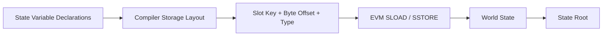
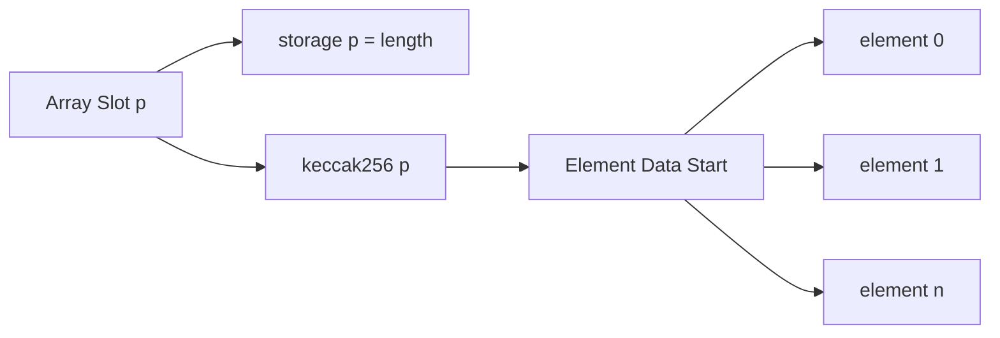
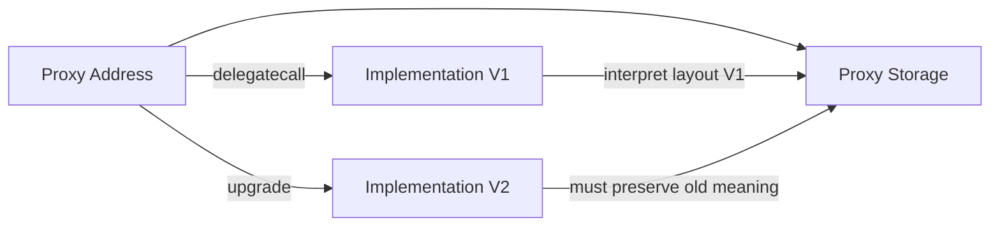
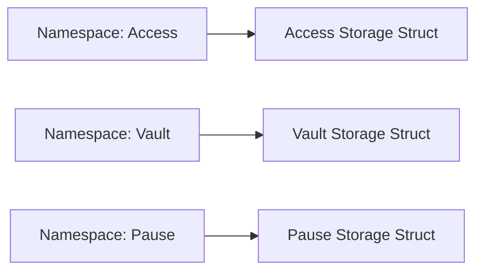
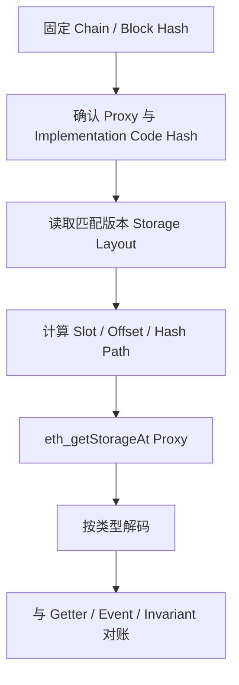

# Solidity Storage Layout：从 Slot Packing 到代理升级兼容

> Storage Layout 是 Solidity 源码到 EVM 持久状态之间的地址映射协议。变量名不会写入 Storage，真正决定数据位置的是声明顺序、类型宽度、继承线性化和 Hash 派生规则；对代理合约而言，这份布局就是跨版本的数据 Schema，错误升级会让新代码把旧 Slot 解释成另一种业务含义。

---

## 一、本文解决什么问题

Storage Bug 往往不会在升级交易中立即 Revert。更常见的是升级成功后，Owner、余额或订单字段被静默错读：

- 小整数、Bool 和 Address 如何打包进同一个 32 Byte Slot？
- 为什么调整字段顺序既可能省 Slot，也可能增加写入成本？
- Mapping 元素的 Slot 如何由 Key 和声明 Slot 计算？
- Dynamic Array 的 Length 和元素数据分别存在哪里？
- Struct 是否会与前后变量共享 Slot？
- 多重继承如何影响变量排列？
- `constant` 与 `immutable` 是否占普通 Storage Slot？
- `T storage ref` 是副本还是指向原状态的 Pointer？
- 代理升级为什么不能重排、删除或改变已有变量类型？
- 如何用 Compiler Layout、`eth_getStorageAt` 和主网 Fork 验证结论？

本文以 Solidity 0.8.x 的经典 Storage Layout 规则为主。Storage Layout 被 Solidity 文档视为外部接口的一部分，但 Compiler 新能力、Transient State Variable、Namespaced Storage、短 `bytes/string` 编码和代码生成细节会随版本变化；必须固定 Compiler Version，并以该版本官方文档和 `storageLayout` 输出为准。

### 核心结论

1. EVM Storage 逻辑上是 `256-bit key -> 256-bit value`；Solidity Layout 决定变量如何映射到这些 Key 与 Word 内 Byte Offset。
2. 连续、小于 32 Byte 的 Value Type 可能按声明顺序打包到同一 Slot；若剩余空间不足，下一个变量从新 Slot 开始。
3. Struct 与 Array 数据通常从新 Slot 开始，其后的变量也从新 Slot 开始；具体成员仍按各自规则布局。
4. Mapping 声明 Slot 通常作为派生种子，不直接存储元素；元素位置由规范编码的 Key 与 Slot Hash 派生。
5. Dynamic Array 的声明 Slot保存 Length，元素区从 `keccak256(slot)` 派生；小型元素可能继续在元素 Slot 内打包。
6. Inheritance Variable 按最终线性化顺序参与统一 Layout，来自不同 Base Contract 的小变量也可能共享 Slot。
7. `constant` 不占普通 Storage Slot；`immutable` 在部署阶段固化到 Runtime Code 相关表示，通常也不进入普通 Storage Layout。
8. Storage Pointer/Reference 指向真实持久数据，字段修改会直接写对应 Slot；错误别名和 Assembly Slot 操作可绕过类型安全。
9. 代理升级的基本安全规则是保留已有变量的 Slot、Offset 与类型含义。通常只能在允许的位置追加，不能依赖“变量名相同”判断兼容。
10. Storage Gap 和 Namespaced Storage 是治理工具，不是自动安全证明；继承、类型、命名空间 ID 和 Compiler 支持仍需验证。
11. Layout 结论必须由 Compiler Artifact、链上 Code Version、原始 Slot 和升级前后不变量共同验证。

---

## 二、从源码变量到 Storage Word



Solidity 变量名只存在于源码、Metadata 和 Artifact。链上 Storage 只有 Key 与 32 Byte Value。要解码一个 Slot，必须知道：

- Contract/Implementation 版本；
- Compiler Version 与 Layout 规则；
- 继承线性化；
- 变量 Slot、Offset 与类型；
- Mapping/Array 的派生路径；
- 目标 Block Hash。

只知道 Proxy Address 和变量名，不足以可靠读取状态。

---

## 三、Slot Packing：多个小值共享 32 Byte

下面的变量可能被打包：

```solidity
contract PackedAccount {
    uint128 available;
    uint64  unlockAt;
    bool    frozen;
    address owner;
}
```

概念布局为：

```text
slot 0: available(16B) | unlockAt(8B) | frozen(1B) | remaining unused
slot 1: owner(20B) | remaining unused
```

Solidity 在一个 Slot 内把首个较小值放在低位一侧，后续值继续占用更高 Byte Offset。人工查看 32 Byte Hex 时，显示顺序与数值高低位容易造成视觉误判，应以 Compiler 输出的 `offset` 为准。

### 3.1 Packing 基本规则

对经典普通 State Variable，可以建立以下模型：

1. Value Type 使用其实际 Byte 宽度；
2. 若当前 Slot 剩余空间足够，则继续放入该 Slot；
3. 若不足，则从下一 Slot 开始；
4. 单个值不会跨两个 Slot 分割；
5. Struct 与 Array 通常开启新 Slot 边界；
6. Struct/Array 之后的变量也从新 Slot 开始。

精确规则以目标 Compiler 文档和 Layout Artifact 为准。

### 3.2 Packing 不等于每次操作更便宜

更新共享 Slot 中的单个字段，Compiler 通常需要：

1. `SLOAD` 整个 Word；
2. Mask/Clear 目标 Byte 区间；
3. Shift 并合并新值；
4. `SSTORE` 整个 Word。

若多个字段经常一起读写，Packing 可减少 Slot Access；若只频繁更新一个小字段，额外 Read-Modify-Write 可能抵消收益。必须按真实调用路径测量。

### 3.3 重排字段的代价

新部署合约可以按生命周期和访问模式重排字段以减少 Slot，但可升级合约不能为了省 Gas 重排已有字段。Layout 兼容优先级高于微小优化。

---

## 四、读取 Packed Slot

假设 Compiler 报告：

```text
frozen: slot = 0, offset = 24, type = bool
```

从原始 Word 提取的概念公式为：

```text
value = (word >> (offsetBytes * 8)) & mask(typeWidthBits)
```

写入则需保留同 Slot 其他字段：

```text
cleared = word & ~(mask << shift)
updated = cleared | ((newValue & mask) << shift)
```

手写 Assembly 修改 Packed Slot 风险很高：错误 Mask 会破坏邻接字段。除非有明确性能证据、Golden Test 和专项审计，应让 Compiler 生成访问代码。

### 4.1 Bool 并非任意非零都应视为合法编码

Solidity 高层赋值会生成规范值，但原始 Storage 可能来自 Assembly、旧版本或损坏迁移。链下解码器不应盲目把任意非零 Byte 当作可信业务 `true`，应结合 Compiler ABI/Layout 与状态来源验证。

---

## 五、Mapping Slot：Key 与声明 Slot 的 Hash 派生

```solidity
mapping(address account => uint256 balance) private balances;
```

假设 `balances` 的声明 Slot 为 `p`。对于常见静态 Key，元素位置概念上为：

```text
elementSlot = keccak256(h(key) ++ encode32(p))
```

其中 `h(key)` 的具体处理取决于 Key Type：Value Type 通常按 32 Byte 规则编码，`bytes`/`string` 等允许的特殊键类型有其规定。必须使用 Solidity Storage Layout 规范对应的编码，不能用字符串拼接或 ABI Packed 猜测。

```mermaid
flowchart LR
    K[Mapping Key] --> E[Key Encoding h(k)]
    P[Declaration Slot p] --> C[32-byte p]
    E --> H[keccak256]
    C --> H
    H --> S[Element Storage Slot]
```

### 5.1 声明 Slot 中存什么

Mapping 的声明 Slot 通常不保存 Length 或 Key 列表，而是保留为派生命名空间种子。因此读取 `p` 本身不能得到 Mapping 元素数量。

### 5.2 Nested Mapping

```solidity
mapping(address => mapping(address => uint256)) allowances;
```

概念上逐层派生：

```text
outer = keccak256(h(owner) ++ encode32(p))
value = keccak256(h(spender) ++ encode32(outer))
```

每层 Key 顺序都属于协议。把 Owner 与 Spender 对调会得到完全不同 Slot。

### 5.3 Mapping to Struct

若 Mapping Value 是 Struct，Hash 派生结果是 Struct 起始 Slot，成员再按 Struct Layout 使用该 Slot 或后续 Slot：

```solidity
struct Position {
    uint128 collateral;
    uint128 debt;
    uint256 lastUpdate;
}

mapping(address => Position) positions;
```

`collateral` 与 `debt` 可能共享派生起始 Slot，`lastUpdate` 位于下一 Slot。最终以 Compiler Layout 为准。

---

## 六、Dynamic Array Slot：Length 与元素区分离

```solidity
uint256[] private values;
```

假设声明 Slot 为 `p`：

- `storage[p]` 保存数组 Length；
- 元素数据起点为 `keccak256(encode32(p))`；
- 对 32 Byte 元素，`values[i]` 通常位于 `dataStart + i`。



### 6.1 小型元素 Packing

若元素宽度小于 32 Byte，同一元素 Slot 可能保存多个元素。概念计算需要：

```text
itemsPerSlot = floor(32 / elementSizeBytes)
elementSlot  = dataStart + floor(index / itemsPerSlot)
byteOffset   = (index % itemsPerSlot) * elementSizeBytes
```

只适用于满足该经典布局的元素类型；复杂、动态或跨 Slot 类型必须按 Compiler 规则处理。

### 6.2 Nested Dynamic Array

外层元素可能保存内层数组的 Length，其数据区再对该元素 Slot 做 Hash 派生。嵌套计算应逐层进行，不能把多个 Index 简单相加。

### 6.3 `bytes` 与 `string` 的特殊布局

Storage 中动态 `bytes`/`string` 对短数据和长数据使用特殊编码，Length 与数据位置不完全等同普通 `T[]`。手工解码必须按目标 Solidity 版本的官方规则实现，并测试临界长度；不要套用普通 Dynamic Array 公式。

---

## 七、Struct Layout：成员顺序与边界

```solidity
struct Order {
    address maker;
    uint96 amount;
    bool cancelled;
    uint256 deadline;
}

Order private order;
```

Struct 从新 Slot 开始。成员内部继续按 Packing 规则排列；Struct 结束后，下一个顶层变量从新 Slot 开始，即使最后一个 Struct Slot 还有空间。

### 7.1 Struct 中的动态成员

Mapping 或 Dynamic Array 成员占据一个声明 Slot 作为派生种子/Length 位置，后续 Struct 成员继续从后续 Slot 布局。Struct 的起始 Slot可能来自顶层声明，也可能来自 Mapping/Array 元素派生。

### 7.2 Struct 升级

改变字段顺序、类型宽度或在中间插入成员会改变后续成员 Slot/Offset。即使 Struct 只存在于 Mapping Value 中，所有历史 Key 对应的数据都会被新代码按新布局解释。

可升级协议应冻结既有 Struct，并通过新增版本 Struct、独立 Mapping 或 Namespaced Storage 完成演进，而不是原地重排。

---

## 八、Inheritance Layout：所有 Base 进入统一布局

Solidity 会按照 Contract 的继承线性化顺序排列 State Variable。来自不同 Base 的小变量可能共享同一 Slot。

```solidity
contract AccessState {
    address internal owner;
}

contract PauseState {
    bool internal paused;
}

contract Vault is AccessState, PauseState {
    uint96 internal feeRate;
    uint256 internal totalAssets;
}
```

不能仅分别计算每个 Contract 的 Slot 0。最终 Vault 是一个统一 Layout，`owner`、`paused`、`feeRate` 可能发生跨 Base Packing。

### 8.1 改变 Base 顺序

将 `Vault is AccessState, PauseState` 改为相反顺序，可能改变线性化与 Storage Layout。对 Proxy Upgrade 来说，这通常是不兼容变化。

### 8.2 向 Base 插入变量

即使派生 Contract 源码没变，在 Base 中间加入一个 State Variable 也可能推移所有后续 Slot。升级审查必须比较完整继承树，而不是只 Diff 最终 Contract 文件。

### 8.3 Diamond Inheritance

共同 Base 通常按线性化只出现一次，但 Override 和布局必须使用 Compiler 最终结果验证。不要手工把每条继承路径的变量重复相加。

---

## 九、Constant 与 Immutable：为何不在普通 Storage Layout

### 9.1 Constant

`constant` 值在编译期确定，Compiler 通常将其值直接用于生成代码，不分配普通 Storage Slot。

```solidity
uint256 internal constant BASIS_POINTS = 10_000;
```

改变 Constant 会改变新 Runtime Code 行为，但不会迁移已部署合约中的某个 Storage Word。Proxy Upgrade 改变实现 Constant 后，所有 Proxy 会观察新实现逻辑中的新常量语义。

### 9.2 Immutable

`immutable` 在创建阶段赋值，并固化到该部署实例的 Runtime Code 相关位置，不占普通 Storage Slot：

```solidity
address public immutable factory;

constructor() {
    factory = msg.sender;
}
```

### 9.3 Proxy 边界

Implementation Immutable 属于 Implementation 部署实例。多个 Proxy Delegatecall 到同一 Implementation 时，会共享该实现代码中的 Immutable 值，而不是各自拥有不同值。

每个 Proxy 独立配置应放在 Proxy Storage 并通过安全 Initializer 设置。若使用带 Immutable 参数的 Implementation Clone/Factory 模式，应明确 Code 实例与配置生命周期。

---

## 十、Storage Pointer：局部变量可以直接指向状态

```solidity
struct Account {
    uint128 balance;
    bool frozen;
}

mapping(address => Account) private accounts;

function _freeze(address user) internal {
    Account storage account = accounts[user];
    account.frozen = true;
}
```

`account` 是 Storage Reference/Pointer，不是副本。它携带定位真实状态所需的信息，字段写入会产生 `SSTORE`。

### 10.1 与 Memory Copy 对比

```solidity
Account memory snapshot = accounts[user];
snapshot.frozen = true;
```

这里只修改 Memory Snapshot，不会自动写回 Storage。若随后执行 `accounts[user] = snapshot`，才会复制回可复制字段。

### 10.2 Pointer Alias

多个 Storage Reference 可指向同一对象。辅助函数若接收 `Account storage`，可以修改调用方传入的真实状态。Library 常用这一能力封装集合或 Struct 操作。

API 命名应明确 `_loadAccount`、`_updateAccount` 等副作用，避免把写操作隐藏在看似只读的 Helper 中。

### 10.3 Assembly `.slot` 与 `.offset`

Inline Assembly 可访问某些 Storage Variable/Reference 的 Slot 与 Offset，具体可用语法受 Compiler 版本和变量种类约束。它会绕开很多类型安全检查，错误赋值可能让 Pointer 指向任意 Slot。

只有在 Layout 已固定、Compiler Artifact 可验证且经过专项审计时，才应操作原始 Slot。

---

## 十一、Upgrade Storage Compatibility：代理升级的数据 Schema



Proxy Upgrade 不迁移 Storage。它只是更换解释同一批 Slot 的 Runtime Code，因此 V2 必须保持旧数据含义。

### 11.1 典型不兼容变化

- 重排已有变量；
- 删除变量并复用其位置；
- 改变类型或位宽；
- 在已有变量前或中间插入变量；
- 改变 Base Contract 顺序；
- 向早期 Base 插入状态；
- 改变 Struct 既有字段布局；
- 将不同代理模式的管理 Slot 混用；
- 修改 Namespaced Storage ID 或内部 Struct Layout。

### 11.2 通常可接受的追加

在完整布局末尾追加新变量通常是传统顺序布局中最常见的兼容演进方式，但仍需检查：

- 是否真的位于所有 Base 和 Gap 之后；
- 前一变量是否有 Packing 空间及工具如何判定；
- 新变量初始化默认值是否符合业务；
- Struct/Mapping 内部是否另有兼容问题；
- 使用的代理标准与验证工具是否允许。

不能把“追加”当成无需检查的绝对规则。

### 11.3 变量重命名

只改变量名通常不改变 Slot/Type，但会影响 Artifact、监控、脚本和审计可读性。有些 Upgrade Validation Tool 还会要求显式说明 Rename。布局兼容不等于工程无影响。

---

## 十二、Storage Gap 与 Namespaced Storage

### 12.1 Storage Gap

传统可升级 Base Contract 常预留 Fixed Array Gap，使未来版本能在占用 Gap 的同时保持后续派生变量位置：

```solidity
uint256[48] private __gap;
```

Gap 长度、Packing 与继承关系必须由 Upgrade Tool 验证。减少 Gap 时需要精确匹配新增变量占用 Slot，不能凭变量数量简单减法。

### 12.2 Namespaced Storage

Namespaced Storage 将模块状态放在由稳定 Namespace ID 派生的独立起始 Slot，并用 Struct 描述模块内部布局。ERC-7201 提供了一种标准化思路，但实际采用要求目标 Compiler 与工具链支持相应标注和验证。



它减少不同模块之间的顺序耦合，但不会消除模块内部升级规则：Struct 仍不能随意重排，Namespace ID 也不能修改或碰撞。

### 12.3 Unstructured Storage

代理实现地址、Admin 等管理字段常使用标准定义的特殊 Slot，避免与普通 Compiler Layout 冲突。必须遵循所选代理标准的精确 Slot 公式，不能自行挑选“看起来很大”的常量。

---

## 十三、Layout Inspection：以 Compiler 输出为事实来源

Solidity Standard JSON Output 可请求 `storageLayout`。典型结果会包含：

- `storage`：每个变量的 Contract、Label、Slot、Offset、Type ID；
- `types`：Type ID 对应的编码、Byte 数、成员和基础类型。

概念配置如下，具体字段以目标 `solc` 版本文档为准：

```json
{
  "settings": {
    "outputSelection": {
      "*": {
        "*": ["storageLayout"]
      }
    }
  }
}
```

### 13.1 Artifact 必须绑定编译配置

保存：

- Exact `solc` Version；
- Source Hash；
- Remapping 与 Dependency Version；
- Optimizer 与 `viaIR` 配置；
- ABI、Storage Layout、Creation/Runtime Bytecode；
- Proxy/Implementation Address 与 Code Hash。

Storage Layout 的主要高层规则通常不由优化器随意改变，但发布证据仍应使用完全相同构建配置，避免 Artifact 与部署 Bytecode 不一致。

### 13.2 Layout Diff

CI 应比较 V1/V2 的：

- 旧变量 Slot、Offset、Type 是否保持；
- Struct Member Layout 是否保持；
- Base Linearization 是否改变；
- Gap 是否正确消费；
- Namespace 与管理 Slot 是否稳定；
- 新变量 Default State 是否需要迁移。

工具通过不代表业务迁移正确。仍需验证状态值、权限和协议不变量。

---

## 十四、链上原始 Slot 验证

`eth_getStorageAt(address, slot, blockTag)` 可读取某地址在目标区块的原始 32 Byte Storage Word。对 Proxy 必须读取 Proxy Address 的 Storage，而不是 Implementation Address。

验证流程：



### 14.1 不只比较 Getter

Getter 与原始 Slot 由同一错误实现读取时，可能“一致地错误”。升级验证应同时保留升级前原始 Word、业务 Getter、Event/Indexer 投影和资产不变量。

### 14.2 Block Pinning

所有 Slot、Code 与 Getter 查询应固定同一 Block Hash/Number。使用多次 `latest` 可能跨区块或跨升级点，组合出不存在的状态快照。

### 14.3 Archive Data

读取很久以前的 Storage 需要历史状态能力，普通 Full Node/Provider 未必保留。应使用经过能力验证的 Archive Endpoint，并记录 Provider、Client Version 和 Block Hash。

---

## 十五、升级破坏案例

V1：

```solidity
contract VaultV1 {
    address public owner;      // slot 0, offset 0
    uint96 public feeBps;      // slot 0, offset 20
    uint256 public total;      // slot 1
}
```

错误 V2：

```solidity
contract VaultV2 {
    bool public paused;        // 插入到最前面
    address public owner;
    uint96 public feeBps;
    uint256 public total;
}
```

V2 会从 Slot 0 的低位读取 `paused`，并把后续字段按新 Offset 解释。Owner 不会“自动移动”到新位置，Proxy Storage 也不会迁移。

正确方向通常是保留旧声明并在末尾追加：

```solidity
contract VaultV2Compatible {
    address public owner;
    uint96 public feeBps;
    uint256 public total;

    bool public paused;
}
```

但真实项目使用继承和代理标准时，应从 V1 继承或遵循框架模式，并通过 Upgrade Validation，而不是复制粘贴变量列表。

---

## 十六、Storage Migration：兼容布局之外的状态演进

有时业务必须改变数据模型，例如从单值余额迁移到按资产 Mapping。仅追加新变量不会自动迁移旧数据。

稳健迁移需要：

1. 定义 V1/V2 权威状态和过渡期读取规则；
2. 设计版本化 Reinitializer 或分批迁移；
3. 防止重复迁移与遗漏账户；
4. 限制每笔迁移 Gas；
5. 保持迁移前后资产与权限不变量；
6. 记录进度、Checkpoint 和失败恢复；
7. 明确何时禁用旧写路径。

若无法链上枚举 Mapping Key，需要依赖已有索引、Event Backfill、Merkle Claim 或 Lazy Migration。方案会引入不同信任和可用性成本。

### 16.1 Lazy Migration

首次访问账户时从旧 Slot 读取并写入新结构，可以摊销 Gas，但必须防止重复迁移、旧新路径并发写和状态被遗忘。迁移标记本身也进入 Layout。

### 16.2 Merkle Migration

链下生成状态快照并把 Root 写入新合约，用户凭 Proof 领取，可避免遍历旧 Mapping，但引入快照正确性、遗漏、重复领取、Root 治理和最终性边界。

---

## 十七、常见误区与错误案例

### 17.1 Storage 按变量名查找

错误。链上只存 Slot Key 与 Word，变量名不参与运行时寻址。

### 17.2 小变量总能自动省 Gas

错误。Packing 减少 Slot 数，但单字段更新可能需要 Read-Modify-Write。必须按访问模式测量。

### 17.3 Mapping 的声明 Slot 存元素数量

错误。它通常只是元素 Slot 派生种子，没有 Length 或 Key 列表。

### 17.4 Dynamic Array 元素紧跟在 Length Slot 后

错误。元素数据区通常从 `keccak256(slot)` 派生，不是简单 `slot + 1`。

### 17.5 Struct 最后空余 Byte 可给下一个顶层变量

错误。Struct 数据从新 Slot 开始，结束后下一变量也从新 Slot 开始。

### 17.6 改 Base Contract 顺序不影响状态

错误。Inheritance Linearization 会参与统一 Layout，顺序改变可能重排所有后续变量。

### 17.7 Implementation 的 Immutable 是每个 Proxy 独立配置

错误。Immutable 固化在 Implementation 实例的 Code 相关表示中，共用实现的 Proxy 观察同一值。

### 17.8 只在变量末尾追加就绝对安全

错误。继承、Gap、Struct、Namespace、代理标准和默认初始化都可能带来额外约束，必须运行 Layout Validation。

### 17.9 Getter 正常就证明升级兼容

错误。新 Getter 可能按同一错误 Layout 自洽读取。还需比较原始 Slot、旧版本快照和业务不变量。

---

## 十八、工程实践与方案选择

### 18.1 Layout Review 进入 PR

每次状态变更 PR 都附 V1/V2 Layout Diff，标注新增变量、Slot/Offset、Struct 变化、Base 变化、Gap/Namespace 与迁移策略。

### 18.2 不复用删除变量的 Slot

删除源码变量不会清除链上历史 Word。传统顺序布局中应保留占位，避免未来把旧数据解释为新字段。敏感数据删除也不等于链上不可见。

### 18.3 使用成熟代理标准

不要自行发明 Implementation/Admin Slot。采用成熟库和 Upgrade Tool，并固定依赖版本、部署脚本与权限流程。

### 18.4 Assembly 最小化

原始 Slot 操作应集中在小型、文档化模块，使用命名常量/Namespace，配套 Golden Slot Test、Fuzz 和审计。业务合约避免散落魔法 Slot。

### 18.5 状态与索引分离

Mapping 是权威状态、Event/Indexer 是枚举投影时，升级迁移要同时处理链上 Layout 与链下 Schema，按 Block Range 版本化解码。

---

## 十九、测试与验证方法

### 19.1 Layout Golden File

把 Compiler `storageLayout` 作为版本化 Artifact。CI 在无预期状态变更时要求完全一致；有变更时要求人工批准结构化 Diff。

### 19.2 Slot Unit Test

为关键字段、Mapping、Nested Mapping、Dynamic Array 和 Struct 写 Slot 计算测试，并与合约 Getter/Assembly Probe 对账。覆盖 Packed Offset 和数组临界 Index。

### 19.3 Upgrade Fork Test

在真实部署 Block/最新安全状态 Fork 上：

1. 记录升级前 Code Hash、Implementation、原始关键 Slot 和 Getter；
2. 执行升级与 Reinitializer；
3. 再次读取相同 Slot 与业务状态；
4. 验证 Owner、Role、余额、债务、份额和总量不变量；
5. 测试回滚、暂停和权限失败路径。

### 19.4 Fuzz/Invariant

生成随机账户和状态操作，升级后继续执行相同状态机。断言资产守恒、Mapping/索引一致、迁移至多一次、旧状态不被重新激活。

### 19.5 Gas Measurement

比较 Packing、Migration 或 Namespaced 方案时，固定 Fork、Compiler、Optimizer、Code Hash、Calldata 与前状态，记录 Receipt 和 Trace 中 SLOAD/SSTORE 路径。不要用 Slot 数量直接替代 Gas 测量。

---

## 二十、总结

Solidity Storage Layout 是合约状态的长期数据 Schema：

1. 小型 Value Type 可按 Byte Offset 打包，但更新成本取决于真实访问模式。
2. Mapping 通过 Key 与声明 Slot Hash 派生，声明 Slot 不保存 Key 列表。
3. Dynamic Array 的 Length 与 Hash 派生元素区分离，小元素还会继续打包。
4. Struct 与 Inheritance 把成员纳入统一布局，源码重排会改变旧状态解释。
5. Constant/Immutable 不进入普通 Storage Layout，但 Proxy 需要特别理解 Implementation Code 语义。
6. Storage Pointer 直接引用真实状态，Assembly Slot 操作必须最小化并验证。
7. Proxy Upgrade 不迁移数据，新实现必须保持旧 Slot、Offset 和类型含义。
8. 最终结论必须由 Compiler Layout、链上 Code Hash、原始 Slot、Fork Upgrade Test 和业务不变量共同证明。

---

## 问答复盘

### Q1：两个小变量共享 Slot 后，修改一个是否只写它自己的 Byte？

**答：** EVM `SSTORE` 写整个 32 Byte Word。Compiler 通常先读取原 Word，用 Mask 修改目标字段，再写回，因此邻接字段布局必须准确。

### Q2：Mapping 声明 Slot 中保存了什么？

**答：** 通常不保存元素或 Length，而作为 Hash 派生种子。元素 Slot 由规范编码的 Key 与声明 Slot 计算。

### Q3：Dynamic Array 的第一个元素是否位于 `slot + 1`？

**答：** 通常不是。声明 Slot 保存 Length，元素区从 `keccak256(encode32(slot))` 开始派生。

### Q4：Struct 最后一个 Slot 有空余空间，后续顶层变量能否继续打包？

**答：** 不能按普通相邻 Value Type 这样推断。Struct 从新 Slot 开始，结束后的变量也从新 Slot 开始，应以 Compiler Layout 为准。

### Q5：为什么改变 Base Contract 顺序会破坏 Proxy？

**答：** State Variable 按最终继承线性化进入统一 Layout。Base 顺序变化会改变 Slot/Offset，旧 Proxy Storage 不会自动重排。

### Q6：`immutable` 为什么不适合保存每个 Proxy 不同的配置？

**答：** Immutable 固化在 Implementation 部署实例的 Code 相关表示中，共用该实现的 Proxy 会观察同一值，而非各自独立 Storage。

### Q7：在末尾添加变量是否一定升级安全？

**答：** 不一定。还需检查完整继承树、Gap、Namespace、Struct、代理标准和默认值迁移，并通过 Layout Tool 与 Fork Test 验证。

### Q8：如何证明某个 Mapping Slot 计算正确？

**答：** 固定 Compiler 与 Block Hash，根据官方编码规则计算 Slot，用 `eth_getStorageAt` 读取原始 Word，再与 Getter、事件和业务状态交叉对账。

### Q9：为什么升级测试不能只调用新 Getter？

**答：** 新 Getter 可能按照错误布局一致地错读。必须保存升级前原始 Slot 和状态快照，并验证资产、权限等不变量。

---

## 延伸知识

- **编译与部署**：`solc` Standard JSON、Bytecode、Metadata、Library Linking 与 Reproducible Build。
- **代理模式**：ERC-1967、Transparent、UUPS、Beacon、Diamond 与 Upgrade Authorization。
- **Namespaced Storage**：ERC-7201、模块化状态与 Layout Validation。
- **状态迁移**：Lazy Migration、Merkle Claim、Checkpoint 与双写切换。
- **形式化验证**：Storage Invariant、Delegatecall Context 与升级前后行为等价性。
