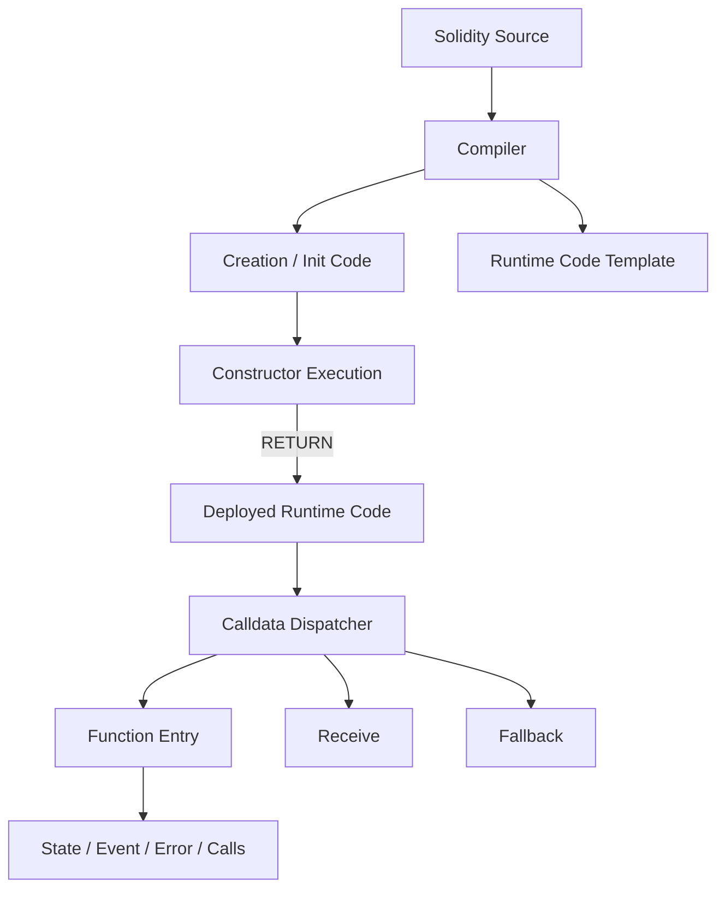
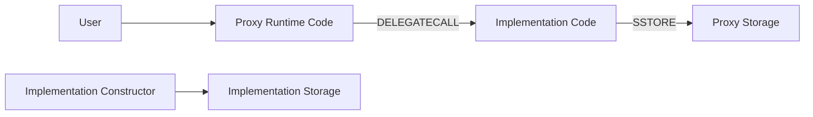
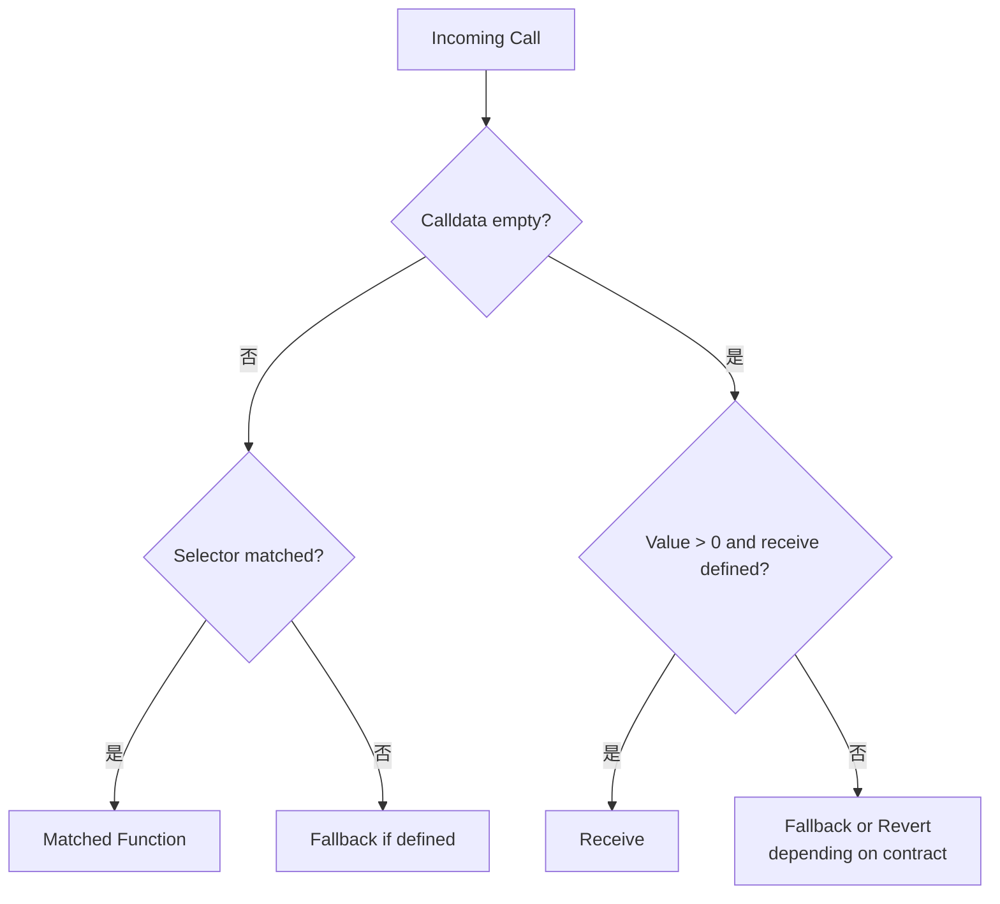
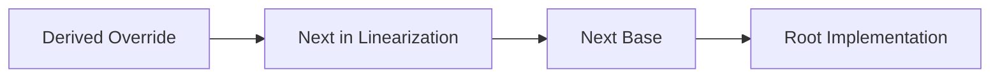

# Solidity 合约结构：从状态、函数入口到继承与 Library

> Solidity 合约不是状态变量与函数的简单集合。Constructor 决定初始状态，Dispatcher 根据 Calldata 选择函数、Receive 或 Fallback，Visibility 与 Mutability 约束可达路径，Modifier 注入横切逻辑，Event/Error 输出执行证据，而 Inheritance、Interface 和 Library 决定代码如何组合以及权限如何扩散。

---

## 一、本文解决什么问题

一个合约可以语法正确、测试通过，却因结构边界理解错误产生升级、权限或资金风险：

- State Variable 何时写入 Storage，Public Getter 能返回什么？
- Constructor 为什么不会出现在 Runtime Code 的普通调用入口中？
- 代理合约为什么不能依赖实现合约 Constructor 初始化状态？
- `public`、`external`、`internal`、`private` 是否等同于权限控制？
- `view`、`pure` 与 `payable` 在 EVM 层分别保证什么？
- Modifier 中 `_` 的位置与多个 Modifier 的顺序如何影响执行？
- Event 和 Error 为什么不是状态本身？
- 空 Calldata 与未知 Selector 分别进入 Receive 还是 Fallback？
- 多重继承如何选择 Override，`super` 到底调用谁？
- Interface 与 Library 分别适合建立什么边界？

本文以 Solidity 0.8.x 的通用公开语义为主。可见性限制、Override 语法、Library 行为、Transient State Variable、ABI 生成和 Compiler 优化会随版本演进；生产代码必须固定 Compiler Version，并以对应官方文档、编译产物、Storage Layout 与测试结果验证。

### 核心结论

1. State Variable 描述合约持久状态；其声明顺序和类型会影响 Storage Layout，是可升级合约的兼容契约。
2. Constructor 只在 Contract Creation 的 Init Code 阶段执行，成功返回 Runtime Code；普通部署后无法再次调用。
3. Proxy 的状态属于 Proxy。Implementation Constructor 不会初始化 Proxy Storage，必须使用受保护、版本化的 Initializer。
4. Visibility 控制源码和生成入口的可达性，不是业务授权。`private` 数据仍可从链上状态推导，`public` 也不等于任何人都应被允许修改。
5. Mutability 是调用与编译约束：`view` 不应修改状态，`pure` 不应读取或修改链状态，`payable` 允许接收 Value；它们不证明函数廉价、安全或业务幂等。
6. Modifier 是代码组合机制，不是天然安全模块。执行顺序、`_` 的位置、早退和多重 Modifier 都会改变函数语义。
7. Event 写入 Receipt Log，服务链下索引；Error 通过 Revert Data 表达失败。二者都不能替代合约未来需要读取的 Storage。
8. Receive 处理特定空 Calldata Value 调用，Fallback 处理未匹配函数或其他回退路径；具体分发需结合是否定义入口和 Payable 属性。
9. Inheritance 使用线性化后的单一继承顺序。Override、`super` 和 Constructor 顺序必须按完整层次分析，不能按源码直觉逐个父类调用。
10. Interface 定义外部交互契约但不验证目标实现；Library 复用代码却可能以内联、普通调用或 Delegatecall 相关方式执行，需理解状态上下文。
11. 合约结构的最终证据是 Runtime Code、ABI、Storage Layout 和行为测试，而不是源码文件外观。

---

## 二、从源码结构到运行时对象



源码中的 Contract、Inheritance 和 Modifier 最终会被 Compiler 转换为 Init Code、Runtime Code、Dispatcher 与控制流。EVM 不知道“这是 Modifier”或“这是 Interface”；这些是 Solidity 的高层结构。

因此源码审查后仍要查看：

- ABI 中实际暴露的入口；
- Runtime Bytecode 与 Function Selector；
- Storage Layout；
- Constructor Arguments 与 Initializer；
- Inheritance Linearization；
- 部署后的 Code Hash 和权限状态。

---

## 三、State Variable：持久协议状态

State Variable 声明在 Contract 范围内，通常存放于 Storage 或以 Constant/Immutable 等不同机制进入编译产物。

```solidity
contract Vault {
    address public owner;
    mapping(address account => uint256 balance) private balances;
    uint256 public totalDeposits;
}
```

### 3.1 声明顺序是布局输入

普通 State Variable 的类型、顺序、继承关系和 Packing 会影响 Storage Slot。可升级合约中重排、删除或改变类型，可能让新代码错误解释旧状态。

具体 Slot Packing、Mapping/Dynamic Array Slot 与 Inheritance Layout 属于后续 Storage Layout 模块，本篇只强调：源码字段顺序不是随意排版。

### 3.2 Public Getter 的边界

`public` State Variable 通常由 Compiler 生成 Getter，但 Getter 受 ABI 表达能力限制：

- Mapping 需要提供 Key 才能查询单项；
- Dynamic Array Getter 通常按 Index 查询元素；
- 复杂 Struct 中不可直接 ABI 返回的成员可能不会以“整个对象”形式出现；
- Getter 不提供自动分页、权限过滤或历史版本。

生产 API 应根据业务查询设计显式函数，而不是依赖自动 Getter 充当完整数据服务。

### 3.3 `private` 不是保密

`private` 只限制 Solidity 源码中的直接访问，不会加密 Storage。全节点、RPC、Trace 或 Slot 推导仍可读取链上数据。密钥、未揭示出价与个人敏感信息不能因声明为 `private` 就上链。

### 3.4 Constant 与 Immutable

`constant` 值在编译期确定，通常不占普通 Storage Slot；`immutable` 在部署构造阶段赋值，并进入部署后的 Runtime Code 相关表示。具体编译布局应以 Compiler 输出为准。

代理实现中的 Immutable 属于 Implementation Code，而不是每个 Proxy 独立 Storage，因此不适合表达每个 Proxy 各自不同的可升级配置，除非架构明确接受这一共享语义。

---

## 四、Constructor：只在创建阶段执行

Constructor 在创建帧执行，用于验证部署参数、初始化新账户 Storage、设置 Immutable，并最终产生 Runtime Code。

```solidity
error ZeroOwner();

contract Treasury {
    address public immutable deploymentAuthority;
    address public owner;

    constructor(address initialOwner) {
        if (initialOwner == address(0)) revert ZeroOwner();
        deploymentAuthority = msg.sender;
        owner = initialOwner;
    }
}
```

### 4.1 Constructor 不在普通 Runtime 入口

部署成功后，Constructor 代码不会作为普通外部函数再次调用。链上通常只保留其产生的 Runtime Code 和状态结果，而不是可重复执行的 Constructor 入口。

### 4.2 Constructor 失败

参数错误、外部调用 Revert、Out of Gas 或 Runtime Code 不满足目标 Fork 规则都会导致创建失败。内部 `CREATE/CREATE2` 的父帧可捕获失败；顶层创建交易失败仍消耗 Gas 并产生失败结果。

### 4.3 Constructor 中的外部调用

构造期间新地址的 Code 尚未按普通部署后状态存在。依赖 `address(this).code.length`、外部回调或注册表观察的逻辑容易出现时序差异。

Constructor 应尽量保持确定、短小并减少不可信外部调用。必须调用外部系统时，要测试 Reentrancy、部署失败和链状态变化。

---

## 五、Proxy 与 Initializer：Constructor 的关键例外场景



Implementation Constructor 执行时写的是 Implementation 自身状态，不会初始化 Proxy Storage。Proxy 通常使用 Initializer：

```solidity
contract UpgradeableVault {
    bool private initialized;
    address public owner;

    function initialize(address initialOwner) external {
        require(!initialized, "already initialized");
        require(initialOwner != address(0), "zero owner");

        initialized = true;
        owner = initialOwner;
    }
}
```

该示例用于说明概念，不建议自行实现生产初始化框架。真实系统需要成熟、版本化的 Initializer/Reinitializer、权限控制、Implementation 锁定与原子部署初始化。

### 5.1 初始化抢跑

若 Proxy 部署和 Initialize 分成两笔公开交易，攻击者可能先初始化并取得权限。应在部署交易内原子提供初始化 Calldata，或使用严格受控 Factory。

### 5.2 重复初始化

升级新增模块可能需要版本化 Reinitializer，不能简单重置一个 Bool。每个版本的迁移必须幂等或明确只能执行一次，并在主网 Fork 上验证状态。

---

## 六、Function Visibility：可达性不是授权

| Visibility | 合约外部调用 | 当前合约直接调用 | 派生合约 | 典型用途 |
|---|---|---|---|---|
| `external` | 是 | 通过外部调用语义或特定方式 | 取决于调用方式 | 对外 ABI 入口 |
| `public` | 是 | 是 | 是 | 对外并可内部复用 |
| `internal` | 否 | 是 | 是 | 继承扩展点、内部逻辑 |
| `private` | 否 | 是 | 否 | 当前 Contract 局部实现 |

精确调用语法和生成代码应按目标 Compiler 验证，尤其 Reference Type 参数的 Data Location 与内部/外部调用差异。

### 6.1 Visibility 不等于 Access Control

`public`/`external` 只表示入口可调用，不表示调用者有业务权限；`internal`/`private` 只限制 Solidity 调用路径，也不能阻止公开函数间接触发它们。

权限应显式验证 `msg.sender`、Role、签名或治理状态。

### 6.2 `this.function()` 是外部调用

通过 `this.someFunction()` 会对当前合约地址发起外部消息调用，建立新 Call Frame，改变 `msg.sender`、Gas、Reentrancy 和错误传播语义。它不是“绕过 external 的普通内部调用”。

### 6.3 Internal Hook

可重写的 `internal virtual` 函数适合模板方法和生命周期 Hook，但它扩大了派生合约可改变的不变量范围。基类必须文档化调用前后条件，审计所有 Override。

---

## 七、Mutability：状态与 Value 的调用约束

### 7.1 `view`

`view` 表示函数不应修改合约状态。外部调用通常可通过 Static Context 强化限制，但 Solidity 声明与 EVM 实际调用 Opcode 是不同层。

View 仍可：

- 读取 Storage 和区块环境；
- 执行昂贵循环；
- 调用其他只读路径；
- 因输入、状态、Gas 或目标失败而 Revert。

它不等于“免费”或“恒定结果”。链下调用不支付交易费，但 RPC 节点仍消耗资源。

### 7.2 `pure`

`pure` 不应读取或修改链状态，适合基于参数的计算与编码。但 Gas 和计算复杂度仍存在；Compiler 对某些环境访问的判断以版本规则为准。

### 7.3 `payable` 与 Nonpayable

`payable` 允许函数通过调用接收非零 `msg.value`。未标记 Payable 的入口通常由生成代码拒绝非零 Value。

Payable 不代表函数必须收到 Value，也不证明 Value 与业务金额一致。应显式校验：

```solidity
error IncorrectPayment(uint256 expected, uint256 actual);

function purchase(uint256 expectedPrice) external payable {
    if (msg.value != expectedPrice) {
        revert IncorrectPayment(expectedPrice, msg.value);
    }
    // 更新订单状态
}
```

价格通常不应由调用者自行提供；示例仅展示 Value 校验形态。真实价格应来自可信状态或签名报价，并包含 Deadline/Nonce。

### 7.4 Mutability 与 Override

派生函数能否改变 Visibility/Mutability 受 Solidity 版本和 Override 兼容规则约束。升级设计不应凭直觉修改，应以 Compiler 和接口兼容测试为准。

---

## 八、Modifier：把横切逻辑包裹在函数周围

Modifier 可在函数主体之前、之后或多次围绕 `_` 插入逻辑：

```solidity
error Unauthorized(address caller);

modifier onlyOwner() {
    if (msg.sender != owner) revert Unauthorized(msg.sender);
    _;
}
```

### 8.1 `_` 的位置决定执行顺序

```solidity
modifier whenActive() {
    require(!paused, "paused");
    _;
    lastExecutionBlock = block.number;
}
```

函数主体在 `_` 处执行，后置逻辑在函数主体成功返回后执行。若主体 Revert，后置逻辑不会提交；若后置逻辑 Revert，函数主体状态也会整体回滚。

### 8.2 多个 Modifier 嵌套

```solidity
function execute() external onlyOwner whenActive nonReentrant {
    // body
}
```

Modifier 按声明顺序形成嵌套展开，前置和后置逻辑顺序不同。不要把它们当作互不影响的注解。应通过最小测试和 Trace 验证锁、暂停与权限的实际执行顺序。

### 8.3 Modifier 的代价

复杂 Modifier 会隐藏控制流、重复 Storage Read，并使 Override/继承审查困难。通用逻辑可提取为 Internal Function；权限检查应保持短小并使用 Custom Error。

Modifier 也可能不执行 `_`，从而跳过函数主体。此类设计应极其克制，因为调用者难以从函数签名理解行为。

---

## 九、Event：链下索引的执行证据

Event 编译为 EVM Log。非 Anonymous Event 通常把 Event Signature Hash 放入 Topic 0，Indexed 参数进入其他 Topics，非索引参数进入 Data。

```solidity
event OwnershipTransferred(
    address indexed previousOwner,
    address indexed newOwner
);
```

### 9.1 Event 不是状态

合约不能通用读取历史 Event。未来合约逻辑需要的数据必须保存在 Storage；Event 用于链下查询、审计和通知。

### 9.2 先更新状态还是先发 Event

只要最终同一执行范围 Revert，状态和 Event 都会回滚。工程上通常在成功更新状态后发出与新状态一致的 Event，便于审计；关键是参数必须来自最终权威值，而非未经验证输入。

### 9.3 Reorg 与重复消费

成功 Receipt 的 Event 仍可能因 Reorg 被移除。Indexer 必须保存 Block Hash、幂等消费并支持回滚；前端收到 WebSocket Event 不能立即视为 Finalized。

### 9.4 Event 设计

事件应表达稳定业务事实，包含重建索引所需 ID 和关键关联。不要无边界记录大字符串或敏感信息，也不要把所有字段都设为 Indexed。

---

## 十、Error：结构化失败接口

Solidity 支持 `require`、`revert`、`assert` 以及 Custom Error。现代业务错误通常优先使用 Custom Error：

```solidity
error InsufficientBalance(
    address account,
    uint256 available,
    uint256 required
);
```

### 10.1 Error 是外部接口的一部分

Custom Error 会进入 ABI Artifact，前端可按 Selector 与参数解码。升级删除或改变 Error 参数会影响客户端错误处理，应该纳入 ABI Diff。

### 10.2 Revert Data 不可信

外部合约可伪造任意 Error Selector 和参数。不能因为 Catch 到某个 Error 就证明目标身份或授权成功；错误只适合控制预期失败分支与 UX。

### 10.3 `assert` 与业务校验

`assert` 用于表达内部不变量，失败产生 Panic；用户输入、权限和余额不足等预期错误应使用 `require` 或 Custom Error。Fuzz/Invariant Test 应尝试触发所有 Assert。

---

## 十一、Receive 与 Fallback：Dispatcher 的最后两个入口



该图用于说明常见分发模型，具体生成行为取决于 Solidity 版本、是否定义入口、Payable 属性和 Runtime Code。

### 11.1 `receive()`

`receive() external payable` 用于特定空 Calldata 的原生资产接收路径。它没有参数和返回值。

```solidity
event NativeReceived(address indexed sender, uint256 amount);

receive() external payable {
    emit NativeReceived(msg.sender, msg.value);
}
```

Receive 中执行 Storage 写或复杂逻辑会增加失败概率。来自某些发送方式的可用 Gas 可能受限，不能依赖复杂处理。更稳健的模式是只记录最小状态，或要求用户调用明确的 Deposit Function。

### 11.2 `fallback()`

Fallback 在 Selector 未匹配或其他回退路径中执行，代理通常在这里转发 Calldata。它可以是 Payable 或 Nonpayable，并可在现代语法中处理原始 Calldata/Returndata，具体签名以 Compiler 版本为准。

### 11.3 静默吞掉未知调用

一个不 Revert 的 Fallback 可能让调用者误以为函数成功，尤其低级调用只看到 `success = true`。非代理合约通常应对未知 Selector 明确 Revert；代理则必须验证实现地址并正确冒泡返回与错误数据。

### 11.4 强制转入的边界

Receive/Fallback 不能保证合约只通过这些入口获得原生资产。协议机制、历史 `SELFDESTRUCT` 行为或其他路径可能使余额变化，因此不变量不应简单假设 `address(this).balance` 等于内部记账总额。具体边界需按目标 Fork 验证。

---

## 十二、Inheritance：代码复用也是权限组合

Solidity 支持单继承和多继承。派生 Contract 会合并可继承成员，并按照线性化顺序解析 Override、`super` 与 Constructor。

```solidity
abstract contract Pausable {
    bool public paused;

    function _beforeAction() internal view virtual {
        require(!paused, "paused");
    }
}

contract Vault is Pausable {
    function _beforeAction() internal view override {
        super._beforeAction();
    }
}
```

### 12.1 `virtual` 与 `override`

可被派生合约重写的函数需要相应 `virtual` 声明；Override 必须满足 Compiler 的函数兼容规则。多重父类提供相同函数时，通常需要显式列出 Override 来源。

### 12.2 `super` 不是“指定父类”

`super.fn()` 按最终继承线性化调用下一实现，而不是简单调用源码中最近写出的父类。协作式多继承要求每层 Override 正确调用 `super`，否则可能跳过权限、记账或 Hook。



### 12.3 Constructor 顺序

Base Constructor 按继承线性化相关规则执行，而不是任意运行时顺序。参数可在继承列表或派生 Constructor 中提供，具体语法需以 Compiler 版本为准。

部署测试应断言每个 Base 的状态和 Event，而不能仅看部署成功。

### 12.4 Storage Layout

继承会把 Base State Variable 纳入最终 Storage Layout。调整 Base 顺序、向基类插入字段或改变继承树都可能破坏 Proxy Storage 兼容性。

### 12.5 组合优于深继承

深层多继承会增加线性化、Override 和 Storage Layout 复杂度。可独立部署的策略、Oracle 或权限模块可考虑 Composition；紧密共享状态且需要 Internal Hook 时才适合继承。

---

## 十三、Interface：声明外部契约，不证明实现

Interface 用于描述外部可调用函数、Event、Error 和相关类型，使 Compiler 与工具生成 ABI 调用。

```solidity
interface IPriceOracle {
    error StalePrice(uint256 updatedAt);

    function latestPrice() external view returns (uint256 price, uint256 updatedAt);
}
```

### 13.1 Interface 的价值

- 限制调用方依赖的最小表面；
- 为 Mock、多个实现和集成测试提供契约；
- 生成 Selector、ABI 编码和类型；
- 避免导入整个 Implementation。

### 13.2 Interface 不验证目标

把某个 Address Cast 为 Interface 不会检查：

- 目标是否有 Code；
- 是否实现全部函数；
- 返回值是否符合 ABI；
- 行为是否满足业务不变量；
- Proxy 当前实现是否已升级。

接入时仍需验证 Chain、Address、Code Hash、返回范围、Staleness 和失败策略。

### 13.3 ERC-165 与能力发现

部分标准使用 ERC-165 等机制声明接口支持，但它是由合约返回的能力信号，不是对完整正确实现的密码学证明。还要处理恶意返回、Gas 与代理升级。

---

## 十四、Library：复用逻辑但不统一执行上下文

Library 适合封装类型操作、数学、集合和 Storage Helper：

```solidity
library BasisPoints {
    uint256 internal constant DENOMINATOR = 10_000;

    function apply(uint256 amount, uint256 bps)
        internal
        pure
        returns (uint256)
    {
        require(bps <= DENOMINATOR, "invalid bps");
        return amount * bps / DENOMINATOR;
    }
}
```

### 14.1 Internal Library Function

Internal Library Function 通常由 Compiler 内联或以内部跳转方式集成到调用 Contract，具体由优化器决定。它不产生独立外部消息调用语义。

### 14.2 Public/External Library Function

外部可见 Library Function 需要链接到已部署 Library，调用语义可能涉及专门的 Delegatecall 保护与当前状态上下文。确切生成方式和限制应以目标 Compiler 输出为准。

这意味着 Library Code 也可能在调用 Contract 的 Storage 上下文操作 Storage Reference。链接地址与 Library Code Hash 是部署供应链的一部分。

### 14.3 `using for`

`using Library for Type` 让函数以方法形式调用：

```solidity
using BasisPoints for uint256;

uint256 fee = amount.apply(feeBps);
```

这只是语法绑定，不改变参数验证、溢出、舍入和 Gas 语义。

### 14.4 Library 的适用边界

Library 适合无独立身份、无独立治理的复用逻辑。需要可升级状态、权限、资金托管或独立生命周期的模块，更适合 Contract/Interface Composition。

---

## 十五、一个结构完整的最小示例

```solidity
interface IWithdrawalHook {
    function afterWithdraw(address account, uint256 amount) external;
}

contract ManagedVault {
    error Unauthorized(address caller);
    error InsufficientBalance(uint256 available, uint256 requested);
    error NativeTransferFailed();

    event Deposited(address indexed account, uint256 amount);
    event Withdrawn(address indexed account, uint256 amount);

    address public immutable owner;
    mapping(address => uint256) private balances;

    constructor(address initialOwner) {
        if (initialOwner == address(0)) revert Unauthorized(address(0));
        owner = initialOwner;
    }

    modifier onlyOwner() {
        if (msg.sender != owner) revert Unauthorized(msg.sender);
        _;
    }

    function deposit() external payable {
        balances[msg.sender] += msg.value;
        emit Deposited(msg.sender, msg.value);
    }

    function withdraw(uint256 amount) external {
        uint256 available = balances[msg.sender];
        if (available < amount) {
            revert InsufficientBalance(available, amount);
        }

        balances[msg.sender] = available - amount;
        (bool success,) = payable(msg.sender).call{value: amount}("");
        if (!success) revert NativeTransferFailed();

        emit Withdrawn(msg.sender, amount);
    }

    function balanceOf(address account) external view returns (uint256) {
        return balances[account];
    }
}
```

示例展示 State、Constructor、Modifier、Event、Error、Visibility、Mutability 与 Payable，但仍不是完整生产 Vault：缺少暂停、治理迁移、Reentrancy Guard、会计不变量、强制余额处理和审计。

---

## 十六、常见误区与错误案例

### 16.1 `private` State Variable 是秘密

错误。它只限制 Solidity 访问，链上 Storage 仍公开可分析。

### 16.2 Implementation Constructor 会初始化 Proxy

错误。Constructor 写 Implementation 状态；Proxy 需要原子、受保护的 Initializer。

### 16.3 `internal` 函数天然安全

错误。任何可达的 Public/External 路径都可能间接触发它，派生合约还可能 Override Internal Virtual Function。

### 16.4 `view` 函数不会失败也不消耗资源

错误。它可以执行昂贵计算、读取变化状态并 Revert；RPC 仍需承担资源成本。

### 16.5 Modifier 的顺序不重要

错误。Modifier 按嵌套顺序执行，锁、暂停、权限和后置逻辑可能相互影响。

### 16.6 Event 发出后就不可撤销

错误。当前帧 Revert 会删除 Event，区块 Reorg 还会移除已成功 Receipt 的 Log。

### 16.7 未知 Selector 进入 Fallback 且返回成功没有风险

错误。调用方可能把不存在的函数误认为成功。非代理合约应考虑明确 Revert。

### 16.8 `super` 就是调用指定的直接父类

错误。它按最终继承线性化调用下一实现，必须分析完整继承树。

### 16.9 Interface Cast 能验证目标实现

错误。Cast 只帮助编码调用，不验证目标 Code、语义和返回数据。

---

## 十七、工程实践与方案选择

### 17.1 缩小外部表面

只暴露业务需要的 External/Public Entry，内部逻辑保持 Internal/Private，并为每个外部入口定义 Caller、Value、State、Reentrancy 与 Failure Policy。

### 17.2 Constructor 保持确定

避免不可信外部调用和复杂循环。部署参数需要零值、范围、Chain 与地址验证；将最终参数和 Code Hash 写入 Deployment Manifest。

### 17.3 Modifier 保持短小

权限、暂停与锁的检查可用 Modifier，但复杂业务流程用显式 Internal Function 更易审计。为 Modifier 顺序编写测试，不依赖视觉直觉。

### 17.4 继承深度受控

优先选择成熟、文档化基类。超过数层的多重继承应生成 Linearization、Override 与 Storage Layout 报告，并考虑拆成 Interface + Composition。

### 17.5 ABI 与事件版本化

接口、Error、Event 的变化进入发布审查。Indexer 按生效 Block 与 Code Hash 选择 ABI，不能用最新 ABI 回放全部历史。

---

## 十八、测试与验证方法

### 18.1 入口矩阵

测试每个入口的：

- 正确/错误 Caller；
- 零/非零 Value；
- 正常、边界和畸形 Calldata；
- Paused/Initialized/Role 状态；
- 外部调用 Success、Revert、Out of Gas；
- Event、Error 和最终 Storage。

### 18.2 Receive/Fallback

覆盖空 Calldata + 零 Value、空 Calldata + 非零 Value、未知 Selector、短于 4 Byte Calldata、Fallback Payable/Nonpayable，以及代理 Returndata/Revert Data 冒泡。

### 18.3 继承与 Override

为每个 Base Hook 记录执行顺序，断言 `super` 链完整；检查 Base Constructor、Modifier 嵌套、Event 与 Storage 初始化。Mutation Test 可故意删除一次 `super` 调用，确认测试能发现不变量破坏。

### 18.4 Proxy 初始化

测试未初始化、重复初始化、抢跑、错误实现、升级迁移、Implementation 自身初始化和原子部署初始化。使用真实部署状态 Fork 验证 Storage Layout 与权限。

### 18.5 编译产物

发布前保存并比较 ABI、Creation/Runtime Bytecode、Metadata、Storage Layout、Method Identifiers、Library Link References 和 Source Map。部署后核对地址 Code Hash 与初始化状态。

### 18.6 Gas 测量

比较 Public/External、Modifier 抽取、Event 字段和 Library 方案时，固定 Compiler、Optimizer、Fork、Code Hash、Calldata 和前状态，使用 Receipt 与 Trace 测量。不能只比较源码行数或一次估算。

---

## 十九、总结

Solidity 合约结构决定了状态如何建立、调用如何进入、失败如何表达以及代码如何组合：

1. State Variable 是持久协议状态，其布局不能在升级中随意变化。
2. Constructor 只运行于创建阶段；Proxy 必须使用安全、版本化的 Initializer。
3. Visibility 约束可达性而非授权，Mutability 约束状态/Value 语义而非成本和安全。
4. Modifier 会真实改变控制流，顺序、`_` 与后置逻辑必须测试。
5. Event 服务链下索引，Error 服务结构化失败，两者都需要 ABI 版本治理。
6. Receive 与 Fallback 是 Dispatcher 的回退入口，未知调用不应被无意静默接受。
7. Inheritance 依赖线性化与 `super` 链，并直接影响 Storage Layout 和权限组合。
8. Interface 只声明调用契约，Library 只复用代码；目标可信性和状态上下文仍需单独验证。

---

## 问答复盘

### Q1：`private` State Variable 是否能保护商业秘密？

**答：** 不能。`private` 只限制 Solidity 源码访问，链上 Storage 仍可由节点、RPC 或 Slot 分析读取。

### Q2：Implementation Constructor 为什么不能初始化 Proxy 状态？

**答：** Constructor 在 Implementation 创建上下文执行并写它自己的状态；用户通过 Delegatecall 使用的是 Proxy Storage，必须单独 Initialize。

### Q3：`public` 与 `external` 最重要的边界是什么？

**答：** 两者都可形成外部 ABI 入口，但内部调用与参数位置语义不同。无论哪种 Visibility，都不能替代 Caller 权限校验。

### Q4：`view` 是否保证同样输入永远返回同样结果？

**答：** 不保证。它可以读取随区块和状态变化的数据，也可能 Revert；只有前状态和执行环境相同，结果才具有确定性。

### Q5：多个 Modifier 为什么必须测试顺序？

**答：** 它们按嵌套方式展开，前置、函数主体和后置逻辑的执行顺序不同，可能影响锁、暂停、权限与回滚范围。

### Q6：Receive 与 Fallback 最容易混淆的边界是什么？

**答：** Receive 主要处理特定空 Calldata Value 路径；Fallback 处理未匹配 Selector 等回退路径。实际分发还取决于入口是否定义及 Payable 属性。

### Q7：`super.foo()` 是否固定调用某个直接父类？

**答：** 不是。它调用最终继承线性化中的下一实现，因此多重继承必须检查完整 `super` 链。

### Q8：将地址 Cast 为 Interface 后，能否认为目标实现正确？

**答：** 不能。Cast 只生成 ABI 调用；仍需验证 Chain、Code、返回范围、权限、升级版本和失败策略。

### Q9：如何验证一次合约结构重构没有改变外部行为？

**答：** 固定 Compiler 与配置，比较 ABI、Selector、Runtime Code、Storage Layout 和 Event/Error，并在真实状态 Fork 上运行入口矩阵与不变量测试。

---

## 延伸知识

- **Storage Layout**：Slot Packing、Inheritance Layout、Storage Pointer 与升级兼容。
- **编译与部署**：Creation Code、Runtime Code、Metadata、Library Linking 与 Reproducible Build。
- **权限模型**：Ownable、RBAC、Multisig、Timelock、Guardian 与 Emergency Action。
- **代理模式**：Transparent、UUPS、Beacon、Initializer 与 Upgrade Authorization。
- **合约安全**：Reentrancy、Unchecked Call、Delegatecall、Forced Balance 与 Denial of Service。
