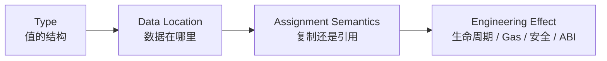
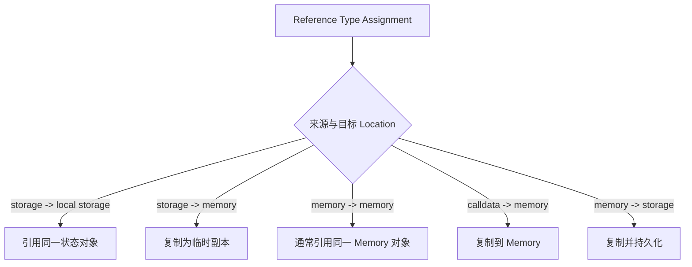
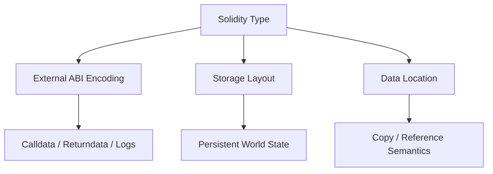

# Solidity 类型系统：从值类型、引用类型到数据位置与复制语义

> Solidity 类型不只决定“变量能保存什么”，还决定数据位于 Stack、Memory、Calldata 还是 Storage，赋值发生复制还是引用绑定，能否进入 ABI、是否可以作为 Mapping Key，以及升级时如何解释既有 Storage。类型选择本质上是状态生命周期与信任边界设计。

---

## 一、本文解决什么问题

业务合约中常见的类型错误，很少只是编译器报错。更危险的情况是代码能够编译，却对复制、持久化或精度边界理解错误：

- Value Type 与 Reference Type 的判断标准是什么？
- `storage`、`memory`、`calldata` 之间赋值时，何时复制、何时引用？
- Mapping 为什么只能存在于 Storage 语义中，为什么不能遍历？
- Fixed Array、Dynamic Array、`bytes` 与 `string` 有什么差异？
- Struct 内含 Mapping 后，为什么不能直接 ABI 返回？
- Enum 是否适合作为长期升级协议中的状态编码？
- User-defined Value Type 能否阻止 Token 数量与价格混用？
- `address` 与 `address payable` 的能力边界是什么？
- `bytes32` 与 `bytes` 应该如何选择？
- Internal/External Function Type 能否安全持久化或跨升级复用？

本文以 Solidity 0.8.x 系列的通用公开语义为主。具体转换规则、可用语法、Transient State Variable、ABI 限制和编译器诊断会随版本变化；工程采用前应固定 Compiler Version，并以该版本 Solidity 官方文档、编译输出和测试结果为准。

### 核心结论

1. Value Type 的赋值通常复制值；Reference Type 的行为取决于 Data Location 和赋值方向，不能只凭 `=` 判断复制或引用。
2. `storage` 表示持久状态引用，`memory` 表示当前调用帧的临时可变数据，`calldata` 表示当前外部调用的只读输入。
3. Mapping 是 Storage 中的稀疏 Key-Value 结构，没有 Length、Key 列表或协议级遍历能力；需要枚举时必须额外维护索引。
4. Fixed Array 的长度属于类型，Dynamic Array 的长度存于运行时；`bytes` 是紧凑字节数组，通常比 `bytes1[]` 更符合字节数据语义。
5. Struct 是字段顺序固定的组合类型，其 Storage Layout 会成为代理升级兼容性的一部分。
6. Enum 提供源码级有限状态集合，但链上只保存数值语义；升级中重排或删除成员会改变旧值含义。
7. User-defined Value Type（UDVT）在编译期区分相同底层表示的业务量，但 ABI 和运行时表示仍基于 Underlying Type。
8. `address payable` 只表达允许使用特定原生资产转账成员，不证明地址安全、存在 Code 或能够成功接收 Value。
9. Fixed-size Bytes 是 Value Type，适合 Hash、Selector 等定长数据；动态 `bytes` 适合任意长度负载，二者 ABI 与操作语义不同。
10. Function Type 分为 Internal 与 External。它们携带的是执行入口能力，不应被当作跨版本稳定业务标识。
11. 类型系统不能替代业务验证。`uint256` 可编码不等于金额合理，`address` 合法不等于目标链、合约和角色正确。

---

## 二、类型、位置与生命周期的三层模型

分析 Solidity 变量时，应连续回答三个问题：



例如 `uint256[]` 只说明“动态整数数组”，还不够：

- `uint256[] storage`：指向持久数组；
- `uint256[] memory`：当前调用中的独立临时副本；
- `uint256[] calldata`：外部输入的只读视图。

同一种逻辑类型换一个 Data Location，就会改变可修改性、生命周期、复制成本与赋值结果。

---

## 三、Value Type：赋值产生独立值

常见 Value Type 包括：

- `bool`；
- `uint<M>`、`int<M>`；
- `address`、`address payable`；
- `bytes1` 到 `bytes32`；
- `enum`；
- User-defined Value Type；
- 部分 Function Type。

Value Type 变量赋值时复制其值，修改目标不会改变来源：

```solidity
uint256 original = 10;
uint256 copied = original;
copied = 20;

// original 仍为 10
```

### 3.1 Integer 边界

整数类型有明确位宽和有无符号语义。Solidity 0.8.x 默认对普通算术执行溢出/下溢检查，失败会 Panic；`unchecked` 可关闭相应检查，但只应在已经证明边界且有测试的局部使用。

```solidity
function increment(uint256 value) external pure returns (uint256) {
    require(value < type(uint256).max, "value too large");
    unchecked {
        return value + 1;
    }
}
```

此处 `unchecked` 的正确性依赖前置条件。若删除 `require`，代码会在最大值处环绕为零。

### 3.2 Literal 与显式转换

数字常量在编译阶段具有精确值语义，但落入具体整数类型时必须满足范围。显式转换并不等于运行时业务校验；缩窄转换可能截断高位，跨精度 Token 金额也可能因整数除法损失余数。

工程上应在转换前检查 Range，并明确 Rounding Direction，而不是通过 Cast 消除编译器提示。

---

## 四、Reference Type：行为由 Data Location 决定

Array、Struct、Mapping 属于 Reference Type。它们的数据规模或结构不能简单看作一个独立 256-bit 值，变量可能表示某块数据的引用。



准确规则应按具体类型、语句与 Compiler Version 验证，上图用于建立主模型，不能替代编译器测试。

### 4.1 Storage Reference 的风险

```solidity
struct Account {
    uint256 balance;
    bool frozen;
}

mapping(address => Account) private accounts;

function freeze(address owner) external {
    Account storage account = accounts[owner];
    account.frozen = true;
}
```

`account` 不是副本，而是指向 Mapping 元素的 Storage Reference。修改它会修改持久状态。

若改为 `Account memory account = accounts[owner]`，得到临时副本；修改后若不显式写回，链上状态不变。

### 4.2 Memory Alias

同一 Memory 对象可能被多个局部变量引用。修改其中一个别名，另一个观察到的内容也会变化。需要独立副本时，应明确执行逐元素或编码/解码复制，并测量成本。

---

## 五、Data Location：`storage`、`memory` 与 `calldata`

### 5.1 `storage`

`storage` 数据属于合约账户的持久状态，顶层交易成功后写入 World State。它适合跨交易协议状态，例如余额、角色、订单和配置。

Storage 写入成本依赖目标 Fork、旧值、新值和访问冷热状态。不能只因为“数据以后可能用到”就全部上链；应明确协议是否真的需要合约未来读取。

### 5.2 `memory`

`memory` 属于当前 Call Frame，函数结束后销毁。它可修改，适合临时数组、ABI 编码、返回值和计算中间对象。

Memory Expansion 按访问高水位累计计费。无界数组、字符串拼接和外部返回数据复制可能导致 Out of Gas。

### 5.3 `calldata`

`calldata` 是外部调用输入的只读字节视图，生命周期限于当前调用。External Function 的 Reference Type 参数常优先使用它，以避免不必要的 Memory Copy。

```solidity
function hashPayload(bytes calldata payload) external pure returns (bytes32) {
    return keccak256(payload);
}
```

是否节省 Gas 必须固定 Compiler、Optimizer、输入和调用路径测量。若函数需要频繁修改数据，复制到 Memory 仍然必要。

### 5.4 Location 是接口的一部分

Data Location 会影响函数可见性、Overload、内部调用方式和生成代码。升级或重构时不能只看高层类型名是否相同，还要运行编译、ABI 和行为测试。

---

## 六、Mapping：不可遍历的 Storage Key-Value 结构

Mapping 语法表示从 Key Type 到 Value Type 的逻辑映射：

```solidity
mapping(address account => uint256 balance) private balances;
```

未写入 Key 读取为 Value Type 的默认零值。协议不会记录“该 Key 是否曾被插入”的独立标记；若业务需要区分“不存在”和“值为零”，必须额外保存存在性字段。

### 6.1 Key 与 Value 边界

Mapping Key 必须是允许的内建 Value Type、Contract/Enum/UDVT 等可编码定长键类型，不能直接使用 Mapping、动态数组、Struct 等复杂引用结构。Value 则可以是 Mapping、Array 或 Struct。

具体允许集合以目标 Solidity 版本文档为准。

### 6.2 为什么没有 Length 和遍历

Mapping 元素通过 Key 与声明 Slot 派生 Storage Slot，并不保存协议级 Key 列表。因此无法仅凭 Mapping 本身枚举全部键。

需要 Enumerable 行为时，应额外维护数组或链表索引：

```solidity
mapping(address => bool) private isMember;
address[] private members;

function addMember(address member) external {
    if (isMember[member]) return;
    isMember[member] = true;
    members.push(member);
}
```

这引入双写一致性、删除成本和无界遍历风险。生产读取应分页，写入应保持 Mapping 与索引原子更新。

### 6.3 Mapping 不能直接作为 ABI 数据

ABI 无法表达“全部 Mapping 内容”，因为 Key 集合不存在于 Mapping 结构中。包含 Mapping 的 Struct 也不能整体复制到 Memory 或直接作为公共 ABI 返回；应提供按 Key 查询或分页投影接口。

---

## 七、Array：长度是否属于类型

### 7.1 Fixed-size Array

`uint256[3]` 的长度是类型的一部分，与 `uint256[4]` 是不同类型。若元素为静态 ABI 类型，Fixed Array 也是静态；若元素动态，整体编码仍是动态。

### 7.2 Dynamic Array

`uint256[]` 在运行时具有 Length。Storage Dynamic Array 可通过 `push`、`pop` 等方式改变长度；Memory Array 创建后长度固定，不能用 Storage 的方式增长。

```solidity
function double(uint256[] calldata input)
    external
    pure
    returns (uint256[] memory output)
{
    output = new uint256[](input.length);
    for (uint256 i; i < input.length; ++i) {
        output[i] = input[i] * 2;
    }
}
```

真实业务必须限制 `input.length`，否则循环和 Memory Allocation 可能超出 Gas 预算。

### 7.3 `bytes` 与 `bytes1[]`

`bytes` 是动态长度字节序列，拥有紧凑存储和专门操作语义；`bytes1[]` 是元素数组，Storage/Memory 布局与 Gas 行为不同。二进制 Payload 通常使用 `bytes`，不要仅因名称相似互换。

### 7.4 删除与顺序

`delete array[index]` 通常把元素重置为默认值，不自动缩短数组。若不要求顺序，可用 Swap-and-Pop 实现 O(1) 删除；若要求稳定顺序，则需要移动元素或维护其他索引，成本不同。

---

## 八、Struct：业务状态的组合类型

Struct 把多个字段组合成一个命名类型：

```solidity
struct Order {
    address maker;
    uint128 amount;
    uint64 deadline;
    bool settled;
}
```

字段顺序影响 Storage Packing 与 ABI Tuple 顺序。对可升级合约，Struct Layout 是持久兼容契约，不能随意重排或改变已有字段类型。

### 8.1 Struct Assignment

- Storage Reference 指向原对象；
- Storage 到 Memory 会复制可复制字段；
- Memory 到 Storage 会写入持久状态；
- 含 Mapping 的 Struct 无法整体复制到 Memory。

修改代码前应写最小 Compiler Test 验证实际赋值语义，尤其是嵌套 Array 与 Struct。

### 8.2 Struct 与 ABI Tuple

在 External ABI 中，Struct 通常表示为 Tuple，其字段名不进入链上字节，顺序与类型才决定编码。链下客户端的 ABI Artifact 若字段顺序错误，会把合法字节解释成错误业务数据。

### 8.3 Partial Update

整体把 Memory Struct 写回 Storage 可能覆盖并发路径已修改的其他字段。链上交易按顺序执行，不存在同一交易的线程竞态，但存在“读取旧快照后按业务流程提交覆盖”的逻辑竞态。更新时应只写必要字段，并通过 Nonce/Version/Deadline 防止陈旧意图。

---

## 九、Enum：有限状态的源码级表达

Enum 适合表达有限离散状态：

```solidity
enum OrderStatus {
    Pending,
    Filled,
    Cancelled
}
```

链上保存的是对应数值语义，默认第一个成员值为零。未初始化 Enum 因此会表现为第一个成员，业务若需要 `Unknown`，应把它显式放在第一个位置。

### 9.1 升级边界

在末尾追加成员通常比重排安全；删除、插入或重排会改变旧数值的含义。即使 ABI 仍能解码整数，业务语义也已损坏。

跨合约、跨链或长期存储协议可以显式使用整数常量并冻结编码文档，或严格治理 Enum 追加规则。选择取决于可读性与协议稳定性要求。

### 9.2 转换不是任意容错

从整数转换为 Enum 需要满足有效范围，否则会失败。外部输入仍应先验证业务允许的状态迁移，不能仅验证数值落在 Enum 范围内。

---

## 十、User-defined Value Type：为相同底层值增加类型边界

User-defined Value Type（UDVT）可基于内建 Value Type 创建新的编译期类型：

```solidity
type TokenAmount is uint256;
type PriceE18 is uint256;
```

两者底层都是 `uint256`，但不能被无意混用。通过 `wrap`/`unwrap` 在底层值与 UDVT 间显式转换：

```solidity
function quote(TokenAmount amount, PriceE18 price)
    external
    pure
    returns (uint256)
{
    return TokenAmount.unwrap(amount) * PriceE18.unwrap(price) / 1e18;
}
```

### 10.1 能解决什么

UDVT 可减少 Amount、Price、Timestamp、Basis Points 等同为 `uint256` 时的参数错位，并可结合 `using for` 提供受控操作函数。

### 10.2 不能解决什么

UDVT 不自动验证 Range、Decimal、币种或单位。`TokenAmount.wrap` 不会检查值来自哪个 Token，也不会防止乘法溢出。验证仍需写在 Constructor/Factory/Library 边界。

UDVT 的 ABI 表示基于 Underlying Type，链下工具是否保留高层名称取决于 Artifact 和代码生成器版本。

---

## 十一、Address 与 Payable

`address` 表示 20 Byte 地址值；`address payable` 额外允许使用特定原生资产转账相关成员。二者都是 Value Type。

### 11.1 Payable 不是安全证明

转换为 `address payable` 只表达编译期能力，不证明：

- 地址属于 EOA；
- 地址存在 Runtime Code；
- 接收逻辑不会 Revert；
- 发送不会触发 Reentrancy；
- 地址属于正确 Chain 或业务角色。

### 11.2 发送原生资产

现代工程通常使用低级 `call{value: amount}("")` 并检查结果，同时用 CEI、Reentrancy Guard 或 Pull Payment 保护状态：

```solidity
error NativeTransferFailed(address recipient, uint256 amount);

function _sendValue(address payable recipient, uint256 amount) internal {
    (bool success,) = recipient.call{value: amount}("");
    if (!success) revert NativeTransferFailed(recipient, amount);
}
```

这只是传输原语，不是完整提款函数。调用前必须先更新账本状态并验证权限。

### 11.3 Code Length 的局限

`address.code.length` 可观察当前上下文中的 Code，但构造阶段、预计算地址、协议演进和账户抽象都会使“零 Code 等于 EOA”不可靠。不要用它做长期授权或反 Bot 边界。

---

## 十二、Fixed-size Bytes：定长字节值

`bytes1` 到 `bytes32` 是 Value Type，适合定长 Hash、Selector、ID 和位字段。

```solidity
bytes4 selector = bytes4(keccak256("transfer(address,uint256)"));
bytes32 digest = keccak256(payload);
```

### 12.1 与整数的对齐差异

Fixed-size Bytes 与 Integer 在显式转换、截断和 ABI Word 对齐方向上存在不同规则。不要用同一套 Shift/Mask 直觉处理；应使用明确类型转换并通过 Hex 测试向量验证。

### 12.2 `bytes32` 不是字符串容器

短文本可以被人工装入 `bytes32`，但会遇到 UTF-8、尾零、长度恢复和截断问题。面向用户的任意文本应使用 `string`；只有协议明确规定的定长标识才适合 `bytes32`。

### 12.3 Indexing

Fixed-size Bytes 可按索引读取单个 Byte，顺序与位运算解释需要谨慎。跨语言协议应给出完整 Hex，而不只写“第 0 位是最高/最低位”的自然语言描述。

---

## 十三、Function Type：把调用入口作为值

Solidity 区分 Internal Function Type 与 External Function Type。

### 13.1 Internal Function

Internal Function Value 指向当前合约代码中的内部入口，只能在 EVM 内部控制流中使用。其底层表示与 Compiler/Code Layout 相关，不是跨部署版本稳定标识。

可升级合约不应把 Internal Function Pointer 持久化后跨实现升级继续使用。代码布局变化可能让旧值指向错误入口或失效，具体限制需查阅所用 Compiler 文档。

### 13.2 External Function

External Function Value 在语义上包含目标地址与函数 Selector，可用于调用外部合约：

```solidity
function invoke(
    function(uint256) external returns (bool) operation,
    uint256 value
) external returns (bool) {
    return operation(value);
}
```

调用仍需面对目标代码变化、Selector Collision、Revert、Gas 和 Reentrancy。Function Type 只封装入口，不证明目标可信。

### 13.3 回调治理

长期协议更常保存目标地址、Selector、权限和版本信息，而不是依赖高层 Function Value 隐式表达全部策略。执行回调前应限制 Target、Gas、Calldata 和允许失败语义。

---

## 十四、默认值与 `delete`

Solidity 类型都有默认零值：整数为 0、Bool 为 `false`、Address 为零地址、Enum 为第一个成员，Reference Storage 元素读取为空/零状态。

`delete value` 通常把目标重置为该类型默认值，但具体对 Array、Struct、Mapping 的效果不同：

- 删除 Value Type：重置为零值；
- 删除 Dynamic Array：长度清零并按规则清理元素；
- 删除 Struct：重置可删除成员；
- Mapping 本身不能通过一次 `delete` 枚举并清除所有历史 Key。

不要把默认值自动解释成“不存在”。订单 ID 0、零地址、Enum 第一个状态是否有效，必须由业务协议定义。

---

## 十五、类型与 ABI、Storage Layout 的连接



同一源码类型在两个边界有不同表现：

- ABI 关心 Canonical Type、Tuple、Offset 与字节编码；
- Storage Layout 关心 Slot、Packing、Hash 派生和继承顺序；
- Data Location 关心生命周期与赋值语义。

升级审查必须同时比较 ABI Diff 与 Storage Layout Diff。只看到函数签名没变，不能证明状态兼容。

---

## 十六、常见误区与错误案例

### 16.1 Reference Type 赋值一定复制

错误。Storage Reference 或 Memory Alias 可能指向同一对象；行为取决于来源与目标 Data Location。

### 16.2 `calldata` 只是更便宜的 `memory`

错误。Calldata 是只读外部输入，Memory 是可变临时空间。成本之外还有可修改性和调用边界差异。

### 16.3 Mapping 可以通过链上循环拿到全部 Key

错误。Mapping 不保存 Key 列表。需要枚举必须维护额外索引，并承担一致性与分页成本。

### 16.4 `delete mapping` 会清空所有元素

错误。没有 Key 集合就无法一次遍历删除所有派生 Slot；必须按已维护的 Key 索引逐项处理或采用版本化命名空间。

### 16.5 Enum 追加、插入和重排都安全

错误。插入或重排会改变旧数值含义。可升级协议应冻结顺序，通常只允许受控末尾追加。

### 16.6 UDVT 会自动校验单位

错误。它提供编译期类型区分，但 `wrap` 不校验 Decimal、Token 或业务 Range。

### 16.7 `address payable` 一定能成功收款

错误。目标逻辑可能 Revert，外部调用还可能触发 Reentrancy。必须检查结果并保护状态。

### 16.8 `bytes32` 比 `string` 便宜，所以所有文本都用它

错误。任意 UTF-8 文本会遇到截断与长度问题。类型首先应正确表达协议语义，再测量成本。

---

## 十七、工程实践与方案选择

### 17.1 用类型表达业务单位

Amount、Price、Timestamp、Duration、Basis Points 不应全部裸用 `uint256`。可使用 UDVT、Library 和命名参数减少顺序与单位错误，并在边界集中验证。

### 17.2 限制动态集合

所有来自 Calldata 的 Array/Bytes/String 都应有业务上限；Storage Array 的链上遍历必须分页或拆分为多笔交易。不要让用户可控长度决定无界循环。

### 17.3 分离状态与索引

Mapping 保存权威状态，Array 保存可枚举索引时，要让两者在同一交易原子更新，并测试删除、重复加入和重组后的链下投影。

### 17.4 固定编译与布局证据

发布清单至少保存 Compiler Version、Optimizer、ABI、Storage Layout、Runtime Code Hash 和源代码提交。代理升级 CI 同时检查类型、ABI 和 Slot 兼容性。

---

## 十八、测试与验证方法

### 18.1 类型边界测试

覆盖整数 Min/Max、缩窄转换、零地址、空 Bytes/String、Unicode、空数组、最大业务长度、Enum 边界和 UDVT 错误单位输入。

### 18.2 Location 与 Alias 测试

为 Reference Type 明确测试：

- Storage Reference 修改是否持久化；
- Storage 到 Memory 修改是否隔离；
- Memory Alias 是否互相影响；
- Calldata 到 Memory Copy 后是否可独立修改；
- Memory 写回 Storage 是否覆盖非目标字段。

### 18.3 Mapping 与索引不变量

使用 Fuzz/Invariant Test 验证：成员数组无重复、`isMember` 与索引一致、删除后不可查询、分页不遗漏，以及任何 Revert 不留下半更新状态。

### 18.4 升级验证

从真实部署状态 Fork，升级实现后验证旧 Enum、Struct、Array、Mapping 与 UDVT Underlying Value 仍保持语义。比较 Compiler 生成的 Storage Layout，而不是只运行新版本 Happy Path。

### 18.5 Gas 测量

比较 `calldata`/`memory`、Packed Struct、Array 操作或索引方案时，固定 Fork、Compiler、Optimizer、Code Hash、输入与前状态，记录 Receipt Gas Used 和 Trace。不要从单次样本推导普遍结论。

---

## 十九、总结

Solidity 类型系统真正决定的是数据如何穿过源码、ABI、EVM 与持久状态：

1. Value Type 通常按值复制，Reference Type 必须结合 Data Location 判断复制与引用。
2. `storage`、`memory`、`calldata` 分别对应持久、帧内可变和调用输入只读生命周期。
3. Mapping 提供高效按 Key 状态访问，却没有枚举能力；额外索引会引入双写成本。
4. Array、Struct 与 Enum 的布局和顺序会进入 ABI 或 Storage 兼容边界。
5. UDVT 提升编译期单位安全，但不会自动完成 Range 与业务验证。
6. Address、Fixed-size Bytes 与 Function Type 都只是能力表达，不提供目标可信性证明。
7. 动态输入必须限制大小，外部调用必须处理失败，升级必须比较 ABI 与 Storage Layout。
8. 类型优化应在固定环境测量，并同时评估安全性、可维护性和团队理解成本。

---

## 问答复盘

### Q1：Value Type 与 Reference Type 最关键的工程差异是什么？

**答：** Value Type 赋值通常产生独立值；Reference Type 的赋值可能复制也可能别名绑定，必须结合 `storage`、`memory`、`calldata` 判断。

### Q2：`Account storage a = accounts[user]` 与 `Account memory a = accounts[user]` 有何不同？

**答：** 前者是持久对象引用，修改会写 Storage；后者是临时副本，除非显式写回，否则不会改变链上状态。

### Q3：Mapping 为什么无法直接返回所有元素？

**答：** Mapping 只通过 Key 派生 Value Slot，不保存 Key 集合或 Length。需要枚举必须额外维护索引并分页读取。

### Q4：Memory Dynamic Array 能否像 Storage Array 一样 `push`？

**答：** 不能。Memory Array 创建后长度固定；需要更大数组必须预先分配或构造新数组。

### Q5：Enum 在代理升级中最容易犯什么错误？

**答：** 在中间插入、删除或重排成员，导致旧数值被新实现解释成不同状态。应冻结顺序并受控追加。

### Q6：UDVT 能否保证 `TokenAmount` 一定属于正确 Token？

**答：** 不能。UDVT 只提供编译期类型区分，Underlying Value 仍需结合 Token 地址、Decimals 和 Range 校验。

### Q7：`address payable` 与普通 `address` 的安全级别是否不同？

**答：** 没有更高安全级别。Payable 只开放转账相关编译期能力，不保证调用成功、目标可信或不会 Reenter。

### Q8：为什么不能把 Internal Function Pointer 跨代理升级长期保存？

**答：** 它与当前编译产物的代码入口相关，升级后 Code Layout 可能变化。长期路由应使用版本化地址、Selector 和治理信息。

### Q9：如何验证将参数从 `memory` 改为 `calldata` 的优化有效且安全？

**答：** 固定 Compiler、Optimizer、Fork 和输入，比较 Gas 与 Trace，并运行 Alias、边界长度、ABI 和功能回归；不能只看一次估算。

---

## 延伸知识

- **Storage Layout**：Slot Packing、Mapping/Dynamic Array Slot、Inheritance 与升级兼容。
- **ABI**：Canonical Type、Tuple、动态 Offset、Selector 和 Event Topic。
- **Solidity 合约结构**：Visibility、Mutability、Modifier、Error、Receive 与 Fallback。
- **算术安全**：Fixed-point、Rounding、Unchecked 与精度损失。
- **形式化验证**：类型边界、不变量、状态机和跨合约资产守恒。
