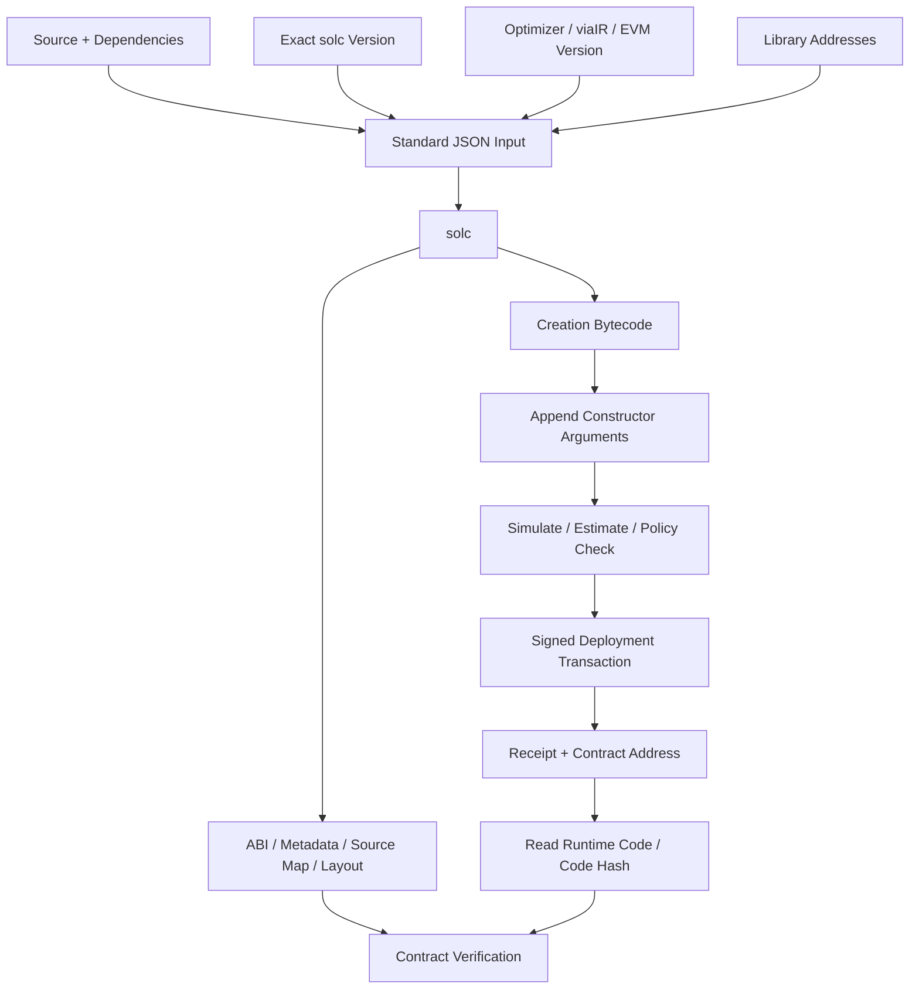
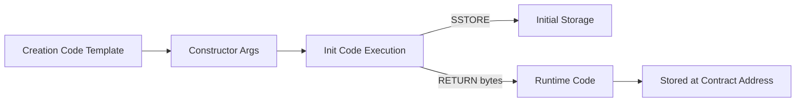
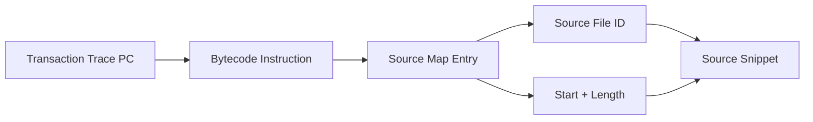
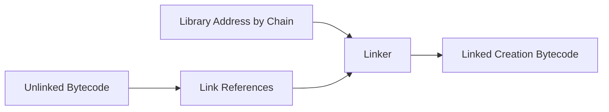
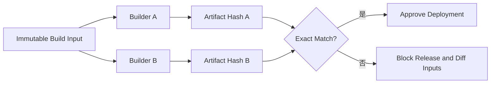

# Solidity 编译与部署：从 solc 输入、Bytecode 到可复现验证

> 合约发布不是“运行一次 deploy 脚本”。源码先与 Compiler、依赖、Remapping、Optimizer、EVM Version 和 Library Address 共同生成 Creation Code；Constructor 执行后产生 Runtime Code；验证服务只有拿到完全一致的编译输入，才能复现链上字节。任何缺失的构建参数都会把安全审计与链上部署割裂开。

---

## 一、本文解决什么问题

智能合约团队常把以下四句话混为一谈：

- “源码可以编译”；
- “交易部署成功”；
- “区块浏览器显示 Verified”；
- “任何人都能复现同样 Bytecode”。

它们不是同一保证。本文回答：

- `solc` 的真正输入除 `.sol` 文件外还有什么？
- Standard JSON 为什么比散落 CLI 参数更适合构建证据？
- Creation Code、Init Code 与 Runtime Code 有何关系？
- Constructor Arguments 为什么不属于部署后的 Runtime Code？
- Metadata 如何影响 Bytecode Hash 和源码验证？
- Source Map 如何把 PC 映射回源码，为什么优化后会更难读？
- Library Linking 在何时替换地址，错链链接会发生什么？
- Optimizer 的 `runs` 是否只是“开得越高越省 Gas”？
- `viaIR` 为什么可能改变 Bytecode、Gas 和诊断结果？
- Contract Verification 为什么可能出现“源码一样却匹配失败”？
- 如何构建可复现、可审计、可回滚的部署流水线？

本文以 Solidity 0.8.x 工具链的通用公开模型为主。Standard JSON 字段、Metadata 格式、Source Map、Optimizer Pipeline、EVM Version 和 Verification API 会随 Compiler/平台变化；生产流程必须固定精确 `solc` 版本，并查阅该版本官方文档验证参数。

### 核心结论

1. 编译结果由完整 Build Input 决定：源码内容与路径、精确 Compiler、Remapping、Dependency、Optimizer、`viaIR`、EVM Version、Metadata、Library Address 等缺一不可。
2. Standard JSON Input/Output 是适合归档与复现的结构化接口；只记录一条 CLI 命令通常不足以恢复构建。
3. Creation Code 是创建交易执行的代码与部署模板；Constructor Arguments 通常追加到部署输入，Constructor 成功返回的字节成为 Runtime Code。
4. 链上账户保存的是 Runtime Code，不保存可直接重放的 Constructor 入口、完整源码或 JSON ABI。
5. Metadata 描述源码、Compiler 与构建设置等信息，其 Hash/引用通常会影响 Bytecode 尾部；Metadata 不一致可导致源码验证失败。
6. Source Map 把 Bytecode Offset 与源码区间关联，调试、Coverage 和 Trace 依赖它；优化、内联与生成代码会降低“一条指令对应一行源码”的直觉可靠性。
7. Library Linking 是 Bytecode 生成/链接的一部分。地址必须按 Chain 与部署清单固定，未链接或错链接会让部署、验证或运行时行为错误。
8. Optimizer 同时影响部署大小、运行路径、Gas、Source Map 和审计表面。`runs` 是优化取舍参数，不是通用性能等级。
9. `viaIR` 选择经 Yul/IR 的编译管线，可能改变输出与优化机会；切换它等同于重要构建变更，必须完整回归。
10. Contract Verification 是“给定编译输入能否复现链上 Code”的证明，不证明业务逻辑安全、初始化正确或代理当前实现可信。
11. Reproducible Build 必须保存不可变输入、Artifact Hash、部署交易、链上 Code Hash 与权限状态，并由独立环境复建验证。

---

## 二、完整编译与部署链路



每个阶段的失败语义不同：

- Compiler Error：输入或源码不能生成 Artifact；
- Linking Error：Library Reference 未解析或地址错误；
- Simulation Revert：Constructor/Init Code 在当前状态失败；
- Broadcast Failure：Nonce、费用、签名或 RPC 问题；
- Deployment Receipt Failure：交易被收录但创建失败；
- Code Mismatch：地址有 Code，但与批准 Artifact 不一致；
- Verification Failure：验证服务无法用提交输入复现链上 Bytecode。

---

## 三、`solc`：编译器不是黑盒命令

Solidity Compiler 接收 Source Unit、设置和依赖，输出 ABI、Bytecode、Metadata、Source Map、Storage Layout、Method Identifier、AST 等 Artifact。

### 3.1 精确版本

`pragma solidity ^0.8.x` 约束可接受版本范围，不等于构建时使用的精确版本。不同 Patch Version 也可能改变 Code Generation、Optimizer、Metadata 或 Bug Fix。

生产构建应记录完整 Compiler Version，包括官方发布标识/Commit 信息，并由 Lockfile、Container 或校验和固定 Binary 来源。

### 3.2 Native、solc-js 与封装工具

团队可能通过 Native `solc`、`solc-js`、Foundry、Hardhat 或其他框架调用 Compiler。封装工具会管理缓存、依赖和参数，但链上结果仍由底层编译输入决定。

可复现性验证应导出最终 Standard JSON Input，而不是只保存框架配置文件，因为插件和默认值也可能改变真实输入。

### 3.3 Compiler Warning 不能默认忽略

Shadowing、未使用返回值、Unreachable Code、SPDX、Mutability 和其他 Warning 可能暴露逻辑或发布问题。CI 应分类治理 Warning，并在 Compiler 升级时重新审查新增诊断。

不要简单使用“允许全部 Warning”或未经评估的全局抑制。

---

## 四、Standard JSON：可复现构建的核心载体

概念输入如下：

```json
{
  "language": "Solidity",
  "sources": {
    "contracts/Vault.sol": {
      "content": "pragma solidity 0.8.XX; contract Vault { }"
    }
  },
  "settings": {
    "optimizer": {
      "enabled": true,
      "runs": 200
    },
    "viaIR": false,
    "evmVersion": "<target>",
    "outputSelection": {
      "*": {
        "*": [
          "abi",
          "metadata",
          "evm.bytecode",
          "evm.deployedBytecode",
          "storageLayout"
        ]
      }
    }
  }
}
```

`0.8.XX` 和 `<target>` 只是占位，不能直接用于构建。真实输入必须写精确值，并使用目标 `solc` 文档支持的字段。

### 4.1 Source Unit Name 也属于输入

即使源码内容相同，不同 Source Path/Unit Name、Remapping 或 Metadata 设置也可能改变 Metadata 和 Bytecode。验证时需要复用编译器看到的逻辑路径，而不只是把文件放到任意本地目录。

### 4.2 输出应最小但证据完整

部署流水线可只消费少量 Artifact，但发布归档应包含：

- ABI；
- Creation/Runtime Bytecode 与 Link References；
- Metadata；
- Source Map；
- Storage Layout；
- Method Identifiers；
- Compiler Diagnostics；
- Standard JSON Input/Output Hash。

AST/IR 是否归档取决于审计和调试需求。

---

## 五、Bytecode：机器码与构建信息的组合结果

Bytecode 是 EVM 执行字节。Solidity Artifact 通常区分：

- `evm.bytecode`：用于创建的 Bytecode/对象；
- `evm.deployedBytecode`：预期部署后的 Runtime Bytecode/对象；
- Link References；
- Source Map；
- Immutable References 等辅助信息。

具体字段名称与结构以目标 Compiler Standard JSON Output 为准。

### 5.1 Bytecode Hash 不只由业务函数决定

以下变化都可能改变 Bytecode：

- Compiler Version；
- Source 内容或逻辑路径；
- Optimizer 与 `runs`；
- `viaIR`；
- EVM Version；
- Metadata 设置；
- Library Address；
- Immutable/Constructor Value 对部署实例的影响；
- Build Tool 默认参数。

因此“源码逻辑看起来一样”不等于 Code Hash 一样。

### 5.2 Runtime Code Size

目标网络会对部署代码大小、Init Code 和创建行为施加协议限制，具体上限与 Fork 规则必须查阅当前规范。构建应报告 Creation/Runtime Size，并在升级前留出合理余量。

不要等部署交易 Revert 后才发现 Code Size 超限。

---

## 六、Creation Code 与 Runtime Code



### 6.1 Creation Code

Creation Code/Init Code 负责：

- 解码 Constructor Arguments；
- 执行 Constructor；
- 初始化 Storage；
- 计算 Immutable；
- 构造并返回 Runtime Code。

它只在创建时执行，不成为普通部署后调用入口。

### 6.2 Runtime Code

Runtime Code 保存到合约账户并在后续 `CALL` 等路径执行。它通常包含 Dispatcher、函数逻辑、Error/Event 相关 Code 和 Metadata 引用等编译结果。

链上通过 `eth_getCode` 读取的是 Runtime Code，不是完整部署交易 Input。

### 6.3 二者不能直接比较

Creation Bytecode 通常比 Runtime Bytecode 多 Constructor 与部署逻辑。验证“地址上的 Code 是否正确”应比较规范化后的 Deployed/Runtime Bytecode，而不是把 Creation Bytecode 与 `eth_getCode` 直接比较。

---

## 七、Constructor Arguments：部署输入的一部分

对于普通 Solidity 部署，Constructor Arguments 通常按 ABI 编码并追加在 Creation Bytecode 后形成交易 Data：

```text
deploymentData = linkedCreationBytecode ++ abi.encode(constructorArgs)
```

Constructor Init Code 知道自身模板边界，并读取追加参数。具体生成方式由 Compiler 决定，不能手写假设所有语言/代码格式都相同。

### 7.1 Arguments 不在普通 Runtime Code 中

参数用于初始化 Storage 或 Immutable 后，原始 ABI 参数区通常不会作为可调用 Constructor 数据保留。验证服务可能要求单独提交 Constructor Arguments，以复现完整 Creation Input。

### 7.2 参数也需要发布审计

常见部署事故不是 Bytecode 错误，而是参数错误：

- Owner/Timelock 使用错误网络地址；
- Token/Oracle 指向测试网或旧版本；
- Decimal、Fee、Delay 单位错误；
- Salt/Factory 错误；
- Initializer Calldata 与 ABI 版本不匹配。

部署前应把参数解码为人类可读清单，进行双人或治理审批，并在模拟中验证最终状态。

### 7.3 Proxy 的参数分层

代理系统至少可能有：

- Implementation Constructor Arguments；
- Proxy Constructor Arguments；
- Initializer/Reinitializer Calldata。

三者作用于不同 Code/Storage 上下文，不能合并成一个“部署参数”字段。

---

## 八、Metadata：源码与构建设置的关联证据

Solidity Metadata 通常描述 Compiler、Source、ABI、设置和相关 Hash/URL。Compiler 往往把 Metadata 的编码引用附加到 Bytecode 尾部，具体格式和选项依版本而异。

### 8.1 为什么同逻辑 Bytecode 仍不同

源码路径、注释、Metadata Hash Mode 或依赖内容变化，可能只改变 Metadata 相关尾部，也会导致完整 Bytecode Hash 不同。

这不是自动可以忽略的“无用噪声”：Metadata 是验证编译输入的重要线索。比较时应明确目标：

- 完整部署字节一致；
- 去除/规范化 Metadata 后的逻辑段一致；
- 或仅做语义/反编译比较。

安全发布通常要求完整可复现，而不是随意剥离尾部后宣布一致。

### 8.2 Metadata 不是链上源码

Metadata 可包含 Source Hash 与内容寻址引用，但源码是否可获取取决于发布位置和可用性。Explorer Verified Source、去中心化存储与内部 Artifact Registry 应互相备份。

### 8.3 隐私与路径

构建输入与 Metadata 可能泄露内部路径、依赖结构或其他构建信息。应使用稳定逻辑 Source Path 和干净构建环境，避免把机器用户名、临时目录或秘密写入 Source/Metadata。

---

## 九、Source Map：从 PC 回到源码区间

Source Map 将 Bytecode Instruction/Offset 与 Source File 中的起始位置、长度及跳转语义等信息关联。它服务于：

- Debugger；
- Stack Trace；
- Coverage；
- Gas Profile；
- Static Analysis 与审计定位。



### 9.1 压缩格式

Solidity Source Map 使用紧凑、可继承前项字段的编码。字段集合和解释应以目标 Compiler 文档为准，不建议手写 Parser；使用成熟调试工具并保存 Build Info。

### 9.2 优化后的边界

Optimizer 可能内联、消除、合并或重排代码。一段源码可对应多个 Instruction，某些生成 Instruction 没有直观单行来源。Source Map 是关联证据，不是完美逆向映射。

### 9.3 Creation 与 Runtime Map

Constructor Revert 发生在 Creation Code，需要 Creation Source Map；部署后交易需要 Runtime Source Map。只保存后者会让部署失败难以定位。

---

## 十、Library Linking：把外部代码地址写入 Bytecode

当 Contract 使用需要独立部署的 Library Function 时，Compiler Artifact 会包含 Link References。链接阶段把目标网络的 Library Address 填入对应 Bytecode 位置。



### 10.1 Internal Library 不一定需要链接

Internal Library Function 常被内联或内部集成，具体取决于 Compiler/Optimizer；Public/External Library 使用通常需要独立部署与链接。以 Artifact Link References 为事实来源，不要仅凭源码关键字判断。

### 10.2 地址按网络配置

Library Address 必须绑定 Chain ID、Library Runtime Code Hash 和部署交易。把 Mainnet Library Address 用到 Testnet，可能链接到无 Code 或恶意 Code 的地址。

### 10.3 链接影响验证

验证服务需要知道 Library Name/Source Unit 与 Address 映射，才能复现已链接 Bytecode。名称、路径或地址任一不匹配都可能验证失败。

### 10.4 Library 升级边界

已链接地址通常固化到 Code。若 Library 本身不可升级，更换 Library 需要重新部署调用 Contract/Implementation；若地址后是 Proxy，又引入额外 Delegatecall、权限和 Code Hash 风险。优先保持基础数学/集合 Library 简单、可审计和不可变。

---

## 十一、Compiler Optimizer：多目标取舍而非开关

Optimizer 可能在多个阶段处理源码/IR/Yul/EVM Code，优化部署大小与运行执行。具体 Pass 与默认行为会随 Compiler 版本变化。

### 11.1 `enabled`

启用与禁用会显著改变 Bytecode、Source Map、Gas 和 Code Size。生产协议应固定设置并完整回归，不能在验证时猜测。

### 11.2 `runs`

`runs` 用于表达对合约生命周期内代码执行频率的优化取舍，影响部署大小与运行成本之间的决策；它不是“循环次数”，也不是越大越全面优化。

最佳值取决于：

- 合约部署次数；
- 典型函数调用频率；
- Runtime Code Size 限制；
- 高频与低频路径分布；
- L1/L2 部署和执行费模型；
- 审计与可读性要求。

### 11.3 先测量

对候选设置构建同一 Source Commit，比较：

- Creation/Runtime Byte Size；
- 部署 Gas；
- 代表性函数 Gas 分布；
- 最坏输入路径；
- Source Map/Trace 可读性；
- 测试、Fuzz、Invariant 和 Formal Verification 结果。

不能只比较一个 Transfer Happy Path。

---

## 十二、`viaIR`：切换编译管线

`viaIR` 让 Solidity 经过中间表示/Yul 路径再生成 EVM Code。它可提供不同优化机会，也可能解决或暴露与直接 Codegen 不同的问题。

### 12.1 它会改变什么

- Bytecode 与 Code Hash；
- Gas 和 Code Size；
- Stack 分配与部分“Stack Too Deep”表现；
- Source Map 与 Debug 体验；
- Compiler Bug/限制暴露面；
- Verification 所需设置。

### 12.2 切换等同编译器升级

即使 Source 不变，从 `viaIR: false` 切到 `true` 也必须运行完整发布门禁：Unit、Integration、Fork、Fuzz、Invariant、Gas Snapshot、Storage Layout、Static Analysis 与独立审计复核。

不要把 `viaIR` 仅当成“修复 Stack Too Deep 的开关”。如果它改变了部署 Artifact，就改变了审计对象。

### 12.3 Yul/IR 证据

高风险优化可归档 IR/Yul 输出，帮助审计 Compiler Transformation。但人工阅读 IR 不能替代最终 Bytecode 和行为测试。

---

## 十三、EVM Version：目标 Fork 也是编译输入

Compiler 的 EVM Target 会影响可使用 Opcode、Gas 假设和 Code Generation。把为较新 Fork 编译的 Bytecode 部署到未支持相应规则的网络，可能部署失败或运行错误。

多链项目不能只说“都 EVM Compatible”。每条链应记录：

- Chain ID；
- 支持的 Fork/Opcode；
- Compiler `evmVersion`；
- Precompile 差异；
- Gas 与 Code Size 限制；
- Verification Service 能力。

网络升级后是否重新编译是独立决策。已部署 Code 不会自动换成新 Compiler 输出，但 EVM 执行规则可能随 Fork 改变。

---

## 十四、部署前模拟与交易治理

部署交易同样需要 Nonce、Gas、费用、Signer 和最终性治理。

### 14.1 Preflight

在固定目标 Block/状态上模拟或本地 Fork 执行：

- Constructor/Initializer 是否成功；
- 预测地址是否正确；
- Library 是否存在且 Code Hash 匹配；
- Owner/Role/Timelock/Guardian 是否正确；
- Runtime Code Size 与 Gas 是否在预算内；
- 部署后 Smoke Test 是否通过。

模拟不是未来收录保证，状态和 Nonce 仍可能变化。

### 14.2 Deployer Nonce

普通 `CREATE` 地址依赖 Deployer Nonce。多个并发部署共享 Signer 时，必须使用单写者队列、数据库协调或明确 Nonce Plan。RPC `pending` 视图不是全局一致状态。

### 14.3 CREATE2

使用 Factory/CREATE2 时，地址依赖 Factory、Salt 与 Init Code Hash。Library Address、Constructor Arguments、Metadata 或 Compiler 设置变化都可能改变 Init Code Hash，从而改变预测地址。

### 14.4 交易状态机

记录 `planned -> signed -> submitted -> included -> safe -> finalized`，处理替换、Dropped、Reorg 和失败 Receipt。高权限配置不能在只拿到 Transaction Hash 后就开始依赖新地址。

---

## 十五、部署后验证

Receipt 成功和地址出现 Code仍不足。至少验证：

1. Receipt Status 与 Contract Address；
2. Chain ID、Block Number/Hash 与 Finality；
3. `eth_getCode` 非空且 Runtime Code Hash 匹配批准 Artifact；
4. Proxy Implementation/Admin/Beacon Slot；
5. Owner、Role、Timelock、Pause 与 Initializer Version；
6. Library Address 与 Code Hash；
7. Immutable/Constant 相关行为；
8. Smoke Call、预期 Revert 和 Event；
9. Explorer/Verifier Source Match；
10. Deployment Manifest 已签名/归档。

### 15.1 Smoke Test 应最小化

Smoke Test 验证只读配置和低风险路径。不要为了“测试部署成功”立即执行不可逆资金迁移；高风险操作应等待目标 Finality 与治理审批。

### 15.2 多 Provider 对账

从独立 RPC 读取同一 Block Hash 下的 Code、Storage 与 Receipt。多个 Provider 可能共享上游，因此 Quorum 只用于发现异常，不替代链上最终性。

---

## 十六、Contract Verification：复现字节，不是安全认证

Source Verification 的核心是：验证服务使用提交的 Compiler 与设置重建 Bytecode，并与目标地址链上 Runtime Code 对比。

### 16.1 需要一致的输入

- 精确 Compiler Version；
- Source Unit Name 与源码内容；
- Dependency/Remapping；
- Optimizer 与 `runs`；
- `viaIR`；
- EVM Version；
- Metadata 设置；
- Library Address；
- Constructor Arguments；
- Contract Name/Source Path。

### 16.2 Partial/Similar Match

不同平台可能提供 Full Match、Partial Match 或 Similar Match 等概念，语义并不统一。团队应记录验证等级和平台，不应把所有“绿色勾”视为完整可复现。

### 16.3 Proxy Verification

需要分别验证 Proxy 与 Implementation，并标注关联关系。Proxy Verified 不代表当前 Implementation 已验证，也不代表 Upgrade Admin 安全。

### 16.4 验证不证明什么

它不证明：

- 合约没有漏洞；
- Constructor/Initializer 参数正确；
- 当前 Storage 状态安全；
- 外部依赖可信；
- Proxy 不会升级；
- 显示源码就是用户实际调用的逻辑地址。

---

## 十七、Reproducible Build：让独立环境得到相同 Artifact



### 17.1 最小归档集合

- Source Archive 与 Hash；
- Dependency Lockfile 和 Vendor/Content Hash；
- Standard JSON Input；
- `solc` Binary/Container Digest；
- Standard JSON Output/Build Info；
- ABI、Metadata、Storage Layout；
- Linked/Unlinked Creation 与 Runtime Bytecode；
- Constructor/Initializer Data；
- Deployment Transaction、Receipt 与 Code Hash；
- Library/Proxy/Role Manifest；
- Verification Result 与 URL/ID。

### 17.2 Hermetic Build

构建应避免网络下载漂移、环境变量隐式注入、未锁定 Git Branch、系统路径泄露和时间依赖。依赖必须按内容固定，Compiler Binary 校验来源与 Hash。

### 17.3 双构建

由两个独立 Runner 从同一归档输入构建并比较 Artifact Hash。若不一致，停止部署并比较 Compiler、Source Path、Metadata、依赖、链接和环境。

### 17.4 签名与 Provenance

高价值协议可对 Build Manifest 和 Artifact Hash 签名，记录审批人、审计版本与 CI Provenance。签名只证明谁批准了哪些字节，不证明字节没有漏洞。

---

## 十八、常见误区与错误案例

### 18.1 `pragma` 固定了 Compiler

错误。`pragma` 只约束范围，实际构建必须固定精确 `solc` 版本和 Binary 来源。

### 18.2 Runtime Code 等于 Creation Code 去掉 Constructor

错误。Creation Code 执行并动态返回 Runtime Code，还会处理 Immutable、Metadata 和参数；应使用 Compiler Artifact，不要手工裁剪。

### 18.3 Constructor Arguments 已包含在 Runtime Code

错误。它们通常追加到部署输入，用于初始化状态/Immutable，原始参数区不会作为普通 Runtime 调用入口保留。

### 18.4 Source Map 能一对一还原源码行

错误。优化、内联和生成代码会让映射变复杂；它是区间关联，不是完美反编译。

### 18.5 Optimizer `runs` 越大越省所有 Gas

错误。它表达部署大小与重复执行之间的取舍，不同路径结果不同，必须测量。

### 18.6 `viaIR` 只影响编译速度

错误。它可改变 Bytecode、Gas、Code Size、Source Map 和 Bug 暴露面，应视为重要发布变更。

### 18.7 Explorer Verified 等于审计通过

错误。Verification 只证明提交输入可复现 Code，不证明逻辑、状态、权限或依赖安全。

### 18.8 Library 地址正确就无需验证 Code

错误。同一地址在不同 Chain 是不同账户，目标也可能是 Proxy。必须绑定 Chain ID 与 Runtime Code Hash。

### 18.9 本机能重复构建就是 Reproducible

错误。真正可复现要求独立环境从不可变输入得到相同 Artifact，而不是复用本机缓存。

---

## 十九、工程实践：发布流水线

### 19.1 Build Stage

1. 校验 Source/Dependency Lock；
2. 运行格式、Lint、Unit/Fuzz/Invariant；
3. 生成 Standard JSON 与 Artifact；
4. 执行双构建 Hash 对比；
5. 输出 ABI/Storage/Selector/Gas/Size Diff；
6. 绑定 Audit Commit 与 Artifact Hash。

### 19.2 Deploy Stage

1. 加载签名的 Deployment Plan；
2. 验证 Chain、RPC、Deployer、Nonce 与余额；
3. 校验 Library/Factory Code Hash；
4. 在目标状态 Fork 模拟；
5. 人工复核 Constructor/Initializer；
6. 使用硬件签名或受控 Multisig 广播；
7. 跟踪到业务要求的 Finality。

### 19.3 Verify Stage

1. 读取链上 Runtime Code；
2. 比较批准 Code Hash；
3. 执行 Source Verification；
4. 验证 Proxy/Implementation/Library 关联；
5. 检查 Owner、Role、Timelock 与初始化状态；
6. 发布 Manifest 与监控配置。

### 19.4 Failure Policy

任何 Code Hash、Chain ID、Nonce Plan、Library、权限或 Verification 等级不符合预期，都应停止后续资金和治理操作。不要在“之后再验证”的假设下继续上线。

---

## 二十、测试与验证方法

### 20.1 编译矩阵

对批准设置和候选 Compiler/Optimizer/`viaIR` 分别构建，比较 ABI、Storage Layout、Method Identifier、Bytecode Size、Gas 与测试结果。Compiler 升级必须阅读 Release Note 和 Known Bugs。

### 20.2 Constructor/Initializer

覆盖零地址、边界参数、错误 Chain 配置、外部依赖 Revert、Gas 不足、重复初始化、初始化抢跑和原子部署初始化。

### 20.3 Linking

测试未链接、错地址、无 Code、错误 Code Hash、不同 Chain、Library Revert 和 Verification 输入缺少 Library Map。

### 20.4 Reproducibility

在干净 Container/Runner 禁用缓存后构建两次；再由独立 Toolchain Consumer 使用归档 Standard JSON 构建。比较完整 Artifact，而不只比较 Runtime 逻辑段。

### 20.5 Fork Deployment

在目标链最新 Safe/Finalized State Fork 上执行完整 Deploy Script，记录预测地址、Gas、Receipt、Code、Storage、Role 与 Smoke Test。模拟 Reorg/Nonce 冲突和 RPC 超时恢复。

### 20.6 生产证据

每次部署记录：

- Chain ID、Network/Fork；
- Source/Artifact/Compiler Hash；
- Deployer、Nonce、Transaction Hash；
- Contract、Implementation、Library Address；
- Constructor/Initializer 解码值；
- Inclusion 与 Finalized Block Hash；
- Runtime Code Hash；
- Verification 状态；
- Owner/Role/Timelock 最终值。

---

## 二十一、总结

Solidity 编译与部署是一条从源码到链上字节的供应链：

1. `solc` 的完整输入包括源码、路径、依赖、Compiler 与全部设置，Standard JSON 是核心构建证据。
2. Creation Code 执行 Constructor 并返回 Runtime Code，二者不能直接互换比较。
3. Constructor Arguments、Library Linking、Immutable 和 Metadata 都会影响最终部署字节或实例行为。
4. Source Map 服务调试定位，但优化后不等于源码行的一对一映射。
5. Optimizer 与 `viaIR` 改变审计对象，任何切换都需要全量回归和 Artifact Diff。
6. Contract Verification 证明字节可复现，不证明合约安全与状态正确。
7. Reproducible Build 要求独立环境从不可变输入得到同一 Artifact，并绑定部署交易和链上 Code Hash。
8. 发布完成的标准不是 Receipt 成功，而是 Code、配置、权限、验证、Finality 和监控全部对账。

---

## 问答复盘

### Q1：`pragma solidity ^0.8.x` 是否足以保证构建可复现？

**答：** 不足。它只声明兼容范围；必须固定精确 Compiler Binary、依赖、Source Path、Optimizer、EVM Version、Metadata 和链接地址。

### Q2：Creation Code 与 Runtime Code 最关键的区别是什么？

**答：** Creation Code 只在部署时执行 Constructor 并返回 Runtime Code；链上账户后续执行的是返回的 Runtime Code。

### Q3：Constructor Arguments 为什么会影响部署地址或验证？

**答：** 它们通常追加到 Creation Bytecode，改变完整 Init Code；CREATE2 地址依赖 Init Code Hash，验证也需复现完整部署输入。

### Q4：源码没有逻辑变化，为什么 Bytecode Hash 仍可能变化？

**答：** Compiler、Source Path、Metadata、Optimizer、`viaIR`、EVM Version、Library 和构建默认值都可能改变字节。

### Q5：Optimizer `runs` 应该设置得越大越好吗？

**答：** 不是。它用于部署大小与运行执行之间的取舍，应按真实调用频率、Code Size、Gas 和目标网络测量。

### Q6：区块浏览器显示 Verified 后，还需要比较 Code Hash 吗？

**答：** 需要。验证平台等级与代理关联可能不同；部署流水线应直接读取链上 Runtime Code，并与批准 Artifact Hash 对账。

### Q7：切换 `viaIR` 为什么需要重新审计和测试？

**答：** 它切换 Code Generation Pipeline，可改变 Bytecode、Gas、Source Map 和 Compiler Bug 暴露面，实际审计对象已经变化。

### Q8：如何判断 Library Linking 没有链接错网络？

**答：** 将 Library Address 与 Chain ID、部署交易和 Runtime Code Hash 绑定，部署前后都读取 Code 并与批准 Artifact 对账。

### Q9：什么才算 Reproducible Build？

**答：** 两个独立干净环境使用归档的不可变输入，生成完全相同的目标 Artifact，并能与链上 Code 和部署 Manifest 对应。

---

## 延伸知识

- **部署工程化**：Environment、Nonce、CREATE2、Manifest、Smoke Test 与 Ownership Transfer。
- **供应链安全**：Compiler Binary Provenance、Dependency Lock、Artifact Signing 与 CI Attestation。
- **合约验证**：Metadata、Full/Partial Match、Proxy Detection 与 Sourcify 类验证模型。
- **Compiler Internals**：AST、IR、Yul、Optimizer Pass 与 Code Generation。
- **升级发布**：Storage Layout Diff、Reinitializer、Timelock、Fork Simulation 与 Rollback Plan。
