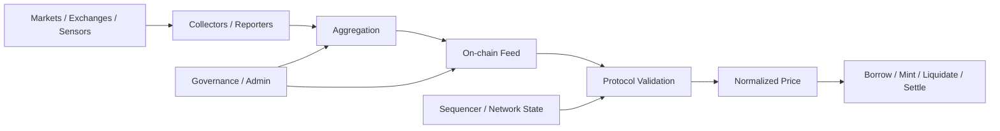
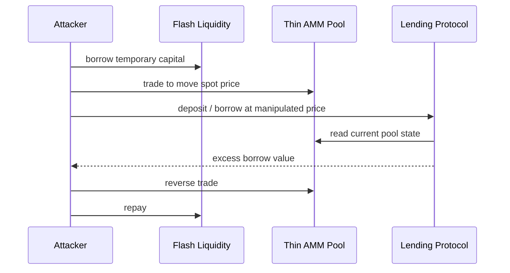
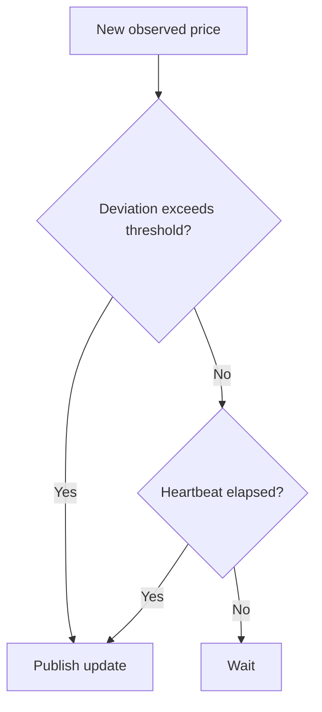
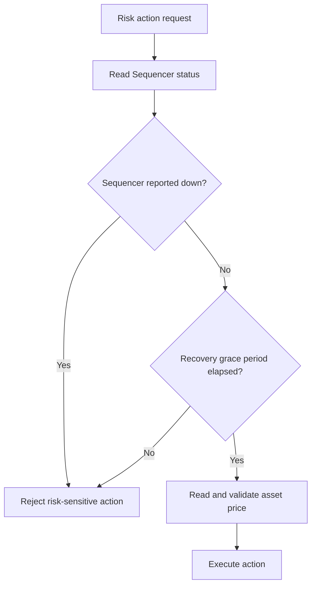
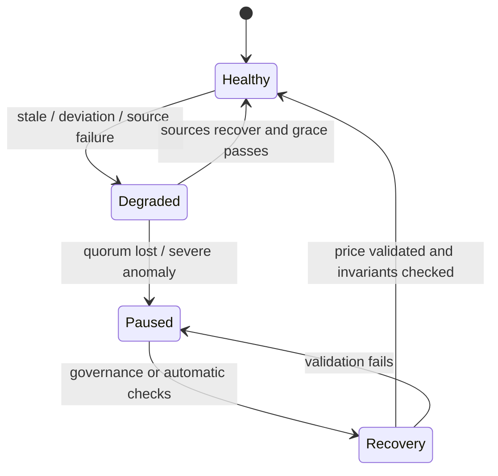

# 智能合约 Oracle 安全：从 Spot、TWAP、Staleness 到多源聚合与故障模式

> Oracle 把链外市场、链上池状态或另一系统的结果输入智能合约。它不是一个返回 `price` 的只读函数，而是一条包含数据源、采样窗口、聚合、更新时间、单位、网络可用性、权限和降级策略的信任链。协议真正需要验证的不是“能否读到数字”，而是这个数字是否足够新、单位正确、未被攻击者低成本操纵，并且异常时不会把错误价格转化为不可逆资产损失。

---

## 一、本文解决什么问题

借贷、稳定币、衍生品、Vault、清算、跨链和 NFT 抵押都可能依赖 Oracle：

- 抵押品价值决定可借额度；
- 价格跌破阈值触发清算；
- Vault 使用资产价格计算份额或费用；
- 永续合约按指数价格结算；
- 稳定币按抵押率铸造和赎回；
- L2 协议在 Sequencer 异常后决定是否允许清算。

一个 Oracle 调用即使不 Revert，也可能返回：

- 被一笔大额交易推动的 Spot Price；
- 已经陈旧但数值看似合理的价格；
- Decimal 不同导致放大或缩小若干数量级的值；
- 心跳周期内尚未更新、但市场已剧烈变化的值；
- 多个来源中被攻击者控制的一组值；
- L2 Sequencer 恢复后、用户尚无公平响应时间的价格；
- 零值、负语义、异常范围或上一轮数据；
- 可升级 Feed 被管理员替换后的新规则。

本文覆盖：

- Spot Price；
- TWAP；
- Medianizer；
- Staleness；
- Heartbeat；
- Decimal；
- Deviation Threshold；
- Sequencer Uptime Feed；
- Multi-source Oracle；
- Failure Mode。

本文以 Solidity 0.8.x 与通用 EVM 协议为基础。Oracle Provider 的接口字段、更新触发条件、Heartbeat、Deviation、Feed 地址、L2 Sequencer Feed 语义和治理方式会随网络、资产、版本变化；生产接入必须查阅目标 Provider 的当前官方文档与链上实现，不能从另一条链或另一 Feed 复制配置。

### 核心结论

1. Oracle 安全是一条端到端数据链：来源、采样、聚合、发布、读取、验证和业务动作缺一不可。
2. Spot Price 响应快，但在薄流动性市场中可被单笔或同交易资本操纵，不适合作为高价值协议的无条件结算价格。
3. TWAP 用时间窗口提高持续操纵成本，代价是价格滞后；窗口长度必须由流动性、波动率、更新频率和业务损失模型共同决定。
4. Medianizer 对少数异常值更稳健，但前提是来源足够独立，且 Quorum、排序、Decimal 和失败值处理正确。
5. Staleness 是“当前时间与数据时间的差”，Heartbeat 是数据源预期最迟多久应更新，两者相关但不等价。
6. Decimal 和报价方向属于安全边界。所有价格必须归一到明确单位，并对乘除顺序、舍入和溢出进行验证。
7. Deviation Threshold 可用于触发更新或协议级异常检查，但阈值过窄造成停机，过宽则放过攻击或真实崩盘。
8. L2 Sequencer Uptime Feed 只能提供 Sequencer 状态信息；协议还需检查恢复后的 Grace Period，并理解它不能证明底层价格源本身正确。
9. Multi-source Oracle 的安全来自独立信任域和清晰聚合规则，不是简单取两个 API 平均值。
10. Failure Mode 必须按动作分层：异常时通常优先禁止新增风险，谨慎处理清算，并尽量保留偿还和安全退出。
11. `view`、源码验证或知名 Provider 都不能替代 Feed 地址、Code、权限、时间和业务不变量的持续监控。
12. Oracle 测试必须包含操纵成本、时间边界、Decimal、来源分裂、Sequencer 故障和 Fork 真实市场状态。

---

## 二、Oracle 数据链与信任边界



每一段都可能失败：

- 市场本身流动性不足或被操纵；
- Reporter 离线、串谋或签名密钥泄露；
- 聚合规则接受异常值；
- 链上 Feed 未及时更新；
- 协议读取错误 Round、Decimal 或时间；
- 业务仍在异常状态执行清算；
- 管理员把 Feed 地址替换为恶意合约。

### 2.1 Oracle 不是“链上真相”

区块共识只能保证节点对 Feed 合约当前状态达成一致，不保证该状态反映真实市场。链上最终性与数据真实性是不同属性。

### 2.2 先定义业务所需价格

协议应明确：

- Base/Quote 是什么；
- 价格单位和 Decimal；
- 可接受最大延迟；
- 可接受最大偏差；
- 需要可执行价格、指数价格还是会计估值；
- 极端行情时允许哪些动作；
- 正价格、零值和负值语义；
- 更新失败时是否能安全停机。

“ETH/USD Price”仍不够精确：需要说明是哪个市场集合、哪种聚合、什么时间点和什么精度。

---

## 三、Spot Price：当前状态的即时价格

Spot Price 通常来自当前订单簿、AMM 储备、当前 Tick 或最新成交。优点是响应快、链上可直接计算；主要风险是瞬时操纵。

### 3.1 AMM Spot 操纵

以恒定乘积池的简化模型为例，攻击者用大额交易改变储备比，协议立即读取新价格并高估抵押品，随后借走资产，再反向交易恢复池价。



### 3.2 操纵成本不是固定常量

取决于：

- 有效流动性和集中流动性区间；
- 交易费；
- 目标价格移动幅度；
- 可在同交易恢复的比例；
- 套利者与 Builder 排序；
- 可获得的 Flash Liquidity；
- 协议可提取价值。

即使操纵成本很高，只要可提取价值更高，仍有攻击激励。

### 3.3 Spot 可合理使用的场景

- 仅用于展示而非结算；
- 低价值、低限额且有独立风控；
- 与更可靠来源做偏差检查；
- 高流动性市场中的辅助数据；
- 同一协议内部只用于限定范围、不直接决定资产转移。

不能简单写成“Spot 永远不安全”，但所有高价值用法必须给出操纵成本与损失上限证据。

### 3.4 余额也可能是 Spot State

使用池当前储备、Vault `totalAssets` 或 Token Balance 计算价格，本质上同样依赖瞬时状态。Donation、Rebase、Callback 和同交易存取款都可能改变它。

---

## 四、TWAP：用时间窗口提高操纵成本

TWAP（Time-Weighted Average Price，时间加权平均价格）在一个时间窗口内聚合价格，使攻击者需要更长时间维持异常状态，而不只是制造一个瞬时点。

简化表示：

```text
TWAP = Σ(price_i × duration_i) / Σ(duration_i)
```

具体 AMM Oracle 可能存储累计 Tick、累计价格或 Observation，必须按协议规范计算，不能直接套用算术平均。

### 4.1 窗口长度取舍

| 窗口 | 优点 | 代价 |
|---|---|---|
| 短 | 跟随市场快 | 操纵成本较低、噪声高 |
| 长 | 抵抗短时操纵 | 对真实崩盘反应慢、清算滞后 |

借贷协议在快速下跌中使用过长 TWAP，可能继续高估抵押品；使用过短窗口，又可能被短时推价攻击。

### 4.2 Observation 与可用历史

链上池需要足够历史 Observation 才能计算目标窗口。新池、低频更新或配置不足时，查询可能失败或只能返回较短历史。协议接入时应验证：

- 实际可观察窗口；
- Observation 写入条件；
- 池初始化与扩容；
- 查询失败策略；
- 低活跃期间价格累计语义。

### 4.3 TWAP 仍可被操纵

- 攻击者控制多个连续区块或排序机会；
- 池长期缺乏套利和流动性；
- 可在窗口内持续维持价格；
- 协议接受的偏差很大；
- 目标池由攻击者创建或 LP 高度集中；
- 跨市场真实价格本身剧烈变化。

TWAP 的正确安全论证是“在此窗口和流动性下，攻击成本相对可提取价值足够高”，不是“使用了 TWAP”。

### 4.4 Arithmetic 与 Geometric 语义

不同 Oracle 可能对 Price、Log Price/Tick 或 Ratio 做时间聚合，最终不是同一种平均。集成方必须理解输出语义，不能把 Tick 平均直接当作线性价格平均而不按规范转换。

---

## 五、Medianizer：用中位数抵抗少数异常来源

Medianizer 收集多个价格，排序后取中位数或类似稳健统计量。只要超过一定比例的来源诚实且数据独立，少数极端值对中位数影响有限。

### 5.1 简单中位数示例

```text
Sources: 99, 100, 101, 5000, 10000
Median: 101
```

平均值会被极端值明显拉动，中位数保持在诚实来源附近。

### 5.2 独立性比来源数量更重要

五个来源可能都依赖：

- 同一家交易所；
- 同一个链上池；
- 同一个云服务；
- 同一个 Reporter Key 管理流程；
- 同一种稳定币 Quote；
- 同一个跨链 Bridge。

它们不是五个独立信任域。Source Diversity 应覆盖市场、基础设施、组织和报价资产。

### 5.3 Quorum 与缺失值

需要明确：

- 最少有效来源数；
- 偶数来源如何取中位；
- 超时来源是否剔除；
- 零值、负语义、Revert 和畸形数据如何处理；
- 不足 Quorum 时是否沿用旧值；
- 每个来源 Decimal 如何归一；
- 来源权重是否存在。

先把失败值当零再取中位，可能让数据源故障直接变成价格崩溃。

### 5.4 Median 也会滞后

多个来源更新时间不同，取中位数前必须先做 Staleness 检查。否则多数旧数据会压过少数及时更新的数据。

---

## 六、Staleness：价格是否仍在有效时间窗内

Staleness 检查通常比较当前链上时间与 Feed 报告的更新时间：

```solidity
if (updatedAt == 0 || block.timestamp - updatedAt > maxAge) {
    revert StalePrice();
}
```

这只是示意。生产代码还需先处理 `updatedAt > block.timestamp` 等异常，避免减法 Revert 或接受未来时间。

### 6.1 `latest` 不等于 Fresh

Feed 返回的最新 Round 可能数小时前生成。协议必须自己判断可接受最大年龄，不能因为函数名是 `latest...` 就默认新鲜。

### 6.2 Max Age 来自业务风险

应考虑：

- 资产波动率；
- 正常 Feed Heartbeat；
- 市场交易时段/停盘语义；
- 协议清算和坏账速度；
- 网络拥堵和更新延迟；
- 上游来源恢复时间。

Max Age 太短会频繁停机，太长会使用过期价格。不同资产不应无依据复用同一常量。

### 6.3 Timestamp 的来源语义

更新时间可能表示：

- 数据采样时间；
- Reporter 达成共识时间；
- 链上发布时间；
- 当前 Round 完成时间。

具体字段含义必须查 Feed 规范。用错时间字段会让 Staleness 检查失真。

### 6.4 陈旧数据的业务后果

- 真实价格下跌但旧价偏高：攻击者过度借款；
- 真实价格上涨但旧价偏低：健康用户被错误清算；
- 稳定币脱锚未更新：按 1 美元继续铸造或赎回；
- 市场关闭期间：旧价可能是预期行为，也可能不适合即时清算。

---

## 七、Heartbeat：数据源何时应主动更新

Heartbeat 是 Feed 在价格变化不大时仍应进行更新的最大预期间隔之一。许多 Feed 也可能在价格偏差超过阈值时提前更新。



实际更新模型由 Provider 决定，这张图只表达常见概念。

### 7.1 Heartbeat 与 Staleness 的区别

- Heartbeat：上游正常情况下的更新承诺/配置；
- Staleness：协议在当前时刻观察到的数据年龄；
- Max Age：下游协议愿意接受的最长年龄。

下游 Max Age 可以参考 Heartbeat，但需留出合理传输/上链余量，并结合自身风险。不能简单令两者永远相等。

### 7.2 配置漂移

Feed 的 Heartbeat 或更新策略可能随资产、网络、版本变化。把网上看到的数字硬编码后长期不审查，会产生隐性风险。部署清单应记录配置来源和复核日期，并通过监控发现实际更新间隔异常。

### 7.3 Heartbeat 没到不代表价格安全

市场可能在 Heartbeat 内剧烈变化，依赖 Deviation 触发更新。如果上游市场异常、Reporter 离线或偏差机制失效，仍可能返回看似未过期但已严重偏离的价格。因此需要合理 Deviation/多源比较。

---

## 八、Decimal：一个正确数值可能被错误放大

Oracle 返回整数，Decimal 决定实际值。假设 Feed 返回 `2500_00000000` 且 Decimal 为 8，代表 2500 Quote Units，而不是一个 18 Decimal 固定值。

### 8.1 归一化

协议通常把价格统一到内部精度：

```text
normalizedPrice = rawPrice × 10^(targetDecimals - feedDecimals)
```

当 Feed Decimal 大于目标精度时需要除法和舍入；指数差过大可能溢出或失去精度。应使用有界 Decimal 范围与安全全精度数学。

### 8.2 Quote Direction

`ASSET/USD` 与 `USD/ASSET` 是倒数关系。错误方向会产生完全不同结果。计算交叉价格时需明确：

```text
TOKEN/ETH = TOKEN/USD ÷ ETH/USD
```

并处理两个 Feed 的 Decimal、更新时间和误差传播。

### 8.3 Token Decimal 与 Feed Decimal 不同

抵押价值可能涉及：

- Token Amount Decimal；
- Token Price Feed Decimal；
- Debt Token Decimal；
- 协议内部 Wad/Ray；
- LTV/Rate 的 BPS。

每一步都应标注单位。所有变量都是 `uint256` 并不会阻止单位错误。

### 8.4 正负与零值

某些 Feed 接口使用有符号整数。转换为 `uint256` 前必须检查值大于零且在合理范围；直接 Cast 负值会产生错误的大整数语义。零价格通常也应拒绝，除非协议明确支持并定义破产状态。

### 8.5 舍入方向

抵押品估值通常宁可保守向下，债务估值可能需要向上；但具体方向取决于公式和风险承担者。不能统一用一种截断方式。

---

## 九、Deviation Threshold：识别异常变化与触发更新

Deviation Threshold 可以存在两层：

1. Oracle Provider 用它决定何时发布新价格；
2. 协议用它比较来源、历史值或参考价格，决定是否接受。

### 9.1 协议级偏差检查

```text
deviation = abs(priceA - priceB) / referencePrice
```

实现时要处理：

- Reference 为零；
- 先乘后除的溢出与精度；
- 对称/非对称百分比定义；
- 来源谁作为基准；
- Decimal 已归一；
- 真实跳价与攻击如何区分。

### 9.2 阈值取舍

- 太窄：正常波动触发频繁暂停，攻击者甚至可利用轻微操纵制造 DoS；
- 太宽：错误价格进入协议，造成坏账；
- 固定阈值：不同波动率资产不适配；
- 动态阈值：模型和治理更复杂，可能被历史窗口滞后影响。

### 9.3 Circuit Breaker

偏差超阈值后不一定简单 Revert 所有操作。可以：

- 暂停新增借款/铸造；
- 限制清算；
- 降低单笔额度；
- 切换备用源；
- 允许偿还和追加抵押；
- 进入人工/治理复核状态。

Circuit Breaker 本身需要恢复权限和最长处置时间，避免永久锁死。

### 9.4 与上一价格比较的风险

真实市场崩盘时，当前正确价格会大幅偏离上一价格。若协议永久拒绝大幅变化，反而继续使用旧高价。应设计多阶段确认、备用源或风险收缩，而不是把上一价格当永远正确的锚。

---

## 十、Sequencer Uptime Feed：L2 可用性与公平清算

在部分 L2 架构中，Sequencer 停机期间用户可能无法正常提交交易，而价格源仍可能在恢复后反映大幅变化。如果协议在 Sequencer 刚恢复时立即允许清算，用户可能没有机会补充抵押或偿还。

### 10.1 典型检查链路



具体状态值、时间字段和网络支持必须按目标 Uptime Feed 文档实现。

### 10.2 Grace Period

Sequencer 恢复后留出 Grace Period，使用户和 Keeper 有时间同步状态。长度取决于：

- 网络恢复特性；
- 用户可操作路径；
- 资产波动与坏账风险；
- Oracle 更新延迟；
- 协议清算模型。

太短损害用户公平性，太长增加协议坏账暴露。

### 10.3 Uptime Feed 不验证价格

Sequencer 正常不代表 Asset Feed 新鲜、Decimal 正确或未被操纵。必须先通过网络可用性门槛，再做完整价格验证。

### 10.4 L1/L2 时间与可达性

不同 L2 的 Sequencer、强制包含、L1 数据发布和最终性语义不同。不要把一个生态的 Uptime Feed 模板无条件复制到所有 Rollup。

### 10.5 Feed 自身失败

Uptime Feed 不存在、返回异常、数据未初始化或调用 Revert 时怎么办，必须进入 Failure Mode。关键清算协议通常不应把“无法确认 Sequencer 状态”当成“肯定正常”。

---

## 十一、Multi-source Oracle：组合不同信任域

多源 Oracle 可以降低单点失效，但前提是来源真正独立且聚合规则明确。

### 11.1 组合模式

- Primary + Fallback；
- Median of N；
- Weighted Median/Mean；
- Chainlink-like Feed + DEX TWAP Cross-check；
- 多交易所 Reporter 聚合；
- Stable Quote 与替代 Quote 交叉验证。

### 11.2 Primary/Fallback

Primary 正常时使用；仅在陈旧、Revert 或异常时切换 Fallback。需要防止：

- Primary 被操纵但仍“正常返回”；
- Fallback 长期未使用而已失效；
- 切换瞬间价格跳变；
- 两源单位和时间语义不同；
- 攻击者故意 DoS Primary 迫使使用更弱 Fallback。

### 11.3 Cross-check

主源价格与独立 DEX TWAP 偏差过大时暂停风险动作。这里 DEX TWAP 不是一定更正确，而是提供独立异常信号。若二者依赖同一市场或 Quote Asset，独立性有限。

### 11.4 聚合顺序

正确流程通常是：

1. 对每个来源做地址/接口与返回校验；
2. 检查正值、时间和来源状态；
3. 归一 Decimal 与 Quote；
4. 剔除明确无效来源；
5. 检查 Quorum；
6. 聚合；
7. 对聚合结果做范围/偏差检查；
8. 根据业务动作选择 Failure Mode。

先聚合再检查陈旧，会让旧值污染结果。

### 11.5 多源增加攻击面

更多外部调用意味着更多 Gas、Revert、畸形数据、升级和治理依赖。多源不是越多越好，应在独立性收益与复杂度之间取舍。

---

## 十二、Failure Mode：Oracle 异常时允许什么

Oracle Failure 不只是函数 Revert，还包括：

- Stale；
- Zero/Negative/Out-of-range；
- 来源偏差过大；
- Quorum 不足；
- Sequencer Down/Grace Period；
- Feed/Proxy 升级异常；
- Decimal/配置不一致；
- 市场流动性崩溃；
- 价格跳变无法确认。

### 12.1 按动作分层

| 动作 | Oracle 异常时常见策略 | 原因 |
|---|---|---|
| 新增借款/铸造 | 暂停 | 防止按错误价格增加负债 |
| 提高抵押/偿还 | 尽量允许 | 通常降低协议风险 |
| 提现抵押 | 限制或按健康度谨慎处理 | 可能增加风险 |
| 清算 | 暂停或使用高可信备源 | 错价会不可逆伤害用户 |
| 协议费用结算 | 延迟/Pending | 通常不值得冒资产风险 |
| 安全退出 | 在不破坏偿付能力前提下保留 | 降低用户锁定风险 |

具体策略取决于协议，不应机械复制。

### 12.2 Fail Closed 与 Fail Open

- **Fail Closed**：Oracle 异常就拒绝动作，保护资产但可能 DoS；
- **Fail Open**：沿用旧值或继续执行，提高可用性但可能按错价转移资产；
- **Degraded Mode**：限制额度、只允许降风险动作或使用备用源。

成熟协议通常需要 Degraded Mode，而不是一个全局 Bool。

### 12.3 Last Good Price

保存最后可信价格可支持展示或受限动作，但它会持续变旧。需要：

- 最大沿用时间；
- 哪些动作可使用；
- 何时进入完全暂停；
- 恢复时如何处理跳价；
- 谁能手动干预以及其权限边界。

Last Good Price 不是永远正确的备用 Oracle。

### 12.4 Manual Oracle 边界

紧急人工价格更新提供恢复能力，也赋予管理员直接影响清算和资产的权力。应使用多签、Timelock/紧急边界、范围限制、事件和短有效期；最好只能收缩风险或选择预先批准来源，而非任意填价格。

### 12.5 恢复状态机



恢复不应只是 `unpause()`。应重新验证 Feed 地址、价格范围、时间、来源一致性、用户健康度和待处理清算。

---

## 十三、一个安全读取适配层的设计

生产代码应使用目标 Provider 的官方接口和成熟数学库。下面只展示验证职责，不绑定某个 Provider API：

```solidity
// SPDX-License-Identifier: MIT
pragma solidity ^0.8.24;

contract ValidatedPriceAdapter {
    error InvalidPrice();
    error StalePrice();
    error InvalidTimestamp();
    error SequencerUnavailable();
    error GracePeriodNotElapsed();
    error ExcessiveDeviation();

    uint256 public immutable maxAge;
    uint256 public immutable gracePeriod;
    uint256 public immutable maxDeviationBps;

    constructor(uint256 maxAge_, uint256 gracePeriod_, uint256 maxDeviationBps_) {
        maxAge = maxAge_;
        gracePeriod = gracePeriod_;
        maxDeviationBps = maxDeviationBps_;
    }

    function readValidatedPrice() external view returns (uint256 normalizedPrice) {
        (bool sequencerUp, uint256 sequencerChangedAt) = _readSequencerStatus();
        if (!sequencerUp) revert SequencerUnavailable();
        if (block.timestamp < sequencerChangedAt) revert InvalidTimestamp();
        if (block.timestamp - sequencerChangedAt <= gracePeriod) {
            revert GracePeriodNotElapsed();
        }

        (int256 rawPrice, uint256 updatedAt, uint8 feedDecimals) = _readPrimary();
        if (rawPrice <= 0) revert InvalidPrice();
        if (updatedAt == 0 || updatedAt > block.timestamp) revert InvalidTimestamp();
        if (block.timestamp - updatedAt > maxAge) revert StalePrice();

        normalizedPrice = _normalize(uint256(rawPrice), feedDecimals);
        uint256 referencePrice = _readIndependentReference();
        if (!_withinDeviation(normalizedPrice, referencePrice, maxDeviationBps)) {
            revert ExcessiveDeviation();
        }
    }

    function _readSequencerStatus() internal view returns (bool, uint256) {
        // Bind to the target L2 feed and its documented semantics.
        revert("illustrative only");
    }

    function _readPrimary() internal view returns (int256, uint256, uint8) {
        revert("illustrative only");
    }

    function _readIndependentReference() internal view returns (uint256) {
        revert("illustrative only");
    }

    function _normalize(uint256 rawPrice, uint8 feedDecimals)
        internal
        pure
        returns (uint256)
    {
        rawPrice;
        feedDecimals;
        revert("illustrative only");
    }

    function _withinDeviation(uint256 a, uint256 b, uint256 thresholdBps)
        internal
        pure
        returns (bool)
    {
        a;
        b;
        thresholdBps;
        revert("illustrative only");
    }
}
```

辅助函数故意未实现，避免把不同 Provider、L2 和 Decimal 语义伪装成通用模板。真正应复用的是验证顺序：

1. 网络/Sequencer 状态与 Grace Period；
2. Feed 返回值、正值与时间；
3. Staleness；
4. Decimal 归一；
5. 独立参考偏差；
6. 返回统一单位；
7. 由上层业务按动作决定 Failure Mode。

Adapter 也应暴露 Feed 地址、配置和版本供监控读取，并由最小权限治理。

---

## 十四、常见错误案例

### 14.1 直接使用 AMM 当前储备比

同交易可被大额资本操纵。应评估 TWAP、多源和协议损失上限。

### 14.2 只检查价格大于零

旧价格同样大于零。还需检查时间、Decimal、Round/来源状态和合理范围。

### 14.3 `updatedAt` 不为零就接受

数据可能已陈旧或时间在未来。必须与当前时间和 Max Age 比较。

### 14.4 Heartbeat 直接等于 Max Age

没有考虑上链延迟和业务风险，可能频繁误停或接受过旧数据。

### 14.5 所有 Feed 都按 8 Decimal

Decimal 由具体 Feed 决定。硬编码会造成数量级错误。

### 14.6 偏差超阈值时永久使用旧价

真实崩盘会让新正确价格大幅变化。应进入 Degraded/Pause 和多源确认，而不是无限保留旧高价。

### 14.7 两个来源就是 Multi-source

若两者依赖同一市场、Reporter 或 Quote Asset，仍是相关单点。

### 14.8 Sequencer 恢复后立即清算

用户可能没有机会补充抵押。需检查 Grace Period，并结合价格新鲜度。

### 14.9 Oracle Revert 时捕获并返回零

零价可能触发错误清算或除零。失败应进入显式模式，不应伪造有效价格。

### 14.10 Feed 地址可由单热钱包瞬间修改

这等同管理员可以控制协议估值。应使用多签、Timelock、Allowlist、Code/Decimal 检查和事件监控。

---

## 十五、测试与验证方法

### 15.1 时间边界

测试：

- `updatedAt == 0`；
- `updatedAt > block.timestamp`；
- `age == maxAge`；
- `age == maxAge + 1`；
- Heartbeat 刚到/未到；
- Sequencer Down；
- 恢复时刻；
- Grace Period 边界。

### 15.2 Decimal Matrix

- Feed Decimal 小于、等于、大于内部 Decimal；
- Token Decimal 0、6、8、18 及支持范围边界；
- 极大/极小 Price；
- 倒数与交叉价格；
- 舍入方向；
- 有符号负值和零值；
- 乘除中间值上界。

### 15.3 操纵测试

在 Fork 上：

1. 记录池流动性和正常价格；
2. 借入/模拟大额资本；
3. 推动 Spot；
4. 计算 TWAP 在不同窗口的响应；
5. 调用协议敏感入口；
6. 反向交易并计算总成本；
7. 比较可提取价值与攻击成本。

必须记录固定 Block、池地址、Fee Tier、流动性分布和可借资本，保证结果可复现。

### 15.4 Source Failure Matrix

- Primary Revert；
- Primary Stale；
- Fallback Stale；
- 两源偏差过大；
- Quorum 不足；
- 某来源 Decimal 错误；
- 恶意来源返回极端值；
- Provider Proxy 升级；
- Sequencer Feed 不可用。

验证每个业务动作进入预期 Failure Mode，而不是只测 Adapter Revert。

### 15.5 Differential Test

用独立高精度模型计算归一化、交叉价格、Median 和偏差，与 Solidity 输出比较。随机生成 Decimal、价格和来源集合，检查舍入与溢出。

### 15.6 Invariant

- 无有效价格时不能新增协议风险；
- 陈旧或异常价格不能触发不可逆错误清算；
- Normalized Price 单位始终一致；
- 单个恶意来源在容错阈值内不能控制聚合结果；
- Sequencer Down/Grace Period 内敏感动作不可达；
- Oracle 切换只能经过授权路径；
- Degraded Mode 保留设计中的降风险动作。

### 15.7 Fork 与最终性

价格读取与状态验证应固定到同一 Block Context。链下服务组合多个 RPC 查询时应固定 Block Number/Hash，避免读取跨区块拼接状态。生产监控还需处理 Reorg 和目标链最终性。

---

## 十六、监控与运行治理

### 16.1 监控指标

- Price 与 Return；
- `updatedAt` Age；
- 实际更新间隔相对 Heartbeat；
- Primary/Fallback 偏差；
- Feed 与参考市场偏差；
- Sequencer 状态和恢复时间；
- Oracle Read Revert；
- Feed Proxy/Implementation/Admin 变化；
- 协议进入 Degraded/Pause；
- 清算量、坏账和利用率异常。

### 16.2 告警不是单一阈值

可组合：

- 绝对偏差；
- 相对偏差；
- 价格变化速度；
- 数据年龄；
- 市场流动性下降；
- 来源数量/Quorum；
- 多资产相关异常。

阈值应通过历史回放和事故演练校准，避免告警风暴或长期静默。

### 16.3 配置变更

Feed 地址、Max Age、Deviation、Grace Period 和来源集合都是高风险参数。变更应：

- 通过多签/Timelock；
- 在 Fork 上演练；
- 校验 Code、Decimal、Quote 和权限；
- 发出旧值/新值 Event；
- 更新监控和 Runbook；
- 变更后读取链上最终状态。

### 16.4 On-chain 与 Off-chain 证据

归档：

- 配置交易；
- Feed 地址与 Code Hash；
- Provider 文档版本；
- Decimal/Heartbeat/Deviation 配置来源；
- Fork 测试 Block；
- 故障演练结果；
- 监控阈值和责任人。

---

## 十七、工程方案选择

| 场景 | 主方案 | 补充控制 | 主要代价 |
|---|---|---|---|
| 高流动性交易展示 | Spot | 偏差/价格影响提示 | 可瞬时变化 |
| 链上 AMM 抵押估值 | TWAP | 外部 Feed Cross-check | 滞后与 Observation 配置 |
| 高价值借贷 | 去中心化聚合 Feed | Staleness、L2、备用源 | 外部信任和更新成本 |
| 多 Reporter 系统 | Medianizer | Quorum、签名、时间 | 来源运维与相关性 |
| L2 清算 | Price Feed + Uptime Feed | Grace Period、降级模式 | 延迟清算与坏账风险 |
| 长尾资产 | 严格限额/不支持 | 多源、低 LTV、Pause | 可用性和资本效率较低 |
| 极端故障 | Degraded Mode | Guardian/多签恢复 | 运维复杂度 |

有些资产没有足够可靠的 Oracle。最安全的工程决定可能是不支持，或把风险上限限制在协议可承受范围，而不是强行组合一个看似复杂的价格系统。

---

## 十八、发布前检查清单

- [ ] 已定义 Base/Quote、单位、Decimal 和价格用途。
- [ ] 已识别每个来源的市场、Reporter、治理和升级信任。
- [ ] Spot 用法具有操纵成本与损失上限证据。
- [ ] TWAP 窗口、Observation 和低流动性边界已验证。
- [ ] Medianizer 来源真正独立，Quorum 与缺失值规则明确。
- [ ] `updatedAt`、未来时间、Staleness 与 Max Age 均在链上检查。
- [ ] Heartbeat 配置来自目标 Feed 当前文档并持续复核。
- [ ] 所有 Feed/Token Decimal 和报价方向显式归一。
- [ ] Deviation 公式、阈值和真实跳价 Failure Mode 已测试。
- [ ] 目标 L2 的 Sequencer Feed、状态语义和 Grace Period 已验证。
- [ ] Multi-source 聚合先校验单源，再检查 Quorum 和聚合结果。
- [ ] Oracle 异常按业务动作进入 Degraded/Pause，而非盲目返回旧值或零。
- [ ] 偿还、追加抵押和安全退出路径在故障模式下符合设计。
- [ ] Feed 地址变更受多签/Timelock 和 Code/Decimal 校验保护。
- [ ] Fork 操纵、时间边界、Decimal、来源故障和 Sequencer 测试通过。
- [ ] 监控覆盖年龄、偏差、Quorum、升级、Revert 和异常清算。

---

## 十九、总结

Oracle 安全是价格数据进入资产状态机前的完整验证体系：

1. Spot Price 快但容易受瞬时流动性影响；TWAP 提高操纵成本但引入滞后。
2. Medianizer 能抵抗少数异常值，前提是来源独立、Quorum 和时间检查正确。
3. Staleness 描述当前数据年龄，Heartbeat 描述正常更新预期，两者不能混为一个常量。
4. Decimal、报价方向和舍入决定价格如何进入会计，单位错误可以比价格操纵更直接。
5. Deviation Threshold 应连接更新、异常检测和 Circuit Breaker，而不是简单永久拒绝跳价。
6. L2 Sequencer 检查需要状态与恢复 Grace Period，但它不替代 Asset Price 验证。
7. Multi-source 的价值来自独立信任域，聚合前必须逐源验证。
8. Failure Mode 应优先阻止新增风险，谨慎对待清算，并尽可能保留降风险路径。
9. 配置、Feed 升级和监控属于 Oracle 安全的一部分，部署时正确不能保证长期正确。

一个可靠 Oracle 模块不会承诺“永远返回价格”，而是能够明确告诉上层：当前价格来自哪里、何时生成、单位是什么、哪些验证已通过，以及在无法建立足够信心时哪些业务动作必须停止。

---

## 问答复盘

### Q1：为什么链上 AMM Spot Price 容易被操纵？

**答：** 它由当前池状态决定，攻击者可用大额或闪电流动性在同交易改变储备/Tick，再让协议读取异常价格并完成高价值操作。

### Q2：TWAP 窗口是否越长越安全？

**答：** 不是。长窗口提高短时操纵成本，却会滞后真实市场变化，可能继续高估下跌资产并增加坏账。

### Q3：Staleness 与 Heartbeat 有什么区别？

**答：** Staleness 是当前观察到的数据年龄；Heartbeat 是上游正常情况下预期更新间隔。下游 Max Age 要结合二者和自身风险设置。

### Q4：为什么每个来源都要先归一 Decimal 再取 Median？

**答：** 不同整数可能代表不同数量级。未归一就排序/聚合会把单位差异当成价格差异，结果没有经济意义。

### Q5：两个 Oracle 来源是否足以构成安全多源？

**答：** 不一定。若它们依赖同一市场、Reporter、云基础设施或 Quote Asset，仍可能同时失败或被操纵。

### Q6：偏差超过阈值时为什么不能永远使用旧价格？

**答：** 新价格可能反映真实崩盘。永久保留旧高价会允许过度借款，应进入降级/暂停并用独立来源确认。

### Q7：Sequencer Uptime Feed 正常是否证明价格可用？

**答：** 不证明。它只提供 Sequencer 状态信息；还需检查恢复 Grace Period、价格 Staleness、Decimal、偏差和来源状态。

### Q8：Oracle 异常时为什么通常允许偿还但暂停新增借款？

**答：** 偿还通常降低协议负债，新增借款会按不可信价格增加风险。具体仍需验证协议状态机和资产行为。

### Q9：如何验证 TWAP 抗操纵能力？

**答：** 在固定 Fork 状态下改变池价并维持不同窗口，计算交易费、Slippage、资本占用和可提取价值，比较攻击成本与协议损失上限。

### Q10：Oracle Adapter 返回价格后，上层是否可以无条件使用？

**答：** 不可以。Adapter 应完成统一验证，上层仍需按具体动作检查额度、健康度、Slippage、Pause 和 Failure Mode。

---

## 延伸知识

- **审计方法**：Threat Modeling、Oracle Trust Boundary、Invariant、Fork 与经济仿真。
- **应急响应**：Monitoring、Pause、Guardian、Feed Rotation、用户通知与恢复验证。
- **MEV**：Spot Manipulation、Back-running、Sandwich 与 Builder 排序。
- **跨链 Oracle**：Source Finality、Message Authentication、Destination Delay 与 Replay Protection。
- **衍生品定价**：Index Price、Mark Price、Funding、Volatility 与 Liquidation Engine。
