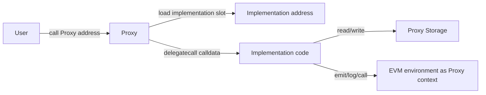
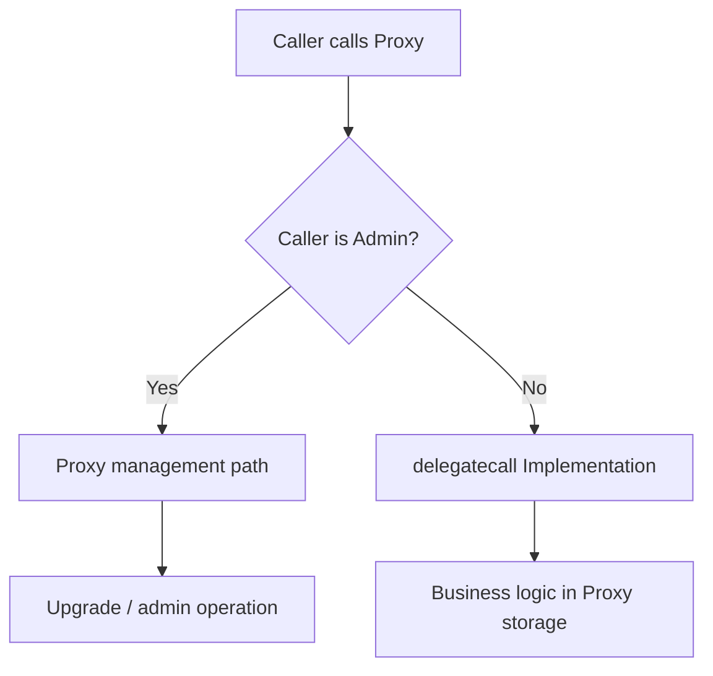
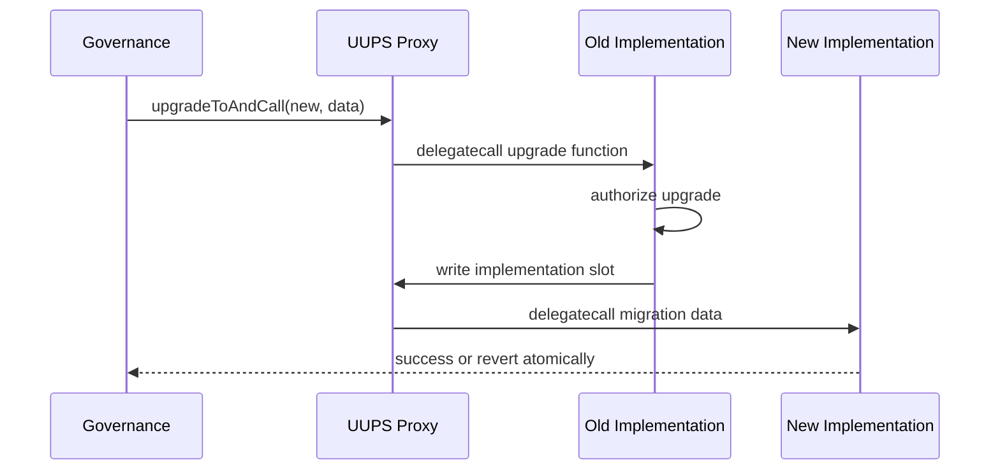
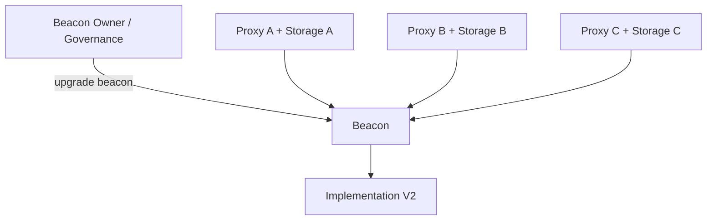
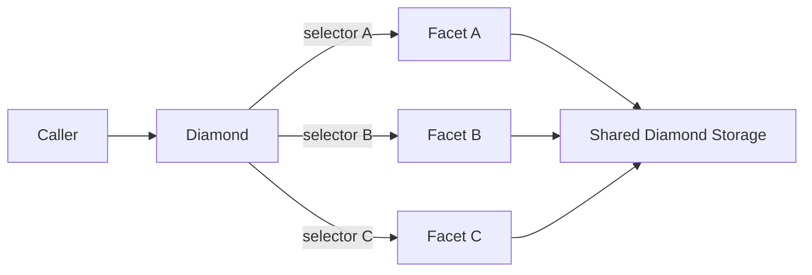
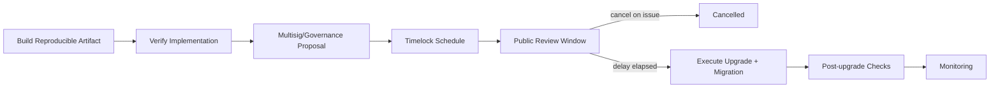
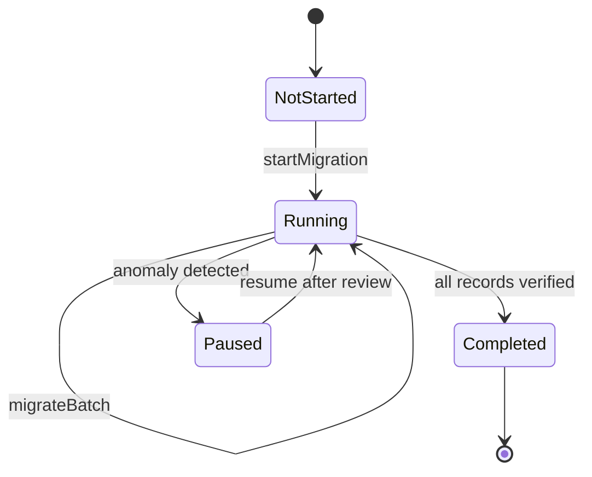

# 智能合约 Upgradeability：从代理模式、存储兼容到升级治理与迁移

> 可升级合约不是“部署新代码后把地址切过去”。代理保留稳定入口和持久状态，通过 `delegatecall` 在代理存储上下文中执行实现代码；一次升级同时改变代码语义、权限表面、状态解释和外部依赖。真正需要证明的是：升级前后的地址、状态、资产、接口与治理承诺仍然一致，而且失败时存在可验证的处置路径。

---

## 一、本文解决什么问题

智能合约部署后代码通常不能在原地址直接修改。工程团队因此会在两个方向间取舍：

- 保持合约不可升级，用更强的确定性换取修复和演进成本；
- 引入 Proxy 或迁移机制，用治理能力换取额外攻击面和运维复杂度。

可升级系统的事故往往不来自业务函数本身，而来自代理边界：

- Proxy 已有余额和状态，新 Implementation 却按另一套 Storage Layout 解释；
- Implementation 的 Constructor 正确执行，但 Proxy 从未初始化；
- Implementation 可被外部初始化或以意外方式调用；
- UUPS 升级函数暴露错误，普通账户获得升级权；
- Transparent Proxy 的 Admin 用错误身份调用业务函数；
- Beacon 一次升级同时改变数百个实例，爆炸半径被低估；
- 升级交易成功，Migration 却只完成一半业务语义；
- Timelock 排队的是一个实现地址，执行时依赖或初始化参数已变化；
- 回滚到旧实现后，旧代码无法理解新版本已经写入的状态。

本文回答：

- Immutable Contract 为什么仍应是默认基线？
- Proxy Pattern 中代码、地址、Storage 和 `msg.sender` 分别属于谁？
- Transparent Proxy 与 UUPS 的升级逻辑放在哪里？
- Beacon Proxy 适合什么实例共享场景，风险为何是批量的？
- Diamond Pattern 解决什么问题，它的工程边界在哪里？
- Initializer 为什么不是普通 Constructor 的简单改名？
- Storage Collision 如何产生，为什么不仅是“变量顺序”问题？
- Implementation Lock 要锁什么，不能解决什么？
- Upgrade Authorization 应如何与业务权限、Proxy Admin 分离？
- Timelock Upgrade 如何提供观察窗口，又为何阻碍紧急修复？
- Migration 如何设计成可重试、可验证且与版本绑定的状态迁移？

本文以 Solidity 0.8.x、EVM `delegatecall` 语义和主流 ERC-1967 风格代理架构的通用模型为基础。OpenZeppelin 等库的构造参数、初始化 API、升级检查和管理员实现会随主版本变化；EIP、编译器和工具行为也会演进。生产接入必须锁定具体依赖版本，并以该版本官方文档、源码、审计报告和生成的 Storage Layout 为准。

### 核心结论

1. 不可升级应是设计基线。只有在修复、治理或产品演进需求足以抵消代理复杂度时，才引入升级能力。
2. Proxy 保存地址、资产和业务 Storage；Implementation 提供被 `delegatecall` 执行的代码。Implementation 自己的 Storage 通常不是用户通过 Proxy 访问的业务状态。
3. Transparent 与 UUPS 的核心差异之一是升级入口所在位置：前者由代理/管理层承载，后者通常由实现逻辑提供；具体职责必须以采用实现为准。
4. Beacon 把多个 Proxy 绑定到同一实现指针，提升批量管理效率，也让一次错误升级影响全部关联实例。
5. Diamond 支持按 Function Selector 路由到多个 Facet，但 Selector、共享 Storage、初始化和工具兼容成本显著增加，不应只为规避单体合约限制而默认采用。
6. Initializer 必须一次性、按继承关系完整执行，并写入 Proxy Storage；Implementation 通常需要禁用其自身初始化入口。
7. Storage 兼容是持久数据 Schema 兼容。新增、删除、重排、改类型、改继承和改 Struct/Enum 都可能破坏历史状态。
8. Implementation Lock 只减少实现合约被直接初始化或误用的风险，不替代 Proxy 的升级授权和业务初始化检查。
9. Upgrade Authorization 是最高风险权限之一，应独立管理、最小化、通过多签/治理和必要延迟执行，并持续监控。
10. Timelock 让升级可观察，但必须配套取消者、应急暂停和明确的延迟变更规则。
11. Migration 是版本化状态机，不是升级后的临时脚本；它需要幂等、批次、断点、事件、不变量和完成标记。
12. “升级交易成功”只说明一次调用未 Revert，不证明 Storage、初始化、资产、权限和业务行为正确。

---

## 二、先理解 Proxy 的执行上下文

普通调用把代码和状态放在同一个合约账户。Proxy 模式把稳定地址和状态留在 Proxy，把可替换代码放在 Implementation。



在典型代理调用中：

- 用户调用的是 Proxy 地址；
- Proxy Fallback 读取 Implementation 地址并执行 `delegatecall`；
- 执行的是 Implementation Bytecode；
- `address(this)` 通常是 Proxy 地址；
-业务状态读写发生在 Proxy Storage；
- 原始外部调用者通常继续表现为实现逻辑中的 `msg.sender`；
- Event 的发出地址是 Proxy；
- 原生资产余额属于 Proxy。

这解释了为什么“Implementation Constructor 已写入 Owner”不能初始化 Proxy：Constructor 只在 Implementation 创建时运行，写的是 Implementation 自己的 Storage。

### 2.1 一个最小代理转发模型

下列伪代码只解释机制，不是生产代理实现：

```solidity
fallback() external payable {
    address implementation = _loadImplementation();
    (bool ok, bytes memory result) = implementation.delegatecall(msg.data);
    if (!ok) {
        assembly {
            revert(add(result, 32), mload(result))
        }
    }
    assembly {
        return(add(result, 32), mload(result))
    }
}
```

生产代理还需要标准化 Slot、升级授权、目标代码检查、初始化调用、错误冒泡和事件等机制。不要从教学片段手写生产代理。

### 2.2 三类地址必须分清

| 地址 | 主要职责 | 常见误区 |
|---|---|---|
| Proxy | 用户入口、状态和资产所在账户 | 误把它当成只有转发逻辑的无状态壳 |
| Implementation | 提供业务代码 | 误读其 Storage 为 Proxy 当前状态 |
| Admin/Beacon | 管理 Implementation 指针 | 误与业务 Owner/Role 混为一谈 |

区块浏览器、脚本和监控必须知道自己读取的是哪一层。对 Implementation 调用 `owner()` 得到的值，通常不能代表 Proxy 用户实际看到的 Owner。

---

## 三、Immutable Contract：不可升级是安全能力

不可升级合约部署后不能在原地址替换代码。它的主要收益是：

- 用户和集成方可以围绕固定 Runtime Code 建立信任；
- 没有 Proxy Admin、升级入口和 Storage 兼容风险；
- 审计对象与链上执行对象更接近；
- 管理员密钥泄露不能直接替换全部业务逻辑；
- 组合协议不必持续追踪实现版本。

### 3.1 不可升级不等于不可演进

仍可通过以下方式演进：

- 部署新版本并让用户主动迁移；
- Registry/Router 指向新实例，但旧地址保持原语义；
- 模块化外部依赖，但明确依赖本身的升级边界；
- 版本化 Factory 创建新对象；
- 通过治理调整预先限定的参数，而非替换代码。

这些方案可能割裂流动性、地址和历史状态，也需要迁移激励与双版本运维。

### 3.2 何时优先不可升级

- 协议逻辑小且可充分验证；
- 用户更看重代码确定性；
- 合约可自然按实例或版本替换；
- 核心资产逻辑应尽量免受治理接管；
- 团队无法长期维护高质量升级流程。

### 3.3 “Renounce Upgrade” 需要验证完整控制图

移除一个升级角色不一定真正不可升级。仍需检查 Proxy Admin、Beacon Owner、Diamond Cut 权限、外部 Registry、Metamorphic/部署机制以及业务合约可变依赖。结论必须来自完整控制面，而不是一个地址为零。

---

## 四、Proxy Pattern：稳定地址与可替换代码

代理模式的收益包括：

- 用户地址和资产位置保持稳定；
- 能修复漏洞和演进逻辑；
- 可以复用部署和治理工具；
- 某些场景可让多个实例共享代码。

代价包括：

- `delegatecall` 上下文更难推理；
- 初始化取代 Constructor；
- Storage Layout 必须跨版本兼容；
- 升级权限成为高价值攻击目标；
- ABI、源码验证、监控和调试需要理解代理层；
- 旧实现回滚未必兼容新状态；
- 每次升级都相当于重新打开系统审计面。

### 4.1 标准化 Slot 的目的

代理需要保存 Implementation、Admin 或 Beacon 地址。如果这些字段占用普通业务 Slot，Implementation 的状态变量可能覆盖它们。ERC-1967 风格方案使用约定的非普通布局位置保存关键指针，并通过事件暴露变化。

标准化 Slot 降低碰撞和工具识别成本，但不能防止业务变量之间、继承布局之间或自定义 Assembly Slot 的冲突。

### 4.2 Proxy 的 Fallback 不是普通 Router

Router 常用普通 `call` 调用目标，目标读写自己的 Storage；Proxy 使用 `delegatecall`，实现代码读写 Proxy Storage。两者的资产、权限和 `address(this)` 语义完全不同。

### 4.3 Selector Collision

Proxy 管理函数与 Implementation 业务函数可能拥有相同的 4 Byte Selector。不同代理模式用不同调度规则缓解冲突，但不能假设函数名不同就绝不会碰撞，因为 Selector 只取函数签名 Hash 的前 4 Byte。

---

## 五、Transparent Proxy：按调用者区分管理面与业务面

Transparent Proxy 的典型思想是：

- Admin 调用代理时进入管理逻辑；
- 非 Admin 调用时转发到 Implementation；
- Admin 通常不应通过同一身份调用代理业务函数。

这样可以降低 Proxy 管理函数与 Implementation 业务 Selector 冲突造成的歧义。



### 5.1 Admin 不是业务 Owner

Proxy Admin 控制实现指针，业务 Owner/Role 控制实现逻辑中的业务入口。把两者交给同一热钱包会集中风险，也容易让运维脚本用 Admin 身份调用业务函数后得到意外结果。

### 5.2 ProxyAdmin 等管理合约

成熟实现常通过独立管理合约控制一个或多个 Proxy，使升级权限集中在清晰接口中。具体构造、所有权和升级 API 取决于库版本，不能假设不同主版本行为一致。

### 5.3 适用与代价

Transparent 模式的管理边界相对直观，生态工具成熟；代价是代理本身承担更多升级逻辑和部署开销，且团队必须理解 Admin 不能像普通用户一样走转发路径的约束。

---

## 六、UUPS：升级逻辑位于 Implementation 体系

UUPS（Universal Upgradeable Proxy Standard）风格通常让 Proxy 保持较轻，升级函数由 Implementation 代码提供，并在 Proxy 上下文中执行以修改标准 Implementation Slot。



### 6.1 `_authorizeUpgrade` 一类钩子的意义

成熟 UUPS 实现通常要求开发者覆盖升级授权钩子，把升级权绑定到 Owner、Role、Timelock 或治理执行器。若钩子为空、权限错误或可被初始化绕过，攻击者可能替换全部逻辑。

具体函数名和接口取决于所用库版本，这里描述的是通用职责，不是跨版本 API 保证。

### 6.2 UUPS 兼容检查

由于升级逻辑位于 Implementation，新实现若不再提供兼容升级机制，可能让 Proxy 永久无法继续升级，或允许写入不兼容目标。成熟库通常包含相应兼容性检查；不要绕过检查只为“让升级通过”。

### 6.3 UUPS 的收益与风险

收益：

- Proxy Runtime Code 较轻；
- 升级逻辑可随实现演进；
- 适合大量独立 Proxy 的常见部署模型。

风险：

- 升级入口和业务代码位于同一实现审计表面；
- 错误新实现可能破坏后续升级能力；
- 授权、调用上下文和实现兼容检查更关键；
- 不能把适用于 Transparent 的实现随意接到 UUPS Proxy，反之亦然。

### 6.4 “可去除升级能力”必须谨慎

理论上新 UUPS Implementation 可以不再暴露升级入口，使系统冻结在当前版本。但这一动作可能不可逆，且要确认不存在其他升级路径。执行前应经过单独治理提案、源码验证和 Fork 演练。

---

## 七、Beacon Proxy：一处指针升级多个实例

Beacon Proxy 不直接保存最终 Implementation，而是引用 Beacon；Beacon 返回当前 Implementation。升级 Beacon 后，所有引用该 Beacon 的 Proxy 通常开始使用新实现。



### 7.1 适用场景

- 大量同构 Vault、Market 或账户实例；
- 希望所有实例统一修复；
- Factory 创建实例并共享版本策略；
- 实例 Storage 独立，但业务代码一致。

### 7.2 批量爆炸半径

Beacon 的运维效率也是主要风险：一笔错误升级会同时影响所有实例。升级前不仅要测一个“标准实例”，还要抽样或全量验证不同历史状态、资产类型和配置组合。

### 7.3 版本分组

不是所有实例都必须永久共享一个 Beacon。可按风险、创建批次或产品版本使用不同 Beacon，让灰度和回滚更可控。但 Beacon 数量增加会提高版本治理和监控成本。

### 7.4 Beacon 与实例权限分层

Beacon Owner 控制全部实例代码，单个 Proxy 的业务 Owner 只控制自己的业务状态。权限审计必须把全局升级权按所有关联资产的总风险评级。

---

## 八、Diamond Pattern 边界：按 Selector 组合多个 Facet

Diamond 风格通常让一个稳定地址根据 Function Selector 把调用 `delegatecall` 到不同 Facet，并维护 Selector 到 Facet 的映射。Facet 共享 Diamond Storage 上下文。



### 8.1 它解决什么

- 大型协议按功能拆分代码；
- 可以独立添加、替换或移除 Selector；
- 一个地址组合多个模块；
- 在特定架构下绕开单一 Runtime Code 规模限制。

### 8.2 主要复杂度

- Selector 路由表本身需要治理和审计；
- Facet 共享 Storage，布局约定更复杂；
- 一个 Facet 可能破坏另一个 Facet 的不变量；
- 初始化和升级可能跨多个模块；
- ABI 聚合、源码验证、调试、监控和工具支持更复杂；
- 移除 Selector 可能破坏外部组合方；
- 多个 Facet 之间的内部调用和权限边界不如单体直观。

### 8.3 何时不适合

如果协议规模可以由普通模块化源码加 Transparent/UUPS 解决，团队又缺乏 Diamond 专项工具、审计和长期治理能力，引入 Facet 路由往往得不偿失。代码拆分需求不自动等于需要 Diamond。

### 8.4 Diamond Storage

常见方案让每个模块使用独立命名 Slot 或统一 App Storage。无论采用哪种，都必须建立机器可检查的 Slot 所有权和升级规则。字符串 Namespace 本身不保证永不冲突，团队仍需固定规范和验证工具。

---

## 九、Initializer：在 Proxy Storage 中建立初始状态

### 9.1 为什么不能依赖 Constructor

Implementation Constructor 在 Implementation 自身部署阶段运行。Proxy 后续 `delegatecall` 不会重放 Constructor，因此业务 Owner、Token 地址、角色和版本等 Proxy 状态必须通过 Initializer 写入。

### 9.2 Initializer 的必要性质

- 只能按设计执行一次或按版本执行一次；
- 未授权账户不能抢先初始化；
- 所有父类初始化逻辑按正确顺序执行；
- 零地址、范围和依赖 Code 都经过验证；
- 初始化与 Proxy 部署/升级尽量原子完成；
- 初始化完成发出可审计事件或可读取版本状态；
- 重复或跳级初始化明确失败。

### 9.3 部署与初始化分成两笔交易的风险

若先部署 Proxy，再单独发送公开 `initialize()`，中间窗口可能被其他账户抢先调用。成熟部署流程通常把初始化 Calldata 传给 Proxy 构造或升级调用，使创建/升级与初始化在同一交易中原子执行。

### 9.4 多重继承初始化

普通 Constructor 会按语言规则处理父构造链；可升级库常使用显式 Parent Initializer。漏调会留下未初始化模块，重复调用可能覆盖状态。父初始化顺序和“只初始化一次”语义必须按锁定版本库的设计验证。

### 9.5 Reinitializer

升级新增模块时可能需要版本化再初始化。版本号应单调、不可重复，并与 Implementation Release 绑定。Reinitializer 不等于任意 Migration 入口：大数据迁移可能无法在一笔交易完成，需要独立批处理状态机。

---

## 十、Implementation Lock：防止实现合约被直接初始化

Implementation 地址是公开合约，攻击者可以直接调用它的外部函数。虽然其 Storage 与 Proxy 分离，但未初始化实现仍可能带来风险：

- 攻击者取得 Implementation 自身 Owner/Role；
- 实现持有误转资产时被提取；
- 特定实现逻辑可能被直接调用触发危险路径；
- 历史库或自定义逻辑中存在可影响代理体系的行为；
- 监控和集成误把 Implementation 当作业务实例。

常见做法是在 Implementation Constructor 中禁用其自身 Initializer，使 Proxy 仍可通过 `delegatecall` 初始化各自 Storage，而 Implementation 账户不能再初始化。具体 API 取决于库版本。

### 10.1 Lock 不能解决什么

- 不能限制 Proxy 上的 Initializer 是否被抢跑；
- 不能修复 `_authorizeUpgrade` 权限错误；
- 不能保证新实现 Storage 兼容；
- 不能阻止实现中的普通公开函数被直接调用；
- 不能保护被误转到 Implementation 的所有资产类型；
- 不能替代目标地址和 Code Hash 验证。

因此 Implementation Lock 是部署卫生的一部分，不是完整升级安全证明。

---

## 十一、Storage Collision：升级最隐蔽的破坏方式

Proxy Storage 被不同版本 Implementation 代码解释。如果布局不兼容，新代码可能把旧 Slot 当成另一种变量。

### 11.1 典型破坏

V1：

```solidity
contract VaultV1 {
    address internal owner;   // slot 0
    uint256 internal balance; // slot 1
}
```

错误 V2：

```solidity
contract VaultV2 {
    bool internal paused;     // may occupy slot 0
    address internal owner;   // layout shifted
    uint256 internal balance;
}
```

在 Proxy 上升级后，历史 Slot 没有移动，但新代码的解释变了。升级交易本身可能成功，直到读取 Owner 或写入 Pause 时才表现出破坏。

### 11.2 不只是追加变量

需要审查：

- 删除、重排或改类型；
- 改父合约及继承顺序；
- 父合约新版本增加变量；
- Struct 成员变化；
- Enum 数值和顺序变化；
- Mapping/Array 基础 Slot 变化；
- Storage Pointer 与 Assembly；
- Gap 或 Namespaced Storage 的使用方式；
- Compiler 和依赖版本变化对布局输出的影响。

### 11.3 Storage Gap 的边界

某些继承式可升级模式预留 Gap，让未来版本在相应合约层消耗预留 Slot。Gap 不是任意重排许可证：必须按库规范缩减，并验证整体继承布局。

### 11.4 Namespaced Storage

模块把状态放在由 Namespace 派生的固定 Slot，可降低继承追加导致的耦合，并适合模块化体系。但 Namespace 稳定性、Struct 内部布局和 Slot 冲突仍需治理。迁移到 Namespaced Storage 本身也是一次数据迁移，不会自动搬运旧 Slot。

### 11.5 机器检查是门槛，不是终点

升级工具可以比较 Storage Layout，发现许多结构性不兼容；它通常不能证明：

- 新代码仍按相同业务单位解释数值；
- 新不变量与历史数据兼容；
- 外部依赖和权限正确；
- Assembly 没有访问未声明 Slot；
- Migration 对全部对象完成。

---

## 十二、Upgrade Authorization：谁能替换整个协议

升级权通常比手续费、暂停甚至国库日常操作更危险，因为新实现可以改变所有业务入口和资产规则。

### 12.1 与业务权限分离

- Business Owner：调整业务参数；
- Guardian：快速暂停有限入口；
- Upgrade Authority：批准 Implementation 变更；
- Timelock/Executor：延迟后执行；
- Proxy/Beacon Admin：技术上写入实现指针。

一个地址可能承担多个角色，但风险评估不能因此把它们视为同一能力。

### 12.2 升级授权检查的对象

授权逻辑至少要确认：

- `msg.sender` 是预期治理执行器，而不是 `tx.origin`；
- 当前调用确实发生在预期 Proxy 上下文；
- 新 Implementation 非零且具有代码；
- 实现类型与当前 Proxy 模式兼容；
- 初始化/迁移 Calldata 与审计版本一致；
- 关键授权不能被未初始化状态绕过。

具体上下文保护和兼容接口应使用成熟实现，不要凭 `address(this) != implementation` 等零散判断自行拼装。

### 12.3 多签不是全部治理

多签降低单密钥风险，但多数签名者仍可立即替换代码。高价值系统常结合：

- 独立签名设备和组织；
- 人类可读交易解码；
- Implementation Code Hash Allowlist/发布清单；
- Timelock；
- Guardian 取消或暂停；
- 链上和链下告警；
- 升级后权限复核。

### 12.4 升级权限的轮换

轮换不仅更新 Owner/Role，还需检查：

- Proxy Admin 和 Beacon Owner；
- Timelock Proposer/Executor/Canceller；
- 已排队升级；
- Multisig 签名者和模块；
- 已签署但未执行的交易；
- 自动化 Keeper 与部署凭证。

---

## 十三、Timelock Upgrade：让代码变更可观察

典型升级链路：



### 13.1 排队内容必须不可歧义

提案应绑定：

- Chain ID、Proxy/Beacon 地址；
- 新 Implementation 地址和 Runtime Code Hash；
- Upgrade Function 与完整 Calldata；
- 初始化/迁移数据；
- Value；
- 前置 Operation 或 Salt；
- 预期旧版本和新版本。

只排队一个“版本名称”或 Git Commit 不能证明链上实际执行字节。

### 13.2 延迟期间验证什么

- 源码已验证且 Bytecode 可复现；
- Storage Layout Diff 通过人工和工具审查；
- Fork 上使用生产状态执行升级；
- ABI、Event、Error 和 Selector 变化已发布；
- 权限矩阵与依赖地址已核对；
- Migration 能完成或按批次安全推进；
- 监控识别新事件和版本；
- 用户有必要的退出或风险处置窗口。

### 13.3 Timelock 的应急矛盾

长延迟给用户反应时间，也延缓漏洞修复。常见分层是 Guardian 立即暂停受影响入口，升级仍走 Timelock 或经过预先定义的紧急治理路径。

紧急路径若能任意升级并转移资产，它就是无延迟超级管理员。必须限制触发者、动作范围、实现集合、持续时间和后续复核。

### 13.4 Delay 变更也必须受控

如果管理员能瞬间把 Delay 调为零，升级延迟形同虚设。Delay 修改通常也应经过当前延迟规则，并由监控重点告警。

---

## 十四、Migration：代码升级与数据升级是两件事

替换 Implementation 只改变未来代码解释，不自动转换历史数据。

### 14.1 三类 Migration

1. **无需迁移**：新版本只追加状态，旧数据可直接解释；
2. **原子迁移**：少量全局字段可在 `upgradeToAndCall` 一笔交易完成；
3. **分批迁移**：大量用户/市场数据需要多交易推进。

### 14.2 原子升级与初始化

若新代码在初始化前不可安全使用，升级和初始化必须尽量同交易执行。否则升级后、初始化前可能出现开放窗口，其他账户调用新入口或抢占初始化。

### 14.3 分批 Migration 状态机



分批迁移需要：

- 固定旧/新 Schema Version；
- Cursor 或已迁移标记；
- 每批 Gas 上限和可重试性；
- 重复批次不会重复计账；
- 迁移期间业务入口的读写策略；
- 异常暂停和恢复；
- 完成条件与全局不变量；
- 每批 Event 和链下进度核对。

### 14.4 Lazy Migration

首次访问某对象时按旧格式读取并转为新格式，可摊薄一次性 Gas，但让业务入口长期同时处理两种 Schema，增加分支、测试和攻击面。需要明确版本标记，不能仅靠某个可能合法为零的字段猜测是否已迁移。

### 14.5 回滚不是简单换回旧地址

新实现一旦写入新字段或改变旧字段语义，旧实现可能无法理解这些状态。真正的回滚需要事先证明向后兼容，或部署 Forward Fix。把“保留 V1 地址”称为回滚方案通常是不充分的。

### 14.6 Migration 的幂等性

RPC 超时、Keeper 重试和批次重叠都可能重复提交。每个迁移单元必须有版本/完成标记，并在写入前检查；同一对象重复迁移应安全拒绝或返回已完成，不能重复铸币、累计余额或发放债权。

---

## 十五、升级发布流水线

### 15.1 Build Stage

- 固定精确 Compiler、依赖、Optimizer、`viaIR` 和 EVM Version；
- 构建 Implementation Artifact 与 Runtime Code Hash；
- 生成 ABI、Storage Layout、Source Map 和 Metadata；
- 比较上一版本 ABI、Selector、Event、Error 和 Storage Layout；
- 独立环境执行可复现构建。

### 15.2 Test Stage

- 单元、集成、Fuzz、Invariant 和形式化检查；
- 从每个历史状态测试新迁移边；
- Fork 生产状态执行升级和 Migration；
- 测试未授权升级、重复初始化和错误实现；
- 验证 Pause、Timelock、取消和恢复 Runbook；
- 对 Beacon 覆盖不同实例配置。

### 15.3 Deploy Stage

- 部署 Implementation，但不改变生产 Proxy；
- 验证源码和链上 Runtime Code Hash；
- 确认 Implementation 已 Lock；
- 对 Implementation 做只读和直接调用边界检查；
- 发布地址、Artifact Hash 和审计证据。

### 15.4 Governance Stage

- 生成确定性 Upgrade Calldata；
- 人类解码 Target、Implementation、Value 和 Migration 参数；
- 多签/治理批准；
- Timelock 排队并公开 Operation ID；
- 监控延迟期间的代码或依赖变化。

### 15.5 Execute Stage

- 执行前再次读取当前 Implementation、Admin、Pause 和依赖状态；
- 验证旧版本符合预期，避免基于过时状态执行；
- 原子执行升级与必要初始化；
- 保存 Transaction、Receipt、Event、Block 和 Code Hash。

### 15.6 Verify Stage

- Proxy 指针等于目标 Implementation；
- 新 Implementation Runtime Code Hash 匹配发布清单；
- Owner、Role、Admin、Beacon 和 Timelock 权限未漂移；
- 关键 Storage 值升级前后保持；
- 初始化版本和 Migration 进度正确；
- 资产负债与业务 Invariant 成立；
- Smoke Test 使用最小、可回滚的真实入口；
- 监控和索引器识别新 ABI/Event。

---

## 十六、测试与验证方法

### 16.1 Storage Layout Diff

使用锁定工具链输出结构化 Storage Layout，并在 CI 中比较。发现类型、Slot、Offset、继承或 Namespace 变化时阻断发布，由人工确认迁移方案。

不要用源码文本 Diff 代替 Layout Diff；同一变量名可能位置变化，不同源码结构也可能保持布局兼容。

### 16.2 Upgrade Matrix

至少测试：

- V1 -> V2 正常升级；
- 未授权账户升级失败；
- 错误 Proxy 类型/错误实现失败；
- 初始化参数错误整笔回滚；
- 重复初始化和重复 Reinitializer 失败；
- 历史所有状态在 V2 正确读取；
- V2 新写入后旧实现是否还能读取，若不能则明确禁止回滚；
- Pause 状态下升级与业务入口符合设计。

### 16.3 Fork 验证真实状态分布

本地构造状态通常覆盖不了生产中的尘埃、旧版本对象、极端余额、失效地址和历史权限。Fork 测试应读取代表性账户和市场，并对高价值系统考虑全量离线状态分析。

### 16.4 Invariant

- 总资产与总负债关系不因升级改变；
- 用户余额、份额和债务保持；
- 终态不会重新开放；
- 权限不会新增给非预期账户；
- Proxy Implementation Slot 只能由治理路径改变；
- Migration 对每个对象最多生效一次；
- Beacon 全部实例使用兼容布局。

### 16.5 失败注入

测试 Migration 中途 Revert、Gas 不足、外部依赖失败、Oracle 异常、区块重组、重复执行和治理状态变化。目标不是让所有失败“继续”，而是证明失败后状态清晰、资产守恒且可以按 Runbook 恢复。

---

## 十七、常见误区与错误案例

### 17.1 “代理只是多一次调用”

错误。`delegatecall` 改变了代码与 Storage 的归属关系，并引入初始化、布局和升级授权等完整控制面。

### 17.2 “Implementation Constructor 已经设置 Owner”

错误。它设置的是 Implementation Storage；Proxy 业务状态必须通过 Proxy 上下文初始化。

### 17.3 “只在末尾追加变量就绝对安全”

错误。继承、父依赖、Struct、Enum、Gap、Namespace 和 Assembly 都可能改变解释，还需验证业务语义。

### 17.4 “UUPS 比 Transparent 更安全”

没有脱离实现和治理的绝对结论。两者分配升级职责的方式不同，风险取决于授权、库版本、运维和测试。

### 17.5 “Beacon 升级只需测试一个 Proxy”

错误。不同实例可能有不同历史状态、资产和配置，一次升级影响全部关联实例。

### 17.6 “Implementation 已 Lock，所以升级系统安全”

错误。Lock 主要防止实现自身初始化，不能证明 Proxy 初始化、升级授权和 Storage 兼容正确。

### 17.7 “升级交易成功就说明 Migration 成功”

错误。交易未 Revert 不证明所有记录迁移、资产守恒、权限正确或链下系统已兼容。

### 17.8 “保留旧 Implementation 就可以随时回滚”

错误。新版本写入的状态可能与旧代码不兼容，盲目回切会进一步损坏数据。

### 17.9 “Timelock 会自动阻止恶意升级”

错误。Timelock 只提供时间窗口，需要监控、取消权限、响应流程和用户行动才能转化为安全收益。

### 17.10 “源码验证相同就能信任 Proxy”

错误。还需验证 Proxy 指针、Admin/Beacon、初始化状态、Storage、Runtime Code Hash 和治理权限。

---

## 十八、方案比较

| 方案 | 升级粒度 | 升级逻辑位置 | 主要优势 | 主要成本 |
|---|---|---|---|---|
| Immutable | 新地址/迁移 | 无原址升级 | 代码确定性强 | 修复与状态迁移困难 |
| Transparent | 单 Proxy | Proxy/管理层 | 管理与业务调用者分流，生态成熟 | Admin 调用语义和代理逻辑更复杂 |
| UUPS | 单 Proxy | Implementation 体系 | Proxy 较轻，升级逻辑可演进 | 授权和实现兼容风险更集中 |
| Beacon | 一组 Proxy | Beacon | 批量升级同构实例 | 批量爆炸半径 |
| Diamond | Selector/Facet | Diamond Cut 体系 | 细粒度模块组合 | 路由、Storage 和工具复杂度高 |
| 新版本迁移 | 用户/资产迁往新地址 | 新合约 | 旧代码语义保持 | 流动性、地址和运维割裂 |

选择时至少比较：

- 是否必须保留地址和状态；
- 实例数量与升级粒度；
- 管理员信任假设；
- Storage 生命周期；
- 审计和工具能力；
- 紧急修复与用户退出需求；
- 长期运维团队是否稳定；
- 外部协议对升级风险的接受程度。

---

## 十九、发布前检查清单

- [ ] 已论证为什么需要升级，而不是默认引入 Proxy。
- [ ] Proxy、Implementation、Admin/Beacon 地址和职责已记录。
- [ ] Proxy 类型与 Implementation 模式兼容。
- [ ] Implementation Constructor 仅处理实现锁定等适当逻辑。
- [ ] Initializer 在部署/升级时原子调用，无法被抢跑或重复调用。
- [ ] 所有父 Initializer 顺序和版本已验证。
- [ ] Storage Layout 结构化 Diff 通过，Assembly Slot 已人工审查。
- [ ] Enum、Struct、继承、Gap 和 Namespace 的历史兼容已确认。
- [ ] Upgrade Authority 与业务 Role 分离并由多签/治理管理。
- [ ] Timelock Operation 绑定实现 Code Hash 和完整 Migration Calldata。
- [ ] Guardian/取消者和应急暂停路径已经演练。
- [ ] Migration 可重试、可观测、按版本限制且保持幂等。
- [ ] 已明确旧实现是否真正可回滚。
- [ ] Fork 使用生产状态执行升级并验证 Invariant。
- [ ] Beacon 升级覆盖不同实例状态和配置。
- [ ] Diamond Selector、Facet 和共享 Storage 已生成完整清单。
- [ ] 升级后读取权限、实现指针、关键状态和资产负债。
- [ ] ABI、Event、索引器、Frontend 和监控同步发布。
- [ ] Artifact、源码验证、交易和链上 Code Hash 已归档。

---

## 二十、总结

可升级性是一项持续治理能力，而不是一次性技术选型：

1. Immutable Contract 提供最强的代码确定性，应作为默认比较基线。
2. Proxy 让稳定地址和 Storage 使用可替换代码，但要求团队理解 `delegatecall` 上下文。
3. Transparent、UUPS、Beacon 和 Diamond 解决不同升级粒度与模块问题，没有脱离场景的最佳方案。
4. Initializer 必须在 Proxy Storage 中一次性、完整、原子地建立初始状态，Implementation 自身通常需要锁定。
5. Storage Collision 是数据 Schema 破坏，必须同时检查布局结构和业务解释。
6. Upgrade Authorization 应按协议最高权限治理，并与多签、Timelock、Guardian 和监控组合。
7. Migration 是可执行状态机，需要版本、批次、幂等、不变量和完成证据。
8. 回滚只有在状态向后兼容时才成立，更多时候需要 Forward Fix。
9. 升级验收必须从交易成功延伸到实现指针、Code Hash、权限、资产、历史状态和链下系统。

真正成熟的升级系统，不以“可以换代码”为目标，而以“任何代码变化都经过可复现构建、最小授权、公开延迟、状态兼容验证和链上证据闭环”为目标。

---

## 问答复盘

### Q1：为什么说不可升级本身是一种安全能力？

**答：** 它移除了替换代码的管理入口、初始化和 Storage 兼容风险，让用户面对固定 Runtime Code；代价是漏洞修复和状态迁移更困难。

### Q2：Proxy 调用 Implementation 时，业务状态写在哪里？

**答：** 典型 `delegatecall` 模式下写在 Proxy Storage。执行代码来自 Implementation，但地址、余额和持久状态属于 Proxy 上下文。

### Q3：Transparent Proxy 与 UUPS 最核心的区别之一是什么？

**答：** Transparent 通常由代理/管理层承载升级逻辑并按 Admin 身份分流；UUPS 通常由 Implementation 体系提供升级入口。具体行为需以所用实现版本为准。

### Q4：为什么 Implementation Constructor 不能初始化 Proxy Owner？

**答：** Constructor 只在 Implementation 创建时执行并写其自身 Storage。Proxy 必须通过 `delegatecall` 执行 Initializer，才能写入 Proxy Storage。

### Q5：Implementation Lock 是否会阻止 Proxy 初始化？

**答：** 正确实现通常只锁住 Implementation 自身的初始化状态；每个 Proxy 有独立 Storage，仍可在 Proxy 上下文初始化。具体机制应按库版本验证。

### Q6：只追加状态变量为什么仍可能不兼容？

**答：** 父合约、继承顺序、Struct、Enum、Gap、Namespace 和 Assembly Slot 都可能改变布局或业务解释，不能只检查当前合约源码末尾。

### Q7：Beacon Proxy 的最大工程风险是什么？

**答：** 批量爆炸半径。一次 Beacon 升级会影响全部关联实例，因此必须覆盖不同历史状态、资产和配置，而不是只测一个样板实例。

### Q8：为什么 Timelock 不能单独保证升级安全？

**答：** 它只提供反应时间。还需要可读提案、监控、取消权限、应急流程和用户响应，才能发现并阻止错误升级。

### Q9：什么情况下不能直接回滚旧 Implementation？

**答：** 当新版本已写入旧代码无法理解的状态、改变单位或完成不可逆外部操作时，旧实现不再兼容，应采用经过验证的 Forward Fix 或专门迁移。

### Q10：如何验收一次升级，而不是只看交易成功？

**答：** 核对 Proxy/Beacon 指针和 Code Hash、权限、Initializer/Migration 版本、关键历史状态、资产负债与业务 Invariant，并验证 ABI、索引器和监控已同步工作。

---

## 延伸知识

- **Storage Layout**：Slot Packing、Inheritance Layout、Namespaced Storage 与升级兼容。
- **编译与部署**：Creation Code、Runtime Code、Metadata、Verification 与 Reproducible Build。
- **权限模型**：RBAC、Multisig、Timelock、Guardian、Role Rotation 与特权审计。
- **状态机**：Legal Transition、Migration Idempotency、Timeout 与 Invariant。
- **合约安全**：Delegatecall、Initialization、Reentrancy、Arbitrary Call 与治理攻击。
