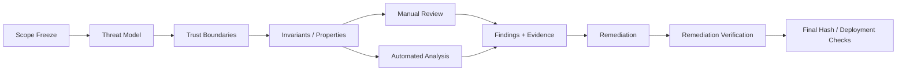
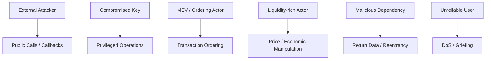
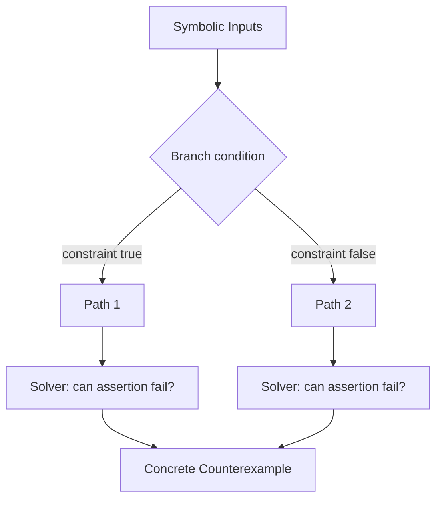
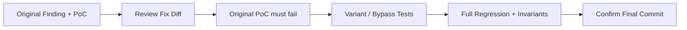

# 智能合约审计方法：从威胁建模、不变量到 Fuzz、Fork 与修复验证

> 智能合约审计不是在发布前运行一次扫描器，也不是审计员逐行寻找“危险函数”。有效审计先冻结代码与配置范围，建立资产、角色、依赖和攻击者模型，再把协议承诺写成不变量，最后用人工推理、静态分析、符号执行、Fuzz、差分、Fork 和形式化方法从不同角度寻找反例。审计结论只对明确版本、假设和范围成立，修复后的代码必须重新验证。

---

## 一、本文解决什么问题

同一个 Solidity 仓库可能同时包含：

- Proxy 与多个 Implementation；
- Oracle、Token、Vault、Bridge 等外部依赖；
- 部署、初始化和升级脚本；
- Multisig、Timelock、Guardian 与角色配置；
- 链下 Signer、Relayer、Keeper 和 Indexer；
- 多链地址、参数和不同 Compiler 配置。

只审查一个 `.sol` 文件，无法回答真正的安全问题：

- 哪些资产可能损失或永久锁定？
- 攻击者能调用哪些入口、控制哪些回调和排序？
- 管理员或外部依赖失陷时爆炸半径多大？
- 协议有哪些必须始终成立的资产和状态事实？
- 自动化工具没有报错，是否因为路径未建模？
- Fork 测试通过，是否只代表某个历史区块？
- 形式化证明是否遗漏外部 Token、Oracle 和升级假设？
- 审计完成后代码改了多少，原结论是否仍有效？
- 修复一个问题是否引入 DoS、精度或权限回归？

本文覆盖：

- Threat Modeling；
- Trust Boundary；
- Invariant；
- Manual Review；
- Static Analysis；
- Symbolic Execution；
- Fuzzing；
- Differential Test；
- Fork Test；
- Formal Verification；
- Audit Scope；
- Remediation Verification。

本文给出通用审计方法，不替代针对具体协议、版本和目标链的独立安全审计。工具能力、Compiler、EVM Fork、验证器和报告格式会持续变化；任何自动化结果都应记录工具版本、命令、配置和限制，不能把工具“未发现问题”表述为系统不存在漏洞。

### 核心结论

1. Audit Scope 必须先于技术审查冻结，包含 Commit、Compiler、依赖、部署配置、Proxy、脚本和链上地址；否则“已审计”没有可验证对象。
2. Threat Modeling 从资产、攻击者能力、入口和最坏影响出发，避免只按历史漏洞名称检查。
3. Trust Boundary 标识哪些数据、代码、密钥和治理主体不能被默认信任，包括 `view` Oracle、可升级 Token 和链下 Relayer。
4. Invariant 把协议承诺转成可判断事实，是人工审查、Fuzz、形式化和生产监控的共同语言。
5. Manual Review 擅长发现业务逻辑、经济激励、组合与治理问题；自动工具更适合扩大路径、模式和边界覆盖，两者不能替代。
6. Static Analysis 快速发现数据流和危险模式，但会有误报、漏报，对经济和跨交易状态机理解有限。
7. Symbolic Execution 探索符号输入路径，受路径爆炸、环境模型、外部调用和求解器边界限制。
8. Fuzzing 通过随机或引导输入寻找反例；状态化 Fuzz 比单函数 Fuzz 更适合协议生命周期。
9. Differential Test 比较两个实现或模型，能发现行为漂移，但参考实现错误时会共同给出错误答案。
10. Fork Test 验证真实链状态、依赖和流动性，结论绑定具体 Block 和 RPC 能力，不代表未来所有市场状态。
11. Formal Verification 证明的是给定模型、规范和假设下的性质；错误规范会被严谨地证明为错误结论。
12. Remediation Verification 必须复现原问题、检查修复 Diff、运行全量回归并核对最终 Commit，不能只看某一行已修改。

---

## 二、审计生命周期



审计不是线性一次通过。人工发现新信任边界后，往往需要补充不变量和测试；Fuzz 发现反例后，可能暴露 Scope 中漏掉的外部依赖；修复又会改变控制流，需要重新运行分析。

### 2.1 可交付证据

- Scope Manifest；
- Architecture 与资产流图；
- Role/Trust Matrix；
- Invariant 清单；
- 工具版本、配置与原始结果；
- Finding、PoC、影响和前置条件；
- 修复 Commit 与 Diff；
- Remediation 测试结果；
- 最终部署 Artifact/Code Hash 对照。

报告中的“审计时间”远不如这些可复现证据重要。

---

## 三、Audit Scope：先确定到底审什么

### 3.1 Scope Manifest

至少记录：

- Git Repository 与精确 Commit；
- Scope 内文件和明确排除项；
- Solidity/Compiler 精确版本；
- Optimizer、`runs`、`viaIR`、EVM Version；
- Dependency Lockfile 与子模块 Commit；
- Proxy 类型、Storage Layout 和当前实现；
- 部署、初始化、升级、迁移脚本；
- Chain ID、已部署地址和配置参数；
- External Token/Oracle/Bridge/Router；
- 管理员、多签、Timelock 和 Guardian；
- 链下组件是否属于 Scope；
- 已知问题、设计文档和测试覆盖。

### 3.2 Scope 不只包含业务合约

部署脚本把 Owner 设错、Initializer 漏调、Library 链接错链，都能让审计正确的源码产生不安全系统。以下通常需要纳入或明确作为假设：

- Constructor/Initializer 参数；
- CREATE2 Salt 和 Factory；
- ProxyAdmin/Beacon；
- Timelock Delay 与 Role；
- Oracle Feed 地址和 Decimal；
- Token Allowlist；
- Keeper/Signer 配置；
- Emergency Runbook。

### 3.3 Freeze 与变更管理

审计期间代码仍可能变化。每次更新应提供：

- 原 Commit 与新 Commit；
- 结构化 Diff；
- 修改原因；
- 受影响 Invariant/测试；
- 是否新增依赖、Storage 或权限。

大规模重构不能伪装成“修复小问题”要求快速复核，应重新评估 Scope 和审计预算。

### 3.4 Out-of-scope 也是风险声明

若 Oracle、Frontend、Admin Key 或 Bridge 不在 Scope，报告应说明系统安全仍依赖它们。Out-of-scope 不等于无风险，只表示本次结论未验证。

---

## 四、Threat Modeling：从资产与攻击者出发

威胁建模回答“谁能在什么条件下对什么资产造成什么影响”。

### 4.1 资产清单

- 合约托管 Token/原生资产；
- 用户 Share、Debt、NFT 和 Claim；
- Mint/Burn 权限；
- Upgrade/Oracle/Role 控制权；
- 未执行签名与跨链消息；
- 协议可用性和清算公平性；
- 隐私数据与链下 Key；
- 品牌、治理和外部组合方信任。

### 4.2 攻击者模型



不要只建模“无权限外部黑客”。管理员误操作、签名者串谋、可升级依赖、恶意 Token、Sequencer 停机和 Keeper 离线同样是威胁。

### 4.3 Attack Surface

- External/Public Functions；
- Fallback/Receive；
- Token/NFT/Flash Callback；
- Initializer/Reinitializer；
- Upgrade/Delegatecall/Arbitrary Call；
- Signature/Permit/Meta-transaction；
- Oracle/Price/Bridge Message；
- Batch/Multicall；
- Admin/Emergency Function；
- External Dependency 回调和返回值。

### 4.4 Misuse Case

除正常 Use Case 外，逐项反问：

- 同一动作重复执行会怎样？
- 顺序反过来会怎样？
- 对手方永不行动会怎样？
- 外部调用 Revert/重入/返回 False 会怎样？
- 价格极端、陈旧或 Decimal 错会怎样？
- 一个管理员密钥泄露能做什么？
- Flash Liquidity 无限放大时会怎样？
- 升级中途或迁移一半会怎样？

---

## 五、Trust Boundary：不要默认信任边界之外的事实

### 5.1 常见边界

| 边界 | 不可信输入/行为 | 验证方式 |
|---|---|---|
| 用户/合约调用者 | 参数、Value、调用顺序、重入 | 权限、状态、范围、锁 |
| Token | 返回值、到账、Hook、Rebase | 安全封装、余额/资产策略 |
| Oracle | 价格、时间、Decimal、升级 | 新鲜度、偏差、多源、权限 |
| Signature | Domain、Nonce、格式 | EIP-712/191、规范 ECDSA/1271 |
| Proxy/Module | Code 与 Storage 语义 | Code Hash、Layout、授权 |
| Bridge | Source、Finality、Replay | Proof/Validator、Domain、Nonce |
| RPC/Indexer | 断连、重组、跨区块读取 | 固定 Block、补扫、确认策略 |
| Admin/Guardian | 误操作、泄露、串谋 | 最小权限、多签、Timelock |

### 5.2 `view` 不是信任标记

外部 `view` 调用仍可返回恶意、陈旧或上下文相关数据，甚至通过复杂调用消耗 Gas/Revert。只读约束不保证真实性。

### 5.3 可升级依赖

今天审计过的 Token/Oracle/Router，明天可由管理员替换 Implementation。应把依赖的升级权纳入 Trust Boundary，并检查协议是否监控行为漂移。

### 5.4 跨链边界

源链事件不是目标链自动可信事实。需要验证源链最终性、消息认证、目标合约、Nonce 和重放状态；Relayer 只是传输者还是信任主体必须明确。

---

## 六、Invariant：把协议承诺写成可执行性质

Invariant 是任何允许的调用序列后都必须成立的事实。

### 6.1 资产不变量

```text
accounted assets + explicit bad debt
>= user liabilities + protocol claims
```

公式需匹配协议实际会计。Forced Ether、Rebase、Fee Token 和未结算收益会让简单余额等式失真。

### 6.2 状态机不变量

- Terminal State 不会重新开放；
- 一笔订单最多结算一次；
- Cancelled 与 Settled 不能同时成立；
- Deadline 边界没有空洞；
- Migration 每个对象最多执行一次。

### 6.3 权限不变量

- 非授权主体无法 Upgrade/Mint/Withdraw Treasury；
- Guardian 只能收缩风险，不能任意转移资产；
- Role Admin 关系不产生意外超级权限；
- Timelock Delay 不能被旁路瞬间取消。

### 6.4 经济不变量

- 单交易瞬时资本不能无成本提取协议价值；
- Share/Asset 换算舍入损失有界且方向符合设计；
- Oracle 操纵成本高于可提取价值或有硬限额；
- 用户执行结果不差于签名/交易中的 Slippage 边界。

### 6.5 可达性性质

“永远不会坏”之外，还需证明“最终能做成”：

- 用户可在合法条件下退出；
- 对手不协作时有 Timeout；
- 单个接收者不能阻塞全局结算；
- Pause 后存在受控恢复路径；
- 管理员轮换不会丢失最后管理权。

### 6.6 Invariant 质量

过弱：`totalSupply >= 0` 对 `uint256` 没有价值。

过强：要求实际余额严格等于内部负债，可能被强制转入破坏。

好的不变量应直接对应资产、权限或状态承诺，并能产生有意义反例。

---

## 七、Manual Review：理解工具看不到的业务语义

### 7.1 架构优先

先建立：

- 合约依赖图；
- 资产流图；
- 权限与升级图；
- 状态机；
- Oracle/签名/跨链数据流；
- 外部调用和 Callback 图。

直接从第一行逐字阅读容易陷入局部细节，错过跨模块不变量。

### 7.2 Entry Point Review

对每个 External/Public 入口记录：

- Caller/Logical Sender；
- Value 与 Token Flow；
- 前置状态；
- Storage Read/Write；
- External Calls；
- Reentrancy；
- Event/Error；
- 权限和 Pause；
- 后置不变量。

### 7.3 调用链审查

不要只看目标函数。向下跟踪 Internal、Library、External Call；向上查找所有能进入共享逻辑的入口；对 Proxy/Diamond 确认实际调用上下文和 Storage。

### 7.4 Diff Review

升级或修复时聚焦：

- 新增/删除入口；
- 权限和 Modifier 变化；
- Storage Layout；
- 算术、单位和舍入；
- 外部调用顺序；
- Error 捕获；
- Oracle/签名 Domain；
- Migration 与旧状态。

Diff 小不代表风险小，一个 Selector 或 Role 变化足以接管系统。

### 7.5 人工审查的局限

- 路径和状态组合过多；
- 容易受已有测试/设计叙事锚定；
- 重复劳动和注意力衰减；
- 很难穷举数值边界；
- 对真实链依赖可能缺乏数据。

因此必须与自动和动态方法互补。

---

## 八、Static Analysis：快速扩大危险模式与数据流覆盖

静态分析不执行合约，通过 AST、IR、CFG、Data Flow 等表示寻找模式。

### 8.1 适合发现

- 未检查返回值；
- 可疑 Reentrancy 顺序；
- `tx.origin`；
- 未使用变量/死代码；
- Shadowing；
- 未受保护敏感函数；
- 危险 Delegatecall/Low-level Call；
- 不一致的状态写入；
- 某些算术和类型转换风险。

具体 Detector 能力依赖工具与版本。

### 8.2 误报与漏报

误报：工具看到外部调用后状态写入，却不知道调用目标可信或状态不共享。

漏报：代码语法完全正常，但经济模型允许价格操纵；Role Admin 配置在部署脚本中错误；跨合约不变量未建模。

### 8.3 CI 使用

- 固定工具版本；
- 保存配置和 Baseline；
- 新增 High/Medium 结果阻断；
- Suppression 必须有理由和代码位置；
- 定期重审历史 Suppression；
- 工具升级时处理 Detector 变化。

不要为了“零告警”粗暴关闭规则。

### 8.4 自定义规则

协议可针对本地约定创建规则，例如：

- 所有价格读取必须经过 Adapter；
- Upgrade 函数必须使用特定 Role；
- 禁止直接 Low-level Token Call；
- 所有 External Asset Transfer 前必须消费 Intent；
- 禁止业务合约使用未经登记的 Storage Slot。

自定义规则能把架构约束变成持续门禁。

---

## 九、Symbolic Execution：用符号输入探索路径

符号执行把参数和状态表示为符号变量，沿分支积累约束，并用求解器寻找满足错误条件的输入。



### 9.1 适合验证

- Assert/Revert 可达性；
- 算术边界；
- 权限绕过路径；
- 特定函数内状态关系；
- 有界交易序列；
- 某些重入和外部调用模型。

### 9.2 路径爆炸

循环、动态数组、Hash、外部调用、多交易状态和复杂分支使路径数量迅速增长。工具可能超时、近似或限制深度。

### 9.3 环境模型

若把外部 Token 建模为永远成功，就证明不了恶意返回/重入；若建模为任意行为，又可能产生大量不现实路径。审计者必须记录模型假设。

### 9.4 Counterexample 复现

求解器给出的反例应转成常规单元测试/PoC，确认在真实 EVM、Compiler 和依赖下可复现，并避免模型误差。

---

## 十、Fuzzing：用大量输入和调用序列寻找反例

### 10.1 Stateless Fuzz

对单个函数随机生成参数，适合：

- 数学公式；
- Encode/Decode；
- Decimal 和舍入；
- 边界检查；
- 纯函数性质。

示例性质：

```text
convertToAssets(convertToShares(x)) <= x
loss <= documented rounding bound
```

实际不等式方向应匹配协议规范。

### 10.2 Stateful Fuzz

随机执行 Deposit、Withdraw、Borrow、Repay、Liquidate、Pause、Upgrade、Time Warp 等动作，并在每步检查 Invariant。它更适合发现：

- 跨函数重入；
- 状态机非法边；
- 重复结算；
- 累计舍入；
- 权限轮换；
- Migration 重试；
- Oracle 与时间组合。

### 10.3 Handler 与 Ghost State

Handler 约束如何调用协议并模拟多角色；Ghost State 在测试侧维护参考会计，例如总存款、预期债权和已消费 Intent，与链上状态比较。

### 10.4 不要过度约束

如果 Handler 只生成合法顺序，就发现不了非法调用被意外接受。应允许错误 Caller、状态、时间和外部失败，并断言 Revert 后状态不变。

### 10.5 Corpus 与 Seed

保存导致新覆盖和失败的输入；CI 使用固定 Seed 便于复现，同时定期长时间随机运行探索新路径。一次短 Fuzz 通过不代表充分覆盖。

### 10.6 Coverage 的边界

Line/Branch Coverage 高，不证明数值、状态序列和经济空间被充分探索。应结合 Invariant 质量、调用分布和边界值评估。

---

## 十一、Differential Test：比较两个实现或模型

### 11.1 比较对象

- 新版本与旧版本；
- Solidity 实现与高精度参考模型；
- 两个独立库；
- 链上结果与链下计算；
- Optimizer/`viaIR` 不同构建的公开行为；
- 两个 Oracle 聚合实现。

### 11.2 适用场景

- Share/Interest/Price 数学；
- ABI/Typed Data 编码；
- Migration 前后状态；
- 标准兼容；
- 重构不应改变的行为；
- 新算法替换旧算法。

### 11.3 先定义允许差异

Gas、Event 顺序、舍入或 Error 类型可能按设计变化。测试应比较真正必须相同的语义，并对允许差异设置明确边界。

### 11.4 Common-mode Failure

如果参考模型复制了生产代码同一公式，二者可能一起错。参考实现应尽量独立、简单、高精度，并从规范推导。

### 11.5 Metamorphic Test

没有参考输出时，可验证输入变换关系：

- Deposit 翻倍时 Share 在特定固定状态下近似/按规则变化；
- 账户顺序置换不影响总量；
- 拆分操作与合并操作差异在舍入界内；
- 同一消息编码后改任一 Domain 字段必须改变 Digest。

---

## 十二、Fork Test：在真实链状态中验证组合行为

Fork Test 从固定区块复制目标链状态，在本地执行交易。

### 12.1 能发现

- 真实 Token 返回值、Fee/Rebase 和 Decimal；
- Proxy 当前 Implementation 与权限；
- Oracle 实际更新时间和 Feed 地址；
- AMM 流动性和价格操纵成本；
- 外部协议 Callback；
- Allowance、余额和历史极端状态；
- 升级/Migration 与生产 Storage 的兼容。

### 12.2 可复现配置

记录：

- Chain ID；
- Block Number，必要时 Block Hash；
- RPC/Archive 能力；
- Fork 工具版本；
- Impersonated Account；
- 时间/区块修改；
- 外部地址与 Code Hash。

使用“latest”会让测试结果随时间漂移。

### 12.3 Fork 不等于生产

- 没有真实 Mempool/Builder 排序；
- 网络延迟、Sequencer 和跨链最终性可能被简化；
- 后续区块流动性不同；
- 私有 RPC/权限服务可能未模拟；
- Flash Liquidity 与外部状态会变化。

Fork 是高保真状态集成测试，不是所有生产环境的完整仿真。

### 12.4 Fork Upgrade Test

在生产 Proxy 状态上：

1. 读取升级前关键状态与 Invariant；
2. 模拟真实 Governance/Timelock 调用；
3. 执行 Upgrade + Migration；
4. 比较 Storage、资产、Role、ABI 行为；
5. 运行历史状态与极端账户操作；
6. 验证监控事件和回滚/Forward Fix 假设。

---

## 十三、Formal Verification：证明明确模型中的性质

形式化验证把程序语义与形式规范交给证明器、模型检查器或 SMT 求解器，尝试证明所有允许状态下性质成立。

### 13.1 适合高价值核心

- 资产守恒；
- Share/Interest 数学；
- 状态机合法迁移；
- 访问控制；
- 拍卖/清算边界；
- 签名 Nonce 唯一消费；
- Upgrade Storage 关系（需合适模型）。

### 13.2 Specification 是主要风险

如果只证明：

```text
withdrawn <= recordedBalance
```

但 `recordedBalance` 本身可被错误增大，证明没有保护真实资产。规范必须连接到业务承诺。

### 13.3 Assumption

证明可能假设：

- Token 按标准成功转账；
- Oracle 永远返回新鲜正价；
- 管理员诚实；
- 外部调用不重入；
- 数组长度有界；
- Proxy Storage 正确。

每个假设都应进入报告 Trust Boundary。假设越强，证明覆盖的真实系统越少。

### 13.4 Soundness 与 Completeness 边界

不同工具可能对 EVM、Assembly、Hash、外部调用和循环采用近似。证明结果要附工具版本、模型和未支持特性，不能只写“Formal Verified”。

### 13.5 证明与测试互补

形式化适合证明明确核心性质；Fork 和集成测试验证真实依赖；Fuzz 探索复杂状态；人工审查检查规范本身和经济激励。

---

## 十四、Finding：从线索到可行动结论

一条高质量 Finding 应包含：

- 标题与风险等级；
- 受影响 Commit/File/Function；
- 资产与角色影响；
- 前置条件；
- 根因；
- 攻击/失败调用链；
- 可复现 PoC；
- 最坏影响与现实可能性；
- 修复建议及其代价；
- 修复后验证方法。

### 14.1 Severity 不是只看代码

通常综合：

- Impact：资产损失、权限接管、永久锁定、可用性；
- Likelihood：资本、权限、排序、时间和复杂度；
- Blast Radius：单用户、单市场、全协议、多链；
- Detectability/Recovery：能否监控、暂停、回滚或赔付。

具体评级体系应在审计开始前约定。

### 14.2 PoC 要最小且可复现

固定版本和状态，展示违反哪个 Invariant。不要用大段脚本掩盖关键条件，也不要在未授权公共网络执行真实攻击。

### 14.3 建议不能只写“增加检查”

说明检查对象、位置、失败语义、兼容性和回归风险。例如“加入全局 Pause”可能修复攻击，却永久阻塞用户退出。

---

## 十五、Remediation Verification：修复验证是新的安全审查

### 15.1 验证流程



### 15.2 原 PoC 失败不够

攻击者可能：

- 换另一个入口；
- 换调用顺序；
- 使用不同 Token/Callback；
- 调整 Decimal/边界值；
- 利用升级/初始化路径；
- 通过 DoS 或 Griefing 达到类似效果。

需要从根因生成变体，而不是只对 PoC 特判。

### 15.3 检查修复副作用

- 新 Modifier 是否阻止合法入口；
- 锁是否造成跨函数死锁；
- 精度修复是否改变经济分配；
- Oracle 阈值是否引入 DoS；
- Nonce 修复是否破坏并发；
- Storage 新变量是否升级兼容；
- Pause 是否仍保留退出；
- Gas 是否超过可执行上限。

### 15.4 Resolution 状态

- Fixed；
- Partially Fixed；
- Mitigated/Accepted Risk；
- Acknowledged；
- Not Fixed；
- Out of Scope/Not Applicable。

每个状态应有技术依据。团队接受风险不等于漏洞消失。

### 15.5 最终 Commit

修复验证只对被复核 Commit 有效。之后任何变更需要 Diff 复审；部署时应核对源码、Artifact、Proxy Implementation 和链上 Runtime Code Hash。

---

## 十六、方法组合与覆盖矩阵

| 方法 | 最擅长 | 主要局限 |
|---|---|---|
| Threat Modeling | 资产、角色、攻击路径 | 依赖参与者经验和信息完整性 |
| Trust Boundary | 揭示外部假设 | 边界会随升级和配置变化 |
| Invariant | 统一安全目标 | 写错/写弱会漏掉真实承诺 |
| Manual Review | 业务、经济、组合逻辑 | 难以穷举路径和数值 |
| Static Analysis | 快速模式和数据流 | 误报、漏报、经济语义弱 |
| Symbolic Execution | 路径约束与反例 | 路径爆炸、环境建模 |
| Fuzzing | 边界和调用序列 | 覆盖依赖生成器和运行时间 |
| Differential | 行为漂移与数学差异 | 参考模型可能共同出错 |
| Fork Test | 真实链依赖与状态 | 绑定历史区块，环境不完整 |
| Formal Verification | 给定模型下的全称性质 | 规范和假设成本高 |
| Remediation Review | 确认根因修复 | 仅对最终复核版本有效 |

高价值协议不应只选一种。组合方式应由威胁模型决定，而不是为了报告中出现更多工具名称。

---

## 十七、一个 Vault 审计示例

### 17.1 Scope

- Vault Proxy/Implementation；
- Strategy Adapter；
- Oracle Adapter；
- Upgrade 与部署脚本；
- Asset Token 与 Oracle 作为外部假设；
- 固定 Compiler/Dependency。

### 17.2 威胁与边界

- 恶意 Depositor/Receiver；
- Fee/Rebase Token；
- Strategy Reentrancy/Revert；
- Oracle Stale/Manipulated；
- Upgrade Key 泄露；
- Keeper 离线。

### 17.3 Invariant

- 用户总 Share 对应的债权不超过记账资产；
- 同一 Withdrawal Claim 最多执行一次；
- Strategy 失败不让债权丢失；
- Oracle 异常不允许新增杠杆；
- 非治理不能升级或替换 Strategy；
- Pause 保留安全退出策略。

### 17.4 方法映射

- Manual：份额经济、权限与策略失败语义；
- Static：外部调用、返回值、授权入口；
- Symbolic：核心换算和状态断言；
- Stateful Fuzz：Deposit/Withdraw/Profit/Loss/Callback；
- Differential：Solidity 与高精度 Share 模型；
- Fork：真实 Asset/Strategy/Oracle；
- Formal：资产与 Share 核心不变量；
- Remediation：原攻击与变体回归。

这比运行一个“全能审计工具”更接近可验证的安全过程。

---

## 十八、常见误区

### 18.1 “测试覆盖率 100% 就安全”

错误。覆盖率说明代码被执行，不说明断言正确、状态序列充分或经济攻击被建模。

### 18.2 “静态分析 0 告警就没有漏洞”

错误。工具对业务、价格和治理逻辑能力有限，也可能因配置/路径限制漏报。

### 18.3 “Fuzz 跑了很多次就足够”

错误。输入生成、Handler、Invariant 和状态可达性比次数更重要。

### 18.4 “Fork 测试通过等于主网安全”

错误。它只验证固定历史状态下的模型，不包含未来流动性、真实排序和全部基础设施。

### 18.5 “形式化验证证明合约无漏洞”

错误。它证明给定规范和假设下的性质；Scope 外依赖和错误规范仍可导致事故。

### 18.6 “审计报告可以复用到新版本”

错误。结论绑定 Commit、Compiler、依赖和配置。升级、重构和参数变化需要重新评估。

### 18.7 “修复让原 PoC 失败就结束”

错误。可能存在旁路或新回归，必须做根因变体和全量 Invariant 回归。

### 18.8 “Out-of-scope 组件不影响安全”

错误。它仍是信任假设，只是未在本次审计中验证。

---

## 十九、发布门禁

- [ ] Scope Manifest 固定 Commit、Compiler、依赖、配置和地址。
- [ ] 架构、资产流、权限图和外部依赖已更新。
- [ ] Threat Model 覆盖外部攻击者、管理员、MEV、依赖和可用性。
- [ ] Trust Boundary 与报告假设一致。
- [ ] 关键资产、状态、权限、经济和可达性 Invariant 已实现测试。
- [ ] Manual Review 覆盖所有 External Entry、Callback、Initializer 和 Upgrade。
- [ ] Static Analysis 使用固定版本，所有 Suppression 有依据。
- [ ] Symbolic Counterexample 已转成可复现测试。
- [ ] Stateful Fuzz 覆盖非法顺序、恶意依赖和时间变化。
- [ ] Differential Model 独立且允许差异明确。
- [ ] Fork 固定 Block 并覆盖真实 Token、Oracle、Proxy 和市场。
- [ ] Formal Specification、Assumption 和未支持特性已归档。
- [ ] 所有 Finding 有 Resolution 和技术依据。
- [ ] 原 PoC、变体、全量回归和 Invariant 在修复 Commit 上通过。
- [ ] Storage Layout、ABI、Selector、Event 和权限 Diff 已检查。
- [ ] 最终构建可复现，部署字节与审计 Artifact 一致。
- [ ] 生产监控、Pause、Guardian 和应急 Runbook 已演练。

---

## 二十、总结

智能合约审计是一套围绕证据和反例建立的工程流程：

1. Audit Scope 固定审计对象，Threat Modeling 和 Trust Boundary 明确攻击能力与外部假设。
2. Invariant 把资产、状态、权限、经济和可达性承诺变成统一验证目标。
3. Manual Review 负责理解业务和组合语义，Static Analysis 快速扩大模式与数据流覆盖。
4. Symbolic Execution 与 Fuzzing 从不同方式探索路径和输入，Counterexample 应沉淀为回归测试。
5. Differential Test 用独立模型发现行为漂移，Fork Test 用真实链状态验证集成边界。
6. Formal Verification 能证明高价值核心性质，但结论严格依赖规范、模型和假设。
7. Finding 必须说明根因、前置条件、影响和可复现证据，修复建议需要考虑代价。
8. Remediation Verification 是完整复核：原问题、变体、回归、最终 Commit 与部署字节都要对齐。

没有单个工具能证明协议安全。可信审计来自多种方法围绕同一组不变量互相校验，并且最终结论可以追溯到确定代码、配置、测试和链上部署证据。

---

## 问答复盘

### Q1：为什么审计必须先冻结 Audit Scope？

**答：** 审计结论只能对应确定 Commit、Compiler、依赖和配置；对象持续变化时，报告无法证明最终部署代码被审查过。

### Q2：Threat Modeling 与漏洞清单有什么区别？

**答：** 威胁建模从资产、攻击者能力和影响推导攻击路径，能发现协议特有风险；漏洞清单主要提醒历史模式，容易漏掉新组合。

### Q3：为什么 `view` Oracle 仍属于 Trust Boundary？

**答：** 它可以返回错误、陈旧或可操纵数据，也可能升级、Revert 或消耗 Gas；只读不等于可信。

### Q4：Invariant 与单元测试断言的关系是什么？

**答：** 单元断言常验证一条路径结果；Invariant 要在任意允许调用序列后持续成立，并可被 Fuzz、形式化和监控共同使用。

### Q5：Static Analysis 0 告警能否说明代码安全？

**答：** 不能。它受 Detector、模型和配置限制，难以理解经济、治理和跨交易业务语义。

### Q6：Stateful Fuzz 为什么比单函数 Fuzz 更适合协议？

**答：** 许多漏洞需要 Deposit、价格变化、Callback、Withdraw 等多步组合，单函数输入无法覆盖生命周期和共享状态。

### Q7：Differential Test 的最大陷阱是什么？

**答：** 参考实现与生产实现可能复制同一错误。参考模型应独立、简单并从规范推导。

### Q8：Fork Test 为什么必须固定 Block？

**答：** Token、Oracle、流动性和实现会变化；使用 `latest` 会让测试不可复现，也无法解释结果差异。

### Q9：Formal Verification 是否能证明“无漏洞”？

**答：** 不能。它只能证明给定模型、规范和假设中的性质，错误规范、未建模依赖和 Scope 外组件仍可能存在风险。

### Q10：修复验证为什么不能只重跑原 PoC？

**答：** 修复可能只封住一个表面路径或引入新回归。还需审查 Diff、生成旁路变体、运行全量测试和确认最终 Commit。

---

## 延伸知识

- **应急响应**：Monitoring、Pause、Guardian、Incident Triage、恢复与 Postmortem。
- **经济安全**：Oracle 操纵成本、MEV、流动性、坏账与风险参数仿真。
- **形式化规范**：Safety、Liveness、Temporal Property、Ghost State 与 Refinement。
- **供应链安全**：Compiler、Dependency、Artifact、Reproducible Build 与部署证明。
- **持续审计**：升级 Diff、On-chain Monitoring、Runtime Invariant 与 Bug Bounty。
