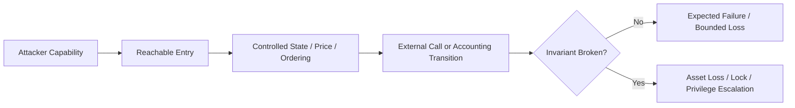
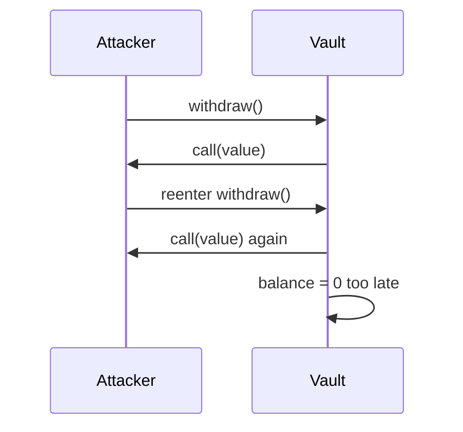
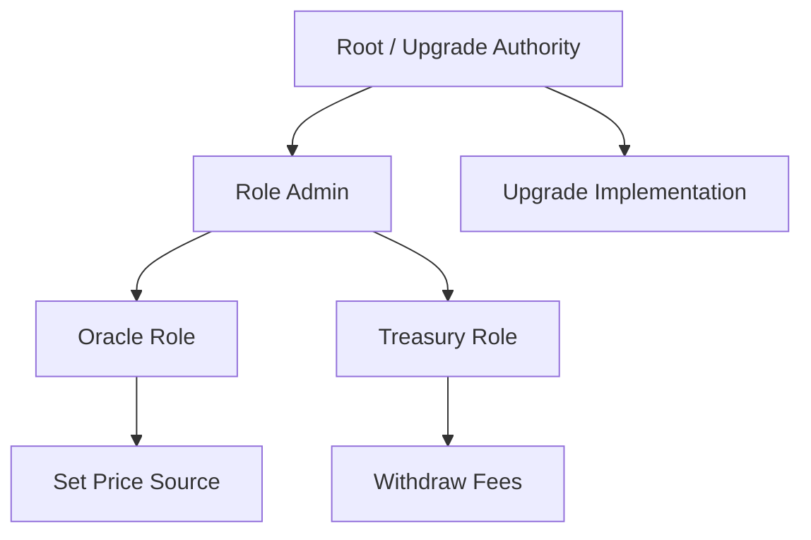
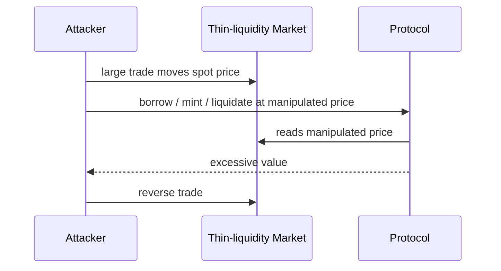
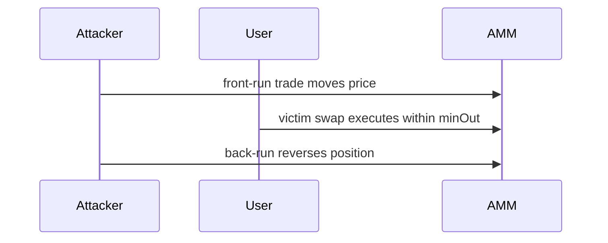
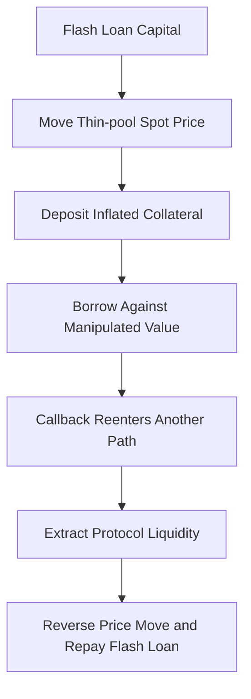

# 智能合约常见漏洞：从重入、权限与价格操纵到任意调用和拒绝服务

> 智能合约漏洞通常不是某条危险语句孤立造成的，而是攻击者在权限、状态、价格、交易排序和外部调用之间找到一条违反协议不变量的路径。安全分析的核心不是背诵“加锁、加权限、用 TWAP”，而是明确攻击者控制什么、何时取得控制权、可以放大多少资本，以及系统失败后资产和状态会落在哪里。

---

## 一、本文解决什么问题

常见漏洞清单很容易产生两种误解：

- 看到 `nonReentrant` 就认为重入问题已经解决；
- 看到 Flash Loan、MEV 或 Oracle 就把所有损失归因于外部环境。

真实攻击通常是多个条件组合：协议使用可操纵 Spot Price，精度舍入偏向攻击者，闪电流动性放大头寸，交易又能在同一区块原子完成。Flash Loan 只是资本来源，根因仍是协议允许瞬时状态决定高价值结果。

本文覆盖大纲中的 14 类风险：

- Reentrancy；
- Cross-function Reentrancy；
- Access Control；
- Integer / Precision；
- Oracle Manipulation；
- Flash Loan Amplification；
- Front-running；
- Sandwich Attack；
- Signature Replay；
- Arbitrary Call；
- Unsafe Delegatecall；
- Denial of Service；
- Forced Ether；
- Unchecked Return Value。

每类风险都围绕五个问题展开：攻击前置条件是什么、关键调用链如何形成、哪些修复只覆盖局部、如何测试、工程上应保留什么监控证据。

本文以 Solidity 0.8.x 与通用 EVM 行为为基础。Gas 规则、Mempool 可见性、交易排序、区块时间、最终性和特定 Opcode 行为会随网络与协议升级变化；生产结论必须在目标链、锁定 Compiler 和实际依赖版本上验证。本文不提供“绝对安全模板”，代码片段只用于说明漏洞结构。

### 核心结论

1. 漏洞的判断标准是协议不变量是否可被破坏，而不是代码中是否出现某个函数或 Opcode。
2. Reentrancy 本质上是外部控制权期间，中间状态被再次观察或修改；单函数锁不能自动覆盖跨函数、跨合约和只读重入。
3. Access Control 要沿授权管理图、代理层和 Logical Sender 追踪；`private`、`tx.origin` 和“只允许 EOA”都不是可靠授权。
4. Solidity 0.8.x 的溢出检查不解决除法截断、舍入方向、单位、Decimal、类型转换和 `unchecked` 风险。
5. Oracle 安全取决于价格来源、时间窗口、流动性、更新频率、Decimal、陈旧检查和失败模式；只读接口不等于可信价格。
6. Flash Loan 是原子借贷工具，通常放大已有经济漏洞，不是独立根因。
7. Front-running 与 Sandwich 来自公开意图和排序权。Deadline 只限制时间，Slippage 只限制成交边界，Commit-Reveal 也有揭示与可用性成本。
8. Signature Replay 必须通过 Domain、Chain、Contract、Action、Nonce、Deadline 和完整参数绑定处理，ECDSA 恢复成功不是完整授权证明。
9. Arbitrary Call 和 Unsafe Delegatecall 会把窄业务权限扩大为通用代码执行或资产控制能力，目标、Selector、Value 和上下文必须受限。
10. DoS 不只来自死循环，还来自单个接收者 Revert、无界数组、Gas Griefing、不可达阈值和永久锁定状态。
11. 合约余额可以被非预期方式增加，不能用严格余额相等作为关键状态机唯一依据。
12. 外部调用的 `success`、Return Data 和业务结果必须同时处理；忽略返回值会让内部状态与外部事实分离。
13. 修复必须结合单元测试、状态化 Fuzz、Invariant、Fork、恶意依赖和失败注入验证。

---

## 二、先建立威胁模型与不变量

漏洞分析可以用一条统一链路表达：



### 2.1 常见攻击者能力

- 创建任意 EOA 和合约；
- 在 Callback 中重入；
- 借入大额短期流动性；
- 观察公开 Mempool 并调整 Gas/排序策略；
- 调用任意公开入口与构造边界参数；
- 部署恶意 Token、Oracle、Receiver、Wallet 或 Plugin；
- 重放已公开签名；
- 利用治理、升级或管理员配置错误；
- 让某些外部调用 Revert 或返回畸形数据。

### 2.2 先写不变量

以 Vault 为例：

- 用户可领取资产不超过其合法债权；
- 总负债不超过可用资产与明确坏账模型；
- 一笔签名 Intent 最多成功执行一次；
- 未授权账户不能改变实现、Oracle 或资产接收方；
- 一次失败外部调用不能被记录为成功结算；
- 暂停后风险增加入口不可达，安全退出仍按设计可达。

没有不变量，团队只能检查“代码风格像不像安全模板”，无法判断跨函数组合是否真的安全。

---

## 三、Reentrancy：外部调用期间再次进入未完成状态

### 3.1 经典结构

```solidity
mapping(address => uint256) public balances;

// 错误示例：先转账，后清零。
function withdraw() external {
    uint256 amount = balances[msg.sender];
    require(amount > 0);

    (bool ok, ) = payable(msg.sender).call{value: amount}("");
    require(ok);

    balances[msg.sender] = 0;
}
```

接收合约在 Receive/Fallback 中再次调用 `withdraw()`，此时余额仍未清零，可重复提款。



### 3.2 CEI 修复

```solidity
function withdraw() external {
    uint256 amount = balances[msg.sender];
    require(amount > 0);

    balances[msg.sender] = 0;

    (bool ok, ) = payable(msg.sender).call{value: amount}("");
    require(ok);
}
```

若外部调用失败并 Revert，清零也随整笔交易回滚。CEI 让回调看到已提交的内部状态，但它仍需结合完整不变量判断。

### 3.3 重入入口不只原生资产发送

- ERC-721/1155 Receiver Hook；
- ERC-777 或其他 Token Hook；
- Flash Loan Callback；
- Oracle/Strategy 外部调用；
- 任意 Protocol Callback；
- Proxy/Module 调用；
- 恶意 Token 的 `balanceOf`、`transfer` 或 `approve`。

任何把控制权交给不可信代码的外部调用都应视为潜在重入点，包括看似 `view` 的接口。

### 3.4 防护组合

- Checks-Effects-Interactions；
- Reentrancy Guard；
- Pull over Push；
- 显式状态机；
- 缩小外部调用表面；
- Callback 来源和 Request ID 校验；
- 跨函数不变量测试。

依赖固定 2300 Gas 防重入不是稳定方案，Gas 成本和接收方架构会变化，也会破坏智能账户兼容。

---

## 四、Cross-function Reentrancy：从另一个入口破坏共享不变量

单个函数加锁后，攻击者可能在 Callback 中进入另一个未加锁函数。

```solidity
function withdraw(uint256 amount) external nonReentrant {
    require(shares[msg.sender] >= amount);
    _sendAsset(msg.sender, amount); // external interaction
    shares[msg.sender] -= amount;
}

function transferShares(address to, uint256 amount) external {
    require(shares[msg.sender] >= amount);
    shares[msg.sender] -= amount;
    shares[to] += amount;
}
```

如果 `_sendAsset` 回调 `transferShares`，攻击者可能在旧 Share 尚未扣减时转移它，随后提款继续扣减或因不同错误策略造成会计异常。

### 4.1 锁应覆盖共享不变量

不是看到外部调用才给当前函数加锁，而是枚举所有读写同一资产、Share、债务或价格状态的入口，决定哪些不能重叠执行。

### 4.2 Cross-contract Reentrancy

Vault、Strategy、Controller 分布在多个合约中时，一个合约的锁不保护另一个合约。若它们共同维护“总资产 = Vault 余额 + Strategy 头寸”，Callback 可能观察或修改中间状态。

### 4.3 Read-only Reentrancy

攻击者不一定直接改状态。外部协议可能在你的迁移中间调用 `getPrice()` 或 `totalAssets()`，读取暂时不一致值并据此结算。原函数最终成功也不代表外部协议没有基于中间状态产生损失。

### 4.4 测试方式

- 恶意 Receiver 在每个 Callback 中枚举全部外部入口；
- 让另一个协议在中间状态读取价格/份额；
- 检查所有路径结束后资产负债与份额不变量；
- 对多个模块做统一 Handler 状态化 Fuzz，而不是逐合约孤立测试。

---

## 五、Access Control：身份、能力和管理图错误

### 5.1 常见错误

- 敏感函数完全没有 Modifier/检查；
- `initialize()` 可被任意账户抢先调用；
- Upgrade/Oracle/Treasury 权限授予错误；
- Role Admin 可以给自己授予高风险 Role；
- 使用 `tx.origin`；
- 信任任意 Forwarder 附带的 Sender；
- Proxy Admin、Implementation Owner 与业务 Owner 混淆；
- 一个万能管理员拥有升级、暂停和资产转移；
- 权限轮换后旧签名或待执行操作仍有效。

### 5.2 `private` 不是访问控制

`private` 仅限制 Solidity 源码层访问，不阻止链上读取 Storage，也不保护由公开函数间接触达的逻辑。

### 5.3 `tx.origin` 不是授权身份

攻击合约可以诱导用户调用，再由攻击合约进入受害合约；此时 `tx.origin` 仍是用户。它也破坏 Multisig、Smart Account 和 Timelock 的组合性。

### 5.4 授权图



能授予下游 Role 的主体，应按下游最大能力评级。审计不能只看谁能直接调用 `withdrawFees()`。

### 5.5 修复原则

- Least Privilege；
- 管理权与业务权分离；
- 多签和必要 Timelock；
- 两阶段所有权/角色交接；
- 参数、额度、目标和时间边界；
- 事件与链下监控；
- 部署后链上验权。

---

## 六、Integer / Precision：溢出之外的数值安全

Solidity 0.8.x 默认对普通整数加减乘执行溢出/下溢检查，但数值漏洞远未消失。

### 6.1 整数除法截断

```solidity
uint256 shares = assets * totalShares / totalAssets;
```

除法向零截断。舍入损失由谁承担取决于公式顺序和操作方向。Deposit、Mint、Withdraw、Redeem 往往需要不同舍入方向，不能统一“向下更安全”。

### 6.2 先除后乘

```solidity
// 精度损失可能很大。
uint256 fee = amount / 10_000 * feeBps;

// 常见改进，但仍需检查乘法范围与舍入策略。
uint256 fee2 = amount * feeBps / 10_000;
```

复杂场景应使用经过验证的全精度乘除库，不能手写宽位中间值算法后假设正确。

### 6.3 Decimal 与单位

- Token Decimal；
- Oracle Decimal；
- BPS、Wad、Ray；
- 秒、区块数；
- Asset 与 Share 单位；
- USD 与 Token Quote。

类型都是 `uint256` 不代表单位相同。变量名、接口和测试必须表达单位。

### 6.4 类型转换

向较小整数或地址等类型转换可能截断高位，具体行为应按 Solidity 版本规则理解并显式检查范围：

```solidity
if (amount > type(uint128).max) revert AmountTooLarge();
uint128 storedAmount = uint128(amount);
```

### 6.5 `unchecked`

`unchecked` 可减少特定已证明安全算术的检查成本，但它恢复环绕语义。循环计数器、Nonce、累计金额和边界减法使用前必须证明范围，并通过 Fuzz/Invariant 验证。

### 6.6 精度攻击

攻击者会选择尘埃、首次存款、极端总供应、重复小额操作等输入，让每次舍入都朝自己有利方向累计。测试不能只覆盖“正常金额”。

---

## 七、Oracle Manipulation：价格接口不是价格真实性

协议若用可操纵价格决定抵押、铸币、清算或奖励，攻击者可以先改变价格，再触发高价值状态迁移。



### 7.1 Spot Price 风险

单池即时储备或当前 Tick 可能被一笔大额交易改变。操纵成本取决于流动性、费用、价格范围和可在同交易恢复的程度。

### 7.2 Oracle 检查维度

- 来源和市场深度；
- Spot、TWAP 或聚合方式；
- 更新时间与 Staleness；
- Heartbeat；
- Decimal 与报价方向；
- Deviation Threshold；
- L2 Sequencer/网络状态（适用时）；
- 多源一致性；
- 价格为零、负语义或异常范围；
- Oracle 合约升级与权限。

具体 Feed 字段和语义因提供方、版本和网络而异，必须查目标文档。

### 7.3 TWAP 不是自动安全

TWAP 提高持续操纵成本，但窗口过短、流动性太薄、采样错误或目标市场可长期控制时仍可能被操纵。窗口越长，响应真实价格变化越慢，清算风险也可能增加。

### 7.4 Failure Mode

Oracle 异常时系统应如何：

- Fail Closed：暂停新增风险；
- 使用上次可信值，但限制时长与动作；
- 切换预先批准备用源；
- 仅允许偿还/退出；
- 拒绝清算，避免错误价格伤害用户。

没有通用最优策略，必须结合协议负债和市场风险。

---

## 八、Flash Loan Amplification：瞬时资本放大既有缺陷

Flash Loan 允许在同一交易借入资产并在交易结束前归还，否则整笔交易 Revert。它使攻击者无需长期持有资本即可放大：

- Spot Price 操纵；
- Governance 快照缺陷；
- Reward/Share 舍入；
- 清算与抵押估值错误；
- 薄流动性市场冲击；
- 单区块余额依赖。

### 8.1 不要把“禁合约调用”当修复

使用 `tx.origin`、代码长度检查或只允许 EOA 会破坏组合性，也不能可靠阻止复杂账户和中间调用。正确修复是让协议在任何可获得资本规模下仍满足经济不变量。

### 8.2 核心问题

问自己：如果攻击者在一个交易中暂时拥有接近市场全部可借流动性，会发生什么？

- 投票权能否立刻生效？
- 存款后能否立刻领取历史奖励？
- 价格能否由攻击者自己的交易决定？
- Share 是否按瞬时余额计算？
- 同区块借入、操作、退出是否产生无风险收益？

### 8.3 防护

- 可靠 Oracle 和时间窗口；
- 治理投票快照与延迟；
- 奖励按时间积分而非瞬时余额；
- 最小持有期需谨慎评估可用性与绕过；
- 经济 Invariant 和大资本仿真；
- 多市场/多协议组合 Fork 测试。

Flash Loan 让测试更容易构造极端资本，应成为安全测试工具，而不只是攻击标签。

---

## 九、Front-running：公开意图与交易排序

用户交易进入公开交易传播环境后，其他参与者可能观察其参数并提交更有利排序的交易。具体可见性和排序机制因链、Builder 与私有通道而异。

### 9.1 常见场景

- 抢先注册名称或领取唯一资源；
- 抢先提交公开 Permit/签名；
- 抢先执行可获奖励的清算；
- 复制套利交易；
- 在治理/拍卖中根据公开报价行动；
- 抢先初始化未初始化 Proxy。

### 9.2 Deadline 不能防抢跑

Deadline 只限制交易最晚执行时间，在有效期内仍可被排序。它应与 Slippage、Nonce、Commit-Reveal 或身份绑定组合。

### 9.3 Commit-Reveal

用户先提交 Commitment Hash，之后揭示原文。它可以隐藏意图直到 Reveal，但带来：

- 两笔交易；
- Reveal 阶段可用性；
- 用户不揭示的处理；
- Commitment 必须包含 Sender、Salt、Chain、Contract 和完整参数；
- Reveal 本身仍可能被复制，必须绑定提交者。

### 9.4 抢跑不总是漏洞

公开清算竞争可能是协议预期机制。漏洞在于排序能让攻击者违反公平性、窃取用户 Intent 或突破资产不变量，而协议没有明确接受这一属性。

---

## 十、Sandwich Attack：围绕用户交易的前后夹击

Sandwich 通常发生在 AMM 交易：攻击者在用户交易前把价格推向不利方向，用户在允许的 Slippage 内成交，攻击者随后反向交易获利。



### 10.1 前置条件

- 用户 Intent 可观察；
- 交易允许足够 Slippage；
- 池深和手续费使夹击有利润；
- 攻击者可影响排序；
- 用户没有价格保护或私有执行路径。

### 10.2 防护与代价

- 合理 `amountOutMin`/最大输入；
- 短但可用的 Deadline；
- Quote 新鲜度与 Price Impact 提示；
- Batch Auction/Intent-based Execution 等不同市场机制；
- 私有交易通道，但需引入新的信任与可用性假设；
- 限价订单；
- 拆单可能减少单笔冲击，也可能增加暴露时间和费用。

设置极低 Slippage 会增加正常波动下 Revert，不能把所有 MEV 成本归零。协议和前端应让用户看到保护参数，而不是隐藏默认值。

### 10.3 Oracle 与 Sandwich 的区别

Sandwich 主要从用户成交滑点中获利；Oracle Manipulation 则利用价格读数影响另一个协议的高价值决策。一次攻击可能同时包含两者，但修复点不同。

---

## 十一、Signature Replay：有效签名被用在错误上下文或重复使用

### 11.1 不完整签名

```solidity
// 错误示意：只签接收者和金额。
bytes32 digest = keccak256(abi.encode(to, amount));
```

如果没有绑定 Chain、Contract、Action、Nonce 和 Deadline，同一签名可能：

- 在另一条链使用；
- 在同链另一个合约使用；
- 重复执行；
- 被用于另一个语义相近的函数；
- 在权限或价格已变化后长期使用。

### 11.2 安全域

结构化授权通常绑定：

- Domain/协议名与版本；
- Chain ID；
- Verifying Contract；
- Action Type；
- Signer、Receiver 和必要参与者；
- 完整参数；
- Nonce/Intent ID；
- Deadline；
- 必要时配置或版本标识。

具体 EIP-191/EIP-712 编码和签名验证将在签名安全专题展开，这里重点是重放边界。

### 11.3 标记消费的时机

签名验证和前置条件通过后，应在不可信外部调用前消费 Nonce/Intent。若后续未捕获的 Revert 发生，消费状态随交易回滚；如果捕获失败并保留部分状态，必须明确是否允许重试。

### 11.4 合约签名

ERC-1271 合约账户的签名有效性可能随状态变化。即使 Wallet 返回有效，业务协议仍需自己的 Nonce 和 Domain，不能把钱包验证当作一次性授权证明。

### 11.5 签名不是秘密

链下签名一旦交给 Relayer、前端或公开交易，就应假设任何人可见。安全性应来自参数绑定，而不是“只有预期提交者能看到”。

---

## 十二、Arbitrary Call：把业务入口变成通用执行器

```solidity
// 高风险示例：授权账户可以调用任意目标和数据。
function execute(address target, uint256 value, bytes calldata data)
    external
    onlyOperator
    returns (bytes memory)
{
    (bool ok, bytes memory result) = target.call{value: value}(data);
    if (!ok) revert CallFailed();
    return result;
}
```

这一能力可能允许 Operator：

- 转移合约全部原生资产；
- 调用 Token `approve` 授予自己额度；
- 调用受信任协议中的高风险入口；
- 修改外部模块配置；
- 借助 Callback 重入；
- 调用恶意目标返回畸形数据。

### 12.1 为什么 `onlyOwner` 仍不够

如果 Owner 密钥泄露，任意调用等同协议完全接管。即使 Owner 是多签，也应让签名者看到可读 Target、Selector、Value 和参数，并通过 Timelock 约束高风险动作。

### 12.2 缩小能力

- Target Allowlist；
- Selector Allowlist；
- 禁止或限制 Value；
- 参数范围和资产额度；
- 每日累计限额；
- 禁止调用自身、Proxy Admin 或关键 Token Approve；
- Intent Hash 与治理提案绑定；
- 一次性、可过期 Capability；
- 事件记录完整操作摘要。

Allowlist 目标若可升级，仍可能在地址不变时变成恶意代码，应监控 Implementation。

### 12.3 返回值与授权副作用

调用成功不代表业务目标达成。例如 Token 可能返回 False，或目标 Fallback 静默成功。执行器必须按已允许接口解析返回值，不能对任意 Target 采用统一“success 即成功”。

---

## 十三、Unsafe Delegatecall：让外部代码改写自己的状态

`delegatecall` 在调用者 Storage、地址和余额上下文中执行目标代码。若目标可由用户控制，攻击者代码可以覆盖 Owner、Implementation Slot、余额映射或自毁/破坏逻辑，具体影响取决于目标 EVM 规则和上下文。

```solidity
// 致命示例：用户决定执行哪段代码。
function run(address plugin, bytes calldata data) external {
    (bool ok, ) = plugin.delegatecall(data);
    require(ok);
}
```

### 13.1 Storage Layout 必须一致

即使 Target 是可信 Library，若它按不同 Slot 解释状态，也会写坏调用者。代理、Diamond 和模块系统必须固定 Storage Schema 或 Namespaced Slot。

### 13.2 Caller 语义

Delegatecall 保留外层调用者语义，目标代码中的权限检查可能看到原始用户，而不是主合约。插件若假设只有主合约调用，可能出现权限错误。

### 13.3 安全边界

- 目标只能来自治理批准的不可变/验证实现；
- 校验 Runtime Code Hash 和实现类型；
- Storage Namespace 清晰；
- 禁止用户任意传 Target；
- 审计所有 Selector 与初始化路径；
- 限制模块能触达的资产和权限；
- 升级经过多签、Timelock 和 Layout Diff。

### 13.4 `delegatecall` 不是代码复用捷径

普通 Library、继承和外部 `call` 已能满足大量复用需求。只有确实需要共享调用者 Storage 的架构才应使用 Delegatecall。

---

## 十四、Denial of Service：让合法用户无法推进

DoS（Denial of Service，拒绝服务）在链上通常表现为关键状态迁移永久或长期无法执行。

### 14.1 Push Payment 阻塞

```solidity
for (uint256 i = 0; i < recipients.length; i++) {
    (bool ok, ) = recipients[i].call{value: amounts[i]}("");
    require(ok);
}
```

任一接收者 Revert，整批支付失败。使用 Pull Payment 可隔离接收方，但会增加领取交易与负债管理。

### 14.2 无界循环

数组随用户增长，最终操作超过 Block Gas Limit，清算、分红或 Migration 永远无法完成。应采用：

- 分页/批次；
- Pull 模式；
- 累计指数而非遍历账户；
- 有界集合；
- 可重试 Cursor。

### 14.3 Gas Griefing

攻击者让外部调用消耗大量 Gas、返回巨大数据或故意选择昂贵路径，使上层交易失败或成本异常。调用方需要限制外部依赖、返回数据处理和批次规模；简单固定 Gas 也可能导致兼容性问题。

### 14.4 状态机锁死

- 唯一管理员地址失效；
- 必须由已被制裁/冻结 Token 地址行动；
- Threshold 永远无法达到；
- Deadline 条件出现空洞；
- Pause 后没有恢复者；
- Migration 中途失败却没有重试；
- 最后一个 Role Admin 被撤销。

DoS 防护不仅是 Gas 优化，还要设计 Timeout、Cancellation、替代执行者和恢复路径。

### 14.5 DoS 与失败隔离的取舍

Best-effort 批处理可以跳过失败项，但会产生部分完成状态；All-or-nothing 保持原子性，却容易被单点阻塞。方案必须根据资产会计和重试语义选择。

---

## 十五、Forced Ether：合约不能完全控制自己的余额

即使合约没有 Payable Receive/Fallback，也不能绝对假设原生资产余额只会通过受控入口增加。EVM 和协议机制可能使资产在不执行目标接收逻辑的情况下到达某地址；具体方式和语义会随 EVM 升级变化。

### 15.1 错误不变量

```solidity
// 风险：外部额外余额可能让状态机永久无法满足严格等式。
require(address(this).balance == totalDeposits);
```

攻击者强制增加余额后，严格等式失效，关键操作可能 DoS。

### 15.2 使用内部会计

协议应以显式账本记录用户存款和负债，把实际余额视为资产容器：

```text
actual balance >= accounted liabilities
```

是否允许小于、如何处理坏账和额外余额取决于协议。额外余额不应自动归属最后一个用户或触发敏感状态。

### 15.3 不要用余额判断是否“首次调用”

`address(this).balance == 0` 不是可靠初始化标记。使用显式 Bool、Version 或状态枚举。

### 15.4 ERC-20 也可能意外转入

任何人通常可以把 Token 直接转到合约，绕过 Deposit 入口。合约不能仅凭 Token Balance 推导所有用户份额，应有内部会计与明确 Rescue/Surplus 规则。

---

## 十六、Unchecked Return Value：调用成功与业务成功不是一回事

### 16.1 忽略低级调用结果

```solidity
// 错误示例。
target.call(data);
processed[id] = true;
```

外部调用失败后，内部仍记录为已处理，状态与外部事实分离。

### 16.2 只检查 `success` 仍可能不够

```solidity
(bool ok, bytes memory result) = token.call(data);
require(ok);
```

Token 可能成功返回编码后的 `false`。目标地址也可能没有预期函数，而 Fallback 静默成功。对已知接口应使用类型化调用或成熟安全封装，并验证返回语义。

### 16.3 Solidity 高级调用

高级接口调用通常在目标 Revert 或返回数据无法 ABI 解码时 Revert，但目标业务返回值仍需应用代码检查。例如函数返回 `bool` 时，不读取它就可能忽略业务失败。

### 16.4 `send` 与 Transfer

原生资产发送 API 的 Gas 和失败语义不同。现代实现常使用 `call{value: amount}("")` 并检查 Bool，同时通过 CEI、锁或 Pull Payment 处理重入。不要依赖某个固定 Gas 假设作为永久安全边界。

### 16.5 捕获错误后的状态

`try/catch` 允许外部失败后继续执行，但必须明确：

- 操作是否标记失败、待重试或完成；
- 已更新 Effects 是否应该保留；
- 资产是否仍有唯一归属；
- Event 是否准确反映部分失败；
- 重试是否幂等。

吞掉错误不是容错，只有显式失败状态机才是。

---

## 十七、多漏洞组合：一次价格操纵攻击如何形成

考虑一个错误借贷协议：

1. 使用薄流动性池 Spot Price；
2. 允许同交易存入抵押并借款；
3. Share 换算存在有利舍入；
4. 没有借款上限和价格偏差检查；
5. 外部 Token Callback 可重入另一个借款入口。



把事故称为“Flash Loan Attack”会掩盖真正修复点：Oracle、状态机、借款额度、舍入和跨函数重入都必须修复。只封禁某个 Flash Loan Provider 不会阻止攻击者从其他流动性来源筹资。

---

## 十八、工程化防护矩阵

| 风险 | 主要不变量 | 核心防护 | 常见伪修复 |
|---|---|---|---|
| Reentrancy | 同一债权不能重复消费 | CEI、锁、Pull、状态机 | 只换 `transfer`/固定 Gas |
| Cross-function | 共享会计在全部入口一致 | 统一锁域、跨模块 Invariant | 只给一个函数加锁 |
| Access Control | 仅授权能力可达 | 最小权限、多签、Timelock | `tx.origin`、只允许 EOA |
| Integer/Precision | 资产守恒、舍入有界 | 单位、全精度数学、边界 Fuzz | 只依赖 0.8 溢出检查 |
| Oracle | 决策价格在威胁模型内可信 | TWAP/多源、陈旧/偏差检查 | 只换成 `view` Oracle |
| Flash Loan | 瞬时资本不破坏经济模型 | 时间/快照/限额/可靠价格 | 禁合约调用 |
| Front-running | Intent 不能被窃取或改序获利 | 绑定、Commit-Reveal、私有路径 | 只加 Deadline |
| Sandwich | 用户成交不劣于边界 | Slippage、限价、机制设计 | 固定宽松默认滑点 |
| Replay | 授权最多按域使用一次 | Domain、Nonce、Deadline | 只验证 Signer |
| Arbitrary Call | Operator 能力有限 | Target/Selector/Value/额度限制 | 只加 `onlyOwner` |
| Delegatecall | 仅可信兼容代码改写状态 | Code Hash、Layout、治理 | 用户传插件地址 |
| DoS | 关键状态始终可推进 | Pull、批次、Timeout、恢复 | 无界遍历 |
| Forced Ether | 外部余额不控制业务状态 | 内部会计、显式状态 | 严格 Balance 等式 |
| Return Value | 外部事实与内部状态一致 | 检查 Bool/Data、失败状态机 | 只检查低级 `success` |

---

## 十九、测试与验证方法

### 19.1 单元测试不只测成功路径

每个敏感入口覆盖：

- 错误状态、Caller、金额和 Deadline；
- 零值、最大值、尘埃和 Decimal；
- 外部 Revert、False、空数据和畸形数据；
- 重复调用、重试和乱序调用；
- Pause、Upgrade 和 Role Rotation 后行为。

### 19.2 Stateful Fuzz 与 Invariant

随机组合 Deposit、Withdraw、Borrow、Repay、Transfer、Callback、Time Warp 和 Price Change，持续断言：

- 资产负债关系；
- 债权最多消费一次；
- 非授权权限不可达；
- 签名 Nonce 单调或唯一消费；
- 终态不可重新开放；
- 外部失败不会被记录为成功。

### 19.3 恶意依赖合约

准备：

- 重入 Receiver；
- 返回 False/空/畸形数据的 Token；
- Fee-on-transfer/Rebase Token；
- 可操纵 Oracle；
- Revert 或高 Gas Callback；
- 恶意 ERC-1271 Wallet；
- 任意 Delegatecall Plugin；
- Fallback 静默成功目标。

### 19.4 Fork 与经济仿真

在固定目标链 Block 上使用真实池深、Token、Oracle、Proxy 和借贷市场，构造大资本与 Flash Loan 场景。记录：

- 操纵成本与可提取价值；
- Slippage 与手续费；
- Oracle 窗口和更新时间；
- 清算/借款限额；
- 交易排序假设；
- 攻击后协议负债。

不要把一次 Fork 未获利当成数学上永远安全，市场深度和参数会变化。

### 19.5 静态与动态工具

- Static Analyzer 发现危险调用、权限和未检查返回值；
- Fuzzer 探索参数与调用序列；
- Symbolic Execution/Model Checking 验证有限模型性质；
- Storage/Upgrade 工具检查布局和初始化；
- Trace 分析真实调用帧、Return Data 和状态变化。

工具输出是线索，不是自动审计结论。误报需要解释，未报也不证明无业务漏洞。

### 19.6 生产监控

- 实现、Owner、Role、Oracle 和 Pause 变化；
- 大额借贷、铸造、赎回和异常利润；
- 价格偏差、陈旧与低流动性；
- 重复失败和 Gas 异常；
- 签名 Nonce、Relayer 和 Forwarder 异常；
- 合约实际余额与内部负债差；
- 关键外部调用失败率。

监控不能阻止同交易原子攻击，但可缩短持续攻击和治理泄露的响应时间。

---

## 二十、审查清单

- [ ] 已定义资产、权限、价格、签名和状态机不变量。
- [ ] 所有外部调用点及 Callback 入口已枚举。
- [ ] Reentrancy Guard 覆盖共享不变量，而非单个函数名称。
- [ ] 所有敏感函数和 Role Admin 关系已审查。
- [ ] 未使用 `tx.origin` 或脆弱 EOA 检查授权。
- [ ] 数学公式标注单位、Decimal 和舍入方向。
- [ ] 类型缩窄与 `unchecked` 有显式范围证明。
- [ ] Oracle 检查来源、流动性、陈旧、偏差和失败模式。
- [ ] 经济模型在大额瞬时资本下仍成立。
- [ ] 用户交易具有 Slippage、Deadline 和必要的 Intent 保护。
- [ ] 签名绑定 Chain、Contract、Action、Nonce 和完整参数。
- [ ] 任意 Call/Delegatecall 已被移除或严格约束。
- [ ] 循环、批量和支付不会被单个参与者永久阻塞。
- [ ] 业务状态不依赖严格实际余额等式。
- [ ] 所有外部返回值和 Return Data 都有明确处理策略。
- [ ] `try/catch` 后存在显式失败与重试状态。
- [ ] 恶意依赖、状态化 Fuzz、Invariant 和 Fork 测试均通过。
- [ ] 生产监控和暂停/恢复 Runbook 已演练。

---

## 二十一、总结

常见漏洞可以归结为几类控制边界失效：

1. Reentrancy 让外部代码在不变量尚未恢复时再次进入，跨函数和跨合约场景尤其容易漏检。
2. Access Control 决定谁能改变高风险状态，必须沿 Role Admin、Proxy 和转发身份完整追踪。
3. Integer/Precision 与 Oracle 决定协议如何度量价值，溢出检查和函数 `view` 都不能保证经济正确。
4. Flash Loan、Front-running 和 Sandwich 利用资本与排序放大可观察缺陷，修复点在协议经济和 Intent 保护。
5. Signature Replay 利用有效授权缺少域和一次性约束，签名恢复成功只是验证起点。
6. Arbitrary Call 与 Unsafe Delegatecall 会把有限权限升级为通用执行能力，必须最小化目标和上下文。
7. DoS、Forced Ether 和 Unchecked Return Value 会让状态机无法推进或把失败误记为成功。
8. 单项模板只能覆盖局部，最终安全性必须由跨入口 Invariant、恶意依赖和真实链状态验证。

审计不是寻找一份固定漏洞清单，而是持续追问：攻击者在哪个调用帧获得控制权、哪些值可以被瞬时改变、哪个失败被错误吞掉，以及这些条件组合后是否能让资产、权限或状态失去唯一解释。

---

## 问答复盘

### Q1：为什么加了 `nonReentrant` 仍可能存在重入漏洞？

**答：** 锁可能只覆盖一个入口，而 Callback 可以进入另一个共享状态函数或另一个合约；只读重入还可能让外部协议观察中间状态。

### Q2：Solidity 0.8.x 是否已经消除整数漏洞？

**答：** 没有。它默认检查普通算术溢出，但除法截断、舍入方向、单位、Decimal、类型缩窄和 `unchecked` 仍需专项设计。

### Q3：Flash Loan 为什么通常不是漏洞根因？

**答：** 它提供同交易大额资本，放大可操纵价格、瞬时余额、治理或舍入缺陷。协议若在任意资本规模下保持不变量，Flash Loan 本身无法制造漏洞。

### Q4：TWAP 是否一定比 Spot Price 安全？

**答：** 不一定。它提高持续操纵成本，但安全性仍取决于窗口、流动性、采样、真实价格响应和目标市场是否可长期控制。

### Q5：Deadline 能否阻止 Front-running 或签名重放？

**答：** 不能单独阻止。Deadline 只限制有效时间；抢跑需要 Intent/排序保护，重放需要 Domain 和 Nonce/Consumed 状态。

### Q6：`onlyOwner` 为什么不足以保护任意调用函数？

**答：** Owner 泄露或误签会获得通用资产和代码执行能力。还应限制 Target、Selector、Value、参数、额度和有效时间，并使用多签与 Timelock。

### Q7：为什么不能用 `address(this).balance == totalDeposits` 作为关键不变量？

**答：** 实际余额可能被非预期增加，严格等式会被破坏并造成 DoS。业务应使用内部会计，并单独处理 Surplus。

### Q8：低级调用返回 `success == true` 是否说明 Token 转账成功？

**答：** 不一定。Token 可能编码返回 `false`，目标也可能由 Fallback 静默成功。必须按已知接口验证 Return Data 或使用成熟安全封装。

### Q9：如何测试 Cross-function Reentrancy？

**答：** 让恶意 Callback 枚举所有共享余额、Share、债务和价格状态的外部入口，并在随机调用序列后检查跨模块资产与唯一消费不变量。

### Q10：一次漏洞修复应如何证明有效？

**答：** 先明确被破坏的不变量，再构造原攻击和变体，结合负向单测、状态化 Fuzz、恶意依赖、Fork 经济仿真和升级后回归证明攻击路径被关闭且未引入锁死或会计回归。

---

## 延伸知识

- **签名安全**：EIP-191、EIP-712、Domain Separation、Malleability 与跨链重放。
- **Oracle 安全**：TWAP、Medianizer、Heartbeat、Deviation、Sequencer Feed 与多源降级。
- **审计方法**：Threat Modeling、Entry Point、Trust Boundary、Invariant、Fuzz 与 Fork Test。
- **应急响应**：Pause、Guardian、Timelock Cancel、资产核对与事后分析。
- **MEV**：Builder、Private Orderflow、Back-running、Intent 和 Batch Auction。
