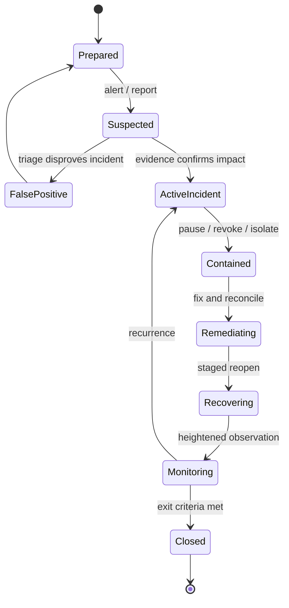
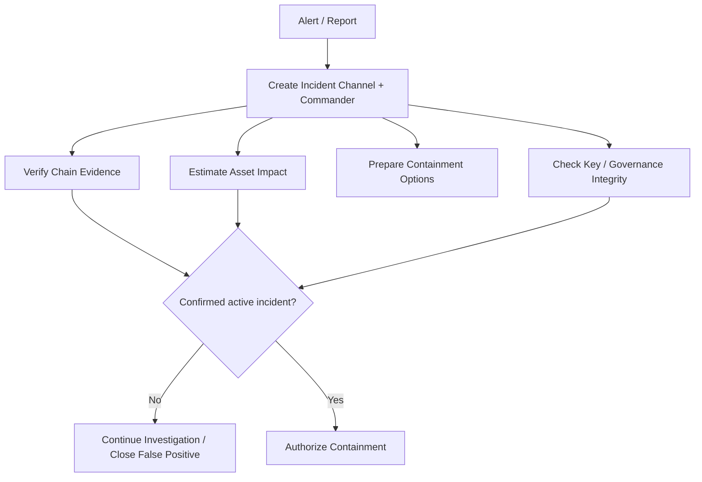
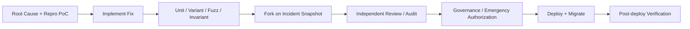

# 智能合约应急响应：从监控、暂停与密钥泄露到恢复和复盘

> 链上事故响应不是“发现漏洞后升级合约”。攻击可能在同一交易完成，暂停交易可能被抢跑，管理员密钥可能正是攻击入口，跨链和链下系统又不会随源链操作原子停止。成熟响应体系必须在事故发生前定义监控、分级、权限、通信、恢复和证据流程，并让每个紧急动作都具有最小影响范围、清晰授权和可验证退出条件。

---

## 一、本文解决什么问题

智能合约事故可能来自：

- 业务逻辑漏洞与重入；
- Oracle 操纵或数据陈旧；
- Upgrade/Admin/Signer Key 泄露；
- 错误升级、初始化或参数配置；
- Bridge、Token、Keeper 等外部依赖故障；
- Sequencer、RPC、Indexer 和 Relayer 中断；
- 治理提案或 Timelock Operation 异常；
- 用户误授权、前端供应链攻击或钓鱼；
- 经济攻击和持续套利。

事故发生后，团队通常同时面对不完整信息和不可逆交易：

- 是真实攻击、正常大额交易还是监控误报？
- 暂停全部功能会不会把用户资金永久锁住？
- Guardian 是否有权暂停，但无权恢复？
- Timelock 延迟会不会让漏洞继续被利用？
- 紧急绕过 Timelock 是否等价于永久超级管理员？
- 密钥泄露后，攻击者是否已排队升级或收集离线签名？
- 链上该发什么信号，如何避免虚假官方消息？
- 何时通知用户，哪些事实尚未确认？
- 能否冻结、追回或迁移资金，谁有权决定？
- 恢复前怎样证明漏洞关闭且会计一致？
- Postmortem 如何做到可验证而不是公关总结？

本文覆盖：

- Monitoring；
- Pause；
- Guardian；
- Timelock Bypass 边界；
- Key Compromise；
- Incident Triage；
- On-chain Communication；
- User Notification；
- Fund Recovery 边界；
- Postmortem。

本文讨论工程与技术响应，不构成法律、合规、执法或资产追回建议。冻结、协商、白帽救援、交易所协调和用户赔付涉及司法辖区、合同、治理授权和第三方政策，必须由有权限的专业团队评估。任何链上动作都应先确认权限和影响，不能因“紧急”而默认获得任意处置用户资产的授权。

### 核心结论

1. 事故响应能力必须在部署前设计和演练；攻击发生后临时创建权限通常太慢或本身不可信。
2. Monitoring 应围绕资产、权限、价格、升级和状态不变量，而不只是交易失败率。
3. Pause 应优先阻止新增风险，并尽量保留偿还、取消和安全退出；Global Pause 可能扩大损害。
4. Guardian 适合快速执行可逆、收缩能力的动作，不应默认拥有任意升级、任意调用或资产转移权。
5. Timelock Bypass 只有在动作、目标、时限和后续治理都严格受限时才可能合理；无约束旁路就是无延迟超级管理员。
6. Key Compromise 响应不仅轮换链上 Role，还要处理 Multisig Signer、待执行操作、离线签名、Allowance、API Key 和部署凭证。
7. Incident Triage 要先确认链、合约、交易、资产和攻击是否持续，再决定止损；未经验证的猜测不能作为高风险链上操作依据。
8. On-chain Communication 提供可验证信号，但不能替代多渠道用户通知，也不能保证所有集成方读取。
9. User Notification 应区分已确认事实、正在调查的假设、用户行动和风险，不应承诺无法保证的追回或恢复时间。
10. Fund Recovery 有技术、授权、法律和公平边界；“能调用”不代表“应当调用”。
11. 恢复必须经过修复验证、Fork、资产核对、权限复核、分阶段开放和持续监控。
12. Postmortem 应给出时间线、根因、控制失效、影响、证据和行动项，并跟踪到真正关闭。

---

## 二、事故响应状态机



关键点：

- Suspected 不等于已确认攻击；
- Contained 不等于漏洞已修复；
- 修复代码部署成功不等于资产和状态已恢复；
- 恢复应允许回到 Active Incident，而不是一次性 `unpause` 后宣布结束。

### 2.1 预先准备的工件

- 合约、Proxy、Implementation、Admin、Oracle 地址簿；
- Role/Multisig/Timelock/Guardian 权限图；
- 资产和协议不变量；
- Pause Matrix；
- 已签名/预构造紧急操作是否允许及安全保管方式；
- Incident Severity 与决策人；
- RPC、Archive、Trace、Simulation 工具；
- 通信渠道和身份验证方式；
- 联系人、时区与值班；
- Fork 恢复脚本与会计核对；
- 证据保全和 Postmortem 模板。

---

## 三、Monitoring：在损失扩大前发现偏离

### 3.1 监控四类信号

| 类别 | 典型信号 | 示例响应 |
|---|---|---|
| 资产 | 异常流出、负债差、巨额铸造 | 冻结新增风险、资产核对 |
| 权限 | Owner/Role/Implementation 变化 | 验证治理路径、取消待执行操作 |
| 市场 | Oracle 偏差、流动性下降、清算激增 | 降额、暂停借款/清算 |
| 可用性 | Revert、RPC/Sequencer/Relayer 故障 | 切换读路径、进入降级模式 |

### 3.2 Invariant Monitoring

生产监控应尽量对应审计不变量：

- 实际资产不少于记账负债（按协议会计定义）；
- 单笔/单区块流出不超过风险阈值；
- Upgrade 只来自治理执行器；
- Oracle Age/Deviation 在范围内；
- Supply、Share、Debt 变化与业务事件一致；
- Bridge Message ID 不重复；
- Pause 状态与允许入口一致。

### 3.3 Event 不是唯一数据源

攻击路径可能：

- 漏发事件；
- 发出合法格式但恶意参数；
- 通过 Proxy/Delegatecall 改变事件来源理解；
- 在 Reorg 后消失；
- 直接改变 Storage 而监控未订阅对应 Event。

应组合 Receipt/Event、Transaction Input、Trace、Storage Read、Code Hash 和余额变化。

### 3.4 告警质量

每条告警至少包含：

- Chain、Block、Transaction Hash；
- 目标合约和 Implementation；
- 触发规则与实际/阈值；
- 涉及资产与估算影响；
- 是否仍在持续；
- 关联治理/升级操作；
- 可复现查询链接或命令；
- 初始 Severity 和 Owner。

“余额变化异常”没有上下文，会浪费最宝贵的响应时间。

### 3.5 监控自身故障

- RPC 断连和跨 Provider 不一致；
- Indexer Lag；
- 重组导致重复/撤销告警；
- 时钟和 Decimal 配置错误；
- 告警渠道不可用；
- 规则部署失败；
- 值班人员未确认。

监控要有健康检查、补扫和演练，不能假设无告警等于无事故。

---

## 四、Incident Triage：先确认事实，再决定动作

### 4.1 首个 15 分钟不是固定 SLA

响应目标应按协议价值、链确认和组织能力制定，不能引用脱离环境的通用分钟数。核心是建立并行工作流：



### 4.2 最小事实集

- 正确 Chain ID 和合约地址；
- 交易是否成功、所在 Block 和当前确认级别；
- Proxy 当前 Implementation/Beacon；
- 资产真实流向和接收地址；
- 调用链、Caller、Calldata、Value；
- 前后关键 Storage；
- 是否可重复、是否仍有可提取资产；
- 攻击者是否拥有权限/密钥；
- Oracle、Token、Bridge 等依赖是否异常；
- 可用 Pause/Guardian/Governance 动作。

### 4.3 Incident Severity

可按以下维度分级：

- 已损失与潜在损失；
- 单用户、单市场、全协议、多链；
- 攻击是否持续和可复制；
- 管理权限是否失陷；
- 资金是否仍可移动；
- 是否影响用户安全退出；
- 是否存在隐私、法律或第三方影响。

Severity 决定审批、通信频率和是否启用紧急权限，但不替代技术判断。

### 4.4 Incident Commander

需要一个明确协调者维护：

- 当前事实与假设；
- 决策记录；
- 工作流 Owner；
- 下一次更新时间；
- 链上交易审批；
- 外部沟通一致性。

Commander 不必是最资深合约工程师，但必须有协调授权，避免多人并行提交冲突交易。

### 4.5 证据保全

- 原始 RPC 响应、Trace 和日志；
- 固定 Block Fork；
- 前端/后端发布版本；
- CI/CD 与签名记录；
- Multisig Proposal/Signature；
- 监控触发时间；
- 通信和决策时间线。

不要为了修复而覆盖唯一日志或轮换掉尚未导出的审计证据。

---

## 五、Pause：快速收缩风险面

### 5.1 Pause Matrix

| 功能 | 事故时默认倾向 | 原因 |
|---|---|---|
| 新增存款/铸造/借款 | 暂停 | 阻止扩大风险 |
| 提高杠杆/跨链发送 | 暂停 | 防止新负债或扩散 |
| 偿还/追加抵押 | 保留 | 通常降低风险 |
| 取消订单 | 保留 | 允许用户降低暴露 |
| 安全提款/赎回 | 视偿付能力保留 | 避免锁死，但防挤兑不变量 |
| 清算 | 按 Oracle/事故类型决定 | 错价清算可能不可逆 |
| Governance/Upgrade | 保留受控路径 | 用于修复，但需防密钥失陷 |

### 5.2 Global Pause 的代价

- 阻止用户自救；
- 让债务继续计息却无法偿还；
- 跨链消息一端停止、一端继续；
- Keeper/清算停机造成坏账；
- 所有市场因单一资产故障停摆；
- 恢复动作本身被 Pause 阻止。

优先使用按功能、市场、资产或模块的局部 Pause。

### 5.3 Pause 检查完整性

必须覆盖：

- 直接入口；
- Batch/Multicall；
- Callback；
- 继承/替代入口；
- Proxy 新实现函数；
- Router/Module；
- 跨链 Receiver；
- Permit/Relayer 路径。

只搜索一个 Modifier 不能证明所有风险路径被封锁。

### 5.4 Pause 交易本身可能失败

- Guardian Gas/Nonce 配置错误；
- RPC/Sequencer 不可用；
- Multisig 阈值不可达；
- Pause 函数 Revert；
- 攻击者抢跑并先升级/撤权；
- Guardian 地址已泄露或撤销；
- Pause 目标地址/Chain 配错。

必须定期在 Fork 和低风险生产路径演练，而不是事故时第一次调用。

### 5.5 恢复比暂停更谨慎

恢复前至少验证：

- 根因修复和变体测试；
- 资产/负债核对；
- Oracle/依赖正常；
- 攻击权限和待执行操作已清除；
- 新实现 Code Hash 与 Artifact；
- 用户状态和 Migration；
- 监控更新；
- 分阶段开放和回退条件。

---

## 六、Guardian：应急角色的最小能力

### 6.1 适合的能力

- 暂停特定高风险入口；
- 降低额度或关闭单个 Market；
- 取消未执行 Timelock Operation；
- 禁用受损 Keeper/Signer/Forwarder；
- 切换到预先批准的安全模式或备用 Oracle；
- 触发链上 Incident 状态。

### 6.2 不应默认拥有

- 任意 Upgrade；
- 任意 Target/Calldata Call；
- 转移用户/国库全部资产；
- 永久冻结且无治理恢复；
- 给自己授予新 Role；
- 绕过全部 Timelock 修改经济参数。

### 6.3 不对称权限

Guardian 快速“关”，Governance 慢速“开”；Guardian 可降低上限，不能提高；可选择预批准备用源，不能输入任意价格。这让密钥泄露后的攻击上限更小。

### 6.4 Guardian 形态

- Hardware Wallet EOA：简单快速，单密钥风险；
- 独立 Multisig：降低单点，协调稍慢；
- 自动化合约：响应快，误报/Oracle 风险；
- 多层 Guardian：不同 Severity 使用不同门槛。

自动化 Guardian 应限制触发条件和动作，并允许人工复核/恢复。监控异常不应直接触发任意资产操作。

### 6.5 轮换和失效

定期验证 Guardian：

- 地址、Signer 和阈值；
- 硬件与备份；
- Role 仍有效；
- 交易模拟和 Gas；
- 人员可达性；
- 旧 Guardian 已撤销；
- 已签交易/Module 权限已清理。

---

## 七、Timelock Bypass 边界：紧急不是无限授权

Timelock 给用户和监控者留下审查、取消和退出时间，但严重漏洞可能在延迟结束前持续被利用。因此一些系统设计 Emergency Path。

### 7.1 三种模式

1. **无 Bypass**：先 Guardian Pause，修复升级仍走 Timelock；
2. **受限 Bypass**：仅允许预定义动作/实现集合；
3. **通用 Bypass**：特定主体可立即任意升级或调用。

第三种本质上是无延迟超级管理员，应按全部资产接管风险披露和治理。

### 7.2 受限旁路可以如何约束

- 只能 Pause/降低额度；
- 只能切换到预先部署、验证和 Allowlist 的 Implementation；
- 只能选择已登记 Oracle；
- 无法改变资产接收方；
- 额度和有效时间受限；
- 多个独立 Guardian/委员会阈值；
- 必须发出专用事件；
- 使用后自动进入冻结/复核状态；
- 后续治理在规定窗口内 Ratify 或回退。

### 7.3 预批准 Implementation 的边界

提前部署和审计 Emergency Implementation 可以缩短修复时间，但：

- 可能已过时或与当前 Storage 不兼容；
- Code/依赖可能变化；
- 不能预知所有漏洞；
- Allowlist 管理本身是高风险权限；
- 攻击者可能故意触发切换到功能受限版本进行 DoS。

需持续做 Storage/Layout/Fork 演练。

### 7.4 Bypass 使用决策

比较：

- 等待 Timelock 的预计持续损失；
- 立即动作的技术与治理风险；
- Pause 是否已经阻断攻击；
- 用户能否安全退出；
- 当前紧急密钥是否可信；
- 修复 Artifact 是否完成验证；
- 是否存在更窄处置。

决策、签名者、证据和反对意见应留档。

### 7.5 不可伪装的中心化

如果团队保留任意 Bypass，应在权限文档和 UI/风险披露中明确，而不是只宣传普通 Timelock Delay。

---

## 八、Key Compromise：密钥泄露后的完整处置

### 8.1 判断泄露范围

- 哪个地址/Signer/API Key；
- EOA、Multisig Signer、Backend Signer、Oracle Reporter 还是 Deployment Key；
- 攻击者是否已发送交易；
- 是否存在同 Seed/Derivation Path 的其他账户；
- Key 是否跨链复用；
- 是否有离线签名、Permit、Session、Allowance；
- 是否能管理 Proxy、Beacon、Role 或 Timelock；
- 备份和设备是否仍受控。

### 8.2 链上处置顺序

取决于权限图，可能包括：

1. 使用独立 Guardian 暂停高风险功能；
2. 取消攻击者排队的 Timelock Operation；
3. 撤销受损 Role/Signer/Module；
4. 授予并验证新主体；
5. 轮换 ProxyAdmin/Oracle/Relayer 权限；
6. 清理 Token Allowance 和 Session；
7. 检查所有链与实例；
8. 读取链上最终权限确认。

不要先撤销最后一个管理员导致系统永久失权；采用“先授予验证、再撤销”的安全交接，除非攻击正在利用且有更紧急的最小路径。

### 8.3 Multisig Signer Compromise

一个 Signer 泄露未必达到阈值，但必须：

- 检查 Pending Transaction 和已收集签名；
- 移除/替换 Signer；
- 检查 Module、Guard、Fallback Handler 等扩展；
- 重新评估阈值和剩余独立性；
- 轮换相关服务凭证；
- 防止攻击者与其他弱 Signer 合谋。

具体钱包模块语义需按部署版本核查。

### 8.4 交易竞争

攻击者和团队可能同时发送撤权/窃取交易。Nonce、Gas、私有提交、Builder 和链排序会影响结果。任何策略都不能保证一定领先，应先模拟并准备替代路径。

### 8.5 密钥轮换不删除历史授权

旧签名、Permit、Timelock Operation、Bridge Message、API Token 和已授权 Allowance可能继续有效。必须按授权载体逐项撤销或消费。

---

## 九、Containment：隔离攻击而不破坏会计

### 9.1 选择最窄动作

优先级通常是：

1. 停止受影响功能/市场；
2. 撤销受损权限；
3. 降低限额和隔离依赖；
4. 切换到预批准安全模式；
5. 最后才考虑全局升级、迁移或资产移动。

### 9.2 跨链和多实例

一个 Implementation 漏洞可能影响：

- 多个 Proxy；
- 一个 Beacon 下全部实例；
- 多条链的同版本部署；
- Fork/白标实例；
- 第三方集成持有的衍生资产。

响应清单要按 Chain × Address × Version 展开，不能只暂停主网入口。

### 9.3 外部依赖隔离

- 下架异常 Oracle/Token/Strategy；
- 暂停 Bridge Source 或 Destination；
- 撤销 Router/Spender Allowance；
- 关闭 Keeper/Relayer；
- 前端隐藏高风险操作，但不能把前端下线当链上止损。

### 9.4 会计快照

Containment 后尽快固定：

- Block Number/Hash；
- 资产余额和负债；
- 用户 Share/Debt/Claim；
- 攻击交易和接收地址；
- Oracle/价格状态；
- 权限和实现版本；
- Pending 跨链消息。

后续赔付、Migration 和 Postmortem 依赖这份可复现快照。

---

## 十、On-chain Communication：提供可验证的事故信号

### 10.1 为什么需要链上信号

社交账号、网站和 DNS 可能同时受攻击。链上信号可由已知治理地址/合约发出，让钱包、协议和监控系统验证来源。

### 10.2 可选方式

- 触发标准/协议自定义 Pause Event；
- Incident Registry/Status Contract；
- Governance/Timelock Proposal；
- 已知 Multisig 发出零值带数据交易；
- 更新经过治理的链上 Metadata/Status；
- 发布 Implementation/Recovery Operation Hash。

没有通用标准保证所有客户端理解，应在平时公开验证方法。

### 10.3 链上消息内容

- Incident ID；
- 受影响 Chain/Contract/Market；
- 当前状态（Investigating/Paused/Recovering）；
- 官方信息 Hash/URI；
- 时间或 Block；
- 下一步治理 Operation ID；
- 避免包含未验证归因和敏感处置细节。

### 10.4 链上信号的局限

- 用户不一定读取；
- URI 内容可能变化或不可用；
- Key 可能已泄露；
- Gas/网络故障阻止发布；
- Reorg/最终性；
- 恶意合约可模仿 Event 名称。

验证应基于准确 Chain、Contract 和授权地址，而不是 Event 文本。

---

## 十一、User Notification：及时、准确、可行动

### 11.1 首次通知结构

- 已确认发生什么；
- 受影响/暂未确认范围；
- 已采取的止损动作；
- 用户当前应做什么或不要做什么；
- 官方链上状态和渠道；
- 下一次更新时间；
- 明确哪些仍在调查。

### 11.2 不应过早承诺

- “所有资金绝对安全”；
- “一定能全部追回”；
- “某地址就是攻击者本人”；
- “某个时间一定恢复”；
- “升级后不会再有风险”。

可以说明当前证据和置信度，避免把推测写成事实。

### 11.3 用户行动风险

要求用户立即撤销授权或迁移资产可能引发：

- Gas 拥堵；
- 钓鱼链接；
- 挤兑与 Slippage；
- 在错误 Chain 操作；
- 与攻击者交易竞争；
- 安全用户反而暴露于恶意前端。

提供可独立验证的合约地址、Transaction 和手动操作说明，避免只给短链接。

### 11.4 多渠道一致性

- 官方网站状态页；
- 社交平台；
- Discord/Telegram/社区；
- 邮件/Push；
- 链上消息；
- 合作协议和交易所直接通知。

所有渠道引用同一 Incident ID 和时间戳，减少伪造与信息漂移。

### 11.5 隐私与法律

不要公开用户敏感信息、内部密钥材料或未经验证个人身份。执法、监管和合作方沟通由授权人员处理。

---

## 十二、Fund Recovery 边界：技术可行不等于获得授权

### 12.1 可能的技术路径

- 攻击者自愿返还/协商；
- 白帽在明确授权下抢救；
- 暂停/冻结具备相应 Token 权限的资产；
- 交易所或 Custodian 按其政策处理；
- Bridge/Protocol 治理采取恢复措施；
- 新合约 Migration 和用户 Claim；
- 保险/国库/赔付方案；
- 司法或执法程序。

每条路径的权限、合法性、执行概率和副作用不同。

### 12.2 “Hack Back” 风险

主动利用攻击者合约或第三方系统可能：

- 触及无关用户资产；
- 违反法律或授权边界；
- 破坏证据；
- 被抢跑；
- 触发更大损失；
- 无法证明目标控制者身份。

不能仅因技术上可执行就默认实施。需要明确治理授权、法律评估、最小目标和独立复核。

### 12.3 白帽救援

预先定义：

- 谁能授权；
- Scope、目标和资产上限；
- 资金临时托管地址；
- 多签/Timelock/紧急条件；
- 证据和通信；
- 报酬/费用；
- 用户 Claim 和审计。

临时 EOA 接收大额救援资金会产生新的单点风险。

### 12.4 冻结与回滚边界

Token Admin、Bridge 或链治理可能具有冻结/回滚能力，但使用会影响不可变性预期、第三方权益和法律责任。协议团队不能假设第三方一定配合，也不能在文档中承诺。

### 12.5 赔付与会计

- 受影响 Block/用户集合；
- 资产价格与估值时间；
- 已追回资产；
- 重复 Claim 防护；
- 跨链/衍生头寸；
- 手续费、收益和坏账；
- KYC/法律要求（若适用）；
- Merkle Claim/分批支付安全；
- 未领取余额与截止策略。

赔付合约本身必须审计、Fuzz 和监控。

---

## 十三、Remediation：修复、迁移与恢复验证

### 13.1 根因优先

不要只封锁攻击地址或单一调用序列。需要回答：

- 被破坏的不变量是什么；
- 还有哪些同类入口；
- 外部依赖/配置是否也是根因；
- 历史状态是否已损坏；
- 新版本是否需要 Migration；
- 回滚是否兼容。

### 13.2 修复流水线



### 13.3 事故快照 Fork

在攻击前、攻击后/Containment Block 上分别测试：

- 原攻击是否复现/被阻止；
- 已损坏状态能否迁移；
- 资产负债是否一致；
- 未受影响用户行为；
- Pause/Unpause；
- Oracle/Token/Bridge 真实依赖；
- Gas 和批次上限；
- Upgrade/Storage Layout。

### 13.4 分阶段恢复

1. 只读和监控；
2. 允许偿还/追加抵押/取消；
3. 小额度提款或单市场开放；
4. 恢复正常额度；
5. 最后开放最高风险功能。

每阶段设置观察窗口、指标和自动/人工回退条件。

### 13.5 恢复门禁

- Root Cause 和变体关闭；
- Remediation Verification 完成；
- 最终 Code Hash/配置匹配；
- 权限与受损 Key 清理；
- 资产/负债核对；
- Migration 完成/可重试；
- Oracle/Sequencer/依赖健康；
- 监控适配新版本；
- 用户和合作方已通知；
- Incident Commander/治理批准。

---

## 十四、Postmortem：把事故转化为系统改进

### 14.1 必备内容

- Executive Summary；
- 影响范围与资产；
- 精确时间线（链上 Block/Transaction + 链下时间）；
- 系统背景；
- Root Cause；
- Exploit/Failure Call Chain；
- 哪些控制有效、哪些失效；
- 检测与响应延迟原因；
- Containment、Recovery 和资金处置；
- 修复与验证；
- Action Item、Owner、Deadline、状态；
- 已知剩余风险。

### 14.2 Root Cause 不应停在“攻击者调用了函数”

继续追问：

- 为什么函数可达？
- 为什么不变量允许被破坏？
- 为什么测试/审计未发现？
- 为什么监控未提前告警？
- 为什么 Pause/Key/流程响应慢？
- 为什么 Blast Radius 如此大？

### 14.3 时间线证据

链上用 Block、Transaction、Log、Trace；链下用监控、Pager、Commit、部署、Multisig 和公告记录。明确时区，区分事件发生、发现、确认、决策和执行时间。

### 14.4 无责不等于无责任

Postmortem 应避免个人羞辱，以系统改进为目标；同时必须清晰记录决策、Owner 和控制缺失，不能用“复杂市场环境”掩盖可修复工程问题。

### 14.5 Action Item 闭环

```text
Action: split global pause into per-market pause
Owner: Protocol Team
Evidence: merged commit + audit + deployed code hash + drill result
Status: Open / In Progress / Verified / Closed
```

没有证据和复核的“Done”不能算关闭。

### 14.6 公开范围

公开 Postmortem 应尽量透明，同时避免泄露仍可利用细节、个人数据、密钥材料和妨碍调查的信息。必要时先发布初版，后续补充技术全文并标记修订。

---

## 十五、常见错误案例

### 15.1 只监控 TVL

权限升级、Oracle 陈旧和签名异常可能在资产流出前发生。监控必须覆盖控制面与不变量。

### 15.2 事故时第一次测试 Pause

可能因 Role、Nonce、Gas、Proxy 路径或 Multisig 阈值失败。应定期演练。

### 15.3 Guardian 同时拥有任意升级和资金转移

Guardian 泄露会直接接管协议。应采用不对称、最小应急能力。

### 15.4 “紧急”作为永久 Timelock Bypass 理由

无范围旁路削弱所有公开延迟承诺，应限制动作、时间、目标并要求后续治理。

### 15.5 密钥轮换后宣布结束

旧签名、Pending Operation、Allowance、Module 和跨链部署可能仍有效。

### 15.6 先公告攻击细节再止损

会让更多人复制攻击。公开透明应与止损、证据和用户安全协调。

### 15.7 前端下线等于协议暂停

攻击者可直接调用合约。前端只是一个入口，不是链上权限边界。

### 15.8 `unpause()` 后立即全面恢复

可能再次触发攻击、挤兑或错误清算。应分阶段开放并设置回退条件。

### 15.9 承诺一定追回资金

追回受技术、法律、第三方和攻击者行为影响，不能把希望表述为保证。

### 15.10 Postmortem 只有故事没有行动项

没有 Owner、Deadline 和验证证据，组织不会真正降低复发概率。

---

## 十六、测试与演练方法

### 16.1 Tabletop Exercise

模拟：

- Oracle 异常；
- Upgrade Key 泄露；
- 重入持续提取；
- Bridge 一端故障；
- Sequencer 停机；
- 前端供应链攻击。

参与者按 Runbook 决策，但不发生产交易，检查沟通、权限和信息缺口。

### 16.2 Fork Drill

- 在固定生产 Block 部署攻击 PoC；
- 触发监控规则；
- 生成真实 Pause/Role/Upgrade Calldata；
- 模拟 Multisig/Timelock；
- 执行 Containment；
- 验证用户安全路径和资产不变量；
- 测试恢复和回退。

### 16.3 Key Compromise Drill

- 假设一个 Signer 泄露；
- 枚举所有链上 Role 和链下凭证；
- 检查 Pending/Offline Signature；
- 轮换并读取最终权限；
- 记录完成时间和失败步骤。

不要在生产暴露真实 Key 材料；使用受控演练账户或批准流程。

### 16.4 Communication Drill

- 网站/社交账号不可用时备用渠道；
- 链上状态消息；
- 防钓鱼地址校验；
- 多语言通知；
- 合作方和交易所联系人；
- 更新节奏和批准人。

### 16.5 恢复不变量

演练结束必须证明：

- Pause/Role 状态恢复到预期；
- 没有遗留测试授权；
- 资产和负债未改变；
- Timelock Pending Operation 已清理；
- 监控重新正常；
- 演练证据归档。

---

## 十七、运行手册检查清单

- [ ] 所有链、合约、Proxy、Implementation 和 Admin 地址已登记。
- [ ] Monitoring 覆盖资产、权限、Oracle、升级和可用性。
- [ ] 告警包含 Block、Transaction、资产影响和可复现证据。
- [ ] Incident Severity、Commander 和审批人明确。
- [ ] Pause Matrix 区分新增风险、清算、偿还和退出。
- [ ] Guardian 权限最小、独立且定期轮换/演练。
- [ ] Timelock Bypass 的动作、目标、时间和 Ratification 边界明确。
- [ ] Key Inventory 覆盖多签、服务、Oracle、部署和跨链账户。
- [ ] 待执行操作、离线签名、Allowance 和 Session 有撤销流程。
- [ ] On-chain Communication 的地址和验证方式已公开。
- [ ] User Notification 模板区分事实、假设和行动。
- [ ] Fund Recovery 决策包含治理、法律和第三方授权检查。
- [ ] 事故快照、Trace、日志和决策记录可保全。
- [ ] 修复流程包含 PoC、变体、Fuzz、Invariant、Fork 和独立复核。
- [ ] 恢复采用阶段化开放和回退条件。
- [ ] Postmortem Action Item 有 Owner、Deadline 和验证证据。
- [ ] Tabletop、Fork、Key 和 Communication Drill 定期执行。

---

## 十八、总结

智能合约应急响应是一套预先设计的控制系统：

1. Monitoring 用资产、权限、价格和状态不变量发现偏离，告警必须携带可验证链上证据。
2. Incident Triage 区分怀疑、确认和持续攻击，在不完整信息下组织并行调查与决策。
3. Pause 应按功能和风险分域，快速阻止新增风险，同时尽量保留降风险路径。
4. Guardian 应拥有快速、可逆、收缩能力的权限，而不是第二个无延迟超级管理员。
5. Timelock Bypass 必须严格限制和公开披露，否则普通 Timelock 的治理承诺并不真实。
6. Key Compromise 处置要跨越 Role、Multisig、签名、Allowance、服务凭证和多链部署。
7. On-chain Communication 提供可验证来源，User Notification 提供可行动信息，两者需要互补。
8. Fund Recovery 受到技术、治理、法律和公平性共同约束，必须最小化动作并独立复核。
9. 修复和恢复需要事故快照 Fork、资产核对、Remediation Verification 和分阶段开放。
10. Postmortem 的价值在于可验证根因和行动项闭环，而不是复述攻击故事。

真正成熟的协议不会承诺事故永远不发生，而是确保异常能被尽早发现、权限能够可靠止损、用户获得可信信息、恢复过程不制造第二次事故，并且每次事件都让系统的技术和组织控制得到可验证改进。

---

## 问答复盘

### Q1：为什么 Frontend 下线不能替代链上 Pause？

**答：** 合约仍可被 RPC、脚本和其他前端直接调用。只有链上状态和权限检查能阻止入口执行。

### Q2：Pause 为什么不应默认阻止所有函数？

**答：** 偿还、追加抵押、取消和安全退出通常降低风险；全局冻结可能扩大坏账或锁死用户，需按功能建立 Pause Matrix。

### Q3：Guardian 与 Governance 的职责应如何区分？

**答：** Guardian 快速执行窄范围止损，Governance 以更高门槛恢复、升级和永久变更。前者应优先收缩而非扩张能力。

### Q4：什么样的 Timelock Bypass 最危险？

**答：** 能立即任意升级、调用任意目标或转移资产，且没有目标 Allowlist、时限和后续治理复核的通用旁路。

### Q5：密钥轮换完成后为什么事故可能仍未解除？

**答：** 旧账户可能已有 Pending Operation、离线签名、Allowance、Session、Module 或其他链权限，必须逐项撤销和核验。

### Q6：事故首次通知最重要的内容是什么？

**答：** 已确认事实、影响范围、已采取动作、用户可执行步骤、官方验证渠道和下一次更新时间，并明确尚未确认的信息。

### Q7：技术上能冻结或移动资金是否意味着团队可以直接执行？

**答：** 不意味着。还需治理授权、法律评估、第三方政策、公平性和副作用分析；“能调用”不等于“有权且应该调用”。

### Q8：为什么恢复要分阶段进行？

**答：** 可以先开放降风险功能并观察不变量，限制复发爆炸半径；全面恢复一旦判断错误，可能立即触发第二次损失。

### Q9：Postmortem 的根因为什么不能写成“攻击者利用了漏洞”？

**答：** 这只是事件描述。根因需要解释不变量、权限、测试、监控和响应控制为什么允许攻击成功及扩大。

### Q10：如何验证应急 Runbook 真正可用？

**答：** 定期执行 Tabletop 和固定 Block Fork 演练，真实生成 Pause/Role/Upgrade Calldata，模拟审批，并验证最终权限、资产和监控状态。

---

## 延伸知识

- **钱包密钥管理**：HD Wallet、Hardware Wallet、Backup、Multisig 与 Key Rotation。
- **持续监控**：Runtime Invariant、Trace、MEV、Oracle 与 Upgrade Alert。
- **治理安全**：Timelock、Emergency Committee、Veto、Ratification 与权限披露。
- **取证分析**：Transaction Trace、资金流、标签置信度、跨链追踪与证据保全。
- **业务连续性**：RPC/Sequencer/Relayer 故障、降级模式、SLO 与演练。
