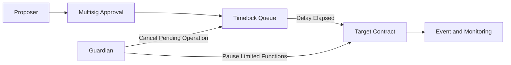
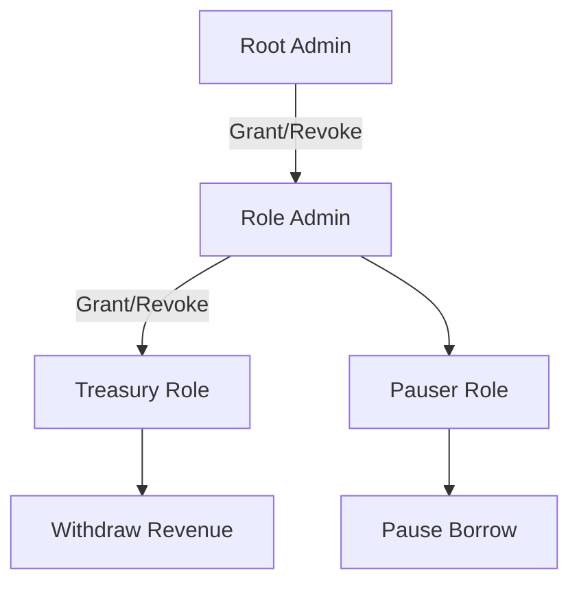
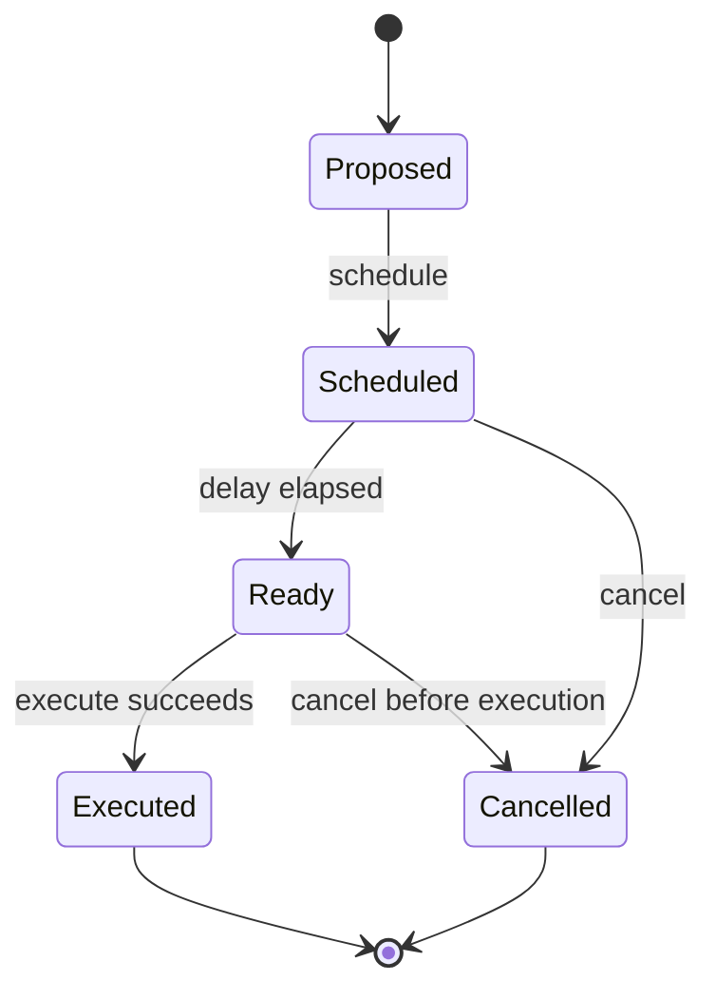
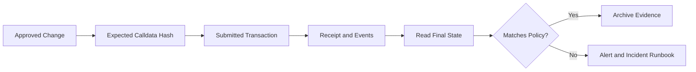

# 智能合约权限模型：从 Ownable、RBAC 到多签、Timelock 与应急治理

> 权限模型不是给函数加一个 `onlyOwner` 就结束。生产合约需要同时回答：谁能提议、谁能批准、何时能执行、紧急情况下能做什么、权限如何轮换，以及链上和链下如何发现一次越权或误操作。安全的目标不是拥有一个“万能管理员”，而是让每项能力都具有最小作用域、明确延迟、可撤销流程和可审计证据。

---

## 一、本文解决什么问题

一个协议可能只有十几个外部函数，但真正决定资产安全的往往是少数特权入口：

- 修改手续费、价格源或风险参数；
- 铸造、冻结、没收或转移资产；
- 暂停存款、借款、交易或提现；
- 升级实现、迁移资金或替换依赖合约；
- 授予和撤销其他管理员权限。

本文围绕以下问题建立工程化答案：

- `Ownable` 适合什么阶段，为什么不应长期由单个 EOA 控制？
- Role-based Access Control（RBAC，基于角色的访问控制）如何拆分职责？
- Multisig（多签）解决了什么，又没有解决什么？
- Timelock 为什么需要同时设计提议、排队、取消和执行权限？
- Guardian 为什么通常应当“快速收缩能力”，而不是“快速接管系统”？
- `Pausable` 应暂停哪些入口，为什么不能无差别冻结全部功能？
- Emergency Action 如何限制影响范围、持续时间和资产流向？
- 如何完成 Role Rotation，避免交接窗口导致失权或双重控制？
- 如何审计链上特权操作，而不是只依赖团队聊天记录？

本文以 Solidity 0.8.x 与 EVM 合约的通用公开语义为基础。示例只展示权限设计的关键结构，不替代经过审计的多签、Timelock 或访问控制实现。OpenZeppelin 等库的 API、事件和默认管理规则可能随主版本变化，接入时必须以锁定版本的官方文档和源码为准。

### 核心结论

1. 权限控制必须围绕“能力”建模，而不是围绕团队职位或一个抽象的 `admin` 建模。
2. `Ownable` 简单且易审计，适合单一根权限；复杂协议若把所有能力集中给 Owner，会扩大密钥泄露和误操作的爆炸半径。
3. RBAC 拆分“谁能做什么”，Multisig 增加“需要多少独立批准”，Timelock 增加“批准后多久才能执行”；三者解决的是不同问题。
4. Guardian 应优先拥有暂停、限流、取消待执行操作等可逆防御能力，不应默认拥有升级、转移国库或任意调用能力。
5. Pause 是状态机的一部分。必须明确暂停范围、退出通道、恢复权限和最长处置时间，不能把它当成通用安全开关。
6. Emergency Action 应满足范围受限、结果可验证、尽量可逆、带事件和恢复路径；“紧急”不是绕过治理的永久理由。
7. Least Privilege（最小权限）不仅限制账户，还要限制函数、参数范围、目标地址、调用频率、资产额度和有效时间。
8. Role Rotation 必须采用先授予、验证、再撤销的交接流程，并处理最后一个管理员、待执行操作和旧签名等边界。
9. Event 是审计数据源而不是访问控制。关键操作应同时具备链上权限校验、结构化事件、交易上下文和链下告警。
10. 权限安全需要入口矩阵测试、不变量测试、Fork 演练和持续监控；仅测试“授权用户可以成功”远远不够。

---

## 二、先把权限问题拆成五个维度

“管理员能否调用函数”只描述了授权的一部分。完整权限路径至少包含五个维度：

| 维度 | 核心问题 | 常见机制 |
|---|---|---|
| 身份 | 当前调用者是谁？ | `msg.sender`、可信转发器、智能账户 |
| 能力 | 该身份能执行什么？ | Ownable、RBAC、Capability |
| 审批 | 需要多少独立主体同意？ | Multisig、治理投票 |
| 时间 | 何时可以执行，能否取消？ | Timelock、有效期、Cooldown |
| 处置 | 异常时如何限制损失并恢复？ | Guardian、Pause、Emergency Action |



关键路径是：提议者不能单独执行，高风险操作经过多方批准，再进入公开延迟窗口；Guardian 可以在异常时取消或暂停，但不能借此任意改写协议。执行后的事件由监控系统解析，并与已批准的变更单核对。

这套组合并非所有项目都必须完整采用。不可升级、无管理员入口的合约可能根本不需要治理控制面；早期测试网合约也可能只需要 Owner。机制越多，配置错误、运维复杂度和 Gas 成本也越高。

---

## 三、从资产与动作开始，而不是从角色名称开始

权限设计的第一步不是声明 `ADMIN_ROLE`，而是枚举特权操作及其最坏后果。

### 3.1 建立特权操作清单

以借贷协议为例：

| 操作 | 最坏影响 | 推荐控制 |
|---|---|---|
| 调整普通风险参数 | 新仓位风险变化 | Risk Role + 参数上限 + Timelock |
| 更换 Oracle | 错误定价、错误清算 | Multisig + Timelock + 地址验证 |
| 暂停新增借款 | 可用性下降 | Guardian，可立即执行 |
| 恢复借款 | 在风险未解除时重新暴露 | Governance/Multisig，必要时延迟 |
| 升级实现 | 改写全部业务语义 | Multisig + Timelock + 独立升级角色 |
| 提取协议收入 | 国库资产流失 | Treasury Multisig + Allowlist/额度 |

风险不是由函数名称决定，而由它可以改变的状态和下游依赖决定。一个看似普通的 `setOracle(address)`，可能比 `withdrawFees()` 拥有更大的间接资产控制权。

### 3.2 形成权限矩阵

对每个入口至少记录：

- 调用主体与管理主体；
- 是否需要多签或投票；
- 执行延迟和取消者；
- 参数边界、额度与目标 Allowlist；
- 暂停状态下是否可调用；
- 事件、监控和 Runbook；
- 权限轮换与恢复方式。

这份矩阵应成为代码审查、部署检查和监控规则的共同输入，而不是只存在于架构图中。

---

## 四、Ownable：简单根权限的价值与边界

`Ownable` 将一组受保护入口绑定到单个 Owner 地址。它的优势是状态少、控制流直观、审计成本低，适合：

- 部署期的临时配置；
- 权限面很小的不可升级合约；
- Owner 本身是受治理的 Multisig 或 Timelock；
- 明确计划最终放弃管理权的合约。

### 4.1 Owner 是地址，不等于一个人

Owner 可以是 EOA，也可以是 Multisig、Timelock 或治理执行器。生产环境中，将 Owner 设置为合约账户通常能降低单密钥风险，但也引入治理合约配置、签名者安全和执行可用性等新依赖。

### 4.2 常见错误：部署者永久持有 Owner

若部署脚本默认让部署 EOA 成为 Owner，又没有在同一发布流程中完成转移，系统会长期暴露于：

- 私钥泄露或助记词备份失控；
- 操作人员误签；
- 人员离职后权限未回收；
- 自动化部署密钥同时拥有生产治理权。

部署完成不代表权限交接完成。发布验收应读取链上 Owner，并确认它等于目标治理地址，而不是只检查部署交易成功。

### 4.3 所有权转移应避免输错地址

高风险系统通常采用两阶段转移：当前 Owner 提名新 Owner，新 Owner 主动接受。这样可以证明目标地址具有执行能力，并减少转给错误地址后永久失权的风险。具体实现应使用已验证库或经过审计的状态机，不要随意复制片段。

### 4.4 Renounce Ownership 不是通用去中心化证明

放弃 Owner 只移除这一条权限路径。合约仍可能存在：

- 其他 Role 管理员；
- Proxy Admin 或升级入口；
- Guardian、Pause 或资产救援入口；
- 外部依赖合约的管理员；
- 可影响系统的 Oracle、Frontend 或跨链 Relayer。

因此必须基于完整控制图判断控制权，而不能只检查 `owner() == address(0)`。

---

## 五、RBAC：按能力拆分权限

Role-based Access Control 用角色标识一组能力，并允许多个地址持有同一角色。例如：

```solidity
bytes32 public constant RISK_ROLE = keccak256("RISK_ROLE");
bytes32 public constant PAUSER_ROLE = keccak256("PAUSER_ROLE");
bytes32 public constant TREASURY_ROLE = keccak256("TREASURY_ROLE");
```

字符串仅用于生成稳定标识。真正的安全边界是“哪个入口检查哪个 Role”以及“谁能管理该 Role”。

### 5.1 管理角色比业务角色更危险

若某账户不能直接提取资产，却能给自己授予 `TREASURY_ROLE`，它实际上仍拥有提取能力。审计时必须沿管理关系向上追踪：



根管理员、角色管理员与业务角色构成权限图。任何可以授予下游角色的主体，都应按下游能力的最大风险评级，而不能仅按它当前直接调用的函数评级。

### 5.2 避免万能 `DEFAULT_ADMIN`

把所有 Role 都交给同一个根管理员，虽然比单个 Owner 多了名称，却没有真正降低爆炸半径。更合理的方式是：

- 升级、国库、风险和应急角色分别管理；
- 高风险 Role 的管理员是 Timelock 或独立 Multisig；
- Pauser 可以暂停，但不能给自己授予升级权；
- 日常 Operator 只能执行窄范围操作，不能改变自己的权限。

### 5.3 Role 仍然可能过宽

RBAC 通常只能表达“可以调用某函数”，未必能表达：

- 只能把费率调到某个区间；
- 每日最多转移某个额度；
- 只能调用 Allowlist 中的目标；
- 权限只在某个时间窗有效；
- 只能暂停一个市场而不是整个协议。

这时需要把参数约束写进合约，或采用更细粒度的 Capability 模型。角色名称不能替代运行时边界。

---

## 六、一个最小化的职责拆分示例

下面示例演示风险参数、暂停与恢复的不同权限。它刻意不实现完整 Role 管理、多签和 Timelock；生产代码应接入锁定版本的成熟库，并对其默认管理员语义做专项测试。

```solidity
// SPDX-License-Identifier: MIT
pragma solidity ^0.8.24;

contract ControlledVault {
    error Unauthorized();
    error InvalidFee();
    error ContractPaused();
    error ContractNotPaused();

    uint256 public constant MAX_FEE_BPS = 500;

    address public immutable governance;
    address public guardian;
    uint256 public feeBps;
    bool public depositsPaused;

    event FeeUpdated(uint256 oldFeeBps, uint256 newFeeBps);
    event GuardianUpdated(address indexed oldGuardian, address indexed newGuardian);
    event DepositsPaused(address indexed account);
    event DepositsResumed(address indexed account);

    constructor(address governance_, address guardian_) {
        if (governance_ == address(0) || guardian_ == address(0)) revert Unauthorized();
        governance = governance_;
        guardian = guardian_;
    }

    modifier onlyGovernance() {
        if (msg.sender != governance) revert Unauthorized();
        _;
    }

    modifier onlyGuardian() {
        if (msg.sender != guardian) revert Unauthorized();
        _;
    }

    function setFeeBps(uint256 newFeeBps) external onlyGovernance {
        if (newFeeBps > MAX_FEE_BPS) revert InvalidFee();
        uint256 oldFeeBps = feeBps;
        feeBps = newFeeBps;
        emit FeeUpdated(oldFeeBps, newFeeBps);
    }

    function pauseDeposits() external onlyGuardian {
        if (depositsPaused) revert ContractPaused();
        depositsPaused = true;
        emit DepositsPaused(msg.sender);
    }

    function resumeDeposits() external onlyGovernance {
        if (!depositsPaused) revert ContractNotPaused();
        depositsPaused = false;
        emit DepositsResumed(msg.sender);
    }

    function rotateGuardian(address newGuardian) external onlyGovernance {
        if (newGuardian == address(0)) revert Unauthorized();
        address oldGuardian = guardian;
        guardian = newGuardian;
        emit GuardianUpdated(oldGuardian, newGuardian);
    }
}
```

这个结构体现了三条原则：

1. Guardian 能快速暂停新增风险，却不能调费率或恢复系统；
2. Governance 即使通过授权，也不能突破 `MAX_FEE_BPS` 参数上限；
3. 每次权限或风险状态变化都有包含旧值/新值或执行者的事件。

它仍不完整：Guardian 轮换是单阶段的，Governance 不可轮换，Pause 没有分市场，合约也没有真实存取款逻辑。示例用于解释职责边界，不应原样视为生产权限框架。

---

## 七、Multisig：降低单密钥风险

Multisig 要求一笔操作获得阈值数量的有效批准，例如 3 个签名者中至少 2 个批准。它主要降低：

- 单个私钥泄露立即接管系统的风险；
- 单人误操作直接执行的风险；
- 人员不可用导致完全失去操作能力的风险。

### 7.1 多签不是“多人拥有私钥”

安全性取决于签名者是否真正独立：

- 是否使用不同硬件钱包和备份位置；
- 是否由不同人员或组织控制；
- 是否都依赖同一台设备、同一密码管理器或同一云账号；
- 是否在签名前独立验证 Chain ID、Target、Calldata、Value 和 Nonce。

五个签名者若共享同一终端和恢复材料，形式上的 3/5 并不等于三个独立安全域。

### 7.2 多签不能提供公开反应时间

一旦阈值满足，多签通常可以立即执行。它不能单独解决：

- 多数签名者同时被攻破；
- 签名者批准了恶意但格式正确的交易；
- 社区和监控系统没有时间发现异常；
- 交易 Calldata 与审计过的提案不一致。

因此高风险操作常让 Multisig 成为 Timelock 的 Proposer，而不是直接成为目标合约 Owner。

### 7.3 阈值不是越高越安全

过高阈值会降低应急可用性，增加人员离线、硬件损坏或跨时区协调造成的停摆风险。阈值选择需要同时评估攻击容忍度和操作恢复目标，并定期演练签名者丢失与替换流程。

---

## 八、Timelock：把变更变成可观察的状态机

Timelock 在批准与执行之间增加最短延迟。典型操作经历：



延迟的价值不是让攻击“自动失效”，而是给监控者、用户和 Guardian 留出响应时间：核对参数、取消恶意操作、撤出资金或启动应急流程。

### 8.1 Operation ID 必须绑定完整调用

待执行操作应唯一绑定 Target、Value、Calldata、前置依赖和 Salt 等必要字段。若排队时审查的是 A 参数，执行时却能替换为 B 参数，延迟就失去意义。

具体哈希字段和批处理语义取决于采用的 Timelock 实现，应以锁定版本源码为准。

### 8.2 Proposer、Executor、Canceller 分离

- Proposer：创建待执行操作；
- Executor：延迟结束后触发执行；
- Canceller：在发现异常时取消；
- Admin：管理上述角色，通常是最敏感权限。

Executor 可以开放给任何账户以提高可用性，但这意味着操作一旦 Ready，任何人都可能立即执行。是否开放必须与取消窗口、前置条件和业务时序共同设计。

### 8.3 延迟变更本身也要治理

如果管理员能瞬间把 Delay 从两天改为零，再立即升级合约，Timelock 只是表面控制。修改最短延迟的操作通常也应经过当前 Timelock 约束，且不能通过另一条管理路径绕过。

### 8.4 Timelock 可能让修复变慢

所有操作统一长延迟，会阻碍漏洞处置。因此应拆分：

- Guardian 立即执行的窄范围暂停；
- Timelock 执行的升级和参数变更；
- 极少数紧急动作的专项权限与严格边界。

---

## 九、Guardian：快速防御，而不是第二个超级管理员

Guardian 面向异常处置，常见能力包括：

- 暂停新增存款、借款、铸造或跨链发送；
- 降低额度或关闭受影响市场；
- 取消尚未执行的 Timelock 操作；
- 禁用某个 Keeper、Relayer 或 Oracle 来源。

较稳健的设计遵循“不对称权限”：Guardian 可以快速降低系统能力，恢复和扩权则交给更慢、更高门槛的治理流程。

### 9.1 Guardian 不应默认拥有的能力

- 任意转移用户资产；
- 任意升级实现；
- 替换全部签名者或治理地址；
- 任意外部调用；
- 永久冻结且没有治理恢复路径。

如果业务确实需要其中某项，必须单独描述威胁模型、参数边界、资产去向、最长有效期和链上审计方式。

### 9.2 Guardian 自身也需要治理

Guardian 可以是硬件钱包 EOA、独立 Multisig 或自动化防御合约。自动化检测适合触发告警或受限动作，但 Oracle 错误、阈值配置和链上拥堵都可能造成误暂停。必须测试误报、重复调用、权限轮换和 Guardian 不可用时的恢复路径。

---

## 十、Pausable：暂停范围决定系统是否可恢复

Pause 应被建模为显式状态，而不是在所有函数前机械添加同一个检查。

### 10.1 优先暂停风险增加路径

发生异常时，常见策略是暂停：

- 新增存款、借款、铸造；
- 依赖异常 Oracle 的交易；
- 新的跨链消息发送；
- 可扩大坏账或供应量的入口。

同时尽量保留：

- 偿还债务；
- 取消订单；
- 用户在安全条件下赎回或退出；
- 清算或其他降低系统风险的入口。

无差别 Global Pause 可能把风险控制变成资金锁死，并阻止用户自救。

### 10.2 Pause 检查的位置必须覆盖真实入口

只保护公开包装函数，却漏掉另一个外部入口、回调、批处理或继承函数，攻击者仍可能绕过暂停。测试应从 ABI 和调用图枚举所有可达路径，而不是只搜索 `whenNotPaused` 字样。

### 10.3 恢复通常应比暂停更谨慎

暂停是在不确定状态下减少风险，恢复则重新开放风险。因此可以让 Guardian 立即暂停，但只能由 Governance/Multisig 在完成根因确认后恢复。恢复前应验证依赖地址、价格源、余额、不变量和待处理队列。

---

## 十一、Emergency Action：紧急能力也必须有边界

紧急动作可能包括资产迁移、强制关闭市场、切换备用 Oracle 或撤销恶意授权。设计时至少回答：

1. 由什么可验证条件触发？
2. 影响哪些资产、市场和用户？
3. 资产只能流向哪个预先批准的目标？
4. 是否有金额、频率或时间上限？
5. 动作是否可重复，重复执行是否安全？
6. 如何恢复，谁确认风险已经解除？
7. 会发出什么事件，链下如何告警？

### 11.1 错误模式：任意 `emergencyCall`

```solidity
// 错误示例：Guardian 获得了任意 Target、Value 和 Calldata 能力。
function emergencyCall(address target, bytes calldata data)
    external
    onlyGuardian
    returns (bytes memory)
{
    (bool ok, bytes memory result) = target.call(data);
    require(ok);
    return result;
}
```

这不是“应急权限”，而是等价于广泛的代码执行能力。更合理的做法是提供窄函数，例如暂停指定市场、把 Oracle 切换到预先登记的备用源，或仅将特定资产迁移到不可变/治理批准的接收方。

### 11.2 应急动作应尽量幂等

链上重试、多个响应者同时提交、交易状态不明确都可能导致重复执行。`pauseMarket(id)` 再次调用可以直接保持暂停或明确 Revert；资产迁移则必须记录已迁移状态，防止重复转移。

---

## 十二、Least Privilege：权限边界不止是账户

最小权限可以沿多个方向收缩：

- **函数**：只能调用暂停，不能升级；
- **资源**：只能管理某个 Market 或 Vault；
- **参数**：费率只能在安全区间内调整；
- **额度**：单次和周期累计转账有上限；
- **目标**：只能与 Allowlist 合约交互；
- **时间**：角色到期或操作有 Deadline；
- **频率**：关键参数调整具有 Cooldown；
- **状态**：只允许从当前合法状态执行动作。

即便 Governance 是最高权限，也应保留不可突破的不变量。例如手续费硬上限、资产接收方约束和升级兼容检查，可以限制治理密钥被攻破后的损失。

但硬编码边界也有代价：若参数空间未来合理变化，可能需要升级合约。因此应区分协议不可变安全约束和可治理业务策略。

---

## 十三、Role Rotation：权限交接也是一笔生产变更

角色轮换常见于人员变动、密钥风险、Multisig 签名者更新或治理迁移。推荐流程是：

1. 生成并独立核对新地址、Chain ID 和预期角色；
2. 由当前管理员授予新角色；
3. 新主体通过无害操作或链上验权证明可用；
4. 更新监控、Runbook、地址簿与签名策略；
5. 撤销旧主体；
6. 读取链上最终状态，确认没有多余权限；
7. 检查旧主体创建的待执行操作、离线签名和 Allowance。

### 13.1 为什么不能先撤销再授予

若先撤销最后一个管理员，后续授予可能永远无法执行。某些系统允许角色自我管理或放弃，必须专项测试“最后一个 Admin”边界。

### 13.2 撤销 Role 不一定撤销已批准操作

已排队的 Timelock Operation、已收集的 Multisig 签名、签名授权和链下 Keeper 凭证可能继续有效。轮换检查必须覆盖所有授权载体，而不只是一个 Role Mapping。

### 13.3 Proxy 系统需要检查多层管理员

Implementation 的业务 Role、Proxy 的 Upgrade Admin、Beacon Owner、Timelock 和 Multisig 签名者可能属于不同层。只轮换业务合约 Owner，不能保证升级权也完成交接。

---

## 十四、Privileged Operation Audit：让每次特权变更可追踪

### 14.1 Event 应表达安全语义

关键事件通常需要包含：

- 操作类型与目标资源；
- 执行者或提议者；
- 旧值与新值；
- Operation ID、关联提案或批次标识；
- 必要的资产、额度或目标地址。

仅记录 `Updated()` 而没有参数，会迫使审计系统额外读取历史状态，甚至无法可靠还原变化。

### 14.2 Event 不能替代校验

攻击者可以调用另一个没有权限检查的入口，或者合约先发 Event 后 Revert。审计系统应以成功交易 Receipt、目标合约地址和解码后的 Event 为依据，并结合交易 Input 和最终状态核验。

### 14.3 链下审计闭环



监控不应只看“管理员地址发起了一笔交易”，而应把已批准的目标、Selector、参数、Value 和最终状态与链上结果逐项比较。代理升级还应记录新 Implementation 地址、Code Hash、Storage Layout 检查结果与初始化调用。

### 14.4 监控对象

- Role Grant、Revoke 与 Admin 关系变化；
- Owner、Guardian、Proxy Admin 和 Multisig 签名者变化；
- Timelock Schedule、Cancel、Execute 与 Delay 变化；
- Pause/Unpause 和 Emergency Action；
- 升级、Oracle、费用、额度和资产接收方变化；
- 未经预期治理路径直接完成的状态变化。

事件索引可能因 RPC 中断或链重组遗漏、重复。监控系统需要按区块范围补扫，并在达到业务所需确认级别后再固化告警状态。

---

## 十五、调用者身份的边界

### 15.1 `msg.sender` 是当前调用帧的直接调用者

当 Multisig 或 Timelock 调用业务合约时，`msg.sender` 是执行合约，而不是批准交易的某个签名者。业务合约通常应授权执行器地址，不应尝试在目标函数里重新解释多签签名者。

### 15.2 不要用 `tx.origin` 做权限控制

`tx.origin` 是顶层交易发起账户，无法正确表达合约钱包、Timelock、账户抽象或组合调用身份，并可能受到诱导调用问题影响。权限应基于经过设计的直接调用者或可信转发语义。

### 15.3 元交易需要认证 Logical Sender

若系统支持可信 Forwarder，合约看到的直接调用者可能是 Forwarder。只有验证 Forwarder 身份并按所用标准解析后，才能把附带地址视为 Logical Sender。任意 Calldata 中的 `from` 字段都不可信。

### 15.4 `delegatecall` 改变权限审计方式

Proxy 通过 `delegatecall` 执行 Implementation 代码时，外部调用者语义通常会传入实现逻辑，而状态写在 Proxy 中。升级授权、业务授权和 Implementation 锁定必须分别审计，不能把实现合约自己的 Owner 状态误认为 Proxy 的权限状态。

---

## 十六、常见误区与错误案例

### 16.1 “用了 RBAC 就是最小权限”

错误。若所有 Role 都由同一个热钱包管理，或某 Role 可以任意改参数、调用任意目标，风险仍然集中。

### 16.2 “Multisig 可以替代 Timelock”

错误。Multisig 提高批准门槛，Timelock提供公开反应窗口。两者的安全属性不同。

### 16.3 “Guardian 越强，事故响应越快”

错误。过强 Guardian 本身会成为最高价值攻击目标。应让它快速收缩能力，并把恢复和永久变更留给治理。

### 16.4 “Pause 后所有函数都应该失败”

错误。偿还、取消和安全退出等降低风险的路径通常应尽量保留，具体取决于协议不变量。

### 16.5 “发出 Event 就完成了审计”

错误。Event 不实施访问控制，也不保证链下系统收到。必须校验成功 Receipt、最终状态并处理重组与补扫。

### 16.6 “Owner 是多签，所以所有风险都解决了”

错误。仍需评估签名者独立性、阈值、交易解码、模块/插件、Timelock、恢复流程和多签实现本身。

### 16.7 “撤销旧 Role 后旧账户不可能再影响系统”

错误。已排队操作、离线签名、其他管理层、Token Allowance 和链下凭证可能仍然有效。

### 16.8 “只有能直接转账的权限才是高风险权限”

错误。Oracle、升级、铸造、清算参数和角色管理权限可能间接控制更多资产。

---

## 十七、工程方案选择

| 场景 | 可选模型 | 主要代价 |
|---|---|---|
| 小型、不可升级、低权限面 | Ownable，Owner 可为 Multisig | 简单，但能力集中 |
| 多职责协议 | RBAC + 独立 Role Admin | 配置和审计复杂度增加 |
| 国库与升级 | Multisig | 签名协调、签名者运维 |
| 高风险、非紧急变更 | Multisig/Governance + Timelock | 执行延迟、操作状态管理 |
| 快速止损 | 窄权限 Guardian + 分域 Pause | 误暂停和恢复流程成本 |
| 成熟协议 | RBAC + Multisig + Timelock + Guardian + Monitoring | 组合配置错误与运维成本最高 |

不要为了“看起来去中心化”堆叠机制。每一层都应对应明确威胁：

- 防单密钥泄露：Multisig；
- 防职责混用：RBAC；
- 给外部观察和退出时间：Timelock；
- 快速限制损失：Guardian/Pause；
- 发现偏离和支持追责：Audit/Monitoring。

若团队无法可靠维护某机制，它可能从安全控制变成新的故障源。

---

## 十八、测试与验证方法

### 18.1 权限入口矩阵

对每个外部入口至少验证：

- 正确 Role 可以调用；
- 无 Role、错误 Role、已撤销 Role 均失败；
- Role Admin 不能越过业务参数边界；
- 合约账户、多签和 Timelock 调用路径符合预期；
- Pause 前后所有相关入口行为正确。

### 18.2 参数与资产不变量

即使调用者有权，也要验证：

- 费率、额度和地址不能越界；
- Guardian 不能把资产发送到任意地址；
- 暂停不能阻止设计中保留的退出路径；
- 授权和撤销不会产生零管理员或意外双管理员状态；
- 恢复操作不会绕过必要检查。

### 18.3 Timelock 状态测试

测试未到期执行、重复排队、重复执行、取消后执行、批处理部分失败、Operation ID 冲突边界和 Delay 变更。具体测试项应匹配所用实现的公开契约。

### 18.4 Fork 演练

在目标链状态 Fork 上执行完整治理操作：多签提案、Timelock 排队、时间推进、目标调用、事件解析和最终状态核对。升级场景还应比较 Storage Layout 并运行协议不变量。

### 18.5 事故演练

至少演练：

- Guardian 密钥丢失；
- 多签一个或多个签名者不可用；
- 恶意操作已排队但未到期；
- Oracle 异常需要暂停单一市场；
- 误暂停后的安全恢复；
- 管理员轮换中途失败。

演练指标应包括发现时间、批准时间、链上确认时间、恢复步骤和证据完整性，而不是虚构一个脱离网络与组织条件的固定响应数字。

### 18.6 部署后链上验权

发布流水线应读取并归档：

- Owner、所有 Role Member 与 Role Admin 关系；
- Multisig 阈值和签名者集合；
- Timelock Delay、Proposer、Executor、Canceller；
- Guardian 与暂停状态；
- Proxy Admin、Implementation 和升级授权主体；
- 关键参数边界与资产目标 Allowlist。

部署脚本执行成功不等于权限配置正确，必须以链上读取结果作为验收证据。

---

## 十九、发布前权限检查清单

- [ ] 已枚举全部特权入口和间接控制能力。
- [ ] 每个 Role 都有明确作用域、管理员和轮换流程。
- [ ] 部署者临时权限已按计划移交或撤销。
- [ ] 高风险操作使用独立 Multisig/Timelock 控制。
- [ ] Guardian 只能执行受限、可审计的防御动作。
- [ ] Pause 范围、退出路径、恢复权限已经测试。
- [ ] 参数上限、目标 Allowlist、额度和时间边界在链上强制执行。
- [ ] Timelock Delay 不能通过旁路瞬间取消。
- [ ] Proxy、Implementation、Beacon 等多层权限已分别核对。
- [ ] Role Rotation 覆盖待执行操作和旧签名。
- [ ] 所有特权变更都有结构化 Event 与链下告警。
- [ ] 已完成未授权入口矩阵、不变量、Fork 和事故演练。

---

## 二十、总结

智能合约权限模型应被视为一套可执行的治理状态机，而不是几个 Modifier：

1. Ownable 适合简单根权限，但 Owner 最好由更安全的治理主体持有。
2. RBAC 按能力拆分职责，同时必须审计 Role 的管理关系和参数边界。
3. Multisig、Timelock 分别提供多方批准和反应时间，不能互相替代。
4. Guardian 与 Pause 应快速减少风险暴露，恢复和永久变更应采用更高门槛。
5. Emergency Action 必须比普通管理员函数更窄，而不是提供任意调用后门。
6. Least Privilege 应覆盖函数、资源、参数、额度、目标、时间和状态。
7. Role Rotation 是完整生产变更，需要处理链上角色、待执行操作和链下凭证。
8. Privileged Operation Audit 必须把批准内容、交易输入、Receipt、Event 和最终状态串成证据链。

真正稳健的权限设计，不假设管理员永远诚实、密钥永不泄露或操作永不出错，而是让任何单点失败都难以直接变成不可逆的系统性损失。

---

## 问答复盘

### Q1：`Ownable` 与 RBAC 最核心的区别是什么？

**答：** `Ownable` 把受控能力集中到单个 Owner 身份，RBAC 把不同能力分配给不同角色及其管理员。RBAC 更灵活，但管理图和配置错误也更复杂。

### Q2：Owner 已经是 Multisig，为什么还可能需要 Timelock？

**答：** Multisig 防止少数或单个密钥直接执行，Timelock 给外部观察者留下发现、取消或退出的时间。多数签名者误签或被攻破时，多签本身没有公开延迟。

### Q3：为什么 Role Admin 必须按它能授予的最高权限评级？

**答：** 因为它可以把高风险 Role 授予自己或同伙。即使不能直接调用业务函数，也间接拥有下游全部能力。

### Q4：Guardian 是否应该同时拥有 Pause 和 Unpause？

**答：** 通常不建议默认如此。Guardian 可立即暂停以收缩风险；恢复会重新开放风险，更适合由 Governance 或 Multisig 在完成核验后执行。具体选择取决于协议可用性目标。

### Q5：Global Pause 为什么可能扩大事故影响？

**答：** 它可能同时阻断偿还、取消和安全退出，使用户无法降低风险。应优先按市场和功能暂停风险增加路径，并保留可证明安全的退出通道。

### Q6：有权限的调用者是否可以跳过参数校验？

**答：** 不可以。授权只证明“谁可以尝试”，参数上限、目标 Allowlist、额度和状态转换仍应在链上强制执行，以限制误操作和密钥泄露的损失。

### Q7：撤销一个账户的 Role 后，为什么还要检查 Timelock 和签名？

**答：** 因为它先前排队的操作、已收集的 Multisig 签名或离线授权可能仍有效。Role Mapping 只是授权载体之一。

### Q8：如何验证一次权限配置发布是正确的？

**答：** 在目标链读取 Owner、Role Member/Admin、多签阈值、Timelock 角色与 Delay、Guardian、Proxy Admin 和暂停状态，并与版本化权限矩阵逐项比对；不能只依赖部署脚本日志。

### Q9：为什么不应使用 `tx.origin` 做权限检查？

**答：** 它不能正确表达合约钱包、Timelock和组合调用身份，还可能受到诱导调用影响。权限应基于经过设计的直接调用者或认证后的可信转发语义。

---

## 延伸知识

- **状态机**：Explicit State、Legal Transition、Timeout、Cancellation、Idempotency 与 Invariant。
- **Upgradeability**：Proxy、Initializer、Storage Collision、Upgrade Authorization 与 Timelock Upgrade。
- **合约安全**：Reentrancy、Delegatecall、Unchecked Call、DoS 与外部调用边界。
- **账户抽象**：Smart Account、Bundler、Paymaster、Session Key 与委托权限。
- **链上治理**：Proposal、Voting Power、Quorum、Delegation 与 Governance Attack。
