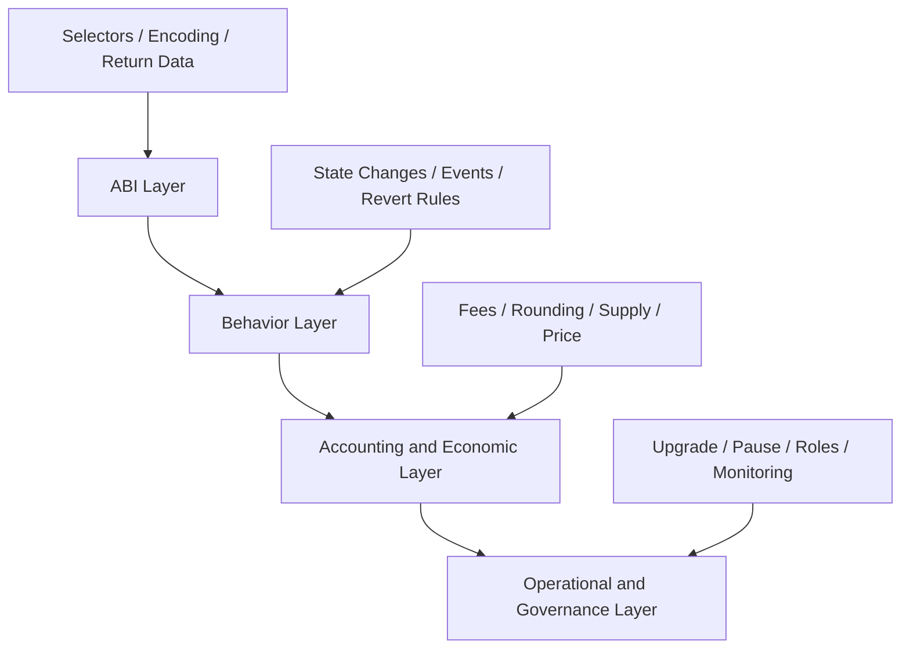
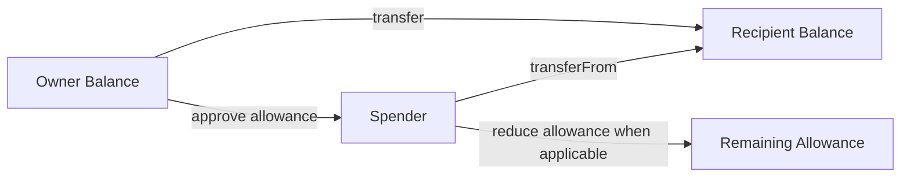
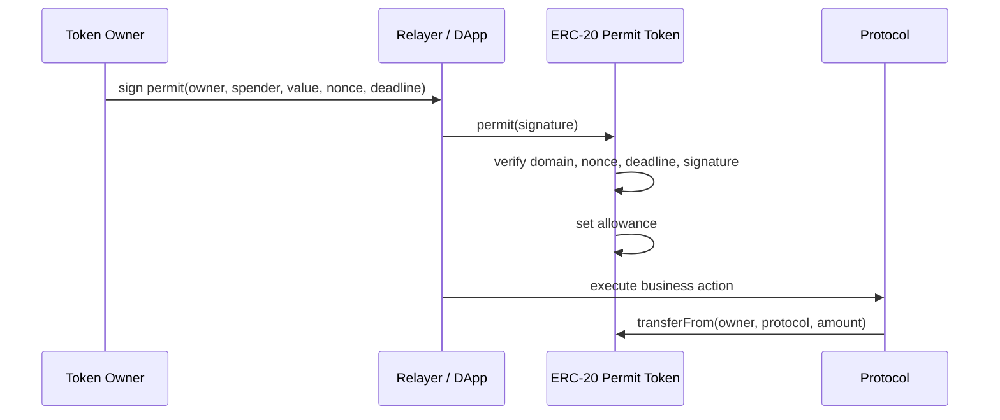
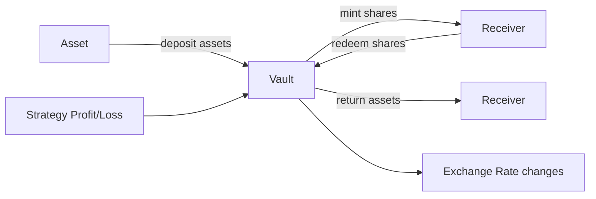
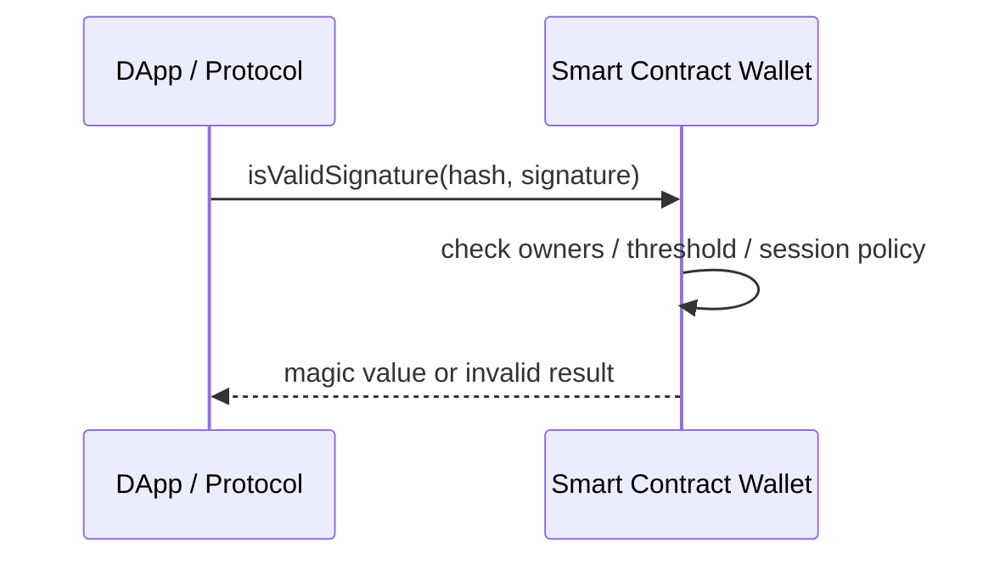
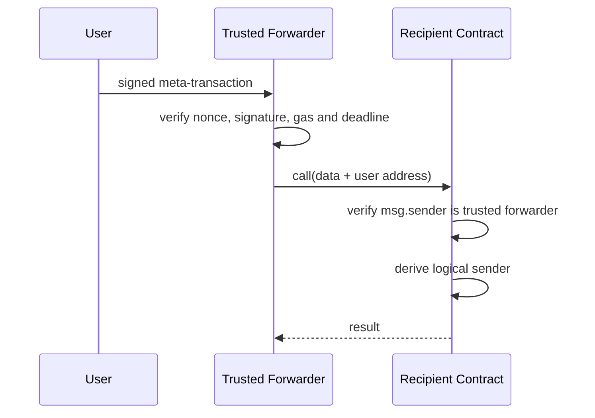
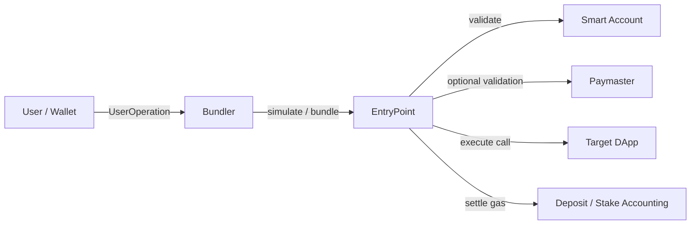
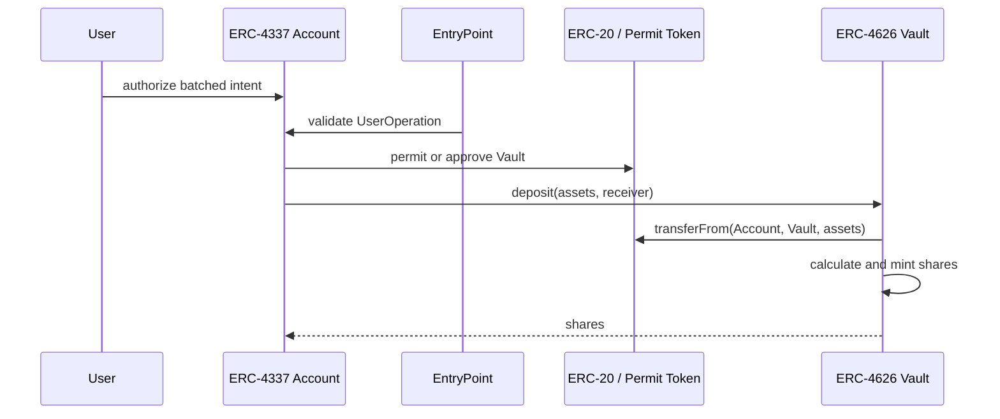

# 智能合约标准与组合：从 ERC 接口、Token、Vault 到签名与账户抽象

> ERC 标准的价值不是让不同项目拥有相同函数名，而是让钱包、交易所、协议和索引器围绕共同的调用与事件语义协作。但接口匹配只证明“可以按某种 ABI 交互”，不证明 Token 没有转账税、Vault 不会亏损、签名不会重放、Forwarder 值得信任，也不证明升级后仍保持原语义。可组合性来自标准契约、运行时验证和失败隔离三者共同成立。

---

## 一、本文解决什么问题

一个 DeFi 应用可能同时依赖：

- ERC-20 作为存款资产；
- ERC-4626 包装收益策略；
- ERC-2612 让用户用签名授权；
- ERC-1271 验证智能合约钱包签名；
- ERC-2771 支持可信转发器代付 Gas；
- ERC-4337 智能账户提交批量操作；
- ERC-721 或 ERC-1155 表示仓位、凭证和游戏资产。

每个组件单独“符合标准”，组合后仍可能失败：

- ERC-20 `transfer` 不返回预期 Bool，集成方错误解码；
- Fee-on-transfer Token 实际到账少于请求金额，会计出现缺口；
- ERC-4626 首次存款遭受汇率操纵或捐赠影响；
- Permit 被公开后遭抢先提交，业务交易因 Nonce 已消耗而失败；
- ERC-1271 钱包升级后，历史签名有效性发生变化；
- ERC-2771 合约信任了错误 Forwarder，攻击者伪造 Logical Sender；
- ERC-4337 的 Paymaster 验证通过，但执行阶段仍可能 Revert；
- ERC-165 声称支持某接口，实际方法却故意失败；
- Proxy 升级保留 Selector，却改变事件或经济语义。

本文回答：

- ERC Interface 的公开契约包含哪些内容？
- ERC-165 能发现什么，不能证明什么？
- ERC-20、ERC-721、ERC-1155 的资产和授权模型如何不同？
- ERC-2612 Permit 如何把签名转成 Allowance，重放边界在哪里？
- ERC-4626 的 Asset、Share、Preview 和 Max 方法如何协作？
- ERC-1271 为什么不能把所有签名都按 EOA 恢复地址验证？
- ERC-2771 中 Direct Caller 与 Logical Sender 如何区分？
- ERC-4337 的 Smart Account、EntryPoint、Bundler 和 Paymaster 各自负责什么？
- 标准的 Optional Extension、版本、代理升级和经济行为如何治理？
- 如何测试一个“标准兼容”组件能否安全进入真实组合协议？

本文以 Solidity 0.8.x、EVM 通用调用语义和相关 ERC 的稳定公开接口为基础。具体标准应以其最终规范文本为准；库 API、钱包支持、EntryPoint 版本、Bundler RPC、链部署地址和扩展实现会变化，生产接入必须固定版本与目标网络，并核对官方规范、实现源码和实际链上 Code Hash。

### 核心结论

1. ERC 标准是调用、返回值、事件和行为约束的集合，不只是 Solidity Interface 文件。
2. Interface Cast 不执行运行时认证；Selector 相同也不证明语义相同。
3. ERC-165 是自我声明式能力发现，适合探测接口支持，不是正确实现或安全性的证明。
4. ERC-20 面向同质化余额与 Allowance；ERC-721 面向唯一 Token ID；ERC-1155 用同一合约管理多种 ID 和批量转移。三者授权粒度与接收检查不同。
5. ERC-2612 Permit 通过签名设置 ERC-20 Allowance，必须验证 Domain、Owner Nonce、Deadline 和完整参数；Permit 本身不执行后续业务动作。
6. ERC-4626 统一 Asset 与 Share 的 Vault 会计接口，但汇率、舍入、费用、限额、损失和操纵风险仍由实现决定。
7. ERC-1271 让合约账户自行判断签名有效性；结果可能随合约状态和升级变化，验证方应在需要的区块上下文调用。
8. ERC-2771 通过可信 Forwarder 传递 Logical Sender；只解析 Calldata 尾部而不认证 Forwarder 会直接破坏权限模型。
9. ERC-4337 不会改变 EVM 共识交易类型，它通过 EntryPoint 等合约和链下 Bundler 处理 UserOperation；验证成功不等于目标调用成功。
10. 标准兼容必须分层验证 ABI、行为、经济语义、权限、升级、事件和异常 Token/账户。
11. 扩展标准时应保留基础接口语义，使用新接口或能力发现表达额外能力，避免悄悄改变既有函数承诺。

---

## 二、可组合性的四层契约



只有 ABI 层兼容，最多说明调用数据可以发出：

- **ABI 层**：函数签名、参数、返回数据和事件编码；
- **行为层**：成功和失败时怎样改变状态；
- **经济层**：到账金额、汇率、舍入、费用和资产风险；
- **治理层**：实现是否可升级、暂停、冻结或改变规则。

组合协议必须明确自己依赖哪一层。例如借贷协议接受某 ERC-20，不只是依赖 `transferFrom` Selector，还依赖实际到账可计算、余额不会异步缩减、管理员不能随意冻结协议地址等更强假设。

---

## 三、ERC Interface：接口是公开协议，不是类型安全外衣

Solidity Interface 声明可调用函数和事件，用于生成 ABI 与编译期类型检查：

```solidity
interface IPriceSource {
    function latestPrice() external view returns (uint256 price, uint256 updatedAt);
}
```

把某地址转换为 `IPriceSource`：

```solidity
IPriceSource source = IPriceSource(sourceAddress);
```

不会验证目标地址：

- 是否有代码；
- 是否真的实现函数；
- 返回数据是否符合 ABI；
- Price 的单位和小数位；
- 数据是否新鲜或可操纵；
- 实现是否可升级。

### 3.1 一个完整接口契约还应说明

- 函数输入、输出和单位；
- 状态变化与权限；
- Event 及其索引字段；
- Error/Revert 条件；
- 是否允许重复调用；
- 外部 Callback 与重入边界；
- Optional Function；
- 版本和扩展关系。

Solidity 类型只能表达其中一部分，剩余语义需要规范、测试和运行时校验。

### 3.2 Selector Collision

函数 Selector 是函数签名 Hash 的前 4 Byte，不同签名理论上可能碰撞。普通单体合约由编译器生成分发逻辑；代理、Diamond 和任意 Router 需要额外考虑 Selector 管理。不要把 Selector 当作全局唯一接口 ID。

### 3.3 返回数据边界

目标可能：

- Revert 并返回 Custom Error；
- 成功但返回空数据；
- 返回错误长度或恶意构造数据；
- Fallback 静默成功；
- 返回符合 ABI 但语义错误的值。

高价值集成不应仅用“低级调用 `success == true`”判断标准实现正确。

---

## 四、ERC-165：接口能力发现

ERC-165 定义了通过 Interface ID 查询合约是否声明支持某接口的机制。Interface ID 通常由接口函数 Selector 组合得到，具体计算遵循规范。

```solidity
interface IERC165Like {
    function supportsInterface(bytes4 interfaceId) external view returns (bool);
}
```

### 4.1 典型用途

- NFT 接收与市场识别；
- 判断合约是否支持某扩展接口；
- 在多种 Token/模块能力间选择调用路径；
- 部署或注册时执行兼容性检查。

### 4.2 它不能证明什么

`supportsInterface(id) == true` 是目标合约的声明，不证明：

- 每个函数都正确实现；
- 调用永不 Revert；
- 经济语义安全；
- Proxy 升级后仍支持；
- 合约不是恶意返回 True；
- 当前 Caller 有调用权限。

因此 ERC-165 是能力探测，不是认证或审计证明。

### 4.3 查询也有失败边界

目标可能没有 ERC-165、调用 Revert、返回畸形数据或消耗异常 Gas。集成方应使用有边界的查询策略，并为“不支持或无法确定”定义回退行为。不要在关键状态迁移中对任意地址进行无界能力探测。

### 4.4 代理升级后的能力漂移

Proxy 地址不变，但新 Implementation 可能增加、移除或错误报告接口。监控系统应在升级后重新读取能力并比较 ABI/Selector，而不是永久缓存首次结果。

---

## 五、ERC-20：同质化余额、Allowance 与现实偏差

ERC-20 用账户余额和总供应量表示同质化资产，并定义转账、授权和相关事件。核心模型：



### 5.1 `transfer` 与 `transferFrom`

- `transfer(to, amount)` 从直接调用者余额转出；
- `transferFrom(from, to, amount)` 允许 Spender 按 Allowance 代表 Owner 转出；
- `approve(spender, amount)` 设置 Allowance。

准确的返回和事件要求应以 ERC-20 规范为准。现实中存在历史 Token 不按常规方式返回 Bool，集成方通常使用成熟的安全封装处理空返回与 False 等差异。

### 5.2 Allowance 不是一次性授权

Allowance 是可持续消耗的额度。常见风险包括：

- 授权远大于本次需要；
- Spender 可升级或被攻破；
- 用户修改非零 Allowance 时存在交易排序风险；
- 业务成功后剩余额度长期存在；
- Permit 只改变 Allowance，后续任何有权 Spender 调用都可能消耗。

工程上应按需授权、限制 Spender、展示剩余额度，并在协议设计允许时采用更细粒度授权。

### 5.3 实际到账不一定等于 Amount

现实 Token 可能具有：

- Transfer Fee/Tax；
- Rebase；
- 黑名单、冻结或暂停；
- Hook/Callback；
- 最大转账或账户限制；
- 管理员铸造或销毁；
- 非标准 Decimal 或 Metadata；
- Proxy 升级改变行为。

Vault/借贷协议若支持 Fee-on-transfer Token，通常应以调用前后余额差确认实际到账，而不能直接把请求 Amount 记为资产。但余额差方案也需结合 Rebase、Hook 和重入进行设计。

### 5.4 `decimals` 是展示信息，不是精度保证

它不改变 EVM 整数运算，也不保证一定存在或稳定。跨 Token 计算必须显式处理单位、舍入和 Oracle Decimal，不能假设所有 Token 都是 18 位。

### 5.5 ETH 与 ERC-20 不同

原生资产通过 `msg.value` 和账户 Balance 转移，ERC-20 余额存储在 Token 合约中。`address(this).balance` 不包含本合约持有的 ERC-20 余额。

---

## 六、ERC-721：唯一 Token ID 与安全接收

ERC-721 为每个 Token ID 记录唯一 Owner，适合 NFT、仓位凭证和唯一权利标识。

### 6.1 授权层级

- 单个 Token ID 的 Approved Address；
- Owner 对 Operator 的全量授权；
- Owner 自己直接操作。

协议集成必须区分“当前 Owner”“单 Token Approved”“全局 Operator”，并在转移后重新读取状态，因为授权通常会随所有权变化。

### 6.2 `transferFrom` 与 `safeTransferFrom`

安全转移到合约地址时，会要求接收合约按规范返回接收确认值；若接收方不支持，交易 Revert，避免 NFT 被锁进没有处理入口的合约。

接收 Callback 是一次外部调用，发送方尚在执行交易中，必须考虑重入。实现和集成方不能把“Safe”理解为没有安全风险，它主要解决合约接收能力确认。

### 6.3 NFT 不等于静态图片

标准重点是所有权与转移接口。Metadata URI、内容可用性、链下资源、版税、冻结、租赁和动态属性属于其他接口或实现语义，不能从 ERC-721 身份自动推出。

### 6.4 Token ID 的经济语义由实现决定

一个 ERC-721 可以代表艺术品、债仓、流动性头寸或治理权。仅检查标准不能判断是否可安全抵押、估值或转让。

---

## 七、ERC-1155：多 Token ID 与批量操作

ERC-1155 在同一合约内管理多个 Token ID，每个 ID 可表现为同质化或非同质化资产，并支持批量余额查询与转移。

### 7.1 与 ERC-20/721 的主要差异

| 维度 | ERC-20 | ERC-721 | ERC-1155 |
|---|---|---|---|
| 合约内资产种类 | 通常一种 | 多个唯一 ID | 多个 ID、每个有数量 |
| 所有权模型 | Balance | 单 ID Owner | `account × id` Balance |
| 批量转移 | 基础接口无统一批量 | 基础接口无统一批量 | 标准支持 Batch |
| 接收检查 | 基础标准无接收 Hook | Safe Transfer Hook | 单笔与批量接收 Hook |
| Operator 授权 | Allowance | 全局 Operator + 单 ID批准 | 通常是全局 Operator |

### 7.2 批量并不自动降低所有成本

批量接口减少交易和公共开销，但数组长度、接收 Callback、存储写入和 Block Gas Limit 仍构成边界。永远不要对用户可控的无界数组执行不可控循环。

### 7.3 Receiver Hook 与重入

安全转移到合约会触发接收回调。实现应遵循规范要求的状态和事件顺序，并结合 CEI、重入防护及不变量测试。业务合约作为 Receiver 也要验证 `msg.sender` 是预期 Token 合约，不能信任任意调用者伪造回调参数。

### 7.4 ID Namespace

同一个 `id = 1` 在不同 ERC-1155 合约中是不同资产。跨协议标识应至少包含 Chain ID、Token Contract 和 Token ID，不能只保存 ID。

---

## 八、ERC-2612 Permit：用签名设置 ERC-20 Allowance

Permit 允许 Token Owner 签署结构化授权，由任何 Relayer 提交链上，成功后更新 Allowance。用户无需先单独发送 `approve` 交易。



### 8.1 Permit 的安全域

签名通常需要绑定：

- Token 的 Domain；
- Owner；
- Spender；
- Value；
- Owner 当前 Nonce；
- Deadline。

具体 Typed Data 与 Domain 字段以 ERC-2612 规范及 Token 实现为准。客户端必须从正确 Chain 和 Token 获取/构造域，不能复用另一合约的签名。

### 8.2 Permit 不等于支付

Permit 只授权 Spender，后续业务调用仍可能失败。若 Permit 已被单独成功提交，Allowance 会保留。更好的用户流程常把 Permit 与业务动作组合在同一原子调用中，但组合函数仍应处理 Permit 已被抢先提交的情况。

### 8.3 抢先提交不是签名伪造

任何看到有效 Permit 的账户都可能先提交它，只要规范允许 Relayer 开放。攻击者未必能改变 Spender/Value，却能消耗 Nonce，让后续严格要求 Permit 成功的业务交易 Revert。

因此组合逻辑可以在 Permit 失败后检查现有 Allowance 是否已足够，再继续业务动作；是否采用这种容错必须验证失败原因，不能吞掉所有错误。

### 8.4 合约钱包边界

传统 ECDSA 恢复地址的 Permit 流程通常面向 EOA Owner。若要支持合约账户，需要 Token/协议明确支持相应签名验证机制，不能假设 ERC-1271 自动适用于所有 ERC-2612 实现。

---

## 九、ERC-4626 Vault：统一 Asset 与 Share 会计接口

ERC-4626 标准化单一 ERC-20 Asset Vault 的存取款与 Share 会计接口。用户存入 Asset 获得 Share，Share 代表对 Vault 资产的比例权益。



### 9.1 两组入口

- `deposit(assets, receiver)`：以 Asset 数量为主，计算并铸造 Share；
- `mint(shares, receiver)`：以 Share 数量为主，计算所需 Asset；
- `withdraw(assets, receiver, owner)`：以取出 Asset 为主，销毁所需 Share；
- `redeem(shares, receiver, owner)`：以销毁 Share 为主，计算可取 Asset。

准确舍入方向、Preview 和 Max 语义应以 ERC-4626 规范为准，不能凭直觉实现。

### 9.2 `convert`、`preview` 与 `max`

- Convert 方法表达理想化换算；
- Preview 方法估计当前交易语义下的结果；
- Max 方法表达对特定 Owner 当前可执行的上限。

集成方应在提交交易前调用适当 Preview/Max，但它们不是未来结果保证。区块内状态、费用、其他交易和策略变化可能让执行值不同或 Revert，因此业务入口仍需 Slippage/最小结果保护。

### 9.3 汇率与舍入

Share 价格通常由总资产和总 Share 关系决定。整数除法会产生舍入，方向错误可能让用户或 Vault 被系统性套利。测试需覆盖：

- 首次存款；
- 极小金额和尘埃；
- 大额 Donation；
- Profit/Loss；
- 费用；
- 总 Share/资产接近零；
- 连续 Deposit/Redeem 的价值守恒。

### 9.4 Inflation/Donation 边界

攻击者可能通过直接转入 Asset 等方式改变某些实现的汇率，使后续小额存款因舍入获得极少或零 Share。防护方式取决于实现，例如虚拟资产/Share、最小初始流动性、路由器或最小 Share 保护。不能宣称“使用 ERC-4626 就自动免疫”。

### 9.5 `totalAssets` 是实现声明的会计值

它如何计算策略头寸、未实现收益、债务、费用和流动性取决于 Vault。标准化函数名不等于资产可立即全部赎回，也不证明估值准确。

### 9.6 资产兼容

Fee-on-transfer、Rebase、Callback Token 或具有冻结规则的 Asset 可能破坏普通 ERC-4626 假设。支持前需要专项会计设计；不支持时应在部署和文档层明确限制。

---

## 十、ERC-1271：让合约账户验证签名

EOA 签名通常可通过 ECDSA 恢复地址验证，但合约账户没有必须对应的单一私钥。ERC-1271 定义合约通过标准方法判断某个 Hash 与 Signature 是否有效，并返回规定的 Magic Value。

### 10.1 调用模型



验证方应检查返回值严格匹配规范，而不是只看调用成功。

### 10.2 有效性可能随状态变化

合约钱包可以根据以下状态判断：

- 当前 Owner/Signer 集合；
- Multisig 阈值；
- Session Key 有效期；
- 已撤销 Hash；
- 模块状态；
- Proxy 当前 Implementation。

因此同一签名在不同区块可能从有效变无效，甚至反向变化。需要历史真实性时，应在指定区块读取，前提是 RPC 节点保留相应历史状态。

### 10.3 ERC-1271 不提供 Replay Protection

它回答“该账户是否认可此 Hash/Signature”，不自动限制该授权使用次数。业务协议仍需绑定 Chain、Contract、Action、Nonce、Deadline 和参数，并在成功执行后消费 Intent。

### 10.4 合约调用可能 Revert

钱包可能未实现、升级中、暂停、消耗过多 Gas 或返回畸形数据。协议应为验证失败定义清晰结果，避免一次恶意钱包验证阻塞批量处理。

---

## 十一、ERC-2771：可信转发与 Logical Sender

ERC-2771 风格元交易中，用户签署请求，Trusted Forwarder 验证并调用 Recipient，同时在 Calldata 中携带原始用户地址。Recipient 认证 Forwarder 后解析 Logical Sender。



### 11.1 Direct Caller 与 Logical Sender

- `msg.sender`：Forwarder；
- Logical Sender：经可信 Forwarder 认证后从请求中恢复的用户；
- `tx.origin`：顶层交易 EOA，不应作为业务授权依据。

业务合约若部分入口使用 `_msgSender()` 一类抽象、部分仍直接使用 `msg.sender`，权限与事件可能出现不一致。需要逐个审计所有 Caller 读取点。

### 11.2 为什么必须认证 Forwarder

任何账户都能构造“Calldata + 假用户地址”。只有当直接调用者是预先信任的 Forwarder，尾部地址才有认证意义。否则攻击者可以伪造任意用户身份。

### 11.3 Forwarder 是安全边界

需要验证：

- 签名 Domain 与 Nonce；
- Deadline；
- Target、Value、Gas 和 Calldata；
- Relayer 重试和失败语义；
- Forwarder 是否可升级；
- Recipient 如何轮换信任；
- 批量转发是否被单个失败阻塞。

标准化 Recipient 语义不自动保证某个 Forwarder 实现安全。

### 11.4 与代理和 Multicall 的组合

Proxy、Delegatecall 和 Multicall 可能改变 Calldata 处理路径。若内部再次拼接或截断数据，Logical Sender 解析可能错误。所有组合必须使用兼容实现并做端到端测试，不能只单测 Forwarder。

---

## 十二、ERC-4337：基于 EntryPoint 的账户抽象体系

ERC-4337 通过链上 EntryPoint 合约与链下 Bundler 等组件处理 UserOperation，使 Smart Account 可以自定义验证、批量调用、恢复和 Gas 赞助策略，而无需修改 EVM 共识层交易格式。



### 12.1 核心角色

- **Smart Account**：验证 UserOperation 并执行目标调用；
- **EntryPoint**：协调验证、执行和 Gas 结算；
- **Bundler**：收集 UserOperation、模拟并提交包含操作的链上交易；
- **Paymaster**：按策略赞助或以其他方式承担 Gas；
- **Factory**：按需部署尚未创建的 Smart Account；
- **Aggregator**：在适用实现中聚合特定签名验证。

具体接口、版本和网络部署地址必须查阅目标 ERC-4337 版本及官方生态资料，不能硬编码从其他链复制的 EntryPoint 地址。

### 12.2 UserOperation 不是普通交易

用户通常签署的是结构化操作对象，由 Bundler 提交到 EntryPoint。最终链上交易 Sender 是 Bundler，但目标协议看到的直接调用者可能是 Smart Account。

因此 DApp 应支持合约账户，不要使用 `tx.origin`、`extcodesize == 0` 或“只允许 EOA”假设来阻止智能账户。

### 12.3 验证阶段与执行阶段

UserOperation 先经过账户和可选 Paymaster 验证，再执行目标调用。验证通过不保证业务执行成功；目标 DApp 仍可能因 Slippage、权限、状态变化或 Gas Revert。

Bundler 需要模拟以降低无效操作风险，但模拟结果不是绝对未来保证，链上状态和同 Bundle 排序可能变化。

### 12.4 Nonce 与 Replay

Smart Account 可以实现比 EOA 更灵活的 Nonce 空间，例如并行通道。具体规则由账户和 EntryPoint 协议共同约束。DApp 自身的签名 Intent 仍需要应用层 Replay Protection，不能因为通过 ERC-4337 就省略。

### 12.5 Paymaster 风险

Paymaster 可以按用户、Token、DApp 或额度赞助 Gas，但需防止：

- 验证逻辑被批量消耗；
- 价格与 Token 结算操纵；
- 重放或额度绕过；
- 恶意 Target 消耗资源；
- Deposit 不足导致服务中断；
- 升级或签名者泄露扩大赞助损失。

### 12.6 Smart Account 模块化

Session Key、Recovery、Batch、Plugin 等能力提高体验，也扩大权限图。每个模块都应限定目标、Selector、额度、时间和 Nonce 空间，并支持撤销与事件审计。

---

## 十三、标准如何组合：一条 Gasless Vault 存款链路

假设用户使用 Smart Account，把 ERC-20 存入 ERC-4626 Vault，并由 Paymaster 赞助 Gas：



这条链路至少有五组独立边界：

1. Account 签名验证与 UserOperation Nonce；
2. Permit Domain、Deadline 与 Allowance；
3. Token 实际到账与回调行为；
4. Vault Preview、Share 舍入与 Slippage；
5. Paymaster/Bundler 的验证和 Gas 结算。

任何单一 ERC 都不能证明整条链安全。工程上应让批量调用原子执行，并在 Vault 入口增加最小 Share 等用户保护；如果 Token 不支持 Permit，则选择显式 Approve 或其他受支持授权路径，不能伪造兼容。

---

## 十四、标准版本与扩展边界

### 14.1 EIP、ERC、实现和库版本不是同一概念

- 规范文本定义接口与行为；
- 实现合约选择如何满足规范；
- 库封装提供开发 API；
- 钱包/索引器决定支持哪些扩展；
- Proxy 当前 Implementation 决定链上实际行为。

“使用某库版本”不能替代验证链上实现，“接口名相同”也不能证明采用同一扩展。

### 14.2 Optional Extension

Metadata、Permit、Enumerable、Burnable、Votes、Flash Mint 等可能是可选或独立扩展。集成方应通过明确配置、能力发现或部署清单判断，不能仅凭基础标准猜测。

### 14.3 扩展不能破坏基础语义

常见危险扩展：

- `transfer` 收费却让集成方仍按 Amount 记账；
- NFT 转移额外调用未知 Hook；
- Vault 在 Preview 与执行之间应用未公开费用；
- 合约钱包把签名验证与可变外部 Oracle 绑定；
- Forwarder 可由单管理员瞬间替换；
- Token 升级后事件或返回值改变。

如果扩展改变基础函数的关键行为，应提供显式接口、事件和文档，并让集成方选择是否支持，而不是依赖隐含知识。

### 14.4 Interface ID 与版本发现

新增函数通常意味着新的 Interface ID，但它仍不能表达所有语义版本。复杂协议可提供显式版本查询、Immutable Release Metadata 或 Registry，同时以链上 Code Hash 和治理状态验证真实实现。

版本字符串也只是声明，不应作为唯一安全条件。

### 14.5 Proxy 让标准支持可变

升级可能：

- 新增或移除接口；
- 改变 Hook、费用与权限；
- 保留 Selector 但改变实现；
- 改变 ERC-1271 签名策略；
- 改变 Token/Vault 会计。

协议接受可升级资产或账户时，实际上也接受其治理风险。应监控 Implementation、Admin、Timelock 和升级事件，并定义行为变化后的暂停或下架策略。

---

## 十五、异常实现与防御式集成

### 15.1 资产 Allowlist 不是万能方案

Allowlist 可以减少未知 Token，但需要治理：

- 上线前验证 Code、Admin 和经济属性；
- 记录 Chain、Address、Decimals 和能力；
- 监控 Proxy 升级与暂停；
- 发生行为漂移时限制新风险并保留退出；
- 不把 Symbol/Name 当唯一身份。

### 15.2 以余额差验证实际转移

对需要支持特殊 ERC-20 的入金，可比较前后余额：

```solidity
uint256 beforeBalance = token.balanceOf(address(this));
token.safeTransferFrom(msg.sender, address(this), requestedAmount);
uint256 received = token.balanceOf(address(this)) - beforeBalance;
```

这只是思路：需要成熟安全封装，并考虑 Rebase、Hook、重入、恶意 `balanceOf`、同交易其他余额变化和出金税。很多协议更合理的选择是明确不支持特殊 Token。

### 15.3 Callback 必须认证来源

NFT/1155 Receiver、Flash Loan、Token Hook 和账户模块 Callback 都是外部入口。应验证直接调用者、关联 Request ID、当前状态和完整参数，防止攻击者直接调用 Callback 伪造流程完成。

### 15.4 批量操作的失败策略

- All-or-nothing：任一失败整批 Revert，原子性强；
- Best-effort：记录每项结果，复杂度和审计成本更高；
- Pull/Queue：先确认权利，再逐项执行。

ERC-1155 Batch、Smart Account Batch 和批量领取的语义不能混为一谈，应由各接口明确失败边界。

---

## 十六、测试与验证方法

### 16.1 Conformance Test

对标准核心方法验证：

- 正常输入与状态变化；
- Event 参数；
- 返回值；
- 零值、最大值和不存在 ID；
- 未授权调用；
- 接收合约 Callback；
- 重复、批量和失败路径。

现有标准测试套件可以作为基础，但不能替代业务不变量和异常实现测试。

### 16.2 Differential Test

把目标实现与可信参考模型在同一随机操作序列下比较余额、供应量、Allowance、Owner 或 Share。差异不一定代表 Bug，因为扩展可能合法，但必须能解释。

### 16.3 Adversarial Integration Matrix

至少准备：

- 标准 ERC-20；
- 无返回值/返回 False 的历史风格 Token；
- Fee-on-transfer Token；
- Rebase 或余额变化 Token；
- Callback/Reentrant Token；
- 拒收 NFT/1155 的合约；
- 恶意 ERC-165 声明者；
- Revert/畸形返回的 ERC-1271 Wallet；
- 恶意或错误 Forwarder；
- ERC-4626 Donation 与极端舍入场景；
- ERC-4337 验证成功但执行失败场景。

### 16.4 Fork Test

在目标链 Fork 上使用真实 Token、Vault、EntryPoint 和 Proxy 状态进行测试，并固定 Block Number/Hash 以便复现。不要把测试网同名资产行为等同于主网实现。

### 16.5 Invariant

- Token 总供应与余额关系符合实现规则；
- NFT 一个 ID 不会同时属于多个账户；
- ERC-1155 批量转移保持每个 ID 会计；
- Permit Nonce 不能重复消费；
- Vault Asset/Share 关系与费用规则一致；
- ERC-1271 无法绕过业务 Intent Nonce；
- Forwarder 外部账户不能伪造 Logical Sender；
- Smart Account 模块不能突破目标、额度和时间限制。

### 16.6 Gas 与性能验证

标准组合可能增加外部调用、签名验证和 Storage 写入。应在目标链环境测量：

- 单笔与批量路径 Gas；
- ERC-1271/Smart Account 验证成本；
- ERC-1155 数组长度上限；
- Vault Preview 与策略读取；
- Bundler 模拟和 Paymaster 验证失败率。

不要引用脱离 Compiler、链、状态和调用数据的固定 Gas 数字作为普遍结论。

---

## 十七、常见误区与错误案例

### 17.1 “能调用函数就符合标准”

错误。还需符合返回值、事件、状态变化和失败语义，并验证经济与治理边界。

### 17.2 “ERC-165 返回 True 就可以信任”

错误。它是自我声明，不证明正确实现或安全性。

### 17.3 “所有 ERC-20 都按 Amount 到账”

错误。转账税、Rebase、冻结和非标准行为都可能破坏这一假设。

### 17.4 “`safeTransferFrom` 没有重入风险”

错误。ERC-721/1155 安全转移会调用接收合约 Hook，必须处理外部回调。

### 17.5 “Permit 等于一次性付款授权”

错误。ERC-2612 Permit 设置 Allowance，后续使用和剩余额度仍由 Spender 行为决定。

### 17.6 “ERC-4626 Share 永远只涨不跌”

错误。策略亏损、费用和资产会计都可能让每 Share 可兑换资产下降。

### 17.7 “ERC-1271 返回有效后签名永久有效”

错误。合约签名有效性可以随 Owner、模块、撤销状态和升级变化。

### 17.8 “Calldata 尾部有地址就是 ERC-2771 用户”

错误。只有直接调用者是 Trusted Forwarder 时，该地址才具有认证意义。

### 17.9 “ERC-4337 交易不会失败”

错误。验证、Paymaster 和目标执行是不同阶段，业务执行仍可能 Revert。

### 17.10 “标准接口升级后地址不变，所以兼容性不变”

错误。Proxy 可以保留地址和 Selector，同时改变权限、费用、事件和经济语义。

---

## 十八、工程选型表

| 需求 | 相关标准 | 关键边界 |
|---|---|---|
| 同质化资产 | ERC-20 | 返回值、Allowance、到账、Decimals、升级 |
| 唯一资产 | ERC-721 | Owner/Approval、Receiver Hook、Metadata |
| 多资产与批量 | ERC-1155 | ID Namespace、Batch Gas、Receiver Hook |
| 签名授权 Allowance | ERC-2612 | Domain、Nonce、Deadline、抢先提交 |
| Asset/Share Vault | ERC-4626 | 舍入、费用、Donation、Slippage、损失 |
| 合约钱包签名 | ERC-1271 | Magic Value、状态依赖、Gas、重放 |
| Trusted Forwarder | ERC-2771 | Forwarder 认证、Logical Sender、Nonce |
| Smart Account 流程 | ERC-4337 | EntryPoint 版本、Bundler、Paymaster、执行失败 |
| 能力发现 | ERC-165 | 自我声明、查询失败、升级漂移 |

标准选择应从业务对象和信任边界出发，不要为了“支持更多钱包”把不需要的签名、Forwarder 或账户模块全部叠加到核心合约。

---

## 十九、发布前检查清单

- [ ] 已锁定每项 ERC 的规范版本和实现依赖。
- [ ] Interface 不只声明 ABI，还记录单位、事件和失败语义。
- [ ] ERC-165 查询失败与恶意 True 有明确处理策略。
- [ ] ERC-20 实际到账、返回值、Decimals、Rebase 和冻结能力已评估。
- [ ] ERC-721/1155 Receiver Hook 经过重入与来源认证测试。
- [ ] Permit 绑定正确 Domain、Nonce、Spender、Value 和 Deadline。
- [ ] Permit 被抢先提交后业务流程可以正确收敛。
- [ ] ERC-4626 舍入、Preview/Max、Donation、费用和 Slippage 已测试。
- [ ] ERC-1271 严格检查 Magic Value，并保留应用层 Replay Protection。
- [ ] ERC-2771 仅信任明确 Forwarder，所有 Caller 读取点语义一致。
- [ ] ERC-4337 EntryPoint 地址、版本、Bundler 和 Paymaster 策略按目标链验证。
- [ ] 批量操作有长度上限和明确的原子/部分失败策略。
- [ ] Callback、Fallback 和低级返回数据均按恶意输入处理。
- [ ] Proxy 升级后的接口、事件、经济行为和权限持续监控。
- [ ] Fork 使用真实资产和账户完成组合测试。
- [ ] 标准 Conformance、业务 Invariant 与异常实现矩阵均通过。

---

## 二十、总结

标准化降低了集成摩擦，但不会消除信任与经济风险：

1. ERC Interface 是 ABI 与行为协议，类型转换不执行运行时认证。
2. ERC-165 提供能力发现，不提供正确性证明。
3. ERC-20、721、1155 分别围绕同质化余额、唯一 ID 和多 ID 数量建立不同资产模型。
4. ERC-2612 把签名转成 Allowance；ERC-1271 让合约账户定义签名有效性；ERC-2771 让可信转发器传递 Logical Sender。
5. ERC-4626 统一 Vault Asset/Share 接口，但汇率、舍入、费用与损失仍需专项验证。
6. ERC-4337 组合 Smart Account、EntryPoint、Bundler 和 Paymaster，验证与执行仍是不同失败阶段。
7. Optional Extension、Proxy 升级和异常 Token 会让“标准支持”随时间和实现变化。
8. 安全组合需要同时验证 ABI、状态行为、经济会计、权限治理、外部回调和链下基础设施。

真正可靠的可组合性不是“任何标准合约都可以无条件接入”，而是协议清楚写出自己依赖的标准子集、额外假设和拒绝边界，并用真实异常实现证明这些边界能够执行。

---

## 问答复盘

### Q1：Solidity Interface Cast 能否证明目标支持该接口？

**答：** 不能。它只提供编译期调用类型，目标可能没有代码、没有函数、返回畸形数据或实现完全不同的语义。

### Q2：ERC-165 与源码验证有什么区别？

**答：** ERC-165 是合约运行时的自我能力声明；源码验证尝试复现链上字节。两者都不单独证明业务实现安全。

### Q3：为什么借贷协议不能默认 ERC-20 请求 Amount 等于实际到账？

**答：** Token 可能收取转账费、Rebase 或执行特殊逻辑。协议应明确拒绝此类资产，或按经过验证的实际到账会计设计处理。

### Q4：ERC-721/1155 的“Safe Transfer”最容易被误解为什么？

**答：** 它主要确认合约接收方实现了相应 Hook，不代表没有重入、恶意接收方或错误资产语义。

### Q5：ERC-2612 Permit 成功后，业务存款为什么仍可能失败？

**答：** Permit 只更新 Allowance；存款还可能因余额、Slippage、Pause、Token 行为或 Vault 状态失败，剩余 Allowance 也可能继续存在。

### Q6：ERC-4626 的 `previewDeposit` 是否保证执行时获得相同 Share？

**答：** 不保证未来状态不变。它按当前状态和规范语义预览，执行前可能发生汇率、费用或排序变化，因此仍需最小 Share 等保护。

### Q7：ERC-1271 为什么仍需要业务 Nonce？

**答：** 它只判断签名对某 Hash 是否有效，不限制使用次数。协议必须用 Nonce、Deadline 和 Consumed 状态防止重放。

### Q8：ERC-2771 Recipient 为什么不能直接读取 Calldata 尾部地址？

**答：** 任意调用者都能伪造尾部数据。只有先确认 `msg.sender` 是 Trusted Forwarder，解析出的 Logical Sender 才可信。

### Q9：ERC-4337 验证通过是否意味着 DApp 调用成功？

**答：** 不意味着。账户和 Paymaster 验证只是前置阶段，目标调用仍可能因业务状态、Slippage或 Gas 失败。

### Q10：如何判断一个标准扩展是否适合进入生产组合？

**答：** 除 Conformance 外，还要验证异常实现、经济会计、Callback、权限升级、Fork 真实状态和业务 Invariant，并明确不支持的行为。

---

## 延伸知识

- **ABI**：Selector、Tuple Encoding、Event Topic、Custom Error 与 Decoder Safety。
- **调用语义**：`call`、`delegatecall`、Callback、`msg.sender` 与 Return Data。
- **权限模型**：Allowance、Operator、Trusted Forwarder、Session Key 与最小权限。
- **状态机**：Permit Nonce、UserOperation、Batch、Retry 与 Replay Protection。
- **合约安全**：Reentrancy、Signature Replay、Oracle Manipulation、DoS 与治理升级风险。
