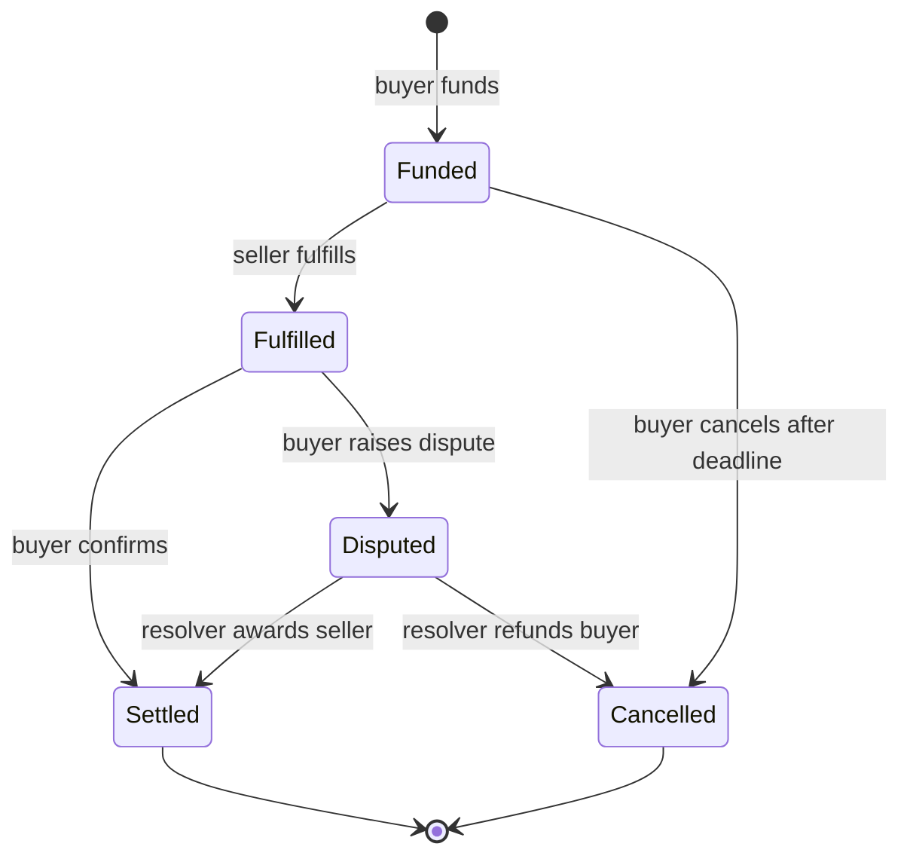
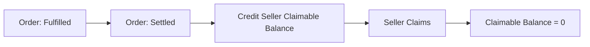
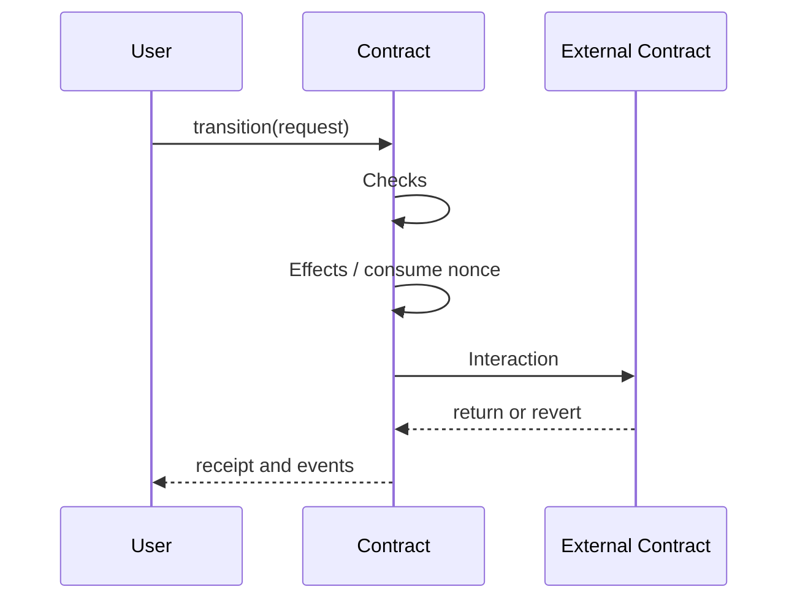
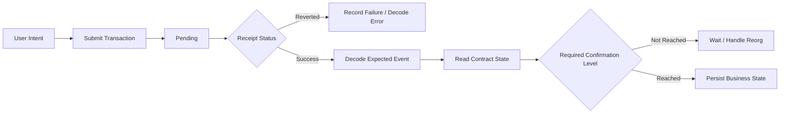

# 智能合约状态机：从合法迁移、超时取消到幂等与不变量

> 智能合约不是一组彼此独立的函数，而是一台由交易驱动、由链上状态记忆历史的确定性状态机。安全设计的关键不是“每个函数单独看起来正确”，而是任何调用顺序、失败、重试和外部回调都无法把系统带入非法状态，也不会让资产失去唯一、可恢复的归属。

---

## 一、本文解决什么问题

托管订单、拍卖、借贷、跨链消息和治理提案都有共同结构：对象从初始状态出发，在不同参与者和时间条件下迁移，最终进入成功、取消或失败状态。

事故通常发生在状态之间，而不只是某个算术表达式中：

- 同一订单先退款又结算，资产被重复分配；
- 到期判断边界不一致，双方都无法推进；
- 合约向一组接收者主动转账，其中一个 Revert 阻塞全局结算；
- 外部调用发生在状态更新前，回调重入重复领取；
- 签名消息没有绑定 Chain、Contract 或 Nonce，被跨域重放；
- 管理员升级后新增状态，却允许历史对象进入原本不存在的迁移；
- 客户端超时重试，第二笔交易把已经成功的操作当成新请求。

本文回答：

- 为什么需要 Explicit State，而不是用多个 Bool 拼接业务阶段？
- 如何定义 Legal Transition，并证明非法边不会发生？
- Terminal State 是否真的永远不能离开？
- Timeout 应依赖什么链上时间，边界如何统一？
- Cancellation 与 Refund、Failure 有什么区别？
- 链上操作怎样设计 Idempotency，客户端又应如何安全重试？
- Replay Protection 为什么必须绑定 Domain、Intent 和 Nonce？
- Pull over Push 如何隔离接收方失败与 Gas 风险？
- Checks-Effects-Interactions（CEI）能防什么，不能防什么？
- Invariant 如何把“永远成立的协议事实”变成可执行测试？

本文基于 Solidity 0.8.x 与 EVM 的通用公开语义。区块时间戳、交易排序、外部调用、回滚和日志等结论适用于一般 EVM 环境；具体排序、最终性和时间戳约束仍取决于目标链，不能把某条链的经验绝对化到所有 EVM 网络。

### 核心结论

1. 状态应显式、互斥且可枚举；多个 Bool 容易组合出没有业务含义的状态。
2. 状态机的安全边界由“当前状态 + 调用者 + 参数 + 时间 + 前置事实”共同决定，仅检查状态枚举不等于迁移合法。
3. 每条迁移都应定义前置条件、状态变化、资产变化、外部交互、事件和失败语义。
4. Terminal State 应在协议层明确禁止后续业务迁移，但仍可能允许只读查询或独立的 Pull Payment 领取。
5. Timeout 提供无协作进展路径，不提供精确现实世界时钟。边界必须统一使用 `<`、`<=`、`>` 或 `>=` 中明确的一套规则。
6. Cancellation 不是删除历史，而是一次有权限、有条件、有资产结算结果的显式迁移。
7. Idempotency 要保证相同意图重复到达不会产生第二次业务效果；简单让第二次调用 Revert 只是可检测重复，不一定满足业务幂等。
8. Replay Protection 必须绑定 Chain、验证合约、动作、参数、授权者、Nonce 与 Deadline 等必要域；交易 Nonce 不能替代应用层签名 Nonce。
9. Pull over Push 把“确认债权”和“实际收款”拆开，减少单个接收者阻塞整个状态迁移的风险。
10. CEI 是降低重入风险的控制流纪律，不替代重入锁、权限、返回值处理、Oracle 防护和不变量设计。
11. Invariant 应覆盖状态、资产守恒、唯一结算、权限与跨对象关系，并通过状态化模糊测试持续验证。

---

## 二、从函数集合转向状态迁移图

以买卖双方使用的托管订单为例：买方锁定资金，卖方履约，买方确认后卖方获得款项；若卖方长期不履约，买方可以超时取消。



图中的节点是业务事实，边是唯一允许的变化。`Settled` 和 `Cancelled` 是业务终态：订单不能重新回到 `Funded`。但终态之后，卖方或买方仍可能从独立的债权账本领取资金，这属于支付状态机，而不是订单业务状态回退。

### 2.1 一条迁移的六个组成部分

对 `Funded -> Fulfilled`，至少要定义：

1. **触发者**：只能是订单记录的 Seller；
2. **前置状态**：当前必须为 `Funded`；
3. **时间条件**：必须在履约 Deadline 前；
4. **Effects**：状态变为 `Fulfilled`，记录必要证明；
5. **Interactions**：是否调用外部合约，失败如何处理；
6. **Evidence**：发出包含 Order ID、参与者与关键数据的 Event。

如果其中任何一项没有定义，测试就很难判断“实现偏离了什么规则”。

---

## 三、Explicit State：让业务阶段成为一等数据

### 3.1 多个 Bool 的组合爆炸

下面设计看似直观：

```solidity
struct BadOrder {
    bool funded;
    bool fulfilled;
    bool cancelled;
    bool settled;
}
```

四个 Bool 理论上有 16 种组合，但业务也许只允许 6 种。`cancelled == true && settled == true`、`fulfilled == true && funded == false` 等组合究竟代表什么并不清晰。

使用枚举可以直接表达互斥阶段：

```solidity
enum OrderState {
    None,
    Funded,
    Fulfilled,
    Disputed,
    Settled,
    Cancelled
}
```

枚举没有自动保证迁移正确，但它缩小了可表示状态空间，并让 ABI、Event、测试和监控使用一致术语。

### 3.2 `None` 也需要语义

Mapping 中不存在的 Key 会返回类型默认值，因此把第一个枚举值保留为 `None`，可以区分“对象未创建”和“对象处于第一个真实业务状态”。如果 `Funded` 恰好为零值，读取任意不存在订单都可能被误认为已入金。

### 3.3 状态不是全部事实

同为 `Funded` 的两个订单，参与者、金额、Deadline 和资产地址仍不同。合法迁移需要联合检查这些字段。不要把一个 Enum 当成完整安全证明。

### 3.4 状态粒度的取舍

状态过少会把不同阶段塞进隐式条件，状态过多则增加边数量和升级负担。新增状态应代表会改变以下至少一项的稳定业务事实：

- 哪些调用者有权行动；
- 哪些迁移合法；
- 资产属于谁；
- 超时或取消规则；
- 对外可观察语义。

仅为一次函数内部步骤创建持久状态，可能是不必要的复杂度。

---

## 四、Legal Transition：只实现允许的边

显式枚举之后，仍需把迁移矩阵写清楚：

| 当前状态 | 动作 | 调用者 | 时间条件 | 下一状态 |
|---|---|---|---|---|
| `Funded` | `fulfill` | Seller | Deadline 前 | `Fulfilled` |
| `Funded` | `cancelExpired` | Buyer | Deadline 到达后 | `Cancelled` |
| `Fulfilled` | `confirm` | Buyer | 争议期内或按协议规则 | `Settled` |
| `Fulfilled` | `openDispute` | Buyer | 争议期内 | `Disputed` |
| `Disputed` | `resolveSeller` | Resolver | 无额外时间条件 | `Settled` |
| `Disputed` | `resolveBuyer` | Resolver | 无额外时间条件 | `Cancelled` |

### 4.1 检查顺序服务于正确性和诊断

典型迁移先验证对象存在、当前状态、调用者、时间和参数，再更新状态。顺序不会改变交易原子性，但会影响错误语义、无效调用成本和审计可读性。

```solidity
error OrderNotFound();
error InvalidState();
error Unauthorized();
error DeadlinePassed();

function fulfill(uint256 orderId, bytes32 evidenceHash) external {
    Order storage order = orders[orderId];
    if (order.state == OrderState.None) revert OrderNotFound();
    if (order.state != OrderState.Funded) revert InvalidState();
    if (msg.sender != order.seller) revert Unauthorized();
    if (block.timestamp >= order.fulfillDeadline) revert DeadlinePassed();

    order.state = OrderState.Fulfilled;
    order.evidenceHash = evidenceHash;

    emit OrderFulfilled(orderId, msg.sender, evidenceHash);
}
```

边界在此定义为 `block.timestamp < fulfillDeadline` 才能履约；当时间戳等于 Deadline 时已超时。取消函数必须使用与之互补的 `>=`，避免恰好在边界时两条路径都不允许或同时允许。

### 4.2 Modifier 不应隐藏复杂迁移

简单的状态或权限检查可以复用 Modifier，但时间分支、资产记账和多状态变化若全部塞进 Modifier，会让正文控制流难以审计。迁移的关键 Effects 最好在函数主体中清晰可见。

### 4.3 不要提供通用 `setState`

```solidity
// 错误示例：管理员可以绕过全部迁移前置条件。
function setState(uint256 orderId, OrderState newState) external onlyAdmin {
    orders[orderId].state = newState;
}
```

即使仅供“修复”，该入口也能跳过资产结算、事件、时间和唯一性规则。紧急修复应提供窄范围动作，或通过经过治理的升级与迁移流程完成，并验证全局不变量。

---

## 五、Terminal State：终态封闭业务历史

`Settled`、`Cancelled`、`Liquidated`、`Executed` 等终态表示对象的业务归属已经确定。

### 5.1 终态应禁止再次分配资产

一旦订单结算给 Seller，就不能再取消退款给 Buyer。最直接的保证是所有结算入口都要求特定非终态作为前置条件，并在首次结算时立即进入终态。

### 5.2 终态不等于对象不可再发生任何写入

Pull Payment 场景中，订单可能已 `Settled`，但 `claimable[seller]` 余额尚未领取。领取会改变支付账本，却不改变订单业务结果。这两个状态机应清晰分层：



订单终态确定“钱归谁”，领取状态确定“钱是否已转出”。混用一个 `paid` Bool 往往会模糊这两个事实。

### 5.3 升级不能随意重新解释终态

代理升级后若新增迁移，使历史 `Settled` 对象重新开放，就改变了既有资产承诺。升级测试必须覆盖旧版本所有状态，验证它们在新实现中的语义和允许边没有意外变化。

---

## 六、Timeout：为无协作场景提供进展路径

链上协议不能假设对手方永远在线。Timeout 允许在某方不行动时由另一方推进或退出。

### 6.1 `block.timestamp` 不是精确时钟

它是区块环境提供的时间戳，受目标链共识规则约束，但不能用于要求亚秒精度或严格现实时间排序的业务。协议应使用足够宽的时间窗口，并在目标链验证出块、停机和排序特性。

### 6.2 保存绝对 Deadline

创建对象时计算并保存 Deadline，通常比后续反复使用可治理 Duration 推导更容易审计：

```solidity
order.fulfillDeadline = block.timestamp + fulfillWindow;
```

需要先限制 `fulfillWindow` 的合理范围。Solidity 0.8.x 默认对普通整数算术执行溢出检查，但“数值不溢出”不代表业务期限合理。

若只保存创建时间并在读取时使用当前全局 Duration，管理员修改 Duration 可能追溯改变旧订单到期时间。是否允许这种行为必须显式决定。

### 6.3 Timeout 迁移示例

```solidity
error DeadlineNotReached();

function cancelExpired(uint256 orderId) external {
    Order storage order = orders[orderId];
    if (order.state != OrderState.Funded) revert InvalidState();
    if (msg.sender != order.buyer) revert Unauthorized();
    if (block.timestamp < order.fulfillDeadline) revert DeadlineNotReached();

    order.state = OrderState.Cancelled;
    claimable[order.buyer] += order.amount;

    emit OrderCancelled(orderId, msg.sender, CancelReason.Expired);
}
```

到期后不是主动向 Buyer 转账，而是确认其债权。这让订单状态能够完成，即使 Buyer 地址暂时无法接收资产。

### 6.4 时间与交易排序竞态

Seller 的履约交易可能在 Deadline 前进入 Mempool，却在 Deadline 后才被打包；合约只依据执行所在区块环境判断，不依据广播时间。客户端应展示链上 Deadline 与确认风险，不能承诺“按钮点击时未到期就一定成功”。

---

## 七、Cancellation：取消是一种结算结果

取消至少需要区分：

- 用户主动取消；
- 对手方超时导致取消；
- 仲裁决定退款；
- 管理或应急操作关闭；
- 创建交易回滚，实际上从未形成对象。

### 7.1 取消不应删除记录

把 Mapping 字段 `delete` 掉会丢失业务状态，并可能让同一 ID 看起来从未使用。通常应保留 `Cancelled` 状态与必要证据，通过 Event 记录原因；存储清理能否节省成本取决于目标链与当前 Gas 规则，不能作为破坏审计性的默认理由。

### 7.2 取消权限随阶段变化

`Funded` 阶段 Buyer 可能在超时后取消，`Fulfilled` 阶段则可能只能进入争议，不能单方退款。一个通用 `cancel()` 若没有根据状态和调用者细分，很容易绕过 Seller 已经完成的权益。

### 7.3 取消后的外部副作用

取消可能需要：

- 返还 Token；
- 撤销 NFT/Allowance；
- 释放跨链消息或锁仓；
- 更新聚合计数和手续费；
- 通知链下订单系统。

所有链上状态变化在同一交易 Revert 时会回滚，但链下系统必须只处理成功 Receipt，并考虑重组。跨链副作用不与源链交易原子提交，需要独立状态机和补偿策略。

---

## 八、Idempotency：让重试不产生第二次业务效果

交易提交后，客户端可能因 RPC 超时不知道交易是否已广播或确认。安全重试需要区分两层幂等。

### 8.1 交易层重复与业务层重复

- 同一已签名原始交易重复广播：通常由 Sender 与 Transaction Nonce 标识，网络不会把完全相同 Nonce 的两笔交易都按顺序执行成功。
- 重新签名并使用新 Transaction Nonce 调用同一业务动作：对 EVM 是两笔不同交易，必须由合约阻止重复业务效果。

因此账户 Transaction Nonce 不能替代订单状态、Request ID 或应用层 Nonce。

### 8.2 Revert 型幂等与结果型幂等

若 `settle(orderId)` 首次成功后，第二次因状态不合法 Revert，协议避免了重复结算。这是常见且安全的“拒绝重复”。

某些 Relayer/API 希望重复请求返回已完成结果而非失败，可以设计显式 Request ID 和结果查询，但不能为了返回成功而掩盖参数冲突：同一 ID 对应不同 Intent 必须拒绝。

### 8.3 唯一 Intent Key

```solidity
mapping(bytes32 intentId => bool consumed) public consumedIntents;

function executeIntent(bytes32 intentId, /* signed parameters */) external {
    if (consumedIntents[intentId]) revert IntentAlreadyConsumed();
    // Verify signature, deadline, parameters and current state first.
    consumedIntents[intentId] = true;
    // Apply effects and perform constrained interactions.
}
```

`intentId` 必须由规范编码的业务字段生成或由可信授权者唯一分配。只使用 `keccak256(abi.encodePacked(...))` 前应确认动态类型拼接不存在歧义；结构化数据优先使用明确类型编码和经过验证的签名标准。

### 8.4 标记已消费的时机

标记必须在外部交互前完成，以阻止回调重入。若后续调用 Revert，整笔交易的标记也会回滚，因此不会留下“未执行却永久已消费”的状态。若使用 `try/catch` 吞掉外部失败，则必须明确 Intent 是已消费、可重试还是进入 Pending 状态。

---

## 九、Replay Protection：阻止同一授权跨上下文复用

Replay Protection 针对的是“有效授权被再次使用”，不只针对完全相同的交易。

### 9.1 签名消息应绑定的域

典型授权至少需要覆盖：

- Chain ID；
- Verifying Contract 地址；
- 动作类型或 Type Hash；
- 授权者与必要参与者；
- 完整业务参数；
- 应用层 Nonce 或唯一 Salt；
- Deadline；
- 必要时绑定当前配置版本。

缺少 Chain ID 可能导致跨链重放，缺少 Contract 地址可能在同链多个实例间重放，缺少动作类型可能把一种授权误用于另一种入口。

### 9.2 Nonce 策略

| 策略 | 优点 | 边界 |
|---|---|---|
| 单调递增 Nonce | 状态少、顺序清晰 | 并行 Intent 与失效管理较困难 |
| Bitmap Nonce | 支持乱序和批量空间 | 位图与 Namespace 设计更复杂 |
| 唯一 Salt/Hash | 自然对应独立 Intent | 存储增长与冲突治理 |
| 每对象 Nonce | 隔离不同订单/账户 | 需要明确对象生命周期 |

Nonce 不只是防重放字段，也定义了并发和取消模型。不能只复制某个库的 Nonce 形式而忽略业务是否需要乱序执行。

### 9.3 Deadline 不能替代 Nonce

同一签名在 Deadline 前仍可被重复提交。Deadline 限制有效时间，Nonce/Consumed Mapping 限制使用次数，两者解决不同问题。

### 9.4 Proxy 与签名 Domain

Proxy 场景下用户交互地址通常是 Proxy，验证域应与实际协议约定一致。升级是否改变 Domain Version、历史签名是否继续有效、初始化时是否正确设置域参数，都需要专项测试。

---

## 十、Pull over Push：先确认债权，再由用户领取

### 10.1 Push 的阻塞问题

结算时直接转给接收者：

```solidity
// 风险示例：接收方失败会阻止订单完成。
(bool ok, ) = order.seller.call{value: order.amount}("");
if (!ok) revert TransferFailed();
order.state = OrderState.Settled;
```

除了状态更新发生在外部调用之后造成重入风险外，Seller 合约的 Receive/Fallback 还可以主动 Revert，使 Buyer 永远无法完成确认。

### 10.2 Pull Payment

订单结算只更新债权：

```solidity
function confirm(uint256 orderId) external {
    Order storage order = orders[orderId];
    if (order.state != OrderState.Fulfilled) revert InvalidState();
    if (msg.sender != order.buyer) revert Unauthorized();

    order.state = OrderState.Settled;
    claimable[order.seller] += order.amount;

    emit OrderSettled(orderId, order.seller, order.amount);
}
```

领取时遵循先清零、后交互：

```solidity
function claim() external {
    uint256 amount = claimable[msg.sender];
    if (amount == 0) revert NothingToClaim();

    claimable[msg.sender] = 0;

    (bool ok, ) = payable(msg.sender).call{value: amount}("");
    if (!ok) revert TransferFailed();

    emit Claimed(msg.sender, amount);
}
```

若转账失败，整笔交易 Revert，余额清零也会回滚，用户之后可以再次领取。

### 10.3 Pull 的代价

- 用户需要额外交易和 Gas；
- 合约长期保管未领取资产；
- 需要处理批量领取、尘埃和账户不可用；
- 资产负债不变量与监控更复杂；
- ERC-20 的非标准返回行为仍需安全封装处理。

Pull over Push 是隔离失败的常用设计，不是所有支付场景的绝对规则。单一可信目标、严格原子组合等场景可能合理使用 Push，但必须评估接收方行为和失败传播。

---

## 十一、Checks-Effects-Interactions：把状态承诺放在外部控制权之前

CEI 的一般顺序是：

1. **Checks**：验证状态、权限、时间、金额和签名；
2. **Effects**：更新状态、余额、Nonce 和资产归属；
3. **Interactions**：调用 Token、Oracle、Hook 或接收方。



如果外部调用 Revert 且没有被捕获，之前的 Effects 随整笔交易回滚。若外部合约回调重入，它看到的是已经更新后的状态，因此同一路径通常无法再次通过旧前置条件。

### 11.1 CEI 不是完整重入防护

仍需考虑：

- 跨函数重入：回调进入另一个共享状态函数；
- 跨合约重入：多个模块共享资产或记账；
- Read-only Reentrancy：外部系统在中间状态读取并据此行动；
- Hook Token、NFT Receiver 和任意 Callback；
- 捕获失败后保留部分 Effects 的语义；
- 状态更新正确但定价或权限事实已过期。

高风险入口常结合 CEI、重入锁、Pull Payment 和不变量测试。锁也不能修复错误资产记账，只能限制特定调用重叠。

### 11.2 外部调用结果必须有策略

低级调用返回 `success` 与 Return Data。不能忽略失败，也不能假设 `success == true` 就等于业务成功；目标可能没有预期代码，或返回值不符合接口语义。Token 交互应使用与目标资产兼容、经过验证的安全封装。

---

## 十二、完整托管状态机骨架

以下代码聚焦状态迁移和 Pull Payment。为控制篇幅，它不包含 ERC-20 适配、争议仲裁、手续费、升级和签名订单；生产系统需要按资产类型和威胁模型补齐。

```solidity
// SPDX-License-Identifier: MIT
pragma solidity ^0.8.24;

contract NativeEscrow {
    enum OrderState { None, Funded, Fulfilled, Settled, Cancelled }

    struct Order {
        address buyer;
        address seller;
        uint128 amount;
        uint64 fulfillDeadline;
        OrderState state;
    }

    error InvalidAddress();
    error InvalidAmount();
    error InvalidState();
    error Unauthorized();
    error DeadlinePassed();
    error DeadlineNotReached();
    error NothingToClaim();
    error TransferFailed();

    uint256 public nextOrderId = 1;
    mapping(uint256 orderId => Order order) public orders;
    mapping(address account => uint256 amount) public claimable;

    event OrderFunded(
        uint256 indexed orderId,
        address indexed buyer,
        address indexed seller,
        uint256 amount,
        uint256 fulfillDeadline
    );
    event OrderFulfilled(uint256 indexed orderId, address indexed seller);
    event OrderSettled(uint256 indexed orderId, address indexed seller, uint256 amount);
    event OrderCancelled(uint256 indexed orderId, address indexed buyer, uint256 amount);
    event Claimed(address indexed account, uint256 amount);

    function fund(address seller, uint64 fulfillWindow)
        external
        payable
        returns (uint256 orderId)
    {
        if (seller == address(0) || seller == msg.sender) revert InvalidAddress();
        if (msg.value == 0 || msg.value > type(uint128).max) revert InvalidAmount();
        if (fulfillWindow == 0) revert InvalidAmount();

        uint256 deadline = block.timestamp + fulfillWindow;
        if (deadline > type(uint64).max) revert InvalidAmount();

        orderId = nextOrderId++;
        orders[orderId] = Order({
            buyer: msg.sender,
            seller: seller,
            amount: uint128(msg.value),
            fulfillDeadline: uint64(deadline),
            state: OrderState.Funded
        });

        emit OrderFunded(orderId, msg.sender, seller, msg.value, deadline);
    }

    function fulfill(uint256 orderId) external {
        Order storage order = orders[orderId];
        if (order.state != OrderState.Funded) revert InvalidState();
        if (msg.sender != order.seller) revert Unauthorized();
        if (block.timestamp >= order.fulfillDeadline) revert DeadlinePassed();

        order.state = OrderState.Fulfilled;
        emit OrderFulfilled(orderId, msg.sender);
    }

    function confirm(uint256 orderId) external {
        Order storage order = orders[orderId];
        if (order.state != OrderState.Fulfilled) revert InvalidState();
        if (msg.sender != order.buyer) revert Unauthorized();

        order.state = OrderState.Settled;
        claimable[order.seller] += order.amount;

        emit OrderSettled(orderId, order.seller, order.amount);
    }

    function cancelExpired(uint256 orderId) external {
        Order storage order = orders[orderId];
        if (order.state != OrderState.Funded) revert InvalidState();
        if (msg.sender != order.buyer) revert Unauthorized();
        if (block.timestamp < order.fulfillDeadline) revert DeadlineNotReached();

        order.state = OrderState.Cancelled;
        claimable[order.buyer] += order.amount;

        emit OrderCancelled(orderId, order.buyer, order.amount);
    }

    function claim() external {
        uint256 amount = claimable[msg.sender];
        if (amount == 0) revert NothingToClaim();

        claimable[msg.sender] = 0;
        (bool ok, ) = payable(msg.sender).call{value: amount}("");
        if (!ok) revert TransferFailed();

        emit Claimed(msg.sender, amount);
    }
}
```

这个骨架具有以下可验证性质：

- 一个订单只能从 `Funded` 进入 `Fulfilled` 或 `Cancelled`；
- `Fulfilled` 只能进入 `Settled`；
- 结算和取消不能同时成功；
- 业务终态先落地，再由独立领取入口转账；
- 领取先清零再交互，失败时整笔回滚；
- Deadline 前后路径使用互补边界。

它也有明确边界：Seller 履约后 Buyer 可以永远不确认，真实协议需要争议期或 Seller 超时结算；合约只支持原生资产，且没有处理强制转入的额外余额。因此示例用于理解状态机，不是完整托管产品。

---

## 十三、Invariant：定义任何调用序列后都必须成立的事实

单元测试通常验证一条预期路径，不变量测试验证大量操作序列后系统仍满足全局事实。

### 13.1 状态不变量

- `None` 订单没有有效参与者和金额；
- `Settled` 与 `Cancelled` 不会再进入其他业务状态；
- 每个有效订单的 Buyer、Seller 和 Amount 在生命周期内不被意外改写；
- Deadline 边界不存在既不能履约也不能取消的空洞。

### 13.2 资产不变量

对简化原生资产托管，可以建立会计关系：

```text
contract accounted liability
= amounts locked in non-terminal orders
+ all claimable balances
```

但 EVM 合约可能通过 `selfdestruct` 等机制或协议特定路径收到非预期原生资产，因此通常更稳健的断言是实际余额不少于已记账负债，而不是永远严格相等。具体行为还需结合目标 EVM 版本与链规则验证。

对于 ERC-20，还需考虑转账税、Rebase、Hook、非标准返回值和余额变化模型，不能直接假设请求金额等于实际到账金额。

### 13.3 唯一结算不变量

每个订单金额只能计入一个最终受益人的 `claimable` 一次。可以维护测试侧 Ghost State，记录模型中的预期债权，与合约状态逐步比较。

### 13.4 权限不变量

- 非 Seller 不能履约；
- 非 Buyer 不能确认或按规则取消；
- Resolver 只能处理 `Disputed` 对象；
- Pause/Upgrade 后不应出现新的旁路迁移。

### 13.5 Invariant 不是一句注释

应把不变量落实为：

- Solidity/测试框架断言；
- Stateful Fuzzing Handler；
- Formal Specification 或 Model Checking（适合高价值核心逻辑）；
- 链上运行时检查和链下会计监控；
- 升级前后的历史状态回放。

形式化工具也只能证明给定模型和假设下的性质，不能自动覆盖遗漏的业务规则、恶意依赖或部署配置。

---

## 十四、状态化模糊测试方法

### 14.1 Handler 模拟参与者和动作

让 Fuzzer 随机选择 Buyer、Seller、时间推进和以下动作：

- `fund`；
- `fulfill`；
- `confirm`；
- `cancelExpired`；
- `claim`；
- 非授权账户调用；
- 恶意接收合约回调或拒收。

每次调用后检查资产负债、终态封闭和唯一结算等不变量。

### 14.2 不要过度约束输入

如果测试只生成合法调用顺序，就无法发现非法边是否被实现接受。应允许无效调用，并验证它们 Revert 且状态没有变化。

### 14.3 覆盖时间边界

至少测试 `deadline - 1`、`deadline`、`deadline + 1`，以及目标类型边界和治理修改时间参数后的旧对象行为。不要只测试“明显没到期”和“明显已到期”。

### 14.4 恶意外部合约

准备能够：

- Receive 时 Revert；
- Receive 时重入 `claim` 或其他入口；
- 返回异常长度数据；
- 消耗大量 Gas；
- 在 Callback 中读取中间状态。

用它们验证 Pull Payment、CEI、失败传播和跨函数重入边界。

---

## 十五、链下系统如何跟踪链上状态机

链下订单服务不能把“交易已发送”视为状态迁移成功。可靠流程是：



### 15.1 Event 与状态读取各有职责

Event 适合增量发现变化，链上 Storage 是当前状态事实。索引器应验证 Contract Address、Topic、参数和 Receipt 成功状态，并通过定期回扫处理断连和重组。

### 15.2 Pending 不是链上业务状态

Pending 是客户端观察到的交易生命周期，不代表合约已进入某个 Enum 状态。交易可能被替换、丢弃、Revert 或处于最终性不足的区块。

### 15.3 客户端重试先查 Intent

RPC 超时后应先按 Transaction Hash、Sender/Nonce、Order ID 或 Intent ID 查询，再决定重播原始交易、替换交易还是构造新交易。盲目使用新 Nonce 重发可能触发第二次业务动作。

---

## 十六、升级与状态机兼容

### 16.1 枚举值也是持久数据协议

若 Enum 写入 Storage，调整已有成员顺序会改变数值解释。升级时通常只能谨慎追加新值，且仍需验证 Compiler、Storage Layout 和所有旧状态语义。不要把“名称没变”当作布局兼容证明。

### 16.2 新边会改变既有承诺

新增 `Settled -> Reopened` 即使不改 Storage Layout，也改变了协议行为。升级审查应比较迁移图，而不仅比较变量 Slot。

### 16.3 初始化与迁移

新版本增加 Deadline、Nonce 或状态字段时，旧对象的默认零值可能被解释成“已到期”“未使用”或有效第一状态。迁移策略需要明确：

- 是否批量迁移；
- 是否惰性迁移；
- 如何区分旧对象；
- 迁移失败能否重试；
- 迁移期间哪些入口暂停；
- 新旧不变量如何同时成立。

### 16.4 Emergency State 不能成为永久旁路

升级加入紧急状态后，进入和退出路径都必须受权限、事件和恢复规则约束。一个能把任意对象直接改为任意状态的管理员入口会破坏状态机全部证明。

---

## 十七、常见误区与错误案例

### 17.1 “有 Enum 就是状态机”

错误。Enum 只表示状态集合；合法边、权限、时间、资产 Effects 和外部交互共同构成状态机。

### 17.2 “交易原子性保证不会出现业务不一致”

错误。原子性只保证同一交易成功或回滚，不保证设计的状态转移、资产归属或跨交易顺序正确，也不覆盖跨链原子性。

### 17.3 “第二次调用 Revert，所以接口就是幂等的”

不一定。它确实避免第二次 Effect，但调用方是否能识别首次结果、相同 Request ID 是否绑定相同参数，仍属于幂等契约的一部分。

### 17.4 “Deadline 到了，链下看到的交易就一定失败”

错误。结果取决于交易实际执行区块的时间戳和排序，而不是用户广播或界面显示时间。

### 17.5 “CEI 可以防止所有重入”

错误。跨函数、跨合约和只读重入仍需建模，且 CEI 不能修复错误权限、价格或会计逻辑。

### 17.6 “Pull Payment 没有 DoS 风险”

错误。它隔离单个接收者失败，但仍有未领取负债增长、批量遍历、账户不可用和资产兼容等问题。

### 17.7 “Event 发出后链下状态就最终确定”

错误。Event 可能处于最终性不足的区块并随重组消失；交易 Revert 的日志不会进入成功 Receipt。

### 17.8 “升级只要 Storage Layout 兼容即可”

错误。状态数值、迁移边、权限、Deadline 和历史签名语义同样必须兼容。

### 17.9 “签名带 Deadline 就不会重放”

错误。Deadline 只限制时间窗，在有效期内仍需 Nonce 或 Consumed 标记限制重复使用。

---

## 十八、工程方案选择

### 18.1 单一状态机还是分层状态机

订单状态、支付领取、争议和跨链消息可能各有独立生命周期。把全部组合进一个巨大 Enum 会产生状态乘积；完全拆散又可能失去跨模块约束。

更实用的方式是：

- 每个子域有清晰状态机；
- 明确哪些事件触发另一个状态机；
- 用跨域 Invariant 约束资产和顺序；
- 避免两个模块都认为自己拥有同一资产的最终决定权。

### 18.2 Push 与 Pull

| 维度 | Push | Pull |
|---|---|---|
| 交易数量 | 通常较少 | 接收者额外领取 |
| 接收方失败 | 可能阻塞主流程 | 通常隔离到领取流程 |
| 重入表面 | 主迁移中发生交互 | 集中在领取入口 |
| 资金托管时间 | 通常较短 | 未领取资金继续留存 |
| 批量支付 | 易受单点失败/Gas 影响 | 债权分散领取 |

方案取决于原子性要求、接收方可信度、资产标准和用户体验，不应只依据一句安全口诀。

### 18.3 Revert 还是返回已有结果

链上直接入口通常让重复迁移 Revert 更清晰、Gas 也不会执行后续逻辑。Relayer 场景可在链下把 `AlreadyProcessed` 解释为成功收敛，但必须核对原始 Intent 的参数与最终状态一致。

---

## 十九、测试与发布检查清单

- [ ] 所有业务状态均显式定义，默认零值语义明确。
- [ ] 已绘制完整迁移图和迁移矩阵。
- [ ] 每条边包含调用者、时间、参数、Effects、Interactions 和 Event。
- [ ] 非法状态、错误调用者和错误边界均有负向测试。
- [ ] 所有终态禁止再次分配同一资产。
- [ ] Deadline 前后使用互补比较并覆盖精确边界。
- [ ] 取消路径明确资产归属和恢复方式。
- [ ] 应用层 Intent 具备唯一 ID、Nonce 与 Deadline 策略。
- [ ] 签名绑定 Chain、Contract、动作和完整参数。
- [ ] 外部交互遵循明确失败策略，并测试恶意接收者。
- [ ] Push/批量循环不会被单个接收者阻塞，或已有接受该风险的依据。
- [ ] CEI、重入锁与 Pull Payment 的组合经过跨函数测试。
- [ ] 资产负债、唯一结算和权限不变量已实现为自动化测试。
- [ ] Fork 环境验证真实 Token、Oracle、Proxy 和时间行为。
- [ ] 升级比较 Enum 数值、迁移图、Storage Layout 和旧对象行为。
- [ ] 链下索引处理 Receipt、补扫、重组和确认级别。

---

## 二十、总结

智能合约状态机把“什么可以发生”从隐含代码路径提升为可审计协议：

1. Explicit State 缩小可表示状态空间，但仍需完整迁移条件。
2. Legal Transition 由状态、身份、时间、参数和外部事实共同约束。
3. Terminal State 封闭业务历史，支付领取等后续动作应由独立子状态机处理。
4. Timeout 和 Cancellation 为对手不协作提供进展路径，同时必须统一边界和资产结算。
5. Idempotency 处理重试的业务效果，Replay Protection 处理有效授权的跨上下文复用。
6. Pull over Push 隔离接收者失败，CEI 在外部控制权转移前提交内部 Effects。
7. Invariant 把状态封闭、资产守恒、唯一结算和权限事实变成可执行验证。
8. 升级不仅要保持 Storage Layout，还要保持历史状态、迁移边与签名域的协议兼容。

真正需要审计的不是某条“正常路径”，而是所有调用顺序、边界时间、失败和重入组合之后，系统是否仍然知道资产属于谁、下一步允许谁做什么，以及如何安全结束。

---

## 问答复盘

### Q1：为什么多个 Bool 通常不适合表示业务状态？

**答：** 多个 Bool 会产生大量无业务意义的组合，互斥关系需要分散维护。Enum 能缩小状态空间，但合法迁移仍需单独校验。

### Q2：状态正确是否足以证明一次迁移合法？

**答：** 不足。还必须验证调用者、参数、时间、签名、资产事实和外部依赖；同一状态下不同主体和对象的合法动作可能完全不同。

### Q3：Terminal State 之后为什么还能执行 `claim()`？

**答：** 订单终态只确定资产最终归属，领取属于独立支付状态机。`claim()` 不应让订单重新进入业务中间态或再次分配同一金额。

### Q4：`block.timestamp` 到达 Deadline 时应该走哪条路径？

**答：** 由协议明确规定，并让两条路径使用互补边界。例如履约要求 `< deadline`，超时取消要求 `>= deadline`，避免边界空洞或重叠。

### Q5：交易 Nonce 为什么不能替代签名 Intent 的 Nonce？

**答：** 交易 Nonce 只约束某个 Sender 的交易顺序。相同业务授权可以由 Relayer 用不同交易 Nonce 提交，因此合约仍需应用层 Nonce 或 Consumed 标记。

### Q6：第二次结算调用 Revert 是否意味着没有重复支付风险？

**答：** 只有当首次调用在外部交互前已经进入终态或消费 Intent，且所有其他入口也受同一不变量约束时才成立。还需测试跨函数重入和旁路结算入口。

### Q7：Pull over Push 的主要收益和代价是什么？

**答：** 它让接收方失败不阻塞主状态迁移，并集中外部转账风险；代价是额外领取交易、长期负债管理和更复杂的资产会计。

### Q8：CEI 为什么不能替代 Reentrancy Guard？

**答：** CEI 是局部控制流原则，跨函数、跨合约和只读重入仍可能存在。重入锁也不是万能方案，两者都必须服从正确的资产与状态不变量。

### Q9：状态机升级最容易遗漏什么？

**答：** 只检查 Storage Slot，却忽略 Enum 数值、旧对象默认值、新增迁移边、历史签名有效性和终态是否被重新开放。

### Q10：如何验证“订单最多结算一次”？

**答：** 除单元测试外，应在状态化模糊测试中维护模型债权，随机执行合法与非法操作，并持续断言每个订单金额只进入一个最终受益人的债权一次。

---

## 延伸知识

- **权限模型**：Ownable、RBAC、Multisig、Timelock、Guardian 与最小权限。
- **Upgradeability**：Initializer、Storage Layout、迁移与 Upgrade Authorization。
- **合约安全**：Reentrancy、Unchecked Call、Oracle Manipulation、DoS 与 Forced Balance。
- **交易与最终性**：Mempool、Transaction Nonce、Replacement、Reorg 与确认策略。
- **跨链状态机**：Message ID、Source Finality、Retry、Compensation 与双花防护。
