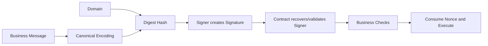
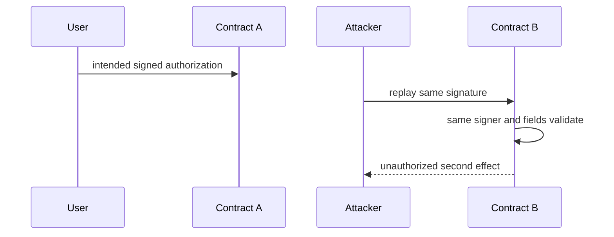
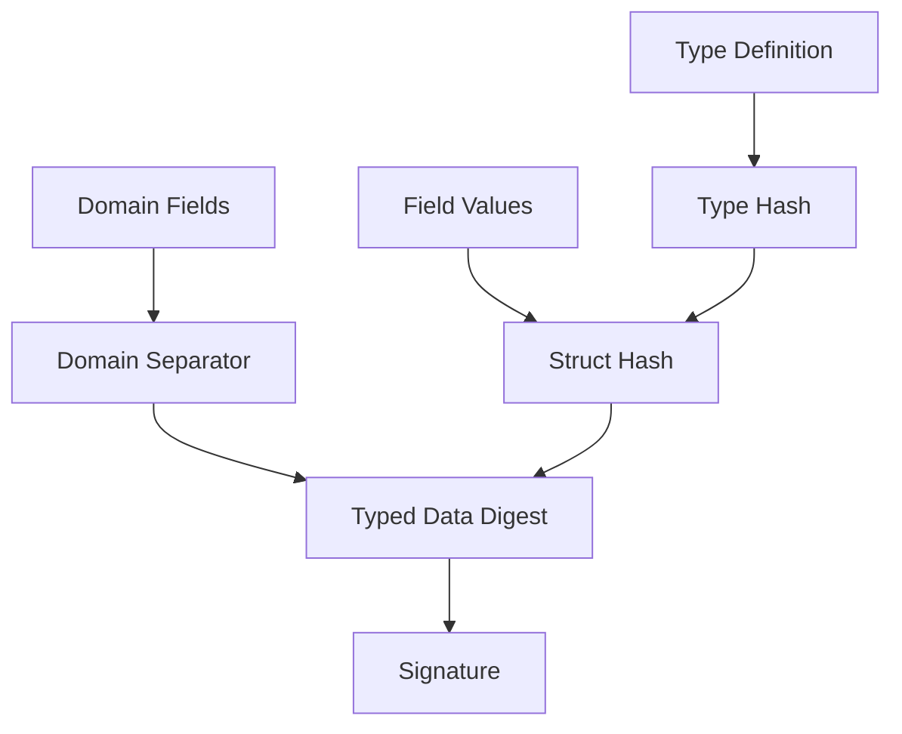
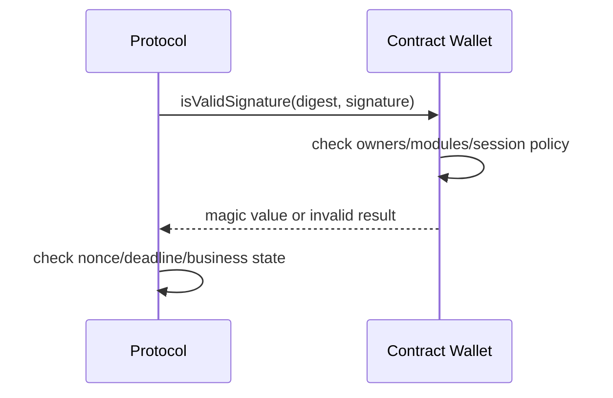
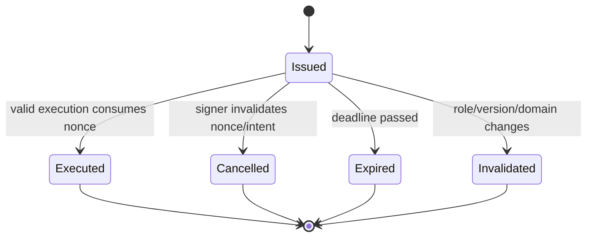

# 智能合约签名安全：从 EIP-191、EIP-712 到 Nonce、合约签名与跨域重放

> 签名只能证明某个验证规则下，某个主体认可了一段确定字节；它不会自动说明这段字节属于哪条链、哪个合约、哪种操作、能使用几次、何时过期，也不会证明当前业务状态仍允许执行。签名安全的核心不是调用一次 `ecrecover`，而是构造不可歧义的授权域、管理完整生命周期，并让 EOA 与合约账户都在同一业务不变量下收敛。

---

## 一、本文解决什么问题

链下签名常用于：

- Permit/Allowance；
- 限价订单与 Intent；
- 白名单 Mint；
- Relayer/元交易；
- 多签和智能账户；
- Bridge/Cross-chain Message；
- Off-chain Vote；
- Session Key 与 Delegation；
- Gasless Claim 或 Withdrawal。

“签名恢复出正确地址”仍可能发生严重问题：

- 同一签名在两条链使用；
- 在同链另一个合约使用；
- 在另一个函数或业务场景使用；
- 被 Relayer 重复提交；
- Deadline 过后仍能执行；
- Nonce 在失败、取消或并行请求中管理错误；
- `abi.encodePacked` 产生字段边界歧义；
- 高 `s`/不同编码让同一授权产生不同签名字节；
- 只支持 ECDSA，合约钱包永远无法授权；
- ERC-1271 钱包升级后，历史签名有效性改变；
- Proxy 升级改变 Domain 或重复初始化 Nonce；
- 签名参数正确，但执行时价格、Allowance 或状态已经变化。

本文覆盖：

- Domain Separation；
- Chain ID；
- Contract Address Binding；
- Nonce；
- Deadline；
- EIP-191；
- EIP-712；
- Signature Malleability；
- Contract Signature；
- Cross-chain Replay；
- Cross-contract Replay。

本文以 Solidity 0.8.x、EVM 和 secp256k1 ECDSA 的通用模型为基础。具体钱包签名展示、JSON-RPC 方法、库 API、Typed Data 支持、ERC-1271 实现和代理 Domain 缓存策略会随客户端与版本变化；生产实现必须锁定依赖并以相关 EIP/ERC 规范、库源码和目标钱包实测为准。

### 核心结论

1. 签名验证包含三层：字节编码正确、签名主体有效、业务授权当前可执行。任何一层缺失都可能形成漏洞。
2. Domain Separation 应让同一业务消息在不同协议、版本、链和合约中产生不同 Digest。
3. Chain ID 防止常见跨链重放，但不能单独区分同链多个合约或同合约多个动作。
4. Verifying Contract 必须绑定用户实际授权的执行域；Proxy 场景通常围绕用户调用的 Proxy 地址设计，而不是 Implementation 地址。
5. Nonce 限制授权使用次数并定义并发/取消模型；交易 Nonce 不能替代应用层 Nonce。
6. Deadline 只限制有效时间，不限制使用次数，也不能阻止有效期内 Front-running。
7. EIP-191 提供带版本前缀的已签名数据框架；EIP-712 在其框架中定义 Typed Structured Data Hashing and Signing。
8. EIP-712 改善结构化表达和钱包可读性，不自动提供 Nonce、Deadline、权限或业务状态检查。
9. Signature Malleability 要在验证层规范化处理；业务唯一性应基于 Intent/Digest/Nonce，而不是原始 Signature Bytes。
10. Contract Signature 必须按合约账户协议验证，例如 ERC-1271 风格 Magic Value；有效性可能随链上状态和升级变化。
11. 跨链、跨合约和跨函数重放是不同边界，必须分别绑定 Chain、Contract 与 Action Type。
12. 已消费标记应在外部交互前更新；若捕获失败，则必须定义签名是否可重试。

---

## 二、签名到底证明了什么

对 EOA ECDSA 签名，简化流程是：



每个阶段都有独立失败语义：

- 编码歧义：用户和合约签的不是同一消息；
- Domain 缺失：同一消息可在其他上下文使用；
- Signer 错误：授权主体不匹配；
- Nonce/Deadline 错误：授权重复或过期；
- 业务状态错误：余额、价格、权限或对象状态已变化；
- 执行失败：外部调用 Revert 或 Slippage 不满足。

签名本身不会读取链上状态，也不会冻结签署时的价格。协议必须把所有需要固定的条件放进消息，并在执行时验证当前状态。

### 2.1 Digest、Signature 与 Intent

- **Message/Intent**：用户想授权的业务事实；
- **Digest**：按标准编码并 Hash 后的固定值；
- **Signature**：对 Digest 的密码学证明；
- **Execution**：合约验证后产生的状态变化。

不要用原始 Signature Bytes 作为业务唯一 ID，因为可塑性或不同签名编码可能让同一 Intent 拥有不同字节表示。更稳健的是用结构化 Intent ID、Digest 或 Signer + Nonce 建立唯一性。

---

## 三、Domain Separation：让同一消息只属于一个上下文

假设用户签署：

```text
Transfer 100 tokens to Bob
```

若没有 Domain，这段授权可能被解释为不同 Token、不同链、不同合约甚至不同动作。Domain Separation 把上下文加入 Digest，使消息不能自然跨域复用。

### 3.1 Domain 常见维度

- 应用/协议名称；
- 版本；
- Chain ID；
- Verifying Contract；
- 必要时 Salt 或明确业务 Namespace。

EIP-712 定义了标准 Domain 类型和字段语义，实际采用哪些字段应遵循规范与实现约定。不要随意添加钱包无法正确展示或客户端无法一致编码的自定义结构后仍声称是标准 EIP-712。

### 3.2 Action Type 也属于域

即使 Domain 相同，不同动作也要使用不同 Struct Type，例如：

```text
Withdraw(owner, receiver, amount, nonce, deadline)
Delegate(owner, delegatee, scope, nonce, deadline)
```

如果两种动作复用同一字段编码且缺少 Type Hash，Withdraw 签名可能被另一入口解释为 Delegate。

### 3.3 Domain Version

版本可用于区分不兼容签名语义。升级时是否改变版本需要明确：

- 不改变：旧签名可能继续有效；
- 改变：所有未执行旧签名失效；
- 同时支持多版本：验证面和重放空间更复杂。

版本字符串不是代码版本的自动证明。合约必须按预期 Domain 计算 Digest，并在发布流程中对前后版本向量做测试。

---

## 四、Chain ID：约束常见跨链重放

Chain ID 把签名绑定到特定链上下文。若两条链部署相同地址和状态，而消息未绑定 Chain ID，攻击者可能把签名复制到另一条链。

### 4.1 Chain ID 不是所有跨域问题的答案

它不能区分：

- 同链两个 Verifying Contract；
- 同合约两个业务动作；
- 同合约两个不兼容协议版本；
- L1 与 L2 之间需要额外绑定的消息源/目标域；
- 应用自定义 Network/Domain ID。

### 4.2 Fork 与 Chain ID 变化

若网络分叉后 Chain ID 相同，签名可能在两个分支暂时都有效；若 Chain ID 变化，缓存的 Domain Separator 处理错误又可能导致验证异常。具体风险取决于链配置、最终性和合约实现。

实现应按所用库的公开设计处理 Chain ID，而不是自行缓存一个永不更新的值并假设网络永不变化。

### 4.3 跨链消息需要 Source 与 Destination

Bridge/跨链 Intent 通常还需绑定：

- Source Chain/Domain；
- Destination Chain/Domain；
- Source Contract；
- Destination Contract；
- Message Nonce/ID；
- Payload Hash；
- Sender 与 Receiver。

只绑定当前执行链 Chain ID，不能证明消息确实来自预期源链。

---

## 五、Contract Address Binding：绑定真正的验证合约

同一链可以部署多个具有相同 ABI 的合约。如果 Digest 没有绑定 Verifying Contract，签名可被复制到另一实例。

### 5.1 Cross-contract Replay



如果 A、B 使用相同消息格式、Signer 权限和 Nonce 初始状态，而没有地址绑定，签名可能在两处都成功。

### 5.2 Proxy 应绑定哪个地址

用户通常与 Proxy 地址交互，业务状态和 Nonce 也在 Proxy Storage，因此 Domain 的 Verifying Contract 通常应是 Proxy 地址。若错误绑定 Implementation：

- 多个 Proxy 可能共享同一 Implementation Domain；
- 用户签名展示与实际入口不一致；
- 升级 Implementation 后 Domain 行为难以治理。

具体实现应在 Proxy 上下文计算，并验证库是否正确处理 `address(this)`、缓存和升级。

### 5.3 Factory 与 Counterfactual Account

尚未部署的 Smart Account/CREATE2 地址也可能参与签名。需要绑定确定性地址、Factory、Salt、初始化配置和目标 Chain，避免同一部署意图被用于不同账户。具体账户抽象标准可能提供相应签名机制，应按版本规范实现。

---

## 六、Nonce：把授权变成一次性或有序能力

Nonce 是应用层重放保护的核心，但它同时定义并发模型。

### 6.1 单调 Nonce

```solidity
mapping(address signer => uint256 nonce) public nonces;

function execute(Authorization calldata auth, bytes calldata signature) external {
    if (auth.nonce != nonces[auth.owner]) revert InvalidNonce();
    _verify(auth, signature);

    nonces[auth.owner] = auth.nonce + 1;
    _apply(auth);
}
```

优点是状态简单、顺序明确；缺点是：

- 多个并行 Intent 相互阻塞；
- 前一个 Intent 未执行时后续不能执行；
- 取消通常需要推进 Nonce；
- Relayer 竞争更容易造成顺序失败。

递增操作仍要考虑上界，虽然实际达到整数上限通常不现实，也不应在安全论证中依赖“永远到不了”而使用危险环绕。

### 6.2 Unordered/Bitmap Nonce

把 Nonce 空间划分为 Word 与 Bit，可以支持乱序消费。代价是编码、取消、Namespace 和存储管理更复杂。账户抽象和订单协议常需要这种并发能力。

### 6.3 Intent ID/Salt

每个授权带唯一 Salt，合约记录 `consumed[digest]` 或 `consumed[intentId]`。适合独立订单，但状态可能持续增长，并需要处理同一 ID 不同参数冲突。

### 6.4 Per-object Nonce

每个 Position、Order 或 Token ID 有自己的 Nonce，可隔离对象并发。但对象创建、销毁和 ID 重用必须明确，否则旧签名可能在对象重建后复活。

### 6.5 Transaction Nonce 不能替代应用 Nonce

Relayer 可以用自己的多个 Transaction Nonce 提交同一用户签名；不同 Relayer 也有独立交易序列。业务合约必须自己消费用户授权 Nonce。

### 6.6 何时消费 Nonce

推荐顺序：

1. 校验 Domain、签名、Nonce、Deadline 和业务前置条件；
2. 在不可信外部调用前标记已消费；
3. 更新内部 Effects；
4. 执行外部交互。

若后续未捕获 Revert，Nonce 消费随整笔交易回滚。若 `try/catch` 吞掉外部错误，就必须决定授权是已消费、可重试还是进入 Pending 状态。

---

## 七、Deadline：限制时间，不保证执行

Deadline 防止一个签名无限期有效。验证通常采用明确边界：

```solidity
if (block.timestamp > auth.deadline) revert SignatureExpired();
```

这里等于 Deadline 时仍有效；也可以设计为 `>=` 过期，但签名方、合约、测试和前端必须一致。

### 7.1 Deadline 不解决什么

- 有效期内重复提交；
- 有效期内 Front-running；
- 价格和状态变化；
- Relayer 延迟；
- 签名泄露；
- 跨链/跨合约重放。

### 7.2 时间戳边界

合约按交易执行区块的时间戳判断，不按用户签署、广播或进入 Mempool 的时间。客户端应预留确认余量，不能让 Deadline 与预期打包时间完全相等。

### 7.3 Deadline 与取消

等待过期是一种被动取消，但时间窗内签名仍可执行。高风险 Intent 应支持显式取消 Nonce/Salt，尤其当签名已经泄露或业务条件改变时。

---

## 八、EIP-191：给已签名数据加上上下文前缀

EIP-191 定义 Signed Data 的版本化前缀框架，使签名数据与普通 Ethereum Transaction Encoding 等其他编码域区分。常见钱包“签名消息”流程通常使用其中一种带 Ethereum Signed Message 前缀的形式，但具体 RPC 与钱包显示应实测。

### 8.1 为什么不能直接签任意 32 Byte Hash

如果用户无法知道 Hash 对应什么业务内容，恶意前端可以让用户签署不可读数据；缺少前缀/域时，某些字节还可能在另一协议中被解释。

### 8.2 Personal Sign 风格的边界

它可以证明用户认可某段消息字节，但消息内部仍需自行包含：

- 协议与动作；
- Chain 与 Contract；
- 参数、Nonce、Deadline；
- 清晰无歧义的编码。

加上消息前缀不自动完成这些业务域绑定。

### 8.3 文本拼接风险

```text
"withdraw:" + amount + ":" + receiver
```

自定义文本若没有严格规范化，可能出现大小写、前导零、地址格式、Unicode 或字段边界差异。协议内部授权优先使用标准结构化编码；登录 Challenge 等文本消息也应固定模板、Origin、Nonce 和有效期。

---

## 九、EIP-712：Typed Structured Data

EIP-712 通过 Type Hash、Struct Hash 与 Domain Separator 构造结构化数据 Digest，目标是让钱包能够展示字段，并避免自定义拼接歧义。



### 9.1 结构示例

```solidity
struct TransferAuthorization {
    address owner;
    address token;
    address receiver;
    uint256 amount;
    uint256 nonce;
    uint256 deadline;
}
```

Type String、字段顺序和嵌套类型编码必须完全一致。前端字段顺序“看起来相同”不代表最终 Type Hash 相同。

### 9.2 `abi.encode` 与 `abi.encodePacked`

构造 Struct Hash 通常遵循规范使用标准 ABI 编码。对多个动态字段使用 `abi.encodePacked` 可能丢失边界：

```solidity
keccak256(abi.encodePacked("ab", "c"))
    == keccak256(abi.encodePacked("a", "bc"));
```

不要自行发明 Packed Typed Data 编码。

### 9.3 动态类型

String、Bytes、Array 和嵌套 Struct 的 Hash 规则需要按 EIP-712 规范实现。使用成熟库，并通过官方/跨语言测试向量验证前端与合约 Digest 一致。

### 9.4 可读性不是绝对保证

钱包可能：

- 完整展示字段；
- 只展示部分信息；
- 对未知类型显示 Hash；
- 对 Chain/Contract 给出警告；
- 被恶意前端用迷惑名称欺骗。

字段命名应表达真实业务含义，但链上安全不能依赖用户一定正确阅读界面。

### 9.5 EIP-712 不自带 Replay Protection

Domain Separator 只区分上下文，Struct 必须显式包含并验证 Nonce、Deadline 等字段。一个结构化签名如果没有一次性状态，仍可以无限重复执行。

---

## 十、一个限时转账授权模型

下面示例展示核心验证顺序。它省略 ERC-1271 分支、暂停、Fee-on-transfer Token 适配和完整库代码；生产中应使用锁定版本的成熟 ECDSA/EIP-712/Safe Token 库。

```solidity
// SPDX-License-Identifier: MIT
pragma solidity ^0.8.24;

contract SignedTransferExecutor {
    struct Authorization {
        address owner;
        address token;
        address receiver;
        uint256 amount;
        uint256 nonce;
        uint256 deadline;
    }

    error InvalidSigner();
    error InvalidNonce();
    error Expired();
    error InvalidReceiver();

    mapping(address owner => uint256 nonce) public nonces;

    bytes32 private constant AUTHORIZATION_TYPEHASH = keccak256(
        "Authorization(address owner,address token,address receiver,uint256 amount,uint256 nonce,uint256 deadline)"
    );

    function execute(Authorization calldata auth, bytes calldata signature) external {
        if (auth.receiver == address(0)) revert InvalidReceiver();
        if (block.timestamp > auth.deadline) revert Expired();
        if (auth.nonce != nonces[auth.owner]) revert InvalidNonce();

        bytes32 structHash = keccak256(
            abi.encode(
                AUTHORIZATION_TYPEHASH,
                auth.owner,
                auth.token,
                auth.receiver,
                auth.amount,
                auth.nonce,
                auth.deadline
            )
        );

        bytes32 digest = _hashTypedDataV4(structHash);
        address signer = _recoverChecked(digest, signature);
        if (signer != auth.owner) revert InvalidSigner();

        nonces[auth.owner] = auth.nonce + 1;
        _safeTransferFrom(auth.token, auth.owner, auth.receiver, auth.amount);
    }

    function _hashTypedDataV4(bytes32 structHash) internal view returns (bytes32) {
        // Use a version-pinned, audited EIP-712 implementation in production.
        revert("illustrative only");
    }

    function _recoverChecked(bytes32 digest, bytes calldata signature)
        internal
        pure
        returns (address)
    {
        // Use a version-pinned ECDSA library that rejects invalid/malleable signatures.
        digest;
        signature;
        revert("illustrative only");
    }

    function _safeTransferFrom(
        address token,
        address owner,
        address receiver,
        uint256 amount
    ) internal {
        // Use a safe ERC-20 wrapper and define unsupported-token behavior.
        token;
        owner;
        receiver;
        amount;
        revert("illustrative only");
    }
}
```

这段代码刻意让辅助函数 Revert，避免把省略实现误认为可部署模板。真正需要验证的顺序是：

1. 业务参数、Deadline、Nonce；
2. 标准 Typed Data Digest；
3. 规范化 ECDSA/合约签名验证；
4. 外部调用前消费 Nonce；
5. 使用安全 Token 交互；
6. 外部失败时整笔回滚，Nonce 恢复未消费。

如果协议希望 Token 转账失败后仍消费授权，就必须用显式失败状态机表达，不能偶然通过 `try/catch` 实现。

---

## 十一、Signature Malleability：同一授权可能有不同签名表示

ECDSA 签名通常包含 `(r, s, v)` 或等价紧凑编码。secp256k1 椭圆曲线签名存在已知可塑性：对某个有效签名，可以构造数学上相关的另一组 `s`/恢复标识，使其仍对应同一消息和公钥，除非验证规则限制规范形式。

### 11.1 为什么危险

如果系统用：

```solidity
usedSignatures[keccak256(signature)] = true;
```

记录已使用签名，攻击者可能用另一种有效表示绕过。业务重放保护应基于 Signer + Nonce、Intent ID 或 Digest，而不是 Signature Bytes。

### 11.2 Low-s 与恢复标识

成熟 ECDSA 库通常会拒绝高 `s` 或无效 `v`/长度，并支持明确的签名编码。具体规则应以所用库和 Ethereum 签名规范为准，不要直接使用裸 `ecrecover` 后只检查返回地址非零。

### 11.3 `ecrecover` 的边界

裸 Precompile/语言封装不会替你完成：

- Low-s 规范化；
- Signature Length 检查；
- EIP-2098 等紧凑格式处理；
- Signer 零地址和错误分类；
- Domain/Nonce/Deadline；
- ERC-1271 合约签名。

因此生产代码应使用经过审计、锁定版本的签名库，并测试所有支持格式。

### 11.4 唯一授权与唯一签名字节不同

同一账户甚至可以对同一 Digest 产生不同但有效的签名（取决于签名算法实现与随机性/确定性策略）。协议应定义“授权是否已使用”，而不是追求“签名字节是否见过”。

---

## 十二、Contract Signature：合约账户不是 EOA

合约账户可能由：

- Multisig；
- ERC-4337 Smart Account；
- Session Key 模块；
- 社交恢复策略；
- 组织治理；
- 自定义密码学验证器；
- 可升级 Wallet Logic

控制。它不一定对应一个可由 ECDSA 恢复的 Owner 地址。

### 12.1 ERC-1271 风格验证

验证方调用账户的标准签名验证方法，合约返回规定 Magic Value 表示有效。必须严格检查返回值，不能只看调用未 Revert。



### 12.2 Signature Checker 分支

协议通常根据 Signer 是否为合约或使用统一 Checker，选择 ECDSA 与 ERC-1271 验证。代码长度判断存在部署中、Counterfactual Account 和链状态等边界，最好使用成熟、与账户方案兼容的验证工具。

### 12.3 合约签名具有状态性

同一 Digest 可能因以下变化失效：

- Owner/阈值轮换；
- Module 撤销；
- Session Key 到期；
- Hash 被撤销；
- Wallet 暂停；
- Proxy 升级。

如果业务需要证明“某历史区块当时有效”，必须在该区块状态查询或保留链上执行证据。当前返回无效不能否定历史时刻曾有效。

### 12.4 验证调用本身可能失败

Wallet 可以 Revert、消耗过多 Gas、返回畸形数据或重入调用方。批量验证需要失败隔离和 Gas 策略；调用方还应遵循 CEI，避免在中间状态把控制权交给 Signer Contract。

### 12.5 ERC-1271 不替代业务防重放

Wallet 认可 Digest 只说明账户策略同意，协议仍要消费自己的 Nonce/Intent。多个协议不能共享一个模糊 Hash 并假设 Wallet 会替它们区分 Domain。

---

## 十三、Cross-chain Replay：签名跨链复用

### 13.1 典型条件

- 两条链存在相同用户地址；
- 合约地址相同或验证逻辑相同；
- Nonce 初始状态相同；
- Digest 没有 Chain ID/Domain；
- 资产或权限在两条链都有价值。

攻击者在链 A 看到签名后，在链 B 提交，产生第二次效果。

### 13.2 绑定 Chain 仍需处理 Bridge Domain

跨链协议不能只写“当前 Chain ID”。一个消息可能在 Destination 验证，但需要证明 Source Chain、Source Sender、Destination Contract 和 Message ID。Bridge 的 Validator/Proof 验证与用户签名 Domain 是两层独立信任边界。

### 13.3 多链 Intent

有些用户确实想授权“在任一支持链执行一次”或“在多条链分别执行”。此时不能简单绑定单一 Chain ID，而要设计明确 Scope：

- Allowed Chain Set；
- 全局/每链 Nonce；
- 共享执行状态如何同步；
- 哪一链执行后如何阻止其他链；
- 跨链消息延迟和重组。

跨链没有原生同步 Storage，“全局只执行一次”需要额外协调和信任，不能只靠本地 Mapping。

### 13.4 Fork/Clone 风险

测试网、分叉链或应用链可能复制主网状态和地址。若签名 Domain 不区分网络，历史签名可能在 Clone 上有效。即使资产价值不同，也可能泄露身份、权限或引发钓鱼。

---

## 十四、Cross-contract Replay：同链不同合约复用

### 14.1 Factory 实例

多个 Vault/Market 由同一 Factory 部署，消息只包含 User、Amount 和 Nonce，却没有实例地址。相同签名可能在每个实例各执行一次，因为每个合约有独立 Nonce Mapping。

### 14.2 Implementation 共享误区

多个 Proxy 共享 Implementation 不意味着应该共享 Domain。业务状态在各 Proxy 中，用户授权通常应绑定具体 Proxy。否则一个实例的签名可能进入另一个实例。

### 14.3 Router 与 Module

如果用户签的是 Router Intent，最终允许调用哪些 Module/Target/Selector 必须写入消息。只绑定 Router 地址但允许 Relayer任意选择下游目标，会把窄签名扩大为任意调用授权。

### 14.4 Cross-function Replay

同一合约中也可能重放到另一个函数。Type Hash/Action 字段必须不同，并让每个入口只接受自己的 Struct 类型。不要让多个入口共享 `keccak256(abi.encode(user, amount, nonce))`。

---

## 十五、签名授权的状态机

签名生命周期不仅是 Valid/Invalid：



### 15.1 取消机制

- 推进单调 Nonce，取消当前及可能的先前序列；
- 标记特定 Intent ID；
- Bitmap 置位；
- 撤销 Session Key/Delegate；
- 升级 Domain Version，使一组旧签名失效。

取消交易也需要上链确认；在取消确认前，旧签名仍可能被抢先执行。

### 15.2 执行结果

签名验证成功后，业务调用可能：

- 成功并消费；
- Revert，整笔回滚且未消费；
- 部分执行并捕获失败；
- 进入 Pending 异步状态；
- 跨链发送后等待目标链结果。

每种结果都要定义 Nonce 是否消费。模糊处理会造成双执行或永久卡死。

### 15.3 Relayer 不是授权主体

签名可以允许任何 Relayer 提交，也可绑定特定 Executor。开放 Relayer 提高可用性，但易被抢先提交；绑定 Executor 降低抢跑，却集中可用性并需要轮换。选择应写入消息结构。

---

## 十六、常见错误案例

### 16.1 只签业务参数

```solidity
keccak256(abi.encode(receiver, amount))
```

缺少 Chain、Contract、Action、Nonce 和 Deadline，可跨域与重复使用。

### 16.2 使用 `abi.encodePacked` 拼接动态字段

多个 String/Bytes 可产生相同 Packed Bytes。应按标准结构化编码与 Hash 规则处理。

### 16.3 只验证 `recovered == owner`

没有 Low-s/格式检查、Domain、Nonce、Deadline 和业务状态。恢复地址正确仅覆盖很小一部分。

### 16.4 用 Signature Hash 防重放

可塑性和多种编码使同一授权可能有不同 Signature Bytes。应消费业务 Nonce/Intent。

### 16.5 Nonce 在外部调用后更新

Callback 可用同一签名重入，再次通过旧 Nonce。应在不可信交互前消费。

### 16.6 Deadline 使用前端时间判断

链上函数未检查，攻击者绕过前端直接提交过期签名。所有安全条件必须在合约执行。

### 16.7 Proxy Domain 绑定 Implementation

多个 Proxy 共享实现时可能产生跨实例重放，且升级后语义混乱。应按业务验证域绑定用户入口。

### 16.8 把 ERC-1271 调用成功视为有效

必须检查规范 Magic Value；空返回、错误值和 Revert 都不是有效签名。

### 16.9 Domain Version 从不治理

升级改变签名语义却保留旧 Version，历史签名可能按新逻辑执行；随意改变 Version 又会让所有 Pending Intent 失效。

### 16.10 签名验证通过后不再检查状态

签署时余额充足不代表执行时仍充足；价格、Role、Pause 和对象状态都可能变化。签名与当前业务条件必须同时满足。

---

## 十七、测试与验证方法

### 17.1 固定测试向量

对每个消息保存：

- Domain 字段；
- Type String/Type Hash；
- Struct Hash；
- 最终 Digest；
- Signer；
- Signature；
- 预期有效/无效。

用至少两个独立实现/语言计算并比较，防止前端与 Solidity 编码漂移。

### 17.2 Domain Mutation Test

修改任一字段应导致验证失败：

- Chain ID；
- Verifying Contract；
- Domain Version；
- Action Type；
- Receiver/Amount/Token；
- Nonce；
- Deadline。

如果修改字段后仍有效，说明它没有真正进入 Digest 或验证逻辑。

### 17.3 Replay Matrix

| 重放维度 | 预期 |
|---|---|
| 同交易重复调用 | 第二次失败 |
| 新交易同签名 | 失败 |
| 另一个 Relayer | 若开放提交，首次可成功，之后失败 |
| 另一 Chain | 失败 |
| 同链另一 Contract | 失败 |
| 同合约另一 Action | 失败 |
| Deadline 后 | 失败 |
| Nonce 取消后 | 失败 |

### 17.4 Malleability Test

- 高 `s` 签名；
- 无效 `v`；
- 零 `r/s`；
- 错误长度；
- 支持/不支持的紧凑格式；
- Signer 零地址结果；
- 随机畸形 Bytes。

目标是验证库严格拒绝非规范或无效签名，而不是自己重写曲线数学。

### 17.5 Contract Wallet Test

准备 ERC-1271 Wallet：

- 正确 Magic Value；
- 错误值；
- Revert；
- 空/畸形返回；
- Owner 轮换前后；
- Proxy 升级前后；
- 验证时重入；
- 高 Gas 消耗。

### 17.6 Stateful Fuzz/Invariant

随机执行签署模型、提交、取消、推进 Nonce、时间推进、Role 轮换和升级，持续断言：

- 每个 Intent 最多产生一次业务 Effect；
- 已取消/过期签名永不成功；
- 不同 Domain 不共享有效授权；
- 外部失败后的 Nonce 状态符合设计；
- EOA 与 Contract Signer 都服从相同业务上限。

### 17.7 Fork 与钱包实测

- 目标钱包是否正确显示 Domain 与字段；
- 硬件钱包是否支持该 Typed Data；
- RPC/SDK 对大整数、Bytes 和 Array 的编码；
- 目标 Chain ID 和 Proxy 地址；
- 历史/当前 ERC-1271 状态读取；
- Relayer 和私有交易通道失败行为。

“合约单测通过”不能证明用户实际签署界面与 Digest 一致。

---

## 十八、生产工程治理

### 18.1 Signer 与 Key Lifecycle

- 用户钱包签名；
- 后端服务 Key；
- Oracle/Validator Key；
- Multisig/Contract Wallet；
- Session Key。

不同主体需要不同轮换、撤销、额度和监控策略。不要让后端热 Key 拥有无限期、无限额度、跨合约通用签名能力。

### 18.2 日志与隐私

可记录 Digest、Intent ID、Signer、Nonce、Domain Version 和执行交易，但不要在非必要系统扩散原始签名和敏感业务数据。签名不是私钥，却可能是可执行授权。

### 18.3 监控

- 同一 Signer Nonce 异常跳变；
- 大量无效签名或过期提交；
- Domain/Implementation/Chain 配置变化；
- ERC-1271 Wallet 升级；
- Relayer 抢先/失败率；
- 签名执行金额和目标异常；
- 取消交易与旧 Intent 竞争；
- 跨链重复 Message ID。

### 18.4 升级检查

升级前后比较：

- Domain Name/Version/Chain/Contract；
- Type Hash 与字段顺序；
- Nonce Storage Layout；
- 已消费 Mapping；
- Deadline 边界；
- ECDSA/1271 验证分支；
- 旧签名是否应继续有效；
- Reinitializer 是否会重置 Domain 或 Nonce。

---

## 十九、方案选择

| 需求 | 可选方式 | 主要边界 |
|---|---|---|
| 简单登录 Challenge | EIP-191 风格消息 | Origin、Nonce、过期、文本规范化 |
| 链上结构化授权 | EIP-712 | Domain、Type、Nonce、钱包支持 |
| 顺序操作 | 单调 Nonce | 并发和取消受限 |
| 并行订单 | Bitmap/Intent ID | 状态和取消复杂 |
| EOA 与合约钱包 | 统一 Signature Checker | ERC-1271 状态性与 Gas |
| 一次性链内 Intent | Chain + Contract + Action + Nonce | 执行失败语义 |
| 跨链授权 | 显式 Source/Destination Domain | 全局一次性需要跨链协调 |
| Session Key | Scope + Target + Selector + Limit + Expiry | 撤销、模块与账户升级 |

不要为了减少一次链上交易，把长期无限授权藏进一个难以阅读的签名。签名体验优化必须保留用户可理解的范围和可撤销性。

---

## 二十、发布前检查清单

- [ ] 已定义签名授权的业务 Intent 与不变量。
- [ ] Domain 绑定协议、版本、Chain ID 和 Verifying Contract。
- [ ] 每种 Action 使用明确且不同的 Type Hash。
- [ ] 所有业务字段、单位、Token、Receiver 和额度进入 Digest。
- [ ] 使用标准编码，没有动态字段 Packed Collision。
- [ ] 应用层 Nonce 策略支持所需并发和取消。
- [ ] Nonce 在不可信外部调用前消费。
- [ ] Deadline 在链上验证，边界与前端一致。
- [ ] ECDSA 库拒绝高 `s`、错误 `v`、错误长度和零地址结果。
- [ ] 防重放不依赖原始 Signature Bytes。
- [ ] ERC-1271 严格检查 Magic Value，并处理 Revert/Gas/重入。
- [ ] Cross-chain、Cross-contract、Cross-function Replay 测试全部失败。
- [ ] Proxy Domain、Nonce Storage 和升级兼容已验证。
- [ ] Permit/Relayer 被抢先提交后的流程能够安全收敛。
- [ ] 外部执行失败后的 Nonce/Intent 状态有明确策略。
- [ ] 固定跨语言测试向量与目标钱包签名结果一致。
- [ ] 签名、取消、轮换和异常提交均有监控。

---

## 二十一、总结

签名安全是一套完整的授权协议：

1. Domain Separation 决定签名属于哪个协议上下文，Chain ID、Contract 和 Action 分别阻止不同类型的重放。
2. Nonce 决定授权能使用几次以及如何并发、取消；Deadline 只限制时间窗。
3. EIP-191 区分签名数据域，EIP-712 进一步标准化 Typed Structured Data 与 Domain。
4. Signature Malleability 要在验证库中规范化处理，业务唯一性必须建立在 Intent/Digest/Nonce 上。
5. Contract Signature 需要调用合约账户的验证协议，结果可能随状态和升级变化。
6. Cross-chain 与 Cross-contract Replay 需要分别绑定网络和实例，Proxy/Factory 架构尤其需要专项测试。
7. 签名验证成功后仍要检查余额、权限、状态、价格和 Slippage；签名不冻结现实状态。
8. 授权生命周期必须覆盖 Issued、Executed、Cancelled、Expired 和 Invalidated，并明确外部失败后的消费语义。

真正安全的签名不是“能恢复出某个地址”，而是任何观察到签名的人都只能在用户明确同意的链、合约、动作、参数、时间和次数范围内提交，并且每次执行都继续满足协议当前不变量。

---

## 问答复盘

### Q1：签名恢复出正确地址，为什么仍可能不安全？

**答：** 还可能缺少 Chain、Contract、Action、Nonce、Deadline 或业务状态检查。恢复地址只证明某个 Digest 的签名主体。

### Q2：Chain ID 与 Verifying Contract 分别防什么？

**答：** Chain ID 主要防跨链重放，Verifying Contract 防同链不同实例重放；两者都不能替代 Action Type 和 Nonce。

### Q3：Deadline 为什么不能替代 Nonce？

**答：** Deadline 只限制有效时间，在到期前同一签名仍可重复提交；Nonce/Consumed 状态限制使用次数。

### Q4：EIP-712 是否自动防止重放？

**答：** 不会。它标准化结构和 Domain Hash，消息仍需包含并验证 Nonce、Deadline 与完整业务参数。

### Q5：为什么不能用 `keccak256(signature)` 记录已使用授权？

**答：** 同一授权可能存在不同有效签名表示或编码。应按 Signer + Nonce、Intent ID 或 Digest 消费业务授权。

### Q6：Nonce 应在外部调用前还是后消费？

**答：** 通常在验证完成后、外部调用前消费，防止 Callback 重用签名；未捕获的后续 Revert 会原子回滚消费状态。

### Q7：ERC-1271 有效签名是否永久有效？

**答：** 不一定。合约 Wallet 的 Owner、Module、Session、撤销状态和 Implementation 都可能变化，验证结果具有链上状态依赖。

### Q8：Proxy 使用 EIP-712 时为什么通常绑定 Proxy 地址？

**答：** 用户调用、业务状态和 Nonce 位于 Proxy；绑定共享 Implementation 可能导致多个 Proxy 之间的授权域混淆。

### Q9：如何测试 Cross-contract Replay？

**答：** 部署两个状态和 Nonce 相同的实例，把为 A 生成的签名提交给 B，验证因 Verifying Contract/Domain 不同而失败。

### Q10：签名执行调用外部 Token 失败时，Nonce 应怎么办？

**答：** 取决于明确协议。若整笔 Revert，Nonce 自动恢复可重试；若捕获失败并继续，必须记录失败/Pending 并定义是否消费，不能隐式决定。

---

## 延伸知识

- **Oracle 签名**：Signer Set、Quorum、Round、Timestamp、Price Decimal 与 Report Replay。
- **账户抽象**：ERC-4337、Session Key、Paymaster、Module 与并行 Nonce。
- **Permit**：ERC-2612、Permit2 类授权模型及 Allowance 生命周期边界。
- **跨链安全**：Message Domain、Validator、Finality、Nonce 与 Destination Execution。
- **审计方法**：Digest 测试向量、Differential Encoding、Stateful Fuzz 与 Signature Mutation。
