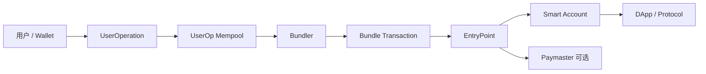
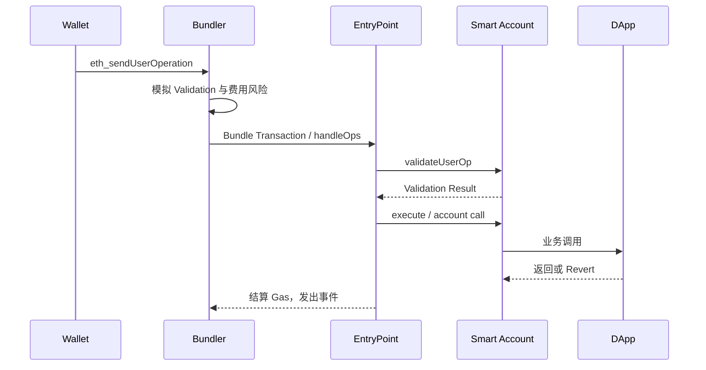
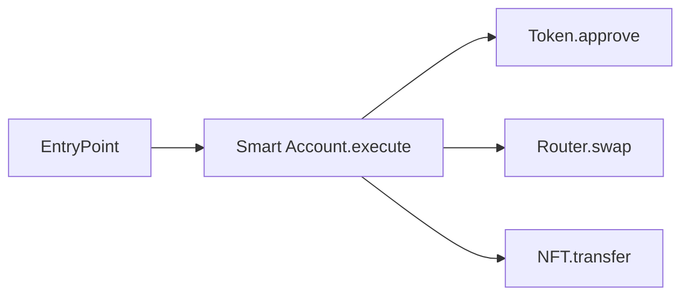
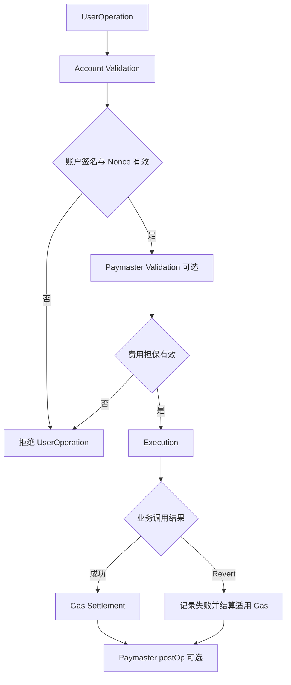
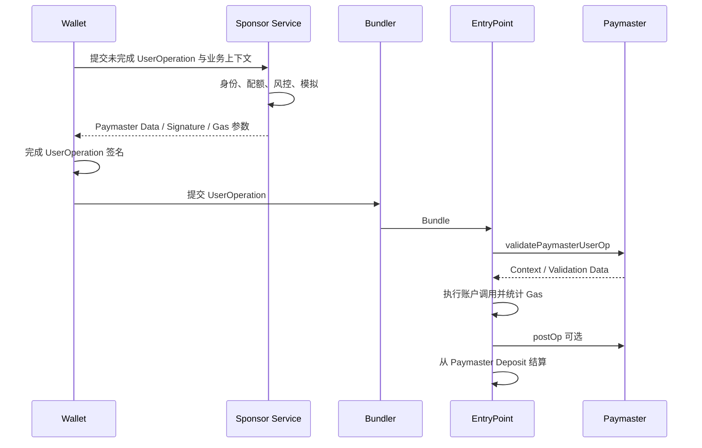
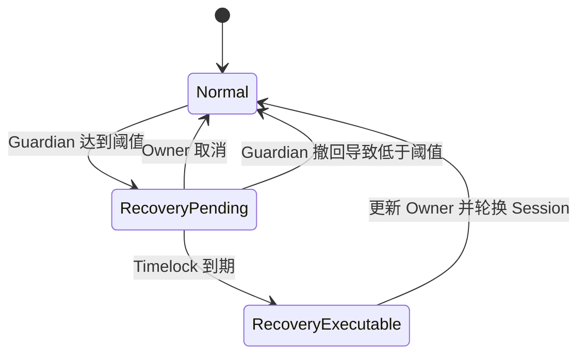
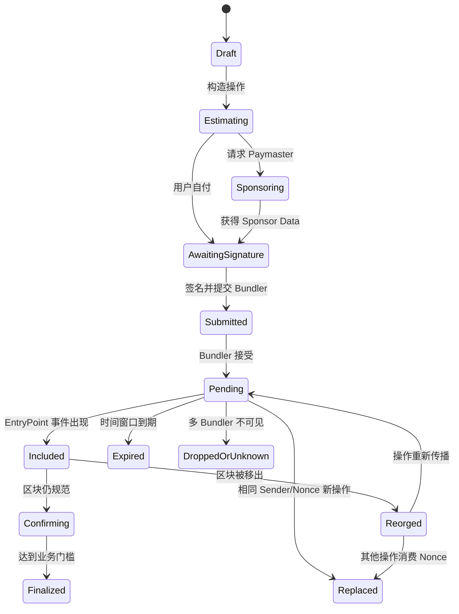

# Web3 Account Abstraction：从 ERC-4337、EntryPoint 到 Paymaster 与账户恢复

> Account Abstraction 不是“让用户免 Gas”的单一功能，而是把账户的验证规则、执行策略、费用支付和恢复机制从固定 EOA 签名模型中解耦。它提升了钱包可编程性，也把安全边界从一把私钥扩展到 Smart Account、EntryPoint、Bundler、Paymaster、模块和链下基础设施。

---

## 一、本文解决什么问题

传统 EOA 账户具有几个固定属性：

- 由单个 `secp256k1` 私钥直接控制；
- 交易必须由该账户支付原生 Gas Token；
- Nonce 由协议按账户顺序递增；
- 私钥丢失后没有原生恢复入口；
- 无法原生表达多签、额度、时间窗口和 Session Key；
- 钱包首次使用 DApp 往往要先获得原生资产支付 Gas。

智能合约钱包可以实现自定义权限，却还需要一笔 EOA 交易调用它。ERC-4337 提供了一条不修改 Ethereum 共识层交易格式的账户抽象路径：用户提交 `UserOperation`，Bundler 将多个操作打包进普通链上交易，由统一 `EntryPoint` 合约完成验证和执行。



本文覆盖大纲中的：

- Smart Account
- EntryPoint
- UserOperation
- Bundler
- Paymaster
- Aggregator
- Nonce
- Session Key
- Social Recovery
- Gas Sponsorship
- Validation / Execution
- ERC-4337 版本边界

### 核心结论

1. `UserOperation` 不是 Ethereum 共识层交易，最终仍由 Bundler EOA 提交一笔调用 EntryPoint 的链上交易。
2. Smart Account 决定“谁可以授权以及允许执行什么”；EntryPoint 负责统一编排验证、费用结算和执行，而不是替账户决定权限策略。
3. Bundler 是可替换的打包基础设施，不应成为用户资金的唯一信任方，但其可用性、审查和模拟差异会影响操作能否上链。
4. Paymaster 可以代付或让用户间接支付 Gas，但必须在验证阶段限制最坏成本，并防止免费资源滥用。
5. Session Key 与 Social Recovery 都是账户模块能力，若权限、撤销、时间窗口和升级边界设计不严，会成为新的高价值攻击入口。
6. Validation 必须满足可模拟、资源受限和结果稳定等约束；Execution 才执行用户业务调用。两阶段分离是 Bundler 安全接单的基础。
7. ERC-4337 的 EntryPoint 版本、UserOperation 字段、Gas 计量和 Paymaster 接口会演进。集成必须绑定明确版本、链上部署地址和 SDK 兼容矩阵。
8. Account Abstraction 改善的是账户可编程性，不会自动消除合约漏洞、恶意签名、RPC 欺骗、MEV、Reorg 或恢复治理风险。

---

## 二、从 EOA 到 Smart Account

### 2.1 EOA 的协议内置验证

传统 Ethereum 交易在执行前由协议验证 ECDSA 签名和账户 Nonce。验证规则固定在协议中，账户无法自行声明：

- 需要 2-of-3 Signer；
- 单笔金额超过阈值时追加审批；
- 某个 Session Key 只能调用游戏合约；
- Passkey 和硬件密钥任一即可授权；
- Guardian 可在延迟后替换 Owner；
- 用户可以用 Token 支付服务费用。

### 2.2 Smart Account 的可编程验证

Smart Account 是链上合约账户，它可以把授权规则写进代码：

```solidity
interface ISmartAccount {
    function validateUserOp(
        PackedUserOperation calldata userOp,
        bytes32 userOpHash,
        uint256 missingAccountFunds
    ) external returns (uint256 validationData);
}
```

上面仅表示某些 ERC-4337 版本中常见的接口形态，不应脱离具体 EntryPoint 版本直接复制到生产代码。稳定思想是：EntryPoint 调用账户验证入口，账户根据签名、Nonce、策略和上下文决定是否授权。

### 2.3 账户身份与控制凭证解耦

EOA 换私钥就换地址；Smart Account 可以保持合约地址不变，同时更新 Owner、阈值或验证模块。

这带来：

- 密钥轮换；
- 多设备授权；
- Social Recovery；
- Session Key；
- Batch Call；
- Spending Limit；
- Gas Sponsorship；
- 自定义签名算法和 EIP-1271 验证。

代价是账户安全依赖合约代码、模块注册表、升级权限、EntryPoint 兼容性和恢复治理。

### 2.4 Smart Account 不一定已部署

许多系统使用 Counterfactual Address：先根据 Factory、初始化参数和 Salt 计算未来账户地址，用户可以先向该地址收款，首次 UserOperation 再部署账户。

工程风险包括：

- Factory 地址或 Init Code 不一致导致部署到错误地址；
- 初始化参数未纳入地址承诺；
- 账户已被部署但初始化状态不同；
- 多链上同地址代码和 Owner 不一致；
- 充值后目标链 Factory 不可用；
- SDK 与链上 EntryPoint 版本不兼容。

“地址可预测”不等于“账户已存在或可用”。入金前应验证部署路径和恢复方案。

---

## 三、ERC-4337 架构

### 3.1 核心对象

| 对象 | 核心职责 | 不应承担的职责 |
|---|---|---|
| Wallet Client | 构造、签署并提交 UserOperation | 不应信任 Bundler 替它决定签名内容 |
| Smart Account | 验证授权并执行调用 | 不应依赖不受约束的链下声明 |
| EntryPoint | 编排验证、执行和费用结算 | 不定义每个账户的 Owner 策略 |
| Bundler | 模拟、收集并打包 UserOperation | 不应持有用户账户私钥 |
| Paymaster | 按策略担保 Gas | 不应无限承担不可控费用 |
| Factory | 确定性部署账户 | 不应允许抢先初始化或任意 Owner 替换 |
| Aggregator | 聚合特定签名方案 | 不替代账户自身选择和验证聚合器 |

### 3.2 双层交易结构



链上真正进入区块的是 Bundler 的交易。一个 Bundle Transaction 中可以包含多个用户操作，每个 UserOperation 有独立结果，但外层交易和 EntryPoint 的具体错误隔离行为必须按版本实现理解。

### 3.3 Alternative Mempool

UserOperation 通常进入独立于普通 Ethereum TxPool 的传播和验证网络。节点和 Bundler 会基于 ERC-4337 规则模拟与过滤。

它不是共识层公共 Mempool，因此：

- 不同 Bundler 看到的 UserOperation 集合可能不同；
- 接受策略、限流和 Reputation 可能不同；
- 某 Bundler 接受不代表其他 Bundler 接受；
- UserOperation Hash 可用于跟踪，但最终状态要看 EntryPoint 事件和外层交易；
- 网络升级或 EntryPoint 版本会影响 Mempool 兼容性。

---

## 四、EntryPoint

### 4.1 单一编排入口

EntryPoint 是 ERC-4337 的关键合约，负责：

- 计算和验证 UserOperation Hash；
- 调用账户验证；
- 调用 Paymaster 验证；
- 管理 Deposit、Stake 和费用补偿；
- 执行账户操作；
- 结算实际 Gas；
- 发出可索引的操作结果事件；
- 在需要时部署 Counterfactual Account。

账户必须只允许可信 EntryPoint 调用其 ERC-4337 验证入口，否则攻击者可能绕过 EntryPoint 的 Nonce、费用和上下文约束直接触发验证或执行路径。

### 4.2 Deposit 与 Stake 不同

概念上：

- **Deposit**：用于支付 UserOperation 执行费用的余额；
- **Stake**：某些实体为参与受规则约束的验证行为而锁定的保证金，具有解锁延迟等机制。

账户或 Paymaster 的 Deposit 不等于普通账户可自由使用的资产余额。Paymaster Stake 也不直接表示其每笔操作一定安全或有足够 Deposit。

### 4.3 EntryPoint 地址是协议上下文

同一条链可能同时存在多个 EntryPoint 版本部署。UserOperation Hash、接口、事件和 Bundler RPC 都必须绑定具体 EntryPoint 地址。

客户端配置至少包含：

```text
chainId
entryPointAddress
entryPointVersion
smartAccountImplementation
factoryAddress
bundlerEndpoint
paymasterCapability
```

不要仅用 Chain ID 推断 EntryPoint，也不要把测试网地址复制到主网配置。

### 4.4 EntryPoint 不是升级代理的默认假设

具体官方部署通常强调可验证、确定性和版本隔离，但项目不能抽象地假设所有名为 EntryPoint 的地址都不可升级或可信。必须核对：

- 地址对应 Bytecode；
- 官方版本发布信息；
- 部署网络；
- 审计与源码验证；
- Bundler 声明支持的版本；
- 账户实现允许的 EntryPoint。

---

## 五、UserOperation

### 5.1 它不是普通交易

UserOperation 是用户希望 Smart Account 执行的操作描述。常见语义字段包括：

- `sender`：Smart Account 地址；
- `nonce`：账户定义域内的操作序号；
- 账户部署相关数据；
- `callData`：账户执行入口的编码；
- 验证和执行 Gas 限制；
- Fee 上限；
- Paymaster 相关数据；
- `signature`：账户验证逻辑解释的授权数据。

不同 EntryPoint 版本可能采用 `UserOperation` 或 `PackedUserOperation`，并调整 Factory、Paymaster 和 Gas 字段的组织方式。不能把某版 JSON 结构当作永久协议格式。

### 5.2 UserOperation Hash

签名通常绑定：

- UserOperation 关键字段；
- EntryPoint 地址；
- Chain ID。

这防止同一签名被直接用于另一 EntryPoint 或另一链，但前提是账户验证正确使用规范 Hash。账户不应只签 `callData`，否则费用、Nonce、部署或 Paymaster 字段可能被替换。

### 5.3 `callData` 通常调用账户自身执行入口

UserOperation 不是直接把任意 DApp Calldata 交给目标协议。EntryPoint 调用 Smart Account，Smart Account 再根据 `callData` 执行单笔或批量调用：



账户执行入口必须校验调用来源，仅允许 EntryPoint、自调用或明确 Owner 路径，避免外部任意调用账户资产。

### 5.4 PreVerification、Verification 与 Call Gas

ERC-4337 需要覆盖不同阶段的 Gas：

- 操作编码、Calldata 和 Bundle 分摊相关成本；
- 账户/Paymaster 验证成本；
- 账户执行和目标调用成本；
- 某些版本中的 Paymaster 验证、Post-operation 或其他分离字段。

具体字段命名和计量方式随 EntryPoint 版本演进。Wallet 应调用与目标版本匹配的 Bundler Estimation RPC，并设置产品级上限，不能把普通 `eth_estimateGas` 结果直接当作完整 UserOperation Gas。

### 5.5 签名字段是账户自定义协议

Smart Account 可以解释：

- 单个 ECDSA Owner 签名；
- 多签集合；
- Passkey/P-256 证明；
- Session Key 签名和权限证明；
- Aggregated Signature 引用；
- 恢复状态下的 Guardian 授权；
- 模块化验证器数据。

但 Bundler 必须能通过模拟判断其是否有效。自定义签名格式需要版本标记、防解析歧义和清晰 Domain Separation。

---

## 六、Bundler

### 6.1 Bundler 做什么

Bundler 类似 UserOperation 的打包者：

1. 接收 UserOperation；
2. 执行 EntryPoint 兼容的 Validation Simulation；
3. 检查 Gas、Fee、Nonce 和实体风险；
4. 放入本地 UserOp Pool；
5. 选择一个或多个操作；
6. 用 Bundler EOA 发送外层交易；
7. 从 EntryPoint 获得费用补偿；
8. 跟踪 Bundle Receipt 和 Reorg。

### 6.2 Bundler 为什么需要模拟

Bundler 先垫付外层交易 Gas。如果操作在链上才发现无法支付，Bundler 会损失资金。因此它要验证：

- Smart Account 签名是否有效；
- Nonce 是否可接受；
- Account/Paymaster Deposit 是否足够；
- Validation 是否依赖不稳定或被禁止的状态；
- Paymaster 是否愿意承担费用；
- Fee 是否覆盖 Bundler 成本；
- 操作是否会破坏整个 Bundle 的可执行性。

### 6.3 Bundler 不应成为单点

客户端只配置一个 Bundler 会面临：

- 宕机；
- 审查某账户或 Paymaster；
- 费用估算偏差；
- UserOperation 长期不打包；
- 版本升级不兼容；
- 地域和网络故障。

可以配置多个兼容 Bundler，但同一 UserOperation 多播会带来隐私、限流和状态归并问题。必须用同一 `userOpHash` 跟踪，而不是重复生成不同 Nonce 的操作。

### 6.4 Bundler RPC

常见方法语义包括发送 UserOperation、估算 Gas、按 Hash 查询操作和 Receipt、查询支持的 EntryPoint。具体 Method、返回结构和错误码应按目标 ERC-4337 RPC 规范与 Bundler 实现验证。

客户端不能通过错误字符串判断所有分支，应保存：

- JSON-RPC Code；
- ERC-4337 失败原因或阶段；
- EntryPoint 地址；
- Bundler 版本和 Endpoint；
- UserOperation Hash；
- 安全筛选后的 Revert Data。

### 6.5 Reputation 与实体限制

为了防止账户、Factory、Paymaster 或 Aggregator 消耗模拟资源、反复失败或污染 Mempool，Bundler 可能维护实体 Reputation，并按 ERC-4337 Mempool 规则限制某些行为。

这属于基础设施抗滥用机制，不应被产品解释为链上封禁。不同 Bundler 的 Reputation 状态可能不同。

---

## 七、Validation 与 Execution

### 7.1 为什么要分阶段

Validation 回答：“Bundler 是否可以安全地接受并垫付这笔操作？”

Execution 回答：“Smart Account 最终调用什么业务合约，执行结果是什么？”



### 7.2 Validation 的设计约束

Validation 必须尽可能可预测，避免依赖会在模拟与打包之间随意变化的状态。具体允许访问的 Opcode、Storage 和实体关联规则随 ERC-4337 版本与 Mempool 规范演进。

账户开发者不应凭经验猜规则，而应：

- 使用目标版本的 Reference Bundler/Compliance Test；
- 在多个 Bundler 上测试；
- 明确关联 Storage 的所有权；
- 避免 Validation 中进行外部不可控调用；
- 限制签名解析和循环复杂度；
- 防止验证路径被恶意输入拖入高 Gas。

### 7.3 时间范围

Validation Result 可以表达操作在某个时间范围内有效，例如 `validAfter` 与 `validUntil` 语义。账户和 Paymaster 应把时间窗口纳入签名或策略，避免链下服务任意扩展有效期。

时间边界基于链上区块时间语义，不能要求亚秒级精确。

### 7.4 Execution Revert 的隔离

某个 UserOperation 的业务调用 Revert 不一定意味着整个 Bundle 的其他操作都回滚。具体行为由 EntryPoint 版本和调用路径定义。

监控必须关注 UserOperation 级事件，而不能只看外层 Bundle Transaction 的 Receipt `status`。外层交易成功时，内部某个用户操作仍可能执行失败。

### 7.5 Validation 与 Execution 的 TOCTOU

即使 Validation 在模拟时成功，打包前状态仍可能变化：

- Owner/Module 被更新；
- Nonce 被另一操作消费；
- Paymaster 配额耗尽；
- Deposit 下降；
- Session Key 被撤销；
- 时间窗口过期。

EntryPoint 会在链上重新验证。Bundler 必须接受模拟与实际之间仍存在失败概率，并通过 Mempool 规则、Stake、排序和重新模拟降低风险。

---

## 八、Nonce

### 8.1 不只是 EOA 的单一递增值

ERC-4337 的 Nonce 由 EntryPoint 与账户协作管理，常允许将 Nonce 分成 Key 与 Sequence，从而支持多个并行操作通道。

概念示例：

```text
nonce = key || sequence
```

具体位布局和 API 必须按目标 EntryPoint 版本确认。常见思路是通过 `getNonce(sender, key)` 获取某个 Nonce Key 下的下一个值。

### 8.2 并行 Nonce Channel

可以为不同操作域分配 Key：

```text
key 0: Owner 普通交易
key 1: 游戏 Session Key
key 2: 自动订阅
key 3: Recovery 操作
```

好处是某个通道 Pending 不必阻塞全部操作。风险是账户验证必须确保攻击者不能选择更宽松的 Nonce Key 绕过权限。

### 8.3 Nonce 与 Session Key 绑定

Session Key 策略可将 Nonce Key 绑定到特定验证模块，使：

- Owner 操作无法被 Session 签名重放；
- Session A 与 Session B 的序列独立；
- 撤销 Session 后旧 Nonce 空间失效；
- 批量或并行操作不会互相阻塞。

只验证签名而不验证 Nonce 域，会产生跨权限通道重放风险。

### 8.4 Bundler 视图不一致

类似普通 Mempool，不同 Bundler 的 Pending UserOperation 视图不一致。钱包并发发送操作时应维护本地持久化队列，并处理：

- 相同 Nonce 重复提交；
- UserOperation 被另一个 Bundler 打包；
- 操作过期后重建；
- Reorg 后重新出现；
- Paymaster 数据变化导致 Hash 改变；
- 同一个业务 Intent 生成多个 UserOperation。

---

## 九、Paymaster 与 Gas Sponsorship

### 9.1 Paymaster 做什么

Paymaster 在满足策略时为 UserOperation 的 Gas 提供担保。用户可能因此：

- 不需要预先持有原生 Gas Token；
- 用 ERC-20 或链下余额间接结算；
- 获得新用户首笔操作补贴；
- 由 DApp 承担特定方法费用；
- 通过订阅、优惠券或风控额度获得 Sponsorship。

但 EntryPoint 最终仍向 Paymaster Deposit 结算原生 Gas 成本。“Gasless”通常是费用支付方或结算路径改变，不是网络执行不消耗 Gas。

### 9.2 Paymaster 流程



接口名称和参数会随版本调整，上图表达稳定职责而非固定 ABI。

### 9.3 Sponsorship 策略

生产 Sponsor Service 至少校验：

- Chain ID、EntryPoint 和 Sender；
- Smart Account Implementation/Factory；
- 目标合约、Function Selector 和参数；
- Value、Token、金额和 Slippage；
- UserOperation Gas 上限；
- 用户身份、设备和频率；
- Sponsorship Deadline 与一次性 Nonce；
- 每用户、每账户、每 IP、每日总预算；
- 模拟结果和已批准业务 Intent。

不能只检查 `to`，因为 Smart Account 的 `callData` 可能是 Batch 或 Module Call。

### 9.4 Paymaster DoS 与资金风险

攻击者可能：

- 批量申请签名但不提交；
- 构造验证成功、执行高成本失败的操作；
- 重放未绑定 Hash 的 Sponsorship 数据；
- 消耗 Paymaster Deposit；
- 利用 Token 价格变化让收费不足；
- 通过并发绕过配额；
- 让 `postOp` 进入异常路径。

因此 Sponsorship 签名必须绑定完整 UserOperation 或明确不可变字段、有效期和唯一标识。

### 9.5 ERC-20 Gas Payment

“用 Token 支付 Gas”通常由 Paymaster 在链下报价或链上收取 Token，再承担原生 Gas。需要处理：

- Token Allowance 或 Permit；
- Token 非标准返回值；
- Fee-on-transfer/Rebasing Token；
- Oracle 与价格陈旧；
- 最大 Token 费用；
- 执行失败时是否仍收费；
- Refund；
- Paymaster `postOp` 的异常和重入边界。

它不是协议自动把任意 Token 转成 ETH。

### 9.6 Gas Sponsorship 的产品边界

用户界面不应只写“免费”。应说明：

- 谁承担费用；
- 是否扣除 Token 或链下额度；
- 最大费用；
- 补贴适用方法；
- 失败操作是否消耗额度；
- 补贴过期或用尽后的回退方式。

---

## 十、Aggregator

### 10.1 为什么需要签名聚合

某些签名方案可以把多个 UserOperation 的签名聚合为更紧凑的证明，以降低链上验证或 Calldata 成本。Aggregator 负责验证聚合签名与对应操作集合。

它是可选角色，不是所有 Smart Account 或 Bundler 都支持。

### 10.2 账户如何选择 Aggregator

账户 Validation Result 可以关联特定 Aggregator。Bundler 需要：

- 按 Aggregator 分组操作；
- 验证单个操作是否适合该聚合器；
- 构造聚合签名；
- 调用 EntryPoint 对应聚合执行入口；
- 处理某组聚合验证失败。

具体接口与调用顺序必须按 EntryPoint 版本确认。

### 10.3 聚合的代价

- Bundler 实现复杂度上升；
- 聚合器成为额外合约依赖；
- 错误聚合可能影响一组操作；
- 模拟与 Debug 更困难；
- 只有达到一定批量时才可能节省成本；
- 新密码学方案带来审计和预编译支持边界。

是否采用必须在目标网络、批量规模和真实 Calldata 价格下测量。

---

## 十一、Session Key

### 11.1 Session Key 解决什么问题

游戏、交易机器人、订阅和高频交互若每次都要求主 Owner 确认，体验很差。Session Key 是受限临时凭证，可以在明确策略内自动授权。

```text
Session Policy =
  signer
  validAfter / validUntil
  allowedChains
  allowedTargets
  allowedSelectors
  valueLimit
  tokenSpendLimit
  rateLimit
  nonceDomain
  revocationState
```

### 11.2 最小权限

一个游戏 Session Key 不应拥有通用 `execute(address,uint256,bytes)` 权限，否则 Allowed Target 检查可能被批处理、代理或 Delegatecall 绕过。

必须解析账户实际执行语义：

- 单调用与 Batch；
- Target 与 Selector；
- 原生 Value；
- Token Transfer/Approve 参数；
- 模块安装和升级调用；
- Delegatecall；
- 嵌套 Multicall；
- Account 自身管理入口。

### 11.3 Session 撤销

撤销机制包括：

- 链上删除 Session；
- 增加 Session Epoch；
- 使对应 Nonce Key 失效；
- 到期自动失效；
- Owner/Guardian 紧急暂停模块。

只在前端删除 Session 私钥不会撤销攻击者已复制的密钥。撤销必须体现在账户验证状态中。

### 11.4 Session Key 存储

Session Key 权限较低，不代表可以明文存储。移动端仍应使用平台安全存储、限制备份和日志，并处理：

- App 重装；
- 多设备同步；
- 浏览器 XSS；
- Session 到期清理；
- 用户登出；
- 主 Owner 轮换；
- 钱包恢复后旧 Session 是否继续有效。

### 11.5 Session Key 与 WalletConnect Session

两者不是同一概念：

- WalletConnect Session 是 DApp 与钱包间的通信授权上下文；
- Smart Account Session Key 是账户验证逻辑认可的链上操作凭证。

断开 WalletConnect 不会自动撤销链上 Session Key，除非产品显式发送撤销操作。

---

## 十二、Social Recovery

### 12.1 恢复的是账户控制权

Social Recovery 允许一组 Guardian 在 Owner 丢失或设备失效时，按规则将账户控制权迁移到新凭证。

典型状态机：



### 12.2 Guardian 选择

Guardian 可以是：

- 用户的其他硬件设备；
- 家人或可信联系人；
- 机构托管方；
- 独立多签；
- 受认证的恢复服务；
- 其他链上账户。

不要让所有 Guardian 使用同一云账号、同一设备或同一机构，否则只是伪装成多方的单点。

### 12.3 恢复安全控制

至少考虑：

- M-of-N 阈值；
- Recovery Timelock；
- Owner 可见通知和取消窗口；
- Guardian 添加/删除延迟；
- 新 Owner 地址确认；
- Guardian 签名的 Chain ID、账户地址、Epoch 和 Deadline；
- 重放保护；
- 恢复期间资金转移限制；
- 完成后 Session Key、旧签名和模块的轮换。

### 12.4 恢复与盗取的同一性

从合约角度看，“合法恢复”和“Guardian 合谋接管”执行的是同一权限路径。安全性取决于阈值、独立性、延迟和监控，而不是函数命名为 `recover`。

### 12.5 恢复可用性

过高阈值和复杂流程会让真正用户无法恢复。上线前应演练：

- 一个 Guardian 失联；
- Guardian 更换设备；
- Owner 仍在线并取消恶意恢复；
- Owner 完全丢失；
- 链拥堵和 Paymaster 不可用；
- Guardian 本身是 Smart Account 且依赖同一故障服务。

---

## 十三、模块化账户

### 13.1 模块类型

Smart Account 常将能力拆分为：

- Validator：验证 Owner、Passkey、Session Key；
- Executor：允许特定自动化执行；
- Hook：在操作前后执行检查；
- Recovery Module：管理 Guardian；
- Spending Policy：限制金额和频率；
- Fallback Handler：处理特定接口或签名验证。

模块标准和接口仍在演进，不应假设不同账户实现可以直接互换模块。

### 13.2 模块安装是最高权限操作

恶意 Validator 或 Executor 可以绕过正常 Owner 控制。安装前要验证：

- Module 地址和 Code Hash；
- 初始化数据；
- 可调用入口；
- Storage Namespace；
- 升级权限；
- 卸载与紧急禁用路径；
- 与账户版本的兼容性。

“插件市场已上架”不是安全证明。

### 13.3 Delegatecall 与 Storage

若模块通过 Delegatecall 执行，它可以读写账户 Storage。Storage Collision、任意 Self-call、Owner Slot 修改和升级绕过都是关键风险。

优先使用明确接口和隔离 Storage 方案，并对模块做与主账户同等级审计。

---

## 十四、Counterfactual Deployment 与首次操作

### 14.1 首次 UserOperation

账户尚未部署时，UserOperation 携带 Factory 相关数据。EntryPoint 在验证流程中调用 Factory 创建账户，再验证操作。

需要保证：

- 地址计算与实际 CREATE2/Factory 逻辑一致；
- 初始化只能执行一次；
- Owner/Module 初始化参数不可被 Bundler 修改；
- Factory 只返回预期地址和代码；
- 部署失败不会消耗不可控 Sponsorship；
- 已部署账户不会重复初始化。

### 14.2 多链同地址错觉

相同 Factory、Salt 和 Init Code 可能在多链得到同地址，但：

- Factory 未必在所有链同址同码；
- Smart Account Implementation 可能不同；
- Owner 和模块状态可能不同；
- EntryPoint 版本可能不同；
- 某条链地址可能被预先部署其他代码。

跨链产品必须逐链验证 Code Hash 和初始化事件。

### 14.3 预充值风险

向未部署地址充值前应确认用户有能力完成部署。若 Bundler、Factory 或 Paymaster 停止服务，资金可能暂时无法操作。

提供至少一种不依赖单一服务商的恢复路径，包括可替换 Bundler 和自行支付 Gas 的方案。

---

## 十五、Gas Estimation、Fees 与 Receipt

### 15.1 UserOperation Gas 不是普通交易 Gas

钱包需要估算：

- 验证阶段 Gas；
- 执行阶段 Gas；
- Pre-verification/Calldata 分摊；
- Paymaster 阶段 Gas；
- 外层 Bundle 费用条件；
- L2 数据费用。

不同 Bundler 估算可能不同。客户端要设置合理 Buffer 和上限，并在签名前冻结估算字段。

### 15.2 Bundler Fee 与用户支付

没有 Paymaster 时，Smart Account 通常需要通过 EntryPoint Deposit 或账户资金承担费用。具体缺失资金如何补足由账户与 EntryPoint 版本接口决定。

有 Paymaster 时，用户也可能通过 Token、链下订阅或业务补贴支付。界面应展示实际支付资产和最大成本，不能只显示外层 Bundler 的 ETH Gas。

### 15.3 UserOperation Receipt

操作跟踪需要区分：

- `userOpHash`；
- 外层 `transactionHash`；
- EntryPoint 事件中的成功/失败；
- 实际 Gas Cost/Used；
- Sender、Nonce、Paymaster；
- Receipt 所在 Block Hash；
- 业务调用事件。

外层交易成功不等于每个 UserOperation 都成功。UserOperation 成功也不等于业务输出符合用户预期。

### 15.4 Replacement

UserOperation Replacement 通常围绕相同 Sender 与 Nonce，并要求费用满足 Bundler/Mempool 的替换策略。阈值和字段比较可能随规范及实现变化，不应当作固定共识常量。

修改 Paymaster Data、Signature 或 Fee 会改变 UserOperation Hash。UI 应把它们归入同一业务 Intent/Nonce 交易族。

---

## 十六、版本边界

### 16.1 为什么必须显式版本化

ERC-4337 从早期 EntryPoint 到后续版本持续演进，变化可能涉及：

- UserOperation 是否 Packed；
- Factory/Init Code 字段组织；
- Paymaster Data 与 Gas 字段；
- Validation Result 和错误编码；
- Nonce、Deposit、Stake 接口；
- Mempool Validation Rules；
- Bundler RPC 行为；
- Gas 计量和事件。

本文不把某个日期下的“最新版本”写成永久结论。2026 年或之后部署时，应查阅 ERC-4337 官方规范、Account Abstraction 仓库 Release、目标 EntryPoint Bytecode 和 Bundler 文档。

### 16.2 版本兼容矩阵

```text
Chain
  -> EntryPoint Address + Version
  -> Account Implementation + Version
  -> Factory Version
  -> Bundler Supported EntryPoints
  -> Paymaster Supported EntryPoints
  -> SDK / ABI / RPC Version
  -> Indexer Event Schema
```

任一项不匹配都可能表现为 Gas 估算失败、签名无效或 UserOperation 长期 Pending。

### 16.3 版本升级策略

账户升级不应与 EntryPoint 升级混成一次不可回滚操作。推荐：

1. 在 Fork 上使用真实账户状态回放；
2. 验证旧 Owner、Session、Recovery 和 Deposit；
3. 灰度启用新 Bundler/Paymaster；
4. 保留旧 EntryPoint 操作跟踪；
5. 逐步迁移账户验证配置；
6. 设置暂停、回滚或迁移路径；
7. 更新 Indexer 和监控事件解析。

### 16.4 与其他 Account Abstraction 路径的区别

Ethereum 账户抽象还可能涉及协议级提案、委托代码能力或其他交易类型。它们与 ERC-4337 的信任、Mempool、Nonce 和部署模型不同。

项目文档必须明确使用哪条路径，不要把所有“Smart Wallet”都统称为 ERC-4337。

---

## 十七、安全威胁模型

### 17.1 Smart Account

- `validateUserOp` 可被绕过；
- `execute` 调用来源检查错误；
- Owner/Module Storage Collision；
- 批处理解析绕过 Target/Value 限制；
- 升级初始化被抢先；
- EIP-1271 签名跨域重放；
- Recovery 接管；
- Session Key 权限过大。

### 17.2 Bundler

- 审查或延迟操作；
- 错误模拟；
- 费用报价过高；
- 不传播 UserOperation；
- 只支持单一 EntryPoint；
- Reorg 后不重新打包；
- RPC 日志泄露账户意图。

Bundler 通常不应能伪造有效账户签名，但可影响可用性和交易时机。

### 17.3 Paymaster

- Sponsorship 签名重放；
- Deposit 耗尽；
- Token 定价操纵；
- `postOp` Revert 或重入；
- 配额并发绕过；
- 恶意账户消耗验证 Gas；
- Paymaster 停服导致用户无法操作。

### 17.4 Factory 与 Counterfactual Address

- Init Data 被替换；
- Salt 冲突；
- Factory 升级改变地址计算；
- 部署非预期 Implementation；
- 初始化外部调用重入；
- 多链地址被抢占。

### 17.5 EntryPoint 与依赖

- 配置到假 EntryPoint；
- 账户允许多个不受控 EntryPoint；
- Bundler、Paymaster、SDK 版本错配；
- Indexer 漏掉操作失败事件；
- Deposit/Stake 运维错误。

---

## 十八、常见错误案例

### 18.1 把 UserOperation 当普通交易广播

UserOperation 需要提交给兼容 Bundler，最终由 Bundler 调用 EntryPoint。它不能直接通过 `eth_sendRawTransaction` 作为普通 EOA 交易进入共识层。

### 18.2 只校验 Owner 签名，不校验完整 UserOp Hash

攻击者可能修改 Nonce、Fee、Paymaster 或部署字段。签名必须绑定规范定义的完整上下文。

### 18.3 Smart Account 的 `execute` 对任意调用者开放

这会让攻击者绕过 EntryPoint 和 Owner 验证直接转移资产。必须限制 EntryPoint、自调用或明确授权入口。

### 18.4 认为 Gasless 等于没有成本

Gas 仍由 Paymaster 或其他方支付。无限补贴会迅速耗尽 Deposit，并遭遇自动化滥用。

### 18.5 Session Key 只限制目标地址

若目标是 Account 自身通用执行入口或可 Delegatecall 的模块，攻击者仍可能调用任意协议。必须解析最终执行语义。

### 18.6 断开钱包就撤销 Session Key

Wallet Connection Session 与链上 Session Key 独立。必须发起链上撤销或更新账户 Epoch。

### 18.7 Social Recovery 没有延迟和通知

Guardian 一旦被攻陷即可立即接管账户。应提供阈值、Timelock、Owner 取消和多渠道告警。

### 18.8 只配置一个 Bundler 和 Paymaster

任一服务故障都会让账户无法操作。高价值系统需要可替换服务和用户自费回退路径。

### 18.9 外层 Bundle 成功就显示所有操作成功

必须读取 EntryPoint 的 UserOperation 级事件和业务结果。

### 18.10 升级 SDK 后默认兼容旧 EntryPoint

字段打包、Gas 估算和 RPC 可能变化。升级必须基于明确版本矩阵和 Fork 回归。

---

## 十九、工程实现状态机

### 19.1 UserOperation 生命周期



### 19.2 持久化字段

```text
intentId
chainId
entryPointAddress + version
sender
nonce
accountImplementation
factoryDataHash
callDataHash
paymaster
userOpHash
bundlerEndpoints
outerTransactionHash
includedBlockHash
userOpSuccess
businessResult
replacementFamily
status
```

### 19.3 错误分类

至少区分：

- Wallet/Signer 拒绝；
- Account Validation 失败；
- Paymaster Validation 失败；
- Bundler Policy 拒绝；
- Gas Estimate 失败；
- UserOperation Execution Revert；
- 外层 Bundle 交易失败；
- EntryPoint/版本不支持；
- Session/Recovery 策略失败；
- RPC、Relay 或 Indexer 故障；
- Reorg。

不要统一显示为“交易失败”，否则用户和运维无法判断是重新签名、换 Bundler、充值 Deposit 还是修复业务参数。

---

## 二十、测试与验证方法

### 20.1 合约单元与属性测试

验证不变量：

```text
[ ] 只有可信 EntryPoint/Owner 路径可执行资产调用
[ ] 无有效签名不能改变 Owner、Module 或资产
[ ] 相同 Nonce 不能成功执行两次
[ ] Session Key 不能越过 Target/Selector/Value/Time 限制
[ ] Recovery 未达到阈值或延迟不能完成
[ ] Paymaster 数据不能跨 Chain/EntryPoint/Sender 重放
[ ] 模块卸载后旧授权失效
[ ] 升级不破坏 Storage 与签名域
```

使用 Fuzz 和 Invariant Test 覆盖 Batch、嵌套调用和恶意模块。

### 20.2 ERC-4337 Compliance

账户、Paymaster 和 Bundler 应运行与目标版本匹配的官方或行业兼容性测试套件，验证：

- UserOperation 编码；
- Validation Simulation；
- 禁止的 Opcode/Storage 访问；
- Gas 计量；
- Aggregator 行为；
- Error Code；
- Reputation/Stake 规则；
- Receipt 和事件。

测试套件版本必须与 EntryPoint 版本一起记录。

### 20.3 Bundler 兼容矩阵

至少在两个独立实现或服务上验证：

- 支持的 EntryPoint；
- Gas Estimate；
- 未部署账户；
- 无 Paymaster与有 Paymaster；
- Replacement；
- Reorg 后重试；
- Session Key；
- Batch Execution；
- 错误返回结构。

### 20.4 Paymaster 故障注入

- Deposit 临界或耗尽；
- Sponsor Service 超时；
- Sponsorship 签名过期；
- Token Oracle 陈旧；
- 执行失败触发 Post-operation；
- 并发请求突破配额；
- Paymaster 被 Bundler Reputation 限制；
- 用户在签名前修改 Call Data。

### 20.5 Recovery 演练

在 Fork/测试环境演练：

1. 主 Owner 丢失；
2. Guardian 达到阈值发起恢复；
3. 恶意恢复被 Owner 取消；
4. Timelock 到期更新 Owner；
5. 撤销旧 Session Key 和 Wallet Session；
6. 验证旧签名无法执行；
7. 验证新 Owner 可在 Paymaster 不可用时自费操作。

### 20.6 Reorg 与 Indexer

回滚包含 UserOperation 的区块，验证：

- 外层 Transaction 和 UserOp Receipt 均回退；
- 业务状态不会永久标记成功；
- Bundler 可重新提交；
- 相同 Nonce Replacement 正确归并；
- Paymaster 预算不会因重复索引双重扣减。

### 20.7 性能测量

测量：

- Account/Paymaster Validation Gas；
- UserOperation Calldata 大小；
- Bundler Estimation P50/P95/P99；
- Sponsor API 延迟；
- 提交到 Inclusion 时间；
- Bundle 批量规模；
- 首次账户部署额外成本；
- Session Key 相比主签名的交互减少；
- L2 Data Fee。

必须在目标网络、目标 EntryPoint 和真实账户版本上测量，不引用脱离环境的固定节省比例。

---

## 二十一、方案选择

| 场景 | 适合的 AA 能力 | 主要代价 |
|---|---|---|
| 新用户首笔操作 | Paymaster Sponsorship | 滥用风控与 Deposit 成本 |
| 链游高频交互 | 限权 Session Key | 策略解析与撤销复杂度 |
| 高价值个人钱包 | 多设备 + Social Recovery | Guardian 合谋和恢复可用性 |
| 团队 Treasury | 多签 Smart Account + Timelock | 协调、Gas 和模块治理 |
| 自动订阅 | 独立 Nonce Key + Spending Limit | 自动执行与余额管理 |
| Passkey 钱包 | 自定义 Validator | 链上验证成本和兼容性 |
| 多链钱包 | 统一 Counterfactual Address | 各链部署与状态并不天然一致 |

不适合盲目采用的场景：

- 业务只需一次普通 EOA 转账，却无法承担 AA 基础设施复杂度；
- 团队没有合约审计、Bundler/Paymaster 运维和事故响应能力；
- 产品承诺完全去信任化，却强依赖唯一中心化 Sponsor；
- Recovery 与 Session 权限尚未建立可验证策略；
- 目标链没有稳定、兼容的 EntryPoint 和 Bundler 生态。

---

## 二十二、上线检查清单

```text
[ ] 明确 Chain、EntryPoint 地址和版本
[ ] 核对 EntryPoint Bytecode 与官方发布信息
[ ] Account、Factory、Bundler、Paymaster、SDK 版本兼容
[ ] validateUserOp 只接受可信 EntryPoint
[ ] execute/Batch/Module 入口有严格来源与权限校验
[ ] UserOperation 签名绑定完整 Hash、Chain 和 EntryPoint
[ ] Counterfactual 地址与初始化参数已交叉验证
[ ] Nonce Key 与权限域绑定，支持并发和 Replacement
[ ] Bundler 至少有故障回退或可替换方案
[ ] Paymaster 有 Deposit 监控、预算、限流和紧急暂停
[ ] Sponsorship 绑定 Target、Selector、金额、期限和 Intent
[ ] Session Key 限制链、目标、方法、金额、频率和有效期
[ ] Session 撤销是链上有效，而非只清除本地数据
[ ] Recovery 有阈值、延迟、通知、取消和重放保护
[ ] Guardian 不集中在同一设备、账号或供应商
[ ] 模块安装、升级和卸载经过同等级安全审查
[ ] UI 区分 UserOp Hash、外层 Transaction Hash 和业务结果
[ ] Indexer 按 UserOperation 级事件处理成功与失败
[ ] Reorg 会回退 UserOp 和业务状态
[ ] 用户在 Paymaster/Bundler 停服时仍有恢复或自费路径
[ ] 在目标版本 Compliance、Fork、故障注入中验证通过
```

---

## 二十三、总结

Account Abstraction 的核心价值，是把账户从“单私钥签名器”升级为“可编程授权和执行系统”。

真正需要记住的是：

1. ERC-4337 通过 UserOperation、Bundler 和 EntryPoint 在不改变共识层交易格式的前提下实现账户抽象。
2. Smart Account 自己定义签名、权限、Session 和恢复规则，EntryPoint 只提供统一验证执行框架。
3. Bundler 需要先模拟再垫付外层交易 Gas；它影响可用性和时机，但不应能伪造账户授权。
4. Paymaster 改变费用承担和结算方式，Gas 并未消失，补贴必须有完整风控和预算。
5. Validation 与 Execution 分离，使 Bundler 能在接单前评估风险，但模拟与链上执行之间仍存在状态竞态。
6. 并行 Nonce、Session Key 和 Social Recovery 提升体验，也显著扩大验证逻辑和治理攻击面。
7. UserOperation 成功必须从 EntryPoint 事件判断，不能只看外层 Bundle Transaction。
8. ERC-4337 集成必须显式绑定版本；EntryPoint、Account、Bundler、Paymaster 与 SDK 必须形成可验证兼容矩阵。

好的 Smart Account 不是功能最多的账户，而是每种授权都具有最小权限、清晰有效期、独立撤销路径和可演练恢复方案。

---

## 问答复盘

### Q1：UserOperation 是一种新的 Ethereum 共识层交易吗？

**答：** 不是。它通常进入独立 UserOp Mempool，由 Bundler 打包后通过普通 Ethereum 交易调用 EntryPoint。

### Q2：EntryPoint 是否决定 Smart Account 使用单签、多签还是 Passkey？

**答：** 不决定。账户的 `validateUserOp` 或验证模块定义授权规则，EntryPoint 负责统一调用、费用和执行编排。

### Q3：外层 Bundle Transaction 的 Receipt `status = 1`，是否表示每个 UserOperation 都成功？

**答：** 不表示。必须检查 EntryPoint 的 UserOperation 级事件和具体业务状态，内部操作可能执行失败。

### Q4：Gas Sponsorship 是否意味着链上执行不再消耗 Gas？

**答：** 不是。Paymaster 或其他主体承担原生 Gas 成本，用户可能通过 Token、订阅或补贴间接结算。

### Q5：为什么 Session Key 不能只限制有效期？

**答：** 有效期内若拥有通用执行权限，密钥泄露仍可转走全部资产。还必须限制 Chain、Target、Selector、Value、Token 额度、频率和 Nonce 域。

### Q6：WalletConnect Session 断开后，Smart Account Session Key 会自动失效吗？

**答：** 不会。前者是通信会话，后者是账户链上验证凭证，必须通过账户状态更新或到期机制撤销。

### Q7：Social Recovery 为什么通常需要 Timelock？

**答：** 恢复路径也是账户接管路径。延迟为原 Owner 提供发现和取消恶意恢复的窗口，并降低 Guardian 同时失陷的即时损失。

### Q8：为什么不能只部署一个 Bundler 和一个 Paymaster？

**答：** 它们会成为账户可用性的单点。用户应能切换 Bundler，并在 Sponsorship 失效时自费或使用替代恢复路径。

### Q9：ERC-4337 Nonce 与 EOA Nonce 的主要区别是什么？

**答：** EOA 通常是账户单一顺序；ERC-4337 可使用 Nonce Key 和 Sequence 构造并行通道，但具体布局与接口要按 EntryPoint 版本确认。

### Q10：升级 Account Abstraction SDK 时最重要的验证是什么？

**答：** 确认 SDK、UserOperation 结构、EntryPoint 地址/版本、账户实现、Bundler RPC 和 Paymaster 全部兼容，并在 Fork 上回放真实账户状态。

---

## 延伸知识

- **Key Management**：Owner、Guardian、Passkey、硬件钱包、备份与轮换。
- **Wallet Connection**：EIP-1193、WalletConnect、Session 与账户变化。
- **Transaction Signing**：Typed Transaction、Nonce、Gas、Replacement 与 Reorg。
- **智能合约权限模型**：RBAC、Multisig、Timelock 和最小权限。
- **签名安全**：EIP-712、EIP-1271、Domain Separation 与重放保护。
- **模块化账户标准**：Validator、Executor、Hook 和跨实现兼容边界。
