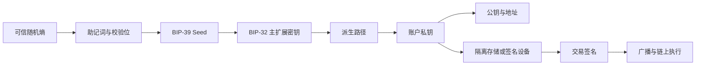
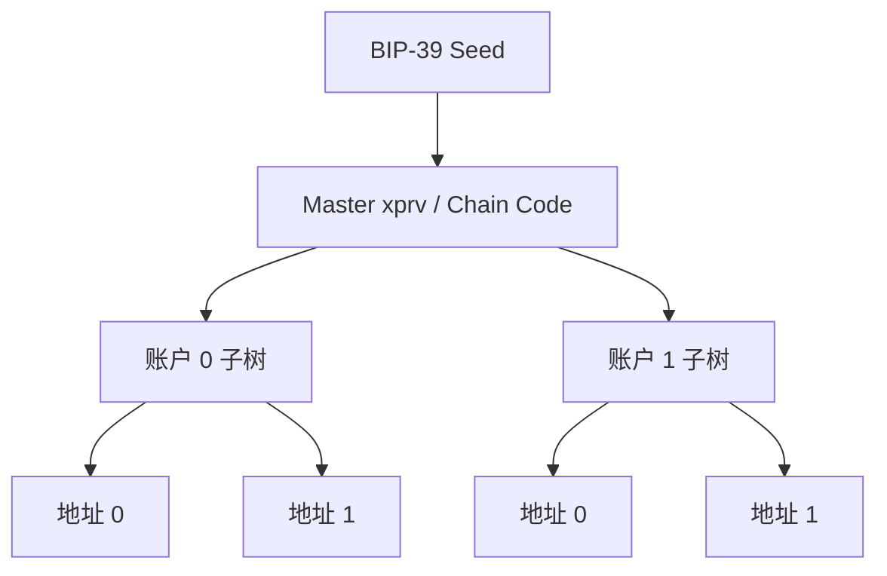
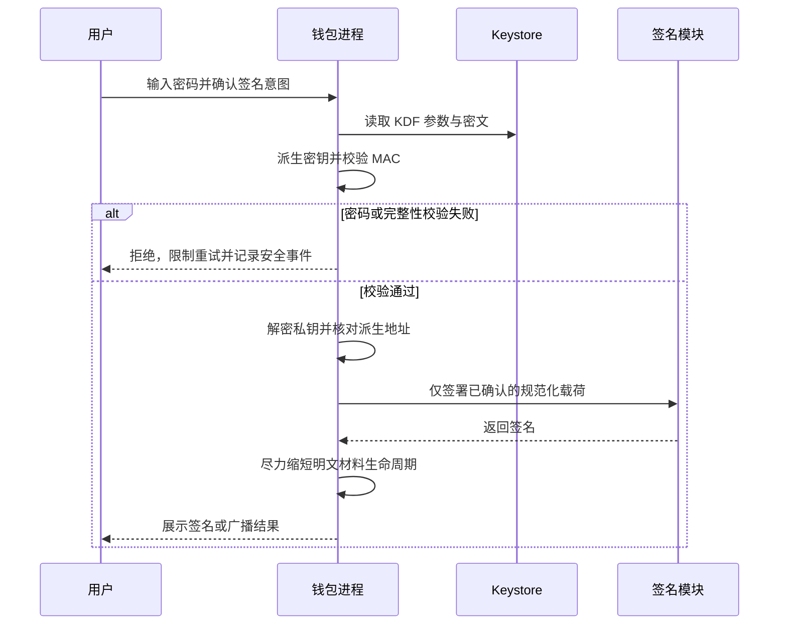
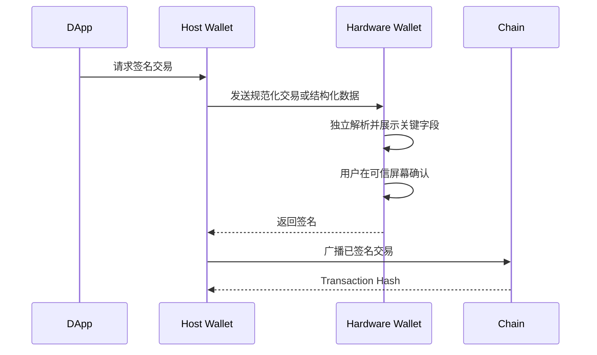
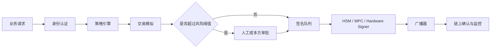

# Web3 Key Management：从助记词、HD Wallet 到硬件隔离与密钥轮换

> 钱包首先是密钥系统，其次才是账户余额和交易界面。真正需要保护的不是某个地址，而是从熵、助记词、种子、扩展密钥到签名设备的整条控制链。只加密一个私钥文件，无法解决错误备份、派生路径丢失、恶意签名、供应链攻击和恢复流程失效。

---

## 一、本文解决什么问题

同一个钱包可以在多台设备恢复出多个账户，看起来像“12 个单词生成很多私钥”。这句话方向正确，却省略了几个决定工程安全的环节：

- 助记词如何携带随机熵与校验位？
- `BIP-39` 的助记词如何变成二进制 Seed？
- `BIP-32` 如何从一个 Seed 派生出一棵密钥树？
- `BIP-44` 为什么还要约定路径结构？
- 为什么同一组助记词导入不同钱包后，可能看不到原账户？
- Keystore 的密码加密解决了什么，又没有解决什么？
- 硬件钱包为什么仍可能签下恶意交易？
- iOS Secure Enclave、Android Keystore 能否直接替代 Ethereum 私钥？
- 备份助记词、备份 Keystore 和备份硬件设备有什么差别？
- 私钥泄露后，能否在保持 EOA 地址不变的情况下轮换密钥？

本文面向钱包、DApp、托管服务和协议运维工程。重点不是实现一套自研密码学，而是建立可验证的密钥生命周期：



任何一环被替换、泄露或不可恢复，最终都可能表现为资产控制权丢失。

### 核心结论

1. `BIP-39` 负责“助记词到 Seed”，`BIP-32` 负责“Seed 到分层确定性密钥树”，`BIP-44` 负责“派生路径的账户组织约定”，三者不能混为一谈。
2. 助记词不是普通密码。知道助记词通常足以重建整棵密钥树；可选 Passphrase 也是恢复材料的一部分，丢失后没有重置入口。
3. HD Wallet 降低了多账户备份成本，也扩大了根秘密泄露的影响范围。
4. Keystore 保护静态私钥文件，不会自动防止弱密码、运行时内存窃取、钓鱼签名和已解锁进程被控制。
5. 硬件钱包隔离私钥，但安全边界延伸到固件、屏幕确认、主机编码、恢复材料和供应链。
6. 平台安全硬件提供“不可导出密钥”和本地授权能力，但算法支持与导入能力因平台、设备和版本而异，不能默认支持 Ethereum 使用的 `secp256k1`。
7. EOA 地址由公钥决定，换私钥就会换地址。保持地址不变的密钥轮换需要智能账户、多签或其他可更新授权层。

---

## 二、先区分钱包、账户、地址与密钥

### 2.1 私钥不是“登录密码”

Ethereum 外部拥有账户（Externally Owned Account，EOA）的控制权来自私钥签名。密码通常可以通过服务端流程重置，私钥却没有中央恢复机构。

对于常见 EOA，可简化理解为：

```text
private key
  -> secp256k1 public key
  -> Keccak-256(uncompressed public key without prefix)
  -> last 20 bytes
  -> Ethereum address
```

地址不是私钥的加密结果，也不能从地址反推出私钥。地址校验大小写通常按 `EIP-55` 等约定处理，但大小写校验不改变账户本身。

### 2.2 钱包是密钥和签名策略的容器

“钱包”可能指：

- 保存一个私钥的应用；
- 从一个 Seed 派生多个账户的 HD Wallet；
- 只保存公钥、不能签名的 Watch-only Wallet；
- 通过硬件设备完成签名的软件界面；
- 多签或智能账户的控制客户端；
- 托管机构的 HSM、MPC 和审批系统。

因此，评审钱包安全时不能只问“私钥存在哪里”，还要问：

- 谁能发起签名？
- 签名前用户能验证什么？
- 哪些策略可以拒绝签名？
- 备份能恢复哪些账户和元数据？
- 泄露后是否存在撤销和迁移路径？

### 2.3 控制链比单一秘密更重要

一个生产钱包的控制链通常包括：

| 对象 | 作用 | 泄露或丢失后果 |
|---|---|---|
| 原始熵 | 生成助记词 | 可重建全部派生密钥 |
| 助记词 | 人类可抄录的熵编码 | 通常可重建全部派生密钥 |
| Passphrase | 参与 BIP-39 Seed 推导 | 泄露会降低隔离效果，丢失会产生不可恢复的另一棵树 |
| 扩展私钥 `xprv` | 派生某个子树的私钥 | 该子树下账户失陷 |
| 扩展公钥 `xpub` | 派生非硬化公钥与观察地址 | 隐私泄露；错误组合下还可能危及父私钥 |
| 单账户私钥 | 控制一个 EOA | 对应账户失陷 |
| 派生路径 | 定位账户 | 不一定泄露资金，但丢失会造成“恢复后找不到账户” |
| Keystore 密码 | 解密本地私钥 | 与 Keystore 文件同时泄露时可被离线猜测 |
| 设备 PIN | 限制设备本地使用 | 不是助记词的替代备份 |

---

## 三、Seed Phrase 与 BIP-39

### 3.1 助记词是带校验位的熵编码

`BIP-39` 定义了如何把特定长度的初始熵编码为单词序列。它不是“随机挑 12 个单词”。

初始熵 `ENT` 可取 128、160、192、224 或 256 bit。校验位长度为：

```text
CS = ENT / 32
```

把熵的 SHA-256 哈希前 `CS` bit 追加到原始熵，再每 11 bit 映射到一个 2048 项词表中的单词：

```text
MS = (ENT + CS) / 11
```

因此会得到 12、15、18、21 或 24 个单词。例如 128 bit 熵加 4 bit 校验位，总计 132 bit，对应 12 个单词。

> 校验位只能发现一部分抄写错误，不是攻击者无法猜测助记词的安全证明。安全性根本上取决于初始熵的质量与保密性。

### 3.2 助记词如何变成 Seed

`BIP-39` 使用 `PBKDF2-HMAC-SHA512` 推导 512 bit Seed：

```text
password = UTF-8 NFKD(mnemonic)
salt     = UTF-8 NFKD("mnemonic" + passphrase)
rounds   = 2048
output   = 64 bytes
```

这里有三个工程边界：

1. Passphrase 不是助记词的校验密码。任意 Passphrase 都会生成一棵确定的密钥树，输入错误通常不会收到“密码错误”。
2. 空 Passphrase 也是明确输入。钱包恢复时必须知道原来是否使用了 Passphrase。
3. 2048 轮是标准兼容参数，不应擅自修改，否则会失去跨钱包恢复兼容性；也不能把它理解为现代密码存储中足以抵御所有弱口令猜测的通用参数。

### 3.3 Passphrase 的收益与代价

Passphrase 可以把同一组助记词映射到多个相互独立的 Seed，常被称为“第 13/25 个词”，但它实际上不受 BIP-39 词表限制。

它可以降低纸质助记词单点泄露的风险，但会带来：

- 拼写、大小写、空格和 Unicode 规范化导致的恢复风险；
- 家属或团队只拿到助记词却无法恢复的可用性风险；
- 钓鱼界面诱导用户输入助记词和 Passphrase 的风险；
- 每个 Passphrase 都产生有效钱包，无法通过“地址为空”可靠判断输入是否正确。

高价值场景应把 Passphrase 作为独立恢复要素管理，并用小额、离线、重复恢复演练验证。

### 3.4 不要自行生成助记词

以下方式都不安全：

```javascript
// 错误示例：Math.random() 不适合生成密码学密钥材料。
const words = Array.from({ length: 12 }, () =>
  wordlist[Math.floor(Math.random() * wordlist.length)]
);
```

问题包括非密码学随机源、没有按规范生成校验位、运行环境可能被注入，以及生成结果可能进入日志或剪贴板。

正确策略是使用经过审计的钱包实现、硬件钱包内置随机源，或成熟密码库调用操作系统的 CSPRNG（Cryptographically Secure Pseudorandom Number Generator）。应用层不应自创熵混合算法。

### 3.5 BIP-39 的兼容边界

`BIP-39` 是广泛采用的行业方案，但“钱包支持助记词”不等于一定使用 BIP-39。导入前需要确认：

- 助记词标准和语言词表；
- 是否使用 Passphrase；
- 下游派生算法；
- Coin Type 与派生路径；
- 目标链使用的曲线和地址编码。

恢复流程必须用原钱包公开文档和测试账户验证，不能只凭单词数量判断。

---

## 四、BIP-32 与 HD Wallet

### 4.1 为什么需要分层确定性钱包

早期随机钱包需要分别备份每个新私钥。分层确定性钱包（Hierarchical Deterministic Wallet，HD Wallet）从一个 Seed 确定性派生大量子密钥，使一次根备份可以恢复整个账户树。



收益是备份简化、账户分组和 Watch-only 派生；代价是根秘密一旦泄露，历史与未来派生账户可能同时失陷。

### 4.2 扩展密钥不只有密钥本身

`BIP-32` 扩展私钥由私钥和 256 bit Chain Code 等信息组成。Chain Code 参与子密钥派生，用于区分树结构；它不是公开地址，也不应被当成无关元数据丢弃。

扩展公钥包含公钥和 Chain Code，可在非硬化分支上派生子公钥，因此适合：

- 服务器生成收款地址但不持有支出私钥；
- 会计系统观察一组账户；
- 冷热端分离地址生成和签名。

但 `xpub` 会暴露整条可观察子树的地址关联，属于敏感隐私数据，不应公开。

### 4.3 普通派生与硬化派生

派生索引分为：

- 普通（Non-hardened）子密钥：索引 `< 2³¹`；
- 硬化（Hardened）子密钥：通常写作 `i'`、`ih`，内部索引为 `i + 2³¹`。

普通派生允许从父扩展公钥派生子公钥，便于 Watch-only 系统。硬化派生需要父私钥参与，隔离性更强，但不能只靠父 `xpub` 派生。

一个关键风险是：如果攻击者同时获得某父级扩展公钥和该父级下某个普通派生子私钥，可推导父私钥。工程上不能把 `xpub` 当成完全无害的数据，也不能在可能暴露子私钥的边界随意使用普通派生。

### 4.4 序列化前缀不是万能链标识

常见 `xprv`、`xpub` 是扩展密钥的 Base58Check 序列化表示。不同生态还存在其他版本前缀。前缀表达的是序列化版本和网络约定，不足以单独证明：

- 具体资产类型；
- 完整派生路径；
- 地址格式；
- 当前密钥来自哪个钱包或哪个账户层级。

导入扩展密钥前必须同步路径和用途元数据。

---

## 五、BIP-44 与 Derivation Path

### 5.1 BIP-44 解决的是路径约定

`BIP-32` 提供一棵树，却没有规定每层表示什么。`BIP-44` 给出多币种、多账户结构：

```text
m / purpose' / coin_type' / account' / change / address_index
```

各层含义是：

| 层级 | 含义 | BIP-44 约定 |
|---|---|---|
| `purpose'` | 路径用途 | `44'` |
| `coin_type'` | 币种/网络类型 | 由登记表分配 |
| `account'` | 用户账户分组 | 硬化派生 |
| `change` | 外部收款或内部找零 | 非硬化派生 |
| `address_index` | 地址序号 | 非硬化派生 |

Ethereum Mainnet 常见路径为：

```text
m/44'/60'/0'/0/0
```

其中 `60'` 是 Ethereum 的 SLIP-0044 Coin Type。需要注意，Ethereum 账户模型没有 Bitcoin UTXO 钱包同样的“找零地址”语义，但许多钱包仍沿用该层级组织地址。

### 5.2 路径不是密钥的一部分

同一个 Seed 配合不同路径会得到不同私钥和地址：

```text
m/44'/60'/0'/0/0
m/44'/60'/0'/0/1
m/44'/60'/1'/0/0
```

所以“助记词正确但余额为零”不一定表示资产丢失，可能是：

- Passphrase 不同；
- 派生路径不同；
- Account、Change 或 Index 不同；
- 钱包账户发现策略只扫描了有限范围；
- 选错网络或地址编码方案；
- 原钱包根本没有采用相同标准。

### 5.3 Account Discovery 与 Gap Limit

钱包恢复不能无限扫描地址。BIP-44 为基于交易历史的账户发现定义了相关过程和 Address Gap Limit，但 Ethereum 钱包的实际发现策略可能与 Bitcoin/UTXO 场景不同，也可能查询余额、交易历史或索引服务。

因此，不应把某钱包 UI 中“没有自动出现”当成私钥不存在。迁移前要记录：

- 标准和完整路径；
- 使用过的最高 Account/Index；
- 每个地址对应的链；
- 合约账户、ENS、Token 和授权等非密钥元数据。

### 5.4 路径输入必须结构化校验

钱包不应通过脆弱的字符串拼接接受任意路径。至少应校验：

- 是否以根节点 `m` 开始；
- 每层是否为合法无符号索引；
- Hardened 标记是否符合预期；
- 层数与用途是否在产品允许范围；
- 最终派生地址是否由用户或测试向量确认。

错误路径虽然通常不会泄露私钥，却可能导致资产发送到团队无法按既有流程恢复的地址。

---

## 六、Keystore：加密静态私钥

### 6.1 Keystore 解决什么问题

Ethereum 生态常见 Web3 Secret Storage Keystore 使用密码派生密钥，再加密私钥。常见 V3 结构包含：

- `cipher`：常见为 `aes-128-ctr`；
- `cipherparams`：例如初始化向量；
- `ciphertext`：私钥密文；
- `kdf`：常见为 `scrypt` 或 `pbkdf2`；
- `kdfparams`：Salt、成本参数和输出长度；
- `mac`：用于检测密码错误或密文篡改；
- `address`：便于标识账户。

常见 V3 MAC 计算基于派生密钥后半部分与密文的拼接再做 Keccak-256。实现时应使用成熟兼容库，不要凭文章描述重写格式。

### 6.2 Keystore 的威胁边界

Keystore 主要保护“磁盘上的私钥文件被复制”。它不自动防御：

- 弱密码被离线暴力猜测；
- 解锁后私钥或派生密钥留在进程内存；
- 恶意依赖、调试工具或日志窃取明文；
- 用户对恶意交易或 Typed Data 主动签名；
- 已控制的钱包进程调用解锁后的签名能力；
- Keystore 文件与密码被同一渠道备份。

KDF 参数需要在目标设备上测量，平衡抗猜测成本与解锁延迟、内存占用和拒绝服务风险。不能脱离设备环境复制一个“最安全参数”。

### 6.3 地址字段不是可信认证依据

Keystore 外层元数据可能未被加密或未全部纳入完整性保护。读取文件后，应由解密得到的私钥重新计算公钥和地址，再核对预期账户。不能仅凭 JSON 中的 `address` 决定资金操作目标。

### 6.4 安全解锁流程



托管服务还应将解锁、审批和广播分离，限制单个进程长期持有可任意签名的明文密钥。

---

## 七、Hardware Wallet：隔离私钥，不替用户理解交易

### 7.1 核心安全属性

硬件钱包通常让私钥在设备内部生成并留在受控环境中，主机只发送待签名数据，设备返回签名。它缩小了主机恶意软件直接读取私钥的机会。

理想签名流程是：



真正关键的是设备能否独立展示用户需要验证的内容：目标地址、金额、网络、Token、合约方法和关键参数。

### 7.2 Blind Signing 风险

当设备无法解析合约调用，只显示哈希或“未知数据”时，用户确认的是一段不可理解的字节。这种 Blind Signing 会把安全性重新交给可能已被控制的主机。

常见风险包括：

- `approve` 或 Permit 授予过大额度；
- NFT `setApprovalForAll`；
- 伪装成登录的资产授权 Typed Data；
- 错误 Chain ID 或目标合约；
- 代理合约和批处理隐藏真实调用；
- 地址投毒诱导核对首尾字符。

硬件钱包不是“点确认就安全”。高价值操作应结合交易模拟、可信地址簿、合约 Allowlist、独立屏幕核对和多人审批。

### 7.3 固件与供应链

需要验证：

- 设备来源和防拆封流程；
- 固件签名与升级渠道；
- 初始化是否由用户在设备上完成；
- 助记词是否由设备生成，而不是随包装预置；
- 恢复卡是否为空白；
- 产品是否公开安全模型、漏洞响应和版本支持策略。

任何“包装内已写好的助记词”都应视为已泄露。

### 7.4 设备丢失不等于资产丢失

如果恢复材料安全且流程兼容，设备损坏或遗失后可以在可信设备上恢复。相反，只有设备而没有可靠备份，会把硬件故障变成永久资产损失。

PIN 主要保护本地设备使用，Recovery Seed 才通常承载恢复能力。两者职责不能混淆。

---

## 八、Secure Enclave 与 Android Keystore

### 8.1 平台安全硬件提供什么

iOS Keychain/Secure Enclave 与 Android Keystore/硬件支持的 KeyMint，可提供部分能力：

- 密钥材料不可导出或更难导出；
- 使用系统访问控制和设备解锁状态；
- 绑定生物识别或用户认证；
- 将密码学操作放在受保护执行环境；
- 在部分设备上提供硬件安全级别证明或 Attestation。

但“存入 Keychain/Keystore”与“密钥在安全硬件内生成且永不导出”不是同一件事。具体能力取决于 API、算法、设备、安全等级、系统版本和访问控制配置。

### 8.2 不要默认支持 secp256k1

Ethereum EOA 通常使用 `secp256k1`。Apple Secure Enclave 公开支持的密钥类型、Android Keystore 提供者支持的 EC 曲线及导入行为，并不等同于任意曲线的通用 HSM。

因此移动钱包常见设计可能是：

- 用平台硬件密钥保护一个数据加密密钥，再加密 Ethereum 私钥；
- 使用系统 Keychain/Keystore 保存包装密钥或密文；
- 将签名交给外部硬件钱包；
- 使用智能账户，让平台支持的 Passkey/P-256 等凭证经过链上验证逻辑授权。

每种设计的安全边界不同。选型前必须查看目标 OS 和设备当前官方文档，并在真实设备验证算法、认证、备份、迁移与失效行为。

### 8.3 生物识别不是密钥备份

Face ID、Touch ID 或 Android BiometricPrompt 是本地授权手段，不会替代恢复材料。还要处理：

- 用户新增或删除生物特征后密钥是否失效；
- 锁屏密码变化后的行为；
- 设备迁移和云备份是否包含相关条目；
- App 重装、系统升级和安全硬件重置；
- 认证有效期是否允许后台重复签名；
- Root/Jailbreak 环境的风险策略。

不能用“调用了生物识别 API”直接推出“私钥硬件级安全”。

### 8.4 移动端日志与生命周期

钱包应用必须避免将助记词、私钥、完整签名载荷或解密错误细节写入：

- Crash Report；
- Analytics；
- 系统日志；
- 剪贴板历史；
- UI 截图和任务预览；
- 调试备份与自动化测试产物。

应用进入后台时应隐藏敏感界面、取消不再需要的签名会话，并按威胁模型缩短解锁状态，而不是假设进程暂停就等于内存清除。

---

## 九、Key Backup：备份的是可恢复能力

### 9.1 先定义恢复目标

不同钱包需要恢复的对象不同：

- EOA：助记词/私钥、Passphrase、派生路径；
- 硬件钱包：恢复材料、兼容设备与操作说明；
- 多签：各 Signer 的独立恢复材料、阈值和合约地址；
- 智能账户：Owner、Guardian、模块、EntryPoint/实现版本等上下文；
- 托管系统：HSM Backup、M-of-N 操作员、策略配置、审计记录和灾备环境。

只备份助记词不一定能恢复完整产品状态，例如联系人、Token 列表、交易备注和智能账户模块通常不在 BIP-39 Seed 中。

### 9.2 备份策略的基本原则

1. **离线**：高价值根秘密避免进入联网笔记、邮件、网盘和相册。
2. **冗余**：防止火灾、进水、介质老化和单地点灾害。
3. **分离**：助记词、Passphrase、操作说明不应全部放在同一位置。
4. **最小知情**：人员只接触完成职责所需的材料。
5. **防篡改**：能发现材料被访问或替换。
6. **可继承**：人员离职、失能或死亡时有明确授权流程。
7. **可演练**：备份未经恢复测试，只是未经验证的假设。

### 9.3 分片不是随意拆单词

把 12 个单词分成三份，每份保存 8 个且互有重叠，看似增加安全性，实际会产生难以量化的熵损失、组合泄露与恢复错误。

如需门限备份，应采用经过评审的 Secret Sharing 或标准化方案，并明确：

- 阈值与总份数；
- 每份泄露的风险；
- 元数据和版本标识；
- 实现兼容性；
- 持有人失联时的恢复概率；
- 定期重分片和销毁旧份额的流程。

门限备份不等于门限签名。恢复时重构完整秘密，仍可能在恢复设备上形成单点暴露。

### 9.4 恢复演练

安全演练应使用隔离环境和小额测试账户，而不是频繁在联网设备输入生产助记词。至少验证：

```text
[ ] 助记词顺序、语言与校验位正确
[ ] Passphrase 可由授权人员准确获得
[ ] 钱包实现和派生路径已记录
[ ] 能派生出预期地址，而不只是“导入成功”
[ ] 多签阈值在人员缺席场景仍可满足
[ ] 旧设备丢失后可以撤销会话与授权
[ ] 恢复流程不会把秘密写入日志、截图或云备份
[ ] 演练结束后测试设备和临时材料按流程清理
```

### 9.5 备份的保密性与可用性冲突

备份越集中越容易恢复，也越容易被一次窃取；拆分越复杂，越可能在真正事故时无法凑齐。策略应根据资产规模、人员稳定性、恢复时间目标和法律继承要求设计，不存在适合所有用户的固定份数。

---

## 十、Key Rotation 的真实边界

### 10.1 EOA 无法原地换私钥

EOA 地址由公钥派生。更换私钥意味着生成不同公钥和不同地址，因此不存在类似 Web2 密码的“保持账户不变并重置私钥”。

EOA 轮换实际上是迁移：


如果旧私钥已经泄露，迁移交易可能被攻击者抢跑。此时应按事故响应流程处理，而不是把它视为普通运维轮换。

### 10.2 轮换不只是转余额

必须盘点旧地址拥有的全部能力：

- 原生资产、ERC-20、NFT 和 LP Position；
- Token Allowance、Permit 和 Operator Approval；
- 合约 Owner、Role、Guardian、Pauser、Upgrader；
- Multisig Signer 与 Threshold；
- Timelock Proposer、Executor、Canceller；
- ENS Controller、Resolver 与域名记录；
- Bridge、Relayer、Keeper、Oracle Reporter；
- API Session、WalletConnect Session 和 DApp 授权；
- 离线签名、排队交易和待执行治理操作；
- 多链、L2、侧链和测试环境中的同源地址。

私钥轮换不会自动撤销已经签发且仍有效的链下授权。协议必须依靠 Nonce、Deadline、Domain Separation、Session Registry 或合约级撤销机制控制其有效性。

### 10.3 智能账户提供授权层轮换

智能账户或多签把“账户身份/资产地址”与某一个 EOA 私钥解耦。合约可以在满足治理规则后：

- 添加新 Owner；
- 删除失陷 Owner；
- 调整阈值；
- 启用 Guardian 或 Social Recovery；
- 限制 Session Key 的权限和有效期；
- 在不迁移资产地址的情况下更新验证逻辑。

代价是引入合约漏洞、升级治理、恢复劫持、Gas、可用性和实现版本依赖。可轮换不代表无风险，恢复入口本身通常是最高价值攻击面。

### 10.4 定期轮换不一定降低风险

对离线根密钥，频繁导出、恢复和迁移可能增加暴露机会与操作错误。是否定期轮换应基于：

- 密钥是否在线；
- 使用频率与权限；
- 人员变更；
- 设备寿命和供应商支持；
- 是否发生疑似泄露；
- 是否能无损撤销旧能力；
- 轮换过程自身的风险。

高频热签名密钥通常需要更短生命周期和额度限制；离线根密钥更强调隔离、备份演练和紧急替换能力。

---

## 十一、工程架构：按风险拆分密钥

### 11.1 不要让一个密钥承担所有职责

生产系统应按影响范围拆分：

| 密钥角色 | 典型能力 | 建议控制 |
|---|---|---|
| Cold Root | 最终治理或恢复 | 离线、多方、极低频使用 |
| Upgrade/Governance | 升级与参数变更 | Multisig + Timelock + 模拟 |
| Guardian | 暂停或收缩权限 | 只能降低风险，恢复需更高门槛 |
| Treasury | 大额资金 | 多签、限额、地址簿、延迟 |
| Hot Relayer | 高频链上提交 | 小余额、限权、自动轮换 |
| Oracle/Keeper | 报价或自动执行 | 业务范围限制、异常检测 |
| Session Key | 临时交互 | 方法、金额、时间和目标限制 |

这样即使热密钥泄露，攻击者也不能直接升级协议或转走全部资金。

### 11.2 签名服务的数据流



签名器只应接收经过规范化、带业务上下文的请求。策略至少可以限制 Chain ID、目标合约、函数选择器、金额、Nonce、Gas 上限和时间窗口。

### 11.3 HSM、MPC 与硬件钱包不是同义词

- Hardware Wallet 面向用户交互，强调设备屏幕确认和便携恢复；
- HSM（Hardware Security Module）面向服务端密钥生成、访问控制、审计和高可用；
- MPC/Threshold Signing 将签名能力分散到多方，目标是不在单点重构完整私钥。

具体产品是否支持 `secp256k1`、Ethereum 签名格式、确定性 Nonce、恢复和审计，需要按实现验证。不能因为产品写着“硬件级”或“MPC”就跳过威胁建模。

---

## 十二、常见错误案例

### 12.1 截图保存助记词

截图可能同步到云端、进入系统备份、被相册 OCR 索引或被其他应用读取。恢复材料应按离线策略保存。

### 12.2 把助记词粘贴进网页检查余额

查询余额只需要地址或 `xpub` 的适当观察能力，不需要根私钥。任何要求输入助记词的普通网页都应视为高风险。

### 12.3 认为 24 个词一定比 12 个词更安全

在规范生成且未泄露的前提下，更多熵提供更高理论强度；现实事故通常来自钓鱼、恶意签名、备份泄露和实现缺陷。不能用词数替代完整威胁模型。

### 12.4 只备份 Keystore，不记录密码

强加密下，忘记密码通常无法恢复。反过来，只记密码而丢失 Keystore 文件也没有作用。

### 12.5 公开 xpub 认为没有风险

`xpub` 虽不能直接在正常条件下签名，却会暴露地址关联和交易隐私；与普通派生子私钥组合还可能危及父私钥。

### 12.6 硬件钱包上盲签

设备隔离私钥不代表待签内容可信。无法解析的数据必须通过独立模拟、合约核验和审批补足。

### 12.7 在 Secure Enclave 中保存助记词就宣称不可导出

平台可能只是保护包装密钥，Ethereum 私钥仍需在应用内存解密后签名。必须说明密钥在哪一步以明文出现。

### 12.8 轮换后只清空旧地址余额

旧地址可能仍是管理员、Operator 或有效签名授权者。应按能力清单完成撤销，并持续监控延迟生效的操作。

### 12.9 自研助记词和派生算法

自定义算法会增加随机性、兼容性和审计风险。除非确有协议级需求，应使用成熟标准和经过维护的密码库。

---

## 十三、测试与验证方法

### 13.1 使用标准测试向量

实现 BIP-39、BIP-32 时，应使用对应规范发布的测试向量验证：

- 熵到助记词；
- 助记词与 Passphrase 到 Seed；
- Master Key 与各级 Child Key；
- Hardened/Non-hardened 边界；
- 扩展密钥序列化与反序列化。

不要只做“生成后自己再导入”的闭环测试，因为编码和解码可能共享同一个错误。

### 13.2 跨实现恢复测试

使用无生产资产的测试 Seed，在至少两个独立实现中核对：

```text
Seed + Passphrase + Derivation Path
  -> Private Key
  -> Public Key
  -> Address
```

四类输入必须全部记录。只核对助记词而忽略 Passphrase 和路径，无法证明兼容。

### 13.3 Keystore 测试

至少覆盖：

- 正确密码解密并核对地址；
- 错误密码拒绝；
- Ciphertext、Salt、IV、MAC 被篡改时拒绝；
- 极端 KDF 参数不会造成未受控资源耗尽；
- 密码包含 Unicode 时规范化行为一致；
- 失败日志不包含密码、私钥和派生密钥；
- 目标移动设备上的解锁耗时与内存经过实测。

性能结论应注明设备、系统、构建模式、KDF 参数和测量分位数，不能引用脱离环境的固定数字。

### 13.4 签名策略测试

对签名服务进行属性测试或 Fuzz：

- 非允许 Chain ID 必须拒绝；
- 非允许合约和函数必须拒绝；
- 金额、频率、Deadline 超限必须拒绝；
- 模拟结果与实际交易字段不一致必须拒绝；
- Nonce 冲突、Replacement 和 Reorg 有明确处理；
- 审批内容与最终签名字节一致，防止 TOCTOU（检查与使用时差）问题。

### 13.5 恢复与失陷演练

每次演练都应有明确通过条件：

```text
场景：主 Treasury Signer 疑似泄露

1. 在资产和权限清单中定位全部链上角色
2. 使用未失陷阈值撤销旧 Signer
3. 检查排队交易、离线签名和 Session
4. 验证新 Signer 的备份与独立签名
5. 核对所有链、L2 和测试环境
6. 监控旧地址后续交易和授权使用
7. 保存证据并更新 Runbook
```

演练不应直接暴露生产助记词，也不应为了测试而绕过正常审批。

---

## 十四、方案选择

| 场景 | 合理起点 | 主要代价 |
|---|---|---|
| 个人小额热钱包 | OS 安全存储 + 加密私钥 + 明确备份 | 设备失陷与钓鱼签名 |
| 个人长期大额 | 硬件钱包 + 离线恢复材料 | 设备供应链、恢复复杂度 |
| 团队 Treasury | 多签 + 独立硬件 Signer + 审批流程 | 协调成本与可用性 |
| 高频自动化 | 限权热密钥/HSM + 额度和目标限制 | 基础设施与策略复杂度 |
| 协议治理 | 多签 + Timelock + Guardian 分权 | 响应速度与治理成本 |
| 面向用户的可恢复账户 | 智能账户 + Guardian/Passkey/Session Key | 合约和恢复机制攻击面 |

选择时至少比较：

- 单点泄露的最大损失；
- 单点丢失是否可恢复；
- 日常签名频率；
- 用户能否理解设备显示；
- 团队成员和设备失联概率；
- 跨链、离线和灾难恢复要求；
- 轮换、撤销和审计能力；
- 引入的合约、服务商与供应链信任。

---

## 十五、上线检查清单

```text
[ ] 密钥由可信 CSPRNG 或受评审设备生成
[ ] 从未通过日志、截图、剪贴板或 Analytics 传输根秘密
[ ] 明确助记词标准、Passphrase 和完整派生路径
[ ] 用独立实现核对过预期地址
[ ] Keystore 使用成熟库，并在目标设备测量 KDF
[ ] 解密后重新计算并核对账户地址
[ ] 私钥明文生命周期和进程边界有清晰说明
[ ] 硬件签名能展示关键交易字段，盲签有补偿控制
[ ] 平台安全硬件的算法和不可导出属性已在真机验证
[ ] 备份与 Passphrase 分离，且完成过恢复演练
[ ] 高权限、资金、自动化和应急密钥已经分权
[ ] 维护全链、全角色、全授权的资产与权限清单
[ ] EOA 迁移包含 Role、Allowance、Session 和离线签名
[ ] 智能账户恢复入口有延迟、限权、通知和撤销设计
[ ] 密钥泄露 Runbook 已在非生产环境演练
```

---

## 十六、总结

Key Management 的目标不是让私钥“永远不出现”，而是在完整生命周期中控制谁能生成、持有、使用、备份、恢复和撤销签名能力。

真正需要记住的是：

1. `BIP-39`、`BIP-32`、`BIP-44` 分别解决助记词、密钥树和路径组织问题。
2. 恢复账户需要的不只是助记词，还可能包括 Passphrase、派生路径、实现兼容性和账户元数据。
3. HD Wallet 简化备份，但根秘密和扩展密钥会扩大失陷范围。
4. Keystore 主要保护静态文件；硬件钱包主要隔离私钥；二者都不能替代交易意图验证。
5. Secure Enclave/Keystore 的具体算法和硬件属性必须按平台与设备验证，不能从 API 名称推断。
6. 备份必须经过恢复演练，未测试的备份不能视为可用。
7. EOA 不能原地轮换私钥，轮换是全能力迁移；智能账户可以轮换授权，但会引入新的恢复和合约风险。

密钥安全最终是一项系统工程：密码学决定“签名是否有效”，架构和流程决定“错误的人是否有机会签出一笔同样有效的交易”。

---

## 问答复盘

### Q1：BIP-39、BIP-32 与 BIP-44 的职责有什么区别？

**答：** BIP-39 把熵编码为助记词并推导 Seed；BIP-32 从 Seed 构造分层确定性密钥树；BIP-44 约定树中各层表示币种、账户和地址索引。三者是连续但独立的规范层。

### Q2：拥有助记词后，为什么仍可能恢复不出原地址？

**答：** 还可能缺少正确 Passphrase、派生路径、钱包算法或账户索引。助记词只解决根输入的一部分，不携带所有钱包元数据。

### Q3：xpub 不能签名，是否可以公开？

**答：** 不建议。它会暴露一个非硬化子树的地址关联和交易隐私；若再泄露该层某个普通派生子私钥，还可能推导父私钥。

### Q4：Keystore 文件为什么不能替代硬件钱包？

**答：** Keystore 主要加密磁盘上的私钥，解锁时仍可能在普通进程内存出现。硬件钱包的目标是让私钥留在隔离设备内完成签名，但它仍需防范盲签和供应链风险。

### Q5：把 Ethereum 私钥放入 iOS Secure Enclave 或 Android Keystore 是否一定可行？

**答：** 不一定。平台、设备和版本支持的算法及导入能力不同，不能默认原生支持 `secp256k1`。必须查阅当前官方文档并在目标真机验证实际密钥路径。

### Q6：为什么硬件钱包无法阻止所有钓鱼攻击？

**答：** 它能隔离私钥，却不能替用户理解恶意授权。若设备不能完整解析并展示目标、金额和方法，用户仍可能对攻击者构造的有效交易签名。

### Q7：普通 EOA 可以在地址不变的情况下轮换私钥吗？

**答：** 不可以。EOA 地址由公钥派生，换私钥会换地址。保持地址不变的授权轮换需要多签或智能账户等额外授权层。

### Q8：私钥迁移时只转走余额是否足够？

**答：** 不足。还要撤销合约角色、Token Allowance、Operator、Session、离线签名和排队操作，并覆盖所有链与 L2。

### Q9：备份为什么必须做恢复演练？

**答：** 因为介质可读不等于能恢复预期账户。演练可以发现单词顺序、Passphrase、路径、实现兼容性和多方可用性问题，但应使用隔离的小额测试材料。

### Q10：生产系统为何要拆分 Treasury、Guardian 与 Hot Relayer 密钥？

**答：** 为了限制单点泄露的最大影响。高频热密钥只应拥有有限业务能力，暂停、升级和大额资金操作应由不同角色与更高门槛控制。

---

## 延伸知识

- **Wallet Connection**：EIP-1193、WalletConnect Session、账户切换与移动端 Deep Link。
- **Transaction Signing**：Typed Transaction、Nonce、Gas 估算、模拟、Replacement 与 Reorg。
- **Account Abstraction**：Smart Account、EntryPoint、Session Key、Paymaster 与 Social Recovery。
- **签名安全**：EIP-712、Domain Separation、Nonce、Deadline 与跨链重放。
- **权限模型与应急响应**：Multisig、Timelock、Guardian、密钥泄露处置与恢复门禁。
